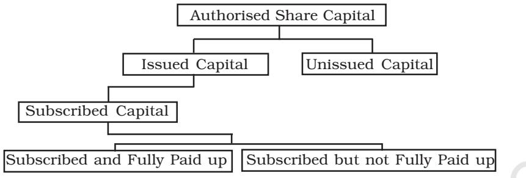

#### **LEARNING OBJECTIVES**

*After studying this chapter, you will be able to :*

- *explain the basic nature of a joint stock company as a form of business organisation and the various kinds of companies based on liability of their members;*
- *describe the types of shares issued by a company;*
- *explain the accounting treatment of shares issued at par, at premium and at discount including oversubsription;*
- *outline the accounting for forfeiture of shares and reissue of forfeited shares under varying situations;*
- *workout the amounts to be transferred to capital reserve when forfeited shares are reissued; and prepare share forfeited account ;*

A company form of organisation is the third stage in the evolution of forms of organisation. Its capital is contributed by a large number of persons called shareholders who are the real owners of the company. But neither it is possible for all of them to participate in the management of the company nor considered desirable. Therefore, they elect a Board of Directors as their representative to manage the affairs of the company. In fact, all the affairs of the company are governed by the provisions of the Companies Act, 2013. A company means a company incorporated or registered under the Companies Act, 2013 or under any other earlier Companies Acts. According to Chief Justice Marshal, "a company is a person, artificial, invisible, intangible and existing only in the eyes of law. Being a mere creation of law, it possesses only those properties which the charter of its creation confers upon it, either expressly or as incidental to its very existence".

A company usually raises its capital in the form of shares (called share capital) and debentures (debt capital.) This chapter deals with the accounting for share capital of companies.

# **1.1 Features of a Company**

A company may be viewed as an association of person who contribute money or money's worth to a common inventory and use it for a common purpose. It is an artificial person having corporate legal entity distinct from its members (shareholders) and has a common seal used for its signature. Thus, it has certain special features which distinguish it from the other forms of organisation. These are as follows:

- *Body Corporate:* A company is formed according to the provisions of Law enforced from time to time. Generally, in India, the companies are formed and registered under Companies Law except in the case of Banking and Insurance companies for which a separate Law is provided for.
- *Separate Legal Entity:* A company has a separate legal entity which is distinct and separate from its members. It can hold and deal with any type of property. It can enter into contracts and even open a bank account in its own name.
- *Limited Liability:* The liability of the members of the company is limited to the extent of unpaid amount of the shares held by them. In the case of the companies limited by guarantee, the liability of its members is limited to the extent of the guarantee given by them in the event of the company being wound up.
- *Perpetual Succession:* The company being an artificial person created by law continues to exist irrespective of the changes in its membership. A company can be terminated only through law. The death or insanity or insolvency of any member of the company in no way affects the existence of the company. Members may come and go but the company continues.
- *Common Seal:* The company being an artificial person, cannot sign its name by itself. Therefore, every company is required to have its own seal which acts as official signatures of the company. Any document which does not carry the common seal of the company is not binding on the company.
- *Transferability of Shares:* The shares of a public limited company are freely transferable. The permission of the company or the consent of any member of the company is not necessary for the transfer of shares. But the Articles of the company can prescribe the manner in which the transfer of shares will be made.
- *May Sue or be Sued:* A company being a legal person can enter into contracts and can enforce the contractual rights against others. It can sue and be sued in its name if there is a breach of contract by the company.

# **1.2 Kinds of Companies**

Companies can be classified either on the basis of the liability of its members or on the basis of the number of members. On the basis of liability of its members the companies can be classified into the following three categories:

- (i) *Companies Limited by Shares:* In this case, the liability of its members is limited to the extent of the nominal value of shares held by them. If a member has paid the full amount of the shares, there is no liability on his part whatsoever may be for the debts of the company. He need not pay a single paise from his private property. However, if there is
any liability involved, it can be enforced during the existence of the company as well as during the winding up.

- (ii) *Companies Limited by Guarantee:* In this case, the liability of its members is limited to the amount they undertake to contribute in the event of the company being wound up. Thus, the liability of the members will arise only in the event of its winding up.
- (iii) *Unlimited Companies:* When there is no limit on the liability of its members, the company is called an unlimited company. When the company's property is not sufficient to pay off its debts, the private property of its members can be used for the purpose. In other words, the creditors can claim their dues from its members. Such companies are not found in India even though permitted by the Companies Act.

On the basis of the number of members, companies can be divided into three categories as follows:

- (i) *Public Company*: A public company means a company which (a) is not a private company; (b) is a company which is not a subsidiary of a private company.
- (ii) *Private Company*: A private company is one which by its articles of association:
	- (a) Restricts the right to transfer its shares;
	- (b) A private company must have at least 2 persons, except in case of one person company;
	- (c) Limits the number of its members to 200 (excluding its employees);
- (iii) *One Person Company (OPC)*: Sec. 2 (62) of the companies Act, 2013, defines OPC as a "company which has only one person as a member". Rule 3 of the Companies (Incorporation) Rules, 2014 provides that:
	- (a) Only a natural person being an Indian citizen and resident in India can form one person company,
	- (b) It cannot carry out non-banking financial investment activities.
	- (c) Its paid up share capital is not more than Rs. 50 Lakhs
	- (d) Its average annual turnover of three years does not exceed Rs. 2 Crores.

# **1.3 Share Capital of a Company**

A company, being an artificial person, cannot generate its own capital which has necessarily to be collected from several persons. These persons are known as shareholders and the amount contributed by them is called share capital. Since the number of shareholders is very very large, a separate capital account cannot be opened for each one of them. Hence, innumerable streams of capital contribution merge their identities in a common capital account called as 'Share Capital Account'.

# *1.3.1 Categories of Share Capital*

From accounting point of view the share capital of the company can be classified as follows:

- *Authorised Capital:* Authorised capital is the amount of share capital which a company is authorised to issue by its Memorandum of Association. The company cannot raise more than the amount of capital as specified in the Memorandum of Association. It is also called Nominal or Registered capital. The authorised capital can be increased or decreased as per the procedure laid down in the Companies Act. It should be noted that the company need not issue the entire authorised capital for public subscription at a time. Depending upon its requirement, it may issue share capital but in any case, it should not be more than the amount of authorised capital.
- *Issued Capital:* It is that part of the authorised capital which is actually issued to the public for subscription including the shares allotted to vendors and the signatories to the company's memorandum. The authorised capital which is not offered for public subscription is known as 'unissued capital'. Unissued capital may be offered for public subscription at a later date.
- *Subscribed Capital:* It is that part of the issued capital which has been actually subscribed by the public. When the shares offered for public subscription are subscribed fully by the public the issued capital and subscribed capital would be the same. It may be noted that ultimately, the subscribed capital may be equal to or less than issued capital. In case the number of shares subscribed is less than what is offered, the company allots only the number of shares for which subscription has been received. In case it is higher than what is offered, the allotment will be equal to the offer. In other words, the fact of over subscription is not reflected in the books.
- *Called up Capital:* It is that part of the subscribed capital which has been called up on the shares, i.e., what the company has asked the shareholders to pay. The company may decide to call the entire amount or part of the face value of the shares, For example, if the face value (also called nominal value) of a share allotted is Rs. 10 and the company has called up only Rs. 7 per share, in that scenario, the called up capital is Rs. 7 per share. The remaining Rs. 3 may be collected from its shareholders as and when needed.
- *Paid up Capital:* It is that portion of the called up capital which has been actually received from the shareholders. When the shareholders have paid all the called amount, the called up capital is the same to the paid up capital. If any of the shareholders has not paid amount on calls, such an amount may be called as 'calls in arrears'. Therefore, paid up capital is equal to the called-up capital minus call in arrears.
- *Uncalled Capital:* That portion of the subscribed capital which has not yet been called up. As stated earlier, the company may collect this amount any time when it needs further funds.

- *Reserve Capital:* A company may reserve a portion of its uncalled capital to be called only in the event of winding up of the company. Such uncalled amount is called 'Reserve Capital' of the company. It is available only for the creditors on winding up of the company.


**Exhibit. 1.1 :** *Categories of Share Capital*

Let us take the following example and show how the share capital will be shown in the balance sheet. Sunrise Company Ltd., New Delhi, has registered its capital as Rs. 40,00,000, divided into 4,00,000 shares of Rs. 10 each. The company offered to the public for subscription of 2,00,000 shares of Rs. 10 each, to be received as Rs. 2 on application, Rs.3 on allotment, Rs.3 on first call and the balance on final call. The company received applications for 2,50,000 shares. The company finalised the allotment of 2,00,000 shares and rejected applications for 50,000 shares. The company did not make the final call. The company received all the amount except on 2,000 shares where call money has not been received. The above amounts will be shown in the Notes to Accounts of the balance sheet of Sunrise Company Ltd. as follows:

**Notes to Accounts**

| Share Capital |  | (Rs.) |
| --- | --- | --- |
| Authorised or Registered or Nominal Capital: |  |  |
| 4,00,000 Shares of Rs. 10 each |  | 40,00,000 |
| Issued Capital |  |  |
| 2,00,000 Shares of Rs. 10 each |  | 20,00,000 |
| Subscribed Capital |  |  |
| Subscribed but not fully paid up |  |  |
| 2,00,000 Shares of Rs. 10 each, Rs. 8 called up | 16,00,000 |  |
| Less : Calls in Arrears | (6,000) | 15,94,000 |

#### **1.4 Nature and Classes of Shares**

Shares, refer to the units into which the total share capital of a company is divided. Thus, a share is a fractional part of the share capital and forms the basis of ownership interest in a company. The persons who contribute money through shares are called shareholders.

The amount of authorised capital, together with the number of shares in which it is divided, is stated in the Memorandum of Association but the classes of shares in which the company's capital is to be divided, along with their respective rights and obligations, are prescribed by the Articles of Association of the company. As per The Companies Act, a company can issue two types of shares (1) preference shares, and (2) equity shares (also called ordinary shares).

# *1.4.1 Preference Shares*

According to Section 43 of The Companies Act, 2013, a preference share is one, which fulfils the following conditions :

- (a) That it carries a preferential right to dividend to be paid either as a fixed amount payable to preference shareholders or an amount calculated by a fixed rate of the nominal value of each share before any dividend is paid to the equity shareholders.
- (b) That with respect to capital it carries or will carry, on the winding up of the company, the preferential right to the repayment of capital before anything is paid to equity shareholders.

However, notwithstanding the above two conditions, a holder of the preference share may have a right to participate fully or to a limited extent in the surpluses of the company as specified in the Memorandum or Articles of the company. Thus, the preference shares can be participating and nonparticipating. Similarly, these shares can be cumulative or non-cumulative, and redeemable or irredeemable.

#### *1.4.2 Equity Shares*

According to Section 43 of The Companies Act, 2013, an equity share is a share which is not a preference share. In other words, shares which do not enjoy any preferential right in the payment of dividend or repayment of capital, are termed as equity/ordinary shares. The equity shareholders are entitled to share the distributable profits of the company after satisfying the dividend rights of the preference share holders. The dividend on equity shares is not fixed and it may vary from year to year depending upon the amount of profits available for distribution. The equity share capital may be (i) with voting rights; or (ii) with differential rights as to voting, dividend or otherwise in accordance with such rules and subject to such conditions as may be prescribed in the Articles of Association of the company.

| Test your Understanding – I |
| --- |

State which of the following statements are true :

- (a) A company is an artificial person.
- (b) Shareholders of a company are liable for the acts of the company.
- (c) Every member of a company is entitled to take part in its management.
- (d) Company's shares are generally transferable.
- (e) Share application account is a personal account.
- (f) The director of a company must be a shareholder.
- (g) Paid up capital can exceed called up capital.
- (h) Capital reserves are created from capital profits.
- (i) At the time of issue of shares, the maximum rate of securities premium is 10%.
- (j) The part of capital which is called up only on winding up is called reserve capital.

#### **1.5 Issue of Shares**

A salient characteristic of the capital of a company is that the amount on its shares can be gradually collected in easy instalments spread over a period of time depending upon its growing financial requirement. The first instalment is collected along with application and is thus, known as application money, the second on allotment (termed as allotment money), and the remaining instalments are termed as first call, second call and so on. The word final is suffixed to the last instalment. However, this in no way which prevents a company from calling the full amount on shares right at the time of application.

The important steps in the procedure of share issue are :

- *Issue of Prospectus:* The company first issues the prospectus to the public. Prospectus is an invitation to the public that a new company has come into existence and it needs funds for doing business. It contains complete information about the company and the manner in which the money is to be collected from the prospective investors.
- *Receipt of Applications:* When prospectus is issued to the public, prospective investors intending to subscribe the share capital of the company would make an application along with the application money

and deposit the same with a scheduled bank as specified in the prospectus. The company has to get minimum subscription within 120 days from the date of the issue of the prospectus. If the company fails to receive the same within the said period, the company cannot proceed for the allotment of shares and application money should be returned within 130 days of the date of issue of prospectus.

- *Allotment of Shares:* If minimum subscription has been received, the company may proceed for the allotment of shares after fulfilling certain other legal formalities. Letters of allotment are sent to those whom the shares have been alloted, and letters of regret to those to whom no allotment has been made. When allotment is made, it results in a valid contract between the company and the applicants who now became the shareholders of the company.
#### **Minimum Subscription**

The minimum amount that, in the opinion of directors, must be raised to meet the needs of business operations of the company relating to:

- the price of any property purchased, or to be purchased, which has to be met wholly or partly out of the proceeds of issue;
- preliminary expenses payable by the company and any commission payable in connection with the issue of shares;
- the repayment of any money borrowed by the company for the above two matters;
- working capital; and
- any other expenditure required for the usual conduct of business operations.

It is to be noted that 'minimum subscription' of capital cannot be less than 90% of the issued amount according to SEBI (Disclosure and Investor Protection) Guidelines, 2000 [6.3.8.1 and 6.3.8.2]. If this condition is not satisfied, the company shall forthwith refund the entire subscription amount received. If a delay occurs beyond 8 days from the date of closure of subscription list, the company shall be liable to pay the amount with interest at the rate of 15% [Section 73(2)].

Shares of a company are issued either at par or at a premium. Shares are to be issued at *par* when their issue price is exactly equal to their nominal value according to the terms and conditions of issue. When the shares of a company are issued more than its nominal value (face value), the excess amount is called premium.

Irrespective of the fact that shares are issued at par or at a premium, the share capital of a company as stated earlier, may be collected in instalments payable at different stages.

# **1.6 Accounting Treatment**

*On application :* The amount of money paid with various instalment represents the contribution to share capital and should ultimately be credited to share capital. However, for the sake of convenience, initially individual accounts are opened for each instalment. All money received along with application is deposited with a scheduled bank in a separate account opened for the purpose. The journal entry is as follows:

```
Bank A/c Dr.
    To Share Application A/c
(Amount received on application for — shares @ Rs. ______ per share)
```
*On allotment :* When minimum subscription has been received and certain legal formalities on the allotment of shares have been duly compiled with, the directors of the company proceed to make the allotment of shares.

The allotment of shares implies a contract between the company and the applicants who now become the allottees and assume the status of shareholders or members.

#### **Allotment of Shares (Implications from accounting point of view)**

- It is customary to ask for some amount called "Allotment Money" from the allottees on the shares allotted to them as soon as the allotment is made.
- With the acceptance to the offer made by the applicants, the amount of application money received has to be transferred to share capital account as it has formally become the part of the same.
- The money received on rejected applications should be fully returned to the applicant within period prescribed by law/SEBI.
- In case lesser number of shares have to be allotted, than those applied for the excess application money must be adjusted towards the amount due on allotment from the allottees.
- The effect of the later two steps is to close the share application account which is only a temporary account for share capital transactions.

The journal entries with regard to allotment of shares are as follows:

- 1. *For Transfer of Application Money* Share Application A/c Dr. To Share Capital A/c (Application money on _____ Shares allotted/ transferred to Share Capital)
- 2. *For Money Refunded on Rejected Application* Share Application A/c Dr. To Bank A/c (Application money returned on rejected application for ___shares)
- 3. *For Amount Due on Allotment* Share Allotment A/c Dr. To Share Capital A/c
- 4. *For Adjustment of Excess Application Money* Share Application A/c Dr. To Share Allotment A/c (Application Money on __Shares @ Rs__per shares adjusted to the amount due on allotment).
- 5. *For Receipt of Allotment Money* Bank A/c Dr. To Share Allotment A/c

(Allotment money received on ___Shares @ Rs. — per share Combined Account)

- Note:- The journal entries (2) and (4) can also be combined as follows: Share Application A/c To Share Allotment A/c To Bank A/c (Excess application money adjusted to share allotment and balance refunded)
Sometimes *a combined account* for share application and share allotment called 'Share Application and Allotment Account' is opened in the books of a company. The combined account is based on the reasoning that allotment without application is impossible while application without allotment is meaningless. These two stages of share capital are closely inter-related. When a combined account is maintained, journal entries are recorded in the following manner:

| 1. | For Receipt of Application and Allotment |  |
| --- | --- | --- |
|  | Bank A/c | Dr. |
|  | To Share Application and Allotment A/c |  |
|  | (Money received on applications for shares |  |
|  | @ Rs. _____ per share). |  |
| 2. | For Transfer of Application Money and Allotment Amount Due |  |
|  | Share Application and Allotment A/c | Dr. |
|  | To Share Capital A/c |  |
|  | (Transfer of application money to Share Capital Account |  |
|  | for amount due or allotment of — Share @ Rs. _____ per share) |  |
| 3. | For Money Refunded on Rejected Applications |  |
|  | Share Application and Allotment A/c | Dr. |
|  | To Bank A/c |  |
|  | (Application money returned on rejected application |  |
|  | for ___ shares) |  |
| 4. | On Receipt of Allotment Amount |  |
|  | Bank A/c | Dr. |
|  | To Share Application and Allotment A/c |  |
|  | (Balance of Allotment Money Received) |  |

#### **Applications Supported by Blocked Amount (ASBA)**

Initial Public Offers and Rights Issues etc. of securities (Shares, Debentures or Other Financial Instruments) may be subscribed by paying Application Money by a banking instrument (Cheque, Pay order / Draft, Debit to Bank Account or through Applications Supported Blocked Amount (ASBA). ASBA is one of the methods for payment of Application Money.

ASBA is a process developed by Securities and Exchange Board of India (SEBI)to apply for subscribing to IPOs and Rights Issue etc. of securities. Under the method, the applicant authorises the bank to block the bank account for the application money, for subscribing the issue. The Bank debits the applicant's account with application money only if he / she is allotted securities (Shares / Debentures etc.) for the amount payable on allotted securities. In case, securities are not allotted, the bank removes the block (lien) on the amount.

Under ASBA based applications, Application Amount payable on the securities applied is blocked by the bank i.e., it marks a lien on amount payable as Application Money on Securities applied. After the company has allotted securities, bank debits the applicant's bank account by the amount payable on allotted securities and remove the lien on the balance amount.

*On Calls :* Calls play a vital role in making shares fully paid-up and for realising the full amount of shares from the shareholders. In the event of shares not being fully called up till the completion of allotment, the directors have the authority to ask for the remaining amount on shares as and when they decide about the same. It is also possible that the timing of the payment of calls by the shareholders is determined at the time of share issue itself and given in the prospectus.

Two points are important regarding the calls on shares. First, the amount on any call should not exceed 25% of the face value of shares. Second, there must be an interval of at least one month between the making of two calls unless otherwise provided by the articles of association of the company.

When a call is made and the amount of the same is received, the journal entries are as given below:

| 1. | For Call Amount Due |  |
| --- | --- | --- |
|  | Share Call A/c | Dr. |
|  | To Share Capital A/c |  |
|  |  | (Call money due on ___Shares @ Rs. ____ per share) |
| 2. | For Receipt of Call Amount |  |
|  | Bank A/c | Dr. |
|  | To Share Call A/c |  |
|  | (Call money received) |  |

The word/words First, Second, or Third must be added between the words "Share" and 'Call' in the Share Call account depending upon the identity of the call made. For example, in case of first call it will be termed as 'Share First Call Account', in case of second call it will be 'Share Second Call Account' and so on. Another point to be noted is that the words 'and Final' will also be added to the last call, say, if second call is the last call it will be termed as 'Second and Final Call' and if it is the third call which is the last call, it will be termed as 'Third and Final Call'. It is also possible that the whole balance after allotment may be collected in one call only. In that case the first call itself, shall be termed as the 'First and Final Call'.

The following points should be kept in mind while issuing the share capital for public subscription :

- 1. The application money should be at least 5% of the face value of the share.
- 2. Calls are to be made as per the provisions of the articles of association.
- 3. Where there is no articles of association of its own, the following provisions of Table A will apply:
	- (a) A period of one month must elapse between two calls;
	- (b) The amount of call should not exceed 25% of the face value of the share;
- (c) A minimum of 14 days' notice is given to the shareholders to pay the amount; and
- (d) Calls must be made on a uniform basis on all shares within the same class.
- *4.* The procedure for accounting for the issue of both equity and preference shares is the same. To differentiate between the two the words 'Equity' and 'Preference' is prefixed to each and every instalment.

# *Illustration 1*

Mona Earth Mover Limited decided to issue 12,000 shares of Rs.100 each payable at Rs.30 on application, Rs.40 on allotment, Rs.20 on first call and balance on second and final call. Applications were received for 13,000 shares. The directors decided to reject application of 1,000 shares and their application money being refunded in full. The allotment money was duly received on all the shares, and all sums due on calls are received except on 100 shares.

Record the transactions in the books of Mona Earth Movers Limited

# *Solution*

| Date | Particulars | L.F. | Debit | Credit |
| --- | --- | --- | --- | --- |
|  |  |  | Amount | Amount |
|  |  |  | (Rs.) | (Rs.) |
|  | Bank A/c Dr. |  | 3,90,000 |  |
|  | To Share Application A/c |  |  | 3,90,000 |
|  | (Application money on 13,000 shares @ Rs.30 |  |  |  |
|  | per share received) |  |  |  |
|  | Share Application A/c Dr. |  | 3,60,000 |  |
|  | To Share Capital A/c |  |  | 3,60,000 |
|  | (Application money transferred to share capital) |  |  |  |
|  | Share Application A/c Dr. |  | 30,000 |  |
|  | To Bank A/c |  |  | 30,000 |
|  | (Application money on 1,000 shares returned] |  |  |  |
|  | Share Allotment A/c Dr. |  | 4,80,000 |  |
|  | To Share Capital A/c |  |  | 4,80,000 |
|  | (Money due on allotment of 12,000 |  |  |  |
|  | shares @ Rs. 40 per share) |  |  |  |

# **Books of Mona Earth Mover Limited Journal**

| Bank A/c | Dr. | 4,80,000 |  |
| --- | --- | --- | --- |
| To Share Allotment A/c |  |  | 4,80,000 |
| (Money received on 12,000 shares @ Rs. 40 per |  |  |  |
| share on allotment) |  |  |  |
| Share First Call A/c | Dr. | 2,40,000 |  |
| To Share Capital A/c |  |  | 2,40,000 |
| (Money due on 12,000 shares @ Rs. 20 per |  |  |  |
| share on first Call) |  |  |  |
| Bank A/c | Dr. | 2,38,000 |  |
| To Share First Call A/c |  |  | 2,38,000 |
| (First Call money received except for 100 shares) |  |  |  |
| Share Second and Final Call A/c | Dr. | 1,20,000 |  |
| To Share Capital A/c |  |  | 1,20,000 |
| (Money due on 12,000 shares @ Rs. 10 per |  |  |  |
| share on Second and final Call ) |  |  |  |
| Bank A/c | Dr. | 1,19,000 |  |
| To Share Second and Final Call A/c |  |  | 1,19,000 |
| (Second and final call money received |  |  |  |
| except for 100 shares) |  |  |  |

# *Illustration 2*

Eastern Company Limited issued 40,000 shares of Rs. 10 each to the public for the subscription out of its share capital, payable as Rs. 4 on application, Rs. 3 on allotment and the balance on Ist and final call. Applications were received for 40,000 shares. The company made the allotment to the applicants in full. All the amounts due on allotment and first and final call were duly received.

Give the journal entries in the books of the company.

# *Solution*

# **Books of Eastern Company Limited Journal**

| Date | Particulars |  | L.F. | Debit | Credit |
| --- | --- | --- | --- | --- | --- |
|  |  |  |  | Amount | Amount |
|  |  |  |  | (Rs.) | (Rs.) |
|  | Bank A/c | Dr. |  | 1,60,000 |  |
|  | To Share Application A/c |  |  |  | 1,60,000 |
|  | (Application money on 40,000 shares @ |  |  |  |  |
|  | Rs.4 per share received) |  |  |  |  |

| Share Application A/c | Dr. | 1,60,000 |  |
| --- | --- | --- | --- |
| To Share Capital A/c |  |  | 1,60,000 |
| (Application money transferred to share capital) |  |  |  |
| Share Allotment A/c | Dr. | 1,20,000 |  |
| To Share Capital A/c |  |  | 1,20,000 |
| (Money due on allotment of 40,000 shares @ |  |  |  |
| Rs. 3 per share) |  |  |  |
| Bank A/c | Dr. | 1,20,000 |  |
| To Share allotment A/c |  |  | 1,20,000 |
| (Money received on 40,000 shares @ Rs. 3 per |  |  |  |
| share on allotment) |  |  |  |
| Share First and Final Call A/c | Dr. | 1,20,000 |  |
| To Share Capital A/c |  |  | 1,20,000 |
| (Money due on 40,000 shares @ Rs. 3 per share |  |  |  |
| on First and final call) |  |  |  |
| Bank A/c | Dr. | 1,20,000 |  |
| To Share First and Final Call A/c |  |  | 1,20,000 |
| (First and final call money received) |  |  |  |

#### *Do it Yourself*

- 1. On April 01, 2019, a limited company was incorporated with an authorised capital of Rs. 40,000 divided into shares of Rs. 10 each. It offered to the public for subscription of 3,000 shares payable as follows:

| On Application | Rs. 3 per share |
| --- | --- |
| On Allotment | Rs. 2 per share |
| On First Call (One month after allotment) | Rs. 2.50 per share |
| On Second and Final Call | Rs. 2.50 per share |

The shares were fully subscribed for by the public and application money duly received on April 15, 2019. The directors made the allotment on May 1, 2015.

How will you record the share capital transactions in the books of a company if the amounts due have been duly received, and the company maintains the combined account for application and allotment.

- 2. Harsha Ltd., was registered with authorised capital of Rs. 25,00,000 divided into 2,50,000 Equity Shares of Rs. 10 each. Promoters of the company had undertaken to subscribe 25,000 Equity Shares of Rs. 10 each once the company was incorporated. The amount was paid by the subscribers and received by the company.
The company later issued at par 2,00,000 shares to public for subscription. It received applications for 1,80.000 Equity Shares both through ASBA and physical mode. Shares were allotted to all the applicants.

Determine the Authorised Share Capital, Issued Share Capital and Subscribed Share Capital of the Harsha Ltd.

# *1.6.1 Calls in Arrears*

It may happen that shareholders do not pay the call amount on due date. When any shareholder fails to pay the amount due on allotment or on any of the calls, such amount is known as 'Calls in Arrears'/'Unpaid Calls'. Calls in Arrears represent the debit balance of all the calls account. Such amount shall appear as 'Note to Accounts (Refer Chapter 3). However, where a company maintains 'Calls in Arrears' Account, it needs to pass the following additional journal entry:

Calls in Arrears A/c Dr.

To Share First Call Account A/c

To Share Second and Final Call Account A/c

(Calls in arrears brought into account)

The Articles of Association of a company may empower the directors to charge interest at a stipulated rate on calls in arrears. If the articles are silent in this regard, the rule contained in Table F shall be applicable which states that the interest at a rate not exceeding 10% p.a. shall have to be paid on all unpaid amounts on shares for the period intervening between the day fixed for payment and the time of actual payment thereof.

On receipt of the call amount together with interest, the amount of interest shall be credited to interest account while call money shall be credited to the respective call account or to calls in arrears account. When the shareholder makes the payment of calls in arrears together with interest, the entry will be as follows:

Bank A/c Dr.

To Calls in Arrears A/c

To Interest on Calls in Arrears A/c

(Calls in arrears received with interest)

*Note:* If nothing is specified, there is no need to take the interest on calls in arrears account and record the above entry

#### *Illustration 3*

Cronic Limited issued 10,000 equity shares of Rs. 10 each payable at Rs. 2.50 on application, Rs. 3 on allotment, Rs. 2 on first call, and the balance of Rs. 2.50 on second and final call. All the shares were fully subscribed and paid except of a shareholder having 100 shares who could not pay for second and final call. Give journal entries to record these transactions.

# *Solution:*

# **Books of Cronic Limited Journal**

| Date | Particulars |  | L.F. | Debit | Credit |
| --- | --- | --- | --- | --- | --- |
|  |  |  |  | Amount | Amount |
|  |  |  |  | (Rs.) | (Rs.) |
|  | Bank A/c | Dr. |  | 25,000 |  |
|  | To Equity Share Application A/c |  |  |  | 25,000 |
|  | (Money received on applications for |  |  |  |  |
|  | 10,000 shares @ Rs. 2.50 per share) |  |  |  |  |
|  | Equity Share Application A/c | Dr. |  | 25,000 |  |
|  | To Equity Share Capital A/c |  |  |  | 25,000 |
|  | (Transfer of application money on 10,000 |  |  |  |  |
|  | shares to share capital) |  |  |  |  |
|  | Equity Share Allotment A/c | Dr. |  | 30,000 |  |
|  | To Equity Share Capital A/c |  |  |  | 30,000 |
|  | (Amount due on the allotment of 10,000 |  |  |  |  |
|  | shares @ Rs. 3 per share) |  |  |  |  |
|  | Bank A/c | Dr. |  | 30,000 |  |
|  | To Equity Share Allotment A/c |  |  |  | 30,000 |
|  | (Allotment money received) |  |  |  |  |
|  | Share First Call A/c | Dr. |  | 20,000 |  |
|  | To Equity Share Capital A/c |  |  |  | 20,000 |
|  | (First call money due on 10,000 shares |  |  |  |  |
|  | @ Rs. 2 per share) |  |  |  |  |
|  | Bank A/c | Dr. |  | 20,000 |  |
|  | To Equity Share First Call A/c |  |  |  | 20,000 |
|  | (First call money received) |  |  |  |  |
|  | Share Second and Final Call A/c | Dr. |  | 25,000 |  |
|  | To Equity Share Capital A/c |  |  |  | 25,000 |
|  | (Final call money due) |  |  |  |  |
|  | Bank A/c | Dr. |  | 24,750 |  |
|  | Call in Arrears A/c | Dr. |  | 250 |  |
|  | To Equity Share Second and Final Call A/c |  |  |  | 25,000 |
|  | (Final call money received except that |  |  |  |  |
|  | of 100 shares) |  |  |  |  |

#### *1.6.2 Calls in Advance*

Sometimes shareholders pay a part or the whole of the amount of the calls not yet made. The amount so received from the shareholders is known as "Calls in Advance". The amount received in advance is a liability of the company and should be credited to 'Call in Advance Account." The amount received will be adjusted towards the payment of calls as and when they becomes due. Table F of the Companies Act provides for the payment of interest on calls in advance at a rate not exceeding 12% per annum.

The following journal entry is recorded for the amount of calls received in advance.

Bank A/c Dr.

To Calls in Advance A/c

(Amount received on call in advance)

On the due date of the calls, the amount of 'Calls in Advance' is adjusted by the following entry :

Calls in Advance A/c Dr.

To Particular Call A/c

(Calls in advance adjusted with the call money due)

The balance in 'Calls in Advance' account is shown as a separate item under the title *Equity and Liabilities* in the company's balance sheet under the head *'current liabilities'*, as sub-head *'others current liabilities'.* It is not added to the amount of paid-up capital.

As 'Calls in Advance' is a liability of the company, it is under obligation, if provided by the Articles, to pay interest on such amount from the date of its receipt up to the date when appropriate call is due for payment. A stipulation is generally made in the Articles regarding the rate at which interest is payable. However, if Articles are silent on this account, Table F is applicable which provides for interest on calls in advance at a rate not exceeding 12% per annum.

The accounting treatment of interest on Calls in Advance is as follows:

| 1. | For Payment of Interest |  |
| --- | --- | --- |
|  | Interest on Calls in Advance A/c | Dr. |
|  | To Bank A/c |  |
|  | (Interest paid on Calls in Advance) |  |
|  | OR |  |
| 2.(a) | For Interest due |  |
|  | Interest on Calls in Advance A/c | Dr. |
|  | To Sundry Shareholder's A/c |  |
|  | (Interest paid on Calls in Advance) |  |
| 2.(b) | For Interest Paid |  |
|  | Sundry Shareholder's A/c | Dr. |
|  | To Bank A/c |  |

# *Illustration 4*

Konica Limited registered with an authorised equity capital of Rs. 2,00,000 divided into 2,000 shares of Rs. 100 each, issued for subscription of 1,000 shares payable at Rs. 25 per share on application, Rs. 30 per share on allotment, Rs. 20 per share on first call and the balance as and when required.

Application money on 1,000 shares was duly received and allotment was made to them. The allotment amount was received in full, but when the first call was made, one shareholder failed to pay the amount on 100 shares held by him and another shareholder with 50 shares, paid the entire amount on his shares. The company did not make any other call.

Give the necessary journal entries in the books of the company to record these share capital transactions.

#### *Solution*

| Date | Particulars |  | L.F. | Debit | Credit |
| --- | --- | --- | --- | --- | --- |
|  |  |  |  | Amount | Amount |
|  |  |  |  | (Rs.) | (Rs.) |
|  | Bank A/c | Dr. |  | 25,000 |  |
|  | To Equity Share Application A/c |  |  |  | 25,000 |
|  | (Money received on application for 1,000 |  |  |  |  |
|  | shares @ Rs. 25 per share) |  |  |  |  |
|  | Equity Share Application A/c | Dr. |  | 25,000 |  |
|  | To Equity Share Capital A/c |  |  |  | 25,000 |
|  | (Transfer of application money on 1,000 shares |  |  |  |  |
|  | to share capital) |  |  |  |  |
|  | Equity Share Allotment A/c | Dr. |  | 30,000 |  |
|  | To Equity Share Capital A/c |  |  |  | 30,000 |
|  | (Amount due on the allotment of 1,000 |  |  |  |  |
|  | shares @ Rs. 30 per share) |  |  |  |  |
|  | Bank A/c | Dr. |  | 30,000 |  |
|  | To Equity Share Allotment A/c |  |  |  | 30,000 |
|  | (Allotment money received) |  |  |  |  |
|  | Equity Share First Call A/c | Dr. |  | 20,000 |  |
|  | To Equity Share Capital A/c |  |  |  | 20,000 |
|  | (First call money due on 1,000 shares @ |  |  |  |  |
|  | Rs. 20 per share) |  |  |  |  |
|  | Bank A/c | Dr. |  | 19,250 |  |
|  | Calls in Arrears A/c | Dr. |  | 2,000 |  |
|  | To Equity Share First Call A/c |  |  |  | 20,000 |
|  | To Calls in Advance A/c |  |  |  | 1,250 |
|  | (First call money received on 900 shares, calls in |  |  |  |  |
|  | arrears for 100 shares @ Rs.20 per share and calls |  |  |  |  |
|  | in advance for 50 shares @ Rs.25 per share.) 2024-25 |  |  |  |  |

#### Books of Konica Limited Journal

In practice the entries for the amount received are recorded in the cash book and not in the journal (See Illustration 5).

#### *Illustration 5*

Unique Pictures Limited was registered with an authorised capital of Rs. 5,00,000 divided into 20,000, 5% preference shares of Rs. 10 each and 30,000 equity shares of Rs. 10 each. The company issued 10,000 preference and 15,000 equity shares for public subscription. Calls on shares were made as under

|  | Equity Shares | Preference Shares |
| --- | --- | --- |
|  | Rs. | Rs. |
| Application | 2 | 2 |
| Allotment | 3 | 3 |
| First Call | 2.50 | 2.50 |
| Second and Final Call | 2.50 | 2.50 |

All these shares were fully subscribed. All the dues were received except the second and final call on 100 equity shares and on 200 preference shares. Record these transactions in the journal. You are also required to prepare the cash book and balance sheet.

# *Solution*

| Date Particulars |  | L.F. | Debit | Credit |
| --- | --- | --- | --- | --- |
|  |  |  | Amount | Amount |
|  |  |  | (Rs.) | (Rs.) |
| Equity Share Application A/c | Dr. |  | 30,000 |  |
| 5% Preference Share Application A/c | Dr. |  | 20,000 |  |
| To Equity Share Capital A/c |  |  |  | 30,000 |
| To 5% Preference Share Capital A/c |  |  |  | 20,000 |
| (Transfer of application money) |  |  |  |  |
| Equity Share Allotment A/c | Dr. |  | 45,000 |  |
| 5% Preference Share Allotment A/c | Dr. |  | 30,000 |  |
| To Equity Share Capital A/c |  |  |  | 45,000 |
| To 5% Preference Share Capital A/c |  |  |  | 30,000 |
| (Amount due on allotment) |  |  |  |  |
| Equity Share First Call A/c | Dr. |  | 37,500 |  |
| 5% Preference Share First Call A/c | Dr. |  | 25,000 |  |
| To Equity Share Capital A/c |  |  |  | 37,500 |
| To 5% Preference Share Capital A/c |  |  |  | 25,000 |
| (First call money due) |  |  |  |  |
| Equity Share Second and Final Call A/c | Dr. |  | 37,500 |  |
| 5% Preference Share Second and final Call A/cDr. |  |  | 25,000 |  |
| To Equity Share Capital A/c |  |  |  | 37,500 |
| To 5% Preference Share Capital A/c |  |  |  | 25,000 |
| (First call money due) |  |  |  |  |
| Call in Arrears A/c | Dr. |  | 750 |  |
| To Equity Share Second and Final Call A/c |  |  |  | 250 |
| To 5% Preference Share Final Call A/c |  |  |  | 500 |
| (For Calls in Arrears) 2024-25 |  |  |  |  |

# **Books of Unique Pictures Limited Journal**

| Dr. |  |  |  |  |  |  | Cr. |
| --- | --- | --- | --- | --- | --- | --- | --- |
| Date | Receipts | L.F. | Amount | Date | Payments | L.F. | Amount |
|  |  |  | (Rs.) |  |  |  | (Rs.) |
|  | Equity Share |  | 30,000 |  | Balance c/d |  | 2,49,250 |
|  | Application A/c |  |  |  |  |  |  |
|  | 5% Preference Share |  | 20,000 |  |  |  |  |
|  | Application A/c |  |  |  |  |  |  |
|  | Equity Share |  | 45,000 |  |  |  |  |
|  | Allotment A/c |  |  |  |  |  |  |
|  | 5% Preference |  | 30,000 |  |  |  |  |
|  | Share Allotment A/c |  |  |  |  |  |  |
|  | Equity Share First |  | 37,500 |  |  |  |  |
|  | Call A/c |  |  |  |  |  |  |
|  | 5% Preference Share |  | 25,000 |  |  |  |  |
|  | First Call A/c |  |  |  |  |  |  |
|  | Equity Share Second |  | 37,250 |  |  |  |  |
|  | and Final Call A/c |  |  |  |  |  |  |
|  | 5% Preference Share |  | 24,500 |  |  |  |  |
|  | Second and Final |  |  |  |  |  |  |
|  | Call A/c |  |  |  |  |  |  |
|  |  |  | 2,49,250 |  |  |  | 2,49,250 |

# **Cash Book (Bank Column)**

# **Balance Sheet of unique pictures as at . . . . .**

| Particulars |  | Note | Amount |
| --- | --- | --- | --- |
|  |  | No. | (Rs.) |
| I. Equity and Liabilities |  |  |  |
| 1. | Shareholders' Funds |  |  |
| a) | Share capital | 1 | 2,49,250 |
|  |  |  | 2,49,250 |
| II. Assets |  |  |  |
| 1. | Current assets |  |  |
| a) | Cash and Cash Equivalents | 2 | 2,49,250 |
|  |  |  | 2,49,250 |

#### Notes to Accounts

| 1.Share Capital |  |
| --- | --- |
| Authorised Capital |  |
| 30,000 Equity Shares of Rs. 10 each | 3,00,000 |
| 20,000 5% Preference Shares of Rs. 10 each | 2,00,000 |
|  | 5,00,000 |
| Issued Capital |  |
| 15,000 Equity Shares of Rs. 10 each | 1,50,000 |
| 10,000 5% Preference Shares of Rs. 10 each | 1,00,000 |
|  | 2,50,000 |

| Subscribed Capital |  |  |
| --- | --- | --- |
| Subscribed and fully paid-up |  | 2,47,000 |
| 14,900 Equity Shares of Rs. 10 each | 1,49,000 |  |
| 9,800, 5% Preference Shares of Rs. 10 each | 98,000 |  |
| Subscribed but not fully paid-up |  |  |
| 100 Equity Shares of Rs. 10 each | 1,000 |  |
| Less: Calls in Arreras | -250 | 750 |
| 200, 5% Preference Shares of Rs. 10 each | 2,000 |  |
| Less : Calls in Arrers | -500 | 1,500 |
|  |  | 2,49,250 |

# *Illustration 6*

Rohit & Company issued 30,000 shares of Rs.10 each payable Rs.3 on application, Rs.3 on allotment and Rs.2 on first call after two months. All money due on allotment was received, but when the first call was made a shareholder having 400 shares did not pay the first call and a shareholder of 300 shares paid the money for the second and final call of Rs.2 which had not been made as yet.

Give the necessary journal entries in the books of the company.

#### *Solution:*

# **Books of Rohit & Company Journal**

| Date | Particulars |  | L.F. | Debit | Credit |
| --- | --- | --- | --- | --- | --- |
|  |  |  |  | Amount | Amount |
|  |  |  |  | (Rs.) | (Rs.) |
|  | Bank A/c | Dr. |  | 90,000 |  |
|  | To Share Application A/c |  |  |  | 90,000 |
|  | (Application money received on 30,000 |  |  |  |  |
|  | shares @ Rs.3 per share) |  |  |  |  |
|  | Share Application A/c | Dr. |  | 90,000 |  |
|  | To Share Capital A/c |  |  |  | 90,000 |
|  | (Application money transferred to share |  |  |  |  |
|  | capital account) |  |  |  |  |
|  | Share Allotment A/c | Dr. |  | 90,000 |  |
|  | To Share Capital A/c |  |  |  | 90,000 |
|  | (Allotment money due on 30,000 shares |  |  |  |  |
|  | @ Rs.3 per share) |  |  |  |  |
|  | Bank A/c | Dr. |  | 90,000 |  |
|  | To Share Allotment A/c |  |  |  | 90,000 |
|  | (Allotment money received) |  |  |  |  |

| Share First Call A/c | Dr. | 60,000 |  |
| --- | --- | --- | --- |
| To Share Capital A/c |  |  | 60,000 |
| (First call money due on 30,000 shares |  |  |  |
| @ Rs.2 per share) |  |  |  |
| Bank A/c | Dr. | 59,800 |  |
| Call in Arrears A/c | Dr. | 800 |  |
| To Share First Call A/c |  |  | 60,000 |
| To Calls in Advance A/c |  |  | 600 |
| (Calls in arrears for 400 shares @Rs.2 per share |  |  |  |
| and calls in advance on 300 shares |  |  |  |
| @Rs.2 per share) |  |  |  |

# *Alternatively*

| Date | Particulars |  | L.F. | Debit | Credit |
| --- | --- | --- | --- | --- | --- |
|  |  |  |  | Amount | Amount |
|  |  |  |  | (Rs.) | (Rs.) |
|  | Bank A/c | Dr. |  | 59,200 |  |
|  | Calls in Arrears A/c | Dr. |  | 800 |  |
|  | To Share First Call A/c |  |  |  | 60,000 |
|  | (Calls in arrears for 400 shares @ Rs. 2 per share) |  |  |  |  |
|  | Bank A/c | Dr. |  | 600 |  |
|  | To Calls in Advance A/c |  |  |  | 600 |
|  | (Calls in advance on 300 shares @ Rs. 2 per share) |  |  |  |  |

#### **Do it Yourself**

- 1. A company issued 20,000 equity shares of Rs.10 each payable Rs.3 on application, Rs.3 on allotment, Rs.2 on first call and Rs.2 on second and the final call. The allotment money was payable on or before May 01, 2015; first call money on or before August Ist, 2015; and the second and final call on or before October Ist, 2015; 'X', whom 1,000 shares were allotted, did not pay the allotment and call money; 'Y', an allottee of 600 shares, did not pay the two calls; and 'Z', whom 400 shares were allotted, did not pay the final call. Pass journal entries and prepare the balance sheet of the company.
- 2. Alfa Company Ltd. issued 10,000 shares of Rs.10 each for cash payable Rs.3 on application, Rs.2 on allotment and the balance in two equal instalments. The allotment money was payable on or before March 31, 2015; the first call money on or before 30 June, 2015; and the final call money on or before August, 31. 2015. Mr. 'A', to whom 600 shares were allotted, paid the entire remaining face value of shares allotted to him on allotment. Record journal entries in company's books and also exhibit the share capital in the balance sheet on the date.

#### *1.6.3 Over Subscription*

There are instances when applications for more shares of a company are received than the number offered to the public for subscription. This usually happens in respect of shares issue of well-managed and financially strong companies and is said to be a case of 'Over Subscription'.

In such a condition, three alternatives are available to the directors to deal with the situation: (1) they can accept some applications in full and totally reject the others; (2) they can make a pro-rata allotment to all; and (3) they can adopt a combination of the above two alternatives which happens to be the most common course adopted in practice.

The problem of over subscription is resolved with the allotment of shares. Therefore, from the accounting point of view, it is better to place the situation of over subscription within the total frame of application and allotment, i.e. receipt of application amount, amount due on allotment and its receipt from the shareholders, and the same has been observed in the pattern of entries.

*First Alternative :* When the directors decide to fully accept some applications and totally reject the others, the application money received on rejected applications is fully refunded. For example, a company invited applications for 20,000 shares and received the applications for 25,000 shares. The directors rejected the applications for 5,000 shares which are in excess of the required number and refunded their application money in full. In this case, the journal entries on application and allotment will be as follows :

The journal entries on application and allotment according to this alternative are as follows:

| 1 | Bank A/c | Dr. |
| --- | --- | --- |
|  | To Share Application A/c |  |
|  | (Money received on application for 25,000 |  |
|  | shares @ Rs. _ per share) |  |
| 2 | Share Application A/c | Dr. |
|  | To Share Capital A/c |  |
|  | To Bank A/c |  |
|  | (Transfer of application for money 20,000 for |  |
|  | shares allotted and money refunded on |  |
|  | applications for 5,000 shares rejected) |  |
| 3 | Share Allotment A/c | Dr. |
|  | To Share Capital A/c |  |
|  | (Amount due on the allotment of 20,000 |  |
|  | shares @ Rs. _ per share) |  |
| 4 | Bank A/c | Dr. |
|  | To Share Allotment A/c |  |
|  | (Allotment money received) |  |

*Second Alternative :* When the directors opt to make a proportionate allotment to all applicants (called 'pro-rata' allotment), the excess application money received is normally adjusted towards the amount due on allotment. In case, the excess application money received is more than the amount due on allotment of shares, such excess amount may either be refunded or credited to calls in advance.

For example, in the event of applications for 20,000 shares being invited and those received are for 25,000 shares, it is decieded to allot shares in the ratio of 4:5 to all applicants. It is a case of pro-rata allotment and the excess application money received on 5,000 shares would be adjusted towards the amount due on the allotment of 20,000 shares. In this case, the journal entries on application and allotment will be as follows.

| 1 | Bank A/c | Dr. |
| --- | --- | --- |
|  | To Share Application A/c |  |
|  | (Application money received on 25,000 shares |  |
|  | @ Rs. _ per Share) |  |
| 2 | Share Application A/c | Dr. |
|  | To Share Capital A/c |  |
|  | To Share Allotment A/c |  |
|  | (Transfer of application money to share |  |
|  | capital and the excess application money |  |
|  | on 5,000 shares credited to share allotment |  |
|  | account) |  |
| 3 | Share Allotment A/c | Dr. |
|  | To Share Capital A/c |  |
|  | (Amount due on allotment of 25,000 share |  |
|  | @ Rs. _ per share) |  |
| 4 | Bank A/c | Dr. |
|  | To Share Allotment A/c |  |
|  | (Allotment money received after adjusting |  |
|  | the amount already received as excess |  |

application money)

*Third Alternative :* When the application for some shares are rejected outrightly; and pro-rata allotment is made to the remaining applicants, the money on rejected applications is refunded and the excess application money received from applicants to whom pro-rata allotment has been made is adjusted towards the amount due on the allotment of shares allotted.

For example, a company invited applications for 10,000 shares and received applications for 15,000 shares. The directors decided to reject the applications for 2,500 shares outright and to make a pro-rata allotment of 10,000 shares to the applicants for the remaining 12,500 shares so that four shares are allotted

for every five shares applied. In this case, the money on applications for 2,500 shares rejected would be refunded fully and that on the remaining 2,500 shares (12,500 shares – 10,000 shares) would be adjusted against the allotment amount due on 10,000 shares allotted and credited to share allotment account, the journal entries on application and allotment recorded as follows:

- 1 Bank A/c Dr. To Share Application A/c (Money received on application for 15,000 shares @ Rs. _ per share)
- 2 Share Application A/c Dr. To Share Capital A/c To Share Allotment A/c To Bank A/c (Transfer of application money to share capital, and the excess application amount of pro-rata allottees credited to share allotment and the amount on rejected applications refunded)
- 3 Share Allotment A/c Dr. To Share Capital A/c (Amount due on the Allotment of 10,000 shares @ Rs. _ per share)
- 4 Bank A/c Dr. To Share Allotment A/c (Allotment money received after adjusting the amount already received as excess application money)

#### *Illustration 7*

Janta Papers Limited invited applications for 1,00,000 equity shares of Rs. 25 each payable as under:

| On Application | Rs. 5.00 per share |
| --- | --- |
| On Allotment | Rs. 7.50 per share |
| On First Call | Rs. 7.50 per share |
| (due two months after allotment) |  |
| On Second and Final Call | Rs. 5.00 per share |
| (due two months after First Call) |  |

Applications were received for 4,00,000 shares on January 01, 2017 and allotment was made on February 01, 2017.

Record journal entries in the books of the company to record these share capital transactions under each of the following circumstances:

- 1 The directors decide to allot 1,00,000 shares in full to selected applicants and the applications for the remaining 3,00,000 shares were rejected outright.
- 2 The directors decide to make a pro-rata allotment of 25 per cent of the shares applied for to every applicant; to apply the balance of application money towards amount due on allotment; and to refund the amount remaining thereafter.
- 3 The directors totally reject applications for 2,00,000 shares, accept full applications for 80,000 shares and make a pro-rata allotment of the 20,000 shares to remaining applicants and the excess application money is to be adjusted towards allotment and calls to be made.

# *Solution*

# **Books of Janta Papers Limited Journal**

*First Alternative*

| Date Particulars |  | L.F. | Debit | Credit |
| --- | --- | --- | --- | --- |
|  |  |  | Amount | Amount |
|  |  |  | (Rs.) | (Rs.) |
| 2017 |  |  |  |  |
| January 01 Bank A/c | Dr. |  | 20,00,000 |  |
| To Equity Share Application A/c |  |  |  | 20,00,000 |
| (Money received on applications for 4,00,000 |  |  |  |  |
| shares @ Rs. 5 per share) |  |  |  |  |
| February 01 Equity Share Application A/c | Dr. |  | 20,00,000 |  |
| To Equity Share Capital A/c |  |  |  | 5,00,000 |
| To Bank A/c |  |  |  | 15,00,000 |
| (Transfer of application money on 1,00,000 |  |  |  |  |
| shares to share capital and money refunded |  |  |  |  |
| on rejected applications) |  |  |  |  |
| February 01 Equity Share Allotment A/c | Dr. |  | 7,50,000 |  |
| To Equity Share Capital A/c |  |  |  | 7,50,000 |
| (Amount due on the allotment of 1,00,000 |  |  |  |  |
| shares @ Rs 7.50 per share) |  |  |  |  |
| Bank A/c | Dr. |  | 7,50,000 |  |
| To Equity Share Allotment A/c |  |  |  | 7,50,000 |
| (Allotment money received) |  |  |  |  |
| April 01 Equity Share First Call A/c | Dr. |  | 7,50,000 |  |
| To Equity Share Capital A/c |  |  |  | 7,50,000 |
| (First call money due on 1,00,000 shares @ |  |  |  |  |
| Rs. 7.50 per share) |  |  |  |  |

| April 01 | Bank A/c | Dr. | 7,50,000 |  |
| --- | --- | --- | --- | --- |
|  | To Equity Share First Call A/c |  |  | 7,50,000 |
|  | (First call money received) |  |  |  |
| June 01 | Equity Share Second and Final Call A/c | Dr. | 5,00,000 |  |
|  | To Equity Share Capital A/c |  |  | 5,00,000 |
|  | (Final Call money due on 1,00,000 shares |  |  |  |
|  | @ Rs. 5 per share) |  |  |  |
| June 01 | Bank A/c | Dr. | 5,00,000 |  |
|  | To Equity Share Second and Final Call A/c |  |  | 5,00,000 |
|  | (Final call money received) |  |  |  |

# *Second Alternative*

| Date Particulars |  | L.F. | Debit | Credit |
| --- | --- | --- | --- | --- |
|  |  |  | Amount | Amount |
|  |  |  | (Rs.) | (Rs.) |
| 2017 |  |  |  |  |
| January 01 Bank A/c | Dr. |  | 20,00,000 |  |
| To Equity Share Application A/c |  |  |  | 20,00,000 |
| (Money received on applications for 4,00,000 |  |  |  |  |
| shares @ Rs. 5 per share) |  |  |  |  |
| February 01 Equity Share Application A/c | Dr. |  | 20,00,000 |  |
| To Equity Share Capital A/c |  |  |  | 5,00,000 |
| To Equity Share Allotment A/c |  |  |  | 7,50,000 |
| To Bank A/c |  |  |  | 7,50,000 |
| (Transfer of application money on Shares |  |  |  |  |
| allotted to share capital, excess application |  |  |  |  |
| amount credited to allotment account and |  |  |  |  |
| money refunded on rejected applications) |  |  |  |  |
| February 01 Equity Share Allotment A/c | Dr. |  | 7,50,000 |  |
| To Equity Share Capital A/c |  |  |  | 7,50,000 |
| (Amount due on the allotment of Rs. 1,00,000 |  |  |  |  |
| shares @ Rs 7.50 per share) |  |  |  |  |

*Note :* The entries regarding the two calls would be the same as given in preceding method.

#### *Third Alternative*

| Date | Particulars |  | L.F. | Debit | Credit |
| --- | --- | --- | --- | --- | --- |
|  |  |  | Amount |  | Amount |
|  |  |  |  | (Rs.) | (Rs.) |
| 2017 |  |  |  |  |  |
| January 01 | Bank A/c | Dr. | 20,00,000 |  |  |
|  | To Equity Share Application A/c |  |  |  | 20,00,000 |
|  | (Money received on applications for 4,00,000 |  |  |  |  |
|  | shares @ Rs. 5 per share) |  |  |  |  |
| February 01 | Equity Share Application A/c | Dr. | 20,00,000 |  |  |
|  | To Equity Share Capital A/c |  |  |  | 5,00,000 |
|  | To Equity Share Allotment A/c |  |  |  | 1,50,000 |
|  | To Calls-in-Advance A/c |  |  |  | 2,50,000 |
|  | To Bank A/c |  |  |  | 11,00,000 |
|  | (Amount on share application adjusted to |  |  |  |  |
|  | share capital, share allotment and calls in |  |  |  |  |
|  | advance and the balance refunded including |  |  |  |  |
|  | the money on rejected applications) |  |  |  |  |
| February 01 | Equity Share Allotment A/c | Dr. | 7,50,000 |  |  |
|  | To Equity Share Capital A/c |  |  |  | 7,50,000 |
|  | (Transfer of application money on shares |  |  |  |  |
|  | allotted to share capital and amount due |  |  |  |  |
|  | on the allotment of 1,00,000 shares @ |  |  |  |  |
|  | Rs. 7.50 per share) |  |  |  |  |
|  | Bank A/c | Dr. | 6,00,000 |  |  |
|  | To Equity Share Allotment A/c |  |  |  | 6,00,000 |
|  | (Allotment money received) |  |  |  |  |
| April 01 | Equity Share First Call A/c | Dr. | 7,50,000 |  |  |
|  | To Equity Share Capital A/c |  |  |  | 7,50,000 |
|  | (First Call money due on 1,00,000 |  |  |  |  |
|  | shares @ Rs. 7.50 per share) |  |  |  |  |
| April 01 | Bank A/c | Dr. | 6,00,000 |  |  |
|  | Calls in Advance A/c | Dr. | 1,50,000 |  |  |
|  | To Equity Share First Call A/c |  |  |  | 7,50,000 |
|  | (Calls-in-advance adjusted against first call |  |  |  |  |
|  | and the balance money on call received) |  |  |  |  |
| June 01 | Equity Share Second and Final Call A/c | Dr. | 5,00,000 |  |  |
|  | To Equity Share Capital A/c |  |  |  | 5,00,000 |
|  | (Final Call money due on 1,00,000 |  |  |  |  |
|  | shares @ Rs. 5 per share) |  |  |  |  |

| June 01 | Bank A/c | Dr. | 4,00,000 |  |
| --- | --- | --- | --- | --- |
|  | Calls in Advance A/c | Dr. | 1,00,000 |  |
|  | To Equity Share Second and Final Call A/c |  |  | 5,00,000 |
|  | (Calls-in-advance adjusted against final call |  |  |  |
|  | and the balance money on call received) |  |  |  |

*Note:* The balance of excess application money as a result of pro-rata distribution in journal entry 3 above is large enough to meet the demands on allotted shares in respect of the allotment and the two call money, as well as to leave an amount to be refunded along with that on the rejected applications.

*Working Notes:*

|  | Rs. | Rs. |
| --- | --- | --- |
| Excess Application Money |  | 15,00,000 |
| Less Transfers : |  |  |
| Share Allotment — |  |  |
| 20,000 shares @ Rs. 7.50 | 1,50,000 |  |
| Share Calls — |  |  |
| 20,000 shares @ Rs. 12.50 | 2,50,000 | 4,00,0001 |
| Amount to be refunded (including that on |  | 11,00,000 |
| the rejected applications) |  |  |

# *1.6.4 Under Subscription*

Under subscription is a situation where number of shares applied for is less than the number for which applications have been invited for subscription. For example, a comapny offered 2 lakh shares for subscription to the public but the applications were received for 1,90,000 shares, only. In such a situation, the allotment will be confirmed to 1,90,000 shares and entries shall be made accordingly. However, as stated earlier, it must be ensured that the company has received the minimum subscriptions and the company will have to refund the entire subscription amount received.

# *1.6.5 Issue of Shares at a Premium*

It is quite common for the shares of financially strong and well-managed companies to be issued at a premium, i.e. at an amount more than the nominal or par value of shares. Thus, when a share of the nominal value of Rs. 100 is issued at Rs. 105, it is said to have been issued at a premium of 5 per cent.

When the issue of shares is at a premium, the amount of premium may technically be called at any stage of the issue of shares. However, premium is generally called with the amount due on allotment, sometimes with the application money and rarely with the call money. The premium amount is credited to a separate account called 'Securities Premium Account' and is

shown under the title *'Equity and Liabilities'* of the company's balance sheet under the head *'Reserves and Surpluses'*. It can be used only for the following five purposes:

- (a) to issue fully paid bonus shares to the extent not exceeding unissued share capital of the company;
- (b) to write-off preliminary expenses of the company;
- (c) to write-off the expenses of, or commission paid, or discount allowed on any securities of the company; and
- (d) to pay premium on the redemption of preference shares or debentures of the company.
- (e) Purchase of its own shares (i.e., buy back of shares). The journal entries for shares issued at a premium are as follows:
- 1. For *Premium Amount called with Application money*
	- (a) Bank A/c Dr.

To Share Application A/c

(Money received on application for shares @ Rs. — per share including premium)

- (b) Share Application A/c Dr. To Share Capital A/c To Securities Premium Reserve A/c (Transfer of application money to share capital and securities premium account)
#### 2. *Premium Amount called with Allotment Money*

- (a) Share Allotment A/c Dr. To Share Capital A/c To Securities Premium Reserve A/c (Amount due on allotment of shares @ Rs — per share including premium)
- (b) Bank A/c Dr. To Share Allotment A/c (Allotment money received including premium)
- 3. *Premium Amount called with Call Money*
- (a) Share Application A/c To Share Capital Reserve A/c To Securities Premium A/c (Amount due on Ist/2nd call @Rs— per share including premium) (b) Bank A/c Dr. To Share Call A/c (Call money received including premium)

# *Illustration 8*

Jupiter Company Limited issued 35,000 equity shares of Rs. 10 each at a premium of Rs.2 payable as follows:

On Application Rs. 3

On Allotment Rs. 5 (including premium)

Balance on First and Final Call The issue was fully subscribed. All the money was duly received.

Record journal entries in the books of the Company.

#### *Solution:*

| Date | Particulars | L.F. | Debit | Credit |
| --- | --- | --- | --- | --- |
|  |  |  | Amount | Amount |
|  |  |  | (Rs.) | (Rs.) |
|  | Bank A/c | Dr. | 1,05,000 |  |
|  | To Equity Share Application A/c |  |  | 1,05,000 |
|  | (Money received on applications for 35,000 shares |  |  |  |
|  | @ Rs. 3 per share) |  |  |  |
|  | Equity Share Application A/c | Dr. | 1,05,000 |  |
|  | To Equity Share Capital A/c |  |  | 1,05,000 |
|  | (Transfer of application money on allotment |  |  |  |
|  | to share capital) |  |  |  |
|  | Equity Share Allotment A/c | Dr. | 1,75,000 |  |
|  | To Equity Share Capital A/c |  |  | 1,05,000 |
|  | To Securities Premium Reserve A/c |  |  | 70,000 |
|  | (Amount due on allotment of 35,000 shares @ |  |  |  |
|  | Rs. 5 per share including premium) |  |  |  |
|  | Bank A/c | Dr. | 1,75,000 |  |
|  | To Equity Share Allotment A/c |  |  | 1,75,000 |
|  | (Money received including premium ) |  |  |  |
|  | Equity Share First and Final Call A/c | Dr. | 1,40,000 |  |
|  | To Equity Share Capital A/c |  |  | 1,40,000 |
|  | (Amount due on First and Final Call of Rs. 4 |  |  |  |
|  | per share on 35,000 shares) |  |  |  |
|  | Bank A/c | Dr. | 1,40,000 |  |
|  | To Equity Share First and Final Call A/c |  |  | 1,40,000 |
|  | (Money received on First and Final Call) |  |  |  |

#### **Books of Jupiter Company Limited Journal**

#### *1.6.6 Issue of Shares at a Discount*

There are instances when the shares of a company are issued at a discount, i.e. at an amount less than the nominal or par value of shares, the difference between the nominal value and issue price representing discount on the issue of shares. For example, when a share of the nominal value of Rs. 100 is issued at Rs. 98, it is said to have been issued at a discount of two per cent.

As a general rule, a company cannot ordinarily issue shares at a discount. It can do so only in cases such as 'reissue of forfeited shares' (to be discussed later) and issue of sweat equity shares.

#### *1.6.7 Issue of Shares for Consideration other than Cash*

There are instances where a company enters into an arrangement with the vendors from whom it has purchased assets, whereby the latter agrees to accept, the payment in the form of fully paid shares of the company issued to them. Normally, no such cash is received for issue of shares. These shares can also be issued either at par, at premium or at discount, and the number of shares to be issued will depend upon the price at which the shares are issued and the amount payable to the vendor. The number of shares to be issued to the vendor will be calculated as follows:

Number of shares to be issued= Amount Payable

Issue Price

For example, Rahul Limited purchased building from Handa Limited for Rs.5,40,000 and the payment is to be made by the issue of shares of Rs.100 each. The number of shares to be issued shall be worked out as follows in different situations:

(a) *When shares are issued at par, i.e., at Rs.100*

| Number of shares to be issued | = | Amount Payable |
| --- | --- | --- |
|  |  | Issue Price |
|  | = | Rs. 5,40,000 |
|  |  | Rs. 100 |
|  | = | 5,400 shares |

(b) *When shares issued at premium of 20%, i.e., at Rs. 120 (100 + 20)*

| Number of shares to be issued | = | Amount Payable |
| --- | --- | --- |
|  |  | Issue Price |
|  | = | Rs. 5,40,000 |
|  |  | Rs. 120 |
|  | = | 4,500 shares |

The journal entries recorded for the shares issued for consideration other than cash in above situations will be as follows :

| Date | Particulars |  | L.F. | Debit | Credit |
| --- | --- | --- | --- | --- | --- |
|  |  |  |  | Amount | Amount |
|  |  |  |  | (Rs.) | (Rs.) |
|  | Building A/c | Dr. |  | 5,40,000 |  |
|  | To Handa Limited |  |  |  | 5,40,000 |
|  | (Building purchased) |  |  |  |  |
| (a) | When shares are issued at par |  |  |  |  |
|  | Handa Limited | Dr. |  | 5,40,000 |  |
|  | To Share Capital A/c |  |  |  | 5,40,000 |
|  | (5,400 Shares issued at par) |  |  |  |  |
| (b) | When shares are issued at premium of 20% |  |  |  |  |
|  | Handa Limited | Dr. |  | 5,40,000 |  |
|  | To Share Capital A/c |  |  |  | 4,50,000 |
|  | To Securities Premium Reserve A/c |  |  |  | 90,000 |
|  | (4,500 shares issued at Rs.120 per share) |  |  |  |  |

# **Books of Rahul Limited Journal**

#### *Illustration 9*

Jindal and Company purchased a machine from High Life Machine Limited for Rs.3,80,000. As per purchase agreement, Rs. 20,000 were paid in cash and balance by issue of shares of Rs.100 each. What will be the entries passed if the shares are issued :

- (a) at par
- (b) at 20% premium

#### *Solution:*

Number of shares will be calculated as follows:

(a) When shares issued at par Rs. 3,60,000= 3,600 shares Rs.100 (b) When shares issued at premium Rs. 3,60,000= 3,000 shares Rs.120

| Date | Particulars |  | L.F. | Debit | Credit |
| --- | --- | --- | --- | --- | --- |
|  |  |  |  | Amount | Amount |
|  | Machine A/c | Dr. |  | (Rs.) 3,80,000 | (Rs.) |
|  | To Bank A/c To High Life Machine Limited |  |  |  | 20,000 3,60,000 |
|  | (Machine purchased and Rs. 20,000 paid in cash |  |  |  |  |
|  | and the balance paid by issue of share) |  |  |  |  |
| (a) | When shares are issued at par |  |  |  |  |
|  | High Life Machine Limited | Dr. |  | 3,60,000 |  |
|  | To Share Capital A/c |  |  |  | 3,60,000 |
|  | (3,600 Shares are Rs.100 each) |  |  |  |  |
| (b) | When shares are issued at premium |  |  |  |  |
|  | High Life Machine Limited | Dr. |  | 3,60,000 |  |
|  | To Share Capital A/c |  |  |  | 3,00,000 |
|  | To Securities Premium Reserve A/c |  |  |  | 60,000 |
|  | (3,000 shares issued at Rs.120 per share) |  |  |  |  |

# Books of Jindal and Company Journal

#### Test your Understanding – II

Choose the correct answer.

- (a) Equity shareholders are:
	- (i) creditors
	- (ii) owners
	- (iii) customers of the company
	- (iv) none of the above
- (b) Nominal share capital is :
	- (i) that part of the authorised capital which is issued by the company.
	- (ii) the amount of capital which is actually applied for by the prospective shareholders.
	- (iii) the maximum amount of share capital which a company is authorised to issue.
	- (iv) the amount actually paid by the shareholders.
- (c) Interest on calls in arrears is charged according to "Table F" at :
	- (i) 10%
	- (ii) 6%
	- (iii) 8%
	- (iv) 11%
- (d) Money received in advance from shareholders before it is actually called-up by the directors is :
	- (i) debited to calls in advance account
	- (ii) credited to calls in advance account
- (iii) debited to calls account
- (iv) none of the above
- (e) Shares can be forfeited :
	- (i) for non-payment of call money
	- (ii) for failure to attend meetings
	- (iii) for failure to repay the loan to the bank
	- (iv) for which shares are pledged as a security
- (f) The Profit on reissue of forfeited shares is transferred to :
	- (i) general reserve
	- (ii) capital redemption reserve
	- (iii) capital reserve
	- (iv) reveneue reserve
- (g) Balance of share forfeiture account is shown in the balance sheet under the item :
	- (i) current liabilities and provisions
	- (ii) reserves and surpluses
	- (iii) share capital
	- (iv) unsecured loans

#### **Private Placement of Shares**

The Companies Act, 2013 (Section 42)describes Private Placement as an offer of securities or invitation to subscribe securities to a select group of persons through issue of private placement offer letter.

#### **Employees Stock Option Plan (ESOP)**

A company may offer option to its employees and employee directors to subscribe shares of the company at lower than its market value or fair value at a future date. It is known as Employees Stock Option Plan (ESOP). It being an option granted by the company, an employee may or may not exercise the right to subscribe.

Employees Stock Option Plan falls in the category of Sweat Equity, Sweat Equity being a wider.

A company issuing the options has to fulfil following prescribed conditions:

- (a) these shares are of the same class of shares already issued;
- (b) it is authorised by a special resolution passed by the company;
- (c) the resolution specifies the number of shares, the current market price, consideration, if any, and the class or classes of directors or employees to whom such equity shares are to be issued;
- (d) not less than one year has, at the date of issue, elapsed since the date on which the company had commenced business; and
- (e) these shares are issued in accordance with SEBI regulations, if the shares are listed.

#### **Important Terms of ESOP**

**Grant:** Grant means giving an option to the Employees to subscribe to the shares of the company at the pre-determined price.

**Grant Date:** It is the date of agreement between the enterprise and its employees to the terms of Employees Stock Option Plan (ESOP).

**Vesting:** A process to give right to employees to apply for shares of the company.

**Vesting Date:** It is the date on which the employee becomes entitled to apply for the shares once he has satisfiedthe vesting conditions.

**Vesting Period:** The period between the grant date and the date on which all the specified vesting conditions of an Employees Stock Option Plan (ESOP) need to be satisfied.

**Exercise:** It means applying by the employee for issue of shares against the option vested in him.

**Exercise Period :**Period after vesting within which the employee must exercise the right to apply for shares against the option vested in him in pursuance of the Employees Stock Option Plan.

**Exercise Price :**The price payable by the employee for exercising the option granted in pursuance of the Employees Stock Option Plan.

**Value of Option :**Difference between the market price and the issue price of the security.

#### **1.7 Forfeiture of Shares**

It may happen that some shareholders fail to pay one or more instalments, viz. allotment money and/or call money. In such circumstances, the company can forfeit their shares, i.e. cancel their allotment and treat the amount already received thereon as forfeited to the company within the framework of the provisions in its articles. These provisions are usually based on Table F which authorise the directors to forefeit the shares for non-payment of calls made. For this purpose, they have to strictly follow the procedure laid down in this regard. Following is the accounting treatment of shares issued at par, premium or at a discount. When shares are forefeited all entries relating to the shares forfeited except those relating to premium, already recorded in the accounting records must be reversed. Accordingly, share capital account is debited with the amount called-up in respect of shares are forfeited and crediting the respective unpaid calls accounts's or calls in arrears account with the amount already received. Thus, the journal entry will be as follows:

- (a) *Forfeiture of Shares issued at Par:* Share Capital A/c..........(Called up amount) Dr. To Share Forfeiture A/c...........(Paid up amount) To Share Allotment A/c To Share Calls A/c (individually) (..... shares forfeited for non-payment of allotment money and calls made)
It may be noted here that when the shares are forfeited, all entries relating to the forfeited shares must be reversed except the entry relating to share premium received, if any. Accordingly, the share capital is debited to the extent to called-up capital and credited to (i) respective unpaid calls account i.e., calls in arrears and (ii) share forfeiture account with the amount already received on shares.

The balance of shares forfeited account is shown as an addition to the total paid-up capital of the company under the head *'Share Capital'* under title *'Equity and Liabilities'* of the Balance Sheet till the forfeited shares are reissued.

# *Illustration 10*

Honda Limited issued 10,000 equity shares of 100 each payable as follows: Rs. 20 on application, Rs. 30 on allotment, Rs. 20 on first call and Rs. 30 on second and final calls 10,000 shares were applied for and allotted. All money due was received with the exception of both calls on 300 shares held by Supriya. These shares were forfeited. Give necessary journal entries.

**Books of Honda Limited**

|  | Journal |  |  |
| --- | --- | --- | --- |
| Date Particulars | L.F. | Debit | Credit |
|  |  | Amount | Amount |
|  |  | (Rs.) | (Rs.) |
| Bank A/c | Dr. | 2,00,000 |  |
| To Equity Share Application A/c |  |  | 2,00,000 |
| (Application money on 10,000 shares |  |  |  |
| @Rs.20 per share received) |  |  |  |
| Share Application A/c | Dr. | 2,00,000 |  |
| To Equity Share Capital A/c |  |  | 2,00,000 |
| (Application money transferred to |  |  |  |
| share capital) |  |  |  |
| Share Allotment A/c | Dr. | 3,00,000 |  |
| To Equity Share Capital A/c |  |  | 3,00,000 |
| (Money due on allotment of 10,000 shares |  |  |  |
| @Rs. 30 per share) |  |  |  |
| Bank A/c | Dr. | 3,00,000 |  |
| To Equity Share Allotment A/c |  |  | 3,00,000 |
| (Allotment Money received on 10,000 shares |  |  |  |
| @ Rs. 30 per share on ) |  |  |  |

# *Solution*

| Share First Call A/c | Dr. | 2,00,000 |  |
| --- | --- | --- | --- |
| To Equity Share Capital A/c |  |  | 2,00,000 |
| (Money due on 10,000 shares |  |  |  |
| @ Rs. 20 per share on Ist Call) |  |  |  |
| Bank A/c | Dr. | 1,94,000 |  |
| To Equity Share First Call A/c |  |  | 1,94,000 |
| (First call money received except for 300 shares) |  |  |  |
| Share Second and Final Call A/c | Dr. | 3,00,000 |  |
| To Equity Share Capital A/c |  |  | 3,00,000 |
| (Money due on 10,000 shares @ Rs. 30 per |  |  |  |
| share on Second and Final Call) |  |  |  |
| Bank A/c | Dr. | 2,91,000 |  |
| To Equity Share Second and Final Call A/c |  |  | 2,91,000 |
| (Second and Final Call money received except |  |  |  |
| for 300 shares) |  |  |  |
| Share Capital A/c | Dr. | 30,000 |  |
| To Equity Share First Call A/c |  |  | 6,000 |
| To Equity Share Second and Final Call A/c |  |  | 9,000 |
| To Share Forfeiture A/c |  |  | 15,000 |
| (300 shares forfeited) |  |  |  |

*Forfeiture of Shares issued at a Premium:* If shares were initially issued at a premium and the premium amount has been fully realised, but some of the shares are forfeited due to non-payment of call money, the accounting treatment for forfeiture shall be on the same pattern as in the case of shares issued at par. The important point to be noted in this context is that the securities premium account is not to be debited at the time of forfeiture if the premium has been received in respect of the forefeited shares and the amount of forfeiture shall be excluding premium amount.

In case, however, if the premium amount has not been received, either wholly or partially, in respect of the shares forfeited, the Securities Premium Reserve Account will also be debited with the amount of premium not received along with the Share Capital Account at the time forfeiture. This will usually be the case when even the amount due on allotment has not been received. Thus, the journal entry to record the forfeiture of shares issued at a premium on which premium has not been fully received, will be :

| Share Capital A/c | Dr. |
| --- | --- |
| Securities Premium Reserve A/c | Dr. |
| To Share Forfeiture A/c |  |

```
To Share Allotment A/c
    and/or
   To Share Calls A/c (individually)
(..... shares forefeited for non-payment of
allotment money and calls made)
```
*Note:* If Calls in Arrears Account is maintained, Calls in Arrears Account is credited and not the Share Allotment and/or Share Call/Calls Accounts.

# *Illustration 11*

Sahil, a share holder, failed to pay the money for second and final call of Rs. 20 on 1,000 shares issued to him at Rs. 120 (face value of Rs. 100 per share). His shares were forfeited after the second and final call. Give the necessary journal entry for forefeiture of the shares.

# *Solution:*

| Date | Particulars |  | L.F. | Debit | Credit |
| --- | --- | --- | --- | --- | --- |
|  |  |  |  | Amount | Amount |
|  |  |  |  | (Rs.) | (Rs.) |
|  | Share Capital A/c | Dr. |  | 1,00,000 |  |
|  | To Share second and Final Call A/c |  |  |  | 20,000 |
|  | To Share Forfeiture A/c |  |  |  | 80,000 |
|  | (Forfeiture of 1,000 shares for non-payment |  |  |  |  |
|  | of the second and final call) |  |  |  |  |

#### *Illustration 12*

Sunena, a shareholder holding 500 shares of Rs. 10 each, did not pay the allotment money of Rs. 4 per share (including a premium of Rs. 2) and the first and final call of Rs. 3. Her shares were forfeited after the first and final call. Give journal entry for forefeiture of the shares.

#### *Solution:*

| Date Particulars |  | L.F. | Debit | Credit |
| --- | --- | --- | --- | --- |
|  |  |  | Amount | Amount |
|  |  |  | (Rs.) | (Rs.) |
| Share Capital Reserve A/c | Dr. |  | 5 ,000 |  |
| Securities Premium A/c | Dr. |  | 1,000 |  |
| To Share Allotment A/c |  |  |  | 2,000 |
| To Share first and final Call A/c |  |  |  | 1,500 |
| To Share Forfeiture A/c |  |  |  | 2,500 |
| (Forfeiture of 500 shares for non |  |  |  |  |
| payment of first and final call) |  |  |  |  |

# *Illustration 13*

Ashok Limited issued 3,00,000 equity shares of Rs. 10 each at a premium of Rs. 2 per share, payable as Rs. 3 on application, Rs. 5 on allotment (including premium) and the balance in two calls of equal amount.

Applications were received for 4,00,000 shares and pro-rata allotment was made to all the applicants. The excess application money was adjusted towards allotment. Mukesh who was allotted 800 shares failed to pay both the calls and his shares were forfeited after the second call. Record necessary journal entries in the books of Ashok Limited and also show the balance sheet.

# *Solution:*

| Date | Particulars | L.F. | Debit | Credit |
| --- | --- | --- | --- | --- |
|  |  |  | Amount | Amount |
|  |  |  | (Rs.) | (Rs.) |
|  | Bank A/c | Dr. | 12,00,000 |  |
|  | To Equity Share Application A/c |  |  | 12,00,000 |
|  | (Application money received on |  |  |  |
|  | 4,00,000 shares) |  |  |  |
|  | Equity Share Application A/c | Dr. | 12,00,000 |  |
|  | To Equity Share Capital A/c |  |  | 9,00,000 |
|  | To Equity Share Allotment A/c |  |  | 3,00,000 |
|  | (Application money on 3,00,000 shares transferred |  |  |  |
|  | to share capital account and the excess amount |  |  |  |
|  | adjusted to share allotment account) |  |  |  |
|  | Equity Share Allotment A/c | Dr. | 15,00,000 |  |
|  | To Equity Share Capital A/c |  |  | 9,00,000 |
|  | To Securities Premium Reserve A/c |  |  | 6,00,000 |
|  | (Allotment money due on 3,00,000 shares) |  |  |  |
|  | Bank A/c | Dr. | 12,00,000 |  |
|  | To Equity Share Allotment A/c |  |  | 12,00,000 |
|  | (Allotment amount received after adjusting |  |  |  |
|  | excess money received with application) |  |  |  |
|  | Equity Share First Call A/c | Dr. | 6,00,000 |  |
|  | To Equity Share Capital A/c |  |  | 6,00,000 |
|  | (First Call amount due on 3,00,000 shares) |  |  |  |

# **Books of Ashok Limited Journal**

| Bank A/c | Dr. | 5,98,400 |  |
| --- | --- | --- | --- |
| Calls in Arrears A/c | Dr. | 1,600 |  |
| To Equity Share First Call A/c |  |  | 6,00,000 |
| (First Call amount received on 2,99,200 shares) |  |  |  |
| Equity Share Second and Final Call A/c | Dr. | 6,00,000 |  |
| To Equity Share Capital A/c |  |  | 6,00,000 |
| (Second Call amount due on 3,00,000 Shares) |  |  |  |
| Bank A/c | Dr. | 5,98,400 |  |
| Calls in Arrears A/c | Dr. | 1,600 |  |
| To Equity Share Second and Final Call A/c |  |  | 6,00,000 |
| (Amount on 2,99,200 shares received) |  |  |  |
| Equity Share Capital A/c | Dr. | 8,000 |  |
| To Share Forfeiture A/c |  |  | 4,800 |
| To Call in Arrears A/c |  |  | 3,200 |
| (Forfeiture of 800 shares) |  |  |  |

# **Balance Sheet of Ashok Limited as on ..............**

| Particulars | Note No. | Amount (Rs.) |
| --- | --- | --- |
| I EQUITY AND LIABILITIES |  |  |
| 1.Shareholders' Funds |  |  |
| (a) Share Capital | 1 | 29,96,800 |
| (b) Reserves and Surplus | 2 | 6,00,000 |
|  |  | 35,96,800 |
| II ASSETS |  |  |
| 1.Current Assets |  |  |
| Cash and Cash Equivalents | 3 | 35,96,800 |
|  |  | 35,96,800 |

#### *Notes to Accounts*

| 1. | Share Capital | (Rs.) |
| --- | --- | --- |
|  | Authorised Capital |  |
|  | ... Equity shares of Rs. 10 each |  |
|  | Issued Capital |  |
|  | 3,00,000 Equity shares of Rs. 10 each | 30,00,000 |

| Subscribed Capital |  |
| --- | --- |
| Subscribed and Fully Paid-up |  |
| 2,99,200 Equity shares of Rs. 10 each | 29,92,000 |
| Add: Share forfeiture accounts | 4,800 |
|  | 29,96,800 |
| 2. Reserves and Surplus |  |
| Securities Premium Reserve | 6,00,000 |
| 3. Cash and Cash Equivalents |  |
| Cash at bank | 35,96,800 |

# *Illustration 14*

High Light India Ltd. invited applications for 30,000 Shares of Rs. 100 each at a premium of Rs. 20 per share payable as follows:

| On Application | Rs. 40 (including Rs.10 premium) |
| --- | --- |
| On Allotment | Rs. 30 (including Rs.10 premium) |
| On First Call | Rs. 30 |
| On Second and Final Call | Rs. 20 |

Applications were received for 40,000 shares and pro-rata allotment was made on the application for 35,000 share. Excess application money was utilised towards allotment.

Rohan to whom 600 shares were allotted failed to pay the allotment money and his shares were forfeited immediately after allotment.

Aman who applied for 1,050 shares failed to pay first call and his share were forfeited immediatelyafter first Call.

Second and final call was made. All the money due on second call have been received.

Of the shares forfeited, 1,000 share were reissued as fully paid-up for Rs. 80 per share, which included the whole of Aman's shares.

Record necessary journal entries in the books of High Light India Ltd.

#### *Solution:*

| Date Particulars | L.F. | Debit | Credit |
| --- | --- | --- | --- |
|  |  | Amount | Amount |
|  |  | (Rs.) | (Rs.) |
| Bank A/c | Dr. | 16,00,000 |  |
| To Share Application A/c |  |  | 16,00,000 |
| (Application money received on 40,000 shares) |  |  |  |
| Share Application A/cDr. |  | 14,00,000 |  |
| To Share Capital A/c |  |  | 9,00,000 |
| To Securities Premium Reserve A/c |  |  | 3,00,000 |
| To Share Allotment A/c |  |  | 2,00,000 |
| (Application money transferred to share capital |  |  |  |
| account, securities premium account and the |  |  |  |
| excess money transfered to share allotment account) |  |  |  |
| Share Application A/cDr. |  | 2,00,000 |  |
| To Bank A/c |  |  | 2,00,000 |
| (Amount returned on 500 shares) |  |  |  |
| Share Allotment A/c | Dr. | 9,00,000 |  |
| To Share Capital A/c |  |  | 6,00,000 |
| To Securities Premium Reserve A/c |  |  | 3,00,000 |
| (Money due on allotment) |  |  |  |
| Bank A/c | Dr. | 6,86,000 |  |
| To Share Allotment A/c |  |  | 6,86,000 |
| (Amount received in allotment) |  |  |  |
| Share Capital A/c | Dr. | 30,000 |  |
| Securities Premium Reserve A/c | Dr. | 6,000 |  |
| To Share Allotment A/c |  |  | 14,000 |
| To Share Forfeiture A/c |  |  | 22,000 |
| (Forfeiture of 600 shares of Rohan for |  |  |  |
| non-payment of allotment money) |  |  |  |
| Share First Call A/c | Dr. | 8,82,000 |  |
| To Share Capital A/c |  |  | 8,82,000 |
| (First Call money due on 29,400 shares) |  |  |  |
| Bank A/c | Dr. | 8,55,000 |  |
| To Share First Call A/c |  |  | 8,55,000 |
| (First call money received on 28,500 shares) |  |  |  |

| Share Capital A/c | Dr. | 72,000 |  |
| --- | --- | --- | --- |
| To Share First Call A/c |  |  | 27,000 |
| To Share Forfeiture A/c |  |  | 45,000 |
| (Forfeiture of 900 shares of Aman) |  |  |  |
| Share Second and Final Call A/c | Dr. | 5,70,000 |  |
| To Share Capital A/c |  |  | 5,70,000 |
| (Second and Final Call money due on 28,500 shares) |  |  |  |
| Bank A/c | Dr. | 5,70,000 |  |
| To Share Second and Final Call A/c |  |  | 5,70,000 |
| (Due money received) |  |  |  |
| Bank A/c | Dr. | 80,000 |  |
| Share Forfeiture A/c | Dr. | 20,000 |  |
| To Share Capital A/c |  |  | 1,00,000 |
| (Reissue of 1,000 forfeited shares) |  |  |  |
| Share Forfeiture A/c | Dr. | 28,667 |  |
| To Capital Reserve |  |  | 28,667 |
| (Profit on 1,000 reissued shares transferred to |  |  |  |
| capital reverve) |  |  |  |

#### *Working Notes:*

#### **(I) Excess amount received on Rohan's application**

Rohan has been alloted = 600 Shares

| Rs. 35,000 | ´ | 600 | He must have applied for | 700 Shares | Rs. 30,000 |
| --- | --- | --- | --- | --- | --- |
| Rs. | Amount received from Rohan | = 700 × Rs. 40 | 28,000 |  |  |
| Amount Adjusted on Application | = 600 × Rs. 40 | (24,000) |  |  |  |
| Amount Adjusted on Allotment | 4,000 |  |  |  |  |
| Money due on Allotment | = 600 × Rs. 30 | 18,000 | Money Adjusted | (4,000) |  |
| Balance due on Allotment | 14,000 |  |  |  |  |

| 46 | Accountancy : Company Accounts and Analysis of Financial Statements |  |  |
| --- | --- | --- | --- |
| (II) | Amount recieved on allotment |  |  |
|  | Total Amount due on Allotment = Rs. 30,000 × Rs. 30 | = 9,00,000 |  |
|  | Amount received on Application |  | (2,00,000) |
|  |  |  | 7,00,000 |
|  | Amount not received on Rohan's Share |  | (14,000) |
|  |  |  | 6,86,000 |
| (III) | Money received on First Call |  |  |
|  | First Call money due on 29,400 shares 29,400 × Rs. 30 = |  | 8,82,000 |
|  | Application money not received on |  |  |
|  | 900 Shares 900 × Rs. 30 |  | (27,000) |
|  |  |  | 8,55,000 |
|  | Aman and Balance 100 shares of Rohan |  |  |
|  | 22,000 ´ 100 Gain on 100 shares = = |  | 3,667 |
|  | 600 |  |  |
|  | Gain in 900 shares = |  | 45,000 |
|  |  |  | 48,667 |
|  | Less: Loss on reissue of 1,000 shares |  | (20,000) |
|  | Transferred to Capital Reserve |  | 28,667 |
| (V) | Balance in Share Forfeiture Account of 500 shares |  |  |
| (IV) |  |  |  |
|  | 1000 shares have been reissued including 900 shares of |  |  |
|  | 22,000 ´ 500 Rs. | = Rs. 18,333 |  |
|  | 600 |  |  |

#### **Do it Yourself**

- 1. A company forfeited 100 equity shares of Rs.10 each issued at a premium of 20% for non-payment of final call of Rs.5 including the premium. Show the journal entry for forefeiture of shares.
- 2. A company forfeited 800 equity shares of Rs.10 each issued at a discount of 10% for non-payment of first and final calls of Rs.2 each. Calculate the amount forfeited by the company and pass the journal entry for forefeiture of the shares.

# *Illustration 15*

X Ltd. issued for public subscription 40,000 equity shares of Rs. 10 each at premium of Rs. 2 per share payable as under :

| On application | Rs. 4 per share |
| --- | --- |
| On Allotment | Rs. 5 per share (including premium) |
| On Call | Rs. 3 per share |

Applications were received for 60,000 shares. Allotment was made pro-rata to the applicants for 48,000 shares, the remaining applications being rejected. Money overpaid on application was applied towards sums due on allotment.

Shri Chitnis, to whom 1,600 shares were allotted, failed to pay the allotment money and Shri Jagdale, to whom 2,000 shares were allotted, failed to pay the call money. These shares were subsequently forfeited.

Record journal entries in the books of the company to record the above transactions.

# *Solution:*

| Date | Particulars |  | L.F. | Debit | Credit |
| --- | --- | --- | --- | --- | --- |
|  |  |  |  | Amount | Amount |
|  |  |  |  | (Rs.) | (Rs.) |
|  | Bank A/c | Dr. |  | 2,40,000 |  |
|  | To Equity Share Application A/c |  |  |  | 2,40,000 |
|  | (Money received on applications for 60,000 |  |  |  |  |
|  | shares @ Rs. 4 per share) |  |  |  |  |
|  | Equity Share Application A/c | Dr. |  | 2,40,000 |  |
|  | To Equity Share Capital A/c |  |  |  | 1,60,000 |
|  | To Equity Share Allotment A/c |  |  |  | 32,000 |
|  | To Bank a/c |  |  |  | 48,000 |
|  | (Application amount transferred to share |  |  |  |  |
|  | capital, excess application money |  |  |  |  |
|  | under pro-rata distribution credited to |  |  |  |  |
|  | share allotment and money refunded |  |  |  |  |
|  | on rejected application) |  |  |  |  |

# **Books of X Ltd. Journal**

| Equity Share Allotment A/c | Dr. | 2,00,000 |  |
| --- | --- | --- | --- |
| To Equity Share Capital A/c |  |  | 1,20,000 |
| To Securities Premium Reserve A/c |  |  | 80,000 |
| (Amount due on allotment of 40,000 shares |  |  |  |
| @ Rs. 5 per share including premium) |  |  |  |
| Bank A/c | Dr. | 1,61,280 |  |
| Calls-in-Arrears A/c | Dr. | 6,720 |  |
| To Equity Share Allotment A/c |  |  | 1,68,000 |
| (Money received consequent upon allotment) |  |  |  |
| Equity Share Call A/c | Dr. | 1,20,000 |  |
| To Equity Share Capital A/c |  |  | 1,20,000 |
| (First call money due on 40,000 |  |  |  |
| shares @ Rs. 3 per share) |  |  |  |
| Bank A/c | Dr. | 1,09,200 |  |
| Calls-in-Arrears A/c | Dr. | 10,800 |  |
| To Equity Share Call A/c |  |  | 1,20,000 |
| (Money received on first call) |  |  |  |
| Equity Share Capital A/c | Dr. | 36,000 |  |
| Securities Premium Reserve A/c | Dr. | 3,200 |  |
| To Share Forfeiture A/c |  |  | 21,680 |
| To Call-in-Arrears A/c |  |  | 17,520 |
| (Entry for forfeiture of 3,600 shares) |  |  |  |

*Working Notes :*

| I. | Amount received on allotment | Rs. |
| --- | --- | --- |
|  | (a) Amount due on allotment | 2,00,000 |
|  | 40,000 shares × Rs. 5 per share |  |
|  | (b) Amount actually due on allotment | 2,00,000 |
|  | Amount due on allotment |  |
|  | Less Excess Application amount applied for allotment | 32,000 |
|  | Amount actually due | 1,68,000 |
|  | (c) Allotment amount due from Chitnis |  |
|  | Allotment money due on Chitnis's share |  |
|  | 1,600 shares × Rs. 5 per share | 8,000 |
|  | Less excess application money paid |  |
|  | Due to pro-rata distribution – |  |
|  | (1,920 shares – 1,600 shares) 320 × 4 | 1,280 |
|  | Allotment amount due from Chitnis | 6,720 |

According to the ratio of pro-rata distribution (40,000 shares : 48,000 shares), for 1,600 shares to be allotted, Chitnis must have applied for 1,920 shares (1,600 shares × 6/5).

|  | (d) | Allotment money received |  |
| --- | --- | --- | --- |
|  |  | (Amount actually due on Allotment) | 1,68,000 |
|  |  | Less Amount unpaid by Chitnis | (6,720) |
|  |  | Amount received | 1,61,280 |
| II. |  | Balance on Shares Forfeited Account |  |
|  |  | Amount paid by Chitnis : |  |
|  |  | 1,920 Shares applied for × Rs. 4 per share | 7,680 |
|  |  | Amount paid by Jagdale : |  |
|  |  | 2,000 Shares × (Rs. 4 + Rs. 3) Rs.7 per share | 14,000 |
|  |  | Total balance | 21,680 |

<sup><</sup>i>Note : Premium amount on Jagdale's shares will not be taken into account as it has been received in full by the company.

#### *1.7.1 Reissue of Forfeited Shares*

The directors can either cancel or re-issue the forefeited shares. In most cases, they reissue such shares which may be at par, at premium or at a discount. Forfeited shares may be reissued as fully paid at a par, premium, discount. In this context, it may be noted that the amount of discount allowed cannot exceed the amount that had been received on forfeited shares at the time of initial issue, and that the discount allowed on reissue of forfeited shares should be debited to the 'Forfeited Share Account'. The balance, if any, left in the Share-Forfeited Account relating to reissued Shares, should be treated as capital profit and transferred to Capital Reserve Account. For example, when a company forfeits 200 shares of Rs. 10 each on which Rs. 600 had been received, it can allow a maximum discount of Rs. 600 on their reissue. Assuming that the company reissues these shares for Rs. 1,800 as fully paid, the necessary journal entry will be:

| Bank A/c | Dr. | 1,800 |  |
| --- | --- | --- | --- |
| Share Forfeiture A/c | Dr. | 200 |  |
| To Share Capital A/c |  |  | 2,000 |
| (Reissue of 200 forfeited shares at Rs. 9 per |  |  |  |
| share as fully paid) |  |  |  |

This shall leave a balance of Rs. 400 in share forfeited account which should be transferred to Capital Reserve Account by recording the following journal entry:

| Share Forfeiture A/c | Dr. | 400 |  |
| --- | --- | --- | --- |
| To Capital Reserve |  |  | 400 |
| (Profit on reissue of forfeited shares |  |  |  |
| transferred) |  |  |  |

Another important point to be noted in this context is that the capital profit arises only in respect of the forefited share reissued, and not on all forefeited shares. Hence, when a part of the forfeited shares are reissued, the whole balance of share forfeiture account cannot be transferred to the capital reserve. In such a situation, it is only the proportionate amount of balance that relates to the forefeited shares reissued which should be transferred to capital reserve, ensuring that the remaining balance in share forefeiture account is proportionate to the amount forefeited on shares not yet reissued.

#### *Illustration 16*

The director of Poly Plastic Limited resolved that 200 equity shares of Rs.100 each be forfeited for non-payment of the second and final call of Rs.30 per share. Out of these, 150 shares were re-issued at Rs.60 per share to Mohit.

Show the necessary journal entries .

#### *Solution:*

| Date | Particulars |  | L.F. | Debit | Credit |
| --- | --- | --- | --- | --- | --- |
|  |  |  |  | Amount | Amount |
|  |  |  |  | (Rs.) | (Rs.) |
|  | Share Capital A/c | Dr. |  | 20,000 |  |
|  | To Shares Forfeiture A/c |  |  |  | 14,000 |
|  | To Share Second and Final Call A/c |  |  |  | 6,000 |
|  | (200 shares forfeited for non-payment |  |  |  |  |
|  | of final call at Rs.30 per share) |  |  |  |  |
|  | Bank A/c | Dr. |  | 9,000 |  |
|  | Shares Forfeiture A/c | Dr. |  | 6,000 |  |
|  | To Share Capital A/c |  |  |  | 15,000 |
|  | (Reissue of 150 shares of Rs.100 each, |  |  |  |  |
|  | issued as fully paid for Rs.60 each) |  |  |  |  |
|  | Shares Forfeiture A/c | Dr. |  | 4,500 |  |
|  | To Capital Reserve A/c |  |  |  | 4,500 |
|  | (Profit on reissue of 150 forfeited shares |  |  |  |  |
|  | transferred to capital reserve) |  |  |  |  |

#### **Books of Poly Plastic Limited Journal**

*Working Notes :*

|  |  |  | Rs. |
| --- | --- | --- | --- |
| Total amount forfeited on 200 shares | = | 14,000 | (200 shares × Rs. 70) |
| Amount forfeited on 150 shares | = | 10,500 | (150 shares × Rs. 70) |
| Amount of loss on reissue of 150 shares | = | 6,000 | (150 shares × Rs. 40) |

| Amount of profit on reissued shares |  |  |  |
| --- | --- | --- | --- |
| transferred to capital reserve | = | 4,500 | (Rs. 10,500 – Rs. 6,000) |
| Amount forfeited on 50 shares | = | 3,500 | (50 shares × Rs. 70) |
| Balance left in share forfeited account | = | 3,500 | (Rs.14,000 – Rs. 6,000 |
| (equal to amount forfeited on 50 shares) |  |  | – Rs. 4,500) |

# *Illustration 17*

On January 1, 2015, the Director of X Ltd. issued for public subscription 50,000 equity shares of Rs. 10 each at Rs. 12 per share payable as to Rs. 5 on application (including premium), Rs. 4 on allotment and the balance on call on May 01, 2015.

The lists were closed on February 10, 2015 by which date applications for 70,000 shares were received. Of the cash received Rs. 40,000 was returned and Rs.60,000 was applied to the amount due on allotment, the balance of which was paid on February 16, 2015.

All the shareholders paid the call due on May 01, 2015 with the exception of an allottee of 500 shares.

These shares were forfeited on September 29, 2015 and reissued us fully paid at Rs. 8 per share on November 01, 2015.

The company, as a matter of policy, does not maintain a calls-in-arrears account.

Give journal entries to record these share capital transactions in the books of X. Ltd.

# *Solution:*

| Date | Particulars | L.F. | Debit | Credit |
| --- | --- | --- | --- | --- |
| 2015 |  |  | Amount | Amount |
|  |  |  | (Rs.) | (Rs.) |
| Feb.10 | Bank A/c | Dr. | 3,50,000 |  |
|  | To Equity Share Application A/c |  |  | 3,50,000 |
|  | (Amount received on application for |  |  |  |
|  | 70,000 shares @ Rs. 5 per share |  |  |  |
|  | Including Premium) |  |  |  |
| Feb.16 | Equity Share Application A/c | Dr. | 2,50,000 |  |
|  | To Equity Share Capital A/c |  |  | 1,50,000 |
|  | To Securities Premium Reserve A/c |  |  | 1,00,000 |
|  | (Transfer of application money on 50,000 |  |  |  |
|  | shares to share capital and premium |  |  |  |
|  | accounts consequent upon allotment) |  |  |  |

# **Book of X. Ltd.**

| Feb.16 | Equity Share Application A/c | Dr. | 1,00,000 |  |
| --- | --- | --- | --- | --- |
|  | To Bank A/c |  |  | 40,000 |
|  | To Equity Share Allotment A/c |  |  | 60,000 |
|  | (Excess application money credited to share |  |  |  |
|  | allotment and money refunded on rejected |  |  |  |
|  | application) |  |  |  |
| Feb.16 | Equity Share Allotment A/c | Dr. | 2,00,000 |  |
|  | To Equity Share Capital A/c |  |  | 2,00,000 |
|  | (Amount due on allotment of 50,000) Shares |  |  |  |
|  | @ Rs. 4 per share) |  |  |  |
| Feb.16 | Bank A/c | Dr. | 1,40,000 |  |
|  | To Equity Share Allotment A/c |  |  | 1,40,000 |
|  | (Money received on allotment) |  |  |  |
| May 1 | Equity Share First and Final Call A/c | Dr. | 1,50,000 |  |
|  | To Equity Share Capital A/c |  |  | 1,50,000 |
|  | (First call money due) |  |  |  |
| May 1 | Bank A/c | Dr. | 1,48,500 |  |
|  | To Equity Share First and Final Call A/c |  |  | 1,48,500 |
|  | (Money received on first call) |  |  |  |
|  | Sept. 29 Equity Share Capital A/c | Dr. | 5,000 |  |
|  | To Shares Forfeiture A/c |  |  | 3,500 |
|  | To Equity Share First and Final Call A/c |  |  | 1,500 |
|  | (Forfieted of 500 shares for non-payment of call) |  |  |  |
| Nov. 1 | Bank A/c | Dr. | 4,000 |  |
|  | Shares Forfeiture A/c | Dr. | 1,000 |  |
|  | To Equity Share Capital A/c |  |  | 5,000 |
|  | (Reissue of 500 forfeited shares as fully |  |  |  |
|  | paid at Rs. 8 per share) |  |  |  |
| Nov. 1 | Shares Forfeiture A/c | Dr. | 2,500 |  |
|  | To Capital Reserve |  |  | 2,500 |
|  | (Profit on reissue of Forfeited Shares Accounts |  |  |  |
|  | transferred to capital reserve) |  |  |  |

# *Illustration 18*

O Limited issued a prospectus offering 2,00,000 equity shares of Rs. 10 each, at a premium of Rs. 2 per share, payable as follows:

On Application Rs. 2.50 per share On Allotment Rs. 4.50 per share (including premium) On First Call (three months from allotment) Rs. 2.50 per share On Second Call (three months after first call) Rs. 2.50 per share

Subscriptions were received for 3,17,000 shares on April 23, 2017 and the allotment made on April 30, was as under:

|  |  | Shares Allotted |
| --- | --- | --- |
| (i) | Allotment in full (two applicants paid in | 38,000 |
|  | full on allotment in respect of 4,000 shares each) |  |
| (ii) | Allotment of two shares for every | 1,60,000 |
|  | three shares applied for |  |
| (iii) | Allotment of one share for every | 2,000 |

four shares applied for Cash amounting to Rs. 77,500 (being application money received with applications on 31,000 shares upon which no allotments were made) was returned to applicants on May 6, 2017.

The amounts called from the allottees were received on the due dates with the exception of the final call on 100 shares. These shares were forfeited on November 15, 2017 and reissued to Aman on November 16 for payment of Rs. 9 per share.

Record journal entries other than those relating to cash, in the books of O Limited, and also show how to transaction would appear in the balance sheet assuming that the company paid interest due from it on October 31, 2017.

#### *Solution:*

| Date | Particulars | L.F. | Debit | Credit |
| --- | --- | --- | --- | --- |
|  |  |  | Amount | Amount |
|  |  |  | (Rs.) | (Rs.) |
| 2017 | Share Application A/cDr. | 7,92,000 |  |  |
| April 30 | To Equity Share Capital A/c |  |  | 5,00,000 |
|  | To Bank |  |  | 77,500 |
|  | To Equity Share Allotment A/c |  |  | 2,09,000 |
|  | To Calls in Advance |  |  | 6,000 |
|  | (Transfer of Application Money to share |  |  |  |
|  | capital after allotment and excess application |  |  |  |
|  | money on 86,000 shares due to pro-rata |  |  |  |
|  | allotment credited to share allotment and |  |  |  |
|  | calls in advance) |  |  |  |
|  | April 30 Equity Share Allotment A/c Dr. |  | 9,00,000 |  |
|  | To Equity Share Capital A/c |  |  | 5,00,000 |
|  | To Securities Premium Reserve A/c |  |  | 4,00,000 |
|  | (Allotment amount due on 2,000,000 |  |  |  |
|  | shares @ Rs. 4.50 per share including premium) |  |  |  |

#### **Books of O Limited Journal**

| July 31 | Equity Share First Call A/c | Dr. | 5,00,000 |  |
| --- | --- | --- | --- | --- |
|  | To Equity Share Capital A/c |  |  | 5,00,000 |
|  | (First call money due on 2,00,000 shares |  |  |  |
|  | @ Rs. 2.50 per share) |  |  |  |
| July 31 | Calls in Advance A/c | Dr. | 25,000 |  |
|  | To Equity Share First Call A/c |  |  | 25,000 |
|  | (Calls in advance adjusted) |  |  |  |
| Oct. 31 | Equity Share Second and Final Call A/c | Dr. | 5,00,000 |  |
|  | To Equity Share Capital A/c |  |  | 5,00,000 |
|  | (Second call money due on 2,00,000 shares |  |  |  |
|  | @ Rs. 2.50 per share) |  |  |  |
| Oct. 31 | Calls in Advance A/c | Dr. |  | 21,000 |
|  | Calls in Arrears A/c | Dr. | 250 |  |
|  | To Equity Share Second and Final Call A/c |  |  | 21,250 |
|  | (Calls in advance on 8,000 shares |  |  |  |
|  | adjusted against second call money due) |  |  |  |
| Nov. 15 | Equity Share Capital A/c | Dr. | 1,000 |  |
|  | To Calls in Arrears A/c |  |  | 250 |
|  | To Share Forfeiture A/c |  |  | 750 |
|  | (Forfeiture of 100 shares for the non-payment |  |  |  |
|  | of call money) |  |  |  |
| Nov. 16 | Share Forfeiture A/c | Dr. | 100 |  |
|  | To Equity Share Capital A/c |  |  | 100 |
|  | (Amount due from A for the reissue |  |  |  |
|  | of 100 shares as fully paid at Rs. 9 |  |  |  |
|  | per share) |  |  |  |
| Nov. 16 | Share Forfeiture A/c | Dr. | 650 |  |
|  | To Capital Reserve |  |  | 650 |
|  | (Profit on reissue of forfeited Shares transferred |  |  |  |
|  | to Capital reserve) |  |  |  |

#### **Cash Book**

| Dr. |  |  | Cr. |
| --- | --- | --- | --- |
| Receipts | Amount | Payments | Amount |
|  | (Rs.) |  | (Rs.) |
| Equity Share Application | 7,92,500 | Equity Shares Application | 77,500 |
| Equity Share Allotment | 6,91,000 | Balance c/d | 24,00,650 |
| Calls in Advance | 40,000 |  |  |
| Equity Share First Call | 4,75,000 |  |  |
| Equity Share Second and |  |  |  |
| Final Call | 4,78,750 |  |  |
| Equity Share Capital | 900 |  |  |
|  | 24,78,150 |  | 24,78,150 |

** Date column omitted.*

*Working Notes :*

| 1. | Excess Application Money |  |  |  |
| --- | --- | --- | --- | --- |
|  | Categories of No. of Shares |  | No. of Share | Ratio of |
|  | Allotment | Applied | Alloted | Allotment |
|  | i | 38,000 | 38,000 | 100% |
|  | ii | 2,40,000 | 1,60,000 | 2/3 |
|  | iii | 8,000 | 2,000 | 1/4 |
|  | 2,86,000 |  | 2,00,000 |  |
|  | Therefore, refund of application money |  | = | (3,17,000 – 2,86,000) × Rs. 2.50 |
|  |  |  | = Rs. 77,500 |  |
|  | Application money received (2,86,000 shares @ Rs. 2.50) |  | = Rs. 7,15,000 |  |
|  | Application money due : (2,00,000 shares @ Rs. 2.50) |  | = Rs. 5,00,000 |  |
|  | Excess application money |  | Rs. 2,15,000 |  |
| 2. | Amount of Calls in Advance |  |  |  |

As two allotees, each holding 4,000 shares, paid the full amount on allotment, amount of calls-in-advance is thus :

8,000 shares × (Rs. 2.50 + Rs. 2.50) = Rs. 40,000

**Buy-back of Shares :** When a company purchase its own shares, it is called 'Buy-back of Shares'. Section 68 of The Companies Act, 2013 provides that the company can buy their own shares from either of the following sources :

- (a) Existing equity shareholders on a proportionate basis
- (b) Open Market
- (c) Odd-lot shareholders
- (d) Employees of the company

The company can buy back its own shares either from the free reserves, securities premium or from the proceeds of any shares or other specified securities. In case shares are bought back out of free reserves, the company must transfer a sum equal to the nominal value of shares bought back to 'Capital Redemption Reserve Account'.

The following procedures have been laid down for buy back of shares :

- (a) The Articles of the Association must authorise the company for the buy back of shares.
- (b) A special resolution must be passed in the companies' Annual General Body meeting.
- (c) The amount of buy back of shares in any financial year should not exceed 25% of the paid-up capital and free reserves.
- (d) The debt-equity ratio should not be more than a ratio of 2:1 after the buy back.
- (e) All the shares of buy back should be fully paid-up.
- (f) The buy-back of the shares should be completed within 12 months from the date of passing the special resolution.
- (g) The company should file a solvency declaration with the Registrar and SEBI which must be signed by at least two directors of the company.

#### *Illustration 19*

Garima Limited issued a prospectus inviting applications for 3,000 shares of Rs. 100 each at a premium of Rs.20 payable as follows:

| On Application | Rs.20 per share |
| --- | --- |
| On Allotment | Rs.50 per share (Including premium) |
| On First call | Rs.20 per share |
| On Second call | Rs.30 per share |

Applications were received for 4,000 shares and allotments made on prorata basis to the applicants of 3,600 shares, the remaining applications being rejected, money received on application was adjusted on account of sums due on allotment.

Renuka to whom 360 shares were allotted, failed to pay allotment money and calls money, and her shares were forfeited.

Kanika, the applicant of 200 shares failed to pay the two calls, her shares were also forfeited. All these shares were sold to Naman as fully paid for Rs.80 per share. Show the journal entries in the books of the company.

**Books of Garima Limited**

| Journal |  |  |  |  |
| --- | --- | --- | --- | --- |
| Date Particulars |  | L.F. | Debit | Credit |
|  |  |  | Amount | Amount |
|  |  |  | (Rs.) | (Rs.) |
| Bank A/c | Dr. |  | 80,000 |  |
| To Share Application A/c |  |  |  | 80,000 |
| (Application money received on 4,000 |  |  |  |  |
| shares @ Rs. 20 per share) |  |  |  |  |
| Share Application A/cDr. |  | 80,000 |  |  |
| To Share Capital A/c |  |  |  | 60,000 |
| To Share Allotment A/c |  |  |  | 12,000 |
| To Bank A/c |  |  |  | 8,000 |
| (Transfer of application money on 3,000 shares |  |  |  |  |
| to Share Capital Account, on 600 shares |  |  |  |  |
| to Allotment Account, and on of 400 |  |  |  |  |
| shares refunded) |  |  |  |  |
| Share Allotment A/c | Dr. |  | 1,50,000 |  |
| To Share Capital A/c |  |  |  | 90,000 |
| To Securities Premium Reserve A/c |  |  |  | 60,000 |
| (Money due on allotment @ Rs. 50 per share |  |  |  |  |
| on 3,000 shares including Rs.20 on account |  |  |  |  |
| of share premium) |  |  |  |  |

# *Solution:*

| Bank A/c | Dr. | 1,21,440 |  |
| --- | --- | --- | --- |
| To Share Allotment A/c |  |  | 1,21,440 |
| (Money received on share allotment) |  |  |  |
| Share First Call A/c | Dr. | 60,000 |  |
| To Share Capital A/c |  |  | 60,000 |
| (Money due on call on 3,000 shares @ |  |  |  |
| Rs.20 per share) |  |  |  |
| Bank A/c | Dr. | 48,800 |  |
| To Share First Call A/c |  |  | 48,800 |
| (First call money received on 2,440 shares) |  |  |  |
| Share Second and Final Call A/c | Dr. | 90,000 |  |
| To Share Capital A/c |  |  | 90,000 |
| (Money due on call on 3,000 shares @ |  |  |  |
| Rs.30 per share) |  |  |  |
| Bank A/c | Dr. | 73,200 |  |
| To Share Second and Final Call A/c |  |  | 73,200 |
| (Second and Final Call money received |  |  |  |
| on 2,440 shares) |  |  |  |
| Share Capital A/c | Dr. | 56,000 |  |
| Securities Premium Reserve A/c |  | 7,200 |  |
| To Share Allotment A/c |  |  | 16,560 |
| To Share First Call A/c |  |  | 11,200 |
| To Share Second and Final A/c |  |  | 16,800 |
| To Share Forfeiture A/c |  |  | 18,640 |
| (Forfeiture of 560 shares) |  |  |  |
| Bank A/c | Dr. | 44,800 |  |
| Shares Forfeiture A/c | Dr. | 11,200 |  |
| To Share Capital A/c |  |  | 56,000 |
| (Reissue of 560 forfeited shares) |  |  |  |
| Shares Forfeiture A/c | Dr. | 7,440 |  |
| To Capital Reserve |  |  | 7,440 |
| (Profit on reissue of 560 forfeited |  |  |  |
| shares transferred to Capital reserve) |  |  |  |

*Working Notes :*

Amount received on allotment has been calculated as follows:

Total money due on allotment (including premium) 1,50,000

Rs.

| Less : | Application money received on 600 shares adjusted |  |  |  | (12,000) |
| --- | --- | --- | --- | --- | --- |
|  | towards allotment money |  |  |  |  |
|  | Net amount due on allotment on 3,000 shares |  |  | 1,38,000 |  |
| Less : | Allotment money due on 360 shares alloted to |  |  |  |  |
|  | × Renuka, not received | 360 | 1,38,000 |  | (16,560) |
|  |  | 3,000 |  |  |  |
|  | Net amount received on 2,640 shares |  |  |  | 1,21,440 |

Since the allotment money which includes securities premium of Rs. 20 per share has not been received on 360 shares held by Renuka (now forfeited) has been debited to Securities premium account as per rules.

Amount forefeited has been worked out as follows :

Application money received from Renuka: 3,600 360 × 3,000 æ ö ç ÷ ç ÷ ç ÷÷ è ø = 432 × Rs. 20 = Rs. 8,640

Application and Allotment money received from Kanika on 200 shares Rs. 10,000

Total amount received on forefeited shares Rs. 18,640

#### **Do it Yourself**

Excel Company Limited made an issue of 1,00,000 Equity Shares of Rs.10 each, payable as follows :

> On Application Rs.2.50 per share On Allotment Rs.2.50 per share On First and Final Call Rs.5.00 per share

X, the holder of 400 shares did not pay the call money and his shares were forfeited. 200 of the forfeited shares were reissued as fully paid at Rs.8 per share. Draft necessary journal entries and prepare Share Capital and Share Forfeiture accounts in the books of the company.

#### **Test Your Understanding – III**

- (a) If a Share of Rs. 10 on which Rs. 8 is called-up and Rs. 6 is paid as forfeited. State with what amount the Share Capital account will be debited.
- (b) If a Share of Rs. 10 on which Rs. 6 has been paid is forfeited, at what minimum price it can be reissued.
- (c) Ahluwalia Ltd. issued 1,000 equity shares of Rs. 100 each as fully paid-up in consideration of the purchase of plant and machinery worth Rs. 1,00,000. What entry will be recorded in company's journal.

# *Illustration 20*

Sunrise Company Limited offered for public subscription 10,000 shares of Rs.10 each at Rs. 11 per share. Money was payable as follows:

Rs. 3 on application

Rs. 4 on allotment (including premium)

Rs. 4 on first and final call.

Applications were received for 12,000 shares and the directors made *prorata* allotment.

Mr. Ahmad*,* an applicant for 120 shares, could not pay the allotment and call money, and Mr. Basu, a holder of 200 shares, failed to pay the call. All these shares were forfeited.

Out of the forfeited shares, 150 shares (the whole of Mr. Ahmad's shares being included) were issued at Rs. 8 per share. Record journal entries for the above transactions and prepare the share forfeiture account.

# *Solution:*

| Date | Particulars |  | L.F. | Debit | Credit |
| --- | --- | --- | --- | --- | --- |
|  |  |  |  | Amount | Amount |
|  |  |  |  | (Rs.) | (Rs.) |
|  | Bank A/c | Dr. |  | 36,000 |  |
|  | To Share Application A/c |  |  |  | 36,000 |
|  | (Application money received on 12,000 shares |  |  |  |  |
|  | @ Rs. 3 per share) |  |  |  |  |
|  | Share Application A/c | Dr. |  | 36,000 |  |
|  | To Share Capital A/c |  |  |  | 30,000 |
|  | To Share Allotment A/c |  |  |  | 6,000 |
|  | (Transfer of application money to share capital |  |  |  |  |
|  | account on 10,000 shares and the balance |  |  |  |  |
|  | to allotment account) |  |  |  |  |
|  | Share Allotment A/c | Dr. |  | 40,000 |  |
|  | To Share Capital A/c |  |  |  | 30,000 |
|  | To Securities Premium Reserve A/c |  |  |  | 10,000 |
|  | (Money due on allotment @ Rs. 4 per share |  |  |  |  |
|  | on 10,000 shares including Rs. 1 on account |  |  |  |  |
|  | of premium) |  |  |  |  |

# **Books of Sunrise Company Limited Journal**

| Bank A/c | Dr. | 33,660 |  |
| --- | --- | --- | --- |
| To Share Allotment A/c |  |  | 33,660 |
| (Money received on share allotment: See note 1) |  |  |  |
| Share first and Final Call A/c | Dr. | 40,000 |  |
| Share Capital A/c |  |  | 40,000 |
| (Money due on call on 10,000 shares |  |  |  |
| @ Rs. 4 per share) |  |  |  |
| Bank A/c | Dr. | 38,800 |  |
| To Share first and Final Call A/c |  |  | 38,800 |
| (Call money received on 9,700 shares) |  |  |  |
| Share Capital A/c | Dr. | 3,000 |  |
| Securities Premium Reserve A/c |  | 100 |  |
| To Share Allotment A/c |  |  | 340 |
| To Share first and Final Call A/c |  |  | 1,200 |
| To Share Forfeiture A/c |  |  | 1,560 |
| (Forfeiture of 300 shares) |  |  |  |
| Bank A/c | Dr. | 1,200 |  |
| Shares Forfeiture A/c | Dr. | 300 |  |
| To Share Capital A/c |  |  | 1,500 |
| (Reissue of 150 forfeited shares) |  |  |  |
| Shares Forfeiture A/c | Dr. | 360 |  |
| To Capital Reserve |  |  | 360 |
| (Profit on reissue of 150 |  |  |  |
| forfeited shares transferred) |  |  |  |

#### **Share Forfeiture Account**

| Dr. |  |  |  |  |  |  | Cr. |
| --- | --- | --- | --- | --- | --- | --- | --- |
| Date | Particulars | J.F. | Amount | Date | Particulars | J.F. | Amount |
|  |  |  | (Rs.) |  |  |  | (Rs.) |
|  | Share Capital |  | 300 |  | Sundries |  | 1,560 |
|  | Capital Reserve |  | 360 |  |  |  |  |
|  | Balance c/d |  | 900 |  |  |  |  |
|  |  |  | 1,560 |  |  |  | 1,560 |

*Working Notes :*

| 1. | Amount received on allotment has been calculated as follows: | Rs. |
| --- | --- | --- |
|  | Total money due on 10,000 shares @ Rs. 4 per share | 40,000 |
| Less: | Application Money Received on 2,000 shares adjusted | (6,000) |
|  | against allotment money |  |
|  | Net amount due on allotment | 34,000 |

- *Less:* Amount due from an applicant for 120 shares who was allotted only 100 shares
100  
  
34,000  
  
(340)

|
|  |

- 2. Securities Premium Account has been debited only with Rs. 100 relating to 100 shares allotted Mr. Ahmad's shares from whom the allotment money (including premium) has not been received.
- 3. Shares Forfeiture Account represents the money received on forfeited shares excluding Securites premium. This has been worked out as follows:

|  |  | Rs. |
| --- | --- | --- |
|  | Mr. Ahmad has paid application money @ Rs. 3 per share on 120 shares | 360 |
|  | Mr. Basu has paid @ Rs. 6 per share on 200 shares | 1,200 |
|  | in (application and allotment money excluding premium) |  |
|  | Total amount received | 1,560 |
|  |  | Rs. |
| 4. | Amount received from Mr. Ahmad on 100 shares forfeited | 360 |
|  | which have been reissued |  |
|  | Amount received from Mr. Basu on 50 |  |
|  | æ ö 50 × ÷ |  |
|  | ç Rs. 1,200 ÷ ç shares forfeited which have been reissued ç è | 300 |
|  | ÷ ø 200 |  |
|  | Total amount received on 150 shares which have | 660 |
|  | been forfeited and later reissued |  |
|  | Less: Discount on reissue of forfeited shares (150 Rs. 2) | (300) |
|  | Amount of Capital Profit transferred to capital reserve | 360 |

#### *Illustration 21*

Devam Limited issued a prospectus inviting application for 30,000 equity shares of Rs.10 each at a premium of Rs. 4 per share payable as follows:

| With Application (including premium Rs.1) |  | Rs. 3 |
| --- | --- | --- |
| On Allotment (including premium Rs.1) |  | Rs. 4 |
| On First call (including premium Rs.1) |  | Rs. 4 |
| On Second and Final call (2+1) | Balance | Rs. 3 |

Applications were received for 45,000 shares. 20% of the applications received were rejected and their application money was refunded. Remaining applicants were allotted shares on pro-rata basis.

Mr. Sudhir, who has applied for 600 shares, failed to pay the allotment money and his shares were forfeited immediately after that.

Ms. Muskan, to whom 750 shares were allotted failed to pay the first call and hence her shares were forfeited.

The forfeited shares of Mr. Sudhir were re-issued to Lakshya for Rs. 8 per share as fully paid up.

Final call was made due on remaining applicants and was received except on 1,000 shares of Amit. These shares were forfeited.

Of the shares forfeited, 1,500 shares were re-issued to Devika for Rs. 12 per share as fully paid up, the whole of Amit's share being included. Record journal entries in the books of the company.

#### *Solution:*

| Date | Particulars | L.F. | Debit | Credit |
| --- | --- | --- | --- | --- |
|  |  |  | Amount | Amount |
|  |  |  | (Rs.) | (Rs.) |
|  | Bank A/c | Dr. | 1,35,000 |  |
|  | To Equity Share Application A/c |  |  | 1,35,000 |
|  | (Application money received on 45,000 shares) |  |  |  |
|  | Equity Share Application A/c | Dr. | 1,35,000 |  |
|  | To Equity Share Capital A/c |  |  | 60,000 |
|  | To Securities Premium Reserve |  |  | 30,000 |
|  | To Equity Share Allotment A/c |  |  | 18,000 |
|  | To Bank A/c |  |  | 27,000 |
|  | (Application money on 30,000 shares transferred |  |  |  |
|  | to share capital A/c and securities premium reserve |  |  |  |
|  | account, on 9,000 shares refunded and the excess |  |  |  |
|  | amount adjusted to share allotment account) |  |  |  |
|  | Equity Share Allotment A/c | Dr. | 1,20,000 |  |
|  | To Equity Share Capital A/c |  |  | 90,000 |
|  | To Securities Premium Reserve |  |  | 30,000 |
|  | (Allotment amount due on 30,000 Shares |  |  |  |
|  | @ Rs. 4 per share including premium) |  |  |  |
|  | Bank A/c | Dr. | 1,00,300 |  |
|  | To Equity Share Allotment A/c |  |  | 1,00,300 |
|  | (Allotment amount received after adjusting |  |  |  |
|  | excess money received on application except |  |  |  |
|  | shares of Sudhir) |  |  |  |
|  | Equity Share Capital A/c | Dr. | 2,500 |  |
|  | Securities Premium Reserve A/c | Dr. | 500 |  |
|  | To Equity Share Allotment A/c |  |  | 1,700 |
|  | To Share Forfeiture A/c |  |  | 1,300 |
|  | (Forfeiture of 500 shares of Sudhir) |  |  |  |

**Books of Devam Limited Journal**

| Equity Share First Call A/c | Dr. | 1,18,000 |  |
| --- | --- | --- | --- |
| To Equity Share Capital A/c |  |  | 88,500 |
| To Securities Premium Reserve |  |  | 29,500 |
| (First Call amount due on 29,500 shares) |  |  |  |
| Bank A/c | Dr. | 1,15,000 |  |
| To Equity Share First Call A/c |  |  |  |
| (First call amount received on 28,750 shares) |  |  | 1,15,000 |
| Equity Share Capital A/c | Dr. | 6,000 |  |
| Securities Premium Reserve A/c |  | 750 |  |
| To Equity Share First Call A/c |  |  | 3,000 |
| To Share Forfeiture A/c |  |  | 3,750 |
| (Forfeiture of 750 shares of Muskan) |  |  |  |
| Bank A/c | Dr. | 4,000 |  |
| Share Forfeiture A/c | Dr. | 1,000 |  |
| To Equity Share Capital A/c |  |  | 5,000 |
| (Re-issue of 500 forfeited shares of Sudhir) |  |  |  |
| Share Forfeiture A/c | Dr. | 300 |  |
| To Capital Reserve |  |  | 300 |
| (Profit on 500 re-issued shares transferred |  |  |  |
| to Capital reserve) |  |  |  |
| Equity Share Second and Final | Dr. | 86,250 |  |
| To Equity Share Capital A/c |  |  | 57,500 |
| To Securities Premium Reserve A/c |  |  | 28,750 |
| (Second and Final Call money due |  |  |  |
| on 28,750 shares) |  |  |  |
| Bank A/c | Dr. | 83,250 |  |
| To Equity Share Second and Final Call A/c |  |  | 83,250 |
| (Second and final call amount received |  |  |  |
| on 27,750 shares) |  |  |  |
| Equity Share Capital A/c | Dr. | 10,000 |  |
| Securities Premium Reserve | Dr. | 1,000 |  |
| To Equity Share Second and Final Call A/c |  |  | 3,000 |
| To Share Forfeiture A/c |  |  | 8,000 |
| (Forfeiture of 1,000 shares of Amit) |  |  |  |
| Bank A/c | Dr. | 18,000 |  |
| To Equity Share Capital A/c |  |  |  |
| To Securities Premium Reserve A/c |  |  | 15,000 |
| (Re-issue of 1,500 forfeited shares, including |  |  | 3,000 |
| 1,000 shares of Amit and 500 shares |  |  |  |
| of Muskan) |  |  |  |
| Share Forfeiture A/c | Dr. | 10,500 |  |
| To Capital Reserve |  |  |  |
| (Profit on 1,500 re-issued shares transferred |  |  | 10,500 |
| to Capital Reserve) |  |  |  |

#### *Working Notes:*

| 1. | Amount received on allotment |  | Rs. |  |
| --- | --- | --- | --- | --- |
| a. | Amount due on allotment |  |  |  |
|  | 30,000 shares × Rs. 4 per share |  |  | 1,20,000 |
| b. | Amount actually due on allotment |  |  |  |
|  | Amount due on allotment |  |  | 1,20,000 |
|  | Less: Excess Application amount applied for allotment |  |  | 18,000 |
|  | Amount actually due. |  |  | 1,02,000 |
|  | c. Allotment money due from Sudhir |  |  |  |
|  | Shares Applied by Sudhir = | 600 |  |  |
|  | Shares Allotted to Sudhir = | 30,000 36,000 | × 600 = 500 |  |
|  | Allotment money due from Sudhir |  |  |  |
|  | 500 shares × Rs. 4 per share |  |  | 2,000 |
|  | Less – Excess application money paid |  |  |  |
|  | (600 shares – 500 shares) × Rs. 3 |  |  | 300 |
|  | Allotment money due from Sudhir |  |  | 1,700 |
| d. | Amount actually due on Allotment |  |  | 1,02,000 |
|  | Less Amount Unpaid by Sudhir |  |  | 1,700 |
|  | Amount received on allotment |  |  | 1,00,300 |

- 2. 1,500 shares have been re-issued including 1,000 shares of Amit and balance 500 shares of Muskan.

| Profit on 1,000 shares of Amit |  |  | 8,000 |
| --- | --- | --- | --- |
| Profit on 500 shares of Muskan | 3,750 = 750 | × 500 = | 2,500 |

10,500

- 3. Balance in Share Forfeiture Account of 250 shares
of Muskan = × 250 = 1,250 3,750 750

#### **Do it Yourself**

#### **Journalise the following :**

- (a) The directors of a company forfeited 200 equity shares of Rs.10 each on which Rs. 800 had been paid. The shares were reissued upon payment of Rs.1,500.
- (b) A holds 100 shares of Rs.10 each on which he has paid Re.1 per share on application. B holds 200 shares of Rs.10 each on which he has paid Re.1 on application Rs.2 on allotment. C holds 300 shares of Rs.10 each who has paid Re.1 on applications, Rs.2 on allotment and Rs.3 on first call. They all failed to pay their arrears and second call of Rs.4 per share as well. All the shares of A, B and C were forfeited and subsequently reissued at Rs.11 per share as fully Paid-up.

#### *Termes Used in the Chapter*

- 1. Joint Stock Company 16. Premium on Shares
- 
- 
- 
- 5. Unissued Capital 20. Calls in Arrears
- 6. Subscribed Capital 21. Calls in Advance
- 7. Subscribed and fully paid-up 22. Over subscription
- 8. Subscribed but not fully paid up 23. Under subscription
- 
- 
- 
- 12. Preference Shares
- 13. Non-redeemable Preference Shares
- 14. Equity Shares
- 15. Issue of Shares for Consideration Other than Cash
- 
- 2. Share Capital 17. Application Money
- 3. Authorised Capital 18. Minimum Subscription
- 4. Issued Capital 19. Calls on Shares
	-
	-
	-
	-
- 9. Paid-up Capital 24. Forfeiture of Shares
- 10. Reserve Capital 25. Reissue of forfeited shares
- 11. Shares 26. Buy-back of Shares

#### *Summary*

*Company:* An organisation consisting of individuals called 'shareholders' by virtue of their holding the shares of a company, who can act as legal person as regards its business through board of directors.

*Share:* Fractional part of the capital, and forms the basis of ownership in a company. Shares are generally of two types, viz. equity shares and preference shares, according to the provisions of the Companies Act, 2013. Preference shares again are of different types based on varying shades of rights attached to them.

Share Capital of a company is collected by issuing shares to either a select group of persons through the route of private placements and/or offered to the public for subscription. Thus, the issue of shares is basic to the capital of a company. Shares are issued either for cash or for consideration other than cash, the former being more common. Shares are said to be issued for consideration other than cash when a company purchases business, or some asset/assets, and the vendors have agreed to receive payment in the form of fully paid shares of a company.

*Stages of Share Issue:* The issue of shares for cash is required to be made in strict conformity with the procedure laid down by law for the same. When shares are issued for cash, the amount on them can be collected at one or more of the following stages:

- (i) Application for shares
- (ii) Allotment of shares
- (iii) Call/Calls on shares.

*Calls in Arrears:* Sometimes, the full amount called on allotment and/or call (calls) is not received from the allottees/shareholders. The amount not so received are cumulatively called 'Unpaid calls' or 'Calls in Arrears'. However, it is not mandatory for a company to maintain a separate Calls-in-Arrears Account. There are also instances where some shareholders consider it discreet to pay a part or whole of the amount not yet called-up on the shares allotted to them. Any amount paid by a shareholder in the excess of the amount due from him on allotment/call (calls) is known as 'Calls in Advance' for which a separate account is maintained. A company has the power to charge interest on calls in arrears and is under an obligation to pay interest on calls-in-advance if it accepts them in accordance with the provisions of Articles of Association.

*Over Subscription:* It is possible for the shares of some companies to be over subscribed which means that applications for more shares are received than the number offered for subscription.

If the amount of minimum subscription is not received to the extent of 90%, the issue dissolves. In case the applications received are less than the number of shares offered to the public, the issue is termed as 'under subscribed'.

*Issue of Shares at Premium:* Irrespective of the fact that shares have been issued for consideration other than cash, they can be issued either at par or at premium. The issue of shares at par implies that the shares have been issued for an amount exactly equal to their face or nominal value. In case shares are issued at a premium, i.e. at an amount more than the nominal or par value of shares, the amount of premium is credited to a separate account called 'Securities Premium Reserve Account', the use of which is strictly regulated by law.

*Issue of Shares at Discount:* Shares can as well be issued at a discount, i.e. for an amount less than the nominal or par value of shares provided the company fully complies with the provisions laid down by law with regard to the same. Apart from such compliance, shares of a company cannot ordinarily be issued at a discount. According to the Companies Act, 2013, only sweat equity shares can be issued at a discount. When shares are issued at a discount, the amount of discount is debited to 'Discount on Issue of Share Account', which is in the nature of capital loss for the company.

*Forfeiture of Shares:* Sometimes, shareholders fail to pay one or more instalments on shares allotted to them. In such a case, the company has the authority to forfeit shares of the defaulters. This is called 'Forfeiture of Shares'. Forfeiture means the cancellation of allotment due to breach of contract and to treat the amount already received on such shares as forfeited to the company. The precise accounting treatment of share forfeiture depends upon the conditions on which the shares have been issued — at par, premium or discount. Generally speaking, accounting treatment on forfeiture is to reverse the entries passed till the stage of forfeiture, the amount already received on the shares being credited to Forfeiture Shares Account.

*Reissue of Shares:* The management of a company is vested with the power to reissue the shares once forfeited by it, subject of course, to the terms and conditions in the articles of association relating to the same. The shares can be reissued even at a discount provided the amount of discount allowed does not exceed the credit balance of Share forfeiture account relating to shares being reissued. Therefore, discount allowed on the reissue of forfeited shares is debited to Share forfeiture account.

Once all the forfeited shares have been reissued, any credit balance on Share forfeiture account is transferred to Capital Reserve representing profit on forfeiture of shares. In the event of all forfeited share not being reissued, the credit amount on Share forfeiture account relating to shares yet to be reissued is carried forward and the remaining balance on the account only is credited to capital reserve account.

#### *Question for Practice*

#### **Short Answer Questions**

- 1. What is public company?
- 2. What is a private company.
- 3. When can shares be Forfeited?
- 4. What is meant by Calls in Arrears?
- 5. What do you mean by a listed company?
- 6. What are the uses of securities premium?
- 7. What is meant by Calls in Advance?
- 8. Write a brief note on "Minimum Subscription".

#### **Long Answer Questions**

- 1. What is meant by the word 'Company'? Describe its characteristics.
- 2. Explain in brief the main categories in which the share capital of a company is divided.
- 3. What do you mean by the term 'share'? Discuss the type of shares, which can be issued under the Companies Act, 2013 as amended to date.
- 4. Discuss the process for the allotment of shares of a company in case of over subscription.
- 5. What is a 'Preference Share'? Describe the different types of preference shares.
- 6. Describe the provisions of law relating to 'Calls in Arrears' and 'Calls in Advance'.
- 7. Explain the terms 'Over subscription' and 'Under subscription'. How are they dealt with in accounting records?
- 8. Describe the purposes for which a company can use the amount of Securities Premium.
- 9. State clearly the conditions under which a company can issue shares at a discount.
- 10. Explain the term 'Forfeiture of Shares' and give the accounting treatment on forfeiture.

#### *Numerical Questions*

- 1. Anish Limited issued 30,000 equity shares of Rs.100 each payable at Rs.30 on application, Rs.50 on allotment and Rs.20 on Ist and final call. All money was duly received.
Record these transactions in the journal of the company.

- 2. The Adarsh Control Device Ltd. was registered with the authorised capital of Rs.3,00,000 divided into 30,000 shares of Rs.10 each, which were offered to the public. Amount payable as Rs.3 per share on application, Rs.4 per share on allotment and Rs.3 per share on first and final call. These shares were fully subscribed and all money was dully received. Prepare journal and Cash Book.
- 3. Software Solution India Ltd. invited applications for 20,000 equity shares of Rs.100 each, payable Rs.40 on application, Rs.30 on allotment and Rs.30 on first and final call. The company received applications for 32,000 shares. Application for 2,000 shares were rejected and money returned to applicants. Applications for 10,000 shares were accepted in full and applicants for 20,000 shares allotted half of the number of shares applied and excess application money adjusted into allotment. All money due on allotment and call was received.

Prepare journal and cash book.

- 4. Rupak Ltd. issued 10,000 shares of Rs.100 each payable Rs.20 per share on application, Rs.30 per share on allotment and balance in two calls of Rs.25 per share. The application and allotment money were duly received. On first call, all members paid their dues except one member holding 200 shares, while another member holding 500 shares paid for the balance due in full. Final call was not made.
Give journal entries and prepare cash book.

- 5. Mohit Glass Ltd. issued 20,000 shares of Rs.100 each at Rs.110 per share, payable Rs.30 on application, Rs.40 on allotment (including Premium), Rs.20 on first call and Rs.20 on final call. The applications were received for 24,000 shares and allotted 20,000 shares and rejected 4,000 shares and amount returned thereon. The money was duly received.
Give journal entries.

- 6. A limited company offered for subscription of 1,00,000 equity shares of Rs.10 each at a premium of Rs.2 per share, 2,00,000 10% Preference shares of Rs.10 each at par.
The amount on share was payable as under :

|  | Equity Shares | Preference Shares |
| --- | --- | --- |
| On Application | Rs.3 per share | Rs.3 per share |
| On Allotment | Rs.5 per share | Rs.4 per share |
|  | (including premium) |  |
| On First Call | Rs.4 per share | Rs.3 per share |

All the shares were fully subscribed, called-up and paid.

Record these transactions in the journal and cash book of the company:

- 7. Eastern Company Limited, with an authorised capital of Rs.10,00,000 is divided into equity shares of Rs.10 each, issued 50,000 equity shares at a premium of Rs.3 per share payable as follows:

| On Application | Rs.3 per share |
| --- | --- |
| On Allotment (including premium) | Rs.5 per share |

On first call (due three months after allotment) Rs.3 per share and the balance as and when required.

Applications were received for 60,000 shares and the directors allotted the shares as follows :

- (a) Applicants for 40,000 shares received in full.
- (b) Applicants for 15,000 shares received an allotment of 8,000 shares.
- (c) Applicants for 5000 shares received on allotment of 2000 shares, excess money being returned.

All amounts due on allotment were received.

The first call was duly made and the money was received with the exception of the call due on 100 shares.

Give journal and cash book entries to record these transactions of the company. Also prepare the Balance Sheet of the company.

- 8. Sumit Machine Ltd. issued 50,000 shares of Rs.100 each at premium of 5%. The shares were payable Rs.25 on application, Rs. 50 on allotment and Rs.30 on first and final call. The issue was fully subscribed and money was duly received except the final call on 400 shares. The premium was adjusted on allotment.
Give journal entries and prepare the balance sheet.

- 9. Kumar Ltd. purchased assets of Rs.6,30,000 from Bhanu Oil Ltd. Kumar Ltd. issued equity share of Rs.100 each fully paid in consideration. What journal entries will be made, if the shares are issued, (a) at par, and (b) at premium of 20%.
(Answer: Numbers of shares issued (a) 6,300 (b) 5,250)

- 10. Bansal Heavy Machine Ltd. purchased machine worth Rs.3,80,000 from Handa Trader. Payment was made as Rs.50,000 cash and remaining amount by issue of equity shares of the face value of Rs. 100 each fully paid at an issue price of Rs.110 each.
Give journal entries to record the above transaction.

(Answer: Numbers of shares issued = 3,000 shares)

- 11. Naman Ltd. issued 20,000 shares of Rs.100 each, payable Rs.25 on application, Rs.30 on allotment, Rs.25 on first call and the balance on final call. All money duly received except Anubha, who holding 200 shares did not pay allotment and calls money and Kumkum, who holding 100 shares did not pay both the calls. The directors forfeited the shares of Anubha and Kumkum.
Give journal entries.

- 12. Kishna Ltd. issued 15,000 shares of Rs.100 each at a premium of Rs.10 per share, payable as follows:

| On application | Rs.30 |
| --- | --- |
| On allotment | Rs.50 [including premium] |
| On first and final call | Rs.30 |

All the shares subscribed and the company received all the money due, with the exception of the allotment and call money on 150 shares. These shares were forfeited and reissued to Neha as fully paid share at an issue price of Rs.12 each.

Give journal entries in the books of the company.

(Answer: Capital Reserve = Rs. 4,500)

- 13. Arushi Computers Ltd. issued 10,000 equity shares of Rs.100 each at 10% premium. The net amount payable as follows:

| On application | Rs.20 |
| --- | --- |
| On allotment | Rs.50 (Rs.40 + premium Rs.10 ) |
| On first call | Rs.30 |
| On final call | Rs.10 |

A shareholder holding 200 shares did not pay final call. His shares were forfeited. Out of these 150 shares were reissued to Ms.Sonia at Rs.75 per share.

Give journal entries in the books of the company.

(Answer: Capital Reserve = Rs.9,750)

- 14. Raunak Cotton Ltd. issued a prospectus inviting applications for 6,000 equity shares of Rs.100 each at a premium of Rs.20 per shares, payable as follows:

| On application | Rs.20 |
| --- | --- |
| On allotment | Rs.50 [including premium] |
| On first call | Rs.30 |
| On final call | Rs.20 |

Applications were received for 10,000 shares and allotment was made pro-rata to the applicants of 8,000 shares, the remaining applications being refused. Money received in excess on the application was adjusted toward the amount due on allotment.

Rohit, to whom 300 shares were allotted failed to pay allotment and calls money, his shares were forfeited. Itika, who applied for 600 shares, failed to pay the two calls and her shares were also forfeited. All these shares were sold to Kartika as fully paid for Rs.80 per share.

Give journal entries in the books of the company.

(Answer: Capital Reserve = Rs.15,500)

- 15. Himalaya Company Limited issued for public subscription of 1,20,000 equity shares of Rs.10 each at a premium of Rs.2 per share payable as under :

| With Application | Rs. 3 per share |
| --- | --- |
| On allotment (including premium) | Rs. 5 per share |
| On First call | Rs. 2 per share |
| On Second and Final call | Rs. 2 per share |

Applications were received for 1,60,000 shares. Allotment was made on prorata basis. Excess money on application was adjusted against the amount due on allotment.

Rohan, whom 4,800 shares were allotted, failed to pay for the two calls. These shares were subsequently forfeited after the second call was made. All the shares forfeited were reissued to Teena as fully paid at Rs. 7 per share.

Record journal entries and show the transactions relating to share capital in the company's balance sheet.

(Answer = Rs. 14,400)

- 16. Prince Limited issued a prospectus inviting applications for 20,000 equity shares of Rs.10 each at a premium of Rs.3 per share payable as follows:

| With Application | Rs.2 |
| --- | --- |
| On Allotment (including premium) | Rs.5 |
| On First Call | Rs.3 |
| On Second Call | Rs.3 |

Applications were received for 30,000 shares and allotment was made on pro-rata basis. Money overpaid on applications was adjusted to the amount due on allotment.

Mr. Mohit whom 400 shares were allotted, failed to pay the allotment money and the first call, and his shares were forfeited after the first call. Mr. Joly, whom 600 shares were allotted, failed to pay for the two calls and hence, his shares were forfeited.

Of the shares forfeited, 800 shares were reissued to Supriya as fully paid for Rs.9 per share, the whole of Mr. Mohit's shares being included.

Record journal entries in the books of the Company and prepare the Balance Sheet.

(Answer: Capital Reserve = Rs. 2,000)

- 17. Life Machine Tools Limited issued 50,000 equity shares of Rs.10 each at Rs.12 per share, payable at to Rs.5 on application (including premium), Rs.4 on allotment and the balance on the first and final call.
Applications for 70,000 shares had been received. Of the cash received, Rs.40,000 was returned and Rs.60,000 was applied to the amount due on allotment. All shareholders paid the call due, with the exception of one shareholder of 500 shares. These shares were forfeited and reissued as fully paid at Rs.8 per share. Journalise the transactions.

(Answer: Capital Reserve = Rs. 2,500)

- 18. The Orient Company Limited offered for public subscription 20,000 equity shares of Rs.10 each at a premium of 10% payable at Rs.2 on application; Rs.4 on allotment including premium; Rs.3 on First Call and Rs.2 on Second and Final call. Applications for 26,000 shares were received. Applications for 4,000 shares were rejected. Pro-rata allotment was made to the remaining applicants. Both the calls were made and all the money were received except the final call on 500 shares which were forfeited. 300 of the forfeited shares were later reissued as fully paid at Rs.9 per share. Give journal entries and prepare the balance sheet.
(Answer: Capital Reserve = Rs. 2,100)

- 19. Alfa Limited invited applications for 4,00,000 of its equity shares of Rs.10 each on the following terms :

| Payable on application | Rs.5 per share |
| --- | --- |
| Payable on allotment | Rs.3 per share |
| Payable on first and final call | Rs.2 per share |

Applications for 5,00,000 shares were received. It was decided :

- (a) to refuse allotment to the applicants for 20,000 shares;
- (b) to allot in full to applicants for 80,000 shares;
- (c) to allot the balance of the available shares' pro-rata among the other applicants; and
- (d) to utilise excess application money in part as payment of allotment money.

One applicant, whom shares had been allotted on pro-rata basis, did not pay the amount due on allotment and on the call, and his 400 shares were forfeited. The shares were reissued @ Rs.9 per share. Show the journal and prepare Cash book to record the above.

(Answer: Capital Reserve = Rs. 2,100)

- 20. Ashoka Limited Company which had issued equity shares of Rs.20 each at a premium of Rs. 4 per share, forfeited 1,000 shares for non-payment of final call of Rs.2 per share. 400 of the forfeited shares were reissued at Rs.14 per share out of the remaining shares of 200 shares reissued at Rs.20 per share. Give journal entries for the forfeiture and reissue of shares and show the amount transferred to capital reserve and the balance in Share Forfeiture Account.
(Answer: Capital Reserve = Rs. 8,400, Balance of Share Forfeiture Account: Rs. 7200)

- 21. Amit holds 100 shares of Rs.10 each on which he has paid Re.1 per share as application money. Bimal holds 200 shares of Rs.10 each on which he has paid Re.1 and Rs.2 per share as application and allotment money, respectively. Chetan holds 300 shares of Rs.10 each and has paid Re.1 on application, Rs.2 on allotment and Rs.3 for the first call. They all failed to pay their arrears and the second call of Rs.2 per share and the directors, therefore, forfeited their shares. The shares are reissued subsequently for Rs.11 per share as fully paid. Journalise the transactions.
(Answer: Capital Reserve = Rs. 2,500)

- 22. Ajanta Company Limited having a nominal capital of Rs.3,00,000, divided into shares of Rs.10 each offered for public subscription of 20,000 shares payable at Rs.2 on application; Rs.3 on allotment and the balance in two calls of Rs.2.50 each. Applications were received by the company for 24,000 shares. Applications for 20,000 shares were accepted in full and the shares allotted. Applications for the remaining shares were rejected and the application money was refunded. All moneys due were received with the exception of the final call on 600 shares which were forfeited after legal formalities were fulfilled. 400 shares of the forfeited shares were reissued at Rs.9 per share.
Record necessary journal entries and prepare the balance sheet showing the amount transferred to capital reserve and the balance in share forfeiture account.

(Answer: Capital Reserve = Rs. 2,600)

- 23. Journalise the following transactions in the books Bhushan Oil Ltd.:
	- (a) 200 shares of Rs.100 each issued at a premium of Rs.10 were forfeited for the non-payment of allotment money of Rs.60 per share. The first and final call of Rs.20 per share on these shares were not made. The forfeited shares were reissued at Rs.70 per share as fully paid-up.
- (b) 150 shares of Rs.10 each issued at a premium of Rs.4 per share payable with allotment were forfeited for non-payment of allotment money of Rs.8 per share including premium. The first and final calls of Rs.4 per share were not made. The forfeited shares were reissued at Rs.15 per share fully paid-up.
- (c) 400 shares of Rs.50 each issued at par were forfeited for non-payment of final call of Rs.10 per share. These shares were reissued at Rs.45 per share fully paid-up.

(Answer: Capital Reserve = (a) NIL (b) Rs. 300 (c) Rs.14,000)

- 24. Amisha Ltd. invited applications for 40,000 shares of Rs.100 each at a premium of Rs.20 per share. Amount payable on application Rs.40 ; on allotment Rs.40 (Including premium): on first call Rs.25 and second and final call Rs.15.
Applications were received for 50,000 shares and allotment was made on prorata basis. Excess money on application was adjusted against the sums due on allotment.

Rohit to whom 600 shares were allotted failed to pay the allotment money and his shares were forfeited after allotment. Ashmita, who applied for 1,000 shares failed to pay the two calls and her shares were forfeited after the second call. Of the shares forfeited, 1,200 shares were sold to Kapil for Rs.85 per share as fully paid, the whole of Rohit's shares being included.

Record necessary journal entries.

(Answer: Capital Reserve = Rs. 48,000 Balace of Share Forfeiture A/c Rs.12,000)

#### **Answers to Test your Understanding**

#### **Test your Understanding – I**

(a) True, (b) False, (c) False, (d) True, (e) True, (f) True, (g) False, (h) True, (i) False, (j) True, (k) True

#### **Test your Understanding – II**

(a) (ii), (b) (iii), (c) (i), (d) (ii), (e) (i), (f) (iii), (g) (iii)

#### **Test your Understanding – III**

- (a) Rs. 8, (b) Rs. 4, (c) Vendor Dr. 1,00,000 To Share Capital A/c 1,00,000
