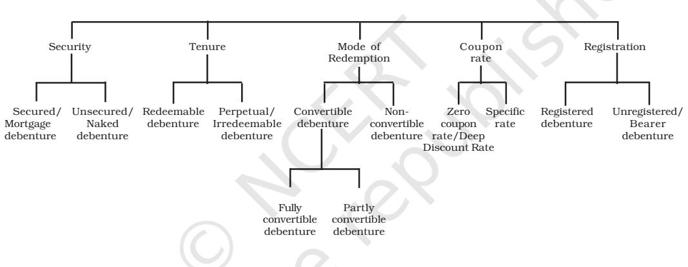
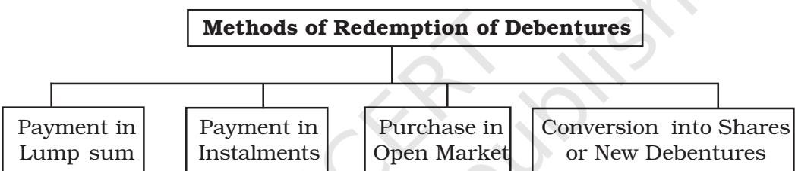

### **LEARNING OBJECTIVES**

*After studying this chapter you will be able to :*

- *state the meaning of debenture and explain the difference between debentures and shares;*
- *describe various types of debentures;*
- *record the journal entries for the issue of debentures at par, at a discount and at premium;*
- *explain the concept of debentures issued for consideration other than cash and the accounting thereof;*
- *explain the concept of issue of debentures as a collateral security and the accounting thereof;*
- *record the journal entries for issue of debentures with various terms of issue, terms of redemption;*
- *show the items relating to issue of debentures in company's balance sheet;*
- *describe the methods of writing-off discount/loss on issue of debentures;*
- *explain the methods of redemption of debentures and the accounting thereof; and*
- *explain the concept of sinking fund, its use for redemption of debentures and the accounting thereof.*

A company raises its capital by means of issue of shares. But the funds raised by the issue of shares are seldom adequate to meet their long term financial needs of a company. Hence, most companies turn to raising long-term funds also through debentures which are issued either through the route of private placement or by offering the same to the public. The finances raised through debentures are also known as long-term debt. This chapter deals with the accounting treatment of issue and redemption of debentures and other related aspects.

### **SECTION I**

### **2.1 Meaning of Debentures**

*Debenture*: The word 'debenture' has been derived from a Latin word 'debere' which means to borrow. Debenture is a written instrument acknowledging a debt under the common seal of the company. It contains a contract for repayment of principal after a specified period or at intervals or at the option of the company and for payment of interest at a fixed rate payable usually either half-yearly or yearly on fixed dates. According to section 2(30) of The Companies Act, 2013 'Debenture' includes Debenture Inventory, Bonds and any other securities of a company whether constituting a charge on the assets of the company or not.

*Bond:* Bond is also an instrument of acknowledgement of debt. Traditionally, the Government issued bonds, but these days, bonds are also being issued by semi-government and non-governmental organisations. The terms 'debentures' and 'Bonds' are now being used inter-changeably.

### **2.2 Distinction between Shares and Debentures**

*Ownership*: A 'share' represents ownership of the company whereas a debenture is only acknowledgement of Debt. A share is a part of the owned capital whereas a debenture is a part of borrowed capital.

*Return:* The return on shares is known as dividend while the return on debentures is called interest. The rate of return on shares may vary from year to year depending upon the profits of the company but the rate of interest on debentures is prefixed. The payment of dividend is an appropriation of profits, whereas the payment of interest is a charge on profits and is to be paid even if there is no profit.

*Repayment:* Normally, the amount of shares is not returned during the life of the company, whereas, generally, the debentures are issued for a specified period and repayable on the expiry of that period.

*Voting Rights:* Shareholders enjoy voting rights whereas debentureholders do not normally enjoy any voting right.

*Security :* Shares are not secured by any charge whereas the debentures are generally secured and carry a fixed or floating charge over the assets of the company.

*Convertibility:* Shares cannot be converted into debentures whereas debentures can be converted into shares if the terms of issue so provide, and in that case these are known as convertible debentures.

### **2.3 Types of Debentures**

A company may issue different kinds of debentures which can be classified as under:

### *2.3.1 From the Point of view of Security*

- *(a) Secured Debentures*: Secured debentures refer to those debentures where a charge is created on the assets of the company for the purpose of payment in case of default. The charge may be fixed or floating. A fixed charge is created on a specific asset whereas a floating charge is
on the general assets of the company. The fixed charge is created against those assets which are held by a company for use in operations not meant for sale whereas floating charge involves all assets excluding those assigned to the secured creditors.

- *(b) Unsecured Debentures*: Unsecured debentures do not have a specific charge on the assets of the company. However, a floating charge may be created on these debentures by default. Normally, these kinds of debentures are not issued.
### *2.3.2 From the Point of view of Tenure*

- *(a) Redeemable Debentures:* Redeemable debentures are those which are payable on the expiry of the specific period either in lump sum or in Instalments during the life time of the company. Debentures can be redeemed either at par or at premium.
- *(b) Irredeemable Debentures:* Irredeemable debentures are also known as *Perpetual Debentures* because the company does not give any undertaking for the repayment of money borrowed by issuing such debentures. These debentures are repayable on the winding-up of a company or on the expiry of a long period.

### *2.3.3 From the Point of view of Convertibility*

- *(a) Convertible Debentures:* Debentures which are convertible into equity shares or in any other security either at the option of the company or the debentureholders are called convertible debentures. These debentures are either fully convertible or partly convertible.
- *(b) Non-Convertible Debentures:* The debentures which cannot be converted into shares or in any other securities are called nonconvertible debentures. Most debentures issued by companies fall in this category.

### *2.3.4 From Coupon Rate Point of view*

- *(a) Specific Coupon Rate Debentures*: These debentures are issued with a specified rate of interest, which is called the coupon rate. The specified rate may either be fixed or floating. The floating interest rate is usually tagged with the bank rate.
- *(b) Zero Coupon Rate Debentures*: These debentures do not carry a specific rate of interest. In order to compensate the investors, such debentures are issued at substantial discount and the difference between the nominal value and the issue price is treated as the amount of interest related to the duration of the debentures.

### *2.3.5 From the view Point of Registration*

- *(a) Registered Debentures*: Registered debentures are those debentures in respect of which all details including names, addresses and particulars of holding of the debentureholders are entered in a register kept by the company. Such debentures can be transferred only by executing a regular transfer deed.
- *(b) Bearer Debentures*: Bearer debentures are the debentures which can be transferred by way of delivery and the company does not keep any record of the debentures Interest on debentures is paid to a person who produces the interest coupon attached to such debentures.

### **Types of Debenture/Bond**

### **2.4 Issue of Debentures**

The procedure for the issue of debentures is the same as that for the issue of shares. The intending investors apply for debentures on the basis of the prospectus issued by the company. The company may either ask for the entire amount to be paid on application or by means of instalments on application, on allotment and on various calls. Debentures can be issued at par, at a premium or at a discount. They can also be issued for consideration other than cash or as a collateral security.

### *2.4.1 Issue of Debentures for Cash*

Debentures are said to be issued at par when their issue price is equal to the face value. The journal entries recorded for such issue are as under:

| (a) | If whole amount is received in one instalment: |  |
| --- | --- | --- |
|  | (i) On receipt of the application money |  |
|  | Bank A/c | Dr. |
|  | To Debenture Application & Allotment A/c |  |
|  | (ii) On Allotment of debentures |  |
|  | Debenture Application & Allotment A/c | Dr. |
|  | To Debentures A/c |  |
| (b) | If debenture amount is received in two instalments: |  |
|  | (i) On receipt of application money |  |
|  | Bank A/c | Dr. |
|  | To Debenture Application A/c |  |
|  | (ii) For adjustment of applications money on allotment |  |
|  | Debenture Application A/c | Dr. |
|  | To Debentures A/c |  |
|  | (iii) For allotment money due |  |
|  | Debenture Allotment A/c | Dr. |
|  | To Debentures A/c |  |
|  | (iv) On receipt of allotment money |  |
|  | Bank A/c | Dr. |
|  | To Debenture Allotment A/c |  |
| (c) | If debenture money is received in more than two instalments |  |
|  | Additional entries: |  |
|  | (i) On making the first call |  |
|  | Debenture First Call A/c | Dr. |
|  | To Debentures A/c |  |
|  | (ii) On the receipt of the first call |  |
|  | Bank A/c | Dr. |
|  | To Debenture First Call A/c |  |

*Note:* Similar entries may be made for the second call and final call. However, normally the whole amount is collected on application or in two instalments, i.e., on application and allotment.

### *Illustration 1*

ABC Lmited issued 10,000, 12% debentures of Rs. 100 each payable Rs. 30 on application and remaining amount on allotment. The public applied for 9,000 debentures which were fully allotted, and all the relevant allotment money was duly received. Give journal entries in the books of ABC Ltd., and exhibit the relevent information in the balance sheet.

### *Solution:*

| Date | Particulars |  | L.F. | Debit | Credit |
| --- | --- | --- | --- | --- | --- |
|  |  |  |  | Amount | Amount |
|  |  |  |  | (Rs.) | (Rs.) |
|  | Bank A/c | Dr. |  | 2,70,000 |  |
|  | To 12% Debenture Application A/c |  |  |  |  |
|  | (Application money on 9,000 debentures received) |  |  |  | 2,70,000 |
|  | 12% Debenture Application A/c | Dr. |  | 2,70,000 |  |
|  | To 12% Debentures A/c |  |  |  | 2,70,000 |
|  | (Application money transferred to debentures |  |  |  |  |
|  | Account on allotment) |  |  |  |  |
|  | 12% Debenture Allotment A/c | Dr. |  | 6,30,000 |  |
|  | To 12% Debentures A/c |  |  |  | 6,30,000 |
|  | (Amount due on 9,000 debentures on allotment |  |  |  |  |
|  | @ Rs. 70 per debenture) |  |  |  |  |
|  | Bank A/c | Dr. |  | 6,30,000 |  |
|  | To 12% Debenture Allotment A/c |  |  |  | 6,30,000 |
|  | (Amount received on allotment) |  |  |  |  |

### **Books of ABC Limited Journal**

### **ABC Limited**

|  | *Balance Sheet as at |  |
| --- | --- | --- |
| Particulars | Note | Amount |
|  | No. | (Rs.) |
| I. Equity and Liabilities |  |  |
| Non-current liabilities | 1 | 9,00,000 |
| Long-term borrowings |  |  |
| II. Assets |  |  |
| Current assets |  |  |
| Cash and cash equivalents | 2 | 9,00,000 |

### ***Balance Sheet as at .................**

- * Relevant data only
### Notes to Accounts

|  | Particulars | Amount |
| --- | --- | --- |
|  |  | (Rs.) |
| 1. | Long-term borrowings |  |
|  | 9,000, 12% Debentures of Rs. 100 each | 9,00,000 |
| 2. | Cash and cash equivalents |  |
|  | Cash at bank | 9,00,000 |

### *2.4.2 Issue of Debentures at a Discount*

When a debenture is issued at a price below its nominal value, it is said to be issued at a discount. For example, the issue of Rs. 100 debentures at Rs. 95, Rs. 5 being the amount of discount. The discount on issue of debentures can be written off either by debiting it to or out of Securities Premium Reserve, if any, during the life time of debentures.

 Discount on issue of debentures to be written off within 12 months of the balance sheet date or the period of operating cycle is shown under 'Other Current Assets' and the part which is to be written off after 12 months of balance sheet is shown under 'Other Non-Current Assets'.

The Companies Act, 2013 does not impose any restrictions upon the issue of debentures at a discount.

### *Illustration 2*

TV Components Ltd., issued 10,000, 12% debentures of Rs. 100 each at a discount of 5% payable as follows:

| On application | Rs. 40 |
| --- | --- |
| On allotment | Rs. 55 |

Show the journal entries including those for cash, assuming that all the instalments were duly collected. Also show the relevant portion of the balance sheet.

### *Solution:*

### **Books of TV Components Ltd. Journal**

| Date | Particulars |  | L.F. | Debit | Credit |
| --- | --- | --- | --- | --- | --- |
|  |  |  |  | Amount | Amount |
|  |  |  |  | (Rs.) | (Rs.) |
|  | Bank A/c | Dr. |  | 4,00,000 |  |
|  | To 12% Debenture Application A/c |  |  |  | 4,00,000 |
|  | (Receipt of application money @ Rs 30 per |  |  |  |  |
|  | debenture) |  |  |  |  |
|  | 12% Debenture Application A/c | Dr. |  | 4,00,000 |  |
|  | To 12% Debenture A/c |  |  |  | 4,00,000 |
|  | (Transfer of application money to debenture |  |  |  |  |
|  | account) |  |  |  |  |
|  | 12% Debenture Allotment A/c | Dr. |  | 5,50,000 |  |
|  | Discount on Issue of Debentures A/c |  |  | 50,000 |  |
|  | To 12% Debenture A/c |  |  |  | 6,00,000 |
|  | (Allotment money due on debentures) |  |  |  |  |
|  | Bank A/c | Dr. |  | 5,50,000 |  |
|  | To 12% Debenture Allotment A/c |  |  |  | 5,50,000 |
|  | (Receipt of allotment money on debentures) |  |  |  |  |
|  | Securities Premium Reserve/Statement | Dr. |  | 50,000 | 50,000 |
|  | of Profit and Loss A/c. |  |  |  |  |
|  | To Discount on Issue of Debentures A/c. |  |  |  |  |
|  | (Discount on issue of debentures written off) |  |  |  |  |

### **TV Components Limited**

**Balance Sheet as at..................**

| Particulars | Note | Amount |
| --- | --- | --- |
|  | No. | (Rs.) |
| I. Equity and Liabilities |  |  |
| 1. Shareholders' Funds |  |  |
| Reserves and Surplus |  |  |
| 2.Non-Current Liabilities |  |  |
| Long-term borrowings | 2 | 9,50,000 |
| II. Assets |  |  |
| a) Cash and Cash Equivalents | 3 | 9,50,000 |
|  |  | 9,50,000 |

### Notes to Accounts

|  | Particulars | Amount |
| --- | --- | --- |
|  |  | (Rs.) |
| 1. | Reserves and Surplus |  |
|  | Surplus, i.e., Balance in Statement of Profit and Loss | (50,000) |
| 2. | Long-term borrowings |  |
|  | 10,000, 12% secured debentures of Rs. 100 each | 10,00,000 |
| 3. | Cash and Cash Equivalents | 9,50,000 |
|  | Cash at bank |  |

Notes:

1 It is presumed that debentures are redeemable after 10 years.

*Relevant data only.

### *2.4.3 Debentures issued at Premium*

A debenture is said to be issued at a premium when the price charged is more than its nominal value. For example, the issue of Rs. 100 debentures for Rs. 110, (Rs. 10 is being the premium). The amount of premium is credited to Securities Premium Reserve account and is shown on the liabilities side of the balance sheet under the head "Reserves and Surpluses".

### *Illustration 3*

XYZ Industries Ltd., issued 2,000, 10% debentures of Rs. 100 each, at a premium of Rs. 10 per debenture payable as follows:

| On application | Rs. 50 |
| --- | --- |
| On allotment | Rs. 60 |

The debentures were fully subscribed and all money was duly received. Record the journal entries in the books of a company. Show how the amounts will appear in the balance sheet.

### *Solution:*

| Date | Particulars | L.F. | Debit | Credit |
| --- | --- | --- | --- | --- |
|  |  |  | Amount | Amount |
|  |  |  | (Rs.) | (Rs.) |
|  | Bank A/c Dr. |  | 1,00,000 |  |
|  | To 10% Debenture Application A/c |  |  | 1,00,000 |
|  | (Application money Rs. 50 per debentures received) |  |  |  |
|  | 10% Debenture Application A/c Dr. |  | 1,00,000 |  |
|  | To 10% Debentures A/c |  |  | 1,00,000 |
|  | (Transfer of application money to debenture |  |  |  |
|  | account) |  |  |  |
|  | 10% Debenture Allotment A/c Dr. |  | 1,20,000 |  |
|  | To 10% Debentures A/c |  |  | 1,00,000 |
|  | To Securities Premium Reserve A/c |  |  | 20,000 |
|  | (Allotment money due on debentures |  |  |  |
|  | including the premium) |  |  |  |
|  | Bank A/c Dr. |  | 1,20,000 |  |
|  | To 10% Debenture Allotment A/c |  |  | 1,20,000 |
|  | (Allotment money received) |  |  |  |

### **Books of XYZ Industries Limited Journal**

### **XYZ Industries Limited**

### **Balance Sheet as at ———**

| Particulars |  | Note | Amount |
| --- | --- | --- | --- |
|  |  | No. | (Rs.) |
| I. Equity and Liabilities |  |  |  |
| 1. | Shareholders' Funds |  |  |
| Reserve and Surplus |  | 1 | 20,000 |
| 2. | Non-current Liabilities |  |  |
| Long-term borrowings |  | 2 | 2,00,000 |
|  |  |  | 2,20,000 |
| II. Assets |  |  |  |
| Current Assets |  |  |  |
| Cash and cash equivalents |  |  | 2,20,000 |

Notes to Accounts

|  | Particulars | Amount |
| --- | --- | --- |
|  |  | (Rs.) |
| 1. | Reserve and surplus |  |
|  | Securties Premium Reserve | 20,000 |
| 2. | Long-term borrowings |  |
|  | 2,000, 10% debentures of Rs. 100 each | 2,00,000 |
| 3. | Cash and cash equivalents |  |
|  | Cash at bank | 2,20,000 |

### *Illustration 4*

*A Limited* issued 5,000, 10% debentures of Rs. 100 each, at a premium of Rs. 10 per debenture payable as follows:

| On application | Rs. 25 |
| --- | --- |
| On allotment | Rs. 45 (including premium) |
| On first and final call | Rs. 40 |

The debentures were fully subscribed and all money was duly received. Record the necessary entries in the books of the company. Show how the amounts will appear in the balance sheet.

### *Solution:*

| Date | Particulars | L.F. | Debit | Credit |
| --- | --- | --- | --- | --- |
|  |  |  | Amount | Amount |
|  |  |  | (Rs.) | (Rs.) |
|  | Bank A/c Dr. |  | 1,25,000 |  |
|  | To 10% Debenture Application A/c |  |  | 1,25,000 |
|  | (Application money on 10% debentures received) |  |  |  |
|  | 10% Debenture Application A/c Dr. |  | 1,25,000 |  |
|  | To 10% Debentures A/c |  |  | 1,25,000 |
|  | (Transfer of application money on allotment) |  |  |  |
|  | 10% Debenture Allotment A/c Dr. |  | 2,25,000 |  |
|  | To 10% Debentures A/c |  |  | 1,75,000 |
|  | To Securities Premium Reserve A/c |  |  | 50,000 |
|  | (Allotment money of due on debentures including |  |  |  |
|  | the premium) |  |  |  |

### **Books of** *A Limited* **Journal**

| Bank A/c | Dr. | 2,25,000 |  |
| --- | --- | --- | --- |
| To 10% Debenture Allotment A/c |  |  | 2,25,000 |
| (Allotment money received) |  |  |  |
| 10% Debenture First & Final Call A/c | Dr. | 2,00,000 |  |
| To 10% Debentures A/c |  |  | 2,00,000 |
| (First and final call money due on |  |  |  |
| debentures) |  |  |  |
| Bank A/c | Dr. | 2,00,000 |  |
| To 10% Debenture First & Final Call A/c |  |  | 2,00,000 |
| (First and final call money received) |  |  |  |

### **A Limited**

**Balance Sheet as at ———**

| Particulars |  | Note | Amount |
| --- | --- | --- | --- |
|  |  | No. | (Rs.) |
| I. Equity and Liabilities |  |  |  |
| 1. | Shareholders' Funds |  |  |
| a) | Reserve and Surplus | 1 | 50,000 |
| 2. | Non-current Liabilities |  |  |
| Long term borrowings |  | 2 | 5,00,000 |
| Total |  |  | 5,50,000 |
| II. Assets |  |  |  |
| 1. | Current assets |  |  |
| a) | Cash and cash equivalents |  | 5,50,000 |

Notes to Accounts

|  | Particulars | Amount |
| --- | --- | --- |
|  |  | (Rs.) |
| 1. | Reserve and surplus |  |
|  | Securities Premium Reserve | 50,000 |
| 2. | Long-term borrowings |  |
|  | 5,000, 10% debentures of Rs. 100 each | 5,00,000 |

### **2.5 Over Subscription**

When the number of debentures applied for is more than the number of debentures offered to the public, the issue is said to be over subscribed. A company, however, cannot allot more debentures than it has invited for subscription. The excess money received on over subscription may, however, be retained for adjustment towards allotment and the respective calls to be made. But the money received from applicants to whom no debentures have been allotted, will be refunded to them.

### *Illustration 5*

*Solution:*

X Limited Issued 10,000, 12% debentures of Rs. 100 each payable Rs. 40 on application and Rs. 60 on allotment. The public applied for 14,000 debentures. Applications for 9,000 debentures were accepted in full; applications for 2,000 debentures were allotted 1,000 debentures and the remaining applications, were rejected. All money was duly received. Journalise the transactions.

## **Journal**  *Date Particulars L.F. Debit Credit Amount Amount (Rs.) (Rs.)* Bank A/c Dr. 5,60,000 To 12% Debenture Application A/c 5,60,000 (Receipt of application money on 14,000 debentures) 12% Debenture Application A/c Dr. 5,60,000 To 12% Debentures A/c 4,00,000 To Debentures Allotment A/c 40,000 To Bank A/c 1,20,000 (Debenture Application money transferred to Debenuture A/c, Excess application money credited to Debenture Allotment account and money refunded on rejected application) 12% Debenture Allotment A/c Dr. 6,00,000 To 12% Debentures A/c 6,00,000 (Amount due on allotment on 10,000 debentures) Bank A/c Dr. 5,60,000 To Debenture Allotment A/c 5,60,000 (Allotment money received)

## **Books of X Limited**

### **2.6 Issue of Debentures for Consideration other than Cash**

Sometimes a company purchased assets from vendors and instead of making payment in cash issues debentures for consideration thereof. Such issue of

debentures is called debentures issued for consideration other than cash. In that case also, the debentures may be issued at par, at a premium or at a discount then entries made in such a situation are similar to those of the shares issued for consideration other than cash, which are as follows :

| 1. | On purchase of assets |  |
| --- | --- | --- |
|  | Sundry Assets A/c | Dr. |
|  | To Vendor's |  |
|  | 2. On issue of debentures |  |
|  | (a) At par |  |
|  | Vendors | Dr. |
|  | To Debentures A/c |  |
| (b) | At premium |  |
|  | Vendors | Dr. |
|  | To Debentures A/c |  |
|  | To Securities Premium Reserve A/c |  |
|  | (c) At a discount |  |
|  | Vendors | Dr. |
|  | Discount on Issue of Debenture A/c | Dr. |
|  | To Debentures A/c |  |

### *Illustration 6*

Aashirward Company Limited purchased assets of the book value of Rs. 2,00,000 from another company and agreed to make the payment of purchase consideration by issuing 2,000, 10% debentures of Rs. 100 each.

Record the necessary journal entries.

### *Solution:*

### **Books of Aashirwad Company Limited Journal**

| Date | Particulars |  | L.F. | Debit | Credit |
| --- | --- | --- | --- | --- | --- |
|  |  |  |  | Amount | Amount |
|  |  |  |  | (Rs.) | (Rs.) |
|  | Sundry Assets A/c | Dr. |  | 2,00,000 |  |
|  | To Vendors |  |  |  | 2,00,000 |
|  | (Assets purchased from vendors) |  |  |  |  |
|  | Vendors | Dr. |  | 2,00,000 |  |
|  | To 10% Debentures A/c |  |  |  | 2,00,000 |
|  | (Allotment of debentures to vendors as |  |  |  |  |
|  | purchase consideration) |  |  |  |  |

### *Illustration 7*

Rai Company purchased assets of the book value of Rs. 2,20,000 from another company and agreed to make the payment of purchase consideration by issuing 2,000, 10% debentures of Rs. 100 each at a premium of 10%.

Record necessary journal entries.

### *Solution:*

| Date | Particulars | L.F. | Debit | Credit |
| --- | --- | --- | --- | --- |
|  |  |  | Amount | Amount |
|  |  |  | (Rs.) | (Rs.) |
|  | Sundry Assets A/c Dr. |  | 2,20,000 |  |
|  | To Vendors |  |  | 2,20,000 |
|  | (Assets purchased from vendors) |  |  |  |
|  | Vendors Dr. |  | 2,20,000 |  |
|  | To 10% Debentures A/c |  |  | 2,00,000 |
|  | To Securities Premium Reserve A/c |  |  | 20,000 |
|  | (Allotment of 2,000 debentures of Rs. 100 each |  |  |  |
|  | at a premium of 10% as purchase consideration) |  |  |  |

### **Books of Rai Company Limited Journal**

### *Illustration 8*

National Packaging Company purchased assets of the value of Rs. 1,90,000 from another company and agreed to make the payment of purchase consideration by issuing 2,000, 10% debentures of Rs. 100 each at a discount of 5%.

Record necessary journal entries.

### *Solution:*

### **Books of National Packaging Company Journal**

| Date | Particulars |  | L.F. | Debit | Credit |
| --- | --- | --- | --- | --- | --- |
|  |  |  |  | Amount | Amount |
|  |  |  |  | (Rs.) | (Rs.) |
|  | Sundry Assets A/c | Dr. |  | 1,90,000 |  |
|  | To Vendors |  |  |  | 1,90,000 |
|  | (Assets purchased from vendors) |  |  |  |  |
|  | Vendors | Dr. |  | 1,90,000 |  |
|  | Discount on Issue of Debenture A/c | Dr. |  | 10,000 |  |
|  | To 10% Debentures A/c |  |  |  | 2,00,000 |
|  | (Allotment of 2,000 debentures of |  |  |  |  |
|  | Rs. 100 each at a discount of 5% as |  |  |  |  |
|  | purchase consideration) |  |  |  |  |

### *Illustration 9*

G.S. Rai company ltd. purchased assets of the book value of Rs. 99,000 from another firm. It was agreed that purchase consideration be paid by issuing 11% debentures of Rs. 100 each. Assume debentures have been issued.

- 1. At par
- 2. At discount of 10%, and
- 3. At a premium of 10%.

Record necessary journal entries.

### *Solution:*

|  | Journal |  |  |  |  |
| --- | --- | --- | --- | --- | --- |
| Date | Particulars |  | L.F. | Debit | Credit |
|  |  |  |  | Amount | Amount |
|  |  |  |  | (Rs.) | (Rs.) |
|  | Sundry Assets A/c | Dr. |  | 99,000 |  |
|  | To Vendors |  |  |  | 99,000 |
|  | (Assets purchased from vendors) |  |  |  |  |
| In Ist | Vendors | Dr. |  | 99,000 |  |
| Case | To 10% Debentures A/c |  |  |  | 99,000 |
|  | (Allotment of debentures to vendors as |  |  |  |  |
|  | purchase consideration) |  |  |  |  |
| In IInd | Vendors | Dr. |  | 99,000 |  |
| Case | Discount on Issue of Debenture A/c | Dr. |  | 11,000 |  |
|  | To 10% Debentures A/c |  |  |  | 1,10,000 |
|  | (Allotment of 1,100 debenture of Rs. 100 issued at |  |  |  |  |
|  | discount of 10% to vendor) |  |  |  |  |
| In IIIrd | Vendors Dr. |  |  | 99,000 |  |
| Case | To 11% Debentures A/c |  |  |  | 90,000 |
|  | To Securities Premium Reserve A/c |  |  |  | 9,000 |
|  | (Allotment of 900 debentures of Rs. 100 issued at |  |  |  |  |
|  | a premium of 10% to the vendors) |  |  |  |  |

Sometimes a company may purchase the assets as well as takeover its liabilities of another concern. It happens usually in case of purchase of the whole business of the other concern. In such a situation, the purchase consideration will be equal to the value of net assets (Assets - Liabilities) taken over, and if the whole amount of the consideration is paid by issue of debentures, the journal entry for purchase of business will be:

# **Books of G.S. Rai Company Limited**

Sundry Assets A/c Dr. To Sundry Liabilities A/c To Vendors (Purchase of the Vendors' business)

### *Illustration 10*

Romi Ltd. acquired assets of Rs. 20 lakh and took over creditors of Rs. 2 lakh from Kapil Enterprises. Romi Ltd., issued 8% debentures of Rs 100 each at par as purchase consideration. Record necessary journal entries in the books of Romi Ltd.

**Books of Romi Ltd.**

### *Solution:*

### **Journal**  *Date Particulars L.F. Debit Credit Amount Amount (Rs.) (Rs.)* Sundry Assets A/c Dr. 20,00,000 To Kapil Enterprises 18,00,000 To Sundry Creditors A/c 2,00,000 (Purchase of business from Kapil Enterprises) Kapil Enterprises Dr. 18,00,000 To 8% Debentures A/c 18,00,000 (Issue of 18,000, 8% debentures of Rs. 100 each)

In case of the whole business being taken over if the amount of debentures issued is more than the amount of the net assets taken over, the difference (excess) will be treated as value of goodwill and the same shall also be debited while passing the journal entry for the purchase of vender's business (see Illustration 11). But if it is the other way round, i.e., the value of debentures is less than the value of the net assets taken over the difference will be credited to capital Reserve accounts (See Illustration 12).

### *Illustration 11*

Blue Prints Ltd., purchased building worth Rs.1,50,000, machinery worth Rs.1,40,000 and furniture worth Rs.10,000 from XYZ Co., and took over its liabilities of Rs. 20,000 for a purchase consideration of Rs. 3,15,000. Blue Prints Ltd., paid the purchase consideration by issuing 12% debentures of Rs.100 each at a premium of 5%. Record necessary journal entries.

### *Solution:*

| Date | Particulars | L.F. | Debit | Credit |
| --- | --- | --- | --- | --- |
|  |  |  | Amount | Amount |
|  |  |  | (Rs.) | (Rs.) |
|  | Building A/c Dr. |  | 1,50,000 |  |
|  | Plant & Machinery A/c Dr. |  | 1,40,000 |  |
|  | Furniture A/c Dr. |  | 10,000 |  |
|  | Goodwill A/c 1 Dr. |  | 35,000 |  |
|  | To Liabilities (Sundry) |  |  | 20,000 |
|  | To XYZ Co. |  |  | 3,15,000 |
|  | (Purchase of assets and taking over of liabilities |  |  |  |
|  | of XYZ Co.) |  |  |  |
|  | XYZ Co. Dr. |  | 3,15,000 |  |
|  | To 12% Debentures A/c |  |  | 3,00,000 |
|  | To Securities Premium Reserve A/c |  |  | 15,000 |
|  | (Issue of 3,000 debentures at a premium of 5%) |  |  |  |

**Books of Blue Prints Limited Journal**

Note: 1. Since the purchase consideration is more than net assets taken over, the difference has been debited to goodwill account.

2. No. of debentures issued = Purchase Consideration Issue Price of a Debenture

= Rs. 3,15,000 = 3,000 105

### *Illustration 12*

*A Limited* took over the assets of Rs. 3,00,000 and liabilities of Rs.10,000 from B & Co. Ltd., for an agreed purchase consideration of Rs. 2,70,000 to be satisfied by issue of 15% debentures of Rs. 100 at 20% premium. Show the journal entries in the journal of *A Limited*.

### *Solution:*

### **Books of** *A Limited* **Journal**

| Date | Particulars |  | L.F. | Debit | Credit |
| --- | --- | --- | --- | --- | --- |
|  |  |  |  | Amount | Amount |
|  |  |  |  | (Rs.) | (Rs.) |
|  | Sundry Assets A/c | Dr. |  | 3,00,000 |  |
|  | To Sundry Liabilities A/c |  |  |  | 10,000 |
|  | To B & Co. Ltd. |  |  |  | 2,70,000 |
|  | To Capital Reserve |  |  |  | 20,000 |
|  | (Purchased assets and took over liabilities from B Ltd.) |  |  |  |  |

| B & Co. Ltd. | Dr. | 2,70,000 |  |
| --- | --- | --- | --- |
| To 15% Debentures A/c |  |  | 2,25,000 |
| To Securities Premium Reserve A/c |  |  | 45,000 |
| (Issue of 2,250 debentures of Rs 100 each at a |  |  |  |
| premium of 20%) |  |  |  |

### **Do it Yourself**

- 1. Amrit Company Limited purchased assets of the value of Rs. 2,20,000 from another company and agreed to make the payment of purchase consideration by issuing 2,000, 10% debentures of Rs.100 each at a premium of 10%. Record necessary journal entries.
- 2. A company purchased assets of the value of Rs.1,90,000 from another company and agreed to make the payment of purchase consideration by issuing 2,000, 10% debentures of Rs. 100 each at a discount of 5%. Record necessary journal entries.
- 3. Rose Bond Limited purchased a business for Rs. 22,00,000. Purchase Price was paid by 6% debentures. Debentures of Rs. 20,00,000 were issued at a premium of 10% for the purpose. Record necessary journal entries.
- 4. Nikhil and Ashwin Limited bought business of Agarwal Limited consisting sundry assts of Rs. 3,60,000, sundry creditors Rs.1,00,000 for a consideration of Rs. 3,07,200. It issued 14% debentures of Rs. 100 each fully paid at a discount of 4% in satisfaction of purchase consideration. Record necessary journal entries.

### *Illustration 13*

Suvidha Ltd. purchased machinery worth Rs.1,98,000 from Suppliers Ltd. The payment was made by issue of 12% debentures of Rs.100 each.

Pass the necessary journal entries for the purchase of machinery and issue of debentures when:

- (i) Debentures are issued at par;
- (ii) Debentures are issued at 10% discount; and
- (iii) Debentures are issued at 10% premium

### *Solution:*

### **Books of Suvidha Ltd. Journal**

| Date |  | Particulars |  | L.F. | Debit | Credit |
| --- | --- | --- | --- | --- | --- | --- |
|  |  |  |  |  | Amount | Amount |
|  |  |  |  |  | (Rs.) | (Rs.) |
|  | Machinery A/c |  | Dr. |  | 1,98,000 |  |
|  | To Suppliers Ltd. |  |  |  |  | 1,98,000 |
|  | (Machinery purchased) |  |  |  |  |  |

| Case (i) When debentures are issued at par: |  |  |  |
| --- | --- | --- | --- |
| Suppliers Ltd. | Dr. | 1,98,000 |  |
| To 12% Debentures A/c |  |  | 1,98,000 |
| (12% Debentures issued to Suppliers Ltd.) |  |  |  |
| Case (ii) When debentures are issued at 10% discount: |  |  |  |
| Suppliers Ltd. | Dr. | 1,98,000 |  |
| Discount on Issue of Debentures A/c | Dr. | 22,000 |  |
| To 12% Debentures A/c |  |  | 2,20,000 |
| (12% Debentures issued to Suppliers Ltd. at |  |  |  |
| 10% discount) |  |  |  |
| Case (iii) When debentures are issued at 10% premium: |  |  |  |
| Suppliers Ltd. | Dr. | 1,98,000 |  |
| To 12% Debentures A/c |  |  | 1,80,000 |
| Securities Premium Reserve A/c |  |  | 18,000 |
| (12% Debentures issued to Suppliers Ltd. |  |  |  |
| at 10% premium) |  |  |  |

*Workings:*

(a)

|  | Rs. |
| --- | --- |
| Face value of debenture | 100 |
| Less: Discount 10% | 10 |
| Value at which debenture issued | 90 |
| Number of debentures issued in case of 10% discount = | Rs. 1,98,000 |
|  | 90 |
| = | 2,200 debenture |
| (b) |  |
|  | Rs. |
| Face value of debenture | 100 |
| Add: Premium 10% | 10 |
| Value at which debenture issued | 110 |
| Number of debentures issued in case of 10% premium = | Rs.1,98,000 |
|  | 110 |
|  | = 1,800 Debentures |

### **2.7 Issue of Debentures as a Collateral Security**

A collateral security may be defined as a subsidiary or secondary or additional security besides the primary security when a company obtains a loan or overdraft from a bank or any other financial Institution. It may pledge or mortgage some assets as a secured loan against the said loan. But the lending institutions may insist on additional assets as collateral security so that the amount of loan can be realised in full with the help of collateral security in case the amount from the sale of principal security falls short of the loan money. In such situation, the company may issue its own debentures to the lenders in addition to some other assets already pledged. Such an issue of debentures is known as 'Debentures issued as Collateral Security'.

If the company fails to repay the loan along with interest, the lender is free to receive his money from the sale of primary security and if the realisable value of the primary security falls short to cover the entire amount, the lender has the right to invoke the benefit of collateral security whereby debentures may either be presented for redemption or sold in the open market.

Debentures issued as collateral security can be dealt within two ways in the books of the company:

### *First Method*

No entry is made in the books of accounts since no liability is created by such issue. However, on the liability side of the balance sheet, below the item of loan, a note to the effect that it has been secured by issue of debentures as a collateral security is appended. For example, X Company has issued 9%, 10,000 debentures of Rs.100 each for a loan of Rs.10, 00,000 taken from a bank. This fact may be shown in the balance sheet as under:

|  | Balance Sheet as at __________ |  |
| --- | --- | --- |
| Particulars | Note | Amount |
|  | No. | (Rs.) |
| I. Equity and Liabilities |  |  |
| 1. Non-current Liabilities |  |  |
| Long-term borrowings | 1 | 10,00,000 |

| X Company |
| --- |

### Notes to Accounts

|  | Particulars Amount |
| --- | --- |
|  | (Rs.) |
| 1. | Long-term borrowings |
|  | Bank Loan |
|  | (Secured by issue of 10,000, 10% debentures 10,00,000 |
|  | of Rs. 10 each as Collatoral Security) |

### *Second Method*

The issue of debentures as a collateral security may be recorded by means of journal entry as follows:

*Journal Entries*

- *i. Issue of 10,000, 9% debentures of Rs. 100 each as collateral security for bank loan of Rs. 10,00,000.*
	- Debenture Suspense A/c Dr. 10,00,000 To 9% Debentures A/c 10,00,000
- *ii. For cancellation of 9% debentures as collateral security on repayment of bank loan.*

Debenture Suspense account will appear as a deduction from the debentures in notes to accounts of long-term borrowings. When loan is repaid the above entry will be cancelled by a reverse entry :

9% Debentures A/c Dr. 10,00,000

To Debenture Suspense A/c 10,00,000

### **Balance Sheet of X Co. _____________ (Extract)**

| Particulars | Note | Amount |
| --- | --- | --- |
|  | No. | (Rs.) |
| I. Equity and Liabilities |  |  |
| 1. Non-current Liabilities |  |  |
| Long term borrowings | 1 | 10,00,000 |

Notes to Accounts

| Particulars |  | Amount |
| --- | --- | --- |
|  | (Rs.) | (Rs.) |
| 1. Long term borrowings |  | 10,00,000 |
| Bank loan |  |  |
| 10,000, 9% debentures of |  |  |
| Rs. 100 each | 10,00,000 |  |
| Less: Debenture suspense | 10,00,000 |  |
|  |  | 10,00,000 |

### *Illustration 14*

A company took a loan of Rs. 10,00,000 from Punjab National Bank and issued 10% debentures of Rs. 12,00,000 of Rs. 100 each as a collateral security. Explain how you will deal with the issue of debentures in the books of the company.

### *Solution:*

*First Method:*

|  | Balance Sheet (Extract) |  |
| --- | --- | --- |
| Particulars | Note | Amount |
|  | No. | (Rs.) |
| I. Equity and Liabilities |  |  |
| 1. Non-current Liabilities |  |  |
| Long-term borrowings | 1 | 10,00,000 |

Notes to Accounts

|  | Particulars | Amount (Rs.) |
| --- | --- | --- |
| 1. | Long-term borrowings |  |
|  | Bank loan | 10,00,000 |
|  | (Secured by issue of 12,000, |  |
|  | 10% debentures of Rs. 100 each |  |
|  | as Collatoral Security |  |

*Second Method:*

### **Journal Entries**

| Date Particulars | L.F. | Debit | Credit |
| --- | --- | --- | --- |
|  |  | Amount | Amount |
|  |  | (Rs.) | (Rs.) |
| Debenture Suspense A/c | Dr. | 12,00,000 |  |
| To 10% Debentures A/c |  |  | 12,00,000 |
| (12,000 debenture of Rs. 100 each issued as |  |  |  |
| collateral security to P.N.Bank) |  |  |  |

### **Balance Sheet (Extract)**

| Particulars | Note | Amount |
| --- | --- | --- |
|  | No. | (Rs.) |
| I. Equity and Liabilities |  |  |
| 1. Non-current Liabilities |  |  |
| Long-term borrowings | 1 | 10,00,000 |

### Notes to Accounts

|  | Particulars |  | Amount |
| --- | --- | --- | --- |
|  |  | (Rs.) | (Rs.) |
| 1. | Long-term borrowings |  |  |
|  | Secured Loan from |  | 10,00,000 |
|  | PNB |  |  |
|  | 12,000, 10% debentures of | 12,00,000 |  |
|  | Rs. 100 each |  |  |
|  | Less: Debenture |  |  |
|  | Suspense | 12,00,000 |  |
|  |  |  | 10,00,000 |

### **Do it Yourself**

| 1. | Raghuveer Limited issued Rs. 10,00,000, 8% debentures as follows to: |  |
| --- | --- | --- |
|  |  | Rs. |
|  | 1. Sundry Subscribers for Cash at 90% | 5,50,000 |
|  | 2. Vendor of Machinery for Rs. 2,00,000 | 2,00,000 |
|  | in satisfaction of his claim |  |
|  | 3. Bankers as Collateral Security for a bank loan | 2,50,000 |
|  | worth Rs. 20,00,000 for which principal security is Business Premises |  |
|  | worth Rs. 22,50,000. |  |
|  | The issue (1) and (2) are redeemable at the end of 10 years at par. State |  |
|  | how the debenture will be dealt with while preparing the balance sheet |  |
|  | of a company. |  |
| 2. | Hassan Limited took a loan of Rs. 30,00,000 from a bank against primary |  |
|  | security worth Rs. 40,00,000 and issued 4,000, 6% debentures of Rs. 100 |  |
|  | each as a collateral security. The company again after one year took a loan of |  |
|  | Rs. 50,00,000 from bank against Plant as primary security and deposited |  |
|  | 6,000, 6% debentures of Rs. 100 each as collateral security. Record necessary |  |
|  | journal entries and prepare balance sheet of the company. |  |
| 3. | Meghnath Limited took a loan of Rs. 1,20,000 from a bank and deposited |  |
|  | 1,400, 8% debentures of Rs. 100 each as collateral security along with primary |  |
|  | security worth Rs. 2 lakh. Company again took a loan of Rs. 80,000 after two |  |
|  | months from a bank and deposited 1,000, 8% debentures of Rs. 100 each as |  |
|  | collateral security. Record necessary journal entries and prepare balance sheet |  |

of the company.

### **2.8 Terms of Issue of Debentures**

When a company issues debentures, it usually mentions the terms on which they will be redeemed on their maturity. Redemption of debentures means discharge of liability on account of debentures by repayment made to the debenture holders. Debentures can be redeemed either at par or at a premium.

Depending upon the terms and conditions of issue and redemption of debentures, the following six situations are commonly found in practice.

- (i) Issued at par and redeemable at par
- (ii) Issued at discount and redeemable at par
- (iii) Issued at a premium and redeemable at par
- (iv) Issued at par and redeemable at a premium
- (v) Issued at a discount and redeemable at a premium
- (vi) Issued at a premium and redeemable at a premium

In all the above six cases, the following journal entries will be passed:

- *1. Issue at par and redeemable at par*

|  | (a) Bank A/c | Dr. |
| --- | --- | --- |
|  | To Debenture Application & Allotment A/c |  |
|  | (Receipt of application money) |  |
|  | (b) Debenture Application & Allotment A/c | Dr. |
|  | To Debentures A/c |  |
|  | (Allotment of debentures) |  |
| 2. | Issue at a discount and redeemable at par |  |
|  | (a) Bank A/c | Dr. |
|  | To Debenture Application & Allotment A/c |  |
|  | (Receipt of application money) |  |
|  | (b) Debenture Application & Allotment A/c | Dr. |
|  | Discount on Issue of Debentures A/c | Dr. |
|  | To Debentures A/c |  |
|  | (Allotment of debentures at a discount) |  |
| 3. | Issue at premium and redemption at par |  |
|  | (a) Bank A/c | Dr. |
|  | To Debenture Application & Allotment A/c |  |
|  | (Receipt of application money) |  |
|  | (b) Debenture Application & Allotment A/c | Dr. |
|  | To Debentures A/c |  |
|  | To Securities Premium Reserve A/c |  |
|  | (Allotment of debentures at a premium) |  |
| 4. | Issue at par and redeemable at premium |  |
|  | (a) Bank A/c | Dr. |
|  | To Debenture Application & Allotment A/c |  |
|  | (Receipt of application money) |  |
|  | (b) Debenture Application & Allotment A/c | Dr. |
|  | Loss on Issue of Debentures A/c | Dr. (with premium on redemption) |
|  | To Debentures A/c | (with nominal value of debenture) |
|  | To Premium on Redemption of Debenture A/c | (with premium on redemption) |
|  | (Allotment of debentures at par and |  |
|  | redeemade at a premium) |  |

- *5. Issue at discount and redemption at premium*
	- Bank A/c Dr.

To Debenture Application & Allotment A/c

(Receipt of application money)

Debenture Application & Allotment A/c Dr. Loss on Issue of Debentures A/c Dr. (with discount on issue plus

of Debentures A/c

(Allotment of debentures at a discount and redeemable at premium)

premium on redemption)

To Debentures A/c (with nominal value of debenture)

To Premium on Redemption (with premium on redemption)

- *6. Issued at a premium and redeemable at premium*
	- Bank A/c Dr.

To Debenture Application & Allotment A/c

(Receipt of application money)

Debenture Application & Allotment A/c Dr.

- To Securities Premium Reserve A/c (with premium on issue)
- Debentures A/c

Loss on Issue of Debentures A/c Dr. (with premium on redemption) To Debentures A/c (with nominal value of debenture) To Premium on Redemption of (with premium on redemption)

- *Notes:* 1. When debentures are redeemable at a premium, the premium payable on redemption is debited to 'Loss on Issue of Debentures A/c'. It may be noted that when debentures are issued at a discount and are redeemable at a premium, the amount of discount on issue is also debited to 'Loss on Issue of Debentures'. It may be noted that when the debentures are issued at a discount and are redeemable at par, the amount debited to 'Discount on Issue of Debentures A/c' as usual.
	- 2. Premium on redemption is a liability of a company payable in future. It is a provision and is shown under the head Non-current liabilities under subhead 'Long-term Borrowings' until debentures are redeemed.

### *Illustration 15*

Give Journal entries for the following:

- 1. Issue of Rs. 1,00,000, 9% debentures of Rs. 100 each at par and redeemable at par.
- 2. Issue of Rs. 1,00,000, 9% debentures of Rs. 100 each at premium of 5% but redeemable at par.
- 3. Issue of Rs. 1,00,000, 9% debentures of Rs. 100 each at discount of 5% repayable at par.
- 4. Issue of Rs. 1,00,000, 9% debentures of Rs. 100 each at par but repayable at a premium of 5%.
- 5. Issue of Rs. 1,00,000, 9% debentures of Rs. 100 each at discount of 5% but redeemable at premium of 5%.
- 6. Issue of Rs. 1,00,000, 9% debentures of Rs. 100 each at premium of 5% and redeemable at premium of 5%.

|  | Journal |  |  |  |  |
| --- | --- | --- | --- | --- | --- |
| Date | Particulars |  | L.F. | Debit | Credit |
|  |  |  |  | Amount | Amount |
|  |  |  |  | (Rs.) | (Rs.) |
| 1 | Bank A/c | Dr. |  | 1,00,000 |  |
|  | To 9% Debenture Application & Allotment A/c |  |  |  | 1,00,000 |
|  | (Debentures Application money received) |  |  |  |  |
|  | Debenture Application & Allotment A/c | Dr. |  | 1,00,000 |  |
|  | To 9% Debentures A/c |  |  |  | 1,00,000 |
|  | (Application money transferred to |  |  |  |  |
|  | Debentures Account) |  |  |  |  |
| 2 | Bank A/c | Dr. |  | 1,05,000 |  |
|  | To 9% Debenture Application & Allotment A/c |  |  |  | 1,05,000 |
|  | (Debentures application money received) |  |  |  |  |
|  | Debenture Application & Allotment A/c | Dr. |  | 1,05,000 |  |
|  | To 9% Debentures A/c |  |  |  | 1,00,000 |
|  | To Securities Premium Reserve A/c |  |  |  | 5,000 |
|  | (Debentures application money transferred to |  |  |  |  |
|  | Debentures & Securities Premium account) |  |  |  |  |
| 3 | Bank A/c | Dr. |  | 95,000 |  |
|  | To 9% Debenture Application & Allotment A/c |  |  |  | 95,000 |
|  | (Debentures application money received) |  |  |  |  |
|  | 9% Debenture Application & Allotment A/c | Dr. |  | 95,000 |  |
|  | Discount on Issue of Debentures A/c | Dr. |  | 5,000 |  |
|  | To 9% Debentures A/c |  |  |  | 1,00,000 |
|  | (Debentures application money transferred |  |  |  |  |
|  | to Debentures account) |  |  |  |  |

### *Solution:*

| 4 | Bank A/c | Dr. | 1,00,000 |  |
| --- | --- | --- | --- | --- |
|  | To 9% Debenture Application & Allotment A/c |  |  | 1,00,000 |
|  | (Debentures Application money received) |  |  |  |
|  | Debenture Application & Allotment A/c | Dr. | 1,00,000 |  |
|  | Loss on Issue of Debentures A/c | Dr. | 5,000 |  |
|  | To 9% Debentures A/c |  |  | 1,00,000 |
|  | To Premium on Redemption of Debentures A/c |  |  | 5,000 |
|  | (Debentures Application money transferred |  |  |  |
|  | to Debentures account) |  |  |  |
| 5 | Bank A/c | Dr. | 95,000 |  |
|  | To 9% Debenture Application & Allotment A/c |  |  | 95,000 |
|  | (Debentures Application money received) |  |  |  |
|  | Debenture Application & Allotment A/c | Dr. | 95,000 |  |
|  | Loss on Issue of Debentures A/c | Dr. | 10,000 |  |
|  | To 9% Debentures A/c |  |  | 1,00,000 |
|  | To Premium on Redemption of Debentures A/c |  |  | 5,000 |
|  | (Debentures application money transferred |  |  |  |
|  | to debentures and Premium on debenture account) |  |  |  |
| 6 | Bank A/c | Dr. | 1,05,000 |  |
|  | To 9% Debenture Application & Allotment A/c |  |  | 1,05,000 |
|  | (Debentures Application money received) |  |  |  |
|  | Debenture Application & Allotment A/c | Dr. | 1,05,000 |  |
|  | Loss on Issue of Debentures A/c | Dr. | 5,000 |  |
|  | To 9% Debenture A/c |  |  | 1,00,000 |
|  | To Premium on Redemption of Debentures A/c |  |  | 5,000 |
|  | To Securities Premium Reserve A/c |  |  | 5,000 |
|  | (Debenture application money transferred |  |  |  |
|  | to debentures account) |  |  |  |

### *Illustration 16*

You are required to pass the journal entries relating to the issue of the debentures in the books of X Ltd., under the following cases:

- (a) 120, 8% debentures of Rs. 1,000 each are issued at 5% discount and repayable at par. Balance in Securities Premium Reserve is Rs. 10,000.
- (b) 150, 7% debentures of Rs. 1,000 each are issued at 5% discount and repayable at premium of 10%. Balance in Securities Premium Reserve is Rs. 20,000.
- (c) 80, 9% debentures of Rs. 1,000 each are issued at 5% premium.
- (d) Another 400, 8% debentures of Rs. 100 each are issued as collateral security against a loan of Rs. 40,000.

### *Solution:*

| (a) | Journal |  |  |  |
| --- | --- | --- | --- | --- |
| Date | Particulars | L.F. | Debit | Credit |
|  |  |  | Amount | Amount |
|  |  |  | (Rs.) | (Rs.) |
|  | Bank A/c Dr. |  | 1,14,000 |  |
|  | To Debenture Application and Allotment A/c |  |  |  |
|  | (Debenture application money received) |  |  | 1,14,000 |
|  | Debenture Application and Allotment A/c Dr. |  | 1,14,000 |  |
|  | Loss on Issue of Debentures A/c Dr. |  | 6,000 |  |
|  | To 8% Debentures A/c |  |  | 1,20,000 |
|  | (Debentures application money transferred to |  |  |  |
|  | Debentures account) |  |  |  |
|  | Securities Premium Reserve A/c. Dr. |  | 8,000 |  |
|  | To Loss on Issue of Debentures A/c. |  |  | 8,000 |
|  | (Loss on issue of debentures written-off) |  |  |  |

## **Books of X Ltd.**

### **Books of X Ltd.** (b) **Journal**

| Date | Particulars | L.F. | Debit | Credit |
| --- | --- | --- | --- | --- |
|  |  |  | Amount | Amount |
|  |  |  | (Rs.) | (Rs.) |
|  | Bank A/c | Dr. | 1,42,500 |  |
|  | To Debenture Application and Allotment A/c |  |  |  |
|  | (Debenture application money received) |  |  | 1,42,500 |
|  | Debenture Application and Allotment A/c | Dr. | 1,42,500 |  |
|  | Loss on Issue of Debentures A/c | Dr. | 22,500 |  |
|  | To 8% Debentures A/c |  |  | 1,50,000 |
|  | To Premium on Redemption of Debenture A/c |  |  | 15,000 |
|  | (Debentures application money transferred to |  |  |  |
|  | Debentures A/c) |  |  |  |
|  | Security Premium Reserve A/c | Dr. | 20,000 |  |
|  | Statement of Profit and Loss |  | 2,500 |  |
|  | To Loss on Issue of debentures A/c |  |  | 22,500 |
|  | (Loss on issue of debentures written-off) |  |  |  |

### *Date Particulars L.F. Debit Credit Amount Amount (Rs.) (Rs.)* Bank A/c Dr. 84,000 To Debenture Application and Allotment A/c 84,000 (Debenture application money received) Debenture Application and Allotment A/c Dr. 84,000 To 9% Debentures A/c 80,000 To Securities Premium Reserve A/c 4,000 (Debentures application money transferred to Debentures A/c and securities premium reserve A/c)

### **Books of X Ltd.** (c) **Journal**

## **Books of X Ltd.**

| (d) | Journal |  |  |  |
| --- | --- | --- | --- | --- |
| Date | Particulars | L.F. | Debit | Credit |
|  |  |  | Amount | Amount |
|  |  |  | (Rs.) | (Rs.) |
|  | Debenture Suspense A/c Dr. |  | 40,000 |  |
|  | To 8% Debentures A/c |  |  | 40,000 |
|  | (Issue of 400, 8% debentures of Rs. 100 each as |  |  |  |
|  | collateral security against a loan of Rs. 40,000) |  |  |  |

### **Do it Yourself**

- 1. Nena Limited issued 50,000, 10% debentures of Rs. 100 each on the basis of the following conditions:
	- a. Debentures issued at par and redeemable at par.
	- b. Debentures issued at discount @ 5% and redeemable at par.
	- c. Debentures issued at premium @ 10% and redeemable at par.
	- d. Debentures issued at par and redeemable at premium @ 10%.
	- e. Debentures issued at discount of 5% and redeemable at a premium of10%.
	- f. Debentures issued at premium of 6% and redeemable at a premium of 4%. Record necessary journal entries in the above mentioned cases at the time of issue and redemption of debentures.

2. Record necessary journal entries in each of the following cases:

- a. 27,000, 7% debentures of Rs. 100 each issued at par, redeemable atpar.
- b. 25,000, 7% debentures of Rs. 100 each issued at par redeemable at 4% premium.
- c. 20,000, 7% debentures of Rs. 100 each issued at 5% discount and redeemable at par.
- d. 30,000, 7% debentures of Rs. 100 each issued at 5% discount and redeemable at 2½ % premium.
- e. 35,000, 7% debentures of Rs. 100 each issued at 4% premium and redeemable at premium of 5%.

### **2.9 Interest on Debentures**

When a company issues debentures, it is under an obligation to pay interest thereon at fixed percentage (half yearly) periodically until debentures are repaid. This percentage is usually as part of the name of debentures like 8% debentures, 10% debentures, etc., and interest payable is calculated at the nominal value of debentures.

Interest on debenture is a charge against the profit of the company and must be paid whether the company has earned any profit or not. According to Income Tax Act, 1961, a company must deduct income tax at a prescribed rate from the interest payable on debentures if it exceeds the prescribed limit. It is called Tax Deducted at Source (TDS) and is to be deposited with the tax authorities. Of course, the debentureholders can adjust this amount against the tax due from them.

### *2.9.1 Accounting Treatment*

The following journal entries are recorded in the books of a company in connection with the interest on debentures:

| 1. | When interest is due |  |
| --- | --- | --- |
|  | Debenture Interest A/c | Dr. |
|  | To Income Tax payable A/c |  |
|  | To Debentureholders A/c |  |
|  | (Amount of interest due on debenture and tax deducted at source ) |  |
| 2. | For payment of interest to debentureholders |  |
|  | Debentureholders A/c | Dr. |
|  | To Bank A/c |  |
|  | (Amount of interest paid to debentureholders) |  |
| 3. | On transfer debenture Interest Account to statement of Profit and Loss |  |
|  | Statement of Profit and Loss | Dr. |
|  | To Debenture Interest A/c |  |
|  | (Debenture interest transferred to profit and loss A/c) |  |
| 4. | On payment of tax deducted at source to the Government |  |
|  | Income Tax Payable A/c | Dr. |
|  | To Bank A/c |  |
|  | (Payment of tax deducted at source on interest on debentures) |  |

## *Illustration 17*

A Ltd., issued 2,000, 10% debentures of Rs. 100 each on April 01, 2016 at a discount of 10% redeemable at a premium of 10%.

Give journal entries relating to the issue of debentures and debenture interest for the period ending March 31, 2017 assuming that interest was paid half yearly on September 30 and March 31 and tax deducted at source is 10%.

### *Solution:*

|  | Journal |  |  |  |
| --- | --- | --- | --- | --- |
| Date | Particulars | L.F. | Debit | Credit |
|  |  |  | Amount | Amount |
|  |  |  | (Rs.) | (Rs.) |
| 2016 | Bank A/c | Dr. | 1,80,000 |  |
| Apr. 01 | To 10% Debenture Application & |  |  | 1,80,000 |
|  | Allotment A/c |  |  |  |
|  | (Application money received on 2,000, |  |  |  |
|  | 10% debentures) |  |  |  |
| Apr. 01 | 10% Debentures Application & |  |  |  |
|  | Allotment A/c | Dr. | 1,80,000 |  |
|  | Loss on Issue of Debenture A/c | Dr. | 40,000 |  |
|  | To 10% Debentures A/c |  |  | 2,00,000 |
|  | To Premium on Redemption of |  |  | 20,000 |
|  | Debentures A/c |  |  |  |
|  | (Allotment of debentures at a discount of 10% |  |  |  |
|  | and redeemable at a premium of 10%) |  |  |  |
| Sept.30 | Debenture Interest A/c | Dr. | 10,000 |  |
|  | To Debentureholders A/c |  |  | 9,000 |
|  | To Income Tax Payable A/c |  |  | 1,000 |
|  | (Interest due for 6 months and tax |  |  |  |
|  | deducted at source) |  |  |  |
|  | Income Tax payable A/c | Dr. | 1,000 |  |
|  | Bank A/c |  |  | 1000 |
|  | (Tax deducted at source paid to the government) |  |  |  |
|  | Debentureholders A/c | Dr. | 9,000 |  |
| Sept. 30 | To Bank A/c |  |  | 9,000 |
|  | (Payment of interest) |  |  |  |
| March 31 | Debenture interest A/c | Dr. | 10,000 |  |
|  | To Debentureholders A/c |  |  | 9,000 |
|  | To Income Tax Payable A/c |  |  | 1,000 |
|  | (Interest due for 6 months and tax |  |  |  |
|  | deducted at source) |  |  |  |
| March 31 | Debenturesholders A/c | Dr. | 9,000 |  |
|  | To Bank A/c |  |  | 9,000 |
|  | (Payment of interest) |  |  |  |
| March 31 | Income Tax Payable A/c | Dr. | 1,000 |  |
|  | To Bank A/c |  |  | 1,000 |
|  | (Paid tax deducted at source to the government) |  |  |  |
| March 31 | Statement of Profit and Loss | Dr. | 20,000 |  |
|  | To Debenture Interest A/c |  |  | 20,000 |
|  | (Debenture interest transferred to profit |  |  |  |
|  | and loss account) |  |  |  |

### **Book of A Ltd.**

### **Do it Yourself**

- 1. Diwakar enterprises Ltd. Issued 10,00,000, 6% debentures on April 1, 2016. Interest is paid on September 30, 2016 and March 31, 2017. Record necessary journal entries assuming that income tax is deducted @10% of the amount of interest.
- 2. Laser India Ltd. Issued 7,00,000, 8% debentures of Rs. 100 each at par. Interest is to be paid on these debentures half-yearly on September 30 and March 31, every year. Record necessary journal entries asuming that income tax is deducted @ 10% of the amount of interest.

### **2.10 Writing off Discount/Loss on Issue of Debentures**

Discount or Loss on issue of debentures is a capital loss and is written-off in the year when debentures are issued. Discount or loss can be written-off from securities premium reserve [section 52(2)]. In case, capital profit do not exist or are inadequate, the amount should be written off against revenue profits of the year. The journal entry passed is—

Securities Premium Reserve A/c Dr. [If exists to the extent of balance] Statement of Profit and Loss Dr.

 To Discount/Loss on Issue of Debentures A/c (Discount/Loss on issue of debentures written-off)

For example, on July 01, 2019 a company issued 15,000, 9% debentures of Rs. 100 each at 10% discount. It has a balance of Rs. 1, 00,000 in a securities premium reserve account. The discount on issue of debentures of Rs. 1,50,000 will be written-off in the year ending March 31, 2020 as follows:

| Securities Premium Reserve A/c | Dr. | 1,00,000 |  |
| --- | --- | --- | --- |
| Statement of Profit and Loss | Dr. | 50,000 |  |
| To Discount on Issue of Debentures A/c |  |  | 1,50,000 |
| (Discount on Issue of debentures written-off) |  |  |  |

### **Do it Yourself**

- 1. X Ltd. issued 2,000, 10% debentures of Rs. 100 each at a discount of 8% on April 01, 2019 which are redeemable. It has balance in Securities Premium Reserve of Rs. 30, 000. Calculate the amount to be written-off from securities Premium Reserve.
- 2. Z Ltd. issued 15,00,000, 10% debentures of Rs. 50 each at premium of 10% payable as Rs. 20 on application and balance on allotment. Debentures are redeemable at par after 6 years All the amount due on allotment was called and duly received. Record necessary entries when premium money is included:
	- (i) in application money
	- (ii) in allotment money

- 3. Z Ltd. issued 5,000, 10% debentures of Rs. 100 each at a discount of 10% on 1.4.2019. The debentures are to be redeemed every year by draw of lots – 1,000 debentures to be redeemed every year starting on 31.03.2021. Record the necessary journal entries including the payment of interest and writing off the discount on issue of debentures. The interest is payable on September 30 and March 31. Z Ltd. closes its books of accounts on March 31 every year.
	- 4. M Ltd. issued 10,000, 8% debentures of Rs. 100 each at a premium of 10% on 1.1.2019. It purchased sundry assets of the value of Rs. 2,50,000 and took over the liabilities of Rs. 60,000 and issued 8% debentures at a discount of 5% to the vendor. On the same date, it took loan from the Bank for Rs. 1,00,000 and issued 8% debentures as Collateral Security. Record the necessary journal entries in the books of M Ltd. and prepare the extract of balance sheet on 31.03.2020. Ignore interest.
	- 5. On 1.4.2019, Fast Computers Ltd. issued 20,00,000, 6% debentures of Rs. 100 each at a discount of 4%, redeemable at a premium of 5% after three years. The amount was payable as follows:

On application Rs. 50 per debenture, Balance on allotment,

Record the necessary journal entries for issue of debentures.

- 6. D Ltd. purchased machinery worth Rs. 2,00,000 from E Ltd. on 1.4.2016. Rs. 50,000 were paid immediately and the balance was paid by issue of Rs. 1,60,000, 12% Debentures in D Ltd. Record the necessary journal entries for recording the transactions in the books of D Ltd.
### *Illustration-18*

Rohit Ltd. has issued 50,000, 8% debentures of Rs. 100 each at a discount of 9% on July 1, 2019. The company has balance of Rs. 5,00,000 in securities premium reserve. Pass necessary journal entries for issue of debentures and to write-off discount/Loss on issue of debentures. The debentures are redeemable after 5 years at a premium of 7%.

| Date | Particulars | L.F. | Debit | Credit |
| --- | --- | --- | --- | --- |
| 2019 |  |  | Amount | Amount |
|  |  |  | (Rs.) | (Rs.) |
| July 01 Bank A/c |  | Dr. | 45,50,000 |  |
|  | To Debenture Application and Allotment A/c |  |  | 45,50,000 |
|  | (Debenture application money received) |  |  |  |
| July 01 | Debenture Application and Allotment A/c | Dr. | 45,50,000 |  |
| Loss on Issue of Debenture A/c |  | Dr. | 8,00,000 |  |

### **JOURNAL**

|  | To 8% Debenture A/c |  |  | 50,00,000 |
| --- | --- | --- | --- | --- |
|  | To Premium on Redemption of Debentures A/c |  | 3,50,000 |  |
|  | (Debenture application money transferred on |  |  |  |
|  | allotment) |  |  |  |
| July 01 | Securities Premium Reserve A/c | Dr. | 5,00,000 |  |
|  | Statement of Profit and Loss | Dr. | 3,00,000 |  |
|  | To Loss and Issue of Debentures A/c |  |  | 8,00,000 |
|  | (Loss and Issue of Debentures written-off) |  |  |  |

### *IIllastration-19*

Fiza Ltd. has issued 15,00,000, 9% debentures of Rs. 20 each at a discount of Rs. 6 per debenture on October 01, 2019. Te company has a balance of Rs. 1,00,000 in securities premium reserve account on the same date. Pass necessary journal entries for issue of debentures and to write off discount on issue of debentures.

| Date | Particulars |  | L.F. | Debit | Credit |
| --- | --- | --- | --- | --- | --- |
| 2019 |  |  |  | Amount | Amount |
|  |  |  |  | (Rs.) | (Rs.) |
| Oct. 01 | Bank A/c | Dr. |  | 14,10,000 |  |
|  | To Debenture Application and Allotment A/c |  |  |  |  |
|  | (Debenture application money received) |  |  |  | 14,10,000 |
| Oct. 01 | Debenture Application and Allotment A/c | Dr. |  | 14,10,000 |  |
|  | Discount on Issue of Debenture A/c | Dr. |  | 90,000 |  |
|  | To 9% Debenture A/c |  |  |  | 15,00,000 |
|  | (Debenture application money transferred) |  |  |  |  |
| Oct. 01 | Securities Premium Reserve A/c | Dr. |  | 90,000 |  |
|  | To Discount on Issue of Debenture A/c |  |  |  | 90,000 |
|  | (Discount on issue of debentures written-off) |  |  |  |  |

### **JOURNAL**

### *Illastration-20*

On May 01, 2019 Amrit Ltd. issued 10,000, 8% debentures of Rs. 100 each of a discount of 10% redeemable of a premium of 10%. The issue was subscribed and amount was duly received. The company had balance of Rs. 70,000 is securities premium reserve on that date.

On January 01, 2020, it issued 1,00,000, equity shares of Rs. 10 each at a premium of Rs. 1 per share. Issue was also fully subscribed. Pass the necessary journal entries.

| Date | Particulars L.F. |  | Debit | Credit |
| --- | --- | --- | --- | --- |
| 2019 |  |  | Amount | Amount |
|  |  |  | (Rs.) | (Rs.) |
| May 01 | Bank A/c | Dr. | 9,00,000 |  |
|  | To Debenture Application and Allotment A/c |  |  | 9,00,000 |
|  | (Debenture application money received) |  |  |  |
|  | Debenture Application and Allotment A/c. | Dr. | 9,00,000 |  |
|  | Loss on Issue of Debenture A/c. | Dr. | 2,00,000 |  |
|  | To 8% Debenture A/c |  |  | 10,00,000 |
|  | To Premium on Redemption of Debentures A/c |  |  | 1,00,000 |
|  | (Debenture allotment and Debentures |  |  |  |
|  | application and Allotment amount transferred) |  |  |  |
| Jan. 01 | Bank A/c. | Dr. | 11,00,000 |  |
|  | To Share Application and Allotment A/c |  |  | 11,00,000 |
|  | (Share application money received) |  |  |  |
|  | Share Application and Allotment A/c | Dr. | 11,00,000 |  |
|  | To Share Capital A/c |  |  | 10,00,000 |
|  | To Securities Premium Reserve A/c |  |  | 1,00,000 |
|  | (Shares allotment and Application and |  |  |  |
|  | Allotment Account adjusted) |  |  |  |
| Mar. 01 | Securities Premium Reserve A/c | Dr. | 1,70,000 |  |
|  | Statement of Profit and Loss | Dr. | 30,000 |  |
|  | To Loss on Issue of Debentures A/c |  |  | 2,00,000 |
|  | (Loss on Issue of Debentures written off from |  |  |  |
|  | Securities Premium Reserve to the extent of |  |  |  |
|  | balance available, balance amount written off |  |  |  |
|  | from Statement of Profit and Loss) |  |  |  |

### **Test your Understanding-I**

### **State whether the following statements are True (T) or False (F):**

- 1. Debenture is a part of owned capital.
- 2. The payment of interest on debentures is a charge on the profits of the company.
- 3. The debentures cannot be issued at a discount of more than 10% of the face value.
- 4. Redeemable debentures are those debentures, which are payable on the expiry of the specific period.
- 5. Perpetual debentures are also known as irredeemable debentures.
- 6. Debentures cannot be converted into shares.
- 7. Debentures cannot be issued at a premium.
- 8. A collateral security is a subsidiary security.
- 9. Debentures cannot be issued at a premium and redeemable at par.
- 10. Loss on issue of debentures account is a revenue loss.
- 11. Premium on redemption of debentures account is shown under the 'Securities Premium' in the balance sheet.

### **SECTION II**

### **2.11 Redemption of Debentures**

Redemption of debentures refers to extinguishing or discharging the liability on account of debentures in accordance with the terms of issue. In other words redemption of debentures means repayment of the amount of debentures by the company. There are four ways by which the debentures can be redeemed. These are :

- 1. Payment in lump sum
- 2. Payment in instalments
- 3. Purchase in the open market
- 4. By conversion into shares or new debentures.

*Payment in lump sum :* The company redeems the debentures by paying the amount in lump sum to the debentureholders at the maturity thereof as per terms of issue.

*Payment in instalments* **:** Under this method, normally redemption of debentures is made in instalments on the specified date during the tenure of the debentures. The total amount of debenture liability is divided by the number of years. It is to note that the actual debentures redeemable are identified by means of drawing the requisite number of lots out of the debentures outstanding for payment.

*Purchase in open market:* When a company purchases its own debentures for the purposes of cancellation, such an act of purchasing and cancelling the debentures constitutes redemption of debentures by purchase in the open market.

*Conversion into shares or new debentures :* A company can redeem its debentures by converting them into shares or new class of debentures. If debentureholders find that the offer is beneficial to them, they can exercise their right of converting their debentures into shares or new class of debentures.

These new shares or debentures can be issued at par, at a discount or at a premium. It should be noted that only the actual proceeds of debentures are to be taken into account for ascertaining the number of shares to be issued in lieu of the debentures to be converted. If debentures were originally issued at discount, the actual amount realised from them at the time of issue would be used as the basis for computing the actual number of shares to be issued. It may be noted that this method is applicable only to convertible debentures.

The following factors should be taken into consideration by the company at the time of redemption of debentures :

- **1. Time of redemption of debentures :-** Generally, debentures are redeemed on due date but a company may redeem its debentures before maturity date, if its articles provides for such.
- **2. Sources of Redemption of debentures :-** A company may source its redemption of debentures either out of capital or out of profits.

As per the Act, all India financial institutions registered by Reserve Bank of India, banking companies, NFBCs registered with Reserve bank of India, Housing Finance companies registered to the National Housing bank and the companies listed on stock exchange and unlisted companies are exempted from creating Debenture Redemption Reserve and may redeem debentures out of capital. Whereas for "other unlisted companies", the adequacy of Debenture Redemption Reserve shall be ten percent of the value of the outstanding debentures.

However companies are required to invest or deposit a sum on or before April 30 which shall not be less than 15% of the amount of debentures maturing during the year ending on March 31 of the next year in anyone or more methods of investments or deposits given below:

- (i) Deposit with any scheduled bank, free from any charge or line;
- (ii) Securities of the Central Government or of any State Government;
- (iii) Securities mentioned in sub clauses (a) to (d) and (ee) of section 20 of the Indian Trusts Act, 1982;
- (iv) Bonds issued by any other company which is notified under subclause (f) of section 20 of the Indian Trusts Act, 1982;
- (v) The amount invested or deposited as above shall not be used for any purpose other than for redemption of debentures maturing during the year referred above;

In case the debentures are redeemed in lump sum a company will invest 15% of the of the value of debentures. However, if the debentures are to be redeemed in installment, over a period, investment shall not be realised but carried forward to meet the requirement of debenture Redemption Investment for the next redemption. It must be at least 15% of the value of the debentures to be redeemed in the next year. However, if debenture redemption investment is more or less than 15% of the value of debentures to be redeemed, Debenture Redemption Investment shall be realised to the extent they are excess and further amount shall be invested to meet the shortfall in the investment. For example, Kays Ltd. has 10,000, 60% debentures to be redeemed as follows:

| On January 31, 2017 | 2,000 Debentures |
| --- | --- |
| January 31, 2018 | 3,000 |
| January 31 , 2019 | 3,000 |
| January 31 , 2020 | 2,000 |

The amount will be invested or realised during the above 4 years as:

- (i) Kays Ltd., will invest Rs. 30,000 on or before April 30, 2016 for redemption of 2,000 debentures on January 31, 2017.
- (ii) It will further invest Rs. 15,000 on or before April 30, 2017 to make the investment equal to Rs. 15,000 on or before April 30, 2017 to make the investment equal to Rs. 45,000, i.e., 15% of Rs. 3,00,000 the debentures to be redeemed on January 31, 2018.
- (iii) Investment in debenture redemption as on April 20, 2018 will be Rs. 45,000 which meets the criteria of investment being 15% of debentures (Rs. 3,00,000) to be redeemed during the year. At the time of redemption of debentures on January 31, 2019 it will realise debentures redemption investments of Rs, 15,000. After realisation of investments, balance investments will be Rs. 30,000 which is equal to 15% Rs. 200,000.
- (iv) At the time of redemption of 2,000 debentures on January 31, 2020 all the investments will be realised.

### **2.12 Redemption by Payment in Lump Sum**

When the company pays the whole amount in lump sum, the following journal entries are recorded in the books of the company:

- *1. If debentures are to be redeemed at par* (a) Debentures A/c Dr. To Debentureholders (b) Debentureholders Dr. To Bank A/c *2. If debentures are to be redeemed at premium* (a) Debentures A/c Dr. Premium on Redemption of Debentures A/c Dr. To Debentureholders
- (b) Debentureholders Dr. To Bank A/c
### *Illustration 21*

Give the necessary journal entries at the time of redemption of debentures in each of the following cases.

- 1. X Ltd. issued 5,000, 9% debentures of Rs. 100 each at par and redeemable at par at the end of 5 years out of capital.
- 2. X Ltd. issued 1,000, 12% debentures of Rs. 100 each at par. These debentures are redeemable at 10% premium at the end of 4 years.
- 3. X Ltd. issued 12% debentures of the total face value of Rs. 1,00,000 at premium of 5% to be redeemed at par at the end of 4 years.
- 4. X Ltd. issued Rs. 1,00,000, 12% debentures at a discount of 5% but redeemable at a premium of 5% at the end of 5 years.

| Solution: |
| --- |

| Date | Particulars |  | L.F. | Debit | Credit |
| --- | --- | --- | --- | --- | --- |
|  |  |  |  | Amount | Amount |
|  |  |  |  | (Rs.) | (Rs.) |
| 1. | 9% Debentures A/c | Dr. |  | 5,00,000 |  |
|  | To Debentureholders A/c |  |  |  | 5,00,000 |
|  | (Amount due on redemption debentures) |  |  |  |  |
|  | Debentureholders A/c | Dr. |  | 5,00,000 |  |
|  | To Bank A/c |  |  |  | 5,00,000 |
|  | (Payment made to debentureholders) |  |  |  |  |
| 2. | 12% Debentures A/c | Dr. |  | 1,00,000 |  |
|  | Premium on Redemption of Debentures A/c | Dr. |  | 10,000 |  |
|  | To Debentureholders |  |  |  | 1,10,000 |
|  | (Amount due on redemption of debentures) |  |  |  |  |
|  | Debentureholders A/c | Dr. |  | 1,10,000 |  |
|  | To Bank A/c |  |  |  | 1,10,000 |
|  | (Payment made to debentureholders) |  |  |  |  |

**Journal**

| 3. | 12% Debentures A/c | Dr. | 1,00,000 |  |
| --- | --- | --- | --- | --- |
|  | To Debentureholders A/c |  |  | 1,00,000 |
|  | (Amount due on redemption) |  |  |  |
|  | Debentureholders A/c | Dr. | 1,00,000 |  |
|  | To Bank A/c |  |  | 1,00,000 |
|  | (Payment made to debentureholders) |  |  |  |
| 4. | 12% Debentures A/c | Dr. | 1,00,000 |  |
|  | Premium on Redemption of Debentures A/c | Dr. | 5,000 |  |
|  | To Debentureholders A/c |  |  | 1,05,000 |
|  | (Amount due on redemption of debentures) |  |  |  |
|  | Debentureholders A/c | Dr. | 1,05,000 |  |
|  | To Bank A/c |  |  | 1,05,000 |
|  | (Payment made to debentureholders) |  |  |  |

### *Illustration 22*

XYZ Ltd. issued 200, 15% debentures of Rs. 100 each on April 01, 2013 at discount of 10% redeemable at premium of 10% out of profits. Give journal entries at the time of issue and redemption of debentures if debentures are to be redeemed in lump sum at the end of 4th year. The company has invested the requisite amount as stipulated in the Act for the redemption of debentures. Pass the necessary journal entries if (a) XYZ Ltd. is a listed company (b) XYZ is "other unlisted" company.

### *Solution:*

(a) XYZ Ltd. is a listed company.

### **Books of XYZ Ltd. JOURNAL**

| Date | Particulars | L.F. | Dr. | Cr |
| --- | --- | --- | --- | --- |
|  |  |  | (Rs.) | (Rs.) |
| 2016 | Bank A/c | Dr. | 18,000 |  |
| April, 1 | To Debenture Application and Allotment A/c |  |  | 18,000 |
|  | (Application money received on debentures) |  |  |  |

| April, 1 | Debenture Application and Allotment A/c | Dr. | 18,000 |  |
| --- | --- | --- | --- | --- |
|  | Loss on issue of Debenture A/c | Dr. | 4,000 |  |
|  | To 15% Debentures A/c |  |  | 20,000 |
|  | To Premium on Redemption of |  |  |  |
|  | Debentures A/c |  |  | 2,000 |
|  | (Issue of Debentures at 10% discount and |  |  |  |
|  | redeemable at 10% premium) |  |  |  |
| April, 30 | Debenture Redemption Investment A/c | Dr. | 3,000 |  |
|  | To Bank A/c |  |  | 3,000 |
|  | (Required amount invested in DRI) |  |  |  |
| 2020 |  |  |  |  |
| March, 31 | Bank A/c | Dr. | 3,000 |  |
|  | To Debenture Redemption |  |  |  |
|  | Investment A/c |  |  | 3,000 |
|  | (DRI en cashed at the time of redemption |  |  |  |
|  | of debentures) |  |  |  |
| March, 31 | 15% Debentures A/c | Dr. | 20,000 |  |
|  | Premium on Redemption of | Dr. | 2,000 |  |
|  | Debentures A/c |  |  |  |
|  | To Debentureholders A/c |  |  | 22,000 |
|  | (Amount due on redemption) |  |  |  |
| March, 31 | Debentureholders A/c | Dr. |  |  |
|  | To Bank A/c |  | 22,000 |  |
|  | (Amount paid to Debentureholders) |  |  | 22,000 |

(b) XYZ is "other unlisted" company.

### **Books of XYZ Ltd. JOURNAL**

| Date | Particulars | L.F. | Dr. | Cr |
| --- | --- | --- | --- | --- |
|  |  |  | (Rs.) | (Rs.) |
| 2016 |  |  |  |  |
| April, 1 | Bank A/c | Dr | 18,000 |  |
|  | To Debenture Application and |  |  |  |
|  | Allotment A/c |  |  | 18,000 |
|  | (Application money received on debentures) |  |  |  |
| April, 1 | Debenture Application and Allotment A/c | Dr. | 18,000 |  |
|  | Loss on issue of Debenture A/c | Dr. | 4,000 |  |
|  | To 15% Debentures A/c |  |  | 20,000 |
|  | To Premium on Redemption of |  |  | 2,000 |
|  | Debentures A/c |  |  |  |
|  | (Issue of Debentures at 10% discount and |  |  |  |
|  | redeemable at 10% premium) |  |  |  |

| 116 | Accountancy : Company Accounts and Analysis of Financial Statements |  |  |  |
| --- | --- | --- | --- | --- |
| 2019 |  |  |  |  |
| March, 31 | Surplus, i.e., Balance in Statement of | Dr. | 2,000 |  |
|  | Profit and Loss |  |  |  |
|  | To Debenture Redemption Reserve |  |  | 2,000 |
|  | (DRR created @ 10% of outstanding debentures) |  |  |  |
|  | Debenture Redemption Investment A/c | Dr. | 3,000 |  |
|  | To Bank A/c |  |  | 3,000 |
|  | (Required amount invested in DRI) |  |  |  |
| 2020 |  |  |  |  |
| March, 31 | Bank A/c | Dr. | 3,000 |  |
|  | To Debenture Redemption Investment A/c |  |  | 3,000 |
|  | (DRI en cashed at the time of redemption |  |  |  |
|  | of debentures) |  |  |  |
| March, 31 | 15% Debentures A/c | Dr. | 20,000 |  |
|  | Premium on Redemption of |  |  |  |
|  | Debentures A/c | Dr. | 2,000 |  |
|  | To Debentureholders A/c |  |  | 22,000 |
|  | (Amount due on redemption) |  |  |  |
| March, 31 | Debentureholders A/c | Dr. | 22,000 |  |
|  | To Bank A/c |  |  | 22,000 |
|  | (Amount paid to Debentureholders) |  |  |  |
| March, 31 | Debenture Redemption Reserve A/c | Dr. |  |  |
|  | To General Reserve |  | 2,000 |  |
|  | (DRR transferred to General Reserve) |  |  | 2,000 |

### *2.12.2 Redemption by Payment in Instalments*

When, as per terms of the issue, the debentures are to be redeemed in instalments beginning from a particular year, the actual debentures to be redeemed are selected usually by draw of lots. At the time of redemption, the following journal enries will be recorded.

| (a) | Debentures A/c | Dr. |
| --- | --- | --- |
|  | To Debentureholders A/c |  |
| (b) | Debentureholders A/c | Dr. |
|  | To Bank A/c |  |

### *Illustration 23*

JK Ltd., a listed company, issued 6,000, 12% Debentures of 50 each at a premium of 5% on April 1, 2014. Interest on these debentures is payable annually on 31st March each year. The debentures are redeemable at par in four equal installments at the end of third, fourth, fifth and sixth year at a premium of 10%. The company invested in specified securities as investment for the redemption of debentures.

You are required to pass journal entries at the time of issue and redemption of debentures in the books of the company.

### *Solution:*

| Date | Particulars | L.F. | Dr. | Cr |
| --- | --- | --- | --- | --- |
|  |  |  | (Rs.) | (Rs.) |
| 2014 |  |  |  |  |
| April, 1 | Bank A/c | Dr. | 3,15,000 |  |
|  | To Debenture Application and |  |  |  |
|  | Allotment A/c |  |  | 3,15,000 |
|  | (Application money received on debentures) |  |  |  |
| April, 1 | Debenture Application and Allotment A/c | Dr. | 3,15,000 |  |
|  | To 12% Debentures A/c |  |  | 3,00,000 |
|  | To Securities Premium Reserve |  |  | 15,000 |
|  | (Debenture Application money transferred to |  |  |  |
|  | debentures and securities premium reserve) |  |  |  |
| 2015 |  |  |  |  |
| March, 31 | Debenture Interest A/c | Dr. | 36,000 |  |
|  | To Debentureholders A/c |  |  | 36,000 |
|  | (Interest due on debentures) |  |  |  |
| March, 31 | Debentureholders A/c | Dr. | 36,000 |  |
|  | To Bank A/c |  |  | 36,000 |
|  | (Payment of Interest) |  |  |  |
| 2016 |  |  |  |  |
| March, 31 | Debenture interest A/c | Dr. | 36,000 |  |
|  | Debentureholders A/c |  |  | 36,000 |
|  | (Interest due on debentures) |  |  |  |
| March, 31 | Debentureholders A/c | Dr. | 36,000 |  |
|  | To Bank A/c |  |  | 36,000 |
|  | (Interest due on debentures) |  |  |  |

### **Books of JK Ltd. JOURNAL**

| 118 |  | Accountancy : Company Accounts and Analysis of Financial Statements |  |  |
| --- | --- | --- | --- | --- |
| April, 30 | Debenture Redemption Investment A/c | Dr. | 11,250 |  |
|  | To Bank A/c |  |  | 11,250 |
|  | (Amount invested in specific securities) |  |  |  |
| 2017 |  |  |  |  |
| March, 31 | Debenture interest A/c | Dr. | 36,000 |  |
|  | Debentureholders A/c |  |  | 36,000 |
|  | (Interest due on debentures) |  |  |  |
| March, 31 | Debentures A/c. | Dr. | 75,000 |  |
|  | To Debentureholders A/c |  |  | 75,000 |
|  | (6000 × ¼ = 1,500 debentures due on redemption) |  |  |  |
| March, 31 | Debenturesholders A/c | Dr. | 1,11,000 |  |
|  | To Bank A/c |  |  | 1,11,000 |
|  | (Amount paid to debentureholders |  |  |  |
|  | including interest) |  |  |  |
| 2018 |  |  |  |  |
| March, 31 | Debentures Interest A/c | Dr. | 27,000 |  |
|  | To Debentureholders A/c |  |  | 27,000 |
|  | (Interest due on 4,500 debentures) |  |  |  |
| March, 31 | 12% Debentures A/c | Dr. | 75,000 |  |
|  | To Debentureholders A/c |  |  | 75,000 |
|  | (6000 × ¼= 1,500 debentures due |  |  |  |
|  | on redemption) |  |  |  |
| March, 31 | Debentures Interest A/c | Dr. | 1,02,000 |  |
|  | To Bank A/c |  |  | 1,02,000 |
|  | (Amount paid to debentureholders |  |  |  |
|  | including interest) |  |  |  |
| 2019 |  |  |  |  |
| March, 31 | Debentures Interest A/c | Dr. | 18,000 |  |
|  | To Debentureholders A/c |  |  | 18,000 |
|  | (Interest due on 3000 debentures) |  |  |  |
| March, 31 | 12% Debentures Interest A/c | Dr. | 75,000 |  |
|  | To Debentureholders A/c |  |  | 75,000 |
|  | (6000 × ¼ = 1,500 debentures due |  |  |  |
|  | on redemption) |  |  |  |
| March, 31 | Debentureholders A/c | Dr. | 93,000 |  |
|  | To Bank A/c |  |  | 93,000 |
|  | (Amount paid to be debentureholders |  |  |  |
|  | including interest) |  |  |  |

| 2020 | Bank A/c | Dr. | 11,250 |  |
| --- | --- | --- | --- | --- |
| March, 31 | To Debenture Redemption Investment A/c |  |  | 11,250 |
|  | (DRI realised) |  |  |  |
| March, 31 | Debentures Interest A/c | Dr. | 9,000 |  |
|  | To Debentureholders A/c |  |  | 9,000 |
|  | (Interest due on 1,500 debentures) |  |  |  |
| March, 31 | 12% Debentures Interest A/c | Dr. | 75,000 |  |
|  | To Debentureholders A/c |  |  | 75,000 |
|  | (6000 × ¼ = 1 ,500 debentures due |  |  |  |
|  | on redemption) |  |  |  |
| March, 31 | Debentureholders A/c | Dr. | 84,000 |  |
|  | To Bank A/c |  |  | 84,000 |
|  | (Amount paid to debentureholders |  |  |  |
|  | including interest) |  |  |  |

### *Illustration 24*

XYZ Ltd. a listed company issued 6,000, 12% Debentures of Rs. 50 each at a premium of 5% on April 1, 2014. Interest on these debenture is payable annually on 31st March each year. The debentures are redeemable in four equal installments at the end of third, fourth, fifth and sixth year at a premium of 10%. The company invested in specified securities as investment for the redemption of debentures.

You are required to pass journal entries at the time of issue and redemption of debentures in the books of the company.

### *Solution:*

### Books of XYZ Ltd. JOURNAL

| Date | Particulars |  | L.F. | Dr. | Cr |
| --- | --- | --- | --- | --- | --- |
|  |  |  |  | (Rs.) | (Rs.) |
| 2014 |  |  |  |  |  |
| April, 1 | Bank A/c | Dr. |  | 3,15,000 |  |
|  | To Debenture Application and |  |  |  |  |
|  | Allotment A/c |  |  |  | 3,15,000 |
|  | (Application money received on debentures) |  |  |  |  |
| April, 1 | Debenture Application and Allotment A/c | Dr. |  | 3,15,000 |  |
|  | Loss on issue of Debenture A/c | Dr. |  | 30,000 | 3,00,000 |
|  | To 12% Debentures A/c |  |  |  | 15,000 |
|  | To Securities Premium Reserve A/c |  |  |  | 30,000 |
|  | To Premium on Redemption of |  |  |  |  |
|  | Debentures A/c |  |  |  |  |
|  | (Debenture Application money transferred to |  |  |  |  |
|  | debentures and securities premium reserve) |  |  |  |  |

| April, 1 | Statement of Profit and Loss | Dr. | 30,000 | 30,000 |
| --- | --- | --- | --- | --- |
|  | To Loss on issue of Debentures A/c |  |  |  |
|  | (Loss on issue of debentures written off) |  |  |  |
| 2015 |  |  |  |  |
| March, 31 | Debenture Interest A/c | Dr. | 36,000 |  |
|  | To Debentures A/c |  |  | 36,000 |
|  | (Interest due on debentures) |  |  |  |
| March, 31 | Debenture Interest A/c | Dr. | 36,000 |  |
|  | To Bank A/c |  |  | 36,000 |
|  | (Payment of Interest) |  |  |  |
| 2016 |  |  |  |  |
| March, 31 | Debenture Interest A/c | Dr. | 36,000 |  |
|  | To Debentureholders A/c |  |  | 36,000 |
|  | (Interest due on debentures) |  |  |  |
| March, 31 | Debenture holders A/c | Dr. | 36,000 |  |
|  | To Bank A/c |  |  | 36,000 |
|  | (Interest paid) |  |  |  |
| 2017 |  |  |  |  |
| April, 30 | Debenture Redemption Investment A/c | Dr. | 11,250 |  |
|  | To Bank A/c |  |  | 11,250 |
|  | (Amount invested in specified securities) |  |  |  |
| March, 31 | Debentures Interest A/c | Dr. | 36,000 |  |
|  | To Debentureholders A/c |  |  | 36,000 |
|  | (Interest due on debentures) |  |  |  |
| March, 31 | Debentures A/c | Dr. | 75,000 |  |
|  | Premium on Redemption of |  |  |  |
|  | Debentures A/c | Dr. | 7,500 | 82,500 |
|  | To Debentureholders A/c |  |  |  |
|  | (6000 × ¼ = 1,500 debentures due |  |  |  |
|  | on redemption) |  |  |  |
| March, 31 | Debentures holders A/c | Dr. | 1,18,000 |  |
|  | To Bank A/c |  |  | 1,18,000 |
|  | (Amount paid to debentureholders |  |  |  |
|  | including interest) |  |  |  |
| 2018 |  |  |  |  |
| March, 31 | Debentures Interest A/c | Dr. | 27,000 |  |
|  | To Debentureholders A/c |  |  | 27,000 |
|  | (Interest due on 4,500 debentures) |  |  |  |

| March, 31 | 12% Debentures A/c | Dr. | 75,000 |  |
| --- | --- | --- | --- | --- |
|  | Premium on Redemption of |  |  |  |
|  | Debentures A/c | Dr. | 7,500 | 82,500 |
|  | To Debentureholders A/c |  |  |  |
|  | (6000 × ¼ = 1 ,500 debentures due |  |  |  |
|  | on redemption) |  |  |  |
| March, 31 | Debentures Interest A/c | Dr. | 1,09,500 |  |
|  | To Bank A/c |  |  | 1,09,500 |
|  | (Amount paid to debentureholders |  |  |  |
|  | including interest) |  |  |  |
| 2019 |  |  |  |  |
| March, 31 | Debentures Interest A/c | Dr. | 18,000 |  |
|  | To Debentureholders A/c |  |  | 18,000 |
|  | (Interest due on 3000 debentures) |  |  |  |
| March, 31 | 12% Debentures Interest A/c | Dr. | 75,000 |  |
|  | Premium on Redemption of |  |  |  |
|  | Debentures A/c | Dr. | 7,500 | 75,000 |
|  | To Debentureholders A/c |  |  | 82,500 |
|  | (6000 × ¼ = 1,500 debentures due |  |  |  |
|  | on redemption) |  |  |  |
| March, 31 | Debentures Interest A/c | Dr. | 1,00,500 |  |
|  | To Bank A/c |  |  | 1,00,500 |
|  | (Amount paid to be debentureholders |  |  |  |
|  | including interest) |  |  |  |
| 2020 |  |  |  |  |
| March, 31 | Bank A/c | Dr. | 11,250 |  |
|  | To Debenture Redemption |  |  | 11,250 |
|  | Investment A/c |  |  |  |
|  | (DRI realised) |  |  |  |
| March, 31 | Debentures Interest A/c | Dr. | 9,000 |  |
|  | To Debentureholders A/c |  |  | 9,000 |
|  | (Interest due on 1,500 debentures) |  |  |  |
| March, 31 | 12% Debentures Interest A/c | Dr. | 75,000 |  |
|  | Premium on Redemption of |  |  |  |
|  | Debentures A/c | Dr. | 7,500 |  |
|  | To Debentureholders A/c |  |  | 82,500 |
|  | (6000 x ¼ = 1,500 debentures due |  |  |  |
|  | on redemption) |  |  |  |
| March, 31 | Debentures holders A/c | Dr. | 91,500 |  |
|  | To Bank A/c |  |  | 91,500 |
|  | (Amount paid to debentureholders |  |  |  |
|  | including interest) |  |  |  |

### *Illustration 25*

ABC Ltd., other unlisted company, issued 6,000, 12% Debentures of Rs. 50 each at a discount of 5% on April 1, 2014. Interest on these debenture is payable annually on 31st March each year. The debentures are redeemable at a premium of 10% in four equal instalments at the end of third, fourth, fifth and sixth year. The company invested in specified securities as investment for the redemption of debentures.

You are required to pass journal entries at the time of issue and redemption of debentures in the books of the company.

### *Solution:*

| Date | Particulars |  | L.F. | Dr. | Cr |
| --- | --- | --- | --- | --- | --- |
|  |  |  |  | (Rs.) | (Rs.) |
| 2014 |  |  |  |  |  |
| April, 1 | Bank A/c | Dr. |  | 2,85,000 |  |
|  | To Debenture Application and |  |  |  |  |
|  | Allotment A/c |  |  |  | 2,85,000 |
|  | (Application money received on debentures) |  |  |  |  |
| April, 1 | Debenture Application and Allotment A/c | Dr. |  | 2,85,000 |  |
|  | Loss on issue of Debenture A/c | Dr. |  | 45,000 |  |
|  | To 12% Debentures A/c |  |  |  | 3,00,000 |
|  | To Premium Redemption of Debenture A/c |  |  |  | 30,000 |
|  | (Debenture application money transferred |  |  |  |  |
|  | on allotment of debentures issued at par |  |  |  |  |
|  | but redeemable at premium) |  |  |  |  |
| March, 31 | Statement of Profit and Loss | Dr. |  | 45,000 |  |
|  | To Loss on issue of Debentures A/c |  |  |  | 45,000 |
|  | (Loss on issue of Debentures written off) |  |  |  |  |
| 2015 | Debenture Interest A/c | Dr. |  | 36,000 |  |
| March, 31 | To Debentureholders A/c |  |  |  | 36,000 |
|  | (Interest due on debentures) |  |  |  |  |
|  | Debenture Interest A/c | Dr. |  | 36,000 |  |
|  | To Bank A/c |  |  |  | 36,000 |
|  | (Payment of Interest) |  |  |  |  |
| 2016 | Debenture Interest A/c | Dr. |  | 36,000 |  |
| March, 31 | To Debentureholders A/c |  |  |  | 36,000 |
|  | (Interest due on debentures) |  |  |  |  |

### **Books of ABC Ltd. JOURNAL**

| March, 31 | Debenture holders A/c | Dr. | 36,000 |  |
| --- | --- | --- | --- | --- |
|  | To Bank A/c |  |  | 36,000 |
|  | (Interest due on debentures) |  |  |  |
| March, 31 | Surplus, i.e., Statement of Profit and Loss | Dr. | 30,000 |  |
|  | To Debenture Redemption Reserve |  |  | 30,000 |
|  | (DRR equal to 10% of outstanding debentures) |  |  |  |
| April, 30 | Debenture Redemption Investment A/c | Dr. | 11,250 |  |
|  | To Bank A/c |  |  | 11,250 |
|  | (Investment in DRI @15% of debentures |  |  |  |
|  | to be redeemed) |  |  |  |
| 2017 | Debentures Interest A/c | Dr. | 36,000 |  |
| March, 31 | To Debentureholders A/c |  |  | 36,000 |
|  | (Interest due on debentures) |  |  |  |
| March, 31 | Debentures A/c | Dr. | 75,000 |  |
|  | Premium on Redemption of |  |  |  |
|  | Debentures A/c | Dr. | 7,500 |  |
|  | To Debentureholders A/c |  |  | 82,500 |
|  | (6000 x 1/4 = 1,500 debentures |  |  |  |
|  | due on redemption) |  |  |  |
| March, 31 | Debentures holders A/c | Dr. | 1,18,500 |  |
|  | To Bank A/c |  |  | 1,18,500 |
|  | (Amount paid to debentureholders |  |  |  |
|  | including interest) |  |  |  |
| March, 31 | Debenture Redemption Reserved | Dr. | 7,500 |  |
|  | To General Reserve |  |  | 7,500 |
|  | (One fourth of DRR transferred to |  |  |  |
|  | general reserve) |  |  |  |
| 2018 | Debentures Interest A/c | Dr. | 27,000 |  |
| March, 31 | To Debentureholders A/c |  |  | 27,000 |
|  | (Interest due on 4,500 debentures) |  |  |  |
| March, 31 | 12% Debentures A/c | Dr. | 75,000 |  |
|  | Premium on Redemption of |  |  |  |
|  | Debentures A/c | Dr. | 7,500 |  |
|  | To Debentureholders A/c |  |  | 82,500 |
|  | (6000 × 1/4 = 1,500 debentures due |  |  |  |
|  | on redemption) |  |  |  |
| March, 31 | Debentures Interest A/c | Dr. | 1,09,000 |  |
|  | To Bank A/c |  |  | 1,09,500 |
|  | (Amount paid to debentureholders |  |  |  |
|  | including interest) |  |  |  |

|  | To Debentureholders A/c |  |  | 9,000 |
| --- | --- | --- | --- | --- |
|  | (Interest due on 1,500 debentures) |  |  |  |
| March, 31 | 12% Debentures Interest A/c | Dr. | 75,000 |  |
|  | Premium on Redemption |  |  |  |
|  | of Debentures A/c | Dr. | 7,500 |  |
|  | To Debentureholders A/c |  |  | 82,500 |
|  | (6000 × ¼ = 1,500 debentures due |  |  |  |
|  | on redemption) |  |  |  |
| March, 31 | Debentureholders A/c | Dr. | 91,500 |  |
|  | To Bank A/c |  |  | 51,500 |
|  | (Amount paid to debentureholders |  |  |  |
|  | including interest) |  |  |  |
| March, 31 | Bank A/c | Dr. | 11,250 |  |
|  | To Debenture Redemption |  |  |  |
|  | Investment A/c |  |  | 11,250 |
|  | (Debenture Redemption Investment realised) |  |  |  |
| March, 31 | Debenture Redemption Reserved | Dr. | 7,500 |  |
|  | To General Reserve |  |  | 7,500 |
|  | (One fourth of DRR transferred to general reserve) |  |  |  |

*124 Accountancy : Company Accounts and Analysis of Financial Statements* March, 31 Debenture Redemption Reserved Dr. 7,500 To General Reserve 7,500

March, 31 To Debentureholders A/c 18,000

of Debentures A/c Dr. 7,500

To Debentureholders A/c 82,500

To General Reserve 7,500

To Bank A/c. 1,00,500

(One fourth of DRR transferred to general reserve)

(Interest due on 3000 debentures)

(One fourth of DRR transferred to

(Amount paid to be debentureholders

Premium on Redemption

general reserve)

including interest)

2020

2019 Debentures Interest A/c Dr. 18,000

March, 31 12% Debentures Interest A/c Dr. 75,000

(6000 × ¼= 1,500 debentures due on redemption)

March, 31 Debenture Redemption Reserved Dr. 7,500

March, 31 Debenturesholders A/c Dr. 1,00,500

March, 31 Debentures Interest A/c Dr. 9,000

### *Illustration 26*

ABC Ltd., issued 3,000, 14% Debentures of Rs. 100 each at a discount of 5% on April 1, 2012. Interest on these debentures is payable annually on March 31 each year. The debentures are redeemable at par in three equal instalments at the end of the third, fourth and fifth year. Prepare 14% Debentures Account, Discount on Issue of Debentures Account, and Debenture Interest Account in the books of the company.

### *Solution:*

| Dr. |  |  |  |  |  |  | Cr. |
| --- | --- | --- | --- | --- | --- | --- | --- |
| Date | Particulars | J.F. | Amount | Date | Particulars | J.F. | Amount |
|  |  |  | (Rs.) |  |  |  | (Rs.) |
| 2013 |  |  |  | 2012 |  |  |  |
| Mar.31 | Balance c/d |  | 3,00,000 | Apr.01 | Debenture | 2,85,000 |  |
|  |  |  |  |  | Application |  |  |
|  |  |  |  |  | Discount |  | 15,000 |
|  |  |  |  |  | on Issue of |  |  |
|  |  |  |  |  | Debentures |  |  |
|  |  |  | 3,00,000 |  |  | 3,00,000 |  |
| 2014 |  |  |  | 2013 |  |  |  |
| Mar.31 | Balance c/d |  | 3,00,000 | Apr.01 | Balance b/d | 3,00,000 |  |
|  |  |  | 3,00,000 |  |  | 3,00,000 |  |
| 2015 |  |  |  | 2014 |  |  |  |
| Mar.31 | Debentureholders A/c |  | 1,00,000 | Apr.01 | Balance b/d | 3,00,000 |  |
| Mar.31 | Balance c/d |  | 2,00,000 |  |  |  |  |
|  |  |  | 3,00,000 |  |  | 3,00,000 |  |
| 2016 |  |  |  |  |  |  |  |
| Mar.31 | Debentureholders A/c |  | 1,00,000 | 2015 | Balance b/d | 2,00,000 |  |
| Mar.31 | Balance c/d |  | 1,00,000 | Apr.01 |  |  |  |
|  |  |  | 2,00,000 |  |  | 2,00,000 |  |
| 2017 |  |  |  | 2016 |  |  |  |
| Mar.31 | Debentureholders A/c |  | 1,00,000 | Apr.01 | Balance b/d | 1,00,000 |  |
|  |  |  | 1,00,000 |  |  |  | 1,00,000 |

**14% Debentures Account**

| Dr. |  |  |  |  |  |  | Cr. |
| --- | --- | --- | --- | --- | --- | --- | --- |
| Date | Particulars | J.F. | Amount | Date | Particulars | J.F. | Amount |
|  |  |  | (Rs.) |  |  |  | (Rs.) |
| 2013 |  |  |  | 2013 | Statement of |  |  |
| Mar.31 | Debentureholders |  | 42,000 | Mar.31 | Profit and Loss |  | 42,000 |
| 2014 |  |  |  | 2014 | St atement of |  |  |
| Mar.31 | Debentureholders |  | 42,000 | Mar.31 | Profit and Loss |  | 42,000 |
| 2015 |  |  |  | 2015 | Statement of |  |  |
| Mar.31 | Debentureholders |  | 42,000 | Mar.31 | Profit and Loss |  | 42,000 |
| 2016 |  |  |  | 2016 | Statement of |  |  |
| Mar.31 | Debentureholders |  | 28,000 | Mar.31 | Profit and Loss |  | 28,000 |
| 2017 |  |  |  | 2017 | Statement of |  |  |
| Mar.31 | Debentureholders |  | 14,000 | Mar.31 | Profit and Loss |  | 14,000 |

### **Debentures Interest Account**

### **Discount on Issue Debentures Account**

| Dr. |  |  |  |  |  |  | Cr. |
| --- | --- | --- | --- | --- | --- | --- | --- |
| Date | Particulars | J.F. | Amount | Date | Particulars | J.F. | Amount |
|  |  |  | (Rs.) |  |  |  | (Rs.) |
| 2012 Apr. 01 | To 14% |  | 15,000 | 2013 Mar. 31 | Statement of Profit and Loss |  |  |
|  | debentures A/c |  |  | Mar. 31 |  |  | 15,000 |
|  |  |  | 15,000 |  |  |  | 15,000 |

### *IIllustration 27*

Vishwas Ltd. has outstanding 20,000 7% debentures of Rs. 100 each redeemable as follows:

| March 31, 2017 | 3,000 |
| --- | --- |
| March 31, 2018 | 6,000 |

| March 31, 2019 | 5,000 |
| --- | --- |
| March 31, 2020 | Balance Debentures |

It decided to create Debentures Redemption Reserve on March 31, 2016. It made investments in Debenture Redemption Investments to meet the requirement of law. Investment wherever required were made on April 01, of the financial year. Pass the necessary journal entries and prepare the ledger accounts.

The company made investments in Debenture Redemption Investments to meet the requirement of law. Investment wherever required were made on April 01, of the financial year. Pass necessary journal entries and prepare the ledger accounts.

### *Solution:*

| Date | Particulars |  | L.F. | Dr. | Cr. |
| --- | --- | --- | --- | --- | --- |
|  |  |  |  | (Rs.) | (Rs.) |
| 2016 |  |  |  |  |  |
| April, 1 | Debenture Redemption Investment A/c | Dr. |  | 45,000 |  |
|  | To Bank A/c |  |  |  | 45,000 |
|  | (Investment equal to 15% of Rs. 30,00,000) |  |  |  |  |
| 2017 |  |  |  |  |  |
| March, 31 | 7% Debenture A/c | Dr. |  | 3,00,000 |  |
|  | To Debentureholders A/c |  |  |  | 3,00,000 |
|  | (Amount of 3,000 debentures due for redemption) |  |  |  |  |
| March, 31 | Debentureholders A/c | Dr. |  | 3,00,000 |  |
|  | To Bank A/c |  |  |  | 3,00,000 |
|  | (Amount due to debentureholders paid) |  |  |  |  |
| April, 1 | Debenture Redemption Investment A/c | Dr. |  | 45,000 |  |
|  | To Bank A/c |  |  |  | 45,000 |
|  | (Investment equal to 15% of Rs. 30,00,000) |  |  |  |  |
| 2018 |  |  |  |  |  |
| March, 31 | Bank A/c | Dr. |  | 15,000 |  |
|  | To Debenture Redemption Investment A/c |  |  |  | 15,000 |
|  | (Part investment realised towards investment |  |  |  |  |
|  | equal to 15% of Rs. 5,00,000, i.e., debentures |  |  |  |  |
|  | to be redeemed on March 31, 2019. |  |  |  |  |

### Books of Vishwas Ltd. JOURNAL

|
|  |

| March, 31 | 7% Debentures A/c | Dr. | 6,00,000 |  |
| --- | --- | --- | --- | --- |
|  | To Debentureholders A/c |  |  | 6,00,000 |
|  | (Amount of 6,000, 7% debentures of |  |  |  |
|  | Rs. 100 each due for redemption) |  |  |  |
| March, 31 | Debentureholders A/c | Dr. | 6,00,000 |  |
|  | To Bank A/c |  |  | 6,00,000 |
|  | (Amount paid to debentureholders) |  |  |  |
| 2019 |  |  |  |  |
| March, 31 | 7% Debentures A/c | Dr. | 5,00,000 |  |
|  | To Debentureholders A/c |  |  | 5,00,000 |
|  | (Amount of 6,000, 7% debentures |  |  |  |
|  | of Rs. 100 each due for redemption) |  |  |  |
| March, 31 | Debentureholders A/c | Dr. | 5,00,000 |  |
|  | To Bank A/c |  |  | 5,00,000 |
|  | (Amount paid to debentureholders) |  |  |  |
| April, 1 | Debenture Redemption Investment A/c | Dr. | 15,000 |  |
|  | To Bank |  |  | 15,000 |
|  | (Investment equal to 15% of Rs. 30,00,000) |  |  |  |
| 2020 |  |  |  |  |
| March, 31 | Bank A/c | Dr. | 90,000 |  |
|  | To Debenture Redemption Investment A/c |  |  | 90,000 |
|  | (DRI realised) |  |  |  |
| March, 31 | 7% Debentures A/c | Dr. | 6,00,000 |  |
|  | To Debentureholders A/c |  |  |  |
|  | (Amount of 6,000, 7% debentures |  |  |  |
|  | of Rs. 100 each due for redemption) |  |  |  |
| March, 31 | Debentureholders A/c | Dr. | 6,00,000 |  |
|  | To Bank A/c |  |  | 6,00,000 |
|  | (Amount paid to debentureholders) |  |  |  |

| Date | Particulars | J.F. | Amount | Date | Particulars | J.F. | Amount |
| --- | --- | --- | --- | --- | --- | --- | --- |
|  |  |  | (Rs.) |  |  |  | (Rs.) |
| 2017 | Mar, 31 To Debentureholders |  | 3,00,000 | 2016 | By Balance b/d |  | 20,00,000 |
| To Balance b/d |  |  | 17,00,000 | April, 01 |  |  |  |
|  |  |  | 20,00,000 |  |  |  | 20,00,000 |
| 2018 |  |  |  | 2017 |  |  |  |
| Mar, 31 To Debentureholders |  |  | 6,00,000 | April, 01 | By Balance b/d |  | 17,00,000 |
| To Balance b/d |  |  | 11,00,000 |  |  |  |  |
|  |  |  | 17,00,000 |  |  |  | 17,00,000 |
| 2019 |  |  |  | 2018 |  |  |  |
| Mar, 31 To Debentureholders |  |  | 5,00,000 | April, 01 | By Balance b/d |  | 11,00,000 |
| To Balance b/d |  |  | 6,00,000 |  |  |  |  |
|  |  |  | 11,00,000 |  |  |  | 11,00,000 |
| 2020 |  |  |  | 2019 |  |  |  |
| Mar, 31 To Debentureholders |  |  | 6,00,000 | April, 01 | By Balance b/d |  | 6,00,000 |
| To Balance b/d |  |  | 6,00,000 |  |  |  | 6,00,000 |

### **7% Debentures Account**

### **Debenture Redemption Investment Account**

| Date | Particulars | J.F. | Amount | Date | Particulars | J.F. | Amount |
| --- | --- | --- | --- | --- | --- | --- | --- |
|  |  |  | (Rs.) |  |  |  | (Rs.) |
| 2016 |  |  |  | 2017 |  |  |  |
| April. 31 | To Balance |  | 45,00,000 | Mar, 31 | By Balance b/d |  | 45,00,000 |
|  |  |  | 45,00,000 |  |  |  | 45,00,000 |
| 2017 |  |  |  | 2018 |  |  |  |
| April, 01 | To Balance b/d |  | 45,00,000 | Mar, 31 | By Bank |  | 45,00,000 |
|  | To Bank A/c |  | 45,00,000 |  | By Balance c/d |  | 45,00,000 |
|  |  |  | 90,00,000 |  |  |  | 90,00,000 |
| 2018 |  |  |  | 2019 |  |  |  |
| April, 01 | To Balance b/d |  | 75,00,000 | Mar, 31 | By Balance c/d |  | 75,00,000 |
|  | To Bank A/c |  | 15,00,000 |  | By Bank |  | 15,00,000 |
|  |  |  | 90,00,000 |  |  |  | 90,00,000 |

### **2.13 Redemption by Purchase in Open Market**

When a company purchases its own debentures in the open market for the purpose of immediate cancellation, the purchase and cancellation of such debentures are termed as redemption by purchase in the open market. The advantage of such an option is that a company can redeem the debentures at its convenience whenever it has surplus funds. Secondly, the company can purchase them when they are available in market at a discount.

When the debentures are purchased from the market at a discount and cancelled, the journal entries are recorded as follows :

| 1. | On purchase of own debentures for immediate cancellation |  |
| --- | --- | --- |
|  | Debentures A/c | Dr. |
|  | To Bank A/c |  |
|  | To Profit on Redemption of Debentures A/c |  |
| 2. | On transfer of Profit on Redemption |  |
|  | Profit on Redemption of Debenture A/c | Dr. |
|  | To Capital Reserve |  |

In case, the debentures are purchased from the market at a price which is above the nominal value of debenture, the excess will be debited to loss on redemption of debentures. The journal entry in that case will be

| 1. | Debentures A/c | Dr. |
| --- | --- | --- |
|  | Loss on Redemption of Debentures A/c | Dr. |
|  | To Bank A/c |  |
| 2. | Statement of profit and loss | Dr. |
|  | To Loss on Redemption of Debentures A/c |  |

### *Illustration 28*

X Ltd. purchased its own debentures of Rs. 100 each of the face value of Rs. 20,000 from the open market for cancellation at Rs. 92. Record necessary journal entries.

### *Solution:*

### **Books of X Limited Journal**

| Date | Particulars |  | L.F. | Debit | Credit |
| --- | --- | --- | --- | --- | --- |
|  |  |  |  | Amount | Amount |
|  |  |  |  | (Rs.) | (Rs.) |
| (1) | Debentures A/c | Dr. |  | 20,000 |  |
|  | To Bank A/c |  |  |  | 18,400 |
|  | To Profit on Redemption of Debentures A/c |  |  |  | 1,600 |
|  | (Own debentures purchased at Rs. 92 |  |  |  |  |
|  | from the market) |  |  |  |  |

| (2) | Profit on Redemption of Debenture A/c | Dr. | 1,600 |  |
| --- | --- | --- | --- | --- |
|  | To Capital Reserve |  |  | 1,600 |
|  | (Transfer of profit on cancellation of |  |  |  |
|  | debentures to capital reserve) |  |  |  |

### * Alternatively, the following two journal entries may be passed:

| Date | Particulars | L.F. | Debit | Credit |
| --- | --- | --- | --- | --- |
|  |  |  | Amount | Amount |
|  |  |  | (Rs.) | (Rs.) |
|  | Own Debentures A/c |  | 18,000 |  |
|  | To Bank A/c |  |  | 18,000 |
|  | (Purchased its own debentures of Rs. 20,000 @ |  |  |  |
|  | Rs. 92 each) |  |  |  |
|  | Debentures A/c |  | 20,000 |  |
|  | To Own Debentures A/c |  |  | 18,000 |
|  | To Profit on Redemption of Debentures A/c |  |  | 2,000 |
|  | (Own debentures purchased being cancelled) |  |  |  |

### *Illustration 29*

X Ltd. decided to redeem 250, 12% debentures of Rs. 100 each amounting to Rs. 25,000. For this purpose, the company purchased debentures amounting to Rs. 20000 in the open market at Rs. 98.50 each. Expenses of Rs. 100 was incurred on it. The balance of debentures amounting to Rs. 5,000 were reedemed by draw of lots. Journalise.

### *Solution:*

### **Books of X Ltd. Journal**

| Date | Particulars |  | L.F. | Debit | Credit |
| --- | --- | --- | --- | --- | --- |
|  |  |  |  | Amount | Amount |
|  |  |  |  | (Rs.) | (Rs.) |
|  | Balance in Statement of profit and loss A/c | Dr. |  | 6,250 |  |
|  | To Debenture Redemption Reserve A/c |  |  |  | 6,250 |
|  | (Transfer of profits to Debenture Reserve A/c |  |  |  |  |
|  | Debenture Redemption Investment A/c | Dr. |  | 3,750 |  |
|  | To Bank A/c |  |  |  | 3,750 |
|  | (Required amount invested in DRI) |  |  |  |  |
|  | Bank A/c | Dr. |  | 3,750 |  |
|  | To Debenture Redemption Investment A/c |  |  |  | 3,750 |
|  | (DRI encashed at the time of redemption |  |  |  |  |
|  | of debentures) |  |  |  |  |

| 12% Debentures A/c | Dr. | 20,000 |  |
| --- | --- | --- | --- |
| To Bank A/c |  |  | 19,800 |
| To Profit on Redemption of Debentures A/c |  |  | 200 |
| (Purchase of 200 debentures @ Rs. 98.50 plus |  |  |  |
| expenses amounting to Rs. 100.) |  |  |  |
| Profit on Redemption of Debentures A/c | Dr. | 200 |  |
| To Capital Reserve |  |  | 200 |
| (Profit on Redemption transferred to Capital |  |  |  |
| Reserve.) |  |  |  |
| 12% Debentures A/c | Dr. | 5,000 |  |
| To Bank A/c |  |  | 5,000 |
| (Redemption of Rs. 50 debentures) |  |  |  |
| Debenture Redemption Reserve A/c | Dr. | 6,250 |  |
| To General Reserve |  |  | 6,250 |
| (Balance is DRR transferred to General |  |  |  |
| Reserve on Redemption of Debentures) |  |  |  |

### *Illustration 30*

On April 01, 2013, a company made an issue of 1,000, 6% debentures of Rs. 1,000 each at Rs. 960 per debenture. The terms of issue provided for the redemption of 200 debentures every year starting from 31 March 2015 either by purchase or by draw of lot at par at the company's option. On 31.03.2015, the company purchased for cancellation debentures of the face value of Rs. 80,000 at Rs. 950 per debenture and of the face value of Rs. 1,20,000 at Rs. 900 per debenture.

Journalise the above transaction, and show how the profit on redemption would be treated.

### *Solution:*

| Date | Particulars | L.F. | Debit | Credit |
| --- | --- | --- | --- | --- |
|  |  |  | Amount | Amount |
|  |  |  | (Rs.) | (Rs.) |
| 2013 | Bank A/c Dr. |  | 9,60,000 |  |
| Apr. 01 | To 6% Debentures Application & Allotment A/c |  |  | 9,60,000 |
|  | (Debentures application money received) |  |  |  |
| Apr. 01 | 6% Debentures Application & Allotment A/c Dr. |  | 9,60,000 |  |
|  | Discount on Issue of Debentures A/c Dr. |  | 40,000 |  |
|  | To 6% Debentures A/c |  |  | 10,00,000 |
|  | (Debentures application money transferred |  |  |  |
|  | to Debentures A/c) |  |  |  |

| 2014 | Statement of profit and loss | Dr. | 40,000 |  |
| --- | --- | --- | --- | --- |
| Mar. 31 | To Discount on Issue of Debenture A/c |  |  | 40,000 |
|  | (Discount on issue of debentures written-off) |  |  |  |
| Mar. 31 | 6% Debentures A/c | Dr. | 80,000 |  |
|  | To Bank A/c |  |  | 76,000 |
|  | To Profit on Redemption of Debenture A/c |  |  | 4,000 |
|  | (Redemption of 80 debentures by purchasing @ Rs. |  |  |  |
|  | 950 per debenture) |  |  |  |
| Mar. 31 | 6% Debentures A/c | Dr. | 1,20,000 |  |
|  | To Bank A/c |  |  | 1,08,000 |
|  | To Profit on Redemption of Debentures A/c |  |  | 12,000 |
|  | (Redemption of 80 debentures @ Rs. 900 by |  |  |  |
|  | purchasing in open market) |  |  |  |
| Mar. 31 | Profit on Redemption of Debentures A/c | Dr. | 16,000 |  |
|  | To Capital Reserve A/c |  |  | 16,000 |
|  | (Transfer of profits on cancellation of debentures |  |  |  |
|  | of Capital Reserve A/c) |  |  |  |

### **2.14 Redemption by Conversion**

As stated earlier the debentures can also be redeemed by converting them into shares or new debentures. If debentureholders find that the offer is beneficial to them, they will take advantage of this offer. The new shares or debentures may be issued at par, at a discount or at a premium.

### *Illustration 31*

Arjun Plastics Limited redeemed 1,000, 15% debentures of Rs. 100 each by converting them into equity shares of Rs. 10 each at a premium of Rs. 2.50 per share. The company also redeemed 500 debentures by utilising Rs. 50,000 out of profit. Give the necessary journal entries.

### *Solution:*

### **Books of Arjun Plastic Limited Journal**

| Date | Particulars |  | L.F. | Debit | Credit |
| --- | --- | --- | --- | --- | --- |
|  |  |  |  | Amount | Amount |
|  |  |  |  | (Rs.) | (Rs.) |
|  | 15% Debentures A/c | Dr. |  | 1,00,000 |  |
|  | To Debentureholders A/c |  |  |  | 1,00,000 |
|  | (Amount due to debentureholders) |  |  |  |  |

| Debentureholders A/c | Dr. | 1,00,000 |  |
| --- | --- | --- | --- |
| To Equity Shares Capital A/c |  |  | 80,000 |
| To Securities Premium Reserve A/c |  |  | 20,000 |
| (Issue of 800 equity shares at a premium of |  |  |  |
| Rs. 2.50 per share) |  |  |  |
| Debenture A/c | Dr. | 50,000 |  |
| To Debentureholders A/c |  |  | 50,000 |
| (Amount due to debentureholders) |  |  |  |
| Debentureholders A/c | Dr. | 50,000 |  |
| To Bank A/c |  |  | 50,000 |
| (Payment to debentureholders) |  |  |  |

### *Illustration 32*

On April 01, 2013, a company made an issue of 10,000, 9% Debentures of Rs. 100 each at Rs. 92 per debenture. The terms of issue provided for the redemption of 2,000 debentures every year starting from the March 31, 2016 either by conversion in to equity shares of Rs. 20 each or by draw of lot at per at the company's option. On March 31, 2016, company redemption, 2,000, 9% debentures by converting them into Equity shares of Rs. 20 each. Give the necessary Journal entries.

### **Books of a Company Journal**

| Date | Particulars |  | L.F. | Debit | Credit |
| --- | --- | --- | --- | --- | --- |
|  |  |  |  | Amount | Amount |
|  |  |  |  | (Rs.) | (Rs.) |
| 2016 | 9% Debentures A/c | Dr. |  | 2,00,000 |  |
| Mar. 31 | To Debentureholders A/c |  |  |  | 1,84,000 |
|  | To Statement of Profit & Loss |  |  |  | 9,600 |
|  | To Discount on Issue of Debentures A/c |  |  |  | 8,400 |
|  | (Amount due to debentureholders on redemption |  |  |  |  |
|  | by conversion) |  |  |  |  |
| Mar. 31 | Debentureholders A/c | Dr. |  | 1,84,000 |  |
|  | To Equity Share Capital A/c |  |  |  | 1,84,000 |
|  | (New equity shares issued to debentureholders) |  |  |  |  |

### *Illustration 33*

LCM Ltd. purchased for cancellation of its own 10,00,000, 9% Debentures of Rs. 500 each at Rs. 480 each. Record necessary journal entries.

### *Solution:*

| Date | Particulars | L.F. | Debit | Credit |
| --- | --- | --- | --- | --- |
|  |  |  | Amount | Amount |
|  |  |  | (Rs.) | (Rs.) |
|  | Own Debentures A/c | Dr. | 48,00,00,000 |  |
|  | To Bank A/c |  |  | 48,00,00,000 |
|  | (Purchased its own debentures @ Rs. 480 each) |  |  |  |
|  | 9% Debenture A/c | Dr. | 50,00,00,000 |  |
|  | To Own Debentures A/c |  |  | 48,00,00,000 |
|  | To Profit on Cancellation of |  |  | 2,00,00,000 |
|  | debentures A/c |  |  |  |
|  | (Own debenture purchased being cancelled) |  |  |  |
|  | Profit on cancellation of debentures A/c | Dr. | 2,00,00,000 |  |
|  | To Capital Reserve |  |  | 2,00,00,000 |
|  | (Profits on cancellation of debentures |  |  |  |
|  | transferred to Capital Reserve) |  |  |  |

### **Books of LCM Ltd. Journal**

|  | Test your Understanding – II |
| --- | --- |
|  | Select the correct answer for the following multiple choice questions: |
| 1. | Debentures which are transferable by mere delivery are: |
|  | (a) Registered debentures, (b) First debentures, |
|  | (c) Bearer debentures. |
| 2. | The following journal entry appears in the books of X Co. Ltd. |
|  | Bank a/c Dr. 4,75,000 |
|  | Loss on issue of debenture a/c Dr. 75,000 |
|  | To 12% Debentures a/c 5,00,000 |
|  | To Premium on Redemption of Debenture A/c 50,000 |
|  | Debentures have been issued at a discount of: |
|  | (a) 15%, (b) 5%, (c) 10%. |
| 3. | X Co. Ltd. purchased assets worth Rs. 28,80,000. It issued debentures of Rs. |
|  | 100 each at a discount of 4 per cent in full satisfaction of the purchase |
|  | consideration. The number of debentures issued to vendor is: |
|  | (a) 30,000, (b) 28,800, (c) 32,000. |
| 4. | Convertible debentures cannot be issued at a discount if: |
|  | (a) They are to be immediately converted, |
|  | (b) They are not to be immediately converted, |
|  | (c) None of the above. |

- 5. When debentures are issued at par and are redeemable at a premium, the loss on such an issues debited to :
	- (a) Statement of profit and loss,
	- (b) Debentures applications and allotment account,
	- (c) Loss on issue of debentures account.
- 6. Excess value of net assets over purchase consideration at the time of purchase of business is credited to :
	- (a) General reserve,
	- (b) Capital reserve,
	- (c) Vendors' account.
- 7. Own debentures are those debentures of the company which:
	- (a) The company allots to its own promoters,
	- (b) The company allots to its Director,
	- (c) The company purchases from the market and keeps them as investments.
- 8. Profit on cancellation of own debentures is transferred to :
	- (a) Statement of profit and loss,
	- (b) Debenture redemption reserve,
	- (c) Capital reserve.

### **Test your Understanding – III**

- 1. Issue of debentures to a vendor in consideration of business purchase.
- 2. Issue of debentures at a discount.
- 3. Issue of debentures issued at a discount redeemable at a premium.
- 4. Purchase of own debentures by a company.
- 5. Writing off discount on issue of debentures.

### **Identify the account to be credited in case of following transactions**

- 1. Debentures issued at a discount and are redeemable at par.
- 2. Issue of debentures at a premium.
- 3. Issue of debentures at a discount redeemable at a premium.
- 4. Issue of debentures at a premium redeemable at a premium.
- 5. Writing off discount on issue of debentures.

### **Do it Yourself**

- 1. G. Ltd., has Rs. 800 lakh, 10% debentures of Rs. 100 each due for redemption on March 31, 2017. Give journal entries for issue and redemption of debentures.
- 2. R. Ltd., issued 88,00,000, 8% debenture of Rs. 50 each at a premium of 5 % on July 1, 2014 redeemable at par by conversion of debentures into shares of Rs. 20 each at a premium of Rs. 2 per share on June 30, 2017. Record necessary entries for redemption of debentures.
- 3. C. Ltd. has outstanding 11,00,000, 10% debentures of Rs. 200 each, on April 1, 2017. The Board of Directors have decided to purchase 20% of own

debentures for cancellation at Rs. 200 each. Record necessary entries for the same.

- 4. Record necessary journal entries in the books of the Company in each of the following cases for redemption of 1,000, 12% Debentures of Rs. 10 each issued at par:
	- (a) Debentures redeemed at par by conversion into 12% Preference Shares of Rs. 100 each.
	- (b) Debentures redeemed at a premium of 10% by conversion into Equity Shares issued at par.
	- (c) Debentures redeemed at a premium of 10% by conversion into Equity Shares issued at a premium of 25%.
- 5. On 31 March, 2017 Janta Ltd. converted its Rs. 88,00,000, 6% debentures into equity shares of Rs. 20 each at a premium of Rs. 2 per share. Record necessary journal entries in the books of the company for redemption of debentures.
- 6. Anirudh Ltd. has 4,000, 8% debentures of Rs. 100 each due for redemption on March 31, 2017. The company has a debenture redemption reserve of Rs. 50,000 on that date. Assuming that no interest is due, record the necessary journal entries at the time of redemption of debentures.

### **Do it Yourself**

- 1. X Ltd. were to redeem 8,000, 10% debentures of Rs. 100 each on April 1, 2017 at a premium of 5%. The company has a surplus of Rs. 9,00,000 in the statement of profit and loss. The company closes its books on December 31 every year. What journal entries the company will be recording to redeem the above debentures ?
- 2. G Ltd. issued 5,00,000, 12% debentures of Rs. 100 each on April 1, 2013 redeemable at par on July 1, 2017. The company received applications for 6,00,000 debentures and the allotment was made to all the applicants on pro-rata basis. The debentures were redeemed on due date. How much amount of Debenture Redemption Reserve is to be created before the redemption is carried out? Also record necessary journal entries regarding issue and redemption of debenture. Ignore tax deducted at source.

### *Terms Introduced in the Chapter*

- 1. Debenture 14. Principal
- 
- 
- 
- 5. Zero Coupon Rate Debenture 18. Draw of Lots
- 6. Specific Coupon Rate Debenture 19. Own Debentures
- 
- 
- 
- 
- 
- 
- 
- 
- 2. Bond 15. Discount/Loss on Issue of Debenture
- 3. Mortgaged Debenture 16. Purchase Consideration
- 4. Perpetual Debenture 17. Redemption of Debenture
	-
	-
- 7. Registered Debenture 20. Redemption out of Capital
- 8. Bearer Debenture 21. Redemption out of Profits
- 9. Charge 22. Redemption of Convertible Debenture
- 10. Fixed Charge 23. Debentures Sinking Fund
- 11. Floating Charge 24. Collateral Security
- 12. First Charge 25. Second Charge
- 13. Maturity Date 26. Purchase of Debenture from Open Market

### *Summary*

*Debenture:* Debenture is the acknowledgements of debt. It is a loan capital raised by the company from general public. A person/holder of such a written acknowledgement is called 'debenture holder'.

*Bond:* Bond is similar to debenture in terms of contents and texture. The only difference is with respect of issue condition, i.e, bonds can be issued without pre-determined rate of interest as it is in case of deep discount bonds.

*Charge:* Charge is an incumbrance to meet the obligation under trust deed on certain assets which company agrees to mortgage either by way of first or second charge. First charge implies the priority in repayment of loan. Those who hold first charge against any specific asset will realise their claim from the net realisable value of such assets. Any amount of surplus from such assets given under first charge will be utilised for setting the claims for holder of second charge.

*Types of Debenture:* Debentures are of various types such as: secured and unsecured debentures redeemable and perpetual debentures, convertible and non-convertible debentures, zero coupon rate and specific rate, registered and bearer debentures.

*Issue of Debenture:* Debentures are said to be issued at par when the amount to be collected on them is equal to their nominal or face value. If the issue price is more than nominal or face value, it is said to be issued at a premium. If the issue price is less than the nominal or face value, it is said to be issued on discount. The amount received as premium is credited to 'securities premium account' whereas amount of discount allowed is debited to "loss/discount on issue" and is written-off over the years

*Issue of Debentures for consideration other than Cash:* Sometimes debentures can be issued to vendor or suppliers of patents, copyrights and for transfer of intellectual property rights on preferential basis without receiving money in cash.

*Purchase Consideration:* Purchase consideration is amount paid by purchasing company in consideration for purchase of assets/business firm, another enterprise/vendor.

*Collateral Security:* Any security in addition to primary security is called 'collateral security'.

*Redemption of Debenture:* Means discharge of liability on account of debenture/bond by repayment made to debenture holders Normally, the redemption takes place on the expiry of period for which they have been issued, depending upon the terms and conditions of issue.

### *Questions for Practice*

### **Short Answer Questions**

- 1. What is meant by a Debenture?
- 2. What does a Bearer Debenture mean?
- 3. State the meaning of 'Debentures issued as a collateral security'.
- 4. What is meant by 'Issue of debentures for consideration other than cash'?
- 5. What is meant by Issue of debenture at discount and redeemable at premium?
- 6. What is 'Capital Reserve'?
- 7. What is meant by a 'Irredeemable Debenture'?
- 8. What is a 'Convertible Debenture'?
- 9. What is meant by 'Mortgaged Debentures'?
- 10. What is discount on issue of debentures?
- 11. What is meant by 'Premium on Redemption of Debentures'?
- 12. How debentures are different from shares? Give two points.
- 13. What is meant by redemption of debentures?
- 14. Can the company purchase its own debentures?
- 15. What is meant by redemption of debentures by conversion?
- 16. How would you deal with 'Premium on Redemption of Debentures?
- 17. What is meant by redemption of debentures by "Parchase in Open Market"?

### **Long Answer Questions**

- 1. Explain the different types of debentures?
- 2. Distinguish between a debenture and a share. Why debenture is known as loan capital? Explain.
- 3. Describe the meaning of 'Debenture Issued as Collateral Securities'. What accounting treatment is given to the issue of debentures in the books of accounts?
- 4. Explain the different terms for the issue of debentures with reference to their redemption.
- 5. Differentiate between redemption of debentures out of capital and out of profits.
- 6. Explain the guidelines of SEBI for creating Debenture Redemption Reserve.
- 7. Describe the steps for creating Sinking Fund for redemption of debentures.
- 8. Can a company purchase its own debentures in the open market? Explain.
- 9. What is meant by conversion of debentures? Describe the method of such a conversion.

### *Numerical Questions*

- 1. G. Ltd. a listed company issued 75,00,000, 6% debentures of Rs. 50 each at par payable Rs. 15 on application and Rs. 35 on allotment, redeemable at par after 7 years from the date of issue of debentures. Record necessary entries in the books of Company.
- 2. Y. Ltd. issued 2,000, 6% debentures of Rs. 100 each payable as follows: Rs. 25 on application; Rs. 50 on allotment and Rs. 25 on first and final call. Record necessary entries in the books of the company.
- 3. A. Ltd. issued 10,000, 10% debentures of Rs. 100 each at a premium of 5% payable as follows:

Rs. 10 on Application;

Rs. 20 along with premium on allotment and balance on first and final call.

The debentuers were fully subscribed and all money was duly received.

Record necessary Journal entries. Also show how the amount will appear in the balance sheet.

- 4. A. Ltd. issued 90,00,000, 9% debenture of Rs. 50 each at a of 8%, redeemable at par any time after 9 years Record necessary entries in the books of A. Ltd., for issue of debentures.
- 5. A. Ltd. issued 4,000, 9% debentures of Rs. 100 each on the following terms:

Rs. 20 on Application;

Rs. 20 on Allotment;

Rs. 30 on First call; and

Rs. 30 on Final call.

The public applied for 4,800 debentures. Applications for 3,600 debentures were accepted in full. Applications for 800 Debentures were allotted 400 debentures and applications for 400 Debentures were rejected. All money called and duly received. Record necessary journal entries.

- 6. T. Ltd. offered 2,00,000, 8% debenture of Rs. 500 each on June 30, 2014 at a premium of 10% payable as Rs. 200 on application (including premium) and balance on allotment, redeemable at par after 8 years But application are received for 3,00,000 debentures and the allotment is made on pro-rata basis. All the money due on application and allotment was received. Record necessary entries regarding issue of debentures.
- 7. X. Ltd. invited applications for the issue of 10,000, 14% debentures of Rs. 100 each payable as to Rs. 20 on application, Rs. 60 on allotment and the balance on call. The company receives applications for 13,500 debentures, out of which applications for 8,000 debentures are allotted in full, applications for 5000 debentures were alloted 40% of received application, and the remaining applications were rejected. The surplus money on partially allotted applications is utilised towards allotment. All the sums due are duly received. Record necessary journal entries regarding issue of debentures.
- 8. R. Ltd. offered 20,00,000, 10% debentures of Rs. 200 each at a discount of 7% redeemable at premium of 8% after 9 years Record necessary entries in the books of R. Ltd.
- 9. M. Ltd. took over assets of Rs. 9,00,00,000 and liabilities of Rs. 70,00,000 of S.Ltd. and issued 8% debentures of Rs. 100 each. Record necessary entries in the books of M. Ltd.
- 10. B. Ltd. purchased assets of the book value of Rs. 4,00,000 and took over the liability of Rs. 50,000 from Mohan Bros. It was agreed that the purchase consideration, settled at Rs. 3,80,000, be paid by issuing debentures of Rs. 100 each.

What Journal entries will be made in the following three cases, if debentures are issued: (a) at par; (b) at 10% discount; (c) at premium of 10%? It was agreed that any fraction of debentures be paid in cash.

(Note: Goodwill Rs. 30,000)

| (c) 3,454 |
| --- |
| Answer: No. of debuntures issued: (a) 3,800 (b) 4,222 |

- 11. X. Ltd. purchased a Machinery from Y. Ltd. at an agreed purchase consideration of Rs. 4,40,000 to be satisfied by the issue of 12% debentures of Rs. 100 each at a premium of Rs. 10 per debenture. Journalise the transactions.
Answer: No. of debuntures issued 4,000

- 12. X. Ltd. issued 15,000, 10% debentures of Rs. 100 each. Give journal entries and present it in the balance sheet in each of the following cases:
	- (i) The debentures are issued at a premium of 10%;
	- (ii) The debentures are issued at a discount of 5%;
	- (iii) The debentures are issued as a collateral security to bank against a loan of Rs. 12,00,000; and
	- (iv) The debentures are issued to a supplier of machinery costing Rs. 13,50,000.
- 13. Journalise the following:
	- (i) A debenture issued at Rs. 95, repayable at Rs. 100;
	- (ii) A debenture issued at Rs. 95, repayable at Rs. 105; and
	- (iii) A debenture issued at Rs. 100, repayable at Rs. 105;
		- The face value of debenture in each of the above cases is Rs. 100.
- 14. A. Ltd. issued 50,00,000, 8% debentures of Rs. 100 at a discount of 6% on April 01, 2018, redeemable at premium of 4% by draw of lots as under:

20,00,000 debentures on March, 2020

10,00,000 debentures on March, 2021

20,00,000 debentures on March, 2022

Record journal entries for issue of debuntures. Prepare discount/loss on issue of debenture account.

- 15. A listed company issues the following debentures:
	- (i) 10,000, 12% debentures of Rs. 100 each at par but redeemable at premium of 5% after 5 years;
	- (ii) 10,000, 12% debentures of Rs. 100 each at a discount of 10% but redeemable at par after 5 years;
	- (iii) 5,000, 12% debentures of Rs. 1000 each at a premium of 5% but redeemable at par after 5 years;
	- (iv) 1,000, 12% debentures of Rs. 100 each issued to a supplier of machinery costing Rs. 95,000. The debentures are repayable after 5 years; and
	- (v) 300, 12% debentures of Rs. 100 each as a collateral security to a bank which has advanced a loan of Rs. 25,000 to the company for a period of 5 years Pass the journal entries to record the: (a) issue of debentures; and (b) repayment of debentures after the given period.
- 16. A listed company issued debentures of the face value of Rs. 5,00,000 at a discount of 6% on April 01, 2014. These debentures are redeemable by annual drawings of Rs.1,00,000 made on March 31 each year starting from March 31, 2016.

Give journal entries for issue of debuntures, writing-off discount and regarding redemption of debentures.

- 17. B. Ltd. a listed company issued debentures at 94% for Rs. 4,00,000 on April 01, 2011 repayable by five equal drawings of Rs. 80,000 each. The company prepares its final accounts on March 31 every year. Give Journal entries for issues and redemption of debentures.
- 18. B. Ltd. issued 1,000, 12% debentures of Rs. 100 each on April 01, 2014 at a discount of 5% redeemable at a premium of 10%. Give journal entries relating to the issue of debentures and debentures interest for the period ending March 31, 2015 assuming that interest is paid half-yearly on September 30 and March 31 and tax deducted at source is 10%.
- 19. Jay Kay Ltd. an 'other listed company' issued 60,000 12% debentures of Rs. 100 each at par redeemable at the end of 5 years at a premium of 20%. On this date, there existed a balance of Rs. 5,00,000 in securities premium reserve account. The company created the required amount of debenture redemption reserve in 3 equal instalments on March 31, 2017, 2018 and 2019. It invested in specified securities (DRI) the required amount on April, 01 of the financial year Debentures were duly redeemed on the record necessary journal entries for :
	- (i) Issue of debentures
	- (ii) Writing off loss on issue of debentures.
- (iii) Interest and debentures for 2015-16 assuring if is paid annually & tax deducted at service is 10%.
- (iv) Regarding redemption of debentures.
- 20. Madhur Ltd., has outstanding 9% debentures of Rs. 50,00,000 redeemable at par on January 01, 2020. Debenture Redemption Reserve of Rs. 2,00,000 on March 31, 2018 and balance of required amount of DRR was created on March 31, 2019. The company invested in specified securities (DRI) the required amount on April 01, 2019. Debentures were redeemed on the due date. Record necessary journal entries in the books of the company and also prepare the ledger accounts (ignore interest).
- 21. MK Ltd. has outstanding Rs. 30,000 11% debentures of Rs. 100 each redeemable at 10% premium as follows :

| March 31, 2018 - | 10,000 debentures |
| --- | --- |
| March 31, 2019 - | 12,000 debentures |
| March 31, 2020 - | Remaining debentures |

Pass necessary journal entries in the books of the company.

- 22. X Ltd. had outstanding 20,000 12% debentures of Rs. 100 each redeemable on June 30, 2019. Record necessary journal entries at the time of redemption.
- 23. XYZ Ltd. Issued 6,000, 12% Debentures of ? 50 each on April 1, 2014. Interest on these debenture is payable annually 3151 March each year. The debentures are redeemable in four equal installments at end of third, fourth, fifth and sixth year. You are required to pan journal entries at the time of issue and redemption of debentures in the books of the company under following cases:

- 
- (i) Debentures are issued at par and redeemable at par.
- (ii) Debentures are issued at a premium of 10% and redeemable at par.
- (iii) Debentures are issued at a discount of 10% and redeemable at par.
- (iv) Debenture are issued at par but redeemable at a premium of 10%.
- (v) Debentures are issued at a premium of 10% and redeemable at premium of 10%.
- (vi) Debenture are issued at a discount of 10% and redeemable at a premium of 10%.

### **Answers to Test your Understanding**

### **Test your Understanding – I**

1. False, 2. True, 3. False, 4. True, 5. True, 6. False, 7. False, 8. True, 9. False, 10. False, 11. False.

### **Test your Understanding – II**

1 (c), 2 (b), 3 (a), 4 (a), 5 (b), 6 (c), 7 (b), 8 (b), 9 (a), 10 (c), 11 (c), 12 (b), 13 (a), 14 (c), 15 (c).

### **Test your Understanding – III**

- (I) Vendors Account, (2) Surplus i.e, Balance in Statement of Profit and Loss (3) Debenture Redemption Reserve Account, (4) Own Debentures Account, (5) Statement of Profit and Loss.
- (II) (1) Debenture Account, (2) Sinking Fund Account, (3) General Reserve Account, (4) Sinking Fund Account, (5) Loss on Issue of Debentures Account.

