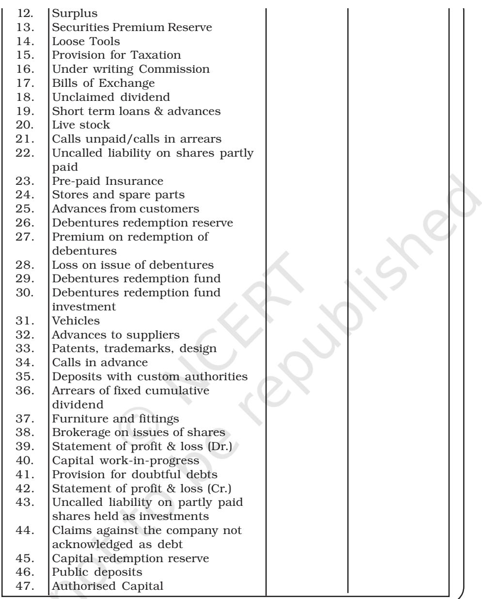

#### LEARNING OBJECTIVES

*After studying this chapter, you will be able to :*

- *• explain the nature and objectives of financial statements of a company;*
- *• describe the form and content of Statement of Profit and Loss of a company as per schedule III;*
- *• describe the form and content of balance sheet of a company as per schedule III;*
- *• explain the significance and limitations of financial statements; and*
- *• prepare the financial statements.*

H aving understood how a company raises its capital, we have to learn the nature, objectives and types of financial statements it has to prepare including their contents, format, uses and limitations. The financial statements are the end products of accounting process. They are prepared following accounting policies consistently accounting standards prescribed in the Companies Act and accounting concepts, principles, procedures and also the legal environment in which the business organisations operate. These statements are the outcome of the summarising process of accounting and are, therefore, the sources of information on the basis of which conclusions are drawn about the profitability and the financial position of a company. Hence, they need to be arranged in a proper form with suitable contents so that the shareholders and other users of financial statements can easily understand and use them in their economic decisions in a meaningful way.

# 3.1 Meaning of Financial Statements

Financial statements are the basic and formal annual reports through which the corporate management communicates financial information to its owners and various other external parties which include investors, tax authorities, government, employees, etc. These refer to: the balance sheet (position statement) as at the end of accounting period, the statement of profit and loss of a company and the cash flow statement.

#### **3.2 Nature of Financial Statements**

The chronologically recorded facts about events expressed in monetary terms for a defined period of time are the basis for the preparation of periodical financial statements which reveal the financial position as on a date and the financial results obtained during a period. The American Institute of Certified Public Accountants states the nature of financial statements as, "the statements prepared for the purpose of presenting a periodical review of report on progress by the management and deal with the status of investment in the business and the results achieved during the period under review. They reflect a combination of recorded facts, accounting principles and personal judgements".

The following points explain the nature of financial statements:

- 1. *Recorded Facts:* Financial statements are prepared on the basis of facts in the form of cost data recorded in accounting books. The original cost or historical cost is the basis of recording transactions. The figures of various accounts such as cash in hand, cash at bank, trade receivables, fixed assets, etc., are taken as per the figures recorded in the accounting books. The assets purchased at different times and at different prices are put together and shown at costs. As these are not based on market prices, the financial statements do not show current financial condition of the concern.
- 2. *Accounting Conventions:* Certain accounting conventions are followed while preparing financial statements. The convention of valuing inventory at cost or market price, whichever is lower, is followed. The valuing of assets at cost *less* depreciation principle for balance sheet purposes is followed. The convention of materiality is followed in dealing with small items like pencils, pens, postage stamps, etc. These items are treated as expenditure in the year in which they are purchased even though they are assets in nature. The stationery is valued at cost and not on the principle of cost or market price, whichever is less. The use of accounting conventions makes financial statements comparable, simple and realistic.
- 3. *Postulates:* Financial statements are prepared on certain basic assumptions (pre-requisites) known as postulates such as going concern postulate, money measurement postulate, realisation postulate, etc. Going concern postulate assumes that the enterprise is treated as a going concern and exists for a longer period of time. So the assets are shown on historical cost basis. Money measurement postulate assumes that the value of money will remain the same in different periods. Though there is drastic change in purchasing power of money, the assets purchased at different times will be shown at

the amount paid for them. While, preparing statement of profit and loss the revenue is included in the sales of the year in which the sale was undertaken even though the sale price may be received over a number of years. The assumption is known as realisation postulate.

- 4. *Personal Judgements:* Under more than one circumstance, facts and figures presented through financial statements are based on personal opinion, estimates and judgements. The depreciation is provided taking into consideration the useful economic life of fixed assets. Provisions for doubtful debts are made on estimates and personal judgements. In valuing inventory, cost or market value, whichever is less is being followed. While deciding either cost of inventory or market value of inventory, many personal judgements are to be made based on certain considerations. Personal opinion, judgements and estimates are made while preparing the financial statements to avoid any possibility of over statement of assets and liabilities, income and expenditure, keeping in mind the convention of conservatism.
Thus, financial statements are the summarised reports of recorded facts and are prepared the following accounting concepts, conventions, accounting policies, accounting standards and requirements of Law.

# **3.3 Objectives of Financial Statements**

Financial statements are the basic sources of information to the shareholders and other external parties for understanding the profitability and financial position of any business concern. They provide information about the results of the business concern during a specified period of time in terms of assets and liabilities, which provide the basis for taking decisions. Thus, the primary objective of financial statements is to assist the users in their decision-making. The specific objectives include the following:

- 1. *To provide information about economic resources and obligations of a business:* They are prepared to provide adequate, reliable and periodical information about economic resources and obligations of a business firm to investors and other external parties who have limited authority, ability or resources to obtain information.
- 2. *To provide information about the earning capacity of the business:* They are to provide useful financial information which can gainfully be utilised to predict, compare and evaluate the business firm's earning capacity.
- 3. *To provide information about cash flows:* They are to provide information useful to investors and creditors for predicting, comparing and evaluating, potential cash flows in terms of amount, timing and related uncertainties.
- 4. *To judge effectiveness of management:* They supply information useful for judging management's ability to utilise the resources of a business effectively.
- 5. *Information about activities of business affecting the society:* They have to report the activities of the business organisation affecting the society, which can be determined and described or measured and which are important in its social environment.
- 6. *Disclosing accounting policies:* These reports have to provide the significant policies, concepts followed in the process of accounting and changes taken up in them during the year to understand these statements in a better way.

# **3.4 Types of Financial Statements**

The financial statements generally include two statements: balance sheet and statement of profit and loss which are required for external reporting and also for internal needs of the management like planning, decision-making and control. Apart from these, there is also a need to know about movements of funds and changes in the financial position of the company. For this purpose, a cash flow statement is prepard.

Every company registered under The Companies Act 2013 shall prepare its balance sheet, statement of profit and loss and notes to account thereto in accordance with the manner prescribed in the revised Schedule III to the Companies Act, 2013 to harmonise the disclosure requirement with the accounting standards and to converge with new reforms.

| Particulars | Note No. | Figure as | Figure as |
| --- | --- | --- | --- |
|  |  | at the end | at the end |
|  |  | of Current | of Previous |
|  |  | reporting | reporting |
|  |  | period | period |
| I. EQUITY AND LIABILITIES |  |  |  |
| 1) Shareholder's Funds |  |  |  |
| (a) Share Capital |  |  |  |
| (b) Reserves and Surplus |  |  |  |
| (c) Money received against share warrants |  |  |  |
| 2) Share Application money pending allotment |  |  |  |

**Balance Sheet as at 31st March, 20.....**

| 3) | Non-current Liabilities |
| --- | --- |
|  | (a) Long term borrowings |
|  | (b) Deferred tax liabilities (net) |
|  | (c) Other long term liabilities |
|  | (d) Long term provisions |
| 4) | Current Liabilities |
|  | (a) Short-term borrowings |
|  | (b) Trade payables |
|  | (c) Other current liabilities |
|  | (d) Short-term provisions |
|  | Total |
| II. ASSETS |  |
| 1) | Non-Current Assets |
| (a) | Fixed assets |
|  | (i) Tangible assets |
|  | (ii) Intangible assets |
|  | (iii) Capital work-in-progress |
|  | (iv) Intangible assets under development |
| (b) | Non-current investments |
| (c) | Deferred tax assets (net) |
| (d) | Long-term loans and advances |
| (e) | Other non-current assets |
| 2) | Current Assets |
| (a) | Current investments |
| (b) | Inventories |
| (c) | Trade receivables |
| (d) | Cash and cash equivalents |
| (e) | Short term loans and advances |
| (f) | Other current assets |
|  | Total |
|  | See accompanying notes to the financial statements |
| NOTES: |  |

#### **Exhibit. 3.1: Form of Balance Sheet**

# *Important Features of Presentation*

- 1. It applies to all Indian companies preparing financial statement as per Schedule III to the Comapnies Act, 2013.
- 2. It does not apply to (i) Insurance or Banking Company, (ii) Company for which a form of balance sheet or income statement is specified under any other Act.
- 3. Accounting standards shall prevail over Schedule III of the Companies Act, 2013.
- 4. Disclosure on the face of the financial statements or in the notes are essential and mandatory.
- 5. Terms in the revised Schedule III will carry the meaning as defined by the applicable accounting standards.
- 6. Balance to be maintained between excessive details that may not assist users of financial statements and not providing important information.
- 7. Current and non-current bifurcation of assets and liabilities is applicable.

#### **Box 1**

#### **Rounding-off Rule for figures in the Presentation of Financial Statements**

Rounding off of figures to be reported in the financial statements is based on the size of turnover:

- 1. Turnover < Rs.100 crore: Nearest hundreds, thousands, lakhs or millions or decimal thereof;
- 2. Turnover > Rs.100 crore: Nearest lakhs or millions or decimal thereof;
- 8. Rounding off requirements is mandatory (refer box 1).
- 9. Vertical format for presentation of financial statement is prescribed (refer Exhibit 3.1).
- 10. Debit balance in the statement of profit and loss to be disclosed as negative figure under the head "Surplus".
- 11. Mandatory disclosure for share application money pending allotment.
- 12. 'Sundry Debtors' and 'Sundry Creditors' replaced by terms 'Trade Receivables' and 'Trade Payables'.

#### **Shareholders Fund**

The shareholders' funds are sub-classified on the face of the balance sheet.

- a) Share Capital
- b) Reserves and Surplus
- c) Money received against Share Warrants

# **Share Capital**

Disclosures relating to share capital are to be given in notes to accounts. The following additions/modifications are significant:

- a) For each class of shares, recognition of the number of shares outstanding at the beginning and at the end of the reporting period is required.
- b) The rights, preferences and restrictions attached to each class of shares including restrictions on the distribution of dividends and repayment of capital.
- c) In order to bring clarity regarding the identity of ultimate owners of the company:
- i) Disclosure of shares in respect of each class in the company held by its holding company or its ultimate holding company including shares held by subsidiaries or associates of holding company or the ultimate holding company in aggregate.
- ii) Disclosure of shares in the company held by each shareholder holding more than 5% shares specifying the number of shares held.
- iii) Disclosure of the following for the period of 5 years immediately preceding the date of the balance sheet:
	- Aggregate number and class of shares allotted as fully paid up pursuant to contracts without payment being received in cash.
	- Aggregate number and class of shares allotted as fully paid up by way of bonus shares.
	- Aggregate number and class of shares bought back.

This may be noted that the information of shareholders funds are presented on the face of financial statements limited only to broad and significant items. Details are given in Notes to Accounts.

- d) For each class of share capital:
	- i) The number and amount of share authorised.
	- ii) The number of shares issued, subscibed, fully paid and subscribed but not fully paid.
	- iii) Par value per share.
	- iv) Reconciliation of the number of shares outstanding at the beginning and end of the accounting period.
	- v) Rights, preferences and restrictions attaching each class of shares including restrictions on the distribution of dividends and repayment of capital.
	- vi) Aggregate number of shares with respect to each class in the company held by its holding company, its ultimate holding company including shares held by or by subsidiaries or associates of the holding company or the ultimate holding company.
	- vii) Shares reserved for issue under options and contracts/ commitments for the sale of shares/disinvestment, including terms and amount.
	- viii) For a period of 5 years immediately proceeding the date at which balance sheet in prepared for:
		- (a) Shares reserved under contracts/commitments.
		- (b) Number and class of shares bought back.
		- (c) Number and class of shares allotted for consideration other than cash and bonus shares.

- ix) Terms of any securities convertible into equity/preference shares issued along with earliest date of conversion in descending order, starting from the farthest such date.
- x) Calls unpaid (aggregate).
- xi) Forfeited shares (amout originally paid up).

# **Reserve and Surplus**

Reserves and Surplus are required to be classified as:

- i) Capital Reserve
- ii) Capital Redemption Reserve
- iii) Securities Premium Reserve
- iv) Debenture Redemption Reserve
- v) Revaluation Reserve
- vi) Share Options Outstanding Account
- vii) Other Reserves (Specifying nature and purpose)
- viii) Surplus: Balance in statement of profit and loss; disclosing allocations and Appropriation such as dividend, bonus shares, transfer to/from reserve, etc.

Significant additions/modifications regarding disclosure of reserve and surplus are as follows:

- a) A reserve specifically represented by earmarked investments shall be termed as "Fund".
- b) 'Debit' balance of statement of profit and loss shall be shown as a negative figure under 'Surplus' head.
- c) The balance of "Reserve and Surplus" after adjusting negative balance of Surplus, if any, shall be shown under "Reserve and Surplus" read even if the resulting figure is 'negative'.
- d) Share options outstanding account has been recognised as a separate item under 'Reserve and Surplus'. ICAI's Guidance Note on Accounting for Employee share based payments requires a credit balance in the *'Stock option outstanding Account'* to be disclosed in balance sheet under separate heading' between share capital and reserves and surplus as a part of shareholders fund.

# **Money Received against share warrants**

It is the amount received by the company which are converted into shares at a specified date on a specified rate. The instrument issued against the amount so received as share warrants.

Money received against share warrants' to be disclosed as a separate line item under 'shareholder's fund'.

# **Illustration 1**

Dinkar Ltd. has an authorised capital of Rs. 50,00,000 divided into equity shares of Rs. 100 each. The company invited applications for 40,000 shares, applications for 36,000 shares were received. All calls were made and duly received except for 500 shares on which the final call of Rs. 20 was not received. The company forfeited 200 shares on which final call was not received. Show how share capital will appear in the balance sheet of the company. Also prepare 'Notes to Accounts' for the same.

> **Books of Dinkar Limited Balance Sheet as at .......... (Date)**

#### **Solution:**

| Particulars | Note | Amount |
| --- | --- | --- |
|  | No. | (Rs.) |
| I. Equity and Liabilities |  |  |
| 1. Shareholders' funds |  |  |
| a) Share capital | 1 | 35,90,000 |

#### Notes to Accounts

|  | Particulars | Amount | Amount |
| --- | --- | --- | --- |
|  |  | (Rs.) | (Rs.) |
| 1. | Share capital |  |  |
|  | Authorised share capital |  |  |
|  | 50,000 equity shares of Rs. 100 each |  | 50,00,000 |
|  | Issued capital |  |  |
|  | 40,000 equity shares of Rs. 100 each |  | 40,00,000 |
|  | Subscirbed and fully paid up capital |  |  |
|  | 35,500 equity shares of Rs. 100 each |  |  |
|  | fully paid |  | 35,50,000 |
|  | Subscirbed but not fully paid-up capital |  |  |
|  | 300 equity shares of Rs. 100 each fully |  |  |
|  | called up | 30,000 |  |
|  | Less: Calls-in-arrears (300×20) | 6,000 |  |
|  |  | 24,000 |  |
|  | Add: Share forfeiture A/c (200 shares × Rs. 80) | 16,000 | 40,000 |
|  |  |  | 35,90,000 |

### **Current and Non-current Classification**

The classified balance sheet in terms of current and non-current assets and current and non-current liabilities have been introduced. The

criteria for defining current assets and liabilities has been clearly spelled out with non-current assets and liabilities being the residual items.

#### **Current/Non-current distinction**

An item is classified as current:

- if it is involved in entity's operating cycle or,
- is expected to be realised/settled within twelve months or,
- if it is held primarily for trading or,
- is cash and cash equivalent or,
- if entity does not have on unconditional rights to defer settlement of liability for atleast 12 months after the reporting period,
- Other assets and liabilities are non-current.

# **Illustration 2**

Show the following items in the balance sheet of Amba Ltd. as on March 31, 2017: Rs.

| 8% Debentures | 10,00,000 |
| --- | --- |
| Equity share capital | 50,00,000 |
| Securities premium | 20,000 |
| Preliminary expenses | 40,000 |
| Statement of Profit & Loss (cr.) | 1,50,000 |
| Loose tools | 20,000 |
| Bank balance | 60,000 |
| Cash in hand | 38,000 |

#### **Solution:**

# **Books of Amba Ltd. *Balance Sheet as at March 31, 2017**

| Particulars |  | Note | Amount |
| --- | --- | --- | --- |
|  |  | No. | (Rs.) |
| I. Equity and Liabilities |  |  |  |
| 1. Shareholders' Funds |  |  |  |
| a) | Share capital |  | 50,00,000 |
| b) | Reserve and surplus | 1 | 1,30,000 |
| 2. | Non-current Liabilities |  |  |
| a) Long-term borrowings |  | 2 | 10,00,000 |
| II. Assets |  |  |  |
| Current assets |  |  |  |
| a) | Inventories | 3 | 20,000 |
| b) Cash and cash equivalents |  | 4 | 98,000 |
| c) | Other current assets | 5 | 10,000 |

* Relevant items only

|  | Particulars |  | Amount | Amount |
| --- | --- | --- | --- | --- |
|  |  |  | (Rs.) | (Rs.) |
| 1. | Reserve and surplus |  |  |  |
|  | Securities premium | 20,000 |  |  |
|  | Less: Preliminary expenses | (40,000) |  |  |
|  |  |  | (20,000) |  |
|  | Statement of profit and loss |  | 1,50,000 | 1,30,000 |
| 2. | Long-term borrowings |  |  |  |
|  | 8% debentures |  |  | 10,00,000 |
| 3. | Inventory |  |  |  |
|  | Loose tools |  |  | 20,000 |
| 4. | Cash and cash equivalents |  |  |  |
|  | Bank balance |  | 60,000 |  |
|  | Cash in hand |  | 38,000 | 98,000 |
| 5. | Other current assets |  |  |  |
|  | Discount on issue of 8% debentures |  |  | 10,000 |
|  | ( of Rs. 40,000) |  |  |  |

#### Notes to Accounts

#### **Important points:**

- Preliminary expenses are to be written-off completely in the year in which such expenses are incurred. They should be written-off first from securities premium and the balance if any, from statement of profit & loss.
- Borrowing costs such as discount on issue of debentures should be written-off in the same year in which debuntures are issued.

#### **Share application money pending allotment**

Share application money not exceeding the issued capital and to the extent non-refundable shall be classified as non-current. It will be shown on this face of balance sheet as share application money pending allotment.

#### **Borrowings**

Total borrowings are categorised into long-term borrowings, short-term borrowings and current maturities to long-term debt.

- (i) Loans which are repayable in more than twelve months/operating cycle are classified as long-term borrowings on the face of balance sheet.
- (ii) Loans repayable on demand or whose original tenure is not more than twelve months/operating cycle are classified as short-term borrowings on the face of balance sheet.

- (iii) Current maturities to long-term loan include amount repayable within twelve months/operating cycle under other current liabilities with Note to Account.
**Deferred tax assets/liabilities** are always non-current. This is in accordance with Schedule III of the Companies Act.

# **Trade payables**

Sundry creditors have been replaced with the term Trade payables and are classified as current and non-current. Trade payables to be settled beyond 12 months from the date of balance sheet or beyond the operating cycle are classified under "other long-term liabilities" with Note to Account. For example, purchase of goods and services in normal course of business. The balance of trade payables are classified as current liabilities on the face of balance sheet.

# **Proposed Dividend**

Proposed dividend is proposed by the Board of Directors and declared (approved) by the shareholders in their Annual General Meeting. Board of Directors propose the dividend after the annual accounts for the year have been prepared. Annual General Meeting of the shareholders is held thereafter meaning it is held in the next financial year.

Shareholders may reduce the amount of proposed dividend but cannot increase it. Since declaration of proposed (final) dividend is contingent upon shareholders approval, Proposed dividend is shown as contingent liability.

AS-4, Contingencies and Events Occurring after the Balance Sheet Date prescribes that proposed dividend will be shown in the Notes to Accounts.

After the Proposed dividend is declared by the shareholders, it becomes a liability for the company and is accounted in the books. As a consequence, proposed dividend of previous year will be declared (approved) by the shareholders in the current year and this declared (approved) proposed dividend will be accounted during the year. Proposed dividend for the current year will be relevant for the next financial year.

Briefly, proposed dividend of previous year will be accounted in the current year after it is declared (approved) by the shareholders in their annual general meeting.

# **Provisions**

The amount of provision settled within 12 months from balance sheet date or within operating cycle period from date of its recognition is classified as short term provisions and shown under current liabilities on the face of balance sheet. Others are depicted as long-term provisions under non-current liabilities on the face of balance sheet.

# **Fixed assets**

There is no change in the treatment of fixed assets. Both tangible and intangible assets are non-current. This may also be noted if the useful life of the asset is less than 12 months, it will still fall under non-current.

# **Investments**

Investments are also classified into current and non-current categories. Investments expected to realise within twelve months are considered as current investments under current assets. Others are classified as non-current investments under non-current assets. Both are however shown on the face of the balance sheet.

# **Inventories**

All inventories are always treated as current.

# **Trade receivables**

Trade receivables realised beyond twelve months from reporting date/ operating cycle starting from the date of their recognition are classified as "Other non-current assets" under the head non-current assets with Note to Accounts. For example, sale of goods or services rendered in normal course of business. Others are classified as current assets and shown on the face of the balance sheet.

# **Cash and cash equivalent**

It is always current however, amounts which qualify as cash and cash equivalents as per AS-3 is shown here. The supremacy is accorded to AS over Schedule III, cash and cash equivalents are to the disclosed in accordance to the prescribed standard.

# **Illustration 3**

Show the following items in the balance sheet of Sunfill Ltd. as at March 31, 2017:

| Particulars | Amount (Rs.) |
| --- | --- |
| General Reserve (since 31 March 2012) | 5,00,000 |
| Statement of profit & loss (debit balance) for 2016–17 | (3,00,000) |

# **Solution:**

#### **Books of Sunfill Ltd. Balance Sheet as at March 31, 2017**

| Particulars | Note | 31st March | 31st March |
| --- | --- | --- | --- |
|  | No. | 2017 (Rs.) | 2016 (Rs.) |
| I. Equity and Liabilities |  |  |  |
| 1. Shareholders' Funds |  |  |  |
| Reserve and surplus | 1 | 2,00,000 | 5,00,000 |

| Notes to Accounts |
| --- |

|  | Particulars | Amount |
| --- | --- | --- |
|  |  | (Rs.) |
| 1. | Reserve and surplus |  |
|  | General Reserve (1 April, 2016) | 5,00,000 |
|  | Less: Statement of profit and loss | 3,00,000 |
|  | (Dr. balance) |  |
|  |  | 2,00,000 |

# **Illustration 4**

Show the following items in the balance sheet of Avalon Ltd., as at March 31, 2017:

|  | (Rs.) in |
| --- | --- |
|  | Lakh |
| General Reserve (since 31 March 2016) | 5 |
| Statement of Profit & Loss (Debit Balance) for 2016–17 | (8) |

#### **Solution:**

#### **Books of Avalon Ltd. Balance Sheet as at March 31, 2017**

| Particulars | Note | 31 March |
| --- | --- | --- |
|  | No. | 2017 (Rs.) |
| I. Equity and Liabilities |  |  |
| 1. Shareholders' Funds |  |  |
| a) Reserve and Surplus | 1 | (3,00,000) |

Notes to Accounts

|  | Particulars | Amount |
| --- | --- | --- |
|  |  | (Rs.) |
| 1. | Reserve and Surplus |  |
|  | i) General reserve (1 April, 2012) | 5,00,000 |
|  | ii) Less: Statement of profit and loss | (8,00,000) |
|  | (debit balance) | (3,00,000) |

# **Illustration 5**

Arushi Ltd. issued 5,000, 10% debentures of Rs. 100 each at par but redeemable at a premium of 5% after 5 years. Show these items in the balance sheet of the company.

#### **Solution:**

| Particulars | Note | Amount |
| --- | --- | --- |
|  | No. | (Rs.) |
| I. Equity and Liabilities |  |  |
| 1. Shareholders' Funds |  |  |
| Reserve and Surplus |  | (25,000) |
| a) Long term borrowings | 2 | 5,00,000 |
| b) Other long-term liabilities | 3 | 25,000 |
| Total |  | 5,00,000 |
| II. Asset |  |  |
| 1. Current Assets |  |  |
| a) Cash and Cash Equivalents |  | 5,00,000 |
| Total |  | 5,00,000 |

Notes to Accounts

| Particulars | Amount |
| --- | --- |
|  | (Rs.) |
| 1. Reserves and Surplus i.e. Balance in Statement of Profit & Loss | (25,000) |
| 2. Long Terms Borrowings |  |
| 5000, 10% debenture Rs. 100 each | 5,00,000 |
| 3. Other long term liabilities | 25,000 |
| Premium on Redemption of Debentures |  |
| 4. Cash and Cash Equivalents |  |
| Cash at bank. |  |
|  | 5,00,000 |

#### **Do it yourself**

Classify the following items in the balance sheet of a company under Major heads and Sub-heads

| S. No. | Items | Major Head | Sub-head (if any) |
| --- | --- | --- | --- |
| 1. | Goodwill |  |  |
| 2. | Forfeited shares |  |  |
| 3. | Acceptances |  |  |
| 4. | Preliminary expenses |  |  |
| 5. | Capital reserve |  |  |
| 6. | Loans from banks |  |  |
| 7. | Investment in shares and |  |  |
|  | debentures |  |  |
| 8. | Interest accrued and due on |  |  |
|  | debentures |  |  |
| 9. | Interest accrued but not due on |  |  |
|  | Secured Loans |  |  |
| 10. | Interest accrued but not due on |  |  |
|  | Unsecured Loans |  |  |
| 11. | Interest accrued on Investments |  |  |

# **Illustration 6**

From the given particulars of Shine and Bright Co. Ltd., as at March 31, 2017, prepare balance sheet in accordance to the Schedule III:

| Particulars | Amount | Particulars | Amount |
| --- | --- | --- | --- |
|  | (Rs.) |  | (Rs.) |
| Preliminary expenses | 2,40,000 | Goodwill | 30,000 |
| 10% Debentures | 2,00,000 | Loose Tools | 12,000 |
| Stock in trade | 1,40,000 | Motor vehicles | 4,75,000 |
| Cash at bank | 1,35,000 | Provision for tax | 16,000 |
| Bills receivables | 1,20,000 |  |  |

# *Solution***:**

| Book of Shine and Bright Ltd. |  |  |  |  |
| --- | --- | --- | --- | --- |
| Balance Sheet as at March 31, 2017 |  |  |  |  |
| Note | Particulars |  | Figure as | Figure as |
| No. |  |  | at the end | at the end |
|  |  |  | of current | of previous |
|  |  |  | reporting | reporting |
|  |  |  | period | period |
| I. Equity and Liabilities |  |  |  |  |
| 1. | Non-current Liabilities |  |  |  |
| a) | Long-term borrowings | 1 | 2,00,000 |  |
| 2. | Current liabilities |  |  |  |
| a) | Short-term provisions | 2 | 16,000 |  |
| II. Assets |  |  |  |  |
| 1. | Non-current assets |  |  |  |
| a) | Fixed assets |  |  |  |
| Tangible assets |  | 3 | 4,75,000 |  |
| Intangible assets |  | 4 | 30,000 |  |
| 2. | Other non-current assets* | 5 | 2,60,000 |  |
| Current assets |  |  |  |  |
| a) Inventories |  | 6 | 1,52,000 |  |
| b) Trade receivables |  | 7 | 12,000 |  |
| c) Cash and cash equivalents |  |  | 1,35,000 |  |

#### Notes to Accounts

|  | Particulars | Amount (Rs.) |
| --- | --- | --- |
| 1. | Long-term borrowings: |  |
|  | 10% debentures | 2,00,000 |
| 2. | Short-term provisions: |  |
|  | Provision for taxation | 16,000 |
| 3. | Fixed assets: |  |
|  | (i) Tangible assets |  |
|  | Motor vehicles | 4,75,000 |

|  | (ii) Intangible assets |  |  |
| --- | --- | --- | --- |
|  | Goodwill |  | 30,000 |
| 4. | Other non-current assets |  |  |
|  | Preliminary expenses | 2,40,000 |  |
|  |  |  | 2,40,000 |
| 5. | Inventories |  |  |
|  | Stock in trade | 1,40,000 |  |
|  | Loose tools | 12,000 | 1,52,000 |
| 6. | Trade receivables |  |  |
|  | Bills receivables |  | 12,000 |
| 7. | Cash & cash equivalents |  |  |
|  | Cash at bank |  | 1,35,000 |

# **3.4.2 Form and content of Statement of Profit and Loss Statement of Profit and Loss for the year ended ______________**

|  | Particulars | Note No. | Figure as | Figure as |
| --- | --- | --- | --- | --- |
|  |  |  | at the end | at the end |
|  |  |  | of Current | of Previous |
|  |  |  | reporting | reporting |
|  |  |  | period | period |
| I | Revenue from operations |  |  |  |
| II | Other income |  |  |  |
| III | Total Revenue (I+II) |  |  |  |
| IV | Expenses: |  |  |  |
|  | Cost of materials consumed |  |  |  |
|  | Purchases of stock-in-trade |  |  |  |
|  | Changes in inventories of finished goods |  |  |  |
|  | Work-in-progress and stock-in-trade |  |  |  |
|  | Employee benefits expense |  |  |  |
|  | Finance costs |  |  |  |
|  | Depreciation and amortisation expense |  |  |  |
|  | Other expenses |  |  |  |
|  | Total expenses |  |  |  |
| V | Profit before extraordinary items and tax |  |  |  |
|  | (III-IV) |  |  |  |
| VI | Exceptional items |  |  |  |
| VII | Profit before extraordinary items and tax |  |  |  |
|  | (V-VI) |  |  |  |
| VIII | Extraordinary items |  |  |  |
| IX | Profit before tax (VII-VIII) |  |  |  |

| X | Tax expense: |
| --- | --- |
|  | (1) Current tax |
|  | (2) Deferred tax |
| XI | Profit/(Loss) for the period from continuing |
|  | operations (IX-X) |
| XII | Profit/(Loss) from discontinuing operations |
| XIII | Tax expense of discontinuing operations |
| XIV | Profit/(Loss) from Discontinuing operations |
|  | (after tax) (XII-XIII) |
| XV | Profit/(Loss) for the period (XI + XIV) |
| XVI | Earnings per equity share: |
|  | (1) Basic |
|  | (2) Diluted |

#### **Exhibit. 3.2: Form of Statement of Profit and Loss**

The items of statement of profit and loss are discussed as follows:

- 1. Revenue from operations
This includes:

- (i) Sale of products
- (ii) Sale of services
- (iii) Other operating revenues

In respect to a finance company, revenue from operations shall include revenue from interest, dividend and income from other financial services.

It may be noted that under each of the above heads shall be disclosed separately by way of notes to accounts to the extent applicable.

- 2. Other income
	- (i) Interest income (in case of a company other than a finance company),
	- (ii) Dividend income,
	- (iii) Net gain/loss on sale of investments,
	- (iv) Other non-operating income (net of expenses directly attributable to such income).
- 3. Expense

| Expenses incurred to earn the income shown under various heads as discussed below: |  |  |
| --- | --- | --- |
| (a) Cost of Materials |  | It applies to manufacturing companies. It consists of |
|  |  | raw materials and other materials consumed in |
|  | manufacturing of goods. |  |
| (b)Purchase of Stock-in-trade |  | It means purchases of goods for the purpose of |
|  | trading. |  |

| (c) | Changes in inventories of | It is the difference between opening inventory (stock) |
| --- | --- | --- |
|  | finished goods, WIP and | of finished goods, WIP and stock-in-trade and closing |
|  | stock-in-trade | inventory. |
|  | (d)Employees benefit expenses | Expenses incurred on employees towards salary, |
|  |  | wages, leave encashment, staff welfare, etc., are |
|  |  | shown under this head. Employees benefit expenses |
|  |  | may be further categorised into direct and indirect |
|  |  | expenses. |
| (e) | Finance cost | It is the expenses towards interest charges during |
|  |  | the year on the borrowings. Only the interest cost is |
|  |  | to be shown under this head. Other financial |
|  |  | expenses such as bank charges are shown under |
|  |  | "Other Expenses". |
| (f) | Depreciation | Depreciation is the diminution in the value of fixed |
|  |  | assets whereas amortisation is writing off the amount |
|  |  | relating to intangible assets. |
| (g) | Other expenses | All other expenses which do not fall in the above |
|  |  | categories are shown under other expenses. Other |
|  |  | expenses may further be categorised into direct |
|  |  | expenses, indirect expenses and non-operating |
|  |  | expenses. |

#### **Illustration 8**

From the following particulars, prepare Statement of profit and loss for the year ending March 2017, showing profit before tax as per schedule III of the companies Act – 2013.

| Balances | (Rs.) | (Rs.) |
| --- | --- | --- |
| Plant and Machinery | 1,60,000 |  |
| Land | 6,74,000 |  |
| Depreciation on Plant and Machinery | 16,000 |  |
| Purchases (Adjusted) | 4,00,000 |  |
| Closing stock | 1,50,000 |  |
| Wages | 1,20,000 |  |
| Sales (Net) |  | 10,00,000 |
| Salaries | 80,000 |  |
| Bank overdraft |  | 2,00,000 |
| 10% debentures (issued on 1st April, 2016) |  | 1,00,000 |
| Equity share capital – shares of Rs. 100 each (fully paid) |  | 2,00,000 |
| Preference share capital – 1,000; 6% shares of Rs. 100 |  | 1,00,000 |
| each (fully paid) |  |  |
|  | 16,00,000 | 16,00,000 |

#### **Solution**

|  | for the year ending 31st | March, 2017 |  |
| --- | --- | --- | --- |
|  | Particulars | Note | Amount |
|  |  | No. | (Rs.) |
| I. | Income |  |  |
|  | Revenue from operations (Sales) |  | 10,00,000 |
|  | Total |  | 10,00,000 |
|  | II. Expenses |  |  |
|  | Cost of materials consumed (Adjusted purchase) |  | 4,00,000 |
|  | Employees benefit expenses | 1 | 2,00,000 |
|  | Finance cost |  | 10,000 |
|  | Depreciation and amortisation |  | 16,000 |
|  | Total |  | 6,26,000 |
|  | Profit before tax (I-II) |  | 3,74,000 |

#### **Statement of Profit and Loss for the year ending 31st March, 2017**

Notes to Accounts

| Particulars | Amount | Amount |
| --- | --- | --- |
|  | (Rs.) | (Rs.) |
| Employee Benefit Expenses |  |  |
| (i) Wages | 1,20,000 |  |
| (ii) Salary | 80,000 | 2,00,000 |

# **3.5 Uses and Importance of Financial Statements**

The users of financial statements include management, investors, shareholders, creditors, government, bankers, employees and public at large. Financial statements provide the necessary information about the performance of the management to these parties interested in the organisation and help in taking appropriate economic decisions. It may be noted that the financial statements constitute an integral part of the annual report of the company in addition to the directors report, auditors report, corporate governance report, and management discussion and analysis.

The various uses and importance of financial statements are as follows:

- 1. *Report on stewardship function:* Financial statements report the performance of the management to the shareholders. The gaps between the management performance and ownership expectations can be understood with the help of financial statements.
- 2. *Basis for fiscal policies:* The fiscal policies, particularly taxation policies of the government, are related with the financial performance of corporate undertakings. The financial statements provide basic input for industrial, taxation and other economic policies of the government.
- 3. *Basis for granting of credit:* Corporate undertakings have to borrow funds from banks and other financial institutions for different purposes. Credit granting institutions take decisions based on the financial performance of the undertakings. Thus, financial statements form the basis for granting of credit.
- 4. *Basis for prospective investors:* The investors include both short-term and long-term investors. Their prime considerations in their investment decisions are security and liquidity of their investment with reasonable profitability. Financial statements help the investors to assess longterm and short-term solvency as well as the profitability of the concern.
- 5. *Guide to the value of the investment already made:* Shareholders of companies are interested in knowing the status, safety and return on their investment. They may also need information to take decision about continuation or discontinuation of their investment in the business. Financial statements provide information to the shareholders in taking such important decisions.
- 6. *Aids trade associations in helping their members:* Trade associations may analyse the financial statements for the purpose of providing service and protection to their members. They may develop standard ratios and design uniform system of accounts.
- 7. *Helps stock exchanges:* Financial statements help the stock exchanges to understand the extent of transparency in reporting on financial performance and enables them to call for required information to protect the interest of investors. The financial statements enable the Stock brokers to judge the financial position of different concerns and take decisions about the prices to be quoted.

# **3.6 Limitations of Financial Statements**

Though utmost care is taken in the preparation of the financial statements and provide detailed information to the users, they suffer from the following limitations:

- 1. *Do not reflect current situation:* Financial statements are prepared on the basis of historical cost. Since the purchasing power of money is changing, the values of assets and liabilities shown in financial statement do not reflect current market situation.
- 2. *Assets may not realise:* Accounting is done on the basis of certain conventions. Some of the assets may not realise the stated values, if the liquidation is forced on the company. Assets shown in the balance sheet reflect merely unexpired or unamortised cost.
- 3. *Bias:* Financial statements are the outcome of recorded facts, accounting concepts and conventions used and personal judgements made in different situations by the accountants. Hence, bias may be observed in the results, and the financial position depicted in financial statements may not be realistic.
- 4. *Aggregate information:* Financial statements show aggregate information but not detailed information. Hence, they may not help the users in decision-making much.
- 5. *Vital information missing:* Balance sheet does not disclose information relating to loss of markets, and cessation of agreements, which have vital bearing on the enterprise.
- 6. *No qualitative information:* Financial statements contain only monetary information but not qualitative information like industrial relations, industrial climate, labour relations, quality of work, etc.
- 7. *They are only interim reports:* Statement of Profit and Loss discloses the profit/loss for a specified period. It does not give an idea about the earning capacity over time similarly, the financial position reflected in the balance sheet is true at that point of time, the likely change on a future date is not depicted.

# *Terms Introduced in the Chapter*

- 1. Financial Statements
- 2. Statement of profit and loss
- 3. Balance Sheet
- 4. Cost of Material consumed
- 5. Shareholders Funds

#### *Summary*

*Financial Statements:* Financial statements are the end products of accounting process, which reveal the financial results of a specified period and financial position as on a particular date. Financial Statements are prepared and published by corporate undertakings for the benefit of various stakeholders. These statements include Statement of profit and loss and balance sheet. The basic objective of these statements is to provide information required for decisionmaking by the management as well as other outsiders who are interested in the affairs of the undertaking.

*Balance Sheet:* The balance sheet shows all the assets owned by the concern, all the obligations or liabilities payable to outsiders or creditors and claims of the owners on a particular date. It is one of the important statements depicting the financial position or status or strength of an undertaking.

*Statement of Profit and Loss:* The Statement of profit and loss is prepared for a specific period to determine the operational results of an undertaking. It is a statement of revenue earned and the expenses incurred for earning the revenue. It is a performance report showing the changes in income, expenses, profits and losses as a result of business operations during the year between two balance sheet dates.

*Significance of Financial Statements:* The users of financial statements include Shareholders, Investors, Creditors, Lenders, Customers, Management, Government, etc. Financial statements help all the users in their decision-making process. They provide data about general purpose needs of these members.

*Limitations of Financial Statements:* Financial statements are not free from limitations. They provide only aggregate information to satisfy the general purpose needs of the users. They are technical statements understood by only persons having some accounting knowledge. They reflect historical information but not current situation, which is essential in any decision making. In addition, one can get idea about the organisation's performance in terms of quantitative changes but not in qualitative terms like labour relations, quality of work, employees satisfaction, etc. The financial statements are neither complete nor accurate as the flow of income and expenses are segregated using best judgement apart from accepted concepts. Hence, these statements need proper analysis before their use in decisionmaking.

#### *Questions for Practice*

#### **Short Answer Questions**

- 1. State the meaning of financial statements?
- 2. What are limitations of financial statements?
- 3. List any three objectives of financial statements?
- 4. State the importance of financial statements to :
	- (i) shareholders
	- (ii) creditors
	- (iii) government
	- (iv) investors
- 5. How will you disclose the following items in the Balance Sheet of a company;
	- (i) Current assets, inventory
	- (ii) Contigent liabilities in notes to accounts
	- (iii) Shareholders Funds, Reserve and Surplus
	- (iv) Fixed Assets, Intangible Assets
- (v) Proposed Dividend for the current year
- (vi) Non Current Liabilities
- (vii) Arrears of Dividend on Commulative Preference Shares.

#### **Long Answer Questions**

- 1. Explain the nature of the financial statements.
- 2. Explain in detail about the significance of the financial statements.
- 3. Explain the limitations of financial statements.
- 4. Prepare the format of statement of profit and loss and explain its items upto the as certainment of profit before tax.
- 5. Prepare the format of balance sheet and explain the various elements of balance sheet.
- 6. Explain how financial statements are useful to the various parties who are interested in the affairs of an undertaking?
- 7. 'Financial statements reflect a combination of recorded facts, accounting conventions and personal judgements'. Discuss.
- 8. Explain the process of preparing income statement and balance sheet.

#### **Numerical Questions**

- 1. Show the following items in the balance sheet as per the provisions of the companies Act, 2013 in Schedule III:

| Particulars | (Rs.) | Particulars | (Rs.) |
| --- | --- | --- | --- |
| Preliminary Expenses | 2,40,000 | Goodwill | 30,000 |
| Discount on issue of shares | 20,000 | Loose tools | 12,000 |
| 10% Debentures | 2,00,000 | Motor Vehicles | 4,75,000 |
| Stock in trade | 1,40,000 | Provision for tax | 16,000 |
| Cash at bank | 1,35,000 |  |  |
| Bills receivable | 1,20,000 |  |  |

- 2. On April 1 , 2017, Jumbo Ltd., issued 10,000; 12% debentures of Rs. 100 each a discount of 20%, redeemable after 5 years. The company decided to write-off discount on issue of such debentures on March 31, 2018. Show the items in the balance sheet of the company immediately after the issue of these debentures.
- 3. From the following information prepare the balance sheet of Gitanjali Ltd.
Inventories Rs. 14,00,000; Equity Share Capital Rs. 20,00,000; Plant and Machinery Rs. 10,00,000; Preference Share Capital Rs. 12,00,000; Debenture Redemption Reserve Rs. 6,00,000; Outstanding Expenses Rs. 3,00,000; Proposed Dividend Rs. 5,00,000; Land and Building Rs. 20,00,000; Current Investments Rs. 8,00,000; Cash Equivalent Rs. 10,00,000; Short term loan from Zaveri Ltd. (A Subsidiary Company of Twilight Ltd.) Rs. 4,00,000; Public Deposits Rs. 12,00,000.

- 4. From the following information prepare the balance sheet of Jam Ltd.
Inventories Rs. 7,00,000; Equity Share Capital Rs. 16,00,000; Plant and Machinery Rs. 8,00,000; 8% Preference Share Capital Rs. 6,00,000; General Reserves Rs. 6,00,000; Bills payable Rs. 1,50,000; Provision for taxation Rs. 2,50,000; Land and Building Rs. 16,00,000; Non-current Investments Rs. 10,00,000; Cash at Bank Rs. 5,00,000; Creditors Rs. 2,00,000; 12% Debentures Rs. 12,00,000.

- 5. Prepare the balance sheet of Jyoti Ltd., as at March 31, 2017 from the following information.
Building Rs. 10,00,000; Investments in the shares of Metro Tyers Ltd. Rs. 3,00,000; Stores & Spares Rs. 1,00,000; Statement of Profit and Loss (Dr.) Rs. 90,000; 5,00,000 Equity Shares of Rs. 20 each fully paid-up; Capital Redemption Reserve Rs. 1,00,000; 10% Debentures Rs. 3,00,000; Unpaid dividends Rs. 90,000; Share options outstanding account Rs. 10,000.

- 6. Brinda Ltd., has furnished the following information:
	- (a) 25,000, 10% debentures of Rs.100 each;
	- (b) Bank Loan of Rs.10,00,000 repayable after 5 years;
	- (c) Interest on debentures is yet to be paid.

Show the above items in the balance sheet of the company as at March 31, 2017.

- 7. Prepare a balance sheet of Black Swan Ltd., as at March 31, 2017 from the following information:

|  |  | Rs. |
| --- | --- | --- |
| General Reserve | : | 3,000 |
| 10% Debentures | : | 3,000 |
| Balance in Statement of | : | 1,200 |
| Profit and Loss |  |  |
| Depreciation on fixed assets | : | 700 |
| Gross Block | : | 9,000 |
| Current Liabilities | : | 2,500 |
| Preliminary Expenses | : | 300 |
| 6% Preference Share Capital | : | 5,000 |
| Cash & Cash Equivalents | : | 6,100 |

