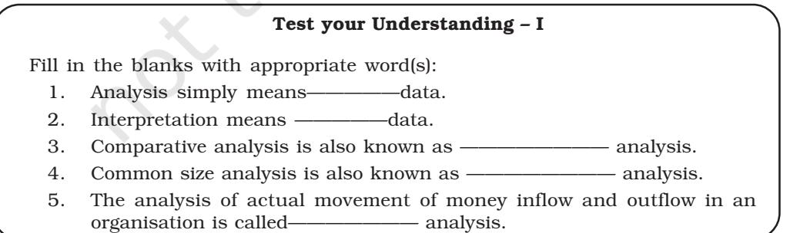

You have learnt about the financial statements (Income Statement and Balance Sheet) of companies. Basically, these are summarised financial reports which provide the operating results and financial position of companies, and the detailed information contained therein is useful for assessing the operational efficiency and financial soundness of a company. This requires proper analysis and interpretation of such information for which a number of techniques (tools) have been developed by financial experts. In this chapter we will have an overview of these techniques.

#### **LEARNING OBJECTIVES**

*After studying this chapter, you will be able to :*

- *explain the nature and significance of financial analysis;*
- *identify the objectives of financial analysis;*
- *describe the various tools of financial analysis;*
- *state the limitations of financial analysis;*
- *prepare comparative and common size statements and interpret the data given therein; and*
- *calculate the trend percentages and interpret them.*

## **4.1 Meaning of Analysis of Financial Statements**

The process of critical evaluation of the financial information contained in the financial statements in order to understand and make decisions regarding the operations of the firm is called 'Financial Statement Analysis'. It is basically a study of relationship among various financial facts and figures as given in a set of financial statements, and the interpretation thereof to gain an insight into the profitability and operational efficiency of the firm to assess its financial health and future prospects.

The term 'financial analysis' includes both 'analysis and interpretation'. The term analysis means simplification of financial data by methodical classification given in the financial statements. Interpretation means explaining the meaning and significance of the data. These two are complimentary to each other. Analysis is useless

without interpretation, and interpretation without analysis is difficult or even impossible.

> Financial statement analysis is a judgemental process which aims to estimate current and past financial positions and the results of the operation of an enterprise, with primary objective of determining the best possible estimates and predictions about the future conditions. It essentially involves regrouping and analysis of information provided by financial statements to establish relationships and throw light on the points of strengths and weaknesses of a business enterprise, which can be useful in decision-making involving comparison with other firms (cross sectional analysis) and with firms' own performance, over a time period (time series analysis).

# **4.2 Significance of Analysis of Financial Statements**

Financial analysis is the process of identifying the financial strengths and weaknesses of the firm by properly establishing relationships between the various items of the balance sheet and the statement of profit and loss. Financial analysis can be undertaken by management of the firm, or by parties outside the firm, viz., owners, trade creditors, lenders, investors, labour unions, analysts and others. The nature of analysis will differ depending on the purpose of the analyst. A technique frequently used by an analyst need not necessarily serve the purpose of other analysts because of the difference in the interests of the analysts. Financial analysis is useful and significant to different users in the following ways:

- (a) *Finance manager:* Financial analysis focusses on the facts and relationships related to managerial performance, corporate efficiency, financial strengths and weaknesses and creditworthiness of the company. A finance manager must be well-equipped with the different tools of analysis to make rational decisions for the firm. The tools for analysis help in studying accounting data so as to determine the continuity of the operating policies, investment value of the business, credit ratings and testing the efficiency of operations. The techniques are equally important in the area of financial control, enabling the finance manager to make constant reviews of the actual financial operations of the firm to analyse the causes of major deviations, which may help in corrective action wherever indicated.
- (b) *Top management:* The importance of financial analysis is not limited to the finance manager alone. It has a broad scope which includes top management in general and other functional managers. Management of the firm would be interested in every aspect of the financial analysis. It is their overall responsibility to see that the resources of the firm are

used most efficiently and that the firm's financial condition is sound. Financial analysis helps the management in measuring the success of the company's operations, appraising the individual's performance and evaluating the system of internal control.

- (c) *Trade payables:* Trade payables, through an analysis of financial statements, appraises not only the ability of the company to meet its short-term obligations, but also judges the probability of its continued ability to meet all its financial obligations in future. Trade payables are particularly interested in the firm's ability to meet their claims over a very short period of time. Their analysis will, therefore, evaluate the firm's liquidity position.
- (d) *Lenders:* Suppliers of long-term debt are concerned with the firm's longterm solvency and survival. They analyse the firm's profitability over a period of time, its ability to generate cash, to be able to pay interest and repay the principal and the relationship between various sources of funds (capital structure relationships). Long-term lenders analyse the historical financial statements to assess its future solvency and profitability.
- (e) *Investors:* Investors, who have invested their money in the firm's shares, are interested about the firm's earnings. As such, they concentrate on the analysis of the firm's present and future profitability. They are also interested in the firm's capital structure to ascertain its influences on firm's earning and risk. They also evaluate the efficiency of the management and determine whether a change is needed or not. However, in some large companies, the shareholders' interest is limited to decide whether to buy, sell or hold the shares.
- (f) *Labour unions:* Labour unions analyse the financial statements to assess whether it can presently afford a wage increase and whether it can absorb a wage increase through increased productivity or by raising the prices.
- (g) *Others:* The economists, researchers, etc., analyse the financial statements to study the present business and economic conditions. The government agencies need it for price regulations, taxation and other similar purposes.

# **4.3 Objectives of Analysis of Financial Statements**

Analysis of financial statements reveals important facts concerning managerial performance and the efficiency of the firm. Broadly speaking, the objectives of the analysis are to apprehend the information contained in financial statements with a view to know the weaknesses and strengths of the firm and to make a forecast about the future prospects of the firm thereby, enabling the analysts to take decisions regarding the operation of, and further investment in the firm. To be more specific, the analysis is undertaken to serve the following purposes (objectives):

- to assess the current profitability and operational efficiency of the firm as a whole as well as its different departments so as to judge the financial health of the firm.
- to ascertain the relative importance of different components of the financial position of the firm.
- to identify the reasons for change in the profitability/financial position of the firm.
- to judge the ability of the firm to repay its debt and assessing the short-term as well as the long-term liquidity position of the firm.

Through the analysis of financial statements of various firms, an economist can judge the extent of concentration of economic power and pitfalls in the financial policies pursued. The analysis also provides the basis for many governmental actions relating to licensing, controls, fixing of prices, ceiling on profits, dividend freeze, tax subsidy and other concessions to the corporate sector.

# **4.4 Tools of Analysis of Financial Statements**

The most commonly used techniques of financial analysis are as follows:

- 1. *Comparative Statements:* These are the statements showing the profitability and financial position of a firm for different periods of time in a comparative form to give an idea about the position of two or more periods. It usually applies to the two important financial statements, namely, balance sheet and statement of profit and loss prepared in a comparative form. The financial data will be comparative only when same accounting principles are used in preparing these statements. If this is not the case, the deviation in the use of accounting principles should be mentioned as a footnote. Comparative figures indicate the trend and direction of financial position and operating results. This analysis is also known as 'horizontal analysis'.
- 2. *Common Size Statements:* These are the statements which indicate the relationship of different items of a financial statement with a common item by expressing each item as a percentage of that common item. The percentage thus calculated can be easily compared with the results of corresponding percentages of the previous year or of some other firms, as the numbers are brought to common base. Such statements also allow an analyst to compare the operating and financing characteristics of two companies of different sizes in the same industry. Thus, common size statements are useful, both, in intra-firm comparisons over different years and also in making inter-firm comparisons for the same year or for several years. This analysis is also known as 'Vertical analysis'.

- 3. *Trend Analysis:* It is a technique of studying the operational results and financial position over a series of years. Using the previous years' data of a business enterprise, trend analysis can be done to observe the percentage changes over time in the selected data. The trend percentage is the percentage relationship, in which each item of different years bear to the same item in the base year. Trend analysis is important because, with its long run view, it may point to basic changes in the nature of the business. By looking at a trend in a particular ratio, one may find whether the ratio is falling, rising or remaining relatively constant. From this observation, a problem is detected or the sign of good or poor management is detected.
- 4. *Ratio Analysis:* It describes the significant relationship which exists between various items of a balance sheet and a statement of profit and loss of a firm. As a technique of financial analysis, accounting ratios measure the comparative significance of the individual items of the income and position statements. It is possible to assess the profitability, solvency and efficiency of an enterprise through the technique of ratio analysis.
- 5. *Cash Flow Analysis:* It refers to the analysis of actual movement of cash into and out of an organisation. The flow of cash into the business is called as cash inflow or positive cash flow and the flow of cash out of the firm is called as cash outflow or a negative cash flow. The difference between the inflow and outflow of cash is the net cash flow. Cash flow statement is prepared to project the manner in which the cash has been received and has been utilised during an accounting year as it shows the sources of cash receipts and also the purposes for which payments are made. Thus, it summarises the causes for the changes in cash position of a business enterprise between dates of two balance sheets.

In this chapter, we shall have a brief idea about the first three techniques, viz., comparative statements, common size statements and trend analysis. The ratio analysis and cash flow analysis is covered in detail in Chapters 5 and 6 respectively.

## **4.5 Comparative Statements**

As stated earlier, these statements refer to the statement of profit and loss and the balance sheet prepared by providing columns for the figures for both the current year as well as for the previous year and for the changes during the year, both in absolute and relative terms. As a result, it is possible to find out not only the balances of accounts as on different dates and summaries of different operational activities of different periods, but also the extent of their increase or decrease between these dates. The figures in the comparative statements can be used for identifying the direction of changes and also the trends in different indicators of performance of an organisation.

The following steps may be followed to prepare the comparative statements: *Step 1 :* List out absolute figures in rupees relating to two points of time (as shown in columns 2 and 3 of Exhibit 4.1).

*Step 2 :* Find out change in absolute figures by subtracting the first year (Col.2) from the second year (Col.3) and indicate the change as increase (+) or decrease (–) and put it in column 4.

*Step 3 :* Preferably, also calculate the percentage change as follows and put it in column 5.

Absolute Increase or Decrease (Col.4)

| Particulars | First Year | Second Year | Absolute | Percentage |
| --- | --- | --- | --- | --- |
|  |  |  | Increase (+) or Decrease (–) | Increase (+) or Decrease (–) |
| 1 | 2 | 3 | 4 | 5 |
|  | Rs. | Rs. | Rs. | %. |

 ____________________________________________________________ × 100 First year absolute figure (Col.2)

**Exhibit. 4.1**

# *Illustration 1*

Convert the following statement of profit and loss of BCR Co. Ltd. into the comparative statement of profit and loss of BCR Co. Ltd.:

|  | Particulars | Note | 2015-16 | 2016-17 |
| --- | --- | --- | --- | --- |
|  |  | No. | (Rs.) | (Rs.) |
| (i) | Revenue from operations |  | 60,00,000 | 75,00,000 |
| (ii) | Other incomes |  | 1,50,000 | 1,20,000 |
| (iii) | Expenses |  | 44,00,000 | 50,60,000 |
| (iv) | Income tax |  | 35% | 40% |

## *Solution:*

Comparative statement of profit and loss of BCR Co. Ltd. for the year ended March 31, 2016 and 2017:

| Particulars | 2015-16 | 2016-17 | Absolute Increase (+) or | Percentage Increase (+) |
| --- | --- | --- | --- | --- |
|  |  |  | Decrease (–) | or Decrease (–) |
|  | (Rs.) | (Rs.) | (Rs.) | % |
| I. Revenue from operations | 60,00,000 | 75,00,000 | 15,00,000 | 25.00 |
| II. Add: Other incomes | 1,50,000 | 1,20,000 | 30,000 | 20.00 |
| III. Total Revenue I+II | 61,50,000 76,20,000 |  | 14,70,000 | 23.90 |
| IV. Less: Expenses | 44,00,000 | 50,60,000 | 6,60,000 | 15.00 |
| Profit before tax | 17,50,000 25,60,000 |  | 8,10,000 | 46.29 |
| V. Less: Tax | 6,12,500 | 10,24,000 | 4,11,500 | 67.18 |
| Profit after tax | 11,37,500 15,36,000 |  | 3,98,500 | 35.03 |

# *Illustration 2*

From the following statement of profit and loss of Madhu Co. Ltd., prepare comparative statement of profit and loss for the year ended March 31, 2016 and 2017:

| Particulars | Note | 2015-16 | 2016-17 |
| --- | --- | --- | --- |
|  | No. | (Rs.) | (Rs.) |
| Revenue from operations |  | 16,00,000 | 20,00,000 |
| Employee benefit expenses |  | 8,00,000 | 10,00,000 |
| Other expenses |  | 2,00,000 | 1,00,000 |
| Tax rate 40 % |  |  |  |

## *Solution:*

# **Comparative statement of profit and loss of Madhu Co. Limited for the year ended March 31, 2016 and 2017:**

|  | Particulars | 2015-16 | 2016-17 | Absolute Increase (+) or | Percentage Increase (+) |
| --- | --- | --- | --- | --- | --- |
|  |  |  |  | Decrease (–) | or Decrease (–) |
|  |  | (Rs.) | (Rs.) | (Rs.) | % |
| I. | Revenue from operations | 16,00,000 | 20,00,000 | 4,00,000 | 25 |
| II. | Less: Expenses |  |  |  |  |
| a) | Employee benefit expenses | 8,00,000 | 10,00,000 | 2,00,000 | 25 |
| b) | Other expenses | 2,00,000 | 1,00,000 | (1,00,000) | (50) |
|  | Profit before tax | 6,00,000 | 9,00,000 | 3,00,000 | 50 |
| III. | Less tax @ 40% | 2,40,000 | 3,60,000 | 1,20,000 | 50 |
|  | Profit after tax | 3,60,000 | 5,40,000 | 1,80,000 | 50 |

## *Do it yourself*

From the following particulars, prepare comparative statement of profit and loss of Narang Colours Ltd. for the year ended March 31, 2016 and 2017:

|  | Particulars | Note | 2016-17 | 2015-16 |
| --- | --- | --- | --- | --- |
|  |  | No. |  |  |
| 1. | Revenue from operations |  | 40,00,000 | 35,00,000 |
| 2. | Other income |  | 50,000 | 50,000 |
| 3. | Cost of material consumed |  | 15,00,000 | 18,00,000 |
| 4. | Changes in inventories of finished goods |  | 10,000 | (15,000) |
| 5. | Employee benefit expenses |  | 2,40,000 | 2,40,000 |
| 6. | Depreciation and amortisation |  | 25,000 | 22,500 |
| 7. | Other expenses |  | 2,66,000 | 3,02,000 |
| 8. | Profit |  | 20,09,000 | 14.27,300 |

## Notes to Accounts

|  | Particulars | 2016-17 | 2015-16 |
| --- | --- | --- | --- |
| 1. | Other expenses |  |  |
|  | i) Power and fuel | 36,000 | 40,000 |
|  | ii) Carriage outwards | 7,500 | 9,500 |
|  | iii) License fees | 2,500 | 2,500 |
|  | iv) Selling and distribution | 1,70,000 | 1,90,000 |
|  | v) Provision of tax | 50,000 | 60,000 |
|  |  | 2,66,000 | 3,02,000 |

## *Illustration 3*

The following are the Balance Sheets of J. Ltd. as at March 31, 2016 and 2017. Prepare a Comparative balance sheet.

| Particulars |  | Note | March 31, | March 31, |
| --- | --- | --- | --- | --- |
|  |  | No. | 2017 | 2016 |
|  |  |  | (Rs.) | (Rs.) |
| I. Equity and Liabilities |  |  |  |  |
| 1. | Shareholders' Funds |  |  |  |
| a) | Share capital |  | 20,00,000 | 15,00,000 |
| b) Reserve and surplus |  |  | 3,00,000 | 4,00,000 |
| 2. | Non-current Liabilities |  |  |  |
| Long-term borrowings |  |  | 9,00,000 | 6,00,000 |
| 3. | Current liabilities |  |  |  |
| Trade payables |  |  | 3,00,000 | 2,00,000 |
| Total |  |  | 35,00,000 | 27,00,000 |
| II. Assets |  |  |  |  |
| 1. | Non-current assets |  |  |  |
| a) | Fixed assets |  |  |  |
| - Tangible assets |  |  | 20,00,000 | 15,00,000 |
| - Intangible assets |  |  | 9,00,000 | 6,00,000 |
| 2. | Current assets |  |  |  |
| - Inventories |  |  | 3,00,000 | 4,00,000 |
| - Cash and cash equivalents |  |  | 3,00,000 | 2,00,000 |
| Total |  |  | 35,00,000 | 27,00,000 |

## *Solution:*

Comparative Balance Sheet of J. Limited as at March 31, 2016 and March 2017:

*(Rs. in Lakhs)*

| Particulars |  | March 31, March 31, |  |  | Absolute Percentage |
| --- | --- | --- | --- | --- | --- |
|  |  | 2016 | 2017 | Change | Change |
| I. Equity and Liabilities |  |  |  |  |  |
| 1. Shareholders' Funds |  |  |  |  |  |
| a) Share capital |  | 15 | 20 | 05 | 33.33 |
| b) Reserve and surplus |  | 04 | 03 | (01) | (25) |
| 2. Non-current Liabilities |  |  |  |  |  |
| a) Long-term borrowings |  | 06 | 09 | 03 | 50 |
| 3. | Current liabilities |  |  |  |  |
| a) Trade payables |  | 02 | 03 | 01 | 50 |
| Total |  | 27 | 35 | 08 | 29.63 |

| II. Assets |  |  |  |  |  |
| --- | --- | --- | --- | --- | --- |
| 1. | Non-current assets |  |  |  |  |
| a) | Fixed assets |  |  |  |  |
|  | - Tangible assets | 15 | 20 | 05 | 33.33 |
|  | - Intangible assets | 06 | 09 | 03 | 50 |
| b) | Current assets |  |  |  |  |
|  | - Inventories | 04 | 03 | (01) | (25) |
|  | - Cash and cash equivalents | 02 | 03 | 01 | 50 |
| Total |  | 27 | 35 | 08 | 29.63 |

# *Illustration 4*

From the following Balance Sheets of Amrit Limited as at March 31, 2016 and 2017, prepare a comparative balance sheet:

| Particulars |  | Note | March 31, |  | March 31, |
| --- | --- | --- | --- | --- | --- |
|  |  | No. |  | 2017 | 2016 |
|  |  |  | (Rs.) |  | (Rs.) |
| I. Equity and Liabilities |  |  |  |  |  |
| 1. | Shareholders' Funds |  |  |  |  |
| a) | Share capital |  | 20,00,000 |  | 15,00,000 |
| b) | Reserve and surplus |  | 13,00,000 |  | 14,00,000 |
| 2. | Non-current Liabilities |  |  |  |  |
| Long-term borrowings |  |  | 19,00,000 |  | 16,00,000 |
| 3. | Current liabilities |  |  |  |  |
| Trade payables |  |  | 3,00,000 |  | 2,00,000 |
| Total |  |  | 55,00,000 |  | 47,00,000 |
| II. Assets |  |  |  |  |  |
| 1. | Non-current assets |  |  |  |  |
| a) | Fixed assets |  |  |  |  |
| - Tangible assets |  |  | 20,00,000 |  | 15,00,000 |
| - Intangible assets |  |  | 19,00,000 |  | 16,00,000 |
| 2. | Current assets |  |  |  |  |
| - Inventories |  |  | 13,00,000 |  | 14,00,000 |
| - Cash and Cash Equivalents |  |  | 3,00,000 |  | 2,00,000 |
| Total |  |  | 55,00,000 |  | 47,00,000 |

## *Solution:*

|  |  |  |  | (Rs. in Lakhs) |
| --- | --- | --- | --- | --- |
| Particulars |  | March 31, March 31, | Absolute | Percentage |
|  | 2016 | 2017 | Increase (+) or | Increase (+) |
|  |  |  | Decrease (–) | or Decrease (–) |
|  | Rs. | Rs. | Rs. | % |
| I. Equity and Liabilities |  |  |  |  |
| 1) Shareholders' funds |  |  |  |  |
| a) Share capital | 15 | 20 | 5 | 33.33 |
| b) Reserves and surplus | 14 | 13 | (1) | (7.14) |
| 2) Non-current liabilities |  |  |  |  |
| Long-term borrowings | 16 | 19 | 3 | 18.75 |
| 3) Current liabilities |  |  |  |  |
| Trade payables | 2 | 3 | 1 | 50 |
| Total | 47 | 55 | 8 | 17.02 |
| II. Assets |  |  |  |  |
| 1) Non-current assets |  |  |  |  |
| Fixed assets |  |  |  |  |
| a) Tangible assets | 15 | 20 | 5 | 33.33 |
| b) Intangible assets | 16 | 19 | 3 | 18.75 |
| 2) Current assets |  |  |  |  |
| a) Inventories | 14 | 13 | (1) | (7.14) |
| b) Cash and Cash Equivalents | 2 | 3 | 1 | 50 |
| Total | 47 | 55 | 8 | 17.02 |

# **Comparative Balance Sheet of Amrit Limited as at March 31, 2016 and March 31, 2017**

# *Do it yourself*

From the Balance Sheets for the year ended March 31, 2016 and 2017, prepare the comparative Balance Sheet of Omega Chemicals Ltd.:

|  |  |  |  |  | Rs. in Lakhs |
| --- | --- | --- | --- | --- | --- |
|  | Particulars |  | Note | 2017 | 2016 |
|  |  |  | No. | (Rs.) | (Rs.) |
| I. |  | Equity and Liabilities |  |  |  |
|  | 1) | Shareholders' Fund |  |  |  |
|  | a) | Share capital |  | 5 | 10 |
|  | b) | Reserve and surplus |  | 3 | 2 |
|  | 2) | Non-current liabilities |  |  |  |
|  |  | Long-term borrowings |  | 5 | 8 |
|  | 3) | Current liabilities |  |  |  |
|  |  | Trade Payable |  | 2 | 4 |
|  | Total |  |  | 15 | 24 |

| II. Assets |  |  |  |
| --- | --- | --- | --- |
| 1) | Non-current assets |  |  |
| a) | Fixed assets |  |  |
|  | - Tangible assets | 14 | 8 |
|  | - Intangible assets | 3 | 2 |
| 2) | Current assets |  |  |
| a) | Inventories | 5 | 4 |
| b) | Cash and cash equivalents | 2 | 1 |
| Total |  | 24 | 15 |

# **4.6 Common Size Statement**

Common Size Statement, also known as component percentage statement, is a financial tool for studying the key changes and trends in the financial position and operational result of a company. Here, each item in the statement is stated as a percentage of the aggregate, or revenue from operations of which that item is a part. For example, a common size balance sheet shows the percentage of each asset to the total assets, and that of each liability to the total liabilities. Similarly, in the common size statement of profit and loss, the items of expenditure are shown as a percentage of the revenue from operations. If such a statement is prepared for successive periods, it shows the changes of the respective percentages over a period of time.

Common size analysis is of immense use for comparing enterprises which differ substantially in size as it provides an insight into the structure of financial statements. Inter-firm comparison or comparison of the company's position with the related industry as a whole is possible with the help of common size statement analysis.

The following procedure may be adopted for preparing the common size statements.

- 1. List out absolute figures in rupees at two points of time, say year 1, and year 2 (Column 2 & 4 of Exhibit 4.2).
- 2. Choose a common base (as 100). For example, revenue from operations may be taken as base (100) in case of statement of profit and loss and total assets or total liabilities (100) in case of balance sheet.
- 3. For all items of Col. 2 and 3 work out the percentage of that total. Column 4 and 5 shows these percentages in Exhibit 4.2.

| Particulars | Year | Year | Percentage | Percentage |
| --- | --- | --- | --- | --- |
|  | one | two | of year 1 | of year 2 |
| 1 | 2 | 3 | 4 | 5 |

#### **Common Size Statement**

#### **Exhibit 4.2**

# *Illustration 5*

From the following information, prepare a Common size Income Statement for the year ended March 31, 2016 and March 31, 2017:

| Particulars | 2016-17 | 2015-16 |
| --- | --- | --- |
|  | (Rs.) | (Rs.) |
| Revenue from operations | 18,00,000 | 25,00,000 |
| Cost of good sold | 10,00,000 | 12,00,000 |
| Operating expenses | 80,000 | 1,20,000 |
| Non-operating expenses | 12,000 | 15,000 |
| Depreciation | 20,000 | 40,000 |
| Wages | 10,000 | 20,000 |

## *Solution:*

# **Common Size Income Statement for the year ended March 31, 2016 and March 31, 2017**

| Particulars | Absolute Amounts |  | Percentage of Net Sales |  |
| --- | --- | --- | --- | --- |
|  | 2015-16 | 2016-17 | 2015-16 | 2016-17 |
|  | Rs. | Rs. | (%) | (%) |
| Revenue from operations | 25,00,000 | 18,00,000 | 100 | 100 |
| (Less) Cost of goods | 12,00,000 | 10,00,000 | 48 | 55.56 |
| Sold* |  |  |  |  |
| Gross Profit | 13,00,000 | 8,00,000 | 52 | 44.44 |
| (Less) Operating | 1,20,000 | 80,000 | 4.80 | 4.44 |
| Expenses** |  |  |  |  |
| Operating Income | 11,80,000 | 7,20,000 | 47.20 | 40 |
| (Less) Non-Operating | 15,000 | 12,000 | 0.60 | 0.67 |
| expenses |  |  |  |  |
| Profit | 11,65,000 | 7,08,000 | 46.60 | 39.33 |

* Wages is the part of cost of goods sold;

** Depreciation is the part of operating expenses.

# *Illustration 6*

From the following information, prepare Common size statement of profit and loss for the year ended March 31, 2016 and March 31, 2017:

| Particulars | 2015-16 | 2016-17 |
| --- | --- | --- |
|  | (Rs.) | (Rs.) |
| Revenue from operations | 25,00,000 | 20,00,000 |
| Other income | 3,25,000 | 2,50,000 |
| Employee benefit expenses | 8,25,000 | 4,50,000 |

| Other expenses | 2,00,000 | 1,00,000 |
| --- | --- | --- |
| Income tax (% of the profit before tax) | 30% | 20% |

## *Solution:*

## **Common size statement of Profit and Loss for the year ended March 31, 2016 and March 31, 2017:**

| Particulars | Absolute Amounts |  | Percentage of Net |  |
| --- | --- | --- | --- | --- |
|  |  |  | Revenue from operations |  |
|  | 2015-16 | 2016-17 | 2015-16 | 2016-17 |
|  | Rs. | Rs. | (%) | (%) |
| Revenue from Operations | 25,00,000 | 20,00,000 | 100 | 100 |
| (Add) Other income | 3,25,000 | 2,50,000 | 13 | 12.5 |
| Total revenue | 28,25,000 | 22,50,000 | 113 | 112.5 |
| (Less) expenses: |  |  |  |  |
| a) Employee benefit | 8,25,000 | 4,50,000 | 33 | 22.5 |
| expenses |  |  |  |  |
| b) Other expenses | 2,00,000 | 1,00,000 | 8 | 5 |
| Profit before tax | 18,00,000 | 17,00,000 | 72 | 85 |
| (Less) taxes | 5,40,000 | 3,40,000 | 21.6 | 17 |
| Profit after tax | 12,60,000 | 13,60,000 | 50.4 | 68 |

# *Illustration 7*

Prepare common size Balance Sheet of XRI Ltd. from the following information:

| Particulars |  | Note No. | March 31, | March 31, |
| --- | --- | --- | --- | --- |
|  |  |  | 2016 | 2017 |
| I. Equity and Liabilities |  |  |  |  |
| 1. Shareholders' Fund |  |  |  |  |
| a) Share capital |  |  | 15,00,000 | 12,00,000 |
| b) | Reserves and surplus |  | 5,00,000 | 5,00,000 |
| 2. Non-current liabilities |  |  |  |  |
| Long-term borrowings |  |  | 6,00,000 | 5,00,000 |
| 3. Current liabilities |  |  |  |  |
| Trade Payable |  |  | 15,50,000 | 10,50,000 |
| Total |  |  | 41,50,000 | 32,50,000 |
| II. Assets |  |  |  |  |
| 1. Non-current assets |  |  |  |  |
| a) Fixed assets |  |  |  |  |
| - Tangible asset |  |  |  |  |
| Plant & machinery |  |  | 14,00,000 | 8,00,000 |
| - Intangible assets |  |  |  |  |
| Goodwill |  |  | 16,00,000 | 12,00,000 |
| b) | Non-current investments |  | 10,00,000 | 10,00,000 |
| 2. Current assets |  |  |  |  |
| Inventories |  |  | 1,50,000 | 2,50,000 |
| Total |  |  | 41,50,000 | 32,50,000 |

## *Solution:*

|  | Particulars | Absolute Amounts |  | Percentage of Total Assets |  |
| --- | --- | --- | --- | --- | --- |
|  |  | 31.03.2016 | 31.03.2017 | 31.03.2016 | 31.03.2017 |
|  |  | (Rs.) | (Rs.) | (%) | (%) |
| I. | Equity and Liabilities |  |  |  |  |
| 1. | Shareholders fund |  |  |  |  |
|  | a) Share capital | 15,00,000 | 12,00,000 | 36.14 | 36.93 |
|  | b) Reserve and surplus | 5,00,000 | 5,00,000 | 12.05 | 15.38 |
| 2. | Non-current liabilities |  |  |  |  |
|  | Long-term borrowings | 6,00,000 | 5,00,000 | 14.46 | 15.38 |
| 3. | Current liabilities |  |  |  |  |
|  | Trade payables | 15,50,000 | 10,50,000 | 37.35 | 32.31 |
| Total |  | 41,50,000 | 32,50,000 | 100 | 100 |
| II. Assets |  |  |  |  |  |
| 1. | Non-current assets |  |  |  |  |
|  | a) Fixed assets |  |  |  |  |
|  | - Tangible asset |  |  |  |  |
|  | Plant & machinery | 14,00,000 | 8,00,000 | 33.73 | 24.62 |
|  | - Intangible assets |  |  |  |  |
|  | Goodwill | 16,00,000 | 12,00,000 | 38.55 | 36.92 |
|  | Non-current investments | 10,00,000 | 10,00,000 | 24.10 | 30.77 |
| 2. | Current assets |  |  |  |  |
|  | Inventories | 1,50,000 | 2,50,000 | 3.62 | 7.69 |
| Total |  | 41,50,000 | 32,50,000 | 100 | 100 |

# **Common size Balace Sheet of XRI Co. Ltd. as at March 31, 2016 and March 31, 2017:**

# *Do it yourself*

Prepare common size balance sheet of Raj Co. Ltd. as at March 31, 2016 and March 31, 2017 from the given information:

| Particulars |  | 2017 | 2016 |
| --- | --- | --- | --- |
| I. Equity and Liabilities |  |  |  |
| 1. | Shareholders fund |  |  |
| a) | Share capital | 20,00,000 | 15,00,000 |
| b) | Reserve and surplus | 3,00,000 | 4,00,000 |
| 2. | Non-current liabilities |  |  |
| Long-term borrowings |  | 9,00,000 | 6,00,000 |
| 3. | Current liabilities |  |  |
| Trade payables |  | 3,00,000 | 2,00,000 |
| Total |  | 35,00,000 | 27,00,000 |

| II. Assets |  |  |  |
| --- | --- | --- | --- |
| 1. | Non-current assets |  |  |
| a) | Fixed assets |  |  |
|  | - Tangible assets | 20,00,000 | 15,00,000 |
|  | - Intangible assets | 9,00,000 | 6,00,000 |
| b) | Current assets |  |  |
|  | - Inventories | 3,00,000 | 4,00,000 |
|  | - Cash and cash equivalents | 3,00,000 | 2,00,000 |
| Total |  | 35,00,000 | 27,00,000 |

### **Test your Understanding – II**

#### **Choose the right answer :**

1. The financial statements of a business enterprise include:

- (a) Balance sheet
- (b) Statement of Profit and loss account
- (c) Cash flow statement
- (d) All the above

#### 2. The most commonly used tools for financial analysis are:

- (a) Horizontal analysis
- (b) Vertical analysis
- (c) Ratio analysis
- (d) All the above
- 3. An Annual Report is issued by a company to its:
	- (a) Directors
	- (b) Auditors
	- (c) Shareholders
	- (d) Management

#### 4. Balance Sheet provides information about financial position of the enterprise:

- (a) At a point in time
- (b) Over a period of time
- (c) For a period of time
- (d) None of the above
- 5. Comparative statements are also known as:
	- (a) Dynamic analysis
	- (b) Horizontal analysis
	- (c) Vertical analysis
	- (d) External analysis

#### **Test your Understanding – III**

State whether each of the following is True or False :

- (a) The financial statements of a business enterprise include cash flow statement.
- (b) Comparative statements are the form of horizontal analysis.
- (c) Common size statements and financial ratios are the two tools employed in vertical analysis.
- (d) Ratio analysis establishes relationship between two financial statements.
- (e) Ratio analysis is a tool for analysing the financial statements of any enterprise.
- (f) Financial analysis is used only by the creditors.
- (g) Statement of profit and loss account shows the operating performance of an enterprise for a period of time.
- (h) Financial analysis helps an analyst to arrive at a decision.
- (i) Cash Flow Statement is a tool of financial statement analysis.
- (j) In a Common size statement each item is expressed as a percentage of some common base.

# **4.7 Limitations of Financial Analysis**

Though financial analysis is quite helpful in determining financial strengths and weaknesses of a firm, it is based on the information available in financial statements. As such, the financial analysis also suffers from various limitations of financial statements. Hence, the analyst must be conscious of the impact of price level changes, window dressing of financial statements, changes in accounting policies of a firm, accounting concepts and conventions, personal judgement, etc. Some other limitations of financial analysis are:

- 1. Financial analysis does not consider price level changes.
- 2. Financial analysis may be misleading without the knowledge of the changes in accounting procedure followed by a firm.
- 3. Financial analysis is just a study of reports of the company.
- 4. Monetary information alone is considered in financial analysis while non-monetary aspects are ignored.
- 5. The financial statements are prepared on the basis of accounting concept, as such, it does not reflect the current position.

## *Terms Introduced in the Chapter*

- 
- 3. Comparative Statements 4. Trend Analysis
- 
- 7. Intra Firm Comparison 8. Inter Firm Comparison
- 9. Horizontal Analysis 10. Vertical Analysis
- 1. Financial Analysis 2. Common Size Statements
	-
- 5. Ratio Analysis 6. Cash Flow Statement
	-
	-

#### *Summary*

#### *Major Parts of an Annual Report*

An annual report contains basic financial statements, viz., Balance Sheet, Statement of Profit and Loss and Cash Flow Statement. It also carries management's discussion of corporate performance of the year under review for futuristic prospects.

#### *Tools of Financial Analysis*

Commonly used tools of financial analysis are: Comparative statements, Common size statement, trend analysis, ratio analysis, and cash flow analysis.

#### *Comparative Statement*

Comparative statement shows changes in all items of financial statements in absolute and percentage terms over a period of time for a firm or between two firms.

#### *Common Size Statement*

Common size statement expresses all items of a financial statement as a percentage of some common base such as revenue from operations for statement of profit and loss and total assets for balance sheet.

## *Questions for Practice*

#### **Short Answer Questions**

- 1. List the techniques of Financial Statement Analysis.
- 2. Distinguish between Vertical and Horizontal Analysis of financial data.
- 3. State the meaning of Analysis and Interpretation.
- 4. State the importance of Financial Analysis?
- 5. What are Comparative Financial Statements?
- 6. What do you mean by Common Size Statements?

#### **Long Answer Questions**

- 1. Describe the different techniques of financial analysis and explain the limitations of financial analysis.
- 2. Explain the usefulness of trend percentages in interpretation of financial performance of a company.
- 3. What is the importance of comparative statements? Illustrate your answer with particular reference to comparative income statement.
- 4. What do you understand by analysis and interpretation of financial statements? Discuss its importance.
- 5. Explain how common size statements are prepared giving an example.

## *Numerical Questions*

Following are the balance sheets of Alpha Ltd., as at March 31, 2016 and 2017. You are required to prepare Comparative Balance Sheet.

| Particulars | March 31, | March 31, |
| --- | --- | --- |
|  | 2016 | 2017 |
|  | (Rs.) | (Rs.) |
| I. Equity and Liabilities |  |  |
| 1. Shareholders' Funds |  |  |
| (a) Share Capital | 2,00,000 | 4,00,000 |
| (b) Reserve & Surplus | 1,00,000 | 1,50,000 |
| 2. Noncurrent Liabilities |  |  |
| (a) Long Term Borrowings | 2,00,000 | 3,00,000 |
| 3.Current Liabilities |  |  |
| (a) Short term borrowings | 50,000 | 70,000 |
| (b) Trade Payables | 30,000 | 60,000 |
| (c) Other Current Liabilities | 20,000 | 10,000 |
| (d) Short Terms Provisions | 20,000 | 20,000 |
| Total | 6,20,000 | 10,20,000 |
| II. Assets |  |  |
| 1. Non-Current Assets |  |  |
| (a) Fixed Assets | 2,00,000 | 5,00,000 |
| (b) Non-Current Investments | 1,00,000 | 1,25,000 |
| 2. Current Assets |  |  |
| (a) Current Investments | 60,000 | 80,000 |
| (b) Inventories | 1,35,000 | 1,55,000 |
| (c) Trade Receivables | 60,000 | 90,000 |

| (d) Cash and Cash Equivalents | 25,000 | 10,000 |
| --- | --- | --- |
| (e) Short term Loans & Advances | 40,000 | 60,000 |
| Total | 6,20,000 | 10,20,000 |

- 2. Following are the Balance Sheets of Beta Ltd., as at March 31, 2016 and 2017.

| Particulars | March 31, | March 31, |
| --- | --- | --- |
|  | 2016 | 2017 |
|  | (Rs.) | (Rs.) |
| I. Equity and Liabilities |  |  |
| 1. Shareholders' Funds |  |  |
| (a) Share Capital | 4,00,000 | 3,00,000 |
| (b) Reserves and surplus | 1,50,000 | 1,00,000 |
| 2. Non-Current Liabilities |  |  |
| (a) Long term IDBI | 3,00,000 | 1,00,000 |
| 3. Current Liabilities |  |  |
| (a) Short term borrowings | 70,000 | 50,000 |
| (b) Trade payables | 60,000 | 30,000 |
| (c) Other current liabilities | 1,10,000 | 1,00,000 |
| (d) Short term provisions | 10,000 | 20,000 |
| Total | 1,10,000 | 7,00,000 |
| II. Assets |  |  |
| 1. Non-Current Liabilities |  |  |
| (a) Fixed Assets | 4,00,000 | 2,20,000 |
| (b) Non-current Investments | 2,25,000 | 1,00,000 |
| 2. Current Assets |  |  |
| (a) Current Investments | 80,000 | 60,000 |
| (b) Inventories | 1,05,000 | 90,000 |
| (c) Trade Receivables | 90,000 | 60,000 |
| (d) Cash and Cash Equivalents | 1,00,000 | 85,000 |
| (e) Short term loans & Advances | 1,00,000 | 85,000 |
| Total | 11,00,000 | 7,00,000 |

Prepare comparative Balance Sheet.

- 3. Prepare Comparative Statement of profit and loss from the following information.

| Particulars | 2015-16 | 2016-17 |
| --- | --- | --- |
|  | (Rs.) | (Rs.) |
| Freight Outward | 20,000 | 10,000 |
| Wages (office) | 10,000 | 5,000 |
| Manufacturing Expenses | 50,000 | 20,000 |
| Stock adjustment | (60,000) | 30,000 |
| Cash purchases | 80,000 | 60,000 |
| Credit purchases | 60,000 | 20,000 |
| Return inward | 8,000 | 4,000 |
| Gross profit | (30,000) | 90,000 |
| Carriage outward | 20,000 | 10,000 |
| Machinery | 3,00,000 | 2,00,000 |
| 10% depreciation on | 10,000 | 5,000 |
| machinery |  |  |
| Interest on short-term loans | 20,000 | 20,000 |
| 10% debentures | 20,000 | 10,000 |
| Profit on sale of furniture | 20,000 | 10,000 |
| Loss on sale of office car | 90,000 | 60,000 |
| Tax rate | 40% | 50% |

### 4. Prepare Comparative Statement of Profit and Loss from the following information:

| Particulars | 2015-16 | 2016-17 |
| --- | --- | --- |
|  | (Rs.) | (Rs.) |
| Manufacturing expenses | 35,000 | 80,000 |
| Opening stock | 30,000 | 60% of closing stock |
| Sales | 9,60,000 | 4,50,000 |
| Returns outward | 4,000 (out of credit | 6,000 (out of cash |
|  | purchase) | purchase) |
| Closing stock | 150% of opening | 1,00,000 |
|  | stock |  |
| Credit purchases | 1,50,000 | 150% of cash purchase |

| Cash purchases | 80% of credit | 40,000 |
| --- | --- | --- |
|  | purchases |  |
| Carriage outward | 10,000 | 30,000 |
| Building | 1,00,000 | 2,00,000 |
| Depreciation on building | 20% | 10% |
| Interest on bank overdraft | 5,000 | - |
| 10% debentures | 2,00,000 | 20,00,000 |
| Profit on sale of copyright | 10,000 | 20,000 |
| Loss on sale of personal car | 10,000 | 20,000 |
| Other operating expenses | 20,000 | 10,000 |
| Tax rate | 50% | 40% |

- 5. Prepare a Common size statement of profit and loss of Shefali Ltd. with the help of following information:

| Particulars | 2015-16 | 2016-17 |
| --- | --- | --- |
|  | (Rs.) | (Rs.) |
| Revenue from operations | 6,00,000 | 8,00,00 |
| Indirect expense | 25% of gross profit | 25% of gross profit |
| Cost of revenue from operations | 4,28,000 | 7,28,000 |
| Other incomes | 10,000 | 12,000 |
| Income tax | 30% | 30% |

- 6. Prepare a Common Size balance sheet from the following balance sheet of Aditya Ltd., and Anjali Ltd.:

| Particulars | Aditya Ltd. | Anjali Ltd. |
| --- | --- | --- |
|  | (Rs.) | (Rs.) |
| I. Equity and Liabilities |  |  |
| 1. Shareholder's Funds |  |  |
| a) Equity share capital | 6,00,000 | 8,00,000 |
| b) Reserves and surplus | 3,00,000 | 2,50,000 |
| 2. Current liabilities | 1,00,000 | 1,50,000 |
| Total | 10,00,000 | 12,00,000 |
| II. Assets |  |  |
| 1. Non current assets |  |  |
| a) Fixed assets | 4,00,000 | 7,00,000 |
| 2. Current assets | 6,00,000 | 5,00,000 |
| Total | 1,00,0000 | 12,00,000 |

### **Answers to Test your Understanding**

| Test your Understanding – I |  |  |  |  |  |
| --- | --- | --- | --- | --- | --- |
| 1. Simplifying |  |  | 2. explaining the impact of | 3. horizontal |  |
| 4. vertical |  | 5. cash flow. |  |  |  |
| Test your Understanding – II |  |  |  |  |  |
| 1 (d) | 2 (d) | 3 (c) | 4 (a) | 5 (b) |  |
| Test your Understanding – III |  |  |  |  |  |
| (a) True | (b) True | (c) True | (d) True | (e) True | (f) False |
| (g) True (i) True | (h) True |  | (j) True |  |  |

