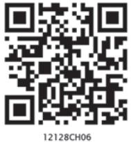
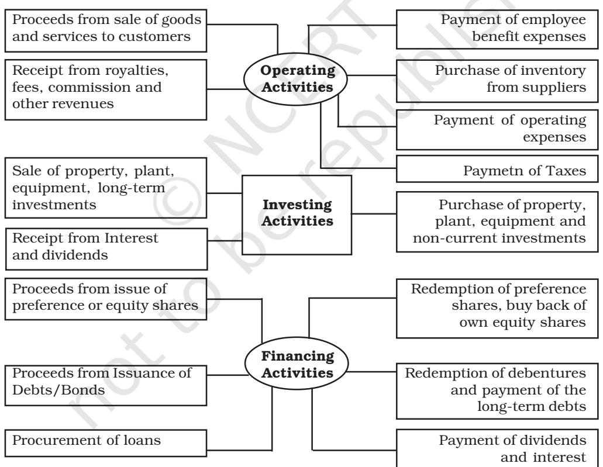

# Tiill now you have learnt about the financial statements being primarily inclusive of Position Statement (showing the financial position of an enterprise as on a particular date) and Income Statement (showing the result of the operational activities of an enterprise over a particular period). There is also a third important financial statement known as *Cash flow statement,* which shows inflows and outflows of the cash and cash equivalents. This statement is usually prepared by companies which comes as a tool in the hands of users of financial information to know about the sources and uses of cash and cash equivalents of an enterprise over a period of time from various activities o*f an enterprise.* It has gained substantial importance in the last decade because of its practical utility to the users of financial information.

Financial Statement of companies are prepared following the accounting standards prescribed in the companies Act, 2013. Accounting Standards are notified under section 133 of the Companies Act, 2013 vide Accounting Standards Rules, 2006 and are mandatory in nature. Companies Act, 2013 also specifies that if the accounting standards are not followed, financial statements will not be true and fair, which is a quality of financial statement. Financial Statements are defined in Companies Act, 2013 (Section 2 (40)] and includes Cash Flow Statement prepared in accordance with Accounting Standard- 3 (AS-3)- Cash Flow Statement.

A cash flow statement provides information about the historical changes in cash and cash

#### **LEARNING OBJECTIVES**

*After studying this chapter, you will be able to :*

- *state the purpose and preparation of statement of cash flow statement;*
- *distinguish between operating activities, investing activities and financing activities;*
- *prepare the statement of cash flows using direct method;*
- *prepare the cash flow statement using indirect method.*

equivalents of an enterprise by classifying cash flows into operating, investing and financing activities. It requires that an enterprise should prepare a cash flow statement and should present it for each accounting period for which financial statements are presented. This chapter discusses this technique and explains the method of preparing a cash flow statement for an accounting period.

# **6.1 Objectives of Cash Flow Statement**

A Cash flow statement shows inflow and outflow of cash and cash equivalents from various activities of a company during a specific period. The primary objective of cash flow statement is to provide useful information about cash flows (inflows and outflows) of an enterprise during a particular period under various heads, i.e., operating activities, investing activities and financing activities.

This information is useful in providing users of financial statements with a basis to assess the ability of the enterprise to generate cash and cash equivalents and the needs of the enterprise to utilise those cash flows. The economic decisions that are taken by users require an evaluation of the ability of an enterprise to generate cash and cash equivalents and the timing and certainty of their generation.

# **6.2 Benefits of Cash Flow Statement**

Cash flow statement provides the following benefits :

- A cash flow statement when used along with other financial statements provides information that enables users to evaluate changes in net assets of an enterprise, its financial structure (including its liquidity and solvency) and its ability to affect the amounts and timings of cash flows in order to adapt to changing circumstances and opportunities.
- Cash flow information is useful in assessing the ability of the enterprise to generate cash and cash equivalents and enables users to develop models to assess and compare the present value of the future cash flows of different enterprises.
- It also enhances the comparability of the reporting of operating performance by different enterprises because it eliminates the effects of using different accounting treatments for the same transactions and events.
- It also helps in balancing its cash inflow and cash outflow, keeping in response to changing condition. It is also helpful in checking the accuracy of past assessments of future cash flows and in examining the relationship between profitability and net cash flow and impact of changing prices.

# **6.3 Cash and Cash Equivalents**

As stated earlier, cash flow statement shows inflows and outflows of cash and cash equivalents from various activities of an enterprise during a particular period. As per AS-3, 'Cash' comprises cash in hand and demand deposits with banks, and 'Cash equivalents' means short-term highly liquid investments that are readily convertible into known amounts *of cash and which are subj*ect to an insignificant risk of changes in value. An investment normally qualifies as cash equivalents only when it has a short maturity, of say, three months or less from the date of acquisition. Investments in shares are excluded from cash equivalents unless they are in substantial cash equivalents. For example, preference shares of a company acquired shortly before their specific redemption date, provided there is only insignificant risk of failure of the company to repay the amount at maturity. Similarly, short-term marketable securities which can be readily converted into cash are treated as cash equivalents and is liquidable immediately without considerable change in value.

# **6.4 Cash Flows**

'Cash Flows' implies movement of cash in and out due to some non-cash items. Receipt of cash from a non-cash item is termed as cash inflow while cash payment in respect of such items as cash outflow. For example, purchase of machinery by paying cash is cash outflow while sale proceeds received from sale of machinery is cash inflow. Other examples of cash flows include collection of cash from trade receivables*,* payment to trade payables, payment to employees, receipt of dividend, interest payments, etc.

Cash management includes the investment of excess cash in cash equivalents. Hence, purchase of marketable securities or short-term investment which constitutes cash equivalents is not considered while preparing cash flow statement.

# **6.5 Classification of Activities for the Preparation of Cash Flow Statement**

You know that various activities of an enterprise result into cash flows (inflows or receipts and outflows or payments) which is the subject matter of a cash flow statement. As per AS-3, these activities are to be classified into three categories: (1) operating, (2) investing, and (3) financing activities so as to show separately the cash flows generated (or used) by (in) these activities. This helps the users of cash flow statement to assess the impact of these activities on the financial position of an enterprise and also on its cash and cash equivalents.

# *6.5.1 Cash from Operating Activities*

Operating activities are the activities that constitute the primary or main activities of an enterprise. For example, for a company manufacturing garments, operating activities are procurement of raw material, incurrence of manufacturing expenses, sale of garments, etc. These are the principal revenue generating activities (or the main activities) of the enterprise and these activities are not investing or financing activities. The amount of cash from operations' indicates the internal solvency level of the company, and is regarded as the key indicator of the extent to which the operations of the enterprise have generated sufficient cash flows to maintain the operating capability of the enterprise, paying dividends, making of new investments and repaying of loans without recourse to external source of financing.

Cash flows from operating activities are primarily derived from the main activities of the enterprise. They generally result from the transactions and other events that enter into the determination of net profit or loss. Examples of cash flows from operating activities are:

# *Cash Inflows from operating activities*

- cash receipts from sale of goods and the rendering of services.
- cash receipts from royalties, fees, commissions and other revenues.

# *Cash Outflows from operating activities*

- Cash payments to suppliers for goods and services.
- Cash payments to and on behalf of the employees.
- Cash payments to an insurance enterprise for premiums and claims, annuities, and other policy benefits.
- Cash payments of income taxes unless they can be specifically identified with financing and investing activities.

The net position is shown in case of operating cash flows.

An enterprise may hold securities and loans for dealing or for trading purposes. In either case they represent Inventory specifically held for resale. Therefore, cash flows arising from the purchase and sale of dealing or trading securities are classified as operating activities. Similarly, cash advances and loans made by financial enterprises are usually classified as operating activities since they relate to main activity of that enterprise.

# *6.5.2 Cash from Investing Activities*

As per AS-3, investing activities are the acquisition anddisposal of long-term assets and other investments not included in cash equivalents. Investing activities relate to purchase and sale of long-term assets or fixed assets such

as machinery, furniture, land and building, etc. Transactions related to longterm investment are also investing activities.

Separate disclosure of cash flows from investing activities is important because they represent the extent to which expenditures have been made for resources intended to generate future income and cash flows. Examples of cash flows arising from investing activities are:

# *Cash Outflows from investing activities*

- Cash payments to acquire fixed assets including intangibles and capitalised research and development.
- Cash payments to acquire shares, warrants or debt instruments of other enterprises other than the instruments those held for trading purposes.
- Cash advances and loans made to third party (other than advances and loans made by a financial enterprise wherein it is operating activities).

# *Cash Inflows from Investing Activities*

- Cash receipt from disposal of fixed assets including intangibles.
- Cash receipt from the repayment of advances or loans made to third parties (except in case of financial enterprise).
- Cash receipt from disposal of shares, warrants or debt instruments of other enterprises except those held for trading purposes.
- Interest received in cash from loans and advances.
- Dividend received from investments in other enterprises.

# *6.5.3 Cash from Financing Activities*

As the name suggests, financing activities relate to long-term funds or capital of an enterprise, e.g., cash proceeds from issue of equity shares, debentures, raising long-term bank loans, repayment of bank loan, etc. As per AS-3, financing activities are activities that result in changes in the size and composition of the owners' capital (including preference share capital in case of a company) and borrowings of the enterprise. Separate disclosure of cash flows arising from financing activities is important because it is useful in predicting claims on future cash flows by providers of funds ( both capital and borrowings ) to the enterprise. Examples of financing activities are:

#### *Cash Inflows from financing activities*

- Cash proceeds from issuing shares (equity or/and preference).
- Cash proceeds from issuing debentures, loans, bonds and other short/ long-term borrowings.

*Cash Outflows from financing activities*

- Cash repayments of amounts borrowed.
- Interest paid on debentures and long-term loans and advances.
- Dividends paid on equity and preference capital.

It is important to mention here that a transaction may include cash flows that are classified differently. For example, when the instalment paid in respect of a fixed asset acquired on deferred payment basis includes both interest and loan, the interest element is classified under financing activities and the loan element is classified under investing activities. Moreover, same activity may be classified differently for different enterprises. For example, purchase of shares is an operating activity for a share brokerage firm while it is investing activity in case of other enterprises.

#### **Cash Inflows Cash Outflows**

**Exhibit 6.1:** *Classification of Cash inflows and Cash Outflows Activities*

# *6.5.4 Treatment of Some Peculiar Items*

#### *Extraordinary items*

Extraordinary items are not the regular phenomenon, e.g., loss due to theft or earthquake or flood. Extraordinary items are non-recurring in nature and hence cash flows associated with extraordinary items should be classified and disclosed separately as arising from operating, investing or financing activities. This is done to enable users to understand their nature and effect on the present and future cash flows of an enterprise.

# *Interest and Dividend*

In case of a financial enterprise (whose main business is lending and borrowing), interest paid, interest received and dividend received are classified as operating activities while dividend paid is a financing activity.

In case of a non-financial enterprise, as per AS-3, it is considered more appropriate that payment of interest and dividends are classified as financing activities whereas receipt of interest and dividends are classified as investing activities.

# *Taxes on Income and Gains*

Taxes may be income tax (tax on normal profit), capital gains tax (tax on capital profits), dividend tax (tax on the amount distributed as dividend to shareholders). AS-3 requires that cash flows arising from taxes on income should be separately disclosed and should be classified as cash flows from operating activities unless they can be specifically identified with financing and investing activities. This clearly implies that:

- tax on operating profit should be classified as operating cash flows.
- dividend tax, i.e., tax paid on dividend should be classified as financing activity along with dividend paid.
- Capital gains tax paid on sale of fixed assets should be classified under investing activities.

# *Non-cash Transactions*

As per AS-3, investing and financing transactions that do not require the use of cash or cash equivalents should be excluded from a cash flow statement. Examples of such transactions are – acquisition of machinery by issue of equity shares or redemption of debentures by issue of equity shares. Such transactions should be disclosed elsewhere in the financial statements in a way that provide all the relevant information about these investing and financing activities. Hence, assets acquired by issue of shares are not disclosed in cash flow statement due to non-cash nature of the transaction.

With these three classifications, Cash Flow Statement is shown in Exhibit 6.2.

| (Main heads only) |  |
| --- | --- |
| (A) Cash flows from operating activities | xxx |
| (B) Cash flows from investing activities | xxx |
| (C) Cash flows from financing activities | xxx |
| Net increase (decrease) in cash and cash | xxx |
| equivalents (A + B + C) |  |
| + Cash and cash equivalents at the beginning | xxx |
| = Cash and cash equivalents at the end | xxxx |

# **Cash Flow Statement**

**Exhibit 6.2 :** *Sharing Specimen Cash Flow Statement*

| Test your Understanding - I |  |  |
| --- | --- | --- |
| Classify the following activities into operating activities, investing activities, |  |  |
| financing activities, cash equivalents. |  |  |
| 1. Purchase of machinery. | 2. | Proceeds from issue of equity share |
| capital. |  |  |
| 3. Cash revenue from operations. | 4. | Proceeds from long-term borrowings. |
| 5. Proceeds from sale of old machinery. | 6. | Cash receipt from trade receivables. |
| 7. Trading commission received. | 8. | Purchase of non-current investment. |
| 9. Redemption of preference shares. | 10. | Cash purchases. |
| 11. Proceeds from sale of non-current | 12. | Purchase of goodwill. |
| investment. |  |  |
| 13. Cash paid to supplier. | 14. | Interim dividend paid on equity shares. |
| 15. Employee benefits expenses paid. | 16. | Proceeds from sale of patents. |
| 17. Interest received on debentures held | 18. | Interest paid on long-term borrowings. |
| as investments. |  |  |
| 19. Office and administrative expenses | 20. | Manufacturing overheads paid. |
| paid. |  |  |
| 21. Dividend received on shares held as | 22. | Rent received on property held as |
| investment. |  | investment. |
| 23. Selling and distribution expenses paid. 24. |  | Income tax paid. |
| 25. Dividend paid on preferences shares. | 26. | Under-writing commission paid. |
| 27. Rent paid. | 28. | Brokerage paid on purchase of non |
| 29. Bank overdraft. |  | current investment. |
| 30. Cash credit. | 31. | Short-term deposit. |
| 32. Marketable securities. | 33. | Refund of income-tax received. |

# **6.6 Ascertaining Cash Flow from Operating Activities**

Operating activities are the main source of revenue and expenditure in an enterprise. Therefore, the ascertainment of cash flows from operating activities need special attention.

As per AS-3, an enterprise should report cash flows from operating activities either by using :

- Direct method whereby major classes of gross cash receipts and gross cash payments are disclosed;
or

- Indirect method whereby net profit or loss is duly adjusted for the effects of (1) transactions of a non-cash nature, (2) any deferrals or accruals of past/future operating cash receipts, and (3) items of income or expenses associated with investing or financing cash flows. It is important to mention here that under indirect method, the starting point is net profit/loss before taxation and extra ordinary items as per Statement of Profit and Loss of the enterprise. Then this amount is for non-cash items, etc., adjusted for ascertaining cash flows from operating activities.
Accordingly, cash flow from operating activities can be determined using either the Direct method or the Indirect method.The direct method provides information which is useful in estimating future cash flows. But such information is not available under the indirect method. However, in practice, indirect method is mostly used by the companies for arriving at the net cash flow from operating activities. The Chapter deals with preparing cash flow statement using indirect method.

# *Proposed Dividend*

As per AS-4, *Contingencies and Events Occurring after the Balance Sheet Date*, Proposed dividend is shown in the Notes to Accounts. It will be shown as contingent liability since it becomes a liability after it is declared (approved) by the shareholders. It will be accounted in the books of account after it is declared (approved) by the shareholders in the Annual General Meeting. Since, previous year's Proposed Dividend will be declared (approved) in the current year; previous year's Proposed Dividend will be accounted as dividend payable. Also, declared dividend is paid within 30 days of its declaration therefore; it will be paid within the same financial year.

Briefly, proposed dividend of previous year after declaration (approved) by the shareholders will be debited to surplus i.e., Balance in Statement of Profit and Loss. While preparing cash flow statement, previous year's proposed dividend will be added to Act Profit under operating activities and will be shown under financial activity.

# *6.6.1 Indirect Method*

Indirect method of ascertaining cash flow from operating activities begins with the amount of net profit/loss. This is so because statement of profit and loss incorporates the effects of all operating activities of an enterprise. However, Statement of Profit and Loss is prepared on accrual basis (and not on cash basis). Moreover, it also includes certain non-operating items such as interest paid, profit/loss on sale of fixed assets, etc.) and non-cash items (such as depreciation, goodwill written-off, divident declared, etc. Therefore, it becomes necessary to adjust the amount of net profit/loss as shown by Statement of Profit and Loss for arriving at cash flows from operating activities. Let us look at the example :

|  | Particulars | Note | Figures in |
| --- | --- | --- | --- |
|  |  |  | (Rs.) |
| i) | Revenue from Operations |  | 1,00,000 |
| ii) | Other Income | 1 | 2,000 |
|  | iii) Total Revenues (i+ii) |  | 1,02,000 |
| iv) | Expenses |  |  |
|  | Cost of Materials Consumed |  | 30,000 |
|  | Purchases of stock-in-trade |  | 10,000 |
|  | Employees Benefits Expenses |  | 10,000 |
|  | Finance Costs |  | 5,000 |
|  | Depreciation |  | 5,000 |
|  | Other Expenses |  | 12,000 |
|  |  |  | 72,000 |
| v) | Profit before Tax (iii-iv) |  | 30,000 |

# **Statement of Profit and Loss Account for the year ended March 31, 2017**

Note: Other income includes profit on sale of land.

The above Statement of Profit and Loss shows the amount of net profit of Rs. 30,000. This has to be adjusted for arriving cash flows from operating activities. Let us take various items one by one.

- 1. *Depreciation* is a non-cash item and hence, Rs. 5,000 charged as depreciation does not result in any cash flow. Therefore, this amount must be added back to the net profit.
- 2. *Finance costs* of Rs. 5,000 is a cash outflow on account of financing activity. Therefore, this amount must also be added back to net profit while calculating cash flows from operating activities. This amount of finance cost will be shown as an outflow under the head of financing activities.

- 3. *Other income includes profit on sale of land:* It is cash inflow from investing activity. Hence, this amount must be deducted from the amount of net profit while calculating cash flows from operating activities.
The above example gives you an idea as to how various adjustments are made in the amount of net profit/loss. Other important adjustments relate to changes in working capital which are necessary (i.e., items of current assets and current liabilities) to convert net profit/loss which is based on accrual basis into cash flows from operating activities. Therefore, the increase in current assets and decrease in current liabilities are deducted from the operating profit, and the decrease in current assets and increase in current liabilities are added to the operating profit so as to arrive at the exact amount of net cash flow from operating activities.

As per AS-3, under indirect method, net cash flow from operating activities is determined by adjusting net profit or loss for the effect of :

- Non-cash items such as depreciation, goodwill written-off, provisions, deferred taxes, etc., which are to be added back.
- All other items for which the cash effects are investing or financing cash flows. The treatment of such items depends upon their nature. All investing and financing incomes are to be deducted from the amount of net profits while all such expenses are to be added back. For example, finance cost which is a financing cash outflow is to be added back while other income such as interest received which is investing cash inflow is to be deducted from the amount of net profit. Dividend declared is a financial activity and is therefore added back to net profit and shown as out flow under financial activity.
- Changes in current assets and liabilities during the period. Increase in current assets and decrease in current liabilities are to be deducted while increase in current liabilities and decrease in current assets are to be added up.

Exhibit 6.4 shows the proforma of calculating cash flows from operating activities as per indirect method.

|  | Cash Flows from Operating Activities |  |
| --- | --- | --- |
|  | (Indirect Method) |  |
|  | Net Profit/Loss before Tax and Extraordinary Items |  |
| + | Deductions already made in Statement of Profit and Loss on account of | xxx |
|  | Non-cash items such as Depreciation, Goodwill to be Written-off. |  |
| + | Deductions already made in Statement of Profit and Loss on Account of | xxx |
|  | Non-operating items such as Interest. |  |
| – | Additions (incomes) made in Statement of Profit and Loss on | xxx |
|  | Account of Non-operating items such as Dividend received, | xxx |
|  | Profit on sale of Fixed Assets. |  |

*252 Accountancy : Company Accounts and Analysis of Financial Statements Operating Profit before Working Capital changes* **Add** : in case of increase in current assets (other than cash and cash xxx equivalent) and decrease in current liabilities. **Less** : in case of decrease in current assets (other than cash and cash xxx equivalent) and decrease in current liabilities. Cash Flows from Operation Activities before Tax and Extraordinary items xxx – Income Tax Paid xxx +/– Effects of Extraordinary Items xxx Net Cash from Operating Activities **xxx**

**Exhibit 6.4:** *Proforma of Cash Flows from Operating Activities (Indirect Method)*

As stated earlier, while working out the cash flow from operating activities, the starting point is the 'Net profit before tax and extraordinary items' and not the 'Net profit as per Statement of Profit and Loss'. Income tax paid is deducted as the last item to arrive at the net cash flow from operating activities.

# *Illustration 2*

Using the data given in Illustration 1, calculate cash flows from operating activities using indirect method.

# *Solution:*

|  | Particulars | (Rs.) |
| --- | --- | --- |
|  | (Net Profit before Taxation and Extraordinary Items (Note 1) | 42,000 |
|  | Adjustments for– |  |
| + | Depreciation | 20,000 |
| = | Operating Profit before working capital changes | 62,000 |
| – | Increase in Trade Receivables | (3,000) |
| – | Increase in Inventories | (5,000) |
| – | Increase in Prepaid Insurance | (500) |
| – | Decrease in Trade Payables | (2,000) |
| + | Increase in Outstanding Employees Benefits Expenses | +1,000 |
| = | Cash generated from Operations | 52,500 |
| – | Income tax paid | (11,000) |
| = | Net cash from Operating Activities | 41,500 |

# **Cash Flows from Operating Activities**

*You will notice that the amount of cash flows from operating activities are the same whether we use direct method or indirect method for its calculation.*

*Working Notes :*

The net profit before taxation and extraordinary items has been worked out as under:

| Net Profit | = | Rs. 32,000 |
| --- | --- | --- |
| + Income Tax | = | Rs. 10,000 |
| = Net Profit before Tax and Extraordinary Items | = | Rs. 42,000 |

# *Illustration 3*

Calculate cash flows from operating activities from the following information.

# **Statement of Profit and Loss for the year ended March 31, 2020**

| Particulars |  | Note No. | Amount |
| --- | --- | --- | --- |
|  |  |  | (Rs.) |
| i) | Revenue from Operations |  | 60,000 |
| ii) | Other Income | 1 | 5,000 |
| iii) | Total Revenue (i+ii) |  | 65,000 |
| iv) | Expenses |  |  |
|  | Cost of materials consumed |  | 15,000 |
|  | Employees benefits expenses |  | 10,000 |
|  | Depreciation and Amortisation expenses | 2 | 7,000 |
|  | Other expenses | 3 | 13,000 |
|  |  |  | 45,000 |
| v.) | Profit before tax (iii-iv) |  | 20,000 |
| vi) | Provision for taxation |  | 8,000 |
| vii) | Profit after tax (v-vi) |  | 12,000 |

# **Notes to Accounts Note 1: Other Income**

| Particulars | Amount |
| --- | --- |
|  | (Rs.) |
| Profit on Sale of Machinery | 2,000 |
| Income Tax Refund | 3,000 |
|  | 5,000 |

# **Note 2: Depreciation and Amortization expenses**

| Particulars | Amount |
| --- | --- |
|  | (Rs.) |
| Depreciation | 5,000 |
| Goodwill Amortised | 2,000 |
|  | 7,000 |

#### **Note 3: Other expenses**

| Particulars | Amount |
| --- | --- |
|  | (Rs.) |
| Rent | 10,000 |
| Loss on sale of equipment | 3,000 |
|  | 13,000 |

# **Additional Information**

|  | March 31, 2019 | March 31, 2020 |
| --- | --- | --- |
| Provision for taxation | 10,000 | 13,000 |
| Rent payable | 2,000 | 2,500 |
| Trade payable | 21,000 | 25,000 |
| Trade receivables | 15,000 | 21,000 |
| Inventories | 25,000 | 22,000 |

#### *Solution*

# **Cash Flow from Operating Activities**

| Particulars | Amount |
| --- | --- |
|  | (Rs.) |
| Net Profit before Taxation and Extraordinary items | 17,000 |
| Adjustment for Non Cash and Non Operating items: |  |
| Depreciation | 5,000 |
| Goodwill amortised | 2,000 |
| Loss on Sale of Equipment | 3,000 |
|  | 27,000 |
| Less-Profit on Sale of Machinery | (2,000) |
| Operating Profit before Working Capital Changes | 25,000 |
| Adjustment for Working Capital Charges |  |
| Decrease in Inventories | 3,000 |
| Decrease in Rent Payable | 500 |
| Increase in Trade Payable | 4,000 |
|  | 32,500 |
| Less-Increase in Trade Receivable | (6,000) |
| Cash generation from Operation | 26,500 |
| Income Tax Paid | (5,000) |
| Income Tax Refund | 3,000 |
| Net Cash Inflow from Operating Activities | 24,500 |

# **1. Working Notes:**

Net Profit before Tax and Extraordinary items:

| Net Profit after Tax | 12,000 |
| --- | --- |
| Provision for Taxation made | 8,000 |
|  | 20,000 |
| Less-Income tax refund | (3,000) |
|  | 17,000 |

# 2. Income tax paid during the year has been ascertained by preparing provision for Taxation accout as follows:

| Dr. |  |  |  |  |  | Cr. |
| --- | --- | --- | --- | --- | --- | --- |
| Particulars | J.F. | Amount | Particulars | J.F. | Amount |  |
|  |  | (Rs.) |  |  |  | (Rs.) |
| Bank |  |  | Balance b/d |  |  | 10,000 |
| (Income Tax paid |  |  | 5,000 Statement of Profit |  | 8,000 |  |
| during the year |  |  | and loss |  |  |  |
| Banalce c/d |  | 13,000 |  |  |  |  |
|  |  | 18,000 |  |  |  | 18,000 |

#### **Provision for Taxation Account**

#### *Illustration 4*

Charles Ltd.,made a profit of Rs. 1,00,000 after charging depreciation of Rs. 20,000 on assets and a transfer to general reserve of Rs. 30,000. The goodwill amortised was Rs. 7,000 and gain on sale of machinery was Rs. 3,000. Other information available to you (changes in the value of current assets and current liabilities) are trade receivables showed an increase of Rs. 3,000; trade payables an increase of Rs. 6,000; prepaid expenses an increase of Rs. 200; and outstanding expenses a decrease of Rs. 2,000. Ascertain cash flow from operating activities.

| Additional Information: | March 31, 2017 | March 31, 2016 |
| --- | --- | --- |
|  | (Rs.) | (Rs.) |
| Trade Receivables | 20,00,000 | 40,00,000 |
| Trade Payables | 20,00,000 | 10,00,000 |
| Other Expenses payable (administrative) | 10,000 | 20,000 |
| Prepaid Administrative Expenses | 20,000 | 10,000 |
| Outstanding Trading Expenses | 20,000 | 40,000 |
| Advance Trading Expenses | 40,000 | 20,000 |
| Provision for Taxation | 10,00,000 | 12,00,000 |

Ascertain Cash from Operations. Show your workings clearly.

# *Solution:*

| Particulars |  | (Rs.) |
| --- | --- | --- |
| Net Profit before Taxation |  | 1,30,000 |
|  | Adjustment for Non-cash and Non-operating Items : |  |
| + | Depreciation | 20,000 |
| + | Goodwill amortised | 7,000 |
| – | Gain on sale of machinery | (3,000) |
|  | Operating profit before working capital | 1,54,000 |
|  | Adjustment for working capital charges : |  |
| – | Increase in Trade receivables | (3,000) |
| + | Increase in Trade payables | 6,000 |
| – | Increase in Prepaid expenses | (200) |
| – | Decrease in Outstanding expenses | (2,000) |
| = | Net Cash from Operating Activities | 1,54,800 |

# **Cash Flows from Operating Activities**

#### **Notes to Accounts**

#### **Note 1: Revenue from Operations**

| Particulars | Amount |
| --- | --- |
|  | (Rs.) |
| Cash Revenue from operations | 8,00,000 |
| Credit Revenue from operation | 34,00,000 |
|  | 42,00,000 |
| Less returns | (2,00,000) |
| Revenue from operations (Net) | 40,00,000 |

#### **Note 2: Other Income**

| Particulars | Amount |
| --- | --- |
|  | (Rs.) |
| Trading commission | 20,40,000 |
| Discount received from suppliers | 60,000 |
|  | 21,00,000 |

# **Note 3: Cost of Material Consumed**

| Particulars | Amount |
| --- | --- |
|  | (Rs.) |
| Cost of Material consumed paid in cash | 4,00,000 |
| Cost of Material consumed paid in credit | 17,00,000 |
|  | 21,00,000 |
| Less:- Returns | (1,00,000) |
|  | 20,00,000 |

| Particulars | Amount |
| --- | --- |
|  | (Rs.) |
| Opening Inventories of finished goods | 2,00,000 |
| Less-closing inventories of finished goods | (1,00,000) |
|  | 1,00,000 |

# **Note 4: Changes in Inventories of Finished Goods**

#### **Note 5: Depreciation and Amortization eExpenses**

| Particulars | Amount |
| --- | --- |
|  | (Rs.) |
| Depreciation | 3,20,000 |
| Goodwill Amortised | 60,000 |
|  | 3,80,000 |

#### **Note 6: Other Expenses**

| Particulars | Amount |
| --- | --- |
|  | (Rs.) |
| Administrative expenses | 10,20,000 |
| Discount allowed to customers | 1,20,000 |
| Bad debts | 1,00,000 |
|  | 12,40,000 |

#### **Test your Understanding – II**

- 1. Choose one of the two alternatives given below and fill in the blanks in the following statements:
- (a) If the net profits earned during the year is Rs. 50,000 and the amount of debtors in the beginning and the end of the year is Rs. 10,000 and Rs. 20,000 respectively, then the cash from operating activities will be equal to Rs. __________________ (Rs. 40,000/Rs. 60,000)
- (b) If the net profits made during the year are Rs. 50,000 and the bills receivables have decreased by Rs. 10,000 during the year then the cash flow from operating activities will be equal to Rs. ________________ (40,000/Rs. 60,000)
- (c) Expenses paid in advance at the end of the year are ________________ the profit made during the year (added to/deducted from).
- (d) An increase in accrued income during the particular year is ________________ the net profit (added to/deducted from).
- (e) Goodwill amortised is ________________ the profit made during the year for calculating the cash flow from operating activities (added to/ deducted from).
- (f) For calculating cash flow from operating activities, provision for doubtful debts is ________________ the profit made during the year (added to/ deducted from).

- 2. While computing cash from operating activities, indicate whether the following items will be added or subtracted from the net profit- if not to be considered, write NC
*Items: Treatment*

- (a) Increase in the value of creditors
- (b) Increase in the value of patents
- (c) Decrease in prepaid expenses
- (d) Decrease in income received in advance
- (e) Decrease in value of inventory
- (f) Increase in share capital
- (g) Increase in the value of trade receivables
- (h) Increase in the amount of outstanding expenses
- (i) Conversion of debentures into shares
- (j) Decrease in the value of trade payables
- (k) Increase in the value of trade receivables
- (l) Decrease in the amount of accrued income.

Sometimes, neither the amount of net profit is specified nor the Statement of profit and loss is given. In such a situation, the amount of net profit can be worked out by comparing the balances of Statement of Profit and Loss given in the comparative balance sheets for two years. The difference is treated as the net profit for the year; and, then, by adjusting it with the amount of provision for tax made during the year (as worked out by comparing the provision for tax balances of two years given in balance sheets), the amount of 'Net Profit before tax' can be ascertained (see Illustration 7 and 8).

#### **6.7 Ascertainment of Cash Flow from Investing and Financing Activities**

The details of item leading inflows and outflows from investing and financing activities have already been outlined. While preparing the cash flow statement, all major items of gross cash receipts, gross cash payments, and net cash flows from investing and financing activities must be shown separately under the headings 'Cash Flow from Investing Activities' and 'Cash Flow from Financing Activities' respectively.'

The ascertainment of net cash flows from investing and financing activities have been briefly dealt with in Illustrations 5 and 6.

#### *Illustration 5*

Welprint Ltd. has given you the following information: Rs.

| Machinery as on April 01, 2016 | 50,000 |
| --- | --- |
| Machinery as on March 31, 2017 | 60,000 |

| Accumulated Depreciation on April 01, 2016 | 25,000 |
| --- | --- |
| Accumulated Depreciation on March 31, 2017 | 15,000 |

During the year, a Machine costing Rs. 25,000 with Accumulated Depreciation of Rs. 15,000 was sold for Rs. 13,000.

Calculate cash flow from Investing Activities on the basis of the above information.

#### *Solution:*

| Cash Flows from Investing Activities | Rs. |
| --- | --- |
| Sale of Machinery | 13,000 |
| Purchase of Machinery | (35,000) |
| Net cash used in Investing Activities | (22,000) |

*Working Notes:*

#### **Machinery Account**

*Dr. Cr. Particulars J.F. Amount Particulars J.F. Amount (Rs.) (Rs.)* Balance b/d 50,000 Cash (proceeds Statement of Profit and Loss from sale of machine) 13,000 (profit on sale of machine) 3,000 Accumulated Cash (*balancing figure:new* Depreciation *15,000 machinery purchased*) 35,000 Balance c/d 60,000 **88,000 88,000**

#### **Accumulated Depreciation Account**

| Dr. |  |  |  |  | Cr. |
| --- | --- | --- | --- | --- | --- |
| Particulars | J.F. | Amount | Particulars | J.F. | Amount |
|  |  | (Rs.) |  |  | (Rs.) |
| Machinery |  | 15,000 | Balance b/d |  | 25,000 |
| Balance c/d |  | 15,000 | Statement of Profit and Loss |  | 5,000 |
|  |  |  | (Depreciation provided |  |  |
|  |  |  | during the year) |  |  |
|  |  | 30,000 |  |  | 30,000 |

# *Illustration 6*

| From the following information, calculate cash flows from financing activities: |
| --- |
| April 1, March 31, |
| 2016 2017 |
| Rs. Rs. |
| Long-term Loans 2,00,000 2,50,000 |

During the year, the company repaid a loan of Rs. 1,00,000.

### *Solution:*

| Cash flows from Financing Activities |  |
| --- | --- |
| Proceeds from long-term borrowings | 1,50,000 |
| Repayment of long-term borrowings | (1,00,000) |
| Net cash inflow from Financing Activities | 50,000 |

#### *Working Notes:*

#### **Long-term Loan Account**

| Dr. |  |  |  | Cr. |
| --- | --- | --- | --- | --- |
| Particulars | J.F. | Amount Particulars | J.F. | Amount |
|  |  | (Rs.) |  | (Rs.) |
| Cash (loan repaid) |  | 1,00,000 Balance b/d |  | 2,00,000 |
| Balance c/d |  | 2,50,000 Cash (new loan raised) |  | 1,50,000 |
|  |  | 3,50,000 |  | 3,50,000 |

| Do it Yourself |
| --- |

| 1. From the following particulars, calculate cash flows from investing activities: |  |  |
| --- | --- | --- |
| Purchased |  | Sold |
| Rs. |  | Rs. |
| Plant | 4,40,000 | 50,000 |

| Investments | 1,80,000 | 1,00,000 |
| --- | --- | --- |
| Goodwill | 2,00,000 |  |
| Patents |  | 1,00,000 |

Interest received on debentures held as investment Rs. 60,000

Dividend received on shares held as investment Rs. 10,000

A plot of land had been purchased for investment purposes and was let out for commercial use and rent received Rs. 30,000.

- 2. From the following Information, calculate cash flows from investing and financing activities:

| Particulars | 2016 | 2017 |
| --- | --- | --- |
| Machine at cost | 5,00,000 | 9,00,000 |
| Accumulated Depreciation | 3,00,000 | 4,50,000 |
| Equity Shares Capital | 28,00,000 | 35,00,000 |
| Bank Loan | 12,50,000 | 7,50,000 |

In year 2017, machine costing Rs. 2,00,000 was sold at a profit of Rs. 1,50,000, Depreciation charged on machine during the year 2015 amounted to Rs. 2,50,000.

# **6.8 Preparation of Cash Flow Statement**

As stated earlier cash flow statement provides information about change in the position of Cash and Cash Equivalents of an enterprise, over an accounting period. The activities contributing to this change are classified into operating, investing and financing. The methology of working out the net cash flow (or use) from all the three activities for an accounting period has been explained in details and a brief format of Cash Flow Statement has also been given in Exhibit 6.2. However, while preparing a cash flow statement, full details of inflows and outflows are given under these heads including the net cash flow (or use). The aggregate of the net 'cash flows (or use) is worked out and is shown as 'Net Increase/Decrease in cash and Cash Equivalents' to which the amount of 'cash and cash equivalent at the beginning' is added and thus the amount of 'cash and cash equivalents at the end' is arrived at as shown in Exhibit 6.2. This figure will be the same as the total amount of cash in hand, cash at bank and cash equivalants (if any) given in the balance sheet (see Illustrations 7 to 10). Another point that needs to be noted is that when cash flows from operating activities are worked out by an indirect method and shown as such in the cash flow statement, the statement itself is termed as 'Indirect method cash flow statement'. Thus, the Cash flow statements prepared in Illustrations 7, 8 and 9 fall under this category as the cash flows from operating activities have been worked out by indirect method. Similarly, if the cash flows from operating activities are worked by direct method while preparing the cash flow statement, it will be termed as 'direct method Cash Flow Statement'. Illustration 10 shows both types of Cash Flow Statement. However, unless it is specified clearly as to which method is to be used, the cash flow statement may preferably be prepared by an indirect method as is done by most companies in practice.

# *Illustration 7*

From the following information, prepare Cash Flow Statement for Pioneer Ltd. **Balance Sheet of Pioneer Ltd., as on March 31, 2017**

| Particulars |  | Amount | Amount |
| --- | --- | --- | --- |
|  |  | (Rs.) | (Rs.) |
| I. Equity and Liabilities |  |  |  |
| 1. Shareholders' Funds |  |  |  |
| a) Share capital | 1 | 7,00,000 | 5,00,000 |
| b) Reserve and surplus | 2 | 4,20,000 | 2,50,000 |
| 2. Non-current Liabilities |  |  |  |
| Long-term borrowings: 10% Bank Load |  | 50,000 | 1,00,000 |
| 3. Current Liabilities |  |  |  |
| a) Trade Payables |  | 45,000 | 50,000 |
| b) Other current liabilities: outstanding rent |  | 7,000 | 5,000 |
| c) Short-term provisions | 3 | 50,000 | 30,000 |
| Total |  | 12,72,000 | 9,35,000 |

| II. Assets |  |  |
| --- | --- | --- |
| 1. Non-current assets |  |  |
| a) Fixed assets |  |  |
| i) Tangible assets | 5,00,000 | 5,00,000 |
| ii) Intangible assets | 95,000 | 1,00,000 |
| b) Non-current investments | 1,00,000 | - |
| 2. Current assets |  |  |
| a) Inventories | 1,30,000 | 50,000 |
| b) Trade receivables | 1,20,000 | 80,000 |
| c) Cash and cash equivalents | 3,27,000 | 2,05,000 |
| Total | 12,72,000 | 9,35,000 |

#### **Notes to Accounts:**

| Particulars |  | 31st March | 31st March |
| --- | --- | --- | --- |
|  |  | 2017 (Rs.) | 2016 (Rs.) |
| 1. | Equity share Capital | 7,00,000 | 5,00,000 |
| 2. | Reserve and Surplus |  |  |
|  | Surplus: i.e., Balance in Statement of Profit and Loss | 4,20,000 | 2,50,000 |
| 3. | Short-term Provision |  |  |
|  | Provision for Taxation | 50,000 | 30,000 |
| 4. | Fixed Assets |  |  |
|  | Tangible assets |  |  |
|  | (i) Equipments | 2,30,000 | 2,00,000 |
|  | (ii) Furniture | 2,70,000 | 3,00,000 |
|  |  | 5,00,000 | 5,00,000 |
| 5. | Intangible Assets |  |  |
|  | Patents | 95,000 | 1,00,000 |
| 6. | Cash and Cash Equivalents |  |  |
|  | (i) Cash | 27,000 | 5,000 |
|  | (ii) Bank Balance | 3,00,000 | 2,00,000 |
|  |  | 3,27,000 | 2,05,000 |

# **Additional Information**

During the year, equipment costing Rs. 80,000 was purchased. Loss on sale of equipment amounted to Rs. 5,000. Depreciation of Rs. 15,000 and Rs. 3,000 charged on equipments and furniture. Loan Rs. 50,000 was repaid on 31.03.2017. Proposed dividend for the year 2015-16 was Rs. 50,000.

#### *Solution*

| Particulars | (Rs.) |
| --- | --- |
| 1. Cash flows from Operating Activities: |  |
| Net Profit before taxation & extraordinary items | 2,70,000 |
| Provision for: |  |
| Depreciation on equipment | 15,000 |

| Depreciation on furniture | 30,000 |
| --- | --- |
| Patents written-off | 5,000 |
| Loss on sale of equipments | 5,000 |
| Interest on bank load | 10,000 |
| Operating Profit before Working capital changes | 3,35,000 |
| - Decrease in trade payables | (5,000) |
| + Increase in outstanding rent | 2,000 |
| - Increase in trade receivables | (40,000) |
| - Increase in inventories | (80,000) |
| Cash generated from operating activities | 2,12,000 |
| (-) Tax paid | (30,000) |
| A. Cash Inflows from Operating Activities | 1,82,000 |
| II. Cash flows from Investing Activities |  |
| Proceeds from sale of equipments | 30,000 |
| Purchase of new equipment | (80,000) |
| Purchase of investments | (1,00,000) |
| B. Cash used in Investing Activities | (1,50,000) |
| III. Cash flows from Financial Activities |  |
| Issues of equity share capital | 2,00,000 |
| Repayment of bank loan | (50,000) |
| Payment of dividend | (50,000) |
| Payment of Interest on bank load | (10,000) |
| C. Cash Inflows from Financing Activities | 90,000 |
| Net increase in cash & cash equipments (A+B+C) | 1,22,000 |
| + Cash and Cash Equivalents in the beginning | 2,05,000 |

Cash and Cash Equivalents in the end **3,27,000**

*Working Notes:*

# **(1) Equipment Account**

| Dr. |  |  |  |  |  | Cr. |
| --- | --- | --- | --- | --- | --- | --- |
| Particulars | J.F. | Amount | Particulars | J.F. | Amount |  |
|  |  | (Rs.) |  |  | (Rs.) |  |
| Balance b/d |  | 2,00,000 | Depreciation |  | 15,000 |  |
| Cash |  | 80,000 | (balance figure) |  |  |  |
|  |  |  | Bank |  | 30,000 |  |
|  |  |  | Statement of Profit & Loss |  | 5,000 |  |
|  |  |  | (Loss on sale) |  |  |  |
|  |  |  | Balance c/d |  | 2,30,000 |  |
|  |  | 2,80,000 |  |  | 2,80,000 |  |

- (2) Patents of Rs. 5,000 (i.e., Rs. 1,00,000-Rs. 95,000) were written-off during the year, and depreciation on furniture was Rs. 30,000. (Rs. 3,00,000-Rs. 2,70,000)
*Cash Flow Statement 263*

- (3) It is assumed that dividend of Rs. 50,000 and tax of Rs. 30,000 provided in 2015-2016 has been paid during the year 2016-17. Hence, proposed dividend and provision for tax during the year amounts to Rs. 70,000 and Rs. 50,000 respectively.

| (4) |  | Rs. |
| --- | --- | --- |
|  | Profit and Loss at the end | 4,20,000 |
|  | (-) Profit and Loss in the beginning | (2,50,000) |
|  | Net Profit during the year | 1,70,000 |
|  | + Provision of tax during the year | 50,000 |
|  | + Proposed dividend | 50,000 |
|  | Net Profit before taxation & extraordinary items | 2,70,000 |

# *Illustration 8*

From the following Balance Sheets of Xerox Ltd., prepare cash flow statement.

| Particulars |  | Note | 31st March | 31st March |
| --- | --- | --- | --- | --- |
|  |  | No. | 2017 (Rs.) | 2016 (Rs.) |
| I. Equity and Liabilities |  |  |  |  |
| 1. Shareholders' Funds |  |  |  |  |
| a) | Share capital |  | 15,00,000 | 10,00,000 |
|  | b) Reserve and surplus (Balance in |  | 7,50,000 | 6,00,000 |
|  | Statement of Profit and Loss) |  |  |  |
| 2. | Non-current Liabilities |  |  |  |
|  | Long-term borrowings | 1 | 1,00,000 | 2,00,000 |
| 3. | Current Liabilities |  |  |  |
| a) | Trade payables |  | 1,00,000 | 1,10,000 |
|  | b) Short-term provisions |  | 95,000 | 80,000 |
|  | (Provision for taxation) |  |  |  |
| Total |  |  | 25,45,000 | 19,90,000 |
| II. Assets |  |  |  |  |
| 1. | Non-current assets |  |  |  |
| a) | Fixed assets |  |  |  |
|  | (i) Tangible assets | 2 | 10,10,000 | 12,00,000 |
|  | (ii) Intangible assets (Goodwill) |  | 1,80,000 | 2,00,000 |
|  | b) Non-current investment |  | 6,00,000 | - |
| 2. | Current assets |  |  |  |
| a) | Inventories |  | 1,80,000 | 1,00,000 |
|  | b) Trade Receivables |  | 2,00,000 | 1,50,000 |
| c) | Cash and cash equivalents | 3 | 3,75,000 | 3,40,000 |
| Total |  |  | 25,45,000 | 19,90,000 |

#### Notes to Accounts:

| Particulars |  | 31st March | 31st March |
| --- | --- | --- | --- |
|  |  | 2017 (Rs.) | 2016 (Rs.) |
| 1. | Long-term borrowings: |  |  |
|  | i) 9% Debentures |  | 2,00,000 |
|  | ii) 5% Bank loan | 1,00,000 |  |
|  |  | 1,00,000 | 2,00,000 |
| 2. | Tangible Assets |  |  |
|  | i) Land and building | 6,50,000 | 8,00,000 |
|  | ii) Plant and machinery | 3,60,000 | 4,00,000 |
|  |  | 10,10,000 | 12,00,000 |
| 3. | Cash and cash equivalents |  |  |
|  | i) Cash in hand | 70,000 | 50,000 |
|  | ii) Bank balance | 3,05,000 | 2,90,000 |
|  |  | 3,75,000 | 3,40,000 |

Additional information:

- 1. Proposed dividend 2016-17 is Rs. 2,25,000 and for 2015-16 is Rs. 1,50,000.
- 2. Income tax paid during the year includes Rs. 15,000 on account of dividend tax.
- 3. Land and building book value Rs. 1,50,000 was sold at a profit of 10%.
- 4. The rate of depreciation on plant and machinery is 10%.
- 5. 9% debentures redeemed on April 2017, 5% bank loan was opted on March 31, 2017.

#### *Solution:*

#### **Cash Flow Statement**

|  | Particulars |  | (Rs.) |
| --- | --- | --- | --- |
| I. |  | Cash flows from Operating Activities |  |
|  |  | Net Profit before Taxation and Extraordinary Items | 3,95,000 |
|  | Adjustment for – |  |  |
|  | + | Depreciation | 40,000 |
|  | + | Goodwill written-off | 20,000 |
|  | – | Profit on Sale of Land | (15,000) |
|  |  | = Operating Profit before working capital changes | 4,40,000 |
|  | – | Decrease in Trade Payables | (10,000) |
|  | – | Increase in Trade Receivables | (50,000) |
|  | – | Increase in Inventories | (80,000) |
|  |  | = Cash generated from Operations | 3,00,000 |
|  | – | Income Tax Paid (1) | (65,000) |
|  | A. | Cash Inflows from Operations | 2,35,000 |
| II. |  | Cash flows from Investing Activities |  |
|  |  | Proceeds from Sale of Land and Building | 1,65,000 |
|  |  | Purchase of Investment | (6,00,000) |
|  | B. | Cash used in Investing Activities | 4,35,000 |

| III. Cash flows from Financing Activities |  |  |
| --- | --- | --- |
| Proceeds from issue of Equity Share Capital |  | 5,00,000 |
| Redemption of Debentures |  | 2,00,000 |
| Proceeds from raising Bank Loan |  | 1,00,000 |
| Dividend Paid |  | 1,50,000 |
| Dividend Distribution Tax Paid |  | 15,000 |
| Cash flows from Financing Activities | C. | 2,35,000 |
| Net Increase in cash and cash equivalents (A+B+C) |  | 35,000 |
| Cash and Cash Equivalents in the beginning | + | 3,40,000 |
| Cash and Cash Equivalent at the end |  | 3,75,000 |

#### *Working Notes:*

| (1) Total tax paid during the year | Rs. 80,0000 |
| --- | --- |
| (–) Dividend Distribution tax paid (given) | Rs. (15,000) |
| Income tax paid for operating activities | Rs. 65,000 |
| (2) Net profit earned during the year after tax and dividend |  |

- = Rs. 7,50,000 6,00,000 = Rs. 1,50,000
- (3) Net profit before tax
	- = Net profit earned during the year after tax and dividend + Provision for tax made + Declared Dividend
	- = Rs. 1,50,000 + Rs. 95,000 (See provision for taxation)+ Rs. 1,50,000
	- = Rs. 3,95,000

# **Equity Share Capital Account**

| Dr. |  |  |  |  | Cr. |
| --- | --- | --- | --- | --- | --- |
| Particulars | J.F. | Amount | Particulars | J.F. | Amount |
|  |  | (Rs.) |  |  | (Rs.) |
| Balance c/d |  | 15,00,000 Balance b/d |  |  | 10,00,000 |
|  |  | Cash |  |  | 5,00,000 |
|  |  |  | (New capital raised) |  |  |
|  |  | 15,00,000 |  |  | 15,00,000 |

# **Debenture Account**

| Dr. |  |  | Cr. |  |  |
| --- | --- | --- | --- | --- | --- |
| Particulars | J.F. | Amount Particulars |  | J.F. | Amount |
|  |  | (Rs.) |  |  | (Rs.) |
| Cash (Redemption) |  | 20,000 Balance b/d |  |  | 20,000 |
|  |  | 20,000 |  |  | 20,000 |

| Dr. |  |  |  | Cr. |  |
| --- | --- | --- | --- | --- | --- |
| Particulars | J.F. | Amount | Particulars | J.F. | Amount |
|  |  | (Rs.) |  |  | (Rs.) |
| Balance c/d |  | 1,00,000 Cash |  |  | 1,00,000 |
|  |  | 1,00,000 |  | 1,00,000 |  |

#### **Bank Account**

#### **Provision for Taxation Account**

| Dr. |  |  |  |  | Cr. |
| --- | --- | --- | --- | --- | --- |
| Particulars | J.F. | Amount Particulars |  | J.F. | Amount |
|  |  | (Rs.) |  |  | (Rs.) |
| Cash (Tax paid:which |  | 80,000 Balance b/d |  |  | 80,000 |
| includes Rs. 15,000 as |  |  | Statement of Profit and Loss |  | 95,000 |
| dividend |  | (Provision made during |  |  |  |
| Balance c/d |  | 95,000 the year) |  |  |  |
|  |  | 1,75,000 |  |  | 1,75,000 |

#### **Land and Building Account**

| Dr. |  |  |  |  | Cr. |
| --- | --- | --- | --- | --- | --- |
| Particulars | J.F. | Amount | Particulars | J.F. | Amount |
|  |  | (Rs.) |  |  | (Rs.) |
| Balance b/d |  | 8,00,000 Cash |  |  | 1,65,000 |
| Statement of Profit and Loss |  | 15,000 Balance c/d |  |  | 6,50,000 |
| (Profit on sale) |  |  |  |  |  |
|  |  | 8,15,000 |  |  | 8,15,000 |

# **Proposed Dividend Account**

| Dr. |  |  |  |  | Cr. |
| --- | --- | --- | --- | --- | --- |
| Particulars | J.F. | Amount | Particulars | J.F. | Amount |
|  |  | (Rs.) |  |  | (Rs.) |
| Cash |  | 1,50,000 Surplus |  |  | 1,50,000 |
|  |  | 1,50,000 |  |  | 1,50,000 |

# **Plant and Machinery Account**

| Dr. |  |  |  |  | Cr. |
| --- | --- | --- | --- | --- | --- |
| Particulars | J.F. | Amount | Particulars | J.F. | Amount |
|  |  | (Rs.) |  |  | (Rs.) |
| Balance b/d |  |  | 4,00,000 Depreciation |  | 40,000 |
|  |  |  | Balance c/d |  | 3,60,000 |
|  |  | 4,00,000 |  |  | 4,00,000 |

# *Illustration 9*

#### From the following information of Oswal Mills Ltd., prepare cash flow statement: **Balance Sheet of Oswal Mills as on 31st March, 2016 and 2017**

|  |  |  |  | (Rupees in Lakhs) |
| --- | --- | --- | --- | --- |
| Particulars |  | Note | 31st | March 31st March |
|  |  | No. | 2017 (Rs.) | 2016 (Rs.) |
| I. Equity and Liabilities |  |  |  |  |
| Shareholders' Funds | 1. |  |  |  |
| a) | Share capital | 1 | 1,300 | 1,400 |
| b) Reserve and surplus (Surplus) |  |  | 4,700 | 4,000 |
| Current Liabilities | 2. |  |  |  |
| a) | Short-term borrowings |  | 200 | 600 |
| b) Trade payables |  |  | 500 | 400 |
| Total |  |  | 6,700 | 6,400 |
| II. Assets |  |  |  |  |
| Non-current assets | 1. |  |  |  |
| a) | Fixed assets | 2 | 2,400 | 2.400 |
| b) Non-current investments |  |  | 300 | 200 |
| Current assets | 2. |  |  |  |
| a) | Inventories |  | 1,200 | 1,300 |
| b) | Trade receivables |  | 800 | 900 |
| c) | Cash and cash equivalents |  | 1,200 | 800 |
| d) Short-term loans and advances |  |  | 800 | 800 |
| Total |  |  | 6,700 | 6,400 |

Notes to Accounts: (Rupees in Lakhs)

| Particulars |  | 31st March 31st March |
| --- | --- | --- |
|  |  | 2017 (Rs.) 2016 (Rs.) |
| 1. | Share capital |  |
|  | Equity share capital | 1,000 1,000 |
|  | 10% preference share capital | 300 400 |
|  |  | 1,300 1,400 |
| 2. | Fixed assets |  |
| Tangible assets |  | 3,600 3,400 |
|  | Less: Accumlated depreciation | (1,200) (1,000) |
|  |  | 2,400 2,400 |

#### **Statement of Profit and Loss for the year ended 31st March, 2017**

|  |  |  | (Rupees in Lakhs) |
| --- | --- | --- | --- |
| Particulars | Note | 31st March | - |
|  | No. | 2017 (Rs.) |  |
| I. Revenue from operation |  | 2,800 | - |
| II. Other income (dividend income) |  | 1,000 | - |
| III. Total Revenue |  | 3,800 | - |

| IV. Expenses |  |  | - |
| --- | --- | --- | --- |
|  | Cost of material consumed | 400 | - |
|  | Employees benefit expenses | 200 | - |
|  | Finance cost (interest paid) | 200 | - |
|  | Depreciation | 200 | - |
|  | Loss due to earthquake | 1,100 | - |
|  |  | 2,100 |  |
| V. | Profit before tax | 1,700 | - |
|  | VI. Tax paid | 1,000 | - |
|  | Profit after tax | 700 | - |

Additional information:

1. No dividend paid by the company during the current financial year.

2. Out of fixed assets, land worth Rs. 1,000 Lakhs was sold at this amount.

#### *Solution:*

|  |  | (Rupees in Lakhs) |
| --- | --- | --- |
| Particulars |  | (Rs.) |
| Cash Flows from Operating Activities |  |  |
| Net Profit before Tax and Extraordinary Items (1) |  | 2,800 |
| Adjustment for Non-cash and Non-operating Items |  |  |
| + Interest paid |  | 200 |
| + Depreciation |  | 200 |
| Operating profit before working capital changes |  | 3,200 |
| Adjustment for : |  |  |
| + | Decrease in Inventories | 100 |
| + | Decrease in Trade Receivables | 100 |
| + | Increase in Trade Payables | 100 |
| Cash generated from operations |  | 3,500 |
| (–) Income Tax paid |  | (1,000) |
| Cash Flow before Extraordinary items |  | 2,500 |
| (–) Loss due to earthquake |  | (1,100) |
| A. | Net cash from Operating Activities | 1,400 |
| Cash flows from Investing Activities |  |  |
| Sale of Land |  | 1,000 |
| Purchase of fixed assets (2) |  | (1,200) |
| Purchase of Investments |  | (100) |
| B. | Net cash from Investing Activities | (300) |

#### **Cash Flow Statement**

| Cash flows from Financing Activities |  |  |
| --- | --- | --- |
| Payment of short-term loans |  | (400) |
| Interest Paid |  | (200) |
| Redemption of 10% preference share capital |  | (100) |
| C. Net Cash used in Financing Activities |  | (700) |
| Net increase in Cash and Cash Equivalents |  | 400 |
| during the year (A+B+C) |  |  |
| + | Cash and Cash Equivalents in the | 800 |
| beginning of the year |  |  |
| = | Cash and Cash Equivalents in the end | 1,200 |

#### *Working Notes:*

(Rupees in Lakhs)

- (1) Net Profit before Tax and Extraordinary Items = Rs. 700 + Rs. 1,100 + Rs. 1,000 = Rs. 2,800
# (2) **Fixed Assets Account**

| Dr. |  |  |  | Cr. |
| --- | --- | --- | --- | --- |
| Particulars | J.F. | Amount Particulars | J.F. | Amount |
|  |  | (Rs.) |  | (Rs.) |
| Balance b/d |  | 3,400 Cash (Sale of land) |  | 1,000 |
| Cash (Purchase of fixed |  | 1,200 Balance c/d |  | 3,600 |
| assets) |  |  |  |  |
|  |  | 4,600 |  | 4,600 |

# **Accumulated Depreciation Account**

| Dr. |  |  |  | Cr. |
| --- | --- | --- | --- | --- |
| Particulars | J.F. | Amount Particulars | J.F. | Amount |
|  |  | (Rs.) |  | (Rs.) |
| Balance c/d |  | 1,200 Balance b/d |  | 1,000 200 |
|  |  | Statement of Profit and Loss |  |  |
|  | 1,200 |  |  | 1,200 |

# *Illustration 10*

From the following information of Banjara Ltd., prepare a cash flow statement:

|  |  |  |  |  | (Rupees in Lakhs) |
| --- | --- | --- | --- | --- | --- |
| Particulars |  |  | Note | 31stMarch | 31st March |
|  |  |  | No. | 2017 (Rs.) | 2016 (Rs.) |
|  | I. Equity and Liabilities |  |  |  |  |
|  | 1. Shareholders' Funds |  |  |  |  |
|  | a) | Share capital |  | 1,500 | 1,250 |
|  |  | b) Reserve and surplus (surplus) |  | 3,410 | 1,380 |
|  | 2. | Non-current Liabilities |  |  |  |
|  |  | Long-term borrowings |  | 1,110 | 1,040 |
|  |  | (10% Long-term loan) |  |  |  |
| 3. |  | Current Liabilities |  |  |  |
|  | a) | Trade payables |  | 150 | 1,890 |
|  |  | b) Other current liabilities | 1 | 630 | 1,100 |
|  | Total |  |  | 6,800 | 6,660 |
|  | II. Assets |  |  |  |  |
|  | 1. | Non-current assets |  |  |  |
|  | a) | Fixed assets | 2 | 730 | 850 |
|  |  | b) Non-current investments |  | 2,500 | 2,500 |
| 2. |  | Current assets |  |  |  |
|  | a) | Current investments (Marketable) |  | 670 | 135 |
|  |  | b) Inventories |  | 900 | 1,950 |
|  | c) | Trade Receivables |  | 1,700 | 1,200 |
|  |  | d) Cash and cash equivalents |  | 200 | 25 |
| e) |  | Other current assets |  | 100 |  |
|  |  | (Interest receivables) |  |  |  |
| Total |  |  |  | 6,800 | 6,660 |

#### Notes to Accounts:

| Particulars |  | 31st March | 31st March |
| --- | --- | --- | --- |
|  |  | 2017 (Rs.) | 2016 (Rs.) |
| 1. | Other Current Liabilities |  |  |
| i) | Interest payable | 230 | 100 |
| ii) Income tax payable |  | 400 | 1,000 |
|  |  | 630 | 1,100 |
| 2. | Fixed Assets: |  |  |
| Tangible |  | 2,180 | 1,910 |
|  | Less: Accumlated depreciation | (1,450) | (1,060) |
|  |  | 730 | 850 |

|  |  |  | (Rupees in Lakhs) |
| --- | --- | --- | --- |
| Particulars |  | Note | 2017 |
|  |  |  | March 31 |
|  |  | No. | (Rs.) |
| I. | Revenue from operation |  | 30,650 |
| II. | Other income | 1 | 640 |
|  | III. Total Revenue |  | 31,290 |
|  | IV. Expenses |  |  |
|  | Cost of material consumed |  | 26,000 |
|  | Finance cost (interest expenses) |  | 400 |
|  | Depreciation |  | 450 |
|  | Other expenses |  | 910 |
|  | (Admn. and selling expenses) |  |  |
|  | Total expenses |  | 27,760 |
|  | Profit before tax |  | 3,530 |
|  | Less: Tax |  | (300) |
|  | Profit after tax |  | 3,230 |

#### **Statement of Profit and Loss for the year ended 31 March, 2017**

Notes to Accounts:

| Particulars |  | (Rs.) |
| --- | --- | --- |
| 1. | Other Income during the year 2016-17 |  |
| i) | Interest Income | 300 |
| ii) Dividend Income |  | 200 |
|  | iii) Insurance Proceeds from earthquake disaster Settlement | 140 |

*Additional Information:*

(Rs. '000)

- (i) An amount of Rs. 250 was raised from the issue of share capital and a further Rs. 250 was raised from long-term borrowings.
- (ii) Interest expense was Rs. 400 of which Rs. 170 was paid during the period. Rs. 100 relating to interest expense of the prior period was also paid during the period.
- (iii) Dividends paid were Rs. 1,200.
- (iv) 10% loan of Rs. 70,00,000 was obtained in March 31, 2017
- (v) During the period, the enterprise acquired Fixed Assets for Rs. 350. The payment was made in cash.
- (vi) Plant with original cost of Rs. 80 and accumulated depreciation of Rs. 60 was sold for Rs. 20.
- (vii) Trade Receivables and Trade Payables include amounts relating to credit sales and credit purchases only.

# *Solution:*

|  | (Rs. '000) |
| --- | --- |
| Particulars | (Rs.) |
| Cash Flows from Operating Activities |  |
| Net Profit before Taxation and Extraordinary Item | 3,390 |
| Adjustments for: |  |
| + Depreciation | 450 |
| – Interest Income | (300) |
| – Dividend Income | (200) |
| + Interest Expense | 400 |
| Operating Profit before working capital changes | 3,740 |
| Increase in Trade Receivables | (500) |
| Decrease in Inventories | 1,050 |
| Decrease in Trade Payables | (1,740) |
| Cash generated from Operations | 2,550 |
| Income Tax paid | (900) |
| Cash flow before Extraordinary Items | 1,650 |
| Proceeds from earthquake disaster settlement | 140 |
| Net cash from Operating Activities | 1,790 |
| Cash Flows from Investing Activities |  |
| Purchase of Fixed Assets | (350) |
| Proceeds from Sale of Equipment | 20 |
| Interest Received | 200 |
| Dividends Received (net of TDS) | 200 |
| Net cash from Investing Activities | 70 |
| Cash flows from Financing Activities |  |
| Proceeds from issuance of Share Capital | 250 |
| Proceeds from Long-term Borrowings | 250 |
| Repayment of Long-term Borrowings | (180) |
| Interest Paid | (270) |
| Dividends Paid | (1,200) |
| Net Cash used in Financing Activities | (1,150) |
| Net Increase in Cash and Cash Equivalents | 710 |
| Cash and Cash Equivalents at the beginning of the period | 160 |
| Cash and Cash Equivalents at the end of the period | 870 |

# **Cash Flow Statement**

*Note:* Cash flow statement is prepared from statement of profit and loss. Hence, dividend paid will be adjusted in financing activity only.

#### *Working Notes:*

#### (1) *Cash and Cash Equivalents*

Cash and Cash Equivalents consist of cash in hand and balances with banks, and investments in money-market instruments. Cash and Cash Equivalents included in the Cash Flow Statement comprise of the following balance sheet amounts.

|  |  |  | (Rs. '000) |
| --- | --- | --- | --- |
|  |  | 2017 | 2016 |
|  |  | Rs. | Rs. |
|  | Cash in Hand and balances with Bank | 200 | 25 |
|  | Short-term Investments | 670 | 135 |
|  | Cash and Cash Equivalents | 870 | 160 |
| (2) | Cash Receipts from Customers |  |  |
| Sales |  | 30,650 |  |
|  | Add: Trade Receivables at the beginning of the year | 1,200 |  |
|  |  | 31,850 |  |
|  | Less : Trade Receivables at the end of the year | (1,700) |  |
|  |  | 30,150 |  |
| (3) | Cash paid to Suppliers and Employees |  |  |
|  | Cost of Revenue from operations |  | 26,000 |
|  | Administrative and Selling Expenses |  | 910 |
|  |  |  | 26,910 |
|  | Add: Trade Payables at the beginning of the year | 1,890 |  |
|  | Inventories at the end of the year | 900 | 2,790 |
|  |  |  | 29,700 |
|  | Less : Trade Payables at the end of the year | 150 |  |
|  | Inventories at the beginning of the year | 1,950 | (2,100) |
|  |  |  | 27,600 |
| (4) | Income Tax paid (including TDS from dividends received) |  |  |
|  | Income Tax expense for the year |  | 300 |
|  | (including tax deducted at source from dividends received) |  |  |
|  | Add : Income Tax liability at the beginning of the year |  | 1,000 |
|  |  |  | 1,300 |
|  | Less : Income tax payable at the end of the year |  | (400) |
|  |  |  | 900 |

| Cash Flow Statement |  | 275 |
| --- | --- | --- |
| (5) | Repayment of Long-term Borrowings |  |
|  | Long-term Debts at the beginning of the year | 1,040 |
|  | Add : Long-term Borrowings made during the year | 250 |
|  |  | 1,290 |
|  | Less : Long-term Borrowings at the end of the year | (1,110) |
|  |  | 180 |
| (6) | Interest paid |  |
|  | Interest expense for the year | 400 |
|  | Add: Interest Payable at the beginning of the year | 100 |
|  |  | 500 |
|  | Less: Interest Payable at the end of the year | (230) |
|  |  | 270 |

# *Terms Introduced in the Chapter*

- 
- 
- 
- 7. Operating Activities 8. Investing Activities
- 
- 11. Extraordinary Items
- 1. Cash 2. Cash Equivalents
- 3. Cash Inflows 4. Cash Outflows
- 5. Non-cash item 6. Cash Flow Statement
	-
- 9. Financing Activities 10. Accounting Standard-3

#### *Summary*

*Cash Flow Statement:* The Cash Flow Statement helps in ascertaining the liquidity of an enterprise. Cash Flow Statement is to be prepared and reported by Indian companies according to AS-3 notified as per Companies Act 2013. The cash flows are categorised into flows from operating, investing and financing activities. This statement helps the users to ascertain the amount and certainty of cash flows to be generated by company.

#### *Questions for Practice*

#### **Short Answer Questions**

- 1. What is a Cash flow statement?
- 2. How are the various activities classified (as per AS-3 revised) while preparing cash flow statement?
- 3. State the objectives of cash flow statement.
- 4. What are the objectives of preparing cash flow statement?
- 5. State the meaning of the terms: (i) Cash Equivalents, (ii) Cash flows.
- 6. Prepare a format of cash flow from operating activities.
- 7. State clearly what would constitute the operating activities for each of the following enterprises:
	- (i) Hotel
	- (ii) Film production house
	- (iii) Financial enterprise
	- (iv) Media enterprise
	- (v) Steel manufacturing unit
	- (vi) Software development business unit.
- 8. "The nature/type of enterprise can change altogether the category into which a particular activity may be classified." Do you agree? Illustrate your answer.

#### **Long Answer Questions**

- 1. Describe the procedure to prepare Cash Flow Statement.
- 2. Describe "Indirect" method of ascertaining Cash Flow from operating activities.
- 3. Explain the major Cash Inflows and outflows from investing activities.
- 4. Explain the major Cash Inflows and outflows from financing activities.

#### **Numerical Questions**

- 1. Anand Ltd., arrived at a net income of Rs. 5,00,000 for the year ended March 31, 2017. Depreciation for the year was Rs. 2,00,000. There was a profit of Rs. 50,000 on assets sold which was transferred to Statement of Profit and Loss account. Trade Receivables increased during the year Rs. 40,000 and Trade Payables also increased by Rs. 60,000. Compute the cash flow from operating activities by the indirect approach.
[**Ans.:** Rs. 6,70,000]

- 2. From the information given below you are required to calculate the cash paid for the inventory:

| Particulars | (Rs.) |
| --- | --- |
| Inventory in the beginning | 40,000 |
| Credit Purchases | 1,60,000 |
| Inventory in the end | 38,000 |
| Trade payables in the beginning | 14,000 |
| Trade payables in the end | 14,500 |
| [Ans.: Rs. 1,59,500] |  |

- 3. For each of the following transactions, calculate the resulting cash flow and state the nature of cash flow, viz., operating, investing and financing.
	- (a) Acquired machinery for Rs. 2,50,000 paying 20% by cheque and executing a bond for the balance payable.
	- (b) Paid Rs. 2,50,000 to acquire shares in Informa Tech. and received a dividend of Rs. 50,000 after acquisition.
	- (c) Sold machinery of original cost Rs. 2,00,000 with an accumulated depreciation of Rs. 1,60,000 for Rs. 60,000.

[**Ans.:** (a) Rs. 50,000 investing activity (outflow); (b) Rs. 2,00,000 investing activity (outflow); (c) Rs. 60,000 investing activity (inflow)].

- 4. The following is the Profit and Loss Account of Yamuna Limited:

| Particulars |  | Note | Amount |
| --- | --- | --- | --- |
|  |  | No. | (Rs.) |
| i) | Revenue from Operations |  | 10,00,000 |
| ii) Expenses |  |  |  |
|  | Cost of Materials Consumed | 1 | 50,000 |
|  | Purchases of Stock-in-trade |  | 5,00,000 |
| Other Expenses |  | 2 | 3,00,000 |
| Total Expenses |  |  | 8,50,000 |
| iii) | Profit before tax (i-ii) |  | 1,50,000 |

#### **Statement of Profit and Loss of Yamuna Ltd., for the Year ended March 31, 2017**

*Additional information:*

- (i) Trade receivables decrease by Rs. 30,000 during the year.
- (ii) Prepaid expenses increase by Rs. 5,000 during the year.
- (iii) Trade payables increase by Rs. 15,000 during the year.
- (iv) Outstanding expenses payable increased by Rs. 3,000 during the year.

(v) Other expenses included depreciation of Rs. 25,000.

Compute net cash from operations for the year ended March 31, 2017 by the indirect method.

[**Ans.:** Cash from operations Rs. 2,18,000].

- 5. Compute cash from operations from the following figures:
- (i) Profit for the year 2016-17 is a sum of Rs. 10,000 after providing for depreciation of Rs. 2,000.
- (ii) The current assets and current liabilities of the business for the year ended March 31, 2016 and 2015 are as follows:

| Particulars | March | March |
| --- | --- | --- |
|  | 31, 2016 | 31, 2017 |
|  | (Rs.) | (Rs.) |
| Trade Receivables | 14,000 | 15,000 |
| Provision for Doubtful Debts | 1,000 | 1,200 |
| Trade Payables | 13,000 | 15,000 |
| Inventories | 5,000 | 8,000 |
| Other Current Assets | 10,000 | 12,000 |
| Expenses payable | 1,000 | 1,500 |
| Prepaid Expenses | 2,000 | 1,000 |
| Accrued Income | 3,000 | 4,000 |
| Income received in advance | 2,000 | 1,000 |

[**Ans.:** Cash from operations: Rs. 7,700].

- 6. From the following particulars of Bharat Gas Limited, calculate Cash Flows from Investing Activities. Also show the workings clearly preparing the ledger accounts:

| Balance Sheet of Bharat Gas Ltd., as on 31 March, 2016 and 31 March 2017 |
| --- |

| Particulars |  | Note | March 31 | March 31 |
| --- | --- | --- | --- | --- |
|  |  | No. | 2017 (Rs.) | 2016 (Rs.) |
| II) | Assets |  |  |  |
|  | 1. Non-current Assets |  |  |  |
|  | a) Fixed assets |  |  |  |
|  | i) Tangible assets | 1 | 12,40,000 | 10,20,000 |
|  | ii) Intangible assets | 2 | 4,60,000 | 3,80,000 |
|  | b) Non-current investments | 3 | 3,60,000 | 2,60,000 |

Notes: 1 Tangible assets = Machinery

- 2 Intangible assets = Patents

| Notes to accounts: |
| --- |

|  |  | March 31 | March 31 |
| --- | --- | --- | --- |
|  |  | 2017 | 2016 |
| 1. | Tangible Assets |  |  |
|  | Machinery | 12,40,000 | 10,20,000 |
| 2. | Intangible Assets |  |  |
|  | Goodwill | 3,00,000 | 1,00,000 |
|  | Patents | 1,60,000 | 2,80,000 |
|  |  | 4,60,000 | 3,80,000 |
| 3. | Non-current Investments |  |  |
|  | 10% long term investments | 1,60,000 | 60,000 |
|  | Investment in land | 1,00,000 | 1,00,000 |
|  | Shares of Amartex Ltd. | 1,00,000 | 1,00,000 |
|  |  | 3,60,000 | 2,60,000 |

*Additional Information:*

- (a) Patents were written-off to the extent of Rs. 40,000 and some Patents were sold at a profit of Rs. 20,000.
- (b) A Machine costing Rs. 1,40,000 (Depreciation provided thereon Rs. 60,000) was sold for Rs. 50,000. Depreciation charged during the year was Rs. 1,40,000.
- (c) On March 31, 2016, 10% Investments were purchased for Rs. 1,80,000 and some Investments were sold at a profit of Rs. 20,000. Interest on Investment was received on March 31, 2017.
- (d) Amartax Ltd., paid Dividend @ 10% on its shares.
- (e) A plot of Land had been purchased for investment purposes and let out for commercial use and rent received Rs. 30,000.

[**Ans.:** Rs. 5,24,000].

- 7. From the following Balance Sheet of Mohan Ltd., prepare cash flow Statement:

| Particulars | Note | March 31, | March 31, |
| --- | --- | --- | --- |
|  | No. | 2017 (Rs.) | 2016 (Rs.) |
| I) Equity and Liabilities |  |  |  |
| 1. Shareholders' Funds |  |  |  |
| a) Equity share capital |  | 3,00,000 | 2,00,000 |
| b) Reserves and Surplus |  | 2,70,000 | 2,20,000 |
| 2. Non-current liabilities |  |  |  |
| a) Long-term borrowings | 1 | 80,000 | 1,00,000 |
| 3. Current liabilities |  |  |  |
| Trade payables |  | 1,20,000 | 1,40,000 |
| Total |  | 7,70,000 | 6,60,000 |

#### **Balance Sheet of Mohan Ltd., as at 31st March 2016 and 31st March 2017**

| II) | Assets |  |  |  |
| --- | --- | --- | --- | --- |
|  | 1. Non-current assets |  |  |  |
|  | Fixed assets | 2 | 5,00,000 | 3,20,000 |
|  | 2. Current assets |  |  |  |
|  | a) Inventories |  | 1,50,000 | 1,30,000 |
|  | b) Trade receivables | 3 | 90,000 | 1,20,000 |
|  | c) Cash and cash equivalents | 4 | 30,000 | 90,000 |
|  | Total |  | 7,70,000 | 6,60,000 |
|  | Notes to accounts: |  |  |  |
|  |  |  | 2017 | 2016 |
| 1. | Long-term borrowings |  |  |  |
|  | 9% Bank Loan |  | 80,000 | 1,00,000 |
| 2. | Fixed assets |  | 6,00,000 | 4,00,000 |
|  | Less: Accumulated Depreciation |  | 1,00,000 | 80,000 |
|  | (Net) Fixed Assets |  | 5,00,000 | 3,20,000 |
| 3. | Trade receivables |  |  |  |
|  | Debtors |  | 60,000 | 1,00,000 |
|  | Bills receivables |  | 30,000 | 20,000 |
|  |  |  | 90,000 | 1,20,000 |
| 4. | Cash and cash equivalents |  |  |  |
|  | Bank |  | 30,000 | 90,000 |

#### *Additional Information:*

Machine Costing Rs. 80,000 on which accumulated depreciation was Rs. 50,000 was sold for Rs. 20,000. 9% bank loan Rs. 20,000 was repaid on March 31, 2017. Proposed dividend for the year 2015-16 was Rs. 60,000.

|  |  | Rs. |
| --- | --- | --- |
| [Ans.: | Cash flow from Operating Activities | 1,89,000 |
|  | Cash flow from Investing Activities | 2,60,000 |
|  | Cash flow from Financing Activities | 11,000]. |

- 8. From the following Balance Sheets of Tiger Super Steel Ltd., prepare Cash Flow Statement:
#### **Balance Sheet of Tiger Super Steel Ltd. as at 31st March 2014 and 31st March 2017**

| Particulars |  | Note | March 31, | March 31, |
| --- | --- | --- | --- | --- |
|  |  | No. | 2017 (Rs.) | 2016 (Rs.) |
| I) | Equity and Liabilities |  |  |  |
| 1. Shareholders' Funds |  |  |  |  |
| a) Share capital |  | 1 | 1,40,000 | 1,20,000 |
| b) Reserves and surplus |  | 2 | 38,400 | 26,400 |
| 2. | Current Liabilities |  |  |  |
| a) Trade payables |  | 2 | 21,200 | 14,000 |

|  | b) Other current liabilities | 3 | 2,400 | 3,200 |
| --- | --- | --- | --- | --- |
|  | c) Short-term provisions | 4 | 12,800 | 11,200 |
|  |  |  | 2,14,800 | 1,74,800 |
| II) | Assets |  |  |  |
|  | 1. Non-Current Assets |  |  |  |
|  | a) Fixed assets |  |  |  |
|  | i) Tangible assets | 6 | 96,400 | 76,000 |
|  | ii) Intangible assets |  | 18,800 | 24,000 |
|  | b) Non-current investments |  | 14,000 | 4,000 |
|  | 2. Current Assets |  |  |  |
|  | a) Inventories |  | 31,200 | 34,000 |
|  | b) Trade receivables |  | 43,200 | 30,000 |
|  | c) Cash and Cash Equivalents |  | 11,200 | 6,800 |
|  |  |  | 2,14,800 | 1,74,800 |
|  | Notes to accounts: |  |  |  |
|  |  |  | 2017 | 2016 |
| 1. | Share Capital |  |  |  |
|  | Equity share capital |  | 1,20,000 | 80,000 |
|  | 10% Preference share capital |  | 20,000 | 40,000 |
|  |  |  | 1,40,000 | 1,20,000 |
| 2. | Reserves and surplus |  |  |  |
|  | General reserve |  | 12,000 | 8,000 |
|  | Balance in statement of |  | 26,400 | 18,400 |
|  | profit and loss |  |  |  |
|  |  |  | 38,400 | 26,400 |
| 3. | Trade payables |  |  |  |
|  | Bills payable |  | 21,200 | 14,000 |
| 4. | Other current liabilities |  |  |  |
|  | Outstanding expenses |  | 2,400 | 3,200 |
| 5. | Short-term provisions |  |  |  |
|  | Provision for taxation |  | 12,800 | 11,200 |
| 6. | Tangible assets |  |  |  |
|  | Land and building |  | 20,000 | 40,000 |
|  | Plant |  | 76,400 | 36,000 |
|  |  |  | 96,400 | 76,000 |

#### *Additional Information:*

*Proposed dividend for 2016-17 is Rs. 15,600 and for 2015-16 is Rs. 11,200.

Depreciation Charged on Land & Building Rs. 20,000, and Plant Rs. 10,000 during the year. Proposed dividend for 2016-17 Rs. 15,600 and 2015-16 Rs. 11,200

| [Ans.: Cash flow from Operating Activities | Rs. 56,000 |
| --- | --- |
| Cash flow from Investing Activities | Rs. 60,400 |
| Cash flow from Financing Activities | Rs. 8,800]. |

| Particulars |  | Note | 31stMarch | 31st March |
| --- | --- | --- | --- | --- |
|  |  | No. | 2015 (Rs.) | 2014 (Rs.) |
| I. Equity and Liabilities |  |  |  |  |
| 1. Shareholders' Funds |  |  |  |  |
| a) | Share capital |  | 7,00,000 | 5,00,000 |
| b) Reserve and surplus |  |  | 4,70,000 | 2,50,000 |
| 2. | Non-current Liabilities |  |  |  |
| (8% Debentures) |  |  | 4,00,000 | 6,00,000 |
| 3. | Current Liabilities |  |  |  |
| Trade payables |  |  | 9,00,000 | 6,00,000 |
| Total |  |  | 24,70,000 | 19,50,000 |
| II. Assets |  |  |  |  |
| 1. | Non-current assets |  |  |  |
| Fixed assets |  |  |  |  |
| i) Tangible |  |  | 7,00,000 | 5,00,000 |
| ii) Intangible–Goodwill |  |  | 1,70,000 | 2,50,000 |
| 2. | Current assets |  |  |  |
| a) | Inventories |  | 6,00,000 | 5,00,000 |
| b) Trade Receivables |  |  | 6,00,000 | 4,00,000 |
| c) | Cash and cash equivalents |  | 4,00,000 | 3,00,000 |
| Total |  |  | 24,70,000 | 19,50,000 |

- 9. From the following information, prepare cash flow statement:
#### *Additional Information:*

Depreciation Charged on Plant amounted to Rs. 80,000.

|  | Rs. |
| --- | --- |
| [Ans.: Cash inflow from Operating Activities | 4,28,000 |
| Cash inflow from Investing Activities | 2,80,000 |
| Cash inflow from Financing Activities | 48,000]. |

- 10. From the following Balance Sheet of Yogeta Ltd., prepare cash flow statement:

| Particulars |  |  | Note | 31st March | 31st March |
| --- | --- | --- | --- | --- | --- |
|  |  |  | No. | 2017 (Rs.) | 2016 (Rs.) |
|  | I. Equity and Liabilities |  |  |  |  |
| 1. | Shareholders' Funds |  |  |  |  |
| a) |  | Share capital | 1 | 4,00,000 | 2,00,000 |
|  |  | b) Reserve and surplus (Surplus) |  | 2,00,000 | 1,00,000 |
| 2. |  | Non-current Liabilities |  |  |  |
|  |  | Long-term borrowings | 2 | 1,50,000 | 2,20,000 |
| 3. |  | Current Liabilities |  |  |  |
| a) |  | Short-term borrowings |  | 1,00,000 |  |
|  |  | (Bank overdraft) |  |  |  |
|  |  | b) Trade payables |  | 70,000 | 50,000 |
| c) |  | Short-term provision |  | 50,000 | 30,000 |
|  |  | (Provision for taxation) |  |  |  |
| Total |  |  |  | 9,70,000 | 6,00,000 |

| II. Assets |  |  |  |
| --- | --- | --- | --- |
| 1. | Non-current assets |  |  |
|  | Fixed assets |  |  |
|  | Tangible | 7,00,000 | 4,00,000 |
| 2. | Current assets |  |  |
| a) | Inventories | 1,70,000 | 1,00,000 |
| b) | Trade Receivables | 1,00,000 | 50,000 |
| c) | Cash and cash equivalents |  | 50,000 |
| Total |  | 9,70,000 | 6,00,000 |

#### Notes to Accounts:

|  | Particulars | 31st March | 31st March |
| --- | --- | --- | --- |
|  |  | 2017 (Rs.) | 2016 (Rs.) |
| 1. | Share capital |  |  |
|  | a) Equity share capital | 3,00,000 | 2,00,000 |
|  | b) Preference share capital | 1,00,000 |  |
|  |  | 4,00,000 | 2,00,000 |
| 2. | Long-term borrowings |  |  |
|  | 8% Long-term loan |  | 2,00,000 |
|  | 9% Loan from Rahul | 1,50,000 | 20,000 |
|  |  | 1,50,000 | 2,20,000 |

#### *Additional Information:*

Net Profit for the year after charging Rs. 50,000 as Depreciation was Rs. 1,50,000. Dividend paid on Share was Rs. 50,000, Tax Provision created during the year amounted to Rs. 60,000. 8% loan was repaid on March 31, 2017 and an additional 9% loan of Rs. 1,30,000 was obtained from Rahul on April 01, 2016.

|  | Rs. |
| --- | --- |
| [Ans.: Cash from Operating Activities | 1,49,500 |
| Cash from Investing Activities | 13,50,000 |
| Cash from Financing Activities | 1,50,000]. |

- 11. Following is the Balance sheet of Garima Ltd., prepare cash flow statement.

| Particulars |  | Note | 31st March | 31st March |
| --- | --- | --- | --- | --- |
|  |  | No. | 2017 (Rs.) | 2016 (Rs.) |
| I. Equity and Liabilities |  |  |  |  |
| 1. | Shareholders' Funds |  |  |  |
| a) | Share capital | 1 | 4,40,000 | 2,80,000 |
| b) Reserve and surplus (Surplus) |  | 2 | 40,000 | 28,000 |
| 2. | Current Liabilities |  |  |  |
| a) | Trade payables |  | 1,56,000 | 56,000 |
| b) Short-term provisions |  |  | 12,000 | 4,000 |
| (Provision for taxation) |  |  |  |  |
| Total |  |  | 6,48,000 | 3,68,000 |

| II. Assets |  |  |  |  |
| --- | --- | --- | --- | --- |
| 1. | Non-current assets |  |  |  |
|  | Fixed assets |  |  |  |
|  | Tangible |  | 3,64,000 | 2,00,000 |
| 2. | Current assets |  |  |  |
|  | a) Inventories |  | 1,60,000 | 60,000 |
|  | b) Trade receivables |  | 80,000 | 20,000 |
|  | c) Cash and cash equivalents |  | 28,000 | 80,000 |
|  | d) | Other current assets (prepaid expenses) | 16,000 | 8,000 |
|  | Total |  | 6,48,000 | 3.68,000 |

*Notes to Accounts:*

|  | Particulars | 31st March | 31st March |
| --- | --- | --- | --- |
|  |  | 2017 (Rs.) | 2016 (Rs.) |
| 1. | Share capital |  |  |
|  | a) Equity share capital | 3,00,000 | 2,00,000 |
|  | b) Preference share capital | 1,40,000 | 80,000 |
|  |  | 4,40,000 | 2,80,000 |
| 2. | Reserve and surplus |  |  |
|  | Surplus in statement of profit and loss | 28,000 |  |
|  | at the beginning of the year |  |  |
|  | Add: Profit of the year | 16,000 |  |
|  | Less: Interim Dividend | 4,000 |  |
|  | Profit at the end of the year | 40,000 |  |

#### *Additional Information:*

| 1. | Depreciation charged during the year Rs. 32,000 | Rs. |  |
| --- | --- | --- | --- |
| [Ans.: Cash flow from Operating Activities | 12,000 | Cash flow from Investing Activities | 1,96,000 |
| Cash flow from Financing Activities | 1,56,400]. |  |  |

- 12. From the following Balance Sheet of Computer India Ltd., prepare cash flow statement.

|  |  |  |  | (Rs. in '000) |
| --- | --- | --- | --- | --- |
| Particulars |  | Note | 31st March | 31st March |
|  |  | No. | 2017 (Rs.) | 2016 (Rs.) |
| I. Equity and Liabilities |  |  |  |  |
| 1. | Shareholders' Funds |  |  |  |
| a) | Share capital |  | 52,000 | 40,000 |
| b) Reserve and surplus–Surplus |  | 1 | 9,500 | 8,000 |
| 2. | Non-Current Liabilities |  |  |  |
| 10% Debentures |  |  | 6,500 | 6,000 |
| 3. | Current liabilities |  |  |  |
| a) Short-term borrowings |  | 2 | 6,800 | 12,500 |

|  | b) Trade payables |  | 11,000 | 12,000 |
| --- | --- | --- | --- | --- |
|  | c) Short-term provisions | 3 | 4,200 | 3,000 |
| Total |  |  | 90,000 | 81,500 |
| II. Assets |  |  |  |  |
| 1. | Non-current assets |  |  |  |
| a) | Fixed assets | 4 | 27,000 | 30,000 |
| 2. | Current assets |  |  |  |
| a) | Inventories |  | 35,000 | 30,000 |
| b) | Trade receivables |  | 24,000 | 20,000 |
| c) | Cash and cash equivalents–cash |  | 3,500 | 1,200 |
| d) | Other current assets–prepaid exp. |  | 500 | 300 |
| Total |  |  | 90,000 | 81,500 |

Notes to Accounts:

|  | Particulars | 31st March | 31st March |
| --- | --- | --- | --- |
|  |  | 2017 (Rs.) | 2016 (Rs.) |
| 1. | Reserve and surplus |  |  |
|  | i) Balance in statement of profit and loss | 7,000 | 6,000 |
|  | ii) General reserve | 2,500 | 2,000 |
|  |  | 9,500 | 8,000 |
| 2. | Short-term borrowings |  |  |
|  | Bank overdraft | 6,800 | 12,500 |
| 3. | Short-term provisions |  |  |
|  | i) Provision for taxation | 4,200 | 3,000 |
| 4. | Fixed Assets: |  |  |
|  | Fixed Assets | 42,000 | 41,000 |
|  | Less Accumulated Depreciation | (15,000) | (11,000) |
|  |  | 27,000 | 30,000 |

*Additional Information:*

Proposed dividend for the year 2015-16 is Rs. 2,50,00,000

| [Ans.: Net Cash from Operating Activities | Rs. 2,100 |
| --- | --- |
| Net Cash from Investing Activities | Rs. 1,000 |
| Net Cash from Financing Activities | Rs. 4,900]. |

#### **Answers to Test your Understanding**

#### **Test your Understanding – I**

- **Answer :** a) Operating activities 3, 6, 7, 10, 13, 15, 19, 20, 23, 24, 27; b) Investing activities - 1, 5, 8, 11, 12, 16, 17, 21, 22 c) Financing activities - 2, 4, 9, 14, 18, 25, 26, 28, 29; d) Cash equivalents - 30, 31, 32, 33.
#### **Test your Understanding – II**

- **Answers:** (a) 40,000, (b) 60,000, (c) deducted from,
(d) deducted from, (e) added to, (f) added to

**Answers:** 1. +, 2. NC, 3. +, 4. –, 5. +, 6. NC, 7. –, 8 +, 9. NC, 10 –, 11 –, 12 +

