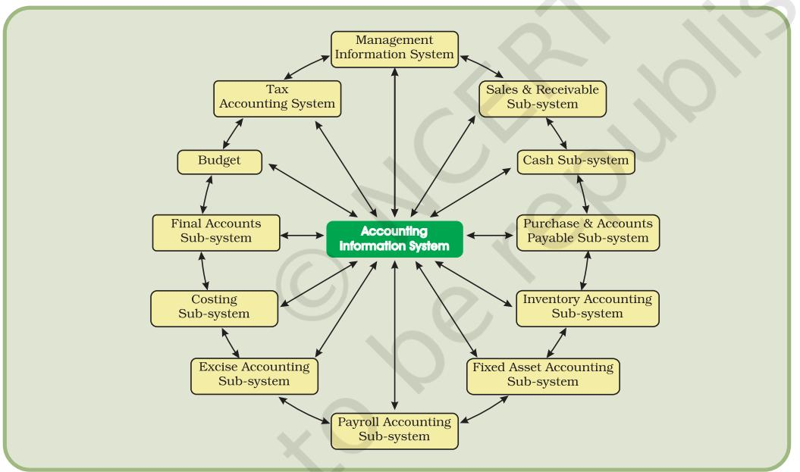

# OVERVIEW OF COMPUTERISED ACCOUNTING SYSTEM


1

#### Learning Objectives

*After studying this chapter you will be able to:*

- *Understand the need of Computerised Accounting System.*
- *Appreciate the impact of Information Technology on Financial Accounting System.*
- *Describe the major functions of Accounting Information System (AIS).*

# Introduction

In modern business accounting transactions are processed through computers. Usage of computers and Information Technology (IT) enables a business to quickly, accurately and timely access the information that helps in decision-making. This sharpens the competitive edge and enhances profitability. The computer systems (Figure 1.1) works with the data which is processed by the hardware commanded by the user through software. The Computerised Accounting System (CAS) has the following components:

| Procedure : | A logical sequence of actions to |
| --- | --- |
|  | perform a task. |

Data : The raw fact (as input) for any business application.

People : Users.

- Hardware : Computer, associated peripherals, and their network.
- Software : System software and Application software.

These are the five pillars on which Computerised Accounting System rests. This chapter discusses the concept and components of CAS alongwith its advantages and disadvantages. It is followed by the discussion of software packages on CAS. In this chapter we will also discuss the concept about grouping of accounts and codification methods to be used for CAS.

# 1.1 COMPUTERISED ACCOUNTING SYSTEM

Computerised Accounting System refers to the processing of accounting transaction through the use of hardware and software in order to produce accounting records and reports. CAS takes accounting


*Figure 1.1 : Components of Computer*

transactions as inputs that are processed through Accounting Software to generate the following reports:

- Day books/Journals
- Ledger

**2**

- Trial Balance
- Position Statement (Balance Sheet)
- Statement of Profit and Loss (Profit and Loss Account)

#### Basic flow of Accounting Transaction


#### Data and Information

Various elements (items) of accounting transactions are essentially the data items, which are processed through an accounting software to generate different sets of information in the form of accounting reports such as journals, ledger, etc.

A data-item (data element) is the smallest named unit of data in the *information system*. In accounting, a transaction consists of four data elements, such as name of account, accounting code, date of transaction and amount.

*The transaction is a record of inflow and outflow of resources.*

We may observe (Figure 1.3) how *data* (days worked and rate per day) is being (multiplied together) converted into *information* (amount to pay). The information may be viewed as data at one level; and when it is processed keeping in view the requirements of decision maker, it becomes the information at another level.

## 1.2 COMPONENTS OF CAS

The manual system of accounting is traditionally most popular method of keeping records of financial transactions of an organisation. Financial statements are the end products of the accounting process, which are prepared in accordance with *Generally Accepted Accounting Principles (GAAP)*. The accounting cycle means the processes involved in identifying, measuring and communicating the information. The basic phases of the cycle are as follows:


- The transactions are recorded in the journal.
- Journal entries are posted to the ledger accounts.
- A trial balance is prepared from balances of accounts.
- Accounts are reviewed and the necessary adjustments made.
- Adjustments are posted in the ledger to prepare adjusted trial balance.
- Adjusted trial balance is used to prepare the balance sheet and profit and loss account.
- Financial Statements are prepared from the finally adjusted ledger and balancing the accounts.

The above accounting cycle can be processed through the use of computers.


## 1.3 SALIENT FEATURES OF CAS

Following are the salient features required for CAS software:

## 1.3.1 SIMPLE AND INTEGRATED

CAS is designed to automate and integrate all the business operations, such as sales, finance, purchase, inventory and manufacturing. CAS is integrated to provide accurate, up-to-date business information rapidly. The CAS may be integrated with enhanced MIS (Management Information System), Multi-lingual and Data Organisation capabilities to simplify all the business processes of the organisation easily and cost-effectively.

## 1.3.2 TRANSPARENCY AND CONTROL

CAS provides sufficient time to plan, increases data accessibility and enhances user satisfaction. With computerised accounting, the organisation will have greater transparency for day-to-day business operations and access to the vital information.

## 1.3.3 ACCURACY AND SPEED

CAS provides user-definable templates (data entry screens or forms) for fast, accurate data entry of the transactions. It also helps in generalising desired documents and reports.

## 1.3.4 SCALABILITY

CAS enables in changing the volume of data processing in tune with the change in the size of the business. The software can be used for any size of the business and type of the organisation.

## 1.3.5 RELIABILITY

CAS makes sure that the generalised critical financial information is accurate, controlled and secured.

## 1.4 GROUPING OF ACCOUNTS

The increase in the number of transaction changes the volume and size of the business. Therefore it becomes necessary to have proper classification of data. The basic classifications of different accounts embodied in a transaction are resorted through accounting equation.

#### Accounting Equation

The modern accounting is based on double-entry system, which implies equality of assets and equities (liabilities and capital), i.e.

```
A = E
Where E = L + C
 Now A = L + C
Where A = Assets
```
- E = Equities
- C = Capital
- L = Liabilities

#### Thus, Assets = Liabilities + Capital

In this equation the *Liabilities* means claims on the firm by *creditors* and the *Capital* means claims of *owners*. The claims of owners keep on changing due to success (profit) or failure (loss) of the firm. This is reflected by the income statement, which provides the summary of income and expenses of business for a given accounting period. Keeping this in view, the above equation can be re-written as:

```
Assets = Liabilities + Capital + (Revenues – Expenses)
```
Each component of the above equation can be divided into groups of accounts as follows:

*Revenue Revenue means inflow of resources, which results from the sale of goods or services in the normal course of business and increase in capital. Expenses imply consumption of resources in generating revenues.*

#### • EQUITY AND LIABILITIES

## § Shareholder's Funds

- s Share Capital
- s Reserves and Surplus
- s Money Received against Share Warrents
- s Share Application Money Pending Allotment
- s Non-Current Liabilities
- s Long Term Borrowings
- s Deferred Tax Liabilities (net)
- s Other Long Term Liabilities
- s Long Term Provisions
- s Current Liabilities
- s Short Term Borrowings
- s Trade Payables
- s Other Current Liabilities
- s Short Term Provisions

#### • ASSETS

#### 1. Non-Current Assets

- s Fixed Assets
- s Tangible Assets
- s Intangible Assets
- s Capital Work-in-Progress
- s Intangible Assets Under Development
- s Fixed Assets held for Sales
- s Non Current Investments
- s Deferred Tax Assets (net)
- s Long Term Loans and Advances
- s Other Non-Current Assets

#### 2. Current Assets

- s Current Investments
- s Inventories
- s Trade Receivables
- s Cash and Cash Equivalents
- s Short Term Loans and Advances
- s Other Current Assets

#### • REVENUES

- § Sales
- § Other Income
- EXPENSES
	- § Material Consumed
	- § Salary and Wages
	- § Manufacturing Expenses
	- § Depreciation
	- § Administrative Expenses
	- § Interest
	- § Selling and Distribution Expenses

There is a hierarchical relationship between the groups and its components. In order to maintain the hierarchical relationships between a group and its sub-groups, proper codification is required to ensure neatness of classification.

## 1.4.1 CODIFICATION OF ACCOUNTS

According to *Concise Oxford Dictionary*, the term *code* means "a system of letter or figure with arbitrary meaning for brevity and for machine processing of information". Thus, *code* is an identification mark.

#### Method of Codification

The coding scheme of Account-heads should be such that it leads to grouping of accounts at various levels so as to generate Position Statement (Balance Sheet) and Statement of Profit and Loss (Profit-Loss Account). For example, we may allot the codes for top-level grouping of accounts (forming the 1st digit of the Account Code) as follows:

|  |  | 1 | Equity and Liabilities |
| --- | --- | --- | --- |
|  |  | 2 | Assets |
|  |  | 3 | Revenues |
|  |  | 4 | Expenses |
| Under Equity and | : | 11 | Shareholder's funds |
| Liabilities |  | 13 | Non-Current Liabilities |
|  |  | 14 | Current Liabilities |
| Under Assets | : | 21 | Non-Current Assets |
|  |  | 23 | Current Assets |

Note*: The gap in code in the 2nd digit 2nd digit2nd digit (e.g. after 1, 3 instead of 2) is used to provide flexibility.*

The above codification scheme utilizes the hierarchy present (used) in grouping of accounts. Major advantage of such coding is that if the account codes are listed in ascending (i.e. increasing) order, these will be automatically listed as per the desired hierarchy.

#### 1.4.1.1 Sequential Codes

In Sequential Code, numbers and/or letters are assigned in consecutive order. These codes are applied primarily to source documents such as cheques, invoices, etc. A sequential code can facilitate document searches. This process enables in either identification of missing codes (numbers) relating to a particular document or a relevant document can be traced on the basis of code.

For examples:

- CODES ACCOUNTS CL001 GCERT LTD CL002 XYZ LTD CL003 ARIL CORPORATION OF INDIA
#### 1.4.1.2 Block Codes

In a block code, a range of numbers is partitioned into a desired number of sub-ranges and each sub-range is allotted to a specific group. In most of the uses of block codes, numbers within a sub-range follow sequential coding scheme, i.e. the numbers increase consecutively. As an example, dealer codes for a trading firm could be as follows:

| CODES |  |  | DEALER-TYPE |
| --- | --- | --- | --- |
| 100 | - | 199 | Small Pumps |
| 200 | - | 299 | Medium Pumps |
| 300 | - | 399 | Pipes |
| 400 | - | 499 | Motors |

#### 1.4.1.3 Mnemonic Codes

A mnemonic code consists of alphabets or abbreviations as symbols to codify a piece of information. SJ for "Sales Journals", HQ for "Head Quarters" are examples of mnemonic codes. Another common example is the use of alphabetic codes in Railways in identifying railway stations such as DLH for Delhi, NDLS for New Delhi, BRC for Baroda, etc.

## 1.4.2 METHODOLOGY TO DEVELOP CODING STRUCTURE AND CODING

Let us assume that we have to do coding for students in one of seven schools run by a trust. The first step is to develop a coding structure (scheme), which will be used to develop individual codes for each student. Development of coding structure requires identification (finalisation) of hierarchy of schooling system and that of various attributes (parameters) associated with a student. A hierarchy in such a situation could be as follows:

#### Trust → School → Entry-year → Stream → Class → Section → Student

The "Stream" could be science stream, commerce stream or general Stream. A class may be divided into more than one section when the number of admitted students increases the class capacity. We can decide the coding structure after the following considerations:

- As there is only one Trust, no provision is required in the coding structure to accommodate for Trust. Had there been multiple trusts under one organisation running a number of schools, the provision of Trust code would have been necessary in the coding structure.
- Assuming that the maximum number of Schools is not likely to exceed 99, we can allocate 2 digits for School.
- Two digits can be allocated for the Entry-year. Entry-year is necessary to maintain records of old students.
- For Stream, 1 digit is sufficient. If Stream is not relevant (applicable) as is the case for primary and secondary classes, the value 0 will be considered for Stream.
- To accommodate Classes, 2 digits are sufficient.

**8**

- Number of Sections in a class will not exceed 9. Hence, 1 digit is sufficient for Section.
- Two digits will be sufficient for number of Students within a section of a class, assuming that not more than 99 Students will ever be put in a section of a class.

The coding structure for Students will be as follows based on the above considerations:

| School | 2 Digits |
| --- | --- |
| Entry-year | 2 Digits |
| Stream | 1 Digit |
| Class | 2 Digits |
| Section | 1 Digit |
| Student | 2 Digits |

Thus, if we allocate 10 digits codes to a student, we shall be able to get the following details of a student right from the code itself :

- Which stream in which school the student is studying (had studied)?
- What were the class and its section and in which year the student had entered this class?
- List of all students who has entered a school in a given year, etc.

Once the coding structure is decided as described above, allotting of code becomes easy. For example, if a student with a Roll No. 54 had entered Section-B of Class XII in Year 2008 opting for Science Stream (Non-Biology Group) (Stream Code: 1) in the 6th School run by the Trust. Its code would be as follows:


## 1.5 USING SOFTWARE OF CAS

There are two basic activities in using software of CAS – One time activities and recurring activites. One time activities include creation of Organisation details, accounting year, type of ledger (also called "creation of master files" ), etc. While reccuring activities include entry of transactions and generation of reports. The transactions are recorded on the basis of Cash Vouchers, Bank Vouchers, Purchase Vouchers, Sales Vouchers, Journal Vouchers, etc. Reports include generation of Day books, Ledgers, Trial Balance, Statement of Profit and Loss, Position Statement and Cash Flow Statement. (Please refer to Chapter 5 for details)

## SECURITY FEATURES OF CAS SOFTWARE

Every accounting software ensures data security, safety and confidentiality. Therefore every, software provides the following:

- Password Security
- Data Audit
- Data Vault

Password Security: Password is a mechanism, which enables a user to access a system including data. The system facilitates defining the user rights according to organisation policy. Consequently, a person in an organisation may be given access to a particular set of a data while he may be denied access to another set of data.

*PasswordPassword Password* is the key (code) to allow the access to the system.

Data Audit: This feature enables one to know as to who and what changes have been made in the original data thereby helping and fixing the responsibility of the person who has manipulated the data and also ensures data integrity. Basically, this feature is similar to Audit Trail.

Data Vault: Software provides additional security through data encryption.

*EncryptiEncrypti Encryptio n* essenti*ally scrambles the information so as to make its interpretation extremely difficult (almost impossible). Thus,* Encryption *ensures security of data even if it lands in wrong hands, because the receiver of data will not be able to decode and interpret it.*

## 1.6 ADVANTAGES OF CAS

Following are the advantages of Computerised Accounting System (CAS):

- 1. Timely generation of reports and information in desired format.
- 2. Efficient record keeping.
- 3. Ensures effective control over the system.

- 4. Economy in the processing of accounting data.
- 5. Confidentiality of data is maintained.

# 1.7 LIMITATIONS OF CAS

Following are the limitation of CAS software:

- 1. Faster obsolescence of technology necessitates investment in shorter period of time.
- 2. Data may be lost or corrupted due to power interruptions.
- 3. Data are prone to hacking.
- 4. Un-programmed and un-specified reports cannot be generated.

# 1.8 ACCOUNTING INFORMATION SYSTEM (AIS)

Accounting Information System (AIS) and its various sub-systems may be implemented through Computerised Accounting System. The subsystems of AIS are briefly described below (Fig. 1.4)



*Figure 1.4 : The sub-systems of Accounting Information System*

# 1.8.1 CASH AND BANK SUB-SYSTEM

It deals with the receipt and payment of cash both physical cash and electronic fund transfer. Electronic fund transfer takes place without having the physical entry or exit of cash by using the credit cards or electronic banking.

# 1.8.2 SALES AND ACCOUNTS RECEIVABLE SUB-SYSTEM

It deals with recording of sales, maintaining of sales ledger and receivables. It generates periodic reports about sales, collections made, overdue accounts and receivables position as also ageing schedule of receivables/debtors.

## 1.8.3 INVENTORY SUB-SYSTEM

It deals with the recording of different items purchased and issued specifying the price, quantity and date. It generates the inventory position and valuation report.

## 1.8.4 PURCHASE AND ACCOUNTS PAYABLE SUB-SYSTEM

It deals with the purchase and payments to creditors. It provides for ordering of goods, sorting of purchase expenses and payment to the creditors. It also generates periodic reports about the performance of suppliers, payment schedule and position of the creditors.

## 1.8.5 PAYROLL ACCOUNTING SUB-SYSTEM

It deals with payment of wages and salary to employees. A typical wage report details information about basic pay, dearness allowance, and other allowances and deductions from salary and wages on account of provident fund, taxes, loans, advances and other charges. The system generates reports about wage bill, overtime payment and payment on account of leave encashment, etc.

## 1.8.6 FIXED ASSETS ACCOUNTING SUB-SYSTEM

It deals with the recording of purchases, additions, deletions, usage of fixed assets such as land and buildings, machinery and equipments, etc. it also generates reports about the cost, depreciation, and book value of different assets.

## 1.8.7 EXPENSE ACCOUNTING SUB-SYSTEM

This sub-system records expenses under broad groups such as manufacturing administrative, financial, selling and distributions and others.

## 1.8.8 TAX ACCOUNTING SUB-SYSTEM

This sub-system deals with compliance requirement value-added tax (VAT), excise, customs and income tax. This sub-system used in large size organisation.

## 1.8.9 FINAL ACCOUNTS SUB-SYSTEM

This subsystem deals with the preparation of Profit and Loss accounts, Balance Sheet and cash flow statements for reporting purposes.

## 1.8.10 COSTING SUB-SYSTEM

It deals with the ascertainment of cost of goods produced. It has linkages with other accounting sub-systems for obtaining the necessary information about cost of material, labour, and other expenses. This system generates information about changes in the cost that takes place during the period under review.

## 1.8.11 BUDGET SUB-SYSTEM

It deals with the preparation of budget for the coming financial year as well as comparison with the current budget of the actual performances.

# 1.8.12 MANAGEMENT INFORMATION SYSTEM

Management Information System (MIS) deals with generation and processing of reports that are vital for management decision-making. The Information system should be so flexible as to provide customised reports to support various managerial functions such as planning, organising, staffing, oversight, control and decision-making including operational, functional and strategic nature.

## *Summary*

- *•* In Computerised Accounting System, accounting transactions are processed using computer system. A computer system includes hardware and software. Hardware includes Central Processing Unit (CPU), Random Access Memory (RAM), Monitor (Screen), Keyboard, Mouse, Hard Disk and CD/DVD for mass storage of data and Printer, etc. Software consists of set of instructions. Software can either be a System Software (a part of Computer System) or an Application Software. CAS uses Accounting Software. Accounting Software (such as Tally) is an example of Application Software.
- *•* Coding (for Account Head, Budget Head, Cost Centres, etc) is required in CAS. Coding first requires development of its structure. Coding Structure should be compatible with inherent structure of the element to be coded. For example, Account Head coding requires a hierarchical structure to progressively summarise the accounting information as per the requirements of Balance Sheet and Profit and Loss Account.
- *•* Advantages of CAS include speed, efficiency, arithmetic accuracy, cost saving, confidentiality of data.
- *•* Limitations of CAS include provision for (a) fast obsolescence of technology, (b) data loss due to either power interruptions or damage to hard disk, (c) virus and other security hazards.
- *•* Accounting Information System is an integration of various sub-systems such as: (i) cash sub-system, (ii) sales and accounts receivable sub-system, (iii) inventory sub-system, (iv) purchase and accounts payable sub-system, (v) payroll accounting sub-system, (vi) fixed asset accounting sub-system, (vii) expense accounting sub-system, (viii) tax accounting sub-system, (ix) final accounts sub-system, (x) costing sub-system, (xi) budget sub-system, (xii) management information sub-system.

## EXERCISES

## Q1. MULTIPLE CHOICE QUESTIONS

- 1. The components of Computerised Accounting System are :
	- (a) Data, Report, Ledger, Hardware, Software;
	- (b) Data, People, Procedure, Hardware, Software;
	- (c) People, Procedure, Ledger, Data, Chart of Accounts;
	- (d) Data, Coding, Procedure, Rules, Output.
- 2. The Computerised Accounting System refers to :
	- (a) Printing of Balance Sheet and Profit and Loss Accounts using computer;
	- (b) Processing of accounting transaction through computer and produce records and reports;
	- (c) Processing of accounting related data and printing reports;
	- (d) None of the above.
- 3. The components of Computerised Accounting System refers to :
	- (a) Business transactions are analysed, transactions recorded, prepare trial balance, preparation of balance sheet and profit and loss account;
	- (b) From data entry to preparation of final statements;
	- (c) Transformation of manual accounting system to CAS;
	- (d) None of the above.
- 4. The CAS should be
	- (a) Simple and integrated, transparent, accurate, scalability, reliability;
	- (b) Complex, Accurate, Transparent, Faster to work;
	- (c) Able to transform the manual accounting system to computerised accounting system;
	- (d) None of the above.
- 5. The Grouping of Accounts means the classification of data from :
	- (a) Asset, liabilities and capital
	- (b) Asset, capital, liabilities, revenue and expenses
	- (c) Asset, owners equity, revenue and expenses
	- (d) None of the above.
- 6. Codification of Accounts required for the purpose of :
	- (a) Hierarchical relationship between groups and components
	- (b) Data processing faster and preparing of final accounts
	- (c) Keeping data and information secured
	- (d) None of the above.

- 7. Method of Codification should be :
	- (a) Such that it leads to grouping of accounts
	- (b) An identification mark.
	- (c) Easy to understand, cryptic, and leads to grouping of accounts
	- (d) None of the above
- 8. The need of Codification is :
	- (a) The Encryption of data
	- (b) The Generation of mnemonic code
	- (c) To secure the accounts, reports, etc.
	- (d) Easy to process data, keeping proper records
- 9. What is the activity sequence of the basic information processing model?
	- (a) Organise data, process data, and collect data
	- (b) Collect data, organise and process data, and communicate information
	- (c) Process data, organise data, and collect data
	- (d) Organise data, collect data, and communicate information
- 10. What are internal controls designed to do?
	- (a) safeguard assets and optimise the use of resource
	- (b) only achieve maximum revenue
	- (c) only safeguard assets
	- (d) only ensure accurate accounting records
- 11. What is a firm's payment to a supplier for merchandise inventory recorded in?
	- (a) Cash payment journal
	- (b) Purchases journal
	- (c) Sales journal
	- (d) Cash receipts journal
- 12. Where are amounts owed by customers for credit purchases found?
	- (a) accounts receivable journal
	- (b) general ledger
	- (c) sales journal
	- (d) accounts receivable subsidiary ledger

## Q2. ANSWER THE FOLLOWING QUESTIONS

- 1. Why the computerisation of Financial Accounting is required and why is it useful?
- 2. What is coding? Why codification is required for an Accounting System?
- 3. What are the salient features of Computerised Accounting Software?
- 4. What are the phases in an accounting cycle?
- 5. Write differences between data and information with examples?
- 6. Explain various types of coding methods and the situations where each coding method is best suited?
- 7. Define the term transaction and elaborate with the help of examples how the transaction will be shown in chart of accounts by hierarchical grouping?
- 8. What is a chart of accounts? How is it arranged?
- 9. What is meant by Revenue and Expenses?
- 10. What are the limitations of CAS?
- 11. What are the advantages of CAS?
- 12. What is encryption and how is it helpful in CAS?

## Q3. SKILL REVIEW

- 1. Topic of debate: "Intentional manipulation of accounting records is much easier in computerised accounting system than in manual accounting system".
Do this exercise in the class forming group of 4 students to form a team and do the presentation in the class?

- 2. Develop a coding structure for inventory items based on the following information: There are around 7000 items, which are grouped under 37 major categories. Each major category is further sub-divided into 15-40 sub-categories. Within a sub-category, the number of items will never exceed 1000.

| ANSWERS |  |  |  |  |  |
| --- | --- | --- | --- | --- | --- |
| 1. b | 2. b | 3. a | 4. a | 5. b | 6. a |
| 7. a | 8. a | 9. b | 10. a | 11. a | 12. d |

