# SPREADSHEET


#### Learning Objectives

*After studying this chapter you will be able to understand:*

- *Concept of Spreadsheet and its features.*
- *How to use a Spreadsheet.*


A *spreadsheet* is a configuration of rows and columns. Rows are horizontal vectors while columns are vertical vectors. A spreadsheet is also known as a worksheet. It is used to record, calculate and compare numerical or financial data. Each value can either be an independent (i.e*. basic*) value or it may be derived on the basis of values of other variables. The *derived value* is the outcome of an arithmetic expression and/or a function (i.e. a formula).

Spreadsheet application (sometimes referred to simply as spreadsheet) is a computer program that allows us to add (i.e. enter) and process data. We shall understand spreadsheet with the help of *MS-Excel* (or simply, Excel), which is one of the Microsoft Office Suite of software.

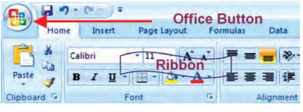

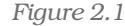

The current version of Excel is Excel 2007 and has a completely redesigned user interface. The Excel 2007 is now designed with a series of horizontal tabs known as "Ribbon" (Figure 2.1). These tool bars are changed using tabs at the top. This layout is very easy to use than the previous versions of Excel. On clicking with left button of mouse at "Office Button" ; we will be able to open an old workbook or create a new one or can save the workbook or can print which were earlier available in previous version of Excel in File menu.

# 2.1 BASIC CONCEPTS OF SPREADSHEET

A file in Excel is known as a "Workbook". A workbook is a collection of a number of "Worksheets" (Figure 2.2). By default, three sheets, namely Sheet 1, Sheet 2, and Sheet 3 are available to users. At a time, only one worksheet can be made as "Active Worksheet" and that worksheet is available to a user for carrying out operations. An active worksheet's name will be shown in bold letters in the "Sheet Tab" at the bottom left of the screen. Additional sheets can be added, if required, by clicking

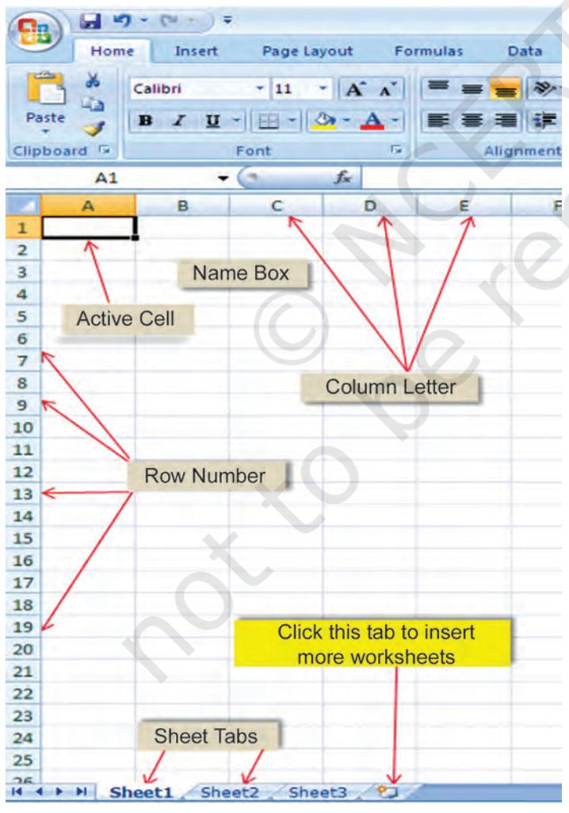

*Figure 2.2*

**18**

on the icon (which works as Insert *! Worksheet orksheetorksheet*).

The Sheet names can be changed, if required, by rightclicking the mouse over the Sheet1 or Sheet 2 or Sheet 3 after selecting and pointing it on the sheet name (which is to be changed) and selecting "Rename" option.

# *Box 2.1 Box 2.1 Basic and Derived Values*

*If quantity (Q) of an item is purchased at a price (P), the value of that item (V) is derived as follows:*

*V = Q × P*

*Here, the values P and Q are* Basic Values. *While V is the* Derived Value *as it is obtained by multiplying Q with P. The expression (Q×P) is called as* arithmetic expression*. Additional examples of* arithmetic expressions *are given later in this chapter.*

Note*: In general, an* arithmetic expression *may contain one or more* functions*.*

*Rows* are numbered numerically from top to bottom while *Columns Columns* are referred by alpha characters from left to right. In Excel 2007, there are 65536 *Rows* which are numbered as 1, 2, 3, … 65,536. These numbers are shown on the left most portion of the worksheet. *Columns Columns* (total 256 in Excel) are identified by letters, such as A, B, C,.. AA… IV, and are shown on the horizontal box just above Row 1. Thus, there are 65,536 x 256 = 1,65,00,000,

|  | Home | Insert | Page Layout | Formulas Data |  | Review | View |  |
| --- | --- | --- | --- | --- | --- | --- | --- | --- |
|  | Σ AutoSum · |  | 2 Logical = | 0 Lookup & Reference . |  |  | Define Name - |  |
| Insert | Recently Used ~ |  | A Text - | @ Math & Trig T |  |  |  | Define Name ... |
| Function | Financial . |  |  | Date & Time - More Functions . |  |  | Manager | 12 12 12 2 11 1 2 11 1 2 1 |
|  |  |  | Function Library |  |  |  |  | Derined Names |
|  | Numbers |  | fr 5 |  |  |  |  |  |
|  | A | B | C D | E F |  |  | G | H |
|  | 5 | б | 7 | 8 | ਤੋ |  |  |  |
| 2 | 2 | 6 | 5 | 4 | 8 |  |  |  |
| 4 4 |  |  | Formula bar or |  |  |  |  |  |
| 5 | Name Box |  | Function Names |  |  |  |  |  |
| б |  |  |  |  |  |  |  |  |


approximately cells, which is indeed a huge work area, sufficient for all application requirements (Figure 2.3) in one sheet.

In a spreadsheet, a value or function or an arithmetic expression is recorded in a *cell*. The intersection of a *row* and a *column* is called a *cell.* A *cell* is identified by a combination of a letter and a number corresponding to a particular location within the spreadsheet. For example, the first cell of a worksheet is identified as A1 as it shown in Figure 2.2 at row 1 and column (A). When we start Excel, the pointer (cursor) points to the first cell, i.e. A1, and this cell is called the *Active Cell*. We can move around a worksheet through four arrow keys (i.e. left, right, up, down as shown in Figure 2.4). For example, the cell having address as G8 correspond to 8th row under G column. Each cell thus has a unique identification called as *cell address*.

Cell Reference *— A cell reference identifies the location of a cell or group of cells in the spreadsheet also referred as a cell address. Cell references are used in formulas, functions, charts, other Excel commands and also refer to a group or range of cells. Ranges are identified by the cell references of the cells in the upper left (cell A1) and lower right (cell E2) corners in Figure 2.3. The ranges are identified using colon (:) e.g. A1: E2 which tells Excel to include all the cells between these start and end points. By default cell reference is* relative*; which means that as a formula or function is copied and pasted to other cells, the cell references in the formula or function change to reflect the new location. The other cell reference is* absolute *cell reference which consists of the column letter and row number surrounded by dollar ($) signs e.g. $C$4. An absolute cell reference is used when we want a cell reference to stay fixed on specific cell, which means that when a formula or function is copied and pasted to other cells, the cell references in the formula or function do not change. A* mixed reference *is also a cell reference that holds either row or column constant when the formula or function is copied to another location e.g., $C4 or C$4.*

The mouse is used for all the operations required and for navigation in worksheet (or workbook) except data entry; but some of the important operations and common navigations can be performed by using key strokes (as given below). It is better to understand and know all the keys of keyboard and key strokes. Pressing a key is called key stroke but to fulfill one command for operation in the worksheet some time we require pressing two keys together to get one key stroke (Figure 2.4)


*Figure 2.4*

| Movement | Key Stroke (Press key) |
| --- | --- |
| One cell down | Down arrow key ( ) or Enter key |
| One cell up | Up arrow key ( ) |
| One cell left | Left arrow key ( ) |
| One cell right | Right arrow key ( ) or Tab key |

The other navigational and operational strokes are used for faster cursor movement than one cell at a time with cluster of filled cells. Cluster of filled cells implies a set of consecutive cells in a row or in a column having some data.

|
|  |

| Movement | Key Stroke (Press key) |
| --- | --- |
| Top of Worksheet (cell A1) | CTRL + HOME (i.e. Keep CTRL key pressed and then press HOME key |
| The cell at the intersection of the | CTRL + END keys |
| last row and last column containing data |  |
| Moving consecutively to the first and the last | CTRL + Right arrow key ( ) or |
| filled cells of clusters of filled cells in a row by | else END + Right arrow key ( ) |
| successive pressing of CTRL + Right arrow |  |
| key ( ) or else END + Right arrow key ( ) |  |
| Moving consecutively to the first and the last | CTRL + Down arrow key ( ) or |
| filled cells of a cluster of filled cells in a column | else END + Down arrow key ( ) |
| by successive pressing of CTRL + Down arrow |  |
| key ( ) or else END + Down arrow key ( ) |  |
| Beginning of the Row | HOME key |
| Beginning of the Column |  |

The data that is entered in a cell may be either numeric or alphanumeric or a date. As a data is typed in a cell, Excel is able to make out its type (i.e. numeric or alpha-numeric or date) depending on the nature of value typed in a cell.

*If the value is entered as* 306*, its type is automatically taken as Numeric; if the value is entered as* Asset, *its type will be taken as alpha-numeric; while if the value is entered as 12/07/08, its type is taken as Date. (refer figure 2.5)*

The first step required to use Excel for a specific application is to decide what values will be entered in which cells and also the cells which will be used for entering the relationships. Once we have decided about the cells which are to be used for the relationships; the formulas (arithmetic expressions) and data can be entered. *(See Box 2.1 at page18)*

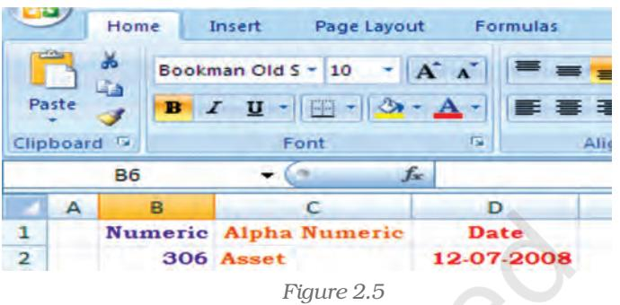

#### *Values*

*A value can be entered from the computer keyboard by directly typing into the cell itself. Alternatively, a value can be based on a formula (derived), which might perform a calculation, display the current date or time, or retrieve external data such as a stock quote or a database value.*

*The value rule according to computer scientist Alan Kay Alan KayAlan Kay implies in spreadsheet. It states that a cell's value relies solely on the formula that user has typed into the cell. The formula may rely on the value of other cells, but those cells are likewise restricted to user-entered data or formulas. There are no 'side ef 'side ef'side effects' to calculating a formula: the only output is to display the calculated result inside its occupying cell. There is no natural mechanism for permanently modifying the contents of a cell unless the user manually modifies the cell's contents. Sometime it is called a limited form of first-order functional programming.*

A simple example of a spreadsheet application (Figure 2.6) is to calculate compound interest and maturity amount to be paid on fixed deposit. The first step (i.e. the Planning Step) is to define six cells with column headings:

- Principal Amount (PA in column B)
- Rate of Interest (r in column C)
- Period in years (NY)
- Period of Compounding (CP in column D)
- Compound Interest (CI in column F)
- Maturity Amount (MA in column E)

The formula for Maturity Amount (MA) and Compound Interest (CI) computations considering yearly compounding of interest are as follows:

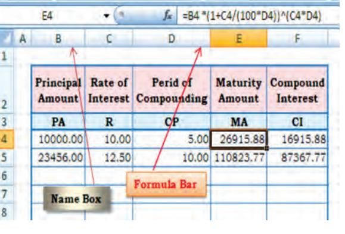

*Figure 2.6*

MA = PA * (1 + R / (100 * CP)) ^ (R * CP) CI= MA – PA

Now, we can decide the layout of the worksheet for (compound) interest calculation as shown in Figure 2.6.

It may be observed that the basic values are entered in cells (as in figure 2.6 the cells are B4, C4 and D4); the derived values (as in Figure 2.6 the cells are E4 and F4) are automatically computed (using above formula) and shown in *formula bar*. In case any basic values are modified, the derived values as a result are revised accordingly. This feature of Spreadsheets enables us to study various *what-if scenarios*.

*A what-if scenario is used to generate a number of alternatives to examine the cause (if) and effect (what). Thus, it helps in analysing the impact of changes due to variations in one or more input values. Taking the above example, if all the other values are kept same, one can see how different rates of interest and different periods of compounding would affect the Compound Interest and the Maturity Amount to be received.*

Before proceeding further for the above example we have to understand some of the basic terminologies and features of the spreadsheet such as:

# 2.1.1 LABELS

A text or especial character will be treated as labels for rows or columns or descriptive information. Labels cannot be treated mathematicallymultiplied, subtracted, etc. Labels include any cell contents beginning with A-Z e.g., in the above Figure 2.6 Principal Amount, Rate of Interest, Maturity amount, etc. will be taken as labels.

# 2.1.2 FORMULAS

The formula means a mathematical calculation on a set of cells. Formulas must start with an = sign (equal to sign), e.g. in the Figure 2.7 the cell E3 will have formula = D1+E1/F1*G1 which gives value 16.

When a cell contains a formula, it often contains *references* to other cells. Such a *cell reference* is a type of variable. Its value is the value of the referenced cell or some derivation of it. If that cell in turn references other cells, the value depends on the values of those.

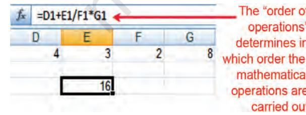

**22**

By convention, the left hand side of equal to sign in a formula is normally considered is calculated and displayed in cell E3.

A formula identifies the calculation needed to place the result in the cell it is contained within. A cell E3 containing a formula, therefore it has two display *Figure 2.7*

components; the formula itself and the resulting value. The formula is shown only when the cell is selected by "clicking" the mouse over a particular cell; otherwise it contains the result of the calculation (in this case 16).

The arithmetic operations and complex nested conditional *(whatif scenario)* operations can be performed by spreadsheets which follow *order of order oforder of mathematical (expression) operations rules*.

# Order of mathematical operations (expressions)

*Computer math uses the rules of Algebra. Any operation(s) contained in brackets will be carried out first followed by any exponents.*

*After that, Excel considers division or multiplication operations to be of equal importance, and carries out these operations in the order they occur left to right in the equation.*

*The same goes for the next two operations – addition and subtraction. They are considered equal in the order of operations. Whichever one appears first in an equation, either addition or subtraction is the operation carried out first.*

*Three easy ways to remember the order of operations is to use the acronym:*

| GEMS |  | PEMDAS |  |  | BEMDAS |  |
| --- | --- | --- | --- | --- | --- | --- |
| ( ) | Grouping | Please | - | ( )parenthesis | ( ) | Brackets |
| ^ | Exponents | Excuse | - | ^ exponents | ^ | Exponents |
| * | Multiplication : | My | - | * multiply | * | Multiplication |
| / | or Division : | Dear | - | / divide | / | Division |
| - | Subtraction : | Aunt | - | + add | + | Addition |
| + | or Addition : | Sally | - | - subtract | - | Subtraction |

A spreadsheet without any formulas is a collection of data which are arranged in rows and columns (a database) like a calendar, timetable or simple list, etc. There is a Formula tab on Excel ribbon (Figure 2.8(a) which contains four sections, functions library, defined names, formula auditing and calculation.

| Figure 2.8(a) |
| --- |

# 2.1.3 FUNCTIONS

A function is a special key word which can be entered into a cell in order to perform and process the data which is appended within brackets.

There is a function button on the formula toolbar (*f*x) (figure 2.8(b); when we click with the mouse on it; a function offers assistance and useful prompts into a spreadsheet cell. Alternatively we can enter the function directly into the formula bar. A function involves four main issues:

- Name of the function
- The purpose of the function
- The function needs what argument(s) in order to carry its assignment.

| Figure 2.8(b) |
| --- |

- The result of the function.
A function is a built in set of formulas which starts with an = "equal to sign" such as = FunctionName(Data). The data (or argument in proper terminology) includes a range of cells.

SUM (), AVERAGE () and COUNT () are common functions and relatively easy to understand. They each apply to a range of cells containing numbers (or blank but not text) and return either the arithmetic total of the numbers, the average mean value or the quantity of values in the range.

For Example: The SUM or AutoSum (∑) function is the most basic and one of the common user functions. It is used to get the addition of

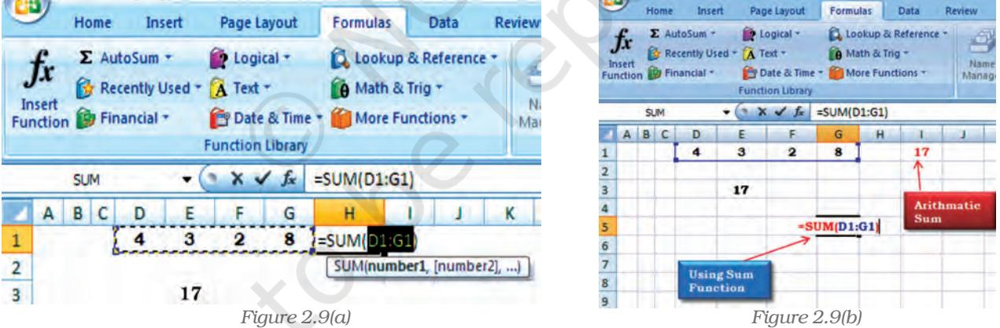

various numbers or the contents of various cells. On the ribbon (Figure 2.9(a)) the AutoSum (∑) button can be use directly for summation of values from cells. Once we click the AutoSum (∑) at cell H1, the function adds the contents of cell range D1 to G1 and displays the answer that we want to get the sum of. If we want answer in the cell G5 (Figure 2.9(b) use the mouse to click in the cell G5 and click AutoSum button then from keyboard type range of the cells D1:G1; the answer 17 will appear in cell G5; or we can write directly the complete function = SUM (D1: G1) appears in the formula bar above the worksheet. The AutoSum function also includes other series based functions such as AVERAGE, MIN, MAX and COUNT.

There are twelve different categories of functions available in Excel 2007 displayed on the ribbon (Figure 2.8) which are classified as per the usage e.g. The Financial, Date and Time, Lookup and References, Database, Text and Logical functions are useful in Computerised Accountancy and will be explained later subsequently.

#### Naming Ranges – IF Functions – Nested IF Functions

As mentioned earlier, we will now learn the arithmetic operations and complex nested conditional *(what-if scenario)* using name ranges, absolute cell references and mixed references in following sections.

#### Naming Cells and Ranges

Naming ranges in Excel will save time for writing complex formulas. The name can be used in place of cell range whenever reference it e.g. in D3 we have = SUM (B1:F1) (Figure 2.10)

The cell referenced in the function B1:F1 can be replaced with a descriptive name say *Numbers* (name range) which is easier to remember and in D3 it will be = SUM (Numbers)

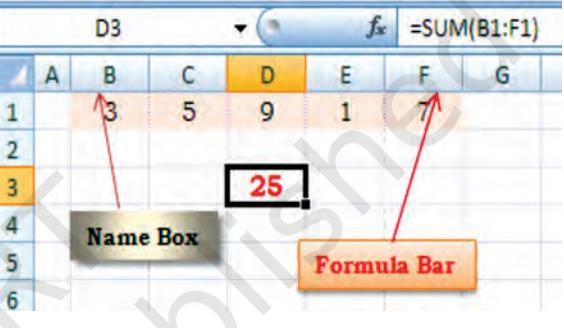

*Figure 2.10*

Behind the *Numbers Excel* is hiding cell references, we will see how it works now.

The steps are for defining Name Ranges are as follows:

- 1. Select the cell(s) which are to be named (such as B1:F1 in Figure 2.10(a)).
- 2. Click on the ribbon on formula tab.
- 3. Select Define Name (Figure 2.10(b) option on the ribbon and click it.
- 4. This will provide a dialogue box will be opened as shown in Figure 2.10(c) to click

Define Name (another option Apply Names is for previously created Range Names to select) (Figure 2.10(d)).

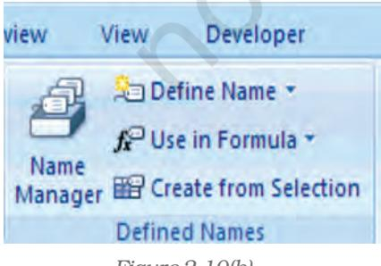


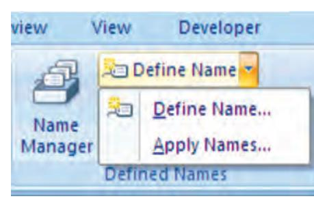

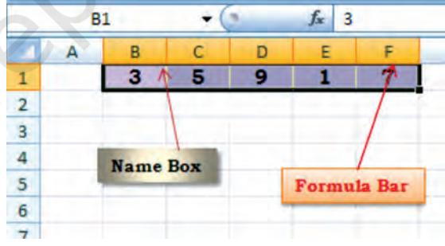


**25**

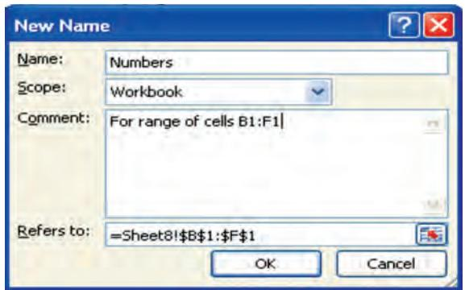

#### *Figure 2.10(d)*

| Apply Names . |
| --- |
| Ignore Relative/Absolute |
| Use row and column names |

*Figure 2.10(e)*

- 5. This will display a dialogue box as New Name shown in Figure 2.10(d). It will provide a window "Name" in which type "Numbers" which will represent cell ranges $B$1:$F$1 as shown in be "Refers to" window.
- 6. Click OK on the New Name dialogue box which returns to the spreadsheet. Notice that the Name Box having our heading "Numbers".

7. To apply this name in cell D3 for summation from B1:F1 click on Apply Name and a dialogue box will be opened then click on a Name Range – Numbers (Figure 10(e)). The D3 will be having =SUM (Numbers) And will display the result (Figure 10(f)). The named range can be used with other Functions such as AVERAGE (), SUMIF () etc.

> Now we will use a summation of numbers using condition in the cell D3. Type the formula = SUMIF (Numbers,"<6) and the answer will be 9 (for the Numbers less than 6 in the named range B1:F1) (Figure 2.10(f)).

Let us understand with the help of another example in which we will be using two Named Ranges (Figure 2.11) namely Monthly_Totals for cells B2:B5

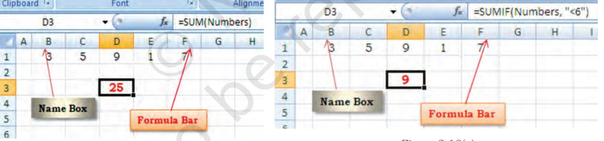

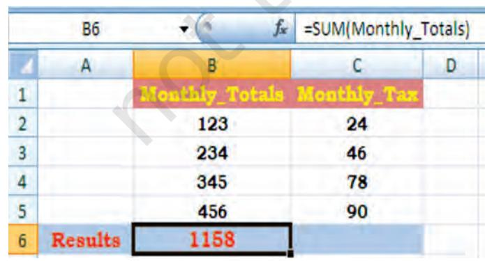

*Figure 2.10(f)*

*Figure 2.11*

**26**


and Monthly_Tax for cells C2:C5 respectively created as described above.

The cell B6 will have value 1158 by using function as =SUM (Monthly_Totals).

Similarly in Figure 2.11(a) if we use Autosum Function (∑) from the formula tab of the ribbon at the cell C6; the function will include the Named Ranges as an argument and gives the result 238.

We will now use these two Named Ranges to calculate the Balance (in cell B7) after using the formula tax from monthly totals. Let us give Total_of_Month is the Named Range for cell B6 and similarly, the Total_of_Tax is the Named Range for cell C6. With these two Named Ranges; the cell B7 will have the difference of these two amounts and will be written (Figure 2.11(b)) as = Total_of_Month – Total_of_Tax .

To prevent its recalculation and maintain the present calculated value as shown in the cells B6, C6 and B7 respectively (Figure 2.11(b) we can freeze the formula using Paste Special command. The following steps are required:

- 1. Select the cell (s) that contains the formula e.g. B6:C6, B7 (Figure 2.11(b)
- 2. Click on Home Tab and select Copy symbol (Figure 2.11(c)) to click, this will copy the values and formulas of the cells (Figure 2.11(d)).
- 3. Click on Paste tab and select Paste Special .
- 4. In the Paste Special box (Figure 2.11 (d)), under paste select the radio button next to Values and click OK . This will permanently remove the formula from the workbook.

In continuation to our need of *what-ifscenario* now we will learn about an important logical function IF Function . This function can be evoked from formula tab on the ribbon. This function returns one value if a specified condition evaluated to TRUE and another value if it evaluates to FALSE. We will learn more about the usage of functions in the business applications subsequently; there are a large selection of if functions available. An IF function has the following format:

#### IF (logical_test, value_if_ture, value_if_false) where

|  | SUM | X X V fx | =SUM(Monthly Tax) |  |
| --- | --- | --- | --- | --- |
|  | A | B | C | D |
|  |  | Monthly Totals Monthly Tas |  |  |
| w NH |  | 123 | 24 |  |
|  |  | 234 | 46 |  |
|  |  | 345 | 78 |  |
| 456 |  | 456 | 90 |  |
|  | Results | 1158 | =SUM (Monthly Tax) |  |
| 7 | Balance |  |  |  |

*Figure 2.11(a)*

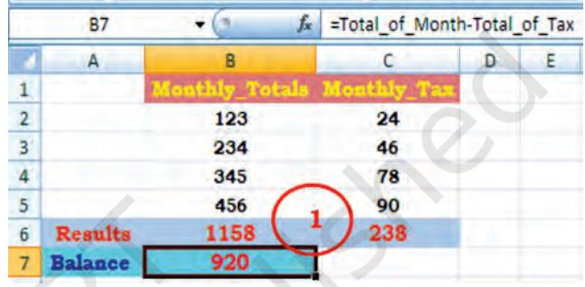

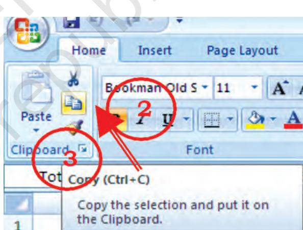

*Figure 2.11(b)*

*Figure 2.11(c)*

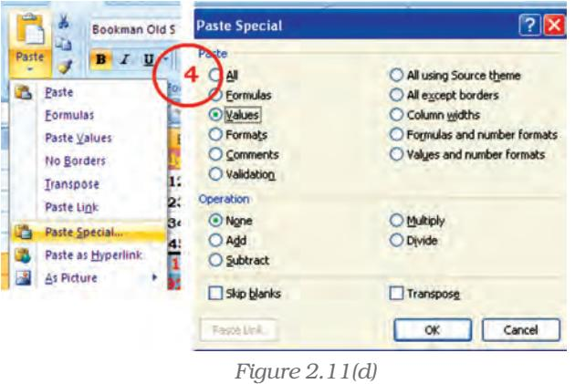

**27**

logical_test : the value or expression that is determined to be true or false; this requires the usage of a logical operator. A logical operator is one used to perform a comparison between two values and produce a result of true or false (there is no middle result: something is not half true or half false or "Don't Know"; either it is true or it is false). For example, A1 < 20 could be used as a logical test, where symbol "<" is a logical operator "less than". (There are many more logical operators such as =, <=, <>, >, >= etc.)

value_if_true : The value returned if the test is determined to be true. This value can be a value, text, or expression, formula, etc. or it can be return the value of another cell.

value_if_false : The value returned, if the test is determined to be false. This value can be a value, text, or expression, formula, etc. or it can return the value of another cell.

- e.g. i. = IF( A1 < 20, "Yes", "No") this function will return Yes if cell A1 < 20 and o for anything else.
	- ii. = IF (C2 > B2, (C2+D2)/2, (B2+D2)/2) this function will compare both cell C2 > B2 and will calculate and return (C2+D2)/2 if it is true else it will calculate and return (B2+D2)/2.

Example : Let us calculate the amount of saving (Cell address "value") on the basis of percentage value (Cell address "saving") shown in figure 2.12(a)

Creating IF function using the Formula Tab and dialogue box.

- 1. Select the cell F4 (Figure 2.12(a) where the function is to be introduce
- 2. Click at the Formula tab on the ribbon and click logical option.

|  |  | E |  | · ( * X √ / = = F (E4 >10000,10%,5%) |  |  |  |
| --- | --- | --- | --- | --- | --- | --- | --- |
|  | A | B | C | Di | E | E | G |
| T |  |  |  | Saving Percentage and Amount |  |  |  |
| 2 |  |  |  |  |  |  |  |
|  | Sr. No. | Name | Income | Expense | Total | Saving | 1721 |
| प | 1 | Ramesh | 12345.00 | 3456.00 | 8889.00 6) |  | 444.45 |
| 5 | 12 | Suzy | 23456.00 | 4567.00 | 18889.00 | 10.00% | 1888.90 |
| б | 3 | Ashok | 12340.00 | 5678.00 | 6662.00 | 5.00% | 333.10 |
| 7 | র | Mitesh | 23450.00 | 12345.00 | 11105.00 | 10.00% | 1110.50 |
| 8 | 5 | Bhadrakant | 17000.00 | 5678.00 | 11322.00 | 10.00% | 1132.20 |
| ਰੇ | 6 | Khyati | 9876.00 | 2345.00 | 7531.00 | 5.00% | 376.55 |
| 10 | 7 | Nirav | 13467.00 | 4567.00 | 8900.00 | 5.00% | 445.00 |
| 11 8 |  | Priyanka | 1111.00 | 5678.00 | 5433.00 | 5.00% | 271.65 |

*Figure 2.12(a)*

- 3. Select IF function which will provide Function Arguments dialogue box (Figure 2.12(b).
- 4. Type an appropriate condition in the logical_test box ( e.g. E4 > 10000 )
- 5. In the value_if_true box type the require value (e.g. 10%) if the logical test condition is met.
- 6. In the value_if_false box type the value (e.g. 5%) if the logical test condition is NOT met.
- 7. Click OK, the answer for the condition will be displayed (in cell F4 it will be 5%). Copy the function from F4 to all other cells F5:F11.

In the Formula Box the function will be displayed as

=IF (F4>10000, 10%, 5%)

This is simple use of IF function. The nested IFs can be used to look for several conditions and to look at different types of functions.

## e.g. = IF (AVERAGE (A2:A6) > 10, SUM (B2:B6), 0)

This function will be able to look at the average of cells A2 to A6 and if the average is higher than 10 it will sum the value of the cells B2 to B6, if the average is equal to or less than 10 it will return to 0.

In some cases, we need to check more than one condition. In other words, check the first condition; if that condition is false, check another

| Eunction Arguments |  |  |  |  |
| --- | --- | --- | --- | --- |
| IF |  |  |  |  |
| Logical test | E4 >10000 | = FALSE |  |  |
| Value if true | 10% | = 0.1 |  |  |
| Value if False | 5% | = 0.05 |  |  |
| Checks whether a condition is met, and returns one value if TRUE, and another value if FALSE. |  | = 0.05 |  |  |
|  |  | Logical_test is any value or expression that can be evaluated to TRUE or FALSE. |  |  |
| Formula result = ############### |  |  |  |  |
| Help on this function |  |  | OK | Cancel |


condition. If a nested function is used as an argument it must return the same type of value that the argument uses. For example, if the argument returns a TRUE or FALSE value, then the nested function must return a TRUE or FALSE otherwise MS Excel will display an error message #Value! in the cell.

This way we can check as many conditions as we need to. The truthfulness of each condition would lead to its own statement. If none of the conditions is true, then it executes the last statement. To implement this scenario include an IF() function inside of another. Such as :

= IF (logical_test, value_if_true, value_if_false) simple if statement. Let us substitute other IFs

IF (logical_test, IF (logical_test, IF (logical_test, value_if_true, value_if_false), value_if_false), value_if_false)

e.g. Suppose E2 cell contains marks of a test and cell F2 will have result based on following nested IF () condition.

= IF (E2<96, IF (E2<91, IF (E2<55,"Fail","C Grade"), "B Grade"), "A Grade")

# 2.1.4 OTHER USEFUL FUNCTIONS

In business applications the input of data usually contains dates (date of invoice preparation, date of payment, payment received date, or due date etc.), rate of interest, tax percentage and output information may require age calculation, duration, delays in payment, accumulated interest, depreciation, future value, net present value, etc.

The MS Excel provides library of such functions in which input data

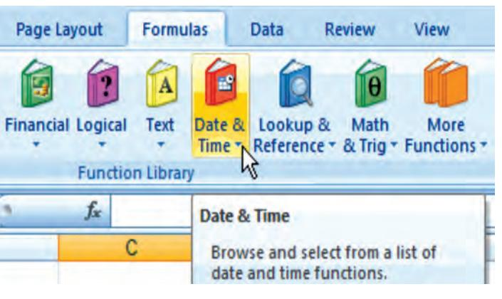

*Figure 2.13*

can be worked as arguments and result available from the function will be output information. On the ribbon of MS Excel, the formula tab contains categorised function libraries (Figure 2.13).

- a. Date and Time Function.
- b. Mathematical Function.
- c. Text Manipulation function.
- d. Logical Function (other than IF).
- e. Lookup and Reference Function.
- f. Financial Function.

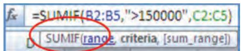

*Figure 2.14*

The complete details of each function from a range of above categories including examples are available through Help (?) on the Ribbon. The quickest way to get help on a function whose name (e.g. SUMIF) when we entered on formula bar followed by equal to sign then double-click the

function's name that appears in the strip (as shown in the figure 2.14). We will learn some of the useful function with the help of examples.

## 2.1.4.1 Date and Time Function

1. TODAY () is the function for today's date in the blank worksheet.

TODAY – Returns the serial number of the current date. The serial number is the date-time code used by Excel for date and time calculations. Times are represented as fractions of a day. By default January 1, 1900 is serial number 1. Thus, January 1, 2009 is serial number 39814 (because it is 39814 days after January 1, 1900).

2. NOW () is similar function but it includes the current time also (Figure 2.15).

3. DAY(serial_number) function returns the day of a date as an integer ranging from1 to 31. For example, if A5 = 16-Apr-2009 then = DAY (A2) will be 16. Similarly, two other functions MONTH(serial_number) returns month of a date as an integer ranging from 1 (January) to 12 (December) (Figure 2.16) and YEAR(serial_number) returns the year corresponding to a date as an integer ranging from 1900 – 9999.

4. DATEVALUE (date_text) converts a date in the form of text to a serial number e.g. =DATEVALUE("16-04-2009") will return a value 39919.

|  | =NOW() |
| --- | --- |
| D | E |
|  | 16-04-2009 11:15 |

|
|  |

*Figure 2.15 Figure 2.16*

Example: To find out the age of an employee as on today is a very simple mathematical calculation in the spreadsheet, e.g. the age of a person on 16-Apr-2009 whose Date of Birth is 16-Apr-1980 can be calculated as per Figure 2.17. The difference of two dates (in D3) is divided by 365.25 to convert days into years (considered the fractional value for leap years).

# 2.1.4.2 Mathematical Function

In business applications some of the Mathematical Functions are very useful, such as:

1. SUMIF is the function which adds the cells as per given specified

criteria the syntax of this is as follows:

SUMIF (range, criteria, sum_range) where

Range it is the range of cells to evaluate.

Criteria it is the criteria in the form of a number, expression, or text that defines which cells will be added, e.g. criteria can be expressed 1500, "1500", ">1500" or "Books".

Sum_range are the actual cells to sum.

e.g. There are sum Asset Values (D2:D5) and related to each asset values there are deprecation values (E2:E5). Using SUMIF function we have to calculate the

sum of depreciation for those Asset Values which are more than 1, 70,000/-.

The function is written in the cell E7 like =SUMIF (D2:E5,">150000, E2:E5) which gives result 63,000/- (Figure 2.18)

2. ROUND is the function to rounds a number to specified number of digits. The syntax of this function is as follows:

ROUND (number, num_digits) where

Number Is the number to round (preferably fractional number)

Num_digits specifies the number of digits to round the Number. There may be some different situations for Num_digits as follows:

- a. If Num_digits is greater than 0 (zero), then number is rounded to the specified number of decimal places.
- b. If Num_digits is 0, then number is rounded to the nearest integer.

| fr =D3/365.25 |  |  |
| --- | --- | --- |
| C | D | E F |
| Date of Birth | 16-Apr-1980 |  |
| Today's Date 16-Apr-2009 |  |  |
| Difference | 10592 | Simple difference days between two |
|  |  | date |
| Age | 29.00 | leap year years value |
|  |  | considered |

*Figure 2.17*

| fr =SUMIF(D2:E5,">150000",E2:E5) |  |  |
| --- | --- | --- |
| C | D > |  |
|  | Asset Value Depriciation |  |
|  | 100.000 | 7.000 |
|  | 200.000 | 14.000 |
|  | 300.000 | 21,000 |
|  | 400.000 | 28,000 |
| Trotal | 1.000.000 | 70.000 |
| Using SUMIF |  | 63000 |

*Figure 2.18*

|  | C10 | + ( 3 Jx |
| --- | --- | --- |
|  | A A | B C |
|  | 1 Number Result | Function |
| 2 | 2.15 | 2.20 =ROUND(A2,1) |
| 3 | 2.149 | 2.10 =ROUND(A3,1) |
| 4 | -1.475 | -1.48 =ROUND(A4,2) |
| 5 |  | 21.5 20.00 =ROUND(A2,-1) |

*Figure 2.19*

- c. If Num_digits is less than 0, then number is rounded to the left of the decimal point.
*Example* - refer Figure 2.19

- i. to round the number 21.5 by 1 digit ( result is 2.2)
- ii. to round the number 2.149 by 1 digit ( result is 2.1)
- iii. to round the number -1.475 by 2 digits ( result is -1.48)
- vi. to round the number 21.5 by -1 digit ( result is 20.0)

To round a number to the nearest whole number because decimal values are not significant or round a number to multiples of 10 to simplify an approximation of amounts. There are several ways to round a number other than ROUND are:

ROUNDUP (number, num_digits) which rounds a number up, away from 0 (zero) e.g.

| = ROUNDUP (3.2, 0) | Rounds 3.2 up to zero decimal |
| --- | --- |
|  | places and the value is 4. |
| = ROUNDUP (76.9, 0) | Rounds 76.9 up to zero decimal |
|  | places and value is 77. |
| = ROUNDUP (3.14159, 3) | Rounds 3.14159 up to three |
|  | decimal places; value 3.142. |
| = ROUNDUP (-3.14159, 1) | Rounds -3.14159 up to one |
|  | decimal place; value -3.2. |
| = ROUNDUP (31415.92654,-2) | Rounds 31415.92654 up to 2 |
|  | decimal places to the left of the |
|  | decimal; value 31500. |
| ROUNDDOWN (number, num_digits) | which rounds a number down, |
| toward zero. |  |
| = ROUNDDOWN (3.2, 0) | Rounds 3.2 down to zero decimal |
|  | places; value 3. |
| = ROUNDDOWN (76.9, 0) | Rounds 76.9 down to zero |
|  | decimal places; value 76. |
| = ROUNDDOWN (3.14159, 3) | Rounds 3.14159 down to three |
|  | decimal places; value 3.141. |
| = ROUNDDOWN (-3.14159, 1) | Rounds -3.14159 down to one |
|  | decimal place; value -3.1. |
| = ROUNDDOWN (31415.92654, -2) | Rounds 31415.92654 down to 2 |
|  | decimal places to the left of the |
|  | decimal; value 31400. |

#### 3. COUNT

This function counts the number of cells that contain numbers and counts numbers within the list of arguments. COUNT is use to get the number of the entries in a number field (including date also) i.e. in a range or array of numbers.

In Excel other than counting function COUNT; other functions are

COUNTA, COUNTBLANK, and COUNTIF —

which enable us to count the number of cells that contain values, are nonblank (and thus contain entries of any kind), or count only the cells in a given range that meet the user defined criteria.

The syntax for COUNT is COUNT (value1, value2…..,) where value1, value2, ... are 1 to 255 arguments that can be a variety of different types of data(logical values represented in numbers, numbers, dates, or text representation of numbers), but only numbers are counted.

Arguments that are error values or text that cannot be translated into numbers are ignored.

If an argument is an array or reference, only numbers in that array or reference are counted. Empty cells, logical values, text, or error values in the array or reference are ignored.

COUNTA function will be count logical values, text, or error values. The Figure 2.20 contains a named range for cells A1:B9 as Count_Data

There are other functions also such as ROWS and COLUMNS are used. The syntax is as follows:

#### ROWS (array)

The function returns the number of rows in a reference or array; where an Array is an array, an array formula or a reference to a range of cells for which we want the number of rows.

#### COLUMNS (array)

This function returns the number of columns in an array or named range reference; where an Array is an array or array formula or a reference to a range of cells for which we want the number of columns.

*Array: Used to build single formulas that produce multiple results or that operate on a group of arguments that are arranged in rows and columns. An array range shares a common formula; an array constant is a group of constants used as an argument.*

*Array for Array forArray formula: A formula that performs multiple calculations on one or more sets of values, and then returns either a single result or multiple results. Array formulas are enclosed between braces { } and are entered by pressing CTRL+SHIFT+ENTER.*

#### COUNTIF (range, criteria) (Figure 2.21)

This function counts the number of cells within a range that meet the given criteria; in this function the Range is one or more cells to count, including numbers or names, arrays, or references that contain numbers. The blank cells and text values are ignored. (e.g. A2:B5)

|  | A | B | C |
| --- | --- | --- | --- |
|  | For Count Function Data |  |  |
| 2 | Data | Number |  |
| 3 Sales |  | 32 |  |
| 4 | 12-08-2008 | 54 |  |
| 5 |  | 75 |  |
| ნ | 19 | 86 |  |
| 7 | 22.24 |  |  |
| მ | TRUE |  |  |
| 9 | #DIV/0! |  |  |
| 10 |  |  |  |
| 11 | Details for Cell A1;B9 | Value | Function Used |
| 12 | Total Cells | 18 | =ROWS(Count_Data)*COLUMNS(Count_Data) |
| 13 | Occupied Cells | 13 | =COUNTA (Count_Data) |
| 14 | Numeric Enteris Cells | 7 | =COUNT (Count_Data) |
| 15 | Blank Cells | 5 | =COUNTBLANK Count_Data) |

*Figure 2.20*

|  | A | B |
| --- | --- | --- |
| 1 | Fruit | Quantity |
| 2 | apples | 32 |
| 3 | oranges | 54 |
| 4 | peaches | 75 |
| રે | apples | 86 |
| 6 | Result | Description (result) and Function Used |
|  | 1 | Number of cells with apples in the first column above (2) |
|  |  | ·COUNTIF(A2:A4, "apples") |
|  | . | Number of cells with peaches in the first column above (1) |
|  |  | =COUNTIF A2:A4,A3} |
| d | 1 | Number of cells with oranges and apples in the first column above |
|  |  | (3) =COUNTIF(A2:A4.A2)+COUNTIF(A2:A4.#REF!) |
|  | 1 | Number of cells with a value greater than 55 in the second column |
| 10 |  | above (2) =COUNTIF(B2;B4,">55") |
|  | 15 | Number of cells with a value not equal to 75 in the second column above (3) =COUNTIF(B2:B4," <> "&B3) |
|  | 3 | Number of cells with a value greater than or equal to 32 and less |
|  |  | than or equal to 85 in the second column above (3) |
| 12 |  | ·COUNTIF(B2:B4,">=32")-COUNTIF(B2:B4,">85") |

Criteria are the form of a number, expression, cell reference, or text that defines which cells will be counted. For example, criteria can be expressed as 32, "32", ">32", "apples", or B4.

# 2.1.4.3 Text Manipulation Function

#### 1. TEXT

This function converts a numeric value to text in a specific number format; and the syntax is :

#### TEXT (value, format_text) where,

Value is a numeric value, a formula that evaluates to a numeric value, or a reference to a cell containing a numeric value. *Figure 2.21*

Format_text is a numeric format as a text string enclosed in quotation marks. We can see various numeric formats by clicking the Number, Date, Time, Currency, or Custom in the Category box of the Number tab in the Format Cells dialog box, and then viewing the formats displayed.

This function is useful in situations where we want to display numbers in a more readable format, or want to combine numbers with text or symbols. For example, suppose cell L1 contains the number 23.5. Suppose we want to format this number by adding with "Rs." and convert into amount using this function:

=TEXT L1,"Rs. 0.00") which will be displayed as Rs. 23.50 (Figure 2.22).

| . BOOK | E |  |  |
| --- | --- | --- | --- |
|  | M1 |  | =TEXT(L1, "Rs. 0.00") |
|  |  | K |  |
|  |  |  | 23.5 Rs. 23.50 |

*Figure 2.22*

**34**

We can also format numbers by using the commands in the Number group on the Home tab of the Ribbon. However, these commands work only if the entire cell is numeric. Refer Figure 2.22(a); you will find in cell A5(A6) using function combined with '$' sign which can be

used with other functions (such as logical).

#### 2. CONCATENATE

This function joins two or more text strings into one text string and its syntax is

:

| A B |  |
| --- | --- |
| Salesperson | Sales |
| Shashiknat | 2800 |
| Anil Vaya | 40% |
| Result using Text Formula Used in the cell function |  |
| Shashiknat sold Rs. =A2&" sold "&TEXT(B2, "Rs. 0.00")&" worth of units." |  |
| 2800.00 worth of units. |  |
| Anil Vaya sold 40% of =A3&" sold "&TEXT(B3,"0%")&" of the total sales." |  |
| 6 the total sales. |  |

*Figure 2.22(a)*

## CONCATENATE (text1, text2,...) where

text1, text2, …. are 2 to 255 text items to be joined into a single text item. The text items can be text strings, numbers, or single-cell references.

Example combining First Name,

Middle Name and Surname of the employees into Full Name using CONCATENATE Function (Figure 2.22(b).

# 2.1.4.4 Logical Function

We have learned earlier about IF functions in this chapter. Let us understand two more other logical functions which are very useful. When a situation arises to compare more than one condition and the result of joint conditions is used for further operations.

| fx =CONCATENATE(B2," ",C2," ", D2) |  |  |
| --- | --- | --- |
| EC No.   First Name   Middle Name   Last Name |  | Full Name |
| 1284 Ani | Kumar Vava | Anil Kumar Vava |
| 2345 Kanu | Patel | Kanu U Patel |
| 3456 Mitesh | Sanmukhlal Sharma | Mitesh Sanmukhlal Sharma |

*Figure 2.22(b)*

*A logical value (true or false) outcome is the comparison of data values or results of arithmetic expressions compared with another data values or results of another arithmetical expressions using logical operator.*

#### 1. AND function gives only a TRUE or FALSE answer.

To determine whether the output will be TRUE or FALSE, the AND function evaluates at least one mathematical expression located in another cell in the spreadsheet. The syntax for the AND function is:

#### = AND (logical-1, logical-2, ... logical-255 )

where logical-1 , logical-2 , ... - refers to the cell reference that is being checked. Up to 255 logical values can be entered into the function. Returns TRUE if all its arguments evaluate to TRUE; returns FALSE if one or more arguments evaluate to FALSE.

#### *Example Example*

1. In the following example the outcome of two logical values is given in Result

| Formula | Description | Result |
| --- | --- | --- |
| a.= AND (TRUE, TRUE) | all arguments are TRUE | TRUE |
| b.= AND (TRUE, FALSE) | One argument is FALSE | FALSE |
| c.= AND (2+2=4, 2+3=5) | all arguments evaluate to TRUE | TRUE |
| 2. | In these example there are two cell values cell A2 contains 50 and |  |
| cell A3 contain 104 then : |  |  |
| Formula | Description | Result |
| a. =AND (A2>1, A2<100) | Displays TRUE if the number | TRUE |
|  | in cell A2 is between 1 and 100. |  |
|  | Otherwise, it displays FALSE. |  |
| b. =IF(AND(A3>1, A3<100), | Displays the number in cell | "The value is |
| A3,"The value is out of | if it is between 1 and 100. | out of range. |
|  | Otherwise, it displays the |  |
|  | message |  |
| c. =IF(AND(A2>1, A2<100), | Displays the number in cell A2, | 50 |
| A2, "The value is out of | if it is between 1 and 100. |  |
| range.") | Otherwise, it displays a message. |  |

One common use for the AND function is to expand the usefulness of other functions that perform logical tests.

In the above example, the IF function performs a logical test and then returns one value if the test evaluates to TRUE and another value if the test evaluates to FALSE. By using the AND function as the *logical_test* argument of the IF function, we can test many different conditions.

2. OR function is like other logical functions, the OR function gives only a TRUE or FALSE answer. To determine whether the output will be TRUE or FALSE, the OR functions evaluates at least one mathematical expression located in another cell in the spreadsheet. This function returns TRUE if any argument is TRUE; returns FALSE if all arguments are FALSE.

The syntax for the OR function is:

= OR (logical-1, logical-2, ... logical-255 )

Logical-1, logical-2 … - refers to the cell references that are being checked. Up to 255 logical values can be entered into the function.

#### *Example Example*

| Formula Description | Result |
| --- | --- |
| a.= OR (TRUE, FALSE) One argument is TRUE | TRUE |
| b.=OR ((1+1)=1,(2+2)=5) All arguments evaluate to FALSE | FALSE |
| c.=OR (TRUE,FALSE,TRUE) At least one argument is TRUE | TRUE |

#### 2.1.4.5 Lookup and References Function

The LOOKUP function returns a value either from a one-row or onecolumn range or from an array. The LOOKUP function has two syntax forms: vector and array.

The Look Up function can be used as an alternative to the IF function for elaborate tests or tests that exceeds the limit for nesting of IF functions.

*The vector form of LOOKUP looks in a one-row or one-column range (known as a vector) for a value, and then returns a value from the same position in a second onerow or one-column range.*

*The array for array forarray form of LOOKUP looks in the first row or column of an array for the specified value, and then returns a value from the same position in the last row or column of the array.*

#### *1. LOOKUP (Vector Form)*

The syntax is LOOKUP (*lookup_value*, *lookup_vector*, *result_vector*)

- *Lookup_value* is a value that LOOKUP searches for in the first vector. *Lookup_value* can be a number, text, a logical value, or a name or reference that refers to a value.
- *Lookup_vector* is a range that contains only one row or one column. The values in *lookup_vector* can be text, numbers, or logical values.
It is important to know that the values in *lookup_vector* must be placed in ascending order. For example, -2, -1, 0, 1, 2 or A-Z or FALSE, TRUE else LOOKUP may not give the correct value.

- *• Result_vector* is a range that contains only one row or column. It must be the same size as *lookup_vector*.
- If LOOKUP cannot find the *lookup_value*, it matches the largest value in *lookup_vector* that is less than or equal to *lookup_value*.
- If *lookup_value* is smaller than the smallest value in *lookup_vector*, LOOKUP gives the #N/A error value.

#### *Example Example* (Figure 2.23)

Column (A) and Column (B) dipicts the frequency and name of Colour respectively. The results of the use of LOOKUP function.

|  | A | B |
| --- | --- | --- |
| 1 | Frequency | Colour |
| 2 | 4.14 | red |
| 3 | 4.19 | orange |
| 4 | 5.17 | yellow |
| 5 | 5.77 | green |
| 6 | 6.39 | blue |

*Figure 2.23*

| Function | Description (Result) |
| --- | --- |
| =LOOKUP (4.19, A2:A6, B2:B6) | Looks up 4.19 in column (A), and returns |
|  | the value from column (B) that is in the |
|  | same row (orange). |
| =LOOKUP (5.00, A2:A6, B2:B6) | Looks up 5.00 in column (A), and returns |
|  | the value from column (B) that is in the |
|  | same row (orange). |
| =LOOKUP (7.66, A2:A6, B2:B6) | Looks up 7.66 in column (A), matches the |
|  | next smallest value (6.39), and returns the |
|  | value from column (B) that is in the same |
|  | row (blue). |
| =LOOKUP (0, A2:A6, B2:B6) | Looks up 0 in column (A), and returns an |
|  | error because 0 is less than the smallest |
|  | value in the lookup vector A2:A7 (#N/A). |

## *2. LOOKUP (Array Form)*

The syntax is LOOKUP (*lookup_value*, *array*)

- *• Lookup_value* is a value that LOOKUP searches for in an array. *Lookup_value* can be a number, text, a logical value, or a name or reference that refers to a value.
	- s If LOOKUP cannot find the *lookup_value*, it uses the largest value in the array that is less than or equal to *lookup_value*.
	- s If *lookup_value* is smaller than the smallest value in the first row or column (depending on the array dimensions), LOOKUP returns the #N/A error value.

**37**

- *• Array* is a range of cells that contains text, numbers, or logical values that we want to compare with *lookup_value*.
	- s If *array* covers an area that is wider than it is tall (more columns than rows), LOOKUP searches for *lookup_value* in the first row.
	- s If *array* is square or is taller than it is the wide (more rows than columns), LOOKUP searches in the first column.

|  | A | B |
| --- | --- | --- |
| 1 | a | 10 |
| 2 | b | 20 |
| 3 | c | 30 |
| 4 | d | 40 |

#### *Example Example Example (Figure 2.23(a))*

*Figure 2.23(a)*

Column (A) contains a, b, c, d some text values and Column (B) contain 10, 20, 30, and 40 some numbers. The Array is A1:B4.

The LOOKUP function used for different alpha character as follows:

| Function | Description (Result) |
| --- | --- |
| =LOOKUP ("c", A1:B4) | Looks up "C" in first row of the array |
|  | and returns the value in the last |
|  | row that is in the same column (30). |
| =LOOKUP ("b", A1:B4) | Looks up "b" in first row of the array |
|  | and returns the value in the last column |
|  | that is in the same row (20). |

#### *3. VLOOKUP*

The VLOOKUP function, which stands for vertical lookup, helps us to find specific information in large data tables such as an inventory list of parts or a large employee contact list. The VLOOKUP function searches and matches first the required value from the column of a range of cells, and then returns a value from any cell on the same row of the range. The syntax is

VLOOKUP (lookup_value, table_array, col_index_num, range_lookup) where

Lookup_value - The value to search in the first column of the table. Lookup_value can be a value or a reference. If lookup_value is smaller than the smallest value in the first column of table_array, VLOOKUP returns the #N/A error value.

Table_array - Two or more columns of data. Use a reference to a range or a range name. The values in the first column of table_array are the values searched by lookup_value. These values can be text, numbers, or logical values. Uppercase and lowercase texts are equivalent.

Col_index_num – The column number in table_array from which the matching value must be returned. A col_index_num of 1 returns the value in the first column in table_array; a col_index_num of 2 returns

the value in the second column in table_array, and so on. If col_index_num is:

- *•* Less than 1, VLOOKUP returns the #VALUE! error value.
- *•* Greater than the number of columns in table_array, VLOOKUP returns the #REF! Error value.

Range_lookup – A logical value that specifies whether we want VLOOKUP to find an exact match or an approximate match:

- *•* If TRUE or omitted, an exact or approximate match is returned. If an exact match is not found, the next largest value that is less than lookup_value is returned. The values in the first column of table_array must be placed in ascending sort order; otherwise, VLOOKUP may not give the correct value.
- *•* If FALSE, VLOOKUP will only find an exact match. In this case, the values in the first column of table_array do not need to be

sorted. If there are two or more values in the first column of table_array that match the lookup_value, the first value found is used. If an exact match is not found, the error value #N/A is returned.

In the following examples we will explain the steps how the VLOOKUP function to find the specific information from the spreadsheet table.

*Example -1* (Refer Figure 2.24) to find out employee's Basic Pay

=VLOOKUP (A3, A1:D7, 4, FALSE)

Lookup the Basic Pay for Employee Code 3456 (A3) in the first column and return the matching value in the same row of the fourth column i.e. 3453.00(d3).

*Example - 2* (Refer Figure 2.25)

In this example we search the column Item-ID of baby products from the table A2 :D6 and match the values in the Cost (column

number 3) and Markup (column number 4) columns to calculate prices and with different test conditions. The final result of the function is also given after description.

#### Function Description

= VLOOKUP ("DI-328", A2:D6, 3, Calculates the retail price of diapers by FALSE) * (1 + VLOOKUP ("DI-328", adding the markup percentage to the A2:D6, 4, FALSE)). cost. Result Rs. 28.96

|  | DI8 |  | fr |  |
| --- | --- | --- | --- | --- |
|  | A | в | C | D |
|  | Employee | First | Last | Basic |
| E | Code | Name | Name | Pay |
| 2 | 1873 | Prakash | Sharma | 5.176.00 |
| 3 | 3456 | Shashikant | Thakur | 3.453.00 |
| 4 | 4537 | Ajit | Mathur | 3,355.00 |
| 5 | 5678 | Vinod | Upadhyay | 428.00 |
| 6 | 16782 | Kanu | Patel | 3.457.00 |
| 7 | 34567 | Anil | Vaya | 5.467.00 |
| Q |  |  |  |  |

| Figure 2.24 |
| --- |

| A |  | P | C | D |
| --- | --- | --- | --- | --- |
| 1 | Item-ID | Item | Cost | Markup |
| 2 | AS-469 | Aspirator | Rs.2.56 | 45% |
| 3 BI-567 |  | Bib | Rs.3.56 | 40% |
| 4 DI-328 |  | Diapers | Rs.21.45 | 35% |
| 5 ST-340 |  | Stroller | Rs. 145.67 | 30% |
| 6 WI-989 |  | Wipes | Rs.5.12 | 40% |

*Figure 2.25*

| = (VLOOKUP ("WI-989", A2:D6, 3, | Calculates the sale price of wipes by |
| --- | --- |
| FALSE) * (1 + VLOOKUP ("WI-989", | subtracting a specified discount 4, |
| A2:D6, FALSE))) * (1 - 20%). | from the retail price Result .Rs. 5.73 |

Rs.20.00"). Rs. 20.00".

= (VLOOKUP ("WI-989", A2:D6, 3, Calculates the sale price of wipes by A2:D6, FALSE))) * (1 - 20%). from the retail price Result .Rs. 5.73

= IF(VLOOKUP(A2, A2:D6, 3, If the cost of an item is greater than FALSE) >= 20, "Markup is" and or equal to Rs. 20.00, displays the 100 * VLOOKUP (A2, A2:D6, 4, string "Markup is *nn*%"; otherwise, FALSE) and "%", "Cost is under displays the string "Cost is under

Result: Markup is 30%

FALSE) and"%", "Cost is Rs." and the string "Cost is Rs.*n.nn*". VLOOKUP (A3, A2:D6, 3, FALSE)) Result: Cost is Rs. 3.56

= IF (VLOOKUP (A3, A2:D6, 3, If the cost of an item is greater than FALSE) >= 20, "Markup is:" and or equal toRs.20.00, displays the string 100 * VLOOKUP (A3, A2:D6, 4, Markup is *nn*%"; otherwise, displays

#### *4. HLOOKUP*

The HLOOKUP function (short name of Horizontal Lookup), searches for a value in the first row of a table array and returns the corresponding value in the same column from another row of the same table array. The syntax for HLOOKUP is as follows:

HLOOKUP(lookup_value, table_array, row_index_num, range_lookup) where

- *•* Lookup_value The value to search for in the first row of the table array.
- *•* Table_array Two or more rows of data. The values in the first row of the table_array are the values searched for the lookup_value. These values can be text, numbers, or logical values. Uppercase and lowercase texts are equivalent.
- *•* Row_index_num The row number in table_array from which the corresponding value must be returned. A row_index_num of 2 returns the value in the second column in table_array; a row_index_num of 3 returns the value in the third column in table_array, and so on.
- *•* Range_lookup A logical value that specifies whether we want HLOOKUP to find an exact match or an approximate match. If set to "FALSE", a corresponding value will be returned only if an exact match is found. If set to "TRUE", the nearest match will be considered if an exact one is not found.

Let us take a simple example to understand the HLOOKUP function: In the following two different worksheets:

*Example Example Example (Figure 2.26 and 2.27)*

Worksheet 1 - The values for Budget are in Row 2 corresponding to each Quarter in Row 1.

**40**

Worksheet 2 - Corresponding to each Quarter (column (C)); some part of budget is Spent (column (E)) – which is listed vertically. We want to pick the budget for each quarter from the Worksheet 1 and put it in column (D) of Worksheet 2 and then calculate the amount Pending (column (F)) correspondingly. In cell D2:D5 we will enter the HLOOKUP function as follows: (as shown for D4 cell) = HLOOKUP (C4; Budget! $A$1:$E$2; 2; FALSE) where in this function.

| A | B | C TIDL | E |
| --- | --- | --- | --- |
| 17 Quarter | Q1 | 02 03 | Q4 |
| 2 Budget   35000 30000 32000   40000 |  |  |  |
| > ( > > > > > = = HLOOKUP(C4,budget!$A$1:$E$2,2,FALSE) |  |  |  |
| B C -------- | D | E E F | G |
| Quarter | Budget | Spent Pendig |  |
| Q1 | 35000 | 35000 0 |  |
| 02 | 30000 | 21000   9000 |  |
| =HLOOKUP(C4,budget!$A$1:$E$2,2,FALSE) |  |  |  |
| Q4 40000   0 40000 |  |  |  |

| C4 | lookup value, for the Figures 2.26 and 2.27 |
| --- | --- |
|  | quarter |
| budget!$B$1:$E$2 | Table array, found in worksheet 1: named |
|  | budget. |
| 2 | Row_index_num, is the row 2 in worksheet |
|  | 1: named Budget |
| FALSE | We want to find an exact match |
| Pending | = D4-E4 Copy both the functions from |
|  | D4 to the Cells D2, D3 and D5 and from |
|  | F4 to Cells F2, F3 and F5 can be copied. |

It is important to note that whenever any table array (or array) is referred in lookup functions the cell address referred (normally it is relative) must be converted in to absolute cell addresses.

# 2.1.2.6 Financial Functions

*1. ACCRINT*

This function returns the accrued interest for a security that pays periodic interest. The syntax of this is as follows:

ACCRINT (issue, first_interest, settlement, rate, par, frequency, basis, calc_method)

Dates should be entered by using the DATE function, or as results of other formulas or functions. For example, use DATE (2008, 5, 23) for the 23rd day of May, 2008. Problems can be occur if dates are entered as text.

| Issue | is the security's issue date. |
| --- | --- |
| first_interest | is the security's first interest date. |
| Settlement | is the security's settlement date. The security |
|  | settlement date is the date after the issue date when |
|  | the security is traded to the buyer. |
| Rate | is the security's annual coupon rate. |
| Par | is the security's par value. By default Par is 1000 |

| Frequency | is the number of coupon payments per year. |
| --- | --- |
|  | For annual payments, frequency = 1; for Semi |
|  | annual, frequency = 2; for quarterly, frequency = 4. |

Basis is the type of day count basis to use.

Excel stores dates as sequential serial numbers so they can be used in calculations. By default, January 1, 1900 is serial number 1, and January 1, 2008 is serial number 39448 because it is 39,448 days after January 1, 1900; in Excel for the ACCRINT is calculated as follows:

$$A C C R I N T=p a r\ \times\ {\frac{r a t e}{f r e q u e r c y}}\times\sum_{\lambda1}^{N C}\ {\frac{A^{\lambda}}{N L_{\lambda}}}$$

*2. CUMIPMT*

This function returns the cumulative interest paid between two periods (Refer Figure 2.28). The syntax of the function is:

#### CUMIPMT (rate, nper, pv, start_period, end_period, type)

| Rate |  | is the interest rate. |
| --- | --- | --- |
| Nper |  | is the total number of |
|  |  | payment periods. |
| Pv |  | is the present value. |
| Start_period |  | is the first period in the |
|  |  | calculation. Payment |
|  |  | periods are numbered |
|  |  | beginning with 1. |
| Figure 2.28 | End_period | is the last period in the |
|  |  | calculation. |

Type is the timing of the payment (which may be either 0 or 1)

0 (zero) means Payment at the end of the period

- 1 means Payment at the beginning of the period.

|  | A | B | C |
| --- | --- | --- | --- |
|  | Function Parameters | Input Values | Description |
| 2 | pmt |  | 500 Money paid out of the annuity at the end of every month |
| 3 | rate |  | 8% Interest rate earned on the money paid out (to be calculated per month) |
|  | nper |  | 20 Years the money will be paid out (total number of instalments monthly) |
| 5 | type |  | 0 money paid at the end of month |
| 6 | Function |  | =PV(rate,nper,pmt,[fv],type) |
|  | (Rs.59.777.15) |  | =PV(B3/12,B4*12,500,.0) |

*3. PV*

*Figure 2.29*

**42**

This function returns the present value of an investment. The present value is the total amount that a series of future payments is worth now. For example, when we borrow money, the loan amount is the present value (Figure 2.29). The syntax of the function is :

#### PV (rate, nper, pmt, fv, type) where

Rate is the interest rate per period. For example, for an automobile loan at a

10% annual interest rate and installments are made the monthly payments, then the interest rate per month is 10%/12, or 0.83%. The value for rate into the function will be 10%/12, or 0.83%, or 0.0083.

Nper is the total number of payment periods in an annuity. For example, if this loan is a four-year car loan and makes monthly payments, then loan has 4*12 (or 48) periods. The value for nper will be 48.

Pmt is the payment made each period and cannot be change over the life of the annuity. Typically, *pmt* includes principal and interest but no other fees or taxes. For example, the monthly payments on an Rs.10, 000, for four-year car loan at 12 per cent are Rs. 263.33. We have to enter -263.33 into the function as the pmt. If *pmt* is omitted, then *fv* must be included in the argument.

Fv is the future value, or a cash balance to attain after the last payment is made. If *fv* is omitted, it is assumed to be 0 (the future value of a loan, for example, is 0). For example, if we want to save Rs. 50,000 to pay for a special project in 18 years, then Rs. 50,000 is the future value. Then it is necessary to guess an interest rate and determine how much to save each month. If fv is omitted, then *pmt* must be included as the argument.

Type is the number 0 or 1 and indicates when payments are due. The *fv* and *type* arguments are optional. The *fv* argument is the future value or cash balance that we want to have after making last payment. If we omit the *fv* argument, Excel assumes a future value of zero. The *type* argument indicates whether the payment is made at the beginning or end of the period: (0 or omit the *type* argument when the payment is made at the end of the period and use 1 when it is made at the beginning of the period).

When using financial functions, keep in mind that the *fv, pv,* and *pmt* arguments can be positive or negative, depending on whether we are receiving the money or paying out the money. It may be noted that if we want to express the *rate* argument in the same units as the *nper* argument, so that if we make monthly payments on a loan and we express the *nper* as the total number of monthly payments, as in 360 (30×12) for a 30-year mortgage, we need to express the annual interest rate in monthly terms as well. Excel solves for one financial argument in terms of the others. If rate is not 0, then:

$pv\,^{*}\,(1+rate)^{\mbox{\tiny{\it pure}}}+\mbox{\it pmt}(1+rate\,^{*}\,type)\,^{*}$ If rate is 0, then:

$$\left(\frac{(1+r a t e)^{p o v e}-1}{r a t e}\right)+f v=C\qquad\qquad\mathrm{(pmt\ *\ n p e r)\ +\ p v\ +\ f v=0)}$$
. 

*An annuity annuity is a series of constant cash payments made over a continuous period. For example, a car loan or a mortgage is an annuity.*

*4. FV*

This function returns the future value of an investment based on periodic, constant payment and a constant interest rate (Figure 2.30). The syntax of the function is :

#### FV (rate, nper, pmt, pv, type) where

- Rate is the interest rate per period.
- Nper is the total number of payment periods in an annuity.
- Pmt is the payment made each period; it cannot change over the life of the annuity. Typically, *pmt* contains principal and interest but no other fees or taxes. If pmt is omitted, then include the pv value in the argument.
- Pv is the present value, or the lump-sum amount that a series of future payments is worth right now. If pv is omitted, it is assumed to be 0 (zero), and then include the *pmt* value in the argument.
- Type is the number 0 or 1 and indicates when payments are due. If type is omitted, it is assumed to be 0.

|  | A | B | C |  | A |  | B C |
| --- | --- | --- | --- | --- | --- | --- | --- |
|  | Name Of Parameter | Data | Description |  | Name Of Parameter |  | Data Description |
|  | rate |  | 6% Annual interest rate | 2 | rate |  | 6% Annual interest rate |
|  | nper |  | 10 Number of payments | 3 | nper | 10 Number of payments |  |
|  | pmt |  | -200 Amount of the payment |  | pmt |  | -200 Amount of the payment |
| 5 | pv |  | -500 Present value | 5 | pv |  | -500 Present value |
|  | type |  | Payment is due at the beginning of the period | 6 | type |  | Payment is due at the 0 end of the period |
| 7 | Result |  | Function | 7 | Result |  | Function |
|  | Rs.2,581.40 |  | Future value of an investment with the |  | Rs.2.571.18 |  | Future value of an investment with the |
| 8 |  |  | above terms | 8 |  |  | above terms |
| 9 |  |  | =FV(B2/12. B3. B4. B5. B6) | ਰੇ |  |  | =FV(B2/12, B3, B4, B5, B6) |

#### *Example Example*

#### *Figure 2.30*

In the function FV (rate, nper, pmt, pv, type); the values are substituted as given in different cells of the worksheets and the result cell A8 is having Rs. 2581.40 first worksheet for type is 1 while in second worksheet shows the value of result Rs. 2571.18 for type is 0.

*5. PMT 5. PMT*

The PMT function calculates the periodic payment for an annuity, assuming equal payments and a constant rate of interest (Figure 2.26(d)). The syntax of PMT function is as follows:

= PMT(rate, nper, pv, [fv], [type]) where

|
|  |

*nper* is the number of periods,

- *pv* is the present value or the amount the future payments are worth presently,
- *fv* is the future value or cash balance that after the last payment is made (a future value of zero when we omit this optional argument)
- *type* is the value 0 for payments made at the end of the period or the value 1 for payments made at the beginning of the period.

The PMT function is often used to calculate the payment for mortgage loans that have a fixed rate of interest.

## *Example Example* (Figure 2.31)

In the sample worksheet that contains a table using the PMT function to calculate loan payments for interest rate 8% per annum and principal amount Rs. 1000/-

Here we have used both values of type = 0 and 1

```
6. RATE 6. RATE6. RATE
```
This function returns the interest rate per period of an annuity. RATE is calculated by iteration and can have zero or more solutions. If the successive results of RATE do not converge to within 0.0000001 after 20 iterations, RATE returns the #NUM! error value (2.32). The syntax of the function is as follows:

#### RATE (nper, pmt, pv, fv, type, guess) where.

Nper is the total number of payment periods in an annuity.

- Pmt is the payment made each period and cannot change over the life of the annuity. Typically, *pmt* includes principal and interest but no other fees or taxes. If pmt is omitted, then include the *fv* as argument.

| B C A |
| --- |
| Description |
| 4   Years of the loan |
| -200 Monthly payment |
| 8000 Amount of the loan |
| Result  Description |
| =RATE(B2*12, B3, B4) 1% Monthly rate of the loan with |
| the above terms |
| =RATE(B2*12, B3, B4)*121 0.092421Annual rate of the loan with |
| the above terms |

*Figure 2.32*

| Parameters | Data | Description |
| --- | --- | --- |
| rate |  | 8% Annual interest rate |
| nper |  | 10 Number of months of payments |
| DV |  | 10000 Amount of loan |
| Formula | Result | Description |
| =PMT(B2/12, B3, B4) | [Rs. 1,037.03] | Monthly payment for a loan with |
| 6 |  | the above terms |
| =PMT(B2/12, B3, B4, 0, 1) | (Rs.1.030.16) | Monthly payment for a loan with |
|  |  | the above terms, except payments |
|  |  | are due at the beginning of the |
|  |  | period |

*Figure 2.31*

- Pv is the present value the total amount that a series of future payments is worth now.
- Fv is the future value, or a cash balance attain after the last payment is made.

If fv is omitted, it is assumed to be 0 (the future value of a loan, for example, is 0).

- Type is the number 0 or 1 and indicates when payments are due.
0 or omitted means payment is due at the end of the period 1 means payment is due at the beginning of the period.

- Guess is the guess for what the rate will be. If omitted, it is assumed to be 10 per-cent.
*7. NPV 7. NPV*

This function calculates the net present value of an investment by using a discount rate and a series of future payments (negative values) and income (positive values). The syntax for the function is:

#### NPV (rate, value1, value2,…. ) where

Rate is the rate of discount over the length of one period.

- Value1, value2, ... are 1 to 254 arguments representing the payments and income. Value1, value2, ... must be equally spaced in time and occur at the end of each period. *NPV* uses the order of value1, value2 …., to interpret the order of cash flows. It is essential that entry for payment and income values are in the correct sequence.
The *NPV* investment begins one period before the date of the value1 cash flow and ends with the last cash flow in the list. The *NPV* calculation is based on future cash flows.

  
  
**NPV = 1**  
  
**[10pt]**

|  | A | R | C |
| --- | --- | --- | --- |
|  | Parameters | Data | Description |
| 2 | rate |  | 10% Annual discount rate |
| 3 | value 1 |  | -10,000 Initial cost of investment one year from |
| য | value2 |  | 3,000 Return from first year |
| 5 | value3 |  | 4,200 Return from second year |
| 6 | value4 |  | 6,800 Return from third year |
| 7 | Function | Result | Description |
|  |  | 8 =NPV(B2, B3, B4, B5, B6)  Rs.1,188.44  Net present value of this investment |  |
|  |  |  |  |

*Figure 2.33*

**46**

If n is the number of cash flows in the list of values, the formula for NPV is:

> NPV (Figure 2.33) is similar to the PV function (present value). The primary difference between PV and NPV is that PV allows cash flows to begin either at the end or at the beginning of the period. Unlike the variable NPV cash flow values, PV cash flows must be constant throughout the investment.

> NPV is also related to the IRR function (internal rate of return). IRR is the rate for which NPV equals zero: NPV (IRR (...),) = 0.

# 2.2 DATA ENTRY, TEXT MANAGEMENT AND CELL FORMATTING

In any computerised business application, the basic requirement is to input data; which may be either for processing parameters e.g. input of data parameters such as month number and name of the month or number of working days, DA%, etc. for the processing of payroll of the company or to update various data elements. In both the cases data should be correct, accurate and should be in proper format. This means that data should be validated, corrected and can be display in proper format.

By default in spreadsheet the numbers are right aligned and texts are left aligned. The spreadsheet can distinguish different types of numbers; recognise a date, a currency, or a percentage value or text etc. For example, if we type 16/04/1980 in a cell, spreadsheet will recognise it as a date and act accordingly. The software processes the data and generates the output; which should be in specific format. For example 1.5 might represent a value for one and half teaspoon in one spreadsheet while the same 1.5 would represent constant multiplier for age in another spreadsheet etc.

# 2.2.1 DATA ENTRY

Excel also facilitates fast data entry; and automatically repeats data or can fill data in different cells (column wise or row wise.) For example, if we repeatedly type the days of the week in different cells instead of that we could use the built-in data fill options to fill the different cells with the days automatically. Some of the methods for data entry are mentioned below:

# 2.2.1.1 The data fill options

| f. | A1 | A |  |
| --- | --- | --- | --- |
| 1 | 10 | 2 | 20 |
| 3 | 4 |  |  |
| ട | ଚ |  |  |
| 7 | 8 |  |  |
| 9 | 100 | 10 |  |
| 41 |  |  |  |

*Figure 2.35*

The Fill command can be used to fill data into worksheet cells (Figure 2.36 & 2.37. The Excel provides for entering data automatically to continue a series of numbers, number and text combinations, dates, or time periods, based on a pattern that we require. However, to fill quickly in several types of data series, we select cells and drag the fill handle ( A Fill handle is the small black square in the lowerright corner of the selection. When we point to the fill handle, the pointer changes to a black cross (Refer Figure 2.34 and 2.35).

|  |  |  |  |  |  |  |  |  |  | A |
| --- | --- | --- | --- | --- | --- | --- | --- | --- | --- | --- |
| 100 10 | 9 90 | 8 80 | 7 70 | 6 60 | 5 50 | 4 40 | 3 30 | 2 20 | ਜ 10 |  |

The fill handle is displayed by default, Click the Microsoft Office Button , and then click Excel Options.

- 1. Click Advanced, and then under Editing options, clear or select the Enable Fill handle and cell drag-and-drop check box to hide or display the fill handle.
*Figure 2.34*

**47**

- 2. To avoid replacing existing data when we drag the fill handle, to make sure that the Alert before overwriting cells check box is selected. If we don't want to receive a message about overwriting non-blank cells, we can clear this check box.
After we drag the fill handle, the Auto Fill Options button appears so that we can choose how the selection is filled. For example, we can choose to fill just cell formats by clicking Fill Formatting Only, or we can choose to fill just the contents of a cell by clicking Fill Without Formatting.

## *Option -1 Drag the fill handle to fill data into adjacent cells (Figure 2.38)*

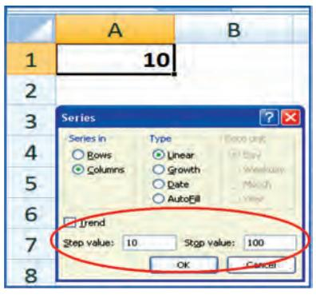

*Figure 2.37*

For example, we want to enter data in A1:A10 starting value from 10 and in step of 10 we will get 10, 20, … 100 by using drag option as shown in the Figure 2.34 and Figure 2.35 respectively.

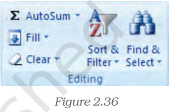

- 1. Select the cells that contain the data that we want to fill (A1:A2) into adjacent cells (A3:A10).
- 2. Drag the fill handle across the cells that we want to fill.

3. To choose how we want to fill the selection, click Auto Fill Options, and then click the option that we want.

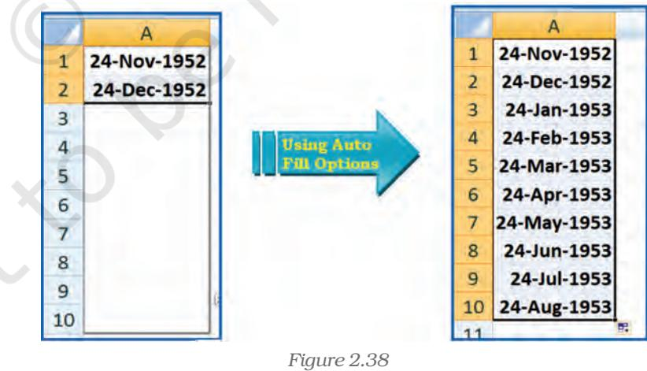

# *Option - 2 fill the active cell with the contents of an adjacent cell*

- 1. Select an empty cell (A1) enter the value 10.
- 2. On the Home tab, in the Editing group, click Fill, and then click on Series option.

- 3. The option window provides direction (row wise i.e., B1:J1 or column wise i.e., A2:A10) selection. The main option is Step Value (i.e. increment to the previous cell values in linear form) it is 10 in this example with respect to cell A1 and while another option is Stop Value ( i.e. last value of the data when it is achieved the data fill stops) is 100 which may be in cell A10.
- 4. Once we enter the all the options and click OK, we get data filled in the series A1:A0 as 10:100 in step of 10.

Observe the another example for Date data we can use fill handle (it is important to note that all the cells of the columns or rows should be defined in (required) date data format using Format Cells). In this example we will enter date 24-11-1952 (or 24-Nov-1952) in cell A1 and 24-12-1952 (or 24-Dec-1952) in cell A2 and then use Auto Fill Options button between cells A3:A10; find the changes?

# 2.2.1.2 Import/Copy Data from other sources

One more method for data entry for any application we can use the following easiest method which will transfer data into required cells by copying or importing to Excel worksheet. These data files may be either in text files or non-text files format.

Text files can be directly read using a text editor such as Note pad in MS Windows. These files often have extension *.txt* but can have other extensions (such as .csv known as Comma Separated Values text file), easily read into Excel.

To import the data from a text file following steps are important for Figure 2.39.

- 1. Create data file using Notepad program of MS Windows (to get Notepad screen on desktop; click on Start button -> All Programs - > Accessories -> Notepad).
- 2. A comma-separated data values in one line of this text file is a row in a spreadsheet and each entry, separated by a comma, is a column entry for that row.
- 3. In the first line provides names for the columns of the spreadsheet.
- 4. In the next line onward start entering the data separate by comma as per the names given in first line.
- 5. It may possible that every data may not be of similar length but each data (even a blank data) should be separated by comma as per the names of the column.

*Figure 2.39*

- 6. Open a new Excel worksheet from the Office Button.
**49**

- 7. Select Data Tab on the Ribbon.
- 8. On Data tab; an option Get External Data having From Text option.
- 9. Click on "From Text" which will allow selecting a Notepad file (Figure 2.40 & 2.41) saved as .cvm into Excel format directly and data will be copied into respective columns and rows.
- 10. Each and every data from Notepad file can be saved as an Excel data file This provides a lead that Excel worksheet consists of four types of data in cells: labels, values, date and formulas and data validation.

|
|  |

- *•* Labels (text) are descriptive data such as names, months and usually include alphabetic characters. Excel aligns text to the left side of the cell.
- *•* Values (numbers) are generally raw numbers or dates.
	- s Whole value: If the data is a whole value, such as 34 or 5763, Excel aligns the data to the right side of the cell.
	- s Vale with a decimal: If the data is a decimal value, Excel aligns the data to the right side of the cell, including the decimal point, with the exception of a trailing 0. For example, if we enter 246.75, then 246.75 displays; such as 246.70, will display as 246.7. We can change the display appearance, column width, and alignment of data.
- *•* Formulas are instructions for Excel to perform calculations.
- *•* Date: If we enter a date, such 16/12, Dec 16, or 16 Dec, Excel automatically returns 16-Dec in the cell, but the Formula bar displays 16/12/2008. (The Date format is dependent to Country Specific Format selection).

# 2.2.2 DATA VALIDATION

Data validation is a feature to define restrictions on type of data entered into a cell. We can configure data validation rules for cells data that will not allow users to enter invalid data, There may be warning messages when users tries to type wrong data in the cell. The messages also guide users to what input is expected for the cell, and instructions to correct any errors.

Data validation is invaluable because it is necessary that data must be accurate and consistent. The different methods for data validation are as follows:

- *•* Create a Drop down List By this option pre-defined items names list is referred and restrict the users to select accordingly – e.g. In the organisation for a business application we want to restrict the

| 2 | Home Insert | Page Layout | Formulas | Data | Review | View | Developer |  |  |
| --- | --- | --- | --- | --- | --- | --- | --- | --- | --- |
|  | From Access |  |  | Connections | 2 % |  | Clear |  | -8 Data Validation |
|  | 2 From Web |  |  | Properties |  |  | Reapply |  | Consolida |
|  | From Other From Text Sources | Existing Connections | Refresh A 3 | Sal Edit Links | Sort NA | Filter | Advanced | Text to Columns Duplicates |  |
|  | Get External Data |  | Connections |  |  | Sort & Filter |  |  | Data Tools |
|  | DEPT 69 |  | SALES |  |  |  |  |  |  |
|  | A |  | B | C |  | D | EF | G | H |
| I | Employee Name |  | Department | Qualification |  | Sex Code |  |  |  |
| 2 | MITESH SHAH |  |  |  |  |  |  |  |  |
| 3 | ALOK VYAS |  |  |  |  |  |  | SALES | MBA |
| 4 | PRANAV DAVE |  |  |  |  |  |  | FINANACE | PHD |
| 5 | RAJENDRA TRIVEDI |  |  |  |  |  |  | R&D | MCA |
| 6 | RENU TRIVEDI |  |  |  |  |  |  | OPERATION | MBBS |
| 7 | CHHAYA DAVE |  |  |  |  |  |  | 180 | MID |
| 8 | BALKRISHNA THAKKAR |  |  |  |  |  |  | HR | CA |
| ਰੇ | PRABODH VYAS |  |  |  |  |  |  | MEDICAL | ARCHITECT |
| 10 | NEETA THAKUR |  |  |  |  |  |  |  |  |

*Figure 2.42*

users not to enter the names of departments other than Sales, Finance, R&D, Operation, HR and IT, etc.; for qualification of each employee not to enter other than MBA, PHD, CA, MCA, ARCHITECT and MBBS, etc., and the Sex Code should be either "Male" or "Female" for the employees. Following are the steps described how to use drop down list: A drop-down list can be prepared in three different ways which can be used for data validation (Figure 2.42).

- *•* Type a list of values separated by commas, i.e. using delimited list e.g. Male, Female
- *•* Select the cells on the worksheet whose values can be used directly typed in a single row or single column
- *•* Select the data in cells and create a Named Range to refer
	- s Open a blank worksheet
	- s Enter the column titles e.g Employee Name (cell A1), Department (cell B1), Qualification (cell C1) and Sex Code (cell D1) in the first row and four different columns respectively (Figure 2.42). *Figure 2.43*

| Data Validation |  |  |
| --- | --- | --- |
| Settings | Input Message | Error Alert |
| Validation criteria Allow: |  |  |
| Any value |  | TE LIBE |
| Any value Whole number |  |  |
| Decimal |  |  |
| List |  |  |
| Date Time |  |  |
| Text len |  |  |
| ustom |  |  |
|  |  | Apply these changes to all other cells with the same settings |
| Clear All |  | OK |


| Validation criteria Allow: |  |
| --- | --- |
| List | Ignore blank |
| Data: | In-cell dropdown |
| between |  |
| Source: |  |
| =DEPT |  |

- s Enter the Names of Employees in the column (a) (cells A2:A10).
- s Prepare a list of department names some where in the worksheet (say G3:G9).
- s Define the Named range ( using Formula Tab ->Define Name on the ribbon) say DEPT .
- s Select the column (b) e.g. Department *Figure 2.44* (data to be validated in whole column).
	- s In the Data Tab of the ribbon click Data Validation on Data Tools opens three Data Validation Tabs (Figure 2.43). The first tab is Setting Tab select List for drop down list option.
	- s This option will display Validation Criteria and to provide valid data List in the Source where we have to type Name of the Range as =DEPT (Figure 2.44). The two more options also

|
|  |

required clicking here one Ignore Blank box then empty or blank values won't be allowed and other is In-cell drop down.

- s To display an input message when a cell (e.g. B2 later B3:B10) is selected, click the second tab on data validation option, i.e. Input Message Tab (Figure 2.45) and enter the desired text in the Title (e.g. DEPT_T) and provide an input short message for the user (e.g. SELECT/ENTER DEPARTMENT). Also tick the option to display this message when the cell is selected (Figure 2.46).
- s To set the response settings when invalid data is entered into the cell click on the third tab of data validation option (Figure 2.46) i.e. Error Alert Tab. This tab enables :
	- (a) To display the error alert after invalid data is entered in the box.
	- (b) Enter message allows to type the desired message for user and title for reference purpose.

- (c) In Style drop-down menu select Information, Warning or Stop as per the severity and accuracy requirement for data where.
	- (i) Information: displays a message but will prevent entry of invalid data.
	- (ii) Warning: displays a warning message but will not prevent entry of invalid data.
	- (iii) Stop: will prevent invalid entry of data.

The steps discussed above are shown below in different diagrams (Figures 2.47(a) to 2.47(d)) which are self explanatory when data for Department are to be entered in the worksheet:

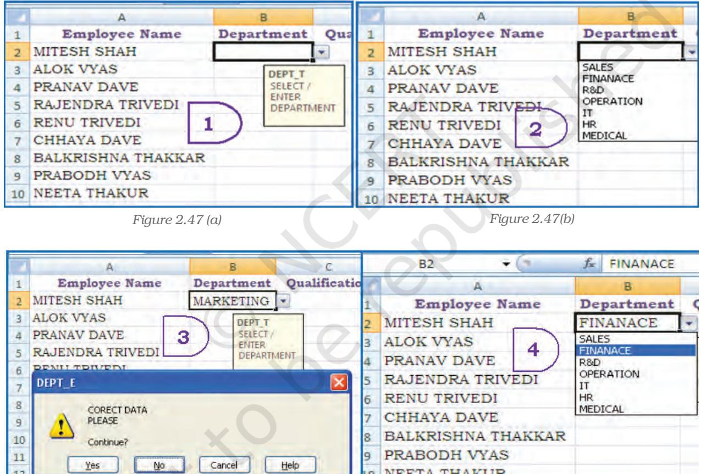

*Figure 2.47(c) Figure 2.47(d)*

To select data or reefing the limited number of data items we can type the list in the Source Box, separated by commas (Figure 2.43) e.g. as to enter the Sex Code either Male of Female for an Employee we can type as =Male, Female. This method of data validation is case sensitive; if a user types MALE, an error alert will be displayed.

- Setting Limits As mentioned earlier in the Allow drop-down menu, select Whole Number, Decimal, Date, Time, or Text Length.
For example in the same worksheet we can restrict the minimum age of an employee should be 18 and maximum age should be 58 (Age can be entered as Whole Number or can be entered Date of Birth as Date selection then age is calculated).

|  | A | B |  | D |  | E |
| --- | --- | --- | --- | --- | --- | --- |
| 4 | Employee Name |  | Department Qualification | Sex Code | Age |  |
| 2 | MITESH SHAH | FINANACE | MBA | Male |  | Ace T |
| 3 | ALOK VYAS | Data Validation |  |  |  |  |
| 4 | PRANAV DAVE |  |  |  |  | 18 - 58 |
| 5 | RAJENDRA TRIVE | Settings Input Message | Error Alert |  |  |  |
| б | RENU TRIVEDI | Validation criteria |  |  |  |  |
| 7 | CHHAYA DAVE | Allow: |  |  |  |  |
| 8 | BALKRISHNA THA | Whole number | V I Ignore blank. |  |  |  |
| 9 | PRABODH VYAS | Data: |  |  |  |  |
| 10 | NEETA THAKUR | between | V |  |  |  |
| 11 |  | Minimum: |  |  |  |  |
|  |  | 18 |  |  |  |  |
| E B |  | Maximum: |  |  |  |  |
| 14 |  | 28 |  |  |  |  |
|  |  |  | Apply these changes to all other cells with the same settings |  |  |  |

*Figure 2.48*

In this example if Age is a data element to be entered for every employee we will validate the Age as whole number and outside a specified range in a particular cell providing value in Setting tab (Figure 2.48) and data in between of minimum 18 and maximum 58 respectively.

Similarly we can check the number of text characters required in Employee Name column (for every employee) i.e. the cell should

not contain blank data; and error message should be displayed e.g., we can limit the minimum number of characters in the Employee Name cell to 10 or less.

- Setting Limits with a Formula To validate data based on formulas or values entered in other cells (Figure 2.49). The steps are as:

|
|  |

- In the Allow drop-down menu, select Custom.
• In the Formula box, enter a formula that calculates a logical value. If the formula calculates TRUE entry will be valid. If the formula calculates FALSE entry will be invalid. The cell gives error message if the values are not meeting the conditions Some of the examples are as follows:

- s We can prevent duplicate entries in a range on the worksheet (Figure 2.50) i.e. suppose we check duplicate employee number or duplicate product code in the asset ledger or duplicate account
code for the same item entered by user it shows the error.

- s We can limit the sum value for a range which will cause error if sum of the values exceeds the given total, i.e. suppose the total amount of budget is fixed and sum of the distribution of the amount for different items in the range exceeds then it shows the error (Figure 2.50(a)

|  | A | B | C E | D | F |  | G |
| --- | --- | --- | --- | --- | --- | --- | --- |
|  | Description | Budget Amount | Data Validation |  |  |  |  |
| 2 | Rent |  | Settings | Input Message | Error Alert |  |  |
| 3 | Travel | Bud T | Validation criteria |  |  |  |  |
| 4 | Postage | Ente | Allow: |  |  |  |  |
| 5 | Advertising |  | Custom |  | > | Ignore blank |  |
| б | Misc. Purchase |  | Deca |  |  |  |  |
| 7 | Total ... | 0 | between |  |  |  |  |
| 8 |  |  | Formula: |  |  |  |  |
| 9 10 |  |  | =SUM($B$2:$B$6) <= 75000 |  |  |  |  |


s We can prevent user from adding spaces before or after the text in entry. The TRIM function removes spaces before and after the text. This formula checks that the entry is equal to trimmed entry (Figure 2.50(b).

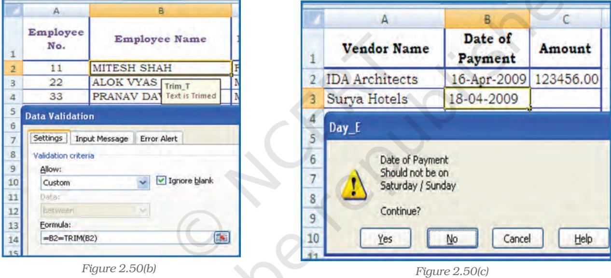

- s We can prevent entry of dates that falls on (weekends or holidays) Saturday or Sunday (or any other day). The WEEKDAY function returns the number for the date entered in the cell. If the value is 1(it is Sunday) and 7 (it is Saturday) then data entry is not allowed (Figure 2.50(c) and error message will be displayed.
# 2.2.3 DATA VALIDATION FORM

To input data into a spreadsheet, often we type the data into cells directly. That's where data validation comes in handy. Instead of typing the same thing again and again, we can enter data into cells using

*A form, whether printed or online, is a document designed with a standard structure and format that makes it easier to capture, organise, and edit information. A data form is a dialog box that displays one complete record at a time. Data forms can be used to add, change, locate, and delete records.*

drop-down lists or using data input form. Using a data form can make data entry easier than moving from column to column when we have more columns of data than can be viewed on the screen. To create input data form it is necessary that all the data names must be entered in the first row of the worksheet, because the input form refers these

data names. To create input data form we have to select the tool

as Form button to the Quick Access Toolbar .

The Form button has not been included on the user interface Ribbon, but we can still use it in Excel 2007 by adding at Quick Access Toolbar using following commands:

| Figure 2.51 |
| --- |

- 1. Click the arrow next to the Quick Access Toolbar, and then click More Commands.
- 2. In the Choose commands from box, click All Commands.
- 3. In the list box, select the Form button, and then click Add.

The data form is useful, when data are of in a simple form of text boxes that list the column headings as labels is sufficient and don't required sophisticated or custom form features, such as a list box or spin button.

Excel automatically generates a built-in data form (Figure 2.51). The data form displays all column headers as labels in a single dialog box. Each label has an adjacent blank text box in which we can enter data for each column, up to a maximum of 32 columns. In a data form, we can enter new rows, find rows by navigating or (based on cell contents) update rows and delete rows. If a cell contains a formula, the formula result is displayed in the data form, but we cannot change the formula by using the data form.

# 2.3 DATA FORMATTING

Formatting of spreadsheets makes easier to read and understand he important information (e.g. conditional formatting, number formatting, text and general spreadsheet formatting etc.). On the Ribbon there are several tools and shortcuts to format spreadsheets effectively. Some of them are described as follows:

# 2.3.1 FORMATTING TOOLS

The formatting tools for:

- Number formatting Number formatting includes adding per cent symbols (%), commas (,), decimal places, and currency signs ($,
Rs. etc), date, time, scientific values and as well as some special formats to a spreadsheet. The type of number format can be determined once the data is entered into the cell. Here are some examples:

- s Currency: If we enter a financial value complete with the dollar/ currency sign and two decimal places, Excel assigns a Currency format to the cell alongwith the entry.
- s Percentages: If we enter a value representing a percentage as a whole number followed by the per cent sign without any decimal places, Excel assigns to the cell the percentage

|  | A | B | C | Dal | E | F | G | LH |
| --- | --- | --- | --- | --- | --- | --- | --- | --- |
| 1 |  | Sales for Home AppliancesYear 2008_09 |  |  |  |  |  |  |
| 2 | (Figures in 000's) |  |  |  |  |  |  |  |
| 3 | Q1 | 02 |  | 03 | 04 |  | Actual : Target In % |  |
| 4 | ALOK | 40 | 57 | રુડ | 65 | 214 | 250 | 0.856 |
| 5 | PRANAV | 50 | 69 | ୧୦ | 90 | 278 | 220 | 1.2636 |
| D | PRABODH | 53 | 75 | 71 | 82 | 281 | 250 | 1.124 |
| 7 | RAJENDRA | 44 | 59 | 38 | 70 | 211 | 200 | 1.055 |
| 8 | Total |  |  |  |  | 984 | 920 | 1.0696 |
| 9 | Reported on |  |  |  |  |  |  |  |
| 10 | 16-04-2009 |  |  |  |  |  |  |  |

format that follows this pattern along with the entry.

*Figure 2.52(a)*

- s Dates: If we enter a date (dates are values, too) that follows one of the built-in Excel number formats, such as 16-04-2009 or 16- Apr-2009 the program assigns a Date format that follows the pattern of the date.
Example – Explaining below the steps to format range B4:E7 as currency with zero decimal places using negative preset format. The sample unformatted worksheet is shown in the Figure 2.52(a)

- Select the range to format, i.e. B4:E7
- From the Ribbon select, Home Tab with Number option, click on (Figure 2.52(b) to display Format Cells dialog box and choose Number tab.
- The Category list shows all the preset formats available in Excel, grouped into categories. A sample corresponding to the current selection is shown at the top of the box.
- Select the Category required i.e. Currency. The right hand side of the box shows the different symbols of currencies. It also shows the preset for negative values either minus sign (-) or red

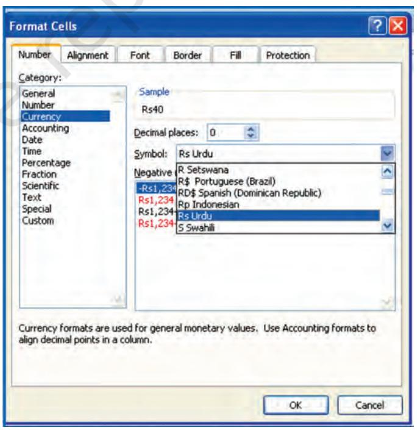

*Figure 2.52(b)*

coloured number (if we do not want to display negative sign data).

- Change the number of decimal places to Zero (0).
- Click OK accept this format.
- The output of these steps is shown in the Figure 2.52(c).
- Similarly if we select the Category for the range H4:H8 as Percentage with Decimal Places to 2 digits. The Figure 2.52(d) will show the effect of this change.

|  | A | B | C | - D | E | F | ાર | H |
| --- | --- | --- | --- | --- | --- | --- | --- | --- |
|  |  | Sales for Home AppliancesYear 2008_09 |  |  |  |  |  |  |
| 2 | (Figures in 000's) |  |  |  |  |  |  |  |
| 3 |  | 01 | Q2 - 03 |  | 04 |  | Actual : Target In % |  |
|  | ALOK | Rs.40 | Rs.57 | Rs.52 | Rs.65 | 214 | 250 | 0.856 |
| 5 | PRANAV | Rs.50. | Rs.69 | Rs.69 | Rs.90 | 278 | 220 | 1.2636 |
|  | PRABODH | Rs.53 | Rs.75 | Rs.71 | Rs.82 | 281 | 250 | 1.124 |
| 1 | RAJENDRA | Rs.44 | Rs.59 Rs.38 |  | Rs.70 | 211 | 200 | 1.055 |
|  | Total |  |  |  |  | 084 | 920 | 1:0696 |
|  | Reported on |  |  |  |  |  |  |  |
| 10 | 16-04-2009 |  |  |  |  |  |  |  |

|  |  |  |  | ABICEFF |  |  | G | H |
| --- | --- | --- | --- | --- | --- | --- | --- | --- |
|  |  | Sales for Home Appliances Year 2008 09 |  |  |  |  |  |  |
| 2 | (Figures in 000's) |  |  |  |  |  |  |  |
| 3 |  | 01 | 02 | 03 | 04 |  | Actual : Target In % |  |
| 4 | ALOK | Rs.40 | Rs.57 | Rs.52 | Rs.65 | 214 | 250 | 85.60% |
| 5 | PRANAV | Rs.50 | Rs.69 | Rs.69 | Rs.90 | 278 | 220 | 126.36% |
| B | PRABODH | Rs.53 | Rs.75 | Rs.71 | Rs.82 | 281 | 250 | 112.40% |
| 7 | RAJENDRA | Rs.44 | Rs.59 | Rs.38 | Rs.70 | 211 | 200 | 105.50% |
| 8 | Total |  |  |  |  | 984 |  | 920 106.96% |
| 9 | Reported on |  |  |  |  |  |  |  |
| 10 | 16-04-2009 |  |  |  |  |  |  |  |

*Figure 2.52(c) Figure 2.52(d)*

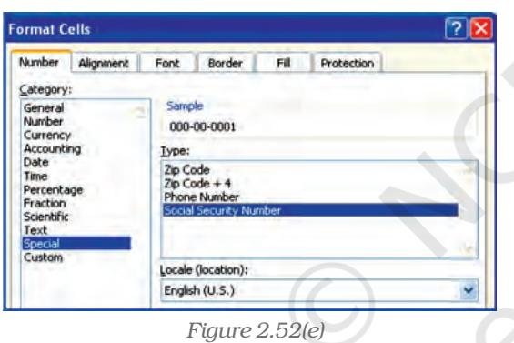

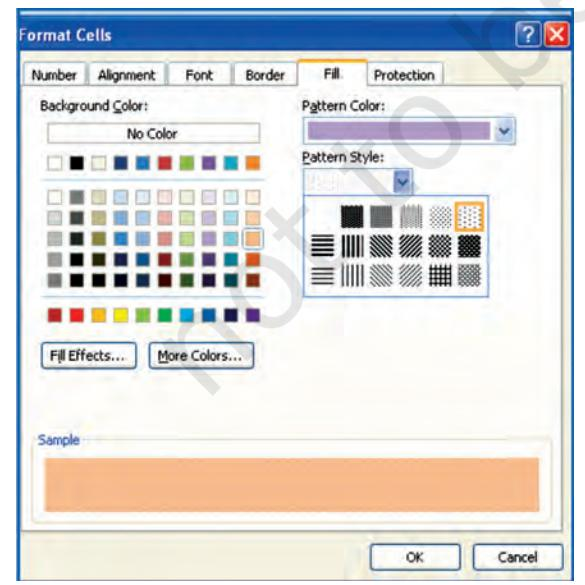

*Figure 2.52(f)*

**58**

# • Special Format Category

Special category data (special numbers) such as phone numbers, zip codes, and Social Security numbers which require different format in a certain way (Figure 2.52(e). From the Category option we select *Special* and from corresponding drop-down box under the *Locale* we select format special numbers appropriate to specific countries.

#### • Changing cell colours -

- Select the range to format (e.g. B4:E7 Figure 2.52(c).
- From the Ribbon select Home Tab with Number option, click on (Figure 2.42(b) to display Format Cells dialog box and choose Fill tab.
- Fill tab provide Background Colour, Pattern Colour and Pattern Style options for the cell (or cell range to fill).
- Select the colour required with desired pattern style and pattern colour from the Colour pallets (Figure 2.52(f).
- Click OK and we see the result as given in Figure 2.52(g).

There is other number a format tool on the Ribbon for which allows number s to format aesthetically such as :

In the Number section, click the Comma Style button. Then the thousand digit numbers or one hundred digit numbers will

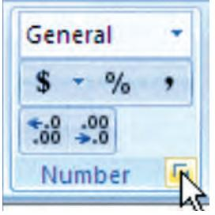

be display with a comma sign which makes it easier to read. Excel also

|  | A | B | C | 100 | E |
| --- | --- | --- | --- | --- | --- |
| 1 | Sales for Home Appliances Year 2008_09 |  |  |  |  |
| 2 | (Figures in 000's) |  |  |  |  |
| 3 | Q1 |  | 02 | 03 | 04 |
| 4 11 | ALOK | Rs.40 |  | Rs.57 Rs.52 | Rs.65 |
| 5 | PRANAV | Rs.50 | Rs.69 | Rs.69 | Rs.90 |
| 6 | PRABODH | Rs.53 | Rs.75 | Rs.71 | Rs.82 |
| 7 | RAJENDRA | Rs.44 | Rs.59 | Rs.38 | Rs.70 |

*Figure 2.52(g)*

allows more precise with these numbers, that's why it added two decimal values.

To remove the decimal values, in the Number section of the Ribbon, click the Decrease Decimal button. That removes one decimal value. Click the Decrease Decimal button again to remove another

decimal value. Similarly we can use to Increase Decimal button twice.

To create own custom format, from the Format Cell dialog box, click the Custom category (Figure 2.52(h), select one of the existing formats, and then proceed to create by adding appropriate or subtracting undesired characters.

We can find out the format used in a cell or some cells of unknown worksheet and can be changed by using the Format Cells dialog. In this case Right-click the mouse button for appropriate cell (s) or column (s) and choose Format Cells. In the Category list, select one of the formats as per characteristics from the right list or select the custom format.

| Format Cells |  |  |  |  |  |
| --- | --- | --- | --- | --- | --- |
| Number | Alignment | Fa Protection | Border | Font |  |
| Category: |  |  |  |  |  |
| General |  |  | Sample |  |  |
| Number |  |  | 214 |  |  |
| Currency |  |  |  |  |  |
| Accounting |  |  | Type: |  |  |
| Date |  |  | General |  |  |
| Time |  |  |  |  |  |
| Percentage |  |  | General |  |  |
| Fraction |  |  |  | 0 |  |
| Scientific |  |  |  |  | 0.00 |
| Text |  |  | # ##0 |  |  |
| Special |  |  | #,##0.00 |  |  |
| Custom |  |  | #,##0 );(#,##0) |  |  |
|  |  |  | #,##0 );[Red](#,##0) |  |  |
|  |  |  | # ##0.00 );(#,##0.00) |  |  |
|  |  | #,##0.00 );[Red](#,##0.00) |  |  |  |
|  |  |  | Rs.#,##0 );(Rs.#,##0) |  |  |
|  |  | Rs.#.##0 );[Red](Rs.#.##0) |  |  |  |
|  |  | Filiphone |  |  |  |

*Figure 2.52(h)*

**59**

Adding text formatting – The text formatting is mostly required for presentation of final output and aesthetically reading of the information. There may be display of the text or numbers in different

Fonts; Aligning in Cells, Changing Colour of Fonts, Merging of cell ranges to accommodate data etc. (Figure 2.52(i & j)) When we insert a Text box, it looks quite plain. We can format text boxes to make them stand out on the worksheet; using the options from the Ribbon; on Insert Tab with

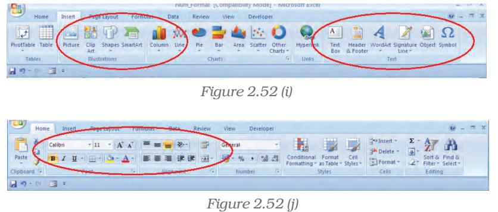

the Text dialog box. We can use these drawing tools in dressing them up with special formatting commands (Figure 2.52(j)). These tools allow us to add decorative and explanatory material to worksheet and chart. How the Illustrations Tools or Text Tools can be used; let us understand from the example using both the tools bars together.

- Change the font or font size in a worksheet (Figure 2.52(j)) and Figure 2.52(j)
	- 1. Select the cell, range of cells, text, or characters that we want to format.
	- 2. On the Home tab, in the Font group, we will do the following:
		- s To change the font, click the font that we want in the Font box.
		- s To change the font size, click the font size that we want in the Font Size box , or click Increase Font

Size or Decrease Font Size

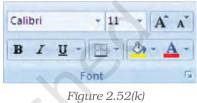

until the size we want is displayed in the Font Size box.

- Change the cell border (Figure 2.52(k))
	- 1. On a worksheet, select the cell or range of cells that we want to add a border to, change the border style on, or remove a border from.
	- 2. On the Home tab, in the Font group, we will do one of the following:
		- s To apply a new or different border style, click the arrow next to Borders , and then click a border style.
		- s To remove cell borders, click the arrow next to Borders, and then click No Border.

The Borders button displays the most recently used border style. We can click the Borders button (not the arrow) to apply that style.

• Create a custom cell border (Figure 2.52(j) Figure 2.52(i)

We can create a cell style that includes a custom border, and can apply to that cell style when we want to display the custom border around selected cells.

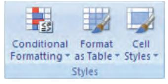

*Figure 2.52(l)*

- 1. On the Home tab, in the Styles group, click Cell Styles.
- 2. Click New Cell Style.
- 3. In the Style name box, type an appropriate name for the new cell style.
- 4. Click Format.

- 5. On the Border tab, under Line, in the Style box, click the line style that we want to use for the border.
- 6. In the Colour box, select the colour that we want to use.
- 7. Under Border, click the border buttons to create the border that we want to use.
- 8. Click OK.
- 9. In the Style dialog box, under Style Includes, clear the check boxes for any formatting that we do not want to include in the cell style.
- 10. Click OK.
- 11. To apply the cell style, do the following:
- 12. Select the cells that we want to format with the custom cell border.
- 13. On the Home tab, in the Styles group, click Cell Styles.

14. Click the cell style that we want to apply.

#### • Conditional Formatting

Conditional formatting helps us for specific questions about data. We can apply conditional formatting to a cell range, a table, or a PivotTable report. There are important differences to understand when we use conditional formatting on a PivotTable report (Figure 2.52(k).

#### • The benefits of conditional formatting (Figure 2.52m)

To analyse data, we often ask ourselves some questions, such as:

- Where are the exceptions in a summary of data over the past five years?
- What is the trend in data over the past two years?
- Who is responsible for such results during this month?
- What is the overall age distribution of employees?
- Which products have greater than 10% revenue increases from year to year?
- Who are the highest performing and lowest performing students in the class?

Conditional formatting helps to answer these questions by making it easy to highlight interesting cells or ranges of cells, emphasise unusual values, and visualise data by using data bars, colour scales, and icon sets. A conditional format changes the appearance of a cell range based on a condition (or criteria). If the condition is true, the cell range is formatted based on that condition; if the conditional is false, the cell range is not formatted based on that condition.

|  |  | Insert . |
| --- | --- | --- |
| Conditional | Format | Delete - |
| Formatting . as Table . Styles . |  | Format . |
| Highlight Cells Rules |  | Greater Than ... |
| Top/Bottom Rules |  | Less Than ... |
| a Barc |  | tween ... |
| Color Scales |  | Equal To ... |
| Icon Sets |  | Text that Contains ... |
| म | New Rule ... | A Date Occurring ... |
| 147 | Clear Rules |  |
| Manage Rules ... |  | plicate Values ... |
|  |  | More Rules ... |

*Figure 2.52(m)*

- Format all cells by using a colour scale
Colour scales are visual guides that help us to understand data distribution and their variation. A colour scale helps us to compare a range of cells by using a gradation of different colours. The shade of the colour represents higher or lower values. For example, in a green colour are higher value cells and red colour for lower value cells.

If one or more cells in the range contain a formula that returns an error, the conditional formatting is not applied to the entire range. To ensure that the conditional formatting is applied to the entire range, use an IS or IFERROR function to return a value other than an error value.

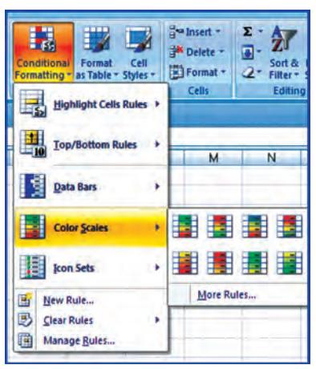

*Figure 2.52(n)*

- 1. Select one or more cells in a range, table, or PivotTable report.
- 2. On the Home tab, in the Styles group, click the arrow next to Conditional Formatting, and then click Colour Scales. (Figure 2.52(n).
- 3. Select a two-colour scale.
- More than the two colours (Figure 2.52(o)
	- 1. Select one or more cells in a range, table, or PivotTable report.
	- 2. On the Home tab, in the Styles group, click the arrow next to Conditional Formatting, and then click Manage Rules. The Conditional Formatting Rules Manager dialog box is displayed. Do one of the following:
- § To add a conditional format, click New Rule. The New Formatting Rule dialog box is displayed.

| 1 | 2 × 6 CH |  |  |  |  | Edit Formatting Rule |  |  |  | × × |
| --- | --- | --- | --- | --- | --- | --- | --- | --- | --- | --- |
|  | B3 | - 1 | E |  |  |  |  |  |  |  |
|  |  |  |  |  |  | Select a Rule Type: |  |  |  |  |
|  | A | B | C | 10 | II |  |  |  |  |  |
|  |  |  |  | Sales for Home Appliances Year 20 |  | Format all cells based on their values |  |  |  |  |
| 2 |  |  |  | (Figures in 000's) |  | Format only cells that contain |  |  |  |  |
|  |  |  |  |  |  | Format only top or bottom ranked values |  |  |  |  |
|  |  | Q1 | Q2 | Q3 | Q4 | Format only values that are above or below average |  |  |  |  |
| 3 |  |  |  |  |  | Format only unique or duplicate values. |  |  |  |  |
| 4 | ALOK | Rs.40 | Rs.57 | Rs.52 | Rs.65 | > Use a formula to determine which cells to format |  |  |  |  |
| 5 | PRANAV | Rs.50 | Rs.69 | Rs.69 | Rs.90 |  |  |  |  |  |
| 6 | PRABODH | Rs.53 | Rs.75 | Rs.71 | Rs.82 | Edit the Rule Description: |  |  |  |  |
|  | RAJENDRA | Rs.44 | Rs.59 | Rs.38 | Rs.70 | Format all cells based on their values: |  |  |  |  |
| 8 | Total |  |  |  |  | 3-Color Scale V Format Style: |  |  |  |  |
| ਲ | Reported on |  | Final Output after using Formatti |  |  | Minimum Midpoint |  |  | Maximum |  |
|  |  |  |  | above for thee Figure |  |  |  |  |  |  |
| 10 | 16-04-2009 |  |  |  |  | > Iype: Number | Number | > | Number | > |
| 11 |  |  |  |  |  | Value: 40 33 | 50 | EST | 60 | FS |
| 15 |  |  |  |  |  |  |  |  |  |  |
|  |  |  |  |  |  | Color: V |  | > |  | ۷ |
| 13 |  |  |  |  |  |  |  |  |  |  |
| 14 |  |  |  |  |  | Preview: |  |  |  |  |
| 15 |  |  |  |  |  |  |  |  |  |  |
|  |  |  |  |  |  |  |  |  | OK | Cancel |
| 16 |  |  |  |  |  |  |  |  |  |  |

- § To change a conditional format, do the following:
*Figure 2.52(o)*

- 1. Make sure that the appropriate worksheet, table, or PivotTable report is selected in the Show formatting rules for list box.
- 2. Optionally, change the range of cells by clicking Collapse Dialog in the Applies to box to temporarily hide the dialog box, by selecting the new range of cells on the worksheet, and then by selecting Expand Dialog.
- 3. Select the rule, and then click Edit rule. The Edit Formatting Rule dialog box is displayed.
- 4. Under Select a Rule Type, click Format all cells based on their values.
- 5. Under Edit the Rule Description, in the Format Style list box, select 3-Colour Scale.
- 6. To select a Minimum and Maximum Type do one of the following:
	- § Format lowest and highest values Select Lowest Value and Highest Value. In this case, we do not enter a Minimum and Maximum Value.
	- § Format a number, date, or time value Select Number, and then enter a Minimum and Maximum Value.
	- § Format a percentage Select Per cent, and then enter a Minimum and Maximum Value. Valid values are from 0 (zero) to 100. Do not enter a per cent sign. Use a percentage when we want to visualise all values proportionally because the distribution of values is proportional.
	- § Format a percentile Select Percentile and then enter a Minimum and Maximum Value. Valid percentiles are from 0 (zero) to 100.

Percentile is usually used we want to visualise a group of high values (such as the 20th percentile) in one colour grade proportion because they represent extreme values that might skew the visualisation of the data.

- § Format a formula result Select Formula, and then enter a Minimum and Maximum Value.
The formula must return a number, date, or time value. Start the formula with an equal sign (=). It's a good idea to test the formula in the worksheet to make sure that the formula doesn't return an error value.

• Changing the alignment of data in cells (Figure 4.52(p)

There are several options to change the alignment of text (data) in cells

*Text layout*

Vertical alignment – To specify the vertical position of the text in a shape, select an option from the list (or from the tool box).

Text direction – To specify the orientation of the text in a shape, select an option from the list.

#### *2. Autofit*

Resize shape to fit text - To increase the size of the shape vertically so that the text fits inside of it, click this button.

#### *3. Inter3. Inter 3. Internal mar nal margin*

The internal margin is the distance between the text and the outer border of a chart element. We can increase or decrease the amount of this space by using the following options.

Left – To specify the distance between the left border of the selected chart element and the text, enter the margin number that we want in the Left box.

Right – To specify the distance between the right border of the selected chart element and the text, enter the margin number that we want in the Right box.

Top – To specify the distance between the top border of the selected chart element and the text, enter the margin number that we want in the Top box.

Bottom – To specify the distance between the bottom border of the selected chart element and the text, enter the margin number that we want in the Bottom box.

Columns – To specify the number of columns of text in a chart element and the spacing between the columns, click this button.

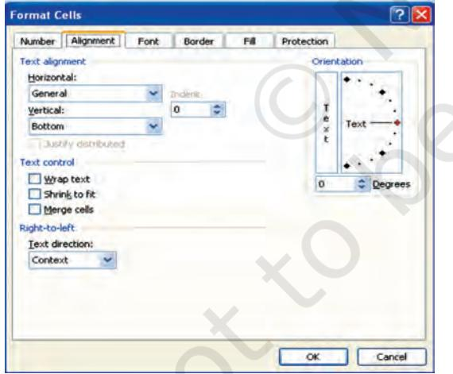

The commands for this

F Select the range.

- F Click on Home tab for Alignment options which displays the dialog box and select the alignment tab (Figure 2.38(n)(1).
- F Select horizontal and vertical as alignment required.
- F There are other options to display text at angular orientation or text to be control within cell or to spread within the cell.
- F Click OK.

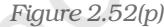

#### • Merging a range of Cells

Merged cells are a single cell that is created by combining two or more selected cells. The cell reference for a merged cell is the upper-left cell in the original selected range. When two or more adjacent horizontal or vertical cells are merged, the cells become one large cell and displayed across multiple columns or rows. The contents of one appear in the centre of the merged cell.

- 1. Select two or more adjacent cells that we want to merge.
- 2. On the Home tab, in the Alignment group, click Merge and Centre. (Or button).
- 3. The cells will be merged in a row or column, and the cell contents will be centered in the merged cell. To merge cells without centering, click the arrow next to Merge and Centre, and then click Merge Across or Merge Cells. The cell address of merge cells will be the address of lower active cell.
- 4. To change the text alignment in the merged cell, select the cell; click any of the alignment buttons in the Alignment group on the Home tab.
- Split a merged cell (Figure 2.52(q)
	- 1. Select the merged cell.
	- 2. When we select a merged cell, the Merge and Centre button also appears selected in the Alignment group on the Home tab.
	- 3. To split the merged cell, click Merge and Centre. The contents of the merged cell will appear in the upper-left cell of the range of split cells.

#### • Formatting a Table

There are predefined table styles (or quick styles) that we can use to quickly format a table. If the pre-defined table styles don't meet our needs, we can create and apply a custom table style.

The table formatting by choosing Quick Styles options for table elements, such as header and total rows, first and last columns, and banded rows and columns.

- To choose a table style to create a table (Figure 2.52(r))
	- 1. On the worksheet, select a range of cells that we want to quickly format as a table.

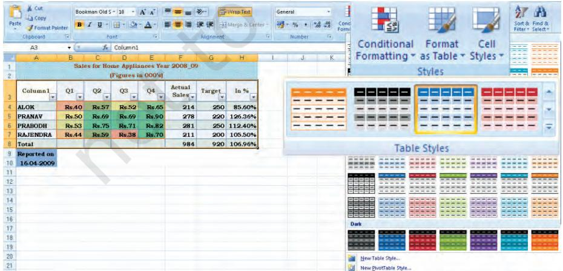

*Figure 2.52(r)*

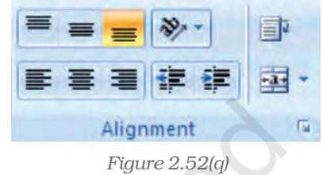

- 2. On the Home tab, in the Styles group, click Format as Table.
- 3. Under Light, Medium, or Dark, click the table style that we want to use.

Apply a table style to an existing table

- 1. On the worksheet, select the table to which we want to apply a table style.
- 2. On the Design tab, in the Table Styles group, do one of the following:
	- § Click the More button, from the dropdown menu, click the table style (Light, Medium or Dark) that we want to use.
- Using the NOW function to add the current date to the spreadsheet

NOW ( ) is the function returns the serial number of the current date and time. If the cell format was General before the function was entered, the result is formatted as a date.

Excel stores dates as sequential serial numbers so they can be used in calculations. By default, January 1, 1900 is serial number 1, and January 1, 2008 is serial number 39448 because it is 39,448 days after January 1, 1900. Numbers to the right of the decimal point in the serial number represent the time; numbers to the left represent the date. For example, the serial number 0.5 represents the time 12:00 noon.

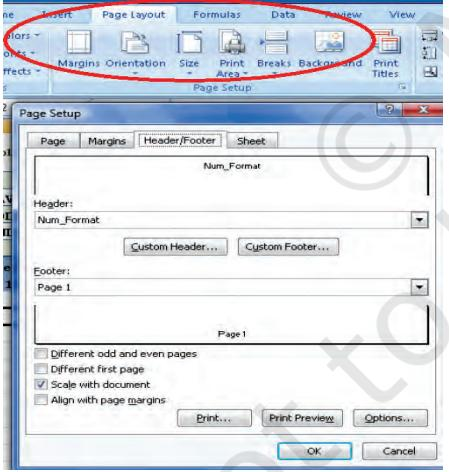

• Adding Headers and Footers to Excel Spreadsheet

In spreadsheet, headers and footers are lines of text that are printed at the top (header) and bottom (footer) of each page in the spreadsheet. They contain descriptive text such as titles, dates, and/or page numbers and are used to add information to a printed spreadsheet.

The headers and footers options are available in Page Layout view (Figure 2.53(a). For other sheet types, such as chart sheets or for embedded charts we can work with headers and footers in the Page Setup dialog box.

*Figure 2.53(a)*

Add or change the header or footer text for a worksheet in Page Layout view

- 1. Click the worksheet to which we want to add/change headers or footers.
- 2. On the Insert tab, in the Text group, click Header and Footer. (refer Figure 2.53(b)) Or Do one of the following:
	- § To add a header or footer, click the left, centre, or right header or footer text box at the top or at the bottom of the worksheet page.

**66**

- § To change a header or footer, click the header or footer text box at the top or at the bottom of the worksheet page that contains header or footer text, and then select the text that we want to change.
- 
- 3. Type the text that we want.

#### • Use Format Painter

To copy quickly formatting from one cell or group of cells to another part of the spreadsheet uses the format painter. This feature is very useful when extending a spreadsheet and we need to format the newly added cells to match the original ones.

#### • Use of AutoFormat Option

To quickly apply a number of formatting features to a spreadsheet we can use one of the 17 AutoFormat styles available (in Excel 2007). These styles combine a number of formatting options that will instantly give our spreadsheet a professional look.

# 2.4 OUTPUT REPORTS

We can print entire or partial worksheets and workbooks, one at a time, or several at once. The MS Excel can print just the Excel table or also it provides to:

- (a) Print a partial or entire worksheet or workbook.
- (b) Print several worksheets at once.
- (c) Print several workbooks at once.
- (d) Print an Excel table.
- (e) Print a workbook to a file.
- (f) Print a graphic Charts and Pivot Tables.

We can also print a workbook to a file instead of to a printer. This is useful when we need to print the workbook on a different type of printer from the one to another printer. The printing option is available to print quickly or to preview the printout before printing, click

Microsoft Office Button, click the arrow next to Print, and then click Quick Print or Print Preview (Figure 2.54). To print worksheet or table; basic preparation for printing is required and describe below:

# 2.4.1 DEFINING THE PRINT AREA

By default, Excel prints all data on the current worksheet but for specific and formatted print we have to define print area from the Page Setup dialog box or the Print Area command from the Page Layout option of the Ribbon (Figure 2.55).

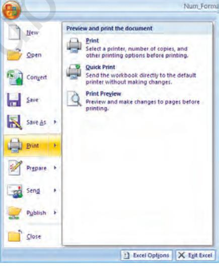

*Figure 2.54*

**67**

*Figure 2.53(b)*

|  | Home | Insert | Page Layout | Formulas | Data | Review | View |
| --- | --- | --- | --- | --- | --- | --- | --- |
|  | Colors " |  |  |  |  |  |  |
| FORTERS | Forts- | LABORG | is Onentation | SOLC Primi |  | Breakt Background | Print |
|  | D ENRES |  |  | Grea * |  |  | Titles |
|  | Themes |  |  | Page Setup |  |  |  |
|  | 47 - Tr |  |  |  |  |  |  |
|  | AI |  | 10 |  |  | Sales for Home Appliances Year 2008 09 |  |
|  |  | B |  | 0 |  | F | H |
| 1 |  |  |  | Sales for Home Appliances Year 2008 09 |  |  |  |
| 2 |  |  |  | (Figures In 000's) |  |  |  |
|  |  | Q1 | Q2 | Q3 | Q4 | Actual | Target In % |
| 3 |  |  |  |  |  | Sales |  |
| 4 | ALOK | Rs.40 | Rs.57 | Rs.52 | Rs.65 | 214 | 250 85.60% |
| 5 | PRANAV | Rs.50 | Rs.69 | Rs.69 | Rs.90 | 278 | 220 126.36% |
| 6 | PRABODH | Rs.53 | Rs.75 | Rs.71 | Rs.82 | 281 | 250 112.40% |
| 7 | RAJENDRA | Rs.44 | Rs.59 | Rs.38 | Rs.70 | 211 | 200 105.50% |
| 8 | Total |  |  |  |  | 984 | 920 106,96% |
| 9 | Reported on |  |  |  | Final Output after using Formatting Tools as Describe |  |  |
| 10 | 16-04-2009 |  |  |  | above for thee Figure 4,47 A |  |  |
| 11 | Page Setup |  |  |  |  |  |  |
| 12 |  |  |  |  |  |  |  |
| 13 | Page | Margins | Header/Footer | Sheet |  |  |  |
| 14 |  | Print grea: $A$1 $H$10 |  |  |  |  |  |
| 15 | Print titles |  |  |  |  |  |  |
| 16 |  | Rows to repeat at top: |  |  |  |  |  |
| 17 |  | Columns to repeat at left: |  |  |  |  |  |
| 18 | Pririt |  |  |  |  |  |  |
| 19 |  |  |  |  |  |  |  |
| 20 |  | @ Gridlines |  | Comments: | (None) |  |  |
| 21 |  | Black and white Draft gualty |  | Cell errors as: | displayed |  |  |
| 22 |  | Row and column headings |  |  |  |  |  |
| Harts H |  | Page order |  |  |  |  |  |
| Point |  | (6) Down their rouer . DOGOC DOBOR |  |  |  |  |  |

*Figure 2.55*

- The Print Area using Dialog Box Option
	- 1. Select the Page Layout command tab on the Ribbon.
	- 2. In the *Page Setup* group, click Page Setup. The *Page Setup* dialog box appears.
	- 3. Select the Sheet tab.
	- 4. In the *Print Area* text box, type the range of cells you want to print or to select the area –
		- a. Click Collapse Dialog
		- b. Select the desired range of cells
		- c. Click Restore Dialog
	- 5. Click OK and the print area is defined.
- The Print Area using Print Area Option

Excel keeps the print area defined until it is cleared or replaced. To set the print area:

- 1. Select the range of cells to print (e.g. A1:H10 of Figure 2.55)
- 2. Select the *Page Layout* command tab
- 3. In the *Page Setup* group, click Print Area» select Set Print Area. The print area is set.
- 4. OPTIONAL: To add more data to the print area

a. select a range of cells

- b. In the *Page Setup* group, click Print Area» select Add to Print Area; the selected cells are added to any previously selected data.
- c. Repeat steps a and b as necessary.
- To clear the print area
	- 1. In the *Page Setup* group, click Print Area» select Clear Print Area

#### *Printing Ranges of Cells*

We can manually select ranges of cells for printing and also have the option of selecting multiple non-contiguous ranges for printing.

- To select Print Range manually (using key board only)
	- 1. Select the range of cells to be printed or

From the *Name Box* pull-down list, select the range name to be printed.

**68**

- 2. In the top left corner of the Excel window, click the Office Button» select *Print* or Press [Ctrl] + [P] the *Print* dialog box appears.
- 3. In the *Print what* section, select *Selection.*
- 4. Click OK. The specified range of cells is printed.
- To select Print Multiple Ranges

Excel facilitates to print non-contiguous ranges. Selected ranges will print on separate pages.

- 1. Select the first range to be printed.
- 2. Press [Ctrl] + select the second range to be printed .
- 3. For each additional range to be printed, repeat step 2.
- 4. In the top left corner of the Excel window, click the Office Button – select *Print* OR Press [Ctrl] + [P]. The *Print* dialog box appears.
- 5. In the *Print what* section, select *Selection.*
- 6. Click Print. The specified range of cells is printed.

# 2.5 PREPARATION OF REPORTS USING PIVOT TABLE

A Pivot Table is way to present information in a report format. A PivotTable report often provides enhanced layout, attractive and formatted report with improved readability. This report is prepared from the spreadsheet once we add the fields with appropriate level of details, calculations and group the data as per required information. The Pivot Table uses a List Data Table (Database).

*A data table is a range of cells that shows the results of substituting different values in one or more formulas. There are two types of data table: One-variable and twovariable.*

*One-variable data table (Figure 2.56(a) Formula used in a one-variable data table must refer to an input cell. The input cell is a cell used by Excel in which each input value from a data table is substituted (column-oriented, i.e. input cell down one column or row-oriented, i.e. across one-row).*

*Two-variable data table (Figure 2.56(b) use only one formula with two lists of input values. The formula must refer two different input cells.*

# 2.5.1 ONE-VARIABLE DATA TABLE

- C1 cell is an input cell. We will create one-variable data table which calculates the increase in the budget corresponding to each of the possible increase in costs.
- If the data table is column-oriented, type the formula (=A2*C1) in the row (row number 4) above the first value (in cell B5) and one cell to the right (in cell C4) of the column of values (Figure 2.56).

**69**

|  | NOW | · X √ fx =A2*C1 |  |
| --- | --- | --- | --- |
|  | A | в | C |
| 1 | Current Budget |  |  |
| 2 | Rs. 1,55,000.00 | Increase In Cost |  |
| 3 |  | Percentage | Value |
| 4 |  |  | =A2*C1 |
| 5 |  | 1.25% |  |
| ర్ |  | 2.50% |  |
| 7 |  | 3.00% |  |
| 8 |  | 4.00% |  |
| a |  | 4.75% |  |
| 10 |  | 5.00% |  |

|  | A B |  |
| --- | --- | --- |
| 1 | Current Budget |  |
| 2 | Rs. 1,55,000.00 | Increase In Cost |
| 3 | Percentage | Value |
| 4 |  | Rs. |
| 5 | 1.25% |  |
| 6 | 2.50% |  |
| 7 | 3.00% |  |
| 8 | 4.00% |  |
| 9 | 4.75% |  |
| 10 | 5.00% |  |
| 11 | Data Table |  |
| 12 |  |  |
| 13 | Row input cell: |  |
| 14 | Column input cell: $c$1 |  |
| 15 | OK | Cancel |
| 16 |  |  |
| 17 |  |  |

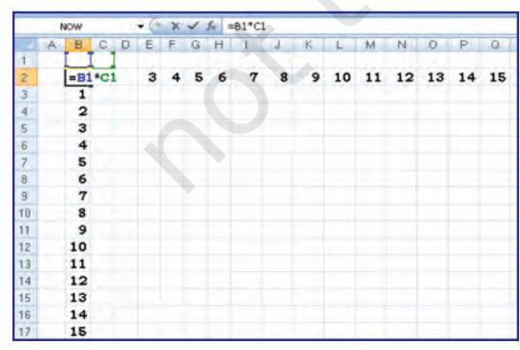

*Figure 2.56(a)*

**70**

| Computerised Accounting System |
| --- |

|  | NOW |  | X X V fx =TABLE(, C1) |
| --- | --- | --- | --- |
|  | A | B | C |
| 1 | Current Budget |  |  |
| 2 | Rs. 1,55,000.00 |  | Increase In Cost |
| 3 |  | Percentage | Value |
| 4 |  |  | Rs. |
| 5 |  | 1.25% | =TABLE(,C1) |
| 6 |  | 2.50% | Rs. 3,875.00 |
| 7 |  | 3.00% | Rs. 4,650.00 |
| 8 |  | 4.00% | Rs. 6,200.00 |
| ന |  | 4.75% | Rs. 7 .362.50 |
| 10 |  | 5.00% | Rs. 7.750.00 |

*Figure 2.56 Figure 2.56(b)*

- Enter a column of values from B5:B10.
- Select all cells in the range B4:C10(Fig 2.56(a).
- On the Data tab on the Ribbon, in the Data Tools group, click What-if-Analysis, and then click Data Table (Figure 2.56(b).
- In the Row input cell box no entry.
- In the Column input cell box, enter $C$1
- Click OK to generate table.

# 2.5.2 TWO-VARIABLE DATA TABLE (Figure 2.57)

This we will learn by one simplest example generating a mathematical table in which two input cells uses B1 and C1 to generate a 15×15 multiplication table by multiplying each other.

- In a cell B2 on the worksheet, enter the formula (= B1 *C1) that refers to the two input cells.

|  |  | NOW |  | - 12 x V In |  |  |  |  |  |  |  |  |  |  |  |  |  |  |  |  | =TABLE(B1.C1) |  |  |  |  |  |  |  |  |  |  |  |  |  |  |  |  |  |  |  |  |  |  |
| --- | --- | --- | --- | --- | --- | --- | --- | --- | --- | --- | --- | --- | --- | --- | --- | --- | --- | --- | --- | --- | --- | --- | --- | --- | --- | --- | --- | --- | --- | --- | --- | --- | --- | --- | --- | --- | --- | --- | --- | --- | --- | --- | --- |
|  | A | B |  | CIDEF IGHI |  |  |  |  |  |  |  |  |  |  |  |  | - |  | I M | b |  |  |  |  |  |  |  |  | K |  |  | NIO |  |  |  |  |  |  |  |  |  |  | 1 8 - |
|  |  | 10 | S B | 456 | 7 | 8 |  | 119 10 11 |  |  |  |  |  | 13 14 |  |  |  |  |  |  |  |  |  |  |  |  |  |  |  |  |  |  |  | 15 |  |  |  |  | 12 |  |  |  |  |
| 3 |  | 1 I | 2 | 3 4 5 6 | 7 |  | 19 |  | 11 |  |  |  |  |  |  |  |  | CLO |  |  |  | 8 |  |  |  |  | 14 |  |  |  |  |  |  | 15 |  |  |  |  | 12 | 18 |  |  |  |
| র্ব |  | 2 2 | 4 6 | 8 10 12 | 14 |  |  |  |  |  |  |  |  |  |  |  |  | 20 |  |  |  | 16 | 18 | 22 | 24 | 26 | 28 | 30 |  |  |  |  |  |  |  |  |  |  |  |  |  |  |  |
| 5 |  | 31 3 | 6 | 9 12 15 18 |  |  |  |  | 33 |  |  |  |  |  |  |  |  |  |  |  |  |  |  |  |  | 39 |  |  | 27 | 30 |  |  | 42 |  | 24 |  |  |  | 36 |  | 45 | 21 |  |
|  |  | 4 4 |  | 8 12 16 20 24 | 28 |  | કર |  |  |  |  |  |  |  |  |  |  | 40 |  |  |  | 82 |  |  |  | 52 |  |  |  |  |  |  | 56 | 60 |  |  | 44 |  | 48 |  |  |  |  |
| 778 |  |  |  | 5 5 10 15 20 25 30 | 642 | 40 | 45 |  |  |  | 65 |  |  |  |  |  |  | 50 |  |  |  |  |  |  |  |  |  |  |  |  |  |  | 70 | 75 |  |  |  | 55 | 60 |  |  |  |  |
|  |  | રા |  | 6 12 18 24 30 36 | 42 | 48 | ਟੇ 4 |  |  | 72 | 78 | 84 |  |  |  |  | 60 |  | 66 |  |  |  |  |  |  |  |  |  |  |  |  |  |  | 90 |  |  |  |  |  |  |  |  |  |
| 9 |  | 71 |  | 7 14 21 28 35 42 | 49 |  | 63 |  | 77 |  |  |  | 105 |  |  |  |  | 701 |  |  |  | 56 |  |  |  | 91 |  |  |  |  |  |  | 98 |  |  |  |  |  | 84 |  |  |  |  |
| 10 |  | 8 8 |  | 8 16 24 32 40 48 -TABLE(B1,C1) |  |  |  |  | કે જે |  | 96 104 112 |  | 120 |  |  |  |  |  |  |  |  |  |  |  |  |  |  |  |  |  |  |  |  |  |  |  |  |  |  |  |  |  |  |
| 11 |  | 9 |  | 9 18 27 36 45 54 | 63 |  |  |  |  |  |  |  | 135 |  |  |  |  |  |  |  |  | 79 |  |  |  |  |  |  |  |  |  | 99 108 117 126 |  |  |  | 81 90 |  |  |  |  |  |  |  |
| 12 |  |  |  | 10 10 20 30 40 50 60 | 70 |  |  |  |  |  |  |  |  |  |  | 80 |  |  |  |  |  |  |  |  |  |  |  |  |  |  |  |  |  |  |  |  |  |  | 90 100 110 120 130 140 150 |  |  |  |  |
| 13 |  | 11111 |  | 22 33 44 55 66 | 77 |  |  |  |  |  |  |  |  |  |  |  |  |  |  |  |  | 88 |  |  |  |  |  |  |  |  |  |  |  |  |  |  |  |  | 99 110 121 132 143 154 165 |  |  |  |  |
| 14 |  |  |  | 12 12 24 36 48 60 72 | 84 |  |  |  | 96 108 120 132 144 156 168 |  |  |  | 180 |  |  |  |  |  |  |  |  |  |  |  |  |  |  |  |  |  |  |  |  |  |  |  |  |  |  |  |  |  |  |
| 15 |  |  |  | 13 13 26 39 52 65 78 |  |  |  |  | 91 104 117 130 143 156 169 182 195 |  |  |  |  |  |  |  |  |  |  |  |  |  |  |  |  |  |  |  |  |  |  |  |  |  |  |  |  |  |  |  |  |  |  |
| 16 |  |  |  | 14 14 28 42 56 70 84 |  |  |  |  |  |  |  |  |  |  |  |  |  |  |  |  |  |  |  |  |  |  |  |  |  |  | 98 112 126 140 154 168 182 196 210 |  |  |  |  |  |  |  |  |  |  |  |  |
| 17 |  |  |  |  |  |  |  |  |  |  |  |  |  |  | 15 15 30 45 60 75 90 105 120 135 150 165 180 195 210 225 |  |  |  |  |  |  |  |  |  |  |  |  |  |  |  |  |  |  |  |  |  |  |  |  |  |  |  |  |

*Figure 2.57 Figure 2.57 (a)*

- Type one list of input values in the same column below the (or fill the series from 1 to 15 in B3:B17).
- Type the second list in the same row ( or fill the series from 1 to 15 in C3:Q3), to the right of the formula.
- Select the range of cells that contains the formula and both the row and column of values i.e. B2:Q17.
- On the Data tab on the Ribbon, in the Data Tools group, click Whatif-Analysis, and then click Data Table.
- In the Row input cell box enter $B$1.
- In the Column input cell box, enter $C$1.
- Click OK to generate table (Figure 2.57(a))

# 2.5.3 PIVOT TABLES

The Pivot Table feature allows us to create a cross tabulation summary of data in which heading can subsequently moved to give different views of the data. We will understand with the help of following example.

Example: A spreadsheet (Figure 2.58) provides the data for consumption from D2:D37 (in Metric Tons) of three different vegetables namely Carrot, Onions and Potatoes during the three days of the week in four different metro cities. The quota of consumption is fixed by Food Department to supply of these vegetables in the city. The spread sheet shows the Actual Consumption and Surplus (i.e. = actual – quota).

- Click the data from A1: E37
- On the Insert tab on the Ribbon, in the Tables group, click Pivot Table, and then click Pivot Table to start Pivot Table Report interactive options (Figure 2.58(a) as Create Pivot Report (Figure 2.58(b).
- Enter the data location

- 
*Figure 2.58*

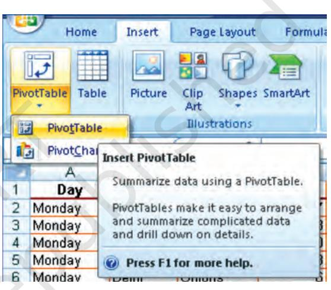

*Figure 2.58(a)*

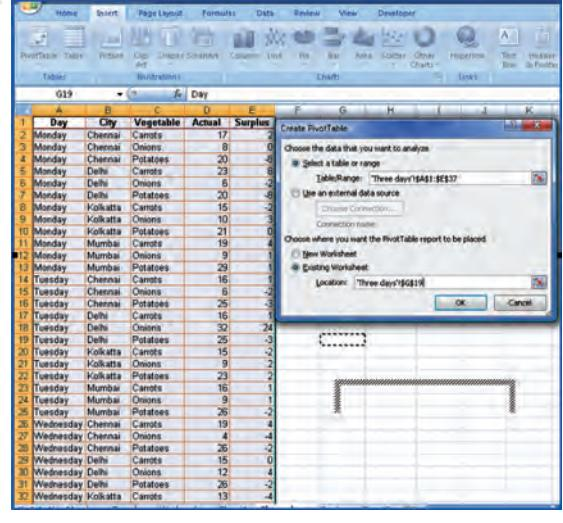

*Figure 2.58(b)*

- Choose to place the Pivot table on an Existing worksheet (say G19).
**71**

- Click OK to display a blank Pivot table and filed list (Figure 2.58(c) and Excel displays the Pivot Table Toolbar
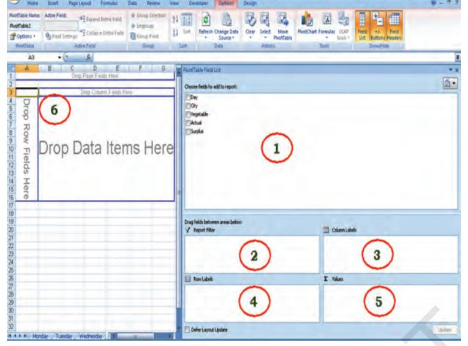

*Figure 2.58(c)*

|  | A | B |  | C | D | E |
| --- | --- | --- | --- | --- | --- | --- |
| 13 | Day | (AII) |  |  |  |  |
| WN |  | Sum of Actual Vegetable ▼ |  |  |  |  |
| 4 | City | Carrots | Onions |  | Potatoes | Grand Total |
| 5 | Chennai |  | 52 | 18 | 71 | 141 |
| 6 | Delhi |  | 54 | 50 | 71 | 175 |
| 7 | Kolkatta |  | 43 | 25 | 66 | 134 |
| 8 | Mumbai |  | 50 | 30 | 81 | 161 |
| g | Grand Total |  | 189 | 123 | 289 | 611 |

<sup><</sup>i>Figure 2.58(d) *Figure 2.58(e)*

- 1. Drag the Field Names (From location number 1) to the require positions in the pivot table (location Number 6).
- 2. Report Filter "Day"
- 3. Column Label "Vegetable"
- 4. Row Label "City"
- 5. Values "Sum of Actual" and the final result will be displayed (Figure 2.58(d).
- 6. In the above selections at Row Label we give "City" and then "Vegetable"; while in column Label if we do not enter any selection. The Pivot Report will be as shown in Figure 2.58(e).

|  | A | B | IC |
| --- | --- | --- | --- |
|  | Day | (AII) |  |
| N |  |  |  |
| 3 | Sum of Actual |  |  |
| 4 | City | Vegetable - | Ilota |
| 5 | E Chennai | Carrots Onions | 52 18 |
| 57 00 |  | Potatoes | 71 |
|  | Chennai Total |  | 141 |
| ਉ | E Delhi | Carrots | 54 |
| 10 |  | Onions | 50 |
| 11 |  | Potatoes | 71 |
| 12 | Delhi Total |  | 175 |
| 13 | Kolkatta | Carrots | 43 |
| 14 |  | Onions | 25 |
| 15 |  | Potatoes | 166 |
| 16 | Kolkatta Total |  | 134 |
| 17 | Mumbai | Carrots | 50 |
| 18 |  | Onions | 30 |
| 19 |  | Potatoes | 81 |
| 20 | Mumbai Total |  | 161 |
|  | 21 Grand Total |  | 611 |

The Pivot Table tool bar (Figure 2.58(f) provides various flexibility to work on data.

| GAR FOR BOOM ST |  |  | quotasDone [Compatibility Mode] - Microsoft Excel |  | PivotTable Tools |  |  |  |  |  | CHOX |
| --- | --- | --- | --- | --- | --- | --- | --- | --- | --- | --- | --- |
| Home Insert |  | Page Layout Formulas Data | Review | View | Developer | Options | Design |  |  |  | 8 - 2 x |
| PivotTable Name: Active Field: J Summary Report City |  | Expand Entire Field | + Group Selection Ungroup |  | PER 2 | 同時 | 175 12 | 机发 | 后 1 底 | 14 1 |  |
| Options - | Field Settings | Collapse Entire Field | J2 Group Field | 4 | Sort | Refresh Change Data Source - | Clear Select Move FivotTable |  | PivotChart Formulas OLAP 10013 | Field   +/- Field List  Buttons  Headers |  |
| PivotTable |  | Active Field | Group | Sort |  | Data | Actions |  | Tools: | Show/Hide |  |

*Figure 2.58(f) : Pivot Table Toolbar*

### Advantages of Pivot Table (Report)

A PivotTable report is an interactive way to quickly summarise large amounts of data. Use a PivotTable report to analyse numerical data in depth and to answer unanticipated questions about data. A PivotTable report designed for:

- E Querying large amounts of data in user-friendly ways. Sub totaling and aggregating numeric data, summarising data by categories and subcategories, and creating custom calculations and formulas.
- E Expanding and collapsing levels of data to focus on results, and providing from details to the summary of data for areas of interest.
- E Moving rows to column or columns to rows (or "pivoting") to see different summaries of the source data.
- E Filtering, sorting, grouping, and conditionally formatting the most useful and the interesting subset of data to enable us to focus on the information that we want.
- E Presenting concise, attractive, and annotated online or printed reports.
- E The use of a PivotTable report is to analyse related totals, when we have a long list of figures to sum and to compare several facts about each figure.

# 2.6. COMMON ERRORS (MESSAGES) IN SPREADSHEET

# 4.1.1 MARK COMMON FORMULA ERRORS

- 1. Click the Microsoft Office Button, click Excel Options, and then click the Formulas category.
- 2. In the Error Checking section, select the Enable background error checking check box.
- 3. To change the colour of the triangle that marks where an error occurs, in the Indicate errors using the colour box, select a new colour.
- 4. Select a cell with a triangle in the top-left corner of a cell.
- 5. Next to the cell, click the Error Checking button that appears, and then click the option that we want. The commands are different for each type of error, and the first entry describes the error. If we click Ignore Error, the error is marked to be ignored for each consecutive check.

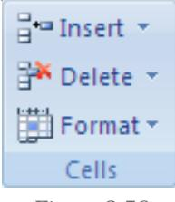

*Figure 2.59*

- 6. Repeat the two previous steps.
#### • Correct an error value

If a formula cannot properly evaluate a result, e Excel will display an error value. Each error type has different causes, and different solutions. Some are discussed here to understand them properly before redo the operation

#### • Correct a ##### error

This error occur when a column is not wide enough, or a negative date or time is used.

Reason: The column is not wide enough to display the content

- 1. Select the column by clicking the column header.
- 2. On the Home tab, in the Cells group, click Format, and then click AutoFit Column Width. Alternatively also we can doubleclick the boundary to the right of the column heading.
- 3. Select the column.
- 4. On the Home tab, in the Cells group, click Format, click Format Cells, and then click the Alignment tab.
- 5. Select the Shrink to fit check box.

#### *Dates and times are negative numbers*

*When a date or time is typed in a cell, it appears in a default date and time format. The default date and time format is based on the Regional date and time settings that are specified in Windows Control Panel, and changes when changes are made to those settings. We can display numbers in several other dates and time formats, most of which are not affected by Control Panel settings.*

- § *If we are using the 1900 date system, dates and times in Excel must be positive values.*
- §*When we subtract dates and times, make sure that we build the formula correctly.*
- § *If the formula is correct but the result is still a negative value, we can display the value by formatting the cell with a format that is not a date or time format.*
	- *1. On the Home tab, in the Cells group, click Format, click Format Cells, and then click the Number tab.*
	- *2. Select a format that is not a date or time format.*

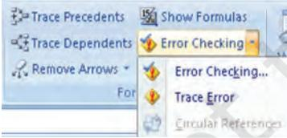

#### Apply a different number format

In some cases, we can change the cell's number format to make the number fit within the existing cell width. For example, we can decrease the number of decimal places after the decimal point.

*Figure 2.60*

#### • Correct a #DIV/0! Error

This error occurs when a number is divided by zero (0).

- 1. Optionally, click the cell that displays the error, click the button that appears, and then click Show Calculation Steps if it is appears.
#### Reasons

- a. Entering a formula that contains explicit division by zero (0) for example, =5/0.
**74**

- b. Using the cell reference to a blank cell or to a cell that contains zero as a divisor.
#### Solutions

- § Change the cell reference to another cell.
- § Enter a value other than zero in the cell used as a divisor.
- § Enter the value #N/A into the cell referenced as the divisor, which changes the result of the formula to #N/A from #DIV/0! To denote that the divisor value is not available.
- § Prevent the error value from displaying by using the IF worksheet function. For example, if the formula that creates the error is =A5/B5, use =IF (B5=0,"", A5/B5) instead. The two quotation marks represent an empty text string.

#### • Correct a #N/A error

This error occurs when a value is not available to a function or formula.

- 1. Optionally, click the cell that displays the error, click the button that appears, and then click Show Calculation Steps if it appears.
#### Reasons and Solutions

- a. Missing data, and #N/A or NA() has been entered in its place.
- b. Giving an inappropriate value for lookup function as an argument such functions may be HLOOKUP, VLOOKUP, MATCH or LOOKUP.
- c. Using these lookup functions to locate the value in an unsorted table.
- d. Using an argument in the array formula that is not in the same number of rows or columns as the range that contains the array formula.
- Correct a #NAME? Error

This error occurs when Excel doesn't recognize text in a formula.

#### Reasons:

- a. The EUROCONVERT function without the Euro Currency Tools add-in being loaded.
#### Solutions

- 1. Click the Microsoft Office Button , click Excel Options, and then click the Add-ins category.
- 2. Select Excel Add-ins in the Manage list box, and then click Go.
- 3. In the Add-Ins available list, select the Euro Currency Tools check box, and then click OK.

#### • Correct #NULL! Error

This error occurs when we specify an intersection of two areas that do not intersect. The intersection operator is a space between references.

- 1. Optionally, click the cell that displays the error, click the button that appears, and then click Show Calculation Steps if it appears.
- 2. Possible causes and solutions.

#### Incorrect range operator

- § To refer to a contiguous range of cells, use a colon (:) to separate the reference to the first cell in the range from the reference to the last cell in the range. For example, SUM (A1:A10) refers to the range from cell A1 to cell A10 inclusive.
- § To refer to two areas that don't intersect, use the union operator, the comma (,). For example, if the formula sums two ranges make sure that a comma separates the two ranges (SUM (A1:A10, C1:C10)).

#### Ranges do not intersect

- § If there are no squares at each corner of the colour-coded border, then the reference is to a named range.
- § If there are squares at each corner of the colour-coded border, then the reference is not to a named range.
- 5. Double-click the cell that contains the formula we want to change. Excel highlights each cell or range of cells with a different colour.
- 6. Do one of the following:
- § To move a cell or range reference to a different cell or range, drag the colour-coded border of the cell or range to the new cell or range.
- § To include more or fewer cells in a reference, drag a corner of the border.
- § In the formula, select the reference, and type a new one.
- 7. Press ENTER.
- 8. Do one of the following:
- § Select the range of cells that contains formulas in which we want to replace references with names.
- § Select a single cell to change the references to names in all formulas on the worksheet.
- 9. On the Formulas tab, in the Defined Names group, click the arrow next to Define Name, and then click Apply Names.
- 10.In the Apply Names box, click one or more names.
- Correct#NUM! Error

This error occurs with invalid numeric values in a formula or function.

- 1. Optionally, click the cell that displays the error, click the button that appears, and then click Show Calculation Steps if it appears.
- 2. Review the following possible causes and solutions:

- § Using an unacceptable argument in a function that requires a numeric argument.
- § Make sure that the arguments (argument: The values that a function uses to perform operations or calculations. The type of argument a function uses is specific to the function. Common arguments that are used within functions include numbers, text, cell references, and names.) used in the function are numbers. For example, even if the value we want to enter is $1,000, enter 1000 in the formula.
- § Using a worksheet function that iterates, such as IRR or RATE, and the function cannot find a result.
- § Use a different starting value for the worksheet function.
- § Change the number of times Microsoft Office Excel iterates formulas.
- 1. Click the Microsoft Office Button , click Excel Options, and then click the Formulas category.
- 2. In the Calculation options section, select the Enable iterative calculations check box.
- 3. To set the maximum number of times that Excel will recalculate, type the number of iterations in the Maximum Iterations box. The higher the number of iterations, the more time that Excel needs to calculate a worksheet.
- 4. To set the maximum amount of change that we will accept between calculation results, type the amount in the Maximum Change box. The smaller the number, the more accurate the result and the more time that Excel needs to calculate a worksheet. Entering a formula that produces a number that is too large or too small to be represented in Excel.

#### • Correct a #REF! Error

This error occurs when a cell reference (cell reference: The set of coordinates that a cell occupies on a worksheet. For example, the reference of the cell that appears at the intersection of column B and row 3 is B3.) is not valid.

- 1. Optionally, click the cell that displays the error, click the button that appears, and then click Show Calculation Steps if it appears.
- 2. Review the following possible causes and solutions:
- § Deleting cells referred to by other formulas, or pasting moved cells over cells referred to by other formulas.
- § Change the formulas, or restore the cells on the worksheet by clicking Undo immediately after we delete or paste the cells.
- § Using an Object Linking and Embedding (OLE) link to a program that is not running.
- § Start the program.

**77**

- § Linking to a Dynamic Data Exchange (DDE) topic such as "system" that is not available.
- § Make sure that we're using the correct DDE topic.
- § Running a macro that enters a function that returns #REF!

#### • Correct a #VALUE! Error

This error occurs when the wrong type of argument (argument: The values that a function uses to perform operations or calculations. The type of argument a function uses is specific to the function. Common arguments that are used within functions include numbers, text, cell references, and names.) or operand (operand: Items on either side of an operator in a formula. In Excel, operands can be values, cell references, names, labels, and functions.) is used.

- 1. Optionally, click the cell that displays the error, click the button that appears, and then click Show Calculation Steps if it appears.
- 2. Review the following possible causes and solutions.
- § Entering text when the formula requires a number or a logical value, such as TRUE or FALSE.
- § Microsoft Office Excel cannot translate the text into the correct data type. Make sure that the formula or function is correct for the required operand or argument, and that the cells that are referenced by the formula contain valid values. For example, if cell A5 contains a number and cell A6 contains the text "Not available", the formula =A5+A6 will return the error #VALUE!.
- § Entering or editing an array formula, and then pressing ENTER.
- § Select the cell or range of cells that contains the array formula (array formula: A formula that performs multiple calculations on one or more sets of values, and then returns either a single result or multiple results. Array formulas are enclosed between braces { } and are entered by pressing CTRL+SHIFT+ENTER.), press F2 to edit the formula, and then press CTRL+SHIFT+ENTER.
- § Entering a cell reference, a formula, or a function as an array constant.
- § Make sure that the array constant (constant: A value that is not calculated and, therefore, does not change. For example, the number 210, and the text "Quarterly Earnings" are constants. An expression, or a value resulting from an expression, is not a constant.) is not a cell reference, formula, or function.
- § Supplying a range to an operator or a function that requires a single value, not a range.
- § Change the range to a single value.
- § Change the range to include either the same row or the same column that contains the formula.

# *Summary*

- Setting up a spreadsheet can be fairly time consuming, although templates, or sample spreadsheets, are available with most of software packages. The computeried spreadsheet can be formatted with different print layouts. It allows working with rows and columns of numbers and use formula to do "what if" calculations. The spreadsheet gives considerable power and flexibility in entering and editing information, setting up calculations with formula and functions, and printing the results. It has rows that are horizontal lines of information that are numbered on the left-hand side of the Excel workbook. Columns are vertical lines of information and are identified by letters along the top of the spreadsheet. Rows and columns intersect to form cells. A cell is addressed by the column and row position, for example B4 is the intersection of column b and row 4.
- In the earliest spreadsheets, cells were a simple two-dimensional grid. Over time, the model has been expanded to include a third dimension, and in some cases a series of named grids, called sheets.
- In any worksheet or spreadsheet a *cell* is the smallest element which may contain a value or a formula or a function or it may simply be left empty. To use formula or function in the cell; usually begin with = sign by convention.
- A cell reference is the name cell in the spreadsheet. Most cell references indicate another cell in the same spreadsheet, but a cell reference can also refer to a cell in a different sheet within the same spreadsheet or to a value from a remote application. A typical cell reference consists the column followed by a row number is called relative cell reference. Both column and row number; either part can be relative changes when the cell or formula in it is moved or copied from other cell or absolute (indicated with $ in front of the part concerned of the cell reference). The older "R1C1" reference style consists of the letter R, the row number, the letter C, and the column number; relative row or column numbers are indicated by enclosing the number in square brackets. Most current spreadsheets use the A1 style, some providing the R1C1 style as a compatibility option. When the computer calculates a formula in one cell to update the displayed value of that cell, cell reference(s) in that cell, naming some other cell(s), cause the computer to fetch the value of the named cell(s).
- A reference to a range of cells is typically of the form (A1:A6) which specifies all the cells in the range A1 through to A6. A formula such as "=SUM (A1:A6)" would add all the cells specified and put the result in the cell containing the formula itself.
- A function is a special key word which can be entered into a cell in order to perform and process the data which is appended within brackets. There is a function button on the formula toolbar (*f*x); which function offers assistance

and useful prompts into a spreadsheet cell. Alternatively we can enter the function directly into the formula bar. A function involves four main issues:

- *•* Name of the function.
- *•* The purpose of the function.
- *•* The function needs what argument(s) in order to carry its assignment.
- *•* The result of the function.
- Formatting of spreadsheets makes easier to read and understand the important information (e.g. conditional formatting, number formatting, text and general spreadsheet formatting etc.). A cell or range can optionally be defined to specify how the value is displayed. The default display format is usually set by its initial content if not specifically previously set, so that for example "24/11/1952" or "24 Nov 1952" would default to the cell format of "date". Similarly adding a % sign after a numeric value would tag the cell as a percentage cell format. The cell contents are not changed by this format, only the displayed value.
- To print an entire spreadsheet choose Page Setup from the File Menu, Choose the appropriate options in terms of horizontal (landscape) or vertical (portrait) printing, Excel prints entire spreadsheet document, if the document is too wide to fit on a page, Excel will print the remaining columns on subsequent pages before continuing to print the remaining rows.
- We can save our document every 5 minutes. The first time we save, go to the File Menu and pull to Save, make sure the document is in the correct folder and on the correct drive, type the name for what we want to save it as, and click in the save box.

# EXERCISE

# Q1. MULTIPLE CHOICE QUESTIONS

- 1. The best way to get started in Excel 2007 is to click the _____.
	- a. View toolbar.
	- b. Home tab.
	- c. Microsoft Office Button.
	- d. None of the above.
- 2. Which key combination collapses the ribbon?
	- a. [Ctrl]+[F1]
	- b. [Ctrl]+[F3]
	- c. [Ctrl]+[F5]
	- d. [Ctrl]+[F7]
- 3. Which view shows margins and the rulers?
	- a. Normal
	- b. Page Layout
	- c. Page Setup
	- d. Review
- 4. As you type a number in a cell, what mode appears in the status bar?
	- a. Enter mode
	- b. Ready mode
	- c. Edit mode
	- d. Record mode
- 5. Where is the address of the active cell displayed?
	- a. Row heading
	- b. Status bar
	- c. Name Box
	- d. Formula bar
- 6. Which command reverses the last action performed in the worksheet?
	- a. Cut
	- b. Undo

- c. Redo
- d. Paste
- 7. When navigating in a workbook, which command is used to move to the beginning of the current row?
	- a. [Ctrl]+[Home]
	- b. [Page Up]
	- c. [Home]
	- d. [Ctrl]+[Backspace]
- 8. Which key when pressed displays the access keys?
	- a. [Alt]
	- b. [Ctrl]
	- c. [Shift]
	- d. [Esc]
- 9. Which command allows you to reverse an Undo command?
	- a. Redo
	- b. Repeat
	- c. Reset
	- d. Reverse
- 10. Which function results can be displayed in AutoCalculate?
	- a. SUM and AVERAGE
	- b. MAX and LOOK
	- c. LABEL and AVERAGE
	- d. MIN and BLANK
- 11. Which cell alignment is assigned to most values by default?
	- a. Right
	- b. Left
	- c. Centre
	- d. Decimal
- 12. Which function automatically totals a column or row of values?
	- a. TOTAL
	- b. ADD
	- c. SUM
	- d. AVG

- 13. Which mathematical operator is represented by an asterisk (*)?
	- a. Exponentiation
	- b. Addition
	- c. Subtraction
	- d. Multiplication
- 14. Which step completes an entry and moves the pointer to the cell to the right?
	- a. Pressing [Enter]
	- b. Pressing [Tab]
	- c. Pressing [Shift]+[Tab]
	- d. Pressing [Shift]+[Enter]
- 15. How many blank worksheets are shown when a new workbook is created?
	- a. One
	- b. Two
	- c. Three
	- d. Four

# Q2. ANSWER THE FOLLOWINGS QUESTIONS

- 1. Define spreadsheet and its salient features?
- 2. Write any five advantages using electronic spreadsheet in place of manual spreadsheet.
- 3. Define workbook and worksheet. What is the difference between them?
- 4. Explain active worksheet?
- 5. Using Fill: Series command in Excel write down the steps to fill data from 120,320…..2300 in Column A.
- 6. Define Data Range, Name Range and How these are created and selected?
- 7. Write down the steps for the use of Custom Lists.
- 8. Explain the purpose of Format, Conditional Formatting and Auto Format.
- 9. What is Wrap Text feature of Excel, Merging of Cells and what will be the cell address of merged cells?
- 10. Explain the purpose of using Print Preview?
- 11. Explain difference between relative reference and absolute reference?
- 12. Discuss IF function and nested IF functions giving example?
- 13. Write down examples for any two financial functions you know with their proper syntax.

**83**

- 14. What is the use of PMT function?
- 15. How many ways Data Entry is possible in Spread Sheet?
- 16. Define one-variable Table and Two-variable table. Explain these with examples.
- 17. Define Pivot Table and explain usage?
- 18. What are formulas and how they are created?
- 19. Write down the differences between formula and function?

# Q3. SKILL REVIEW

- A. You had started your own online business to sale and find out the sales for the first week is as follows:

| Monday | Rs.120.45 |
| --- | --- |
| Tuesday | Rs.187.43 |
| Wednesday | Rs.106.87 |
| Thursday | Rs.143.69 |
| Friday | Rs.117.52 |
| Saturday | Rs.87.93 |
| Sunday | Rs.92.12 |

Use a function to work out how much you earned, on average, each day.

- B. Use a Days360 function to work out how many days are left before your next birthday. Instead of typing out the current date in say cell A2, you can use this inbuilt function:
=Now ( )

The Now function doesn't need anything between the round brackets. Once you have today's date, you can enter your birthday in say cell B2.

- C. Create an Activity Report (Weekly) for a Sales Representative working in a reputed home appliances manufacturing company. Details recorded should contain Date of Visit, Day of Visit, Name of Shop/Dealer Visited, Address, Phone Number, Name of Product (Dealing), Type of Response (by the Dealer), Demand of Product and Duration Spent (in hrs)..
	- a. Fill data in Date of Visit, Day of Visit using Fill Series.
	- b. Name the worksheet created above as Weekly Visit Report.
	- c. Cerate Product-wise, Dealer-wise Monthly Report which should include Total Hours Spent.
	- d. Count total number of dealers visited and dealers who gave positive response.

Create a worksheet to record sales of home appliances sold by M/s Home Maker Ltd. In the following format:

|
|  |

The product lists includes Television sets, Refrigerators, Micro wave ovens, Water Coolers, Air Coolers, Geezers and Air conditioners of different Makes (and models). The cost of price of television is ranging from Rs. 10,000 to Rs. 56,000; refrigerator is Rs. 13,000 to Rs. 45,000, micro wave ovens, water coolers, geezers and air coolers are from Rs. 8,000 to Rs. 25,000 and Air Conditioners are from Rs. 18,000 to Rs. 55,000. The shopkeeper sales these products adding 17.25% more on cost price. He provides a discount of 4.35% on total amount if any customer purchases two products on the same date. Enter 30 records of different dates (for a month) and different customers accordingly. Calculate the following:

- a. Product wise weekly sales and discount.
- b. Calculate the profit of shopkeeper.
- c. Product wise total sales of the month and discount offered.
- D. Create a worksheet to keep track of revenue collected and expenses done in conducting tour programs at different tourist places during 2004 to 2008. Format the numeric data in currency format, prepare year wise columns for revenue and expenses for each tourist place and calculate the difference. The calculated difference may be negative, the format of negative balance may be red coloured. Use conditional formatting for higher and lower values of revenue and expenses. Align entire text in centre. The font of tourist place is Arial with 14 point while the font of year is Times Roman with 14 points.

| Tourist Place | 2004 |  | 2005 |  | 2006 |  | 2007 |  | 2008 |  |
| --- | --- | --- | --- | --- | --- | --- | --- | --- | --- | --- |
|  | Rev | Exp | Rev | Exp | Rev | Exp | Rev | Exp | Rev | Exp |
| Manali | 123 | 55 | 234 | 123 | 345 | 333 | 333 | 365 | 365 | 453 |
| Kashmir | 234 | 123 | 123 | 55 | 365 | 453 | 345 | 333 | 333 | 365 |
| Shilong | 345 | 333 | 333 | 365 | 123 | 55 | 234 | 123 | 456 | 233 |
| Kerala | 333 | 365 | 365 | 453 | 234 | 123 | 123 | 55 | 345 | 333 |

(Amount in lacs)

| ANSWERS |  |  |  |  |  |
| --- | --- | --- | --- | --- | --- |
| 1. c | 2. a | 3. b | 4. a | 5. c | 6. b |
| 7. c | 8. a | 9. a | 10. a | 11. b | 12. c |
| 13. d | 14. b | 15. c |  |  |  |

