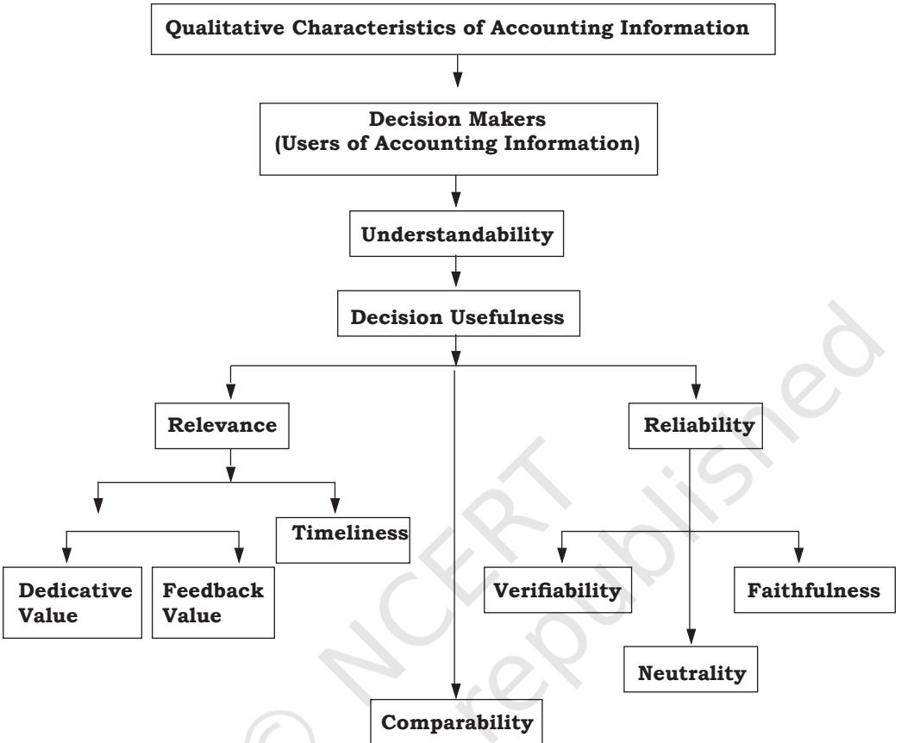

#### **Learning Objectives**

*After studying this chapter you will be able to:*

- *• state the meaning and need of accounting;*
- *• discuss accounting as a source of information;*
- *• identify the internal and external users of accounting information;*
- *• explain the objectives of accounting;*
- *• describe the role of accounting;*
- *• explain the basic terms used in accounting.*

Over the centuries, accounting has remained confined to the financial record-keeping functions of the accountant. But, today's rapidly changing business environment has forced the accountants to reassess their roles and functions both within the organisation and the society. The role of an accountant has now shifted from that of a mere recorder of transactions to that of the member providing relevant information to the decisionmaking team. Broadly speaking, accounting today is much more than just book-keeping and the preparation of financial reports. Accountants are now capable of working in exciting new growth areas such as: forensic accounting (solving crimes such as computer hacking and the theft of large amounts of money on the internet); e-commerce (designing web-based payment system); financial planning, environmental accounting, etc. This realisation came due to the fact that accounting is capable of providing the kind of information that managers and other interested persons need in order to make better decisions. This aspect of accounting

Ch01.indd 1 9/29/2022 2:18:54 PM

gradually assumed so much importance that it has now been raised to the level of an information system. As an information system, it collects data and communicates economic information about the organisation to a wide variety of users whose decisions and actions are related to its performance. This introductory chapter therefore, deals with the nature, need and scope of accounting in this context.

### **1.1 Meaning of Accounting**

In 1941, The American Institute of Certified Public Accountants (AICPA) had defined accounting as the art of recording, classifying, and summarising in a significant manner and in terms of money, transactions and events which are, in part at least, of financial character, and interpreting the results thereof'. With greater economic development resulting in changing role of accounting, its scope, became broader. In 1966, the American Accounting Association (AAA) defined accounting as 'the process of identifying, measuring and communicating economic information to permit informed judgments and decisions by users of information'.

**Fig. 1.1 :** *Showing the process of accounting*

Ch01.indd 2 9/29/2022 2:18:54 PM

In 1970, the Accounting Principles Board of AICPA also emphasised that the function of accounting is to provide quantitative information, primarily financial in nature, about economic entities, that is intended to be useful in making economic decisions.

Accounting can therefore be defined as the process of identifying, measuring, recording and communicating the required information relating to the economic events of an organisation to the interested users of such information. In order to appreciate the exact nature of accounting, we must understand the following relevant aspects of the definition:

- Economic Events
- Identification, Measurement, Recording and Communication
- Organisation
- Interested Users of Information

#### **Box 1 History and Development of Accounting**

Accounting enjoys a remarkable heritage. The history of accounting is as old as civilisation. The seeds of accounting were most likely first sown in Babylonia and Egypt around 4000 B.C. who recorded transactions of payment of wages and taxes on clay tablets. Historical evidences reveal that Egyptians used some form of accounting for their treasuries where gold and other valuables were kept. The incharge of treasuries had to send day wise reports to their superiors known as Wazirs (the prime minister) and from there month wise reports were sent to kings. Babylonia, known as the city of commerce, used accounting for business to uncover losses taken place due to frauds and lack of efficiency. In Greece, accounting was used for apportioning the revenues received among treasuries, maintaining total receipts, total payments and balance of government financial transactions. Romans used memorandum or daybook where in receipts and payments were recorded and wherefrom they were posted to ledgers on monthly basis. (700 B.C to 400 A.D). China used sophisticated form of government accounting as early as 2000 B.C. Accounting practices in India could be traced back to a period when twenty three centuries ago, Kautilya, a minister in Chandragupta's kingdom wrote a book named *Arthashasthra*, which also described how accounting records had to be maintained.

 Luca Pacioli's, a Franciscan friar (merchant class), book *Summa de Arithmetica, Geometria, Proportion at Proportionality* (Review of Arithmetic and Geometric proportions) in Venice (1494) is considered as the first book on double entry bookkeeping. A portion of this book contains knowledge of business and book-keeping.

Ch01.indd 3 9/29/2022 2:18:54 PM

However, Pacioli did not claim that he was the inventor of double entry book-keeping but spread the knowledge of it. It shows that he probably relied on then–current bookkeeping manuals as the basis for his masterpiece. In his book, he used the present day popular terms of accounting Debit (Dr.) and Credit (Cr.). These were the concepts used in Italian terminology. Debit comes from the Italian *debito* which comes from the Latin *debita* and *debeo* which means owed to the proprietor. Credit comes from the Italian *credito* which comes from the Latin '*credo*' which means trust or belief (in the proprietor or owed by the proprietor. In explaining double entry system, Pacioli wrote that 'All entries… have to be double entries, that is if you make one creditor, you must make some debtor'. He also stated that a merchants responsibility include to give glory to God in their enterprises, to be ethical in all business activities and to earn a profit. He discussed the details of memorandum, journal, ledger and specialised accounting procedures.

#### *1.1.1 Economic Events*

Business organisations involves economic events. An economic event is known as a happening of consequence to a business organisation which consists of transactions and which are measurable in monetary terms. For example, purchase of machinery, installing and keeping it ready for manufacturing is an event which comprises number of financial transactions such as buying a machine, transportation of machine, site preparation for installation of a machine, expenditure incurred on its installation and trial runs. Thus, accounting identifies bunch of transactions relating to an economic event. If an event involves transactions between an outsider and an organisation, these are known as *external events*. The following are the examples of such transactions:

- Sale of merchandise to the customers.
- Rendering services to the customers by ABC Limited.
- Purchase of materials from suppliers.
- Payment of monthly rent to the landlord.

*An internal event is* an economic event that occurs entirely between the internal wings of an enterprise, e.g., supply of raw material or components by the stores department to the manufacturing department, payment of wages to the employees, etc.

Ch01.indd 4 9/29/2022 2:18:54 PM

### *1.1.2 Identification, Measurement, Recording and Communication*

*Identification* : It means determining what transactions to record, i.e., to identity events which are to be recorded. It involves observing activities and selecting those events that are of considered financial character and relate to the organisation. The business transactions and other economic events therefore are evaluated for deciding whether it has to be recorded in books of account. For example, the value of human resources, changes in managerial policies or appointment of personnel are important but none of these are recorded in books of account. However, when a company makes a sale or purchase, whether on cash or credit, or pays salary it is recorded in the books of account.

*Measurement* : It means quantification (including estimates) of business transactions into financial terms by using monetary unit, viz. rupees and paise as a measuring unit. If an event cannot be quantified in monetary terms, it is not considered for recording in financial accounts. That is why important items like the appointment of a new managing director, signing of contracts or changes in personnel are not shown in the books of accounts.

*Recording* : Once the economic events are identified and measured in financial terms, these are recorded in books of account in monetary terms and in a chronological order. Recording is done in a manner that the necessary financial information is summarised as per well-established practice and is made available as and when required.

*Communication* : The economic events are identified, measured and recorded in order that the pertinent information is generated and communicated in a certain form to management and other internal and external users. The information is regularly communicated through accounting reports. These reports provide information that are useful to a variety of users who have an interest in assessing the financial performance and the position of an enterprise, planning and controlling business activities and making necessary decisions from time to time. The accounting information system should be designed in such a way that the right information is communicated to the right person at the right time. Reports can be daily, weekly, monthly, or quarterly, depending upon the needs of the users. An important element in the communication process is the accountant's ability and efficiency in presenting the relevant information.

Ch01.indd 5 9/29/2022 2:18:54 PM

### *1.1.3 Organisation*

Organisation refers to a business enterprise, whether for profit or not-for-profit motive. Depending upon the size of activities and level of business operation, it can be a sole-proprietory concern, partnership firm, cooperative society, company, local authority, municipal corporation or any other association of persons.

### *1.1.4 Interested Users of Information*

Accounting is a means by which necessary financial information about business enterprise is communicated and is also called the language of business. Many users need financial information in order to make important decisions. These users can be divided into two broad categories: *internal users and external users.* Internal users include: Chief Executive, Financial Officer, Vice President, Business Unit Managers, Plant Managers, Store Managers, Line Supervisors, etc. External users include: present and potential Investors (shareholders), Creditors (Banks and other Financial Institutions, Debenture-holders and other Lenders), Tax Authorities, Regulatory Agencies (Department of Company Affairs, Registrar of Companies, Securities Exchange Board of India, Labour Unions, Trade Associations, Stock Exchange and Customers, etc. Since the primary function of accounting is to provide useful information for decisionmaking, it is a means to an end, with the end being the decision that is helped by the availability of accounting information. You will study about the types of accounting information and its users later in this chapter.

#### **Box 2**

#### **Why do the Users Want Accounting Information?**

- The owners/shareholders use them to see if they are getting a satisfactory return on their investment, and to assess the financial health of their company/business.
- The directors/managers use them for making both internal and external comparisons in their attempts to evaluate the performance. They may compare the financial analysis of their company with the industry figures in order to ascertain the company's strengths and weaknesses. Management is also concerned with ensuring that the money invested in the company/organisation is generating an

Ch01.indd 6 9/29/2022 2:18:54 PM

adequate return and that the company/organisation is able to pay its debts and remain solvent.

- The creditors (lenders) want to know if they are likely to get paid and look particularly at liquidity, which is the ability of the company/organisation to pay its debts as they become due.
- The prospective investors use them to assess whether or not to invest their money in the company/organisation.
- The government and regulatory agencies such as Registrar of companies, Custom departments IRDA, RBI, etc. require information for the payment of various taxes such as Value Added Tax (VAT), Income Tax (IT), Customs and Excise duties for protecting the interests of investors, creditors(lenders), and also to satisfy the legal obligations imposed by The Companies Act 2013 and SEBI from time-to-time.

### **1.2 Accounting as a Source of Information**

As discussed earlier, accounting is a definite processes of interlinked activities, (refer figure 1.1) that begins with the identification of transactions and ends with the preparation of financial statements. Every step in the process of accounting generates information. Generation of information is not an end in itself. It is a means to facilitate the dissemination of information among different user groups. Such information enables the interested parties to take appropriate decisions. Therefore, dissemination of information is an essential function of accounting. To be useful, the accounting information should ensure to:

- provide information for making economic decisions;
- serve the users who rely on financial statements as their principal source of information;
- provide information useful for predicting and evaluating the amount, timing and uncertainty of potential cash-flows;
- provide information for judging management's ability to utilise resources effectively in meeting goals;
- provide factual and interpretative information by disclosing underlying assumptions on matters subject to interpretation, evaluation, prediction, or estimation; and
- provide information on activities affecting the society.

Ch01.indd 7 9/29/2022 2:18:54 PM

#### **Test Your Understanding - I**

Complete the following sentences with appropriate words:

- (a) Information in financial reports is based on .....................
- (b) Internal users are the ..................... of the business entity.
	- (c) A ..................... would most likely use an entities financial report to determine whether or not the business entity is eligible for a loan.
	- (d) The Internet has assisted in decreasing the ..................... in issuing financial reports to users.
- (e) ..................... users are groups outside the business entity, who uses the information to make decisions about the business entity.
- (f) Information is said to be relevent if it is ......................
- (g) The process of accounting starts with ............ and ends with ............
	- (h) Accounting measures the business transactions in terms of ............ units.
	- (i) Identified and measured economic events should be recording in ............ order.

The role of an accountant in generating accounting information is to observe, screen and recognise events and transactions to measure and process them, and thereby compile reports comprising accounting information that are communicated to the users. These are then interpreted, decoded and used by management and other user groups. It must be ensured that the information provided is relevant, adequate and reliable for decision-making. The apparently divergent needs of internal and external users of accounting information have resulted in the development of sub-disciplines within the accounting discipline namely, *financial accounting*, *cost accounting* and *management accounting* (refer box 3).

*Financial accounting* assists keeping a systematic record of financial transactions the preparation and presentation of financial reports in order to arrive at a measure of organisational success and financial soundness. It relates to the past period, serves the *stewardship* function and is monetary in nature. It is primarily concerned with the provision of financial information to all stakeholders.

*Cost accounting* assists in analysing the expenditure for ascertaining the cost of various products manufactured or services rendered by the firm and

Ch01.indd 8 9/29/2022 2:18:54 PM

fixation of prices thereof. It also helps in controlling the costs and providing necessary costing information to management for decision-making.

*Management accounting* deals with the provision of necessary accounting information to people within the organisation to enable them in decision-making, planning and controlling business operations. Management accounting draws the relevant information mainly from financial accounting and cost accounting which helps the management in budgeting, assessing profitability, taking pricing decisions, capital expenditure decisions and so on. Besides, it generates other information (quantitative and qualitative, financial and non-financial) which relates to the future and is relevant for decision-making in the organisation. Such information includes: sales forecast, cash flows, purchase requirement, manpower needs, environmental data about effects on air, water, land, natural resources, flora, fauna, human health, social responsibilities, etc.

As a result, the scope of accounting has become so vast, that new areas like human resource accounting, social accounting, responsibility accounting have also gained prominance.

#### **Let's Do It**

Many People in today's society think of an accountant as simply a glorified book-keeper. But the role of an accountant is continually changing. Discuss in the classroom what really the role of accounting is?

#### *1.2.1 Qualitative Characteristics of Accounting Information*

Qualitative characteristics are the attributes of accounting information which tend to enhance its understandability and usefulness. In order to assess whether accounting information is decision useful, it must possess the characteristics of reliability, relevance, understandability and comparability.

#### *Reliability*

Reliability means the users must be able to depend on the information. The reliability of accounting information is determined by the degree of correspondence between what the information conveys about the transactions or events that have occurred, measured and displayed. A reliable information should be free from error and bias and faithfully represents what it is meant to represent. To ensure reliability, the information disclosed must be credible, verifiable by independent parties use the same method of measuring, and be neutral and faithful (refer figure 1.3).

Ch01.indd 9 9/29/2022 2:18:54 PM

#### **Box 3 Branches of Accounting**

The economic development and technological advancements have resulted in an increase in the scale of operations and the advent of the company form of business organisation. This has made the management function more and more complex and increased the importance of accounting information. This gave rise to special branches of accounting. These are briefly explained below :

**Financial accounting :** The purpose of this branch of accounting is to keep a record of all financial transactions so that:

- (a) the profit earned or loss sustained by the business during an accounting period can be worked out,
- (b) the financial position of the business as at the end of the accounting period can be ascertained, and
- (c) the financial information required by the management and other interested parties can be provided.

**Cost Accounting :** The purpose of cost accounting is to analyse the expenditure so as to ascertain the cost of various products manufactured by the firm and fix the prices. It also helps in controlling the costs and providing necessary costing information to management for decision-making.

**Management Accounting :** The purpose of management accounting is to assist the management in taking rational policy decisions and to evaluate the impact of its decisons and actions.

### *Relevance*

To be relevant, information must be available in time, must help in prediction and feedback, and must influence the decisions of users by :

- (a) helping them form prediction about the outcomes of past, present or future events; and/or
- (b) confirming or correcting their past evaluations.

#### *Understandability*

Understandability means decision-makers must interpret accounting information in the same sense as it is prepared and conveyed to them. The qualities that distinguish between good and bad communication in a message are fundamental to the understandability of the message. A message is said

Ch01.indd 10 9/29/2022 2:18:54 PM

**Fig. 1.3 :** *The qualitative characteristics of accounting information*

to be effectively communicated when it is interpreted by the receiver of the message in the same sense in which the sender has sent. Accountants should present the comparable information in the most intenlligible manner without sacrificing relevance and reliability.

# *Comparability*

It is not sufficient that the financial information is relevant and reliable at a particular time, in a particular circumstance or for a particular reporting entity. But it is equally important that the users of the general purpose financial reports are able to compare various aspects of an entity over different time period and

Ch01.indd 11 9/29/2022 2:18:54 PM

with other entities. To be comparable, accounting reports must belong to a common period and use common unit of measurement and format of reporting.

#### **Test Your Understanding - II**

You are a senior accountant of Ramona Enterprises Limited. What three steps would you take to make your company's financial statements understandable and decision useful?

- 1. —————————————————————————————— 2. ——————————————————————————————
- 3. ——————————————————————————————

[*Hint : Refer to qualitative characteristics of accounting information]*

# **1.3 Objectives of Accounting**

As an information system, the basic objective of accounting is to provide useful information to the interested group of users, both external and internal. The necessary information, particularly in case of external users, is provided in the form of financial statements, viz., profit and loss account and balance sheet. Besides these, the management is provided with additional information from time to time from the accounting records of business. Thus, the primary objectives of accounting include the following:

### *1.3.1 Maintenance of Records of Business Transactions*

Accounting is used for the maintenance of a systematic record of all financial transactions in book of accounts. Even the most brilliant executive or manager cannot accurately remember the numerous amount of varied transactions such as purchases, sales, receipts, payments, etc. that takes place in business everyday. Hence, a proper and complete records of all business transactions are kept regularly. Moreover, the recorded information enables verifiability and acts as an evidence.

### *1.3.2 Calculation of Profit and Loss*

The owners of business are keen to have an idea about the net results of their business operations periodically, i.e. whether the business has earned profits or incurred losses. Thus, another objective of accounting is to ascertain the profit

Ch01.indd 12 9/29/2022 2:18:54 PM

earned or loss sustained by a business during an accounting period which can be easily workout with help of record of incomes and expenses relating to the business by preparing a profit or loss account for the period. Profit represents excess of revenue (income), over expenses. If the total revenue of a given period is ` 6,00,000 and total expenses are ` 5,40,000 the profit will be equal to ` 60,000(` 6,00,000 – ` 5,40,000). If however, the total expenses exceed the total revenue, the difference reflects the loss.

# *1.3.3 Depiction of Financial Position*

Accounting also aims at ascertaining the financial position of the business concern in the form of its assets and liabilities at the end of every accounting period. A proper record of resources owned by business organisation (Assets) and claims against such resources (Liabilities) facilitates the preparation of a statement known as balance sheet position statement.

# *1.3.4 Providing Accounting Information to its Users*

The accounting information generated by the accounting process is communicated in the form of reports, statements, graphs and charts to the users who need it in different decision situations. As already stated, there are two main user groups, viz. *internal users*, mainly management, who needs timely information on cost of sales, profitability, etc. for planning, controlling and decision-making and *external users* who have limited authority, ability and resources to obtain the necessary information and have to rely on financial statements (Balance Sheet, Profit and Loss account). Primarily, the external users are interested in the following:

- Investors and potential investors-information on the risks and return on investment;
- Unions and employee groups-information on the stability, profitability and distribution of wealth within the business;
- Lenders and financial institutions-information on the creditworthiness of the company and its ability to repay loans and pay interest;
- Suppliers and creditors-information on whether amounts owed will be repaid when due, and on the continued existence of the business;
- Customers-information on the continued existence of the business and thus the probability of a continued supply of products, parts and after sales service;

Ch01.indd 13 9/29/2022 2:18:54 PM

- Government and other regulators- information on the allocation of resources and the compliance to regulations;
- Social responsibility groups, such as environmental groups-information on the impact on environment and its protection;
- Competitors-information on the relative strengths and weaknesses of their competition and for comparative and benchmarking purposes. Whereas the above categories of users share in the wealth of the company, competitors require the information mainly for strategic purposes.

#### **Test Your Understanding - III**

Which stakeholder group… would be most interested in

- _____________________________ (a) the VAT and other tax liabilities of the firm
- _____________________________ (b) the potential for pay awards and bouns deals
- _____________________________ (c) the ethical or environmental activities of the firm
- _____________________________ (d) whether the firm has a long-term future
- _____________________________ (e) profitability and share performance
- _____________________________ (f) the ability of the firm to carry on providing a service or producing a product.

#### **1.4 Role of Accounting**

For centuries, the role of accounting has been changing with the changes in economic development and increasing societal demands. It describes and analyses a mass of data of an enterprise through measurement, classification and summarisation, and reduces those date into reports and statements, which show the financial condition and results of operations of that enterprise. Hence, it is regarded as a language of business. It also performs the service activity by providing quantitative financial information that helps the users in various ways. Accounting as an information system collects and communicates economic information about an enterprise to a wide variety of interested parties. However, accounting information relates to the past transactions and is quantitative and financial in nature, it does not provide qualitative and nonfinancial information. These limitations of accounting must be kept in view while making use of the accounting information.

- 
Ch01.indd 14 9/29/2022 2:18:54 PM

#### **Test Your Understanding - IV**

#### **Tick the Correct Answer**

- 1. Which of the following is not a business transaction?
	- a. Bought furniture of `10,000 for business
	- b. Paid for salaries of employees ` 5,000
	- c. Paid sons fees from her personal bank account ` 20,000
	- d. Paid sons fees from the business ` 2,000
- 2. Deepti wants to buy a building for her business today. Which of the following is the relevant data for his decision?
	- a. Similar business acquired the required building in 2000 for ` 10,00,000
	- b. Building cost details of 2003
	- c. Building cost details of 1998
	- d. Similar building cost in August, 2005 ` 25,00,000
- 3. Which is the last step of accounting as a process of information?
	- a. Recording of data in the books of accounts
	- b**.** Preparation of summaries in the form of financial statements
	- c. Communication of information
	- d. Analysis and interpretation of information
- 4. Which qualitative characteristics of accounting information is reflected when accounting information is clearly presented?
	- a. Understandability
	- b. Relevance
	- c. Comparability
	- d. Reliability
- 5. Use of common unit of measurement and common format of reporting promotes;
	- a. Comparability
	- b. Understandability
	- c. Relevance
	- d. Reliability

#### **Box 4**

#### **Different Roles of Accounting**

- As a language it is perceived as the language of business which is used to communicate information on enterprises;
- As a historical record- it is viewed as chronological record of financial transactions of an organisation at actual amounts involved;
- As current economic reality- it is viewed as the means of determining the true income of an entity namely the change of wealth over time;

Ch01.indd 15 9/29/2022 2:18:54 PM

- As an information system it is viewed as a process that links an information source (the accountant) to a set of receivers (external users) by means of a channel of communication;
- As a commodity- specialised information is viewed as a service which is in demand in society, with accountants being willing to and capable of providing it.

# **1.5 Basic Terms in Accounting**

### *1.5.1 Entity*

Entity means a reality that has a definite individual existence. Business entity means a specifically identifiable business enterprise like Super Bazaar, Hire Jewellers, ITC Limited, etc. An accounting system is always devised for a specific business entity (also called accounting entity).

### *1.5.2 Transaction*

An event involving some value between two or more entities. It can be a purchase of goods, receipt of money, payment to a creditor, incurring expenses, etc. It can be a cash transaction or a credit transaction.

#### **1.5.3** *Assets*

Assets are economic resources of an enterprise that can be usefully expressed in monetary terms. Assets are items of value used by the business in its operations. For example, Super Bazar owns a fleet of trucks, which is used by it for delivering foodstuffs; the trucks, thus, provide economic benefit to the enterprise. This item will be shown on the asset side of the balance sheet of Super Bazaar. Assets can be broadly classified into two types: current and Non-current (Figure 1.4).

Ch01.indd 16 9/29/2022 2:18:54 PM

**Figure 1.4 :** *Classification of Assets*

Ch01.indd 17 9/29/2022 2:18:54 PM

### *1.5.4 Liabilities*

Liabilities are obligations or debts that an enterprise has to pay at some time in the future. They represent creditors' claims on the firm's assets. Both small and big businesses find it necessary to borrow money at one time or the other, and to purchase goods on credit. Super Bazar, for example, purchases goods for ` 10,000 on credit for a month from Fast Food Products on March 25, 2005. If the balance sheet of Super Bazaar is prepared as at March 31, 2005, Fast Food Products will be shown as creditors on the liabilities side of the balance sheet. If Super Bazaar takes a loan for a period of three years from Delhi State Co-operative Bank, this will also be shown as a liability in the balance sheet of Super Bazaar. Liabilities are classified as current and non-current (Figure 1.5).

**Figure 1.5 :** *Classification of Liabilities*

# *1.5.5 Capital*

Amount invested by the owner in the firm is known as capital. It may be brought in the form of cash or assets by the owner for the business entity capital is an obligation and a claim on the assets of business. It is, therefore, shown as capital on the liabilities side of the balance sheet.

Ch01.indd 18 9/29/2022 2:18:55 PM

# *1.5.6 Sales*

Sales are total revenues from goods or services sold or provided to customers. Sales may be cash sales or credit sales.

### *1.5.7 Revenues*

These are the amounts of the business earned by selling its products or providing services to customers, called sales revenue. Other items of revenue common to many businesses are: commission, interest, dividends, royalities, rent received, etc. Revenue is also called income.

### *1.5.8 Expenses*

Costs incurred by a business in the process of earning revenue are known as expenses. Generally, expenses are measured by the cost of assets consumed or services used during an accounting period. The usual items of expenses are: depreciation, rent, wages, salaries, interest, cost of heater, light and water, telephone, etc.

# *1.5.9 Expenditure*

Spending money or incurring a liability for some benefit, service or property received is called expenditure. Purchase of goods, purchase of machinery, purchase of furniture, etc. are examples of expenditure. If the benefit of expenditure is exhausted within a year, it is treated as an expense (also called revenue expenditure). On the other hand, the benefit of an expenditure lasts for more than a year, it is treated as an asset (also called capital expenditure) such as purchase of machinery, furniture, etc.

### *1.5.10 Profit*

The excess of revenues of a period over its related expenses during an accounting year is profit. Profit increases the investment of the owners.

# *1.5.11 Gain*

A profit that arises from events or transactions which are incidental to business such as sale of fixed assets, winning a court case, appreciation in the value of an asset.

### *1.5.12 Loss*

The excess of expenses of a period over its related revenues its termed as loss. It decreases in owner's equity. It also refers to money or money's worth lost

Ch01.indd 19 9/29/2022 2:18:55 PM

(or cost incurred) without receiving any benefit in return, e.g., cash or goods lost by theft or a fire accident, etc. It also includes loss on sale of fixed assets.

# *1.5.13 Discount*

Discount is the deduction in the price of the goods sold. It is offered in two ways. Offering deduction of agreed percentage of list price at the time selling goods is one way of giving discount. Such discount is called 'trade discount'. It is generally offered by manufactures to wholesellers and by wholesellers to retailers. After selling the goods on credit basis the debtors may be given certain deduction in amount due in case if they pay the amount within the stipulated period or earlier. This deduction is given at the time of payment on the amount payable. Hence, it is called as cash discount. Cash discount acts as an incentive that encourages prompt payment by the debtors.

### *1.5.14 Voucher*

The documentary evidence in support of a transaction is known as voucher. For example, if we buy goods for cash, we get cash memo, if we buy on credit, we get an invoice; when we make a payment we get a receipt and so on.

#### *1.5.15 Goods*

It refers to the products in which the business unit is dealing, i.e. in terms of which it is buying and selling or producting and selling. The items that are purchased for use in the business are not called goods. For example, for a furniture dealer purchase of chairs and tables is termed as goods, while for other it is furniture and is treated as an asset. Similarly, for a stationery merchant, stationery is goods, whereas for others it is an item of expense (not purchases)

#### *1.5.16 Drawings*

Withdrawal of money and/or goods by the owner from the business for personal use is known as drawings. Drawings reduces the investment of the owners.

#### *1.5.17 Purchases*

Purchases are total amount of goods procured by a business on credit and on cash, for use or sale. In a trading concern, purchases are made of merchandise for resale with or without processing. In a manufacturing concern, raw materials are purchased, processed further into finished goods and then sold. Purchases may be cash purchases or credit purchases.

Ch01.indd 20 9/29/2022 2:18:55 PM

# *1.5.18 Stock*

Stock (inventory) is a measure of something on hand-goods, spares and other items in a business. It is called *Stock in hand*. In a trading concern, the stock on hand is the amount of goods which are lying unsold as at the end of an accounting period is called *closing stock* (ending inventory). In a manufacturing company, closing stock comprises raw materials, semi-finished goods and finished goods on hand on the closing date. Similarly, *opening stock* (beginning inventory) is the amount of stock at the beginning of the accounting period.

# *1.5.19 Debtors*

Debtors are persons and/or other entities who owe to an enterprise an amount for buying goods and services on credit. The total amount standing against such persons and/or entities on the closing date, is shown in the balance sheet as *sundry debtors* on the asset side.

### *1.5.20 Creditors*

Creditors are persons and/or other entities who have to be paid by an enterprise an amount for providing the enterprise goods and services on credit. The total amount standing to the favour of such persons and/or entities on the closing date, is shown in the Balance Sheet as *sundry creditors* on the liabilities side.

#### **Test Your Understanding - V**

Mr. Sunrise started a business for buying and selling of stationery with ` 5,00,000 as an initial investment. Of which he paid `1,00,000 for furniture, ` 2,00,000 for buying stationery items. He employed a sales person and clerk. At the end of the month he paid ` 5,000 as their salaries. Out of the stationery bought he sold some stationery for `1,50,000 for cash and some other stationery for `1,00,000 on credit basis to Mr.Ravi. Subsequently, he bought stationery items of `1,50,000 from Mr. Peace. In the first week of next month there was a fire accident and he lost ` 30,000 worth of stationery. A part of the machinery, which cost ` 40,000, was sold for ` 45,000.

From the above, answer the following :

- 1. What is the amount of capital with which Mr. Sunrise started business.
- 2. What are the fixed assets he bought?
- 3. What is the value of the goods purchased?
- 4. Who is the creditor and state the amount payable to him?
- 5. What are the expenses?
- 6. What is the gain he earned?

Ch01.indd 21 9/29/2022 2:18:55 PM

- 7. What is the loss he incurred?
- 8. Who is the debtor? What is the amount receivable from him?
- 9. What is the total amount of expenses and losses incurred?
- 10. Determine if the following are assets, liabilities, revenues, expenses or none of the these: sales, debtors, creditors, salary to manager, discount to debtors, drawings by the owner.

#### *Summary with Reference to Learning Objectives*

- 1. *Meaning of Accounting* : Accounting is a process of identifying, measuring, recording the business transactions and communicating thereof the required information to the interested users.
- 2. *Accounting as a source of information* : Accounting as a source of information system is the process of identifying, measuring, recording and communicating the economic events of an organisation to interested users of the information.
- 3. *Users of accounting information* : Accounting plays a significant role in society by providing information to management at all levels and to those having a direct financial interest in the enterprise, such as present and potential investors and creditors. Accounting information is also important to those having indirect financial interest, such as regulatory agencies, tax authorities, customers, labour unions, trade associations, stock exchanges and others.
- 4. *Qualitative characteristics of Accounting* : To make accounting information decision useful, it should possess the following qualitative characteristics.
	- Reliability Understandability
	- Relevance Comparability
- 5. *Objective of accounting* : The primary objectives of accounting are to :
	- maintain records of business;
	- calculate profit or loss;
	- depict the financial position; and
	- make information available to various groups and users.
- 6. *Role of accounting* : Accounting is not an end in itself. It is a means to an end. It plays the role of a :
	- Language of a business
	- Historical record
	- Current economic reality
	- Information system
	- Service to users

#### *Questions for Practice*

#### *Short Answers*

- 1. Define accounting.
- 2. State the end product of financial accounting.
- 3. Enumerate main objectives of accounting.

Ch01.indd 22 9/29/2022 2:18:55 PM

- 4. Who are the users of accounting information.
- 5. State the nature of accounting information required by long-term lenders.
- 6. Who are the external users of information?
- 7. Enumerate information needs of management.
- 8. Give any three examples of revenues.
- 9. Distinguish between debtors and creditors; profit and gain
- 10. 'Accounting information should be comparable'. Do you agree with this statement. Give two reasons.
- 11. If the accounting information is not clearly presented, which of the qualitative characteristic of the accounting information is violated?
- 12. "The role of accounting has changed over the period of time"- Do you agree? Explain.
- 13. Giving examples, explain each of the following accounting terms :
	- Fixed assets Revenue Expenses
		-
- Short-term liability Capital 14. Define revenues and expenses?
- 15. What is the primiary reason for the business students and others to familiarise themselves with the accounting discipline?

#### *Long Answers*

- 1. What is accounting? Define its objectives.
- 2. Explain the factors which necessitated systematic accounting.
- 3. Describe the informational needs of external users.
- 4. What do you mean by an asset and what are different types of assets?
- 5. Explain the meaning of gain and profit. Distinguish between these two terms.
- 6. Explain the qualitative characteristics of accounting information.
- 7. Describe the role of accounting in the modern world.

#### *Checklist to Test Your Understanding*

*Test Your Understanding – I*

- (a) Economic Transactions (b) Management/Employees (c) Creditor
- (d) Time-gap (e) External (f) Free from bias
- (g) Identifying the transactions and communicating information
- (h) Monetary (i) Chronological

*Test Your Understanding - II*

- 1. Reliability, i.e. Verifiability, Faithfulness, Nutrality
- 2. Relevance, i.e. Timeliness
- 3. Understandability and Comparibility

*Test Your Understanding - III*

- (a) Government and other regulators
- (b) Management
- (c) Social responsibility groups
- (d) Lenders

Ch01.indd 23 9/29/2022 2:18:55 PM

- (e) Suppliers and Creditors
- (f) Customers

*Test Your Understanding - IV*

1. (c) 2. (a) 3. (c) 4. (a) 5. (a)

*Test Your Understanding - V*

- 1. ` 5,00,000 2. ` 1,00,000, 3. ` 2,00,000 4. Mr. Reace, ` 1,50,000 5. ` 5,000 6. ` 5,000
- 7. ` 30,000 8. Mr. Ravi, ` 1,00,000 9. ` 35,000
- 10. Assets : debtors; Liabilities : creditors; drawings; Revenues : sales expenses, discount, salary.

| Items | Curren | Non-Current | Current | Non-Current |
| --- | --- | --- | --- | --- |
|  | Assets | Assets | Liabilities | Liabilities |
| Machinery |  |  |  |  |
| Sundry Creditors |  |  |  |  |
| Cash at Bank |  |  |  |  |
| Goodwill |  |  |  |  |
| Bills Payable |  |  |  |  |
| Land & Building |  |  |  |  |
| Furniture |  |  |  |  |
| Computer Software |  |  |  |  |
| Motor Vehicles |  |  |  |  |
| Inventory |  |  |  |  |
| Investments |  |  |  |  |
| Loan from Bank |  |  |  |  |
| Sundry Debtors |  |  |  |  |
| Patents |  |  |  |  |
| Air-Conditioners |  |  |  |  |
| Loose tools |  |  |  |  |

#### **Activity 1 :** Tick () the appropriate one:

- 
Ch01.indd 24 9/29/2022 2:18:55 PM

