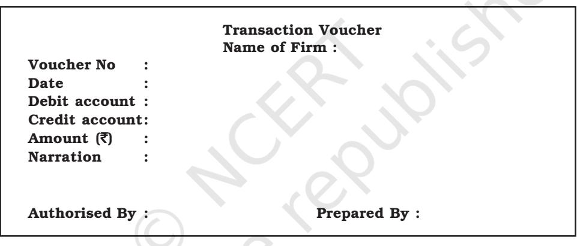
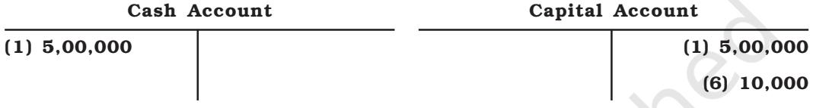
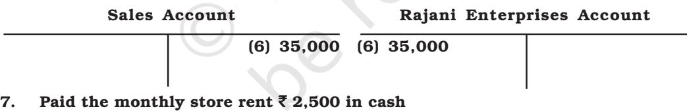

# LEARNING OBJECTIVES

*After studying this chapter, you will be able to:*

- *• describe the nature of transaction and source documents;*
- *• explain the preparation of accounting vouchers;*
- *• apply accounting equation to explain the effect of transactions;*
- *• record transactions using rules of debit and credit;*
- *• explain the concept of book of original entry and recording of transactions in journal;*
- *• explain the concept of ledger and posting of journal entries to the ledger accounts.*

I n chapter 1 and 2, while explaining the development and importance of accounting as a source of disseminating the financial information along with the discussion on basic accounting concepts that guide the recording of business transactions, it has been indicated that accounting involves a process of identifying and analysing the business transactions, recording them, classifying and summarising their effects and finally communicating it to the interested users of accounting information.

In this chapter, we will discuss the details of each step involved in the accounting process. The first step involves identifying the transactions to be recorded and preparing the source documents which are in turn recorded in the basic book of original entry called journal and are then posted to individual accounts in the principal book called *ledger*.

### 3.1 Business Transactions and Source Document

After securing good percentage in your previous examination, as promised, your father wishes to buy you a computer. You go to the market along with your father to buy a computer. The dealer gives a *cash memo* along with the computer and in exchange your father makes cash payment of ` 35,000. Purchase of computer for cash is an example of a *transaction*, which involves reciprocal exchange of two things: (i) *payment of cash,* (ii) *delivery of a computer*. Hence, the transaction involves this aspect, i.e. *Give* and *Take*. Payment of cash involves *give* aspect and delivery of computer is a *take* aspect. Thus, business transactions are exchanges of economic consideration between parties and have two-fold effects that are recorded in at least two accounts.

Business transactions are usually evidenced by an appropriate documents such as Cash memo, Invoice, Sales bill, Pay-in-slip, Cheque, Salary slip, etc. A document which provides evidence of the transactions is called the *Source Document or a Voucher*. At times, there may be no documentary for certain items as in case of petty expenses. In such case voucher may be prepared showing the necessary details and got approved by appropriate authority within the firm. All such documents (vouchers) are arranged in chronological order and are serially numbered and kept in a separate file. All recording in books of account is done on the basis of vouchers.

Fig. 3.1 *: Showing specimen transaction voucher*

# *3.1.1 Preparation of Accounting Vouchers*

Accounting vouchers may be classified as cash vouchers, debit vouchers, credit vouchers, journal vouchers, etc. There is no set format of accounting vouchers. A specimen of a simple transaction voucher is used in practice is shown in figure 3.1.

These must be preserved in any case till the audit of the accounts and tax assessments for the relevant period are completed. Now a days, accounting is computerised and the necessary accounting vouchers showing the code number and name of the accounts to be debited and credited are prepared for the purpose of necessary recording of transactions. A transaction with one debit and one credit is a simple transaction and the accounting vouchers prepared for such transaction is known as *Transaction Voucher,* the format of which is shown in figure 3.1. Voucher which records a transaction that entails multiple debits/credits and one credit/debit is called compound voucher. Compound voucher may be: (a) *Debit Voucher o7r (b) Credit Voucher*; the specimen is shown in figure 3.2.

|  |  | Debit Voucher Name of Firm : |  |
| --- | --- | --- | --- |
| Voucher No | : |  | Date : |
| Credit Account | : |  |  |
| Amount | : |  |  |
|  |  | Debit Accounts |  |
| S. No. Code | Account Name | Amount | Narration (i.e. Explanation) |
|  |  | ` |  |
| Authorised By : |  |  | Prepared By : |

|  |  |  | Credit Voucher Name of Firm : |  |
| --- | --- | --- | --- | --- |
| Voucher No | Debit Account : | : |  | Date : |
| Amount |  | : |  |  |
|  |  |  | Credit Accounts |  |
| Code | S. No. | Account Name | Amount ` | Narration (i.e. Explanation) |
| Authorised By : |  |  |  | Prepared By : |

Fig. 3.2 : *Showing debit and credit vouchers*

Transactions with multiple *debits* and multiple *credits* are called complex transactions and the accounting voucher prepared for such transaction is known as *Complex Voucher/ Journal Voucher.* The format of a complex transaction voucher is shown in figure 3.3.

| Journal Voucher | Name of Firm : |  |  |  |  |
| --- | --- | --- | --- | --- | --- |
| Voucher No | : | Date : |  |  |  |
| Debit Accounts |  |  |  |  |  |
| S. No. | Code | Account Name | Amount | Narration (i.e. Explanation) | ` |
| Credit Accounts |  |  |  |  |  |
| S. No. | Code | Account Name | Amount | Narration (i.e. Explanation) | ` |
| Authorised By : | Prepared By : |  |  |  |  |

Fig. 3.3 *: Showing specimen of complex transaction voucher*

The design of the accounting vouchers depends upon the nature, requirement and convenience of the business. There is no set format of an accounting voucher. To distinguish various vouchers, different colour papers and different fonts of printing are used. Some of the specimen of the accounting vouchers are given in the earlier pages. An accounting voucher must contain the following essential elements :

- It is written on a good quality paper;
- Name of the firm must be printed on the top;
- Date of transactionis filled up against the date and not the date of recording of transaction is to be mentioned;
- The number of the voucher is to be in a serial order;
- Name of the accountto be debited or credited is mentioned;
- Debit and credit amount is to be written in figures against the amount;
- Description of the transaction is to be given account wise;
- The person who prepares the voucher must mention his name along with signature; and
- The name and signature of the authorised person are mentioned on the voucher.

# 3.2 Accounting Equation

Accounting equation signifies that the assets of a business are always equal to the total of its liabilities and capital (*owner's equity*). The equation reads as follows:

> A = L + C Where, A = Assets L = Liabilities C = Capital

The above equation can also be presented in the following forms as its derivatives to enable the determination of missing figures of Capital(C) or Liabilities(L).

- (i) A L = C
- (ii) A C = L

Since, the accounting equation depicts the fundamental relationship among the components of the balance sheet, it is also called the Balance Sheet Equation. As the name suggests, the balance sheet is a statement of assets, liabilities and capital.

At any point of time resources of the business entity must be equal to the claims of those who have financed these resources. The proprietors and outsiders provide the resources of the business. The claim of the proprietors is called *capital* and that of the outsides is known as *liabilities.* Each element of the equation is the part of balance sheet, which states the financial position of the business on a particular date. When we analyse the transactions, we actually try to know that how balance sheet of a business entity gets affected.

Asset side of the balance sheet is the list of assets, which the business entity owns. The liabilities side of the balance sheet is the list of owner's claims and outsider's claims, i.e., what the business entity owes. The equality of the assets side and the liabilities side of the balance sheet is an undeniable fact and this justifies the name of accounting equation as balance sheet equation also.

For example, Rohit started business with a capital of ` 5,00,000. From the accounting point of view, the resources of this business entity is in the form of cash, i.e., ` 5,00,000. Sources of this business entity is the contribution by Rohit (Proprietor) ` 5,00,000 as Capital .

*(For the purpose of understanding we will refer this example as example 1, throughout the chapter*) .

If we put this information in the form of equality of resources and sources, the picture would emerge somewhat as follows:

| Liabilities | Amount | Assets | Amount |
| --- | --- | --- | --- |
|  | ` |  | ` |
| Capital | 5,00,000 | Cash in hand | 5,00,000 |
|  | 5,00,000 |  | 5,00,000 |

Books of Rohit Balance Sheet as at ..........

In the above balance sheet, the total assets are equal to the liabilities of the business. Since, the business has not yet started its activities and has not earned any profits; the amount invested in business is still ` 5,00,000. In case any profits are earned, it will increase the invested amount in business. On the other hand, if business suffers any losses, it will decrease the invested amount in business.

We will now analyse the transactions listed in example 1 and its effect on different elements and you will observe that the accounting equation always remain balanced:

# *Example 1.*

- 1. Opened a bank account in State Bank of India with an amount of ` 4,80,000.
*Analysis of transaction:* This transaction increases the cash at bank (assets) and decreases cash (asset) by ` 4,80,000.

- 2. Bought furniture for ` 60,000 and cheque was issued on the same day.
*Analysis of transaction: This transaction increases furniture (assets) and decreases bank (assets) by* ` *60,000.*

- 3. Bought plant and machinery for the business for ` 1,25,000 and an advance of ` 10,000 in cash is paid to M/s Ramjee Lal.
*Analysis of transaction: This transaction increases plant and machinery (assets) by* ` *1,25,000, decreases cash by* ` *10,000 and increases liabilities (M/s Ramjee lal as creditor) by* ` *1,15,000.*

- 4. Goods purchased from M/s Sumit Traders for ` 55,000.
*Analysis of transaction: This transaction increases goods (assets) and increases liabilities (M/s Sumit Traders as creditors) by* ` *55,000.*

- 5. Goods costing ` 25,000 sold to Rajani Enterprises for ` 35,000. *Analysis of transaction: This transaction decreases stock of goods (assets) by* ` *25,000 and increases assets* (Rajani Enterprises as debtors ` 35,000) and capital (with the profit of ` 10,000)
The final equation as per the above analysis table can be summarised in the form of a balance sheet as under:

| Liabilities | Amount | Assets | Amount |
| --- | --- | --- | --- |
|  | ` |  | ` |
| Outsider's Claims (Creditors) | 1,70,000 | Cash | 10,000 |
| Capital | 5,10,000 | Bank | 4,20,000 |
|  |  | Debtors | 35,000 |
|  |  | Stock | 30,000 |
|  |  | Furniture | 60,000 |
|  |  | Plant & Machinery | 1,25,000 |
|  | 6,80,000 |  | 6,80,000 |

Balance Sheet as at.....2017

In terms of accounting equation A = L + C ` 6,80,000 = ` 1,70,000 + ` 5,10,000

# 3.3 Using Debit and Credit

As already stated every transaction involves give and take aspect. In double entry accounting, every transaction affects and is recorded in at least two accounts. When recording each transaction, the *total amount debited must equal to the total amount credited.* In accounting, the terms — *debit* and *credit* indicate whether the transactions are to be recorded on the left hand side or right hand side of the account. In its simplest form, an account looks like the letter T. Because of its shape, this simple form called a T-account (refer figure 3.4). Notice that the T format has a left side and a right side for recording increases and decreases in the item. This helps in ascertaining the ultimate position of each item at the end of an accounting period. For example, if it is an account of a customer all goods sold shall appear on the left (debit) side of customer's account and all payments received on the right side. The difference between the totals of the two sides called *balance* shall reflect the amount due to the customer. In a T account, the left side is called *debit* (often abbreviated as Dr.) and the right side is known as *credit* (often abbreviated as Cr.). To

The summary of effects of transactions on accounting equation is in the following analysis table:

*(Figures in rupees)*

| Tr | Ca | h | Ba | k | As | Go | ds | Fu | P | la | d | To | l | L | b | l | Ca | l | To | l | t | ion | ts | i | tu | t a | ta | ia | i | i | t | ies | i | ta | ta | an | sa | c | s | n | se | o | rn | re | n | n | p | b | ( | k | ) | h | No | De | to | S | to | M | ine | As | ts |  |  |  |  |  |  |  |  |  |  |  |  |  |
| --- | --- | --- | --- | --- | --- | --- | --- | --- | --- | --- | --- | --- | --- | --- | --- | --- | --- | --- | --- | --- | --- | --- | --- | --- | --- | --- | --- | --- | --- | --- | --- | --- | --- | --- | --- | --- | --- | --- | --- | --- | --- | --- | --- | --- | --- | --- | --- | --- | --- | --- | --- | --- | --- | --- | --- | --- | --- | --- | --- | --- | --- | --- | --- | --- | --- | --- | --- | --- | --- | --- | --- | --- | --- | --- |
| rs | c | ac | ry | se | . |  |  |  |  |  |  |  |  |  |  |  |  |  |  |  |  |  |  |  |  |  |  |  |  |  |  |  |  |  |  |  |  |  |  |  |  |  |  |  |  |  |  |  |  |  |  |  |  |  |  |  |  |  |  |  |  |  |  |  |  |  |  |  |  |  |  |  |  |  |
| 5, | 0 | 0, | 0 | 0 | 0 | 5, | 0 | 0, | 0 | 0 | 0 | 5, | 0 | 0, | 0 | 0 | 0 | 5, | 0 | 0, | 0 | 0 | 0 | ... | ... | . |  |  |  |  |  |  |  |  |  |  |  |  |  |  |  |  |  |  |  |  |  |  |  |  |  |  |  |  |  |  |  |  |  |  |  |  |  |  |  |  |  |  |  |  |  |  |  |  |
| 1. | ( | 4, | 8 | 0, | 0 | 0 | 0 | ) | 4, | 8 | 0, | 0 | 0 | 0 | ... | ... | . | ... | ... | . | ... | ... | . | 5, | 5, | 5, | Po | t | Tr | 2 | 0, | 0 | 0 | 0 | 4, | 8 | 0, | 0 | 0 | 0 | 0 | 0, | 0 | 0 | 0 | 0 | 0, | 0 | 0 | 0 | 0 | 0, | 0 | 0 | 0 |  |  |  |  |  |  |  |  |  |  |  |  |  |  |  |  |  |  |  |
| s | an | s. | Eq | tio |  |  |  |  |  |  |  |  |  |  |  |  |  |  |  |  |  |  |  |  |  |  |  |  |  |  |  |  |  |  |  |  |  |  |  |  |  |  |  |  |  |  |  |  |  |  |  |  |  |  |  |  |  |  |  |  |  |  |  |  |  |  |  |  |  |  |  |  |  |  |
| ua | n | ( | ) | 2. | 6 | 0, | 0 | 0 | 0 | 6 | 0, | 0 | 0 | 0 |  |  |  |  |  |  |  |  |  |  |  |  |  |  |  |  |  |  |  |  |  |  |  |  |  |  |  |  |  |  |  |  |  |  |  |  |  |  |  |  |  |  |  |  |  |  |  |  |  |  |  |  |  |  |  |  |  |  |  |  |
| ... | ... | . | ... | ... | . | ... | ... | . | ... | ... | . | Po | Tr | 2 | 0, | 0 | 0 | 0 | 4, | 2 | 0, | 0 | 0 | 0 | 6 | 0, | 0 | 0 | 0 | 5, | 0 | 0, | 0 | 0 | 0 | 5, | 0 | 0, | 0 | 0 | 0 | 5, | 0 | 0, | 0 | 0 | 0 | t |  |  |  |  |  |  |  |  |  |  |  |  |  |  |  |  |  |  |  |  |  |  |  |  |  |  |
| s | an | s. | , | Eq | tio |  |  |  |  |  |  |  |  |  |  |  |  |  |  |  |  |  |  |  |  |  |  |  |  |  |  |  |  |  |  |  |  |  |  |  |  |  |  |  |  |  |  |  |  |  |  |  |  |  |  |  |  |  |  |  |  |  |  |  |  |  |  |  |  |  |  |  |  |  |
| ua | n | 3. | ( | 1 | 0, | 0 | 0 | 0 | ) | 1, | 2 | 5, | 0 | 0 | 0 | 1, | 1 | 5, | 0 | 0 | 0 | 1, | 1 | 5, | 0 | 0 | 0 | 1, | 1 | 5, | 0 | 0 | 0 |  |  |  |  |  |  |  |  |  |  |  |  |  |  |  |  |  |  |  |  |  |  |  |  |  |  |  |  |  |  |  |  |  |  |  |  |  |  |  |  |  |
| 5, | 5, | 5, | 5, | 5, | Po | t | Tr | 1 | 0, | 0 | 0 | 0 | 4, | 2 | 0, | 0 | 0 | 0 | 6 | 0, | 0 | 0 | 0 | 1, | 2 | 0 | 0 | 0 | 6, | 1 | 0 | 0 | 0 | 1, | 1 | 0 | 0 | 0 | 0 | 0, | 0 | 0 | 0 | 6, | 1 | 0 | 0 | 0 | s | an | s. | Eq | tio | ua | n |  |  |  |  |  |  |  |  |  |  |  |  |  |  |  |  |  |  |  |
| 5 | 5, | 5 | 5, | 5 | 5, | 5 | 5, | 4. | 0 | 0 | 0 | 0 | 0 | 0 | 0 | 0 | 0 | 0 | 0 | 0 | Po | Tr | 1 | 0, | 0 | 0 | 0 | 4, | 2 | 0, | 0 | 0 | 0 | 5 | 5, | 0 | 0 | 0 | 6 | 0, | 0 | 0 | 0 | 1, | 2 | 5, | 0 | 0 | 0 | 6, | 7 | 0, | 0 | 0 | 0 | 1, | 7 | 0, | 0 | 0 | 0 | 5, | 0 | 0, | 0 | 0 | 0 | 6, | 7 | 0, | 0 | 0 | 0 | t |
| s | an | s. | Eq | tio |  |  |  |  |  |  |  |  |  |  |  |  |  |  |  |  |  |  |  |  |  |  |  |  |  |  |  |  |  |  |  |  |  |  |  |  |  |  |  |  |  |  |  |  |  |  |  |  |  |  |  |  |  |  |  |  |  |  |  |  |  |  |  |  |  |  |  |  |  |  |
| ua | n | 5. | 3 | 5, | 0 | 0 | 0 | ( | 2 | 5, | 0 | 0 | 0 | ) | 0, | 0 | 0 | 0 | 0, | 0 | 0 | 0 | 0, | 0 | 0 | 0 | 1 | 1 | 1 |  |  |  |  |  |  |  |  |  |  |  |  |  |  |  |  |  |  |  |  |  |  |  |  |  |  |  |  |  |  |  |  |  |  |  |  |  |  |  |  |  |  |  |  |  |
| l | 5, | 5, | 5, | Fi | 1 | 0, | 0 | 0 | 0 | 4, | 2 | 0, | 0 | 0 | 0 | 3 | 0 | 0 | 0 | 3 | 0, | 0 | 0 | 0 | 6 | 0, | 0 | 0 | 0 | 1, | 2 | 0 | 0 | 0 | 6, | 8 | 0, | 0 | 0 | 0 | 1, | 7 | 0, | 0 | 0 | 0 | 1 | 0, | 0 | 0 | 0 | 6, | 8 | 0, | 0 | 0 | 0 | na | Eq | tio |  |  |  |  |  |  |  |  |  |  |  |  |  |  |
| ua | n |  |  |  |  |  |  |  |  |  |  |  |  |  |  |  |  |  |  |  |  |  |  |  |  |  |  |  |  |  |  |  |  |  |  |  |  |  |  |  |  |  |  |  |  |  |  |  |  |  |  |  |  |  |  |  |  |  |  |  |  |  |  |  |  |  |  |  |  |  |  |  |  |  |

enter amount on the left side of an account is to *debit* the account. To enter amount on the right side is to *credit* the account.

|  | Account Title |  |
| --- | --- | --- |
| (Left Side) |  | (Right Side) |

Fig. 3.4 : *Showing T-account*

# *3.3.1 Rules of Debit and Credit*

All accounts are divided into five categories for the purposes of recording the transactions: (a) Asset (b) Liability (c) Capital (d) Expenses/Losses, and (e) Revenues/Gains.

Two fundamental rules are followed to record the changes in these accounts:

- *(1) For recording changes in Assets/Expenses (Losses):*
	- (i) "Increase in asset is debited, and *decrease* in asset is credited."
	- (ii) "Increase in expenses/losses is debited, and *decrease* in expenses/ losses is credited."
- *(2) For recording changes in Liabilities and Capital/Revenues (Gains):*
	- (i) "*Increase* in liabilities is credited and *decrease* in liabilities is debited."
	- (ii) "*Increase* in capital is credited and *decrease* in capital is debited."
	- (iii) "*Increase* in revenue/gain is credited and *decrease* in revenue/gain is debited."

The rules applicable to the different kinds of accounts have been summarised in the following chart:

|  | Asset |  | Liabilities |  |
| --- | --- | --- | --- | --- |
| (Increase) |  | (Decrease) | (Decrease) | (Increase) |
| + |  | – | – | + |
| Debit |  | Credit | Debit | Credit |
|  | Capital |  |  |  |
| (Decrease) |  | (Increase) | Expenses/Losses |  |
| – |  | + |  |  |
| Debit |  | Credit | (Increase) | (Decrease) |
|  | Revenues/Gains |  | + | – |
|  |  |  | Debit | Credit |
| (Decrease) |  | (Increase) |  |  |
| – |  | + |  |  |
| Debit |  | Credit |  |  |

# Rules of Debit and Credit

The transactions in Example 1 on page 46 will help you to learn how to apply these debit and credit rules. Observe the analysis table given on page 48 carefully to be sure that you understand before you go on to the next one. To illustrate different kinds of events, three more transactions have been added (transactions 7 to 9).

### 1. Rohit started business with cash ` 5,00,000

*Analysis of Transaction :* The transaction increases cash on one hand and increases capital on the other hand. Increases in assets are debited and increases in capital are credited. Therefore record the transaction with debit to Cash and credit to Rohit's Capital.

#### 2. Opened a bank account with an amount of ` 4,80,000

*Analysis of Transaction:* The transaction increases the cash at bank on one hand and decreases cash in hand on the other hand. Increases in assets are debited and a decreases in assets are credited. Therefore, record the transactions with debit to Bank account and credit to Cash account.

|  | Cash Account |  | Bank Account |
| --- | --- | --- | --- |
| (1) 5,00,000 |  | (2) 4,80,000 | (2) 4,80,000 |

### 3. Bought furniture for ` 60,000 and issued cheque for the same

*Analysis of Transaction* : This transaction increases furniture (assets) on one hand and decreases bank (assets) on the other hand by ` 60,000. Increases in assets are debited and decreases are credited. Therefore record the transactions with debit to Furniture account and credit to Bank account.

|  | Bank Account (2) 4,80,000 | (3) 60,000 |
| --- | --- | --- |
| Furniture Account (1) 60,000 |  |  |

#### 4. Bought Plant and Machinery from Ramjee lal for the business for - ` 1,25,000 and an advance of ` 10,000 in cash is given.

*Analysis of Transaction* : This transaction increases plant and machinery (assets) by ` 1,25,000, decreases cash by ` 10,000 and increases liabilities (M/s Ramjee Lal as creditor) by ` 1,15,000. Increases in assets are debited whereas decreases in assets are credited. On the other hand increases in liabilities are credited. Therefore, record the transaction with debit to furniture account and with credit to Cash and Ramjee Lal's account.

Cash Account

(1) 5,00,000 (2) 4,80,000

(4) 10,000 (4) 1,25,000

Ramjee Lal's Account

| (4) 1,15,000 |
| --- |

### 5. Goods purchased from Sumit Traders for ` 55,000

*Analysis of transaction* : This transaction increases purchases (expenses) and increases liabilities (M/s Sumit Traders as creditors) by ` 55,000. Increases in expenses are debited and increases in liabilities are credited. Therefore record the transaction with debit to Purchases account and credit to Sumit Traders account.

|  | Purchases Account | Sumit Traders Account |  |
| --- | --- | --- | --- |
| (5) 55,000 |  |  | (5) 55,000 |

### 6. Goods costing ` 25,000 sold to Rajani Enterprises for ` 35,000

*Analysis of transaction* : This transaction increases sales (Revenue) and increases assets (Rajani Enterprises as debtors). Increases in assets are debited and increases in revenue are credited. Therefore record the entry with credit to Sales account and debit to Rajani Enterprises account.

*Analysis of transaction* : The payment of rent is an expense which decreases capital

|  | thus, are recorded as debits. Credit cash to record decrease in assets. |  |  |
| --- | --- | --- | --- |
|  | Rent Account | Cash Account |  |
| (7) 2,500 |  | (7) 5,00,000 | (2) 4,80,000 |
|  |  |  | (4) 10,000 |
|  |  |  | (7) 2,500 |

# 8. Paid ` 5,000 as salary to the office employees

*Analysis of transaction* : The payment of salary is an expense which decreases capital thus, are recorded as debits. Credit Cash to record decrease in assets.

Plant and Machinery Account

| Salary Account | Cash Account |  |
| --- | --- | --- |
| (8) 5,000 | (1) 5,00,000 | (2) 4,80,000 |
|  |  | (4) 10,000 |
|  |  | (7) 2,500 |
|  |  | (8) 5,000 |

#### 9. Received cheque as full payment from Rajani Enterprises and deposited same day into bank

*Analysis of transaction* : This transaction increase assets (Bank) on the one hand and decreases assets (Rajani Enterprises as debtors) on the other hand. Increase in assets is debited whereas decrease in assets is credited. Therefore record the entry with debit to Bank account and credit to Rajani Enterprises account.

| Rajani Enterprises Account |  | Bank's Account |  |
| --- | --- | --- | --- |
| (6) 35,000 (9) 35,000 | (2) 4,80,000 |  | (3) 60,000 |
|  | (9) | 35,000 |  |

|  | Test Your Understanding - I |  |  |  |  |
| --- | --- | --- | --- | --- | --- |
| 1. | Double entry accounting requires that : |  |  |  |  |
| (i) | All transactions that create debits to asset accounts must create credits to |  |  |  |  |
|  | liability or capital accounts; |  |  |  |  |
| (ii) | A transaction that requires a debit to a liability account require a credit to an |  |  |  |  |
|  | asset account; |  |  |  |  |
| (iii) | Every transaction must be recorded with equal debits equal total credits. |  |  |  |  |
| 2. | State different kinds of transactions that increase and decrease capital. |  |  |  |  |
| 3. | Does debit always mean increase and credit always mean decrease? |  |  |  |  |
| 4. | Which of the following answers properly classifies these commonly used accounts: |  |  |  |  |
|  | (1) Building (2) Wages (3) Credit sales (4) Credit purchases (5) Electricity charges due but not yet paid (outstanding electricity bills) (6) Godown rent paid in |  |  |  |  |
|  | advance (prepaid godown rent) (7) Sales (8) Fresh capital introduced (9) Drawings |  |  |  |  |
|  | (10) Discount paid |  |  |  |  |
|  | Assets Liabilities Revenue |  | Capital |  | Expense |
| (i) | 5,4, | 3, | 9,6 | 2,10 | 8,7 |
| (ii) | 1, 6 | 4, 5 | 8 | 7, 3 | 2,9,10 |
| (iii) | 2,10,4 | 4,6 | 8 | 7,5 | 1,3,9 |

#### *Illustration 1*

Analyse the effect of each transaction on assets and liabilities and show that the both sides of Accounting Equation (A = L + C) remains equal :

- (i) Introduced ` 8,00,000 as cash and ` 50,000 by stock.
`

`

- (ii) Purchased plant for ` 3,00,000 by paying ` 15,000 in cash and balance at a later date.
- (iii) Deposited ` 6,00,000 into the bank.
- (iv) Purchased office furniture for ` 1,00,000 and made payment by cheque.
- (v) Purchased goods worth ` 80,000 for cash and for ` 35,000 in credit.
- (vi) Goods amounting to ` 45,000 was sold for ` 60,000 on cash basis.
- (vii) Goods costing to ` 80,000 was sold for ` 1,25,000 on credit.
- (viii) Cheque issued to the supplier of goods worth ` 35,000.
- (ix) Cheque received from customer amounting to ` 75,000.
- (x) Withdrawn by owner for personal use ` 25,000.

#### *Solution*

*Transaction (i)* It affects Cash and Inventory on the assets side and Capital on the other hand. There is increase in cash by ` 8, 00,000 and Inventory of goods by ` 50,000 on assets side of the equation. Capital is increased by ` 8, 50,000.

| Assets |  |  | = | Liabilities + Capital |  |
| --- | --- | --- | --- | --- | --- |
| Cash | + | Inventory(Stock) |  |  |  |
| 8,00,000 + |  | 50,000 | = |  | 8,50,000 |
| Total |  | 8,50,000 | = | 8,50,000 |  |

*Transaction (ii)* It affects Cash and Plant and Machinery on the assets side and liabilities on the other side of the equation. There is an increase in plant and machinery by ` 3, 00,000 and decrease in cash by ` 15,000. Liability to pay to the supplier of plant and machinery increases by `2,85,000.

|  |  |  |  |  |  | ` |
| --- | --- | --- | --- | --- | --- | --- |
| Assets |  |  | = | Liabilities + Capital |  |  |
| Cash |  | +Inventory + Plant and Machinery |  |  |  |  |
| 8,00,000 | + 50,000 |  | = |  | 8,50,000 |  |
| (15,000) |  | 3,00,000 | = | 2,85,000 |  |  |
| 7,85,000 | + 50,000 | +3,00,000 | = | 2,85,000 | + 8,50,000 |  |
| Total | 11,35,000 |  | = | 11,35,000 |  |  |

*Transaction (iii)* It affects assets side only. The composition of the asset side changes. Cash decreases by ` 6,00,000 and by the same amount bank increases.

| Assets |  |  |  | = | Liabilities+ Capital |  |
| --- | --- | --- | --- | --- | --- | --- |
| Cash | +Inventory | + Plant and | + Bank |  | = |  |
|  |  | Machinery |  |  |  |  |
| 7,85,000 + | 5,0000 | + 3,00,000 |  | = | 2,85,000 | + 8,50,000 |
| (6,00,000) |  | + 6,00,000 |  |  |  |  |
| 1,85,000 + | 50,000 | + 3,00,000 + 6,00,000 |  | = | 2,85,000 | + 8,50,000 |
| Total | 11,35,000 |  |  | = | 11,35,000 |  |

*Transaction (iv) It* affects assets side only. The composition of the asset side changes. Furniture increases by ` 1,00,000 and by the same amount bank decreases.

|  |  |  |  |  |  | ` |
| --- | --- | --- | --- | --- | --- | --- |
| Assets |  |  |  |  | =Liabilities + | Capital |
| Cash | +Inventory | + Plant and | + Bank | + Furniture |  |  |
|  |  | Machinery |  |  |  |  |
| 1,85,000+ | 50,000 | + 3,00,000 + 6,00,000 |  |  | = 2,85,000 + 8,50,000 |  |
|  |  | (1,00,000) |  | + 1,00,000 |  |  |
| 1,85,000+ | 50,000 | +3,00,000 +5,00,000 | +1,00,000 | = | 2,85,000+ 8,50,000 |  |
| Total | 11,35,000 |  |  |  | = 11,35,000 |  |

*Transaction (v*) It affects Cash and Inventory on the assets side and liability on the other side. There is decrease in cash by ` 80,000 and increase of inventory of goods by ` 1,15,000 on the assts side of the equation. Liabilities increases by ` 35,000.

|  |  |  |  |  | ` |
| --- | --- | --- | --- | --- | --- |
| Assets |  |  |  | = Liabilities + | Capital |
| Cash | +Inventory | +Plant and + | Bank +Furniture |  |  |
|  |  | Machinery |  |  |  |
| 1,85,000 + | 50,000 |  | + 3,00,000 + 5,00,000 + 1,00,000 | = | 2,85,000 + 8,50,000 |
| (80,000) + 1,15,000 |  |  |  | = 35,000 |  |
| 1,05,000 + 1,65,000 |  |  | +3,00,000 +5,00,000 + 1,00,000 | = 3,20,000 + 8,50,000 |  |
| Total | 11,70,000 |  |  | =11,70,000 |  |

*Transaction (vi*) It affects Cash and Inventory on the assets side and capital on the other side. There is an increase in cash by ` 60,000 and decrease in inventory of goods by ` 45,000 on the assets side of the equation. Capital increases by ` 15,000.

|  |  |  |  |  | ` |
| --- | --- | --- | --- | --- | --- |
| Assets |  |  |  | =Liabilities + | Capital |
| Cash +Inventory | + Plant and + Bank Machinery | + | Furniture |  |  |
| 1,05,000 + 1,65,000 | + 3,00,000 + 5,00,000 + 1,00,000 |  |  | = 3,20,000 + 8,50,000 |  |
| 60,000 + (45,000) |  |  |  | + | 15,000 |
| 1,65,000 + 1,20,000 | +3,00,000 +5,00,000 + 1,00,000 |  |  | = 3,20,000 + 8,65,000 |  |
| Total 11,85,000 |  |  |  | = 11,85,000 |  |

*Transaction (vii*) It affects Debtors and Inventory on the assets side and capital on the other side. There is increase in debtors by ` 1, 25,000 and decrease in Inventory of goods by ` 80,000 on the assets side of the equation. Capital increases by Rs.45, 000.

|  |  |  |  |  |  |  | ` |
| --- | --- | --- | --- | --- | --- | --- | --- |
| Assets |  |  |  |  | =Liabilities + |  | Capital |
| Cash | +Inventory | +Plant and + Machinery | Bank +Furniture | + Debtors |  |  |  |
| 1,65,000 + 1,20,000 |  | + 3,00,000 + 5,00,000 + 1,00,000 |  |  | = | 3,20,000 + 8,65,000 |  |
|  | (80,000) |  |  | + 1,25,000 | = | + | 45,000 |
| 1,65,000+ | 40,000 | +3,00,000 +5,00,000 + 1,00,000 |  | + 1,25,000 | = | 3,20,000 + 9,10,000 |  |
| Total | 12,30,000 |  |  |  | = 12,30,000 |  |  |

*Transaction (viii*) It affects Bank on the assets side on one side and liability on the other side. There is decrease in bank by ` 35,000 on the assets side and liability also decreases by ` 35,000.

|  |  |  |  |  |  |  | ` |
| --- | --- | --- | --- | --- | --- | --- | --- |
| Assets |  |  |  | =Liabilities + |  | Capital |  |
| Cash | +Inventory | +Plant and + Bank +Furniture Machinery | + Debtors |  |  |  |  |
| 1,65,000 + | 40,000 | + 3,00,000 + 5,00,000 + 1,00,000 | + 1,25,000 | = 3,20,000 + 9,10,000 |  |  |  |
|  |  | (35,000) |  | = (35,000) |  |  |  |
|  |  | 1,65,000 + 40,000 + 3,00,000 +4,65,000 + 1,00,000 + 1,25,000= |  | 2,85,000 | + 9,10,000 |  |  |
| Total | 11,95,000 |  |  | = 11,95,000 |  |  |  |

*Transaction (ix*) It affects assets side only. The composition of the assets side changes. Bank increases by ` 75,000 and by the same amount Debtors decreases.

|  |  |  |  |  |  |  | ` |
| --- | --- | --- | --- | --- | --- | --- | --- |
| Assets |  |  |  |  | =Liabilities + |  | Capital |
| Cash | +Inventory | +Plant and + Machinery | Bank +Furniture | + Debtors |  |  |  |
| 1,65,000 + | 40,000 | + 3,00,000 + 4,65,000 + 1,00,000 |  | + 1,25,000 | = | 2,85,000 + 9,10,000 |  |
|  |  | + | 75,000 | (75,000) |  |  |  |
| 1,65,000 + | 40,000 | + 3,00,000 + 5,40,000 + 1,00,000 |  | + 50,000 | = | 2,85,000 + 9,10,000 |  |
| Total | 11,95,000 |  |  |  | = 11,95,000 |  |  |

*Transaction (x*) It affects Cash on the asset side and Capital on the other hand. There is decrease in Cash by ` 25,000 on the assets side whereas capital decreases by ` 25,000.

|  |  |  |  |  |  | ` |
| --- | --- | --- | --- | --- | --- | --- |
| Assets |  |  |  |  | =Liabilities + | Capital |
| Cash | +Inventory | +Plant and + Bank +Furniture Machinery | + | Debtors |  |  |
| 1,65,000 + | 40,000 | + 3,00,000 + 5,40,000 + 1,00,000 | + | 50,000 = | 2,85,000 + 9,10,000 |  |
| (25,000) |  |  |  |  | + | (25,000) |
| 1,40,000+ | 40,000 | +3,00,000 +5,40,000 + 1,00,000 | + | 50,000 = | 2,85,000 + 8,85,000 |  |
| Total | 11,95,000 |  |  |  | = 11,95,000 |  |

# 3.4 Books of Original Entry

In the preceding pages, you learnt about debits and credits and observed how transactions affect accounts. This process of analysing transactions and recording their effects directly in the accounts is helpful as a learning exercise. However, real accounting systems do not record transactions directly in the accounts. The book in which the transaction is recorded for the first time is called journal or book of original entry. The source document, as discussed earlier, is required to record the transaction in the journal. This practice provides a complete record of each transaction in one place and links the debits and credits for each transaction. After the debits and credits for each transaction are entered in the journal, they are transferred to the individual accounts. The process of recording transactions in journal is called journalising. Once the *journalising* process is completed, the journal entry provides a complete and useful description of the event's effect on the organisation. The process of transferring journal entry to individual accounts is called *posting*. This sequence causes the journal to be called the B*ook of Original Entry* and the ledger account as the *Principal Book* of entry. In this context, it should be noted that on account of the number and commonality of most transactions, the journal is subdivided into a number of books of original entry as follows:

- (a) Journal Proper
- (b) Cash book
- (c) Other day books:
	- (i) Purchases (journal) book
	- (ii) Sales (journal) book
	- (iii) Purchase Returns (journal) book
	- (iv) Sale Returns (journal) book
	- (v) Bills Receivable (journal) book
	- (vi) Bills Payable (journal) book

In this chapter you will learn about the process of journalising and their posting into ledger. The cash book and other day books are dealt in detail in chapter 4.

# *3.4.1 Journal*

This is the basic book of original entry. In this book, transactions are recorded in the chronological order, as and when they take place. Afterwards, transactions from this book are posted to the respective accounts. Each transaction is separately recorded after determining the particular account to be debited or credited. The format of Journal is shown is figure 3.5

|  | Journal |  |  |  |
| --- | --- | --- | --- | --- |
| Date | Particulars | L.F. | Debit Amount | Credit Amount |
|  |  |  | ` | ` |

# Fig. 3.5 : *Showing the format of journal*

The first column in a journal is *Date* on which the transaction took place. In the *Particulars* column, the account title to be debited is written on the first line beginning from the left hand corner and the word 'Dr.' is written at the end of the column. The account title to be credited is written on the second line leaving sufficient margin on the left side with a prefix 'To'. Below the account titles, a brief description of the transaction is given which is called *Narration*. Having written the *Narration* a line is drawn in the Particulars column, which indicates the end of recording the specific journal entry. The column relating to *Ledger Folio* records the page number of the ledger book on which relevant account is appears. This column is filled up at the time of posting and *not* at the time of making journal entry.

The *Debit amount* column records the amount against the account to be debited and similarly the *Credit Amount* column records the amount against the account to be credited. It may be noted that, the number of transactions is very large and these are recorded in number of pages in the journal book. Hence, at the end of each page of the journal book, the amount columns are totaled and carried forward (c/f) to the next page where such amounts are recorded as brought forward (b/f) balances.

The journal entry is the basic record of a business transaction. It may be simple or compound. When only two accounts are involved to record a transaction, it is called a simple journal entry.

*For Example,* Goods Purchased on credit for Rs.30,000 from M/s Govind Traders on December 24, 2017, involves only two accounts: (a) Purchases A/c (Goods), (b) Govind Traders A/c (Creditors). This transaction is recorded in the journal as follows :

| Date | Particulars |  | L.F. | Debit | Credit |
| --- | --- | --- | --- | --- | --- |
|  |  |  |  | Amount | Amount |
|  |  |  |  | ` | ` |
| 2014 |  |  |  |  |  |
| Dec.24 | Purchases A/c | Dr. |  | 30,000 |  |
|  | To Govind Traders A/c |  |  |  | 30,000 |
|  | (Purchase of goods- in-trade from |  |  |  |  |
|  | Govind Traders) |  |  |  |  |

| Journal |
| --- |

It will be noticed that although the transaction results in an increase in stock of goods, the account debited is purchases, not goods. In fact, the goods account is divided into five accounts, viz. purchases account, sales account, purchases returns account, sales returns account, and stock account. When the number of accounts to be debited or credited is more than one, entry made for recording the transaction is called *compound* journal entry. That means compound journal entry involves multiple accounts. For example, Office furniture is purchased from Modern Furniture's on July 4, 2017 for ` 25,000 and ` 5,000 is paid by cash immediately and balance of ` 20,000 is still payable. It increases furniture (assets) by ` 25,000, decreases cash (assets) by ` 5,000 and increases liability by ` 20,000. The entry made in the journal on July 4, 2017 is :

#### Journal

| Date | Particulars |  | L.F. | Debit | Credit |
| --- | --- | --- | --- | --- | --- |
|  |  |  |  | Amount | Amount |
|  |  |  |  | ` | ` |
| 2017 | Office Furniture A/c | Dr. |  | 25,000 |  |
| July 4 | To Cash A/c |  |  |  | 5,000 |
|  | To Modern Furniture A/c |  |  |  | 20,000 |
|  | (Purchase of office furniture from |  |  |  |  |
|  | Modern Furnitures) |  |  |  |  |

Now refer to example 1*on page 46* again and observe how the transactions listed are recorded in the journal:

| Date | Particulars | L.F. | Debit | Credit |
| --- | --- | --- | --- | --- |
|  |  |  | Amount | Amount |
|  |  |  | ` | ` |
|  | Cash A/c | Dr. | 5,00,000 |  |
|  | To Capital A/c |  |  | 5,00,000 |
|  | (Business started with cash) |  |  |  |
|  | Bank A/c | Dr. | 4,80,000 |  |
|  | To Cash A/c |  |  | 4,80,000 |
|  | (Opened bank account with State |  |  |  |
|  | Bank of India) |  |  |  |
|  | Furniture A/c | Dr. | 60,000 |  |
|  | To Bank A/c |  |  | 60,000 |
|  | (Purchased furniture and made |  |  |  |
|  | payment through bank) |  |  |  |
|  | Plant and Machinery A/c | Dr. | 1,25,000 |  |
|  | To Cash A/c |  |  | 10,000 |
|  | To Ramjee Lal |  |  | 1,15,000 |
|  | (Bought Plant and Machinery from |  |  |  |
|  | M/s Ramjee Lal, made an advance |  |  |  |
|  | payment by cash for ` 10,000 and |  |  |  |
|  | balance at the later date) |  |  |  |
|  | Purchases A/c | Dr. | 55,000 |  |
|  | To M/s Sumit Traders A/c |  |  | 55,000 |
|  | (Goods bought on credit) |  |  |  |
|  | Rajani Enterprises A/c | Dr. | 35,000 |  |
|  | To Sales A/c |  |  | 35,000 |
|  | (Goods sold on profit) |  |  |  |
|  | Total |  | 12,55,000 | 12,55,000 |

#### Books of Rohit Journal

*Illustration 2*.

Soraj Mart furnishes the following information :

Transactions during the month of April, 2017 are as under :

| Date | Details |
| --- | --- |
| 01.4.2017 | Business started with cash ` 1,50,000. |
| 01.4.2017 | Goods purchased form Manisha ` 36,000. |
| 01.4.2017 | Stationery purchased for cash ` 2,200. |
| 02.4.2017 | Open a bank account with SBI for ` 35,000. |
| 02.4.2017 | Goods sold to Priya for ` 16,000. |
| 03.4.2017 | Received a cheque of ` 16,000 from Priya. |
| 05.4.2017 | Sold goods to Nidhi ` 14,000. |
| 08.4.2017 | Nidhi pays ` 14,000 cash. |
| 10.4.2017 | Purchased goods for ` 20,000 on credit from Ritu. |
| 14.4.2017 | Insurance paid by cheque ` 6,000. |
| 18.4.2017 | Paid rent ` 2,000. |
| 20.4.2017 | Goods costing ` 1,500 given as charity. |
| 24.4.2017 | Purchased office furniture for ` 11,200. |
| 29.4.2017 | Cash withdrawn for household purposes ` 5000. |
| 30.4.2017 | Interest received cash ` 1,200. |
| 30.4.2017 | Cash sales ` 2,300. |
| 30.4.2017 | Commission paid ` 3,000 by cehque. |
| 30.4.2017 | Telephone bill paid by cheque ` 2,000. |
| 30.4.2017 | Payment of salaries in cash ` 12,000. |

Journalise the transactions.

*Solution*

|
|  |

| Date | Particulars |  | L.F. | Debit | Credit |
| --- | --- | --- | --- | --- | --- |
|  |  |  |  | Amount | Amount |
|  |  |  |  | ` | ` |
| 2017 |  |  |  |  |  |
| Apr.01 | Cash A/c | Dr. |  | 1,50,000 |  |
|  | To Capital A/c |  |  |  | 1,50,000 |
|  | (Business started with cash) |  |  |  |  |
| Apr.01 | Purchases A/c | Dr. |  | 36,000 |  |
|  | To Manisha A/c |  |  |  | 36,000 |
|  | (Goods purchase on credit) |  |  |  |  |
| Apr.01 | Stationery A/c | Dr. |  | 2,200 |  |
|  | To Cash A/c |  |  |  | 2,200 |
|  | (Purchase of stationery for cash) |  |  |  |  |
|  | Total c/f |  |  | 1,88,200 | 1,88,200 |

| Apr.02 | Total b/f |  | 1,88,200 | 1,88,200 |
| --- | --- | --- | --- | --- |
|  | Bank A/c | Dr. | 35,000 |  |
|  | To Cash A/c |  |  | 35,000 |
|  | (Opened a bank account with SBI) |  |  |  |
| Apr.02 | Priya A/c | Dr. | 16,000 |  |
|  | To Sales A/c |  |  | 16,000 |
|  | (Goods sold to Priya On Credit) |  |  |  |
| Apr.03 | Bank A/c | Dr. | 16,000 |  |
|  | To Priya A/c |  |  | 16,000 |
|  | (Cheque Received from Priya) |  |  |  |
| Apr.05 | Nidhi A/c | Dr. | 14,000 |  |
|  | To Sales A/c |  |  | 14,000 |
|  | (Sale of goods to Nidhi on credit) |  |  |  |
| Apr.08 | Cash A/c | Dr. | 14,000 |  |
|  | To Nidhi A/c |  |  | 14,000 |
|  | (Cash received from Nidhi) |  |  |  |
| Apr.10 | Purchases A/c | Dr. | 20,000 |  |
|  | To Ritu A/c |  |  | 20,000 |
|  | (Purchase of goods on credit) |  |  |  |
| Apr.14 | Insurance Premium A/c | Dr. | 6,000 |  |
|  | To Bank A/c |  |  | 6,000 |
|  | (Payment of Insurance premium by |  |  |  |
|  | cheque) |  |  |  |
| Apr.18 | Rent A/c | Dr. | 2,000 |  |
|  | To Cash A/c |  |  | 2,000 |
|  | (Rent paid) |  |  |  |
| Apr.20 | Charity A/c | Dr. | 1,500 |  |
|  | To Purchases A/c |  |  | 1,500 |
|  | (Goods given as charity) |  |  |  |
| Apr.24 | Furniture A/c | Dr. | 11,200 |  |
|  | To Cash A/c |  |  | 11,200 |
|  | (Purchase of office furniture) |  |  |  |
| Apr.29 | Drawings A/c | Dr. | 5,000 |  |
|  | To Cash A/c |  |  | 5,000 |
|  | (With drawl of cash from the business |  |  |  |
|  | for personal use of the proprietor) |  |  |  |
| Apr.30 | Cash A/c | Dr. | 1,200 |  |
|  | To Interest received A/c |  |  | 1,200 |
|  | (Interest received) |  |  |  |
| Apr.30 | Cash A/c | Dr. | 2,300 |  |
|  | To Sales A/c |  |  | 2,300 |
|  | (Sale of goods for cash) |  |  |  |
|  | Total c/f |  | 3,32,400 | 3,32,400 |

|  | Total c/f |  | 3,32,400 | 3,32,400 |
| --- | --- | --- | --- | --- |
| Apr.30 | Commission A/c | Dr. | 3,000 |  |
|  | To Bank A/c |  |  | 3,000 |
|  | (Commission paid by cheque) |  |  |  |
| Apr.30 | Telephone expenses A/c | Dr. | 2,000 |  |
|  | To Cash A/c |  |  | 2,000 |
|  | (Payment of telephone bill) |  |  |  |
| Apr.30 | Salaries A/c | Dr. | 12,000 |  |
|  | To Cash A/c |  |  | 12,000 |
|  | (Payment of salary to the office persons) |  |  |  |
|  | Total |  | 3,49,400 | 3,49,400 |

#### *Illustration 3*

Prove that the accounting equation is satisfied in all the following transactions of Sita Ram house by preparing the analysis table. Also record the transactions in Journal.

- (i) Business commenced with a capital of ` 6,00,000.
- (ii) ` 4,50,000 deposited in a bank account.
- (iii) ` 2,30,000 Plant and Machinery Purchased by paying ` 30,000 cash immediately.
- (iv) Purchased goods worth ` 40,000 for cash and ` 45,000 on account.
- (v) Paid a cheque of ` 2, 00,000 to the supplier for Plant and Machinery.
- (vi) ` 70,000 cash sales (of goods costing ` 50,000).
- (vii) Withdrawn by the proprietor ` 35,000 cash for personal use.
- (viii) Insurance paid by cheque of ` 2,500.
- (ix) Salary of ` 5,500 outstanding.
- (x) Furniture of ` 30,000 purchased in cash.

#### *Solution*

|  | Journal |  |  |  |  |
| --- | --- | --- | --- | --- | --- |
| Date | Particulars |  | L.F. | Debit | Credit |
|  |  |  |  | Amount | Amount |
|  |  |  |  | ` | ` |
| (i) | Cash A/c | Dr. |  | 6,00,000 |  |
|  | To Capital A/c |  |  |  | 6,00,000 |
|  | (Business started with cash) |  |  |  |  |
| (ii) | Bank A/c | Dr. |  | 4,50,000 |  |
|  | To Cash A/c |  |  |  | 4,50,000 |
|  | (Cash deposited into the bank) |  |  |  |  |
|  | Total c/f |  |  | 10,50,000 | 10,50,000 |

| (iii) | Total c/f |  | 10,50,000 | 10,50,000 |
| --- | --- | --- | --- | --- |
|  | Plant and Machinery A/c | Dr. | 2.30,000 |  |
|  | To Cash A/c |  |  | 30,000 |
|  | To Creditors A/c |  |  | 2,00,000 |
|  | (Purchase of plant and machinery by |  |  |  |
|  | paying ` 30,000 cash and balance |  |  |  |
|  | on a later date) |  |  |  |
| (iv) | Purchases A/c | Dr. | 85,000 |  |
|  | To Cash A/c |  |  | 40,000 |
|  | To Creditors A/c |  |  | 45,000 |
|  | (Bought goods for cash as well as on |  |  |  |
|  | credit) |  |  |  |
| (v) | Creditor's A/c | Dr. | 2,00,000 |  |
|  | To Bank A/c |  |  | 2,00,000 |
|  | (Payment made to the supplier of plant |  |  |  |
|  | and machinery) |  |  |  |
| (vi) | Cash A/c | Dr. | 70,000 |  |
|  | To Sales A/c |  |  | 70,000 |
|  | (Sold goods on profit) |  |  |  |
| (vii) | Drawings A/c | Dr. | 35,000 |  |
|  | To Cash A/c |  |  | 35,000 |
|  | (Withdrew cash for personal use) |  |  |  |
| (viii) | Insurance A/c | Dr. | 2,500 |  |
|  | To Bank A/c |  |  | 2,500 |
|  | (Paid insurance by cheque) |  |  |  |
| (ix) | Salary A/c | Dr. | 5,500 |  |
|  | To Outstanding salary A/c |  |  | 5,500 |
|  | (Salary outstanding) |  |  |  |
| (x) | Furniture A/c | Dr. | 30,000 |  |
|  | To Cash A/c |  |  | 30,000 |
|  | (Furniture purchased for cash) |  |  |  |
|  |  | Total | 17,08,000 | 17,08,000 |

#### Test Your Understanding - II

State the title of the accounts affected, type of account and the account to be debited and account to be credited :

|  |  | ` |
| --- | --- | --- |
| 1. | Bhanu commenced business with cash | 1,00,000 |
| 2. | Purchased goods on credit from Ramesh | 40,000 |
| 3. | Sold goods for cash | 30,000 |
| 4. | Paid salaries | 3,000 |
| 5. | Furniture purchased for cash | 10,000 |

Statement showing the effect of various transaction on accounting equation

 *(Figures in rupees)*

| h | k | k | la | d | l | de | de | l | l | No | Ca | Ba | S | Fu | P | To | No | Tr | Ca | i | To | to | t a | ta | tra | ta | ta | s | n | c | r- | n | n | = | n- | a | p | . | h | Cr | d | Cr | d | i | tu | M | in | i | to | i | to |  |  |  |  |  |  |  |  |  |  |  |  |  |  |  |  |  |  |  |  |  |  |  |  |  |  |  |  |  |  |  |  |
| --- | --- | --- | --- | --- | --- | --- | --- | --- | --- | --- | --- | --- | --- | --- | --- | --- | --- | --- | --- | --- | --- | --- | --- | --- | --- | --- | --- | --- | --- | --- | --- | --- | --- | --- | --- | --- | --- | --- | --- | --- | --- | --- | --- | --- | --- | --- | --- | --- | --- | --- | --- | --- | --- | --- | --- | --- | --- | --- | --- | --- | --- | --- | --- | --- | --- | --- | --- | --- | --- | --- | --- | --- | --- | --- | --- | --- | --- | --- | --- | --- | --- | --- | --- |
| n | re | ac | er | y | e | rs | e | rs |  |  |  |  |  |  |  |  |  |  |  |  |  |  |  |  |  |  |  |  |  |  |  |  |  |  |  |  |  |  |  |  |  |  |  |  |  |  |  |  |  |  |  |  |  |  |  |  |  |  |  |  |  |  |  |  |  |  |  |  |  |  |  |  |  |  |  |  |  |  |  |  |  |  |  |
| 6, | 0 | 0, | 0 | 0 | 0 | 6, | 0 | 0, | 0 | 0 | 0 | 6, | 0 | 0, | 0 | 0 | 0 | 6, | 0 | 0, | 0 | 0 | 0 | 1 | = | 6, | 0 | 0, | 0 | 0 | 0 | 6, | 0 | 0, | 0 | 0 | 0 | 6, | 0 | 0, | 0 | 0 | 0 | 6, | 0 | 0, | 0 | 0 | 0 |  |  |  |  |  |  |  |  |  |  |  |  |  |  |  |  |  |  |  |  |  |  |  |  |  |  |  |  |  |  |  |  |  |  |
| = | - | - | - | - | - | - |  |  |  |  |  |  |  |  |  |  |  |  |  |  |  |  |  |  |  |  |  |  |  |  |  |  |  |  |  |  |  |  |  |  |  |  |  |  |  |  |  |  |  |  |  |  |  |  |  |  |  |  |  |  |  |  |  |  |  |  |  |  |  |  |  |  |  |  |  |  |  |  |  |  |  |  |  |
| ( | 5 | ) | 5 | 2 | 4, | 0, | 0 | 0 | 0 | 4, | 0, | 0 | 0 | 0 | 5 | 0, | 0 | 0 | 0 | 5 | 0, | 0 | 0 | 0 | 6, | 0 | 0, | 0 | 0 | 0 | 6, | 0 | 0, | 0 | 0 | 0 | 6, | 0 | 0, | 0 | 0 | 0 | 1, | 4, |  |  |  |  |  |  |  |  |  |  |  |  |  |  |  |  |  |  |  |  |  |  |  |  |  |  |  |  |  |  |  |  |  |  |  |  |  |  |  |
| = | -- | -- | - | - | - |  |  |  |  |  |  |  |  |  |  |  |  |  |  |  |  |  |  |  |  |  |  |  |  |  |  |  |  |  |  |  |  |  |  |  |  |  |  |  |  |  |  |  |  |  |  |  |  |  |  |  |  |  |  |  |  |  |  |  |  |  |  |  |  |  |  |  |  |  |  |  |  |  |  |  |  |  |  |
| ( | ) | 3 | 3 | 0, | 0 | 0 | 0 | 2, | 3 | 0, | 0 | 0 | 0 | 2, | 0 | 0, | 0 | 0 | 0 | 2, | 0 | 0, | 0 | 0 | 0 | 2, | 0 | 0, | 0 | 0 | 0 | - | - | - | - | - | 2 | 0, | 0 | 0 | 0 | 5 | 0, | 0 | 0 | 0 | 2, | 3 | 0, | 0 | 0 | 0 | 8, | 0 | 0, | 0 | 0 | 0 | 2, | 0 | 0, | 0 | 0 | 0 | 6 | 0 | 0, | 0 | 0 | 0 | 8, | 0 | 0, | 0 | 0 | 0 | 1, | 4, |  |  |  |  |  |
| = | - | - | - |  |  |  |  |  |  |  |  |  |  |  |  |  |  |  |  |  |  |  |  |  |  |  |  |  |  |  |  |  |  |  |  |  |  |  |  |  |  |  |  |  |  |  |  |  |  |  |  |  |  |  |  |  |  |  |  |  |  |  |  |  |  |  |  |  |  |  |  |  |  |  |  |  |  |  |  |  |  |  |  |
| ( | ) | 5, | 5, | 5, | 5, | 4 | 4 | 0, | 0 | 0 | 0 | 8 | 0 | 0 | 0 | 4 | 0 | 0 | 0 | 4 | 0 | 0 | 0 | 4 | 0 | 0 | 0 | - | - | - | - | - | 8 | 0, | 0 | 0 | 0 | 5 | 0, | 0 | 0 | 0 | 8 | 5, | 0 | 0 | 0 | 2, | 3 | 0, | 0 | 0 | 0 | 8, | 5, | 0 | 0 | 0 | 2, | 0 | 0, | 0 | 0 | 0 | 5, | 0 | 0 | 0 | 6 | 0 | 0, | 0 | 0 | 0 | 8, | 5, | 0 | 0 | 0 | 4, | 4 | 4 | 4 |
| = | - |  |  |  |  |  |  |  |  |  |  |  |  |  |  |  |  |  |  |  |  |  |  |  |  |  |  |  |  |  |  |  |  |  |  |  |  |  |  |  |  |  |  |  |  |  |  |  |  |  |  |  |  |  |  |  |  |  |  |  |  |  |  |  |  |  |  |  |  |  |  |  |  |  |  |  |  |  |  |  |  |  |  |
| 5 | ( | ) | ( | ) | ( | ) | ( | ) | 2, | 0 | 0, | 0 | 0 | 0 | 2, | 0 | 0, | 0 | 0 | 0 | 2, | 0 | 0, | 0 | 0 | 0 | 2, | 0 | 0, | 0 | 0 | 0 | - | - | - | - | - | - | 8 | 0, | 0 | 0 | 0 | 2, | 5 | 0, | 0 | 0 | 0 | 8 | 5, | 0 | 0 | 0 | 2, | 3 | 0, | 0 | 0 | 0 | 6, | 5, | 0 | 0 | 0 | 5, | 0 | 0 | 0 | 6, | 0 | 0, | 0 | 0 | 0 | 2 | 0, | 0 | 0 | 0 | 4 | 4 |  |
| = | - | - |  |  |  |  |  |  |  |  |  |  |  |  |  |  |  |  |  |  |  |  |  |  |  |  |  |  |  |  |  |  |  |  |  |  |  |  |  |  |  |  |  |  |  |  |  |  |  |  |  |  |  |  |  |  |  |  |  |  |  |  |  |  |  |  |  |  |  |  |  |  |  |  |  |  |  |  |  |  |  |  |  |
| ( | 5 | ) | 6 | 7 | 0, | 0 | 0 | 0 | 0, | 0 | 0 | 0 | 2 | 0, | 0 | 0 | 0 | 2 | 0, | 0 | 0 | 0 | 2 | 0, | 0 | 0 | 0 | - | - | - | - | - | 5 | 0, | 0 | 0 | 0 | 2, | 5 | 0, | 0 | 0 | 0 | 3 | 5, | 0 | 0 | 0 | 2, | 3 | 0, | 0 | 0 | 0 | 6, | 6 | 5, | 0 | 0 | 0 | 5, | 0 | 0 | 0 | 6, | 2 | 0, | 0 | 0 | 0 | 6, | 6 | 5, | 0 | 0 | 0 | 1, | 4 |  |  |  |  |  |
| = | - | - |  |  |  |  |  |  |  |  |  |  |  |  |  |  |  |  |  |  |  |  |  |  |  |  |  |  |  |  |  |  |  |  |  |  |  |  |  |  |  |  |  |  |  |  |  |  |  |  |  |  |  |  |  |  |  |  |  |  |  |  |  |  |  |  |  |  |  |  |  |  |  |  |  |  |  |  |  |  |  |  |  |
| ( | 3 | 5, | 0 | 0 | 0 | ) | ( | 3 | 5, | 0 | 0 | 0 | ) | ( | 3 | 5, | 0 | 0 | 0 | ) | ( | 3 | 5, | 0 | 0 | 0 | ) | 7 | - | - | 5, | 5 | 5, | 5, | 5, | 5, | 1, | 1 | 0 | 0 | 0 | 2, | 0, | 0 | 0 | 0 | 3 | 0 | 0 | 0 | 2, | 3 | 0, | 0 | 0 | 0 | 6, | 3 | 0, | 0 | 0 | 0 | 4 | 0 | 0 | 0 | 8 | 0 | 0 | 0 | 6, | 3 | 0, | 0 | 0 | 0 |  |  |  |  |  |  |  |
| = | - | - |  |  |  |  |  |  |  |  |  |  |  |  |  |  |  |  |  |  |  |  |  |  |  |  |  |  |  |  |  |  |  |  |  |  |  |  |  |  |  |  |  |  |  |  |  |  |  |  |  |  |  |  |  |  |  |  |  |  |  |  |  |  |  |  |  |  |  |  |  |  |  |  |  |  |  |  |  |  |  |  |  |
| 8 | ( | 2, | 5 | 0 | 0 | ) | ( | 2, | 5 | 0 | 0 | ) | ( | 2, | 5 | 0 | 0 | ) | ( | 2, | 5 | 0 | 0 | ) | 5, | 5 | 5, | 5 | 5, | 5, | 5 | 5 | 1, | 1 | 0 | 0 | 0 | 2, | 4 | 7, | 0 | 0 | 3 | 0 | 0 | 0 | 2, | 3 | 0, | 0 | 0 | 0 | 6, | 2 | 7, | 0 | 0 | 4 | 0 | 0 | 0 | 8 | 2, | 0 | 0 | 6, | 2 | 7, | 0 | 0 |  |  |  |  |  |  |  |  |  |  |  |  |  |
| = | - | - |  |  |  |  |  |  |  |  |  |  |  |  |  |  |  |  |  |  |  |  |  |  |  |  |  |  |  |  |  |  |  |  |  |  |  |  |  |  |  |  |  |  |  |  |  |  |  |  |  |  |  |  |  |  |  |  |  |  |  |  |  |  |  |  |  |  |  |  |  |  |  |  |  |  |  |  |  |  |  |  |  |
| 9 | 5, | 5 | 0 | 0 | ( | 5, | 5 | 0 | 0 | ) | - | 5, | 5 | 5, | 5 | 5, | 5 | 5, | 5, | 5 | 1, | 1 | 0 | 0 | 0 | 2, | 4 | 7, | 0 | 0 | 3 | 0 | 0 | 0 | 2, | 3 | 0, | 0 | 0 | 0 | 6, | 2 | 7, | 0 | 0 | 0 | 0 | 4 | 0 | 0 | 0 | 7 | 7, | 0 | 0 | 0 | 6, | 2 | 7, | 0 | 0 |  |  |  |  |  |  |  |  |  |  |  |  |  |  |  |  |  |  |  |  |  |  |
| = | - |  |  |  |  |  |  |  |  |  |  |  |  |  |  |  |  |  |  |  |  |  |  |  |  |  |  |  |  |  |  |  |  |  |  |  |  |  |  |  |  |  |  |  |  |  |  |  |  |  |  |  |  |  |  |  |  |  |  |  |  |  |  |  |  |  |  |  |  |  |  |  |  |  |  |  |  |  |  |  |  |  |  |
| ( | ) | 1 | 0 | 3 | 0, | 0 | 0 | 0 | 3 | 0, | 0 | 0 | 0 | - | - | - | - | - | - | - |  |  |  |  |  |  |  |  |  |  |  |  |  |  |  |  |  |  |  |  |  |  |  |  |  |  |  |  |  |  |  |  |  |  |  |  |  |  |  |  |  |  |  |  |  |  |  |  |  |  |  |  |  |  |  |  |  |  |  |  |  |  |  |
| 8 | 5, | 0 | 0 | 0 | 2, | 5 | 0 | 0 | 3 | 5, | 0 | 0 | 0 | 3 | 0, | 0 | 0 | 0 | 2, | 3 | 0, | 0 | 0 | 0 | 6, | 2 | 5 | 0 | 0 | 5, | 5 | 0 | 0 | 5, | 0 | 0 | 0 | 5, | 0 | 0 | 0 | 6, | 2 | 5 | 0 | 0 | 4 | 7, | 7, | 4 | 7 | 7, | 7, | = |  |  |  |  |  |  |  |  |  |  |  |  |  |  |  |  |  |  |  |  |  |  |  |  |  |  |  |  |  |

| 6. | Borrowed from bank |  | 50,000 |  |
| --- | --- | --- | --- | --- |
| 7. | Sold goods to Sarita |  | 10,000 |  |
| 8. | Cash paid to Ramesh on account |  | 20,000 |  |
| 9. | Rent paid |  | 1,500 |  |
| Transaction | Name of Accounts | Type of Accounts | Affected Accounts |  |
| No. | Affected | (Assets, Liabilities Capital, | Increase/Decrease |  |
|  |  | Revenues and Expenses) |  |  |
|  | 1 2 1 | 2 | 1 | 2 |
| 1. |  |  |  |  |
| 2. |  |  |  |  |
| 3. |  |  |  |  |
| 4. |  |  |  |  |
| 5. |  |  |  |  |
| 6. |  |  |  |  |
| 7. |  |  |  |  |
| 8. |  |  |  |  |
| 9. |  |  |  |  |

# Accounting Entries under Goods and Services Tax

*Illustration : 4*

Record necessary Journal entries assuming CGST @ 5% and SGST @ 5% and all transactions are occurred within Delhi)

- i. Shobit bought goods ` 1,00,000 on credit
- ii. He sold them for ` 1,35,000 in the same state on credit
- iii. He paid for Railway transport ` 8,000
- iv. He bought computer printer for ` 10,000
- v. Paid postal charges ` 2000

#### *Solution*

|  |  | Journal |  |  |  |
| --- | --- | --- | --- | --- | --- |
| Date | Particulars |  | L.F. | Debit | Credit |
|  |  |  |  | Amount | Amount |
|  |  |  |  | ` | ` |
| (i) | Purchases A/c | Dr. |  | 1,00,000 |  |
|  | Input CGST A/c | Dr. |  | 5,000 |  |
|  | Input SGST A/c | Dr. |  | 5,000 |  |
|  | To Creditors A/c |  |  |  |  |
|  | (Being Goods bought on credit) |  |  |  | 1,10,000 |
| (ii) | Debtors A/c | Dr. |  | 1,48,500 |  |
|  | To Sales A/c |  |  |  | 1,35,000 |
|  | To Output CGST A/c |  |  |  | 6,750 |
|  | To Output SGST A/c |  |  |  | 6,750 |
|  | (Being Goods sold on credit) |  |  |  |  |
| (iii) | Transport Charges A/c | Dr. |  | 8,000 |  |
|  | Input CGST A/c | Dr. |  | 400 |  |
|  | Input SGST A/c | Dr. |  | 400 |  |
|  | To Bank A/c |  |  |  | 8,800 |
|  | (Being tranport charges paid) |  |  |  |  |
| (iv) | Computer printer A/c | Dr. |  | 10,000 |  |
|  | Input CGST A/c | Dr. |  | 500 |  |
|  | Input SGST A/c | Dr. |  | 500 |  |
|  | To Bank A/c |  |  |  | 11,000 |
|  | (Being Computer-Printer bought) |  |  |  |  |
| (v) | Postal charges A/c | Dr. |  | 2,000 |  |
|  | Input CGST A/c | Dr. |  | 100 |  |
|  | Input SGST A/c | Dr. |  | 100 |  |
|  | To Bank A/c |  |  |  | 2,200 |
|  | (Being Paid for Portage) |  |  |  |  |
| (vi) | Output CGST A/c | Dr. |  | 6,7503 |  |
|  | Output SGST A/c | Dr. |  | 6,7504 |  |
|  | To Input CGST A/c |  |  |  | 6,0001 |
|  | To Input SGST A/c |  |  |  | 6,0002 |
|  | To Electronic Cash Ledger A/c |  |  |  | 1,500 |
|  | (Being GST set off and balance paid) |  |  |  |  |

Working Notes :-

| Total Input CGST | = | ` 5,000 + ` 400 + `500 + `100 = `6,0001 |
| --- | --- | --- |
| Total Input SGST | = | ` 5,000 + ` 400 + `500 + `100 = `6,0002 |
| Total Output CGST | = | ` 6,7503 |
| Total Output SGST | = | ` 6,7504 |
| Net CGST Payable | = | ` 6,750 - `6,000 = `750 |
| Net SGST Payable | = | ` 6,750 - `6,000 = `750 |

*Illustration : 5*

Record necessary Journal entries in the books of Suman of Bihar assuming CGST @ 9% and SGST @ 9% :

- a. Bought goods ` 3,50,000 from Jharkhand.
- b. Sold goods for ` 2,00,000 Uttar Pradesh.
- c. Sold goods for ` 4,00,000 locally.
- d. Paid Insurance premium ` 30,000.
- e. Bought furniture for office ` 50,000.

*Solution*

|  |  | Journal |  |  |
| --- | --- | --- | --- | --- |
| Date | Particulars | L.F. | Debit | Credit |
|  |  |  | Amount | Amount |
|  |  |  | ` | ` |
| (i) | Purchases A/c | Dr. | 3,50,000 |  |
|  | Input IGST A/c | Dr. | 63,000 |  |
|  | To Bank A/c |  |  | 4,13,000 |
|  | (Being goods bought) |  |  |  |
| (ii) | Bank A/c | Dr. | 2,36,000 |  |
|  | To Sales A/c |  |  | 2,00,000 |
|  | To Output IGST A/c |  |  | 36,000 |
|  | (Being goods sold outside the state) |  |  |  |
| (iii) | Debtors A/c | Dr. | 4,72,000 |  |
|  | To Sales A/c |  |  | 4,00,000 |
|  | To Output CGST A/c |  |  | 36,000 |
|  | To Output SGST A/c |  |  | 36,000 |
|  | (Being goods sold on credit locally) |  |  |  |
| (iv) | Insurance Premium A/c | Dr. | 30,000 |  |
|  | Input CGST A/c | Dr. | 2,700 |  |
|  | Input SGST A/c | Dr. | 2,700 |  |
|  | To Bank A/c |  |  | 35,400 |
|  | (Being insurance premium paid) |  |  |  |
| (v) | Furniture A/c | Dr. | 50,000 |  |
|  | Input CGST A/c | Dr. | 4,500 |  |
|  | Input SGST A/c | Dr. | 4,500 |  |
|  | To Bank A/c |  |  | 59,000 |
|  | (Being furniture bought) |  |  |  |
| (vi) | Output CGST A/c | Dr. | 34,200 |  |
|  | To Input CGST A/c |  |  | 7,200 |
|  | To Input IGST A/c |  |  | 27,000 |
|  | (Being set off against CGST ouput |  |  |  |
|  | made) |  |  |  |
| (vii) | Output SGST A/c | Dr. | 7,200 |  |
|  | To Input SGST A/c |  |  | 7,200 |
|  | (Being set off against SGST output |  |  |  |
|  | made) |  |  |  |
| (viii) | Output IGST A/c | Dr. | 36,200 |  |
|  | To Input IGST A/c |  |  | 36,000 |
|  | (Being set off against SGST output |  |  |  |
|  | made) |  |  |  |
| (ix) | Output CGST A/c | Dr. | 1,800 |  |
|  | Output SGST A/c |  | 28,800 |  |
|  | To Electronic Cash Ledger A/c |  |  | 30,600 |
|  | (Being final payment made) |  |  |  |

Books of Suman

*Working Notes :*

| Particulars | CGST | SGST | IGST |
| --- | --- | --- | --- |
| Output liability | 36,000 | 36,000 | 36,000 |
| Loss : Input tax Credit |  |  |  |
| CGST | 7,200 |  |  |
| SGST |  | 7,200 |  |
| IGST | 27,000 |  | 36,000 |
| Amount Payable | 1,800 | 28,800 | NIL |

# Calculation Sheet

- Any IGST credit will first be applied to set off IGST and then CGST. Balance, if any, will be applied to set off SGST.
# 3.5 The Ledger

The ledger is the principal book of accounting system. It contains different accounts where transactions relating to that account are recorded. A ledger is the collection of all the accounts, debited or credited, in the journal proper and various special journal (about which you will learn in chapter 4). A ledger may be in the form of bound register, or cards, or separate sheets may be maintained in a loose leaf binder. In the ledger, each account is opened preferably on separate page or card.

# *Utility*

A ledger is very useful and is of utmost importance in the organisation. The net result of all transactions in respect of a particular account on a given date can be ascertained only from the ledger. For example, the management on a particular date wants to know the amount due from a certain customer or the amount the firm has to pay to a particular supplier, such information can be found only in the ledger. Such information is very difficult to ascertain from the journal because the transactions are recorded in the chronological order and defies classification. For easy posting and location, accounts are opened in the ledger in some definite order. For example, they may be opened in the same order as they appear in the profit and loss account and in balance sheet. In the beginning, an index is also provided. For easy identification, in big organisations, each account is also allotted a code number.

*Format* of the account is shown in figure 3.6.

#### Name of the Account

| Dr. |  |  |  |  |  |  |  | Cr. |
| --- | --- | --- | --- | --- | --- | --- | --- | --- |
| Date | Particulars | J.F. | Amount | Date | Particulars | J.F. | Amount |  |
|  |  |  | ` |  |  |  |  | ` |

Fig. 3.6 : *Showing format of a ledger*

According to this format the columns will contain the information as given below:

An account is debited or credited according to the rules of debit and credit already explained in respect of each category of account.

*Title of the account* : The Name of the item is written at the top of the format as the title of the account. The title of the account ends with suffix 'Account'.

*Dr./Cr.* : Dr. means Debit side of the account that is left side and Cr. means Credit side of the account, i.e. right side.

*Date* : Year, Month and Date of transactions are posted in chronological order in this column.

*Particulars* : Name of the item with reference to the original book of entry is written on debit/credit side of the account.

*Journal Folio* : It records the page number of the original book of entry on which relevant transaction is recorded. This column is filled up at the time of posting.

*Amount* : This column records the amount in numerical figure, corresponding to what has been entered in the amount column of the original book of entry.

#### Test Your Understanding - III

*Choose the Correct Answer :*

- 1. The ledger folio column of journal is used to:
	- (a) Record the date on which amount posted to a ledger account.
	- (b) Record the number of ledger account to which information is posted.
	- (c) Record the number of amounts posted to the ledger account.
	- (d) Record the page number of the ledger account.
- 2. The journal entry to record the sale of services on credit should include:
	- (a) Debit to debtors and credit to capital.
	- (b) Debit to cash and Credit to debtors.
	- (c) Debit to fees income and Credit to debtors.
	- (d) Debit to debtors and Credit to fees income.
- 3. The journal entry to record purchase of equipment for ` 2,00,000 cash and a balance of ` 8,00,000 due in 30 days include:
	- (a) Debit equipment for ` 2,00,000 and Credit cash ` 2,00,000.
- (b) Debit equipment for ` 10,00,000 and Credit cash ` 2,00,000 and creditors ` 8,00,000.
- (c) Debit equipment ` 2,00,000 and Credit debtors ` 8,00,000.
- (d) Debit equipment ` 10,00,000 and Credit cash ` 10,00,000.
- 4. When an entry is made in journal:
	- (a) Assets are listed first.
	- (b) Accounts to be debited listed first.
	- (c) Accounts to be credited listed first.
	- (d) Accounts may be listed in any order.
- 5. If a transaction is properly analysed and recorded:
	- (a) Only two accounts will be used to record the transaction.
	- (b) One account will be used to record transaction.
	- (c) One account balance will increase and another will decrease.
	- (d) Total amount debited will equals total amount credited.
- 6. The journal entry to record payment of monthly bill will include:
	- (a) Debit monthly bill and Credit capital.
	- (b) Debit capital and Credit cash.
	- (c) Debit monthly bill and Credit cash.
	- (d) Debit monthly bill and Credit creditors.
- 7. Journal entry to record salaries will include:
	- (a) Debit salaries Credit cash.
	- (b) Debit capital Credit cash.
	- (c) Debit cash Credit salary.
	- (d) Debit salary Credit creditors.

# *Distinction between Journal and Ledger*

The Journal and the Ledger are the most important books of the double entry mechanism of accounting and are indispensable for an accounting system. Following points of comparison are worth noting :

- 1. The Journal is the book of *first* entry (original entry); the ledger is the book of *second* entry.
- 2. The Journal is the book for *chronological* record; the ledger is the book for *analytical* record.
- 3. The Journal, as a book of source entry, gets greater importance as *legal evidence* than the ledger.
- 4. *Transaction* is the basis of classification of data within the Journal; *Account* is the basis of classification of data within the ledger.
- 5. Process of recording in the Journal is called Journalising; the process of recording in the ledger is known as *Posting*.

# *3.5.1 Classification of Ledger Accounts*

We have seen earlier that all ledger accounts are put into five categories namely, assets, liabilities, capital, revenues/gains and expense losses. All these accounts may further be put into two groups, i.e. permanent accounts and temporary accounts. All permanent accounts are balanced and carried forward to the next accounting period. The temporary accounts are closed at the end of the accounting period by transferring them to the trading and profit and loss account. All permanent accounts appears in the balance sheet. Thus, all assets, liabilities and capital accounts are permanent accounts and all revenue and expense accounts are temporary accounts. This classification is also relevant for preparing the financial statements.

# 3.6 Posting from Journal

Posting is the process of transferring the entries from the books of original entry (journal) to the ledger. In other words, posting means grouping of all the transactions in respect to a particular account at one place for meaningful conclusion and to further the accounting process. Posting from the journal is done periodically, may be, weekly or fortnightly or monthly as per the requirements and convenience of the business.

The complete process of posting from journal to ledger has been discussed below: *Step 1* : Locate in the ledger, the account to be debited as entered in the journal. *Step 2* : Enter the date of transaction in the date column on the debit side. *Step 3*: In the 'Particulars' column write the name of the account through which it has been debited in the journal. For example, furniture sold for cash ` 34,000. Now, in cash account on the debit side in the particulars column 'Furniture' will be entered signifying that cash is received from the sale of furniture. In Furniture account, in the ledger on the credit side is the particulars column, the word, cash will be recorded. The same procedure is followed in respect of all the entries recorded in the journal.

*Step 4* : Enter the page number of the journal in the folio column and in the journal write the page number of the ledger on which a particular account appears.

*Step 5* : Enter the relevant amount in the amount column on the debit side. It may be noted that the same procedure is followed for making the entry on the credit side of that account to be credited. An account is opened only once in the ledger and all entries relating to a particular account is posted on the debit or credit side, as the case may be.

We will now see how the transactions listed in example on *page 46-47* are posted to different accounts from the journal.

| Dr. |  |  |  |  |  |  | Cr. |
| --- | --- | --- | --- | --- | --- | --- | --- |
| Date | Particulars | J.F. | Amount | Date | Particulars | J.F. | Amount |
|  |  |  | ` |  |  |  | ` |
|  | Capital |  | 5,00,000 |  | Bank |  | 4,80,000 |
|  |  |  |  |  | Plant and |  | 10,000 |
|  |  |  |  |  | Machinery |  |  |

#### Cash Account

#### Capital Account

| Dr. |  |  |  |  |  |  | Cr. |
| --- | --- | --- | --- | --- | --- | --- | --- |
| Date | Particulars | J.F. | Amount | Date | Particulars | J.F. | Amount |
|  |  |  | ` |  |  |  | ` |
|  |  |  |  |  | Cash |  | 5,00,000 |

#### Bank Account

| Dr. |  |  |  |  |  |  | Cr. |
| --- | --- | --- | --- | --- | --- | --- | --- |
| Date | Particulars | J.F. | Amount | Date | Particulars | J.F. | Amount |
|  |  |  | ` |  |  |  | ` |
|  | Cash |  | 4,80,000 |  | Furniture |  | 60,000 |

#### Furniture Account

| Dr. |  |  |  |  |  |  |  | Cr. |
| --- | --- | --- | --- | --- | --- | --- | --- | --- |
| Date | Particulars | J.F. | Amount | Date | Particulars | J.F. | Amount |  |
|  |  |  | ` |  |  |  |  | ` |
|  | Bank |  | 60,000 |  |  |  |  |  |

#### Plant and Machinery Account

| Dr. |  |  |  |  |  |  |  | Cr. |
| --- | --- | --- | --- | --- | --- | --- | --- | --- |
| Date | Particulars | J.F. | Amount | Date | Particulars | J.F. | Amount |  |
|  |  |  | ` |  |  |  |  | ` |
|  | Cash |  | 10,000 |  |  |  |  |  |
|  | Ramjee lal |  | 1,15,000 |  |  |  |  |  |

#### Ramjee Lal's Account

| Dr. |  |  |  |  |  |  | Cr. |
| --- | --- | --- | --- | --- | --- | --- | --- |
| Date | Particulars | J.F. | Amount | Date | Particulars | J.F. | Amount |
|  |  |  | ` |  |  |  | ` |
|  |  |  |  |  | Plant and Machinery |  | 1,15,000 |

| 2024-25 |
| --- |

| Dr. |  |  |  |  |  |  |  | Cr. |
| --- | --- | --- | --- | --- | --- | --- | --- | --- |
| Date | Particulars | J.F. | Amount | Date | Particulars | J.F. | Amount |  |
|  |  |  | ` |  |  |  |  | ` |
|  | Sumit Traders |  | 55,000 |  |  |  |  |  |

Sumit Traders Account

*Date Particulars J.F. Amount Date Particulars J.F. Amount* `

#### Purchases Account

| Dr. |  |  |  |  |  |  |  | Cr. |
| --- | --- | --- | --- | --- | --- | --- | --- | --- |
| Date | Particulars | J.F. | Amount | Date | Particulars | J.F. | Amount |  |
|  |  |  | ` |  |  |  |  | ` |
|  | Sales |  | 35,000 |  |  |  |  |  |

Rajani Enterprises Account

| Sales Account |
| --- |

| Dr. |  |  |  |  |  |  | Cr. |
| --- | --- | --- | --- | --- | --- | --- | --- |
| Date | Particulars | J.F. | Amount | Date | Particulars | J.F. | Amount |
|  |  |  | ` |  |  |  | ` |
|  |  |  |  |  | Rajani Enter |  | 35,000 |
|  |  |  |  |  | prises |  |  |

### Test Your Understanding - IV

*Fill in the blanks:*

- 1. Issued a cheque for `8,000 to pay rent. The account to be debited is ............
- 2. Collected ` 35,000 from debtors. The account to be credited is ............
- 3. Purchased office stationary for ` 18,000. The account to be credited is ...........
- 4. Purchased new machine for ` 1,70,000 and issued cheque for the same. The account to be debited is ............
- 5. Issued cheque for ` 70,000 to pay off on of the creditors. The account to be debited is ............
- 6. Returned damaged office stationary and received ` 50,000. The account to be credited is ............
- 7. Provided services for ` 65,000 on credit. The account to be debited is ...........

Dr. Cr.

`

Purchases 55,000

#### *Illustration 4*

Journalise the following transactions of M/s Mallika Fashion House and post the entries to the Ledger:

| Date | Details | Amount |
| --- | --- | --- |
| 2017 |  | ` |
| June 05 | Business started with cash | 2,00,000 |
| June 08 | Opened a bank account with Syndicate Bank | 80,000 |
| June 12 | Goods purchased on credit from M/s Gulmohar Fashion House | 30,000 |
| June 12 | Purchase office machines, paid by cheque | 20,000 |
| June 18 | Rent paid by cheque | 5,000 |
| June 20 | Sale of goods on credit to M/s Mohit Bros | 10,000 |
| June 22 | Cash sales | 15,000 |
| June 25 | Cash paid to M/s Gulmohar Fashion House | 30,000 |
| June 28 | Received a cheque from M/s Mohit Bros | 10,000 |
| June 30 | Salary paid in cash | 6,000 |

*Solution*

- *(i) Recording the transactions*
### Books of Mallika Fashion House Journal

| Date | Particulars |  | L.F. | Debit | Credit |
| --- | --- | --- | --- | --- | --- |
|  |  |  |  | Amount | Amount |
|  |  |  |  | ` | ` |
| 2017 |  |  |  |  |  |
| June 05 | Cash A/c | Dr. |  | 2,00,000 |  |
|  | To Capital A/c |  |  |  | 2,00,000 |
|  | (Business started with cash) |  |  |  |  |
| June 08 | Bank A/c | Dr. |  | 80,000 |  |
|  | To Cash A/c |  |  |  | 80,000 |
|  | (Opened a current account with |  |  |  |  |
|  | syndicate bank) |  |  |  |  |
| June 12 | Purchases A/c | Dr. |  | 30,000 |  |
|  | To Gulmohar Fashion House A/c |  |  |  | 30,000 |
|  | (Goods purchased on credit) |  |  |  |  |
| June 12 | Office Machines A/c | Dr. |  | 20,000 |  |
|  | To Bank A/c |  |  |  | 20,000 |
|  | (Office machine purchased) |  |  |  |  |
| June 18 | Rent A/c | Dr. |  | 5,000 |  |
|  | To Bank A/c |  |  |  | 5,000 |
|  | (Rent paid) |  |  |  |  |
| June 20 | Mohit Bros A/c | Dr. |  | 10,000 |  |
|  | To Sales A/c |  |  |  | 10,000 |
|  | (Goods sold on credit) |  |  |  |  |
|  | Total c/f |  |  | 3,45,000 | 3,45,000 |

| June 22 | Total b/f |  | 3,45,000 | 3,45,000 |
| --- | --- | --- | --- | --- |
|  | Cash A/c | Dr. | 15,000 |  |
|  | To Sales A/c |  |  | 15,000 |
|  | (Goods sold for cash) |  |  |  |
| June 25 | Gulmohar Fashion House A/c | Dr. | 30,000 |  |
|  | To Cash A/c |  |  | 30,000 |
|  | (Cash paid to Gulmohar |  |  |  |
|  | Fashion House) |  |  |  |
| June 28 | Bank A/c | Dr. | 10,000 |  |
|  | To Mohit Bros A/c |  |  | 10,000 |
|  | (Payment received in full and |  |  |  |
|  | final settlement) |  |  |  |
| June 30 | Salary A/c | Dr. | 6,000 |  |
|  | To Cash A/c |  |  | 6,000 |
|  | (Monthly salary paid) |  |  |  |
|  | Total |  | 4,06,000 | 4,06,000 |

*(ii) Posting in the Ledger Book*

#### Cash Account

| Dr. |  |  |  |  |  |  | Cr. |
| --- | --- | --- | --- | --- | --- | --- | --- |
| Date | Particulars | J.F. | Amount | Date | Particulars | J.F. | Amount |
|  |  |  | ` |  |  |  | ` |
| 2017 |  |  |  | 2017 |  |  |  |
| June 5 | Capital |  | 2,00,000 | June 8 | Bank |  | 80,000 |
| June 22 | Sales |  | 15,000 | June 25 | Gulmohar |  | 30,000 |
|  |  |  |  |  | Fashion House |  |  |
|  |  |  |  | June 30 | Salary |  | 6,000 |

#### Capital Account

| Dr. |  |  |  |  |  |  | Cr. |
| --- | --- | --- | --- | --- | --- | --- | --- |
| Date | Particulars | J.F. | Amount | Date | Particulars | J.F. | Amount |
|  |  |  | ` |  |  |  | ` |
|  |  |  |  | 2017 |  |  |  |
|  |  |  |  | June 5 | Cash |  | 2,00,000 |

| Bank Account |
| --- |

| Dr. |  |  |  |  |  |  | Cr. |
| --- | --- | --- | --- | --- | --- | --- | --- |
| Date | Particulars | J.F. | Amount | Date | Particulars | J.F. | Amount |
|  |  |  | ` |  |  |  | ` |
| 2017 |  |  |  | 2017 |  |  |  |
| June 08 | Cash |  | 80,000 | June 12 | Office Machines |  | 30,000 |
| June 28 | Mohit Bros. |  | 10,000 | June 18 | Rent |  | 5,000 |

#### Purchases Account

| Dr. |  |  |  |  |  |  |  | Cr. |
| --- | --- | --- | --- | --- | --- | --- | --- | --- |
| Date | Particulars | J.F. | Amount | Date | Particulars | J.F. | Amount |  |
|  |  |  | ` |  |  |  |  | ` |
| 2017 |  |  |  | 2017 |  |  |  |  |
| June 12 | Gulmohar |  | 30,000 |  |  |  |  |  |
|  | Fashion House |  |  |  |  |  |  |  |

#### Gulmohar Fashion House Account

| Dr. |  |  |  |  |  |  | Cr. |
| --- | --- | --- | --- | --- | --- | --- | --- |
| Date | Particulars | J.F. | Amount | Date | Particulars | J.F. | Amount |
|  |  |  | ` |  |  |  | ` |
| 2017 |  |  |  | 2017 |  |  |  |
| June 25 | Cash |  | 30,000 | June 12 | Purchases |  | 30,000 |

#### Office Machines Account

| Dr. |  |  |  |  |  |  |  | Cr. |
| --- | --- | --- | --- | --- | --- | --- | --- | --- |
| Date | Particulars | J.F. | Amount | Date | Particulars | J.F. | Amount |  |
|  |  |  | ` |  |  |  |  | ` |
| 2017 |  |  |  |  |  |  |  |  |
| June 12 | Bank |  | 20,000 |  |  |  |  |  |

#### Rent Account

| Dr. |  |  |  |  |  |  | Cr. |
| --- | --- | --- | --- | --- | --- | --- | --- |
| Date | Particulars | J.F. | Amount | Date | Particulars | J.F. | Amount |
|  |  |  | ` |  |  |  | ` |
| 2017 |  |  |  |  |  |  |  |
| June 18 | Bank |  | 5,000 |  |  |  |  |

#### Mohit Bros. Account

| Dr. |  |  |  |  |  |  | Cr. |
| --- | --- | --- | --- | --- | --- | --- | --- |
| Date | Particulars | J.F. | Amount | Date | Particulars | J.F. | Amount |
|  |  |  | ` |  |  |  | ` |
| 2017 |  |  |  | 2017 |  |  |  |
| June 20 | Sales |  | 10,000 | June 28 | Cash |  | 10,000 |

#### Sales Account

| Dr. |  |  |  |  |  |  | Cr. |
| --- | --- | --- | --- | --- | --- | --- | --- |
| Date | Particulars | J.F. | Amount | Date | Particulars | J.F. | Amount |
|  |  |  | ` |  |  |  | ` |
| 2017 |  |  |  | 2017 |  |  |  |
| June 20 |  |  |  | June 20 | Mohit Bros. |  | 10,000 |
|  |  |  |  | June 22 | Cash |  | 15,000 |

| Dr. |  |  |  |  |  |  |  | Cr. |
| --- | --- | --- | --- | --- | --- | --- | --- | --- |
| Date | Particulars | J.F. | Amount | Date | Particulars | J.F. | Amount |  |
|  |  |  | ` |  |  |  |  | ` |
| 2017 |  |  |  |  |  |  |  |  |
| June 30 | Cash |  | 6,000 |  |  |  |  |  |

Salary Account

#### *Illustration 5*

Journalise the following transactions of M/s Time Zone and post them to the ledger accounts :

| Date | Details | Amount |
| --- | --- | --- |
| 2017 |  | ` |
| Dec. 01 | Business started with cash | 1,20,000 |
| Dec. 02 | Opened a bank account with ICICI | 4,00,00 |
| Dec. 04 | Goods purchased for cash | 12,000 |
| Dec. 10 | Paid cartage | 500 |
| Dec. 12 | Goods sold on credit to M/s Lara India | 25,000 |
| Dec. 14 | Cash received from M/s Lara India | 10,000 |
| Dec. 16 | Goods returned from Lara India | 3,000 |
| Dec. 18 | Paid trade expenses | 700 |
| Dec. 19 | Goods purchased on credit from Taranum | 32,000 |
| Dec. 20 | Cheque received from M/s Lara India for final settlement | 11,500 |
|  | and deposited sameday into bank |  |
| Dec. 22 | Goods returned to Taranum | 1,500 |
| Dec. 24 | Paid for stationery | 1,200 |
| Dec. 26 | Cheque given to Taranum on account | 20,000 |
| Dec. 28 | Paid rent by cheque | 4,000 |
| Dec. 29 | Drew cash for personal use | 10,000 |
| Dec. 30 | Cash sales | 12,000 |
| Dec. 31 | Goods sold to M/s Rupak Traders | 11,000 |

*Solution*

#### Books of Time Zone Journal

| Date | Particulars |  | L.F. | Debit | Credit |
| --- | --- | --- | --- | --- | --- |
|  |  |  |  | Amount | Amount |
|  |  |  |  | ` | ` |
| 2017 |  |  |  |  |  |
| Dec. 01 | Cash A/c | Dr. |  | 1,20,000 |  |
|  | To Capital A/c |  |  |  | 1,20,000 |
|  | ( Business started with cash) |  |  |  |  |
| 02 | Bank A/c | Dr. |  | 40,000 |  |
|  | To Cash A/c |  |  |  | 40,000 |
|  | (Opened a current account with |  |  |  |  |
|  | ICICI bank) |  |  |  |  |
| 04 | Purchases A/c | Dr. |  | 12,000 |  |
|  | To Cash A/c |  |  |  | 12,000 |
|  | (Goods purchased for cash) |  |  |  |  |
|  | Total c/f |  |  | 1,72,000 | 1,72,000 |

|  | Total b/f |  | 1,72,000 | 1,72,000 |
| --- | --- | --- | --- | --- |
| 10 | Cartage A/c | Dr. | 500 |  |
|  | To Cash A/c |  |  | 500 |
|  | (Cartage paid) |  |  |  |
| 12 | Lara India A/c | Dr. | 25,000 |  |
|  | To Sales A/c |  |  | 25,000 |
|  | (Goods sold on credit) |  |  |  |
| 14 | Cash A/c | Dr. | 10,000 |  |
|  | To Lara India A/c |  |  | 10,000 |
|  | (Cash received from Lara India) |  |  |  |
| 16 | Sales Return A/c | Dr. | 3,000 |  |
|  | To Lara India A/c |  |  | 3,000 |
|  | (Goods returned from Lara India) |  |  |  |
| 18 | Trade Expenses A/c | Dr. | 700 |  |
|  | To Cash A/c |  |  | 700 |
|  | (Trade expenses paid) |  |  |  |
| 19 | Purchases A/c | Dr. | 32,000 |  |
|  | To Tranum's A/c |  |  | 32,000 |
|  | (Goods purchased on credit) |  |  |  |
| 20 | Bank A/c | Dr. | 11,500 |  |
|  | Discount A/c | Dr. | 500 |  |
|  | To Lara India A/c |  |  | 12,000 |
|  | (Cheque received for final settlement) |  |  |  |
| 22 | Taranum's A/c | Dr. | 1,500 |  |
|  | To Purchase Return's A/c |  |  | 1,500 |
|  | (Goods returned to Tranum) |  |  |  |
| 24 | Stationery A/c | Dr. | 1,200 |  |
|  | To Cash A/c |  |  | 1,200 |
|  | (Cash paid for stationery) |  |  |  |
| 26 | Taranum's A/c | Dr. | 20,000 |  |
|  | To Bank A/c |  |  | 20,000 |
|  | (Cheque given to Tranum) |  |  |  |
| 28 | Rent A/c | Dr. | 4,000 |  |
|  | To Bank A/c |  |  | 4,000 |
|  | (Rent paid by cheque) |  |  |  |
| 29 | Drawings A/c | Dr. | 10,000 |  |
|  | To Cash A/c |  |  | 10,000 |
|  | (Cash withdrawn for personal use) |  |  |  |
| 30 | Cash A/c | Dr. | 12,000 |  |
|  | To Sales A/c |  |  | 12,000 |
|  | (Goods sold for cash) |  |  |  |
| 31 | Rupak Trader A/c | Dr. | 11,000 |  |
|  | To Sales A/c |  |  | 11,000 |
|  | (Goods sold on credit) |  |  |  |
|  | Total |  | 3,14,900 | 3,14, 900 |

*Posting in the Ledger Book :*

#### Cash Account

| Dr. |  |  |  |  |  |  | Cr. |
| --- | --- | --- | --- | --- | --- | --- | --- |
| Date | Particulars | J.F. | Amount | Date | Particulars | J.F. | Amount |
|  |  |  | ` |  |  |  | ` |
| 2017 |  |  |  | 2017 |  |  |  |
| Dec. 01 | Capital |  | 1,20,000 | Dec. 02 | Bank |  | 40,000 |
| Dec. 14 | Lara India |  | 10,000 | Dec. 04 | Purchase |  | 12,000 |
| Dec. 30 | Sales |  | 12,000 | Dec. 10 | Cartage |  | 500 |
|  |  |  |  | Dec. 18 | Trade |  | 700 |
|  |  |  |  |  | Expenses |  |  |
|  |  |  |  | Dec. 24. | Stationery |  | 1,200 |
|  |  |  |  | Dec. 29 | Drawings |  | 1,000 |

#### Capital Account

| Dr. |  |  |  |  |  |  | Cr. |
| --- | --- | --- | --- | --- | --- | --- | --- |
| Date | Particulars | J.F. | Amount | Date | Particulars | J.F. | Amount |
|  |  |  | ` |  |  |  | ` |
|  |  |  |  | 2017 |  |  |  |
|  |  |  |  | Dec.01 | Cash |  | 1,20,000 |

#### Bank Account

| Dr. |  |  |  |  |  |  | Cr. |
| --- | --- | --- | --- | --- | --- | --- | --- |
| Date | Particulars | J.F. | Amount | Date | Particulars | J.F. | Amount |
|  |  |  | ` |  |  |  | ` |
| 2017 |  |  |  | 2017 |  |  |  |
| Dec.02 | Cash |  | 40,000 | Dec.26 | Taranum's |  | 20,000 |
| Dec.20 | Lara India |  | 11,500 | Dec.28 | Rent |  | 4,000 |

#### Purchases Account

| Dr. |  |  |  |  |  |  |  | Cr. |
| --- | --- | --- | --- | --- | --- | --- | --- | --- |
| Date | Particulars | J.F. | Amount | Date | Particulars | J.F. | Amount |  |
|  |  |  | ` |  |  |  |  | ` |
| 2017 |  |  |  |  |  |  |  |  |
| Dec.04 | Cash |  | 12,000 |  |  |  |  |  |
| Dec.19 | Taranum |  | 32,000 |  |  |  |  |  |

#### Cartage Account

| Dr. |  |  |  |  |  |  |  | Cr. |
| --- | --- | --- | --- | --- | --- | --- | --- | --- |
| Date | Particulars | J.F. | Amount | Date | Particulars | J.F. | Amount |  |
|  |  |  | ` |  |  |  |  | ` |
| 2017 |  |  |  |  |  |  |  |  |
| Dec.10 | Cash |  | 500 |  |  |  |  |  |

# Lara India Account

| Dr. |  |  |  |  |  | Cr. |
| --- | --- | --- | --- | --- | --- | --- |
| Date | Particulars | J.F. Amount | Date | Particulars | J.F. | Amount |
|  |  |  | ` |  |  | ` |
| 2017 |  |  | 2017 |  |  |  |
| Dec.12 | Sales | 25,000 | Dec. 14 | Cash |  | 10,000 |
|  |  |  | Dec. 16 | Sales return |  | 3,000 |
|  |  |  | Dec. 20 | Bank |  | 11,500 |
|  |  |  |  | Discount |  | 500 |

#### Sales Account

| Dr. |  |  |  |  |  |  | Cr. |
| --- | --- | --- | --- | --- | --- | --- | --- |
| Date | Particulars | J.F. | Amount | Date | Particulars | J.F. | Amount |
|  |  |  | ` |  |  |  | ` |
|  |  |  |  | 2017 |  |  |  |
|  |  |  |  | Dec.12 | Lara India |  | 25,000 |
|  |  |  |  | Dec.30 | Cash |  | 12,000 |
|  |  |  |  | Dec.31 | Rupak Traders |  | 11,000 |

#### Sales Return Account

| Dr. |  |  |  |  |  |  |  | Cr. |
| --- | --- | --- | --- | --- | --- | --- | --- | --- |
| Date | Particulars | J.F. | Amount | Date | Particulars | J.F. | Amount |  |
|  |  |  | ` |  |  |  |  | ` |
| 2017 |  |  |  |  |  |  |  |  |
| Dec.16 | Lara India |  | 3,000 |  |  |  |  |  |

#### Trade Expenses Account

| Dr. |  |  |  |  |  |  |  | Cr. |
| --- | --- | --- | --- | --- | --- | --- | --- | --- |
| Date | Particulars | J.F. | Amount | Date | Particulars | J.F. | Amount |  |
|  |  |  | ` |  |  |  |  | ` |
| 2017 |  |  |  |  |  |  |  |  |
| Dec.18 | Cash |  | 700 |  |  |  |  |  |

#### Taranum Account

| Dr. |  |  |  |  |  |  | Cr. |
| --- | --- | --- | --- | --- | --- | --- | --- |
| Date | Particulars | J.F. | Amount | Date | Particulars | J.F. | Amount |
|  |  |  | ` |  |  |  | ` |
| 2017 |  |  |  | 2017 |  |  |  |
| Dec.22 | Purchase |  | 1,500 | Dec.19 | Purchase |  | 32,000 |
|  | Return |  |  |  |  |  |  |
| Dec.26 | Bank |  | 20,000 |  |  |  |  |

| 2024-25 |
| --- |

| Dr. |  |  |  |  |  |  |  | Cr. |
| --- | --- | --- | --- | --- | --- | --- | --- | --- |
| Date | Particulars | J.F. | Amount | Date | Particulars | J.F. | Amount |  |
|  |  |  | ` |  |  |  |  | ` |
| 2017 |  |  |  |  |  |  |  |  |
| Dec.20 | Lara India |  | 500 |  |  |  |  |  |

Purchases Return Account Dr. Cr. *Date Particulars J.F. Amount Date Particulars J.F. Amount* `

#### Discount Paid Account

#### *2017* Dec.22 Taranum 1,500

|  |  |  |  | Stationery Account |  |  |  |
| --- | --- | --- | --- | --- | --- | --- | --- |
| Dr. |  |  |  |  |  |  | Cr. |
| Date | Particulars Date | J.F. | Amount |  | Particulars | J.F. | Amount |
|  |  |  | ` |  |  |  | ` |
| 2017 |  |  |  |  |  |  |  |
| Dec. Cash |  |  | 1,200 |  |  |  |  |

#### Rent Account

| Dr. |  |  |  |  |  |  |  | Cr. |
| --- | --- | --- | --- | --- | --- | --- | --- | --- |
| Date | Particulars | J.F. | Amount | Date | Particulars | J.F. | Amount |  |
|  |  |  | ` |  |  |  |  | ` |
| 2017 |  |  |  |  |  |  |  |  |
| Dec. 28 | Bank |  | 4,000 |  |  |  |  |  |

#### Drawings Account

| Dr. |  |  |  |  |  |  |  | Cr. |
| --- | --- | --- | --- | --- | --- | --- | --- | --- |
| Date | Particulars | J.F. | Amount | Date | Particulars | J.F. | Amount |  |
|  |  |  | ` |  |  |  |  | ` |
| 2017 |  |  |  |  |  |  |  |  |
| Dec. 29 | Cash |  | 10,000 |  |  |  |  |  |

#### Rupak Traders Account

| Dr. |  |  |  |  |  |  |  | Cr. |
| --- | --- | --- | --- | --- | --- | --- | --- | --- |
| Date | Particulars | J.F. | Amount | Date | Particulars | J.F. | Amount |  |
|  |  |  | ` |  |  |  |  | ` |
| 2017 |  |  |  |  |  |  |  |  |
| Dec. 31 | Sales |  | 11,000 |  |  |  |  |  |

`

#### Test Your Understanding - V *Select Right Answer:* 1. Voucher is prepared for: (i) Cash received and paid (ii) Cash/Credit sales (iii) Cash/Credit purchase (iv) All of the above 2. Voucher is prepared from: (i) Documentary evidence (ii) Journal entry (iii) Ledger account (iv) All of the above 3. How many sides does an account have? (i) Two (ii) Three (iii) one (iv) None of These 4. A purchase of machine for cash should be debited to: (i) Cash account (ii) Machine account (iii) Purchase account (iv) None of these 5. Which of the following is correct? (i) Liabilities = Assets + Capital (ii) Assets = Liabilities – Capital (iii) Capital = Assets – Liabilities (iv) Capital = Assets + Liabilities. 6. Cash withdrawn by the Proprietor should be credited to: (i) Drawings account (ii) Capital account (iii) Profit and loss account (iv) Cash account 7. Find the correct statement: (i) Credit a decrease in assets (ii) Credit the increase in expenses (iii) Debit the increase in revenue (iv) Credit the increase in capital 8. The book in which all accounts are maintained is known as: (i) Cash Book (ii) Journal (iii) Purchases Book (iv) Ledger 9. Recording of transaction in the Journal is called: (i) Casting (ii) Posting

- (iii) Journalising
- (iv) Recording

#### *Key Terms Introduced in the Chapter*

- Source Documents Credit
- Accounting Equation Debit
- Books of Original Entry Account
- Journalising and Posting Ledger
- Double Entry Book Keeping· Journal
- 
- 
- 
- - *Summary with Reference to Learning Objectives*
- *1. Meaning of source documents* : Various business documents such as invoice, bills, cash memos, vouchers, which form the basis and evidence of a business transaction recorded in the books of account, are called source documents.
- *2. Meaning of accounting equation* : A statement of equality between debits and credits signifying that the assets of a business are always equal to the total liabilities and capital.
- *3. Rules of debit and credit* : An account is divided into two sides. The left side of an account is known as debit and the credit. The rules of debit and credit depend on the nature of an account. Debit and Credit both represent either increase or decrease, depending on the nature of an account. These rules are summarised as follows :

| Name of an account | Debit | Credit |
| --- | --- | --- |
| Assets | Increase | Decrease |
| Liabilities | Decrease | Increase |
| Capital | Decrease | Increase |
| Revenues | Decrease | Increase |
| Expenses | increase | Decrease |

- *4. Books of Original entry* : The transactions are first recorded in these books in a chronological order. Journal is one of the books of original entry. The process of recording entries in the journal is called *journalising*.
- *5. Ledger :* A book containing all accounts to which entries are transferred from the books of original entry. *Posting* is process of transferring entries from books of original entry to the ledger.

#### *Questions for Practice*

#### *Short Answers*

- 1. State the three fundamental steps in the accounting process.
- 2. Why is the evidence provided by source documents important to accounting?
- 3. Should a transaction be first recorded in a journal or ledger? Why?
- 4. Are debits or credits listed first in journal entries? Are debits or credits indented?
- 5. Why are some accounting systems called double accounting systems?
- 6. Give a specimen of an account.
- 7. Why are the rules of debit and credit same for both liability and capital?
- 8. What is the purpose of posting J.F numbers that are entered in the journal at the time entries are posted to the accounts.
- 9. What entry (debit or credit) would you make to: (a) increase revenue (b) decrease in expense, (c) record drawings (d) record the fresh capital introduced by the owner.
- 10. If a transaction has the effect of decreasing an asset, is the decrease recorded as a debit or as a credit? If the transaction has the effect of decreasing a liability, is the decrease recorded as a debit or as a credit?

#### *Long Answers*

- 1. Describe the events recorded in accounting systems and the importance of source documents in those systems?
- 2. Describe how debits and credits are used to analyse transactions.
- 3. Describe how accounts are used to record information about the effects of transactions?
- 4. What is a journal? Give a specimen of journal showing at least five entries.
- 5. Differentiate between source documents and vouchers.
- 6. Accounting equation remains intact under all circumstances. Justify the statement with the help of an example.
- 7. Explain the double entry mechanism with an illustrative example.

#### *Numerical Questions*

*Analysis of Transactions*

- 1. Prepare accounting equation on the basis of the following :
	- (a) Harsha started business with cash `2,00,000
	- (b) Purchased goods from Naman for cash ` 40,000
	- (c) Sold goods to Bhanu costing `10,000/- ` 12,000
	- (d) Bought furniture on credit ` 7,000

(*Ans:* Asset = cash ` 1,60,000 + Goods ` 30,000 + Debtors ` 12,000 + Furniture ` 7,000 = ` 2,09,000; Liabilities = Creditors ` 7,000 + Capital ` 2,02,000 = ` 2,09,000)

- 2. Prepare accounting equation from the following:
	- (a) Kunal started business with cash `2,50000
	- (b) He purchased furniture for cash ` 35,000
	- (c) He paid commission ` 2,000

|  | ` 40,000 (d) He purchases goods on credit |
| --- | --- |
|  | (e) He sold goods (Costing `20,000) for cash ` 26,000 |
|  | (Ans: Asset = Cash ` 2,39,000 + Furniture ` 35,000 + Goods ` 20,000 = ` 2,94,000; Liabilities = Creditors ` 40,000 + Capital ` 2,54,000= ` 2,94,000) |
| 3. | Mohit has the following transactions, prepare accounting equation: |
|  | ` 1,75,000 (a) Business started with cash |
|  | ` 50,000 (b) Purchased goods from Rohit |
|  | (c) Sales goods on credit to Manish (Costing ` 17,500) ` 20,000 |
|  | ` 10,000 (d) Purchased furniture for office use |
|  | ` 48,500 (e) Cash paid to Rohit in full settlement |
|  | (f) Cash received from Manish ` 20,000 |
|  | (g) Rent paid ` 1,000 |
|  | ` 3,000 (h) Cash withdrew for personal use |
|  | (Ans: Cash ` 1,32,500 + Goods ` 32,500 + Furniture ` 10,000 = ` 1,75,000; Liabilition = Capital ` 1,75,000) |
| 4. | Rohit has the following transactions : |
|  | `1,50,000 (a) Commenced business with cash |
|  | (b) Purchased machinery on credit ` 40,000 |
|  | ` 20,000 (c) Purchased goods for cash |
|  | ` 80,000 (d) Purchased car for personal use |
|  | (e) Paid to creditors in full settlement ` 38,000 |
|  | Sold goods for cash costing ` 5,000 ` 4,500 (f) |
|  | ` 1,000 (g) Paid rent |
|  | (h) Commission received in advance ` 2,000 |
|  | Prepare the Accounting Equation to show the effect of the above transactions |
|  | on the assets, liabilities and capital. |
|  | (Ans: Assets = Cash ` 17,500 + Machine ` 40,000 + Goods ` 15,000 |
|  | = ` 72,500; Liabilities = Commission ` 2,000 + Capital ` 70,500 |
|  | = ` 72,500) |
| 5. | Use accounting equation to show the effect of the following transactions of |
|  | M/s Royal Traders: |

| (a) | Started business with cash | `1,20,000 |
| --- | --- | --- |
| (b) | Purchased goods for cash | ` 10,000 |
| (c) | Rent received | ` 5,000 |
| (d) | Salary outstanding | ` 2,000 |
| (e) | Prepaid Insurance | ` 1,000 |
| (f) | Received interest | ` 700 |

|  | (g) Sold goods for cash (Costing ` 5,000) | ` 7,000 |
| --- | --- | --- |
|  | (h) Goods destroyed by fire | ` 500 |
|  | (Ans: Assets = Cash ` 1,21,200 + Goods ` 4,500 + Prepaid insurance |  |
|  | ` 1,000; Liabilities = Outstanding salary ` 2,000 + Capital ` 1,25,200) |  |
| 6. | Show the accounting equation on the basis of the following transaction: |  |

- (a) Udit started business with:

|  | (i) Cash ` 5,00,000 |
| --- | --- |
|  | ` 1,00,000 (ii) Goods |
| (b) | ` 2, 00,000 Purchased building for cash |
| (c) | ` 50,000 Purchased goods from Himani |
| (d) | Sold goods to Ashu (Cost ` 25,000) ` 36, 000 |
| (e) | Paid insurance premium ` 3,000 |
| (f) | Rent outstanding ` 5,000 |
| (g) | ` 8,000 Depreciation on building |
| (h) | ` 20,000 Cash withdrawn for personal use |
| (i) | ` 5,000 Rent received in advance |
| (j) | Cash paid to himani on account ` 20,000 |
| (k) | Cash received from Ashu ` 30,000 |

(*Ans* : Assets = Cash ` 2,92,000 + Goods ` 1,25,000 + Building ` 1,92,000 + Debtors ` 6,000 = 6,15,000: Laibilities = Creditors ` 30,000 + Outstanding Rent ` 5,000 + Accounts receiavable ` 5,000 + Capital ` 5,75,000 = ` 6,15,000)

- 7. Show the effect of the following transactions on Assets, Liabilities and Capital through accounting equation:

| (a) | Started business with cash | ` 1,20,000 |
| --- | --- | --- |
| (b) | Rent received | ` 10,000 |
| (c) | Invested in shares | ` 50,000 |
| (d) | Received dividend | ` 5,000 |
| (e) | Purchase goods on credit from Ragani | ` 35,000 |
| (f) | Paid cash for house hold Expenses | ` 7,000 |
| (g) | Sold goods for cash (costing `10,000) | ` 14,000 |
| (h) | Cash paid to Ragani | ` 35,000 |
| (i) | Deposited into bank | ` 20,000 |

(*Ans:* Assets = Cash ` 37,000 + Shares ` 50,000 + Goods ` 25,000 + Bank ` 20,000 = ` 1,32,000; Liabilities = Capital ` 1,32,000)

- 8. Show the effect of following transaction on the accounting equation:
	- (a) Manoj started business with

| (i) | Cash | ` 2,30,000 |
| --- | --- | --- |
| (ii) | Goods | ` 1,00,000 |
| (iii) | Building | ` 2,00,000 |

| (b) | He purchased goods for cash | ` 50,000 |
| --- | --- | --- |
| (c) | He sold goods (costing `20,000) | ` 35,000 |
| (d) | He purchased goods from Rahul | ` 55,000 |
| (e) | He sold goods to Varun (Costing ` 52,000) | ` 60,000 |
| (f) | He paid cash to Rahul in full settlement | ` 53,000 |
| (g) | Salary paid by him | ` 20,000 |
| (h) | Received cash from Varun in full settlement | ` 59,000 |
| (i) | Rent outstanding | ` 3,000 |
| (j) | Prepaid Insurance | ` 2,000 |
| (k) | Commission received by him | ` 13, 000 |
| (l) | Amount withdrawn by him for personal use | ` 20,000 |
| (m) | Depreciation charge on building | ` 10,000 |
| (n) | Fresh capital invested | ` 50,000 |
| (o) | Purchased goods from Rakhi | ` 10,000 |

(*Ans:* Assets = Cash ` 2,42,000 + Goods ` 1,43,000 +Building `1,90,000 + Prepaid Insurouce ` 2,000 = ` 5,77,000; Liabilities = Outstanding Rent ` 3,000 + Creditor ` 10,000 + Capital ` 5,64,000 = ` 5,77,000)

#### 9. Transactions of M/s Vipin Traders are given below.

Show the effects on Assets, Liabilities and Capital with the help of accounting Equation.

| (a) | Business started with cash | ` 1,25,000 |
| --- | --- | --- |
| (b) | Purchased goods for cash | ` 50,000 |
| (c) | Purchase furniture from R.K. Furniture | ` 10,000 |
| (d) | Sold goods to Parul Traders (Costing ` 7,000 vide | `9,000 |
|  | bill no. 5674) |  |
| (e) | Paid cartage | ` 100 |
| (f) | Cash Paid to R.K. furniture in full settlement | ` 9,700 |
| (g) | Cash sales (costing `10,000) | ` 12,000 |
| (h) | Rent received | ` 4,000 |
| (i) | Cash withdrew for personal use | ` 3,000 |

(*Ans:* Asset = cash ` 78,200 + Goods ` 33,000 + Furniture ` 10,000 Debtors ` 9,000 = ` 1,30,200; Liabilities = Capital ` 1,30,200)

- 10. Bobby opened a consulting firm and completed these transactions during November, 2017:
	- (a) Invested ` 4,00,000 cash and office equipment with ` 1,50,000 in a business called Bobbie Consulting.
	- (b) Purchased land and a small office building. The land was worth ` 1,50,000 and the building worth ` 3, 50,000. The purchase price was

paid with ` 2,00,000 cash and a long term note payable for ` 3,00,000.

- (c) Purchased office supplies on credit for ` 12,000.
- (d) Bobbie transferred title of motor car to the business. The motor car was worth ` 90,000.
- (e) Purchased for ` 30,000 additional office equipment on credit.
- (f) Paid ` 75,00 salary to the office manager.
- (g) Provided services to a client and collected ` 30,000
- (h) Paid ` 4,000 for the month's utilities.
- (i) Paid supplier created in transaction *c.*
- (j) Purchase new office equipment by paying ` 93,000 cash and trading in old equipment with a recorded cost of ` 7,000.
- (k) Completed services of a client for ` 26,000. This amount is to be paid within 30 days.
- (l) Received ` 19,000 payment from the client created in transaction *k.*
- (m) Bobby withdrew ` 20,000 from the business.

Analyse the above stated transactions and open the following T-accounts:

Cash, client, office supplies, motor car, building, land, long term payables, capital, withdrawals, salary, expense and utilities expense.

#### *Journalising*

- 11. Journalise the following transactions in the books of Himanshu:
2017 ` Dec.01 Business started with cash 75,000 Dec.07 Purchased goods for cash 10,000 Dec.09 Sold goods to Swati 5,000 Dec.12 Purchased furniture 3,000 Dec.18 Cash received from Swati In full settlement 4,000 Dec.25 Paid rent 1,000 Dec.30 Paid salary 1,500

- 12. Enter the following Transactions in the Journal of Mudit :
2017 ` Jan.01 Commenced business with cash 1,75,000 Jan.01 Building 1,00,000 Jan.02 Goods purchased for cash 75,000 Jan.03 Sold goods to Ramesh 30,000 Jan.04 Paid wages 500 Jan.06 Sold goods for cash 10,000 Jan.10 Paid for trade expenses 700

| Jan.12 | Cash received from Ramesh | 29,500 |
| --- | --- | --- |
|  | Discount allowed | 500 |
| Jan.14 | Goods purchased for Sudhir | 27,000 |
| Jan.18 | Cartage paid | 1,000 |
| Jan.20 | Drew cash for personal use | 5,000 |
| Jan.22 | Goods use for house hold | 2,000 |
| Jan.25 | Cash paid to Sudhir | 26,700 |
|  | Discount allowed | 300 |
| 13. | Journalise the following transactions: |  |
| 2017 |  | ` |
| Dec. 01 | Hema started business with cash | 1,00,000 |
| Dec. 02 | Open a bank account with SBI | 30,000 |
| Dec. 04 | Purchased goods from Ashu | 20,000 |
| Dec.06 | Sold goods to Rahul for cash | 15,000 |
| Dec.10 | Bought goods from Tara for cash | 40,000 |
| Dec.13 | Sold goods to Suman | 20,000 |
| Dec.16 | Received cheque from Suman | 19,500 |
|  | Discount allowed | 500 |
| Dec.20 | Cheque given to Ashu on account | 10,000 |
| Dec.22 | Rent paid by cheque | 2,000 |
| Dec.23 | Deposited into bank | 16,000 |
| Dec.25 | Machine purchased from Parigya | 10,000 |
| Dec.26 | Trade expenses | 2,000 |
| Dec.28 | Cheque issued to Parigya | 10,000 |
| Dec.29 | Paid telephone expenses by cheque | 1,200 |
| Dec.31 | Paid salary | 4,500 |

- 14. Jouranlise the following transactions in the books of Harpreet Bros.:
	- (a) `1,000 due from Rohit are now bad debts.
	- (b) Goods worth `2,000 were used by the proprietor.
	- (c) Charge depreciation @ 10% p.a for two month on machine costing `30,000.
	- (d) Provide interest on capital of ` 1,50,000 at 6% p.a. for 9 months.
	- (e) Rahul become insolvent, who owed is ` 2,000 a final dividend of 60 paise in a rupee is received from his estate.

#### 15. Prepare Journal from the transactions given below :

- (a) Cash paid for installation of machine ` 500
- (b) Goods given as charity ` 2,000

| 94 |  |  | Accountancy |
| --- | --- | --- | --- |
|  | (c) | Interest charge on capital @7% p.a. when total | `70,000 |
|  |  | capital were |  |
|  | (d) | Received `1,200 of a bad debts written-off last year. |  |
|  | (e) | Goods destroyed by fire | ` 2,000 |
|  | (f) | Rent outstanding | ` 1,000 |
|  | (g) | Interest on drawings | ` 900 |
|  | (h) | Sudhir Kumar who owed me ` 3,000 has failed to pay the amount. He |  |
|  |  | pays me a compensation of 45 paise in a rupee. |  |
|  | (i) | Commission received in advance | ` 7,000 |
| Posting |  |  |  |
| 16. |  | Journalise the following transactions, post to the ledger: |  |
|  | 2017 |  | ` |
|  | Nov. 01 | Business started with (i) Cash | 1,50,000 |
|  |  | (ii) Goods | 50,000 |
|  | Nov. 03 | Purchased goods from Harish | 30,000 |
|  | Nov. 05 | Sold goods for cash | 12,000 |
|  | Nov. 08 | Purchase furniture for cash | 5,000 |
|  | Nov. 10 | Cash paid to Harish on account | 15,000 |
|  | Nov. 13 | Paid sundry expenses | 200 |
|  | Nov. 15 | Cash sales | 15,000 |
|  | Nov. 18 | Deposited into bank | 5,000 |
|  | Nov. 20 | Drew cash for personal use | 1,000 |
|  | Nov. 22 | Cash paid to Harish in full settlement of account | 14,700 |
|  | Nov. 25 | Good sold to Nitesh | 7,000 |
|  | Nov. 26 | Cartage paid | 200 |
|  | Nov. 27 | Rent paid | 1,500 |
|  | Nov. 29 | Received cash from Nitesh | 6,800 |
|  |  | Discount allowed | 200 |
|  | Nov. 30 | Salary paid | 3,000 |
| 17. |  | Journalise the following transactions is the journal of M/s Goel |  |
|  | 2017 | Brothers and post them to the ledger. | ` |
|  | Jan. 01 | Started business with cash | 1,65,000 |
|  | Jan. 02 | Opened bank account in PNB | 80,000 |
|  | Jan. 04 | Goods purchased from Tara | 22,000 |
|  | Jan. 05 | Goods purchased for cash | 30,000 |
|  | Jan. 08 | Goods sold to Naman | 12,000 |
|  | Jan. 10 | Cash paid to Tara | 22,000 |

|  | Jan. 15 | Cash received from Naman | 11,700 |
| --- | --- | --- | --- |
|  |  | Discount allowed | 300 |
|  | Jan. 16 | Paid wages | 200 |
|  | Jan. 18 | Furniture purchased for office use | 5,000 |
|  | Jan. 20 | withdrawn from bank for personal use | 4,000 |
|  | Jan. 22 | Issued cheque for rent | 3,000 |
|  | Jan. 23 | goods issued for house hold purpose | 2,000 |
|  | Jan. 24 | drawn cash from bank for office use | 6,000 |
|  | Jan. 26 | Commission received | 1,000 |
|  | Jan. 27 | Bank charges | 200 |
|  | Jan. 28 | Cheque given for insurance premium | 3,000 |
|  | Jan. 29 | Paid salary | 7,000 |
|  | Jan. 30 | Cash sales | 10,000 |
| 18 |  | Give journal entries of M/s Mohit traders, Post them to the Ledger |  |
|  |  | from the following transactions : |  |
|  | August 2017 |  | ` |
|  | 1. | Commenced business with cash | 1,10,000 |
|  | 2. | Opened bank account with H.D.F.C. | 50,000 |
|  | 3. | Purchased furniture | 20,000 |
|  | 7. | Bought goods for cash from M/s Rupa Traders | 30,000 |
|  | 8. | Purchased good from M/s Hema Traders | 42,000 |
|  | 10. | Sold goods for cash | 30,000 |
|  | 14. | Sold goods on credit to M/s. Gupta Traders | 12,000 |
|  | 16. | Rent paid | 4,000 |
|  | 18. | Paid trade expenses | 1,000 |
|  | 20. | Received cash from Gupta Traders | 12,000 |
|  | 22. | Goods return to Hema Traders | 2,000 |
|  | 23. | Cash paid to Hema Traders | 40,000 |
|  | 25. | Bought postage stamps | 100 |
|  | 30. | Paid salary to Rishabh | 4,000 |
| 19. |  | Journalise the following transaction in the Books of the M/s Bhanu |  |
|  |  | Traders and Post them into the Ledger. |  |
|  | December, 2017 |  | ` |
|  | 1. | Started business with cash | 92,000 |
|  | 2. | Deposited into bank | 60,000 |
|  | 4. | Bought goods on credit from Himani | 40,000 |
|  | 6. | Purchased goods from cash | 20,000 |
|  | 8. | Returned goods to Himani | 4,000 |
|  | 10. | Sold goods for cash | 20,000 |
|  | 14. | Cheque given to Himani | 36,000 |

|  | 17. | Goods sold to M/s Goyal Traders. | 3,50,000 |
| --- | --- | --- | --- |
|  | 19. | Drew cash from bank for personal use | 2,000 |
|  | 21. | Goyal traders returned goods | 3,500 |
|  | 22. | Cash deposited into bank | 20,000 |
|  | 26. | Cheque received from Goyal Traders | 31,500 |
|  | 28. | Goods given as charity | 2,000 |
|  | 29. | Rent paid | 3,000 |
|  | 30. | Salary paid | 7,000 |
|  | 31. | Office machine purchased for cash | 3,000 |
| 20. |  | Journalise the following transaction in the Book of M/s Beauti |  |
|  |  | traders. Also post them in the ledger. |  |
|  |  | Dec. 2017 | ` |
|  | 1. | Started business with cash | 2,00,000 |
|  | 2. | Bought office furniture | 30,000 |
|  | 3. | Paid into bank to open an current account | 1,00,000 |
|  | 5. | Purchased a computer and paid by cheque | 2,50,000 |
|  | 6. | Bought goods on credit from Ritika | 60,000 |
|  | 8. | Cash sales | 30,000 |
|  | 9. | Sold goods to Karishna on credit | 25,000 |
|  | 12. | Cash paid to Mansi on account | 30,000 |
|  | 14. | Goods returned to Ritika | 2,000 |
|  | 15. | Stationery purchased for cash | 3,000 |
|  | 16. | Paid wages | 1,000 |
|  | 18. | Goods returned by Karishna | 2,000 |
|  | 20. | Cheque given to Ritika | 28,000 |
|  | 22. | Cash received from Karishna on account | 15,000 |
|  | 24. | Insurance premium paid by cheque | 4,000 |
|  | 26. | Cheque received from Karishna | 8,000 |
|  | 28. | Rent paid by cheque | 3,000 |
|  | 29. | Purchased goods on credit from Meena Traders | 20,000 |
|  | 30. | Cash sales | 14,000 |
| 21. |  | Journalise the following transaction in the books of Sanjana and |  |
|  |  | post them into the ledger : |  |
|  |  | January, 2017 | ` |
|  | 1. | Cash in hand | 6,000 |
|  |  | Cash at bank | 55,000 |

| Stock of goods | 40,000 |
| --- | --- |
| Due to Rohan | 6,000 |
| Due from Tarun | 10,000 |

| 3. | Sold goods to Karuna | 15,000 |
| --- | --- | --- |
| 4. | Cash sales | 10,000 |
| 6. | Goods sold to Heena | 5,000 |
| 8. | Purchased goods from Rupali | 30,000 |
| 10. | Goods returned from Karuna | 2,000 |
| 14. | Cash received from Karuna | 13,000 |
| 15. | Cheque given to Rohan | 6,000 |
| 16. | Cash received from Heena | 3,000 |
| 20. | Cheque received from Tarun | 10.000 |
| 22. | Cheque received from to Heena | 2,000 |
| 25. | Cash given to Rupali | 18,000 |
| 26. | Paid cartage | 1,000 |
| 27. | Paid salary | 8,000 |
| 28. | Cash sale | 7,000 |
| 29. | Cheque given to Rupali | 12,000 |
| 30. | Sanjana took goods for Personal use | 4,000 |
| 31. | Paid General expense | 500 |
|  | 22. Record journal entries for the following transactions in the books of |  |

- Anudeep of Delhi:
	- (a) Bought goods ` 2,00,000 from Kanta of Delhi (CGST @ 9%, SGST @ 9%)
	- (b) Bought goods ` 1,00,000 for cash from Rajasthan (IGST @ 12%)
	- (c) Sold goods ` 1,50,000 to Sudhir of Punjab (IGST @ 18%)
	- (d) Paid for Railway Transport ` 10,000 (CGST @ 5%, SGST @ 5%)
	- (e) Sold goods ` 1,20,000 to Sidhu of Delhi (CGST @ 9%, SGST @ 9%)
	- (f) Bought Air-Condition for office use ` 60,000 (CGST @ 9%, SGST @ 9%)
	- (g) Sold goods ` 1,50,000 for cash to Sunil to Uttar Pradesh (IGST 18%)
	- (h) Bought Motor Cycle for business use ` 50,000 (CGST 14%, SGST @ 14%)
	- (i) Paid for Broadband services ` 4,000 (CGST @ 9%, SGST @ 0%)
	- (j) Bought goods ` 50,000 from Rajesh, Delhi (CGST @ 9%, SGST @ 9%)

#### *Checklist to Test Your Understanding*

#### *Test Your Understanding - I*

- 1. (iii), 2 (Capital increases by net profit and fresh capital introduced, decreases by drawings and net loss), 3 (No), 4 (ii)
*Test Your Understanding - II*

- 1. Cash account and capital account, Assets and Liabilities, Assest increase and capital increase.
- 2. Purchase account and Remesh account, Expenses and Liabilities, Expenses and Liabilities increases.

- 3. Cash account and sales account, Assets and Revenues, Assets and Revenues increases.
- 4. Salaries account and cash account, Expense and Assets, Expenses increasesAssets decreases.
- 5. Furniture account and Cash account, Asset increases Asset decreases.
- 6. Loan account and Bank, Liability and Asset, Liabilities increases Asset decreases.
- 7. Sarita account and Sales account, Asset and Revenue, Assets decreases Revenue decreases.
- 8. Ramesh account and Cash, liabilities and Assets, Liabilities decreases Assets increases.
- 9. Rent account and Cash account, Expense and Assets, Expenses increases Assets decreases.

*Test Your Understanding - III*

| 1(d), | 2(d), | 3(b), | 4(b), | 5(d), | 6(c), | 7(a) |  |
| --- | --- | --- | --- | --- | --- | --- | --- |
| Test your understanding - IV |  |  |  |  |  |  |  |
| 1. Rent |  |  |  | 2. Debtors |  |  | 3. Cash |
| 4. Machine |  |  |  | 5. Creditors |  |  | 6. Office stationary |
| 7. Debtors |  |  |  |  |  |  |  |
| Test Your Understanding - V |  |  |  |  |  |  |  |

- 1 (iv), 2 (i), 3 (i), 4 (ii), 5 (iii), 6 (iv), 7 (iv), 8 (iv), 9 (iii).
