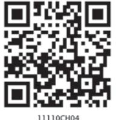
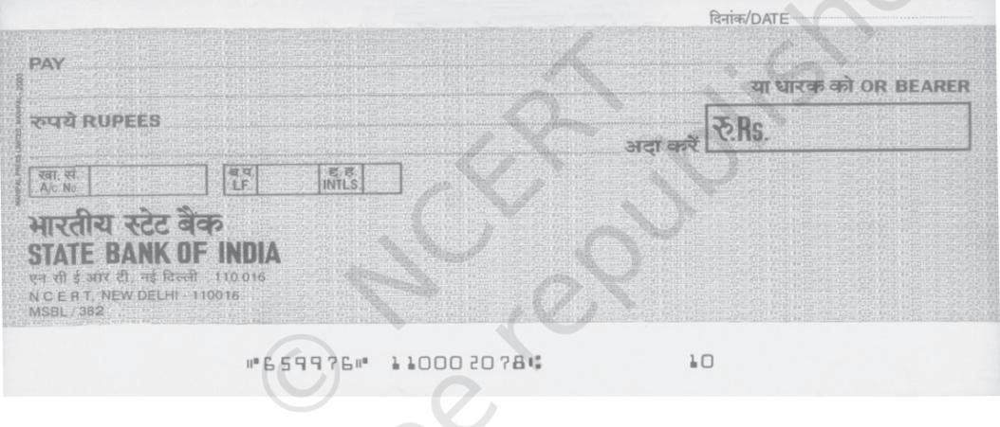
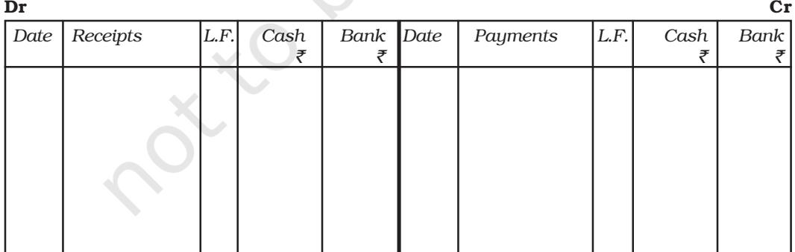
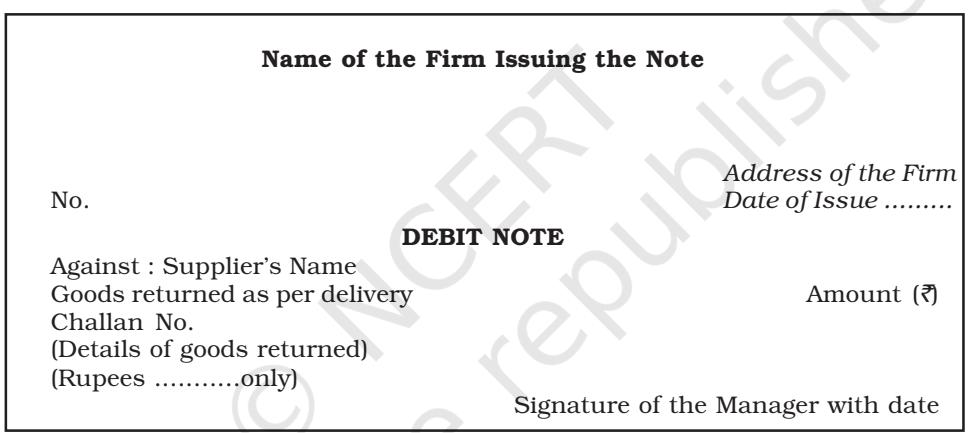
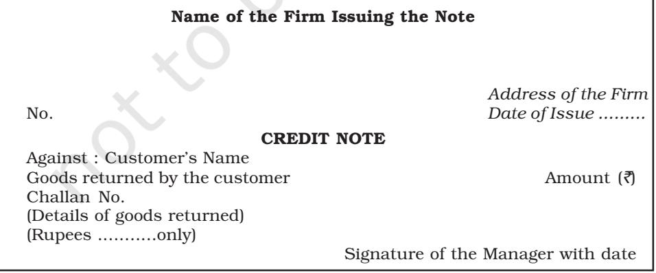

# I n chapter 3, you learnt that all the business transactions are first recorded in the journal and then they are posted in the ledger accounts. A small business may be able to record all its transactions in one book only, i.e., the journal. But as the business expands and the number of transactions becomes large, it may become cumbersome to jour-nalise each transaction. For quick, efficient and accurate recording of business transactions, Journal is sub-divided into special journals. Many of the business transactions are repetitive in nature. They can be easily recorded in special journals, each meant for recording all the transactions of a similar nature. For example, all cash transactions may be recorded in one book, all credit sales transactions in another book and all credit purchases transactions in yet another book and so on. These special journals are also called daybooks or subsidiary books. Transactions that cannot be recorded in any special journal are recorded in journal called the *Journal Proper.* Special journals prove economical and make division of labour possible in accounting work. In this chapter we will discuss the following special purpose books:

- Cash Book
- Purchases Book
- Purchases Return (Return Outwards) Book
- Sales Book
- Sales Return (Return Inwards) Book
- Journal Proper

# LEARNING OBJECTIVES

*After studying this chapter, you will be able to :*

- *• state the need for special purpose books;*
- *• record the transactions in cash book and post them in the ledger;*
- *• prepare the petty cash book;*
- *• record the transactions in the special purpose books;*
- *• post the entries in the special purpose book and to the ledger;*
- *• balance the ledger accounts.*

# 4.1 Cash Book

Cash book is a book in which all transactions relating to cash receipts and cash payments are recorded. It starts with the cash or bank balances at the beginning of the period. Generally, it is made on monthly basis. This is a very popular book and is maintained by all organisations, big or small, profit or not-forprofit. It serves the purpose of both journal as well as the ledger (cash) account. It is also called the *book of original entry*. When a cashbook is maintained, transactions of cash are not recorded in the journal, and no separate account for cash or bank is required in the ledger.

# *4.1.1 Single Column Cash Book*

The single column cash book records all cash transactions of the business in a chronological order, i.e., it is a complete record of cash receipts and cash payments. When all receipts and payments are made in cash by a business organisation only, the cash book contains only one amount column on each (debit and credit) side. The format of single column cash book is shown in figure 4.1.

|  | Cash Book |  |  |  |  |  |  |
| --- | --- | --- | --- | --- | --- | --- | --- |
| Dr. |  |  |  |  |  |  | Cr. |
| Date | Receipts | L.F. | Amount | Date | Payments | L.F. | Amount |
|  |  |  | ` |  |  |  | ` |

Fig. 4.1 : *Format of single column cash book*

Recording of entries in the single column cash book and its balancing is illustrated by an example. Consider the following transactions of M/s Roopa Traders observe how they are recorded in a single column cash book.

| Date | Details | Amount ` |
| --- | --- | --- |
| 2017 |  |  |
| Nov. 01 | Cash in hand | 30,000 |
| Nov. 04 | Cash received from Gurmeet | 12,000 |
| Nov. 08 | Insurance paid (Annual Instalment) | 6,000 |
| Nov. 13 | Purchased furniture | 13,800 |
| Nov. 16 | Sold goods for cash | 28,000 |
| Nov. 17 | Purchased goods from Mudit in cash | 17,400 |
| Nov. 20 | Purchase stationery | 1,100 |
| Nov. 24 | Cash paid to Rukmani in full settlement of account | 12,500 |

| Nov. 27 | Sold goods to Kamal for cash | 18,200 |
| --- | --- | --- |
| Nov. 30 | Paid monthly rent | 2,500 |
| Nov. 30 | Paid salary | 3,500 |
| Nov. 30 | Deposited in bank | 8,000 |

| Dr. |  |  |  |  |  |  | Cr. |
| --- | --- | --- | --- | --- | --- | --- | --- |
| Date | Receipts | L.F. | Amount | Date | Payments | L.F. | Amount |
|  |  |  | ` |  |  |  | ` |
| 2017 |  |  |  | 2017 |  |  |  |
| Nov. 01 | Balance b/d |  | 30,000 | Nov. 08 | Insurance |  | 6,000 |
| Nov. 04 | Gurmeet |  | 12,000 | Nov. 13 | Furniture |  | 13,800 |
| Nov. 16 | Sales |  | 28,000 | Nov. 17 | Purchases |  | 17,400 |
| Nov. 27 | Sales |  | 18,200 | Nov. 20 | Stationery |  | 1,100 |
|  |  |  |  | Nov. 24 | Rukmani |  | 12,500 |
|  |  |  |  | Nov. 30 | Rent |  | 2,500 |
|  |  |  |  | Nov. 30 | Salary |  | 3,500 |
|  |  |  |  | Nov. 30 | Bank |  | 8,000 |
|  |  |  |  | Nov. 30 | Balance c/d |  | 23,400 |
|  |  |  | 88,200 |  |  |  | 88,200 |
| Dec.01 | Balance b/d |  | 23,400 |  |  |  |  |

# Roopa Traders Cash Book

*Posting of the Single Column Cash Book*

As evident from figure 4.1, the left side of the cash book shows the *receipts* of the cash whereas the right side of the cash book shows all the *payments* made in cash. The accounts appearing on then debit side for the cash book are credited in the respective ledger accounts because cash has been received in respect of them. Thus, in our example, an entry 'cash received from Gurmeet' appears on the debit side of the cash book conveys that the cash has been received from Gurmeet. Therefore, in the ledger, Gurmeet's account will be credited by writing 'Cash' in the particulars column on the credit side. Similarly, all the account names appearing on the credit side of the cash book are debited as cash/cheque has been paid in respect of them. Now, notice, how the transactions in our example are posted to the related ledger accounts:

# Books of Roopa Traders Gurmeet's Account

Dr. Cr. *Date Particulars J.F. Amount Date Particulars J.F. Amount* ` ` 2017 Nov.04 Cash 12,000

# Sales Account

| Dr. |  |  |  |  |  |  | Cr. |
| --- | --- | --- | --- | --- | --- | --- | --- |
| Date | Particulars | J.F. | Amount | Date | Particulars | J.F. | Amount |
|  |  |  | ` |  |  |  | ` |
|  |  |  |  | 2017 |  |  |  |
|  |  |  |  | Nov. 16 | Cash |  | 28,000 |
|  |  |  |  | Nov. 27 | Cash |  | 18,200 |

# Insurance Account

| Dr. |  |  |  |  |  |  |  | Cr. |
| --- | --- | --- | --- | --- | --- | --- | --- | --- |
| Date | Particulars | J.F. | Amount | Date | Particulars | J.F. | Amount |  |
|  |  |  | ` |  |  |  |  | ` |
| 2017 |  |  |  |  |  |  |  |  |
| Nov. 08 | Cash |  | 6,000 |  |  |  |  |  |

# Furniture Account

| Dr. |  |  |  |  |  |  | Cr. |
| --- | --- | --- | --- | --- | --- | --- | --- |
| Date | Particulars | J.F. | Amount | Date | Particulars | J.F. | Amount |
|  |  |  | ` |  |  |  | ` |
| 2017 |  |  |  |  |  |  |  |
| Nov. 13 | Cash |  | 13,800 |  |  |  |  |

# Purchases Account

| Dr. |  |  |  |  |  |  |  | Cr. |
| --- | --- | --- | --- | --- | --- | --- | --- | --- |
| Date | Particulars | J.F. | Amount | Date | Particulars | J.F. | Amount |  |
|  |  |  | ` |  |  |  |  | ` |
| 2017 |  |  |  |  |  |  |  |  |
| Nov. 17 | Cash |  | 17,400 |  |  |  |  |  |

|  |  |  |  | Stationery Account |  |  |  |
| --- | --- | --- | --- | --- | --- | --- | --- |
| Dr. |  |  |  |  |  |  | Cr. |
| Date | Particulars | J.F. | Amount | Date | Particulars | J.F. | Amount |
|  |  |  | ` |  |  |  | ` |
| 2017 |  |  |  |  |  |  |  |
| Nov. 20 | Cash |  | 1,100 |  |  |  |  |

| Dr. |  |  |  |  |  |  | Cr. |
| --- | --- | --- | --- | --- | --- | --- | --- |
| Date | Particulars | J.F. | Amount | Date | Particulars | J.F. | Amount |
|  |  |  | ` |  |  |  | ` |
| 2017 |  |  |  |  |  |  |  |
| Nov.24 | Cash |  | 12,500 |  |  |  |  |
|  |  |  |  | Rent Account |  |  |  |
| Dr. |  |  |  |  |  |  | Cr. |
| Date | Particulars | J.F. | Amount | Date | Particulars | J.F. | Amount |
|  |  |  | ` |  |  |  | ` |
| 2017 |  |  |  |  |  |  |  |
| Nov.30 | Cash |  | 2,500 |  |  |  |  |
|  |  |  |  | Salary Account |  |  |  |
| Dr. |  |  |  |  |  |  | Cr. |
| Date | Particulars | J.F. | Amount | Date | Particulars | J.F. | Amount |
|  |  |  | ` |  |  |  | ` |
| 2017 |  |  |  |  |  |  |  |

# Rukmani's Account

# Bank's Account

| Dr. |  |  |  |  |  |  |  | Cr. |
| --- | --- | --- | --- | --- | --- | --- | --- | --- |
| Date | Particulars | J.F. | Amount | Date | Particulars | J.F. | Amount |  |
|  |  |  | ` |  |  |  |  | ` |
| 2017 |  |  |  |  |  |  |  |  |
| Nov.30 | Cash |  | 8,000 |  |  |  |  |  |

# *4.1.2 Double Column Cash Book*

Nov. 30 Cash 3,500

In this type of cash book, there are two columns of amount on each side of the cash book. In fact, now-a-days bank transactions are very large in number. In many organisations, as far as possible, all receipts and payments are affected through bank.

A businessman generally opens a current account with a bank. Bank, do not allow any interest on the balance in current account but charge a small amount, called *incidental charges*, for the services rendered.

For depositing cash/cheques in the bank account, a form has to be filled, which is called a *pay-in-slip*. (refer figure 4.2) It contains a counterfoil also which is returned to the customer (depositor) with the signature of the cashier, as *receipt*.

The bank issues blank cheque forms, to the account holder for withdrawing money. (refer figure 4.3) The depositor writes the name of the party to whom payment is to be made after the words *Pay* printed on the cheque. Cheque

| the case the A 2 Studio Car |  |  | 1000 100 000 For MIT Status or 182014 | THE PRODUCTION THE PERSON FULLING COUNT ENSI-ISLA |
| --- | --- | --- | --- | --- |
|  |  |  |  | and was the recommittee bread procher freed into ward in firm the firms won referbires well wat |
|  |  |  |  | NOTE : Pressuities angerate stipe/for-tensating cases (chemican and states with |
|  |  |  | WEPASS COMM | 10-08-2 1 0 1982 11 15 1 MOTHER |
|  |  |  |  | ACAL # 50 SEE FREEL LACCOUNT ALBUM IN |
| MODINAL BUNCHOS |  |  |  | 21 201 |
|  |  |  |  | road to the consider the line and the states of the states 173 |
| MANYLEN | 1 11 | 12 |  | 度 |
|  |  |  |  | the nearly of creat varied and 14 1.00 |
|  |  |  |  | A 1980 - 1998 - 1992 - 1992 - 1991 - 1985 - 19 3 k |
|  |  |  |  | 20 2 |
|  |  |  |  | 23 0 0.5% |
| 1000 | 中国国际官网 国家 a |  | NET SURN MICH & 10000 | CHARTE MARKET I HORNER BREA 11 1872 15 Channes at FRON 2 1000 |
| 130 | DISPORTEDIOLAS |  | CONNECT CACCLACE FICH . | ANNOR CON THE PROPERTY Control of CONSULTIONAL |

#### Fig. 4.2 : *A pay-in-slip*

Fig. 4.3 : *A cheque*

forms have the printed word bearer, which means payment is to be made to the person whose name has been written after the words "pay" or the *bearer* of the cheques. When the world 'bearer' is struck off by drawing a line, the cheque becomes an *order cheque*. It means payment is to be made to the person whose name is written on the cheque or to his order after proper identification.

Cheques are generally crossed in practice. The payment of a crossed cheque cannot be made direct to the party on the counter. It is to be paid only through a bank. When two parallel lines are drawn across the cheque, it is said to be crossed. The various types of crossing providing different degrees of safety to the payment are shown in figure 4.4.

In case of an *A/c payee only* crossing, the amount of the cheque can be deposited only in the account of the person whose name appears on the cheque. When the name of the bank is written between two parallel lines, it becomes a *special crossing* and the payment can be made only to the bank whose name has been written between the two lines.

Though this is rarely done, a cheque can be transferred by the payee (the person in whose favour the cheque has been drawn) to another person, if it is not crossed *A/c payee only*. A bearer cheque can be passed on by mere delivery. An *order cheque* can be transferred by endorsement and delivery. *Endorsement* means the writing of instructions to pay the cheque to a particular person and then singing it on the back of the cheque.

*& Co. Not Negotiable A/c Payee Only State Bank of India, New Delhi*

Fig. 4.4 : *Types of crossing*

When the number of bank transactions is large; it is convenient to have a separate amount column for bank transactions in the cash book itself instead of recording them in the journal. This helps in getting information about the position of the bank account from time to time. Just like cash transactions, all payments into the bank are recorded on the left side and all withdrawals/payments through the bank are recorded on the right side. When cash is deposited in the bank or cash is withdrawn from the bank, both the entries are recorded in the cash book. This is so because both aspects of the transaction appear in the cash book itself. When cash is paid into the bank, the amount deposited is written on the left side in the bank column and at the same time the same amount is entered on the right side in the cash column. The reverse entries are recorded when cash is withdrawn from the bank for use in the office. Against such entries the word C, which stands for *contra* is written in the L.F. column indicating that these entries are not to be posted to the ledger account.

The bank column is balanced in the same way as the cash column. However, in the bank column, there can be credit balance also because of overdraft taken from the bank. *Overdraft* is a situation when cash withdrawn from the bank exceeds the amount of deposit. Entries in respect of cheques received should be made in the bank column of the cash book. When a cheque is received, it may be deposited into the bank on the same day or it may be deposited on another day. In case, it is deposited on the same day the amount is recorded in the bank column of the cash book on the receipts side. If the cheque is deposited on another day, in that case, on the date of receipt it is treated as cash received and hence recorded in the cash column on the receipts side. On the day of deposit to the bank, it is shown in the Bank Column on receipt (Dr.) side and in the Cash Column on the payment (Cr.) side. This is a *contra entry*.

If a cheque received from a customer is dishonoured, the bank will return the dishonoured cheque and debit the firm's account. On receipt of such cheque or intimation from the bank, the firm will make an entry on the credit side of the cash book by entering the amount of the dishonoured cheque in the bank column and the name of the customer in the particulars column. This entry will restore the position prevailing before the receipt of the cheque form the customer and its deposit in the bank. Dishonour of a cheque means return of the cheque unpaid, generally due to insufficient funds in the customer's account with the bank.

If the bank debits the firm on account of interest, commission or other charges for bank services, the entry will be made on the credit side in bank column. If the bank credits the firm's account, the entry will be made on the debit side of the cash book in the appropriate column. The format of double column cash book is shown in figure 4.5.

Cash Book

Fig. 4.5 : *Format of a double column cashbook*

We will now learn how the transactions are recorded in the double column cash book.

Consider the following example:

The following transactions related to M/s Tools India :

| Date | Details | Amount ` |
| --- | --- | --- |
| 2017 |  |  |
| Sept. 01 | Bank balance | 42,000 |
| Sept. 01 | Cash balance | 15,000 |
| Sept. 04 | Purchased goods by cheque | 12,000 |
| Sept. 08 | Sales of goods for cash | 6,000 |
| Sept. 13 | Purchased machinery by cheque | 5,500 |
| Sept. 16 | Sold goods and received cheque (deposited same day) | 4,500 |
| Sept. 17 | Purchase goods from Mriaula in cash | 17,400 |
| Sept. 20 | Purchase stationery by cheque | 1,100 |
| Sept. 24 | Cheque given to Rohit | 1,500 |
| Sept. 27 | Cash withdrawn from bank | 10,000 |
| Sept. 30 | Rent paid by cheque | 2,500 |
| Sept. 30 | Paid salary | 3,500 |

The double column cash book based upon above business transactions will prepared as follows :

# Cash Book

| Dr. |  |  |  |  |  |  |  |  | Cr. |
| --- | --- | --- | --- | --- | --- | --- | --- | --- | --- |
| Date | Receipts | L.F. | Cash | Bank | Date | Payments | L.F. | Cash | Bank |
|  |  |  | ` | ` |  |  |  | ` | ` |
| 2017 |  |  |  |  | 2017 |  |  |  |  |
| Sept. |  |  |  |  | Sept. |  |  |  |  |
| 01 | Balance b/d |  | 15,000 | 42,000 | 04 | Purchases |  |  | 12,000 |
| 08 | Sales |  | 6,000 |  | 13 | Machine |  |  | 5,500 |
| 16 | Sales |  |  | 4,500 | 17 | Purchase |  | 17,400 |  |
| 27 | Bank | C | 10,000 |  | 20 | Stationery |  |  | 1,100 |
|  |  |  |  |  | 24 | Rohit |  |  | 1,500 |
|  |  |  |  |  | 27 | Cash | C |  | 10,000 |
|  |  |  |  |  | 30 | Rent |  |  | 2,500 |
|  |  |  |  |  | 30 | Salary |  | 3,500 |  |
|  |  |  |  |  | 30 | Balance c/d |  | 10,100 | 13,900 |
|  |  |  | 31,000 | 46,500 |  |  |  | 31,000 | 46,500 |
| Oct. |  |  |  |  |  |  |  |  |  |
| 01 | Balance b/d |  | 10,100 | 13,900 |  |  |  |  |  |

When the bank column is maintained in the cash book, the bank account also is not opened in the ledger. The bank column serves the purpose of the bank account. Entries marked C (being contra entries as explained earlier) are ignored while posting from the cash book to the ledger. These entries represent debit or credit of cash account against the bank account or vice-versa. We will now see how the transactions recorded in double column cash book are posted to the individual accounts.

# Purchases Account

| Receipts |  |  |  |  |  |  | Payments |
| --- | --- | --- | --- | --- | --- | --- | --- |
| Date | Particulars | J.F. | Amount | Date | Particulars | J.F. | Amount |
|  |  |  | ` |  |  |  | ` |
| 2017 |  |  |  |  |  |  |  |
| Sept.04 | Bank |  | 12,000 |  |  |  |  |
| Sept. 17 | Cash |  | 17,400 |  |  |  |  |

# Sales Account

| Receipts |  |  |  |  |  |  | Payments |
| --- | --- | --- | --- | --- | --- | --- | --- |
| Date | Particulars | J.F. | Amount | Date | Particulars | J.F. | Amount |
|  |  |  | ` |  |  |  | ` |
|  |  |  |  | 2017 |  |  |  |
|  |  |  |  | Sept. 08 | Cash |  | 6,000 |
|  |  |  |  | Sept. 16 | Bank |  | 4,500 |

# Machinery Account

| Receipts |  |  |  |  |  |  | Payments |
| --- | --- | --- | --- | --- | --- | --- | --- |
| Date | Particulars | J.F. | Amount | Date | Particulars | J.F. | Amount |
|  |  |  | ` |  |  |  | ` |
| 2017 |  |  |  |  |  |  |  |
| Sept. 13 | Bank |  | 5,500 |  |  |  |  |

# Stationery Account

| Receipts |  |  |  |  |  |  | Payments |
| --- | --- | --- | --- | --- | --- | --- | --- |
| Date | Particulars | J.F. | Amount | Date | Particulars | J.F. | Amount |
|  |  |  | ` |  |  |  | ` |
| 2017 |  |  |  |  |  |  |  |
| Sept.20 | Bank |  | 1,100 |  |  |  |  |

| Receipts |  |  |  |  |  |  | Payments |
| --- | --- | --- | --- | --- | --- | --- | --- |
| Date | Particulars | J.F. | Amount | Date | Particulars | J.F. | Amount |
|  |  |  | ` |  |  |  | ` |
| 2017 |  |  |  |  |  |  |  |
| Sept.24 | Bank |  | 1,500 |  |  |  |  |

Rohit's Account

#### Rent Account

| Receipts |  |  |  |  |  |  | Payments |
| --- | --- | --- | --- | --- | --- | --- | --- |
| Date | Particulars | J.F. | Amount | Date | Particulars | J.F. | Amount |
|  |  |  | ` |  |  |  | ` |
| 2017 |  |  |  |  |  |  |  |
| Sept.30 | Bank |  | 2,500 |  |  |  |  |

#### Salary Account

| Receipts |  |  |  |  |  |  | Payments |
| --- | --- | --- | --- | --- | --- | --- | --- |
| Date | Particulars | J.F. | Amount | Date | Particulars | J.F. | Amount |
|  |  |  | ` |  |  |  | ` |
| 2017 |  |  |  |  |  |  |  |
| Sept.30 | Cash |  | 3,500 |  |  |  |  |

# *4.1.3 Petty Cash Book*

In every organisation, a large number of small payments such as conveyance, cartage, postage, telegrams and other expenses (collectively recorded under miscellaneous expenses) are made. These are generally repetitive in nature. If all these payments are handled by the cashier and are recorded in the main cash book, the procedure is found to be very cumbersome. The cashier may be overburdened and the cash book may become very bulky. To avoid this, large organisations normally appoint one more cashier (petty cashier) and maintain a separate cash book to record these transactions. Such a cash book maintained by petty cashier is called petty cash book.

The petty cashier works on the *Imprest system*. Under this system, a definite sum, say ` 2,000 is given to the petty cashier at the beginning of a certain period. This amount is called imprest amount. The petty cashier goes on making all small payments out of this imprest amount and when he has spent the substantial portion of the imprest amount say `1,780, he gets reimbursement of the amount spent from the head cashier. Thus, he again has the full imprest amount in the beginning of the next period. The reimbursement may be made on a weekly, fortnightly or monthly basis, depending on the frequency of small payments. (In certain cases, the petty cash system is operated through the main cash book itself. In such instances, the petty cash book is not maintained independently.)

The petty cash book generally has a number of columns for the amount on the payment side (credit) besides the first other amount column. Each of the amount columns is allotted for items of specific payments, which are most common. The last amount column is designated as 'Miscellaneous' followed by a 'Remarks' column. In the miscellaneous column those payments are recorded for which a separate column does not exist. In the 'Remarks' the nature of payment is recorded. At the end of the period, all amount columns are totaled. The total amount column l shows the total amount spent and to be reimbursed. On the receipt (debit) side, there is only one amount column. Columns for the date, voucher number and particulars are common for both receipts and payments.

# Box 1 Advantages of Maintaining Petty Cash Book

- 1. *Saving of Time and efforts of chief cashier*: The chief cashier is not required to deal with petty disbursements. He can concentrate on cash transactions involving large amount of cash. It saves time and labour and helps chief cashier to discharge his duties more effectively
- 2. *Effective control over cash disbursements:* Cash control becomes easy because of division of work. The head cashier can control big payments directly and petty payments by keeping a proper check on the petty cashier. This way the chances of making frauds and embezzlements become very difficult.
- 3. *Convenient recording:* Recording of petty disbursements in the main cash book makes it bulky and unmanageable. Further, the materiality principle requires that insignificant details need not be given in the main cashbook. This way the cash book reveals only material and useful information.

Recording of such small payments becomes easy as the totals of different types of expenses are posted to ledger. It also saves time and effort of posting individual items in the ledger. In nutshell it can be stated that preparation of petty cash book is a cost reduction control measure.

For example, Mr. Mohit, the petty cahier of M/s Samaira Traders received Rupees 2,000 on May 01, 2017 from the Head Cashier. For the month, details of petty expenses are listed here under:

| Date | Details | Amount |
| --- | --- | --- |
|  |  | ` |
| 2017 |  |  |
| May |  |  |
| 02 | Auto fare | 55 |
| 03 | Courier services | 40 |
| 04 | Postal stamps | 105 |
| 05 | Erasers/Sharpeners/Pencils/Pads | 225 |
| 06 | Speed post charges | 98 |
| 08 | Taxi fare (`105 + `90) | 195 |
| 08 | Refreshments | 85 |
| 10 | Auto fare | 60 |
| 12 | Registered postal charges | 42 |
| 13 | Telegram | 34 |
| 14 | Cartage | 25 |
| 16 | Computer stationery | 165 |
| 19 | Bus fare | 24 |
| 19 | STD call charges | 87 |
| 20 | Office sanitation including disinfectant (` 36 + ` 24) | 60 |
| 22 | Refreshment | 45 |
| 23 | Photo stating charges | 47 |
| 28 | Courier services | 40 |
| 29 | Unloading charges | 40 |
| 30 | Bus fare | 15 |

# *Posting from the Petty Cash Book*

The petty cash book is balanced periodically. The difference between the total receipts and total payments is the balance with the petty cashier. The balance is carried to the next period and the petty cashier is paid the amount actually spent. A petty cash account is opened in the ledger. It is debited with the amount given to petty cashier. Each expense account is individually debited with the periodic total as per the respective column by writing "petty cash account" and the petty cash account is credited with the total expenditure incurred during the period by writing sundries as per petty cash book. The petty cash account is balanced. It reflect the actual cash with the petty cashier.

The petty cash book for the month will be prepared as follows :

Book of Samaira Traders

Petty Cash Book

| la | he | ly | f | Am | t | Da | te | Pa | t | icu | Vo | Am | t | An | is | Pa | ts | ou | n | r | rs | uc | r | ou | n | a | s | o | y | m | en | Re | d | No | d | ive | i |
| --- | --- | --- | --- | --- | --- | --- | --- | --- | --- | --- | --- | --- | --- | --- | --- | --- | --- | --- | --- | --- | --- | --- | --- | --- | --- | --- | --- | --- | --- | --- | --- | --- | --- | --- | --- | --- | --- |
| ce | p | a | . |  |  |  |  |  |  |  |  |  |  |  |  |  |  |  |  |  |  |  |  |  |  |  |  |  |  |  |  |  |  |  |  |  |  |
| ` | ` | 2 | 0 | lep | ho | Co | S | 1 | 7 | Po | ta | Te | ta | t | ion | M | is | s | g | e | ne | nv | ey | an | ce | er | y | c. | & | leg | M | Te |  |  |  |  |  |
| ay | ra | m | h | d | 2, | 0 | 0 | 0 | 0 | 1 | Ca | iv | s | re | ce | e |  |  |  |  |  |  |  |  |  |  |  |  |  |  |  |  |  |  |  |  |  |
| fa | 5 | 5 | 5 | 5 | 0 | 2 | Au | to | re | 0 | 3 | Co | 4 | 0 | 4 | 0 | ie | ic |  |  |  |  |  |  |  |  |  |  |  |  |  |  |  |  |  |  |  |
| ur | r | se | rv | es | l s | 5 | 5 | 0 | 4 | Po | 1 | 0 | 1 | 0 | ta | ta |  |  |  |  |  |  |  |  |  |  |  |  |  |  |  |  |  |  |  |  |  |
| s | m | p | s | 5 | / | ha | 5 | 5 | 0 | Er | S | 2 | 2 | 2 | 2 |  |  |  |  |  |  |  |  |  |  |  |  |  |  |  |  |  |  |  |  |  |  |
| as | er | s | rp | en | er | s | / | ls | Pe | i |  |  |  |  |  |  |  |  |  |  |  |  |  |  |  |  |  |  |  |  |  |  |  |  |  |  |  |
| nc | d | ha | 0 | 6 | Sp | t c | 9 | 8 | 9 | 8 |  |  |  |  |  |  |  |  |  |  |  |  |  |  |  |  |  |  |  |  |  |  |  |  |  |  |  |
| rg | ee | p | os | es | fa | ( | 5 | ) | 5 | 5 | 0 | 8 | Ta | 1 | 0 | 9 | 0 | 1 | 9 | 1 | 9 | i | + | x | re |  |  |  |  |  |  |  |  |  |  |  |  |
| fre | 0 | 8 | hm | 8 | 5 | 8 | 5 | Re | ts | s | en | fa | 1 | 0 | Au | 6 | 0 | 6 | 0 | to |  |  |  |  |  |  |  |  |  |  |  |  |  |  |  |  |  |
| re | d | l | 1 | 2 | Re | te | ta | 4 | 2 | 4 | 2 | is |  |  |  |  |  |  |  |  |  |  |  |  |  |  |  |  |  |  |  |  |  |  |  |  |  |
| g | re | p | os | ha | rg | c | es |  |  |  |  |  |  |  |  |  |  |  |  |  |  |  |  |  |  |  |  |  |  |  |  |  |  |  |  |  |  |
| le | 1 | 3 | Te | 3 | 4 | 3 | 4 | g | ra | m | 5 | 5 | 1 | 4 | Ca | ta | 2 | 2 |  |  |  |  |  |  |  |  |  |  |  |  |  |  |  |  |  |  |  |
| g | r | e | 6 | Co | 6 | 5 | 6 | 5 | 1 | te | ta | t | io | 1 | 1 | m | p | u | r | s | ne | ry |  |  |  |  |  |  |  |  |  |  |  |  |  |  |  |
| fa | 9 | 2 | 2 | 1 | Bu | 4 | 4 | s | re | l | l c | ha | 1 | 9 | S | T | D | 8 | 7 | 8 | 7 |  |  |  |  |  |  |  |  |  |  |  |  |  |  |  |  |
| rg | ca | es | f | f | 2 | 0 | O | ta | t | 6 | 0 | 6 | 0 | ic | i | io | e | sa | n | n |  |  |  |  |  |  |  |  |  |  |  |  |  |  |  |  |  |
| fe | lu | d | d | in | in | is | in | ta | t | g | c | c | n | ( | ) | 3 | 6 | +2 | 4 |  |  |  |  |  |  |  |  |  |  |  |  |  |  |  |  |  |  |
| 2 | 2 | fre | hm | 5 | 5 | Re | t | 4 | 4 | s | en | 2 | 3 | ho | ha | P | to | ta | t | in | 4 | 7 | 4 | 7 |  |  |  |  |  |  |  |  |  |  |  |  |  |
| g | rg | s | c | es | 2 | 8 | Co | 4 | 0 | 4 | 0 | ie | ic | ur | r | se | rv | es |  |  |  |  |  |  |  |  |  |  |  |  |  |  |  |  |  |  |  |
| lo | d | ha | 2 | 9 | Un | 4 | 0 | 4 | 0 | in | g | rg | a | c | es | fa | 3 | 0 | 5 | 5 | Bu | 1 | 1 |  |  |  |  |  |  |  |  |  |  |  |  |  |  |
| s | re |  |  |  |  |  |  |  |  |  |  |  |  |  |  |  |  |  |  |  |  |  |  |  |  |  |  |  |  |  |  |  |  |  |  |  |  |
| 5 | 1, | 4 | 8 | 7 | 3 | 2 | 1 | 2 | 1 | 3 | 4 | 9 | 3 | 9 | 0 | 3 | 0 | 2 |  |  |  |  |  |  |  |  |  |  |  |  |  |  |  |  |  |  |  |
| 3 | 1 | Ba | la | / | d | 5 | 1 | 3 | nc | e | c | 2, | 0 | 0 | 0 | 2, | 0 | 0 | 0 |  |  |  |  |  |  |  |  |  |  |  |  |  |  |  |  |  |  |
| Ju | n. | 5 | la | b | / | d | 1 | 3 | 0 | 1 | Ba |  |  |  |  |  |  |  |  |  |  |  |  |  |  |  |  |  |  |  |  |  |  |  |  |  |  |
| nc | e | h | d | 1, | 4 | 8 | 7 | 0 | 1 | Ca | iv |  |  |  |  |  |  |  |  |  |  |  |  |  |  |  |  |  |  |  |  |  |  |  |  |  |  |
| s | re | ce | e |  |  |  |  |  |  |  |  |  |  |  |  |  |  |  |  |  |  |  |  |  |  |  |  |  |  |  |  |  |  |  |  |  |  |

112

Accountancy

| Date | Particulars |  | L.F. | Debit | Credit |
| --- | --- | --- | --- | --- | --- |
|  |  |  |  | Amount | Amount |
|  |  |  |  | ` | ` |
| 2017 |  |  |  |  |  |
| May 01 | Petty cash A/c | Dr. |  | 2,000 |  |
|  | To Cash A/c |  |  |  | 2,000 |
|  | (Cash paid to petty cashier) |  |  |  |  |
| May 31 | Postage A/c | Dr. |  | 325 |  |
|  | Telephone & Telegram A/c | Dr. |  | 121 |  |
|  | Conveyance A/c | Dr. |  | 349 |  |
|  | Stationary A/c | Dr. |  | 390 |  |
|  | Miscellaneous expenses A/c | Dr. |  | 302 |  |
|  | To Petty cash A/c |  |  |  | 1,487 |
|  | (Petty expenses posted to petty |  |  |  |  |
|  | cash account) |  |  |  |  |
|  | Petty cash A/c | Dr. |  | 1,487 |  |
|  | To Cash A/c |  |  |  | 1,487 |
|  | (Cash paid to petty cashier) |  |  |  |  |

# Books of Samaira Traders Journal

# Petty Cash Account

| Dr. |  |  |  |  |  |  | Cr. |
| --- | --- | --- | --- | --- | --- | --- | --- |
| Date | Particulars | J.F. | Amount | Date | Particulars | J.F. | Amount |
|  |  |  | ` |  |  |  | ` |
| 2017 |  |  |  | 2017 |  |  |  |
| May 01 | Cash |  | 2,000 | May 31 | Sundries as |  | 1,487 |
|  |  |  |  |  | per petty cash |  |  |
|  |  |  |  |  | book |  |  |
|  |  |  |  | May 31 | Balance c/d |  | 513 |
|  |  |  | 2,000 |  |  |  | 2,000 |
| Jun. 01 | Balance b/d |  | 513 |  |  |  |  |
| Jun. 01 | Cash |  | 1,487 |  |  |  |  |

# Books of Samaria Traders Postage Account

| Dr. |  |  |  |  |  |  |  | Cr. |
| --- | --- | --- | --- | --- | --- | --- | --- | --- |
| Date | Particulars | J.F. | Amount | Date | Particulars | J.F. | Amount |  |
|  |  |  | ` |  |  |  |  | ` |
| 2017 |  |  |  |  |  |  |  |  |
| May 31 | Petty cash |  | 325 |  |  |  |  |  |

# Telephone and Telegram Account

| Dr. |  |  |  |  |  |  |  | Cr. |
| --- | --- | --- | --- | --- | --- | --- | --- | --- |
| Date | Particulars | J.F. | Amount | Date | Particulars | J.F. | Amount |  |
|  |  |  | ` |  |  |  |  | ` |
| 2017 |  |  |  |  |  |  |  |  |
| May 31 | Petty cash |  | 121 |  |  |  |  |  |

| 14 |
| --- |

| Dr. |  |  |  |  |  |  |  | Cr. |
| --- | --- | --- | --- | --- | --- | --- | --- | --- |
| Date | Particulars | J.F. | Amount | Date | Particulars | J.F. | Amount |  |
|  |  |  | ` |  |  |  |  | ` |
| 2017 |  |  |  |  |  |  |  |  |
| May 31 | Petty cash |  | 349 |  |  |  |  |  |

# Conveyance Account

# Stationery Account

| Dr. |  |  |  |  |  |  |  | Cr. |
| --- | --- | --- | --- | --- | --- | --- | --- | --- |
| Date | Particulars | J.F. | Amount | Date | Particulars | J.F. | Amount |  |
|  |  |  | ` |  |  |  |  | ` |
| 2017 |  |  |  |  |  |  |  |  |
| May 31 | Petty cash |  | 390 |  |  |  |  |  |

# Miscellaneous Expenses Account

| Dr. |  |  |  |  |  |  |  | Cr. |
| --- | --- | --- | --- | --- | --- | --- | --- | --- |
| Date | Particulars | J.F. | Amount | Date | Particulars | J.F. | Amount |  |
|  |  |  | ` |  |  |  |  | ` |
| 2017 |  |  |  |  |  |  |  |  |
| May 31 | Petty cash |  | 302 |  |  |  |  |  |

# *4.1.4 Balancing of Cash Book*

On the left side, all cash transactions relating to cash receipts (debits) and on the right side all transactions relating to cash payments (credits) are entered date-wise. When a cash book is maintained, a separate cash book in the ledger is not opened. The cash book is balanced in the same way as an account in the ledger. But it may be noted that in the case of the cash book, there will always be debit balance because cash payments can never exceed cash receipts and cash in hand at the beginning of the period.

The source document for cash receipts is generally the duplicate copy of the receipt issued by the cashier. For payment, any document, invoice, bill, receipt, etc., on the basis of which payment has been made, will serve as a source document for recording transactions in the cash book. When payment has been made, all these documents, popularly known as vouchers, are given a serial number and filed in a separate file for future reference and verification.

# *Illustration 1*

From the following transactions made by M/s Kuntia Traders, prepare the single column cashbook.

| Date | Details | Amount |
| --- | --- | --- |
|  |  | ` |
| 2017 |  |  |
| Sept. 01 | Cash in hand | 40,000 |
| Sept. 02 | Deposited in bank | 16,000 |
| Sept. 04 | Received from Puneet in full settlement of claim | 11,700 |
|  | of ` 12,000. |  |
| Sept. 05 | Cash paid to Rukmani in full settlement of claim of | 6,850 |
|  | `7,000 |  |
| Sept. 06 | Sold goods to Sudhir for cash | 14,800 |
| Sept. 06 | Paid quarterly insurance premium on policy for | 2,740 |
|  | proprietor's wife |  |
| Sept. 07 | Purchased office furniture | 8,000 |
| Sept. 07 | Purchased stationery | 1,700 |
| Sept. 07 | Paid cartage | 120 |
| Sept. 10 | Paid Kamal, discount allowed by him ` 200 | 6,800 |
| Sept. 11 | Received from Gurmeet, discount allowed to him `500 | 14,500 |
| Sept. 12 | Amount withdrawn for house hold use | 5,000 |
| Sept. 14 | Electricity bill paid | 1,160 |
| Sept. 17 | Goods sold for cash | 23,000 |
| Sept. 21 | Bought goods from Kamal on cash basis | 17,000 |
| Sept. 24 | Paid telephone charges | 2,300 |
| Sept. 26 | Paid postal charges | 520 |
| Sept. 28 | Paid monthly rent | 4,200 |
| Sept. 29 | Paid monthly wages and salary | 8,250 |
| Sept. 29 | Bought goods for cash | 11,000 |
| Sept. 30 | Sold goods for cash | 15,600 |

*Solution*

# Books of Kuntia Traders Cash Book

| Dr |  |  |  |  |  |  | Cr |
| --- | --- | --- | --- | --- | --- | --- | --- |
| Date | Receipts | L.F. | Amount | Date | Payments | L.F. | Amount |
|  |  |  | ` |  |  |  | ` |
| 2017 |  |  |  | 2017 |  |  |  |
| Sept. 01 | Balance b/d |  | 40,000 | Sept. 02 | Bank |  | 16,000 |
| Sept. 04 | Puneet |  | 11,700 | Sept. 05 | Rukmani |  | 6,850 |
| Sept. 06 | Sales |  | 14,800 | Sept. 06 | Drawings |  | 2,740 |
| Sept. 11 | Gurmeet |  | 14,500 | Sept. 07 | Office furniture |  | 8,000 |
| Sept. 17 | Sales |  | 23,000 | Sept. 07 | Stationery |  | 1,700 |
| Sept. 30 | Sales |  | 15,600 | Sept. 07 | Cartage |  | 120 |
|  |  |  |  | Sept. 10 | Kamal |  | 6,800 |
|  |  |  |  | Sept. 12 | Drawings |  | 5000 |
|  |  |  |  | Sept. 14 | Electric charges |  | 1,160 |
|  |  |  |  | Sept. 21 | Purchases |  | 17,000 |

|  |  |  | Sept. 24 | Telephone | 2,300 |
| --- | --- | --- | --- | --- | --- |
|  |  |  |  | charges |  |
|  |  |  | Sept. 28 | Postal charges | 520 |
|  |  |  | Sept. 29 | Rent | 4,200 |
|  |  |  | Sept. 29 | Wages & Salary | 8,250 |
|  |  |  | Sept. 30 | Purchases | 11,000 |
|  |  |  | Sept. 30 | Balance c/d | 27,960 |
|  |  | 1,19,600 |  |  | 1,19,600 |
| Oct. 01 | Balance b/d | 27,960 |  |  |  |

# *Illustration 2*

Record the following transactions in double column cash book and balance it.

| Date | Details | Amount |
| --- | --- | --- |
|  |  | ` |
| 2017 |  |  |
| Aug. 01 | Cash balance | 15,000 |
|  | Bank balance | 10,000 |
| Aug. 03 | Paid insurance premium by cheque | 4,200 |
| Aug. 08 | Cash sales | 22,000 |
|  | Cash discount | 750 |
| Aug. 09 | Payment for cash purchases | 21,000 |
|  | Cash discount | 700 |
| Aug. 09 | Cash deposited in bank | 15,000 |
| Aug. 10 | Telephone bill paid by cheque | 2,300 |
| Aug. 14 | Withdrawn from bank for personal use | 6,000 |
| Aug. 16 | Withdrawn from bank office use | 14,500 |
| Aug. 20 | Received cheque from John in full and final settlement | 10,700 |
|  | and deposited the same in the bank |  |
| Aug. 23 | Received cash from Michael | 6,850 |
|  | Discount allowed | 150 |
| Aug. 24 | Stationery purchased for cash | 1,800 |
| Aug. 25 | Cartage paid in cash | 350 |
| Aug. 25 | Cheque received from Kumar | 4,500 |
| Aug. 28 | Cheque received from Kumar deposited in Bank | 4,500 |
| Aug. 31 | Cheque deposited on Aug. 28 dishonoured and returned by the bank |  |
| Aug. 31 | Rent paid by cheque | 4,000 |
| Aug. 31 | Paid wages to the watchman in cash | 3,000 |
| Aug. 31 | Paid cash for postage | 220 |

*Solution*

# Cash Book

| Dr. |  |  |  |  |  |  |  |  | Cr. |
| --- | --- | --- | --- | --- | --- | --- | --- | --- | --- |
| Date | Receipts | L.F. | Cash | Bank | Date | Payments | L.F. | Cash | Bank |
|  |  |  | ` | ` |  |  |  | ` | ` |
| 2017 |  |  |  |  | 2017 |  |  |  |  |
| Aug. |  |  |  |  | Aug. |  |  |  |  |
| 01 | Balance b/d |  | 15,000 | 10,000 | 03 | Insurance |  |  | 4,200 |
| 08 | Sales |  | 22,000 |  | 09 | Purchases |  | 21,000 |  |
| 09 | Cash | C |  | 15,000 | 09 | Bank | C | 15,000 |  |
| 16 | Bank | C | 14,500 |  | 10 | Telephone |  |  | 2,300 |
|  |  |  |  |  |  | expenses |  |  |  |
| 20 | John |  |  | 10,700 | 14 | Drawings |  |  | 6,000 |
| 23 | Michael |  | 6,850 |  | 16 | Cash | C |  | 14,500 |
| 25 | Kumar |  | 4,500 |  | 24 | Printing and |  | 1,800 |  |
|  |  |  |  |  |  | stationery |  |  |  |
| 28 | Cash | C |  | 4,500 | 25 | Cartage |  | 350 |  |
| 31 | Balance c/d |  |  | 6,000 | 28 | Bank | C | 4,500 |  |
|  |  |  |  |  | 31 | Kumar |  |  | 4,500 |
|  |  |  |  |  | 31 | Rent |  |  | 4,000 |
|  |  |  |  |  | 31 | Wages |  | 3,000 |  |
|  |  |  |  |  | 31 | Postage |  | 220 |  |
|  |  |  |  |  | 31 | Balance c/d |  | 16,980 | 4,700 |
|  |  |  | 62,850 | 40,200 |  |  |  | 62,850 | 40,200 |
| Sept. |  |  |  |  |  |  |  |  |  |
| 01 | Balance b/d |  | 16,980 | 4,700 |  |  |  |  |  |

# *Illustration 3*

Prepare bank column cash book from the following tansactions of M/s Laser Zone for the month of January 2014 and post them to the related ledger accounts :

| Date | Details | Amount |
| --- | --- | --- |
|  |  | ` |
| 2017 |  |  |
| Jan. 01 | Cash in hand | 4,000 |
|  | Bank overdraft | 3,200 |
| Jan. 04 | Wage paid | 400 |
| Jan. 05 | Cash sales | 7,000 |
| Jan. 07 | Purchased goods by cheque | 2,000 |
| Jan. 09 | Purchased furniture for cash | 2,200 |
| Jan. 11 | Cash paid to Rohit | 2,000 |
| Jan. 13 | Cash sales | 4,500 |
| Jan. 14 | Deposited into bank | 7,000 |
| Jan. 16 | Bank charged interest on overdraft | 200 |

| Jan. 20 | Paid telephone bill by cheque | 600 |
| --- | --- | --- |
| Jan. 25 | Sale of goods and received cheque | 3,000 |
|  | (deposited same day) |  |
| Jan. 27 | Paid rent | 800 |
| Jan. 29 | Drew cash for personal use | 500 |
| Jan. 30 | Paid salary | 1,000 |
| Jan. 31 | Interest collected by bank | 1,700 |

*Solution*

| Dr. |  |  |  |  |  |  |  |  | Cr. |
| --- | --- | --- | --- | --- | --- | --- | --- | --- | --- |
| Date | Receipts | L.F. | Cash | Bank | Date | Payments | L.F. | Cash | Bank |
|  |  |  | ` | ` |  |  |  | ` | ` |
| 2017 |  |  |  |  | 2017 |  |  |  |  |
| Jan. |  |  |  |  | Jan. |  |  |  |  |
| 01 | Balance b/d |  | 4,000 |  | 01 | Balance b/d |  |  | 3,200 |
| 05 | Sales |  | 7,000 |  | 04 | Wages |  | 400 |  |
| 13 | Sales |  | 4,500 |  | 07 | Purchase |  |  | 2,000 |
| 14 | Cash | C |  | 7,000 | 09 | Furniture |  | 2,200 |  |
| 25 | Sales |  |  | 3,000 | 11 | Rohit |  | 2,000 |  |
| 31 | Interest |  |  | 1,700 | 14 | Bank | C | 7,000 |  |
|  |  |  |  |  | 16 | Overdraft |  |  | 200 |
|  |  |  |  |  |  | interest |  |  |  |
|  |  |  |  |  | 20 | Telephone |  |  | 600 |
|  |  |  |  |  | 27 | Rent |  | 800 |  |
|  |  |  |  |  | 29 | Drawings |  | 500 |  |
|  |  |  |  |  | 30 | Salary |  | 1,000 |  |
|  |  |  |  |  | 01 | Balance c/d |  | 1,600 | 5,700 |
|  |  |  | 15,500 | 11,700 |  |  |  | 15,500 | 11,700 |
| Oct. |  |  |  |  |  |  |  |  |  |
| 01 | Balance b/d |  | 1,600 | 5,700 |  |  |  |  |  |

# Books of Laser Zone Cash Book

# Wages Account

| Dr. |  |  |  |  |  |  |  | Cr. |
| --- | --- | --- | --- | --- | --- | --- | --- | --- |
| Date | Particulars | J.F. | Amount | Date | Particulars | J.F. | Amount |  |
|  |  |  | ` |  |  |  |  | ` |
| 2017 |  |  |  |  |  |  |  |  |
| Jan.04 | Cash |  | 400 |  |  |  |  |  |

# Sales Account

| Dr. |  |  |  |  |  |  | Cr. |
| --- | --- | --- | --- | --- | --- | --- | --- |
| Date | Particulars | J.F. | Amount | Date | Particulars | J.F. | Amount |
|  |  |  | ` |  |  |  | ` |
|  |  |  |  | 2017 |  |  |  |
|  |  |  |  | Jan. 05 | Cash |  | 7,000 |
|  |  |  |  | Jan.13 | Cash |  | 4,500 |
|  |  |  |  | Jan.25 | Bank |  | 3,000 |

# Purchases Account

| Dr. |  |  |  |  |  |  |  | Cr. |
| --- | --- | --- | --- | --- | --- | --- | --- | --- |
| Date | Particulars | J.F. | Amount | Date | Particulars | J.F. | Amount |  |
|  |  |  | ` |  |  |  |  | ` |
| 2017 |  |  |  |  |  |  |  |  |
| Jan.07 | Bank |  | 2,000 |  |  |  |  |  |

# Furniture Account

| Dr. |  |  |  |  |  |  |  | Cr. |
| --- | --- | --- | --- | --- | --- | --- | --- | --- |
| Date | Particulars | J.F. | Amount | Date | Particulars | J.F. | Amount |  |
|  |  |  | ` |  |  |  |  | ` |
| 2017 |  |  |  |  |  |  |  |  |
| Jan. 09 | Cash |  | 2,200 |  |  |  |  |  |

#### Rohit Account

| Dr. |  |  |  |  |  |  |  | Cr. |
| --- | --- | --- | --- | --- | --- | --- | --- | --- |
| Date | Particulars | J.F. | Amount | Date | Particulars | J.F. | Amount |  |
|  |  |  | ` |  |  |  |  | ` |
| 2017 |  |  |  |  |  |  |  |  |
| Jan. 11 | Cash |  | 2,000 |  |  |  |  |  |

# Ovedraft Interest (Paid) Account

| Dr. |  |  |  |  |  |  |  | Cr. |
| --- | --- | --- | --- | --- | --- | --- | --- | --- |
| Date | Particulars | J.F. | Amount | Date | Particulars | J.F. | Amount |  |
|  |  |  | ` |  |  |  |  | ` |
| 2017 |  |  |  |  |  |  |  |  |
| Jan.16 | Bank |  | 200 |  |  |  |  |  |

# Telephone Expenses Account

| Dr. |  |  |  |  |  |  |  | Cr. |
| --- | --- | --- | --- | --- | --- | --- | --- | --- |
| Date | Particulars | J.F. | Amount | Date | Particulars | J.F. | Amount |  |
|  |  |  | ` |  |  |  |  | ` |
| 2017 |  |  |  |  |  |  |  |  |
| Jan.20 | Bank |  | 600 |  |  |  |  |  |

| Dr. |  |  |  |  |  |  |  | Cr. |
| --- | --- | --- | --- | --- | --- | --- | --- | --- |
| Date | Particulars | J.F. | Amount | Date | Particulars | J.F. | Amount |  |
|  |  |  | ` |  |  |  |  | ` |
| 2017 |  |  |  |  |  |  |  |  |
| Jan.27 | Cash |  | 800 |  |  |  |  |  |

Rent Account

### Drawings Account

| Dr. |  |  |  |  |  |  |  | Cr. |
| --- | --- | --- | --- | --- | --- | --- | --- | --- |
| Date | Particulars | J.F. | Amount | Date | Particulars | J.F. | Amount |  |
|  |  |  | ` |  |  |  | ` |  |
| 2017 |  |  |  |  |  |  |  |  |
| Jan.29 | Cash |  | 500 |  |  |  |  |  |

# Salary Account

| Dr. |  |  |  |  |  |  |  | Cr. |
| --- | --- | --- | --- | --- | --- | --- | --- | --- |
| Date | Particulars | J.F. | Amount | Date | Particulars | J.F. | Amount |  |
|  |  |  | ` |  |  |  |  | ` |
| 2017 |  |  |  |  |  |  |  |  |
| Jan.30 | Cash |  | 1,000 |  |  |  |  |  |

# Interest (Received) Account

| Dr. |  |  |  |  |  |  | Cr. |
| --- | --- | --- | --- | --- | --- | --- | --- |
| Date | Particulars | J.F. | Amount | Date | Particulars | J.F. | Amount |
|  |  |  | ` |  |  |  | ` |
|  |  |  |  | 2017 |  |  |  |
|  |  |  |  | Jan.31 | Bank |  | 1,700 |

# *Illustration 4*

Prepare double column cash book of M/s Advance Technology Pvt. Ltd. for the month of December 2014 from the following transactions :

| Date | Details | Amount |
| --- | --- | --- |
|  |  | ` |
| 2017 |  |  |
| Dec. 01 | Cash in hand | 3,065 |
|  | Cash at bank | 6,780 |
| Dec. 02 | Cash paid to petty cashier | 1,000 |
| Dec. 03 | Received cheque from Priya | 3,000 |
| Dec. 04 | Cash sales | 2,000 |
| Dec. 05 | Deposited into bank | 1,200 |
| Dec. 06 | Priya's cheque deposited into bank | 3,000 |
| Dec. 08 | Purchased furniture by cheque | 6,500 |
| Dec. 10 | Paid trade expenses | 400 |
| Dec. 12 | Cash sales | 9,000 |

| Dec. 13 | Bank charges | 300 |
| --- | --- | --- |
| Dec. 15 | Dividend collected by bank | 1,200 |
| Dec. 16 | Paid electric bill by cheque | 600 |
| Dec. 17 | Cash purchases | 2,000 |
| Dec. 19 | Paid for advertising | 1,000 |
| Dec. 21 | Goods sold and received a cheque | 6,000 |
|  | (deposited same day) |  |
| Dec. 22 | Paid legal charges | 500 |
| Dec. 23 | Drew from bank for personal use | 2,000 |
| Dec. 24 | Paid establishment expenses | 340 |
| Dec. 25 | Paid for printing of bill book | 850 |
| Dec. 26 | Paid insurance premium by cheque | 2,150 |
| Dec. 27 | Cash sales | 7,200 |
| Dec. 28 | Paid salary by cheque | 4,000 |
| Dec. 29 | Rent paid | 3,000 |
| Dec. 30 | Commission received by cheque | 2,500 |
|  | (deposited same day) |  |
| Dec. 31 | Paid for charity by cheque | 800 |

*Solution*

# Books of Advance Technology Cash Book

Dr. Cr. *Date Receipts L.F. Cash Bank Date Payments L.F. Cash Bank* ` ` ` ` 2016 2016 Dec. Dec. 01 Balance b/d 3,065 6,780 02 Petty Cashier 1,000 03 Priya 3,000 05 Bank C 1,200 04 Sales 2,000 06 Bank C 3,000 05 Cash C 1,200 08 Furniture 6,500 06 Cash C 3,000 10 Trade expenses 400 12 Sales 9,000 13 Bank charges 300 15 Dividend 1,200 16 Electric charges 600 21 Sales 6,000 17 Purchases 2,000 27 Sales 7,200 19 Advertisement 1,000 30 Commission 2,500 22 Legal charges 500 23 Drawings 2,000 24 Establishment 340 expenses 25 Printing 850 26 Insurance 2,150 premium 28 Salary 4,000 29 Rent 3,000

|  |  |  |  |  | 31 | Charity |  | 800 |
| --- | --- | --- | --- | --- | --- | --- | --- | --- |
|  |  |  |  |  | 31 | Balance c/d | 10,975 | 4,330 |
|  |  | 24,265 |  | 20,680 |  |  | 24,265 | 20,680 |
| 2017 |  |  |  |  |  |  |  |  |
| Jan. |  |  |  |  |  |  |  |  |
| 01 | Balance b/d |  | 10,975 | 4,330 |  |  |  |  |

*(ii) Ledger Posting*

# Petty Cashier's Account

| Dr. |  |  |  |  |  |  |  | Cr. |
| --- | --- | --- | --- | --- | --- | --- | --- | --- |
| Date | Particulars | J.F. | Amount | Date | Particulars | J.F. | Amount |  |
|  |  |  | ` |  |  |  |  | ` |
| 2016 |  |  |  |  |  |  |  |  |
| Dec.02 | Cash |  | 1,000 |  |  |  |  |  |

# Priya's Account

| Dr. |  |  |  |  |  |  | Cr. |
| --- | --- | --- | --- | --- | --- | --- | --- |
| Date | Particulars | J.F. | Amount | Date | Particulars | J.F. | Amount |
|  |  |  | ` |  |  |  | ` |
|  |  |  |  | 2016 |  |  |  |
|  |  |  |  | Dec. 03 | Cash |  | 3,000 |

# Sales Account

| Dr. |  |  |  |  |  |  | Cr. |
| --- | --- | --- | --- | --- | --- | --- | --- |
| Date | Particulars | J.F. | Amount | Date | Particulars | J.F. | Amount |
|  |  |  | ` |  |  |  | ` |
|  |  |  |  | 2016 |  |  |  |
|  |  |  |  | Dec.04 | Cash |  | 2,000 |
|  |  |  |  | Dec.12 | Cash |  | 9,000 |
|  |  |  |  | Dec.21 | Bank |  | 6,000 |
|  |  |  |  | Dec.27 | Cash |  | 7,200 |

# Furniture Account

| Dr. |  |  |  |  |  |  |  | Cr. |
| --- | --- | --- | --- | --- | --- | --- | --- | --- |
| Date | Particulars | J.F. | Amount | Date | Particulars | J.F. | Amount |  |
|  |  |  | ` |  |  |  |  | ` |
| 2016 |  |  |  |  |  |  |  |  |
| Dec.08 | Bank |  | 6,500 |  |  |  |  |  |

| 2024-25 |
| --- |

# Trade Expenses Account Dr. Cr.

| Date | Particulars | J.F. | Amount |  | Date | Particulars | J.F. | Amount |  |
| --- | --- | --- | --- | --- | --- | --- | --- | --- | --- |
|  |  |  |  | ` |  |  |  |  | ` |
| 2016 |  |  |  |  |  |  |  |  |  |
| Dec.10 | Cash |  |  | 400 |  |  |  |  |  |

# Bank Charges Account

| Date | Particulars | J.F. | Amount |  | Date | Particulars | J.F. | Amount |  |
| --- | --- | --- | --- | --- | --- | --- | --- | --- | --- |
| 2016 Dec.13 | Bank |  |  | ` 300 |  |  |  |  | ` |

#### Dividend Account

| Dr. |  |  |  |  |  |  | Cr. |
| --- | --- | --- | --- | --- | --- | --- | --- |
| Date | Particulars | J.F. | Amount | Date | Particulars | J.F. | Amount |
|  |  |  | ` |  |  |  | ` |
|  |  |  |  | 2016 |  |  |  |
|  |  |  |  | Dec.15 | Bank |  | 1,200 |

# Electric Charges Account

| Dr. |  |  |  |  |  |  |  | Cr. |
| --- | --- | --- | --- | --- | --- | --- | --- | --- |
| Date | Particulars | J.F. | Amount | Date | Particulars | J.F. | Amount |  |
|  |  |  | ` |  |  |  |  | ` |
| 2016 |  |  |  |  |  |  |  |  |
| Dec.16 | Bank |  | 600 |  |  |  |  |  |

# Purchases Account

| Dr. |  |  |  |  |  |  |  | Cr. |
| --- | --- | --- | --- | --- | --- | --- | --- | --- |
| Date | Particulars | J.F. | Amount | Date | Particulars | J.F. | Amount |  |
|  |  |  | ` |  |  |  |  | ` |
| 2016 |  |  |  |  |  |  |  |  |
| Dec. 17 | Cash |  | 2,000 |  |  |  |  |  |

| œ |
| --- |

# Advertisement Account

| Dr. |  |  |  |  |  |  |  | Cr. |
| --- | --- | --- | --- | --- | --- | --- | --- | --- |
| Date | Particulars | J.F. | Amount | Date | Particulars | J.F. | Amount |  |
|  |  |  | ` |  |  |  |  | ` |
| 2016 |  |  |  |  |  |  |  |  |
| Dec. 19 | Cash |  | 1,000 |  |  |  |  |  |

Dr. Cr.

# Legal Charges Account

| Dr. |  |  |  |  |  |  |  | Cr. |
| --- | --- | --- | --- | --- | --- | --- | --- | --- |
| Date | Particulars | J.F. | Amount | Date | Particulars | J.F. | Amount |  |
|  |  |  | ` |  |  |  |  | ` |
| 2016 |  |  |  |  |  |  |  |  |
| Dec. 22 | Cash |  | 500 |  |  |  |  |  |

# Drawings Account

| Dr. |  |  |  |  |  |  |  | Cr. |
| --- | --- | --- | --- | --- | --- | --- | --- | --- |
| Date | Particulars | J.F. | Amount | Date | Particulars | J.F. | Amount |  |
|  |  |  | ` |  |  |  |  | ` |
| 2016 |  |  |  |  |  |  |  |  |
| Dec. 23 | Bank |  | 2,000 |  |  |  |  |  |

# Establishment Expenses Account

| Dr. |  |  |  |  |  |  |  | Cr. |
| --- | --- | --- | --- | --- | --- | --- | --- | --- |
| Date | Particulars | J.F. | Amount | Date | Particulars | J.F. | Amount |  |
|  |  |  | ` |  |  |  |  | ` |
| 2016 |  |  |  |  |  |  |  |  |
| Dec. 24 | Cash |  | 340 |  |  |  |  |  |

# Printing Account

| Dr. |  |  |  |  |  |  |  | Cr. |
| --- | --- | --- | --- | --- | --- | --- | --- | --- |
| Date | Particulars | J.F. | Amount | Date | Particulars | J.F. | Amount |  |
|  |  |  | ` |  |  |  |  | ` |
| 2016 |  |  |  |  |  |  |  |  |
| Dec. 25 | Cash |  | 850 |  |  |  |  |  |

# Insurance Premium Account

| Dr. |  |  |  |  |  |  |  | Cr. |
| --- | --- | --- | --- | --- | --- | --- | --- | --- |
| Date | Particulars | J.F. | Amount | Date | Particulars | J.F. | Amount |  |
|  |  |  | ` |  |  |  |  | ` |
| 2016 |  |  |  |  |  |  |  |  |
| Dec. 26 | Bank |  | 2,150 |  |  |  |  |  |

# Salary Account

| Dr. |  |  |  |  |  |  |  | Cr. |
| --- | --- | --- | --- | --- | --- | --- | --- | --- |
| Date | Particulars | J.F. | Amount | Date | Particulars | J.F. | Amount |  |
|  |  |  | ` |  |  |  |  | ` |
| 2016 |  |  |  |  |  |  |  |  |
| Dec. 28 | Bank |  | 4,000 |  |  |  |  |  |

| Rent Account |
| --- |

| Dr. |  |  |  |  |  |  |  | Cr. |
| --- | --- | --- | --- | --- | --- | --- | --- | --- |
| Date | Particulars | J.F. | Amount | Date | Particulars | J.F. | Amount |  |
|  |  |  | ` |  |  |  |  | ` |
| 2016 |  |  |  |  |  |  |  |  |
| Dec. 29 | Cash |  | 3,000 |  |  |  |  |  |

# Commission Received Account

| Dr. |  |  |  |  |  |  | Cr. |
| --- | --- | --- | --- | --- | --- | --- | --- |
| Date | Particulars | J.F. | Amount | Date | Particulars | J.F. | Amount |
|  |  |  | ` |  |  |  | ` |
|  |  |  |  | 2016 |  |  |  |
|  |  |  |  | Dec. 30 | Bank |  | 2,500 |

# Charity Account

| Dr. |  |  |  |  |  |  |  | Cr. |
| --- | --- | --- | --- | --- | --- | --- | --- | --- |
| Date | Particulars | J.F. | Amount | Date | Particulars | J.F. | Amount |  |
|  |  |  | ` |  |  |  |  | ` |
| 2016 |  |  |  |  |  |  |  |  |
| Dec. 31 | Bank |  | 800 |  |  |  |  |  |

# 4.2 Purchases (Journal) Book

All credit purchases of goods are recorded in the purchases journal whereas cash purchases are recorded in the cash book. Other purchases such as purchases of office equipment, furniture, building, are recoded in the *journal* proper if purchased on credit or in the cash book if purchased for cash. The source documents for recording entries in the book are invoices or bills received by the firm from the supplies of the goods. Entries are made with the net amount of the invoice. Trade discount and other details of the invoice need not be recorded in this book. The format of the purchases journal is shown in figure 4.6.

# Purchases (Journal) Book

| Date | Invoice | Name of Supplier | L.F. | Amount |
| --- | --- | --- | --- | --- |
|  | No. | (Account to be credited) |  | ` |

# Fig. 4.6 : *Format of purchases (journal) book*

The monthly total of the purchases book is posted to the debit of purchases account in the ledger. Individual suppliers accounts may be posted daily. Consider the following details obtained from M/s Kanika Traders and observe how the entries are recorded in the purchase journal.

| Date | Details |
| --- | --- |
| 2017 |  |
| Aug. 04 | Purchased from M/s Neema Electronics (invoice no. 3250): 20 Mini-size T.V. |
|  | @ `2,000 per piece, 15 Tape recorders @ ` 12,500 per piece. Trade discount |
|  | on all items @ 20%. |
| Aug. 10 | Bought from M/s Pawan Electronics (invoice no. 8260): 10 Video cassettes @ |
|  | ` 150 per piece, 20 Tape recorders @ ` 1,650 per piece. Trade discout |
|  | @ 10% on purchases. |
| Aug. 18 | Purchased from M/s. Northern Electronics (invoice no. 4256): 15 Northern |
|  | stereos @ ` 4,000 per piece, 20 Northern colour T.V. @ ` 14,500 per piece. |
|  | Trade discount @ 12.5%. |
| Aug. 26 | Purchased from M/s Neema Electronics (Invoice No. 3294): 10 Mini-size T.V. @ |
|  | ` 1,000 per piece, 5 Colour T.V. @ ` 12,500 per piece. Trade discount |
|  | @ 20%. |
| Aug. 29 | Bought from M/s Pawan Electronics: (Invoice No. 8281) 20 Video cassettes @ |
|  | 150 per piece 25 Tape recorders @ ` 1,600 per piece. Trade discount @ 10% |
|  | on purchases. |

# Books of Kanika Traders Purchases (Journal) Book

| Date | Invoice | Name of Supplier | L.F. | Amount |
| --- | --- | --- | --- | --- |
|  | No. | (Account to be credited) |  | ` |
| 2017 |  |  |  |  |
| Aug.04 | 3250 | Neema Electronics |  | 1,82,000 |
| Aug.10 | 8260 | Pawan Electronics |  | 31,050 |
| Aug.18 | 4256 | Northern Electronics |  | 3,06,250 |
| Aug.26 | 3294 | Neema Electronics |  | 54,000 |
| Aug.29 | 8281 | Pawan Electronics |  | 38,700 |
| Aug.31 |  |  |  | 6,12,000 |

*Posting from the purchases journal* is done daily to their respective accounts with the relevant amounts on the credit side. The total of the purchases journal is periodically posted to the debit of the purchases account normally on the monthly basis. However, if the number of transactions is very large, this total may be done and posted at some other convenient time interval such as daily, weekly or fortnightly. The posting from the purchases journal to the ledger from is illustrated as follows:

| Dr. |  |  |  |  |  |  | Cr. |
| --- | --- | --- | --- | --- | --- | --- | --- |
| Date | Particulars | J.F. | Amount | Date | Particulars | J.F. | Amount |
|  |  |  | ` |  |  |  | ` |
|  |  |  |  | 2017 |  |  |  |
|  |  |  |  | Aug.04 | Purchases |  | 1,82,000 |
|  |  |  |  | Aug. 26 | Purchases |  | 54,000 |

# Books of Kanika Electronics Neema Electronics

|  | Pawan Electronics |  |
| --- | --- | --- |
| Dr. |  | Cr. |

| Date | Particulars | J.F. | Amount | Date | Particulars | J.F. | Amount |
| --- | --- | --- | --- | --- | --- | --- | --- |
|  |  |  | ` |  |  |  | ` |
|  |  |  |  | 2017 |  |  |  |
|  |  |  |  | Aug. 10 | Purchases |  | 31,050 |
|  |  |  |  | Aug. 29 | Purchases |  | 38,700 |

| Dr. |  |  |  |  |  |  | Cr. |
| --- | --- | --- | --- | --- | --- | --- | --- |
| Date | Particulars | J.F. | Amount | Date | Particulars | J.F. | Amount |
|  |  |  | ` |  |  |  | ` |
|  |  |  |  | 2017 |  |  |  |
|  |  |  |  | Aug.18 | Purchases |  | 3,06,250 |

Northern Electronics

# Purchases Account

| Dr. |  |  |  |  |  |  |  | Cr. |
| --- | --- | --- | --- | --- | --- | --- | --- | --- |
| Date | Particulars | J.F. | Amount | Date | Particulars | J.F. | Amount |  |
|  |  |  | ` |  |  |  |  | ` |
| 2017 |  |  |  |  |  |  |  |  |
| Aug. 31 | Sundries as |  | 6,12,000 |  |  |  |  |  |
|  | per Purchases |  |  |  |  |  |  |  |
|  | Journal |  |  |  |  |  |  |  |

# 4.3 Purchases Return (Journal) Book

In this book, purchases return of goods are recorded. Sometimes goods purchased are returned to the supplier for various reasons such as the goods are not of the required quality, or are defective, etc. For every return, a debit note (in duplicate) is prepared and the original one is sent to the supplier for making necessary entries in his book. The supplier may also prepare a note, which is called the credit note. The source document for recording entries in the purchases return journal is generally a debit note. A debit note will contain the name of the party (to whom the goods have been returned) details of the goods returned and the reason for returning the goods. Each debit note is serially numbered and dated. The format of the purchases return journal is shown in figure 4.7(a).

# Purchases Return (Journal) Book

| Date | Debit | Name of the Supplier | L.F. | Amount |
| --- | --- | --- | --- | --- |
|  | Note No. | (Account to be debited) |  | ` |

Fig 4.7(a) : *Format of Purchases return (journal) book*

#### Box 2

#### Debit and Credit Notes

A *Debit note* is a document evidencing a debit to be raised against a party for reasons other than sale on credit. On finding that goods supplied are not as per the terms of the order placed, the defective goods are returned to the supplier of the goods and a note is prepared to debit the supplier; or when an additional sum is recoverable from a customer such a note is prepared to debit the customer with the additional dues. In these two situations the note is called a debit note (refer figure 4.7(b)).

A *Credit note* is prepared, when a party is to be given a credit for reasons other than credit purchase. It is a common practice to make it in red ink. When goods are received back from a customer, a credit note should be sent to him. The suggested proforma of credit note is shown in figure 4.7(c).

Fig. 4.7(b) : *Showing a specimen of debit note*

Refer to the purchases (journal) book of Kanika Traders you will notice that 20 mini size T.V.'s and 15 tape- recorders were bought from Neema Electronics for ` 1,82,000 However, on delivery 2 mini T.V.'s and tape recorders were found defective and were returned back vide debit note no. 03/2017. In this case, the purchases return books will be prepared as follows :

# Purchases Return (Journal) Book

| Date | Debit | Name of the Supplier | L.F. | Amount |
| --- | --- | --- | --- | --- |
|  | Note | (Account to be debited) |  | ` |
|  | No. |  |  |  |
|  | 03/2017 | Neema Electronics |  | 13,200 |
|  |  |  |  | 13,200 |

*Posting from the purchases returns journal* requires that the supplier's individual accounts are debited with the amount of returns and the purchases returns account is credited with the periodical total.

# Neema Electronics Account

| Dr. |  |  |  |  |  |  |  | Cr. |
| --- | --- | --- | --- | --- | --- | --- | --- | --- |
| Date | Particulars | J.F. | Amount | Date | Particulars | J.F. | Amount |  |
|  |  |  | ` |  |  |  |  | ` |
|  | Purchases Return |  | 13,200 |  |  |  |  |  |

# Purchases Return Account

| Dr. |  |  |  |  |  |  | Cr. |
| --- | --- | --- | --- | --- | --- | --- | --- |
| Date | Particulars | J.F. | Amount | Date | Particulars | J.F. | Amount |
|  |  |  | ` |  |  |  | ` |
|  |  |  |  |  | Sundries as |  | 13,200 |
|  |  |  |  |  | per purchase |  |  |
|  |  |  |  |  | returns book |  |  |

# 4.4 Sales (Journal) Book

All credit sales of merchandise are recorded in the sales journal. Cash sales are recorded in the cash book. The format of the sales journal is similar to that of the purchases journal explained earlier. The source document for recording entries in the sales journal are sales invoice or bill issued by the firm to the customers. The date of sale, invoice number, name of the customer and amount of the invoice are recorded in the sales journal. Other details about the sales transaction including terms of payment are available in the invoice. In fact, two or more than two copies of a sales invoice are prepared for each sale. The book keeper makes entries in the sales journal from one copy of the sales invoice. The format of the sales joournal is shown in figure 4.8. In the sales journal, one additional column may be added to record sales tax recovered from the customer and to be paid to the government within the stipulated time. Periodically, at the end of each month the amount column is total led and posted to the credit of sales account in the ledger. Posting to the debit side of individual customer's accounts may be made daily.

# Sales (Journal) Book

|  | Invoice |  | Name of the Customer | L.F. | Amount |
| --- | --- | --- | --- | --- | --- |
|  |  | No. | (Account to be debited) |  | ` |
| Date |  |  |  |  |  |

| Fig. 4.8 : Format of sales (journal) cash book |
| --- |

For example M/s Koina Supplies sold on credit:

- (i) Two water purifiers @ ` 2,100 each and five buckets @ ` 130 each to M/s Raman Traders (Invoice no. 178 dated April 06, 2017).
- (ii) Five road side containers @ ` 4,200 each to M/s Nutan enterprises (Invoice no 180 dated April 09, 2017) .
- (iii) 100 big buckets @ ` 850 each to M/s Raman traders (Invoice no. 209, dated April 28, 2017).

The above stated transactions will be entered in a sales journal as follows:

| Date | Invoice | Name of the customer | L.F. | Amount |
| --- | --- | --- | --- | --- |
|  | No. | (Account to be debited) |  | ` |
| 2017 |  |  |  |  |
| April 06 | 178 | Raman Traders |  | 4,850 |
| April 09 | 180 | Nutan Enterprises |  | 21,000 |
| April 28 | 209 | Raman Traders |  | 85,000 |
| April 30 |  |  |  | 1,10,850 |

# Books of Koina Suppliers Sales (Journal) Book

*Posting from the sales journal* are done to the debit of customer's accounts kept in the ledger. Like the purchases journal, individual customer's accounts are generally posted daily, with the amount involved. The sales journal is also totaled periodically (generally monthly), and this total is credited to sales account in the ledger. The sales (journal) book illustrated above will be posted in the related ledger account in the following manner:

| Dr. |  |  |  |  |  |  |  | Cr. |
| --- | --- | --- | --- | --- | --- | --- | --- | --- |
| Date | Particulars | J.F. | Amount | Date | Particulars | J.F. | Amount |  |
|  |  |  | ` |  |  |  |  | ` |
| 2017 |  |  |  |  |  |  |  |  |
| Apr. 06 | Sales |  | 4,850 |  |  |  |  |  |
| Apr. 28 | Sales |  | 85,000 |  |  |  |  |  |

# Raman Traders Account

# Nutan Enterprises Account

| Dr. |  |  |  |  |  |  | Cr. |
| --- | --- | --- | --- | --- | --- | --- | --- |
| Date | Particulars | J.F. | Amount | Date | Particulars | J.F. | Amount |
|  |  |  | ` |  |  |  | ` |
| 2017 |  |  |  |  |  |  |  |
| Apr.01 | Sales |  | 21,000 |  |  |  |  |

# Sales Account

| Dr. |  |  |  |  |  |  | Cr. |
| --- | --- | --- | --- | --- | --- | --- | --- |
| Date | Particulars | J.F. | Amount | Date | Particulars | J.F. | Amount |
|  |  |  | ` |  |  |  | ` |
|  |  |  |  | 2017 |  |  |  |
|  |  |  |  | Apr. 30 | Sundries as |  | 1,10,850 |
|  |  |  |  |  | per sales book |  |  |

# 4.5 Sales Return (Journal) Book

This journal is used to record return of goods by customers to them on credit. On receipt of goods from the customer, a credit note is prepared, like the debit note referred to earlier. The difference between the credit not and the debit note is that the former is prepared by the seller and the latter is prepared by the buyer. Like the debit note, the credit note is also prepared in duplicate and contains detail relating to the name of the customer, details of the merchandise received back and the amount. Each credit note is serially numbered and dated. The source document for recording entries in the sales return book is generally the credit note. The format of the sales return book is shown in figure 4.9

# Sales Return (Journal) Book

| Date | Credit | Name of the customer | L.F. | Amount |
| --- | --- | --- | --- | --- |
|  | No. | (Account to be credited) |  | ` |

Fig. 4.9 : *Format of sales return (journal) book*

Refer to the sales (journal) book of Koina Supplier of you will find that two water purifiers were sold to Raman Traders for ` 2,100 each, out of which one purifier was returned back due to the manufacturing defect (credit note no. 10/2017). In this case, the sales return (Journal) book will be prepared as follows :

| Sales Return (Journal) Book |
| --- |

| Date | Credit |  | Name of the customer | L.F. | Amount |
| --- | --- | --- | --- | --- | --- |
|  | No. |  | (Account to be credited) |  | ` |
|  | 10/2017 | Raman Traders |  |  | 2,100 |
|  |  |  |  |  | 2,100 |

*Posting to the sales return journal* requires that the customer's account be credited with the amount of returns and the sales return account be debited with the periodical total in the same way as is done in case of posting from the purchases journal.

# Raman Traders Account

| Dr. |  |  |  |  |  |  | Cr. |
| --- | --- | --- | --- | --- | --- | --- | --- |
| Date | Particulars | J.F. | Amount | Date | Particulars | J.F. | Amount |
|  |  |  | ` |  |  |  | ` |
|  |  |  |  |  | Sales Return |  | 2,100 |

# Sales Return Account

Dr. Cr. *Date Particulars J.F. Amount Date Particulars J.F. Amount* ` ` Sundries 2,100 as per sales return book

*Illustration 5*

Enter the following transactions of M/s Hi-Life Fashions in purchases and purchases return book and post them to the ledger accounts for the month of September 2014:

| Date | Details |
| --- | --- |
| 2017 | Purchase of following goods on credit from M/s Ratna Traders, |
| Sept. 01 | as per Invoice No.714: |
|  | 25 Shirts @ `300 per shirt |
|  | 20 Pants @ `700 per pant |
|  | Less 10% trade discount |
| Sept. 08 | Purchase of following goods on credit from M/s Bombay Fashion House, |
|  | as per Invoice No.327 ; |

|  | 10 Fancy Trousers @ `500 per trouser |
| --- | --- |
|  | 20 Fancy Hat @ ` 100 per hat |
|  | Less 5% trade discount |
| Sept. 10 | Goods returned to M/s Ratana Traders, as per debit note No.102 : |
|  | 3 shirts @ `300 per shirt |
|  | 1 Pant @ `700 per pant |
|  | Less 10% trade discount |
| Sept. 15 | Purchase of following goods on credit from M/s Zolta Fashions, |
|  | as per Invoice No.6781 : |
|  | 10 Jackets @ `1000 per jacket |
|  | 5 Plain shirts `200 per shirts |
|  | Less 15% trade discount. |
| Sept. 20 | Purchase of following goods on credit from M/s Bride Palace, |
|  | as per Invoice No.1076 : |
|  | 10 Fancy Lengha @ `2,000 per lengha |
|  | Less 5% trade discount. |
| Sept. 24 | Goods returned to M/s Bombay Fashion House as per debit note No.103 : |
|  | 2 Fancy Trousers @ `500 per trouser |
|  | 4 Fancy Hat @ `100 per hat |
|  | Less 5% trade discount. |
| Sept. 28 | Goods returned to M/s Bride Palace as per debit note No.105 : |
|  | 1 Fancy Lengha @ `2,000 per lengha |
|  | Less 5% trade discount. |

*Solution*

# Books of Hi-life Fashions Purchases (Journal) Book

| Date | Invoice | Name of the Supplier | L.F. | Amount |
| --- | --- | --- | --- | --- |
|  | No. | (Account to be credited) |  | ` |
| 2017 |  |  |  |  |
| Sept.01 | 714 | Ratana Traders |  | 19,350 |
| Sept.08 | 327 | Bombay Fashion House |  | 6,650 |
| Sept.15 | 6781 | Zolta Fashions |  | 9,350 |
| Sept.20 | 1076 | Bride Palace |  | 19,000 |
| Sept.30 |  |  |  | 54,350 |

# Purchases Return (Journal) Book

| Date | Invoice | Name of the Supplier | L.F. | Amount |
| --- | --- | --- | --- | --- |
|  | No. | (Account to be debited) |  | ` |
| 2017 |  |  |  |  |
| Sept. 10 | 102 | Ratana Traders |  | 1,440 |
| Sept. 24 | 103 | Bombay Fashion House |  | 1,330 |
| Sept. 28 | 106 | Bride Palace |  | 1,900 |
| Sept. 30 |  |  |  | 4,670 |

# *(ii) Ledger Posting*

# Books of M/s Hi-Life Fashions Ratana Traders Account

| Dr. |  |  |  |  |  |  | Cr. |
| --- | --- | --- | --- | --- | --- | --- | --- |
| Date | Particulars | J.F. | Amount | Date | Particulars | J.F. | Amount |
|  |  |  | ` |  |  |  | ` |
| 2017 |  |  |  | 2017 |  |  |  |
| Sept. 10 | Purchases |  | 1,440 | Sept.01 | Purchases |  | 19,350 |
|  | return |  |  |  |  |  |  |

# Bombay Fashion House Account

| Dr. |  |  |  |  |  |  |  | Cr. |
| --- | --- | --- | --- | --- | --- | --- | --- | --- |
| Date | Particulars | J.F. | Amount | Date | Particulars | J.F. | Amount |  |
|  |  |  | ` |  |  |  | ` |  |
| 2017 |  |  |  | 2017 |  |  |  |  |
| Sept. 24 | Purchases |  | 1,330 | Sept. 08 | Purchases |  | 6,650 |  |
|  | return |  |  |  |  |  |  |  |

# Zolta Fashions Account

| Dr. |  |  |  |  |  |  | Cr. |
| --- | --- | --- | --- | --- | --- | --- | --- |
| Date | Particulars | J.F. | Amount | Date | Particulars | J.F. | Amount |
|  |  |  | ` |  |  |  | ` |
|  |  |  |  | 2017 |  |  |  |
|  |  |  |  | Sept. 15 | Purchases |  | 9,350 |

#### Bride Palace Account

| Dr. |  |  |  |  |  |  | Cr. |
| --- | --- | --- | --- | --- | --- | --- | --- |
| Date | Particulars | J.F. | Amount | Date | Particulars | J.F. | Amount |
|  |  |  | ` |  |  |  | ` |
| 2017 Sept. 28 | Purchases return |  | 1,900 | Sept. 20 | Purchases |  | 19,000 |

#### Purchases Account

| Dr. |  |  |  |  |  |  |  | Cr. |
| --- | --- | --- | --- | --- | --- | --- | --- | --- |
| Date | Particulars | J.F. | Amount | Date | Particulars | J.F. | Amount |  |
|  |  |  | ` |  |  |  |  | ` |
| 2017 |  |  |  |  |  |  |  |  |
| Sept. 30 | Sundries as |  | 54,350 |  |  |  |  |  |
|  | per purchases |  |  |  |  |  |  |  |
|  | journal |  |  |  |  |  |  |  |

| 13 |
| --- |

| Dr. |  |  |  |  |  |  | Cr. |
| --- | --- | --- | --- | --- | --- | --- | --- |
| Date | Particulars | J.F. | Amount | Date | Particulars | J.F. | Amount |
|  |  |  | ` |  |  |  | ` |
|  |  |  |  | 2017 |  |  |  |
|  |  |  |  | Sept. 30 | Sundries as |  | 4,670 |
|  |  |  |  |  | per purchases |  |  |
|  |  |  |  |  | return book |  |  |

# Purchases Return Account

# *Illustration 6*

Enter the following transactions in the Sales and Sales Return book of M/s Vineet Stores:

| Date | Details |
| --- | --- |
| 2017 | Sold goods on credit to M/s Rohit Stores as per invoice no.325 : |
| Dec.01. | 30 Kids Books @ ` 60 each. |
|  | 20 Animal Books @ ` 50 each |
| Dec. 05 | Sold goods on credit to M/s Mera Stores as per invoice no.328 : |
|  | 100 Greeting Cards @ `12 each. |
|  | 50 Musical Cards @ ` 50 each |
|  | Less 5% trade discount. |
| Dec. 10 | Sold Goods on credit to M/s Mega Stationers as per invoice no.329 : |
|  | 50 Writing Pads @ ` 20 each. |
|  | 50 Colour Books @ ` 30 each |
|  | 20 Ink Pads @ 16 each |
| Dec. 15 | Goods Returned from M/s Rohit Stores as per credit note no.201: |
|  | 2 Kids Books @ ` 60 each |
|  | 1 Animal Book @ ` 50 each |
| Dec. 19 | Sold goods on credit to M/s Abha Traders as per invoice no.355 : |
|  | 100 Cards Books @ ` 10 each. |
|  | 50 Note Books @ ` 35 each |
|  | Less 5% trade discount. |
| Dec. 22 | Goods returned from M/s Mega Stationers as per credit note no.204: |
|  | 2 Colour Books @ ` 30 each |
| Dec. 26 | Sold goods on credit to M/s Bharti Stores as per invoice no.325 : |
|  | 100 Greeting Cards @ ` 20 each. |
|  | 100 Fancy Envelopes @ ` 5 each |
| Dec. 30 | Goods returned from M/s Abha Traders as per credit note no.207 : |
|  | 20 Cards Books @ ` 10 each |
|  | 5 Note Book@ ` 35 each |
|  | Less 5% trade discount |

# *Solution*

# Books of Veneet Stores Sales (Journal) Book

| Date | Invoice | Name of the Customer | J.F. | Amount |
| --- | --- | --- | --- | --- |
|  | No. | (Account to be debited) |  | ` |
| 2017 |  |  |  |  |
| Dec.01 | 325 | Rohit Stores |  | 2,800 |
| Dec.05 | 328 | Mera Stores |  | 3,515 |
| Dec.10 | 329 | Mega Stationers |  | 2,820 |
| Dec.19 | 335 | Abha Traders |  | 2,375 |
| Dec.26 | 340 | Bharti Stores |  | 2,500 |
| Dec. 31 |  |  |  | 14,010 |

# Sales Return (Journal) Book

| Date | Credit | Name of the Customer | L.F. | Amount |
| --- | --- | --- | --- | --- |
|  | Note No. | (Account to be credited) |  | ` |
| 2017 |  |  |  |  |
| Dec. 15 | 201 | Rohit Stores |  | 170 |
| Dec. 22 | 204 | Mega Stationers |  | 150 |
| Dec. 30 | 206 | Abha Traders |  | 333 |
| Dec. 31 |  |  |  | 653 |

*(ii) Ledger Posting*

# Rohit Stores Account

| Dr. |  |  |  |  |  |  | Cr. |
| --- | --- | --- | --- | --- | --- | --- | --- |
| Date | Particulars | J.F. | Amount | Date | Particulars | J.F. | Amount |
|  |  |  | ` |  |  |  | ` |
| 2017 |  |  |  | 2017 |  |  |  |
| Dec. 01 | Sales |  | 2800 | Dec.15 | Sales return |  | 170 |

# Mera Stores Account

| Dr. |  |  |  |  |  |  |  | Cr. |
| --- | --- | --- | --- | --- | --- | --- | --- | --- |
| Date | Particulars | J.F. | Amount | Date | Particulars | J.F. | Amount |  |
|  |  |  | ` |  |  |  |  | ` |
| 2017 |  |  |  |  |  |  |  |  |
| Dec. 05 | Sales |  | 3,515 |  |  |  |  |  |

# Mega Stationers Account

| Dr. |  |  |  |  |  |  | Cr. |
| --- | --- | --- | --- | --- | --- | --- | --- |
| Date | Particulars | J.F. | Amount | Date | Particulars | J.F. | Amount |
|  |  |  | ` |  |  |  | ` |
| 2017 |  |  |  | 2017 |  |  |  |
| Dec.10 | Sales |  | 2,820 | Dec.22 | Sales return |  | 150 |

Dec.26 Sales 2,500

| Dr. |  |  |  |  |  |  |  | Cr. |
| --- | --- | --- | --- | --- | --- | --- | --- | --- |
| Date | Particulars | J.F. | Amount | Date | Particulars | J.F. | Amount |  |
|  |  |  | ` |  |  |  | ` |  |
| 2017 |  |  |  |  |  |  |  |  |
| Dec.19 | Sales |  | 2,375 | Dec.30 | Sales return |  | 333 |  |

Bharti Stores Account

# Abha Traders Account

| Dr. |  |  |  |  |  |  |  | Cr. |
| --- | --- | --- | --- | --- | --- | --- | --- | --- |
| Date | Particulars | J.F. | Amount | Date | Particulars | J.F. | Amount |  |
|  |  |  | ` |  |  |  | ` |  |
| 2017 |  |  |  |  |  |  |  |  |

# Sales Account

| Dr. |  |  |  |  |  |  | Cr. |
| --- | --- | --- | --- | --- | --- | --- | --- |
| Date | Particulars | J.F. | Amount | Date | Particulars | J.F. | Amount |
|  |  |  | ` |  |  |  | ` |
| 2017 |  |  |  |  |  |  |  |
|  |  |  |  | Dec. 31 | Sundries as |  | 14,010 |
|  |  |  |  |  | per sales book |  |  |

# Sales Return Account

Dr. Cr.

| Date | Particulars | J.F. | Amount | Date | Particulars | J.F. | Amount |
| --- | --- | --- | --- | --- | --- | --- | --- |
|  |  |  | ` |  |  |  | ` |
| 2017 | Sundries as |  | 653 |  |  |  |  |
| Dec.31 | per sales |  |  |  |  |  |  |
|  | return book |  |  |  |  |  |  |

#### *Illustration: 7*

Prepare Purchases book and Purchases Return Book firm the following transactions:

| 2017 |  |
| --- | --- |
| Aug. 05 | Purchased from M/s Ramakant, Delhi (Invoice No. 6780) 20 Television @ |
|  | `15,000 each, 05 DVD Players @ ` 10,000 each, trade discount @ 10%. |
| Aug. 07 | 02 Television returned to M/s Ramakant, Delhi (found defective) Debit Note |
|  | No. 211 |
| Aug. 20 | Bought from M/s Samay Electronics, Haryana (Invoice No. 1011) 10 Washing |
|  | Machines @ 5,000 each and 5 Television @ 25,000 each trade discount @ 5% |
|  | Rate of GST applicable on above purchase are: |
|  | CGST @ 9% |
|  | SGST @ 9% |
|  | IGST @ 18% |

`

| Date Invoice | Name of Supplier L.F. | Detail | Total | Pur- | CGST SGST | IGST |
| --- | --- | --- | --- | --- | --- | --- |
|  |  |  | ` ( ) | chases |  |  |
| 2017 6780 | M/s Ramakant, Delhi |  |  |  |  |  |
| Aug. | 20 T.V. @ ` 15,000 | 3,00,000 |  |  |  |  |
| 05 | each |  |  |  |  |  |
|  | 05 DVD Players @ 10,000 | 50,000 |  |  |  |  |
|  | each | 3,50,500 |  |  |  |  |
|  | Less : Trade Discount | 35,000 |  |  |  |  |
|  | @ 10% | 3,15,000 |  |  |  |  |
|  | Add : CGST @ 9% | 28,350 |  |  |  |  |
|  | SGST @ 9% |  |  | 28,350 3,71,700 3,15,000 28,350 28,350 |  | —— |
| Aug. 1011 | M/s Samay Electronics, |  |  |  |  |  |
| 20 | Haryana |  |  |  |  |  |
|  | 10 Washing Machines |  |  |  |  |  |
|  | @ 5,000 each | 50,000 |  |  |  |  |
|  | 5 T.V. @ ` 25,000 each | 1,25,000 |  |  |  |  |
|  |  | 1,75,000 |  |  |  |  |
|  | Less : Trade Discount | 8,750 |  |  |  |  |
|  | @ 5% | 1,66,250 |  |  |  |  |
|  | Add : IGST @ 18% |  | 29,925 1,96,175 1,66,250 —— |  | —— | 29,925 |
| Aug. 31 | Total |  | 5,67,875 |  | 4,81,250 28,350 28,350 29,925 |  |

# Purchases Book (Analytical)

# Purchases Return Book

| Date | Debit | Name of Supplier |  | L.F. Detail | Total | Pur- | CGST SGST IGST |  |
| --- | --- | --- | --- | --- | --- | --- | --- | --- |
| Note No. |  |  |  |  | ` ( ) | chases |  |  |
|  |  |  |  |  |  | Return |  |  |
| 2017 311 Aug. |  | M/s Ramakant, Delhi 02 T.V. @ ` 15,000 each |  | 30,000 |  |  |  |  |
| 05 |  |  |  |  |  |  |  |  |
|  |  | Less : Trade Discount @10% |  | 3,000 |  |  |  |  |
|  |  |  |  | 27,000 |  |  |  |  |
|  |  | Add : CGST @ 9% |  | 2,430 |  |  |  |  |
|  |  | SGST @ 9% |  |  |  | 2,430 31,860 27,000 2,430 2,430 |  | — |
| Aug. 31 |  |  | Total |  | 31,860 |  | 27,000 2,430 2,430 | – |

# *Illustration : 8*

Prepare Sales book and Sales Return Book of M/s Akash of Rajasthan from the following transactions :

| 2017 |  |
| --- | --- |
| Aug. 07 Sold to M/s Rahul Bros., Delhi (Invoice No. 3620) |  |
| 25 shirts @ 300 per shirt |  |
| 20 pants @ ` 700 per pant |  |
| Trade Discount @ 8% |  |
| Aug. 10 Returned 05 Shirts to M/s Rahul Bros., Delhi (Credit Note No. 612) |  |
| Aug. 18 Sold to M/s Kishan Traders, Jaipur (Invoice No.-3621 |  |
| 10 jackets @ ` 900 per |  |
| 05 plain shirts @ ` 400 per shirt |  |
| Trade Discount @ 8% |  |
| GST Rates applicable on Readymade Clothes |  |
| CGST @ 2.5% |  |
| SGST @ 2.5% |  |
| IGST @ 5% | 2024-25 |

| Date | Invoice | Name of Customer | L.F. | Detail | Total | Sales CGST SGST IGST |  |  |
| --- | --- | --- | --- | --- | --- | --- | --- | --- |
|  |  |  |  |  | ( ` ) |  |  |  |
| 2017 3620 |  | M/s Rahul Bros., Delhi |  |  |  |  |  |  |
| Aug. |  | 25 Shirt @ ` 300 Per Shirts |  | 7,500 |  |  |  |  |
| 07 |  | 20 Pants @ ` 700 Per Pant |  | 14,000 |  |  |  |  |
|  |  |  |  | 21,500 |  |  |  |  |
|  |  | Less : Trade Discount @ 8% |  | 1,720 |  |  |  |  |
|  |  |  |  | 19,780 |  |  |  |  |
|  |  | Add : IGST @ 5% |  |  | 989 10,626 10,120 | 253 253 |  | —— |
| Aug. 3621 |  | M/s Kishan Traders, Jaipur |  |  |  |  |  |  |
| 18 |  | 10 Jackets @ ` 900 Per |  | 9,000 |  |  |  |  |
|  |  | 5 Plain Shirt @ ` 700 Per Pant |  | 2,000 |  |  |  |  |
|  |  |  |  | 11,000 |  |  |  |  |
|  |  | Less : Trade Discount @ 8% |  | 880 |  |  |  |  |
|  |  |  |  | 10,120 |  |  |  |  |
|  |  | Add : CGST @ 2.5% |  |  | 253 20,769 19,780 —— |  | —— | 987 |
|  |  | CGST @ 2.5% |  |  | 253 |  |  |  |
| Aug. 31 |  | Total |  |  | 31,395 29,900 253 |  | 253 | 989 |

# Sales Book (Analytical)

# Sales Return Book

| Date Credit | Name of Supplier |  | L.F. | Detail | Total |  |  | Sales CGST SGST IGST |  |  |
| --- | --- | --- | --- | --- | --- | --- | --- | --- | --- | --- |
| Note No. |  |  |  |  |  | ` ( ) | Return |  |  |  |
| 2017 612 Aug. | M/s Rahul Bros., Delhi 05 Shirt @ ` 300 each |  |  | 1,500 |  |  |  |  |  |  |
| 10 |  |  |  |  |  |  |  |  |  |  |
|  | Less : Trade Discount @ 8% |  |  | 120 |  |  |  |  |  |  |
|  |  |  |  | 1,380 |  |  |  |  |  |  |
|  | Add : CGST @ 9% |  |  | 69 |  | 1,449 | 1,380 | —— | —— | 69 |
| Aug. 31 |  | Total |  |  |  | 1,449 | 1,380 | —— | —— | 69 |

# 4.6 Journal Proper

A book maintained to record transactions, which do not find place in special journals, is known as Journal Proper or Journal Residual.

Following transactions are recorded in this journal:

- *1. Opening Entry*: In order to open new set of books in the beginning of new accounting year and record therein opening balances of assets, liabilities and capital, the opening entry is made in the journal.
- *2. Adjustment Entries*: In order to update ledger account on accrual basis, such entries are made at the end of the accounting period. Such as Rent outstanding, Prepaid insurance, Depreciation and Commission received in advance.
- *3. Rectification entries:* To rectify errors in recording transactions in the books of original entry and their posting to ledger accounts this journal is used.
- *4. Transfer entries*: Drawing account is transferred to capital account at the end of the accounting year. Expenses accounts and revenue accounts which are not balanced at the time of balancing are opened to record specific transactions. Accounts relating to operation of business such as Sales, Purchases, Opening Stock, Income, Gains and Expenses, etc., and drawing are closed at the end of the year and their Total/balances are transferred to Trading and Profit and Loss account by recording the journal entries. These are *also* called *closing entries.*
- *5. Other entries*: In addition to the above mentioned entries in the points number 1 to 4, recording of the following transaction is done in the journal proper :
	- (i) At the time of a dishonour of a cheque the entry for cancellation for discount received or discount allowed earlier.
	- (ii) Purchase/sale of items on credit other than goods.
	- (iii) Goods withdrawn by the owner for personal use.
	- (iv) Goods distributed as samples for sales promotion.
	- (v) Endorsement and dishonour of bills of exchange.
	- (vi) Transaction in respect of consignment and joint venture, etc.
	- (vii) Loss of goods by fire/theft/spoilage.

# Test Your Understanding - I

*Select the Correct Answer*

- (a) When a firm maintains a cash book, it need not maintain ;
	- (i) Journal Proper
	- (ii) Purchases (journal) book
	- (iii) Sales (journal) book
	- (iv) Bank and cash account in the ledger
- (b) Double column cash book records:
	- (i) All transactions
	- (ii) Cash and bank transactions
	- (iii) Only cash transactions
	- (iv) Only credit transactions

# (c) Goods purchased on cash are recorded in the :

- (i) Purchases (journal) book
- (ii) Sales (journal) book
- (iii) Cash book
- (iv) Purchases return (journal) book

- (d) Cash book does not record transaction of :
	- (i) Cash nature
	- (ii) Credit nature
	- (iii) Cash and credit nature
	- (iv) None of these
- (e) Total of these transactions is posted in purchase account :
	- (i) Purchase of furniture
	- (ii) Cash and credit purchase
	- (iii) Purchases return
	- (iv) Purchase of stationery
- (f) The periodic total of sales return journal is posted to :
	- (i) Sales account
	- (ii) Goods account
	- (iii) Purchases return account
	- (iv) Sales return account
- (g) Credit balance of bank account in cash book shows :
	- (i) Overdraft
	- (ii) Cash deposited in our bank
	- (iii) Cash withdrawn from bank
	- (iv) None of these
- (h) The periodic total of purchases return journal is posted to :
	- (i) Purchase account
	- (ii) Profit and loss account
	- (iii) Purchase returns account
	- (iv) Furniture account
- (i) Balancing of account means :
	- (i) Total of debit side
	- (ii) Total of credit side
	- (iii) Difference in total of debit & credit
	- (iv) None of these

# 4.7 Balancing the Accounts

Accounts in the ledger are periodically balanced, generally at the end of the accounting period, with the object of ascertaining the net position of each amount. Balancing of an account means that the two sides are totaled and the difference between them is shown on the side, which is shorter in order to make their totals equal. The words 'balance c/d' are written against the amount of the difference between the two sides. The amount of balance is brought (b/d) down in the next accounting period indicating that it is a continuing account, till finally settled or closed.

In case the debit side exceeds the credit side, the difference is written on the credit side, if the credit side exceeds the debit side, the difference between the two appears on the debit side and is called debit and credit balance respectively. The accounts of expenses losses and gains/revenues are not balanced but are closed by transferring to trading and profit and loss account. The balancing of the an account is illustrated below with the help of an example explaining the complete process of recording the transactions, posting to ledger and balancing there of.

| Date | Details |
| --- | --- |
| 2017 |  |
| Apr. 01 | Commenced business with cash ` 1,00,000. |
| Apr.02 | Deposited in bank ` 40,000. |
| Apr. 02 | Purchased for cash furniture ` 6,000; |
|  | Land ` 42,000. |
| Apr.l 03 | Paid cheque to M/s Malika & Brothers for purchase of electric wires and |
|  | plugs ` 17,000. |
| Apr. 04 | Bought of M/s Handa Co. vide invoice no. 544: |
|  | (i) 28 Immersion Heaters 1,000 Watt of Smg. Ltd. @ ` 50, and |
|  | (ii) 40 Tube lights @ `35. trade discount @ 12.5%. |
| Apr.l 04 | Purchased stationery for cash ` 2,300. |
| Apr. 05 | Loan from M/s Dayal Traders. @ 6% ` 25,000 and deposited money in the |
|  | bank on the next day. |
| Apr. 05 | Paid cartage ` 80 and other charges ` 20. |
| Apr. 06 | Bought of M/s Burari. Ltd. on account vide Invoice No. 125: |
|  | 50 Table lamps (Universal) @ ` 80 : (i) |
|  | (ii) 20 Electric kettles (General) @ ` 125. |
|  | (iii) 5 Electric iron@ ` 300. trade discount 20%. |
| Apr. 07 | Sales to M/s Ramneek on account vide invoice no. 871: |
|  | 10 Immersion heaters1000 watt @ ` 60. (i) |
|  | (ii) 5 Table lamps @ ` 100: |
|  | (iii) 2 Electric irons @ 320. |
| Apr. 08 | Sales to M/s Kapadia on credit vide invoice no. 880 |
|  | (i) 15 Immersion heaters @ 60: |
|  | 15 Tube lights @ ` 38. (ii) |
| Apr. 10 | Return inwards from Ramneek : |
|  | (i) 2 Immersion heaters, |
|  | (ii) 1 Electric iron. |
| Apr. 11 | Paid rent by cheque ` 4,000. |
| Apr. 11 | Purchased from M/s Rungta for cash: |
|  | 5 Immersion heaters 1000 watt @ ` 45. (i) |
| Apr. 12 | Returned goods to Burari Ltd. : |
|  | (i) 3 Table lamps (Universal) |
|  | (ii) 2 Electric kettles |
|  | (iii) 1 Electric iron. |
| Apr. 15 | Purchased on account furniture from quality Furniture Ltd. ` 8,000. |
| Apr. 16 | Paid for advertisement ` 1,200. |

| Apr. 18 | Sales to M/s Daman on account vide invoice no. 902: |
| --- | --- |
|  | 10 Electric kettles (General) @ ` 130. (i) |
| Apr. 19 | Purchased from M/s Kochhar Co. on credit vide invoice no.205: |
|  | (i) 25 Electric Mixers @ ` 600. |
|  | (ii) 40 Electric irons (Special) @ ` 540. trade discount 20%. |
| Apr. 20 | Sales to M/s Ramneek on account vide bill no.925: 4 Electric Mixers |
|  | @ ` 600. |
| Apr. 21 | Received cheque of `3,700 from M/s Ramneek for full and final settlement |
|  | of claim. The cheque deposited in bank after two days. |
| Apr. 21 | Purchased from M/s Burari Ltd. on credit vide invoice no.157: |
|  | (i) 10 Electric kettles @ ` 125 |
|  | 20 Electric lamps @ ` 80 trade discount @ 20%. (ii) |
| Apr. 23 | Sales to M/s Nutan on account vide invoice no.958: |
|  | 2 Electric Mixers @ ` 600. (i) |
| Apr. 23 | Cash sales of Electric wires and plugs ` 14,500, cash discount allowed |
|  | ` 200. |
| Apr. 24 | Cash purchases from M/s Hitesh: |
|  | 5 Electric fans @ ` 740. (i) |
| Apr. 25 | Paid electricity bill ` 1,320. |
| Apr. 25 | Made full and final payment to M/s Burari Ltd. by cheque discount allowed |
|  | by them ` 320. |
| Apr. 26 | Purchased stationery on account from M/s Mohit Mart ` 3,200. |
| Apr. 27 | Sales to M/s Daman on account vide Invoice No. 981: |
|  | (i) 15 Table lamps @ ` 100 |
|  | 10 Immersion heaters 1000 watt @ ` 80. (ii) |
| Apr. 28 | Deposited in bank ` 5,000. |
| Apr. 30 | Withdrew ` 8,000 for personal use. |
| Apr. 30 | Paid telephone bill ` 2700 by cheque. |
| Apr. 30 | Paid insurance ` 1,600 by cheque. |
| Apr. 30 | Paid to M/s Handa Co. `2,450 by cheque; and ` 28,000 to M/s Kochhar and |
|  | co. by cheque who allowed ` 1,280 as discount. |

# Purchases (Journal) Book

| Date | Invoice |  | Name of the Supplier | L.F. | Amount |
| --- | --- | --- | --- | --- | --- |
|  | No. |  | (Account to be credited) |  | ` |
| 2017 |  |  |  |  |  |
| Apr. 04 | 544 | Handa Co. |  |  | 2,450 |
| Apr. 06 | 125 | Burari Ltd. |  |  | 6,400 |
| Apr. 19 | 205 | Kochhar Co. |  |  | 29,280 |
| Apr. 21 | 157 | Burari Ltd. |  |  | 2,280 |
| Apr. 30 |  |  |  |  | 40,410 |

# Sales (Journal) Book

| Date | Invoice |  | Name of the Customer | L.F. | Amount |
| --- | --- | --- | --- | --- | --- |
|  | No. |  | (Account to be debited) |  | ` |
| 2017 |  |  |  |  |  |
| Apr. 07 | 871 | Ramneek |  |  | 1,740 |
| Apr. 08 | 880 | Kapadia |  |  | 1,470 |
| Apr. 18 | 902 | Daman |  |  | 1,300 |
| Apr. 20 | 925 | Ramneek |  |  | 2,400 |
| Apr. 23 | 958 | Nutan |  |  | 1,200 |
| Apr. 27 | 981 | Daman |  |  | 2,300 |
| Apr. 30 |  |  |  |  | 10,410 |

# Purchases Return (Journal) Book

| Date | Debit | Name of the Supplier | L.F. | Amount |
| --- | --- | --- | --- | --- |
|  |  | (Account to be debited) |  | ` |
| 2017 |  |  |  |  |
| Apr. 12 |  | Burari Ltd. |  | 632 |
| Apr. 30 |  |  |  | 632 |

# Sales Return (Journal) Book

| Date | Credit |  | Name of the customer | L.F. | Amount |
| --- | --- | --- | --- | --- | --- |
|  |  |  | (Account to be credited) |  | ` |
| 2017 |  |  |  |  |  |
| Apr. 10 |  | Ramneek |  |  | 440 |
| Apr. 30 |  |  |  |  | 440 |

# Journal Proper

| Date | Particulars |  | L.F. | Debit | Credit |
| --- | --- | --- | --- | --- | --- |
|  |  |  |  | Amount | Amount |
|  |  |  |  | ` | ` |
| 2017 |  |  |  |  |  |
| Apr. 15 | Furniture A/c | Dr. |  | 8,000 |  |
|  | To Quality Furniture A/c |  |  |  | 8,000 |
|  | (Purchase of furniture on credit) |  |  |  |  |
| Apr. 25 | Burari Ltd. A/c | Dr. |  | 320 |  |
|  | To Discount A/c |  |  |  | 320 |
|  | (Discount received) |  |  |  |  |
| Apr. 26 | Stationery A/c | Dr. |  | 3,200 |  |
|  | To Mohit Mart A/c |  |  |  | 3,200 |
|  | (Purchase of Stationery items on credit) |  |  |  |  |
| Apr. 30 | Kochhar A/c |  |  | 1,280 |  |
|  | To Discount A/c |  |  |  | 1,280 |
|  | (Discount received) |  |  |  |  |
|  | Total |  |  | 12,800 | 12,800 |

| Date | Particulars | L.F. | Cash | Bank | Date | Particulars | L.F. | Cash | Bank |
| --- | --- | --- | --- | --- | --- | --- | --- | --- | --- |
|  |  |  | ` | ` |  |  |  | ` | ` |
| 2017 |  |  |  |  | 2017 |  |  |  |  |
| Apr. |  |  |  |  | April |  |  |  |  |
| 01 | Capital |  | 1,00,000 |  | 02 | Bank | C | 40,000 |  |
| 02 | Cash | C |  | 40,000 | 02 | Furniture |  | 6,000 |  |
| 05 | 6% Loan |  | 25,000 |  | 02 | Land |  | 42,000 |  |
| 06 | Cash | C |  | 25,000 | 03 | Purchases |  |  | 17,000 |
| 21 | Ramneek |  | 3,700 |  | 04 | Stationery |  | 2,300 |  |
| 23 | Cash | C |  | 3,700 | 05 | Miscellaneous |  | 100 |  |
|  |  |  |  |  |  | expenses |  |  |  |
| 23 | Sales |  | 14,500 |  | 06 | Bank | C | 25,000 |  |
| 28 | Cash | C |  | 5,000 | 11 | Rent |  |  | 4,000 |
|  |  |  |  |  | 11 | Purchases |  | 225 |  |
|  |  |  |  |  | 16 | Advertisement |  | 1,200 |  |
|  |  |  |  |  | 23 | Bank | C | 3,700 |  |
|  |  |  |  |  | 24 | Purchases |  | 3,700 |  |
|  |  |  |  |  | 25 | Electric |  | 1,320 |  |
|  |  |  |  |  |  | charges |  |  |  |
|  |  |  |  |  | 25 | Burari Ltd. |  |  | 7,728 |
|  |  |  |  |  | 28 | Bank | C | 5,000 |  |
|  |  |  |  |  | 30 | Drawings |  | 8,000 |  |
|  |  |  |  |  | 30 | Telephone |  |  | 2,700 |
|  |  |  |  |  |  | charges |  |  |  |
|  |  |  |  |  | 30 | Insurance |  |  | 1,600 |
|  |  |  |  |  | 30 | Handa Co. |  |  | 2,450 |
|  |  |  |  |  | 30 | Kochhar & Co. |  |  | 28,000 |
|  |  |  |  |  | 30 | Balance c/d |  | 4,655 | 10,222 |
|  |  |  | 1,43,200 | 73,700 |  |  |  | 1,43,200 | 73,700 |
| May |  |  |  |  |  |  |  |  |  |
| 01 | Balance b/d |  | 4,655 | 10,222 |  |  |  |  |  |

Cash Book

The recorded transactions will be posted in the ledger.

# Capital Account

| Dr. |  |  |  |  |  |  | Cr. |
| --- | --- | --- | --- | --- | --- | --- | --- |
| Date | Particulars | J.F. | Amount | Date | Particulars | J.F. | Amount |
|  |  |  | ` |  |  |  | ` |
| 2017 Apr. 30 | Balance c/d |  | 1,00,000 | 2014 Apr. 01 | Cash |  | 1,00,000 |
|  |  |  | 1,00,000 |  |  |  | 1,00,000 |

# 6% Loan Account

| Dr. |  |  |  |  |  |  | Cr. |
| --- | --- | --- | --- | --- | --- | --- | --- |
| Date | Particulars | J.F. | Amount | Date | Particulars | J.F. | Amount |
|  |  |  | ` |  |  |  | ` |
| 2017 Apr. 30 | Balance c/d |  |  | 2017 |  |  |  |
|  |  |  | 25,000 | April 05 | Cash |  | 25,000 |
|  |  |  | 25,000 |  |  |  | 25,000 |

# Ramneek's Account

| Dr. |  |  |  |  |  |  | Cr. |
| --- | --- | --- | --- | --- | --- | --- | --- |
| Date | Particulars | J.F. | Amount | Date | Particulars | J.F. | Amount |
|  |  |  | ` |  |  |  | ` |
| 2017 |  |  |  | 2017 |  |  |  |
| Apr. 07 | Sales |  | 1,740 | April 10 | Sales return |  | 440 |
| Apr. 20 | Sales |  | 2,400 | April 21 | Cash |  | 3,700 |
|  |  |  | 4,140 |  |  |  | 4,140 |

# Sales Account

| Dr. |  |  |  |  |  |  | Cr. |
| --- | --- | --- | --- | --- | --- | --- | --- |
| Date | Particulars | J.F. | Amount | Date | Particulars | J.F. | Amount |
|  |  |  | ` |  |  |  | ` |
|  |  |  |  | 2017 |  |  |  |
|  |  |  |  | Apr. 23 | Cash |  | 14,500 |
|  |  |  |  | Apr. 30 | Sundries |  | 10,410 |
|  |  |  |  |  |  |  | 24,910 |

# Furniture Account

| Dr. |  |  |  |  |  |  | Cr. |
| --- | --- | --- | --- | --- | --- | --- | --- |
| Date | Particulars | J.F. | Amount | Date | Particulars J.F. | Amount |  |
|  |  |  | ` |  |  | ` |  |
| 2017 |  |  |  | 2017 |  |  |  |
| Apr. 02 | Cash |  | 6,000 | Apr. 30 | Balance c/d | 14,000 |  |
| Apr. 15 | Quality Furniture |  | 8,000 |  |  |  |  |
|  |  |  | 14,000 |  |  | 14,000 |  |

| . |
| --- |
| = |
| 7 0 |

| Dr. |  |  |  |  |  |  | Cr. |
| --- | --- | --- | --- | --- | --- | --- | --- |
| Date | Particulars | J.F. | Amount | Date | Particulars | J.F. | Amount |
|  |  |  | ` |  |  |  | ` |
| 2017 |  |  |  | 2017 |  |  |  |
| Apr. 02 | Cash |  | 42,000 | Apr.30 | Balance c/d |  | 42,000 |
|  |  |  | 42,000 |  |  |  | 42,000 |

# Land Account

# Purchases Account

| Dr. |  |  |  |  |  |  |  | Cr. |
| --- | --- | --- | --- | --- | --- | --- | --- | --- |
| Date | Particulars | J.F. | Amount | Date | Particulars | J.F. | Amount |  |
|  |  |  | ` |  |  |  |  | ` |
| 2017 |  |  |  |  |  |  |  |  |
| Apr. 03 | Bank |  | 17,000 |  |  |  |  |  |
| Apr. 11 | Bank |  | 225 |  |  |  |  |  |
| Apr. 24 | Cash |  | 3,700 |  |  |  |  |  |
| Apr. 30 | Sundries |  | 40,410 |  |  |  |  |  |
|  |  |  | 61,335 |  |  |  |  |  |

#### Stationery Account

| Dr. |  |  |  |  |  |  |  | Cr. |
| --- | --- | --- | --- | --- | --- | --- | --- | --- |
| Date | Particulars | J.F. | Amount | Date | Particulars | J.F. | Amount |  |
|  |  |  | ` |  |  |  |  | ` |
| 2017 |  |  |  |  |  |  |  |  |
| Apr. 04 | Cash |  | 2,300 |  |  |  |  |  |
| Apr. 26 | Mohit mart |  | 3,200 |  |  |  |  |  |
|  |  |  | 5,500 |  |  |  |  |  |

# Miscellaneous Expenses Account

| Dr. |  |  |  |  |  |  |  | Cr. |
| --- | --- | --- | --- | --- | --- | --- | --- | --- |
| Date | Particulars | J.F. | Amount | Date | Particulars | J.F. | Amount |  |
|  |  |  | ` |  |  |  |  | ` |
| 2017 |  |  |  |  |  |  |  |  |
| Apr. 05 | Cash |  | 100 |  |  |  |  |  |
|  |  |  | 100 |  |  |  |  |  |

| Dr. |  |  |  |  |  |  |  | Cr. |
| --- | --- | --- | --- | --- | --- | --- | --- | --- |
| Date | Particulars | J.F. | Amount | Date | Particulars | J.F. | Amount |  |
|  |  |  | ` |  |  |  |  | ` |
| 2017 |  |  |  |  |  |  |  |  |
| Apr. 04 | Bank |  | 4,000 |  |  |  |  |  |
|  |  |  | 4,000 |  |  |  |  |  |

# Rent Account

# Advertisement Account

| Dr. |  |  |  |  |  |  |  | Cr. |
| --- | --- | --- | --- | --- | --- | --- | --- | --- |
| Date | Particulars | J.F. | Amount | Date | Particulars | J.F. | Amount |  |
|  |  |  | ` |  |  |  |  | ` |
| 2017 |  |  |  |  |  |  |  |  |
| Apr.16 | Cash |  | 1,200 |  |  |  |  |  |
|  |  |  | 1,200 |  |  |  |  |  |

# Electric Charges Account

| Dr. |  |  |  |  |  |  | Cr. |
| --- | --- | --- | --- | --- | --- | --- | --- |
| Date | Particulars | J.F. | Amount | Date | Particulars | J.F. | Amount |
|  |  |  | ` |  |  |  | ` |
| 2017 |  |  |  |  |  |  |  |
| Apr. 25 | Cash |  | 1,320 |  |  |  |  |
|  |  |  | 1,320 |  |  |  |  |

# Drawings Account

| Dr. |  |  |  |  |  |  |  | Cr. |
| --- | --- | --- | --- | --- | --- | --- | --- | --- |
| Date | Particulars | J.F. | Amount | Date | Particulars | J.F. | Amount |  |
|  |  |  | ` |  |  |  |  | ` |
| 2017 |  |  |  |  |  |  |  |  |
| Apr. 30 | Cash |  | 8,000 |  |  |  |  |  |
|  |  |  | 8,000 |  |  |  |  |  |

# Telephone Charges Account

| Dr. |  |  |  |  |  |  |  | Cr. |
| --- | --- | --- | --- | --- | --- | --- | --- | --- |
| Date | Particulars | J.F. | Amount | Date | Particulars | J.F. | Amount |  |
|  |  |  | ` |  |  |  |  | ` |
| 2017 |  |  |  |  |  |  |  |  |
| Apr. 30 | Bank |  | 2,700 |  |  |  |  |  |
|  |  |  | 2,700 |  |  |  |  |  |

| Dr. |  |  |  |  |  |  |  | Cr. |
| --- | --- | --- | --- | --- | --- | --- | --- | --- |
| Date | Particulars | J.F. | Amount | Date | Particulars | J.F. | Amount |  |
|  |  |  | ` |  |  |  |  | ` |
| 2017 |  |  |  |  |  |  |  |  |
| Apr. 30 | Bank |  | 1,600 |  |  |  |  |  |
|  |  |  | 1,600 |  |  |  |  |  |

# Insurance Account

# Quality Furniture Account

| Dr. |  |  |  |  |  |  | Cr. |
| --- | --- | --- | --- | --- | --- | --- | --- |
| Date | Particulars | J.F. | Amount | Date | Particulars | J.F. | Amount |
|  |  |  | ` |  |  |  | ` |
| 2017 |  |  |  | 2017 |  |  |  |
| Apr. 30 | Balance c/d |  | 8,000 | Apr. 15 | Furniture |  | 8,000 |
|  |  |  | 8,000 |  |  |  | 8,000 |

#### Mohit Mart Account

| Dr. |  |  |  |  |  |  | Cr. |
| --- | --- | --- | --- | --- | --- | --- | --- |
| Date | Particulars | J.F. | Amount | Date | Particulars | J.F. | Amount |
|  |  |  | ` |  |  |  | ` |
| 2017 |  |  |  | 2017 |  |  |  |
| Apr. 30 | Balance c/d |  | 3,200 | Apr. 26 | Stationery |  | 3,200 |
|  |  |  | 3,200 |  |  |  | 3,200 |

# Purchases Return Account

| Dr. |  |  |  |  |  |  | Cr. |
| --- | --- | --- | --- | --- | --- | --- | --- |
| Date | Particulars | J.F. | Amount | Date | Particulars | J.F. | Amount |
|  |  |  | ` |  |  |  | ` |
|  |  |  |  | 2017 |  |  |  |
|  |  |  |  | Apr. 30 | Sundries |  | 632 |
|  |  |  |  |  |  |  | 632 |

# Handa Company Account

| Dr. |  |  |  |  |  |  | Cr. |
| --- | --- | --- | --- | --- | --- | --- | --- |
| Date | Particulars | J.F. | Amount | Date | Particulars | J.F. | Amount |
|  |  |  | ` |  |  |  | ` |
| 2017 |  |  |  | 2017 |  |  |  |
| Apr. 30 | Bank |  | 2,450 | Apr. 04 | Purchases |  | 2,450 |
|  |  |  | 2,450 |  |  |  | 2,450 |

| Dr. |  |  |  |  |  |  | Cr. |
| --- | --- | --- | --- | --- | --- | --- | --- |
| Date | Particulars | J.F. | Amount | Date | Particulars | J.F. | Amount |
|  |  |  | ` |  |  |  | ` |
| 2017 |  |  |  | 2017 |  |  |  |
| Apr. 12 | Purchases |  | 632 | Apr. 06 | Purchases |  | 6,400 |
|  | return |  |  |  |  |  |  |
| Apr. 25 | Bank |  | 7,728 | Apr. 21 | Purchases |  | 2,280 |
|  | Discount |  | 320 |  |  |  |  |
|  |  |  | 8,680 |  |  |  | 8,680 |

# Burari Ltd. Account

#### Kochhar Account

| Dr. |  |  |  |  |  |  | Cr. |
| --- | --- | --- | --- | --- | --- | --- | --- |
| Date | Particulars | J.F. | Amount | Date | Particulars | J.F. | Amount |
|  |  |  | ` |  |  |  | ` |
| 2017 |  |  |  | 2017 |  |  |  |
| Apr. 30 | Bank |  | 28,000 | Apr. 19 | Purchases |  | 29,280 |
|  | Discount |  | 1,280 |  |  |  |  |
|  |  |  | 29,280 |  |  |  | 29,280 |

# Sales Return Account

| Dr. |  |  |  |  |  |  |  | Cr. |
| --- | --- | --- | --- | --- | --- | --- | --- | --- |
| Date | Particulars | J.F. | Amount | Date | Particulars | J.F. | Amount |  |
|  |  |  | ` |  |  |  |  | ` |
| 2017 |  |  |  |  |  |  |  |  |
| Apr. 30 | Sundries |  | 440 |  |  |  |  |  |
|  | . |  | 440 |  |  |  |  |  |

# Kapadia Account

| Dr. |  |  |  |  |  |  | Cr. |
| --- | --- | --- | --- | --- | --- | --- | --- |
| Date | Particulars | J.F. | Amount | Date | Particulars | J.F. | Amount |
|  |  |  | ` |  |  |  | ` |
| 2017 |  |  |  | 2017 |  |  |  |
| Apr. 08 | Sales |  | 1,470 | Apr. 30 | Balance c/d |  | 1,470 |
|  |  |  | 1,470 |  |  |  | 1,470 |

# Daman Account

| Dr. |  |  |  |  |  |  | Cr. |
| --- | --- | --- | --- | --- | --- | --- | --- |
| Date | Particulars | J.F. | Amount | Date | Particulars | J.F. | Amount |
|  |  |  | ` |  |  |  | ` |
| 2017 |  |  |  | 2017 |  |  |  |
| Apr. 18 | Sales |  | 1,300 | Apr. 30 | Balance c/d |  | 3,600 |
| Apr. 27 | Sales |  | 2,300 |  |  |  |  |
|  |  |  | 3,600 |  |  |  | 3,600 |

| Dr. |  |  |  |  |  |  | Cr. |
| --- | --- | --- | --- | --- | --- | --- | --- |
| Date | Particulars | J.F. | Amount | Date | Particulars | J.F. | Amount |
|  |  |  | ` |  |  |  | ` |
| 2017 Apr. 23 | Sales |  | 1,200 | 2017 Apr. 30 | Balance c/d |  | 1,200 |
|  |  |  | 1,200 |  |  |  | 1,200 |

# Nutan Account

# Discount Received Account

| Dr. |  |  |  |  |  |  |  | Cr. |
| --- | --- | --- | --- | --- | --- | --- | --- | --- |
| Date | Particulars | J.F. | Amount |  | Date | Particulars | J.F. | Amount |
|  |  |  |  | ` |  |  |  | ` |
|  |  |  |  |  | 2017 |  |  |  |
|  |  |  |  |  | Apr. 25 | Burari Ltd |  | 320 |
|  |  |  |  |  | Apr. 30 | Kochhar |  | 1,280 |
|  |  |  |  |  |  |  |  | 1,600 |

#### Test Your Understanding - II

- 1. Fill in the Correct Words :
	- (a) Cash book is a ......... journal.
	- (b) In Journal proper, only.........discount is recorded.
	- (c) Return of goods purchased on credit to the suppliers will be entered in ...... Journal.
	- (d) Assets sold on credit are entered in .........
	- (e) Double column cash book records transaction relating to .........and .........
	- (f) Total of the debit side of cash book is .........than the credit side.
	- (g) Cash book does not record the .........transactions.
	- (h) In double column cash book .........transactions are also recorded.
	- (i) Credit balance shown by a bank column in cash book is .........
	- (j) The amount paid to the petty cashier at the beginning of a period is known as .........amount.
	- (k) In purchase book goods purchased on .........are recorded.

2. State whether the following statements are True or False :

- (a) Journal is a book of secondary entry.
- (b) One debit account and more than one credit account in a entry is called compound entry.
- (c) Assets sold on credit are entered in sales journal.
- (d) Cash and credit purchases are entered in purchase journal.
- (e) Cash sales are entered in sales journal.
- (f) Cash book records transactions relating to receipts and payments.
- (g) Ledger is a subsidiary book.
- (h) Petty cash book is a book having record of big payments.
- (i) Cash received is entered on the debit side of cash book.
- (j) Transaction recorded both on debit and credit side of cash book is known as contra entry.
- (k) Balancing of account means total of debit and credit side.
- (l) Credit purchase of machine is entered in purchase journal.

# *Key Terms Introduced in the Chapter*

- 
- 
- 
- Posting Sales (Journal) Book
- Day books Balancing of Accounts
- Cash book Purchase (Journal) book
- 
- Petty Cash book Purchases return (Journal) Book
- Sales return (Journal) Book

# *Summary with Reference to Learning Objectives*

- *1. Journal* : Basic book of original entry.
- *2. Cash book* : A book used to record all cash receipts and payments.
- *3. Petty cash book* : A book used to record small cash payments.
- *4. Purchase journal* : A special journal in which only credit purchases are recorded
- *5. Sales journal :* A special journal in which only credit sales are recorded
- *6. Purchases Return Book :* A book in which return of merchandise purchased is recorded.
- *7. Sales Return Book* : A special book in which returns of merchandise sold on credit are recorded.

# *Questions For Practice*

# *Short Answers*

- 1. Briefly state how the cash book is both journal and a ledger.
- 2. What is the purpose of contra entry?
- 3. What are special purpose books?
- 4. What is petty cash book? How it is prepared?
- 5. Explain the meaning of posting of journal entries?
- 6. Define the purpose of maintaining subsidiary journal.
- 7. Write the difference between return Inwards and return ouwards.
- 8. What do you understand by ledger folio?
- 9. What is difference between trade discount and cash discount?
- 10. Write the process of preparing ledger from a journal.
- 11. What do you understand by Imprest amount in petty cash book?

# *Long Answers*

- 1. Explain the need for drawing up the special purpose books.
- 2. What is cash book? Explain the types of cash book.
- 3. What is contra entry? How can you deal this entry while preparing double column cash book?

- 4. What is petty cash book? Write the advantages of petty cash book?
- 5. Describe the advantages of sub-dividing the Journal.
- 6. What do you understand by balancing of account?

#### *Numerical Questions*

#### *Simple Cash Book*

- 1. Enter the following transactions in a simple cash book for December 2016: `

|  | 01 | Cash in hand | 12,000 |
| --- | --- | --- | --- |
|  | 05 | Cash received from Bhanu | 4,000 |
|  | 07 | Rent Paid | 2,000 |
|  | 10 | Purchased goods Murari for cash | 6,000 |
|  | 15 | Sold goods for cash | 9,000 |
|  | 18 | Purchase stationery | 300 |
|  | 22 | Cash paid to Rahul on account | 2,000 |
|  | 28 | Paid salary | 1,000 |
|  | 30 | Paid rent | 500 |
|  |  | (Ans. Cash in hand ` 13,200) |  |
| 2. |  | Record the following transaction in simple cash book for November 2016: |  |
|  |  |  | ` |
|  | 01 | Cash in hand | 12,500 |
|  | 04 | Cash paid to Hari | 600 |
|  | 07 | Purchased goods | 800 |
|  | 12 | Cash received from Amit | 1,960 |
|  | 16 | Sold goods for cash | 800 |
|  | 20 | Paid to Manish | 590 |
|  | 25 | Paid cartage | 100 |
|  | 31 | Paid salary | 1,000 |
|  |  | (Ans. Cash in hand ` 12,170) |  |
| 3. |  | Enter the following transaction in Simple cash book for December 2017: |  |
|  |  |  | ` |
|  | 01 | Cash in hand | 7,750 |
|  | 06 | Paid to Sonu | 45 |
|  | 08 | Purchased goods | 600 |
|  | 15 | Received cash from Parkash | 960 |
|  | 20 | Cash sales | 500 |
|  | 25 | Paid to S.Kumar | 1,200 |
|  | 30 | Paid rent | 600 |
|  |  | (Ans. Cash in hand ` 6,765) |  |

#### *Bank Column Cash Book*

- 4. Record the following transactions in a bank column cash book for December 2016: `

| 01 | Started business with cash | 80,000 |
| --- | --- | --- |
| 04 | Deposited in bank | 50,000 |

|  | 10 | Received cash from Rahul | 1,000 |
| --- | --- | --- | --- |
|  | 15 | Bought goods for cash | 8,000 |
|  | 22 | Bought goods by cheque | 10,000 |
|  | 25 | Paid to Shyam by cash | 20,000 |
|  | 30 | Drew from Bank for office use | 2,000 |
|  | 31 | Rent paid by cheque | 1,000 |
|  |  | (Ans. Cash in hand ` 5,000: cash at bank ` 37,000) |  |
| 5. |  | Prepare a double column cash book with the help of following information |  |
|  |  | for December 2016: |  |
|  |  |  | ` |
|  | 01 | Started business with cash | 1,20,000 |
|  | 03 | Cash paid into bank | 50,000 |
|  | 05 | Purchased goods from Sushmita | 20,000 |
|  | 06 | Sold goods to Dinker and received a cheque | 20,000 |
|  | 10 | Paid to Sushmita cash | 20,000 |
|  | 14 | Cheque received on December 06, 2016 deposited into bank |  |
|  | 18 | Sold goods to Rani | 12,000 |
|  | 20 | Cartage paid in cash | 500 |
|  | 22 | Received cash from Rani | 12,000 |
|  | 27 | Commission received | 5,000 |
|  | 30 | Drew cash for personal use | 2,000 |
|  |  | (Ans. Cash in hand ` 64,500 : Cash at bank ` 70,000) |  |
| 6. |  | Enter the following transactions in double column cash book of M/s Ambica |  |
|  |  | Traders for July 2017: |  |
|  |  |  | ` |
|  | 01 | Commenced business with cash | 50,000 |
|  | 03 | Opened bank account with ICICI | 30,000 |
|  | 05 | Purchased goods for cash | 10,000 |
|  | 10 | Purchased office machine for cash | 5,000 |
|  | 15 | Sales goods on credit from Rohan and received chaeque | 7,000 |
|  | 18 | Cash sales | 8,000 |
|  | 20 | Rohan's cheque deposited into bank |  |
|  | 22 | Paid cartage by cheque | 500 |
|  | 25 | Cash withdrawn for personal use | 2,000 |
|  | 30 | Paid rent by cheque | 1,000 |
|  |  | (Ans. Cash in hand ` 11,000, Cash at bank ` 35,500) |  |
| 7. |  | Prepare double column cash book from the following information for |  |
|  | July 2017: |  |  |
|  |  |  | ` |
|  | 01 | Cash In hand | 7,500 |
|  |  | Bank overdraft | 3,500 |
|  | 03 | Paid wages | 200 |
|  | 05 | Cash sales | 7,000 |

| 10 | Cash deposited into bank | 4,000 |
| --- | --- | --- |
| 15 | Goods purchased and paid by cheque | 2,000 |
| 20 | Paid rent | 500 |

| 25 | Drew from bank for personal use | 400 |
| --- | --- | --- |
| 30 | Salary paid | 1,000 |
|  | (Ans. Cash in hand ` 8,800, Bank overdraft ` 1,900) |  |

- 8. Enter the following transaction in a double column cash book of M/s.Mohit Traders for January 2017:

|  |  | ` |
| --- | --- | --- |
| 01 | Cash in hand | 3,500 |
|  | Bank overdraft | 2,300 |
| 03 | Goods purchased for cash | 1,200 |
| 05 | Paid wages | 200 |
| 10 | Cash sales | 8,000 |
| 15 | Deposited into bank | 6,000 |
| 22 | Sold goods for cheque which was deposited into | 2,000 |
|  | bank same day |  |
| 25 | Paid rent by cheque | 1,200 |
| 28 | Drew from bank for personal use | 1,000 |
| 31 | Bought goods by cheque | 1,000 |
|  | (Ans. Cash in hand ` 4,100 Cash at bank ` 2,500) |  |

- 9. Prepare double column cash book from the following transactions for the year August 2017:

|  |  | ` |
| --- | --- | --- |
| 01 | Cash in hand | 17,500 |
|  | Cash at bank | 5,000 |
| 03 | Purchased goods for cash | 3,000 |
| 05 | Received cheque from Jasmeet | 10,000 |
| 08 | Sold goods for cash | 7,000 |
| 10 | Jasmeet's cheque deposited into bank |  |
| 12 | Purchased goods and paid by cheque | 20,000 |
| 15 | Paid establishment expenses through bank | 1,000 |
| 18 | Cash sales | 7,000 |
| 20 | Deposited into bank | 10,000 |
| 24 | Paid trade expenses | 500 |
| 27 | Received commission by cheque | 6,000 |
| 29 | Paid Rent | 2,000 |
| 30 | Withdrew cash for personal use | 1,200 |
| 31 | Salary paid | 6,000 |
|  | (Ans. Cash in hand ` 8,800 cash at bank ` 10,000) |  |

- 10. M/s Ruchi trader started their cash book with the following balances on July 2017: cash in hand `1,354 and balance in bank current account `7,560. He had the following transaction in the month of July 2017:

|  |  | ` |
| --- | --- | --- |
| 03 | Cash sales | 2,300 |
| 05 | Purchased goods, paid by cheque | 6,000 |
| 08 | Cash sales | 10,000 |
| 12 | Paid trade expenses | 700 |
| 15 | Sales goods, received cheque (deposited same day) | 20,000 |
| 18 | Purchased motor car paid by cheque | 15,000 |

| 20 | Cheque received from Manisha (deposited same day) | 10,000 |
| --- | --- | --- |
| 22 | Cash Sales | 7,000 |
| 25 | Manisha's cheque returned dishonoured |  |
| 28 | Paid Rent | 2,000 |
| 29 | Paid telephone expenses by cheque | 500 |
| 31 | Cash withdrawn for personal use | 2,000 |
|  | Prepare bank column cash book |  |
|  | (Ans. Cash in hand ` 15,954 cash at bank ` 6,060) |  |

# *Petty Cash Book*

- 11. Prepare petty cash book from the following transactions. The imprest amount is `2,000.

| 2017 |  | ` |
| --- | --- | --- |
| January |  |  |
| 01 | Paid cartage | 50 |
| 02 | STD charges | 40 |
| 02 | Bus fare | 20 |
| 03 | Postage | 30 |
| 04 | Refreshment for employees | 80 |
| 06 | Courier charges | 30 |
| 08 | Refreshment of customer | 50 |
| 10 | Cartage | 35 |
| 15 | Taxi fare to manager | 70 |
| 18 | Stationery | 65 |
| 20 | Bus fare | 10 |
| 22 | Fax charges | 30 |
| 25 | Telegrams charges | 35 |
| 27 | Postage stamps | 200 |
| 29 | Repair on furniture | 105 |
| 30 | Laundry expenses | 115 |
| 31 | Miscellaneous expenses | 100 |
|  | (Ans. Cash balance ` 935) |  |
| 12. | Record the following transactions during the week ending Dec.30, 2014 |  |
|  | with a weekly imprest ` 500. |  |
| 2017 |  | ` |
| January |  |  |
| 24 | Stationery | 100 |
| 25 | Bus fare | 12 |
| 25 | Cartage | 40 |
| 26 | Taxi fare | 80 |
| 27 | Wages to casual labour | 90 |
| 29 | Postage | 80 |
|  | (Ans. Cash balance ` 98) |  |

#### *Other Subsidiary Books*

- 13. Enter the following transactions in the Purchase Journal (Book) of M/s Gupta Traders of July 2017:

|  | 01 Bought from Rahul Traders as per invoice no.20041 |
| --- | --- |
|  | 40 Registers @ `60 each |
|  | 80 Gel Pens @ `15 each |
|  | 50 note books @ `20 each |
|  | Trade discount 10%. |
|  | 15 Bought from Global Stationers as per invoice no.1132 |
|  | 40 Ink Pads @ `8 each |
|  | 50 Files @ `10 each |
|  | 20 Color Books @ ` 20 each |
|  | Trade Discount 5% |
|  | 23 Purchased from Lamba Furniture as per invoice no. 3201 |
|  | 2 Chairs @ 600 per chair |
|  | 1 Table @ 1000 per table |
|  | 25 Bought from Mumbai Traders as per invoice no.1111 |
|  | 10 Paper Rim @ `100 per rim |
|  | 400 drawing Sheets @ `3 each |
|  | 20 Packets waters colour @ `40 per packet |
|  | (Ans: Total of purchases book ` 8,299) |
| 14. | Enter the following transactions in sales (journal) book of M/s.Bansal |
|  | electronics: |
|  | 2014 |
|  | September |
|  | 01 Sold to Amit Traders as per bill no.4321 |
|  | 20 Pocket Radio @ 70 per Radio |
|  | 2, T.V. set, B&W.(6") @ 800 Per T.V. |
|  | 10. Sold to Arun Electronics as per bill no.4351 |
|  | 5 T.V. sets (20") B&W @ `3,000 per T.V. |
|  | 2 T.V. sets (21") Colour @ ` 4,800 per T.V. |
|  | 22 Sold to Handa Electronics as per bill no.4,399 |
|  | 10 Tape recorders @ ` 600 each |
|  | 5 Walkman @ ` 300 each |
|  | 28 Sold to Harish Trader as per bill no.4430 |
|  | 10 Mixer Juicer Grinder @ ` 800 each. |
|  | (Ans. Total of sales book ` 43,100) |
| 15. | Prepare a purchases return (journal) book from the following transactions |
|  | for April 2017. |
|  | ` 2017 |
|  | April |
|  | 05 Returned goods to M/s Kartik Traders 1,200 |
|  | 10 Goods returned to Sahil Pvt. Ltd. 2,500 |
|  | 17 Goods returned to M/s Kohinoor Traders. |
|  | for list price `2,000 less 10% trade discount. |
|  | 28 Return outwards to M/s Handa Traders 550 |
|  | (Ans. Total of purchases return book ` 6,150) |

- 16. Prepare Return Inward Journal (Book) from the following transactions of M/s Bansal Electronics for July 2017:

| 2017 |  | ` |
| --- | --- | --- |
| July |  |  |
| 04 | M/s Gupta Traders returned the goods | 1,500 |
| 10 | Goods returned from M/s Harish Traders | 800 |
| 18 | M/s Rahul Traders returned the goods not as per | 1,200 |
|  | specifications |  |
| 28 | Goods returned from Sushil Traders | 1,000 |
|  | (Ans : Total of sales return ` 4,500) |  |

# *Recording, Posting and Balancing*

17. Prepare proper subsidiary books and post them to the ledger from the following transactions for the month of February 2017:

| 2017 |  | ` |
| --- | --- | --- |
| February |  |  |
| 01 | Goods sold to Sachin | 5,000 |
| 04 | Purchase from Kushal Traders | 2,480 |
| 06 | Sold goods to Manish Traders | 2,100 |
| 07 | Sachin returned goods | 600 |
| 08 | Returns to Kushal Traders | 280 |
| 10 | Sold to Mukesh | 3,300 |
| 14 | Purchased from Kunal Traders | 5,200 |
| 15 | Furniture purchased from Tarun | 3,200 |
| 17 | Bought of Naresh | 4,060 |
| 20 | Return to Kunal Traders | 200 |
| 22 | Return inwards from Mukesh | 250 |
| 24 | Purchased goods from Kirit & Co. for list price of | 5,700 |
|  | less 10% trade discount |  |
| 25 | Sold to Shri Chand goods | 6600 |
|  | less 5% trade discount |  |
| 26 | Sold to Ramesh Brothers | 4,000 |
| 28 | Return outwards to Kirit and Co. | 1,000 |
|  | less 10% trade discount |  |
| 28 | Ramesh Brothers returned goods ` 500. |  |
| Ans : | (Total of sales book `20,670, purchases book `16,870, |  |
|  | Purchases return book `1,380, sales return book `1,350). |  |
| 18. | The following balances of ledger of M/s Marble Traders on April 01, 2017 |  |
|  | 2017 | ` |
|  | April |  |
|  | Cash in hand | 6,000 |
|  | Cash at bank | 12,000 |
|  | Bills receivable | 7,000 |
|  | Ramesh (Cr.) | 3,000 |

|  | Stock (Goods) | 5,400 |
| --- | --- | --- |
|  | Bills payable | 2,000 |
|  | Rahul (Dr.) | 9,700 |
|  | Himanshu (Dr.) | 10,000 |
|  | Transactions during the month were: |  |
| April |  | ` |
| 01 | Goods sold to Manish | 3,000 |
| 02 | Purchased goods from Ramesh | 8,000 |
| 03 | Received cash from Rahul in full settlement | 9,200 |
| 05 | Cash received from Himanshu on account | 4,000 |
| 06 | paid to Remesh by cheque | 6,000. |
| 08 | Rent paid by cheque | 1,200 |
| 10 | Cash received from manish | 3,000 |
| 12 | Cash sales | 6,000 |
| 14 | Goods returned to Ramesh | 1,000 |
| 15 | Cash paid to Ramesh in full settlement | 3,700 |
|  | Discount received | 300 |
| 18 | Goods sold to Kushal | 10,000 |
| 20 | Paid trade expenses | 200 |
| 21 | Drew for personal use | 1,000 |
| 22 | Goods return from Kushal | 1,200 |
| 24 | Cash received from Kushal | 6,000 |
| 26 | Paid for stationery | 100 |
| 27 | Postage charges | 60 |
| 28 | Salary Paid | 2,500 |
| 29 | Goods purchased from Sheetal Traders | 7,000 |
| 30 | Sold goods to Kirit | 6000 |
|  | Goods purchased from Handa Traders | 5,000 |

Journlise the above transactions and post them to the ledger.

#### *Checklist to Test Your Understanding*

*Test Your Understanding - I*

| a. (iv) | b. (ii) | c. (iii) | d. (ii) | e. (ii) | f. (iv) | g .(ii) | h. (iii) | i. (iii) |  |
| --- | --- | --- | --- | --- | --- | --- | --- | --- | --- |
|  |  |  |  |  | Test Your Understanding - II |  |  |  |  |
| 1. | (a) subsidiary |  | (b) cash |  |  | (c) purchases return |  |  | (d) journal proper |
|  | (e) cash, bank |  | (f) more |  | (g) credit |  |  | (h) bank |  |
|  | (i) overdraft |  | (j) imprest |  | (k) credit |  |  |  |  |
| 2. | (a) False |  | (b) True |  | (c) False |  |  | (d) False |  |
|  | (e) False |  | (f) True |  | (g) True |  |  | (h) False |  |
|  | (i) True |  | (j) True |  | (k) False |  |  | (l) False |  |

