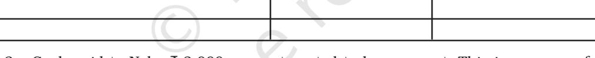

#### LEARNING OBJECTIVES

*After studying this chapter, you will be able to :*

- *• state the meaning of trial balance;*
- *• enumerate the objectives of preparing trial balance ;*
- *• prepare trial balance;*
- *• explain the types of errors;*
- *• state various process of locating errors ;*
- *• identify the errors which affect the agreement of trial balance and those which do not affect the agreement of trial balance;*
- *• rectify the errors without preparing suspense account; and*
- *• rectify the errors with suspense account.*

I n the earlier chapters, you have learnt about the basic principles of accounting that for every debit there will be an equal credit. It implies that if the sum of all debits equals the sum of all credits, it is presumed that the posting to the ledger in terms of debit and credit amounts is accurate. The trial balance is a tool for verifying the correctness of debit and credit amounts. It is an arithmetical check under the double entry system which verifies that both aspects of every transaction have been recorded accurately. This chapter explains the meaning and process of preparation of trial balance and the types of errors and their rectification.

## 6.1 Meaning of Trial Balance

A trial balance is a statement showing the balances, or total of debits and credits, of all the accounts in the ledger with a view to verify the arithmatical accuracy of posting into the ledger accounts. Trial balance is an important statement in the accounting process as it shows the final position of all accounts and helps in preparing the final statements. The task of preparing the statements is simplified because the accountant can take the balances of all accounts from the trial balance instead of going through the whole ledger. It may be noted that the trial balance is usually prepared with the balances of accounts.

| Account Title | L.F. | Debit | Credit |
| --- | --- | --- | --- |
|  |  | Balance | Balance |
|  |  | ` | ` |
| Total |  |  |  |

Trial Balance of ......as on March 31, 2014

Fig. 6.1: *Showing format of a trial balance*

It is normally prepared at the end of an accounting year. However, an organisation may prepare a trial balance at the end of any chosen period, which may be monthly, quarterly, half yearly or annually depending upon its requirements.

In order to prepare a trial balance following steps are taken:

- Ascertain the balances of each account in the ledger.
- List each account and place its balance in the debit or credit column, as the case may be. (If an account has a zero balance, it may be included in the trial balance with zero in the column for its normal balance).
- Compute the total of debit balances column.
- Compute the total of the credit balances column.
- Verify that the sum of the debit balances equal the sum of credit balances. If they do not tally, it indicate that there are some errors. So one must check the correctness of the balances of all accounts. It may be noted that all assets expenses and receivables account shall have debit balances whereas all liabilities, revenues and payables accounts shall have credit balances (refer figure 6.2).

## 6.2 Objectives of Preparing the Trial Balance

The trial balance is prepared to fulfill the following objectives :

- 1. To ascertain the arithmetical accuracy of the ledger accounts.
- 2. To help in locating errors.
- 3. To help in the preparation of the financial statements. (Profit & Loss account and Balance Sheet).

| Account Title |  | L.F. | Debit | Credit |
| --- | --- | --- | --- | --- |
|  |  |  | Balance | Balance |
|  |  |  |  | ` ` |
| • | Capital |  |  | ü |
| • | Land and Buildings |  | ü |  |
| • | Plant and Machinery |  | ü |  |
| • | Equipment |  | ü |  |
| • | Furniture and Fixtures |  | ü |  |
| • | Cash in Hand |  | ü |  |
| • | Cash at Bank |  | ü |  |
| • | Debtors |  | ü |  |
| • | Bills Receivable |  | ü |  |
| • | Stock of Raw Materials |  | ü |  |
| • | Stock of Finished Goods |  | ü |  |
| • | Purchases |  | ü |  |
| • | Carriage Inwards |  | ü |  |
| • | Carriage Outwards |  | ü |  |
| • | Sales |  |  | ü |
| • | Sales Return |  | ü |  |
| • | Purchases Return |  |  | ü |
| • | Interest Paid |  | ü |  |
| • | Commission/Discount Received |  |  | ü |
| • | Salaries |  | ü |  |
| • | Long Term Loan |  |  | ü |
| • | Bills Payable |  |  | ü |
| • | Creditors |  |  | ü |
| • | Advances from Customers |  |  | ü |
| • | Drawings |  | ü |  |
|  |  | Total | xxx | xxx |

Fig. 6.2 : Illustrative trial balance

## *6.2.1 To Ascertain the Arithmetical Accuracy of Ledger Accounts*

As stated earlier, the purpose of preparing a trial balance is to asceitain whether all debits and credit are properly recorded in the ledger or not and that all accounts have been correctly balanced. As a summary of the ledger, it is a list of the accounts and their balances. When the totals of all the debit balances and credit balances in the trial balance are equal, it is assumed that the posting and balancing of accounts is arithmetically correct. However, the tallying of the trial balance is not a conclusive proof of the accuracy of the accounts. It only ensures that all debits and the corresponding credits have been properly recorded in the ledger.

## *6.2.2 To Help in Locating Errors*

When a trial balance does not tally (that is, the totals of debit and credit columns are not equal), we know that at least one error has occured. The error (or errors) may have occured at one of those stages in the accounting process: (1) totalling of subsidiary books, (2) posting of journal entries in the ledger, (3) calculating account balances, (4) carrying account balances to the trial balance, and (5) totalling the trial balance columns.

It may be noted that the accounting accuracy is not ensured even if the totals of debit and credit balances are equal because some errors do not affect equality of debits and credits. For example, the book-keeper may debit a correct amount in the wrong account while making the journal entry or in posting a journal entry to the ledger. This error would cause two accounts to have incorrect balances but the trial balance would tally. Another error is to record an equal debit and credit of an incorrect amount. This error would give the two accounts incorrect balances but would not create unequal debits and credits. As a result, the fact that the trial balance has tallied does not imply that all entries in the books of original record (journal, cash book, etc.) have been recorded and posted correctly. However, equal totals do suggest that several types of errors probably have not occured.

## *6.2.3 To Help in the Preparation of the Financial Statements*

Trial balance is considered as the connecting link between accounting records and the preparation of financial statements. For preparing a financial statement, one need not refer to the ledger. In fact, the availability of a tallied trial balance is the first step in the preparation of financial statements. All revenue and expense accounts appearing in the trial balance are transferred to the trading and profit and loss account and all liabilities, capital and assets accounts are transferred to the balance sheet.

(Preparation of the financial statements is explained in chapters, 9 and 10).

## 6.3 Preparation of Trial Balance

Theoritically spreading, a trial balance can be prepared in the following three ways:

- (i) Totals Method
- (ii) Balances Method
- (iii) Totals-cum-balances Method

## *6.3.1 Totals method*

Under this method, total of each side in the ledger (debit and credit) is ascertained separately and shown in the trial balance in the respective columns. The total of debit column of trial balance should agree with the total of credit column in the trial balance because the accounts are based on double entry system. However, this method is not widely used in practice, as it does not help in assuming accuracy of balances of various accounts and and preparation of the fianancial statements.

## *6.3.2 Balances Method*

This is the most widely used method in practice. Under this method trial balance is prepared by showing the balances of all ledger accounts and then totalling up the debit and credit columns of the trial balance to assure their correctness. The account balances are used because the balance summarises the net effect of all transactions relating to an account and helps in preparing the financial statements. It may be noted that in trial balance, normally in place of balances in individual accounts of the debtors, a figure of sundry debtors is shown, and in place of individual accounts of creditors, a figure of sundry creditors is shown.

## *6.3.3 Totals-cum-balances Method*

This method is a combination of totals method and balances method. Under this method four columns for amount are prepared. Two columns for writing the debit and credit totals of various accounts and two columns for writing the debit and credit balances of these accounts. However, this method is also not used in practice because it is time consuming and hardly serves any additional or special purpose.

Let us now learn how will the trial balance be prepared using each of these methods with the help of the following example:

Mr. Rawat's ledger shows the following accounts for his business. Help him in preparing the trial balance using: (i) Totals method, (ii) Balances method, (iii) Totals-cum-Balances method.

| Dr. |  |  |  |  |  |  |  | Cr. |
| --- | --- | --- | --- | --- | --- | --- | --- | --- |
| Date | Particulars | J.F. | Amount | Date | Particulars | J.F. | Amount |  |
|  |  |  | ` |  |  |  | ` |  |
| 2014 Dec. 31 | Balance c/d |  | 60,000 | 2014 Jan. 01 | Balance b/d Cash |  | 40,000 |  |
|  |  |  |  |  |  |  | 20,000 |  |
|  |  |  | 60,000 | 2015 |  |  | 60,000 |  |
|  |  |  |  | Jan. 01 | Balance b/d |  | 60,000 |  |

### Rawat's Capital Account

#### Rohan's Account

| Dr. |  |  |  |  |  |  |  | Cr. |
| --- | --- | --- | --- | --- | --- | --- | --- | --- |
| Date | Particulars | J.F. | Amount | Date | Particulars | J.F. | Amount |  |
| 2014 |  |  | ` | 2014 |  |  | ` |  |
|  | Cash |  | 40,000 | Jan. 01 | Balance b/d |  | 10,000 |  |
| Dec. 31 | Balance c/d |  | 20,000 |  | Purchases |  | 50,000 |  |
|  |  |  | 60,000 | 2015 |  |  | 60,000 |  |
|  |  |  |  | Jan. 1 | Balance b/d |  | 20,000 |  |

#### Machinery Account

| Dr. |  |  |  |  |  |  | Cr. |
| --- | --- | --- | --- | --- | --- | --- | --- |
| Date | Particulars | J.F. | Amount | Date | Particulars | J.F. | Amount |
|  |  |  | ` |  |  |  | ` |
| 2014 Dec. 31 | Balance b/d |  | 20,000 | 2014 | Depreciation |  | 3,000 |
|  |  |  |  | Dec. 31 | Balance c/d |  | 17,000 |
|  |  |  | 20,000 |  |  |  | 20,000 |
| 2015 |  |  |  |  |  |  |  |
| Jan. 01 | Balance b/d |  | 17,000 |  |  |  |  |

#### Rahul's Account

| Dr. |  |  |  |  |  |  |  | Cr. |
| --- | --- | --- | --- | --- | --- | --- | --- | --- |
| Date | Particulars | J.F. | Amount | Date | Particulars | J.F. | Amount |  |
|  |  |  | ` |  |  |  |  | ` |
| 2014 Jan. 01 | Balance b/d |  | 15,000 | 2014 | Cash |  | 55,000 |  |
|  | Sales |  | 60,000 | Dec. 31 | Balance c/d |  | 20,000 |  |
| 2015 |  |  | 75,000 |  |  |  | 75,000 |  |
| Jan. 01 | Balance b/d |  | 20,000 |  |  |  |  |  |

Sales Account

| Dr. |  |  |  |  |  |  |  | Cr. |
| --- | --- | --- | --- | --- | --- | --- | --- | --- |
| Date | Particulars | J.F. | Amount |  | Date | Particulars | J.F. | Amount |
|  |  |  |  | ` |  |  |  | ` |
|  |  |  |  |  | 2014 |  |  |  |
|  |  |  |  |  |  | Rahul Cash |  | 60,000 10,000 |
|  |  |  |  |  |  |  |  | 70,000 |

#### Cash Account

| Dr. |  |  |  |  |  |  | Cr. |
| --- | --- | --- | --- | --- | --- | --- | --- |
| Date | Particulars | J.F. | Amount | Date | Particulars | J.F. | Amount |
|  |  |  | ` |  |  |  | ` |
| 2014 |  |  |  | 2014 |  |  |  |
| Jan. 01 | Balanc e b/d |  | 15,000 |  | Rohan |  | 40,000 |
|  | Capital |  | 20,000 |  | Wages |  | 5,000 |
|  | Rahul |  | 55,000 |  | Purchases |  | 12,000 |
|  | Sales |  | 10,000 | Dec. 31 | Balance c/d |  | 43,000 |
|  |  |  | 1,00,000 |  |  |  | 1,00,000 |
| 2015 |  |  |  |  |  |  |  |
| Jan. 01 | Balance b/d |  | 43,000 |  |  |  |  |

#### Wages Account

| Dr. |  |  |  |  |  |  |  | Cr. |
| --- | --- | --- | --- | --- | --- | --- | --- | --- |
| Date | Particulars | J.F. | Amount | Date | Particulars | J.F. | Amount |  |
|  |  |  | ` |  |  |  |  | ` |
| 2014 |  |  |  |  |  |  |  |  |
|  | Cash |  | 5,000 |  |  |  |  |  |
|  |  |  | 5,000 |  |  |  |  |  |

#### Depreciation Account

| Dr. |  |  |  |  |  |  |  | Cr. |
| --- | --- | --- | --- | --- | --- | --- | --- | --- |
| Date | Particulars | J.F. | Amount | Date | Particulars | J.F. | Amount |  |
|  |  |  | ` |  |  |  |  | ` |
| 2014 |  |  |  |  |  |  |  |  |
|  | Machinery |  | 3,000 |  |  |  |  |  |
|  |  |  | 3,000 |  |  |  |  |  |

| Dr. |  |  |  |  |  |  |  | Cr. |
| --- | --- | --- | --- | --- | --- | --- | --- | --- |
| Date | Particulars | J.F. | Amount | Date | Particulars | J.F. | Amount |  |
|  |  |  | ` |  |  |  |  | ` |
| 2014 |  |  |  |  |  |  |  |  |
|  | Rohan |  | 50,000 |  |  |  |  |  |
|  | Cash |  | 12,000 |  |  |  |  |  |
|  |  |  | 62,000 |  |  |  |  |  |

#### Purchases Account

The trial balance under the three methods is illustrated below:

| Account | L.F. | Debit | Credit |
| --- | --- | --- | --- |
| Title |  | Total | Total |
|  |  | ` | ` |
| Rawat |  |  | 60,000 |
| Rohan |  | 40,000 | 60,000 |
| Machinery |  | 20,000 | 3,000 |
| Rahul |  | 75,000 | 55,000 |
| Sales |  |  | 70,000 |
| Cash |  | 1,00,000 | 57,000 |
| Wages |  | 5,000 |  |
| Depreciation |  | 3,000 |  |
| Purchases |  | 62,000 |  |
|  |  | 3,05,000 | 3,05,000 |

#### (i) Trial Balance as at March 31, 2014 (Using Totals Method)

#### (ii) Trial Balance as at March 31, 2014 (Using Balances Method)

| Account Title | L.F. | Debit | Credit |
| --- | --- | --- | --- |
|  |  | Balance | Balance |
|  |  | ` | ` |
| Rawat's Capital |  |  | 60,000 |
| Rohan's Capital |  |  | 20,000 |
| Machinery |  | 17,000 |  |
| Rahul |  | 20,000 |  |
| Sales |  |  | 70,000 |
| Cash |  | 43,000 |  |
| Wages |  | 5,000 |  |
| Depreciation |  | 3,000 |  |
| Purchases |  | 62,000 |  |
| Total |  | 1,50,000 | 1,50,000 |

| Account Title | L.F. | Debit | Credit | Debit | Credit |
| --- | --- | --- | --- | --- | --- |
|  |  | Total | Total | Balance | Balance |
|  |  | ` | ` | ` | ` |
| Rawat's Capital |  |  | 60,000 |  | 60,000 |
| Rohan |  | 40,000 | 60,000 |  | 20,000 |
| Machinery |  | 20,000 | 3,000 | 17,000 |  |
| Rahul |  | 75,000 | 55,000 | 20,000 |  |
| Sales |  |  | 70,000 |  | 70,000 |
| Cash |  | 1,00,000 | 57,000 | 43,000 |  |
| Wages |  | 5,000 |  | 5,000 |  |
| Depreciation |  | 3,000 |  | 3,000 |  |
| Purchases |  | 62,000 |  | 62,000 |  |
| Total |  | 3,05,000 | 3,05,000 | 1,50,000 | 1,50,000 |

Test Your Understanding - I

#### (iii) Trial Balance as at March 31, 2014 (Using Totals-cum-Balances Method)

| a trial balance as at March 31, 2014 based on the following balances: | Indicate against each amount wheather it is a debit or a credit balance, and prepare |
| --- | --- |
| Accounts Title | Amount |
|  | ` |
| Capital | 1,00,000 |
| Drawings | 16,000 |
| Machinery | 20,000 |
| Sales | 2,00,000 |
| Purchases | 2,10,000 |
| Sales return | 20,000 |
| Purchases return | 30,000 |
| Wages | 40,000 |
| Goodwill | 60,000 |
| Interest received | 15,000 |
| Discount allowed | 6,000 |
| Bank overdraft | 22,000 |
| Bank loan | 90,000 |
| Debtors : |  |
| Nathu | 55,000 |
| Roopa | 20,000 |
| Creditors : |  |
| Reena | 35,000 |

Ganesh 25,000 Cash 54,000 Stock on April 01, 2013 16,000

## 6.4. Significance of Agreement of Trial Balance

It is important for an accountant that the trial balance should tally. Normally a tallied trial balance means that both the debit and the credit entries have been made correctly for each transaction. However, as stated earlier, the agreement of trial balance is not an absolute proof of accuracy of accounting records. A tallied trial balance only proves, to a certain extent, that the posting to the ledger is arithmetically correct. But it does not guarantee that the entry itself is correct. There can be errors, which affect the equality of debits and credits, and there can be errors, which do not affect the equality of debits and credits. Some common errors include the following:

- Error in totalling of the debit and credit balances in the trial balance.
- Error in totalling of subsidiary books.
- Error in posting of the total of subsidiary books.
- Error in showing account balances in wrong column of the tiral balance, or in the wrong amount.
- Omission in showing an account balance in the trial balance.
- Error in the calculation of a ledger account balance.
- Error while posting a journal entry: a journal entry may not have been posted properly to the ledger, i.e., posting made either with wrong amount or on the wrong side of the account or in the wrong account.
- Error in recording a transaction in the journal: making a reverse entry, i.e., account to be debited is credited and amount to be credited is debited, or an entry with wrong amount.
- Error in recording a transaction in subsidiary book with wrong name or wrong amount.

## *6.4.1 Classification of Errors*

Keeping in view the nature of errors, all the errors can be classified into the following four categories:

- Errors of Commission
- Errors of Omission
- Errors of Principle
- Compensating Errors

## *6.4.2 Errors of Commission*

These are the errors which are committed due to wrong posting of transactions, wrong totalling or wrong balancing of the accounts, wrong casting of the subsidiary books, or wrong recording of amount in the books of original entry, etc. For example: Raj Hans Traders paid ` 25,000 to Preetpal Traders (a supplier of goods). This transaction was correctly recorded in the cashbook. But while posting to the ledger, Preetpal's account was debited with ` 2,500 only. This constitutes an error of commission. Such an error by definition is of clerical nature and most of the errors of commission affect in the trial balance.

## *6.4.3 Errors of Omission*

The errors of omission may be committed at the time of recording the transaction in the books of original entry or while posting to the ledger. These can be of two types:

- (i) error of complete omission
- (ii) error of partial omission

When a transaction is completely omitted from recording in the books of original record, it is an error of complete omission. For example, credit sales to Mohan ` 10,000, not entered in the sales book. When the recording of transaction is partly omitted from the books, it is an error of partial omission. If in the above example, credit sales had been duly recorded in the sales book but the posting from sales book to Mohan's account has not been made, it would be an error of partial omission.

## *6.4.4 Errors of Principle*

Accounting entries are recorded as per the generally accepted accounting principles. If any of these principles are violated or ignored, errors resulting from such violation are known as errors of principle. An error of principle may occur due to incorrect classification of expenditure or receipt between capital and revenue. This is very important because it will have an impact on financial statements. It may lead to under/over stating of income or assets or liabilities, etc. For example, amount spent on additions to the buildings should be treated as capital expenditure and must be debited to the asset account. Instead, if this amount is debited to maintenance and repairs account, it has been treated as a revenue expense. This is an error of principle. Similarly, if a credit purchase of machinery is recorded in purchases book instead of journal proper or rent paid to the landlord is recorded in the cash book as payment to landlord, these errors of principle. These errors do not affect the trial balance.

## *6.4.5 Compensating Errors*

When two or more errors are committed in such a way that the net effect of these errors on the debits and credits of accounts is nil, such errors are called compensating errors. Such errors do not affect the tallying of the trial balance. For example, if purchases book has been overcast by ` 10,000 resulting in excess debit of ` 10,000 in purchases account and sales returns book is undercast by ` 10,000 resulting in short debit to sales returns account is a case of two errors compensating each other's effect. One plus is set off by the other minus, the net effect of these two errors is nil and so they do not affect the agreement of trial balance.

## 6.5 Searching of Errors

If the trial balance does not tally, it is a clear indication that at least one error has occured. The error (or errors) needs to be located and corrected before preparing the financial statements.

If the trial balance does not tally, the accountant should take the following steps to detect and locate the errors :

- Recast the totals of debit and credit columns of the trial balance.
- Compare the account head/title and amount appearing in the trial balance, with that of the ledger to detect any difference in amount or omission of an account.
- Compare the trial balance of current year with that of the previous year to check additions and deletions of any accounts and also verify whether there is a large difference in amount, which is neither expected nor explained.
- Re-do and check the correctness of balances of individual accounts in the ledger.
- Re-check the correctness of the posting in accounts from the books of original entry.
- If the difference between the debit and credit columns is divisible by 2, there is a possibility that an amount equal to one-half of the difference may have been posted to the wrong side of another ledger account. For example, if the total of the debit column of the trial balance exceeds by ` 1,500, it is quite possible that a credit item of `750 may have been wrongly posted in the ledger as a debit item. To locate such errors, the accountant should scan all the debit entries of an amount of ` 750.
- The difference may also indicate a complete omission of a posting. For example, the difference of ` 1,500 given above may be due to omissions of a posting of that amount on the credit side. Thus, the accountant should verify all the credit items with an amount of ` 1,500.
- If the difference is a multiple of 9 or divisible by 9, the mistake could be due to transposition of figures. For example, if a debit amount of ` 459 is posted as ` 954, the debit total in the trial balance will exceed the credit side by ` 495 (i.e. 954 – 459 = 495). This difference is divisible by 9. A mistake due to wrong placement of the decimal point may also be checked by this method. Thus, a difference in trial balance divisible by 9 helps in checking the errors for a transposed mistake.

## 6.6 Rectification of Errors

From the point of view of rectification, the errors may be classified into the following two categories:

- (a) errors which do not affect the trial balance.
- (b) errors which affect the trial balance.

This distinction is relevant because the errors which do not affect the trial balance usually take place in two accounts in such a manner that it can be easily rectified through a journal entry whereas the errors which affect the trial balance usually affect one account and a journal entry is not possible for rectification unless a suspense account has been opened. Such errors are rectified by passing a nullifying entry in the respective account as explained before under 6.6.2.

## *6.6.1 Rectification of Errors which do not Affect the Trial Balance*

These errors are committed in two or more accounts. Such errors are also known as two sided errors. They can be rectified by recording a journal entry giving the correct debit and credit to the concerned accounts.

Examples of such errors are – complete omission to record an entry in the books of original entry; wrong recording of transactions in the book of accounts; complete omission of posting to the wrong account on the correct side, and errors of principle.

The rectification process essentially involves:

- Cancelling the effect of wrong debit or credit by reversing it; and
- Restoring the effect of correct debit or credit. For this purpose, we need to analyse the error in terms of its effect on the accounts involved which may be:
	- (i) Short debit or credit in an account; and/or
	- (ii) Excess debit or credit in an account.

Therefore, rectification entry can be done by:

- (i) debiting the account with short debit or with excess credit,
- (ii) crediting the account with excess debit or with short credit.

The procedure for rectification for such errors is explained with the help of following examples:

- (a) Credit sales to Mohan ` 10,000 were not recorded in the sales book. This is an error of complete omission. Its affect is that Mohan's account has not been debited and Sales account has not been credited. Accordingly, recording usual entry for credit sales will rectify the error.

| Trial Balance and Rectification of Errors 193 |  |  |  |
| --- | --- | --- | --- |
| Mohan's A/c | Dr. | 10,000 |  |
| To Sales A/c |  |  | 10,000 |
| (b) Credit sales to Mohan ` 10,000 were recorded as ` 1,000 in the sales book. |  |  |  |
| This is an error of commission. The effect of wrong recording is shown below: |  |  |  |
| Mohan's A/c | Dr. | 1,000 |  |
| To Sales A/c |  |  | 1,000 |
| Correct effect should have been: |  |  |  |
| Mohan's A/c | Dr. | 10,000 |  |
| To Sales A/c |  |  | 10,000 |
| Now that Mohan's account has to be given an additional debit of ` 9,000 and sales account has to be credited with additional amount of ` 9,000, |  |  |  |
| rectification entry will be: |  |  |  |
| Mohan's A/c | Dr. | 9,000 |  |
| To Sales A/c |  |  | 9,000 |
| Credit sales to Mohan ` 10,000 were recorded as ` 12,000. This is an error of (c) |  |  |  |
| commission. The effect of wrong entry made has been: |  |  |  |
| Mohan's A/c | Dr. | 12,000 |  |
| To Sales A/c |  |  | 12,000 |
| Correct effect should have been: |  |  |  |
| Mohan's A/c | Dr. | 10,000 |  |
| To Sales A/c |  |  | 10,000 |

You can see that there is an excess debit of ` 2,000 in Mohan's account and excess credit of ` 2,000 in sales account.

The, rectification entry will be recorded as follows:

|
|  |

- (d) Credit sales to Mohan ` 10,000 was correctly recorded in the sales book but was posted to Ram's account. This is an error of commission. The effect of wrong posting has been:

| Ram's A/c | Dr. | 10,000 |  |
| --- | --- | --- | --- |
| To Sales A/c |  |  | 10,000 |
| Correct effect should have been : |  |  |  |
| Mohan's A/c | Dr. | 10,000 |  |
| To Sales A/c |  |  | 10,000 |
| Notice that there is no error in sales account. But Ram's account has been debited with ` 10,000 instead of Mohan's account. |  |  |  |
| Hence rectification entry will be: |  |  |  |
| Mohan's A/c | Dr. | 10,000 |  |
| To Ram's A/c |  |  | 10,000 |
| Rent paid ` 2,000 was wrongly shown as payment to landlord in the cash book: | (e) |  |  |
| The effect of wrong posting has been: |  |  |  |
| Landlord's A/c | Dr. | 2,000 |  |
| To Cash A/c |  |  | 2,000 |
| Correct effect should have been: |  |  |  |
| Rent A/c | Dr. | 2,000 |  |
| To Cash A/c |  |  | 2,000 |
| Landlord's account has been wrongly debited instead of Rent account. |  |  |  |
| Hence, rectification entry will be: |  |  |  |
| Rent A/c | Dr. | 2,000 |  |

To Landlord's A/c 2,000

### Test Your Understanding - II

Record the rectification entry for the following transactions:

- 1. Credit sales to Rajni ` 5,000 recorded in Purchases book: This is an error of ..........................................
State the wrong entry recorded in the book of accounts

Correct effect should have been:

The rectification entry will be:

- 2. Furniture purchased from M/s Rao Furnishigs for ` 8,000 was entered into the purchases book.
This is the error of ........................................

State the wrong entry recorded in the book of accounts

Correct effect should have been:

The rectification entry will be:

- 3. Cash sales to Radhika ` 15,000 was shown as receipt of commission in the cash book.
This is the error of ..............................................

State the wrong entry recorded in the book of accounts

| Correct effect should have been: |
| --- |
| The rectification entry will be: |
| Cash received from Karim ` 6,000 posted to Nadeem. 4. |
| This is the error of |
| State the wrong entry recorded in the book of accounts: |
| Correct effect should have been: |
| The rectification entry will be: |

## *6.6.2 Rectification of Errors Affecting Trial Balance*

The errors which affect only one account can be rectified by giving an exaplanatory note in the account affected or by recording a journal entry with the help of the Suspense Account. Suspense Account is explained later in this chapter. Examples of such errors are error of casting; error of carrying forward; error of balancing; error of posting to correct account but with wrong amount; error of posting to the correct account but on the wrong side; posting to the wrong side with the wrong amount; omitting to show an account in the trial balance.

An error in the books of original entry, if discovered before it is posted to the ledger, may be corrected by crossing out the wrong amount by a single line and writing the correct amount above the crossed amount and initialling it. An error in an amount posted to the correct ledger account may also be corrected in a

similar way, or by making an additional posting for the difference in amount and giving an explanatory note in the particulars column. But errors should never be corrected by erasing or overwriting reduces the authenticity of accounting records and give an impression that something is being concealed. A better way therefore is by noting the correction on the appropriate side for neutralising the effect of the error. Take for example a case where Shyam's account was credited short by ` 190. This will be rectified by an additional entry for ` 190 on the credit side of his account as follows.

#### Shyam's Account

| Dr. |  |  |  |  |  |  |  | Cr. |
| --- | --- | --- | --- | --- | --- | --- | --- | --- |
| Date | Particulars | J.F. | Amount | Date | Particulars | J.F. | Amount |  |
|  |  |  | ` |  |  |  |  | ` |
|  |  |  |  |  | Difference in |  |  | 190 |
|  |  |  |  |  | amount posted |  |  |  |
|  |  |  |  |  | short on |  |  |  |

Take another example, purchases book was undercast by ` 1,000. The effect of this entry is on purchases account (debit side) where the total of purchases book is posted

### Purchases Account

*Date Particulars J.F. Amount Date Particulars J.F. Amount* ` ` Undercasting 1,000 purchases book for the month of....

## *Suspense Account*

Even if the trial balance does not tally due to the existence of one sided errors, accountant has to carry forward his accounting process prepare financial statements. The accountant tallies his trial balance by putting the difference on shorter side as 'suspense account'.

The process of opening of suspense account can be understood with the help of the following example:

Consider the sales book of an organisation.

Dr. Cr.

| Date | Invoice | Name of customers | L.F. | Amount |
| --- | --- | --- | --- | --- |
|  | No. | (Accounts to be debited) |  | ` |
|  |  | Ashok traders |  | 20,000 |
|  |  | Bimal service centre |  | 10,000 |
|  |  | Chopra enterprises |  | 5,000 |
|  |  | Diwakar and sons |  | 15,000 |
|  |  |  |  | 50,000 |

Sales Book (Journal)

If sales to Diwakar and sons were not posted to his account, ledger will show the following position:

#### Ashok Traders Account

| Dr. |  |  |  |  |  |  | Cr. |
| --- | --- | --- | --- | --- | --- | --- | --- |
| Date | Particulars | J.F. | Amount | Date | Particulars | J.F. | Amount |
|  |  |  | ` |  |  |  | ` |
|  | Sales |  | 20,000 |  | Balance c/d |  | 20,000 |
|  |  |  | 20,000 |  |  |  | 20,000 |

#### Bimal Service Centre's Account

Dr. Cr.

| Date | Particulars | J.F. | Amount | Date | Particulars | J.F. | Amount |
| --- | --- | --- | --- | --- | --- | --- | --- |
|  |  |  | ` |  |  |  | ` |
|  | Sales |  | 10,000 |  | Balance c/d |  | 10,000 |
|  |  |  | 10,000 |  |  |  | 10,000 |

#### Chopra Enterprises Account

Dr. Cr.

| Date | Particulars | J.F. | Amount | Date | Particulars | J.F. | Amount |
| --- | --- | --- | --- | --- | --- | --- | --- |
|  |  |  | ` |  |  |  | ` |
|  | Sales |  | 5,000 |  | Balance c/d |  | 5,000 |
|  |  |  | 5,000 |  |  |  | 5,000 |

#### Sales Account

| Cr. |  |  |  |  |  |  | Dr. |
| --- | --- | --- | --- | --- | --- | --- | --- |
| Date | Particulars | J.F. | Amount | Date | Particulars | J.F. | Amount |
|  |  |  | ` |  |  |  | ` |
|  |  |  |  |  | Sundries |  | 50,000 |

The trial balance when prepared on the basis of above balances will not tally. Its credit column total will amount to ` 50,000 and debit column total to ` 35,000. The trial balance would differ with ` 15,000. This difference will be temporarily put to suspense account and trial balance will be made to agree in the ledger.

In the above case, difference in trial balance has arisen due to one sided error (omission of posting to Diwakar and sons's account). In a real situation, there can be many other such one-sided errors which cause a difference in trial balance and thus result in opening of the suspense account. Till the all errors affecting agreement of trial balance are not located it is not possible to rectify them and tally the trial balance in such a situation, is shown in the Suspense account, make the total of debit and credit columns and proceed further with the accounting process.

When the errors are located and the specific accounts and amounts involved are identified, the amounts are transferred from suspense account to the relevant accounts thereby closing the suspense account. Thus, suspense account is not placed in any particular category of accounts and is just a temporary phenomenon*.*

While rectifying one-sided errors using suspense account, the following steps are taken:

- (i) Identify the account affected due to error.
- (ii) Ascertain the amount of excess debit/credit or short debit/credit in the affected account.
- (iii) If the error has resulted in excess debit or short credit in the affected account, credit the account with the amount of excess debit or short credit.
- (iv) If the error has resulted in excess credit or short debit in the affected account, debit the account with the amount of excess credit or short debit.
- (v) Complete the journal entry by debiting or crediting the suspense account as another account affected otherwise.

We will now discuss the process of rectification using suspense account:

- (a) Credit sales to Mohan ` 10,000 were not posted to his account. This is an error of partial omission comitted while posting entries of the sales book. Wrong effect has been:

| Mohan's A/c | Dr. | Nil |  |
| --- | --- | --- | --- |
| To Sales A/c |  |  | 10,000 |

| Correct effect should have been: |  |  |  |
| --- | --- | --- | --- |
| Mohan's A/c To Sales A/c | Dr. | 10,000 | 10,000 |
| The rectification entry will be : |  |  |  |
| Mohan's A/c To Suspense A/c | Dr. | 10,000 | 10,000 |
| Credit sales to Mohan ` 10,000 were posted to his account as ` 7000. This is an (b) error of commission. Mohan's account has been debited with ` 7,000 instead of |  |  |  |
| ` 10,000 resulting in short debit of ` 3,000. |  |  |  |
| The wrong effect has been: |  |  |  |
| Mohan's A/c To Sales A/c | Dr. | 7,000 | 10,000 |
| Correct effect should have been: |  |  |  |
| Mohan's A/c To Sales A/c | Dr. | 10,000 | 10,000 |
| Hence, rectification entry will be: |  |  |  |
| Mohan's A/c To Suspens A/c | Dr. | 3,000 | 3,000 |
| (c) Credit sales to Mohan ` 10,000 were posted to his account as ` 12,000. |  |  |  |
| This is an error of commission. The wrong effect has been: |  |  |  |
| Mohan's A/c To Sales A/c | Dr. | 12,000 | 10,000 |
| Correct effect should have been |  |  |  |
| Mohan's A/c To Sales A/c | Dr. | 10,000 | 10,000 |
| The rectification entry will be: |  |  |  |
| Suspense A/c | Dr. To Mohan's A/c | 2,000 | 2,000 |

(*d*) Purchases book overcast by ` 1,000. Errors in casting of subsidiary books affect only those accounts where totals of the subsidiary books involved are

posted. The accounts of individual parties are not affected. Consider the following example.

| Date | Invoice | Name of suppliers | L.F. | Amount |
| --- | --- | --- | --- | --- |
|  | No. | (Accounts to be credited) |  | ` |
|  |  | Dheru |  | 8,000 |
|  |  | Chandraprakash |  | 7,000 |
|  |  | Sachin |  | 6,000 |
|  |  |  |  | 21,000 |
|  |  | Wrong total |  | 22,000 |
|  |  | due to overcasting |  |  |

#### Purchases (Journal) Book

#### Dheru's Account

Dr. Cr. *Date Particulars J.F. Amount Date Particulars J.F. Amount* ` ` Purchases 8,000

#### Chandraprakash's Account

Dr. Cr.

| Date | Particulars | J.F. | Amount | Date | Particulars | J.F. | Amount |
| --- | --- | --- | --- | --- | --- | --- | --- |
|  |  |  | ` |  |  |  | ` |
|  |  |  |  |  | Purchases |  | 7,000 |

#### Sachin's Account

| Dr. |  |  |  |  |  |  | Cr. |
| --- | --- | --- | --- | --- | --- | --- | --- |
| Date | Particulars | J.F. | Amount | Date | Particulars | J.F. | Amount |
|  |  |  | ` |  |  |  | ` |
|  |  |  |  |  | Purchases |  | 6,000 |

#### Purchases Account

| Dr. |  |  |  |  |  |  |  | Cr. |
| --- | --- | --- | --- | --- | --- | --- | --- | --- |
| Date | Particulars | J.F. | Amount | Date | Particulars | J.F. | Amount |  |
|  |  |  | ` |  |  |  |  | ` |
|  | Sundries |  | 22,000 |  |  |  |  |  |

As you can notice that there is no error in accounts of Dheeru, Chanderprakash and Sachin. Only purchases account has been debited with ` 1,000 extra. Hence, rectification entry will be:

| Suspense A/c | Dr. | 1,000 |  |
| --- | --- | --- | --- |
| To Purchases A/c |  |  | 1,000 |

## *6.6.3 Rectification of Errors in the Next Accounting Year*

If some errors committed during an accounting year are not located and rectified before the finalisation of financial statements, suspense account cannot be closed and its balance will be carried forward to the next accounting period. When the errors committed in one accounting year are located and rectified in the next accounting year, profit and loss adjustment account is debited or credited in place of accounts of expenses/losses and incomes/ gains in order to avoid impact on the income statement of next accounting period. You will learn about this aspect at an advanced stage of your studies in accounting.

#### Box 1

#### Guiding Principles of Rectification of Errors

- 1. If error is committed in books of original entry then assume all postings are done accordingly.
- 2. If error is at the posting stage then assume that recording in the subsidiary books has been correctly done.
- 3. If error is in posting to a wrong account (without mentioning side and amount of posting) then assume that posting has been done on the right side and with the right amount.
- 4. If posting is done to a correct account but with wrong amount (without mentioning side of posting) then assume that posting has been done on the correct side.
- 5. If error is posting to a wrong account on the wrong side (without mentioning amount of posting) then assume that posting has been done with the amount as per the original recording of the transaction.
- 6. If error is of posting to a wrong account with wrong amount (without mentioning the side of posting) then assume that posting has been done on the right side.
- 7. If posting is done to a correct account on the wrong side (without mentioning amount of posting) then assume that posting has been done with correct amount as per original recording.
- 8. Any error in posting of individual transactions in subsidiaries books relates to individual account only, the sales account, purchase account, sales return account or purchases return account are not involved.
- 9. If a transaction is recorded in cash book, then the error in posting relates to the other affected account, not to cash account/bank account
- 10. If a transaction is recorded through journal proper, then the phrase 'transaction was not posted' indicates error in both the accounts involved, unless stated otherwise.
- 11. Error in casting of subsidiary books will affect only that account where total of the particular book is posted leaving the individual personal accounts unaffected.

### Test Your Understanding - III

Show the effect through Journal entries:

- 1. Credit sales to Mohan ` 10,000 were posted to his account as ` 12,000 This is an error of ..................................
	- The wrong effect has been:

The correct effect should have been:

The rectification entry will be.

- 2. Cash paid to Neha ` 2,000 was not posted to her account. This is an error of .................................. The wrong effect has been:
The correct effect should have been:

The rectification entry will be:

| 3. | Sales returns from Megha ` 1,600 were posted to her account as ` 1,000. This is an error of |
| --- | --- |
|  | The wrong effect has been: |
|  | The correct effect should have been: |
|  | The rectification entry will be: |
| 4. | Depreciation written off on furniture ` 1,500 was not posted to depreciation account. This is an error of |
|  | The wrong effect has been: |
|  | The correct effect should have been: |
|  | The rectification entry: |

*Illustration 1*

Rectify the following errors:

Credit purchases from Raghu ` 20,000

- (i) were not recorded.
- (ii) were recorded as ` 10,000.
- (iii) were recorded as ` 25,000.
- (iv) were not posted to his account.
- (v) were posted to his account as ` 2,000.
- (vi) were posted to Reghav's account.
- (vii) were posted to the debit of Raghu's account.
- (viii) were posted to the debit of Raghav.
- (ix) were recorded through sales book.

#### *Solution*

| (i) |  |  |  |
| --- | --- | --- | --- |
| Purchases A/c | Dr. | 20,000 |  |
| To Raghu's A/c |  |  | 20,000 |
| (Credit purchases from Raghu omitted to be recorded, now corrected) |  |  |  |
| (ii) |  |  |  |
| Purchases A/c | Dr. | 10,000 |  |
| To Raghu's A/c |  |  | 10,000 |
| (Credit purchases from Raghu recorded as ` 10,000 instead of ` 20,000, |  |  |  |
| now corrected) |  |  |  |
| (iii) |  |  |  |
| Raghu's A/c | Dr. | 5,000 |  |
| To Purchases A/c |  |  | 5,000 |
| (Credit purchases from Raghu recorded as ` 25,000 instead of |  |  |  |
| ` 20,000). |  |  |  |
| (iv) |  |  |  |
| Suspense A/c | Dr. | 20,000 |  |
| To Raghu's A/c |  |  | 20,000 |
| (Credit purchases from Raghu not posted to his account now corrected). |  |  |  |
| (v) |  |  |  |
| Suspense A/c | Dr. | 18,000 |  |
| To Raghu's A/c |  |  | 18,000 |
| (Credit purchases from Raghu ` 20,000 posted to his account as |  |  |  |
| ` 2,000 |  |  |  |
| (vi) |  |  |  |
| Raghav's A/c | Dr. | 20,000 |  |
| To Raghu's A/c |  |  | 20,000 |
| (Credit purchases from Raghu wrongly credited to Raghav, now corrected) |  |  |  |
| (vii) |  |  |  |
| Suspense A/c | Dr. | 40,000 |  |
| To Raghu's A/c |  |  | 40,000 |
| (Credit purchases from Raghu ` 20,000 wrongly posted to the debit of his |  |  |  |
| account, now corrected). |  |  |  |

#### (viii)

| Suspense A/c | Dr. | 40,000 |  |
| --- | --- | --- | --- |
| To Raghav's A/c |  |  | 20,000 |
| To Raghu's A/c |  |  | 20,000 |
|  | (Credited purchases from Raghu ` 20,000 wrongly debited to Raghav, now |  |  |
| corrected). (ix) |  |  |  |

| Sales A/c | Dr. | 20,000 |  |
| --- | --- | --- | --- |
| Purchases A/c | Dr. | 20,000 |  |
| To Raghu's A/c |  |  | 40,000 |
| (Credit purchases from Raghu wrongly recorded through sales book, now |  |  |  |
| corrected). |  |  |  |

#### *Illustration 2*

Rectify the following errors : Cash sales ` 16,000

- (i) were not posted to sales account.
- (ii) were posted as ` 6,000 in sales account.
- (iii) were posted to commission account.

#### *Solution*

| (i) |  |  |  |
| --- | --- | --- | --- |
| Suspense A/c | Dr. | 16,000 |  |
| To Sales A/c |  |  | 16,000 |
| (Cash sales not posted to sales account now rectified) |  |  |  |
| (ii) |  |  |  |
| Suspense A/c | Dr. | 10,000 |  |
| To Sales A/c |  |  | 10,000 |
| (Cash sales ` 16,000 were posted to sales account as ` 6,000, now rectified) |  |  |  |
| (iii) |  |  |  |
| Commission A/c | Dr. | 16,000 |  |
| To Sales A/c |  |  | 16,000 |
| (Cash sales posted to commission account instead of sales account, |  |  |  |
| now corrected) |  |  |  |

#### *Illustration 3*

Depreciation written-off as the machinery ` 2,000

- (i) was not posted at all
- (ii) was not posted to machinery account
- (iii) was not posted to depreciation account

#### *Solution*

- (i) It was recorded through journal proper. From journal proper posting to all the accounts are made individually. Hence, no posting was made to depreciation account and machinery account. Therefore, rectification entry will be :

| Depreciation A/c | Dr. | 2,000 |  |
| --- | --- | --- | --- |
| To Machinery A/c |  |  | 2,000 |
| (Depreciation on machinery not posted, now corrected) |  |  |  |

- (ii) In this case posting was not made to machinery account. It is to be assumed that depreciation account should have been correctly debited. Therefore, rectification entry shall be :

| Suspense A/c | Dr. | 2,000 |  |
| --- | --- | --- | --- |
| To Machinery A/c |  |  | 2,000 |
| (Depreciation on machinery not posted to Machinery account, now |  |  |  |
| corrected). |  |  |  |

- (iii) In this case depreciation account was not been debited. However, machinery account must have been correctly credited. Therefore, rectification entry shall be :

| Depreciation A/c | Dr. | 2,000 |  |
| --- | --- | --- | --- |
| To Suspense A/c |  |  | 2,000 |
| (Depreciation on machinery not posted to Depreciation account, now |  |  |  |
| corrected). |  |  |  |

#### *Illustration 4*

Trial balance of Anurag did not agree. It showed an excess credit ` 10,000. Anurag put the difference to suspense account. He located the following errors :

- (i) Sales return book over cast by ` 1,000.
- (ii) Purchases book was undercast by ` 600.
- (iii) In the sales book total of page no. 4 was carried forward to page 5 as ` 1,000 instead of ` 1,200 and total of page 8 was carried forward to page 9 as ` 5,600 instead of ` 5,000.
- (iv) Goods returned to Ram ` 1,000 were recorded through sales book.
- (v) Credit purchases from M & Co. ` 8,000 were recorded through sales book.
- (vi) Credit purchases from S & Co. ` 5,000 were recorded through sales book. However, S & Co. were correctly credited.
- (vii) Salary paid ` 2,000 was debited to employee's personal account.

*Solution*

(i)

| Suspense A/c | Dr. | 1,000 |  |
| --- | --- | --- | --- |
| To Sales Return A/c |  |  | 1,000 |
| (Sales returns book overcast by ` 1,000, now corrected). |  |  |  |
| (ii) |  |  |  |
| Purchases A/c | Dr. | 600 |  |
| To Suspense A/c |  |  | 600 |
| (Purchases book undercast by ` 600, now corrected) |  |  |  |
| (iii) |  |  |  |
| Sales A/c | Dr. | 400 |  |
| To Suspense A/c |  |  | 400 |
| (Error in carry forward of sales book, now corrected). |  |  |  |

*Note: Errors in carry forward the total of one page to another during a period finally affects the total of that book resulting in error of under/overcasting. In this case, carry forward from page 4 to 5 resulted in undercasting of* ` *200 and carry forward from page 8 to page 9 resulted in overcasting of* ` *600. Overall overcasting being* ` *600–200 =* ` *400.*

(iv)

| Sales A/c | Dr. | 1,000 |  |
| --- | --- | --- | --- |
| To Return Outwards A/c |  |  | 1,000 |
| (Return Outwards wrongly recorded through sales book, now rectified). |  |  |  |
| (v) |  |  |  |
| Purchases A/c | Dr. | 8,000 |  |
| Sales A/c | Dr. | 8,000 |  |
| To M & Co.'s A/c |  |  | 16,000 |
| (Credit purchases wrongly recorded through sales book, now rectified). |  |  |  |
| (vi) |  |  |  |
| Purchases A/c | Dr. | 5,000 |  |
| Sales A/c | Dr. | 5,000 |  |
| To Suspense A/c |  |  | 10,000 |
| (Credit purchases wrongly recorded through sales book, however suppliers |  |  |  |
| account correctly credited, now rectified). |  |  |  |

| Salary A/c | Dr. | 2,000 |  |
| --- | --- | --- | --- |
| To Employee's personal A/c |  |  | 2,000 |
| (Salary paid wrongly debited to employee's personal account, now |  |  |  |
| corrected) |  |  |  |

|  |
| --- |

(vii)

#### Suspense Account

| Dr. |  |  |  |  |  |  | Cr. |
| --- | --- | --- | --- | --- | --- | --- | --- |
| Date | Particulars | J.F. | Amount | Date | Particulars | J.F. | Amount |
|  |  |  | ` |  |  |  | ` |
|  | Difference as per |  | 10,000 |  |  |  |  |
|  | trial balance |  |  |  | Purchases |  | 600 |
|  | Sales return |  | 1,000 |  | Sales |  | 400 |
|  |  |  |  |  | Purchases |  | 5,000 |
|  |  |  |  |  | Sales |  | 5,000 |
|  |  |  | 11,000 |  |  |  | 11,000 |

#### *Illustration 5*

Trial balance of Rahul did not agree. Rahul put the difference to suspense account. Subsequently, he located the following errors :

- (i) Wages paid for installation of Machinery ` 600 was posted to wages account.
- (ii) Repairs to Machinery ` 400 debited to Machinery account.
- (iii) Repairs paid for the overhauling of second hand machinery purchased ` 1,000 was debited to Repairs account.
- (iv) Own business material ` 8,000 and wages ` 2,000 were used for construction of building. No adjustment was made in the books.
- (v) Furniture purchased for ` 5,000 was posted to purchase account as ` 500.
- (vi) Old machinery sold to Karim at its book value of ` 2,000 was recorded through sales book.
- (vii) Total of sales returns book ` 3,000 was not posted to the ledger.

Rectify the above errors and prepare suspense account to ascertain the original difference in trial balance.

- (i)

| Machinery A/c | Dr. | 600 |  |
| --- | --- | --- | --- |
| To Wages A/c |  |  | 600 |
| (Wages paid for installation of machinery wrongly debited to wages account, |  |  |  |
| now rectified) |  |  |  |
| (ii) |  |  |  |

| Repairs A/c Dr. 400 |
| --- |
| To Machinery A/c 400 |
| (Repairs paid wrongly debited to machinery account now rectified) |

| (iii) |  |  |  |
| --- | --- | --- | --- |
| Machinery A/c | Dr. | 1,000 |  |
| To Repairs A/c |  |  | 1,000 |
| (Repairs for overhauling of second hand machinery purchased, wrongly |  |  |  |
| debited to repairs account, now rectified). |  |  |  |
| (iv) |  |  |  |
| Building A/c | Dr. | 10,000 |  |
| To Purchases A/c |  |  | 8,000 |
| To Wages A/c |  |  | 2,000 |
| (Material and wages used for construction of Building, not debited to |  |  |  |
| building account). |  |  |  |
| (v) |  |  |  |
| Furniture A/c | Dr. | 5,000 |  |
| To Purchases A/c |  |  | 500 |
| To Suspense A/c |  |  | 4,500 |
| (Furniture purchased for ` 5,000 wrongly debited to purchases account as |  |  |  |
| ` 500, now rectified). |  |  |  |
| (vi) |  |  |  |
| Sales A/c | Dr. | 2,000 |  |
| To Machinery |  |  | 2,000 |
| (Sale of machinery wrongly recorded in sales book, now rectified). |  |  |  |
| (vii) |  |  |  |
| Sales Return A/c | Dr. | 3,000 |  |
| To Suspense A/c |  |  | 3,000 |
| (Total of sales returns book not posted to ledger, now rectified). |  |  |  |

#### Suspense Account

| Date | Particulars | J.F. | Amount | Date | Particulars | J.F. | Amount |
| --- | --- | --- | --- | --- | --- | --- | --- |
|  |  |  | ` |  |  |  | ` |
|  | Difference as per trial balance |  | 7,500 |  | Furniture Sales return |  | 4,500 3.000 |
|  |  |  | 7,500 |  |  |  | 7,500 |

*Hence, original difference in Trial Balance was* ` *7,500 excess on the Credit side.*

#### *Illustration 6*

Trial balance of Anant Ram did not agree. It showed an excess credit of ` 16,000. He put the difference to suspense account. Subsequently the following errors were located:

- (i) Cash received from Mohit ` 4,000 was posted to Mahesh as ` 1,000.
- (ii) Cheque for ` 5,800 received from Arnav in full settlement of his account of ` 6,000, was dishonoured. No entry was passed in the books on dishonour of the cheque.
- (iii) ` 800 received from Khanna, whose account had previously been written off as bad, was credited to his account.
- (iv) Credit sales to Manav for ` 5,000 was recorded through the purchases book as ` 2,000.
- (v) Purchases book undercast by ` 1,000.
- (vi) Repairs on machinery ` 1,600 wrongly debited to Machinery account as ` 1,000.
- (vii) Goods returned by Nathu ` 3,000 were taken into stock. No entry was recorded in the books.

*Solution*

(i)

| Mahesh's A/c | Dr. | 1,000 |  |
| --- | --- | --- | --- |
| Suspense A/c | Dr. | 3,000 |  |
| To Mohit's A/c |  |  | 4,000 |
| (Cash received from Mohit ` 4,000 wrongly posted to Mahesh as `1,000, |  |  |  |
| now rectified) |  |  |  |

(ii)

| Arnav's A/c Dr. 6,000 |  |
| --- | --- |
| To Bank A/c | 5,800 |
| To Discount Allowed A/c | 200 |
| (Cheque received from Arnav for ` 5,800 in full settlement of his account |  |
| of ` 6,000, dishonoured but no entry made in books, now rectified) |  |

(iii)

| Khanna's A/c Dr. 800 |
| --- |
| To Bad debts recovered A/c 800 |
| (Bad debts recovered wrongly credited to Khanna's account, now rectified) |

| (iv) |  |  |  |  |  |  |
| --- | --- | --- | --- | --- | --- | --- |
|  | Manav's A/c Dr. 7,000 |  |  |  |  |  |
|  | To Purchases A/c |  |  | 2,000 |  |  |
|  | To Sales A/c |  |  | 5,000 |  |  |
|  | (Credit sales to Manav ` 5,000 wrongly recorded through purchases book |  |  |  |  |  |
|  | as ` 2,000, now rectified) |  |  |  |  |  |
| (v) |  |  |  |  |  |  |
|  | Purchases A/c Dr. 1,000 |  |  |  |  |  |
|  | To Suspense A/c |  |  | 1,000 |  |  |
|  | (Purchases book undercast by ` 1,000) |  |  |  |  |  |
|  | (vi) |  |  |  |  |  |
|  | Repairs A/c Dr. 1,600 |  |  |  |  |  |
|  | To Machinery A/c |  |  | 1,000 |  |  |
|  | To Suspense A/c |  |  | 600 |  |  |
|  | (Repairs on machinery ` 1,600 wrongly debited to machinery account as |  |  |  |  |  |
|  | ` 1,000, now rectified) |  |  |  |  |  |
|  | (vii) |  |  |  |  |  |
|  | Sales Return A/c Dr. 3,000 |  |  |  |  |  |
|  | To Nathu's A/c |  |  | 3,000 |  |  |
|  | (Sales return from Nathu not recorded) |  |  |  |  |  |
|  | Suspense Account |  |  |  |  |  |
| Dr. |  |  |  |  |  | Cr. |
| Date | Particulars J.F. Amount | Date | Particulars | J.F. | Amount |  |
|  | ` |  |  |  |  | ` |
|  | Difference as per Purchases |  |  |  | 1,000 |  |

| Date | Particulars | J.F. | Amount | Date | Particulars | J.F. | Amount |
| --- | --- | --- | --- | --- | --- | --- | --- |
|  |  |  | ` |  |  |  | ` |
|  | Difference as per |  |  |  | Purchases |  | 1,000 |
|  | trial balance |  | 16,000 |  | Repairs |  | 600 |
|  | Mohit |  | 3,000 |  | Balance c/d |  | 17,400 |
|  |  |  | 19,000 |  |  |  | 19,000 |

- *Note: Even after rectification of errors suspense account is showing a debit balance of* ` *17,400. This is due to non-detection of errors affecting trial balance. Balance of suspense account will be carried forward to the next year and will be eliminated as and when all the remaining errors affecting trial balance are located.*
### *Illustration 7*

Trial balance of Kailash did not agree. He put the difference to suspense account. The following errors were discovered :

- (i) Goods withdrawn by Kailash for personal use ` 500 were not recorded in the books.
- (ii) Discount allowed to Ramesh `60 on receiving ` 2,040 from him was not recorded in the books.
- (iii) Discount received from Rohan ` 50 on paying ` 3,250 to him was not posted at all.
- (iv) ` 700 received from Khalil, a debtor, whose account had earlier been written-off as bad, were credited to his personal account.
- (v) Cash received from Govil, a debtor, ` 5,000 was posted to his account as ` 500.
- (vi) Goods returned to Mahesh ` 700 were posted to his account as ` 70.
- (vii) Bill receivable from Narayan ` 1,000 was dishonoured and wrongly debited to allowances account as ` 10,000.

Give journal entries to rectify the above errors and prepare suspense account to ascertain the amount of difference in trial balance.

*Solution*

| (i) |  |  |  |
| --- | --- | --- | --- |
| Drawings A/c | Dr. | 500 |  |
| To Purchases A/c |  |  | 500 |
| (Goods withdrawn by proprietor for personal use not recorded, now |  |  |  |
| rectified). |  |  |  |
| (ii) |  |  |  |
| Discount allowed A/c | Dr. | 60 |  |
| To Ramesh's A/c |  |  | 60 |
| (Discount allowed to Ramesh not recorded, now rectified) |  |  |  |
| (iii) |  |  |  |
| Rohan's A/c | Dr. | 50 |  |
| To Discount received A/c |  |  | 50 |
| (Discount received from Rohan not posted , now corrected) |  |  |  |
| (iv) |  |  |  |
| Khalil's A/c | Dr. | 700 |  |
| To Bad debts recovered A/c |  |  | 700 |
| (Bad debts recovered wrongly credited to debtor's personal account, now |  |  |  |
| corrected) |  |  |  |

#### Suspense Account

| Dr. |  |  |  |  |  |  | Cr. |
| --- | --- | --- | --- | --- | --- | --- | --- |
| Date | Particulars | J.F. | Amount | Date | Particulars | J.F. | Amount |
|  |  |  | ` |  |  |  | ` |
|  | Govil Allowances |  | 4,500 9,000 |  | Mahesh Difference as per trial balance |  | 630 12,870 |
|  |  |  | 13,500 |  |  |  | 13,500 |

#### Test Your Understanding - IV

*Tick the Correct Answer*

- (1) Agreement of trial balance is affected by:
	- (a) One sided errors only.
	- (b) Two sided errors only.
	- (c) Both (a) and (b).
	- (*d*) None of the above.
- (2) Which of the following is not an error of principle:
	- (a) Purchase of furniture debited to purchases account.
	- (*b*) Repairs on the overhauling of second hand machinery purchased debited to repairs account.

(v)

- (c) Cash received from Manoj posted to Saroj.
- (d) Sale of old car credited to sales account.
- (3) Which of the following is not an error of commission:
	- (a) Overcasting of sales book.
	- (b) Credit sales to Ramesh ` 5,000 credited to his account.
	- (c) Wrong balancing of machinery account.
	- (d) Cash sales not recorded in cash book.
- (4) Which of following errors will be rectified through suspense account:
	- (*a*) Sales return book undercast by ` 1,000.
	- (b) Sales return by Madhu ` 1,000 not recorded.
	- (c) Sales return by Madhu Rs 1,000. recorded as ` 100.
	- (d) Sales return by Madhu ` 1,000 recorded through purchases returns book
- (5) If the trial balance agrees, it implies that:
	- (a) There is no error in the books.
	- (b) There may be two sided errors in the book.
	- (c) There may be one sided error in the books.
	- (d) There may be both two sided and one sided errors in the books.
- (6) If suspense account does not balance off even after rectification of errors it implies that:
	- (a) There are some one sided errors only in the books yet to be located.
	- (b) There are no more errors yet to be located.
	- (c) There are some two sided errors only yet to be located.
	- (d) There may be both one sided errors and two sided errors yet to be located.
- (7) If wages paid for installation of new machinery is debited to wages Account, it is:
	- (a) An error of commission.
	- (b) An error of principle.
	- (c) A compensating error.
	- (d) An error of omission.
- (8) Trial balance is:
	- (a) An account.
	- (b) A statement.
	- (c) A subsidiary book.

(d) A principal book.

- (9) A Trial balance is prepared:
	- (a) After preparation financial statement.
	- (b) After recording transactions in subsidiary books.
	- (c) After posting to ledger is complete.
	- (d) After posting to ledger is complete and accounts have been balanced,

#### *Key Terms Introduced in the Chapter*

- 
- Trial Balance Compensating Error
- Error of Commission Error of Principle
	-
- 
- Error Omission Suspense Account

#### *Summary with Reference to Learning Objectives*

- 1. *Meaning of trial balance*: A statement showing the abstract of the balance (debit/credit) of various accounts in the ledger.
- 2. *Objectives of trial balance*: The main objectives of preparing the trial balance are : (i) to ascertain the arithmetical accuracy of the ledger accounts; (ii) to help in locating errors; and (iii) to help in the preparatioon of the final accounts.
- 3. *Preparation of trial balance by the balance method*: In this method, the trial balance has three columns. The first column is for the head of the account, the second column for writing the debit balance and the third for the credit balance of each account in the ledger.
- 4. *Various types of errors*:
	- (i) *Errors of commission*: Errors caused due to wrong recording of a transaction, wrong totalling, wrong casting, wrong balancing, etc.
	- (ii) *Errors of Omission*: Errors caused due to omission of recording a transaction entirely or party in the books of account.
	- (iii) *Errors of Principle*: Errors arising due to wrong classificatrion of receipts and payments between revenue and capital receipts and revenue and capital expenditure.
	- (iv) *Compensating errors*: Two or more errors committed in such a way that they nullify the effect of each other on the debits and credits.
- 5. *Rectification of errors*: Errors affecting only one account can be rectified by giving an explanatory note or by passing a journal entry. Errors which affect two or more accounts are rectified by passing a journal entry.
- 6. *Meaning and utility of suspense account*: An account in which the difference in the trial balance is put till such time that errors are located and rectified. It facilitates the preparation of financial statements even when the trial balance does not tally.
- 7. *Disposal of suspense account*: When all the errors are located and rectified the suspense account stands disposed off.

#### *Questions for Practice*

#### *Short Answers*

- 1. State the meaning of a trial balance?
- 2. Give two examples of errors of principle?
- 3. Give two examples of errors of commission?
- 4. What are the methods of preparing trial balance?
- 5. What are the steps taken by an accountant to locate the errors in the trial balance?
- 6. What is a suspense account? Is it necessary that is suspense account will balance off after rectification of the errors detected by the accountant? If not, then what happens to the balance still remaining in suspense account?
- 7. What kinds of errors would cause difference in the trial balance. Also list examples that would not be revealed by a trial balance?
- 8. State the limitations of trial balance?

#### *Long Answers*

- 1. Describe the purpose for the preparation of trial balance.
- 2. Explain errors of principle and give two examples with measures to rectify them.
- 3. Explain the errors of commission and give two examples with measures to rectify them.
- 4. What are the different types of errors that are usually committed in recording business transaction.
- 5. As an accountant of a company, you are disappointed to learn that the totals in your new trial balance are not equal. After going through a careful analysis, you have discovered only one error. Specifically, the balance of the Office Equipment account has a debit balance of ` 15,600 on the trial balance. However, you have figured out that a correctly recorded credit purchase of pendrive for ` 3,500 was posted from the journal to the ledger with a ` 3,500 debit to Office Equipment and another ` 3,500 debit to creditors accounts. Answer each of the following questions and present the amount of any misstatement :
	- (a) Is the balance of the office equipment account overstated, understated, or correctly stated in the trial balance?
	- (b) Is the balance of the creditors account overstated, understated, or correctly stated in the trial balance?
	- (c) Is the debit column total of the trial balance overstated, understated, or correclty stated?
	- (d) Is the credit column total of the trial balance overstated, understated, or correctly stated?
	- (e) If the debit column total of the trial balance is ` 2,40,000 before correcting the error, what is the total of credit column.

#### *Numerical Questions*

- 1. Rectify the following errors:
	- (i) Credit sales to Mohan ` 7,000 were not recorded.
	- (ii) Credit purchases from Rohan ` 9,000 were not recorded.
	- (iii) Goods returned to Rakesh ` 4,000 were not recorded.
	- (iv) Goods returned from Mahesh ` 1,000 were not recorded.
- 2. Rectify the following errors:
	- (i) Credit sales to Mohan ` 7,000 were recorded as `700.
	- (ii) Credit purchases from Rohan ` 9,000 were recorded as ` 900.
	- (iii) Goods returned to Rakesh ` 4,000 were recorded as ` 400.
	- (iv) Goods returned from Mahesh ` 1,000 were recorded as `100.
- 3. Rectify the following errors:
	- (i) Credit sales to Mohan ` 7,000 were recorded as `7,200.
	- (ii) Credit purchases from Rohan ` 9,000 were recorded as ` 9,900.
	- (iii) Goods returned to Rakesh ` 4,000 were recorded as ` 4,040.
	- (iv) Goods returned from Mahesh ` 1,000 were recorded as `1,600.
- 4. Rectify the following errors:
	- (a) Salary paid ` 5,000 was debited to employee's personal account.
	- (b) Rent Paid ` 4,000 was posted to landlord's personal account.
	- (c) Goods withdrawn by proprietor for personal use ` 1,000 were debited to sundry expenses account.
	- (d) Cash received from Kohli ` 2,000 was posted to Kapur's account.
	- (e) Cash paid to Babu ` 1,500 was posted to Sabu's account.
- 5. Rectify the following errors:
	- (a) Credit Sales to Mohan ` 7,000 were recorded in purchases book.
	- (b) Credit Purchases from Rohan ` 9,00 were recorded in sales book.
	- (c) Goods returned to Rakesh ` 4,000 were recorded in the sales return book.
	- (d) Goods returned from Mahesh ` 1,000 were recorded in purchases return book.
	- (e) Goods returned from Nahesh ` 2,000 were recorded in purchases book.
- 6. Rectify the following errors:
	- (a) Sales book overcast by ` 700.
	- (b) Purchases book overcast by ` 500.
	- (c) Sales return book overcast by ` 300.
	- (d) Purchase return book overcast by ` 200.
- 7. Rectify the following errors:
	- (a) Sales book undercast by `300.
	- (b) Purchases book undercast by `400.
	- (c) Return Inwards book undercast by `200.
	- (d) Return outwards book undercast by `100.
- 8. Rectify the following errors and ascertain the amount of difference in trial balance by preparing suspense account:
	- (a) Credit sales to Mohan ` 7,000 were not posted.
	- (b) Credit purchases from Rohan ` 9,000 were not posted.
	- (c) Goods returned to Rakesh ` 4,000 were not posted.
	- (d) Goods returned from Mahesh ` 1,000 were not posted.
	- (e) Cash paid to Ganesh ` 3,000 was not posted.
	- (f) Cash sales ` 2,000 were not posted.

(*Ans*: Difference in trial balance ` 2,000 excess credit).

- 9. Rectify the following errors and ascertain the amount of difference in trial balance by preparing suspense account:
	- (a) Credit sales to Mohan ` 7,000 were posted as ` 9,000.
	- (b) Credit purchases from Rohan ` 9,000 were posted as ` 6,000.
	- (c) Goods returned to Rakesh ` 4,000 were posted as ` 5,000.
	- (d) Goods returned from Mahesh ` 1,000 were posted as ` 3,000.
	- (e) Cash sales ` 2,000 were posted as ` 200.

(*Ans*: Difference in trial balance ` 5,800 excess debit.)

- 10. Rectify the following errors:
	- (a) Credit sales to Mohan ` 7,000 were posted to Karan.
	- (b) Credit purchases from Rohan ` 9,000 were posted to Gobind.
	- (c) Goods returned to Rakesh ` 4,000 were posted to Naresh.
	- (d) Goods returned from Mahesh ` 1,000 were posted to Manish.
	- (e) Cash sales ` 2,000 were posted to commission account.
- 11. Rectify the following errors assuming that a suspense account was opened. Ascertain the difference in trial balance.
	- (a) Credit sales to Mohan ` 7,000 were posted to the credit of his account.
	- (b) Credit purchases from Rohan ` 9,000 were posted to the debit of his account as ` 6,000.
	- (c) Goods returned to Rakesh ` 4,000 were posted to the credit of his account.
	- (d) Goods returned from Mahesh ` 1,000 were posted to the debit of his account as ` 2,000.
	- (e) Cash sales ` 2,000 were posted to the debit of sales account as ` 5,000.
	- (*Ans*: Difference in trial balance ` 3,000 excess debit).
- 12. Rectify the following errors assuming that a suspense account was opened. Ascertain the difference in trial balance.
	- (a) Credit sales to Mohan ` 7,000 were posted to Karan as ` 5,000.
	- (b) Credit purchases from Rohan ` 9,000 were posted to the debit of Gobind as ` 10,000.
	- (c) Goods returned to Rakesh ` 4,000 were posted to the credit of Naresh as ` 3,000.
	- (d) Goods returned from Mahesh ` 1,000 were posted to the debit of Manish as ` 2,000.
	- (e) Cash sales ` 2,000 were posted to commission account as ` 200.

(*Ans*: Difference in trial balance ` 14, 800 excess debit).

- 13. Rectify the following errors assuming that suspense account was opened. Ascertain the difference in trial balance.
	- (a) Credit sales to Mohan ` 7,000 were recorded in Purchase Book. However, Mohan's account was correctly debited.
	- (b) Credit purchases from Rohan ` 9,000 were recorded in sales book. However, Rohan's account was correctly credited.
	- (c) Goods returned to Rakesh ` 4,000 were recorded in sales return book. However, Rakesh's account was correctly debited.
	- (d) Goods returned from Mahesh ` 1,000 were recorded through purchases return book. However, Mahesh's account was correctly credited.
	- (e) Goods returned to Naresh ` 2,000 were recorded through purchases book. However, Naresh's account was correctly debited.

(*Ans*: Difference in trial balance ` 6,000 excess debit).

- 14. Rectify the following errors :
	- (a) Furniture purchased for ` 10,000 wrongly debited to purchases account.
	- (b) Machinery purchased on credit from Raman for ` 20,000 was recorded through purchases book.
	- (c) Repairs on machinery ` 1,400 debited to machinery account.
	- (d) Repairs on overhauling of secondhand machinery purchased ` 2,000 was debited to Repairs account.
	- (e) Sale of old machinery at book value of ` 3,000 was credited to sales account.
- 15. Rectify the following errors assuming that suspension account was opened. Ascertain the difference in trial balance.
	- (a) Furniture purchased for ` 10,000 wrongly debited to purchase account as ` 4,000.
	- (b) Machinery purchased on credit from Raman for ` 20,000 recorded through Purchases Book as ` 6,000.
	- (c) Repairs on machinery ` 1,400 debited to Machinery account as ` 2,400.
	- (d) Repairs on overhauling of second hand machinery purchased ` 2,000 was debited to Repairs account as ` 200.
	- (e) Sale of old machinery at book value ` 3,000 was credited to sales account as ` 5,000.

(*Ans* : Difference in trial balance ` 8,800 excess credit).

- 16. Rectify the following errors :
	- (a) Depreciation provided on machinery ` 4,000 was not posted.
	- (b) Bad debts written off ` 5,000 were not posted.
	- (c) Discount allowed to a debtor ` 100 on receiving cash from him was not posted.
	- (d) Discount allowed to a debtor ` 100 on receiving cash from him was not posted to discount account.
	- (e) Bill receivable for ` 2,000 received from a debtor was not posted.
- 17. Rectify the following errors :
	- (a) Depreciation provided on machinery ` 4,000 was posted as ` 400.
	- (b) Bad debts written off ` 5,000 were posted as ` 6,000.
	- (c) Discount allowed to a debtor ` 100 on receiving cash from him was posted as ` 60.
	- (d) Goods withdrawn by proprietor for personal use ` 800 were posted as ` 300.
	- (e) Bill receivable for ` 2,000 received from a debtor was posted as ` 3,000.
- 18. Rectify the following errors assuming that suspense account was opened. Ascertain the difference in trial balance.
	- (a) Depreciation provided on machinery ` 4,000 was not posted to Depreciation account.

- (b) Bad debts written-off ` 5,000 were not posted to Debtors account.
- (c) Discount allowed to a debtor ` 100 on receiving cash from him was not posted to discount allowed account.
- (d) Goods withdrawn by proprietor for personal use ` 800 were not posted to Drawings account.
- (e) Bill receivable for ` 2,000 received from a debtor was not posted to Bills receivable account.

(*Ans*: Difference in trial balance ` 1,900 excess credit).

- 19. Trial balance of Anuj did not agree. It showed an excess credit of ` 6,000. He put the difference to suspense account. He discovered the following errors
	- (a) Cash received from Ravish ` 8,000 posted to his account as ` 6,000.
	- (b) Returns inwards book overcast by ` 1,000.
	- (c) Total of sales book ` 10,000 was not posted to Sales account.
	- (d) Credit purchases from Nanak ` 7,000 were recorded in sales Book. However, Nanak's account was correctly credited.
	- (e) Machinery purchased for ` 10,000 was posted to purchases account as ` 5,000. Rectify the errors and prepare suspense account.

(*Ans*: Total of suspense account ` 19,000).

- 20. Trial balance of Raju showed an excess debit of ` 10,000. He put the difference to suspense account and discovered the following errors :
	- (a) Depreciation written-off the furniture ` 6,000 was not posted to Furniture account.
	- (b) Credit sales to Rupam ` 10,000 were recorded as ` 7,000.
	- (c) Purchases book undercast by ` 2,000.
	- (d) Cash sales to Rana ` 5,000 were not posted.
	- (e) Old Machinery sold for ` 7,000 was credited to sales account.
	- (f) Discount received ` 800 from kanan on playing cash to him was not posted. Rectify the errors and prepare suspense account.

(*Ans*: Balance carried forward in suspense account ` 1,000 (cr.)).

- 21. Trial balance of Madan did not agree and he put the difference to suspense account. He discovered the following errors:
	- (a) Sales return book overcast by ` 800.
	- (b) Purchases return to Sahu ` 2,000 were not posted.
	- (c) Goods purchased on credit from Narula ` 4,000 though taken into stock, but no entry was passed in the books.
	- (d) Installation charges on new machinery purchased ` 500 were debited to sundry expenses account as ` 50.
	- (e) Rent paid for residential accommodation of madam (the proprietor) ` 1,400 was debited to Rent account as ` 1,000. Rectify the errors and prepare suspense account to ascertain the difference in trial balance.
	- (*Ans*: Difference in trial balance ` 2,050 excess credit).
- 22. Trial balance of Kohli did not agree and showed an excess debit of ` 16,300. He put the difference to a suspense account and discovered the following errors:
	- (a) Cash received from Rajat ` 5,000 was posted to the debit of Kamal as ` 6,000.
	- (b) Salaries paid to an employee ` 2,000 were debited to his personal account as ` 1200.
	- (c) Goods withdrawn by proprietor for personal use ` 1,000 were credited to sales account as ` 1,600.
	- (d) Depreciation provided on machinery ` 3,000 was posted to Machinery account as ` 300.
	- (e) Sale of old car for ` 10,000 was credited to sales account as ` 6,000. Rectify the errors and prepare suspense account. (*Ans*: total of suspense account : ` 17,700).
- 23. Give journal entries to rectify the following errors assuming that suspense account had been opened.
	- (a) Goods distributed as free sample ` 5,000 were not recorded in the books.
	- (b) Goods withdrawn for personal use by the proprietor ` 2,000 were not recorded in the books.
	- (c) Bill receivable received from a debtor ` 6,000 was not posted to his account.
	- (d) Total of Returns inwards book ` 1,200 was posted to Returns outwards account.
	- (e) Discount allowed to Reema ` 700 on receiving cash from her was recorded in the books as ` 70.
	- (*Ans*: Difference in trial balance ` 3,600 excess debit).
- 24. Trial balance of Khatau did not agree. He put the difference to suspense account and discovered the following errors :
	- (a) Credit sales to Manas ` 16,000 were recorded in the purchases book as ` 10,000 and posted to the debit of Manas as ` 1,000.
	- (b) Furniture purchased from Noor ` 6,000 was recorded through purchases book as ` 5,000 and posted to the debit of Noor ` 2,000.
	- (c) Goods returned to Rai ` 3,000 recorded through the Sales book as ` 1,000.
	- (d) Old machinery sold for ` 2,000 to Maneesh recorded through sales book as ` 1,800 and posted to the credit of Manish as ` 1,200.
	- (e) Total of Returns inwards book ` 2,800 posted to Purchase account. Rectify the above errors and prepare suspense account to ascertain the difference in trial balance.

(*Ans*: Difference in trial balance ` 15,000 excess debit).

- 25. Trial balance of John did not agree. He put the difference to suspense account and discovered the following errors :
	- (a) In the sales book for the month of January total of page 2 was carried forward to page 3 as ` 1,000 instead of ` 1200 and total of page 6 was carried forward to page 7 as ` 5,600 instead of ` 5,000.

- (b) Wages paid for installation of machinery ` 500 was posted to wages account as ` 50.
- (c) Machinery purchased from R & Co. for ` 10,000 on credit was entered in Purchase Book as ` 6,000 and posted there from to R & Co. as ` 1,000.
- (d) Credit sales to Mohan ` 5,000 were recorded in Purchases Book.
- (e) Goods returned to Ram ` 1,000 were recorded in Sales Book.
- (f) Credit purchases from S & Co. for ` 6,000 were recorded in sales book. However, S & Co. was correctly credited.
- (g) Credit purchases from M & Co. ` 6,000 were recorded in Sales Book as ` 2,000 and posted there from to the credit of M & Co. as ` 1,000.
- (h) Credit sales to Raman ` 4,000 posted to the credit of Raghvan as ` 1,000.
- (i) Bill receivable for ` 1,600 from Noor was dishonoured and posted to debit of Allowances account.
- (j) Cash paid to Mani ` 5,000 against our acceptance was debited to Manu.
- (k) Old furniture sold for ` 3,000 was posted to Sales account as ` 1,000.
- (l) Depreciation provided on furniture ` 800 was not posted.
- (m) Material ` 10,000 and wages ` 3,000 were used for construction of building. No adjustment was made in the books. Rectify the errors and prepare suspense to ascertain the difference in trial balance.

(*Ans* : Difference in trial balance ` 13,850 excess credit).

#### *Checklist to Test Your Understanding*

*Test your understanding - I*

Trial Balance Total ` 5,17,000

*Test your understanding - II*

| 1. | Purchases A/c | Dr. | 5,000 |  |
| --- | --- | --- | --- | --- |
|  | To Rajni's A/c |  |  | 5,000 |
|  | Rajni's A/c | Dr. | 5,000 |  |
|  | To Sales A/c |  |  | 5,000 |
|  | Rajni's A/c | Dr. | 10,000 |  |
|  | To Sales A/c |  |  | 5,000 |
|  | To Purchases A/c |  |  | 5,000 |
| 2. | Purchases A/c | Dr. | 8,000 |  |
|  | To Rao's A/c |  |  | 8,000 |

|  | Furniture A/c | Dr. | 8,000 |  |
| --- | --- | --- | --- | --- |
|  | To Purchases A/c |  |  | 8,000 |
| 3. | Cash A/c | Dr. | 15,000 |  |
|  | To Commission A/c |  |  | 15,000 |
|  | Cash A/c | Dr. | 15,000 |  |
|  | To Sales A/c |  |  | 15,000 |
|  | Commission A/c | Dr. |  | 15,000 |
|  | To Sales A/c |  |  | 15,000 |
| 4. | Cash A/c | Dr. | 6, 000 |  |
|  | To Nadeem's A/c |  |  | 6,000 |
|  | Cash A/c | Dr. | 6,000 |  |
|  | To Karim's A/c |  |  | 6,000 |
|  | Test Your Understanding - III |  |  |  |
| 1. | Error of Commission |  |  |  |
|  | Mohan's A/c | Dr. | 12, 000 |  |
|  | To Sales A/c |  |  | 12,000 |
|  | Mohan's A/c | Dr. | 10,000 |  |
|  | To Sales A/c |  |  | 10,000 |
|  | Suspense A/c | Dr. | 2,000 |  |
|  | To Mohan's A/c |  |  | 2,000 |
| 2. | Error of Partial omission |  |  |  |
|  | xxx A/c | Dr. | 2,000 |  |
|  | To Cash A/c |  |  | 2,000 |
|  | Neha's A/c | Dr. | 2,000 |  |
|  | To Suspense A/c |  |  | 2,000 |
|  | Neha's A/c | Dr. | 2,000 |  |
|  | To Suspense A/c |  |  | 2,000 |

| 3. Error of Commission |  |  |  |
| --- | --- | --- | --- |
| Sales Return A/c | Dr. | 1,600 |  |
| To Megha's A/c |  |  | 1,600 |
| Sales Returns A/c | Dr. | 1,600 |  |
| To Megha's A/c |  |  | 1,600 |
| Suspense A/c | Dr. | 600 |  |
| To Megha's A/c |  |  | 600 |
| 4. Error of Commission |  |  |  |
| xxx | Dr. | 1,500 |  |
| To Furniture A/c |  |  | 1,500 |
| Depreciation A/c | Dr. | 1,500 |  |
| To Furniture A/c |  |  | 1,500 |
| Depreciation A/c | Dr. |  | 1,500 |
| To Suspense A/c |  |  | 1,500 |

*Test Your Understanding - IV*

- 1. (c) 2. (c) 3. (d) 4. (a) 5. (b) 6. (a) 7. (b) 8. (b) 9. (d)
