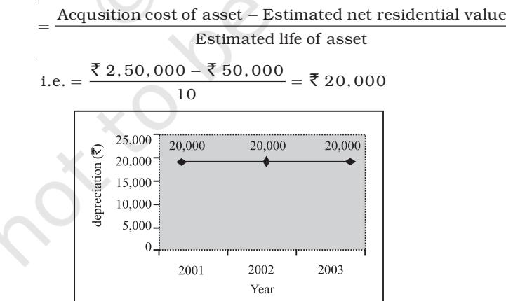
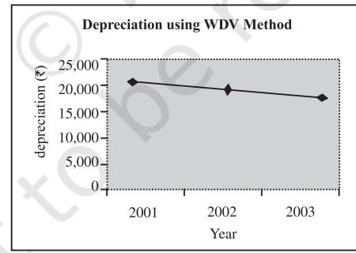

#### LEARNING OBJECTIVES

*After studying this chapter, you will be able to :*

- *• explain the meaning of depreciation and distinguish it from amortisation and depletion;*
- *• state the need for charging depreciation and identify its causes;*
- *• compute depreciation using straight line and written down value methods;*
- *• record transactions relating to depreciation and disposition of assets;*
- *• explain the meaning and purpose of creating provisions and reserves;*
- *• distinguish between reserves and provisions;*
- *• explain the nature of various types of provisions and reserves including secret reserve.*

Matching principle requires that the revenue of a given period is matched against the expenses for the same period. This ensures ascertainment of the correct amount of profit or loss. If some cost is incurred whose benefit extend to more than one accounting period, it is not justified to charge the entire cost as expense in the year in which it is incurred. In fact, such a cost must be spread over the periods in which it provides benefits. Depreciation, on fixed assets, which is the main subject matter of the present chapter, deals with such a situation. Further, it may not always be possible to ascertain with certainty the amount of some particular expense. Recall the principle of conservatism (prudence) which requires that instead of ignoring such items of costs, adequate provision must be made and charged against profits of the current period. Moreover, a part of profit may be retained in the business in the form of reserves to provide for growth, expansion or meeting certain specific needs of the business in future. This chapter deals with two distinct topics and hence is being presented in two different sections. First section deals with depreciation and second section deals with provisions and reserves.

### SECTION – I

### 7.1 Depreciation

Now you are aware that fixed assets are the assets which are used in business for more than one accounting year. Fixed assets (technically referred to as "depreciable assets") tend to reduce their value once they are put to use. In general, the term "Depreciation" means decline in the value of a fixed assets due to use, passage of time or obsolescence. In other words, if a business enterprise procures a machine and uses it in production process then the value of machine declines with its usage. Even if the machine is not used in production process, we can not expect it to realise the same sales price due to the passage of time or arrival of a new model (obsolescence). It implies that fixed assets are subject to decline in value and this decline is technically referred to as *depreciation*.

As an accounting term, depreciation is that part of the cost of a fixed asset which has expired on account of its usage and/or lapse of time. Hence, depreciation is an expired cost or expense, charged against the revenue of a given accounting period. For example, a machine is purchased for `1,00,000 on April 01, 2017. The useful life of the machine is estimated to be 10 years. It implies that the machine can be used in the production process for next 10 years till March 31, 2016. You know that by its very nature, ` 1,00,000 is a capital expenditure during the year 2017-18. However, when income statement (Statement of Profit and Loss) is prepared, the entire amount of `1,00,000 can not be charged against the revenue for the year 2017-18, because of the reason that the capital expenditure amounting to `1,00,000 is expected to derive benefits (or revenue) for 10 years and not one year. Therefore, it is logical to charge only a part of the total cost say `10,000 (one tenth of ` 1,00,000) against the revenue for the year 2017-18. This part represents the expired cost or loss in the value of machine on account of its use or passage of time and is referred to as 'Depreciation'. The amount of depreciation, being a charge against profit, is debited to Income Statement (Statement of Profit and Loss).

#### *7.1.1 Meaning of Depreciation*

Depreciation may be described as a permanent, continuing and gradual shrinkage in the book value of fixed assets. It is based on the cost of assets consumed in a business and not on its market value.

According to Institute of Cost and Management Accounting, London (ICMA) terminology "The depreciation is the diminution in intrinsic value of the asset due to use and/or lapse of time."

Accounting Standard-6 issued by The Institute of Chartered Accountants of India (ICAI) defines depreciation as "a measure of the wearing out, consumption or other loss of value of depreciable asset arising from use, effluxion of time or obsolescence through technology and market-change. Depreciation is allocated so as to charge fair proportion of depreciable amount in each accounting period during the expected useful life of the asset. Depreciation includes amortisation of assets whose useful life is pre-determined".

#### Box 1 AS-6 (Revised): Depreciation

- Depreciation is "a measure of the wearing out, consumption or other loss of value of depreciable asset arising from use, effluxion of time or obsolescence through technology and market-change. Depreciation is allocated so as to charge fair proportion of depreciable amount in each accounting period during the expected useful life of the asset. Depreciation includes amortisation of assets whose useful life is pre-determined".
- Depreciation has a significant effect in determining and presenting the financial position and results of operations of an enterprise. Depreciation is charged in each accounting period by reference to the extent of the depreciable amount.
- The subject matter of depreciation, or its base, are 'depreciable' assets which.
	- "are expected to be used during more than one accounting period.
	- have a limited useful life; and
	- are held by an enterprise for use in production or supply of goods and services, for rental to others, or for administrative purposes and not for the purpose of sale in the ordinary course of business."
- The amount of depreciation basically depends upon three factors, i.e. Cost, Useful life and Net realisable value.
- Cost of a fixed asset is "the total cost spent in connection with its acquisition, installation and commissioning as well as for add item or improvement of the depreciable asset".
- Useful life of an asset is the "period over which it is expected to be used by the enterprise".
- There are two main methods of calculating depreciation amount.
	- straight line method
	- written down value method
- Selection of appropriate method depends upon the following factors:
	- type of the asset
	- nature of the use of such asset
	- circumstances prevailing in the business.
- The selected depreciation method should be applied consistently from period to period. Change in depreciation method may be allowed only under specific circumstances.

Depreciation has a significant effect in determining and presenting the financial position and results of operations of an enterprise. Depreciation is charged in each accounting period by reference to the extent of the depreciable amount. It should be noted that the subject matter of depreciation, or its base, are 'depreciable' assets which:

- "are expected to be used during more than one accounting period;
- have a limited useful life; and
- are held by an enterprise for use in production or supply of goods and services, for rental to others, or for administrative purposes and not for the purpose of sale in the ordinary course of business."

Examples of depreciable assets are machines, plants, furnitures, buildings, computers, trucks, vans, equipments, etc. Moreover, depreciation is the allocation of 'depreciable amount', which is the "historical cost", or other amount substituted for historical cost less estimated salvage value.

Another point in the allocation of depreciable amount is the 'expected useful life' of an asset. It has been described as "either (i) the period over which a depreciable asset is expected to the used by the enterprise, or (ii) the number of production of similar units expected to be obtained from the use of the asset by the enterprise."

### *7.1.2 Features of Depreciation*

Above mentioned discussion on depreciation highlights the following features of depreciation:

- 1. It is decline in the book value of fixed assets.
- 2. It includes loss of value due to effluxion of time, usage or obsolescence. For example, a business firm buys a machine for ` 1,00,000 on April 01, 2017. In the year 2017, a new version of the machine arrives in the market. As a result, the machine bought by the business firm becomes outdated. The resultant decline in the value of old machine is caused by obsolescence.
- 3. It is a continuing process.
- 4. It is an expired cost and hence must be deducted before calculating taxable profits. For example, if profit before depreciation and tax is ` 50,000, and depreciation is ` 10,000; profit before tax will be:

|  | (`) |
| --- | --- |
| Profit before depreciation & tax | 50,000 |
| (-) Depreciation | (10,000) |
| Profit before tax | 40,000 |

- 5. It is a non-cash expense. It does not involve any cash outflow. It is the process of writing-off the capital expenditure already incurred.
#### Do it Yourself

 Look at your surroundings and identify at least five depreciable assets in your home, school, hospital, printing press and in a bakery.

### 7.2 Depreciation and other Similar Terms

There are some terms like 'depletion' and 'amortisation', which are also used in connection with depreciation. This has been due to the similar treatment given to them in accounting on the basis of similarity of their outcome, as they represent the expiry of the usefulness of different assets.

### *7.2.1 Depletion*

The term depletion is used in the context of extraction of natural resources like mines, quarries, etc. that reduces the availability of the quantity of the material or asset. For example, if a business enterprise is into mining business and purchases a coal mine for ` 10,00,000. Then the value of coal mine declines with the extraction of coal out of the mine. This decline in the value of mine is termed as *depletion*. The main difference between depletion and depreciation is that the former is concerned with the exhaution of economic resources, but the latter relates to the usage of an asset. In spite of this, the result is erosion in the volume of natural resources and expiry of the service potential. Therefore, depletion and depreciation are given similar accounting treatment.

### *7.2.2 Amortisation*

Amortisation refers to writing-off the cost of intangible assets like patents, copyright, trade marks, franchises, goodwill which have utility for a specified period of time. The procedure for amortisation or periodic write-off of a portion of the cost of intangible assets is the same as that for the depreciation of fixed assets. For example, if a business firm buys a patent for ` 10,00,000 and estimates that its useful life will be 10 years then the business firm must writeoff ` 10,00,000 over 10 years. The amount so written- off is technically referred to as *amortisation.*

### 7.3 Causes of Depreciation

These have been very clearly spelt out as part of the definition of depreciation in the Accounting Standard 6 and are being elaborated here.

### *7.3.1 Wear and Tear due to Use or Passage of Time*

Wear and tear means deterioration, and the consequent diminution in an assets value, arising from its use in business operations for earning revenue. It reduces the asset's technical capacities to serve the purpose for, which it has been meant. Another aspect of wear and tear is the physical deterioration. An asset deteriorates simply with the passage of time, even though they are not being put to any use. This happens especially when the assets are exposed to the rigours of nature like weather, winds, rains, etc.

### *7.3.2 Expiration of Legal Rights*

Certain categories of assets lose their value after the agreement governing their use in business comes to an end after the expiry of pre-determined period. Examples of such assets are patents, copyrights, leases, etc. whose utility to business is extinguished immediately upon the removal of legal backing to them.

### *7.3.3 Obsolescence*

Obsolescence is another factor leading to depreciation of fixed assets. In ordinary language, obsolescence means the fact of being "out-of-date". Obsolescence implies to an existing asset becoming out-of-date on account of the availability of better type of asset. It arises from such factors as:

- Technological changes;
- Improvements in production methods;
- Change in market demand for the product or service output of the asset;
- Legal or other description.

### *7.3.4 Abnormal Factors*

Decline in the usefulness of the asset may be caused by abnormal factors such as accidents due to fire, earthquake, floods, etc. Accidental loss is permanent but not continuing or gradual. For example, a car which has been repaired after an accident will not fetch the same price in the market even if it has not been used.

### 7.4 Need for Depreciation

The need for providing depreciation in accounting records arises from conceptual, legal, and practical business consideration. These considerations provide depreciation a particular significance as a business expense.

### *7.4.1 Matching of Costs and Revenue*

The rationale of the acquisition of fixed assets in business operations is that these are used in the earning of revenue. Every asset is bound to undergo some wear and tear, and hence lose value, once it is put to use in business. Therefore, depreciation is as much the cost as any other expense incurred in the normal course of business like salary, carriage, postage and stationary, etc. It is a charge against the revenue of the corresponding period and must be deducted before arriving at net profit according to 'Generally Accepted Accounting Principles'.

### *7.4.2 Consideration of Tax*

Depreciation is a deductible cost for tax purposes. However, tax rules for the calculation of depreciation amount need not necessarily be similar to current business practices,

### *7.4.3 True and Fair Financial Position*

If depreciation on assets is not provided for, then the assets will be over valued and the balance sheet will not depict the correct financial position of the business. Also, this is not permitted either by established accounting practices or by specific provisions of law.

### *7.4.4 Compliance with Law*

Apart from tax regulations, there are certain specific legislations that indirectly compel some business organisations like corporate enterprises to provide depreciation on fixed assets.

#### Test Your Understanding - I

State whether the following statements are true or false:

- 1. Depreciation is a non-cash expense.
- 2. Depreciation is also charged on current assets.
- 3. Depreciation is decline in the market value of tangible fixed assets.
- 4. The main cause of depreciation is wear and tear caused by its usage.
- 5. Depreciation must be charged so as to ascertain true profit or loss of the business.
- 6. Depletion term is used in case of intangible assets.
- 7. Depreciation provides fund for replacement.
- 8. When market value of an asset is higher than book value, depreciation is not charged.
- 9. Depreciation is charged to reduce the value of asset to its market value.
- 10. If adequate maintenance expenditure is incurred, depreciation need not be charged.

### 7.5 Factors Affecting the Amount of Depreciation

The determination of depreciation depends on three parameters, viz. cost, estimated useful life and probable salvage value.

## *7.5.1 Cost of Asset*

Cost (also known as original cost or historical cost) of an asset includes invoice price and other costs, which are necessary to put the asset in use or working condition. Besides the purchase price, it includes freight and transportation cost, transit insurance, installation cost, registration cost, commission paid on purchase of asset add items such as software, etc. In case of purchase of a second hand asset it includes initial repair cost to put the asset in workable

condition. According to Accounting Standand-6 of ICAI, cost of a fixed asset is "the total cost spent in connection with its acquisition, installation and commissioning as well as for addition or improvement of the depreciable asset". For example, a photocopy machine is purchased for ` 50,000 and ` 5,000 is spent on its transportation and installation. In this case the original cost of the machine is ` 55,000 (i.e. ` 50,000 + `5,000 ) which will be written-off as depreciation over the useful life of the machine.

### *7.5.2 Estimated Net Residual Value*

Net Residual value (also known as scrap value or salvage value for accounting purpose) is the estimated net realisable value (or sale value) of the asset at the end of its useful life. The net residual value is calculated after deducting the expenses necessary for the disposal of the asset. For example, a machine is purchased for ` 50,000 and is expected to have a useful life of 10 years. At the end of 10th year it is expected to have a sale value of ` 6,000 but expenses related to its disposal are estimated at ` 1,000. Then its net residual value shall be ` 5,000 (i.e. ` 6,000 – ` 1,000).

### *7.5.3 Depreciable Cost*

Depreciable cost of an asset is equal to its cost (as calculated in point 7.5.1 above) *less* net residual value (as calculated in point 7.5.2,) Hence, in the above example, the depreciable cost of machine is ` 45,000 (i.e., ` 50,000 – ` 5,000.) It is the depreciable cost, which is distributed and charged as depreciation expense over the estimated useful life of the asset. In the above example, ` 45,000 shall be charged as depreciation over a period of 10 years. It is important to mention here that total amount of depreciation charged over the useful life of the asset must be equal to the depreciable cost. If total amount of depreciation charged is less than the depreciable cost then the capital expenditure is under recovered. It violates the principle of proper matching of revenue and expense.

### *7.5.4 Estimated Useful Life*

Useful life of an asset is the estimated economic or commercial life of the asset. Physical life is not important for this purpose because an asset may still exist physically but may not be capable of commercially viable production. For example, a machine is purchased and it is estimated that it can be used in production process for 5 years. After 5 years the machine may still be in good physical condition but can't be used for production profitably, i.e., if it is still used the cost of production may be very high. Therefore, the useful life of the machine is considered as 5 years irrespective of its physical life. Estimation of useful life of an asset is difficult as it depends upon several factors such as usage level of asset, maintenance of the asset, technological changes, market changes, etc. As per Accounting Standard – 6 useful life of an asset is normally the "period over which it is expected to be used by the enterprise". Normally, useful life is shorter than the physical life. The useful life of an asset is expressed in number of years but it can also be expressed in other units, e.g., number of units of output (as in case of mines) or number of working hours. Useful life depends upon the following factors :

- Pre-determined by legal or contractual limits, e.g., in case of leasehold asset, the useful life is the period of lease.
- The number of shifts for which asset is to be used.
- Repair and maintenance policy of the business organisation.
- Technological obsolescence.
- Innovation/improvement in production method.
- Legal or other restrictions.

### 7.6 Methods of Calculating Depreciation Amount

The depreciation amount to be charged for during an accounting year depends upon depreciable amount and the method of allocation. For this, two methods are mandated by law and enforced by professional accounting practice in India. These methods are straight line method and written down value method. Besides these two main methods there are other methods such as – annuity method, depreciation fund method, insurance policy method, sum of years digit method, double declining method, etc. which may be used for determining the amount of depreciation. The selection of an appropriate method depends upon the following :

- Type of the asset;
- Nature of the use of such asset;
- Circumstances prevailing in the business;

As per Accounting Standard-6, the selected depreciation method should be applied consistently from period to period. Change in depreciation method may be allowed only under specific circumstances.

### *7.6.1 Straight Line Method*

This is the earliest and one of the widely used methods of providing depreciation. This method is based on the assumption of equal usage of the asset over its entire useful life. It is called straight line for a reason that if the amount of depreciation and corresponding time period is plotted on a graph, it will result in a straight line (figure 7.1).

It is also called fixed installment method because the amount of depreciation remains constant from year to year over the useful life of the asset. According to this method, a fixed and an equal amount is charged as depreciation in every accounting period during the lifetime of an asset. The amount annually charged as depreciation is such that it reduces the original cost of the asset to its scrap value, at the end of its useful life. This method is also known as fixed percentage on original cost method because same percentage of the original cost (infact depreciable cost) is written off as depreciation from year to year.

The depreciation amount to be provided under this method is computed by using the following formula:

  
Depreciation = $\dfrac{\text{Cost of asset-Estimated net residential value}}{\text{Estimated useful life of the asset}}$

Rate of depreciation under straight line method is the percentage of the total cost of the asset to be charged as deprecation during the useful lifetime of the asset. Rate of depreciation is calculated as follows:

> Rate of Depreciation = Annual depreciation amount Acquisition cost × 100

Consider the following example, the original cost of the asset is ` 2,50,000. The useful life of the asset is 10 years and net residual value is estimated to be ` 50,000. Now, the amount of depreciation to be charged every year will be computed as given below:

Annual Depreciation Amount

Fig. 7.1 : *Depreciation amount under straight line method*

The rate of depreciation will be calculated as :

Annual depreciation amount Rate of Depreciation 100 = ×

$$\mathrm{Acquisition~cost}$$

From point (i), the annual depreciation amounts to ` 20,000.

Thus, the rate of depreciation will be = × = 20,000 100 8% 2,50,000 ` `

### *7.6.1.1 Advantages of Straight Line Method*

Straight Line method has certain advantages which are stated below:

- It is very simple, easy to understand and apply. Simplicity makes it a popular method in practice;
- Asset can be depreciated upto the net scrap value or zero value. Therefore, this method makes it possible to distribute full depreciable cost over useful life of the asset;
- Every year, same amount is charged as depreciation in profit and loss account. This makes comparison of profits for different years easy;
- This method is suitable for those assets whose useful life can be estimated accurately and where the use of the asset is consistent from year to year such as leasehold buildings.

### *7.6.1.2 Limitations of Straight Line Method*

Although straight line method is simple and easy to apply it suffers from certain limitations which are given below.

- This method is based on the faulty assumption of same amount of the utility of an asset in different accounting years;
- With the passage of time, work efficiency of the asset decreases and repair and maintenance expense increases. Hence, under this method, the total amount charged against profit on account of depreciation and repair taken together, will not be uniform throughout the life of the asset, rather it will keep on increasing from year to year.

### *7.6.2 Written Down Value Method*

Under this method, depreciation is charged on the book value of the asset. Since book value keeps on reducing by the annual charge of depreciation, it is also known as 'reducing balance method'. This method involves the application of a pre-determined proportion/percentage of the book value of the asset at the beginning of every accounting period, so as to calculate the amount of depreciation. The amount of depreciation reduces year after year.

(i)

For example, the original cost of the asset is ` 2,00,000 and depreciation is charged @ 10% p.a. at written down value, then the amount of depreciation will be computed as follows:

- (i) Depreciation (I year) = × = 10 20, 00, 000 20, 000 100 ` `
- (ii) Written down value = ` 2,00,000 20,000 = `1,80,000 (at the end of the I year)
- (iii) Depreciation (II year) = × = 10 1, 80, 000 18,000 100 ` `
- (iv) Written down value = ` 1,80,000 `18,000 = 1,62,000 (at the end of the II year)
- (v) Depreciation (III year) = × = 10 1, 62, 000 16,200 100 ` `
- (vi) Written down value = ` 1,62,000 ` 16,200 = ` 1,45,800 (at the end of III year)

As evident from the example, the amount of depreciation goes on reducing year after year. For this reason, it is also known 'reducing installment' or 'diminishing value' method. This method is based upon the assumption that the benefit accruing to business from assets keeps on diminishing as the asset becomes old (refer figure 7.2). This is due to the reason that a predetermined percentage is applied to a gradually shrinking balance on the asset account every year. Thus, large amount is recovered depreciation charge in the earlier years than in later years.

Fig. 7.2 : *Depreciation amount using written down value method*

Under written down value method, the rate of depreciation is computed by using the following formula:

$$\mathbf{R}=\left[1-\mathbf{n}{\sqrt{\frac{\mathbf{s}}{\mathbf{c}}}}\right]\times100$$

Where, r = Rate of depreciation

- n = Expected useful life
- s = Scrap value
- c = Cost of an asset

For example, the original cost of a truck is ` 9,00,000 and its net salvage value after 16 years of useful life is ` 50,000 then the appropriate rate of depreciation will be computed as under:

$$\mathrm{R}=\left[1-16\sqrt{\frac{50,000}{9,00,000}}\right]\times100=(1-0.834)\times100=16.69\%$$

### *7.6.2.1 Advantages of Written Down Value Method*

Written down value method has the following advantages:

- This method is based on a more realistic assumption that the benefits from asset go on diminishing (reducing) with the passage of time. Hence, it calls for proper allocation of cost because higher depreciation is charged in earlier years when asset's utility is higher as compared to later years when it becomes less effective.
- It results into almost equal burden of depreciation and repair expenses taken together every year on profit and loss account;
- Income Tax Act accept this method for tax purposes;
- As a large portion of cost is written-off in earlier years, loss due to obsolescence gets reduced;
- This method is suitable for fixed assets which last for long and which require increased repair and maintenance expenses with passage of time. It can also be used where obsolescence rate is high.

### *7.6.2.2 7.6.2.2 Limitations of Written Down Value Method*

Although this method is based upon a more realistic assumption it suffers from the following limitations.

- As depreciation is calculated at fixed percentage of written down value, depreciable cost of the asset cannot be fully written-off. The value of the asset can never be zero;
- It is difficult to ascertain a suitable rate of depreciation.

### 7.7 Straight Line Methodand Written Down Method: A Comparative Analysis

Straight line and written down value methods are generally used for calculating depreciation amount in practice. Following are the points of differences between these two methods.

### *7.7.1 Basis of Charging Depreciation*

In straight line method, depreciation is charged on the basis of original cost or (historical cost). Whereas in written down value method, the basis of charging depreciation is net book value (i.e., original cost less depreciation till date) of the asset, in the beginning of the year.

### *7.7.2 Annual Charge of Depreciation*

The annual amount of depreciation charged every year remains fixed or constant under straight line method. Whereas in written down value method the annual amount of depreciation is highest in the first year and subsequently declines in later years. The reason for this difference, is the difference in the basis of charging depreciation under both methods. Under straight line method depreciation is calculated on original cost while under written down value method it is calculated on written down value.

### *7.7.3 Total Charge Against Profit and Loss Account on Account of Depreciation and Repair Expenses*

It is a well-accepted phenomenon that repair and maintenance expenses increase in later years of the useful life of the asset. Hence, total charge against profit and loss account in respect of depreciation and repair expenses increases in later years under straight line method. This happens because annual depreciation charge remains fixed while repair expenses increase. On the other hand, under written down value method, depreciation charge declines in later years, therefore total of depreciation and repair charge remains similar or equal year after year.

### *7.7.4 Recognition by Income Tax Law*

Straight line method is not recognised by Income Tax Law while written down value method is recognised by the Income Tax Law.

## *7.7.5 Suitability*

Straight line method is suitable for assets in which repair charges are low the possibility of obsolescence is low and scrap value depends upon the time period involved, such as freehold land and buildings, patents, trade marks, etc. Written down value method is suitable for assets which are affected by technological changes and require more repair expenses with passage of time such as plant and machinery, vehicles, etc.

|  | Basis of Difference | Straight Line Method | Written Down Value |
| --- | --- | --- | --- |
|  |  |  | Method |
| 1. | Basis of charging depre- | Original cost | Book Value (i.e. original |
|  | ciation |  | cost less depreciation |
|  |  |  | charged till date) |
| 2. | Annual depreciation charge | Fixed (Constant) year | Declines year after year |
| 3. | Total charge against | Unequal year after year. | Almost equal every year. |
|  | profit and loss account in | It increases in later years. |  |
|  | respect of depreciation |  |  |
|  | and repairs |  |  |
| 4. | Recognition by income | Not recognised | Recognised |
|  | tax law |  |  |
| 5. | Suitablity | It is suitable for assets in | It is suitable for assets, |
|  |  | which repair charges are | which are affected by |
|  |  | less, the possibility of | technological changes |
|  |  | and obsolescence is low | and require more repair |
|  |  | scrap value depends upon | expenses with passage of |
|  |  | the time period involved. | time. |

Fig. 7.3 : *Comparison of straight line and written down value method*

### 7.8 Methods of Recording Depreciation

In the books of account, there are two types of arrangements for recording depreciation on fixed assets:

- Charging depreciation to asset account or
- Creating Provision for depreciation/Accumulated depreciation account.

### *7.8.1 Charging Depreciation to Asset account*

According to thisarrangement, depreciation is deducted from the depreciable cost of the asset (credited to the asset account) and charged (or debited) to profit and loss account. Journal entries under this recording method are as follows:

| 1. | For recording purchase of asset |  | (only in the year of purchase) |
| --- | --- | --- | --- |
|  | Asset A/c | Dr. | (with the cost of asset including |
|  |  |  | installation, freight, etc.) |

#### To Bank/Vendor A/c

2. Following two entries are recorded at the end of every year

(a) For deducting depreciation amount from the cost of the asset.

Depreciation A/c Dr. (with the amount of depreciation)

#### To Asset A/c

- (b) For charging depreciation to profit and loss account.
	- Profit & Loss A/c Dr. (with the amount of depreciation) To Depreciation A/c

3. Balance Sheet Treatment

When this method is used, the fixed asset appears at its net book value (i.e. cost less depreciation charged till date) on the asset side of the balance sheet and not at its original cost (also known as historical cost).

### *7.8.2 Creating Provision for Depreciation Account/Accumulated Depreciation Account*

This method is designed to accumulate the depreciation provided on an asset in a separate account generally called 'Provision for Depreciation' or 'Accumulated Depreciation' account. By such accumulation of depreciation the asset account need not be disturbed in any way and it continues to be shown at its original cost over the successive years of its useful life. There are some basic characteristic of this method of recording depreciation. These are given below:

- Asset account continues to appear at its original cost year after year over its entire life;
- Depreciation is accumulated on a separate account instead of being adjusted in the asset account at the end of each accounting period.

The following journal entries are recorded under this method:

| 1. | For recording purchase of asset |  | (only in the year of purchase) |
| --- | --- | --- | --- |
|  | Asset A/c | Dr. | (with the cost of asset including |
|  |  |  | installation, expenses etc.) |

To Bank/Vendor A/c (cash/credit purchase)

2. Following two journal entries are recorded at the end of each year:

- (a) For crediting depreciation amount to provision for depreciation account Depreciation A/c Dr. (with the amount of depreciation) To Provision for depreciation A/c
- (b) For charging depreciation to profit and loss account Profit & Loss A/c Dr. (with the amount of depreciation) To Depreciation A/c

3. Balance sheet treatment

In the balance sheet, the fixed asset continues to appear at its original cost on the asset side. The depreciation charged till that date appears in the provision for depreciation account, which is shown either on the "liabilities side" of the balance sheet or by way of deduction from the original cost of the asset concerned on the asset side of the balance sheet.

#### *Illustration 1*

M/s Singhania and Bros. purchased a plant for ` 5,00,000 on April 01, 2017, and spent ` 50,000 for its installation. The salvage value of the plant after its useful life of 10 years is estimated to be ` 10,000. Record journal entries for the year 2016-17 and draw up Plant Account and Depreciation Account for first three years given that the depreciation is charged using straight line method if :

- (i) The books of account close on March 31 every year; and
- (ii) The firm charges depreciation to the asset account.

*Solution*

#### Books of Singhania and Bros.

Journal

| Date | Particulars |  | L.F. | Debit | Credit |
| --- | --- | --- | --- | --- | --- |
|  |  |  |  | Amount | Amount |
|  |  |  |  | ` | ` |
| 2016 |  |  |  |  |  |
| Apr. 01 | Plant A/c | Dr. |  | 5,00,000 |  |
|  | To Bank A/c |  |  |  | 5,00,000 |
|  | (Purchased plant for ` 5,00,000) |  |  |  |  |
| Apr. 01 | Plant A/c | Dr. |  | 50,000 |  |
|  | To Bank A/c |  |  |  | 50,000 |
|  | (Expenses incurred on installation) |  |  |  |  |
| 2017 |  |  |  |  |  |
| Mar. 31 | Depreciation A/c | Dr. |  | 54,000 |  |
|  | To Plant A/c |  |  |  | 54,000 |
|  | (Depreciation charged on asset) |  |  |  |  |
| Mar. 31 | Profit and Loss A/c | Dr. |  | 54,000 |  |
|  | To Depreciation A/c |  |  |  | 54,000 |
|  | (Depreciation debited to profit and |  |  |  |  |
|  | loss account) |  |  |  |  |

#### Plant Account

| Dr. |  |  |  |  |  |  | Cr. |
| --- | --- | --- | --- | --- | --- | --- | --- |
| Date | Particulars | J.F. | Amount | Date | Particulars | J.F. | Amount |
|  |  |  | ` |  |  |  | ` |
| 2016 |  |  |  | 2017 |  |  |  |
| Apr. 01 | Bank |  | 5,00,000 | Mar. 31 | Depreciation Balance c/d |  | 54,000 4,96,000 |
|  | Bank |  | 50,000 |  |  |  |  |
|  | (Installation expenses) |  |  |  |  |  |  |
|  |  |  | 5,50,000 |  |  |  | 5,50,000 |
| 2017 |  |  |  | 2018 |  |  |  |
| Apr. 01 | Balance b/d |  | 4,96,000 | Mar. 31 | Depreciation Balance c/d |  | 54,000 |
|  |  |  |  |  |  |  | 4,42,000 |
|  |  |  | 4,96,000 |  |  |  | 4,96,000 |
| 2018 |  |  |  | 2019 |  |  |  |
| Apr. 01 | Balance b/d |  | 4,42,000 | Mar. 31 | Depreciation Balance c/d |  | 54,000 |
|  |  |  |  |  |  |  | 3,88,000 |
|  |  |  | 4,42,000 |  |  |  | 4,42,000 |
| 2019 |  |  |  |  |  |  |  |
| Apr. 01 | Balance b/d |  | 3,88,000 |  |  |  |  |

| Dr. |  |  |  |  |  |  |  | Cr. |
| --- | --- | --- | --- | --- | --- | --- | --- | --- |
| Date | Particulars | J.F. | Amount | Date | Particulars | J.F. | Amounts |  |
|  |  |  | ` |  |  |  |  | ` |
| 2017 |  |  |  | 2017 |  |  |  |  |
| Mar. 31 | Plant |  | 54,000 | Mar. 31 | Profit and Loss |  | 54,000 |  |
| 2018 |  |  |  | 2018 |  |  |  |  |
| Mar. 31 | Plant |  | 54,000 | Mar. 31 | Profit and Loss |  | 54,000 |  |
| 2019 |  |  |  | 2019 |  |  |  |  |
| Mar. 31 | Plant |  | 54,000 | Mar. 31 | Profit & Loss |  | 54,000 |  |

#### Depreciation Account

#### *Workings Notes*

(1) Calculation of original cost

|  | (`) |
| --- | --- |
| Purchase cost | 5,00,000 |
| Add: Installation cost | 50,000 |
| Original cost | 5,50,000 |
| Salvage value | 10,000 |
| Useful life | 10 years |

(2) Depreciation amount = $\frac{\overline{\tau}\,5.50.000\,\,\overline{\tau}\,10.000}{10}=\overline{\tau}\,54.000$ p.a.  
  

#### *Illustration 2*

M/s Mehra and Sons acquired a machine for ` 1,80,000 on October 01, 2016, and spent ` 20,000 for its installation. The firm writes-off depreciation at the rate of 10% on original cost every year. Record necessary journal entries for the year 2017 and draw up Machine Account and Depreciation Account for first three years given that:

(i) The book of accounts closes on March 31 every year; and

(ii) The firm charges depreciation to asset account.

#### *Solution*

#### Books of Mehra and Sons Journal

|  |  |  |  | Debit | Credit |
| --- | --- | --- | --- | --- | --- |
| Date | Particulars |  | L.F. | Amount | Amount |
|  |  |  |  | ` | ` |
| 2016 |  |  |  |  |  |
| Oct. 01 | Machine A/c | Dr. |  | 1,80,000 |  |
|  | To Bank A/c |  |  |  | 1,80,000 |
|  | (Purchased machine for `1,80,000) |  |  |  |  |
| Oct. 01 | Machine A/c | Dr. |  | 20,000 |  |
|  | To Bank A/c |  |  |  | 20,000 |
|  | (Expenses incurred on installation) |  |  |  |  |

| 2017 |  |  |  |  |
| --- | --- | --- | --- | --- |
| Mar. 31 | Depreciation A/c | Dr. | 10,000 |  |
|  | To Machine A/c |  |  | 10,000 |
|  | Depreciation charged on machine) |  |  |  |
| Mar. 31 | Profit and Loss A/c | Dr. | 10,000 |  |
|  | To Depreciation A/c |  |  | 10,000 |
|  | (Depreciation debited to profit and loss |  |  |  |
|  | account) |  |  |  |
| 2018 |  |  |  |  |
| Mar. 31 | Depreciation A/c | Dr. | 20,000 |  |
|  | To Machine A/c |  |  | 20,000 |
|  | (Depreciation charged on machine) |  |  |  |
| Mar. 31 | Profit and Loss A/c | Dr. | 20,000 |  |
|  | To Depreciation A/c |  |  | 20,000 |
|  | (Depreciation debited to profit and loss |  |  |  |
|  | account) |  |  |  |
| 2019 |  |  |  |  |
| Mar. 31 | Depreciation A/c | Dr. | 20,000 |  |
|  | To Machine A/c |  |  | 20,000 |
|  | (Depreciation charged on machine) |  |  |  |
| Mar. 31 | Profit and Loss A/c | Dr. | 20,000 |  |
|  | To Depreciation A/c |  |  | 20,000 |
|  | (Depreciation debited to profit and |  |  |  |
|  | loss account) |  |  |  |

#### Books of M/s Mehra and Sons Machine Account

| Dr. |  |  |  |  |  | Cr. |
| --- | --- | --- | --- | --- | --- | --- |
| Date | Particulars | J.F. Amount | Date | Particulars | J.F. | Amount |
|  |  | ` |  |  |  | ` |
| 2016 |  |  | 2017 |  |  |  |
| Oct. 01 | Bank | 1,80,000 | Mar. 31 | Depreciation |  | 10,000 |
| Oct. 01 | Bank | 20,000 |  | (for 6 months) |  |  |
|  | (Installation |  |  | Balance c/d |  | 1,90,000 |
|  | expenses) |  | Mar. 31 |  |  |  |
|  |  | 2,00,000 |  |  |  | 2,00,000 |
| 2017 |  |  | 2018 |  |  |  |
| Apr. 01 | Balance b/d | 1,90,000 | Mar. 31 | Depreciation |  | 20,000 |
|  |  |  |  |  |  | 1,70,000 |
|  |  |  |  | Balance c/d |  |  |
|  |  | 1,90,000 |  |  |  | 1,90,000 |
| 2018 |  |  | 2019 |  |  |  |
| Apr. 01 | Balance b/d | 1,70,000 | Mar. 31 | Depreciation Balance c/d |  | 20,000 |
|  |  |  |  |  |  | 1,50,000 |
|  |  | 1,70,000 |  |  |  | 1,70,000 |

| Dr. |  |  |  |  |  |  | Cr. |
| --- | --- | --- | --- | --- | --- | --- | --- |
| Date | Particulars | J.F. | Amount | Date | Particulars | J.F. | Amount |
|  |  |  | ` |  |  |  | ` |
| 2017 |  |  |  | 2017 |  |  |  |
| Mar. 31 | Machine |  | 10,000 | Mar. 31 | Profit & Loss |  | 10,000 |
|  |  |  | 10,000 |  |  |  | 10,000 |
| 2018 |  |  |  | 2018 |  |  |  |
| Mar. 31 | Machine |  | 20,000 | Mar. 31 | Profit & Loss |  | 20,000 |
|  |  |  | 20,000 |  |  |  | 20,000 |
| 2019 |  |  |  | 2019 |  |  |  |
| Dec. 31 | Machine |  | 20,000 | Dec. 31 | Profit & Loss |  | 20,000 |
|  |  |  | 20,000 |  |  |  | 20,000 |

### Depreciation Account

*Working Notes*

- (1) Calculation of original cost of the machine

|  | ` |
| --- | --- |
| Purchase cost | 1,80,000 |
| Add Installation cost | 20,000 |
| Original cost | 2,00,000 |

- (2) Depreciation expense = 10% of ` 2,00,000 every year = ` 20,000 p.a.
- (3) During the year 2016, depreciation shall be charged only for 6 months, as acquisition date is October 01, 2016, i.e., the asset is used only for 6 months during the year 2016-17.

* [4]Depreciation (2016-17) = $\bar{\tau}$20,000 x $\frac{6}{12}$ =$\bar{\tau}$10,000

*Illustration 3*

Based on data given in question number 2 record journal entries and prepare Machine account, Depreciation account and Provision for Depreciation account for the first 3 years if provision for depreciation account is maintained by the firm.

*Solution*

#### Books of Mehra and Sons Machine Account

| Dr. |  |  |  |  |  |  | Cr. |
| --- | --- | --- | --- | --- | --- | --- | --- |
| Date | Particulars | J.F. | Amount | Date | Particulars | J.F. | Amounts |
|  |  |  | ` |  |  |  | ` |
| 2016 |  |  |  | 2017 |  |  |  |
| Oct. 1 | Bank |  | 1,80,000 | Mar. 31 | Balance c/d |  | 2,00,000 |
| Oct. 1 | Bank |  |  |  |  |  |  |
|  | (Installation expenses) |  | 20,000 |  |  |  |  |
|  |  |  | 2,00,000 |  |  | 2,00,000 |  |

| 2017 |  |  | 2018 |  |  |
| --- | --- | --- | --- | --- | --- |
| Apr. 01 | Balance b/d | 2,00,000 | Mar. 31 | Balance c/d | 2,00,000 |
|  |  | 2,00,000 |  |  | 2,00,000 |

#### Provision for Depreciation Account

| Dr. |  |  |  |  |  |  | Cr. |
| --- | --- | --- | --- | --- | --- | --- | --- |
| Date | Particulars | J.F. | Amount | Date | Particulars | J.F. | Amounts |
|  |  |  | ` |  |  |  | ` |
| 2016 |  |  |  | 2016 |  |  |  |
| Mar. 31 | Balance c/d |  | 10,000 | Mar. 31 | Depreciation |  | 10,000 |
|  |  |  | 10,000 |  |  |  | 10,000 |
| 2017 |  |  |  | 2017 |  |  |  |
| Mar. 31 | Balance c/d |  | 30,000 | Apr. 01 | Balance b/d |  | 10,000 |
|  |  |  |  | Mar. 31 | Depreciation |  | 20,000 |
|  |  |  | 30,000 |  |  |  | 30,000 |
| 2018 |  |  |  | 2018 |  |  |  |
| Mar. 31 | Balance c/d |  | 50,000 | Apr. 1 | Balance b/d |  | 30,000 |
|  |  |  |  | 2017 |  |  |  |
|  |  |  |  | Mar. 31 | Depreciation |  | 20,000 |
|  |  |  | 50,000 |  |  |  | 50,000 |

#### Depreciation Account

| Dr. |  |  |  |  |  |  | Cr. |
| --- | --- | --- | --- | --- | --- | --- | --- |
| Date | Particulars | J.F. | Amount | Date | Particulars | J.F. | Amount |
|  |  |  | ` |  |  |  | ` |
| 2017 |  |  |  | 2017 |  |  |  |
| Mar. 31 | Provision for Deprection |  | 10,000 | Mar.31 | Profit & Loss |  | 10,000 |
|  |  |  | 10,000 |  |  |  | 10,000 |
| 2018 |  |  |  | 2018 |  |  |  |
| Mar. 31 | Provision for |  | 20,000 | Mar.31 | Profit & Loss |  | 20,000 |
|  | Depreciation |  |  |  |  |  |  |
|  |  |  | 20,000 |  |  |  | 20,000 |
| 2019 |  |  |  | 2019 |  |  |  |
| Mar. 31 | Provision for Depreciation |  | 20,000 | Mar.31 | Profit & Loss |  | 20,000 |
|  |  |  | 20,000 |  |  |  | 20,000 |

#### *Illustration 4*

M/s. Dalmia Textile Mills purchased machinery on April 01, 2016 for ` 2,00,000 on credit from M/s Ahuja and sons and spent ` 10,000 for its installation. Depreciation is

provided @10% p.a. on written down value basis. Prepare Machinery Account for the first three years. Books are closed on March 31, every year.

#### *Solution*

| Dr. |  |  |  |  |  |  | Cr. |
| --- | --- | --- | --- | --- | --- | --- | --- |
| Date | Particulars | J.F. | Amount | Date | Particulars | J.F. | Amount |
|  |  |  | ` |  |  |  | ` |
| 2016 |  |  |  | 2017 |  |  |  |
| Apr. 01 | Bank |  | 2,00,000 | Mar. 31 | Depreciation |  | 21,0001 |
|  | Bank |  | 10,000 |  | Balance c/d |  | 1,89,000 |
|  |  |  | 2,10,000 |  |  |  | 2,10,000 |
| 2017 |  |  |  | 2018 |  |  |  |
| Apr. 01 | Balance b/d |  | 1,89,000 | Mar. 31 | Depreciation |  | 18,9002 |
|  |  |  |  |  | Balance c/d |  | 1,70,100 |
|  |  |  | 1,89,000 |  |  |  | 1,89,000 |
| 2018 |  |  |  | 2019 |  |  |  |
| Apr. 01 | Balance b/d |  | 1,70,100 | Mar. 31 | Depreciation |  | 17,0103 |
|  |  |  |  |  | Balance c/d |  | 1,53,090 |
|  |  |  | 1,70,100 |  |  |  | 1,70,100 |
| 2020 | Balance b/d |  | 1,53,090 |  |  |  |  |

#### Books of Dalmia Textiles mills Machinery Account

#### *Working Notes*

| 1. | Calculation of the amount of depreciation | (`) |
| --- | --- | --- |
|  | Original cost on 01.04.2016 | 2,10,000 (i.e. 2,00,000 + 10,000) |
|  | Less: Depreciation for 2016-17 | (21,000) |
|  | WDV on 01.04.2017 | 1,89,000 |
|  | Less: Depreciation for 2017-18 | (18,900) |
|  | WDV on 01.04.2018 | 1,70,100 |
|  | Less: Depreciation for 2018-19 | (17,010) |
|  | WDV on 01.04.2017 | 1,53,090 |

#### *Illustration 5*

M/s Sahani Enterprises acquired a printing machine for ` 40,000 on July 01, 2014 and spent ` 5,000 on its transport and installation. Another machine for ` 35,000 was purchased on January 01, 2016. Depreciation is charged at the rate of 20% on written down value. Prepare Printing Machine account.

#### *Solution*

#### Dr. Cr. *Date Particulars J.F. Amount Date Particulars J.F. Amount* ` ` 2014 2015 Jul. 01 Bank 40,000 Mar. 31 Depreciation 6,7501 Bank 5,000 Balance c/d 38,250 45,000 45,000 2015 2016 Apr. 01 Balance b/d 38,250 Mar. 31 Depreciation 9,4002 Jan. 01 Bank 35,000 Balance c/d 63,850 73,250 73,250 2016 2017 Apr. 01 Balance b/d 63,850 Mar.31 Depreciation 12,7703 Balance c/d 51,080 63,850 63,850 2017 Apr. 01 Balance b/d 51,080

### Books of Sahani Enterprises Printing Machine Account

*Working Notes*

|  | (`) |
| --- | --- |
| Orignal cost machine purchased on July 01, 2014 | 45,000 |
| (–) Depreciation till Mar. 31, 2015 (for 9 months @ 20%) | (6,750)1 |
|  | 38,250 |
| + Cost of new machine purchased on Jan. 01, 2016 | 35,000 |
|  | 73,250 |
| (–) Depreciation for the year 2015-2016 |  |
| (20% of 38,250 + 20% of ` 35,000 for 3 month) | (9,400)2 |
| WDV on Mar. 31, 2016 | 63,850 |
| (–) Depreciation for the year 2016 – 17 (20% of ` 63,850) | (12,770)3 |
| WDV on Mar. 31, 2017 | 51,080 |

#### Test Your Understanding - II

Basaria Confectioner bought a cold storage plant on July 01, 2014 for `1,00,000. Compare the amount of depreciation charged for first three years using:

- 1. Rate of depreciation @ 10% on original cost basis;
- 2. Rate of depreciation @ on written down value basis;
- 3. Also, plot the computed amount of depreciation on a graph.

### 7.9 Disposal of Asset

Disposal of asset can take place either (a) at the end of its useful life or (b) during its useful life (due to obsolescence or any other abnormal factor).

If it is sold at the end of its useful life, the amount realised on account of the sale of asset as scrap should be credited to the asset account and the balance is transferred to profit and loss account. In this regard the following journal entries are recorded.

| 1. |  | For sale of asset as scrap |  |
| --- | --- | --- | --- |
|  |  | Bank A/c | Dr. |
|  |  | To Asset A/c |  |
| 2. |  | For transfer of balance in asset account |  |
|  | (a) | In case of profit |  |
|  |  | Asset A/c | Dr. |
|  |  | To Profit and Loss A/c |  |
|  | (b) | In case of loss |  |
|  |  | Profit and Loss A/c | Dr. |
|  |  | To Asset A/c |  |

In case, however, the provision for depreciation account has been in use for recording the depreciation, then before passing the above entries transfer the balance of the provision for depreciation account to the asset account by recording the following journal entry:

> *Provision for depreciation A/c* Dr. To Asset A/c

For example, R.S. Limited purchased a vehicle for ` 4,00,000. After 4 years its salvage value is estimated at ` 40,000. To find out the amount of depreciation to be charged every year based on straight line basis, and show as to how the vehicle account would appear for four years assuming it is sold for ` 50,000 at the end when

- (a) depreciation is charged to asset account; and
- (b) provision for depreciation account is maintained.

Consider the following entries in the book of account of R.S. Limited

*(a) When depreciation is charged to assets account*

#### Books of R.S. Limited Vehicle Account

| Dr. |  |  |  |  |  |  | Cr. |
| --- | --- | --- | --- | --- | --- | --- | --- |
| Date | Particulars | J.F. | Amount | Date | Particulars | J.F. | Amount |
|  |  |  | ` |  |  |  | ` |
| I | Bank |  | 4,00,000 | End of | Depreciation |  | 90,000 |
| year |  |  |  | the year | Balance c/d |  | 3,10,000 |
|  |  |  | 4,00,000 |  |  |  | 4,00,000 |

| II | Balance b/d | 3,10,000 | End of | Depreciation | 90,000 |
| --- | --- | --- | --- | --- | --- |
| year |  |  | the year | Balance c/d | 2,20.000 |
|  |  | 3,10,000 |  |  | 3,10,000 |
| III | Balance b/d | 2,20,000 | End of | Depreciation | 90,000 |
| year |  |  | the year | Balance c/d | 1,30,000 |
|  |  | 2,20,000 |  |  | 2,20,000 |
| IV | Balance b/d | 1,30,000 |  | Depreciaton | 99,000 |
| year | Profit and loss (Profit on | 10,000 |  | Bank | 50,000 |
|  | sale of vehicle) |  |  |  |  |
|  |  | 1,40,000 |  |  | 1,40,000 |

*(b) When Provision for depreciation account is maintained.*

|  |  |  | Books of R.S. Limited |  |  |  |
| --- | --- | --- | --- | --- | --- | --- |
|  |  |  | Vehicle Account |  |  |  |
| Dr. |  |  |  |  |  | Cr. |
| Date Particulars | J.F. | Amount | Date | Particulars | J.F. | Amount |
|  |  | ` |  |  |  | ` |
| I Bank |  | 4,00,000 | End of | Balance c/d |  | 4,00,000 |
| year |  |  | the year |  |  |  |
|  |  | 4,00,000 |  |  |  | 4,00,000 |
| II Balance b/d |  | 4,00,000 | End of | Balance c/d |  | 4,00,000 |
| year |  |  | the year |  |  |  |
|  |  | 4,00,000 |  |  |  | 4,00,000 |
| III Balance b/d |  | 4,00,000 | End of | Balance c/d |  | 4,00,000 |
| year |  |  | the year |  |  |  |
|  |  | 4,00,000 |  |  |  | 4,00,000 |
| IV Balance b/d |  | 4,00,000 |  | Provison for |  | 3,60,000 |
| year Profit and loss |  | 10,000 |  | depreciation |  |  |
| (Profit on Sale |  |  |  | Bank |  | 50,000 |
| of Vehicle) |  |  |  |  |  |  |
|  | 4,10,000 |  |  |  |  | 4,10,000 |

### Provision for Depreciation

Dr. Cr. *Date Particulars J.F. Amount Date Particulars J.F. Amount* ` ` Ist Balance b/d 90,000 End of Depreciation 90,000 year year 90,000 90,000

| II | Balance b/d | 1,80,000 | End of | Balance c/d | 90,000 |
| --- | --- | --- | --- | --- | --- |
| year |  |  | the year | Depreciation | 90,000 |
|  |  | 1,80,000 |  |  | 1,80,000 |
| III | Balance b/d | 2,70,000 | End of | Balance c/d | 1,80,000 |
| year |  |  | the year | Depreciation | 90,000 |
|  |  | 2,70,000 |  |  | 2,70,000 |
| IV | Machinery | 3,60,000 | End of | Balance c/d | 2,70,000 |
| year |  |  | the year | Provison for Depreciation | 90,000 |
|  |  | 3,60,000 |  |  | 3,60,000 |

### *7.9.1 Use of Asset Disposal Account*

Asset disposal account is designed to provide a complete and clear view of all the transactions involved in the sale of an asset under one account head. The concerned variables are the original cost of the asset, depreciation accumulated on the asset upto date, sale price of the asset, value of the parts of the asset retained for use, if any and the resultant profit or loss on disposal. The balance of this amount is transferred to the profit and loss account.

This method is generally used when a part of the asset is sold and provision for depreciation account exists.

Under this method, a new account titled *Asset Disposal Account* is opened. The original cost of the asset being sold is debited to the asset disposal account and accumulated depreciation amount appearing in provision for depreciation account relating to that asset till the date of disposal is credited to the asset disposal account. The net amount realised from the sale of the asset is also credited to this account. The balance of asset disposal account shows profit or loss which is transferred to profit and loss account. The advantage of this method is that it gives a full picture of all the transactions related to asset disposal at one place. The journal entries required for the preparation of asset disposal account is as follows:

| 1. | Asset Disposal A/c | Dr. (with the original cost of asset, |
| --- | --- | --- |
|  | To Asset A/c | being sold) |
| 2. | Provision for Depreciation A/c | Dr. (with the accumulated balance in |
|  | To Asset Disposal A/c | provision for depreciation account) |
| 3. | Bank A/c | Dr. (with the net sales proceeds) |
|  | To Asset Disposal A/c |  |

Asset Disposal Account may ultimately show a debit or credit balance. The debit balance on the account indicate loss on disposal and would be dealt with as follows:

Profit and Loss A/c Dr. (with the amount of loss on sale) To Asset Disposal A/c

The credit balance of the account, profit on disposal and would be closed by the following journal entry:

> Asset Disposal A/c Dr. (with the amount of profit on sale) To Profit and Loss A/c

For example, Karan Enterprises has the following balances in its books as on March 31, 2017

> Machinery (*gross value*): ` 6,00,000 Provision for depreciation: ` 2,50,000

A machine purchased for ` 1,00,000 on November 01, 2013, having accumulated depreciation amounting to ` 60,000 was sold on April 1, 2017 for ` 35,000. The Asset Disposal account will be prepared in the following manner:

#### Books of Karan Enterprises Machinery Disposal Account

Dr. Cr. *Date Particulars J.F. Amount Date Particulars L.F. Amount* ` ` 2017 2017 Apr. 01 Machinery 1,00,000 Apr. 01 Provision for 60,000 depreciation Apr. 01 Bank 35,000 2018 Mar. 31 Profit & Loss (Loss on sale) 5,0001 1,00,000 1,00,000

#### Machinery Account

| Dr. |  |  |  |  | Cr. |
| --- | --- | --- | --- | --- | --- |
| Date | Particulars | Amount | Date | Particulars | Amount |
|  |  | ` |  |  | ` |
| 2017 |  |  | 2017 |  |  |
| April 01 | Balance b/d | 6,00,000 | Apr. 01 | Machine |  |
|  |  |  |  | Disposal | 1,00,000 |
|  |  |  | 2018 |  |  |
|  |  |  | Mar. 31 | Balance c/d | 5,00,000 |
|  |  | 6,00,000 |  |  | 6,00,000 |

*Working Notes*

| (1) | Computation of loss on sale of machinery | ` |
| --- | --- | --- |
|  | Original cost of the asset being sold | 1,00,000 |
|  | Less: accumulated depreciation | (60,000) |
|  |  | 40,000 |

| (2) | Sales value realised | (35,000) |
| --- | --- | --- |
|  | Loss on sale (i.e. ` 40,000 – ` 35,000) | 5,0001 |

#### *Illustration 6*

On January 01, 2015, Khosla Transport Co. purchased five trucks for ` 20,000 each. Depreciation has been provided at the rate of 10% p.a. using straight line method and accumulated in provision for depreciation acount. On January 01, 2016, one truck was sold for ` 15,000. On July 01, 2017, another truck (purchased for ` 20,000 on Jan, 01, 2014) was sold for ` 18,000. A new truck costing ` 30,000 was purchased on October 01, 2016. You are required to prepare trucks account, Provision for depreciation account and Truck disposal account for the years ended on December 2015, 2016 and 2017 assuming that the firm closes its accounts in December every year.

#### *Solution*

| Dr. |  |  |  |  |  |  | Cr. |
| --- | --- | --- | --- | --- | --- | --- | --- |
| Date | Particulars | J.F. | Amount | Date | Particulars | J.F. | Amount |
|  |  |  | ` |  |  |  | ` |
| 2015 |  |  |  | 2015 |  |  |  |
| Jan. 01 | Bank |  | 1,00,000 | Dec. 31 | Balance c/d |  | 1,00,000 |
|  | (Purchase of |  |  |  |  |  |  |
|  | truck) |  | 1,00,000 |  |  |  | 1,00,000 |
| 2016 |  |  |  | 2016 |  |  |  |
| Jan. 01 | Balance b/d |  | 1,00,000 | Jan. 01 | Truck disposal |  | 20,000 |
|  |  |  |  | Dec 31 | Balance c/d |  | 80,000 |
|  |  |  | 1,00,000 |  |  |  | 1,00,000 |
| 2017 |  |  |  | 2017 |  |  |  |
| Jan. 01 | Balance b/d |  | 80,000 | Jul. 01 | Truck disposal |  | 20,000 |
| Oct. 01 | Bank |  | 30,000 | Dec. 31 | Balance c/d |  | 90,000 |
|  | (Purchase of |  |  |  |  |  |  |
|  | new truck) |  | 1,10,000 |  |  |  | 1,10,000 |

#### Book of Khosla Transport Co. Trucks Account

#### Truck Disposal Account

| Dr. |  |  |  |  |  |  | Cr. |
| --- | --- | --- | --- | --- | --- | --- | --- |
| Date | Particulars | J.F. | Amount | Date | Particulars | J.F. | Amount |
|  |  |  | ` |  |  |  | ` |
| 2016 |  |  |  | 2016 |  |  |  |
| Jan. 01 | Machinery |  | 20,000 | Jan. 01 | Provision for |  | 2,000 |
|  |  |  |  |  | Depreciation |  |  |
|  |  |  |  | Jan. 01 | Bank (Sale) |  | 15,000 |
|  |  |  |  | Jan. 01 | Profit & Loss |  | 3,0004 |
|  |  |  |  |  | (Loss on sale) |  |  |
|  |  |  | 20,000 |  |  |  | 20,000 |

| 2017 |  |  |  | 2017 |  |  |
| --- | --- | --- | --- | --- | --- | --- |
| Jul. 01 | Machinery |  | 20,000 | Jul. 01 | Provision for |  |
| Jul. 01 | Profit & Loss |  | 3,000 |  | Depreciation |  |
|  | (Profit on sale) | 5 |  |  | (` 2,000 + |  |
|  |  |  |  |  | 2,000 +1,000) | 5,000 18,000 |
|  |  |  |  | Jul. 01 | Bank (Sale) |  |
|  |  |  | 23,000 |  |  | 23,000 |

#### Provision for Depreciation Account

| Dr. |  |  |  |  |  | Cr. |
| --- | --- | --- | --- | --- | --- | --- |
| Date | Particulars | J.F. Amount | Date | Particulars | J.F. | Amount |
|  |  |  | ` |  |  | ` |
| 2015 |  |  | 2015 |  |  |  |
| Dec. 31 | Balance c/d | 10,000 | Dec. 31 | Depreciation |  | 10,0001 |
|  |  | 10,000 |  |  |  | 10,000 |
| 2016 |  |  | 2016 |  |  |  |
| Jan. 01 | Truck Disposal | 2,000 | Jan. 01 | Balance b/d |  | 10,000 |
| Dec. 31 | Balance c/d | 16,000 | Dec. 31 | Depreciation |  | 8,0002 |
|  |  | 18,000 |  |  |  | 18,000 |
| 2017 |  |  | 2017 |  |  |  |
| Jan. 01 | Truck Disposal | 5,000 | Jan. 01 | Balance b/d |  | 16,000 |
| Dec. 31 | Balance c/d | 18,750 | Dec. 31 | Depreciation |  |  |
|  |  |  |  | (` 6000+ |  |  |
|  |  |  |  | 1000+750) |  | 7,7503 |
|  |  | 23,750 |  |  |  | 23,750 |

*Working Notes*

| 1. | Calculation of amount of depreciation | ` |
| --- | --- | --- |
|  | Year - 2015 |  |
|  | 10% on ` 1,00,000 for one year | 10,0001 |
|  | Year - 2016 |  |
|  | 10% on ` 80,000 for one year | 80002 |
|  | Year – 2017 |  |
|  | 10% on ` 60,000 for 1 year | 6,000 |
|  | 10% on ` 20,000 for six months | 1,000 |
|  | 10% on ` 30,000 for three months | 7,50 |
|  |  | 7,7503 |
| 2. | Loss on sale of first truck |  |
|  | Original cost on January 01, 2015 | 20,000 |
|  | Less depreciation at 10% | (2,000) |
|  | Book value on January 1, 2016 | 18,000 |
|  | Sales price realised on 01.01.2016 | (15,000) |
|  | Loss on sale of first machine | 3,0004 |

| 3. | Profit on sale of second truck |  | ` |
| --- | --- | --- | --- |
|  | Original Cost of second truck |  | 20,000 |
|  | (Less) depreciation charged |  |  |
|  | 2015 | 2,000 |  |
|  | 2016 | 2,000 |  |
|  | 2017 (upto June, 2016) | 1,000 | 5,000 |
|  | Book value of second truck |  | 15,000 |
|  | Sale price of second truck |  | 18,000 |
|  | Profit on sale |  | 3,000 |

#### *Illustration 7*

On April 01, 2015, following balances appeared in the books of M/s Kanishka Traders: Furniture account ` 50,000, Provision for depreciation on furniture ` 22,000. On October 01, 2015 a part of furniture purchased for Rupees 20,000 in April 01, 2011 was sold for ` 5,000. On the same date a new furniture costing ` 25,000 was purchased. The depreciation was provided @ 10% p.a. on original cost of the asset and no depreciation was charged on the asset in the year of sale. Prepare furniture account and provision for depreciation account for the year ending March 31, 2016.

*Solution*

#### Books of Kanishka Traders Furniture Account

| Dr. |  |  |  |  |  |  | Cr. |
| --- | --- | --- | --- | --- | --- | --- | --- |
| Date | Particulars | J.F. | Amount | Date | Particulars | J.F. | Amount |
|  |  |  | ` |  |  |  | ` |
| 2015 |  |  |  | 2015 |  |  |  |
| Apr. 01 | Balance b/d |  | 50,000 | Oct.01 | Bank |  | 5,000 |
| Oct. 01 | Bank |  | 25,000 | 2016 | Provision for |  | 8,000 |
|  |  |  |  | March 31 | depreciation |  | 7,0001 |
|  |  |  |  |  | Profit and Loss |  |  |
|  |  |  |  |  | (Loss on sale) |  |  |
|  |  |  |  |  | Balance c/d |  | 55,000 |
|  |  |  | 75,000 |  |  |  | 75,000 |

#### Provision for Depreciation on Furniture Account

| Dr. |  |  |  |  |  |  | Cr. |
| --- | --- | --- | --- | --- | --- | --- | --- |
| Date | Particulars | J.F. | Amount | Date | Particular | J.F. | Amount |
|  |  |  | ` |  |  |  | ` |
| 2015 |  |  |  | 2015 |  |  |  |
| Oct. 01 | Furniture |  | 8,000 | Apr. 01 | Balance b/d |  | 22,000 |
|  | (Accumulated depreciation on |  |  |  |  |  |  |
|  | furniture sold) |  |  |  |  |  |  |
| 2016 |  |  |  | 2016 |  |  |  |
| Mar. 31 | Balance c/d |  | 18,250 | Mar. 31 | Depreciation |  |  |
|  |  |  |  |  | ( ` 3,000 + |  | 4,250 |
|  |  |  | 26,250 |  | 1,250) |  | 26,250 |

#### *Working Notes*

| 1. | Calculation of amount of depreciation |  |
| --- | --- | --- |
|  | Calculation of loss on sale | ` |
|  | Original cost of furniture on 01.10.2015 | 20,000 |
|  | Less: Depreciation for 4 year from 01.04.2011 to |  |
|  | 31.04.2015 (no depreciation for the year of sale |  |
|  | @10% p.a. on original cost | 8,000 |
|  | Value as on 01.10.2015 | 12,000 |
|  | Sale price | 5,000 |
| 2. | Loss on sale | 7,0001 |
|  | Depreciation for the year 2015-16 |  |
|  | 10% of ` 30,000 (` 50,000 – ` 20,000) for full year | 3,000 |
|  | 10% of ` 25,000 for 6 month | 1,250 |
|  |  | 4,250 |

#### *Illustration 8*

Solve illustration 07, if the firm maintains furniture disposal account prepared along with furniture account and provision for depreciation on furniture account.

#### Books of Anil Traders Furniture Account

| Dr. |  |  |  |  |  |  | Cr. |
| --- | --- | --- | --- | --- | --- | --- | --- |
| Date | Particulars | J.F. | Amount | Date | Particulars | J.F. | Amount |
|  |  |  | ` |  |  |  | ` |
| 2015 Apr. 01 | Balance b/d |  | 50,000 | 2015 Apr. 01 | Furniture |  | 20,000 |
|  |  |  |  |  | disposal |  |  |
| Oct.01 | Bank |  | 25,000 | 2016 |  |  |  |
|  |  |  |  | Mar. 31 | Balance c/d |  | 55,000 |
|  |  |  | 75,000 |  |  |  | 75,000 |

### Provision for Depreciation on Furniture Account

| Dr. |  |  |  |  |  |  | Cr. |
| --- | --- | --- | --- | --- | --- | --- | --- |
| Date | Particulars | J.F. | Amount | Date | Particular | J.F. | Amount |
|  |  |  | ` |  |  |  | ` |
| 2015 |  |  |  | 2015 |  |  |  |
| Oct.01 | Furniture |  | 8,000 | Apr.01 | Balance b/d |  | 22,000 |
|  | disposal |  |  |  |  |  |  |
| 2016 |  |  |  | 2016 |  |  |  |
| Mar. 31 | Balance c/d |  | 18,250 | Mar.31 | Depreciation |  | 4,250 |
|  |  |  | 26,250 |  |  |  | 26,250 |

| Dr. |  |  |  |  |  |  | Cr. |
| --- | --- | --- | --- | --- | --- | --- | --- |
| Date | Particulars | J.F. | Amount | Date | Particular | J.F. | Amount |
|  |  |  | ` |  |  |  | ` |
| 2015 |  |  |  | 2015 |  |  |  |
| Oct.01 | Furniture |  | 20,000 | Oct.01 | Provision for |  |  |
|  |  |  |  |  | Depreciation |  | 8,000 |
|  |  |  |  |  | Bank |  | 5,000 |
|  |  |  |  |  | Profit & Loss |  |  |
|  |  |  |  |  | (Loss on sale) |  | 7,000 |
|  |  |  | 20,000 |  |  |  | 20, 000 |

#### Furniture Disposal Account

#### *Illustration 9*

On Jan 01, 2012 Jain & Sons purchased a second hand plant costing ` 2,00,000 and spent ` 10,000 on its overhauling. It also spent ` 5,000 on transportation and installation of the plant. It was decided to provide for depreciation @ of 20% on written down value. The plant was destroyed by fire on July 31, 2015 and an insurance claim of ` 50,000 was admitted by the insurance company. Prepare plant account, accumulated depreciation account and plant disposal account assuming that the company closes its books on December 31, every year.

*Solution*

### Books of Jain & Sons. Plant Account

| Dr. |  |  |  |  |  |  | Cr. |
| --- | --- | --- | --- | --- | --- | --- | --- |
| Date | Particulars | J.F. | Amount | Date | Particulars | J.F. | Amount |
|  |  |  | ` |  |  |  | ` |
| 2012 |  |  |  | 2012 |  |  |  |
| Jan. 01 | Bank |  | 2,15,000 | Dec. 31 | Balance c/d |  | 2,15,000 |
|  |  |  | 2,15,000 |  |  |  | 2,15,000 |
| 2013 |  |  |  | 2013 |  |  |  |
| Jan. 01 | Balance b/d |  | 2,15,000 | Dec. 31 | Balance c/d |  | 2,15,000 |
|  |  |  | 2,15,000 |  |  |  | 2,15,000 |
| 2014 |  |  |  | 2014 |  |  |  |
| Jan. 01 | Balance b/d |  | 2,15,000 | Dec. 31 | Balance c/d |  | 2,15,000 |
|  |  |  | 2,15,000 |  |  |  | 2,15,000 |
| 2015 |  |  |  | 2015 |  |  |  |
| Jan. 01 | Balance b/d |  | 2,15,000 | Jul. 31 | Plant disposal |  | 2,15,000 |
|  |  |  | 2,15,000 |  |  |  | 2,15,000 |

| Dr. |  |  |  |  |  |  | Cr. |
| --- | --- | --- | --- | --- | --- | --- | --- |
| Date | Particulars | J.F. | Amount | Date | Particulars | J.F. | Amount |
|  |  |  | ` |  |  |  | ` |
| 2012 |  |  |  | 2012 |  |  |  |
| Dec. 31 | Balance c/d |  | 43,000 | Dec. 31 | Depreciation |  | 43,0001 |
|  |  |  | 43,000 |  |  |  | 43,000 |
| 2013 |  |  |  | 2013 |  |  |  |
| Jan. 01 | Balance c/d |  | 77,400 | Jan. 01 | Balance b/d |  | 43,000 |
|  |  |  |  |  | Depreciation |  | 34,4002 |
|  |  |  | 77,400 |  |  |  | 77,400 |
| 2014 |  |  |  | 2014 |  |  |  |
| Dec. 31 | Balance c/d |  | 1,04,920 | Jan. 01 | Balance b/d |  | 77,400 |
|  |  |  |  | Dec. 31 | Depreciation |  | 27,5203 |
|  |  |  | 1,04,920 |  |  |  | 1,04,920 |
|  |  |  |  | 2015 |  |  |  |
| 2015 |  |  |  | Jan. 01 | Balance b/d |  | 1,04,920 |
| Jul. 31 | Plant disposal |  | 1,17,763 | July 31 | Depreciation |  | 12,8434 |
|  |  |  | 1,17,763 |  |  |  | 1,17,763 |

#### Accumulated Depreciation Account

#### Plant Disposal Account

| Dr. |  |  |  |  |  |  | Cr. |
| --- | --- | --- | --- | --- | --- | --- | --- |
| Date | Particulars | J.F. | Amount | Date | Particulars | J.F. | Amount |
|  |  |  | ` |  |  |  | ` |
| 2015 |  |  |  | 2015 |  |  |  |
| Jul. 31 | Plant |  | 2,15,000 | Jul. 31 | Accumulated |  | 1,17,763 |
|  |  |  |  |  | depreciation |  |  |
|  |  |  |  |  | Insurance Co. |  | 50,000 |
|  |  |  |  |  | Profit & Loss |  | 47,2375 |
|  |  |  |  |  | (Loss on sale) |  |  |
|  |  |  | 2,15,000 |  |  |  | 2,15,000 |

#### *Working Notes:*

| 1. | Calculation of Depreciation Amount | (`) |
| --- | --- | --- |
|  | Original cost on 01.01.2012 | 2,15,000 |
|  | (2,00,000 + 10,000+ 5,000) |  |
|  | Depreciation for the year 2012 |  |
|  | (@20% of ` 2,15,000) | (43,0001 ) |
|  |  | 1,72,000 |

| Depreciation for the year 2013 |  |
| --- | --- |
| (@20% of ` 1,72,000) | (34,4002 ) |
|  | 1,37,600 |
| Depreciation for the year 2014 |  |
| (@20% of ` 1,37,600) | 27,5203 |
|  | 1,10,080 |
| Depreciation till 31.07.15 | (12,8434 ) |
| (@20% of ` 1,10,080) | 97,237 |
| Insurance claim | (50,000) |
| Loss on disposal | 47,2375 |

### 7.10 Effect of any Addition or Extension to the Existing Asset

An existing asset may require some additions or extensions for being suitable for operations. Such additions/extensions may or may not become an integral part of the asset. The amount incurred on such additions/extensions is capitalised and written off as depreciation over the life of the asset. It is important to mention here that the amount so incurred is in addition to usual repair and maintenance expenses. AS-6 (Revised) mentions that

- Any addition or extension, which becomes an integral part of the existing asset should be depreciated over the useful life of that asset;
- The depreciation on such addition or extension may also be provided at the rate applied to the existing asset;
- Where an addition or extension retains a separate identity and is capable of being used after the existing asset is disposed off, depreciation, should be provided independently on the basis of its own useful life.

#### *Illustration 10*

M/s Digital Studio bought a machine for ` 8,00,000 on April 01, 2013. Depreciation was provided on straight-line basis at the rate of 20% on original cost. On April 01, 2015 a substantial modification was made in the machine to make it more efficient at a cost of ` 80,000. This amount is to be depreciated @ 20% on straight line basis. Routine maintenance expenses during the year 2013-14 were ` 2,000.

Draw up the Machine account, Provision for depreciation account and charge to profit and loss account in respect of the accounting year ended on March 31, 2016.

#### *Solution*

#### Books of Digital Studio

#### Machine Account

| Dr. |  |  |  |  |  |  | Cr. |
| --- | --- | --- | --- | --- | --- | --- | --- |
| Date | Particulars | J.F. | Amount | Date | Particulars | J.F. | Amount |
|  |  |  | ` |  |  |  | ` |
| 2015 |  |  |  | 2016 |  |  |  |
| Apr 01 | Balance b/d |  | 800,000 | Mar 31 | Balance c/d |  | 8,80,000 |
|  | Bank |  | 80,000 |  |  |  |  |
|  |  |  | 8,80,000 |  |  |  | 8,80,000 |

#### Provision for Depreciation Account

| Dr. |  |  |  |  |  |  |  | Cr. |
| --- | --- | --- | --- | --- | --- | --- | --- | --- |
| Date | Particulars | J.F. | Amount | Date | Particulars | J.F. | Amount |  |
|  |  |  | ` |  |  |  | ` |  |
| 2014 |  |  |  | 2015 |  |  |  |  |
| Mar 31 | Balance c/d |  | 4,96,000 | April 01 | Balance b/d |  | 3,20,0001 |  |
|  |  |  |  | 2016 |  |  |  |  |
|  |  |  |  | Mar 31 | Depreciation |  | 1,76,0002 |  |
|  |  |  | 4,96,000 |  |  |  | 4,96,000 |  |

*Working Notes*

- 1. Cost of modification is capitalised but routine repair expenses are treated as revenue expenditure.

| 2. | Calculation of balance of provision for depreciation account on 01.04.2014. |  |
| --- | --- | --- |
|  | Original Cost on 01.04.2013 | = ` 8,00,000 |
|  | Depreciation for the years 2013-14 and 2014-15 | = ` 3,20,0001 |
|  | (@ 20% of ` 8,00,000 ) |  |
| 3. | Depreciation for the year 2015-16 is calculated as under: |  |
|  | 20% of 8,00,000 | = ` 1,60,000 |
|  | 20% of ` 80,000 | = ` 16,000 |
|  | Total Depreciation for 2015-16 | = ` 1,76,0002 |
| 4. | Amount to be charged to profit and loss account |  |
|  | Depreciation | ` 1,76,000 |
|  | Repair and maintenance | ` 2,000 |

### *Illustration 11*

M/s Nishit printing press bought a printing machine for ` 6, 80,000 on April 01, 2015. Depreciation was provided on straight line basis at the rate of 20% on original cost. On April 01, 2017 a modification was made in the machine to increase its technical reliability for ` 70,000. On the same date, an important component of the machine was replaced for ` 20,000 due to excessive wear and tear. Routine maintenance expenses during the year are ` 5,000

Prepare machinery account, provision for depreciation account. Show the working notes accordingly for the year ending March 31, 2018.

| Date | Particular | J.F. | Account | Date | Particular | J.F. | Account |
| --- | --- | --- | --- | --- | --- | --- | --- |
|  |  |  | ` |  |  |  | ` |
| 2017 |  |  |  | 2018 |  |  |  |
| Apr. 01 | Balance b/d |  | 6,80,000 | Mar. 31 | Balance c/d |  | 7,70,000 |
|  | Bank |  | 70,000 |  |  |  |  |
|  | Bank |  | 20,000 |  |  |  |  |
|  |  |  | 7,70,000 |  |  |  | 7,70,000 |

#### Machinery Account

#### Provision for Depreciation Account

| Date | Particulars | J.F. | Amount | Date | Particulars | J.F. | Amount |
| --- | --- | --- | --- | --- | --- | --- | --- |
|  |  |  | ` |  |  |  | ` |
| 2018 |  |  |  | 2017 |  |  |  |
| Mar.31 | Balance c/d |  | 4,26,000 | Apr.01 | Balance b/d |  | 2,72,000 |
|  |  |  |  | 2018 |  |  |  |
|  |  |  |  | Mar.31 | Depreciation |  | 1,54,000 |
|  |  |  | 4,26,000 |  |  |  | 4,26,000 |

#### *Working Notes*

- 1. Cost of Machine for the year 2015 = 6,80,000 Depreciation Charged for the
- 2. Depreciation for the year 2017-18 = ` 6,80,000 20% of 6,80,000 = 1,36,000 20% of 90,000 = 18,000 (i.e., ` 70,000 + ` 20,000) Depreciation for the year 2017-18 = 1,54,000
`

- 
- Years 2015-16 and 2016-17 = × 6,80,000 100 20 2
	- = 2,72,000
	-
	-
	-
	-

### SECTION – II

### Provisions and Reserve

### 7.11 Provisions

There are certain expenses/losses which are related to the current accounting period but amount of which is not known with certainty because they are not yet incurred. It is necessary to make provision for such items for ascertaining true net profit. For example, a trader who sells on credit basis knows that some of the debtors of the current period would default and would not pay or would pay only partially. It is necessary to take into account such an expected loss while calculating true and fair profit/loss according to the principle of Prudence or Conservatism. Therefore, the trader creates a *Provision for Doubtful Debts* to take care of expected loss at the time of realisation from debtors. In a similar way, Provision for repairs and renewals may also be created to provide for expected repair and renewal of the fixed assets. Examples of provisions are :

- Provision for depreciation;
- Provision for bad and doubtful debts;
- Provision for taxation;
- Provision for discount on debtors; and
- Provision for repairs and renewals.

It must be noted that the amount of provision for expense and loss is a charge against the revenue of the current period. Creation of provision ensures proper matching of revenue and expenses and hence the calculation of true profits. Provisions are created by debiting the profit and loss account. In the balance sheet, the amount of provision may be shown either:

- By way of deduction from the concerned asset on the assets side. For example, provision for doubtful debts is shown as deduction from the amount of sundry debtors and provision for depreciation as a deduction from the concerned fixed assets;
- On the liabilities side of the balance sheet alongwith current liabilities, for example provision for taxes and provision for repairs and renewals.

### *7.11.1 Accounting Treatment for Provisions*

The accounting treatment of all types of provisions is almost similar. Therefore, the accounting treatment is explained here taking up the case of provision for doubtful debts.

As already stated that when business transaction takes place on credit basis, debtors account is created and its balance is shown on the asset-side of the balance sheet. These debtors may be of three types:

- Good Debtors are those from where collection of debt is certain.
- *Bad Debts* are those debtors from where collection of money is not possible and the amount of credit given is a certain loss.
- *Doubtful Debts* are those debtors who may pay but business firm is not sure about the collection of full amount from them. In fact, as a matter of business experience, some percentage of such debtors are not likely to pay, hence treated as doubtful debts. To consider this possible loss on account of non-payment by some debtors, it is a common practice (and necessary also) to make a suitable provision for doubtful debts at the time of ascertaining true profit or loss. The provision for doubtful debts is usually calculated as a certain percentage of the total amount due from sundry debtors after deducting/writing-off all known bad debts. Provision for doubtful debts is also called 'Provision for bad and doubtful debts'. It is created by debiting the amount of required provision to the profit and loss account and crediting it to provision for doubtful debts account.

For creating a provision for doubtful debts the following journal entry is recorded:

Profit and Loss A/c Dr. (with the amount of provision)

To Provision for doubtful debts A/c

This is explained with the help of the following example

Observe an extract of the trial balance from the books of Trehan Traders on March 31, 2014 is given below:

| Date | Account title | L.F. | Debit | Credit |
| --- | --- | --- | --- | --- |
|  |  |  | Amount | Amount |
|  |  |  | ` | ` |
|  | Sundry Debtors |  | 68,000 |  |

Additional Information

- Bad debts proved bad but not recorded amounted to ` 8,000
- Provision is to be maintained at 10% of debtors.

In order to create the provision for doubtful debts, the following journal entries will be recorded:

| Date | Particulars |  | L.F. | Amount | Amount |
| --- | --- | --- | --- | --- | --- |
|  |  |  |  | ` | ` |
| 2014 |  |  |  |  |  |
| Mar. 31 | Bad debts A/c | Dr. |  | 8,000 |  |
|  | To Sundry debtors A/c |  |  |  | 8,000 |
|  | (Bad debts written off) |  |  |  |  |
| Mar. 31 | Profit & Loss A/c | Dr. |  | 8,000 |  |
|  | To Bad debts A/c |  |  |  | 8,000 |
|  | (Bad debts debited to profit and |  |  |  |  |
|  | loss account) |  |  |  |  |
| Mar. 31 | Profit and Loss A/c | Dr. |  | 6,0001 |  |
|  | To Provision for doubtful debts a/c |  |  |  | 6,0001 |
|  | (For creating provision for doubtful debts) |  |  |  |  |

| Journal |
| --- |

*Working Notes*

Provision for doubtful debts @10% of sundry debtors i.e.

` 68,000 – ` 8000 = ` 60,000

` 10 6000 100 × = ` 6000 1

### 7.12 Reserves

A part of the profit may be set aside and retained in the business to provide for certain future needs like growth and expansion or to meet future contingencies such as workmen compensation. Unlike provisions, reserves are the appropriations of profit to strengthen the financial position of the business. Reserve is not a charge against profit as it is not meant to cover any known liability or expected loss in future. However, retention of profits in the form of reserves reduces the amount of profits available for distribution among the owners of the business. It is shown under the head Reserves and Surpluses on the liabilities side of the balance sheet after capital.Examples of reserves are:

- General reserve;
- Workmen compensation fund;
- Investment fluctuation fund;
- Capital reserve;
- Dividend equalisation reserve;
- Reserve for redemption of debenture.

### *7.12.1 Difference between Reserve and Provision*

The points of difference between reserve and provision are explained below:

- 1. *Basic nature* : A provision is a charge against profit whereas reserve is an appropriation of profit. Hence, net profit cannot be calculated unless all provisions have been debited to profit and loss account, while a reserve is created after the calculation of net profit.
- 2. *Purpose* : Provision is made for a known liability or expense pertaining to current accounting period, the amount of which is not certain. On the other hand reserve is created for strengthening the financial position of the business. Some reserves are also mandatory under the law.
- 3. *Presentation in balance sheet*: Provision is shown either (i) by way of deduction from the item on the asset side for which it is created, or (ii) on the liabilities side along with current liabilities. On the other hand, reserve is shown on the liabilities side after capital.
- 4. *Effect on taxable profits* : Provision is deducted before calculating taxable profits. Hence, it reduces taxable profits. A reserve is created from profit after tax and therefore it has no effect on taxable profit.
- 5. *Element of compulsion* : Creation of provision is necessary to ascertain true and fair profit or loss in compliance with 'Prudence' or 'Conservatism' concept. It has to be made even if there are no profits. Whereas creation of a reserve is generally at the discretion of the management. However, in certain cases law has stipulated for the creation of specific reserves such as Debenture Redemption Reserve. Reserve cannot be created unless there are profits.

|  | Basis of Difference | Provision | Reserve |
| --- | --- | --- | --- |
|  | 1. Basic nature | Charge against profit. | Appropriation of profit. |
|  | 2. Purpose | It is created for a known | It is made for strengthening |
|  |  | liability or expense pertaining | the financial position of |
|  |  | to current accounting period, | the business.Some reserves |
|  |  | the amount of which is not | are also mandatory under law. |
|  |  | certain. |  |
| 3. | Effect on taxable | It reduces taxable profits. | It has no effect on taxable |
|  | profits. |  | profit. |
| 4. | Presentations in | It is shown either (i) by way | It is shown on the liabilities. |
|  | Balance sheet | of deduction from the item on | side after capital amount. |
|  |  | the asset side for which it is |  |
|  |  | created, or (ii) In the liabilities |  |
|  |  | side along with current |  |
|  |  | liabilities. |  |

- 6. *Use for the payment of dividend* : Provision cannot be used for distribution as dividends while general reserve can be used for dividend distribution.

| 5. | Element of | Creation of provision is | Generally, creation of a Reserve |
| --- | --- | --- | --- |
|  | compulsion | necessary to ascertain true | is at the discretion of the mana |
|  |  | and fair profit or loss in | gement. Reserve cannot be |
|  |  | compliance 'Prudence' or | created unless there are profits. |
|  |  | 'Conservatism' concept. | However, in certain cases law |
|  |  | It must be made even | has stipulated for the creation |
|  |  | if there are no profits. | of specific reserves such as |
|  |  |  | 'Debenture' 'Redemption ' |
|  |  |  | reserve. |
| 6. | Use for the payment | It can not be used for | It can be used for divided |
|  | of dividend | dividend distribution. | distribution. |

| Fig. 7.4 : Showing comparison between provisions and reserves |
| --- |

### *7.12.2 Types of Reserves*

A reserve is created by retention of profit of the business can be for either a general or a specific purpose.

- 1. *General reserve :* When the purpose for which reserve is created is not specified, it is called *General Reserve*. It is also termed as free reserve because the management can freely utilise it for any purpose. General reserve strengthens the financial position of the business.
- 2. *Specific reserve* : Specific reserve is the reserve, which is created for some specific purpose and can be utilised only for that purpose. Examples of specific reserves are given below :
	- (i) *Dividend equalisation reserve:* This reserve is created to stabilise or maintain dividend rate. In the year of high profit, amount is transferred to Dividend Equalisation reserve. In the year of low profit, this reserve amount is used to maintain the rate of dividend.
	- (ii) *Workmen compensation fund:* It is created to provide for claims of the workers due to accident, etc.
	- (iii) *Investment fluctuation fund:* It is created to make for decline in the value of investment due to market fluctuations.
	- (iv) *Debenture redemption reserve:* It is created to provide funds for redemption of debentures.

Reserves are also classified as revenue and capital reserves according to the nature of the profit out of which they are created.

- (*a*) *Revenue reserves :* Revenue reserves are created from revenue profits which arise out of the normal operating activities of the business and are otherwise freely available for distribution as dividend. Examples of revenue reserves are:
	- General reserve;
	- Workmen compensation fund;

- Investment fluctuation fund;
- Dividend equalisation reserve;
- Debenture redemption reserve;
- (*b*) *Capital reserves:* Capital reserves are created out of capital profits which do not arise from the normal operating activities. Such reserves are not available for distribution as dividend. These reserves can be used for writing off capital losses or issue of bonus shares in case of a company. Examples of capital profits, which are treated as capital reserves, whether transferred as such or not, are :
	- Premium on issue of shares or debenture.
	- Profit on sale of fixed assets.
	- Profit on redemption of debentures.
	- Profit on revaluation of fixed asset & liabilities.
	- Profits prior to incorporation.
	- Profit on reissue of forfeited shares

### *7.12.3 Difference between Revenue and Capital Reserve*

Revenue reserves and capital reserves are differentiated on the following grounds:

- 1*. Source of creation* : Revenue reserve is created out of revenue profits, which arise out of the normal operating activities of the business and are otherwise available for dividend distribution. On the other hand capital reserve is created primarily out of capital profit, which do not arise from the normal operating activities of the business and are not available for distribution as dividend. But revenue profits may also be used for creation of capital reserves.
- 2*. Purpose* : Revenue reserve is created to strengthen the financial position, to meet unforeseen contingencies or for some specific purposes. Whereas capital reserve is created for compliance of legal requirements or accounting practices.
- 3. *Usage* : A specific revenue reserve can be utilised only for the earmarked purpose while a general reserve can be utilised for any purpose including distribution of dividend. Whereas a capital reserve can be utilised for specific purposes as provided in the law in force, e.g., to write off capital losses or issue of bonus shares.

| Basis of Difference | Revenue Reserve | Capital Reserve |
| --- | --- | --- |
| 1. Source of creation | It is created out of revenue | It is created primarily out of |
|  | profits which arise out of | capital profit which do not arise |
|  | normal operating activities | out of the normal operating |
|  | of the business and are | activities of the business and not |
|  | otherwise available for | available fordividend distribution. |
|  | dividend distribution. | But revenue profits may also be |
|  |  | used for this purpose. |

| 2. Purpose | It is created to strengthen | It is created for compliance of |
| --- | --- | --- |
|  | the financial position, to | legal requirements or accounting |
|  | meet unforeseen | practices. |
|  | contingencies or for some |  |
|  | specific purposes. |  |
| 3. Usage | A specific revenue reserve | It can be utilised for specific |
|  | can be utilised only for the | purposes as provided in the law |
|  | earmarked purpose while a | in force e.g., to write off capital |
|  | general reserve can be | losses or issue of bonus shares. |
|  | utilised for any purpose |  |
|  | including distribution of |  |
|  | dividend. |  |

| Fig. 7.5 : Difference between capital reserve and revenue reserve |
| --- |

### *7.12.4 Importance of Reserves*

A business firm may consider it proper to set up some mechanism to protect itself from the consequences of unknown expenses and losses, it may be required to bear in future. It may also regard it as more appropriate in certain cases to reduce the amount that can be drawn by the proprietors as profit in order to conserve business resource to meet certain significant demands in future. An example of such a demand is the much needed expansion in the scale of business operations. This is presented as the justification for reserves in business activities and in accounting. The amount so set aside may be meant for the purpose of :

- Meeting a future contingency
- Strengthening the general financial position of the business;
- Redeeming a long-term liability like debentures, etc.

### 7.13 Secret Reserve

Secret reserve is a reserve which does not appear in the balance sheet. It may also help to reduce the disclosed profits and also the tax liability. The secret reserve can be merged with the profits during the lean periods to show improved profits. Management may resort to creation of secret reserve by charging higher depreciation than required. It is termed as 'Secret Reserve', as it is not known to outside stakeholders. Secret reserve can also be created by way of :

- Undervaluation of inventories/stock
- Charging capital expenditure to profit and loss account
- Making excessive provision for doubtful debts
- Showing contingent liabilities as actual liabilities

Creation of secret reserves within reasonable limits is justifiable on grounds of expediency, prudence and preventing competition from other firms.

#### *Test Your Understanding - III*

- I State with reasons whether the following statements are True or False ;
	- (i) Making excessive provision for doubtful debits builds up the secret reserve in the business.
- (ii) Capital reserves are normally created out of free or distributable profits.
- (iii) Dividend equalisation reserve is an example of general reserve.
- (iv) General reserve can be used only for some specific purposes.
- (v) 'Provision' is a charge against profit.
- (vi) Reserves are created to meet future expenses or losses the amount of which is not certain.
- (vii) Creation of reserve reduces taxable profits of the business.

II Fill in the correct words :

- (i) Depreciation is decline in the value of ...........
- (ii) Installation, freight and transport expenses are a part of ...........
- (iii) Provision is a ........... against profit.
- (iv) Reserve created for maintaining a stable rate of dividend is termed as...........

#### *Key Terms Introduced in the Chapter*

- Depreciation, Depreciable cost, original cost, useful life;
- Depletion, Obsolescence, Amortisation;
- Salvage value/Residual value/Scrap value;
- Written down value/Reducing balance value/Diminishing value;
- Straight Line/Fixed Installment Method;
- Asset Disposal Account;
- Accumulated Depreciation/Provision for Depreciation Account, Reserve, Provision, Capital Reserve, Revenue Reserve, General Reserve, Specific Reserve, Secret Reserve, Provision for Doubtful Debts.

#### Summary With Reference to Learning Objectives

- 1. *Meaning of depreciation* :Depreciation is decline in the value of a tangible fixed asset. In accounting, depreciation is the process of allocating depreciable cost over useful life of a fixed asset.
- 2. *Depreciation and similar terms* : Depreciation term is used in the context of tangible fixed assts. Depletion (in the context of extractive industries), and amortisation (in the context of intangible assets) are other related terms. *Factors Affecting Depreciation* :
	- Wear and Tear due to use and/or passage of time
	- Expiration of Legal Rights
	- Obsolescence
- 3. *Importance of depreciation* :
	- Depreciation must be charged to ascertain true and fair profit or loss.
	- Depreciation is a non-cash operating expense.
- 4. *Methods of charging depreciation* :Depreciation amount can be calculated using :
	- Straight line method, or
	- Written down value method
- 5. *Factors affecting the amount of depreciation* : Depreciation amount is determined by —
	- Original cost
	- Salvage value, and
	- Useful life of the asset
- 6. *Provisions and Reserves* : A provision is a charge against profit. It is created for a known current liability the amount of which is uncertain. Reserve on the other hand, is an appropriation of profit. It is created to strengthen the financial position of the business.
- 7. *Types of Reserves* : Reserves may be
	- General reserve and specific reserve;
	- Revenue reserve and capital reserve.
- 8. *Secret Reserve* :When total depreciation charged is higher than the total depreciable cost, Secret reserve' is created. Secret reserve is not explicitly shown in the balance sheet.

#### *Questions for Practice*

#### *Short Answers*

- 1. What is 'Depreciation'?
- 2. State briefly the need for providing depreciation.
- 3. What are the causes of depreciation?
- 4. Explain basic factors affecting the amount of depreciation.
- 5. Distinguish between straight line method and written down value method of calculating depreciation.
- 6. "In case of a long term asset, repair and maintenance expenses are expected to rise in later years than in earlier year". Which method is suitable for charging depreciation if the management does not want to increase burden on profits and loss account on account of depreciation and repair.
- 7. What are the effects of depreciation on profit and loss account and balance sheet?
- 8. Distinguish between 'provision' and 'reserve' .
- 9. Give four examples each of 'provision' and 'reserves'.
- 10. Distinguish between 'revenue reserve' and 'capital reserve'.
- 11. Give four examples each of 'revenue reserve' and 'capital reserves'.
- 12. Distinguish between 'general reserve' and 'specific reserve'.
- 13. Explain the concept of 'secret reserve'.

#### *Long Answers*

- 1. Explain the concept of depreciation. What is the need for charging depreciation and what are the causes of depreciation?
- 2. Discuss in detail the straight line method and written down value method of depreciation. Distinguish between the two and also give situations where they are useful.
- 3. Describe in detail two methods of recording depreciation. Also give the necessary journal entries.

- 4. Explain determinants of the amount of depreciation.
- 5. Name and explain different types of reserves in details.
- 6. What are 'provisions'. How are they created? Give accounting treatment in case of provision for doubtful Debts.

#### *Numerical Problems*

- 1. On April 01, 2010, Bajrang Marbles purchased a Machine for ` 1,80,000 and spent ` 10,000 on its carriage and ` 10,000 on its installation. It is estimated that its working life is 10 years and after 10 years its scrap value will be ` 20,000.
	- (a) Prepare Machine account and Depreciation account for the first four years by providing depreciation on straight line method. Accounts are closed on March 31st every year.
	- (b) Prepare Machine account, Depreciation account and Provision for depreciation account (or accumulated depreciation account) for the first four years by providing depreciation using straight line method accounts are closed on March 31 every year.
	- *(Ans:*[a] Balance of Machine account on April 1, 2014 `1,28,000.
		- [b] Balance of Provision for depreciation account as on 1.04.2014 `72,000.)
- 2. On July 01, 2010, Ashok Ltd. Purchased a Machine for ` 1,08,000 and spent ` 12,000 on its installation. At the time of purchase it was estimated that the effective commercial life of the machine will be 12 years and after 12 years its salvage value will be ` 12,000.

Prepare machine account and depreciation Account in the books of Ashok Ltd. For first three years, if depreciation is written off according to straight line method. The account are closed on December 31st, every year.

*(Ans:* Balance of Machine account as on 1.01.2013 `97,500).

- 3. Reliance Ltd. Purchased a second hand machine for ` 56,000 on October 01, 2011 and spent ` 28,000 on its overhaul and installation before putting it to operation. It is expected that the machine can be sold for ` 6,000 at the end of its useful life of 15 years. Moreover an estimated cost of ` 1,000 is expected to be incurred to recover the salvage value of ` 6,000. Prepare machine account and Provision for depreciation account for the first three years charging depreciation by fixed installment Method. Accounts are closed on March 31, every year.
*(Ans:* Balance of provision for depreciation account as on 31.03.15 `18,200).

- 4. Berlia Ltd. Purchased a second hand machine for ` 56,000 on July 01, 2015 and spent ` 24,000 on its repair and installation and ` 5,000 for its carriage. On September 01, 2016, it purchased another machine for ` 2,50,000 and spent ` 10,000 on its installation.
	- (a) Depreciation is provided on machinery @10% p.a on original cost method annually on December 31. Prepare machinery account and depreciation account from the year 2015 to 2018.
	- (b) Prepare machinery account and depreciation account from the year 2011 to 2018, if depreciation is provided on machinery @10% p.a. on written down value method annually on December 31.
	- *(Ans:* [a] Balance of Machine account as on 1.01.19 `2,54,583.
		- [b] Balance of Machine account as on 1.01.19 `2,62,448).

- 5. Ganga Ltd. purchased a machinery on January 01, 2014 for ` 5,50,000 and spent ` 50,000 on its installation. On September 01, 2014 it purchased another machine for ` 3,70,000. On May 01, 2015 it purchased another machine for ` 8,40,000 (including installation expenses).
Depreciation was provided on machinery @10% p.a. on original cost method annually on December 31. Prepare:

- (a) Machinery account and depreciation account for the years 2014, 2015, 2016 and 2017.
- (b) If depreciation is accumulated in provision for Depreciation account then prepare machine account and provision for depreciation account for the years 2014, 2015, 2016 and 2017.
- *(Ans:* [a] Balance of machine account as on 01.01.15 ` 12,22,666.
	- [b] Balance of provision for dep. account as on 01.01.15 ` 5,87,334).
- 6. Azad Ltd. purchased furniture on October 01, 2014 for ` 4,50,000. On March 01, 2015 it purchased another furniture for ` 3,00,000. On July 01, 2016 it sold off the first furniture purchased in 2014 for ` 2,25,000. Depreciation is provided at 15% p.a. on written down value method each year. Accounts are closed each year on March 31. Prepare furniture account, and accumulated depreciation account for the years ended on March 31, 2015, March 31, 2016 and March 31, 2017. Also give the above two accounts if furniture disposal account is opened.

*(Ans.* Loss on sale of furniture `1,15,546,

Balance of provision for depreciation account as on 31.03.15 ` 85,959.)

- 7. M/s Lokesh Fabrics purchased a Textile Machine on April 01, 2011 for ` 1,00,000. On July 01, 2012 another machine costing ` 2,50,000 was purchased . The machine purchased on April 01, 2011 was sold for ` 25,000 on October 01, 2015. The company charges depreciation @15% p.a. on straight line method. Prepare machinery account and machinery disposal account for the year ended March 31, 2016.
*(Ans.* Loss on sale of Machine account `7,500.

Balance of machine account as on 1.04.15 `1,09,375).

- 8. The following balances appear in the books of Crystal Ltd, on Jan 01, 2015

| ` |
| --- |

| Machinery account on | 15,00,000 |
| --- | --- |
| Provision for depreciation account | 5,50,000 |

On April 01, 2015 a machinery which was purchased on January 01, 2012 for ` 2,00,000 was sold for ` 75,000. A new machine was purchased on July 01, 2015 for ` 6,00,000. Depreciation is provided on machinery at 20% p.a. on Straight line method and books are closed on December 31 every year. Prepare the machinery account and provision for depreciation account for the year ending December 31, 2015.

*(Ans.* Profit on sale of Machine ` 5,000.

Balance of machine account as on 31.12.15 ` 19,00,000.

Balance of Provision for depreciation account as on 31.12.15 ` 4,90,000).

- 9. M/s. Excel Computers has a debit balance of ` 50,000 (original cost ` 1,20,000) in computers account on April 01, 2010. On July 01, 2010 it purchased another computer costing ` 2,50,000. One more computer was
purchased on January 01, 2011 for ` 30,000. On April 01, 2014 the computer which has purchased on July 01, 2010 became obselete and was sold for ` 20,000. A new version of the IBM computer was purchased on August 01, 2014 for ` 80,000. Show Computers account in the books of Excel Computers for the years ended on March 31, 2011, 2012, 2013, 2014 and 2015. The computer is depreciated @10 p.a. on straight line method basis. (*Ans:* Loss on sale of computer ` 1,36,250.

Balance of computers account as on 31.03.15 ` 83,917).

- 10. Carriage Transport Company purchased 5 trucks at the cost of ` 2,00,000 each on April 01, 2011. The company writes off depreciation @ 20% p.a. on original cost and closes its books on December 31, every year. On October 01, 2013, one of the trucks is involved in an accident and is completely destroyed. Insurance company has agreed to pay ` 70,000 in full settlement of the claim. On the same date the company purchased a second hand truck for ` 1,00,000 and spent ` 20,000 on its overhauling. Prepare truck account and provision for depreciation account for the three years ended on December 31, 2013. Also give truck account if truck disposal account is prepared. *(Ans:* Loss of settlement of Truck Insurance `30,000. Balance of Provision for depreciation A/c as on 31.12.13 `4,46,000. Balance of Trucks account as on 31.12.13 `9,20,000).
- 11. Saraswati Ltd. purchased a machinery costing ` 10,00,000 on January 01, 2011. A new machinery was purchased on 01 May, 2012 for ` 15,00,000 and another on July 01, 2014 for ` 12,00,000. A part of the machinery which originally cost ` 2,00,000 in 2011 was sold for ` 75,000 on April 30, 2014. Show the machinery account, provision for depreciation account and machinery disposal account from 2011 to 2015 if depreciation is provided at 10% p.a. on original cost and account are closed on December 31, every year. (*Ans:* Loss on sale of Machine `58,333. Balance of Provision for dep. A/c as on 31.12.15 ` 11,30,000.

Balance of Machine A/c as on 31.12.15 ` 35,00,000).

- 12. On July 01, 2011 Ashwani purchased a machine for ` 2,00,000 on credit. Installation expenses ` 25,000 are paid by cheque. The estimated life is 5 years and its scrap value after 5 years will be ` 20,000. Depreciation is to be charged on straight line basis. Show the journal entry for the year 2011 and prepare necessary ledger accounts for first three years. *(Ans:* Balance of Machine A/c as on 31.12.13 `1,22,500).
- 13. On October 01, 2010, a Truck was purchased for ` 8,00,000 by Laxmi Transport Ltd. Depreciation was provided at 15% p.a. on the diminishing balance basis on this truck. On December 31, 2013 this Truck was sold for ` 5,00,000. Accounts are closed on 31st March every year. Prepare a Truck Account for the four years.

*(Ans:* Profit on Sale of Truck `58,237).

- 14. Kapil Ltd. purchased a machinery on July 01, 2011 for ` 3,50,000. It purchased two additional machines, on April 01, 2012 costing ` 1,50,000 and on October 01, 2012 costing ` 1,00,000. Depreciation is provided @10% p.a. on straight line basis. On January 01, 2013, first machinery become useless due to technical changes. This machinery was sold for ` 1,00,000. prepare machinery account for 4 years on the basis of calendar year. *(Ans:* Loss on sale of machine ` 1,97,500.
Balance of Machine account as on 31.12.14 ` 1,86,250).

- 15. On January 01, 2011, Satkar Transport Ltd., purchased 3 buses for ` 10,00,000 each. On July 01, 2013, one bus was involved in an accident and was completely destroyed and ` 7,00,000 were received from the Insurance Company in full settlement. Depreciation is written off @15% p.a. on diminishing balance method. Prepare bus account from 2011 to 2014. Books are closed on December 31 every year. *(Ans:* Profit on insurance claim ` 31,687. Balance of Bus account as on 1.01.15 ` 10,44,013).
- 16. On October 01, 2011 Juneja Transport Company purchased 2 Trucks for ` 10,00,000 each. On July 01, 2013, One Truck was involved in an accident and was completely destroyed and ` 6,00,000 were received from the insurance company in full settlement. On December 31, 2013 another truck was involved in an accident and destroyed partially, which was not insured. It was sold off for ` 1,50,000. On January 31, 2014 company purchased a fresh truck for ` 12,00,000. Depreciation is to be provided at 10% p.a. on the written down value every year. The books are closed every year on March 31. Give the truck account from 2011 to 2014.

(*Ans:* Loss on Ist Truck Insurance claim ` 3,26,250. Loss on IInd Truck ` 7,05,000. Balance of Truck account as on 31.03.14 ` 11,80,000).

- 17. A Noida based Construction Company owns 5 cranes and the value of this asset in its books on April 01, 2017 is ` 40,00,000. On October 01, 2017 it sold one of its cranes whose value was ` 5,00,000 on April 01, 2017 at a 10% profit. On the same day it purchased 2 cranes for ` 4,50,000 each. Prepare cranes account. It closes the books on December 31 and provides for
depreciation on 10% written down value.

(*Ans:* Profit on sale of crane ` 47,500.

Balance of Cranes account as on 31.12.17 ` 41,15000).

- 18. Shri Krishan Manufacturing Company purchased 10 machines for ` 75,000 each on July 01, 2014. On October 01, 2016, one of the machines got destroyed by fire and an insurance claim of ` 45,000 was admitted by the company. On the same date another machine is purchased by the company for ` 1,25,000. The company writes off 15% p.a. depreciation on written down value basis. The company maintains the calendar year as its financial year. Prepare the machinery account from 2014 to 2017.
*(Ans:* Loss on settle of insurance claim ` 7,735. Balance of Machine account as on 31.12.17 ` 4,85,709).

- 19. On January 01, 2014, a Limited Company purchased machinery for ` 20,00,000. Depreciation is provided @15% p.a. on diminishing balance method. On March 01, 2016, one fourth of machinery was damaged by fire and ` 40,000 were received from the insurance company in full settlement. On September 01, 2016 another machinery was purchased by the company for `15,00,000. Write up the machinery account from 2010 to 2013. Books are closed on December 31, every year.
*(Ans:* Loss on settle of insurance claim ` 3,12,219.

Balance of Machine account as on 31.12.17 ` 19,94,260).

- 20. A Plant was purchased on 1st July, 2015 at a cost of ` 3,00,000 and ` 50,000 were spent on its installation. The depreciation is written off at 15% p.a. on the straight line method. The plant was sold for ` 1,50,000 on October 01, 2017 and on the same date a new Plant was installed at the cost of ` 4,00,000 including purchasing value. The accounts are closed on December 31 every year.
Show the machinery account and provision for depreciation account for 3 years. (*Ans*: Loss on sale of Plant ` 81,875.

Balance of Machine account as on 31.12.17 ` 4,00,000.

Balance of Provision for Depreciation account as on 31.12.17 ` 15,000.).

- 21. An extract of Trial balance from the books of Tahiliani and Sons Enterprises on March 31, 2017 is given below:

| Name of the Account | Debit Amount | Credit Amount |
| --- | --- | --- |
|  | ` | ` |
| Sundry debtors. | 50,000 |  |
| Bad debts | 6,000 |  |
| Provision for doubtful debts |  | 4,000 |

Additional Information:

- Bad Debts proved bad but not recorded amounted to ` 2,000.
- Provision is to be maintained at 8% of Debtors.

Give necessary accounting entries for writing off the bad debts and creating the provision for doubtful debts account. Also show the necessary accounts. *(Ans:* New provision for Bad debts ` 3,840, profit and loss account [Dr.] ` 7,840.)

- 22. The following information are extract from the Trial Balance of M/s Nisha traders on 31 March 2017.

| Sundry Debtors | 80,500 |
| --- | --- |
| Bad debts | 1,000 |
| Provision for bad debts | 5,000 |
| Additional Information |  |
| Bad Debts | ` 500 |
| Provision is to be maintained at 2% of Debtors. |  |

Prepare bad debts accound, Provision for bad debts account and profit and loss account.

*(Ans:* New provision ` 1,600 Profit and loss account [Cr.] ` 1,900).

#### *Checklist to Test Your Understanding*

*Test Your Understanding - I*

1. T, 2. F, 3. F, 4. T, 5. T, 6. F, 7. T, 8. F, 9. F, 10. F, *Test Your Understanding - II*

Depreciation for 1 year (2014-15) = ` 7500 (Charged for 9 months)

Depreciation for 2 year (2015-16) = ` 1,00,000 – ` 7500 = ` 92,500

$$=\mp\ 92500\times{\frac{10}{100}}=\mp\ 9250$$

Depreciation for 3 year (2016-17) = ` 92500 – 9250 = ` 83050

$$={\mathfrak{F}}\,83050\times{\frac{10}{100}}={\mathfrak{F}}\,83050$$

*Test Your Understanding - III*

| 1. | (i) | True | (ii) | False | (iii) | False | (iv) | False |
| --- | --- | --- | --- | --- | --- | --- | --- | --- |
|  | (v) | True | (vi) | False | (vii) | False |  |  |
| 2. | (i) | Assets | (ii) | Acquisition cost |  |  |  |  |
|  | (iii) | Charge | (iv) | Dividend equilisation fund. |  |  |  |  |

