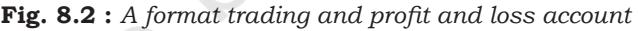

#### **Learning Objectives**

*After studying this chapter, you will be able to :*

- *• state the nature of the financial statements;*
- *• identify the various stakeholders and their information requirements;*
- *• distinguish between the capital and revenue expenditure and receipts;*
- *• explain the concept of trading and profit and loss account and its preparation;*
- *• State the nature of gross profit, net profit and operating profit;*
- *• describe the concept of balance sheet and its preparation;*
- *• explain grouping and marshalling of assets and liabilities;*
- *• prepare profit and loss account and balance sheet of a sole proprietory firm; and*
- *• m a k e a n opening entry.*

You have learnt that financial accounting is a well-defined sequential activity which begins with Journal (Journalising), Ledger (Posting), and preparation of Trial Balance (Balancing and Summarisation at the first stage). In the present chapter, we will take up the next step, namely, preparation of financial statements, and discuss the types of information requirements of various stakeholders, the distinction between capital and revenue items and its importance and the nature of financial statements and the preparation thereof.

## **8.1 Stakeholders and their Information Requirements**

Recall from chapter I (Financial Accounting Part I) that the objective of business is to communicate the meaningful information to various stakeholders in the business so that they can make informed decisions. A stakeholder is any person associated with the business. The stakes of various stakeholders can be monetary or non-monetary. The stakes can be active or passive; or can be direct or indirect. The owner and persons advancing loan to the business would have monetary stake. The government, consumer or a researcher will have non-monetary stake in the business. The stakeholders are also called users who are normally classified as *internal*  and *external* depending upon whether they are inside the business or outside the business. All users have different objectives for joining business and

Ch-8.indd 277 9/13/2022 2:49:08 PM

consequently different types of information requirements from it. In nutshell, the various users have diverse financial information requirements from the business.

For example we have classified the following into the category of internal and external users specifying their objectives and consequent information requirements.

| Name | Internal/ | Objective for participating | Accounting Information requirements |
| --- | --- | --- | --- |
|  | External | in business |  |
|  | users |  |  |
| Current | Internal | To make investment in the | Likes to know extent of profit in the |
| owners |  | business and wealth grow. | last accounting period, current |
|  |  |  | position of the assets/liabilities of the |
|  |  |  | business. |
| Manager | Internal | For a career. They essenti- | Accounting information in the form |
|  |  | ally act as the agent of | of financial statements is like their |
|  |  | owners (their employers). | report card and they are interested |
|  |  |  | in information about both profits |
| and |  |  | financial position. |
| Government | External | Its role is regulatory and | Its concerns are that the rights of all |
|  |  | tries to lay down the rules | stakeholders are protected. Since the |
|  |  | in the best public interest. | government levies taxes on the |
|  |  |  | business, they are interested in |
|  |  |  | information about profitability in |
|  |  |  | particular besides lot of other |
|  |  |  | information. |
| Prospective | External | He is expecting to make | He is interested in information about |
| owner |  | investments in the business | past profits and financial position as |
|  |  | with a view to make his | indicative of likely future performance. |
|  |  | investment and wealth grow. |  |
| Bank | External | Bank is interested in safety | Bank is interested in adequacy of |
|  |  | of the principal as well as | profits only as an assurance of the |
|  |  | the periodic return | return of principal and interest back |
|  |  | (interest). | in time. Bank is equally concerned |
|  |  |  | about the form in which the assets |
|  |  |  | are held by the business. When more |
|  |  |  | assets are held in cash or near cash |
|  |  |  | form, the aspect is knnown as |
|  |  |  | liquidity. |

**Fig. 8.1 :** *Analysis of various users of accounting information*

Ch-8.indd 278 9/13/2022 2:49:09 PM

### **Box 1**

Accounting Process (up to Trial balance) :

- 1. Identify the transactions, which that are recorded.
- 2. Record transactions in journal. Only those transactions are recorded which are measured in money terms. The system followed for recording is called double entry system whereby two aspects (debit and credit) of every transaction are recorded. Repeated transactions of same nature are recorded in subsidiary books, also called special journals. Instead of recording all transactions in journal, they are recorded in subsidiary books and the journal proper. For example, the business would record all credit sales in sales book and all credit purchases in purchases book. The other examples of subsidiary books are return inwards book, return outwards book. An other important special book is cash book, in which all cash and bank transactions are recorded. The entries, which are not recorded in any of these books, are recorded in a residual journal called *journal proper*.
- 3. The entries appearing in the above books are posted in the respective accounts in the ledger.
- 4. The accounts are balanced and listed in a statement called *trial balance*. If the total amounts of debit and credit balances agree, accounts are taken as free from arithmetical errors.
- 5. The trial balance forms the basis for making the financial statements, i.e. trading and profit and loss account and balance sheet.

## **8.2 Distinction between Capital and Revenue**

A very important distinction in accounting is between capital and revenue items. The distinction has important implications for making of the trading and profit and loss account and balance sheet. The revenue items form part of the trading and profit and loss account, the capital items help in the preparation of a balance sheet.

## *8.2.1 Expenditure*

Whenever payment and/or incurrence of an outlay are made for a purpose other than the settlement of an existing liability, it is called expenditure. The expenditures are incurred with a viewpoint they would give benefits to the business. The benefit of an expenditure may extend up to one accounting year or more than one year. If the benefit of expenditure extends up to one accounting period, it is termed as *revenue expenditure*. Normally, they are incurred for the day-to-day conduct of the business. An example can be payment of salaries, rent, etc. The salaries paid in the current period will not benefit the business in the next accounting period, as the workers have put in their efforts in the current accounting period. They will have to be paid the salaries in the next accounting period as well if they are made to work. If the benefit of expenditure extends more than one accounting period, it is termed

Ch-8.indd 279 9/13/2022 2:49:09 PM

as *capital expenditure*. An example can be payment to acquire furniture for use in the business. Furniture acquired in the current accounting period will give benefits for many accounting periods to come. The usual examples of capital expenditure can be payment to acquire fixed assets and/or to make additions/ extensions in the fixed assets.

Following points of distinction between capital expenditure and revenue expenditure are worth noting :

- (a) Capital expenditure increases earning capacity of business whereas revenue expenditure is incurred to maintain the earning capacity.
- (b) Capital expenditure is incurred to acquire fixed assets for operation of business whereas revenue expenditure is incurred on day-to-day conduct of business.
- (c) Revenue expenditure is generally recurring expenditure and capital expenditure is non-recurring by nature.
- (d) Capital expenditure benefits more than one accounting year whereas revenue expenditure normally benefits one accounting year.
- (e) Capital expenditure (subject to depreciation) is recorded in balance sheet whereas revenue expenditure (subject to adjustment for outstanding and prepaid amount) is transferred to trading and profit and loss account.

Sometimes, it becomes difficult to classify the expenditure into revenue or capital category. In normal usage, the advertising expenditure is termed as revenue expenditure. The heavy expenditure incurred on advertising is likely to benefit the business firm for more than one accounting period. Such revenue expenditures, which are likely to give benefit for more than one accounting period, are termed as *deferred revenue expenditure*.

It must be understood that expenditure is a wider term and includes expenses. Expenditure is any outlay made/incurred by the business firm. The part of the expenditure, which is perceived to have been used or consumed in the current year, is termed as expense of the current year.

Revenue expenditure is treated as an expense for the current year and is shown in trading and profit and loss account. For example, salary paid by the business firm is treated as an expense of the current year. Capital expenditures are charged to income statement and are spread over to more than one accounting period. Hence, furniture of ` 50,000 if expected to be used for 5 years will be treated as expense @ ` 10,000 per year. The name given for the expense is depreciation. The treatment of deferred revenue expenditure is same as of capital expenditure. They are also written-off over their expected period of benefit.

Ch-8.indd 280 9/13/2022 2:49:09 PM

## *8.2.2 Receipts*

The similar treatment is given to the receipts of the business. If the receipts imply an obligation to return the money, these are capital receipts. The example can be an additional capital brought in by the owner or a loan taken from the bank. Both receipts are leading to obligations, the first to the owner (called equity) and the other to the outsiders (called liabilities). Another example on a capital receipt can be the sale of a fixed asset like old machinery or furniture. However, if a receipt does not incur an obligation to return the money or is not in the form of a sale of fixed asset, it is termed as revenue receipt. The examples of revenue receipts sales made by the firm and interest on investment received by the firm.

## *8.2.3 Importance of Distinction between Capital and Revenue*

As stated earlier, the distinction between capital and revenue items has important implications for the preparation of trading and profit and loss account and the balance sheet as all items of revenue value are to the shown in the trading and profit and loss account and the items of capital nature in the balance sheet. If any item is wrongly classified, i.e. if any item of revenue nature is treated as capital item or vice-versa, the ascertainment of profit or loss will be incorrect. For example, the revenues earned during an accounting period are ` 10,00,000 and the expenses shown are ` 8,00,000, the profit shall work out as ` 2,00,000. On scrutiny of the details, you find that a revenue item of ` 20,000 (an expenditure on repairs of machinery) has been treated as capital expenditure (added to the cost of machinery and debited to machinery account, not to repairs account), and hence, does not form part of the expenses for the period. It means the actual expenses for the period are ` 8,20,000 and not ` 8,00,000. So, the correct profit is ` 1,80,000, not ` 2,00,000. In other words, the profit has been over stated. Similarly, if any capital expenditure is wrongly shown as revenue expenditure (for example, purchase of furniture shown as purchases), it will result in under statement of profits, and also an under statement of assets. Thus, the financial statements will not reflect the true and fair view of the affairs of the business. Hence, it is necessary to identify the correct nature of each item and treat it accordingly in the book of accounts. It is also important from taxation point of view because capital profits are taxed differently from revenue profits.

## **8.3 Financial Statements**

It has been emphasised that various users have diverse informational requirements. Instead of generating particular information useful for specific users, the business prepares a set of financial statements, which in general satisfies the informational needs of the users.

Ch-8.indd 281 9/13/2022 2:49:09 PM

The basic objectives of preparing financial statements are :

- (a) To present a true and fair view of the financial performance of the business;
- (b) To present a true and fair view of the financial position of the business; and

For this purpose, the firm usually prepares the following financial statements:

- 1. Trading and Profit and Loss Account
- 2. Balance Sheet1

Trading and Profit and Loss account, also known as Income statement, shows the financial performance in the form of profit earned or loss sustained by the business. Balance Sheet shows financial position in the form of assets, liabilities and capital. These are prepared on the basis of trial balance and additional information, if any.

#### *Example 1*

Observe the following trial balance of Ankit and signify correctly the various elements of accounts and you will notice that the debit balances represent either assets or expenses/ losses and the credit balance represent either equity/liabilities or revenue/gains.

[This trial balance of Ankit will be used throughout the chapter to understand the process of preparation of financial statements]

| Account Title | L.F. | Debit | Credit |
| --- | --- | --- | --- |
|  |  | Amount | Amount |
|  |  | ` | ` |
| Cash |  | 1,000 |  |
| Capital |  |  | 12,000 |
| Bank |  | 5,000 |  |
| Sales |  |  | 1,25,000 |
| Wages |  | 8,000 |  |
| Creditors |  |  | 15,000 |
| Salaries |  | 25,000 |  |
| 10% Long term loan (raised on April 01, 2016) |  |  | 5,000 |
| Furniture |  | 15,000 |  |
| Commission received |  |  | 5,000 |
| Rent of building |  | 13,000 |  |
| Debtors |  | 15,500 |  |
| Bad debts |  | 4,500 |  |
| Purchases |  | 75,000 |  |
|  |  | 1,62,000­ ­ | 1,62,000 |

**Trial Balance of Ankit as on March 31, 2017**

1 The balance sheet and profit and loss account are now called position statement and statement of profit and loss in the company's financial statements. Since Chapters 8 and 9 deal with the preparation of financial statements of sole proprietorship firm, the terms balance sheet and profit and loss account are retained.

Ch-8.indd 282 9/13/2022 2:49:09 PM

| Account Title | Elements | L.F. Debit | Credit |
| --- | --- | --- | --- |
|  |  | Amount Amount |  |
|  |  | ` | ` |
| Cash | Asset | 1,000 | ­ |
| Capital | Equity |  | 12,000­ |
| Bank | Asset | 5,000 | ­ |
| Sales | Revenue |  | 1,25,000­ |
| Wages | Expense | 8,000 | ­ |
| Creditors | Liability |  | 15,000 |
| Salaries | Expense | 25,000 | ­ |
| 10% Long-term loan | Liability |  | 5,000­ |
| (raised on April 01, 2016) |  |  |  |
| Furniture | Asset | 15,000 | ­ |
| Commission received | Revenue |  | 5,000­ |
| Rent of building | Expense | 13,000 | ­ |
| Debtors | Asset | 15,500 | ­ |
| Bad debts | Expense | 4,500 | ­ |
| Purchases | Expense | 75,000 |  |
|  |  | 1,62,000 | 1,62,000 |

| Analysis of Trial Balance of Ankit as on March 31, 2017 |
| --- |

## **8.4 Trading and Profit and Loss Account**

Trading and Profit and Loss account is prepared to determine the profit earned or loss sustained by the business enterprise during the accounting period. It is basically a summary of revenues and expenses of the business and calculates the net figure termed as profit or loss. Profit is revenue *less* expenses. If expenses are more than revenues, the figure is termed as *loss*. Trading and Profit and Loss account summarises the performance for an accounting period. It is achieved by transferring the balances of revenues and expenses to the trading and profit and loss account from the trial balance. Trading and Profit and Loss account is also an account with *Debit and Credit* sides. It can be observed that debit balances (representing expenses) and losses are transferred to the debit side of the Trading and a Profit and Loss account and credit balance (representing revenues/gains) are transfered to its credit side.

## *8.4.1 Relevant Items in Trading and Profit and Loss Account*

The different items appearing in the trading and profit and loss account are explained hereunder:

*Items on the debit side*

- (i) *Opening stock* : It is the stock of goods in hand at the beginning of the accounting year. This is the stock of goods which has been carried
Ch-8.indd 283 9/13/2022 2:49:09 PM

forward from the previous year and remains unchanged during the year and appears in the trial balance. In the trading account it appears on the debit side because it forms the part of cost of goods sold for the current accounting year.

- (ii) *Purchases less returns* : Goods, which have been bought for resale appears as purchases on the debit side of the trading account. They include both cash as well as credit purchases. Goods which are returned to suppliers are termed as purchases return. It is shown by way of deduction from purchases and the computed amount is known as *Net purchases*.
- (iii) *Wages* : Wages refer to renumeration paid to workers who are directly engaged in factory for loading, unloading and production of goods and are debited to trading account.
- (iv) *Carriage inwards/Freight inwards:* These expenses are the items of transport expenses, which are incurred on bringing materials/goods purchased to the place of business. These items are paid in respect of purchases made during the year and are debited to the trading account.
- (v) *Fuel/Water/Power/Gas* : These items are used in the production process and hence are part of expenses.
- (vi) *Packaging material and Packing charges* : Cost of packaging material used in the product are direct expenses as it refers to small containers which form part of goods sold. However, the packing refers to the big containers that are used for transporting the goods and is regarded as an indirect expense debited to profit and loss account.
- (vii) *Salaries* : These include salaries paid to the administration, godown and warehouse staff for the services rendered by them for running the business. If salaries are paid in kind by providing certain facilities (called perks) to the employees such as rent free accommodation, meals, uniform, medical facilities should also be regarded as salaries and debited to the profit and loss account.
- (viii) *Rent paid* : These include office and godown rent, municipal rates and taxes, factory rent, rates and taxes. The amount of rent paid is shown on the debit side of the profit and loss account.
	- (ix) *Interest paid* : Interest paid on loans, bank overdraft, renewal of bills of exchange, etc. is an expense and is debited to profit and loss account.
	- (x) *Commission paid:* Commission paid or payable on business transactions undertaken through the agents is an item of expense and is debited to profit and loss account.

Ch-8.indd 284 9/13/2022 2:49:09 PM

- (xi) *Repairs* : Repairs and small renewals/ replacements relating to plant and machinery, furniture, fixtures, fittings, etc. for keeping them in working condition are included under this head. Such expenditure is debited to profit and loss account.
- (xii) *Miscellaneous expenses* : Though expenses are classified and booked under different heads, but certain expenses being of small amount clubbed together and are called miscellaneous expenses. In normal usage these expenses are called *Sundry expenses* or *Trade expenses*.

*Items on the credit side*

- (i) *Sales less returns* : Sales account in trial balance shows gross total sales(cash as well as credit) made during the year. It is shown on the credit side of the trading account. Goods returned by customers are called return inwards and are shown as deduction from total sales and the computed amount is known as net sales.
- (ii) *Other incomes* : Besides salaries and other gains and incomes are also recorded in the profit and loss account. Examples of such incomes are rent received, dividend received, interest received, discount received, commission received, etc.

## *8.4.2 Closing Entries*

The preparation of trading and profit and loss account requires that the balances of accounts of all concerned items are transferred to it for its compilation.

- Opening stock account, Purchases account, Wages account, Carriage inwards account and direct expenses account are closed by transferring to the debit side of the trading and profit and loss account.
This is done by recording the following entry :

Trading A/c Dr. To Opening stock A/c To Purchases A/c To Wages A/c To Carriage inwards A/c To All other direct expenses A/c

- The purchases returns or return outwards are closed by transferring its balance to the purchases account. The following entry is recorded for this purpose :
Purchases return A/c Dr. To Purchases A/c

Ch-8.indd 285 9/13/2022 2:49:09 PM

| • | Similarly, the sales returns or returns inwards account is closed by |  |  |  |
| --- | --- | --- | --- | --- |
|  | transferring its balance to the sales account as : |  |  |  |
|  | Sales A/c | Dr. |  |  |
|  | To Sales return A/c |  |  |  |
| • | The sales account is closed by transferring its balance to the credit side of |  |  |  |
|  | the trading and profit and loss account by recording the following entry: |  |  |  |
|  | Sales A/c | Dr. |  |  |
|  | To Trading A/c |  |  |  |
|  | Items of expenses, losses, etc. are closed by recording the following entries: |  |  |  |
|  | Profit and Loss A/c | Dr. |  |  |
|  | To Expenses (individually) A/c |  |  |  |
|  | To Losses (individually) A/c |  |  |  |
|  | Items of incomes, gains, etc. are closed by recording the following entry: |  |  |  |
|  | Incomes (individually) A/c | Dr. |  |  |
|  | Gains (individually) A/c Dr. |  |  |  |
|  | To Profit and Loss A/c |  |  |  |
|  | The posting for closing the seven accounts of expenses and revenues as they |  |  |  |
|  | appear in the trial balance (in our example 1) are given below: |  |  |  |
| (i) | For closing the accounts of expenses |  |  |  |
|  | Trading A/c Dr. |  | 83,000 |  |
|  | To Purchases A/c |  |  | 75,000 |
|  | To Wages A/c |  |  | 8,000 |
| (ii) | Profit and Loss A/c Dr. |  | 43,500 |  |
|  | To Salaries |  |  | 25,000 |
|  | To Rent of building |  |  | 13,000 |
|  | To Bad debts |  |  | 4,500 |
| (i) | For closing the accounts of revenues |  |  |  |
|  | Sales A/c Dr. |  | 1,25,000 |  |
|  | To Trading A/c |  |  | 1,25,000 |
| (ii) | Commission received A/c Dr. |  | 5,000 |  |
|  | To Profit and Loss A/c |  |  | 5,000 |
|  | The posting done in ledger will appear as follows : |  |  |  |

#### **Purchases Account**

| Dr. |  |  |  |  |  |  |  | Cr. |
| --- | --- | --- | --- | --- | --- | --- | --- | --- |
| Date | Particulars | J.F. | Amount | Date | Particulars | J.F. | Amount |  |
|  |  |  | ` |  |  |  | ` |  |
|  | Balance b/d |  | 75,000­ |  | Trading |  | 75,000 |  |
|  |  |  | 75,000­ |  |  |  | 75,000 |  |

Ch-8.indd 286 9/13/2022 2:49:09 PM

| Dr. |  |  |  |  |  |  | Cr. |
| --- | --- | --- | --- | --- | --- | --- | --- |
| Date | Particulars | J.F. | Amount | Date | Particulars | J.F. | Amount |
|  |  |  | ` |  |  |  | ` |
|  | Balance b/d |  | 8,000­ |  | Trading |  | 8,000 |
| ­ |  |  | 8,000­ ­ |  |  |  | 8,000 |
|  |  |  |  | Salaries Account |  |  |  |

**Dr. Cr.**

**Wages Account**

| Date Particulars | J.F. | Amount | Date | Particulars | J.F. | Amount |
| --- | --- | --- | --- | --- | --- | --- |
|  |  | ` |  |  |  | ` |
| Balance b/d |  | 25,000­ |  | Profit and Loss­ |  | 25,000 |
|  |  | 25,000­ |  |  |  | 25,000 |
|  |  |  | Rent of Building Account |  |  |  |
| Dr. |  |  |  |  |  | Cr. |
| Date Particulars | J.F. | Amount | Date | Particulars | J.F. | Amount |

|  |  | ` |  | ` |
| --- | --- | --- | --- | --- |
|  | Balance b/d­ | 13,000­ | Profit and Loss­ | 13,000 |
| ­ |  | 13,000­ ­ |  | 13,000 |

| Bad Debts Account |
| --- |

| Dr. |  |  |  |  |  |  | Cr. |
| --- | --- | --- | --- | --- | --- | --- | --- |
| Date | Particulars | J.F. | Amount | Date | Particulars | J.F. | Amount |
|  |  |  | ` |  |  |  | ` |
|  | Balance b/d |  | 4,500­ |  | Profit and Loss­ |  | 4,500 |
| ­ |  |  | 4,500­ ­ |  |  |  | 4,500 |

#### **Sales Account**

| Dr. |  |  |  |  |  |  | Cr. |
| --- | --- | --- | --- | --- | --- | --- | --- |
| Date | Particulars | J.F. | Amount | Date | Particulars | J.F. | Amount |
|  |  |  | ` |  |  |  | ` |
|  | Trading |  | 1,25,000­ |  | Balance b/d­ |  | 1,25,000 |
| ­ |  |  | 1,25,000­ |  |  |  | 1,25,000 |

#### **Commission Received Account**

| Dr. |  |  |  |  |  |  |  | Cr. |
| --- | --- | --- | --- | --- | --- | --- | --- | --- |
| Date | Particulars | J.F. | Amount | Date | Particulars | J.F. | Amount |  |
|  |  |  | ` |  |  |  | ` |  |
|  | Profit and Loss |  | 5,000­ |  | Balance b/d­ |  | 5,000 |  |
| ­ |  |  | 5,000­ ­ |  |  |  | 5,000 |  |

Ch-8.indd 287 9/13/2022 2:49:09 PM

As result of the foregoing discussion, we will now learn how the trading and profit and loss account can be prepared from the trial balance, the format of which is shown in figure 8.2. However, this list is not exhaustive. In real sense, there can be many more of other items, which we will be dealing at the later stage and there you will notice how this format undergoes a change with respect to each one of them.

| Dr. |  |  | Cr. |
| --- | --- | --- | --- |
| Expenses/Losses | Amount | Revenues/Gains | Amount |
|  | ` |  | ` |
| Opening stock |  | Sales |  |
| Purchases |  |  |  |
| Wages |  |  |  |
| Carriage inwards/ |  |  |  |
| Freight inwards/cartage |  |  |  |
| Gross profit c/d1 |  |  |  |
| Gross loss b/d2 |  |  |  |
|  | xxx |  | xxx |
|  |  | Gross loss c/d1 |  |
|  |  | Gross profit b/d |  |
| Rent/rates and taxes |  | Inerest received |  |
| Salaries |  |  |  |
| Repairs and renewals | ­ | Net loss2 |  |
| Bad debts | ­ |  |  |
| Net profit2 (transferred to | ­ |  |  |
| capital account) |  |  |  |
|  | xxx ­ |  | xxx |

#### **Trading and Profit and Loss Account of ABC for the year ended March 31, 2017**

1,2*either of the items computed*

## *8.4.3 Concept of Gross Profit and Net Profit*

The trading and profit and loss can be seen as combination of two accounts, viz. Trading account and Profit and Loss account. The trading account or the first part ascertains the *gross profit* and profit and loss account or the second part ascertains *net profit*.

## *Trading Account*

The trading account ascertains the result from basic operational activities of the business. The basic operational activity involves the manufacturing, purchasing and selling of goods. It is prepared to ascertain whether the selling

Ch-8.indd 288 9/13/2022 2:49:09 PM

of goods and/or rendering of services to customers have proved profitable for the business or not. Purchases is one of the main constituents of expenses in business organisation. Besides purchases, the remaining expenses are divided into two categories, viz. *direct expenses and indirect* expenses.

*Direct expenses* means all expenses directly connected with the manufacture, purchase of goods and bringing them to the point of sale. Direct expenses include carriage inwards, freight inwards, wages, factory lighting, coal, water and feul, royalty on production, etc. In our example-1, besides purchases, four more items of expenses are listed. These are wages, salaries, rent of building and bad debts. Out of these items, wages is treated as *direct expense* while the other three are treated as *indirect expenses*.

Similarly, *sales* constitute the main item of revenue for the business. The excess of sales over purchases and direct expenses is called *gross profit*. If the amount of purchases including direct expenses is more than the sales revenue, the resultant figure is *gross loss*. The computation of gross profit can be shown in the form of equation as :

Gross Profit = Sales – (Purchases + Direct Expenses)

The gross profit or the gross loss is transferred to profit and loss account.

The *indirect expenses* are transferred to the debit side of the second part, viz. profit and loss account. All revenue/gains other than *sales* are transferred to the credit side of the profit and loss account. If the total of the credit side of the profit and loss account is more than the total of the debit side, the difference is the *net profit* for the period of which it is being prepared. On the other hand, if the total of the debit side is more than the total of the credit side, the difference is the *net loss* incurred by the business firm. In an equation form, it is shown as follows :

Net Profit = Gross Profit + Other Incomes – Indirect Expenses Net profit or net loss so computed is transferred to the capital account in the balance sheet by way of the following entry :

| (i) | For transfer of net profit |  |
| --- | --- | --- |
|  | Profit and Loss A/c | Dr. |
|  | To Capital A/c |  |
| (ii) | For transfer of net loss |  |
|  | Capital A/c | Dr. |

To Profit and Loss A/c

We are now redrafting the trading and profit and loss account to show gross profit and net profit of Ankit for the year ended March 31, 2017. The redrafted trading and profit and loss account will look like as shown is shown in figure 8.3.

Ch-8.indd 289 9/13/2022 2:49:09 PM

| Dr. |  |  | Cr. |
| --- | --- | --- | --- |
| Expenses/Losses | Amount | Revenues/Gains | Amount |
|  | ` |  | ` |
| Purchases | 75,000 | Sales | 1,25,000 |
| Wages | 8,000­ ­ |  |  |
| Gross profit c/d | 42,000 |  |  |
|  | 1,25,000­ ­ |  | 1,25,000 |
| Salaries | 25,000 | Gross profit b/d | 42,000 |
| Rent of building | 13,000 | Commission received | 5,000 |
| Bad debts | 4,500­ ­ |  |  |
| Net Profit (transfered to | 4,500 |  |  |
| capital account) |  |  |  |
|  | 47,000­ ­ |  | 47,000 |

## **Trading and Profit and Loss Account of Ankit for the year ended March 31, 2017**

**Fig. 8.3 :** *Showing the computation of gross profit and net profit of Ankit*

Gross profit, which represents the basic operational activity of the business is computed as ` 42,000. The gross profit is transferred from trading account to profit and loss account. Besides gross profit, business has earned an income of ` 5,000 as commission received and has spent ` 42,500 (` 25,000 + `13,000 + `4,500) on expenses/losses including salaries, rent and bad debts. Therefore, the net profit is calculated as ` 4,500.

#### *Illustration 1*

Prepare a trading account from the following particulars for the year ended March 31,2017:

|  | ` |
| --- | --- |
| Opening stock | 37,500 |
| Purchases | 1, 05,000 |
| Sales | 2,70,000 |
| Wages | 30,000 |

*Solution*

#### **Trading Account for the year ended March 31, 2017**

| Dr. |  |  | Cr. |
| --- | --- | --- | --- |
| Expenses/Losses | Amount | Revenues/Gains | Amount |
|  | ` |  | ` |
| Opening stock | 37,500 | Sales | 2,70,000 |
| Purchases | 1,05,000 |  |  |
| Wages | 30,000 |  |  |
| Gross profit | 97,500 |  |  |
|  | 2,70,000­­ ­­­ |  | 2,70,000 |

Ch-8.indd 290 9/13/2022 2:49:09 PM

#### *Illustration 2*

Prepare a trading account of M/s Prime Products from the following particulars pertaining to the year 2016-17.

| Opening stock | ` 50,000 |
| --- | --- |
| Purchases | 1,10,000 |
| Return inwards | 5,000 |
| Sales | 3,00,000 |
| Return outwards | 7,000 |
| Factory rent | 30,000 |
| Wages | 40,000 |

*Solution*

#### **Books of Prime Products Trading Account for the year ended March 31, 2017**

| Dr. |  |  |  |  | Cr. |
| --- | --- | --- | --- | --- | --- |
| Expenses/Losses |  | Amount | Revenues/Gains |  | Amount |
|  |  | ` |  |  | ` |
| Opening stock |  | 50,000 | Sales | 3,00,000 |  |
| Purchases | 1,10,000 |  | ­ ­Less : Return | (5,000) | 2,95,000 |
| Less : Return | (7,000) | 1,03,000 | inwards­­­­­­ |  |  |
| outwards |  |  |  |  |  |
| Factory rent |  | 30,000 |  |  |  |
| Wages |  | 40,000 |  |  |  |
| Gross profit |  | 72,000 |  |  |  |
|  | ­­­­­­­ | 2,95,000­ ­­­­­­­ |  |  | 2,95,000 |

#### *Illustration 3.*

Prepare a trading account of M/s Anjali from the following information related to March 31, 2017.

| Opening stock | 60,000 |
| --- | --- |
| Purchases | 3, 00,000 |
| Sales | 7, 50,000 |
| Purchases return | 18,000 |
| Sales return | 30,000 |
| Carriage on purchases | 12,000 |
| Carriage on sales | 15,000 |
| Factory rent | 18,000 |
| Office rent | 18,000 |
| Dock and Clearing charges | 48,000 |
| Freight and Octroi | 6,500 |
| Coal, Gas and Water | 10,000 |

`

Ch-8.indd 291 9/13/2022 2:49:09 PM

*Solution*

#### **Books of Anjali Trading Account for the year ended March 2017**

| Dr. |  |  |  |  | Cr. |
| --- | --- | --- | --- | --- | --- |
| Expenses/Losses |  | Amount | Revenues/Gains |  | Amount |
|  |  | ` |  |  | ` |
| Opening stock |  | 60,000 | Sales | 7,50,000 |  |
| Purchases | 3,00,000 |  | Less : Sales return | (30,000)­ ­7,20,000 |  |
| Less : Purchases return | (18,000) | 2,82,000 |  |  |  |
| Carriage on purchases |  | 12,000 |  |  |  |
| Factory rent | ­ ­ | 18,000 |  |  |  |
| Dock and Clearing charges |  | 48,000 |  |  |  |
| Freight and Octroi |  | 6,500 |  |  |  |
| Coal, Gas and Water |  | 10,000 |  |  |  |
| Gross profit |  | 2,83,500 |  |  |  |
|  |  | 7,20,000­ |  |  | 7,20,000 |

#### *Illustration 4*

From the following information, prepare a profit and loss account for the year ending March 31, 2017.

|  | ` |
| --- | --- |
| Gross profit | 60,000 |
| Rent | 5,000 |
| Salary | 15,000 |
| Commission paid | 7,000 |
| Interest paid on loan | 5,000 |
| Advertising | 4,000 |
| Discount received | 3,000 |
| Printing and stationery | 2,000 |
| Legal charges | 5,000 |
| Bad debts | 1,000 |
| Depreciation | 2,000 |
| Interest received | 4,000 |
| Loss by fire | 3,000 |

#### **Profit and Loss Account for the year ended March 31, 2017**

| Dr. |  |  | Cr. |
| --- | --- | --- | --- |
| Expenses/Losses | Amount | Revenues/Gains | Amount |
|  | ` |  | ` |
| Rent | 5,000 | Gross profit | 60,000 |
| Salary | 15,000 | Discount received | 3,000 |
| Commission | 7,000 | Interest received | 4,000 |
| Interest paid on loan | 5,000 |  |  |
| Advertising | 4,000 |  |  |
| Printing and Stationery | 2,000 |  |  |
| Legal charges | 5,000 |  |  |

Ch-8.indd 292 9/13/2022 2:49:09 PM

| Bad debts | 1,000 |  |
| --- | --- | --- |
| Depreciation | 2,000 |  |
| Loss by fire | 3,000 |  |
| Net profit (transferred to the | 18,000 |  |
| capital account) |  |  |
|  | 67,000­ | 67,000 |

### **Test Your Understanding - I**

## **I State True or False :**

- (i) Gross profit is total revenue.
- (ii) In trading and profit and loss account, opening stock appears on the debitside because it forms the part of the cost of sales for the current accounting year.
- (iii) Rent, rates and taxes is an example of direct expenses.
- (iv) If the total of the credit side of the profit and loss account is more than the total of the debit side, the difference is the net profit.

### **II Match the items given under 'A' with the correct items under 'B'**

- (i) Closing stock is credited to (a) Trial balance
- (ii) Accuracy of book of account is tested by (b) Trading account
- (iii) On returning the goods to seller, the buyer sends (c) Credit note
- (iv) The financial position is determined by (d) Balance sheet
- (v) On receiving the returned goods from the (e) Debit note buyer, the seller sends
- 
- 
- 
- 
- 

## *8.4.4 Cost of Goods Sold and Closing Stock–Trading Account Revisited*

The trading and profit and loss account prepared in figure 8.3 presents useful information as to the profitability from the basic operations of the business enterprise. It is reproduced for further perusal.

#### **Trading Account of Ankit for the year ended March 31, 2017**

| Dr. |  |  | Cr. |
| --- | --- | --- | --- |
| Expenses/Losses | Amount | Revenues/Gains | Amount |
|  | ` |  | ` |
| Purchases | 75,000 | Sales | 1,25,000 |
| Wages | 8,000­ ­ |  |  |
| Gross profit | 42,000­ ­ |  |  |
|  | 1,25,000­ ­ |  | 1,25,000 |

**Fig. 8.4 :** *An illutrative trading account of Ankit*

Ch-8.indd 293 9/13/2022 2:49:09 PM

If there is no opening or closing stock, the total of purchases and direct expenses is taken as *Cost of goods sold*. In our example, notice that purchases amount to ` 75,000 and wages amounts to ` 8,000. Hence, the cost of goods sold will be computed using the following formula :

Cost of Goods Sold = Purchases + Direct Expenses = $75,000+$ 8,000 = $83,000$

As there is no unsold stock, the presumption here is that all the goods purchased have been sold. But in practice, there is some unsold goods at the end of the accounting period.

In our example, let us assume that out of the goods purchased amounting to ` 75,000 in the current year, Ankit is able to sell goods costing ` 60,000 only. In such a situation, the business will have an unsold stock of goods costing ` 15,000 in hand, also called closing stock. The amount of cost of goods sold will be computed as per the following equation :

> Cost of Goods Sold = Purchases + Direct Expenses – Closing Stock = ` 75,000 + ` 8,000 – ` 15,000

As a result, the amount of gross profit will also change with the existence of closing stock in business from ` 42,000 (as computed in figure 8.4) to ` 57,000 (refer figure 8.5).

| Expenses/Losses | Amount | Revenues/Gains | Amount |
| --- | --- | --- | --- |
|  | ` |  | ` |
| Purchases | 75,000 | Sales | 1,25,000 |
| Wages | 8,000 | Closing stock | 15,000 |
| Gross profit c/d | 57,000­ ­ |  |  |
|  | 1,40,000­ ­ |  | 1,40,000 |
| Salaries | 25,000 | Gross profit b/d | 57,000 |
| Rent of building | 13,000 | Commission received | 5,000 |
| Bad debts | 4,500­ ­ |  |  |
| Net Profit (transfered to | 19,500­ ­ |  |  |
| capital account) |  |  |  |
|  | 62,000­ ­ |  | 62,000 |

|
|  |

**Fig. 8.5 :** *The trading account of Ankit*

Ch-8.indd 294 9/13/2022 2:49:09 PM

It may be noted that closing stock does not normally form part of trial balance, and is brought into books with the help of the following journal entry :

> Closing stock A/c Dr. To Trading A/c

This entry opens a new account of asset, i.e. closing stock ` 15,000 which is transferred to the balance sheet. The closing stock shall be an opening stock for the next year and shall be sold during the year. In most cases, therefore, the business shall have opening stock as well as closing stock every year, and the cost of goods sold should be worked as per the following equation:

Cost of Goods Sold = Opening Stock+Purchases Direct Expenses–Closing Stock

Look at Illustration 5 and see how it has been computed.

*Illustration 5*

Compute cost of goods sold for the year 2017 with the help of the following information and prepare trading account

|  | ` |
| --- | --- |
| Sales | 20, 00,000 |
| Purchases | 15, 00,000 |
| Wages | 1, 00,000 |
| Stock (Apr. 01, 2016) | 3, 00,000 |
| Stock (March 31, 2017) | 4,00,000 |
| Freight inwards | 1,00,000 |

*Solution*

| Particulars | Amount |
| --- | --- |
|  | ` |
| Opening stock | 3,00,000 |
| Add Purchases | 15,00,000 |
| Direct expenses : |  |
| Freight inwards­ | 1,00,000 |
| Wages­­ | 1,00,000 |
|  | 20,00,000 |
| Less Closing stock | (4,00,000) |
| Cost of goods sold | 16,00,000 |

## **Computation of Cost of Goods Sold**

Ch-8.indd 295 9/13/2022 2:49:09 PM

#### **Trading Account for the year ended March 31, 2017**

| Dr. |  |  | Cr. |
| --- | --- | --- | --- |
| Expenses/Losses | Amount | Revenues/Gains | Amount |
|  | ` |  | ` |
| Opening stock | 3,00,000 | Sales | 20,00,000 |
| Purchases | 15,00,000 | Closing stock | 4,00,000 |
| Freight inwards | 1,00,000 |  |  |
| Wages | 1,00,000 |  |  |
| Gross profit | 4,00,000 |  |  |
|  | 24,00,000­ |  | 24,00,000 |

#### *Illustration 6*

From the following balances obtained from the few accounts of Mr. H. Balaram. Prepare the Trading and Profit and Loss Account.

|  | ` |  | ` |
| --- | --- | --- | --- |
| Stock on Apr. 01, 2016 | 8,000 | Bad debts | 1,200 |
| Purchases for the year | 22,000 | Rent | 1,200 |
| Sales for the year | 42,000 | Discount allowed | 600 |
| Purchase expenses | 2,500 | Commission paid | 1,100 |
| Salaries and wages | 3,500 | Sales expenses | 600 |
| Advertisement | 1,000 | Repairs | 600 |

Closing stock on March 31, 2017 is ` 4,500

#### **Books of H. Balaram Trading Account for the year ended March 31, 2017**

| Dr. |  |  | Cr. |
| --- | --- | --- | --- |
| Expenses/Losses | Amount | Revenues/Gains | Amount |
|  | ` |  | ` |
| Opening stock | 8,000 | Sales | 42,000 |
| Purchases | 22,000 | Closing stock | 4,500 |
| Purchase expenses | 2,500 |  |  |
| Gross profit c/d | 14,000­ ­ |  |  |
|  | 46,500 |  | 46,500 |
| Salaries and Wages | 3,500 | Gross profit b/d | 14,000 |
| Rent | 1,200­ ­ |  |  |
| Advertisement | 1,000­ ­ |  |  |
| Commission | 1,100­ ­ |  |  |
| Discount allowed | 600­ ­ |  |  |
| Bad debts | 1,200­ ­ |  |  |
| Sales expenses | 600­ ­ |  |  |
| Repairs | 600­ ­ |  |  |
| Net profit | 4,200 |  |  |
| (transferred to capital account) |  |  |  |
|  | 14,000 ­ |  | 14,000 |

Ch-8.indd 296 9/13/2022 2:49:09 PM

## **8.5 Operating Profit (EBIT)**

It is the profit earned through the normal operations and activities of the business. Operating profit is the excess of operating revenue over operating expenses. While calculating operating profit, the incomes and expenses of a purely financial nature are not taken into account. Thus, operating profit is profit before interest and tax (EBIT). Similarly, abnormal items such as loss by fire, etc. are also not taken into account. It is calculated as follows:

Operating profit = Net Profit +Non Operating Expenses – Non Operating Incomes

Refer to the trial balance of Ankit in example 1 (Page no. 294), you will notice that it depicts an item relating to 10% interest on long-term loan raised on April 01, 2017. The amount of interest works out to ` 500 (` 5,000 × 10/100), which has been shown on the debit side of the trading and profit and loss account (figure 8.6).

| Expenses/Losses | Amount | Revenues/Gains | Amount |
| --- | --- | --- | --- |
|  | ` |  | ` |
| Purchases | 75,000 | Sales | 1,25,000 |
| Wages | 8,000 | Closing stock | 15,000 |
| Gross profit c/d | 57,000­ ­ |  |  |
|  | 1,40,000­ ­ |  | 1,40,000 |
| Salaries | 25,000 | Gross profit b/d | 57,000 |
| Rent of building | 13,000 | Commission received | 5,000 |
| Bad debts | 4,500­ ­ |  |  |
| Interest | 500­ ­ |  |  |
| Net Profit (transferred | 19,000­ ­ |  |  |
| to capital account) |  |  |  |
|  | 62,000­ ­ |  | 62,000 |

| Trading and Profit and Loss Account of Ankit |
| --- |
| for the year ended March 31, 2017 |

**Dr. Cr.**

**Fig. 8.6 :** *Showing the treatment of interest on profit*

The operating profit will be :

Operating profit = Net profit + Non-operating expenses – Non-operating incomes Operating profit = ` 19,000+ 500 – nil = ` 19,500

Ch-8.indd 297 9/13/2022 2:49:09 PM

|  |  | Test Your Understanding - II |
| --- | --- | --- |
|  |  | Choose the correct option in the following questions : |
| 1. |  | The financial statements consist of: |
|  | (i) | Trial balance |
|  | (ii) | Profit and loss account |
|  | (iii) | Balance sheet |
|  | (iv) | (i) & (iii) |
|  | (v) | (ii) & (iii) |
| 2. |  | Choose the correct chronological order of ascertainment of the following profits from |
|  |  | the profit and loss account : |
|  | (i) | Operating Profit, Net Profit, Gross Profit |
|  | (ii) | Operating Profit, Gross Profit, Net Profit |
|  | (iii) | Gross Profit, Operating Profit, Net Profit |
|  | (iv) | Gross Profit, Net Profit, Operating Profit |
| 3. |  | While calculating operating profit, the following are not taken into account. |
|  | (i) | Normal transactions |
|  | (ii) | Abnormal items |
|  | (iii) | Expenses of a purely financial nature |
|  | (iv) | (ii) & (iii) |
|  | (v) | (i) & (iii) |
| 4. |  | Which of the following is correct : |
|  | (i) | Operating Profit = Operating profit – Non-operating expenses – Non-operating |
|  |  | incomes |
|  | (ii) | Operating profit = Net profit + Non-operating Expenses + Non-operating incomes |
|  | (iii) | Operating profit = Net profit + Non-operating Expenses – Non-operating incomes |
|  | (iv) | Operating profit = Net profit – Non-operating Expenses + Non-operating incomes |

#### *Illustration 7*

Following balance is extracted from the books of a trader ascertain gross profit, operating profit and net profit for the year ended March 31, 2017.

| Particulars | Amount |
| --- | --- |
|  | ` |
| Sales | 75,250 |
| Purchases | 32,250 |
| Opening stock | 7,600 |
| Sales return | 1,250 |
| Purchases return | 250 |
| Rent | 300 |
| Stationery and printing | 250 |
| Salaries | 3,000 |
| Misc. expenses | 200 |
| Travelling expenses | 500 |
| Advertisement | 1,800 |

Ch-8.indd 298 9/13/2022 2:49:09 PM

| Commission paid | 150 |
| --- | --- |
| Office expenses | 1,600 |
| Wages | 2,600 |
| Profit on sale of investment | 500 |
| Depreciation | 800 |
| Dividend on investment | 2,500 |
| Loss on sale of old furniture | 300 |

Closing stock (March 31, 2017) valued at ` 8,000

#### **Trading and Profit and Loss Account for the year ended March 31, 2017**

| Dr. |  |  |  |  | Cr. |
| --- | --- | --- | --- | --- | --- |
| Expenses/Losses |  | Amount | Revenues/Gains |  | Amount |
|  |  | ` |  |  | ` |
| Opening stock |  | 7,600 | Sales 75,250­ |  |  |
| Purchases | 32,250 |  | Less : Sales return (1,250) |  | 74,000 |
| Less: Purchases return­ ­ | (250) | 32,000 | Closing stock |  | 8,000 |
| Wages |  | 2,600­ ­ ­ |  |  |  |
| Gross profit c/d |  | 39,800 |  |  |  |
|  |  | 82,000­ ­ ­ |  |  | 82,000 |
| Rent |  | 300 | Gross profit b/d |  | 39,800 |
| Stationery and printing­ ­ |  | 250­ ­ ­ |  |  |  |
| Salaries |  | 3,000­ ­ ­ |  |  |  |
| Misc. expenses |  | 200­ ­ ­ |  |  |  |
| Travelling expenses |  | 500­ ­ ­ |  |  |  |
| Advertisement expenses­ ­ |  | 1,800­ ­ ­ |  |  |  |
| Commission paid |  | 150­ ­ ­ |  |  |  |
| Office expenses |  | 1,600­ ­ ­ |  |  |  |
| Depreciation |  | 800­ ­ ­ |  |  |  |
| Operating profit c/d |  | 31,200 |  |  |  |
|  |  | 39,800­ ­ ­ |  | 39,800 |  |
| Loss on sale of old furniture­ ­ |  | 300 | Operating profit b/d ­ | 31,200 |  |
| Net Profit (transferred to capital ­33,900 |  |  | Profit on sale of investment 500 |  |  |
| account) |  |  | Dividend on investment­ ­ | 2,500 |  |
|  |  | 34,200­ ­ ­ |  |  | 34,200 |

## **8.6 Balance Sheet**

The balance sheet is a statement prepared for showing the financial position of the business summarising its assets and liabilities at a given date. The assets reflect debit balances and liabilities (including capital) reflect credit balances.

Ch-8.indd 299 9/13/2022 2:49:09 PM

It is prepared at the end of the accounting period after the trading and profit and loss account have been prepared. It is called balance sheet because it is a statement of balances of ledger accounts that have not been transferred to trading and profit and loss account and are to be carried forward to the next year with the help of an opening entry made in the journal at the beginning of the next year.

## *8.6.1 Preparing Balance Sheet*

All the account of assets, liabilities and capital are shown in the balance sheet. Accounts of capital and liabilities are shown on the left hand side, known as *Liabilities.* Assets and other debit balances are shown on the right hand side, known as *Assets.* There is no prescribed form of Balance sheet, for a proprietary and partnership firms. (However, *Schedule III Part I of the Companies Act 2013* prescribes the format and the order in which the assets and liabilities of a company should be shown). The horizontal format in which the balance sheet is prepared is shown in the figure 8.7.

| Liabilities |  | Amount | Assets | Amount |
| --- | --- | --- | --- | --- |
|  |  | ` |  | ` |
| Capital |  |  | Furniture |  |
| Add Profit |  |  | Cash |  |
| Long-term loan­ |  |  | Bank |  |
| Short-term loan |  |  | Goodwill |  |
| Sundry creditors |  |  | Sundry debtors |  |
| Bills payable ­ |  |  | Land and Buildings |  |
| Bank overdraft­ |  |  | Closing stock |  |
|  |  | xxxx­ |  | xxxx |

**Balance Sheet of ...........as at March 31, 2017**

| of a |  |
| --- | --- |
| Fig. 8.7 : Format balance | sheet |

Refer to our example -1 you will observe that the trial balance of Ankit depicts 14 accounts, out of which 7 accounts have been transferred to the trading and profit and loss account (refer figure 8.3). These are the accounts of revenues and expenses. The analysis of figure 8.3 shows that the business has incurred total expenses of ` 1,25,500 and revenues generated are ` 1,30,000 making a profit of ` 4,500. The remaining *seven items* in the trial balance reflects the capital, assets and liabilities. We are reproducing the trial balance (example -1) to show how the accounts of assets and liabilities of Ankit would be presented in the balance sheet.

Ch-8.indd 300 9/13/2022 2:49:09 PM

| Account Title | L.F. | Debit | Credit |
| --- | --- | --- | --- |
|  |  | Amount | Amount |
|  |  | ` | ` |
| Cash |  | 1,000 |  |
| Capital |  |  | 12,000 |
| Bank |  | 5,000 |  |
| Sales |  |  | 1,25,000 |
| Wages |  | 8,000 |  |
| Creditors |  |  | 15,000 |
| Salaries |  | 25,000 |  |
| 10% Long-term loan |  |  | 5,000 |
| (raised on April 01, 2016) |  |  |  |
| Furniture |  | 15,000 |  |
| Commission received |  |  | 5,000 |
| Rent of building |  | 13,000 |  |
| Debtors |  | 15,500 |  |
| Bad debts |  | 4,500 |  |
| Purchases |  | 75,000 |  |
|  |  | 1,62,000 | 1,62,000 |

**Trial Balance of Ankit as on March 31, 2017**

**Fig. 8.8 :** *Showing the accounts of assets and liabilities in the trial balance of Ankit*

| Balance Sheet of Ankit as at March 31, 2017 |
| --- |

| Liabilities |  | Amount | Assets | Amount |
| --- | --- | --- | --- | --- |
|  |  | ` |  | ` |
| Capital | 12,000 |  | Furniture | 15,000 |
| Add Profit | 4,500 | 16,500 | Cash | 1,000 |
| 10 % Long-term loan­ |  | 5,000 | Bank | 5,000 |
| Creditors |  | 15,000 | Debtors | 15,500 |
|  |  | 36,500­ |  | 36,500 |

**Fig. 8.9 :** *Showing the balance sheet of Ankit*

## *8.6.2 Relevant Items in the Balance Sheet*

Items which are generally included in a balance sheet are explained below :

- (1) *Current Assets:* Current assets are those which are either in the form of cash or a can be converted into cash within a year. The examples of such assets are cash in hand/bank, bills receivable, stock of raw materials, semi-finished goods and finished goods, sundry debtors, short term investments, prepaid expenses, etc.
Ch-8.indd 301 9/13/2022 2:49:09 PM

- (2) *Current Liabilities*: Current liabilities are those liabilities which are expected to be paid within a year and which are usually to be paid out of current assets. The examples of such liabilities are bank overdraft, bills payable, sundry creditors, short-term loans, outstanding expenses, etc.
- (3) *Fixed Assets:* Fixed assets are those assets, which are held on a long-term basis in the business. Such assets are not acquired for the purpose of resale, e.g. land, building, plant and machinery, furniture and fixtures, etc. Some times the term 'Fixed Block' or 'Block Capital' is also used for them.
- (4) *Intangible Assets :* These are such assets which cannot be seen or touched. Goodwill, Patents, Trademarks are some of the examples of intangible assets.
- (5) *Investments:* Investments represent the funds invested in government securities, shares of a company, etc. They are shown at cost price. If, on the date of preparation the balance sheet, the market price of investments is lower than the cost price, a footnote to that effect may be appended to the balance sheet.
- (6) *Long-term Liabilities* : All liabilities other than the current liabilities are known as long-term liabilities. Such liabilities are usually payable after one year of the date of the balance sheet. The important items of long term liabilities are long-term loans from bank and other financial institutions.
- (7) *Capital:* It is the excess of assets over liabilities due to outsiders. It represents the amount originally contributed by the proprietor/ partners as increased by profits and interest on capital and decreased by losses drawings and intrest on drawings.
- (8) *Drawings* : Amount withdrawn by the proprietor is termed as drawings and has the effect of reducing the balance on his capital account. Therefore, the drawings account is closed by transferring its balance to his capital account. However it is shown by way of deduction from capital in the balance sheet.

## *8.6.3 Marshalling and Grouping of Assets and Liabilities*

A major concern of accounting is about preparing and presenting the financial statement. The information so provided should be decision useful for the users. Therefore, it becomes necessary that the items appearing in the balance sheet should be properly *grouped* and presented in a particular order.

#### *Marshalling of Assets and Liabilities*

In a balance sheet, the assets and liabilities are arranged either in the order of *liquidity* or *permanence*. Arrangement of assets and liabilities in a particular order is known as Marshalling.

In case of *permanence*, the most permanent asset or liability is put on the top in the balance sheet and thereafter the assets are arranged in their reducing level of permanence.

Ch-8.indd 302 9/13/2022 2:49:09 PM

In the balance sheet of Ankit you will find that furniture is the most permanent of all the assets. Out of debtors, bank and cash, debtors will take maximum time to convert back into cash. Bank is less liquid than cash. Cash is the most liquid of all the assets. Similarly, on the liabilities side, the capital, being the most important source of finance will tend to remain in the business for a longer period than the long-term loan. Creditors being a liquid liability will be discharged in the near future. The balance sheet of Ankit in the order of permanence is shown in figure 8.10(a).

| Liabilities |  | Amount | Assets | Amount |
| --- | --- | --- | --- | --- |
|  |  | ` |  | ` |
| Capital | 12,000 |  | Furniture | 15,000 |
| Add Profit | 4,500 | 16,500 | Debtors | 15,500 |
| 10 % Long-term loan ­ |  | 5,000 | Bank | 5,000 |
| Creditors |  | 15,000 | Cash | 1,000 |
|  |  | 36,500­ ­ |  | 36,500 |

**Balance Sheet of Ankit as on March 31, 2017 (in order of permanence)**

|
|  |

In case of *liquidity*, the order is reversed. The information presented in this manner would enable the user to have a good idea about the life of the various accounts. The assets account of the relatively permanent nature would continue in the business for a longer time whereas the less permanent or more liquid accounts will change their forms in the near future and are likely to become cash or cash equivalent.

The balance sheet of Ankit in the order of liquidity is shown in figure 8.10(b)

**Balance Sheet of Ankit as at March 31, 2017 (in order of liquidity)**

| Liabilities |  | Amount | Assets | Amount |
| --- | --- | --- | --- | --- |
|  |  | ` |  | ` |
| Creditors |  | 15,000 | Cash | 1,000 |
| 10 % Long-term loan­ |  | 5,000 | Bank | 5,000 |
| Capital | 12,000 |  | Debtors | 15,500 |
| Add Profit | 4,500 | 16,500 | Furniture | 15,000 |
|  |  | 36,500­ ­ |  | 36,500 |

**Fig. 8.10 (b) :** *Items of balance sheet shown in the order of liquidity*

Ch-8.indd 303 9/13/2022 2:49:10 PM

## *Grouping of Assets and Liabilities*

The items appearing in the balance sheet can also be properly grouped. The term grouping means putting together items of similar nature under a common heading. For example, the balance of accounts of cash, bank, debtors, etc. can be grouped and shown under the heading of 'current assets' and the balances of all fixed assets and long-term investment under the heading of 'non-current assets'.

| Liabilities |  | Amount | Assets | Amount |
| --- | --- | --- | --- | --- |
|  |  | ` |  | ` |
| Owners Funds |  |  | Non Current Assets |  |
| Capital | 12,000 |  | Furniture | 15,000 |
| Add Profit | 4,500 | 16,500 | Current Assets |  |
| Non-Current Liabilities |  |  | Debtors | 15,500 |
| Long-term loan |  | 5,000 | Bank | 5,000 |
| Current Liabilities |  |  | Cash | 1,000 |
| Creditors |  | 15,000­ ­ |  |  |
|  |  | 36,500­ ­ |  | 36,500 |

## **Balance Sheet of Ankit as at March 31, 2017 (in order of permanence)**

**Fig. 8.10 (c):** *Showing assets and liabilities arranged in logical groups*

| Do it Yourself |  |
| --- | --- |
| Arrange the following items in the order of both permanence and liquidity. Also group them under logical heads : |  |
| Liabilities Assets |  |
| Long-term loans | Building |
| Bank overdraft | Cash in hand |
| Bills payable | Cash at bank |
| Owner's equity | Bills receivable |
| Short-term loans | Sundry debtors |
| Sundry creditors | Land |
| Finished goods |  |
| Work in progress |  |
| Raw material |  |

Ch-8.indd 304 9/13/2022 2:49:10 PM

### *Illustration 8*

*Account Title Amount Account Title Amount* `` Carriage on goods 8,000 Cash in hand 2,500 purchased Bank overdraft 30,000 Carriage on goods sold 3,500 Motor car 60,000 Manufacturing expenses 42,000 Drawings 8,000 Advertisement 7,000 Audit fees 2,700 Excise duty 6,000 Plant 1,53,900 Factory lighting 4,400 Repairs to plant 2,200 Debtors 80,000 Stock at the end 76,000 Creditors 61,000 Purchases *less* return 1,60,000 Dock and Clearing charges 5,200 Commission on purchases 2,000 Postage and Telegram 800 Incidental trade expenses 3,200 Fire Insurance Premium 3,600 Investment 30,000 Patents 12,000 Interest on investment 4,500 Income tax 24,000 Capital 1,00,000 Office expenses 7,200 Sales *less* return 5,20,000 Salest tax paid 12,000 Discount allowed 2,700 Discount on purchases 3,400

From the following balances prepare a trading and profit and loss account and balance sheet for the year ended March 31, 2017

Ch-8.indd 305 9/13/2022 2:49:10 PM

| Dr. |  |  | Cr. |
| --- | --- | --- | --- |
| Expenses/Losses | Amount | Revenues/Gains | Amount |
|  | ` |  | ` |
| Purchases less return | 1,60,000 | Sales less return | 5,20,000 |
| Commission on purchases | 2,000­ ­ |  |  |
| Carriage on goods purchasesd | 8,000­ ­ ­ |  |  |
| Manufacturing expenses | 42,000­ ­ |  |  |
| Factory lighting | 4,400­ ­ |  |  |
| Dock and Clearing charges | 5,200­ ­ |  |  |
| Gross profit c/d | 2,98,400­ ­ |  |  |
|  | 5,20,000­ ­ |  | 5,20,000 |
| Carriage on sales | 3,500 | Gross profit b/d | 2,98,400 |
| Advertisement | 7,000 | Interest on investment | 4,500 |
| Excise duty | 6,000 | Discount on purchases | 3,400 |
| Postage and telegram | 800­ ­ |  |  |
| Fire Insurance premium | 3,600­ ­ |  |  |
| Office expenses | 7,200­ ­ |  |  |
| Audit fees | 2,700­ ­ |  |  |
| Repairs to plant | 2,200­ ­ |  |  |
| Incidental trading expenses | 3,200­ ­ |  |  |
| Sales tax paid | 12,000­ ­ |  |  |
| Discount allowed | 2,700­ ­ |  |  |
| Net profit | 2,55,400 |  |  |
| (transferred to capital |  |  |  |
| account) | ­ ­ |  |  |
|  | 3,06,300­ ­ |  | 3,06,300 |

## **Trading and Profit and Loss Account for the year ended March 31, 2017**

#### **Balance Sheet as at March 31, 2017**

| Liabilities |  | Amount | Assets | Amount |
| --- | --- | --- | --- | --- |
|  |  | ` |  | ` |
| Bank overdraft |  | 30,000 | Cash in hand | 2,500 |
| Creditors |  | 61,000 | Debtors | 80,000 |
| Capital | 1,00,000 |  | Closing stock | 76,000 |
| Add Net profit | 2,55,400 |  | Investment | 30,000 |
|  | 3,55,400 |  | Motor car | 60,000 |
| Less Drawings | (8,000) |  | Plant | 1,53,900 |
|  | 3,47400 |  | Patents | 12,000 |
| Less Income tax | (24,000) | 3,23,400­ ­ ­ |  |  |
|  |  | 4,14,400­ ­ ­ |  | 4,14,400 |

Ch-8.indd 306 9/13/2022 2:49:10 PM

#### *Illustration 9*

From the following balances prepare trading and profit and loss account and balance sheet for the year ended March 31, 2017

| Account Title | Amount | Account Title | Amount |
| --- | --- | --- | --- |
|  | ` |  | ` |
| Opening stock | 15,310 | Capital | 2,50,000 |
| Purchases | 82,400 | Drawings | 48,000 |
| Sales | 256,000 | Sundry debtors | 57,000 |
| Returns (Dr.) | 4,000 | Sundry creditors | 12,000 |
| Returns (Cr.) | 2,400 | Depreciation | 4,200 |
| Factory rent | 18,000 | Charity | 500 |
| Custom duty | 11,500 | Cash balance | 4,460 |
| Coal, gas & power | 6,000 | Bank balance | 4,000 |
| Wages and salary | 36,600 | Bank charges | 180 |
| Discount (Dr.) | 7,500 | Establishment expenses | 3,600 |
| Commission (Cr.)­ | 1,200 | Plant | 42,000 |
| Bad debts | 5,850 | Leasehold building | 1,50,000 |
| Bad debts recovered | 2,000 | Sales tax collected | 2,000 |
| Apprenticeship premium | 4,800 | Goodwill | 20,000 |
| Production expenses | 2,600 | Patents | 10,000 |
| Adminstrative expenses | 5,000 | Trademark | 5,000 |
| Carriage | 8,700 | Loan (Cr.) | 25,000 |
|  |  | Interest on loan | 3,000 |

The value of closing stock on March 31, 2017 was ` 25,400

*Solution*

#### **Trading and Profit and Loss Account for the year ended March 31, 2017**

*Expenses/Losses Amount Revenues/Gains Amount* `` Opening stock 15,310 Sales: 2,56,000 -Purchases: 82,400 *Less* Returns (4,000) 2,52,000 *Less* Returns : (2,400) 80,000 -Factory rent 18,000 Closing stock 25,400 Custom duty 11,500 -Coal, gas, power 6,000 -Wages and salary 36,600 -Production expenses 2,600 -Carriage 8,700 -Gross profit c/d 98,690 -2,77,400 2,77,400

## **Dr. Cr.**

Ch-8.indd 307 9/13/2022 2:49:10 PM

| Discount (Dr.) | 7,500 | Gross profit b/d | 98,690 |
| --- | --- | --- | --- |
| Bad debts | 5,850 | Commission | 1,200 |
| Administrative expenses­ ­ | 5,000 | Bad debts recovered­ ­ | 2,000 |
| Depreciation | 4,200 | Apprenticeship premium­ ­ | 4,800 |
| Charity | 500­ ­ ­ |  |  |
| Bank charges | 180­ ­ ­ |  |  |
| Establishment expenses­ ­ | 3,600­ ­ ­ |  |  |
| Interest on loan | 3,000­ ­ ­ |  |  |
| Net profit | 76,860 |  |  |
| (transferred to capital account)­ ­ ­ ­ |  |  |  |
|  | 1,06,690­ ­ ­ |  | 1,06,690 |

#### **Balance Sheet as at March 31, 2017**

| Liabilities |  | Amount | Assets | Amount |
| --- | --- | --- | --- | --- |
|  |  | ` |  | ` |
| Sales tax collected |  | 2,000 | Cash balance | 4,460 |
| Sundry creditors |  | 12,000 | Bank balance | 4,000 |
| Loan |  | 25,000 | Sundry debtors | 57,000 |
| Capital | 2,50,000 |  | Closing stock | 25,400 |
| Add Net profit | 76,860 |  | ­Leasehold building | 1,50,000 |
|  | 3,26,860 |  | Plant | 42,000 |
|  |  |  | Patents | 10,000 |
| Less Drawings | (48,000) | 2,78,860 | Goodwill | 5,000 |
|  |  |  | ­Trade mark | 20,000 |
|  |  | 3,17,860­ ­ |  | 3,17,860 |

## **8.7 Opening Entry**

The balances of various accounts in balance sheet are carried forward from one accounting period to another accounting period. In fact, the balance sheet of an accounting period becomes the opening trial balance of the next accounting period. Next year an opening entry is made which opens these accounts contained in the balance sheet.

Refer the balance sheet shown in figure 8.10(c). The opening entry with regard to it will be recorded as follows :

| Furniture A/c | Dr. | 15,000 |  |
| --- | --- | --- | --- |
| Debtors A/c | Dr. | 15,500 |  |
| Bank's A/c | Dr. | 5,000 |  |
| Cash A/c | Dr. | 1,000 |  |
| To Capital A/c |  |  | 16,500 |
| To 10 % Long-term loan A/c |  |  | 5,000 |
| To Creditors A/c |  |  | 15,000 |

Ch-8.indd 308 9/13/2022 2:49:10 PM

#### *Key Terms Introduced in the Chapter*

- 
- 
- 
- 
- 
- 
- 
- 
- Return Inwards Rent
- Revenue Expenditure Return Outwards
- Discount Allowed Depreciation
- 
- Factory Expenses Trade Expenses
- 
- Gross Profit Freight
- Income Tax Gross Loss
- 
- 
- Order of Performance Revenue Expenditure and Liquidity • Salaries
- Revenue Receipts Sales Return
- 
- Balance Sheet Grouping and Marshalling
- Bills Payable Bank Overdraft
- Capital Bills Receivable
- Capital Receipts Capital Expenditure
- Carriage Outwards Carriage Inwards
- Closing Entries Cash at Bank
- Current Assets Closing Stock
- Purchases Return Currents Liabilities
	-
	-
	-
- Cash Discount Received
	-
- Fixed Assets Financial Statements
	-
	-
- Interest on Drawings Interest on Capital
- Net Profit Net Loss
	-
	-
	-
- Sales Opening Entries

#### *Summary with Reference to Learning Objectives*

- *1 Meaning, usefulness and types of financial statements :* After the agreement of the trial balance, a business enterprise proceeds to prepare financial statements. Financial statements are the statements, which present periodic reports on the process of business enterprises and the results achieved during a given period. Financial statements includs trading and profit and loss account, balance sheet and other statements and explanatory notes, which form part thereof. Information provided by financial statements is useful to management to plan and control the business operations. Financial statement are also useful to creditors, shareholders and employees of the enterprise.
- *2 Meaning need and preparation of trading and profit and loss account* : The profit and loss account highlights the profit earned or loss sustained by the business entity in the course of business operation during a given period.

The need for preparing the trading and profit and loss account is to ascertain the net result of business operations during a given period. The profit and loss account shows the items of revenue expenses and losses on the debit side, while items of gain and gross profit are shown on the credit side. For the preparation of the trading and profit and loss account, closing entries are recorded to transfer balances of account of items of expenses and revenues. Net profit or net loss shown by the profit and loss account is transferred to the capital account.

Ch-8.indd 309 9/13/2022 2:49:10 PM

- *3 Meaning, characteristic, need and structure of the balance sheet* : The balance sheet is a statement of assets and liabilities of a business enterprise and shows the financial position at a given date Informations contained in a balance sheet is true only on that date. The balance sheet is a part of the final account. But it is not an account, it is only a statement. In a balance sheet the totals of assets and liabilities are always equal. It portrays the accounting equation.
A balance sheet has to be prepared to know the financial position of the business, and the nature and values of its assets and liabilities. All the accounts which have not been closed till the preparation of the profit and loss account are shown in the balance sheet. Assets and liabilities shown in the balance sheet are marshalled in order of liquidity or in order of permanence.

#### *Questions for Practice*

#### *Short Answers*

- 1. What are the objectives of preparing financial statements ?
- 2. What is the purpose of preparing trading and profit and loss account?
- 3. Explain the concept of cost of goods sold?
- 4. What is a balance sheet. What are its characteristics?
- 5. Distinguish between capital and revenue expenditure and state whether the following statements are items of capital or revenue expenditure :
	- (a) Expenditure incurred on repairs and whitewashing at the time of purchase of an old building in order to make it usable.
	- (b) Expenditure incurred to provide one more exit in a cinema hall in compliance with a government order.
	- (a) Registration fees paid at the time of purchase of a building
	- (b) Expenditure incurred in the maintenance of a tea garden which will produce tea after four years.
	- (c) Depreciation charged on a plant.
	- (d) The expenditure incurred in erecting a platform on which a machine will be fixed.
	- (e) Advertising expenditure, the benefits of which will last for four years.
- 6. What is an operating profit?

#### *Long Answers*

- 1. What are financial statements? What information do they provide.
- 2. What are closing entries? Give four examples of closing entries.
- 3. Discuss the need of preparing a balance sheet.
- 4. What is meant by Grouping and Marshalling of assets and liabilities. Explain the ways in which a balance sheet may be marshalled.

#### *Numerical Questions*

- 1. From the following balances taken from the books of Simmi and Vimmi Ltd. for the year ending March 31, 2017, calculate the gross profit.

|  | (`) |
| --- | --- |
| Closing stock | 2,50,000 |
| Net sales during the year | 40,00,000 |
| Net purchases during the year | 15,00,000 |

Ch-8.indd 310 9/13/2022 2:49:10 PM

Opening stock 15,00,000 Direct expenses 80,000 (*Ans.* Gross profit `11,70,000)

- 2. From the following balances extracted from the books of M/s Ahuja and Nanda. Calculate the amount of :
	- (a) Cost of goods available for sale
	- (b) Cost of goods sold during the year
	- (c) Gross Profit

|  | ` |
| --- | --- |
| Opening stock | 25,000 |
| Credit purchases | 7,50,000 |
| Cash purchases | 3,00,000 |
| Credit sales | 12,00,000 |
| Cash sales | 4,00,000 |
| Wages | 1,00,000 |
| Salaries | 1,40,000 |
| Closing stock | 30,000 |
| Sales return | 50,000 |
| Purchases return | 10,000 |

- (*Ans.* (a) ` 11,65,000 ; (b) `11,35,000 ; (c) `4,15,000
- 3. Calculate the amount of gross profit and operating profit on the basis of the following balances extracted from the books of M/s Rajiv & Sons for the year ended March 31, 2017.

| Opening stock | ` 50,000 |
| --- | --- |
| Net sales | 11,00,000 |
| Net purchases | 6,00,000 |
| Direct expenses | 60,000 |
| Administration expenses | 45,000 |
| Selling and distribution expenses | 65,000 |
| Loss due to fire | 20,000 |
| Closing stock | 70,000 |

(*Ans*. Gross profit `4,60,000, Operating profit `3,50,000)

- 4. Operating profit earned by M/s Arora & Sachdeva in 2016-17 was `17,00,000. Its non-operating incomes were `1,50,000 and non-operating expenses were `3,75,000. Calculate the amount of net profit earned by the firm. (*Ans*. Net profit `14,75,000)
- 5. The following are the extracts from the trial balance of M/s Bhola & Sons as on March 31, 2017

| Account title | Debit | Credit |
| --- | --- | --- |
|  | ` | ` |
| Opening stock | 2,00,000 |  |
| Purchases | 8,10,000 |  |
| Sales |  | 10,10,000 |
| ­ | 10,10,000 | 10,10,000 |

*(only relevant items*)

Closing Stock as on date was valued at `3,00,000.

Ch-8.indd 311 9/13/2022 2:49:10 PM

You are required to record the necessary journal entries and show how the above items will appear in the trading and profit and loss account and balance sheet of M/s Bhola & Sons.

- 6. Prepare trading and profit and loss account and balance sheet as on March 31, 2017 :

| Account Title | Amount | Account Title | Amount |
| --- | --- | --- | --- |
|  | ` |  | ` |
| Machinery | 27,000 | Capital | 60,000 |
| Sundry debtors | 21,600 | Bills payable | 2,800 |
| Drawings | 2,700 | Sundry creditors | 1,400 |
| Purchases | 58,500 | Sales | 73,500 |
| Wages | 15,000­ ­ |  |  |
| Sundry expenses | 600­ ­ |  |  |
| Rent & taxes | 1,350­ ­ |  |  |
| Carriage inwards | 450­ ­ |  |  |
| Bank | 4,500­ ­ |  |  |
| Openings stock | 6,000­ ­ |  |  |

Closing stock as on March 31, 2017 `22,400

[*Ans*. Gross profit `15,950, Net profit `14,000, Total balance sheet `75,500]

- 7. The following trial balance is extracted from the books of M/s Ram on March 31, 2017. You are required to prepare trading and profit and loss account and the balance sheet as on date :

| Account title | Amount | Account title | Amount |
| --- | --- | --- | --- |
|  | ` |  | ` |
| Debtors | 12,000 | Apprenticeship premium | 5,000 |
| Purchases | 50,000 | Loan | 10,000 |
| Coal, gas and water | 6,000 | Bank overdraft | 1,000 |
| Factory wages | 11,000 | Sales | 80,000 |
| Salaries | 9,000 | Creditors | 13,000 |
| Rent | 4,000 | Capital | 20,000 |
| Discount | 3,000­ ­ |  |  |
| Advertisement | 500­ ­ |  |  |
| Drawings | 1,000­ ­ |  |  |
| Loan | 6,000­ ­ |  |  |
| Petty cash | 500­ ­ |  |  |
| Sales return | 1,000­ ­ |  |  |
| Machinery | 5,000­ ­ |  |  |
| Land and building | 10,000­ ­ |  |  |
| Income tax | 100­ ­ |  |  |
| Furniture | 9,900­ ­ |  |  |

(*Ans*. Gross profit: ` 12,000, Net profit: ` 500, Total balance sheet: ` 43,400)

Ch-8.indd 312 9/13/2022 2:49:10 PM

- 8. The following is the trial balance of Manju Chawla on March 31, 2017. You are required to prepare trading and profit and loss account and a balance sheet as on date :

| Account title | Debit | Credit |
| --- | --- | --- |
|  | Amount | Amount |
|  | ` | ` |
| Opening stock | 10,000 |  |
| Purchases and sales | 40,000 | 80,000 |
| Returns | 200 | 600 |
| Productive wages | 6,000 |  |
| Dock and Clearing charges | 4,000 |  |
| Donation and charity | 600 |  |
| Delivery van expenses | 6,000 |  |
| Lighting | 500 |  |
| Sales tax collected |  | 1,000 |
| Bad debts | 600 |  |
| Misc. incomes |  | 6,000 |
| Rent from tenants |  | 2,000 |
| Royalty | 4,000 |  |
| Capital |  | 40,000 |
| Drawings | 2,000 |  |
| Debtors and Creditors | 6,0000 | 7,000 |
| Cash | 3,000 |  |
| Investment | 6,000 |  |
| Patents | 4,000 |  |
| Land and Machinery | 43,000 |  |

Closing stock ` 2,000.

(*Ans.* Gross Profit: ` 18,400, Net profit: ` 18,700, Total balance sheet: ` 64,700)

- 9. The following is the trial balance of Mr. Deepak as on March 31, 2017. You are required to prepare trading account, profit and loss account and a balance sheet as on date :

| Account title | Debit Amount | Account title | Credit Amount |
| --- | --- | --- | --- |
|  | ` |  | ` |
| Drawings | 36,000 | Capital | 2,50000 |
| Insurance | 3,000 | Bills payable | 3,600 |
| General expenses | 29,000 | Creditors | 50,000 |
| Rent and taxes | 14,400 | Discount recived | 10,400 |
| Lighting (factory) | 2,800 | Purchases return | 8,000 |
| Travelling expenses | 7,400 | Sales | 4,40,000 |
| Cash in hand | 12,600­ ­ |  |  |
| Bills receivable | 5,000­ ­ |  |  |

Ch-8.indd 313 9/13/2022 2:49:10 PM

| Sundry debtors | 1,04,000­ ­ |
| --- | --- |
| Furniture | 16,000­ ­ |
| Plant and Machinery | 1,80,000­ ­ |
| Opening stock | 40,000­ ­ |
| Purchases | 1,60,000­ ­ |
| Sales return | 6,000­ ­ |
| Carriage inwards | 7,200­ ­ |
| Carriage outwards | 1,600­ ­ |
| Wages | 84,000­ ­ |
| Salaries | 53,000­ ­ |

Closing stock ` 35,000.

(*Ans*. Gross profit: `1,83,000, Net profit : ` 85,000, Total balance sheet: ` 3,52,600)

- 10. Prepare trading and profit and loss account and balance sheet from the following particulars as on March 31, 2017.

| Account Title | Debit | Credit |
| --- | --- | --- |
|  | Amount | Amount |
|  | ` | ` |
| Purchases and Sales | 3,52,000 | 5,60,000 |
| Return inwards and Return outwards | 9,600 | 12,000 |
| Carriage inwards | 7,000 |  |
| Carriage outwards | 3,360 |  |
| Fuel and power | 24,800 |  |
| Opening stock | 57,600 |  |
| Bad debts | 9,950 |  |
| Debtors and Creditors | 1,31,200 | 48,000 |
| Capital |  | 3,48,000 |
| Investment | 32,000 |  |
| Interest on investment |  | 3,200 |
| Loan |  | 16,000 |
| Repairs | 2,400 |  |
| General expenses | 17,000 |  |
| Wages and salaries | 28,800 |  |
| Land and buildings | 2,88,000 |  |
| Cash in hand | 32,000 |  |
| Miscellaneous receipts |  | 160 |
| Sales tax collected |  | 8,350 |

Closing stock ` 30,000.

(*Ans*. Gross profit: ` 1,22,200, Net profit : `92,850, Total balance sheet: `5,13,200)

- 11. From the following trial balance of Mr. A. Lal, prepare trading, profit and loss account and balance sheet as on March 31, 2017.
Ch-8.indd 314 9/13/2022 2:49:10 PM

| Account Title | Debit | Credit |
| --- | --- | --- |
|  | Amount | Amount |
|  | ` | ` |
| Stock as on April 01, 2016 | 16,000 |  |
| Purchases and Sales | 67,600 | 1,12,000 |
| Returns inwards and outwards | 4,600 | 3,200 |
| Carriage inwards | 1,400 |  |
| General expenses | 2,400 |  |
| Bad debts | 600 |  |
| Discount received |  | 1,400 |
| Bank over draft |  | 10,000 |
| Interest on bank overdraft | 600 |  |
| Commission received |  | 1,800 |
| Insurance and taxes | 4,000 |  |
| Scooter expenses | 200 |  |
| Salaries | 8,800 |  |
| Cash in hand | 4,000 |  |
| Scooter | 8,000 |  |
| Furniture | 5,200 |  |
| Building | 65,000 |  |
| Debtors and Creditors | 6,000 | 16,000 |
| Capital |  | 50,000 |

Closing stock ` 15,000.

(*Ans*. Gross profit : ` 40,600, Net profit: ` 27,200, Total balance sheet: ` 1,03,200)

- 12. Prepare trading and profit and loss account and balance sheet of M/s Royal Traders from the following balances as on March 31, 2017.

| Debit balances | Amount | Credit balances | Amount |
| --- | --- | --- | --- |
|  | ` |  | ` |
| Stock | 20,000 | Sales | 2,45,000 |
| Cash | 5,000 | Creditors | 10,000 |
| Bank | 10,000 | Bills payable | 4,000 |
| Carriage on purchases | 1,500 | ­ | Capital |
| 2,00,000 |  |  |  |
| Purchases | 1,90,000­ ­ |  |  |
| Drawings | 9,000­ ­ |  |  |
| Wages | 55,000­ ­ |  |  |
| Machinery | 1,00,000­ ­ |  |  |
| Debtors | 27,000­ ­ |  |  |
| Postage | 300­ ­ |  |  |
| Sundry expenses | 1,700­ ­ |  |  |
| Rent | 4,500­ ­ |  |  |
| Furniture | 35,000­ ­ |  |  |

Closing stock `8,000

(*Ans.* Gross loss ` 13,500, Net loss ` 20,000, Total balance sheet ` 1,85,000)

Ch-8.indd 315 9/13/2022 2:49:10 PM

| Account Title | Debit | Account Title | Credit |
| --- | --- | --- | --- |
|  | Amount |  | Amount |
|  | ` |  | ` |
| Buildings | 23,000 | Sales | 1,80,000 |
| Plant | 16,930 | Loan | 8,000 |
| Carriage inwards | 1,000 | Bills payable | 2,520 |
| Wages | 3,300 | Bank overdraft | 4,720 |
| Purchases | 1,64,000 | Creditors | 8,000 |
| Sales return­ | 1,820 | Capital | 2,36,000 |
| Opening stock | 9,000 | Purchases return | 1,910 |
| Machinery | 2,10,940­ ­ |  |  |
| Insurance | 1,610­ ­ |  |  |
| Interest | 1,100­ ­ |  |  |
| Bad debts | 250­ ­ |  |  |
| Postage | 300­ ­ |  |  |
| Discount | 1,000­ ­ |  |  |
| Salaries | 3,000­ ­ |  |  |
| Debtors | 3,900­ ­ |  |  |

- 13. Prepare trading and profit and loss account from the following particulars of M/s Neema Traders as on March 31, 2017.
Stock on March 31, 2017 `16,000.

(*Ans*. Gross profit `17,850, Net profit ` 10,590, Total of balance sheet `2,69,830)

- 14. From the following balances of M/s Nilu Sarees as on March 31, 2017. Prepare trading and profit and loss account and balance sheet as on date.

| Account Title | Debit | Account Title | Credit |
| --- | --- | --- | --- |
|  | Amount |  | Amount |
|  | ` |  | ` |
| Opening stock | 10,000 | Sales | 2,28,000 |
| Purchases | 78,000 | Capital | 70,000 |
| Carriage inwards | 2,500 | Interest | 7,000 |
| Salaries | 30,000 | Commission | 8,000 |
| Commission | 10,000 | Creditors | 28,000 |
| Wages | 11,000 | Bills payable | 2,370 |
| Rent & taxes | 2,800­ ­ |  |  |
| Repairs | 5,000­ ­ |  |  |
| Telephone expenses | 1,400­ ­ |  |  |
| Legal charges | 1,500­ ­ |  |  |
| Sundry expenses | 2,500­ ­ |  |  |
| cash in hand | 12,000­ ­ |  |  |
| Debtors | 30,000­ ­ |  |  |
| Machinery | 60,000­ ­ |  |  |
| Investments | 90,000­ ­ |  |  |
| Drawings | 18,000­ ­ |  |  |

Ch-8.indd 316 9/13/2022 2:49:10 PM

Closing stock as on March 31, 2017 `22,000.

(*Ans*. Gross profit ` 1,56,500, Net profit ` 1,10,300, Total balance sheet `2,14,000)

- 15. Prepare trading and profit and loss account of M/s Sports Equipments for the year ended March 31, 2017 and balance sheet as on that date :

| Account Title | Debit | Credit |
| --- | --- | --- |
|  | Amount | Amount |
|  | ` | ` |
| Opening stock | 50,000 |  |
| Purchases and sales | 3,50,000 | 4,21,000 |
| Sales returns | 5,000 |  |
| Capital |  | 3,00,000 |
| Commission |  | 4,000 |
| Creditors |  | 1,00,000 |
| Bank overdraft |  | 28,000 |
| Cash in hand | 32,000 |  |
| Furniture | 1,28,000 |  |
| Debtors | 1,40,000 |  |
| Plants | 60,000 |  |
| Carriage on purchases | 12,000 |  |
| Wages | 8,000 |  |
| Rent | 15,000 |  |
| Bad debts | 7,000 |  |
| Drawings | 24,000 |  |
| Stationery | 6,000 |  |
| Travelling expenses | 2,000 |  |
| Insurance | 7,000 |  |
| Discount | 5,000 |  |
| Office expenses | 2,000 |  |

Closing stock as on March 31, 2017 `2,500

(*Ans.* Gross loss ` 1,500, Net loss ` 41,500 , Total balance sheet `3,62,500)

#### *Checklist to Test Your Understanding*

- 1. *Test Your Understanding - I*

| I | (i) T | (ii) T | (iii) F | (iv) T |  |
| --- | --- | --- | --- | --- | --- |
| II | (i) b | (ii) a | (iii) e | (iv) c | (v) d |

- 2. *Test Your Understanding - II*
 *1. (v) 2. (iii) 3. (iv) 4. (iii)*

Ch-8.indd 317 9/13/2022 2:49:10 PM

