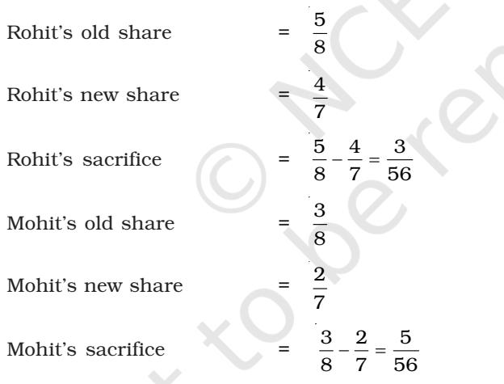

# Reconstitution of a Partnership Firm – Admission of a Partner

#### LEARNING OBJECTIVES

*After studying this chapter you will be able to:*

- *• Explain the concept of reconstitution of a partnership firm;*
- *• Identify the matters that need adjustments in the books of firm when a new partner is admitted;*
- *• Determine the new profit sharing ratio and calculate the sacrificing ratio;*
- *• Define goodwill and enumerate the factors that affect it;*
- *• Explain the methods of valuation of goodwill;*
- *• Describe how goodwill will be treated under different situations when a new partner is admitted;*
- *• Make necessary adjustments for revaluation of assets and reassessment of liabilities;*
- *• Make necessary adjustments for accumulated profits and losses;*
- *• Determine the capital of each partner, if required according to the new profit sharing ratio and make necessary adjustments;*
- *• Make necessary adjustments on change in the profit sharing ratio among the existing partners.*

P artnership is an agreement between two or more persons (called partners) for sharing the profits of a business carried on by all or any of them acting for all. Any change in the existing agreement amounts to reconstitution of the partnership firm. This results in an end of the existing agreement and a new agreement comes into being with a changed relationship among the members of the partnership firm and/or their composition. However, the firm continues. The partners often resort to reconstitution of the firm in various ways such as admission of a new partner, change in profit sharing ratio, retirement of a partner, death or insolvence of a partner. In this chapter we shall have a brief idea about all these and in detail about the accounting implications of admission of a new partner or an on change in the profit sharing ratio.

## 2.1 Modes of Reconstitution of a Partnership Firm

*Reconstitution of a partnership firm usually takes place in any of the following ways:*

*Admission of a new partner:* A new partner may be admitted when the firm needs additional capital or managerial help. According to the provisions of Partnership Act 1932 unless it is otherwise provided in the partnership deed a new partner can be admitted only when the existing partners unanimously agree for it. For example, Hari and Haqque are partners sharing profits in the ratio of

3:2. On April 1, 2017 they admitted John as a new partner with 1/6 share in profits of the firm. With this change now there are three partners of the firm and it stands reconstituted.

*Change in the profit sharing ratio among the existing partners:* Sometimes the partners of a firm may decide to change their existing profit sharing ratio. This may happen an account of a change in the existing partners' role in the firm. For example, Ram, Mohan and Sohan are partners in a firm sharing profits in the ratio of 3:2:1. With effect from April 1,2017 they decided to share profits equally as Sohan brings in additional capital. This results in a change in the existing agreement leading to reconstitution of the firm.

*Retirement of an existing partner:* It means withdrawal by a partner from the business of the firm which may be due to his bad health, old age or change in business interests. In fact a partner can retire any time if the partnership is at will. For example, Roy, Ravi and Rao are partners in the firm sharing profits in the ratio of 2:2:1. On account of illness, Ravi retired from the firm on March 31, 2017. This results in reconstitution of the firm now having only two partners.

*Death of a partner:* Partnership may also stand reconstituted on death of a partner, if the remaining partners decide to continue the business of the firm as usual. For example, X,Y and Z are partners in a firm sharing profits in the ratio 3:2:1. X died on March 31, 2017. Y and Z decide to carry on the business sharing future profits equally. The continuity of business by Y and Z sharing future profits equally leads to reconstitution of the firm.

## 2.2 Admission of a New Partner

When firm requires additional capital or managerial help or both for the expansion of its business a new partner may be admitted to supplement its existing resources. According to the Partnership Act 1932, a new partner can be admitted into the firm only with the consent of all the existing partners unless otherwise agreed upon. With the admission of a new partner, the partnership firm is reconstituted and a new agreement is entered into to carry on the business of the firm.

A newly admitted partner acquires two main rights in the firm–

- 1. Right to share the assets of the partnership firm; and
- 2. Right to share the profits of the partnership firm.

For the right to acquire share in the assets and profits of the partnership firm, the partner brings an agreed amount of capital either in cash or in kind. Moreover, in the case of an established firm which may be earning more profits than the normal rate of return on its capital the new partner is required to contribute some additional amount known as premium or goodwill. This is done primarily to compensate the sacrificing partners for loss of their share in super profits of the firm.

Following are the other important points which require attention at the time of admission of a new partner:

- 1. New profit sharing ratio;
- 2. Sacrificing ratio;
- 3. Valuation and adjustment of goodwill;
- 4. Revaluation of assets and Reassessment of liabilities;
- 5. Distribution of accumulated profits (reserves); and
- 6. Adjustment of partners' capitals.

## 2.3 New Profit Sharing Ratio

When new partner is admitted he acquires his share in profits from the old partners. In other words, on the admission of a new partner, the old partners sacrifice a share of their profit in favour of the new partner. But, what will be the share of new partner and how he will acquire it from the existing partners is decided mutually among the old partners and the new partner. However, if nothing is specified as to how does the new partner acquire his share from the old partners; it may be assumed that he gets it from them in their profit sharing ratio. In any case, on admission of a new partner, the profit sharing ratio among the old partners will change keeping in view their respective contribution to the profit sharing ratio of the incoming partner. Hence, there is a need to ascertain the new profit sharing ratio among all the partners. This depends upon how does the new partner acquires his share from the old partners for which there are many possibilities. Let us understand it with the help of the following illustrations.

## *Illustration 1*

Anil and Vishal are partners sharing profits in the ratio of 3:2. They admitted Sumit as a new partner for 1/5 share in the future profits of the firm. Calculate new profit sharing ratio of Anil, Vishal and Sumit.

## *Solution*

| Sumit's share | = | 1 |  |  |  |
| --- | --- | --- | --- | --- | --- |
|  |  | 5 |  |  |  |
| Remaining share | = | 1  1 |  | = | 4 |
|  |  | 5 |  |  | 5 |
| Anil's new share | = | 3 of | 4 | = | 12 |
|  |  | 5 | 5 |  | 25 |
| Vishal's new share | = | 2 of | 4 | = | 8 |
|  |  | 5 | 5 |  | 25 |

New profit sharing ratio of Anil, Vishal and Sumit will be 12:8:5.

*Note:* It has been assumed that the new partner acquired his share from old partners in old ratio.

## *Illustration 2*

Akshay and Bharati are partners sharing profits in the ratio of 3:2. They admit Dinesh as a new partner for 1/5th share in the future profits of the firm which he gets equally from Akshay and Bharati. Calculate new profit sharing ratio of Akshay, Bharati and Dinesh.

## *Solution*

| Dinesh's share | = | 1 | or | 2 |  |
| --- | --- | --- | --- | --- | --- |
|  |  | 5 |  | 10 |  |
| Akshay's share | = | 3 | 1  |  | 5 |
|  |  | 5 | 10 |  | 10 |
| Bharati's share | = | 2 | 1  |  | 3 |
|  |  | 5 | 10 |  | 10 |

New profit sharing ratio between Akshay, Bharati and Dinesh will be 5:3:2.

## *Illustration 3*

Anshu and Nitu are partners sharing profits in the ratio of 3:2. They admitted Jyoti as a new partner for 3/10 share which she acquired 2/10 from Anshu and 1/10 from Nitu. Calculate the new profit sharing ratio of Anshu, Nitu and Jyoti.

## *Solution*

| Jyoti's share | = | 3 |  |  |
| --- | --- | --- | --- | --- |
|  |  | 10 |  |  |
| Anshu's new share | = | 3  | 2 | 4  |
|  |  | 5 | 10 | 10 |
| Nitu's new share | = |  |  | Old share – Share Surrendered |
|  | = | 2  | 1 | 3  |
|  |  | 5 | 10 | 10 |
| The new profit sharing ratio between |  |  |  |  |

Anshu, Nitu and Jyoti will be 4 : 3 : 3.

## *Illustration 4*

Ram and Shyam are partners in a firm sharing profits in the ratio of 3:2. They admit Ghanshyam as a new partner. Ram sacrificed 1/4 of his share and Shyam 1/3 of his share in favour of Ghanshyam. Calculate new profit sharing ratio of Ram, Shyam and Ghanshyam.

#### *Solution*

| Ram's old share | = | 3 |  |  |  |
| --- | --- | --- | --- | --- | --- |
|  |  | 5 |  |  |  |
| Share sacrificed by Ram | = | 1 | of 3 |  | 3 |
|  |  | 4 | 5 |  | 20 |
| Ram's new share | = | 3  | 3  | 9 |  |
|  |  | 5 | 20 | 20 |  |
| Shyam's old share | = | 2 |  |  |  |
|  |  | 5 |  |  |  |
| Share sacrificed by Shyam | = | 1 of | 2 | 2  |  |
|  |  | 3 | 5 | 15 |  |
| Shyam's new share | = | 2  | 2  | 4 |  |
|  |  | 5 | 15 | 15 |  |
| Ghanshyam's new share | = |  |  |  | Ram's sacrifice + Shyam's Sacrifice |
|  | = | 3  | 2 | 17  |  |
|  |  | 20 | 15 | 60 |  |

New profit sharing ratio among Ram, Shyam and Ghanshyam will be 27:16:17.

#### *Illustration 5*

Das and Sinha are partners in a firm sharing profits in 4:1 ratio. They admitted Pal as a new partner for 1/4 share in the profits, which he acquired wholly from Das. Determine the new profit sharing ratio of the partners.

#### *Solution*

| Pal's share | = | 1 4 |  |  |  |
| --- | --- | --- | --- | --- | --- |
| Das's new share | = |  |  |  | Old Share – Share Surrendered |
|  | = | 4 | 1  | = | 11 |
|  |  | 5 | 4 |  | 20 |
|  |  | 1 |  |  |  |
| Sinha's new share | = |  |  |  |  |
|  |  | 5 |  |  |  |

The new profit sharing ratio among Das, Sinha and Pal will be 11:4:5.

#### 2.4 Sacrificing Ratio

The ratio in which the old partners agree to sacrifice their share of profit in favour of the incoming partner is called sacrificing ratio. The sacrifice by a partner is equal to :

Old Share of Profit – New Share of Profit

As stated earlier, the new partner is required to compensate the old partner's for their loss of share in the super profits of the firm for which he brings in an additional amount as premium for goodwill. This amount is shared by the existing partners in the ratio in which they forgo their shares in favour of the new partner which is called sacrificing ratio.

The ratio is normally clearly given as agreed among the partners which could be the old ratio, equal sacrifice, or a specified ratio. The difficulty arises where the ratio in which the new partner acquires his share from the old partners is not specified. Instead, the new profit sharing ratio is given. In such a situation, the sacrificing ratio is to be worked out by deducting each partner's new share from his old share. Look at the illustrations 6 to 8 and see how sacrificing ratio is calculated in such a situation.

#### *Illustration 6*

Rohit and Mohit are partners in a firm sharing profits in the ratio of 5:3. They admit Bijoy as a new partner for 1/7 share in the profit. The new profit sharing ratio will be 4:2:1. Calculate the sacrificing ratio of Rohit and Mohit.

#### *Solution*

Sacrificing ratio among Rohit and Mohit will be 3:5.

#### *Illustration 7*

Amar and Bahadur are partners in a firm sharing profits in the ratio of 3:2. They admitted Mary as a new partner for 1/4 share. The new profit sharing ratio between Amar and Bahadur will be 2:1. Calculate their sacrificing ratio.

#### *Solution*

| 1 | Mary's share = |  |  |  |  |  |
| --- | --- | --- | --- | --- | --- | --- |
| 4 |  |  |  |  |  |  |
| 1 3 = 1 | Remaining share = |  |  |  |  |  |
| 4 4 |  |  |  |  |  |  |
| This 3/4 share is to be shared by Amar and Bahadur in the ratio of 2:1. |  |  |  |  |  |  |
|  | Therefore, |  |  |  |  |  |
| 2 of 3 = | Amar's new share = |  |  |  | 6 or | 2 |
| 3 4 |  |  |  |  | 12 | 4 |
| of 3 | Bahadur's new share = | 1 |  |  | 3 | 1 |
| = 4 |  | 3 |  |  | 12 or | 4 |
| New profit sharing ratio of Amar, Bahadur and Mary will be 2:1:1. |  |  |  |  |  |  |
| 3 2   | Amar's sacrifice = |  | 2 |  |  |  |
| 5 20 |  |  | 4 |  |  |  |
| 2 1 3   | Bahadur's sacrifice = |  |  |  |  |  |
| 5 |  |  | 4 | 20 |  |  |

Sacrificing ratio among Amar and Bahadur will be 2:3.

#### *Illustration 8*

Ramesh and Suresh are partners in a firm sharing profits in the ratio of 4:3. They admitted Mohan as a new partner. The profit sharing ratio of Ramesh, Suresh and Mohan will be 2:3:1. Calculate the gain or sacrifice of old partner.

#### *Solution*

| Ramesh's old share | = | 4 |  |  |  |
| --- | --- | --- | --- | --- | --- |
|  |  | 7 |  |  |  |
| Ramesh's new share | = | 2 |  |  |  |
|  |  | 6 |  |  |  |
| Ramesh's sacrifice | = | 4 | 2  |  | 10 |
|  |  | 7 | 6 |  | 42 |
| Suresh's new share | = | 3 |  |  |  |
|  |  | 6 |  |  |  |
| Suresh's old share | = | 3 |  |  |  |
|  |  | 7 |  |  |  |
| Suresh's gain | = | 3 | 3  |  | 3 |
|  |  | 6 | 7 |  | 42 |
| Mohan's share | = | 1 | or | 7 |  |
|  |  | 6 |  | 42 |  |

Ramesh's sacrifice = Suresh's gain+Mohan's gain

$$\begin{array}{r l}{={}}&{{}{\frac{3}{42}}+{\frac{7}{42}}={\frac{10}{42}}}\end{array}$$

In this case, the whole sacrifice is by Ramesh alone.

#### Test your Understanding - I 1. A and B are partners sharing profits in the ratio of 3:1. They admit C for 1/4 share in the future profits. The new profit sharing ratio will be: (a) A 9 16 , B 3 16 , C 4 16 (b) A 8 16 , B 4 16 , C 4 16 (c) A 10 16 , B 2 16 , C 4 16 (d) A 8 16 , B 9 16 , C 10 16 2. X and Y share profits in the ratio of 3:2. Z was admitted as a partner who sets 1/5 share. New profit sharing ratio, if Z acquires 3/20 from X and 1/20 from Y would be: (a) 9 : 7 : 4 (b) 8 : 8 : 4 (c) 6 : 10 : 4 (d) 10 : 6 : 4 3. A and B share profits and losses in the ratio of 3 : 1, C is admitted into partnership for 1/4 share. The sacrificing ratio of A and B is: (a) equal (b) 3 : 1 (c) 2 : 1 (d) 3 : 2.

## 2.5 Goodwill

Goodwill is also one of the special aspects of partnership accounts which requires adjustment (also valuation if not specified) at the time of reconstitution of a firm viz., a change in the profit sharing ratio, the admission of a partner or the retirement or death of a partner.

## *2.5.1 Meaning of Goodwill*

Over a period of time, a well-established business develops an advantage of good name, reputation and wide business connections. This helps the business to earn more profits as compared to a newly set up business. In accounting, the monetary value of such advantage is known as "goodwill".

It is as an intangible asset. In other words, goodwill is the value of the reputation of a firm in respect of the profits expected in future over and above the normal profits. It is generally observed that when a person pays for goodwill, he/she pays for something, which places him in the position of being able to earn super profits as compared to the profit earned by other firms in the same industry.

In simple words, goodwill can be defined as "the present value of a firm's anticipated excess earnings" or as "the capitalised value attached to the differential profit capacity of a business". Thus, goodwill exists only when the firm earns super profits. Any firm that earns normal profits or is incurring losses has no goodwill.

## *2.5.2 Factors Affecting the Value of Goodwill*

The main factors affecting the value of goodwill are as follows:

- 1. *Nature of business:* A firm that produces high value added products or having a stable demand is able to earn more profits and therefore has more goodwill.
- 2. *Location:* If the business is centrally located or is at a place having heavy customer traffic, the goodwill tends to be high.
- 3. *Efficiency of management:* A well-managed concern usually enjoys the advantage of high productivity and cost efficiency. This leads to higher profits and so the value of goodwill will also be high.
- 4. *Market situation:* The monopoly condition or limited competition enables the concern to earn high profits which leads to higher value of goodwill.
- 5. *Special advantages:* The firm that enjoys special advantages like import licences, low rate and assured supply of electricity, long-term contracts for supply of materials, well-known collaborators, patents, trademarks, etc. enjoy higher value of goodwill.

## *2.5.3 Need for Valuation of Goodwill*

Normally, the need for valuation of goodwill arises at the time of sale of a business. But, in the context of a partnership firm it may also arise in the following circumstances:

- 1. Change in the profit sharing ratio amongst the existing partners;
- 2. Admission of new partner;
- 3. Retirement of a partner;
- 4. Death of a partner; and
- 5. Dissolution of a firm involving sale of business as a going concern.
- 6. Amalgamation of partnership firms.

## *2.5.4 Methods of Valuation of Goodwill*

Since goodwill is an intangible asset it is very difficult to accurately calculate its value. Various methods have been advocated for the valuation of goodwill of a partnership firm. Goodwill calculated by one method may differ from the goodwill

calculated by another method. Hence, the method by which goodwill is to be calculated, may be specifically decided between the existing partners and the incoming partner.

The important methods of valuation of goodwill are as follows:

- 1. Average Profits Method
- 2. Super Profits Method
- 3. Capitalisation Method

## *2.5.4.1 Average Profits Method*

Under this method, the goodwill is valued at agreed number of 'years' purchase of the average profits of the past few years. It is based on the assumption that a new business will not be able to earn any profits during the first few years of its operations. Hence, the person who purchases a running business must pay in the form of goodwill a sum which is equal to the profits he is likely to receive for the first few years. The goodwill, therefore, should be calculated by multiplying the past average profits by the number of years during which the anticipated profits are expected to accrue.

For example, if the past average profits of a business works out at Rs. 20,000 and it is expected that such profits are likely to continue for another three years, the value of goodwill will be Rs. 60,000 (Rs. 20,000 3),

## *Illustration 9*

The profit for the five years of a firm are as follows – year 2013 Rs. 4,00,000; year 2014 Rs. 3,98,000; year 2015 Rs. 4,50,000; year 2016 Rs. 4,45,000 and year 2017 Rs. 5,00,000. Calculate goodwill of the firm on the basis of 4 years purchase of 5 years average profits.

|  | Year | Profit |
| --- | --- | --- |
|  |  | (Rs.) |
|  | 2013 | 4,00,000 |
|  | 2014 | 3,98,000 |
|  | 2015 | 4,50,000 |
|  | 2016 | 4,45,000 |
|  | 2017 | 5,00,000 |
|  | Total | 21,93,000 |
| Average Profit | TotalProfit of Last 5 Years = | = Rs. 21,93,000 = Rs. 4,38,600 |
|  | No.of years | 5 |
| Goodwill | = Average Profits × No. of years purchased |  |
|  | = Rs. 4,38,600 × 4 = Rs. 17,54,400 |  |

## *Solution*

The above calculation of goodwill is based on the assumption that no change in the overall situation of profits is expected in the future.

The above illustration is based on simple average. Sometimes, if there exists an increasing on decreasing trend, it is considered to be better to give a higher weightage to the profits to the recent years than those of the earlier years. Hence, it is a advisable to work out weighted average based on specified weights like 1, 2, 3, 4 for respective year's profit. However, weighted average should be used only if specified. (See illustrations 10 and 11).

#### *Illustration 10*

The profits of firm for the five years are as follows:

| Year | Profit |
| --- | --- |
|  | (Rs.) |
| 2012–13 | 20,000 |
| 2013–14 | 24,000 |
| 2014–15 | 30,000 |
| 2015–16 | 25,000 |
| 2016–17 | 18,000 |

Calculate the value of goodwill on the basis of three years' purchase of weighted average profits based on weights 1,2,3,4 and 5 respectively.

#### *Solution*

| Year Ended 31st March | Profit | Weight | Product |
| --- | --- | --- | --- |
|  | (Rs.) |  |  |
| 2012–13 | 20,000 | 1 | 20,000 |
| 2013–14 | 24,000 | 2 | 48,000 |
| 2014–15 | 30,000 | 3 | 90,000 |
| 2015–16 | 25,000 | 4 | 1,00,000 |
| 2016–17 | 18,000 | 5 | 90,000 |
|  |  | 15 | 3,48,000 |

| Weighted Average Profit = Rs. 3,48,000 | = Rs. 23,200 |
| --- | --- |
| 15 |  |
| Goodwill | = Rs. 23,200 × 3 = Rs. 69,600 |

## *Illustration 11*

Calculate goodwill of a firm on the basis of three year' purchase of the weighted average profits of the last four years. The profit of the last four years were: 2012 Rs. 20,200; 2013 Rs. 24,800; 2014 Rs. 20,000 and 2015 Rs. 30,000. The weights assigned to each year are : 2012 – 1; 2013 – 2; 2014 – 3 and 2015 – 4. You are supplied the following information:

- 1. On September 1, 2014 a major plant repair was undertaken for Rs. 6,000, which was charged to revenue. The said sum is to be capitalised for goodwill calculation subject to adjustment of depreciation of 10% p.a. on reducing balance method.
- 2. The Closing Stock for the year 2013 was overvalued by Rs. 2,400.
- 3. To cover management cost an annual charge of Rs. 4,800 should be made for purpose of goodwill valuation.

| Calculation of Adjusted Profit | 2012 | 2013 | 2014 | 2015 |
| --- | --- | --- | --- | --- |
|  | Rs. | Rs. | Rs. | Rs. |
| Given Profits | 20,200 | 24,800 | 20,000 | 30,000 |
| Less: Management Cost | 4,800 | 4,800 | 4,800 | 4,800 |
| Add: Capital Expenditure | 15,400 | 20,000 | 15,200 | 25,200 |
| Charged to Revenue | - | - | 6,000 | - |
|  | 15,400 | 20,000 | 21,200 | 25,200 |
| Less: Unprovided Depreciation | - | - | 200 | 580 |
|  | 15,400 | 20,000 | 21,000 | 24,620 |
| Less: over valuation of Closing Stock | - | 2,400 | - | - |
|  | 15,400 | 17,600 | 21,000 | 24,620 |
| Add: over value of opening stock | - | - | 2,400 | - |
| Adjusted Profits | 15,400 | 17,600 | 23,400 | 24,620 |

## *Solution*

Calculation of weighted average profits:

|  |  |  | (Rs.) |
| --- | --- | --- | --- |
| Year | Profit | Weight | Product |
| 2012 | 15,400 | 1 | 15,400 |
| 2013 | 17,600 | 2 | 35,200 |
| 2014 | 23,400 | 3 | 70,200 |
| 2015 | 24,620 | 4 | 98,480 |
| Total |  | 10 | 2,19,280 |

Weight Average Profit = Rs. 2,19,280 10 = Rs. 21,928

Goodwill = Rs. 21,928 × 3 = Rs. 65,784

*Notes to Solution*

| (i) | Depreciation of 2014 | = 10% of Rs. 6000 for 4 months |
| --- | --- | --- |
|  |  | = Rs. 6000  10/100  4/12 = Rs. 200 |
| (ii) | Depreciation of 2015 | = 10% of Rs. 6000 – Rs. 200 for one year |
|  |  | = Rs. 5800  10/100 + Rs. 580 |

(iii) Closing Stock of 2014 will become opening stock for the year 2015.

#### *2.5.4.2 Super Profits Method*

The basic assumption in the average profits (simple or weighted) method of calculating goodwill is that if a new business is set up, it will not be able to earn any profits during the first few years of its operations. Hence, the person who purchases an existing business has to pay in the form of goodwill a sum equal to the total profits he is likely to receive for the first 'few years'. But it is contended that the buyer's real benefit does not lie in total profits; it is limited to such amounts of profits which are in excess of the normal return on capital employed in similar business. Therefore, it is desirable to value, goodwill on the basis of the excess profits and not the actual profits. The excess of actual profits over the normal profits is termed as super profits.

> Normal Profit = Firm's Capital × Normal Rate of Return 100

Firms capital includes partners capital and reserves and surplus but excludes fictitious assets and goodwill.

Suppose an existing firm earns Rs. 18,000 on the capital of Rs. 1,50,000 and the normal rate of return is 10%. The Normal profits will work out at Rs. 15,000 (1,50,000 × 10/100). The super profits in this case will be Rs. 3,000 (Rs. 18,000 – 15,000). The goodwill under the super profit method is ascertained by multiplying the super profits by certain number of years' purchase. If, in the above example, it is expected that the benefit of super profits is likely to be available for 5 years in future, the goodwill will be valued at Rs. 15,000 (3,000 × 5). Thus, the steps involved under the method are:

- 1. Calculate the average profit,
- 2. Calculate the normal profit on the firm's capital on the basis of the normal rate of return,
- 3. Calculate the super profits by deducting normal profit from the average profits, and
- 4. Calculate goodwill by multiplying the super profits by the given number of years' purchase.

## *Illustration 12*

The books of a business showed that the firm's capital employed on December 31, 2015, Rs. 5,00,000 and the profits for the last five years were: 2011–Rs. 40,000: 2012-Rs. 50,000; 2013-Rs. 55,000; 2014- Rs.70,000 and 2015-Rs. 85,000. You are required to find out the value of goodwill based on 3 years purchase of the super profits of the business, given that the normal rate of return is 10%.

## *Solution*

  
Normal Profits = $\frac{\mbox{Firm's Capital}\times\mbox{Normal Rate of Return}}{100}$  
  
= Rs. $\frac{5,00,000\times10}{100}$ = Rs. 50,000

*Average Profits:*

| Year | Profit |
| --- | --- |
|  | (Rs.) |
| 2011 | 40,000 |
| 2012 | 50,000 |
| 2013 | 55,000 |
| 2014 | 70,000 |
| 2015 | 85,000 |
| Total | 3,00,000 |

Average Profits = Rs. 3,00,000/5 = Rs. 60,000 Super Profit = Rs. 60,000 – Rs. 50,000 = Rs. 10,000 Goodwill = Rs. 10,000 3 = Rs. 30,000

## *Illustration 13*

The capital of the firm of Anu and Benu is Rs. 1,00,000 and the market rate of interest is 15%. Annual salary to partners is Rs. 6,000 each. The profits for the last 3 years were Rs. 30,000; Rs. 36,000 and Rs. 42,000. Goodwill is to be valued at 2 years purchase of the last 3 years' average super profits. Calculate the goodwill of the firm.

### *Solution*

|  |  |  | 100 |  |
| --- | --- | --- | --- | --- |
| Interest on capital Add: partner's salary | = = | 1,00,000  Rs. 6,000  | 15 2 | = Rs. 15,000…………(i) = Rs. 12,000…………(ii) |

| Normal Profit(i+ii) | = Rs. 27,000 |  |
| --- | --- | --- |
| Average Profit | = | Rs. 30,000+Rs.36,000+Rs.42,000 = Rs.1,08,000 |
|  |  | 3 |
|  | = | Rs. 36,000 |
| Super Profit | = | Average Profit–Normal Profit |
|  | = | Rs. 36,000–Rs. 27,000 |
|  | = | Rs. 9,000 |
| Goodwill | = | Super Profit × No of years' purchase |
|  | = | Rs. 9,000 × 2 |
|  | = | Rs. 18,000 |

## *2.5.4.3 Capitalisation Method*

Under this method the goodwill can be calculated in two ways: (a) by capitalizing the average profits, or (b) by capitalising the super profits.

- (a) *Capitalisation of Average Profits:* Under this method, the value of goodwill is ascertained by deducting the actual firm's capital in the business from the capitalized value of the average profits on the basis of normal rate of return. This involves the following steps:
	- (i) Ascertain the average profits based on the past few years' performance.
	- (ii) Capitalize the average profits on the basis of the normal rate of return to ascertain the capitalised value of average profits as follows:

#### Average Profits × 100/Normal Rate of Return

- (iii) Ascertain the actual firm's capital (net assets) by deducting outside liabilities from the total assets (excluding goodwill and ficticious assets).
## Firms' Capital = Total Assets (excluding goodwill) – Outside Liabilities Where outside Liabilities include both long term and short term Liabilities.

- (iv) Compute the value of goodwill by deducting net assets from the capitalised value of average profits, i.e. (ii) – (iii).
## *Illustration 14*

A business has earned average profits of Rs. 1,00,000 during the last few years and the normal rate of return in a similar business is 10%. Ascertain the value of goodwill by capitalisation average profits method, given that the value of net assets of the business is Rs. 8,20,000.

#### *Solution*

Capitalised Value of Average Profits Rs. 1,00,000 100 10 = Rs. 10,00,000

- Goodwill = Capitalised value Net Assets
	- = Rs. 10,00,000 Rs. 8,20,000 = Rs.1,80,000
	- (b) *Capitalisation of Super Profits:* Goodwill can also be ascertained by capitalising the super profit directly. Under this method there is no need to work out the capitalised value of average profits. It involves the following steps.
	- (i) Calculate capital of the firm, which is equal to total assets (excluding goodwill and ficticious assets) *minus outside liabilities*.
	- (ii) Calculate normal profits on capital employed.
	- (iii) Calculate average profit for past years, as specified.
	- (ii) Calculate super profits by deducting normal profits from average profits.
	- (iii) Multiply the super profits by the required rate of return multiplier, that is,

#### Goodwill = Super Profits × 100 Normal Rate of Return

In other words, goodwill is the capitalised value of super profits. The amount of goodwill worked out by this method will be exactly the same as calculated by capitalising the average profits.

For example, using the data given in illustration 14 where the average profits are Rs. 1,00,000 and the normal profits are Rs. 82,000 (10% of Rs. 8,20,000), the super profits worked out as Rs. 18,000 (Rs. 1,00,000 – Rs. 82,000), the goodwill will be calculated as follows.

Rs. 18,000 x $\frac{100}{10}$ = Rs. 1,80,000.  

#### *Illustration 15*

- 1. The goodwill of a firm is to be worked out at three years' purchase of the average profits of the last five years which are as follows:

| Years | Profits (Loss) |
| --- | --- |
|  | (Rs.) |
| 2012 | 10,000 |
| 2013 | 15,000 |
| 2014 | 4,000 |
| 2015 | (5,000) |
| 2016 | 6,000 |

- 2. The capital of the firm is Rs. 1,00,000 and normal rate of return is 8%, the average profits for last 5 years are Rs. 12,000 and goodwill is to be worked out at 3 years' purchase of super profits,
- 3. Rama Brothers earn an average profit of Rs. 30,000 with a capital of Rs. 2,00,000. The normal rate of return in the business is 10%. Using capitalisation of super profits method work out the value the goodwill of the firm.

## *Solution*

1. Total Profits = Rs. 10,000 + Rs. 15,000 + Rs. 4,000 + Rs. 6,000 – Rs. 5,000 = Rs. 30,000 Average Profits = Rs. 30,000/5 = Rs. 6,000 Goodwill = Average Profits × 3 = Rs. 6,000 3 = Rs.18,000 2. Average Profit = Rs. 12,000 Normal Profit = Rs.1,00,000 8 100 = Rs. 8,000 Super Profit=Average Profit – Normal profit = Rs. 12,000 – Rs. 8,000 = Rs. 4,000 Goodwill=Super Profit 3 = Rs. 4,000 3 = Rs. 12,000 3. Normal Profit= Rs. 2,00,000 10/100 = Rs. 20,000 Super Profit = Average Profit – Normal Profit = Rs. 30,000 – Rs. 20,000 = Rs. 10,000 Goodwill=Super Profit 100/Normal Rate of Return = 10,000 100/10 = Rs. 1,00,000.

## *2.5.5 Treatment of Goodwill*

As stated earlier, the incoming partner who acquires his share in the profits of the firm from the existing partners brings in additional amount to compensate them for loss of their share in super profits. It is termed as his share of goodwill (also called premium for goodwill).

## *2.5.5.1 When the new Partner brings goodwill in cash.*

The amount of premium brought in by the new partner is shared by the existing partners in their ratio of sacrifice. If this amount is paid to the old partners directly (privately) by the new partner, no entry is passed in the books of the firm. But, when the amount is paid through the firm, which is generally the case, the following journal entries are passed:

| (i) | Bank A/c | Dr. |
| --- | --- | --- |
|  | To Premium for Goodwill A/c |  |
|  | (Amount brought by new partner as premium) |  |
| (ii) | Goodwill A/c | Dr. |
|  | To Sacrificing Partners Capital A/c |  |
|  | (Individually)(Goodwill distributed among the |  |
|  | existing partners' in their sacrificing ratio). |  |

Alternatively, it is credited to the new partner's capital account and then adjusted in favour of the existing partners in their sacrificing ratio. In that case the journal entries will be as follows:

| (i) | Bank A/c | Dr. |
| --- | --- | --- |
|  | To New Partner's Capital A/c |  |
|  | (Amount brought by new partner for his share |  |
|  | of goodwill). |  |
| (ii) | New Partner's Capital A/c | Dr. |
|  | To Sacrificing Partner's Capital A/c's |  |
|  | (Individually) |  |
|  | (Goodwill brought by new partners distributed |  |
|  | among the existing partners in their sacrificing |  |
|  | ratio) |  |

If the partners decide that the amount of premium for goodwill credited to their capital accounts should be retained in business, an additional entry is not passed. If, however, they decide to withdraw their amounts, (in full or in part) the following additional entry will be passed:

> Existing Partner's Capital A/c (Individually) Dr. To Bank A/c (The amount of goodwill withdrawn by the existing partners)

## *Illustration 16*

Sunil and Dalip are partners in a firm sharing profits and losses in the ratio of 5:3. Sachin is admitted in the firm for 1/5th share of profits. He brings in Rs. 20,000 as capital and Rs. 4,000 as his share of goodwill by cheque. Give the necessary journal entries,

- (a) When partners decided to retain goodwill in business.
- (b) When the amount of goodwill is fully withdrawn.
- (c) When 50% of the amount of goodwill is withdrawn.

## *Solution*

- (a) When the amount of goodwill credited to existing partners is retained in business.

| Date | Particulars |  | L.F. | Debit | Credit |
| --- | --- | --- | --- | --- | --- |
|  |  |  |  | (Rs.) | (Rs.) |
| (i) | Bank A/c | Dr. |  | 24,000 |  |
|  | To Sachin's Capital A/c |  |  |  | 20,000 |
|  | To Premium for Goodwill A/c |  |  |  | 4,000 |
|  | (The amount brought in by Sachin as |  |  |  |  |
|  | Capital and Goodwill) |  |  |  |  |
| (ii) | Premium for Goodwill A/c | Dr. |  | 4,000 |  |
|  | To Sunil's Capital A/c |  |  |  | 2,500 |
|  | To Dalip's Capital A/c |  |  |  | 1,500 |
|  | (Goodwill transferred to Sunil and Dalip |  |  |  |  |
|  | in the ratio of 5:3) |  |  |  |  |
|  | Alternatively, |  |  |  |  |
| (i) | Cash A/c | Dr. |  | 24,000 |  |
|  | To Sachin's Capital A/c |  |  |  | 24,000 |
| (ii) | Sachin's Capital A/c | Dr |  | 4,000 |  |
|  | To Sunil's Capital A/c |  |  |  | 2,500 |
|  | To Dalip's Capital A/c |  |  |  | 1,500 |

#### Books of Sunil and Dalip Journal

*Note:* It assumed that the sacrificing ratio is the same as old profit sharing ratio.

- (b) When the amount of goodwill credited to existing partners is fully withdrawn.

| Journal |
| --- |

| Date | Particulars |  | L.F. | Debit | Credit |
| --- | --- | --- | --- | --- | --- |
|  |  |  |  | (Rs.) | (Rs.) |
| 1. | Same as in (a) above |  |  |  |  |
| 2. | Same as in (a) above, |  |  |  |  |
| 3. | Sunil's Capital A/c | Dr. |  | 2,500 |  |
|  | Dalip's Capital A/c | Dr. |  | 1,500 |  |
|  | To Bank A/c |  |  |  | 4,000 |
|  | (Cash withdrawn by Sunil and Dalip |  |  |  |  |
|  | equal to their share of goodwill) |  |  |  |  |

- (c) When 50% of the amount of goodwill credited to existing partners is withdrawn.
Journal

| Date | Particulars |  | L.F. | Debit | Credit |
| --- | --- | --- | --- | --- | --- |
|  |  |  |  | (Rs.) | (Rs.) |
| 1. | Same as in (a) above, |  |  |  |  |
| 2. | Same as in (a) above |  |  |  |  |
| 3. | Sunil's Capital A/c | Dr. |  | 1,250 |  |
|  | Dalip's Capital A/c | Dr. |  | 750 |  |
|  | To Cash A/c |  |  |  | 2,000 |
|  | (Cash withdrawn for 50% of their share |  |  |  |  |
|  | of goodwill) |  |  |  |  |

## *Illustration 17*

Vijay and Sanjay are partners in a firm sharing profits and losses in the ratio of 3:2. They admitted Ajay into partnership with 1/4 share in profits. Ajay brings in Rs. 30,000 for capital and the requisite amount of premium in cash. The goodwill of the firm is valued at Rs. 20,000. The new profit sharing ratio is 2:1:1. Vijay and Sanjay withdraw their share of goodwill. Give necessary journal entries.

## *Solution*

- (a) Ajay will bring Rs. 5,000 (1/4 of Rs. 20,000) as his share of goodwill (premium)
- (b) Sacrificing Ratio is 2:3 as calculated below:

For Vijay, old ratio is 3/5 and the new ratio is 2/4, hence, his sacrificing ratio is

$$={\frac{1}{5}}-{\frac{2}{4}}\,=\,{\frac{12\,\cdot\,10}{20}}\,=\,{\frac{2}{20}}$$

For Sanjay, old ratio is 2/5 and the new ratio is 1/4, hence, his sacrificing

$$\begin{array}{r l}{{\mathrm{ratio~is}}}&{{}={\frac{1}{2}}-{\frac{1}{4}}\ =\ {\frac{1}{20}}\ =\ {\frac{1}{20}}}\end{array}$$

#### Books of Vijay and Sanjay

Journal

| Date | Particulars |  | L.F. | Debit | Credit |
| --- | --- | --- | --- | --- | --- |
|  |  |  |  | (Rs.) | (Rs.) |
| 1. | Bank A/c | Dr. |  | 35,000 |  |
|  | To Ajay's Capital A/c |  |  |  | 30,000 |
|  | To Premium for Goodwill A/c |  |  |  | 5,000 |
|  | (The amount of capital and goodwill |  |  |  |  |
|  | brought by Ajay) |  |  |  |  |
| 2. | Premium for Goodwill A/c | Dr. |  | 5,000 |  |
|  | To Vijay's Capital A/c |  |  |  | 2,000 |
|  | To Sanjay's Capital A/c |  |  |  | 3,000 |
|  | (the amount of goodwill brought by Ajay |  |  |  |  |
|  | shared by Vijay and Sanjay in their |  |  |  |  |
|  | sacrificing ratio) |  |  |  |  |
| 3. | Vijay's Capital A/c | Dr. |  | 2,000 |  |
|  | Sanjay's Capital A/c | Dr. |  | 3,000 |  |
|  | To Bank A/c |  |  |  | 5,000 |
|  | (Cash withdrawn by Vijay and Sanjay |  |  |  |  |
|  | for their share of goodwill) |  |  |  |  |

*Note:* Alternatively, journal entries (1) and (2) could be as given on the next page:

| Date | Particulars |  | L.F. | Debit | Credit |
| --- | --- | --- | --- | --- | --- |
|  |  |  |  | (Rs.) | (Rs.) |
| 1. | Bank A/c | Dr. |  | 35,000 |  |
|  | To Ajay's Capital A/c |  |  |  | 35,000 |
|  | (Ajay brought in Rs. 30,000 for capital |  |  |  |  |
|  | and Rs. 5,000 as goodwill) |  |  |  |  |
| 2. | Ajay's Capital A/c | Dr. |  | 5,000 |  |
|  | To Vijay's Capital A/c |  |  |  | 2.000 |
|  | To Sanjay's Capital A/c |  |  |  | 3,000 |
|  | (Amount of goodwill brought in by Ajay |  |  |  |  |
|  | shared by Vijay and Sanjay in their |  |  |  |  |
|  | sacrificing in the ratio of 2:3) |  |  |  |  |

#### Books of Vijay and Sanjay Journal

*When goodwill already exists in books:* Goodwill, if existing in the books of the firm, it is written off at the time of admission of a partner.

For example, in Illustration 17, the goodwill of the firm is valued at Rs. 20,000 and Ajay who is admitted to 1/4 share in its profits, brings in Rs. 5,000 as his share of goodwill. Suppose, goodwill already appeared in books at Rs. 10,000 the following additional journal entry shall be passed for writing off the existing amount of goodwill.

| Date | Particulars |  | L.F. | Debit | Credit |
| --- | --- | --- | --- | --- | --- |
|  |  |  |  | (Rs.) | (Rs.) |
|  | Vijay's Capital A/c | Dr. |  | 6,000 |  |
|  | Sanjay's Capital A/c | Dr. |  | 4,000 |  |
|  | To Goodwill A/c |  |  |  | 10,000 |
|  | (Goodwill written-off in old ratio) |  |  |  |  |

## *Illustration 18*

Srikant and Raman are partners in a firm sharing profits and losses in the ratio of 3:2. They admit Venkat into partnership with 1/3 share in the profits. Venkat brings in Rs. 30,000 as his capital. He also brings in the necessary amount for his share of goodwill. On the date of admission, the goodwill is valued at Rs. 24,000 and the goodwill account appears in the books at Rs. 12,000. Venkat brings in the necessary amount for his share of goodwill and agrees that the existing goodwill account be written off. Record the necessary journal entries in the books of the firm.

## *Solution*

## Books of Srikant and Raman

Journal

| Date | Particulars |  | L.F. | Debit | Credit |
| --- | --- | --- | --- | --- | --- |
|  |  |  |  | (Rs.) | (Rs.) |
| 1. | Bank A/c | Dr. |  | 38,000 |  |
|  | To Venkat's Capital A/c |  |  |  | 30,000 |
|  | To Premium for Goodwill A/c |  |  |  | 8,000 |
|  | (Amount brought in by Venkat as his |  |  |  |  |
|  | capital and his share of goodwill) |  |  |  |  |
| 2. | Premium for Goodwill A/c | Dr. |  | 8,000 |  |
|  | To Srikant's Capital A/c |  |  |  | 4,800 |
|  | To Raman's Capital A/c |  |  |  | 3,200 |
|  | (Goodwill brought in by Venkat shared |  |  |  |  |
|  | by old partners in their ratio of sacrifice) |  |  |  |  |
| 3. | Srikant's Capital A/c | Dr. |  | 7,200 |  |
|  | Raman's Capital A/c | Dr. |  | 4,800 |  |
|  | To Goodwill A/c |  |  |  | 12,000 |
|  | (Goodwill already appearing in books |  |  |  |  |
|  | written-off in the old ratio) |  |  |  |  |

*Note:* Since nothing is given about the ratio in which the new partner acquires his share of profit from Srikant and Raman, it is implied that they sacrifice their share of profit in favour of Venkat in the old ratio i.e., 3:2.

## When the new partner does not bring goodwill in cash, partly or fully

Goodwill not brought by the new partner will be debited to current account of new partner while sacrificing partners' capital accounts will be credited for their respective shares.

When the new partner does not bring the share of goodwill, there exists two possibilities :

- (a) Goodwill does not exist in the books; and.
- (b) Goodwill exists in the books.

#### *Goodwill does not exist in the books*

When goodwill does not exist in the books, sacrificing partners are credited with their share of goodwill and new partner is debited by the amount of goodwill not brought by him. The journal entry in this case is : Incoming (New) Partners Current A/c Dr.

To Sacrificing Partners Capital A/c (individually) (Account of goodwill not brought in by new partner)

Sometimes the new partner brings part of premium for goodwill in cash. In such a situation, new partners current account will be debited by the amount not brought by new partner.

For example, for the share of goodwill of Rs. 50,000 the new partner brings Rs. 20,000 only. In this situation the journal entry will be :

| (i) | Bank A/c | Dr. | 20,000 | 20,000 |
| --- | --- | --- | --- | --- |
|  | To Premium for Goodwill A/c |  |  |  |
|  | (Premium for goodwill brought by the new |  |  |  |
|  | partner) |  |  |  |
| (ii) | Premium for Goodwill A/c | Dr. | 20,000 |  |
|  | Incoming partners current A/c | Dr. | 30,000 | 50,000 |
|  | To sacrificing partners capital A/c's |  |  |  |
|  | (individually) |  |  |  |
|  | (Goodwill credited in sacrificing ratio) |  |  |  |

## *Illustration 19*

Ahuja and Barua are partners in a firm sharing profits and losses in the ratio of 3:2. They decide to admit Chaudhary into partnership for 1/5 share of profits, which he acquires equally from Ahuja and Barua. Goodwill is valued at Rs. 30,000. Chaudhary brings in Rs. 16,000 as his capital but is not in a position to bring any amount for goodwill. No goodwill account exists in books of the firm. Goodwill account is to be raised at full value. Record the necessary journal entries.

## *Solution*

|  | Journal |  |  |  |  |
| --- | --- | --- | --- | --- | --- |
| Date | Particulars |  | L.F. | Debit | Credit |
|  |  |  |  | (Rs.) | (Rs.) |
| 1. | Bank A/c | Dr. |  | 16,000 |  |
|  | To Chaudhary's Capital A/c |  |  |  | 16,000 |
|  | (Amount brought for capital) |  |  |  |  |
| 2. | Chaudhary's Current A/c | Dr. |  | 30,000 |  |
|  | To Ahuja's Capital A/c |  |  |  | 18,000 |
|  | To Barua's Capital A/c |  |  |  | 12,000 |
|  | (Goodwill credited to sacrificing partner's |  |  |  |  |
|  | accounts) |  |  |  |  |

# Book of Ahuja and Barua

*When goodwill exists in the books :*

Goodwill appearing in the books will be written-off by debiting old partners 'capital accounts in their old profit sharing ratio. Thereafter new value of goodwill will be given effect by crediting sacrificing partners' capital accounts and debiting new partners' current account.

The journal entries will be as under :-

- (i) When the value of goodwill appears in the books and is written off Partners capital A/c (old) Dr. (In profit sharing ratio) To Goodwill A/c (Goodwill appearing in the books written-off)
- (ii) For new value of goodwill :- Incoming partners' current A/c. Dr. To Sacrificing partners capital A/c. [In sacrificing ratio) (individually)

## *Illustration 20*

Ram and Rahim are partners in a firm sharing profits and losses in the ratio of 3:2. Rahul is admitted into partnership for 1/3 share in profits. He brings in Rs. 10,000 as capital, but is not in a position to bring any amount for his share of goodwill which has been valued at Rs. 30,000. Give necessary journal entries under each of the following situations:

- (a) When there is no goodwill appearing in the books of the firm; and
- (b) When the goodwill appears at Rs 15,000 in the books of the firm.

## *Solution*

- *(a) When no goodwill appears in the books*
## Books of Ram and Rahim Journal

| Date | Particulars |  | L.F. | Debit | Credit |
| --- | --- | --- | --- | --- | --- |
|  |  |  |  | Amount | Amount |
|  |  |  |  | (Rs.) | (Rs.) |
|  | Bank A/c | Dr. |  | 10,000 |  |
|  | To Rahul's Capital A/c |  |  |  | 10,000 |
|  | (Amount brought by Rahul as Capital) |  |  |  |  |
|  | Rahul's Current A/c | Dr. |  | 30,000 |  |
|  | To Ram's Capital A/c |  |  |  | 18,000 |
|  | To Rahim's Capital A/c |  |  |  | 12,000 |
|  | (Goodwill not brought by Rahul debited to his |  |  |  |  |
|  | current account and credited to old partners in |  |  |  |  |
|  | sacrificing ratio) |  |  |  |  |

| Date | Particulars |  | L.F. | Debit | Credit |
| --- | --- | --- | --- | --- | --- |
|  |  |  |  | Amount | Amount |
|  |  |  |  | (Rs.) | (Rs.) |
|  | Bank A/c | Dr. |  | 10,000 | 10,000 |
|  | To Rahul's Capital A/c |  |  |  |  |
|  | (Amount brought by Rahul as Capital) |  |  |  |  |
|  | Rahul's Current A/c | Dr. |  | 15,000 |  |
|  | To Ram's Capital A/c |  |  |  | 9,000 |
|  | To Rahim's Capital A/c |  |  |  | 6,000 |
|  | (Goodwill not brought by Rahul debited to his |  |  |  |  |
|  | current account and credited to old partners |  |  |  |  |
|  | in sacrificing ratio) |  |  |  |  |
|  | Ram's Capital A/c | Dr. |  | 9,000 |  |
|  | Rahim's Capital A/c |  |  | 6,000 |  |
|  | To Goodwill A/c |  |  |  | 15,000 |
|  | (Goodwill affeacing in the books written - off |  |  |  |  |
|  | in old profit sharing ratio) |  |  |  |  |

## *(b) When goodwill appears in the books at Rs. 15,000*

#### Applicability of Accounting Standard 26: Intangible Assets

The Standard comes into effect in respect of expenditure incurred on intangible items during the accounting periods commencing on or after April 1, 2003. As per the Standard, Intangible Asset under AS 26 is defined as an identifiable, non monetary, without physical existence and held for use in the production or supply of goods or services for rental to others or for administrative purposes.

Significant requirements of AS 26 w.r.t Intangible Assets:

- 1. Intangible asset should be recognised by fulfilling the criteria as recognised under AS 26.
- 2. If an in asset does not satisfy recognition criteria, it should be expensed.
- 3. Internally generated goodwill should not be recognised as an asset.
- 4. Internally generated brands, mastheads, and publishing titles and other similar in substance should not be recognised as intangible assets.
- 5. Internally generated assets other than the goodwill, brands, mastheads, and publishing titles may be recognised provided they satisfy recognition criteria as prescribed by AS 26.
- 6. Intangible assets should be written off as early as possible but not exceeding its estimated life, which normally should not be beyond 10 years.

Accounting Standard 26 implies that:

- (a) Purchased goodwill may be accounted for in the books and shown as an asset, where it is accounted for in the books and shown as assets, it should be written off as early as possible, but where it is to be written- off in more than one accounting year, it should be written off in a period not exceeding 10 years. In line with what is prescribed by the Accounting Standard, goodwill appearing in the balance sheet in written off at the time of firm's reconstitution.
- (b) Self generated goodwill is not accounted for in the books and shown as an asset. Thus if self generated goodwill be debited to goodwill account it should be written - off in the same financial year and should not be shown as an asset in the balance sheet. Alternatively value of goodwill may be adjusted by deducting new partners' current account and crediting in their sacrificing ratio. The effect under both the methods is same.

#### Test your Understanding – II

Choose the correct alternative –

- 1. At the time of admission of a new partner, general reserve appearing in the old balance sheet is transferred to:
	- (a) all partner's capital account
	- (b) new partner's capital account
	- (c) old partner's capital account
	- (d) none of the above.
- 2. Asha and Nisha are partner's sharing profit in the ratio of 2:1. Asha's son Ashish was admitted for 1/4 share of which 1/8 was gifted by Asha to her son. The remaining was contributed by Nisha. Goodwill of the firm in valued at Rs. 40,000. How much of the goodwill will be credited to the old partner's capital account.
	- (a) Rs. 2,500 each
	- (b) Rs. 5,000 each
	- (c) Rs. 20,000 each
	- (d) None of the above.
- 3. A, B and C are partner's in a firm. If D is admitted as a new partner:
	- (a) old firm is dissolved
	- (b) old firm and old partnership is dissolved
	- (c) old partnership is reconstituted
	- (d) None of the above.
- 4. On the admission of a new partner increase in the value of assets is debited to:
	- (a) Profit and Loss Adjustment account
	- (b) Assets account
	- (c) Old partner's capital account
	- (d) None of the above.
- 5. At the time of admission of a partner, undistributed profits appearing in the balance sheet of the old firm is transferred to the capital account of:
	- (a) old partners in old profit sharing ratio
	- (b) old partners in new profit sharing ratio
	- (c) all the partner in the new profit sharing ratio.

## *2.5.5.2 Hidden Goodwill*

Sometimes the value of goodwill is not given at the time of admission of a new partner. In such a situation it has to be inferred from the arrangement of the capital and profit sharing ratio. Suppose, A and B are partners sharing profits equally with capitals of Rs. 45,000 each. They admitted C as a new partner for one-third share in the profit. C brings in Rs. 60,000 as his capital. Based on the amount brought in by C and his share in profit, the total capital of the newly constituted firm works out to be Rs.1,80,000 (Rs. 60,000 × 3). But the actual total capital of A, B and C works out as Rs. 1,50,000 (Rs. 45,000 + Rs. 45,000 + Rs. 60,000). Hence, it can be inferred that the difference is on account of goodwill i.e., Rs. 30,000 (Rs. 1,80,000 – Rs. 1,50,000). Which is to be shared equally (old ratio) by A and B. This shall raise their capital accounts to Rs. 60,000 each and total capital of the firm to Rs. 1,80,000. In this, C's Current account will be debited by Rs. 10,000 (his share of goodwill) and A and B's Capital accounts credited by Rs. 5,000 each.

## *Illustration 21*

Hem and Nem are partners in a firm sharing profits in the ratio of 3:2. Their capitals were Rs. 80,000 and Rs. 50,000 respectively. They admitted Sam on Jan. 1, 2017 as a new partner for 1/5 share in the future profits. Sam brought Rs. 60,000 as his capital. Calculate the value of goodwill of the firm and record necessary journal entries on Sam's admission, if:

- (a) Sam brings his share of goodwill
- (b) Sam does not bring his share of goodwill

## *Solution*

*(a) Sam brings his share of goodwill*

## Books of Hem, Nem and Sam Journal

| Date | Particulars |  | L.F. | Debit | Credit |
| --- | --- | --- | --- | --- | --- |
|  |  |  |  | Amount | Amount |
|  |  |  |  | (Rs.) | (Rs.) |
| 1. | Bank A/c | Dr. |  | 82,000 |  |
|  | To Sam's Capital A/c |  |  |  | 60,000 |
|  | To Premium for Goodwill A/c |  |  |  | 22,000 |
|  | (Amoun brought by Sam as Capital and |  |  |  |  |
|  | Premium for goodwill) |  |  |  |  |
| 2. | Premium for goodwill A/c | Dr. |  | 22,000 |  |
|  | To Hem's Capital A/c |  |  |  | 13,200 |
|  | To Nem's Capital A/c |  |  |  | 8,800 |
|  | (Premium for goodwill credited to |  |  |  |  |
|  | sacrificing partners' capital account in |  |  |  |  |
|  | their sacrificing ratio) |  |  |  |  |

*(b) Sam does not bring his share of goodwill*

## Books of Hem, Nem and Sam Journal

| Date | Particulars |  | L.F. | Debit | Credit |
| --- | --- | --- | --- | --- | --- |
|  |  |  |  | Amount | Amount |
|  |  |  |  | (Rs.) | (Rs.) |
| 1. | Bank A/c | Dr. |  | 60,000 |  |
|  | To Sam's Capital A/c |  |  |  | 60,000 |
|  | (Cash brought by Sam for his |  |  |  |  |
|  | capital) |  |  |  |  |
| 2. | Sam's Current A/c | Dr. |  | 22,000 |  |
|  | To Hem's Capital A/c |  |  |  | 13,200 |
|  | To Nem's Capital A/c |  |  |  | 8,800 |

*Working Notes :*

Value of Firm's goodwill Sam's Capital = Rs. 60,000

| Sam's Share | = | 1/5 |
| --- | --- | --- |
| Total capital of Firm | = | Rs. 60,000 × 5 = Rs. 3,00,000 |
| Hem + Nem + Sam | = | Rs. 80,000 + Rs. 50,000 + Rs. 60,000 |
|  | = | Rs. 1,90,000 |
| Goodwill of the firm | = | Rs. 3,00,000 - Rs. 1,90,000 = Rs. 1,10,000 |
| Sam's Share | = | Rs. 1,10,000 × 1/5 = Rs. 22,000 |

#### Do It Yourself

- 1. A firm's profits for the last three years are Rs. 5,00,000; Rs. 4,00,000 and Rs. 6,00,000. Calculate value of firm's goodwill on the basis of four years' purchase of the average profits for the last three years.
- 2. A firm's profits during 2013, 2014, 2015 and 2016 were Rs. 16,000; Rs. 20,000; Rs. 24,000 and Rs. 32,000 respectively. The firm has capital investment of Rs. 1,00,000. A fair rate of return on investment is 18% p.a. Compute goodwill based on three years' purchase of the average super profits for the last four years.
- 3. Based on the data given in the above question, calculate goodwill by capitalisation of super profits method. Will the amount of goodwill be different if it is computed by capitalisation of average profits? Confirm your answer by numerical verification.
- 4. Giri and Shanta are partners in a firm sharing profits equally. They admit Kachroo into partnership who, in addition to capital, brings Rs. 20,000 as goodwill for 1/5th share of profits in the firm. What shall be journal entries if:
	- (a) no goodwill appears in the books of the firm.
	- (b) goodwill appears in the books of the firm at Rs. 40,000.

#### 2.6 Adjustment for Accumulated Profits and Losses

Sometimes a firm may have accumulated profits not yet transferred to capital accounts of the partners. These are usually in the form of general reserve, reserve and/or Profit and Loss Account. The new partner is not entitled to have any share in such accumulated profits. These are distributed among the partners by transferring it to their capital current accounts in old profit sharing ratio. Similarly, if there are some accumulated losses in the form of a debit balance of profit and loss account and/or deferred revenue expenditure appearing in the balance sheet of the firm.

It should be transferred to the old partners' capital accounts (see Illustration 22).

## *Illustration 22*

Rajinder and Surinder are partners in a firm sharing profits in the ratio of 4:1. On April 15, 2017 they admit Narender as a new partner. On that date there was a balance of Rs. 20,000 in general reserve and a debit balance of Rs. 10,000 in the profit and loss account of the firm. Pass necessary journal entries regarding adjustment of a accumulate a profit or loss.

## *Solution*

| Date | Particulars |  | L.F. | Debit | Credit |
| --- | --- | --- | --- | --- | --- |
| 2017 |  |  |  | Amount | Amount |
|  |  |  |  | (Rs.) | (Rs.) |
| Apr.15 | General Reserve A/c | Dr. |  | 20,000 |  |
|  | To Rajinder's capital A/c |  |  |  | 16,000 |
|  | To Surender's capital A/c |  |  |  | 4,000 |
|  | (General Reserve balance transferred |  |  |  |  |
|  | to the capital account of Rajinder and |  |  |  |  |
|  | Surinder on Narender's admission) |  |  |  |  |
|  | Rajinder's Capital A/c | Dr. |  | 8,000 |  |
|  | Surender's Capital A/c | Dr. |  | 2,000 |  |
|  | To Profit and Loss A/c |  |  |  | 10,000 |
|  | (Debit balance of Profit and Loss A/c |  |  |  |  |
|  | transferred to old partners' capital |  |  |  |  |
|  | accounts) |  |  |  |  |

## Books of Rajinder,Surinder and Narender Journal

## 2.7 Revaluation of Assets and Reassessment of Liabilities

At the time of admission of a new partner, it is always desirable to ascertain whether the assets of the firm are shown in books at their current values. In case the assets are overstated or understated, these are revalued. Similarly, a reassessment of the liabilities is also done so that these are brought in the books at their correct values. At times there may also be some unrecorded assets and liabilities of the firm. These also have to be brought into the books of the firm. For this purpose the firm has to prepare the Revaluation Account. The gain or loss on revaluation of each asset and liability is transferred to this account and finally its balance is transferred to the capital accounts of the old partners in their old profit sharing ratio. In other words, the revaluation account is credited with increase in the value of each asset and decrease in its liabilities because it is a gain and is debited with decrease in the value of assets and increase in its liabilities is debited to revaluation account because it is a loss. Similarly unrecorded assets are credited and unrecorded liabilities are debited to the revaluation account. If the revaluation account finally shows a credit balance then it indicates net gain and if there is a debit balance then it indicates net loss. Which will be transferred to the capital accounts of the old partners in old ratio.

The journal entries recorded for revaluation of assets and reassessment of liabilities are as follows:

| (i) | For increase in the value of an asset |  |  |
| --- | --- | --- | --- |
|  | Asset A/c | Dr. |  |
|  | To Revaluation A/c |  | (Gain) |
| (ii) | For reduction in the value of an asset |  |  |
|  | Revaluation A/c | Dr. |  |
|  | To Asset A/c |  | (Loss) |
| (iii) | For appreciation in the amount of a liability |  |  |
|  | Revaluation A/c | Dr. |  |
|  | To Liability A/c |  | (Loss) |
| (iv) | For reduction in the amount of a liability |  |  |
|  | Liability A/c | Dr. |  |
|  | To Revaluation A/c |  | (Gain) |
| (v) | For an unrecorded asset |  |  |
|  | Asset A/c | Dr. |  |
|  | To Revaluation A/c |  | (Gain) |
| (vi) | For an unrecorded liability |  |  |
|  | Revaluation A/c | Dr. |  |
|  | To Liability A/c |  | (Loss) |
| (vii) | For transfer of gain on Revaluation if credit balance |  |  |
|  | Revaluation A/c | Dr. |  |
|  | To Old Partners Capital A/cs |  | (Old ratio) |
|  | (individually) |  |  |
| (viii) | For transferring loss on revaluation |  |  |
|  | Old partner's Capital A/cs | Dr. |  |
|  | (Individually) |  | (Old ratio) |
|  | To Revaluation A/c |  |  |

<i>Note: Entries (i), (ii), (iii) and (iv) are recorded only with the amount increase and decrease in the value of assets and liabilities.

## *Illustration 23*

Following is Balance Sheet of A and B who share profits in the ratio of 3:2.

| Liabilities |  | Amount | Assets | Amount |
| --- | --- | --- | --- | --- |
|  |  | (Rs.) |  | (Rs.) |
| Sundry creditors |  | 20,000 | Cash in hand | 3,000 |
| Captials |  |  | Debtors | 12,000 |
| A | 30,000 |  | Stock | 15,000 |
| B | 20,000 | 50,000 | Furniture | 10,000 |
|  |  |  | Plant and Machinery | 30,000 |
|  |  | 70,000 |  | 70,000 |

Balance Sheet of A and B as on April 1, 2015

On that date C is admitted into the partnership on the following terms:

- 1. C is to bring in Rs. 15,000 as capital and Rs. 5,000 as premium for
goodwill for 1 6 share.

- 2. The value of stock is reduced by 10% while plant and machinery is appreciated by 10%.
- 3. Furniture is revalued at Rs. 9,000.
- 4. A provision for doubtful debts is to be created on sundry debtors at 5% and Rs. 200 is to be provided for an electricity bill.
- 5. Investment worth Rs. 1,000 (not mentioned in the balance sheet) is to be taken into account.
- 6. A creditor of Rs. 100 is not likely to claim his money and is to be written off.

Record journal entries and prepare revaluation account and capital account of partners.

## *Solution*

#### Books of A, B and C Journal

| Date | Particulars |  | L.F. | Debit | Credit |
| --- | --- | --- | --- | --- | --- |
| 2015 |  |  |  | Amount | Amount |
|  |  |  |  | (Rs.) | (Rs.) |
| April | Bank A/c | Dr. |  | 20,000 |  |
| 01 | To C's capital account |  |  |  | 15,000 |
|  | To Goodwill A/c |  |  |  | 5,000 |
|  | (Cash brought in by C as capital |  |  |  |  |
|  | and goodwill/premium) |  |  |  |  |

| 02 | Goodwill A/c | Dr. | 5,000 |  |
| --- | --- | --- | --- | --- |
|  | To A's Capital A/c |  |  | 3,000 |
|  | To B's Capital A/c |  |  | 2,000 |
|  | (Premium divided between |  |  |  |
|  | A and B in sacrificing ratio 3:2) |  |  |  |
| 03 | Revaluation A/c | Dr. | 3,100 |  |
|  | To Stock A/c |  |  | 1,500 |
|  | To Furniture |  |  | 1,000 |
|  | To Provision for Doubtful Debt A/c |  |  | 600 |
|  | (Revaluation in the value of assets |  |  |  |
|  | on revaluation) |  |  |  |
| 04 | Plant and Machinery A/c | Dr. | 3,000 |  |
|  | Investment A/c |  | 1,000 |  |
|  | To Revaluation A/c |  |  | 4,000 |
|  | (Increase in the value of assets |  |  |  |
|  | on revaluation) |  |  |  |
| 05 | Revaluation A/c | Dr. | 200 |  |
|  | To Outstanding Electricity A/c |  |  | 200 |
|  | (Amount provided for outstanding |  |  |  |
|  | electricity bill) |  |  |  |
| 06 | Sundry Creditors A/c | Dr. | 100 |  |
|  | To Revaluation A/c |  |  | 100 |
|  | (Amount not likely to be claimed |  |  |  |
|  | by the creditors written off) |  |  |  |
| 07 | Revaluation A/c | Dr. | 800 |  |
|  | To A's Capital A/c |  |  | 480 |
|  | To B's Capital A/c |  |  | 320 |
|  | (Profit on revaluation of assets and |  |  |  |
|  | re-assessment of liabilities transferred |  |  |  |
|  | to A and B in old profit sharing ratio) |  |  |  |

#### Revaluation Account

| Dr. |  |  | Cr. |
| --- | --- | --- | --- |
| Particulars | Amount | Particulars | Amount |
|  | (Rs.) |  | (Rs.) |
| Stock | 1,500 | Plant and Machinery | 3,000 |
| Furniture | 1,000 | Investments | 1,000 |
| Provision for Doubtful | 600 | Sundry Creditors | 100 |
| Outstanding Electricity | 200 |  |  |
| Profit on Revaluation |  |  |  |
| transferred to: |  |  |  |
| A's Capital | 480 |  |  |
| B's Capital | 320 |  |  |
|  | 4,100 |  | 4,100 |

#### Partner's Capital Accounts

| Dr. |  |  |  |  |  |  |  |  |  | Cr. |
| --- | --- | --- | --- | --- | --- | --- | --- | --- | --- | --- |
| Date | Particulars | A | B | C | Date | Particulars | A | B |  | C |
| 2015 |  | (Rs.) (Rs.) (Rs.) |  |  | 2015 |  | (Rs.) | (Rs.) | (Rs.) |  |
| Apr.01 Balance |  | 33,480 22,320 15,000 |  |  | Apr.1 | Balance b/d | 30,000 | 20,000 |  |  |
|  | c/d |  |  |  |  | Bank |  |  | 15,000 |  |
|  |  |  |  |  |  | Goodwill Revaluation | 3,000 480 | 2,000 320 |  |  |
|  |  |  |  |  |  | (Profit) |  |  |  |  |
|  |  | 33,480 22,32015,000 |  |  |  |  | 33,480 | 22,320 15,000 |  |  |

## *Illustration 24*

Given below is the Balance Sheet of A and B, who are carrying on partnership business as on March 31,2017. A and B share profits in the ratio of 2:1.

| Liabilities |  | Amount | Assets | Amount |
| --- | --- | --- | --- | --- |
|  |  | (Rs.) |  | ( Rs.) |
| Bills Payable |  | 10,000 | Cash in hand | 10,000 |
| Sundry creditors |  | 58,000 | Cast at bank | 40,000 |
| Outstanding expenses |  | 2,000 | Sundry debtors | 60,000 |
| Capitals |  |  | Stock | 40,000 |
| A | 1,80,000 |  | Plant and machinery | 1,00,000 |
| B | 1,50,000 | 3,30,000 | Building | 1,50,000 |
|  |  | 4,00,000 |  | 4,00,000 |

Balance Sheet of A and B as at March 31, 2017

C is admitted as a partner on the date of the balance sheet on the following terms:

- 1. C will bring in Rs 1,00,000 as his capital and Rs 60,000 as his share of goodwill for 1/4 share in profits.
- 2. Plant is to be appreciated to Rs 1,20,000 and the value of buildings is to be appreciated by 10%.
- 3. Stock is found overvalued by Rs 4,000.
- 4. A provision for doubtful debts is to be created at 5% of debtors.
- 5. Creditors were unrecorded to the extend of Rs 1,000.

Record revaluation Account, partners' capital accounts, and the Balance Sheet of the constituted firm after admission of the new partner.

#### *Solution*

#### Books of A and B Revaluation Account

| Dr. |  |  |  | Cr. |
| --- | --- | --- | --- | --- |
| Particulars |  | Amount | Particulars | Amount |
|  |  | (Rs.) |  | (Rs.) |
| Stock in hand |  | 4,000 | Plant and machinery | 20,000 |
| Provision for doubtful debts |  | 3,000 | Buildings | 15,000 |
| Creditors |  |  |  |  |
| profit on revaluation |  | 1,000 |  |  |
| transferred to: |  |  |  |  |
| A's Capital | 18,000 |  |  |  |
| B's Capital | 9,000 | 27,000 |  |  |
|  |  | 35,000 |  | 35,000 |

| Partners' Capital Accounts |
| --- |

| Dr. |  |  |  |  |  |  |  | Cr. |
| --- | --- | --- | --- | --- | --- | --- | --- | --- |
| Date | Particulars | A B | C | Date | Particulars | A | B | C |
| 2017 |  | (Rs.) (Rs.) | (Rs.) | 2017 |  | (Rs.) | (Rs.) | (Rs.) |
| March Balance |  | 2,38,000 1,79,000 | 1,00,000 |  | March Balance b/d | 1,80,000 | 1,50,000 |  |
| 31 | c/d |  |  | 31 | Bank |  |  | 1,00,000 |
|  |  |  |  |  | Goodwill | 40,000 | 20,000 |  |
|  |  |  |  |  | Revaluation | 18,000 | 9,000 |  |
|  |  | 2,38,000 1,79,000 1,00,000 |  |  |  |  | 2,38,000 1,79,000 1,00,000 |  |

#### Balance Sheet of A, B and C as on April 01, 2016

| Liabilities |  | Amount | Assets |  | Amount |
| --- | --- | --- | --- | --- | --- |
|  |  | (Rs.) |  |  | (Rs.) |
| Bills Payable |  | 10,000 | Cash in hand |  | 10,000 |
| Sundry Creditors |  | 59,000 | Cash at bank |  | 2,00,000 |
| Outstanding Expenses |  | 2,000 | Sundry Debtors | 60,000 |  |
| Capitals |  |  | Less: Provision for | 3,000 | 57,000 |
| A | 2,38,000 |  | doubtful debts |  |  |
| B | 1,79,000 |  | Stock |  | 36,000 |
| C | 1,00,000 | 5,17,000 | Plant and Machinery |  | 1,20,000 |
|  |  |  | Buildings |  | 1,65,000 |
|  |  | 5,88,000 |  |  | 5,88,000 |

#### Do It Yourself

- 1. Aslam, Jackab, Hari are equal partners with capitals of Rs. 1,500, Rs. 1,750 and Rs. 2,000 respectively. They agree to admit Satnam into equal partnership upon payment in cash of Rs. 1,500 for one-fourth share of the goodwill and Rs. 1,800 as his capital, both sums to remain in the business. The liabilities of the old firm amount Rs. 3,000 and the assets, apart from cash, consist of Motors Rs. 1,200, Furniture Rs. 400, Stock Rs. 2,650, Debtors of Rs. 3,780. The Motors and Furniture were revalued at Rs. 950 and Rs. 380 respectively, and the depreciation written-off. Ascertain cash in hand and prepare the balance sheet of the firm after Satnam's admission.
- 2. Benu and Sunil are partners sharing profits in the ratio of 3:2 on April 1, 2017. Ina was admitted for 1/4 share who paid Rs. 2,00,000 as capital and Rs. 1,00,000 for premium for goodwill in cash. At the time of admission, general reserve amounting to Rs. 1,20,000 and profit and loss account amounting to Rs. 60,000 appeared on the liability side of the balance sheet. Required: Record necessary journal entries to record the above transactions.
- 3. Ashoo and Rahul are partners sharing profits in the ratio of 5:3. Gaurav was admitted for 1/5 share and was asked to contribute proportionate capital and Rs. 4,000 for premium (goodwill). The Capitals of Ashoo and Rahul, after all adjustments relating to revaluation, goodwill etc., worked out to be Rs. 45,000 and Rs. 35,000 respectively.

Required: Calculate New Profit sharing ratio, capital to be brought in by Gaurav and record necessary journal entries for the same.

## 2.8 Adjustment of Capitals

Sometimes, at the time of admission, the partners agree that their capitals should also be adjusted so as to be proportionate to their profit sharing ratio. In such a situation, if the capital of the new partner is given, the same can be used as a base for calculating the new capitals of the old partners. The capitals thus ascertained should be compared with their old capitals after all adjustments relating to goodwill reserves and revaluation of assets and liabilities, etc. have been made; and then the partner whose capital falls short, will bring in the necessary amount to cover the shortage and the partner who has a surplus, will withdraw the excess amount of capital. (See Illustration 25)

## *Illustration 25*

A and B are partners sharing profits in the ratio of 2:1. C is admitted into the firm for 1/4 share of profits. C brings in Rs. 20,000 in respect of his capital. The capitals of old partners A and B, after all adjustments relating to goodwill, revaluation of assets and liabilities, etc., are Rs. 45,000 and Rs. 15,000 respectively. It is agreed that partners' capitals should be according to the new profit sharing ratio.

Determine the new capitals of A and B and record the necessary journal entries assuming that the partner whose capital falls short, brings in the amount of deficiency and the partner who has an excess, withdraws the excess amount.

#### *Solution*

1. Calculation of new profit sharing ratio: Assuming the new partner C quires his share from A and B in their old profit sharing ratio, i.e 2:1.

| Total Share = 1 |  |  |  |
| --- | --- | --- | --- |
| C's Share = | 1 4 |  |  |
| Remaining Shares | = 1 | 1 − = | 3 |
|  |  | 4 | 4 |
| A's New Share | 3 = | 2 × | 6 = |
|  | 4 | 3 | 12 |
| B's New Share | 3 = | 1 × | 3 = |
|  | 4 | 3 | 12 |
| C's New Share | 1 = | 3 × | 3 = |
|  | 4 | 3 | 12 |

Thus, new profit sharing ratio between A,B and C is 6:3:3 or 2:1:1.

2. Required Capital of A and B

C's capital (who has 1/4 share in profits) is Rs. 20,000. B's new share in profits 1/4. Hence his capital will also be Rs. 20,000. A's new share is 2/4 which is double of C's share. Hence his capital will be Rs. 40,000.

Alternatively, based on C's capital, the total capital of the firm works out at Rs. 80,000 (4/1 × Rs.20,000). Hence, based on their share in profits, the capital of A and B will be:

| A's capital | = | 2 of 80,000 = Rs. 40,000 |
| --- | --- | --- |
|  |  | 4 |
| B's capital | = | 1 of 80,000 = Rs. 20,000 4 |

The capital of A and B after all adjustments have been made, are Rs. 45,000 and Rs. 15,000 respectively. Hence, A will withdraw Rs. 5,000 (Rs. 45,000– Rs.40,000) from the firm whereas B will contribute additional amount of Rs. 5,000 (Rs. 20,000–Rs.15,000). The journal entries will be :

| Date | Particulars | L.F. | Debit | Credit |
| --- | --- | --- | --- | --- |
|  |  |  | Amount | Amount |
|  |  |  | (Rs.) | (Rs.) |
|  | A's Capital A/c | Dr. | 5,000 |  |
|  | To Cash A/c |  |  | 5,000 |
|  | (Excess capital withdrawn by A) |  |  |  |

| Cash A/c | Dr. | 5,000 |  |
| --- | --- | --- | --- |
| To B's Capital A/c |  |  | 5,000 |
| (Deficiency made good by additional |  |  |  |
| amount brought in by B) |  |  |  |

Sometimes, the total capital of the firm may clearly be specified and it is agreed that the capital of each partner should be proportionate to his share in profits. In such a situation each partner's capital (including the new partner's capital to be brought by him) is calculated on the basis of his share in profits. By bringing in additional amount or withdrawal of excess amount, the final capital of each partner can be brought up to the required level.

It may be noted that subject to agreement among the partners, surplus or deficiency in each old partners' capital accounts can also be taken care of simply by transfer to their respective current accounts. (See Illustration 26)

#### *Illustration 26*

A, B and C are partners in a firm sharing profits the ratio of 3:2:1. D is admitted into the firm for 1/4 share in profits, which he gets as 1/8 from A and 1/8 from B. The total capital of the firm is agreed upon as Rs. 1,20,000 and D is to bring in cash equivalent to 1/4 of this amount as his capital. The capitals of other partners are also to be adjusted in the ratio of their respective shares in profits. The capitals of A, B and C after all adjustments are Rs. 40,000, Rs. 35,000 and Rs. 30,000 respectively. Calculate the new capitals of A,B and C, and record the necessary journal entries.

#### *Solution*

- 1. Calculation of new profit sharing ratio:
A = 1 1 3 2 8 8 B = 1 1 5 3 8 24 

C will continue to get 1/6 as his share in the profits. Thus, the new profit sharing ratio between A,B,C and D will be:

$\begin{array}{c}\includegraphics[height=36.135pt]{24.eps}\end{array}$

- 2. Required capitals of all partners:
A's Capital = Rs. 1,20,000 9 24 = Rs. 45,000 B's Capital = Rs. 1,20,000 5 24 = Rs. 25,000

C's Capital = Rs. 1,20,000 4 24 = Rs. 20,000 D's Capital = Rs. 1,20,000 6 24 = Rs. 30,000

Hence, A will bring in Rs. 5,000 (Rs. 45,000 – Rs. 40,000), B will withdraw Rs. 10,000 (Rs. 35,000 – Rs. 25,000), C will withdraw Rs. 10,000 (Rs. 30,000 – Rs, 20,000) and D will bring in Rs. 30,000. Alternatively, the current accounts can be opened and the amounts to be brought in or withdrawn by A, B and C will be transferred to their respective current accounts subject to the agreement among the partners. The journal entries in this regard will be recorded as follows:

| Date | Particulars |  | L.F. | Debit | Credit |
| --- | --- | --- | --- | --- | --- |
|  |  |  |  | Amount | Amount |
|  |  |  |  | (Rs.) | (Rs.) |
|  | Cash A/c | Dr. |  | 5,000 |  |
|  | To A's Capital A/c |  |  |  | 5,000 |
|  | (Deficiency made good by |  |  |  |  |
|  | additional amount brought in by A) |  |  |  |  |
|  | B's Capital A/c | Dr. |  |  |  |
|  | C's Capital A/c | Dr. |  | 10,000 |  |
|  | To Cash A/c |  |  | 10,000 |  |
|  | (Excess amounts withdrawn by B and C) |  |  |  | 20,000 |
|  | Cash A/c | Dr. |  | 30,000 |  |
|  | To D's Capital A/c |  |  |  | 30,000 |
|  | (Cash brought in by D as Capital) |  |  |  |  |

Books of A, B, C and D Journal

*Alternatively, for entries (2) and (3) above shall be*

| Date | Particulars |  | L.F. | Debit | Credit |
| --- | --- | --- | --- | --- | --- |
|  |  |  |  | Amount | Amount |
|  |  |  |  | (Rs.) | (Rs.) |
|  | A's Current A/c | Dr. |  | 5,000 |  |
|  | To A's Capital A/c |  |  |  | 5,000 |
|  | (Deficiency in A's capital transferred to |  |  |  |  |
|  | A's Current Account) |  |  |  |  |
|  | B's Capital A/c | Dr. |  | 10,000 |  |
|  | C's Capital A/c | Dr. |  | 10,000 |  |
|  | To B's Current A/c |  |  |  | 10,000 |
|  | To C's Current A/c |  |  | 10,000 |  |
|  | (Excess Capital of B transferred |  |  |  |  |
|  | to their current account) |  |  |  |  |

#### Books of A, B, C and D Journal

## *Illustration 27*

A and B are partners in a firm sharing profits in the ratio 2:1. C is admitted into the firm with 1/4 share in profits. He will bring in Rs. 30,000 as capital and capitals of A and B are to be adjusted in the profit sharing ratio. The Balance Sheet of A and B as on March 31, 2017 (before C's admission) was as under:

| Liabilities |  | Amount | Assets | Amount |
| --- | --- | --- | --- | --- |
|  |  | (Rs.) |  | (Rs.) |
| Creditors |  | 8,000 | Cash in hand | 2,000 |
| Bills payable |  | 4,000 | Cash at bank | 10,000 |
| General Reserve |  | 6,000 | Sundry debtors | 8,000 |
| Capitals: A | 50,000 |  | Stock | 10,000 |
| B | 32,000 | 82,000 | Furniture | 5,000 |
|  |  |  | Machinery | 25,000 |
|  |  |  | Building | 40,000 |
|  |  | 1,00,000 |  | 1,00,000 |

Balance Sheet of A and B as at March 31,2017

Other terms of agreement are as under:

- 1. C will bring in Rs. 12,000 as his share of goodwill.
- 2. Building was valued at Rs. 45,000 and Machinery at Rs. 23,000.
- 3. A provision for bad debts is to be created @ 6% on debtors.
- 4. The capital accounts of A and B are to be adjusted by opening current accounts.

Record necessary journal entries, show necessary ledger accounts and prepare fund's Balance Sheet after C's admission.

#### Books of A, B and C Journal

| Date | Particulars |  | L.F. | Debit | Credit |
| --- | --- | --- | --- | --- | --- |
| 2017 |  |  |  | Amount | Amount |
|  |  |  |  | (Rs.) | (Rs.) |
| March 1 | Cash A/c | Dr. |  | 42,000 |  |
|  | To C's Capital A/c |  |  |  | 30,000 |
|  | To Goodwill A/c |  |  |  | 12,000 |
|  | (Amounts of capital and goodwill |  |  |  |  |
|  | brought in by C) |  |  |  |  |
|  | Goodwill A/c | Dr. |  | 12,000 |  |
|  | To A's Capital A/c |  |  |  | 8,000 |
|  | To B's Capital A/c |  |  |  | 4,000 |
|  | (Goodwill brought in by C transferred to |  |  |  |  |
|  | A and B in their ratio of sacrifice) |  |  |  |  |
|  | Revaluation A/c | Dr. |  | 2,480 |  |
|  | To Machinery A/c |  |  |  | 2,000 |
|  | To Provision for Bad Debts A/c |  |  |  | 480 |
|  | (Decrease in the value of machinery and |  |  |  |  |
|  | creation of provision for bad debts) |  |  |  |  |

| Building A/c | Dr. | 5,000 |  |
| --- | --- | --- | --- |
| To Revaluation A/c |  |  | 5,000 |
| (Increase in the value of building) |  |  |  |
| Revaluation A/c | Dr. | 2,520 |  |
| To A's Capital A/c |  |  | 1,680 |
| To B's Capital A/c |  |  | 840 |
| (Profit on revaluation distributed |  |  |  |
| between A and B) |  |  |  |
| General Reserve A/c | Dr. | 6,000 |  |
| To A's Capital A/c |  |  | 4,000 |
| To B's Capital A/c |  |  | 2,000 |
| (Undistributed profit transferred |  |  |  |
| to A and B) |  |  |  |
| A's Capital A/c | Dr. | 3,680 |  |
| To A's Current A/c |  |  | 3,680 |
| (The excess of capital transferred to |  |  |  |
| partner's current account) |  |  |  |
| B's Capital A/c | Dr. | 8.840 |  |
| To B's Current A/c |  |  | 8,840 |
| (The excess of B's capital transferred to |  |  |  |
| partner's current account) |  |  |  |

#### Revaluation Account

*Dr. Cr. Particulars Amount Particulars Amount (Rs.) (Rs.)* Machinery 2,000 Building 5,000 Provision for bad debts 480 Transfer of profit on revaluation to: A's Capital 1,680 B's Capital 840 2,520 5,000 5,000

#### Partners' Capital Accounts

| Dr. |  |  |  |  |  |  | Cr. |
| --- | --- | --- | --- | --- | --- | --- | --- |
| Date Particulars | A | B | C | Date Particulars | A | B | C |
|  | (Rs.) | (Rs.) | (Rs.) |  | (Rs.) | (Rs.) | (Rs.) |
| Current Accounts | 3,680 | 8,840 |  | Balance b/d | 50,000 | 32,000 |  |
| Balance c/d | 60,000 | 30,000 | 30,000 | Cash |  | 30,000 |  |
|  |  |  |  | Goodwill | 8,000 | 4,000 |  |
|  |  |  |  | General Reserve | 4,000 | 2,000 |  |
|  |  |  |  | Revaluation | 1,680 | 840 |  |
|  |  |  |  | (transfer of profit) |  |  |  |
|  | 63,680 38,840 |  | 30,000 |  |  | 63,680 38,840 30,000 |  |

| Dr. |  |  |  |  |  |  |  | Cr. |
| --- | --- | --- | --- | --- | --- | --- | --- | --- |
|  | Date Particulars | A | B | C | Date Particulars | A | B | C |
|  |  | (Rs.) | (Rs.) | (Rs.) |  | (Rs.) | (Rs.) | (Rs.) |
|  | Balance c/d | 3,680 | 8,840 | - | Capital A/cs | 3,680 | 8,840 | - |

#### Partners' Current Accounts

#### Balance Sheet of A, B and C as on March 31, 2017

| Liabilities |  | Amount | Assets |  | Amount |
| --- | --- | --- | --- | --- | --- |
|  |  | (Rs.) |  |  | (Rs.) |
| Creditors |  | 8,000 | Cash in hand |  | 44,000 |
| Bills Payable |  | 4,000 | Cash at bank |  | 10,000 |
| Partners Current accounts: |  |  | Sundry Debtors | 8000 |  |
| A | 3,680 |  | Less: Provision for | 480 | 7,520 |
| B | 8,840 | 12,520 | Doubtful Debts |  |  |
| Capitals |  |  | Stock |  | 10,000 |
| A | 60,000 |  | Furniture |  | 5,000 |
| B | 30,000 |  | Machinery |  | 23,000 |
| C | 30,000 | 1,20,000 | Buildings |  | 45,000 |
|  |  | 1,44,520 |  |  | 1,44,520 |

#### *Notes*

1. New Profit Sharing Ratio

Since nothing is given as to how C acquired his share from A and B. It is assumed that A and B, between themselves continue to share the profit in the old ratio of 2:1.

  
C's Share of Profits = $\dfrac{1}{4}$  
  
Remaining Share  
  
A's New Share  
  
B's New Share  
  
B's New Share  
  
1 of $\dfrac{3}{4}=\dfrac{3}{12}=\dfrac{1}{4}$

Thus, new profit sharing ratio between A, B and C is 2:1:1.

2. New Capitals of A and B

C's capital is Rs 30,000 and his share of profits is 1/4. Based on C's capital, the total capital of the firm will work out at Rs 1,20,000 (4/1 × 30,000) and the respective capitals of A and B will be as follows :

  
A's Capital = 
$$\mathtt{=\,\,\frac{2}{4}\quad of\,1,20,000\,\,=\,\,Rs.\,\,60,000\,\,}$$
 B's Capital = 
$$\mathtt{\,\,\frac{1}{4}\quad of\,1,20,000\,\,=\,\,Rs.\,\,30,000\,\,}$$
.  

## *Illustration 28*

The Balance Sheet of W and R who shared profits in the ratio of 3 : 2 was as follows on January 01, 2015.

| Liabilities |  | Amount | Assets |  | Amount |
| --- | --- | --- | --- | --- | --- |
|  |  | (Rs.) |  |  | (Rs.) |
| Sundry Creditors |  | 20,000 | Cash in hand |  | 5,000 |
| Partner's Capital |  |  | Sundry Debtors | 20,000 |  |
| W | 40,000 |  | Less: Provision for | 700 | 19,300 |
| R | 30,000 | 70,000 | doubtful debts |  |  |
|  |  |  | Stock |  | 25,000 |
|  |  |  | Plant and Machinery |  | 35,000 |
|  |  |  | Patents |  | 5,700 |
|  |  | 90,000 |  |  | 90,000 |

Balance Sheet of W and R as on Jan. 01, 2015

On this date B was admitted as a partner on the following conditions:

- 1. He was to get 4/15 share of profit.
- 2. He had to bring in Rs 30,000 as his capital.
- 3. He would pay cash for goodwill which would be based on 2 ½ years purchase of the profits of the past four years.
- 4. W and R would withdraw half the amount of goodwill premium brought by B.
- 5. The assets would be revalued as: Sundry Debtors at book value less a provision of 5%; Stock at Rs 20,000; Plant and Machinery at Rs 40,000; and Patents at Rs 12,000.
- 6. Liabilities were valued at Rs 23,000, one bill for goods purchased having been omitted from books.
- 7. Profit for the past four years were :

| 2011 | 15,000 | 2013 | 14,000 |
| --- | --- | --- | --- |
| 2012 | 20,000 | 2014 | 17,000 |

Give necessary journal entries and ledger accounts to record the above, and prepare the Balance Sheet after B's admission.

## *Solution*

The goodwill of the firm is Rs 41,250 worked out as under :

| Profits : |  |
| --- | --- |
| Year 2011 | 15,000 |
| Year 2012 | 20,000 |
| Year 2013 | 14,000 |
| Year 2014 | 17,000 |
|  | 66,000 |

Average Profits = 66,000 Rs. 4 = Rs. 16,500

Goodwill at 2 ½ Years purchase = Rs.16,500 5 2 = Rs. 41,250

B's share of goodwill = Rs. 41,250 4 15 = Rs, 11,000.

#### Books of W, R and B Journal

| Date | Particulars | L.F. | Debit | Credit |
| --- | --- | --- | --- | --- |
| 2015 |  |  | (Rs.) | (Rs.) |
| Jan. 01 | Cash A/c | Dr. | 41,000 |  |
|  | To B's Capital A/c |  |  | 30,000 |
|  | To Goodwill A/c |  |  | 11,000 |
|  | (Sum brought in by B as his Capital and |  |  |  |
|  | his share (4/5) of the goodwill) |  |  |  |
|  | Goodwill A/c | Dr. | 11,000 |  |
|  | To W's Capital A/c |  |  | 6,600 |
|  | To R's Capital A/c |  |  | 4,400 |
|  | (Goodwill brought by B credited to W's |  |  |  |
|  | and R's capital accounts in old profit |  |  |  |
|  | ratio of 3:2 ) |  |  |  |
|  | W's Capital A/c | Dr. | 3,300 |  |
|  | R's Capital A/c |  | 2,200 |  |
|  | To Cash A/c |  |  | 5,500 |
|  | (Amount (half of goodwill) |  |  |  |
|  | withdrawn by the old partners) |  |  |  |
|  | Revaluation A/c | Dr. | 5,300 |  |
|  | To Provision for Doubtful Debts A/c |  |  | 300 |
|  | To Stock A/c |  |  | 5,000 |
|  | (Increase in provision for doubtfull debts to |  |  |  |
|  | Rs 1,000 (5% of Rs 20,000) and decrease |  |  |  |
|  | in value of stock) |  |  |  |
|  | Plant and Machinery A/c | Dr. | 5,000 |  |
|  | Patents A/c | Dr. | 6,300 |  |
|  | To Revaluation A/c |  |  | 11,300 |
|  | (Increase in value of Plant and |  |  |  |
|  | Machinery and Patents) |  |  |  |
|  | Revaluation A/c | Dr. | 3,000 |  |
|  | To Sundry Creditors A/c |  |  | 3,000 |
|  | (Increase in liabilities) |  |  |  |

| Revaluation A/c | Dr. | 3,000 |  |
| --- | --- | --- | --- |
| To W's Capital A/c |  |  | 1,800 |
| To R's Capital A/c |  |  | 1,200 |
| (Being profit on adjustment transferred |  |  |  |
| to partners' capital accounts) |  |  |  |

#### Cash Account

| Dr. |  |  |  |  |  |  | Cr. |
| --- | --- | --- | --- | --- | --- | --- | --- |
| Date | Particulars | J.F. | Amount | Date Particulars |  | J.F. | Amount |
| 2015 |  |  | (Rs.) | 2015 |  |  | (Rs.) |
| Jan. 1 | Balance b/d |  | 5,000 | Jan. 1 W's Capital |  |  | 3,300 |
|  | B's Capital |  | 30,000 |  | R's Capital |  | 2,200 |
|  | Goodwill |  | 11,000 |  | Balance c/d |  | 40,500 |
|  |  |  | 46,000 |  |  |  | 46,000 |

#### B's Capital Account

| Dr. |  |  |  |  |  |  | Cr. |
| --- | --- | --- | --- | --- | --- | --- | --- |
| Date | Particulars | J.F. | Amount | Date | Particulars | J.F. | Amount |
| 2015 |  |  | (Rs.) | 2015 |  |  | (Rs.) |
| Jan. 1 | Balance c/d |  | 30,000 | Jan. 1 Cash |  |  | 30,000 |
|  |  |  | 30,000 |  |  |  | 30,000 |

#### W's Capital Account

| Dr. |  |  |  |  |  |  | Cr. |
| --- | --- | --- | --- | --- | --- | --- | --- |
| Date | Particulars | J.F. | Amount | Date | Particulars | J.F. | Amount |
| 2015 |  |  | (Rs.) | 2015 |  |  | (Rs.) |
| Jan.1 | Cash Balance c/d |  | 3,300 45,100 |  | Jan. 1 Balance b/d Goodwill |  | 40,000 6,600 |
|  |  |  |  |  | Revaluation |  | 1,800 |
|  |  |  | 48,400 |  |  |  | 48,400 |

#### R's Capital Account

| Dr. |  |  |  |  |  |  | Cr. |
| --- | --- | --- | --- | --- | --- | --- | --- |
| Date | Particulars | J.F. | Amount | Date | Particulars | J.F. | Amount |
| 2015 |  |  | (Rs.) | 2015 |  |  | (Rs.) |
| Jan. 1 | Cash |  | 2,200 |  | Jan. 1 Balance b/d |  | 30,000 |
|  | Balance c/d |  | 33,400 |  | Goodwill |  | 4,400 |
|  |  |  |  |  | Revaluation |  | 1,200 |
|  |  |  | 35,600 |  |  |  | 35,600 |

| Dr. |  |  |  | Cr. |
| --- | --- | --- | --- | --- |
| Particulars |  | Amount | Particulars | Amount |
|  |  | (Rs.) |  | (Rs.) |
| Provision for |  | 300 | Plant and Machinery | 5,000 |
| doubtful debts |  |  | Patents | 6,300 |
| Stock |  | 5,000 |  |  |
| Sundry Creditors |  | 3,000 |  |  |
| Profit transferred to: |  |  |  |  |
| W 3/5 | 1,800 |  |  |  |
| R 2/5 | 1,200 | 3,000 |  |  |
|  |  | 11,300 |  | 11,300 |

#### Revaluation Account

Balance Sheet of W, R and B as on January 01, 2015

| Liabilities |  | Amount | Assets |  | Amount |
| --- | --- | --- | --- | --- | --- |
|  |  | (Rs.) |  |  | (Rs.) |
| Sundry Creditors |  | 23,000 | Cash in hand |  | 40,500 |
| Capitals: |  |  | Sundry debtors : | 20,000 |  |
| W | 45,100 |  | Less: Provision for |  |  |
| R | 33,400 |  | doubtful debits | 1,000 | 19,000 |
| B | 30,000 | 1,08,500 | Stock |  | 20,000 |
|  |  |  | Plant & Machinery |  | 40,000 |
|  |  |  | Patents |  | 12,000 |
|  |  | 1,31,500 |  |  | 1,31,500 |

The new profit sharing ratio will be:

$\begin{array}{ccccc}\text{W}&=&(1-\dfrac{4}{15})\times\dfrac{3}{5}=\dfrac{11}{15}\times\dfrac{3}{5}=\dfrac{33}{75}\\ .&&\\ \text{R}&=&(1-\dfrac{4}{15})\times\dfrac{2}{5}=\dfrac{11}{15}\times\dfrac{2}{5}=\dfrac{22}{75}\\ .&&\\ \text{B}&=&\dfrac{4}{15}=\dfrac{20}{75}\end{array}$  
  
. 

The new ratio is 33 : 22 : 20.

## 2.9 Change in Profit Sharing Ratio among the Existing Partners

Sometimes, the partners of a firm decide to change their existing profit sharing ratio without any admission or retirement of a partner. This results in a gain of additional share in future profits of the firm for some partners while a loss of a part thereof for other partners. For example, A, B and C are partners in a firm sharing profits in the ratios of 8:5:3 It is felt that A will no more be able to actively participate in the affairs of the firm. Hence, with effect from April 1, 2007, they decided that, in future they will share the profits in the ratio

of 5 : 6 : 5. This results in A losing 3 16 8 5 16 16 − share in profits while B and C

gaining 1 16 6 5 16 16 − and 2 16 5 3 16 16 − . In such a situation, the loss and gain in the value of goodwill (if any) will have to be adjusted. This is done by crediting sacrificing partner's and debiting gaining partner's with appropriate amounts, as is explained earlier in the context of the admission of a new partners.

Any change, in the profit sharing ratio, like admission of partner, may also involve adjustments in respect of revaluation of assets and liabilities, transfer of accumulated profit and losses to partners' capital accounts in the old profit sharing ratio and adjustment of partners' capitals, if specified, so as to make them proportionate to the new profit sharing ratio. All this is done in the same way as in case of admission of a partner.

## *Illustration 29*

Dinesh, Ramesh and Suresh are partners in a firm sharing profits and losses in the ratio of 3:3:2. They decided to share the profits equally w.e.f. April 1, 2015. Their Balance Sheet as on March 31, 2016 was as follows :

| Liabilities |  | Amount | Assets | Amount |
| --- | --- | --- | --- | --- |
|  |  | (Rs.) |  | (Rs.) |
| Sundry Creditors |  | 1,50,000 | Cash at Bank | 40,000 |
| General Reserve |  | 80,000 | Bills Receivable | 50,000 |
| Partner's Loan : |  |  | Sundry Debtors | 60,000 |
| Dinesh | 40,000 |  | Stock | 1,20,000 |
| Ramesh | 30,000 | 70,000 | Fixed Assets | 2,80,000 |
| Partners Capital : |  |  |  |  |
| Dinesh | 1,00,000 |  |  |  |
| Ramesh | 80,000 |  |  |  |
| Suresh | 70,000 | 2,50,000 |  |  |
|  |  | 5,50,000 |  | 5,50,000 |

It was also decide that :

- 1. The fixed assets should be valued at Rs. 3,31,000.
- 2. A provisions of 5% on sundry debtors be made doubtful debts.
- 3. The goodwill of the firm at this date be valued at 41 2 years purchase of the average net profits of last, five years which were Rs. 14,000; Rs. 17,000; Rs. 20,000; Rs. 22,000 and Rs. 27,000 respectively.
- 4. The value of stock be reduced to Rs. 1,12,000.
- 5. Goodwill was not to appear in the books. Pass the necessary journal entries and prepare the revised Balance sheet of the firm.

Books of Dinesh, Ramesh and Suresh

|  | Journal |  |  |  |
| --- | --- | --- | --- | --- |
| 2016 |  |  |  |  |
| Apr. 01 | Fixed Assets A/c | Dr. | 51,000 |  |
|  | To Revaluation A/c |  |  | 51,000 |
|  | (Increase in value of fixed assets) |  |  |  |
|  | Revaluation A/c | Dr. | 11,000 |  |
|  | To Stock A/c |  |  | 8,000 |
|  | To Provisions for |  |  | 3,000 |
|  | Doubtful debts A/c |  |  |  |
|  | (Decrease in value of stock and creation |  |  |  |
|  | of provision for doubtful debts) |  |  |  |
|  | Revaluation A/c | Dr. | 40,000 |  |
|  | To Dinesh's Capital A/c |  |  | 15,000 |
|  | To Ramesh's Capital A/c |  |  | 15,000 |
|  | To Suresh's Capital A/c |  |  | 10,000 |
|  | (Profit on revaluation transferred to partners' |  |  |  |
|  | capital accounts in old profit sharing ratio) |  |  |  |
|  | General Reserve A/c | Dr. | 80,000 |  |
|  | To Dinesh's Capital A/c |  |  | 30,000 |
|  | To Ramesh's Capital A/c |  |  | 30,000 |
|  | To Suresh's Capital A/c |  |  | 20,000 |
|  | (General reserve, transferred to partners' |  |  |  |
|  | capital accounts in old ratio) |  |  |  |
|  | Suresh's Capital A/c | Dr. | 7,500 |  |
|  | To Dinesh's Capital A/c |  |  | 3,750 |
|  | To Ramesh's Capital A/c |  |  | 3,750 |
|  | (Goodwill adjusted in partners' capital |  |  |  |
|  | accounts in their sacrificing/gaining ratio) |  |  |  |

#### *Solution*

*Working Notes:*

1. Gain or sacrifice of partners

|  | Dinesh | Ramesh | Suresh |
| --- | --- | --- | --- |
| Old Share | 3/8 | 3/8 | 2/8 |
| New Share | 1/3 | 1/3 | 1/3 |
| Difference | 1/24 | 1/24 | 2/24 |
|  | (sacrifice) | (sacrifice) | (gain) |

- 2. Goodwill
Total Profits : Rs. 14,000 + Rs. 17,000 + Rs. 20,000 + Rs. 22,000 + Rs. 27,000 = Rs. 1,00,000 Average Profits = Rs. 1,00,000/5 = Rs. 20,000

> 1 4 2

Goodwill = Rs. 20,000 ×

= Rs. 90,000

Suresh in expected to bring in Rs. 7,500

as he gain $\bf\frac{2}{24}$ share in profits. 

Dinesh in expected to receive Rs. 3,750

as he sacrifices $\bf\frac{1}{24}$ share in profits. 

Ramesh is expected to receive Rs. 3,750

as he sacrifices $\bf\overset{\text{-}}{\underline{\underline{\text{1}}}}$ share in profits. 

3. Capital Accounts

| Date | Particulars | J.F. | Dinesh | Ramesh | Suresh | Date | Particulars | J.F. | Dinesh | Ramesh | Suresh |
| --- | --- | --- | --- | --- | --- | --- | --- | --- | --- | --- | --- |
|  |  |  | (Rs.) | (Rs.) | (Rs.) |  |  |  | (Rs.) | (Rs.) | (Rs.) |
|  | Dinesh's |  |  |  | 3,750 |  | Balance b/d |  | 1,00,000 | 80,000 | 70,000 |
|  | Account |  |  |  |  |  | Profit on |  |  |  |  |
|  | Ramesh's |  |  |  | 3,750 |  | Revaluation |  | 15,000 | 15,000 | 10,000 |
|  | Account |  |  |  |  |  | General |  |  |  |  |
|  | Balance c/d |  | 1,48,750 | 1,28,750 | 92,500 |  | Reserve |  | 30,000 | 30,000 | 20,000 |
|  |  |  |  |  |  |  | Suresh's |  | 3,750 | 3,750 |  |
|  |  |  |  |  |  |  | Account |  |  |  |  |
|  |  |  | 1,48,750 1,28,750 1,00,000 |  |  |  |  |  |  | 1,48,750 1,28,750 1,00,000 |  |

#### Balance Sheet as on April 01, 2015

| Liabilities |  | Amount | Assets |  | Amount |
| --- | --- | --- | --- | --- | --- |
|  |  | (Rs.) |  |  | (Rs.) |
| Sundry Creditors |  | 1,50,000 | Cash at Bank |  | 40,000 |
| Partner's Loan : |  |  | Bills Receivable |  | 50,000 |
| Dinesh | 40,000 |  | Sundry Debtors | 60,000 |  |
| Ramesh | 30,000 | 70,000 | Less Prov. for Doubtful |  |  |
|  |  |  | Debts | 3,000 | 57,000 |
| Capitals: |  |  | Stock |  | 1,12,000 |
| Dinesh | 1,48,750 |  | Fixed Assets |  | 3,31,000 |
| Ramesh | 1,28,750 |  |  |  |  |
| Suresh | 92,500 | 3,70,000 |  |  |  |
|  |  | 5,90,000 |  | 5,90,000 |  |

## *Terms Introduced in the Chapter*

- Reconstitution of Partnership Firm
- Revaluation of Assets
- Reassessment of liabilities
- Undistributed and accumulated profits and losses
- Accumulated Losses
- Goodwill
- Profit Sharing Ratio
- Reserves
- Revaluation Account
- Sacrificing Ratio
- Change in Profit Sharing Ratio

#### *Summary*

- 1. *Matters requiring adjustments at the time of admission of a partner:* Various matters which need adjustments in the books of firm at the time of admission of a new partner are : goodwill, revaluation of assets and liabilities, reserves and other accumulated profits and losses and the capitals of the old partners' (if agreed).
- 2. *Determining the new profit sharing ratio and calculating sacrificing ratio:* The new partner acquires his share in profits from the old partners'. This reduces the old partners' share in profits. Hence, the problem of determining the new profit sharing ratio simply involves the determination of old partners' new share in the profits of the reconstituted firm. Given the new partners' share in profits and the ratio, in which he acquires it from the old partners, the new share of each old partner shall be worked out by deducting his share of sacrifice from his old share in profits. The ratio in which the old partners have agreed to sacrifice their shares in profit in favour of the new partner is called the sacrificing ratio. It is usually same as the old profit sharing ratio. However, based on the agreement it can be different also.
- 3. *Treatment of Goodwill:* Goodwill is an intangible asset and belonges to its owner at a point of time. On the admission of a new partner the goodwill of the firm belongs to the old partners. It means that on the admission of a new partner some adjustments must be made into the capital accounts of the old partners for goodwill so that the new partner will not acquire a share in that profit which the firm earns because of its goodwill earned before admission without making any payment for the same. The amount that the new partner pays for goodwill is called goodwill. From accounting point of view the firm may have to face different situations for the treatment of goodwill at the time of admission of a partner. The amount of premium brought in by the new partner is shared by old partners in the ratio of sacrifice. In case the new partner fails to bring his

share of premium for goodwill in cash than the capital account of the new partner is debited for his share of premium of goodwill and the old partners capital accounts are credited in their sacrificing ratio.

- 4. *Adjustments for Revaluation of Assets and Reassessment of Liabilities:* If, at the time of admission of a partner, the assets and liabilities are revalued or some asset or liability is found unrecorded, necessary adjustments are made through the Revaluatiion Account. Any gain or loss arising from such exercise shall be distributed among the old partner's in their old profit sharing ratio.
- 5. *Adjustment for reserves and accumulated profits/losses:* If, at the time of admission of a partner, any reserve and accumulated profits or losses exist in books of the firm, these should be transferred to old partner's capital/current accounts in their old profit sharing ratio.
- 6. *Determining/Adjusting partners' capital:* If agreed, the partner's capital may be adjusted so as to be proportionate to their new profit sharing ratio. In that case, the new partner's capital is normally used as a base for determining the new capitals of the old partners and necessary adjustment made through case or by transfer to partner's current accounts. Other basis also may be available for determining capitals of the partners after admissioin of the new partner like sharing the total capital to be in the firm immeidately after admission of the new partner.
- 7. *Change in profit sharing ratio:* Sometimes the partners of a firm may agree to change their existing profit sharing ratio. With a result, some partners will gain in future profits while others will lose. In such a situation, the partner who gain by change in profit effecting amounts to one partner buying the share of profit from another partner. Apart from the payment for compensation, the change in profit sharing ratio also necessitates adjustment in partners' capital accounts with respect to undistributed profits and reserves, revaluation of assets and reassessment of liabilities.

## *Questions for Practice*

#### Short Answer Questions

- 1. Identify various matters that need adjustments at the time of admission of a new partner.
- 2. Why it is necessary to ascertain new profit sharing ratio even for old partners when a new partner is admitted?
- 3. What is sacrificing ratio? Why is it calculated?
- 4. On what occasions sacrificing ratio is used?
- 5. If some goodwill already exists in the books and the new partner brings in his share of goodwill in cash, how will you deal with existing amount of goodwill?
- 6. Why there is need for the revaluation of assets and liabilities on the admission of a partner?

#### Long Answer Questions

- 1. Do you advise that assets and liabilities must be revalued at the time of admission of a partner? If so, why? Also describe how is this treated in the book of account?
- 2. What is goodwill? What factors affect goodwill?
- 3. Explain various methods of valuation of goodwill.
- 4. If it is agreed that the capital of all the partners should be proportionate to the new profit sharing ratio, how will you work out the new capital of each partner? Give examples and state how necessary adjustments will be made.
- 5. Explain how will you deal with goodwill when new partner is not in a position to bring his share of goodwill in cash.
- 6. Explain various methods for the treatment of goodwill on the admission of a new partner?
- 7. How will you deal with the accumulated profits and losses and reserves on the admission of a new partner?
- 8. At what figures the value of assets and liabilities appear in the books of the firm after revaluation has been due. Show with the help of an imaginary balance sheet.

#### *Numerical Questions*

- 1. A and B were partners in a firm sharing profits and losses in the ratio of 3:2. They admit C into the partnership with 1/6 share in the profits. Calculate the new profit sharing ratio?
(Ans : 3:2:1)

- 2. A,B,C were partners in a firm sharing profits in 3:2:1 ratio. They admitted D for 10% profits. Calculate the new profit sharing ratio?
(Ans : 9:6:3:2)

- 3. X and Y are partners sharing profits in 5:3 ratio admitted Z for 1/10 share which he acquired equally for X and Y. Calculate new profit sharing ratio? (Ans : 23:13:4)
- 4. A, B and C are partners sharing profits in 2:2:1 ratio admitted D for 1/8 share which he acquired entirely from A. Calculate new profit sharing ratio? (Ans : 11:16:8:5)
- 5. P and Q are partners sharing profits in 2:1 ratio. They admitted R into partnership giving him 1/5 share which he acquired from P and Q in 1:2 ratio. Calculate new profit sharing ratio?

(Ans : 3:1:1)

- 6. A, B and C are partners sharing profits in 3:2:2 ratio. They admitted D as a new partner for 1/5 share which he acquired from A, B and C in 2:2:1 ratio respectively. Calculate new profit sharing ratio?
(Ans : 61:36:43:35)

- 7. A and B were partners in a firm sharing profits in 3:2 ratio. They admitted C for 3/7 share which he took 2/7 from A and 1/7 from B. Calculate new profit sharing ratio?
(Ans : 11:9:15)

- 8. A, B and C were partners in a firm sharing profits in 3:3:2 ratio. They admitted D as a new partner for 4/7 profit. D acquired his share 2/7 from A. 1/7 from B and 1/7 from C. Calculate new profit sharing ratio?
(Ans : 5:13:6:32)

- 9. Radha and Rukmani are partners in a firm sharing profits in 3:2 ratio. They admitted Gopi as a new partner. Radha surrendered 1/3 of her share in favour of Gopi and Rukmani surrendered 1/4 of her share in favour of Gopi. Calculate new profit sharing ratio?
(Ans : 4:3:3)

- 10. Singh, Gupta and Khan are partners in a firm sharing profits in 3:2:3 ratio. They admitted Jain as a new partner. Singh surrendered 1/3 of his share in favour of Jain: Gupta surrendered 1/4 of his share in favour of Jain and Khan surrendered 1/5 in favour of Jain. Calculate new profit sharing ratio?
(Ans : 20:15:24:21)

- 11. Sandeep and Navdeep are partners in a firm sharing profits in 5:3 ratio. They admit C into the firm and the new profit sharing ratio was agreed at 4:2:1. Calculate the sacrificing ratio?
(Ans : 3:5)

- 12. Rao and Swami are partners in a firm sharing profits and losses in 3:2 ratio. They admit Ravi as a new partner for 1/8 share in the profits. The new profit sharing ratio between Rao and Swami is 4:3. Calculate new profit sharing ratio and sacrificing ratio?
(Ans : New Profit Ratio 4:3:1 and Sacrificing Ratio 4:1)

- 13. Compute the value of goodwill on the basis of four years' purchase of the average profits based on the last five years? The profits for the last five years were as follows:

|  | Rs. |
| --- | --- |
| 2015 | 40,000 |
| 2016 | 50,000 |
| 2017 | 60,000 |
| 2018 | 50,000 |
| 2019 | 60,000 |

(Ans : Rs. 2,08,000)

- 14. Firm's Capital in a business is Rs. 2,00,000. The normal rate of return on firm's capital is 15%. During the year 2015 the firm earned a profit of Rs. 48,000. Calculate goodwill on the basis of 3 years purchase of super profit?
(Ans : Rs. 54,000)

- 15. The books of Ram and Bharat showed that the firm's capital on 31.12.2016 was Rs. 5,00,000 and the profits for the last 5 years : 2015 Rs. 40,000; 2014 Rs. 50,000; 2013 Rs. 55,000; 2012 Rs. 70,000 and 2011 Rs. 85,000. Calculate
the value of goodwill on the basis of 3 years purchase of the average super profits of the last 5 years assuming that the normal rate of return is 10%? (Ans : Rs. 30,000)

- 16. Rajan and Rajani are partners in a firm. Their capitals were Rajan Rs. 3,00,000; Rajani Rs. 2,00,000. During the year 2015 the firm earned a profit of Rs. 1,50,000. Calculate the value of goodwill of the firm by capitalisation method assuming that the normal rate of return is 20%?
(Ans : Rs. 2,50,000)

- 17. A business has earned average profits of Rs. 1,00,000 during the last few years. Find out the value of goodwill by capitalisation method, given that the assets of the business are Rs. 10,00,000 and its external liabilities are Rs. 1,80,000. The normal rate of return is 10%?
(Ans : Rs. 1,80,000)

- 18. Verma and Sharma are partners in a firm sharing profits and losses in the ratio of 5:3. They admitted Ghosh as a new partner for 1/5 share of profits. Ghosh is to bring in Rs. 20,000 as capital and Rs. 4,000 as his share of goodwill premium. Give the necessary journal entries:
	- a) When the amount of goodwill is retained in the business.
	- b) When the amount of goodwill is fully withdrawn.
	- c) When 50% of the amount of goodwill is withdrawn.
	- d) When goodwill is paid privately.
- 19. A and B are partners in a firm sharing profits and losses in the ratio of 3:2. They decide to admit C into partnership with 1/4 share in profits. C will bring in Rs. 30,000 for capital and the requisite amount of goodwill premium in cash. The goodwill of the firm is valued at Rs, 20,000. The new profit sharing ratio is 2:1:1. A and B withdraw their share of goodwill. Give necessary journal entries?
- 20. Arti and Bharti are partners in a firm sharing profits in 3:2 ratio, They admitted Sarthi for 1/4 share in the profits of the firm. Sarthi brings Rs. 50,000 for his capital and Rs. 10,000 for his 1/4 share of goodwill. Goodwill already appears in the books of Arti and Bharti at Rs. 5,000. the new profit sharing ratio between Arti, Bharti and Sarthi will be 2:1:1. Record the necessary journal entries in the books of the new firm?

[Hint: Existing goodwill written-off in old profit sharing ratio]

- 21. X and Y are partners in a firm sharing profits and losses in 4:3 ratio. They admitted Z for 1/8 share. Z brought Rs. 20,000 for his capital and Rs. 7,000 for his 1/8 share of goodwill. Goodwill already appears in the books at Rs. 40,000. Show necessary journal entries in the books of X, Y and Z?
- 22. Aditya and Balan are partners sharing profits and losses in 3:2 ratio. They admitted Christopher for 1/4 share in the profits. The new profit sharing ratio agreed was 2:1:1. Christopher brought Rs. 50,000 for his capital. His share of goodwill was agreed to at Rs. 15,000. Christopher could bring only Rs. 10,000

out of his share of goodwill. Record necessary journal entries in the books of the firm?

- 23. Amar and Samar were partners in a firm sharing profits and losses in 3:1 ratio. They admitted Kanwar for 1/4 share of profits. Kanwar could not bring his share of goodwill premium in cash. The Goodwill of the firm was valued at Rs. 80,000 on Kanwar's admission. Record necessary journal entry for goodwill on Kanwar's admission.
- 24. Mohan Lal and Sohan Lal were partners in a firm sharing profits and losses in 3:2 ratio. They admitted Ram Lal for 1/4 share on 1.1.2013. It was agreed that goodwill of the firm will be valued at 3 years purchase of the average profits of last 4 years which were Rs. 50,000 for 2013, Rs. 60,000 for 2014, Rs. 90,000 for 2015 and Rs. 70,000 for 2016. Ram Lal did not bring his share of goodwill premium in cash. Record the necessary journal entries in the books of the firm on Ram Lal's admission when:
	- a) Goodwill already appears in the books at Rs. 2,02,500.
	- b) Goodwill appears in the books at Rs. 2,500.
	- c) Goodwill appears in the books at Rs. 2,05,000.
- 25. Rajesh and Mukesh are equal partners in a firm. They admit Hari into partnership and the new profit sharing ratio between Rajesh, Mukesh and Hari is 4:3:2. On Hari's admission goodwill of the firm is valued at Rs. 36,000. Hari is unable to bring his share of goodwill premium in cash. Rajesh, Mukesh and Hari decided not to show goodwill in their balance sheet. Record necessary journal entries for the treatment of goodwill on Hari's admission.
- 26. Amar and Akbar are equal partners in a firm. They admitted Anthony as a new partner and the new profit sharing ratio is 4:3:2. Anthony could not bring this share of goodwill Rs. 45,000 in cash. It is decided to do adjustment for goodwill without opening goodwill account. Pass the necessary journal entry for the treatment of goodwill?
- 27. Given below is the Balance Sheet of A and B, who are carrying on partnership business on 31.12.2016. A and B share profits and losses in the ratio of 2:1.

| Liabilites |  | Amount | Assets | Amount |
| --- | --- | --- | --- | --- |
|  |  | (Rs.) |  | (Rs.) |
| Bills Payable |  | 10,000 | Cash in Hand | 10,000 |
| Creditors |  | 58,000 | Cash at Bank | 40,000 |
| Outstanding |  | 2,000 | Sundry Debtors | 60,000 |
| Expenses |  |  | Stock | 40,000 |
| Capitals: |  |  | Plant | 1,00,000 |
| A | 1,80,000 |  | Buildings | 1,50,000 |
| B | 1,50,000 | 3,30,000 |  |  |
|  |  | 4,00,000 |  | 4,00,000 |

#### Balance Sheet of A and B as at March 31, 2016

C is admitted as a partner on the date of the balance sheet on the following terms:

- (i) C will bring in Rs. 1,00,000 as his capital and Rs. 60,000 as his share of goodwill for 1/4 share in the profits.
- (ii) Plant is to be appreciated to Rs. 1,20,000 and the value of buildings is to be appreciated by 10%.
- (iii) Stock is found over valued by Rs. 4,000.
- (iv) A provision for bad and doubtful debts is to be created at 5% of debtors.
- (v) Creditors were unrecorded to the extent of Rs. 1,000.

Pass the necessary journal entries, prepare the revaluation account and partners' capital accounts, and show the Balance Sheet after the admission of C.

(Ans : Gain of Revaluation Rs. 27,000. Balance Sheet Rs. 5,88,000)

- 28. Leela and Meeta were partners in a firm sharing profits and losses in the ratio of 5:3. In April 2017 they admitted Om as a new partner. On the date of Om's admission the balance sheet of Leela and Meeta showed a balance of Rs. 16,000 in general reserve and Rs. 24,000 (Cr) in Profit and Loss Account. Record necessary journal entries for the treatment of these items on Om's admission. The new profit sharing ratio between Leela, Meeta and Om was 5:3:2.
- 29. Amit and Viney are partners in a firm sharing profits and losses in 3:1 ratio. On 1.1.2017 they admitted Ranjan as a partner. On Ranjan's admission the profit and loss account of Amit and Viney showed a debit balance of Rs. 40,000. Record necessary journal entry for the treatment of the same.
- 30. A and B share profits in the proportions of 3/4 and 1/4. Their Balance Sheet on March 31, 2016 was as follows:

| Liabilities | Amount | Assets | Amount |
| --- | --- | --- | --- |
|  | (Rs.) |  | (Rs.) |
| Sundry creditors | 41,500 | Cash at Bank | 26,500 |
| Reserve fund | 4,000 | Bills Receivable | 3,000 |
| Capital Accounts |  | Debtors | 16,000 |
| A | 30,000 | Stock | 20,000 |
| B | 16,000 | Fixtures | 1,000 |
|  |  | Land & Building | 25,000 |
|  | 91,500 |  | 91,500 |

Balance Sheet of A and B as at March 31, 2016

On April 1, 2017, C was admitted into partnership on the following terms:

(a) That C pays Rs. 10,000 as his capital.

- (b) That C pays Rs. 5,000 for goodwill. Half of this sum is to be withdrawn by A and B.
- (c) That stock and fixtures be reduced by 10% and a 5%, provision for doubtful debts be created on Sundry Debtors and Bills Receivable.
- (d) That the value of land and buildings be appreciated by 20%.
- (e) There being a claim against the firm for damages, a liability to the extent of Rs. 1,000 should be created.

- (f) An item of Rs. 650 included in sundry creditors is not likely to be claimed and hence should be written back.
Record the above transactions (journal entries) in the books of the firm assuming that the profit sharing ratio between A and B has not changed. Prepare the new Balance Sheet on the admission of C.

(Ans : Gain on Revaluation Rs. 1600. Balance Sheet Total Rs. 1,05,950).

- 31. A and B are partners sharing profits and losses in the ratio of 3:1. On I st April. 2017 they admitted C as a new partner for 1/4 share in the profits of the firm. C brings Rs. 20,000 as for his 1/4 share in the profits of the firm. The capitals of A and B after all adjustments in respect of goodwill, revaluation of assets and liabilities, etc. has been worked out at Rs. 50,000 for A and Rs. 12,000 for B. It is agreed that partner's capitals will be according to new profit sharing ratio. Calculate the new capitals of A and B and pass the necessary journal entries assuming that A and B brought in or withdrew the necessary cash as the case may be for making their capitals in proportion to their profit sharing ratio?
- 32. Pinky, Qumar and Roopa partners in a firm sharing profits and losses in the ratio of 3:2:1. S is admitted as a new partner for 1/4 share in the profits of the firm, whichs he gets 1/8 from Pinky, and 1/16 each from Qmar and Roopa. The total capital of the new firm after Seema's admission will be Rs. 2,40,000. Seema is required to bring in cash equal to 1/4 of the total capital of the new firm. The capitals of the old partners also have to be adjusted in proportion of their profit sharing ratio. The capitals of Pinky, Qumar and Roopa after all adjustments in respect of goodwill and revaluation of assets and liabilities have been made are Pinky Rs. 80,000, Qumar Rs. 30,000 and Roopa Rs. 20,000. Calculate the capitals of all the partners and record the necessary journal entries for doing adjustments in respect of capitals according to the agreement between the partners?
- 33. The following was the Balance Sheet of Arun, Bablu and Chetan sharing profits

| Liabilities |  | Amount | Assets | Amount |
| --- | --- | --- | --- | --- |
|  |  | (Rs.) |  | (Rs.) |
| Capital Accounts: |  | 9,000 | Land and Buildings | 24,000 |
| Arun | 19,000 | 3,000 | Furniture | 3,500 |
| Bablu | 16,000 |  | Stock | 14,000 |
| Chetan | 8,000 | 43,000 | Debtors | 12,600 |
| Creditors |  |  | Cash | 900 |
| Bills Payable |  |  |  |  |
|  |  | 55,000 |  | 55,000 |

| and losses in the ratio of 6 | 5 : | : | 3 | respectively. |
| --- | --- | --- | --- | --- |
| 14 | 14 |  | 14 |  |

They agreed to take Deepak into partnership and give him a share of 1/8 on the following terms: a) that Deepak should bring in Rs. 4,200 as goodwill and Rs. 7,000 as his Capital; (b) that furniture be depreciated by 12%; (c) that stock be depreciated by 10% (d) that a Reserve of 5% be created for doubtful

debts: (e) that the value of land and buildings having appreciated be brought upto Rs. 31,000 ;(f) that after making the adjustments the capital accounts of the old partners (who continue to share in the same proportion as before) be adjusted on the basis of the proportion of Deepak's Capital to his share in the business, i.e., actual cash to be paid off to, or brought in by the old partners as the case may be.

Prepare Cash Account, Profit and Loss Adjustment Account (Revaluation Account) and the Opening Balance Sheet of the new firm.

(Ans : Gain on revaluation Rs. 4,550. Balance Sheet Total Rs. 68,000))

- 34. Azad and Babli are partners in a firm sharing profits and losses in the ratio of 2:1. Chintan is admitted into the firm with 1/4 share in profits. Chintan will bring in Rs. 30,000 as his capital and the capitals of Azad and Babli are to be adjusted in the profit sharing ratio. The Balance Sheet of Azad and Babli as on March 31, 2016 (before Chintan's admission) was as follows:

| Liabilities |  | Amount | Assets | Amount |
| --- | --- | --- | --- | --- |
|  |  | (Rs.) |  | (Rs.) |
| Creditors |  | 8,000 | Cash in hand | 2,000 |
| Bills payable |  | 4,000 | Cash at bank | 10,000 |
| General reserve |  | 6,000 | Sundry debtors | 8,000 |
| Capital accounts: |  |  | Stock | 10,000 |
| Azad | 50,000 |  | Furniture | 5,000 |
| Babli | 32,000 | 82,000 | Machinery | 25,000 |
|  |  |  | Buildings | 40,000 |
|  |  | 1,00,000 |  | 1,00,000 |

#### Balance Sheet of A and B as on 31.03.2016

It was agreed that:

- i) Chintan will bring in Rs. 12,000 as his share of goodwill premium.
- ii) Buildings were valued at Rs. 45,000 and Machinery at Rs. 23,000.
- iii) A provision for doubtful debts is to be created @ 6% on debtors.
- iv) The capital accounts of Azad and Babli are to be adjusted by opening current accounts.

Record necessary journal entries, show necessary ledger accounts and prepare the Balance Sheet after admission.

(Ans : Gain or Revaluation Rs. 2,520. Balance Sheet Rs. 1,44,520).

- 35. Ashish and Dutta were partners in a firm sharing profits in 3:2 ratio. On Jan. 01, 2015 they admitted Vimal for 1/5 share in the profits. The Balance Sheet of Ashish and Dutta as on March 31, 2016 was as follows:

| Liabilities | Amount | Assets |  | Amount |
| --- | --- | --- | --- | --- |
|  | (Rs.) |  |  | (Rs.) |
| Ashish Capital | 80,000 | Land & Building |  | 35,000 |
| Dutta's Capital | 35,000 | Plant |  | 45,000 |
| Creditors | 15,000 | Debtors | 22,000 |  |
| Bills Payable | 10,000 | Less : Provision | 2,000 | 20,000 |
|  |  | Stock |  | 35,000 |
|  |  | Cash |  | 5,000 |
|  | 1,40,000 |  |  | 1,40,000 |

Balance Sheet of A and B as on 1.03.2016

It was agreed that:

- i) The value of Land and Building be increased by Rs. 15,000.
- ii) The value of plant be increased by 10,000.
- iii) Goodwill of the firm be valued at Rs. 20,000.
- iv) Vimal to bring in capital to the extent of 1/5th of the total capital of the new firm.

Record the necessary journal entries and prepare the Balance Sheet of the firm after Vimal's admission.

(Ans : Gain on Revaluation Rs. 25,000. Balance Sheet Total Rs. 2,05,000).

#### *Checklist to Check your Understanding*

*Test your Understanding – I* 1. (a), 2 (a), 3. (b). *Test your Understanding – II* 1. (c), 2. (b), 3. (c), 4. (b), 5. (b).

