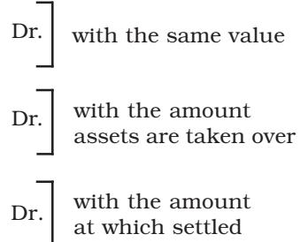

## LEARNING OBJECTIVES

*After studying this chapter you will be able to :*

- *State the meaning of dissolution of partnership firm;*
- *Differentiate between dissolution of partnership and dissolution of a partnership firm;*
- *Describe the various modes of dissolution of the partnership firm;*
- *Explain the rules relating to the settlement of claims among all partners;*
- *Prepare Realisation Account;*

Y ou have learnt about the reconstitution of a partnership firm which takes place on account of admission, retirement or death of a partner. In such a situation while the existing partnership is dissolved, the firm may continue under the same name if the partners so decide. In other words, it results in the dissolution of a partnership but not that of the firm. According to Section 39 of the partnership Act 1932, the dissolution of partnership between all the partners of a firm is called the dissolution of the firm. That means the Act recognises the difference in the breaking of relationship between all the partners of a firm and between some of the partners; and it is the breaking or discontinuance of relationship between all the partners which is termed as the dissolution of partnership firm. This brings an end to the existence of firm, and no business is transacted after dissolution except the activities related to closing of the firm as the affairs of the firm are to be wound up by selling firm's assets and paying its liabilities and discharging the claims of the partners.

# 4.1 Dissolution of Partnership

As stated earlier dissolution of partnership changes the existing relationship between partners but the firm may continue its business as before. The dissolution of partnership may take place in any of the following ways:

- (1) Change in existing profit sharing ratio among partners;
- (2) Admission of a new partner;
- (3) Retirement of a partner;
- (4) Death of a partner;
- (5) Insolvency of a partner;
- (6) Completion of the venture, if partnership is formed for that; and
- (7) Expiry of the period of partnership, if partnership is for a specific period of time;

# 4.2 Dissolution of a Firm

Dissolution of a partnership firm may take place without the intervention of court or by the order of a court, in any of the ways specified later in this section. It may be noted that dissolution of the firm necessarily brings in dissolution of the partnership. However, dissolution of partnership would not necessarily involve dissolution of firms.

Dissolution of a firm takes place in any of the following ways:

- 1. *Dissolution by Agreement:* A firm is dissolved :
	- (a) with the consent of all the partners or
	- (b) in accordance with a contract between the partners.
- 2. *Compulsory Dissolution:* A firm is dissolved compulsorily in the following cases:
	- (a) when all the partners or all but one partner, become insolvent, rendering them incompetent to sign a contract;
	- (b) when the business of the firm becomes illegal; or
	- (c) when some event has taken place which makes it unlawful for the partners to carry on the business of the firm in partnership, e.g., when a partner who is a citizen of a country becomes an alien enemy because of the declaration of war with his country and India.
- 3. *On the happening of certain contingencies:* Subject to contract between the partners, a firm is dissolved :
	- (a) if constituted for a fixed term, by the expiry of that term;
	- (b) if constituted to carry out one or more ventures, by the completion thereof;
	- (c) by the death of a partner;
	- (d) by the adjudication of a partner as an insolvent.
- 4. *Dissolution by Notice:* In case of partnership at will, the firm may be dissolved if any one of the partners gives a notice in writing to the other partners, signifying his intention of seeking dissolution of the firm.
- 5. *Dissolution by Court:* At the suit of a partner, the court may order a partnership firm to be dissolved on any of the following grounds:
	- (a) when a partner becomes insane;
	- (b) when a partner becomes permanently incapable of performing his duties as a partner;
- (c) when a partner is guilty of misconduct which is likely to adversely affect the business of the firm;
- (d) when a partner persistently commits breach of partnership agreement;
- (e) when a partner has transferred the whole of his interest in the firm to a third party;
- (f) when the business of the firm cannot be carried on except at a loss; or
- (g) when, on any ground, the court regards dissolution to be just and equitable.

| Basis |  | Dissolution of Partnership | Dissolution of Firm |
| --- | --- | --- | --- |
| 1. | Termination of | The business is not | The business of the firm is |
|  | business | terminated. | closed. |
| 2. | Settlement of | Assets and liabilities are | Assets are sold and |
|  | assets and | revalued and new balance | liabilities are paid-off. |
|  | liabilities | sheet is drawn. |  |
| 3. | Court's | Court does not intervene | A firm can be dissolved by |
|  | intervention | because partnership is | the court's order. |
|  |  | dissolved by mutual |  |
|  |  | agreement. |  |
| 4. | Economic | Economic relationship | Economic relationship |
|  | relationship | between the partners | between the partners |
|  |  | continues though in | comes to an end. |
|  |  | a changed form. |  |
| 5. | Closure of books | Does not require because | The books of account are |
|  |  | the business is not | closed. |
|  |  | terminated. |  |

## Distinction between Dissolution of Partnership and Dissolution of Firm

## Test your Understanding – I

State giving reasons, which of the following statements are true or false:

- 1. Dissolution of a partnership is different from dissolution of a firm,
- 2. A partnership is dissolved when there is a death of a partner,
- 3. A firm is dissolved when all partners give consent to it.
- 4. A firm is compulsorily dissolved when a partner decide to retire.
- 5. Dissolution of a firm necessarily involves dissolution of partnership.
- 6. A firm is compulsorily dissolved when all partners or when all except one partner become involvent.
- 7. Court can order a firm to be dissolved when a partner becomes insane.
- 8. Dissolution of partnership can not take place without intervention of the court.

# 4.3 Settlement of Accounts

In case of dissolution of a firm, the firm ceases to conduct business and has to settle its accounts. For this purpose, it disposes off all its assets for satisfying all the claims against it. In this context it should be noted that, subject to agreement among the partners, the following rules as provided in Section 48 of the Partnership Act 1932 shall apply.

- (a) *Treatment of Losses*
Losses, including deficiencies of capital, shall be paid :

- (i) first out of profits,
- (ii) next out of capital of partners, and
- (iii) lastly, if necessary, by the partners individually in their profit sharing ratio.
- (b) *Application of Assets*

The assets of the firm, including any sum contributed by the partners to make up deficiencies of capital, shall be applied in the following manner and order:

- (i) In paying the debts of the firm to the third parties;
- (ii) In paying each partner proportionately what is due to him/her from the firm for advances as distinguished from capital (i.e. partner' loan);
- (iii) In paying to each partner proportionately what is due to him on account of capital; and
- (iv) the residue, if any, shall be divided among the partners in their profit sharing ratio.

Thus, the amount realised from assets along with contribution from partners, if required, shall be utilised first to pay off the outside liabilities of the firm such as creditors, loans, bank overdraft, bill payables, etc. (it may be noted that secured loans have precedence over the unsecured loans); the balance should be applied to repay loans made by the partners to the firm. (in case the balance amount is not adequate enough to pay off such loans and advances, they are to be paid propartionately). The amount left thereafter is utilised in settlement of capital account balances. Then the surplus if any is divided among partners in their profit sharing ratio.

*Private Debts and Firm's Debts:* Where both the debts of the firm and private debts of a partner co-exist, the following rules, as stated in Section 49 of the Act, shall apply.

- (a) The property of the firm shall be applied first in the payment of debts of the firm and then the surplus, if any, shall be divided among the partners as per their claims, which can be utilised for payment of their private liabilities.
- (b) The private property of any partner shall be applied first in payment of his private debts and the surplus, if any, may be utilised for payment of the firm's debts, in case the firm's liabilities exceed the firm's assets.

It may be noted that the private property of the partner does not include the personal properties of his wife and children. Thus, if the assets of the firm are not adequate enough to pay off firm's liabilities, the partners have to contribute out of their net private assets (private assets minus private liabilities).

## Inability of a Partner to Contribute Towards Deficiency

In the context of settlement of accounts among the partners there is still another important aspect to be noted, i.e., when a partner is unable to contribute towards the deficiency of his capital account (the account finally showing a debit balance), he/she is said to be insolvent, and the sum not recoverable is treated as capital loss for the firm. In the absence of any agreement, to the contrary, such a capital loss is to be borne by the remaining solvent partners in accordance with the principle laid down in Garner vs. Murray case, which states that the solvent partners have to bear such loss in the ratio of their capitals as on the date of dissolution. However, the accounting treatment relating to dissolution of partnership on account of insolvency of partners is not being taken up at this stage.

# 4.4 Accounting Treatment

When the firm is dissolved, its books of account are to be closed and the profit or loss arising on realisation of its assets and discharge of liabilities is to be computed. For this purpose, a Realisation Account is prepared to ascertain the net effect (profit or loss) of realisation of assets and payment of liabilities which may be is transferred to partner's capital accounts in their profit sharing ratio. Hence, all assets (other than cash in hand bank balance and fictitious assets, if any), and all external liabilities are transferred to this account. It also records the sale of assets, and payment of liabilities and realisation expenses. The balance in this account is termed as profit or loss on realisation which is transferred to partners' capital accounts in the profit sharing ratio (see figure 4.1).

| Dr. | Realisation Account |  | Cr. |
| --- | --- | --- | --- |
| Particulars | Amount | Particulars | Amount |
|  | (Rs.) |  | (Rs.) |
| Intangible Assets | xxx | Bank Loan Mortgage | xxx |
| Land and Building | xxx | Sundry creditors | xxx |
| Plant and Machinery | xxx | Bills payables | xxx |
| Furniture and Fittings | xxx | Bank overdraft | xxx |
| Loan to other parties | xxx | Outstanding expenses | xxx |
| Bills receivables | xxx | Provision for doubtful debts | xxx |
| Sundry debtors | xxx | Cash/Bank (sale of assets) | xxx |
| Cash/Bank | xxx | Partner's capital account | xxx |
| (payment of liabilities) |  | (assets taken by the partner) |  |
| Cash/Bank | xxx | Loss (transferred to partners | xxx |
| (payment of unrecorded liabilities) |  | capital accounts) |  |
| Partner's capital account | xxx | Loss (transferred to partners | xxx |
| Investments | xxx | Investment Fluctuation Fund | xxx |
| (liability assumed by the partner) |  |  |  |
| Profit (transferred to partners' | xxx |  |  |
| capital account's in their profit |  |  |  |
| sharing ratio) |  |  |  |
| Total | xxxxx | Total | xxxxx |

| Fig. 4.1: Format of Realisation Account |
| --- |

#### Test your Understanding – II

## Tick (P) the Correct Answer

- 1. On dissolution of a firm, bank overdraft is transferred to :
	- (a) Cash Account
	- (b) Bank Account
	- (c) Realisation Aaccount
	- (d) Partner's capital Account.
- 2. On dissolution of a firm, partner's loan account is transferred to:
	- (a) Realisation Account
	- (b) Partner's Capital Account
	- (c) Partner's Current Account
	- (d) None of the above.
- 3. After transferring liabilities like creditors and bills payables in the Realisation Account, in the absence of any information regarding their payment, such liabilities are treated as:
	- (a) Never paid
	- (b) Fully paid
	- (c) Partly paid
	- (d) None of the above.
- 4. When realisation expenses are paid by the firm on behalf of a partner, such expenses are debited to:
	- (a) Realisation Account
	- (b) Partner's Capital Account
	- (c) Partner's Loan Account
	- (d) None of the above.
- 5. Unrecorded assets when taken over by a partner are shown in :
	- (a) Debit of Realisation Account
	- (b) Debit of Bank Account
	- (c) Credit of Realisation Account
	- (d) Credit of Bank Account.
- 6. Unrecorded liabilities when paid are shown in:
	- (a) Debit of Realisation Account
	- (b) Debit of Bank Account
	- (c) Credit of Realisation Account
	- (d) Credit of Bank Account.
- 7. The accumulated profits and reserves are transferred to :
	- (a) Realisation Account
	- (b) Partners' Capital Accounts
	- (c) Bank Account
	- (d) None of the above.
- 8. On dissolution of the firm, partner's capital accounts are closed through:
	- (a) Realisation Account
	- (b) Drawings Account
	- (c) Bank Account
	- (d) Loan Account.

# *Illustration 1*

Supriya and Monika are partners, who share profit in the ratio of 3:2. Following is the balance sheet as on March 31, 2020.

| Liabilities | Amount | Assets |  | Amount |
| --- | --- | --- | --- | --- |
|  | (Rs.) |  |  | (Rs.) |
| Supriya's Capital | 32,500 | Cash and Bank |  | 40,500 |
| Monika's Capital | 11,500 | Stock |  | 7,500 |
| Sundry Creditors | 48,000 | Sundry debtors | 21,500 |  |
| General Reserve | 13,500 | Less: Provision | 500 | 21,000 |
|  |  | for doubtful debts |  |  |
|  |  | Fixed Assets |  | 36,500 |
|  | 1,05,500 |  |  | 1,05,500 |

Balance Sheet of Supriya and Monika as on March 31, 2020

The firm was dissolved on March 31, 2020. Close the books of the firm with the following information:

- (i) Debtors realised at a discount of 5%,
- (ii) Stock realised at Rs.7,000,
- (iii) Fixed assets realised at Rs.42,000,
- (iv) Realisation expenses of Rs.1,500,
- (v) Creditors are paid in full.

Record necessary journal entries at the time of dissolution of a firm.

## *Solution*

#### Books of Supriya and Monika Realisation Account

| Date | Particulars | L.F. | Debit | Credit |
| --- | --- | --- | --- | --- |
| 2020 |  |  | Amount | Amount |
|  |  |  | (Rs.) | (Rs.) |
| Mar., 31 | Realisation A/c Dr. |  | 65,500 |  |
|  | To Stock A/c |  |  | 7,500 |
|  | To Sundry Debtors A/c |  |  | 21,500 |
|  | To fixed Assets A/c |  |  | 36,500 |
|  | (Assets transferred to realisation account) |  |  |  |
| 2020 |  |  |  |  |
| Mar., 31 | Sundry Creditors A/c Dr. |  | 48,000 |  |
|  | Provision for doubtful debts A/c Dr. |  | 500 |  |
|  | To Realisation A/c |  |  | 48,500 |
|  | (Liabilities transferred to Realisation A/c |  |  |  |
| 2020 |  |  |  |  |
| Mar., 31 | Bank A/c Dr. |  | 69,425 |  |
|  | To Realisation A/c |  |  | 69,425 |
|  | (Assets Realized) |  |  |  |

| 2020 |  |  |  |  |
| --- | --- | --- | --- | --- |
| Mar., 31 | Realisation A/c | Dr. | 49,500 |  |
|  | To Bank A/c |  |  | 49,500 |
|  | (Creditors and realisation expenses paid) |  |  |  |
| 2020 |  |  |  |  |
| Mar., 31 | Realisation A/c | Dr. | 2,925 |  |
|  | To Supriya's Capital A/c |  |  | 1,755 |
|  | To Monika's Capital A/c |  |  | 1,170 |
|  | (Realisation Profit transferred to partners' |  |  |  |
|  | capital account) |  |  |  |
| 2020 |  |  |  |  |
| Mar., 31 | General Reserve A/c | Dr. | 13,500 |  |
|  | To Supriya's Capital A/c |  |  | 8,100 |
|  | To Monika's Capital A/c |  |  | 5,400 |
|  | (Profit in realisation transferred to partners' |  |  |  |
|  | capital accounts) |  |  |  |
| 2020 |  |  |  |  |
| Mar., 31 | Supriya's Capital A/c | Dr. | 42,355 |  |
|  | Monika's Capital A/c |  | 18,070 |  |
|  | To Bank A/c |  |  | 60,425 |
|  | (Final accounts due paid to partners) |  |  |  |

*Working Notes:*

#### Books of Supriya and Monika Realisation Account

| Dr. |  |  |  |  | Cr. |
| --- | --- | --- | --- | --- | --- |
| Particulars |  | Amount | Particulars |  | Amount |
|  |  | (Rs.) |  |  | (Rs.) |
| Assets transferred: |  |  | Provision for doubtful debts |  | 500 |
| Stock |  | 7,500 | Sundry creditors |  | 48,000 |
| Sundry debtors |  | 21,500 | Bank |  |  |
| Fixed assets |  | 36,500 | Debtors | 20,425 |  |
| Bank |  |  | Stock | 7,000 |  |
| Creditors |  | 48,000 | Fixed assets | 42,000 | 69,425 |
| Realisation expenses |  | 1,500 |  |  |  |
| Profit transferred to: |  |  |  |  |  |
| Supriya Capital | 1,755 |  |  |  |  |
| Monika Capital | 1,170 | 2,925 |  |  |  |
|  |  | 1,17,925 |  |  | 1,17,925 |

| Dr. |  |  |  |  |  | Cr. |
| --- | --- | --- | --- | --- | --- | --- |
|  | Date Particulars | J.F. Supriya Monika |  | Date Particulars | J.F. Supriya | Monika |
|  |  | (Rs.) | (Rs.) |  | (Rs.) | (Rs.) |
|  | Bank | 42,355 18,070 |  | Balance b/d | 32,500 11,500 |  |
|  |  |  |  | Reserve fund | 8,100 | 5,400 |
|  |  |  |  | Realisation (Profit) | 1,755 | 1,170 |
|  |  | 42,355 18,070 |  |  | 42,355 18,070 |  |

Partners Capital Accounts

# *4.4.1 Journal Entries*

- *1. For transfer of assets*
All asset accounts excluding cash, bank and the fictitious assets, if any are closed by transfer to the debit of Realisation Account at their book values. It may be noted that sundry debtors are transferred at gross value and the provision for doubtful debts is transferred to the credit side of Realisation Account along with liabilities. The same thing will apply to fixed assets, if provision for depreciation account is maintained.

> Realisation A/c Dr. To Assets (Individually) A/c

- *2. For transfer of liabilities*
All external liability accounts including provisions, if any, are closed by transferring them to the credit of Realisation account.

Liabilities (individually) Dr. To Realisation A/c

- *3. For sale of assets* Bank A/c Dr. To Realisation A/c
*4. For an asset taken over by a partner* Partner's Capital A/c Dr. To Realisation A/c

- *5. For payment of liabilities*
Realisation A/c Dr. To Bank A/c

- *6. For a liability which a partner takes responsibility to discharge*
Ralisation A/c Dr. To Partner's Capital A/c

- 7. For settlement with the creditor through transfer of assets when a creditor accepts an asset in full and final settlement of his account, no journal entry needs to be recorded. But, if the creditor accepts an asset only as part payment of his/her dues, the entry will be made for cash payment only. For example, a creditor to whom Rs. 10,000 was due accepts office equipment worth Rs. 8,000 and is paid Rs. 2,000 in cash, the following entry shall be made for the payment of Rs. 2,000 only.
Realisation A/c Dr. To Bank A/c

However, when a creditor accepts an asset whose value is more than the due amount he/she pay cash to the firm for the difference for which the entry will be:

> Bank A/c Dr. To Realisation A/c

- *8. For payment of realisation expenses*
	- (a) When some expenses are incurred and paid by the firm in the process of realisation of assets and payment of liabilities:

Realisation A/c Dr. To Bank A/c

- (b) When realisation expenses are paid by a partner on behalf of the firm:
Realisation A/c Dr. To Partner's Capital A/c

- (c) When a partner has agreed to bear the realisation expenses:
- (i) if payment of realisation expenses is made by the firm

Partner's Capital A/c Dr. To Bank A/c

- (ii) if the partner himself pays the realisation expenses, no entry is required
- *Note: In the absence of information about who is paying the expenses, it is implied that expenses are paid by the partner who has agreed to bear expenses.*

*9.* For agreed remuneration to such partner who agrees to undertake the dissolution work.

> Realisation A/c Dr. To Partner's Capital A/c

*10.For realisation of any unrecorded assets including goodwill, if any*

Bank A/c Dr. To Realisation A/c

| 11.For settlement of any unrecorded liability |  |  |
| --- | --- | --- |
| Realisation A/c | Dr. |  |
| To Bank A/c |  |  |
| 12.For transfer of profit and loss on realisation |  | (Cr. Balance) |
| (a) In case of profit on realisation |  |  |
| Realisation A/c | Dr. |  |
| To Partners' Capital A/c (individually) A/c |  |  |
| (b) In case of loss on realisation |  |  |
| Partners' Capital A/c (individually) | Dr. | (Dr. Balance) |
| To Realisation A/c |  |  |
| 13.For settlement of loan by a firm to a partner: |  |  |
| Bank A/c | Dr. |  |
| To loan to partners A/c |  |  |
| 14.For transfer of accumulated profits in the form of general reserve to |  |  |
| partners' capital accounts in their profit sharing ratio: |  |  |
| General Reserve A/c | Dr. |  |
| To Partners' Capital A/c (individually) |  |  |
| 15.For transfer of fictitious assets, if any, to partners' capital accounts in |  |  |
| their profit sharing ratio: |  |  |
| Partners' Capital A/c (individually) | Dr. |  |
| To Fictitious Asset A/c |  |  |
| 16.For payment of loans due to partners |  |  |
| Partner's Loan A/c | Dr. |  |
| To Bank A/c |  |  |
| 17.For settlement of partners' accounts |  |  |
| If the partner's capital account shows a debit balance after posting of rebount |  |  |
| entries firms. He brings in the necessary cash for which the entry will be: |  |  |

Bank A/c Dr. To Partner's Capital A/c

The balance is paid to partners whose capital accounts show a credit balance and the following entry is recorded.

> Partners' Capitals A/cs (individually) Dr. To Bank A/c

It may be noted that the aggregate amount finally payable to the partners must equal to the amount available in bank and cash accounts. Thus, all accounts of a firm are closed in case of dissolution.

# *Illustration 2*

Sita, Rita and Meeta are partners sharing profit and losses in the ratio of 2:2:1 Their balance sheet as on March 31, 2017 is as follows:

| Liabilities |  | Amount | Assets | Amount |
| --- | --- | --- | --- | --- |
|  |  | (Rs.) |  | (Rs.) |
| General Reserve |  | 2,500 | Cash at bank | 2,500 |
| Creditors |  | 2,000 | Stock | 2,500 |
| Capitals: |  |  | Furniture | 1,000 |
| Sita | 5,000 |  | Debtors | 2,000 |
| Rita | 2,000 |  | Plant and Machinery | 4,500 |
| Meeta | 1,000 | 8,000 |  |  |
|  |  | 12,500 |  | 12,500 |

Balance Sheet of Sita, Rita and Meeta as on March 31, 2017

They decided to dissolve the business. The following amounts were realised: Plant and Machinery Rs.4,250, Stock Rs.3,500, Debtors Rs.1850, Furniture 750.

Sita agreed to bear all realisation paid by the firm expenses. For the service Sita is paid Rs.60.

Actual expenses on realisation paid by the firm amounted to Rs.450.Creditors paid 2% less. There was an unrecorded assets of Rs.250, which was taken over by Rita at Rs.200.

Prepare the necessary accounts to close the books of the firm.

# *Solution*

| Books of Sita, Rita and Meeta |  |  |  |  |  |
| --- | --- | --- | --- | --- | --- |
| Dr. |  | Realisation Account |  |  | Cr. |
| Particulars |  | Amount | Particulars |  | Amount |
| (Rs.) |  |  |  |  | (Rs.) |
|  |  |  | Creditors |  | 2,000 |
| Stock |  | 2,500 | Rita's capital |  | 200 |
| Furniture |  | 1,000 | [Unrecorded assets] |  |  |
| Debtors |  | 2,000 | Bank [assets realised]: |  |  |
| Plant and Machinery |  | 4,500 | Plant and Machinery | 4,250 |  |
| Bank [Creditors] |  | 1,960 | Debtors | 1,850 |  |
| Sita's capital |  | 60 | Stock | 3,500 |  |
| (realisation expenses] |  |  | Furniture | 750 | 10,350 |
| Profit transferred to: |  |  |  |  |  |
| Sita's capital | 212 |  |  |  |  |
| Rita's capital | 212 |  |  |  |  |
| Meeta's capital | 106 | 530 |  |  |  |
| 12,550 |  |  |  |  | 12,550 |

| Dr. |  |  |  | Partner's Capital Accounts |  |  |  |  | Cr. |
| --- | --- | --- | --- | --- | --- | --- | --- | --- | --- |
| Date Particulars | J.F. | Sita | Rita | Meeta Date | Particulars | J.F. | Sita | Rita | Meeta |
| 2017 |  | (Rs.) | (Rs.) | (Rs.) 2017 |  |  | (Rs.) | (Rs.) | (Rs.) |
| Mar. Bank |  | 450 |  | Mar. | Balance b/d |  | 5,000 | 2,000 | 1,000 |
| 31 Realisation (asset) |  |  | 200 | 31 | Reserve fund |  | 1,000 | 1,000 | 500 |
| Bank |  | 5,822 | 3,012 | 1,606 | Realisation |  |  |  |  |
|  |  |  |  |  | [profit] |  | 212 | 212 | 106 |
|  |  |  |  |  | Realisation |  |  |  |  |
|  |  |  |  |  | (expenses) |  | 60 | — | — |
|  |  | 6,272 | 3,212 | 1,606 |  |  | 6,272 | 3,212 | 1,606 |

| Dr. |  |  |  | Bank Account |  |  | Cr. |
| --- | --- | --- | --- | --- | --- | --- | --- |
| Date | Particulars | J.F. | Amount |  | Date Particulars | J.F. | Amount |
| 2017 |  |  | (Rs.) | 2017 |  |  | (Rs.) |
|  | Mar. Balance b/d |  | 2,500 | Mar. | Realisation (Creditor) |  | 1,960 |
| 31 | Realisation |  |  | 31 | Sita's Capital |  | 450 |
|  | (assets realised) |  | 10,350 |  | [expenses] |  |  |
|  |  |  |  |  | Sita's Capital |  | 5,822 |
|  |  |  |  |  | Rita's Capital |  | 3,012 |
|  |  |  |  |  | Meeta's capital |  | 1,606 |
|  |  |  | 12,850 |  |  |  | 12,850 |

# *Illustration 3*

Record journal entries at the time of dissolution of a partnership firm of Vibha, Shobha and Anubha in the following cases:

- a) Dissolution expenses amounted to Rs. 6,500.
- b) Dissolution expenses Rs. 7,800 were paid by Anubha.
- c) Vibha was appointed to look after the dissolution process for which she was given a remuneration of Rs. 12,000
- d) Shobha was appointed to look after the dissolution work for which she was allowed a remuneration of Rs.15,000. She agreed to bear dissolution expenses. Actual dissolution expenses paid by her amounted to Rs. 11,800.
- e) Anubha was to look after the dissolution process for which she was allowed a remuneration of Rs. 12,000 she also agreed to bear dissolution expenses. Actual expenses Rs. 9,500 were paid by the firm.
- f) Anubha looked after the dissolution work for remuneration of Rs. 8,500 and agreed to bear dissolution expenses upto Rs. 6,000. Actual expenses paid by her were Rs. 7,600.
- g) Vibha was appointed to look after the dissolution work for which she was allowed a remuneration of Rs. 14,000. She agreed to take over investment

of the book value of Rs. 13,000 towards payment of her remuneration. Investments have already been transferred to realisation Account.

| Date | Particulars |  | L.F. | Debit | Credit |
| --- | --- | --- | --- | --- | --- |
| 2017 |  |  |  | Amount | Amount |
|  |  |  |  | (Rs.) | (Rs.) |
| (a) | Realisation A/c | Dr. |  | 6,500 |  |
|  | To Cash / Bank A/c |  |  |  | 6,500 |
|  | (Dissolution expense paid by the firm) |  |  |  |  |
| (b) | Realisation A/c | Dr. |  | 7,800 |  |
|  | To Anubha's Capital A/c |  |  |  | 7,800 |
|  | (Dissolution Expenses paid by Anubha) |  |  |  |  |
| (c) | Realisation A/c | Dr. |  | 12,000 |  |
|  | To Vibha's Capital A/c |  |  |  | 12,000 |
|  | (Remuneration given to Vibha) |  |  |  |  |
| (d) | Realisation A/c | Dr. |  | 15,000 |  |
|  | To Shobha's Capital A/c |  |  |  | 15,000 |
|  | (Remuneration allowed to Shobha for |  |  |  |  |
|  | looking after dissolution work) |  |  |  |  |
| (e) | (i) Realisation A/c | Dr. |  | 12,000 |  |
|  | To Anubha's Capital A/c |  |  |  | 12,000 |
|  | (Remuneration allowed to Anubha) |  |  |  |  |
|  | (ii) Anubha's Capital A/c | Dr. |  | 9,500 |  |
|  | To Cash /Bank A/c |  |  |  | 9,500 |
|  | (Dissolution expenses paid by the firm |  |  |  |  |
|  | and borne by Annubha) |  |  |  |  |
| (f) | (i) Realisation A/c | Dr. |  | 8,500 |  |
|  | To Anubha's Capital A/c |  |  |  | 8,500 |
|  | (Remuneration payable to Anubha) |  |  |  |  |
|  | (ii) Realisation A/c | Dr. |  | 1,600 |  |
|  | To Anubha's Capital A/c |  |  |  | 1,600 |
|  | (Dissolution expenses paid by Anubha |  |  |  |  |
|  | on behalf of the firm) |  |  |  |  |
| (g) | No Entry |  |  |  |  |

## Book of Vibha, Shobha and Anubha

# *llustration 4*

Nayana and Arushi were partners sharing profits equally Their Balance Sheet as on March 31, 2020 was as follows:

| Liabilities |  | Amount | Assets | Amount |
| --- | --- | --- | --- | --- |
|  |  | (Rs.) |  | (Rs.) |
| Capitals: |  |  | Bank | 30,000 |
| Nayana | 1,00,000 |  | Debtors | 25,000 |
| Arushi | 50,000 | 1,50,000 | Stock | 35,000 |
| Creditors |  | 20,000 | Furniture | 40,000 |
| Arushi's current account |  | 10,000 | Machinery | 60,000 |
| Workmen Compensation Reserve |  | 15,000 | Nayana's current account | 10,000 |
| Bank overdraft |  | 5,000 |  |  |
|  |  | 2,00,000 |  | 2,00,000 |

Balance Sheet of Nayana and Arushi as on March 31, 2020

The firm was dissolved on the above date:

- 1. Nayana took over 50% of the stock at 10% less on its book value, and the remaining stock was sold at a gain of 15%. Furniture and Machinery realised for Rs.30,000 and Rs.50,000 respectively;
- 2. There was an unrecorded investment which was sold for Rs. 34,000;
- 3. Debtors realised 90% only and Rs.1,200 were recovered for bad debts written-off last year;
- 4. There was an outstanding bill for repairs which had to be paid for Rs.2,000.

Record necessary journal entries and prepare ledger accounts to close the books of the firm.

# *Solution*

## Books of Nayana and Arushi Journal

| Date | Particulars | L.F. | Debit | Credit |
| --- | --- | --- | --- | --- |
| 2020 |  |  | Amount | Amount |
|  |  |  | (Rs.) | (Rs.) |
|  | Realisation A/c Dr. |  | 1,60,000 |  |
|  | To Debtors |  |  | 25,000 |
|  | To Stock A/c |  |  | 35,000 |
|  | To Furniture A/c |  |  | 40,000 |
|  | To Machinery A/c |  |  | 60,000 |
|  | (Assets transferred to Realisation Account) |  |  |  |
|  | Creditors A/c Dr. |  | 20,000 |  |
|  | Bank overdraft A/c Dr. |  | 5,000 |  |
|  | To Realisation A/c |  |  | 25,000 |
|  | (Liabilities transferred to Realisation Account) |  |  |  |
|  | Realisation A/c Dr. |  | 27,000 |  |
|  | To Bank A/c |  |  | 27,000 |
|  | (Creditors, Bank overdraft, Outstanding |  |  |  |
|  | repair bill paid) |  |  |  |

| Bank A/c | Dr. | 1,57,825 |  |
| --- | --- | --- | --- |
| To Realisation A/c |  |  | 1,57,825 |
| (Assets sold and bad debts recovered) |  |  |  |
| Nayana's Current A/c | Dr. | 15,750 |  |
| To Realisation A/c |  |  | 15,750 |
| (Half stock take over by Nayana at 10% less) |  |  |  |
| Realisation A/c | Dr. | 15,575 |  |
| To Nayana's Current A/c |  |  | 5,788 |
| To Arushi's Current A/c |  |  | 5,787 |
| (Realisation profit transferred to partner's |  |  |  |
| current account) |  |  |  |
| Workman Compensation Reserve A/c | Dr. | 15,000 |  |
| To Nayana's Current A/c |  |  | 7,500 |
| To Arushi's Current A/c |  |  | 7,500 |
| (Compensation fund transfered to partners' |  |  |  |
| Current account) |  |  |  |
| Arushi Current A/c | Dr. | 23,287 |  |
| To Arushi's Capital A/c |  |  | 23,287 |
| (Current account balance transferred to |  |  |  |
| Capital account) |  |  |  |
| Nayana Capital A/c | Dr. | 12,462 |  |
| To Nayana's Current A/c |  |  | 12,462 |
| (Current account balance transferred to Capital |  |  |  |
| account) |  |  |  |
| Nayana's Capital A/c | Dr. | 87,538 |  |
| Arushi's Capital A/c | Dr. | 73,287 |  |
| To Bank A/c |  |  | 1,60,825 |
| (Final amounts due to partners paid) |  |  |  |

| Realisation Account |
| --- |

| Dr. |  |  |  |  | Cr. |
| --- | --- | --- | --- | --- | --- |
| Particulars |  | Amount | Particulars |  | Amount |
|  |  | (Rs.) |  |  | (Rs.) |
|  |  |  | Creditors |  | 20,000 |
| Debtors | 25,000 |  | Bank overdraft |  | 5,000 |
| Stock | 35,000 |  | Bank: |  |  |
| Furniture | 40,000 |  | Investment | 34,000 |  |
| Machinery | 60,000 | 1,60,000 | Furniture | 30,000 |  |
| Bank: |  |  | Machinery | 50,000 |  |
| Creditors | 20,000 |  | Debtors (90%) | 22,500 |  |
| Bank overdraft | 5,000 |  | Stock : | 20,125 |  |
| Outstanding bill | 2,000 | 27,000 | Bad debts |  |  |
| Profit transferred to : |  |  | recovered | 1,200 | 1,57,825 |
| Nayana's capital | 5,788 |  | Nayana's capital |  |  |
| Arushi's capital | 5,787 | 11,575 | (stock taken over) |  | 15,750 |
|  |  | 1,98,575 |  |  | 1,98,575 |

| Dr. |  |  |  |  |  |  | Cr. |
| --- | --- | --- | --- | --- | --- | --- | --- |
| Date Particulars |  | J.F. Nayana | Arushi | Date Particulars |  | J.F. Nayana | Arushi |
| 2020 |  | (Rs.) | (Rs.) | 2017 |  | (Rs.) | (Rs.) |
|  | Balance b/d | 10,000 |  |  | Balance b/d |  | 10,000 |
|  | Realisation | 15,750 |  |  | Workmen | 7,500 | 7,500 |
|  | Arushi's capital |  | 23,287 |  | Compensation |  |  |
|  |  |  |  |  | Reserve |  |  |
|  |  |  |  |  | Realisation (profit) | 5,788 | 5,787 |
|  |  |  |  |  | Nayana's Capital | 12,462 |  |
|  |  | 25,750 23,287 |  |  |  | 25,750 23,287 |  |

#### Partners' Current Accounts

#### Partner's Capital Accounts

| Dr. |  |  |  |  |  |  |  | Cr. |
| --- | --- | --- | --- | --- | --- | --- | --- | --- |
| Date Particulars |  | J.F. | Nayana Arushi |  | Date Particulars | J.F. | Nayana | Arushi |
| 2020 |  |  | (Rs.) (Rs.) | 2017 |  |  | (Rs.) | (Rs.) |
|  | Nayana's current |  | 12,462 |  | Balance b/d |  | 1,00,000 | 50,000 |
|  | account |  |  |  | Arushi's |  |  | 23,287 |
|  | Bank |  | 87,538 73,287 |  | current account |  |  |  |
|  |  |  | 1,00,000 73,287 |  |  |  | 1,00,000 | 73,287 |

#### Bank Account

| Dr. |  |  |  |  |  |  | Cr. |
| --- | --- | --- | --- | --- | --- | --- | --- |
|  | Date Particulars | J.F. | Amount | Date Particulars |  | J.F. | Amount |
|  |  |  | (Rs.) |  |  |  | (Rs.) |
|  | Balance b/d Realisation |  | 30,000 1,57,825 | Realisation | Nayana's capital |  | 27,000 87,538 |
|  |  |  |  |  | Arushi's capital |  | 73,287 |
|  |  |  | 1,87,825 |  |  |  | 1,87,825 |

#### Test your Understanding – III

#### Fill in the Correct Word(s):

- 1. All assets (except cash/bank and fictitious assets) are transferred to the ————— (Debit/Credit) side of ——————— Account (Realisation/Capital).
- 2. All ————— (internal/external) liabilities are transferred to the ————— (Debit/Credit) side of ——————acccount (Bank/Realisation).
- 3. Accumulated losses are transferred to ————— (Realisation/Capital Accounts) in —————— (equal ratio/profit sharing ratio).
- 4. If a liability is assumed by a partner, such Partner's Capital Account is ––––––– ——— (debited/credited).
- 5. If a partner takes over an asset, such (Partner's Capital Account) is ———————— (debited/credited).
- 6. No entry is required when a ——————— (partner/creditor) accepts a fixed asset in payment of his dues.
- 7. When creditor accepts an asset whose value is much more than the amount due to him, he will ———————— (pay/not pay) the excess amount which will be credited ———————— Account.
- 8. When the firm has agreed to pay the partner a fixed amount for realisation work irrespective of the actual amount spent, such fixed amount is debited to (Realisation/Capital) Account and Credited to (Capital/Bank) Account.
- 9. Partner's loan is —————— (transfered/not transfered) in the (Realisation Account).
- 10. Partner's current accounts are transferred to respective ———————— Partners' (Loan/Capital) Accounts.

# *Illustration 5*

Following is the Balance Sheet of Ashwani and Bharat on March 31, 2017.

| Liabilities |  | Amount | Assets |  | Amount |
| --- | --- | --- | --- | --- | --- |
|  |  | (Rs.) |  |  | (Rs.) |
| Creditors |  | 76,000 | Cash at bank |  | 17,000 |
| Mrs.Ashwani's loan |  | 10,000 | Stock |  | 10,000 |
| Mrs.Bharat loan |  | 20,000 | Investments |  | 20,000 |
| Investment fluctuation reserve |  | 2,000 | Debtors | 40,000 |  |
| General Reserve |  | 20,000 | Less: Provision |  |  |
| Capitals: |  |  |  | for doubtful debts 4,000 | 36,000 |
| Ashwani | 20,000 |  | Buildings |  | 70,000 |
| Bharat | 20,000 | 40,000 | Goodwill |  | 15,000 |
|  |  | 1,68,000 |  |  | 1,68,000 |

# Balance Sheet Ashwani and Bharat as on March 31, 2017

The firm was dissolved on that date. The following was agreed transactions took place.

- (i) Aswhani promised to pay Mrs. Ashwani's loan and took away stock for Rs.8,000.
- (ii) Bharat took away half of the investment at 10% less. Debtors realised for Rs.38,000. Creditor's were paid at less of Rs.380. Buildings realised for Rs.1,30,000, Goodwill Rs.12,000 and the remaining Investment were sold at Rs.9,000. An old typewriter not recorded in the books was taken over by Bharat for Rs. 600. Realisation expenses amounted to Rs. 2,000. Prepare Realisation Account, Partner's Capital Account and Bank Account.

# *Solution*

# Books of Ashwani and Bharat

| Dr. | Realisation Account |  | Cr. |
| --- | --- | --- | --- |
| Particulars | Amount | Particulars | Amount |
|  | (Rs.) |  | (Rs.) |
| Investment | 20,000 | Provision for doubtful debts | 4,000 |
| Debtors | 40,000 | Creditors | 76,000 |
| Buildings | 70,000 | Mrs. Ashwani loan | 10,000 |
| Stock | 10,000 | Mrs. Bharat loan | 20,000 |

| Goodwill | 15,000 | 1,55,000 | Investment fluctuation reserve |  | 2,000 |
| --- | --- | --- | --- | --- | --- |
| Ashwani's Capital |  | 10,000 | Ashwani's Capital[stock] |  | 8,000 |
| (Mrs.Ashwani's loan} |  |  | Bharat's capital (Typewriter) |  | 600 |
| Bank (Mrs. Bharat's loan) |  | 20,000 | Bharat's capital (Investment) |  | 9,000 |
| Bank (creditors) |  | 75,620 | Bank: |  |  |
| Bank (realisation expenses) |  | 2,000 | Investment | 9,000 |  |
| Profit transferred to: |  |  | Debtors | 38,000 |  |
| Ashwani's Capital | 27,990 |  | Buildings | 1,30,000 |  |
| Bharat's Capital | 27,990 | 55,980 | Goodwill | 12,000 | 1,89,000 |
|  |  | 3,18,600 |  |  | 3,18,600 |

#### Partner's Capital Accounts

| Dr. |  |  |  |  |  | Cr. |
| --- | --- | --- | --- | --- | --- | --- |
| Date Particulars |  | J.F. Ashwani | Bharat | Date Particulars | J.F. Ashwani | Bharat |
| 2017 |  | (Rs,) | (Rs,) | 2017 | (Rs,) | (Rs,) |
|  | Realisation |  |  | Balance b/d | 20,000 20,000 |  |
|  | (stock) | 8,000 | — | General reserve | 10,000 10,000 |  |
|  | Realisation |  |  | Realisation | 10,000 | — |
|  | [sale of typewriter] |  | 600 | [Mrs. Ashwini's |  |  |
|  | Realisation |  |  | loan] |  |  |
|  | [investment] |  | 9,000 | Realisation (profit) | 27,990 27,990 |  |
|  | Bank | 59,990 48,390 |  |  |  |  |
|  |  | 67,990 57,990 |  |  | 67,990 57,990 |  |

#### Bank Account

| Dr. |  |  |  |  |  |  | Cr. |
| --- | --- | --- | --- | --- | --- | --- | --- |
| Date Particulars |  | J.F. | Amount | Date Particulars |  | J.F. | Amount |
| 2017 |  |  | (Rs.) 2017 |  |  |  | (Rs.) |
|  | Balance b/d |  | 17,000 |  | Realisation [creditors] |  | 75,620 |
|  | Realisation |  | 1,89,000 |  | Realisation [expenses] |  | 2,000 |
|  |  |  |  |  | Realisation |  |  |
|  |  |  |  |  | (Mrs.Bharat's loan) |  | 20,000 |
|  |  |  |  |  | Ashwani's capital |  | 59,990 |
|  |  |  |  |  | Bharat's capital |  | 48,390 |
|  |  |  | 2,06,000 |  |  |  | 2,06,000 |

#### Do it Yourself

Give the journal entry(ies) to be recorded for the following, in case of the dissolution of a partnership firm.

- 1. For closure of assets accounts.
- 2. For closure of liabilities accounts.
- 3. For sale of assets.
- 4. For settlement of a creditor by transfer of fixed assets to him.
- 5. For expenses of realisation when actual expenses are paid by the partner on behalf of the firm.
- 6. When a partner discharges the liability of the firm.
- 7. For payment of partner's loan.
- 8. For settlement of capital accounts.

# *Illustration 6*

Sonia, Rohit and Udit are partners sharing profits in the ratio of 5:3:2. Their Balance Sheet as on March 31, 2017 was as follows:

| Liabilities |  | Amount | Assets | Amount |
| --- | --- | --- | --- | --- |
|  |  | (Rs.) |  | (Rs.) |
| Creditors |  | 30,000 | Buildings | 2,00,000 |
| Bills payable |  | 30,000 | Machinery | 40,000 |
| Bank loan |  | 1,20,000 | Stock | 1,60,000 |
| Sonia's husband's loan |  | 1,30,000 | Bills receivable | 1,20,000 |
| General reserve |  | 80,000 | Furniture | 80,000 |
| Capitals: |  |  | Cash at bank | 60,000 |
| Sonia | 70,000 |  |  |  |
| Rohit | 90,000 |  |  |  |
| Udit | 1,10,000 | 2,70,000 |  |  |
|  |  | 6,60,000 |  | 6,60,000 |

Balance Sheet of Sonia, Rohit and Udit as on March 31, 2017

The firm was dissolved on that date. Close the books of the firm with following information:

- 1. Buildings realised for Rs.1,90,000, Bills receivable realised for Rs.1,10,000; Stock realised Rs.1,50,000; and Machinery sold for Rs.48,000 and furniture for Rs. 75,000,
- 2. Bank loan was settled for Rs.1,30,000. Creditors and Bills payable were settled at 10% discount,
- 3. Rohit paid the realisation expenses of Rs.10,000 for which he paid Rs.12,000 for completing the dissolution process.

Prepare necessary ledger accounts.

| Books of Sonia, Rohit and Udit |  |  |  |  |  |
| --- | --- | --- | --- | --- | --- |
| Dr. |  | Realisation Account |  |  | Cr. |
| Particulars |  | Amount | Particulars |  | Amount |
| (Rs.) |  |  |  |  | (Rs.) |
| Buildings | 2,00,000 |  | Creditors |  | 30,000 |
| Machinery | 40,000 |  | Bills payable |  | 30,000 |
| Stock | 1,60,000 |  | Bank loan |  | 1,20,000 |
| Bills receivable | 1,20,000 |  | Sonia's husband's loan |  | 1,30,000 |
| Furniture | 80,000 | 6,00,000 | Bank: |  |  |
| Bank (Bank Loan) |  | 1,30,000 | Buildings | 1,90,000 |  |
| Bank |  |  | Bills receivable | 1,10,000 |  |
| [creditors and Bills payable] |  | 54,000 | Stock | 1,50,000 |  |
| Bank [Sonia's husbands loan] |  | 1,30,000 | Machinery | 48,000 |  |
| Rohit's capital |  | 12,000 | Furniture | 75,000 | 5,73,000 |
| (reslisation expenses) |  |  | Loss transferred to |  |  |
|  |  |  | capital accounts: |  |  |
|  |  |  | Sonia | 21,500 |  |
|  |  |  | Rohit | 12,900 |  |
|  |  |  | Udit | 8,600 | 43,000 |
| 9,26,000 |  |  |  |  | 9,26,000 |

## *Solution*

| Dr. |  |  |  |  |  |  |  |  |  | Cr. |
| --- | --- | --- | --- | --- | --- | --- | --- | --- | --- | --- |
| Date | Particulars | J.F. | Sonia | Rohit | Udit |  | Date Particulars J.F. | Sonia | Rohit | Udit |
| 2017 |  |  | (Rs.) | (Rs.) | (Rs.) | 2017 |  | (Rs.) | (Rs.) | (Rs.) |
|  | Realisation |  | 21,500 | 12,900 | 8,600 | Balance b/d |  | 70,000 | 90,000 1,10,000 |  |
|  | (Loss) |  |  |  |  |  | Realisation | — | 12,000 | — |
|  | Bank |  | 88,500 | 1,13,100 | 1,17,400 |  | (renumaration) |  |  |  |
|  |  |  |  |  |  |  | General reserve | 40,000 | 24,000 | 16,000 |
|  |  |  | 1,10,000 | 1,26,000 | 1,26,000 |  |  |  | 1,10,000 1,26,000 1,26,000 |  |

#### Partner's Capital Accounts

#### Bank Account

| Dr. |  |  |  |  |  |  | Cr. |
| --- | --- | --- | --- | --- | --- | --- | --- |
| Date Particulars |  | J.F. | Amount |  | Date Particulars | J.F. | Amount |
| 2017 |  |  | (Rs.) | 2017 |  |  | (Rs.) |
|  | Balance b/d |  | 60,000 |  | Realisation [bank loan] |  | 1,30,000 |
|  | Realisation |  | 5,73,000 |  | Realisation |  | 54,000 |
|  | (assets realised) |  |  |  | [creditors and |  |  |
|  |  |  |  |  | bills payable] |  |  |
|  |  |  |  |  | Realisation |  | 1,30,000 |
|  |  |  |  |  | (Sonia's husband loan) |  |  |
|  |  |  |  |  | Sonia's capital |  | 88,500 |
|  |  |  |  |  | Rohit's capital |  | 1,13,100 |
|  |  |  |  |  | Udit's capital |  | 1,17,400 |
|  |  |  | 6,33,000 |  |  |  | 6,33,000 |

*Note:* No entry has been recorded in firm's books for the actual realisation expenses incurred by Rohit because he gets Rs. 12,000 as his remuneration which has been duly accounted for.

# *Illustration 7*

Romesh and Bhawan were in partnership sharing profit and losses as 3:2. Their Balance Sheet as on March 31, 2017, was as follows:

Balance Sheet of Romesh and Bhawan as on March 31, 2014

| Liabilities |  | Amount | Assets | Amount |
| --- | --- | --- | --- | --- |
|  |  | (Rs.) |  | (Rs.) |
| Bank loan |  | 60,000 | Cash at bank | 30,000 |
| Creditors |  | 80,000 | Debtors | 70,000 |
| Bills payables |  | 40,000 | Stock | 2,00,000 |
| Bhawan loan |  | 20,000 | Investments | 1,40,000 |
| Capitals: |  |  | Buildings | 60,000 |
| Romesh | 1,00,000 |  |  |  |
| Bhawan | 2,00,000 | 3,00,000 |  |  |
|  |  | 5,00,000 |  | 5,00,000 |

They decided to dissolve the firm. The following information is available:

- 1. Debtors were recovered 5% less. Stock was realised at books value and building was sold for Rs.51,000,
- 2. It is found that investment not recorded in the books amounted to Rs.10,000. The same were accepted by one creditor for this amount and other Creditors were paid at a discount of 10%. Bills payable were paid full,
- 3. Romesh took over some of the Investments at Rs.8,100 (book value less 10%). The remaining investment were taken over by Bhawan at 90% of the book value less Rs.900 discount,
- 4. Bhawan paid bank loan along with one year interest at 6% p.a,
- 5. An unrecorded liability of Rs.5,000 was paid.

Close the books of the firm by preparing necessary ledger accounts.

## *Solution*

| Dr. |  |  |  | Cr. |
| --- | --- | --- | --- | --- |
| Particulars |  | Amount | Particulars | Amount |
|  |  | (Rs.) |  | (Rs.) |
|  |  |  | Bank loan | 60,000 |
| Debtors | 70,000 |  | Creditors | 80,000 |
| Stock | 2,00,000 |  | Bills payable | 40,000 |
| Investments | 1,40,000 |  | Romesh's Capital (investment) | 8,100 |
| Buildings | 60,000 | 4,70,000 | Bhawan's Capital (investment) | 1,17,000 |
| Bank (bills payable) |  | 40,000 | Bank: |  |
| Bank (creditors) |  | 63,000 | Debtors 66,500 |  |
| Bhawan's capital |  | 63,600 | Stock 2,00,000 |  |
| (loan with interest) |  |  | Buildings 51,000 | 3,17,500 |
| Bank (unrecorded liability) |  | 5,000 | Loss transferred to : |  |
|  |  |  | Romesh capital 11,400 |  |
|  |  |  | Bhawan capital 7,600 | 19,000 |
|  |  | 6,41,600 |  | 6,41,600 |

#### Books of Romesh and Bhawan Realisation Account

| Partner's Capital Accounts |
| --- |

| Dr. |  |  |  |  |  |  |  | Cr. |
| --- | --- | --- | --- | --- | --- | --- | --- | --- |
| Date Particulars |  | J.F. | Romesh | Bhawan | Date Particulars | J.F. | Romesh | Bhawan |
| 2017 |  |  | (Rs.) | (Rs.) | 2017 |  | (Rs.) | (Rs.) |
|  | Realisation |  | 8,100 | 1,17,000 | Balance b/d |  | 1,00,000 | 2,00,000 |
|  | [investment] |  |  |  | Realisation |  |  | 63,600 |
|  | Realisation |  |  |  | [bank loan] |  |  |  |
|  | [loss] |  | 11,400 | 7,600 |  |  |  |  |
|  | Bank |  | 80,500 | 1,39,000 |  |  |  |  |
|  |  |  | 1,00,000 | 2,63,600 |  |  | 1,00,000 | 2,63,600 |

#### Bank Account

| Dr. |  |  |  |  |  |  | Cr. |
| --- | --- | --- | --- | --- | --- | --- | --- |
| Date | Particulars | J.F. | Amount | Date | Particulars | J.F. | Amount |
| 2017 |  |  | (Rs.) | 2017 |  |  | (Rs.) |
|  | Balance b/d |  | 30,000 |  | Realisation[creditor] |  | 63,000 |
|  | Realisation |  | 3,17,500 |  | Realisation |  | 5,000 |
|  | (assets realised) |  |  |  | [unrecorded liability] |  |  |
|  |  |  |  |  | Bhawan loan |  | 20,000 |
|  |  |  |  |  | Realisation |  | 40,000 |
|  |  |  |  |  | (bills payable] |  |  |
|  |  |  |  |  | Romesh's capital |  | 80,500 |
|  |  |  |  |  | Bhawan's capital |  | 1,39,000 |
|  |  |  | 3,47,500 |  |  |  | 3,47,500 |

*Note:* No entry has been made for acceptance of unrecorded investments by a creditor as part payment of his dues as per rules.

# *Illustration 8*

Sonu and Ashu sharing profits as 3:1 and they agree upon dissolution. The Balance Sheet as on March 31, 2017 is as under:

Balance Sheet of Sonu and Ashu as on March 31, 2017

| Liabilities |  | Amount | Assets | Amount |
| --- | --- | --- | --- | --- |
|  |  | (Rs.) |  | (Rs.) |
| Loan |  | 12,000 | Cash at bank | 15,000 |
| Creditors |  | 18,000 | Stock | 45,000 |
| Capital |  |  | Furniture | 16,000 |
| Sonu | 1,10,000 |  | Debtors | 70,000 |
| Ashu | 68,000 | 1,78,000 | Plant and Machinery | 52,000 |
|  |  |  | Loan to Ashu | 10,000 |
|  |  | 2,08,000 |  | 2,08,000 |

Sonu took over plant and machinery at an agreed value of Rs.60,000. Stock and Furniture were sold for Rs.42,000 and Rs.13,900 respectively. Debtors were taken over by Ashu at Rs.69,000. Creditors were paid subject to discount of Rs.900. Sonu agrees to pay the loans. Realisation expenses were Rs.1,600.

Prepare Realisation Account, Bank Account and Capital Accounts of the Partners.

# *Solution*

#### Books of Sonu and Ashu Realisation Account *Dr. Cr.*

| Particulars |  | Amount | Particulars |  | Amount |
| --- | --- | --- | --- | --- | --- |
|  |  | (Rs.) |  |  | (Rs.) |
| Stock |  | 45,000 | Loan |  | 12,000 |
| Furniture |  | 16,000 | Creditors |  | 18,000 |
| Debtors |  | 70,000 | Sonu's capital |  | 60,000 |
| Plant and Machinery |  | 52,000 | (plant& machinery) |  |  |
| Bank (creditors) |  | 17,100 | Ashu's capital (debtors) |  | 69,000 |
| Sonu's capital (loan) |  | 12,000 | Bank: |  |  |
| Bank (realisation expenses) |  | 1,600 | Stock | 42,000 |  |
| Profit transferred to : |  |  | Furniture | 13,900 | 55,900 |
| Sonu's capital | 900 |  |  |  |  |
| Ashu's capital | 300 | 1,200 |  |  |  |
|  |  | 2,14,900 |  |  | 2,14,900 |

|  |  |  |  |  | Partners Capital Accounts |  |  |  |  |
| --- | --- | --- | --- | --- | --- | --- | --- | --- | --- |
| Dr. |  |  |  |  |  |  |  |  | Cr. |
| Date | Particulars | J.F. | Sonu | Ashu | Date | Particulars | J.F. | Sonu | Ashu |
| 2017 |  |  | (Rs.) | (Rs.) | 2017 |  |  | (Rs.) | (Rs.) |
|  | Realisation |  | 60,000 |  |  | Balance b/d |  | 1,10,000 | 68,000 |
|  | [plant andmachinery] |  |  |  |  | Realisation [loan] |  | 12,000 |  |
|  | Realisation |  |  | 69,000 |  | Realisation [profit] |  | 900 | 300 |
|  | [debtors] |  |  |  |  | Bank |  |  | 700 |
|  | Bank |  | 62,900 |  |  |  |  |  |  |
|  |  |  | 1,22,900 69,000 |  |  |  |  | 1,22,900 | 69,000 |

# Bank Account

| Dr. |  |  |  |  |  |  | Cr. |
| --- | --- | --- | --- | --- | --- | --- | --- |
| Date | Particulars | J.F. | Amount | Date | Particulars | J.F. | Amount |
| 2017 |  |  | (Rs.) | 2017 |  |  | (Rs.) |
|  | Balance b/d |  | 15,000 |  | Realisation [creditor] |  | 17,100 |
|  | Realisation (assets |  | 55,900 |  | Realisation [expenses] |  | 1,600 |
|  | realised) |  |  |  | Sonu's capital |  | 62,900 |
|  | Loan to Ashu |  | 10000 |  |  |  |  |
|  | Ashu's capital |  | 700 |  |  |  |  |
|  |  |  | 81,600 |  |  |  | 81,600 |

# *Illustration 9*

Anju, Manju and Sanju sharing profit in the ratio of 3:1:1 decided to dissolve their firm. On March 31, 2017 their position was as follows:

| Liabilities |  | Amount | Assets |  | Amount |
| --- | --- | --- | --- | --- | --- |
|  |  | (Rs.) |  |  | (Rs.) |
| Creditors |  | 60,000 | Cash at bank |  | 55,000 |
| Loan |  | 15,000 | Stock |  | 83,000 |
| Capitals: |  |  | Furniture |  | 12,000 |
| Anju | 2,75,000 |  | Debtors | 2,42,000 |  |
| Manju | 1,10,000 |  | Less: Provision for |  |  |
| Sanju | 1,00,000 | 4,85,000 | doubtful debts | 12,000 | 2,30,000 |
| Manju's loan |  | 20,000 | Buildings |  | 2,00,000 |
|  |  | 5,80,000 |  |  | 5,80,000 |

Balance Sheet of Anju, Manju and Sanju as on March 31, 2017

It is agreed that:

- 1. Anju takes over the Furniture at Rs.10,000 and Debtors amounting to Rs.2,00,000 at Rs.1,85,000. Anju also agrees to pay the creditors,
- 2. Manju is to take over Stock at book value and Buildings at book value less 10%,
- 3. Sanju is to take over remaining Debtors at 80% of book value and responsibility for the discharge of the loan,
- 4. The expenses of dissolution amounted to Rs.2,200.

Prepare Realisation Account, Bank Account and Capital Accounts of the partners.

# *Solution*

| Dr. |  | Realisation Account |  |  | Cr. |
| --- | --- | --- | --- | --- | --- |
| Particulars |  | Amount | Particulars |  | Amount |
|  |  | (Rs.) |  |  | (Rs.) |
| Stock | 83,000 |  | Provision for doubtful debts |  | 12,000 |
| Furniture | 12,000 |  | Creditors |  | 60,000 |
| Debtors | 2,42,000 |  | Loan |  | 15,000 |
| Buildings | 2,00,000 | 5,37,000 | Anju's capital : |  |  |
| Anju capital (creditors) |  | 60,000 | Furniture | 10,000 |  |
| Sanju capital (loan) |  | 15,000 | Debtors | 1,85,000 | 1,95,000 |
| Bank (realisation expenses) |  | 2,200 | Manju's capital : |  |  |
|  |  |  | Stock | 83,000 |  |
|  |  |  | Buildings | 1,80,000 | 2,63,000 |
|  |  |  | Sanju's capital : |  |  |
|  |  |  | (remaning debtors less |  |  |
|  |  |  | 20% of book value) |  | 33,600 |
|  |  |  | Loss transferred to : |  |  |
|  |  |  | Anju's capital | 21,360 |  |
|  |  |  | Manju's capital | 7,120 |  |
|  |  |  | Sanju's capital | 7,120 | 35,600 |
|  |  | 6,14,200 |  |  | 6,14,200 |

# Books of Anju, Manju and Sanju

| Dr. |  |  |  | Partner's Capital Accounts |  |  |  |  | Cr. |
| --- | --- | --- | --- | --- | --- | --- | --- | --- | --- |
| Date Particulars J.F. | Anju | Manju | Sanju | Date | Particulars | J.F. | Anju | Manju | Sanju |
| 2017 | (Rs.) | (Rs.) | (Rs.) | 2017 |  |  | (Rs.) | (Rs.) | (Rs.) |
| Realisation |  |  |  |  |  |  |  |  |  |
| (assets) | 1,95,000 | 2,63,000 | 33,600 |  | Balance b/d |  | 2,75,000 | 1,10,000 | 1,00,000 |
| Realisation |  |  |  |  |  |  |  |  |  |
| (loss) | 21,360 | 7,120 | 7,120 |  | Realisation |  | 60,000 |  |  |
| Bank | 1,18,640 |  | 74,280 |  | (creditors) |  |  |  |  |
|  |  |  |  |  | Realisation |  |  |  | 15,000 |
|  |  |  |  |  | Manju loan |  |  | 20,000 |  |
|  |  |  |  |  | (loan) |  |  |  |  |
|  |  |  |  |  | Bank |  |  | 1,40,120 |  |
|  | 3,35,000 | 2,70,120 1,15,000 |  |  |  |  |  | 3,35,000 2,70,1201,15,000 |  |

Alternatively, Manju's loan may be first paid through bank account then the amount payable by Manju on account of debit balance in her capital account. Rs. 1,60,120 can be corrected form her.

| Dr. |  | Bank Account |  |  |  | Cr. |
| --- | --- | --- | --- | --- | --- | --- |
| Date | Particulars | J.F. Amount |  | Date Particulars | J.F. | Amount |
| 2017 |  |  | (Rs.) | 2017 |  | (Rs.) |
|  | Balance b/d |  | 55,000 | Realisation (expenses) |  | 2,200 |
|  | Manju's capital |  | 1,40,120 | Anju's capital |  | 1,18,640 |
|  |  |  |  | Sanju's capital |  | 74,280 |
|  |  |  | 1,95,120 |  |  | 1,95,120 |

## *Illustration 10*

Sumit, Amit and Vinit are partners sharing profit in the ratio of 5:3:2. Their Balance Sheet as on March 31, 2017 was as follows:

| Liabilities |  | Amount | Assets | Amount |
| --- | --- | --- | --- | --- |
|  |  | (Rs.) |  | (Rs.) |
| Capitals: |  |  | Machinery | 80,000 |
| Sumit | 40,000 |  | Investments | 1,50,000 |
| Amit | 50,000 |  | Stock | 10,000 |
| Vinit | 60,000 | 1,50,000 | Debtors | 35,000 |
| Profit and Loss |  | 10,000 | Cash at bank | 15,000 |
| Mrs. Amit's loan |  | 40,000 |  |  |
| Sundry creditors |  | 90,000 |  |  |
|  |  | 2,90,000 |  | 2,90,000 |

Balance Sheet of Sunit, Amit and Vinit as on March 31, 2017

The firm was dissolved on that date. Amit took over his wife's loan. One of the Creditors for Rs.2,600 was not claim the amount. Assets realised as follows:

- 1. Machinery was sold for Rs.70,000,
- 2. Investments with book value of Rs.1,00,000 were given to Creditors in full settlement of their account. The remaining Investments were taken over by Vinit at an agreed value of Rs.45,000,
- 3. Stock was sold for Rs.11,000 and Debtors for Rs.3,000 proved to be bad,
- 4. Realisation expenses were Rs.1,500.

Prepare ledger accounts to close the books of the firm.

# *Solution*

| Dr. |  |  |  |  | Cr. |
| --- | --- | --- | --- | --- | --- |
| Particulars |  | Amount | Particulars |  | Amount |
|  |  | (Rs.) |  |  | (Rs.) |
| Machinery | 80,000 |  | Sundry creditors |  | 90,000 |
| Investments | 1,50,000 |  | Mrs.Amit's loan |  | 40,000 |
| Stock | 10,000 |  | Bank : |  |  |
| Debtors | 35,000 | 2,75,000 | Machinery | 70,000 |  |
| Amit's Capital (wife's loan) |  | 40,000 | Stock | 11,000 |  |
| Bank (realisation expenses) |  | 1,500 | Debtors | 32,000 | 1,13,000 |
|  |  |  | Vinit's capital (investment) |  | 45,000 |
|  |  |  | Loss transferred to : |  |  |
|  |  |  | Amit's capital | 14,250 |  |
|  |  |  | Sumit's capital | 8,550 |  |
|  |  |  | Vinit's capital | 5,700 | 28,500 |
|  |  | 3,16,500 |  |  | 3,16,500 |

## Books of Amit, Sumit and Vinit Realisation Account

| Dr. |  |  |  |  | Partners Capital Accounts |  |  |  |  | Cr. |
| --- | --- | --- | --- | --- | --- | --- | --- | --- | --- | --- |
| Date Particulars J.F. |  | Amit | Sumit | Vinit | Date | Particulars | J.F. | Amit | Sumit | Vinit |
| 2017 |  | (Rs.) | (Rs.) | (Rs.) | 2017 |  |  | (Rs.) | (Rs.) | (Rs.) |
| Realisation | Investment Realisation | 14,250 | 8,550 | 45,000 5,700 |  | Balance b/d Realisation (Mrs. Amit's |  | 40,000 40,000 | 50,000 60,000 |  |
| (loss) |  |  |  |  |  | loan) |  |  |  |  |
| Bank |  | 70,750 | 44,450 | 11,300 |  | Profit and Loss |  | 5,000 | 3,000 | 2,000 |
|  |  | 85,000 | 53,000 | 62,000 |  |  |  | 85,000 | 53,000 62,000 |  |

#### Bank Account

| Dr. |  |  |  |  |  |  | Cr. |
| --- | --- | --- | --- | --- | --- | --- | --- |
|  | Date Particulars | J.F. | Amount | Date | Particulars | J.F. | Amount |
| 2017 |  |  | (Rs.) | 2017 |  |  | (Rs.) |
|  | Balance b/d |  | 15,000 |  | Realisation (expenses) |  | 1,500 |
|  | Realisation |  | 1,13,000 |  | Amit's capital |  | 70,750 |
|  | (assets realised) |  |  |  | Sumit's capital |  | 44,450 |
|  |  |  |  |  | Vinit's capital |  | 11,300 |
|  |  |  | 1,28,000 |  |  |  | 1,28,000 |

*Note:* No entry has been made for the investments taken over by the creditors as per rules.

|
|  |

# *Illustration 11*

Meena and Tina are partners in a firm and sharing profit as 3:2. They decided to dissolve their firm on March 31, 2017 when their Balance Sheet was a follows:

| Liabilities |  | Amount (Rs.) | Assets | Amount (Rs.) |
| --- | --- | --- | --- | --- |
| Capital : |  |  | Machinery | 70,000 |
| Meena | 90,000 |  | Investments | 50,000 |
| Tina | 80,000 | 1,70,000 | Stock | 22,000 |
| Sundry creditors |  | 60,000 | Sundry Debtors | 1,03,000 |
| Bills payable |  | 20,000 | Cash at bank | 5,000 |
|  |  | 2,50,000 |  | 2,50,000 |

| Balance Sheet Meena and Tina as on March 31, 2017 |
| --- |

The assets and liabilities were disposed off as follows :

- (a) Machinery were given to creditors in full settlement of their account and Stock were given to bills payable in full settlement.
- (b) Investment were taken over by Tina at book value. Sundry debtors of book value Rs. 50,000 took over by Meena at 10% less and remaining debtors realised Rs. 51,000.
- (c) Realisation expenses amount to Rs. 2,000.

Prepare necessary ledger accounts to close the book of the firm.

# *Solution*

## Books of Meena and Tina – Realisation Account

| Particulars |  | Amount (Rs.) | Particulars |  | Amount (Rs.) |
| --- | --- | --- | --- | --- | --- |
| Assets transferred : |  |  | Sundry creditors |  | 60,000 |
| Machinery | 70,000 |  | Bills payable |  | 20,000 |
| Investments | 50,000 |  | Tina's Capital (investment) |  | 50,000 |
| Stock | 22,000 |  | Meena's Capital |  | 45,000 |
| Sundry debtors | 1,03,000 | 2,45,000 | Bank (Debtors) |  | 51,000 |
| Bank (realisation expenses) |  | 2,000 | Loss transferred to : |  |  |
|  |  |  | Meena's capital | 12,600 |  |
|  |  |  | Tena's capital | 8,400 | 21,000 |
|  |  | 2,47,000 |  |  | 2,47,000 |

## Partner's Capital Accounts

| Dr. |  |  |  |  |  | Cr. |
| --- | --- | --- | --- | --- | --- | --- |
|  | Date Particulars | Mena | Tina | Date Particulars | Meena | Tina |
|  |  | (Rs.) | (Rs.) |  | ( Rs.) | (Rs.) |
|  | Realisation (investment) |  | 50,000 | Balance b/d | 90,000 | 80,000 |
|  | Realisation (debtors) | 45,000 |  |  |  |  |
|  | Realisation (loss) | 12,600 | 8,400 |  |  |  |
|  | Bank | 32,400 | 21,600 |  |  |  |
|  |  | 90,000 80,000 |  |  | 90,000 80,000 |  |

| Bank Account |
| --- |

| Dr. |  |  | Cr. |
| --- | --- | --- | --- |
| Particulars | Amount (Rs.) | Particulars | Amount (Rs.) |
| Balance b/d Realisation (assets realised) | 5,000 51,000 | Realisation (expenses) Mena's capital | 2,000 32,400 |
|  |  | Tina's capital | 21,600 |
|  | 56,000 |  | 56,000 |

# *Terms Introduced in the Chapter*

- Dissolution of Partnership Compulsory Dissolution
- Dissolution of Partnership Dissolution by Notice
- Partnership at Will Realisation Account
- 
- 
- Firm Realisation Expenses
	-

#### *Summary*

- 1. *Dissolution of Partnership Firm :* The dissolution of a firm implies the discontinuance of partnership business and termination of economic relations between the partners. In the case of a dissolution of a firm, the firm closes its business altogether and realises all its assets and pays all its liabilities. The payment is made to the creditors first out of the assets realised and, if necessary, next out of the contributions made by the partners in their profit sharing ratio. When all accounts are settled and the final payment is made to the partners for the amounts due to them, the books of the firm are closed.
- 2. *Dissolution of Partnership :* A partnership gets terminated in case of admission, retirement death, etc. of a partner. This does not necessarily involve dissolution of the firm.
- 3. *Realisation Account :* The Realisation Account is prepared to record the transactions relating to sale and realisation of assets and settlement of creditors. Any profit or loss arising act of this process is shared by partners' in their profit sharing ratio. Partners' accounts are also settled and the Cash or Bank account is closed.

## *Questions for Practice*

#### Short Answer Questions

- 1. State the difference between dissolution of partnership and dissolution of partnership firm.
- 2. State the accounting treatment at the time of dissolution of a firm for: i. Unrecorded assets ii. Unrecorded liabilities
- 3. On dissolution, how will you deal with partner's loan if it appears on the (a) assets side of the balance sheet, (b) liabilities side of balance sheet.

- 4. Distinguish between firm's debts and partner's private debts.
- 5. State the order of settlement of accounts on dissolution.
- 6. On what account realisation account differs from revaluation account.

#### Long Answer Questions

- 1. Explain the process dissolution of partnership firm?
- 2. What is a Realisation Account?
- 3. Reproduce the format of Realisation Account.
- 4. How deficiency of crditors is paid off at the time of dissolution of firm.

#### Numerical Questions

- 1. Journalise the following transactions regarding realisation expenses :
	- [a] Realisation expenses amounted to Rs.2,500.
	- [b] Realisation expenses amounting to Rs.3,000 were paid by Ashok, one of the partners.
	- [c] Realisation expenses Rs.2,300 borne by Tarun, personally.
	- [d] Amit, a partner was appointed to realise the assets, at a cost of Rs.4,000. The actual amount of realisation expenses amounted to Rs.3,000.
- 2. Record necessary journal entries in the following cases:
	- [a] Creditors worth Rs.85,000 accepted Rs.40,000 as cash and Investment worth Rs.43,000, in full settlement of their claim.
	- [b] Creditors were Rs.16,000. They accepted Machinery valued at Rs.18,000 in settlement of their claim.
	- [c] Creditors were Rs.90,000. They accepted Buildings valued Rs.1,20,000 and paid cash to the firm Rs.30,000.
- 3. There was an old computer which was written-off in the books of accounts in the pervious year. The same has been taken over by a partner Nitin for Rs.3,000. Journalise the transaction when the firm has been dissolved.
- 4. What journal entries will be recorded for the following transactions on the dissolution of a firm:
	- [a] Payment of unrecorded liabilities of Rs.3,200.
	- [b] Stock worth Rs.7,500 is taken over by a partner Rohit.
	- [c] Profit on Realisation amounting to Rs.18,000 is to be distributed between the partners Ashish and Tarun in the ratio of 5:7.
	- [d] An unrecorded asset realised Rs.5,500.
- 5. Give journal entries for the following transactions :
	- 1. To record the realisation of various assets and liabilities,
	- 2. A Firm has a Stock of Rs. 1,60,000. Aziz, a partner took over 50% of the Stock at a discount of 20%,
	- 3. Remaining Stock was sold at a profit of 30% on cost,
	- 4. Land and Buildging (book value Rs. 1,60,000) sold for Rs. 3,00,000 through a broker who charged 2%, commission on the deal,
	- 5. Plant and Machinery (book value Rs. 60,000) was handed over to a Creditor at an agreed valuation of 10% *less* than the book value,
	- 6. Investment whose face value was Rs. 4,000 was realised at 50%.
- 6. How will you deal with the realisation expenses of the firm of Rashim and Bindiya in the following cases:
	- 1. Realisation expenses amount to Rs. 1,00,000,
	- 2. Realisation expenses amounting to Rs. 30,000 are paid by Rashim, a partner.
	- 3. Realisation expenses are to be borne by Rashim and he will be paid Rs. 70,000 as remuneration for completing the dissolution process. The actual expenses incurred by Rashim were Rs. 1,20,000.
- 7. The book value of assets (other than cash and bank) transferred to Realisation Account is Rs. 1,00,000. 50% of the assets are taken over by a partner Atul, at a discount of 20%; 40% of the remaining assets are sold at a profit of 30% on cost; 5% of the balance being obsolete, realised nothing and remaining assets are handed over to a Creditor, in full settlement of his claim.

You are required to record the journal entries for realisation of assets.

- 8. Record necessary journal entries to realise the following unrecorded assets and liabilities in the books of Paras and Priya:
	- 1. There was an old furniture in the firm which had been written-off completely in the books. This was sold for Rs. 3,000,
	- 2. Ashish, an old customer whose account for Rs. 1,000 was written-off as bad in the previous year, paid 60%, of the amount,
	- 3. Paras agreed to takeover the firm's goodwill (not recorded in the books of the firm), at a valuation of Rs. 30,000,
	- 4. There was an old typewriter which had been written-off completely from the books. It was estimated to realise Rs. 400. It was taken away by Priya at an estimated price less 25%,
	- 5. There were 100 shares of Rs. 10 each in Star Limited acquired at a cost of Rs. 2,000 which had been written-off completely from the books. These shares are valued @ Rs. 6 each and divided among the partners in their profit sharing ratio.
- 9. All partners wish to dissolve the firm. Yastin, a partner wants that her loan of Rs. 2,00,000 must be paid off before the payment of capitals to the partners. But, Amart, another partner wants that the capitals must be paid before the payment of Yastin's loan. You are required to settle the conflict giving reasons.
- 10. What journal entries would be recorded for the following transactions on the dissolution of a firm of Arti and Karim after various assets (other than cash) on the third party liabilities have been transferred to Reliasation account.
	- 1. Arti took over the Stock worth Rs. 80,000 at Rs. 68,000.
	- 2. There was unrecorded Bike of Rs. 40,000 which was taken over by Mr. Karim.
	- 3. The firm paid Rs. 40,000 as compensation to employees.
	- 4. Sundry creditors amounting to Rs. 36,000 were settled at a discount of 15%.
	- 5. Loss on realisation Rs. 42,000 was to be distributed between Arti and Karim in the ratio of 3:4.

- 11. Rose and Lily shared profits in the ratio of 2:3. Their Balance Sheet on March 31, 2017 was as follows:

| Liabilities | Amount | Assets |  | Amount |
| --- | --- | --- | --- | --- |
|  | (Rs.) |  |  | (Rs.) |
| Creditors | 40,000 | Cash |  | 16,000 |
| Lily's loan | 32,000 | Debtors | 80,000 |  |
| Profit and Loss | 50,000 | Less: Provision for |  |  |
| Capitals: |  | doubtful debts | 3,600 | 76,400 |
| Lily | 1,60,000 | Inventory |  | 1,09,600 |
| Rose | 2,40,000 | Bills receivable |  | 40,000 |
|  |  | Buildings |  | 2,80,000 |
|  | 5,22,000 |  |  | 5,22,000 |

Balance Sheet of Rose and Lily as on March 31, 2017

Rose and Lily decided to dissolve the firm on the above date. Assets (except bills receivables) realised Rs. 4,84,000. Creditors agreed to take Rs. 38,000. Cost of realisation was Rs. 2,400. There was a Motor Cycle in the firm which was bought out of the firm's money, was not shown in the books of the firm. It was now sold for Rs. 10,000. There was a contingent liability in respect of outstanding electric bill of Rs. 5,000 which was paid Bill Receivable taken over by Rose at Rs. 33,000.

Show Realisation Account, Partners Capital Acount, Loan Account and Cash Account.

(Ans : Realisation Profit Rs. 15,600, Total of Cash Account Rs. 5,10,000, Lily's capital Rs. 1,99,360, Rose's capital Rs. 2,33,240).

- 12. Shilpa, Meena and Nanda decided to dissolve their partnership on March 31,2017. Their profit sharing ratio was 3:2:1 and their Balance Sheet was as under:

| Liabilities | Amount | Assets | Amount |
| --- | --- | --- | --- |
|  | (Rs.) |  | (Rs.) |
| Capitals: |  | Land | 81,000 |
| Shilpa | 80,000 | Stock | 56,760 |
| Meena | 40,000 | Debtors | 18,600 |
| Bank loan | 20,000 | Nanda's capital | 23,000 |
| Creditors | 37,000 | Cash | 10,840 |
| Provision for doubtful debts | 1,200 |  |  |
| General reserve | 12,000 |  |  |
|  | 1,90,200 |  | 1,90,200 |

Balance Sheet of Shilpa, Meena and Nanda as on March 31, 2017

The stock of value of Rs. 41,660 are taken over by Shilpa for Rs. 35,000 and she agreed to discharge bank loan. The remaining stock was sold at Rs. 14,000 and debtors amounting to Rs. 10,000 realised Rs. 8,000. land is sold for Rs. 1,10,000. The remaining debtors realised 50% at their book value. Cost of realisation amounted to Rs. 1,200. There was a typewriter not recorded in the books worth Rs. 6,000 which were taken over by one of the Creditors at this value. Prepare Realisation Account. (Ans : Profit on Realisation Rs. 20,940).

- 13. Surjit and Rahi were sharing profits (losses) in the ratio of 3:2, their Balance Sheet as on March 31, 2017 is as follows:

| Liabilities | Amount | Assets | Amount |
| --- | --- | --- | --- |
|  | (Rs.) |  | (Rs.) |
| Creditors | 38,000 | Bank | 11,500 |
| Mrs. Surjit loan | 10,000 | Stock | 6,000 |
| Reserve | 15,000 | Debtors | 19,000 |
| Rahi's loan | 5,000 | Furniture | 4,000 |
| Capital's: |  | Plant | 28,000 |
| Surjit | 10,000 | Investment | 10,000 |
| Rahi | 8,000 | Profit and Loss | 7,500 |
|  | 86,000 |  | 86,000 |

| Balance Sheet of Surjit and Rahi as on March 31, 2017 |
| --- |

The firm was dissolved on March 31, 2017 on the following terms:

- 1. Surjit agreed to take the investments at Rs. 8,000 and to pay Mrs. Surojit's loan.
- 2. Other assets were realised as follows:

| Stock | Rs. | 5,000 |
| --- | --- | --- |
| Debtors |  | Rs. 18,500 |
| Furniture | Rs. | 4,500 |
| Plant | Rs. 25,000 |  |

- 3. Expenses on realisation amounted to Rs. 1,600.
- 4. Creditors agreed to accept Rs. 37,000 as a final settlement. You are required to prepare Realisation account, Partner's Capital account and Bank account.

(Ans : Loss on Realisation Rs. 6,600, Total of Bank Account Rs. 64,500, Amount paid to Surjit Rs. 12,540, Rahi Rs. 8,360).

- 14. Rita, Geeta and Ashish were partners in a firm sharing profits/losses in the ratio of 3:2:1. On March 31, 2017 their balance sheet was as follows:

| Liabilities |  | Amount | Assets | Amount |
| --- | --- | --- | --- | --- |
|  |  | (Rs.) |  | (Rs.) |
| Capitals: |  |  | Cash | 22,500 |
| Rita | 80,000 |  | Debtors | 52,300 |
| Geeta | 50,000 |  | Stock | 36,000 |
| Ashish | 30,000 | 1,60,000 | Investments | 69,000 |
| Creditors |  | 65,000 | Plant | 91,200 |
| Bills payable |  | 26,000 |  |  |
| General reserve |  | 20,000 |  |  |
|  |  | 2,71,000 |  | 2,71,000 |

On the date of above mentioned date the firm was dissolved:

- 1. Rita was appointed to realise the assets. Rita was to receive 5% commission on the sale of assets (except cash) and was to bear all expenses of realisation,
- 2. Assets were realised as follows: *Rs.*

| Debtors | 30,000 |
| --- | --- |
| Stock | 26,000 |
| Plant | 42,750 |

- 3. Investments were realised at 85% of the book value,
- 4. Expenses of realisation amounted to Rs. 4,100,
- 5. Firm had to pay Rs. 7,200 for outstanding salary not provided for earlier,
- 6. Contingent liability in respect of bills discounted with the bank was also materialised and paid off Rs. 9,800, Prepare Realisation account, Capital Accounts of Partner's and Cash Account.

(Ans : Loss on Realisation Rs. 1,15,970, Total of Cash Account Rs. 1,79,900; Amount paid to Rita Rs. 39,885, Geeta Rs. 18,010).

- 15. Anup and Sumit are equal partners in a firm. They decided to dissolve the parntership on March 31, 2017. When the balance sheet is as under:
#### Balance Sheet of Anup and Sumit as on March 31, 2017

| Liabilities |  | Amount | Assets | Amount |
| --- | --- | --- | --- | --- |
|  |  | (Rs.) |  | (Rs.) |
| Sundry Creditors |  | 27,000 | Cash at bank | 11,000 |
| General Reserve |  | 10,000 | Sundry Debtors | 12,000 |
| Loan |  | 40,000 | Plants | 47,000 |
| Capital |  |  | Stock | 42,000 |
| Anup | 60,000 |  | Lease hold land | 60,000 |
| Sumit | 60,000 | 1,20,000 | Furniture | 25,000 |
|  |  | 1,97,000 |  | 1,97,000 |

The Assets were realised as follows:

|  | Rs. |
| --- | --- |
| Lease hold land | 72,000 |
| Furniture | 22,500 |
| Stock | 40,500 |
| Plant | 48,000 |
| Sundry Debtors | 10,500 |

The Creditors were paid Rs. 25,500 in full settlement. Expenses of realisation amount to Rs. 2,500.

Prepare Realisation Account, Bank Account, Partners Capital Accounts to close the books of the firm.

(Ans : Realisation Profit Rs. 6,500; Total of Bank Account Rs. 2,04,500, Amount paid to Anup Rs. 68,250, Sumit Rs. 68,250).

16. Ashu and Harish are partners sharing profit and losses as 3:2. They decided to dissolve the firm on March 31, 2017. Their balance sheet on the above date was:

| Liabilities |  | Amount | Assets | Amount |
| --- | --- | --- | --- | --- |
|  |  | (Rs.) |  | (Rs.) |
| Capitals: |  |  | Building | 80,000 |
| Ashu | 1,08,000 |  | Machinery | 70,000 |
| Harish | 54,000 | 1,62,000 | Furniture | 14,000 |
| Creditors |  | 88,000 | Stock | 20,000 |
| Bank overdraft |  | 50,000 | Investments | 60,000 |
|  |  |  | Debtors | 48,000 |
|  |  |  | Cash in hand | 8,000 |
|  |  | 3,00,000 |  | 3,00,000 |

Balance Sheet of Ashu and Harish as on March 31, 2017

Ashu is to take over the building at Rs. 95,000 and Machinery and Furniture is take over by Harish at value of Rs. 80,000. Ashu agreed to pay Creditor and Harish agreed to meet Bank overdraft. Stock and Investments are taken by both partner in profit sharing ratio. Debtors realised for Rs. 46,000, expenses of realisation amounted to Rs. 3,000. Prepare necessary ledger account.

(Ans : Profit on Realisation Rs. 6,000, Cash/Bank Total Rs. 59,600; Paid to Ashu Rs. 56,600, paid to Harish Rs. 5,600)

- 17. Sanjay, Tarun and Vineet shared profit in the ratio of 3:2:1. On march 31, 2017 their balance sheet was as follows:

|  | Liabilities | Amount | Assets | Amount |
| --- | --- | --- | --- | --- |
| (Rs.) |  |  |  | (Rs.) |
|  | Capitals: |  | Plant | 90,000 |
|  | Sanjay 1,00,000 |  | Debtors | 60,000 |
|  | Tarun 1,00,000 |  | Furniture | 32,000 |
|  | Vineet 70,000 | 2,70,000 | Stock | 60,000 |
|  | Creditors | 80,000 | Investments | 70,000 |
|  | Bills payable | 30,000 | Bills receivable | 36,000 |
|  |  |  | Cash in hand | 32,000 |
|  |  | 3,80,000 |  | 3,80,000 |

Balance Sheet of Sanjay, Tarun and Vineet as on March 31, 2017

On this date the firm was dissolved. Sanjay was appointed to realise the assets. Sanjay was to receive 6% commission on the sale of assets (except cash) and was to bear all expenses of realisation.

Sanjay realised the assets as follows : Plant Rs. 72,000, Debtors Rs. 54,000, Furniture Rs. 18,000, Stock 90% of the book value, Investments Rs. 76,000 and Bills receivable Rs.31,000. Expenses of realisation amounted to Rs.4,500. Prepare Realisation Account, Capital Accounts and Cash Account

(Ans : Loss on Realisation Rs.61,300, Total of Cash Account Rs.3,37,000; Amount paid to Sanjay Rs. 87,650, Tannu Rs. 79,567, Vineet Rs. 59,783).

18. The following is the Balance Sheet of Gupta and Sharma as on March 31,2017: Balance Sheet of Gupta and Sharma as on March 31, 2017

| Liabilities |  | Amount | Assets | Amount |
| --- | --- | --- | --- | --- |
|  |  | (Rs.) |  | (Rs.) |
| Sundry Creditors |  | 38,000 | Cash at bank | 12,500 |
| Mrs.Gupta's loan |  | 20,000 | Sundry Debtors | 55,000 |
| Mrs.Sharma's loan |  | 30,000 | Stock | 44,000 |
| General Reserve |  | 6,000 | Bills receivable | 19,000 |
| Provision of doubtful debts |  | 4,000 | Machinery | 52,000 |
| Capital |  |  | Investment | 38,500 |
| Gupta | 90,000 |  | Fixtures | 27,000 |
| Sharma | 60,000 | 1,50,000 |  |  |
|  |  | 2,48,000 |  | 2,48,000 |

The firm was dissolved on December 31, 2017 and asset realised and settlements of liabilities as follows:

(a) The realisation of the assets were as follows:

| Sundry Debtors | Rs. 52,000 |
| --- | --- |
| Stock | 42,000 |
| Bills receivable | 16,000 |
| Machinery | 49,000 |
| Fixtures | 20,000 |

- (b) Investment was taken over by Gupta at agreed value of Rs.36,000 and agreed to pay of Mrs. Gupta's loan.
- (c) The Sundry Creditors were paid off *less* 3% discount.
- (d) The realisation expenses incurred amounted to Rs.1,200.

Journalise the entries to be made on the dissolution and prepare Realisation Account, Bank Account and Partners Capital Accounts.

(Ans : Loss on Realisation Rs.36,560, Total of Bank Account; Rs. 1,91,500; Amount paid to Gupta Rs. 68,720, Sharma, Rs. 54,720)

- 19. Ashok, Babu and Chetan are in partnership sharing profit in the proportion of 1/2, 1/3, 1/6 respectively. They dissolve the partnership of the December 31, 2017, when the balance sheet of the firm as under:

| Balance Sheet of Ashok, Babu and Chetan as on December 31, 2017 |
| --- |

| Liabilities |  | Amount | Assets | Amount |
| --- | --- | --- | --- | --- |
|  |  | (Rs.) |  | (Rs.) |
| Sundry Creditors |  | 20,000 | Bank | 7,500 |
| Bills payable |  | 25,500 | Sundry Debtors | 58,000 |
| Chetan's loan |  | 30,000 | Stock | 39,500 |
| Capital's : |  |  | Machinery | 48,000 |
| Ashok | 70,000 |  | Investment | 42,000 |
| Babu | 55,000 |  | Freehold property | 50,500 |
| Chetan | 27,000 | 1,52,000 |  |  |
| Current accounts : |  |  |  |  |
| Ashok | 10,000 |  |  |  |
| Babu | 5,000 |  |  |  |
| Chetan | 3,000 | 18,000 |  |  |
|  |  | 2,45,500 |  | 2,45,500 |

The machinery was taken over by Babu for Rs.45,000, Ashok took over the Investment for Rs.40,000 and Freehold property took over by Chetan at Rs.55,000. The remaining Assets realised as follows: Sundry Debtors Rs.56,500 and Stock Rs.36,500. Sundry Creditors were settled at discount of 7%. A Office computer, not shown in the books of accounts realised Rs.9,000. Realisation expenses amounted to Rs.3,000.

Prepare Realisation Account, Partners Capital Account, Bank Account.

(Ans : Profit on Realisation Rs.2,400, Total of Cash Account Rs.1,34,100; Amount paid to Ashok Rs. 41,800, Babu Rs. 15,800, Amount paid towards Chetan's loan Rs. 5,400)

- 20. The following is the Balance sheet of Tanu and Manu, who shares profit and losses in the ratio of 5:3, On March 31, 2017:

| Liabilities |  | Amount | Assets | Amount |
| --- | --- | --- | --- | --- |
|  |  | (Rs.) |  | (Rs.) |
| Sundry Creditors |  | 62,000 | Cash at bank | 16,000 |
| Bills payable |  | 32,000 | Sundry Debtors | 55,000 |
| Bank loan |  | 50,000 | Stock | 75,000 |
| General Reserve |  | 16,000 | Motor car | 90,000 |
| Capital |  |  | Machinery | 45,000 |
| Tanu | 1,10,000 |  | Investment | 70,000 |
| Manu | 90,000 | 2,00,000 | Fixtures | 9,000 |
|  |  | 3,60,000 |  | 3,60,000 |

Balance Sheet of Tanu and Manu as on March 31, 2017

On the above date the firm is dissolved and the following agreement was made: Tanu agree to pay the bank loan and took away the sundry debtors. Sundry creditors accepts stock and paid Rs.10,000 to the firm. Machinery is taken over by Manu for Rs.40,000 and agreed to pay of bills payable at a discount of 5%.. Motor car was taken over by Tanu for Rs.60,000. Investment realised Rs.76,000 and fixtures Rs.4,000. The expenses of dissolution amounted to Rs.2,200.

Prepare Realisation Account, Bank Account and Partners Capital Accounts. (Ans : Loss on Ralisation Rs.37,600, Total of Bank Account Rs.1,06,000; Amount pait to Tannu Rs. 31,500, Manu Rs. 72,300)

## *Checklist to Check your Understanding*

*Test your Understanding – I* 1. True, 2 True, 3. True, 4. False, 5. True, 6. True, 7. True, 8. False. *Test your Understanding – II* 1. (c), 2. (d), 3. (b), 4. (b), 5. (c), 6. (a), 7. (b), 8. (c) *Test your Understanding – III*

1. Debit, Realisaton, 2. External, Credit, Realisation, 3. Capital Accounts, Profit sharing ratio. 4. Credited, 5. Debited, 6. Creditor, 7. Pay, Realisation, 8. Realisation, Capital, 9. Not recorded, 10. Capital.

