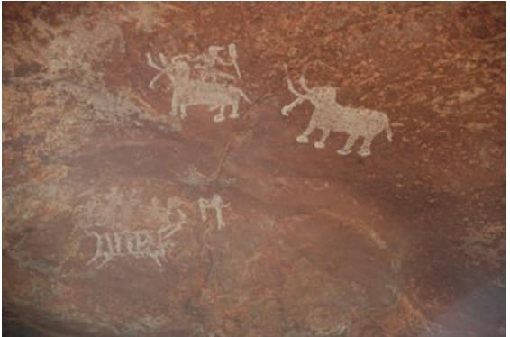
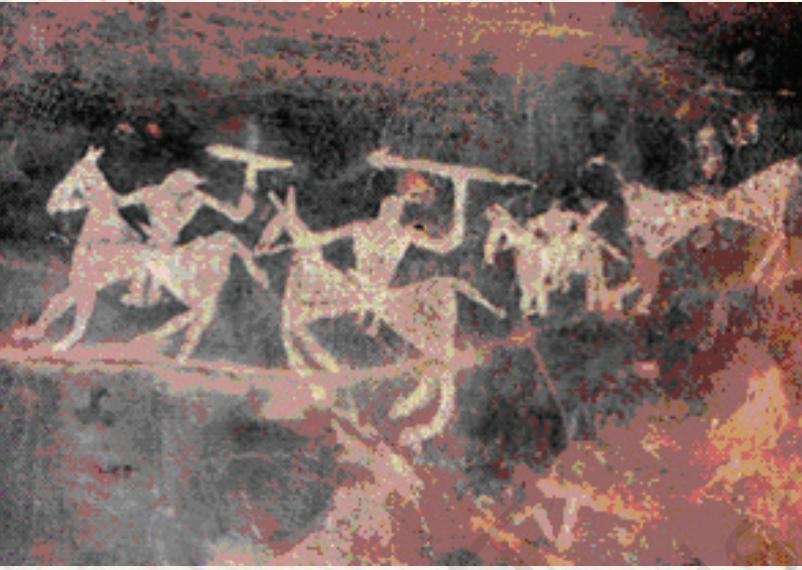

# PREHISTORIC ROCK PAINTINGS 1

T HE distant past when there was no paper or language or the written word, and hence no books or written documents, is called prehistory or as we often say, prehistoric times. How people lived in those times was difficult to surmise until scholars began to discover the places where prehistoric people lived. Excavation at these places brought to light old tools, pottery, habitats, bones of ancient human beings and animals, and drawings on cave walls. By piecing together the information deduced from these objects and the cave drawings, scholars have constructed fairly accurate knowledge about what happened and how people lived in prehistoric times. When the basic needs of food, water, clothing and shelter were fulfilled people felt the need to express themselves. Painting and drawing were the oldest art forms practised by human beings to express themselves, using the cave walls as their canvas.

Why did prehistoric people draw these pictures? They may have drawn and painted to make their shelters more colourful and beautiful or to keep a visual record of their day-to-day life, like some of us who maintain a diary.

> The prehistoric period in the early development of human beings is commonly known as the Old Stone Age or the Palaeolithic Age.

Prehistoric paintings have been found in many parts of the world. We do not really know if Lower Palaeolithic people ever produced any art objects. But by the Upper Palaeolithic times we see a proliferation of artistic activities. Around the world the walls of many caves of this time are full of finely carved and painted pictures of animals which the cave-dwellers hunted. The subjects of their drawings were human figures, human activities, geometric designs and animal symbols. In India the earliest paintings have been reported from the Upper Palaeolithic times.

It is interesting to know that the first discovery of rock paintings was made in India in 1867–68 by an archaeologist, Archibold Carlleyle, twelve years before the discovery of Altamira in Spain. Cockburn, Anderson, Mitra and Ghosh were the early archaeologists who discovered a large number of sites in the Indian sub-continent.

Remnants of rock paintings have been found on the walls of the caves situated in several districts of Madhya Pradesh, Uttar Pradesh, Andhra Pradesh, Karnataka and Bihar. Some paintings have been reported from the Kumaon hills in Uttarakhand also. The rock shelters on banks of the River Suyal at Lakhudiyar, about twenty kilometres on the Almora– Barechina road, bear these prehistoric paintings. Lakhudiyar literally means one lakh caves.The paintings here can be divided into three categories: man, animal and geometric patterns in white, black and red ochre. Humans are represented in stick-like forms. A long-snouted animal, a fox and a multiple legged lizard are the main animal motifs. Wavy lines, rectangle-filled geometric designs, and groups of dots can also be seen here. One of the interesting scenes depicted here is of hand-linked dancing human figures. There is some superimposition of paintings. The earliest are in black; over these are red ochre paintings and the last group comprises white paintings. From Kashmir two slabs with engravings have been reported. The granite rocks of Karnataka and Andhra Pradesh provided suitable canvases to the Neolithic man for his paintings. There are several such sites but more famous among them are Kupgallu, Piklihal and Tekkalkota. Three types of paintings have been reported from here—paintings in white, paintings in red ochre over a white background and paintings in red ochre. These

*Hand-linked dancing figures, Lakhudiyar, Uttarakhand*

*Wavy lines, Lakhudiyar, Uttarakhand*

paintings belong to late historical, early historical and Neolithic periods. The subjects depicted are bulls, elephants, sambhars, gazelles, sheep, goats, horses, stylised humans, tridents, but rarely, vegetal motifs.

But the richest paintings are reported from the Vindhya ranges of Madhya Pradesh and their Kaimurean extensions into Uttar Pradesh. These hill ranges are full of Palaeolithic and Mesolithic remains, and they are also full of forests, wild plants, fruits, streams and creeks, thus a perfect place for Stone Age people to live. Among these the largest and most spectacular rock-shelter is located in the Vindhya hills at Bhimbetka in Madhya Pradesh. Bhimbetka is located fortyfive kilometres south of Bhopal, in an area of ten square kilometres, having about eight hundred rock shelters, five hundred of which bear paintings.

The caves of Bhimbetka were discovered in 1957–58 by eminent archaeologist V.S. Wakankar and later on many more were discovered. Wakankar spent several years in surveying these inaccessible hills and jungles to study these paintings.

The themes of paintings found here are of great variety, ranging from mundane events of daily life in those times to sacred and royal images. These include hunting, dancing, music, horse and elephant riders, animal fighting, honey collection, decoration of bodies, and other household scenes.

The rock art of Bhimbetka has been classified into various groups on the bases of style, technique and superimposition. The drawings and paintings can be catagorised into seven historical periods. Period I, Upper Palaeolithic; Period II, Mesolithic; and Period III,

Chalcolithic. After Period III there are four successive periods. But we will confine ourselves here only to the first three phases.

#### Upper Palaeolithic Period

The paintings of the Upper Palaeolithic phase are linear representations, in green and dark red, of huge animal figures, such as bisons, elephants, tigers, rhinos and boars besides stick-like human figures. A few are wash paintings but mostly they are filled with

*Cave entrance, Bhimbetka, Madhya Pradesh*

*Can you figure out what the artist is trying to depict in this painting?*

geometric patterns. The green paintings are of dancers and the red ones of hunters.

#### Mesolithic Period

The largest number of paintings belong to Period II that covers the Mesolithic paintings. During this period the themes are multiple but the paintings are smaller in size. Hunting scenes predominate. The hunting scenes depict people hunting in groups, armed with barbed spears, pointed sticks, arrows and bows. In some paintings these primitive men are shown with traps and snares probably to catch animals. The hunters are shown wearing simple clothes and ornaments. Sometimes, men have been adorned with elaborate head-dresses, and sometimes painted with masks also. Elephant, bison, tiger, boar, deer, antelope, leopard, panther, rhinoceros, fish, frog, lizard, squirrel and at times birds are also depicted. The Mesolithic artists loved to paint animals. In some pictures, animals are chasing men. In others they are being chased and hunted by men. Some of the animal paintings, especially in the hunting scenes, show a fear of animals, but many others show a feeling of tenderness and love for them. There are also a few engravings representing mainly animals.

Though animals were painted in a naturalistic style, humans were depicted only in a stylistic manner. Women are painted both in the nude and clothed. The young and the old equally find place in these paintings. Children are painted running, jumping and playing. Community dances provide a common theme. There are paintings of people gathering fruit or honey from trees, and of women grinding and preparing food. Some of the pictures of men, women and children seem to depict a sort of family life. In many

of the rock-shelters we find hand prints, fist prints, and dots made by the fingertips.

The artists of Bhimbetka used many colours, including various shades of white, yellow, orange, red ochre, purple, brown, green and black. But white and red were their favourite colours. The paints were made by grinding various rocks and minerals. They got red from haematite (known as *geru* in India). The green came from a green variety of a stone called chalcedony. White might have been

*One of the few images showing only one animal, Bhimbetka*

made out of limestone. The rock of mineral was first ground into a powder. This may then have been mixed with water and also with some thick or sticky substance such as animal fat or gum or resin from trees. Brushes were made of plant fibre. What is amazing is that these colours have survived thousands of years of adverse weather conditions. It is believed that the colours have remained intact because of the chemical reaction of the oxide present on the surface of the rocks.

The artists here made their paintings on the walls and ceilings of the rock shelters. Some of the paintings are reported from the shelters where people lived. But some others were made in places which do not seem to have been living spaces at all. Perhaps these places had some religious importance. Some of the most beautiful paintings are very high up on rock shelters or close to the ceilings of rockshelters. One may wonder why early human beings chose to paint on a rock in such an uncomfortable position. The paintings made at these places were perhaps for people to be able to notice them from a distance.

The paintings, though from the remote past, do not lack pictorial quality. Despite various limitations such as acute working conditions, inadequate tools, materials, etc., there is a charm of simple rendering of scenes of the environment in which the artists lived. The men shown in them appear adventurous and rejoicing in their lives. The animals are shown more youthful and majestic than perhaps they actually were. The primitive artists seem to possess an intrinsic passion for storytelling. These pictures depict, in a dramatic way, both men and animals engaged in the struggle for survival. In one of the scenes, a group of people have been shown hunting a bison. In the process, some injured men are depicted lying scattered on the ground. In another scene, an animal is shown in the agony of death and the men are depicted dancing. These kinds of paintings might have given man a sense of power over the animals he would meet in the open.

> This practice is common among primitive people of today also. They engrave or paint on rocks as part of the rituals they perform at birth, at death, at coming of age and at the time of marriage. They dance, masked, during hunting rites to help them kill animals difficult to find or kill.

*Painting showing a man being hunted by a beast, Bhimbetka*

*Why has the animal been shown so big and man so small?*

### HUNTING SCENE

Hunting scenes predominate in Mesolithic paintings. This is one such scene where a group of people are shown hunting a bison. Some injured men are depicted lying scattered on the ground. These paintings show mastery in the skill of drawing these forms.

DANCING SCENE

In this picture hand-linked figures in dancing mode are shown. In fact, this is a recurrent theme. It also recalls the dancing scene from the Lakhudiyar rock painting found in Uttarakhand.

The paintings of individual animals show the mastery of skill of the primitive artist in drawing these forms. Both, proportion and tonal effect, have been realistically maintained in them.

It is interesting to note that at many rock-art sites often a new painting is painted on top of an older painting. At Bhimbetka, in some places, there are as many as 20 layers of paintings, one on top of another. Why did the artists paint in the same place again and again? Maybe, this was because the artist did not like his creation and painted another painting on the previous one, or some of the paintings and places were considered sacred or special or this was because the area may have been used by different generations of people at different times.

These prehistoric paintings help us to understand about early human beings, their lifestyle, their food habits, their daily activities and, above all, they help us understand their mind—the way they thought. Prehistoric period remains are a great witness to the evolution of human civilisation, through the numerous rock weapons, tools, ceramics and bones. More than anything else, the rock paintings are the greatest wealth the primitive human beings of this period left behind.

## EXERCISE

- 1. According to your observation how did the people of prehistoric times select themes for their paintings?
- 2. What could have been the reasons for depicting more animal figures than human figures in cave paintings?
- 3. Many visuals of prehistoric cave paintings have been given in this chapter. Among these which one do you like the most and why? Give a critical appreciation of the visual.
- 4. Other than Bhimbetka, which are the other major sites where these prehistoric paintings have been found? Prepare a report on different aspects of these paintings with pictures or line drawings.
- 5. In modern times, how have walls been used as a surface to make paintings, graphics, etc?

