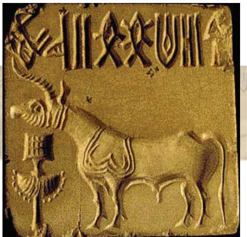

# ARTS OF THE INDUS VALLEY 2

T HE arts of the Indus Valley Civilisation emerged during the second half of the third millennium BCE. The forms of art found from various sites of the civilisation include sculptures, seals, pottery, jewellery, terracotta figures, etc. The artists of that time surely had fine artistic sensibilities and a vivid imagination. Their delineation of human and animal figures was highly realistic in nature, since the anatomical details included in them were unique, and, in the case of terracotta art, the modelling of animal figures was done in an extremely careful manner.

The two major sites of the Indus Valley Civilisation, along the Indus river—the cities of Harappa in the north and Mohenjodaro in the south—showcase one of earliest examples of civic planning. Other markers were houses, markets, storage facilities, offices, public baths, etc., arranged in a grid-like pattern. There was also a highly developed drainage system. While Harappa and Mohenjodaro are situated in Pakistan, the important sites excavated in India are Lothal and Dholavira in Gujarat, Rakhigarhi in Haryana,

Ropar in Punjab, Kalibangan in Rajasthan, etc.

#### Stone Statues

Statues whether in stone, bronze or terracotta found in Harappan sites are not abundant, but refined. The stone statuaries found at Harappa and Mohenjodaro are excellent examples of handling three-dimensional volumes. In stone are two male figures—one is a torso in red sandstone and the other is a bust of a bearded man in soapstone—which are extensively discussed.

The figure of the bearded man, interpreted as a priest, is draped in a shawl coming under the right arm and covering the left shoulder. This shawl is decorated with trefoil patterns. The eyes are a little elongated, and half-closed as in meditative concentration. The nose is well formed and of medium *Bust of a bearded priest*

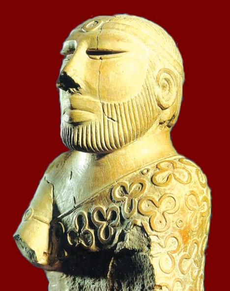

size; the mouth is of average size with close-cut moustache and a short beard and whiskers; the ears resemble double shells with a hole in the middle. The hair is parted in the middle, and a plain woven fillet is passed round the head. An armlet is worn on the right hand and holes around the neck suggest a necklace.

#### Bronze Casting

The art of bronze-casting was practised on a wide scale by the Harappans. Their bronze statues were made using the 'lost wax' technique in which the wax figures were first covered with a coating of clay and allowed to dry. Then the wax was heated and the molten wax was drained out through a tiny hole made in the clay cover. The hollow mould thus created was filled with molten metal which took the original shape of the object. Once the metal cooled, the clay cover was completely removed. In bronze we find human as well as animal figures, the best example of the former being the statue of a girl popularly titled 'Dancing Girl'. Amongst animal figures in bronze the buffalo with its uplifted head, back and sweeping horns and the goat are of artistic merit. Bronze casting was popular at all the major centres of the Indus Valley Civilisation. The copper dog and bird of Lothal and the bronze figure of a bull from Kalibangan are in no way inferior to the human figures of copper and bronze from Harappa and Mohenjodaro. Metalcasting appears to be a continuous tradition. The late Harappan and Chalcolithic sites like Daimabad in Maharashtra yielded excellent examples of metal-cast

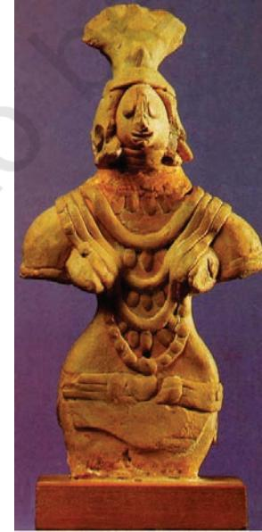

*Mother goddess, terracotta A terracotta figurine*

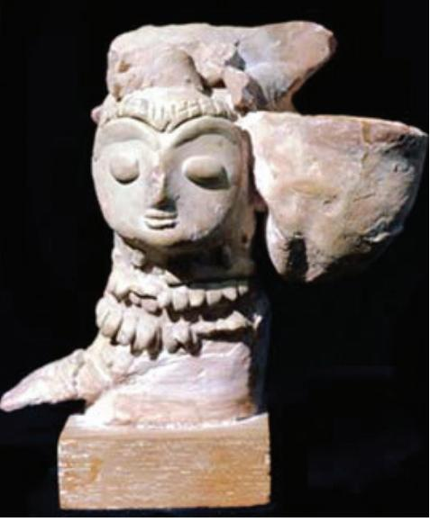

#### Bronze casting

techniques of the same nature are practised even now in many parts of the country, having a continuous tradition.

sculptures. They mainly consist of human and animal figures. It shows how the tradition of figure sculpture continued down the ages.

#### Terracotta

The Indus Valley people made terracotta images also but compared to the stone and bronze statues the terracotta representations of human form are crude in the Indus Valley. They are more realistic in Gujarat sites and Kalibangan. The most important among the Indus figures are those representing the mother goddess. In terracotta, we also find a few figurines of bearded males with coiled hair, their posture rigidly upright, legs slightly apart, and the arms parallel to the sides of the body. The repetition of this figure in exactly the same position would suggest that he was a deity. A terracotta mask of a horned deity has also been found. Toy carts with wheels, whistles, rattles, birds and animals, gamesmen and discs were also rendered in terracotta.

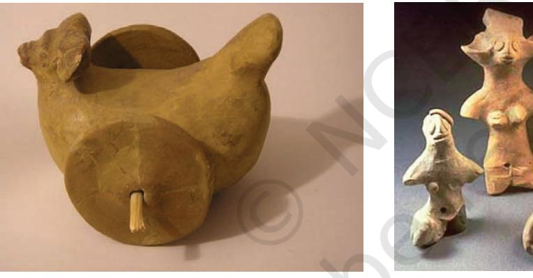

*Terracotta*

#### Seals

Archaeologists have discovered thousands of seals, mostly made of steatite, and occasionally of agate, chert, copper, faience and terracotta, with beautiful figures of animals, such as unicorn bull, rhinoceros, tiger, elephant, bison, goat, buffalo, etc. The realistic rendering of these animals in various moods is remarkable. The purpose of producing seals was mainly commercial. It appears that the seals were also used as amulets, carried on the persons of their owners, perhaps as modern-day identity cards. The standard Harappan seal was a square plaque 2×2 square inches, made from steatite. Every seal is engraved in a pictographic script which is yet to be deciphered. Some seals have also been found in ivory. They all bear a great variety of motifs, most often of animals including those of the bull, with or without the hump, the elephant, tiger,

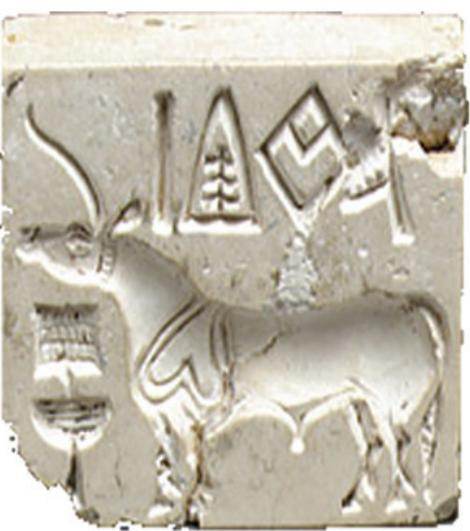

*Unicorn seals*

*Pashupati seal/female deity*

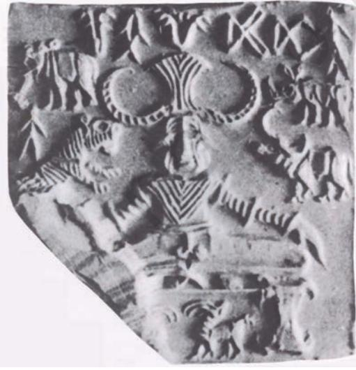

goat and also monsters. Sometimes trees or human figures were also depicted. The most remarkable seal is the one depicted with a figure in the centre and animals around. This seal is generally identified as the Pashupati Seal by some scholars whereas some identify it as the female deity. This seal depicts a human figure seated cross-legged. An elephant and a tiger are depicted to the right side of the seated figure, while on the left a rhinoceros and a buffalo are seen. In addition to these animals two antelopes are shown below the seat. Seals such as these date from between 2500 and 1900 BCE and were found in considerable numbers in sites such as the ancient city of Mohenjodaro in the Indus Valley. Figures and animals are carved in intaglio on their surfaces.

Square or rectangular copper tablets, with an animal or a human figure on one side and an inscription on the other, or an inscription on both sides have also been found. The figures and signs are carefully cut with a burin. These copper tablets appear to have been amulets. Unlike inscriptions on seals which vary in each case, inscriptions on the copper tablets seem to be associated with the animals portrayed on them.

#### Pottery

A large quantity of pottery excavated from the sites, enable us to understand the gradual evolution of various design motifs as employed in different shapes, and styles. The Indus Valley pottery consists chiefly of very fine wheelmade wares, very few being hand-made. Plain pottery is more common than painted ware. Plain pottery is generally of red clay, with or without a fine red or grey slip. It includes knobbed ware, ornamented with rows of knobs. The black painted ware has a fine coating of red slip on which geometric and animal designs are executed in glossy black paint.

Polychrome pottery is rare and mainly comprises small vases decorated with geometric patterns in red, black, and green, rarely white and yellow. Incised ware is also rare and the incised decoration was confined to the bases of the pans, always inside and to the dishes of offering stands. Perforated pottery includes a large hole at the bottom and small holes all over the wall, and was probably used for straining beverages. Pottery for household purposes is found in as many shapes and sizes as could be conceived of for daily practical use. Straight and angular shapes are an exception, while graceful curves are the rule. Miniature vessels, mostly less than half an inch in height are, particularly, so marvellously crafted as to evoke admiration.

#### Beads and Ornaments

The Harappan men and women decorated themselves with a large variety of ornaments produced from every conceivable material ranging from precious metals and gemstones to bone and baked clay. While necklaces, fillets, armlets and finger-rings were commonly worn by both

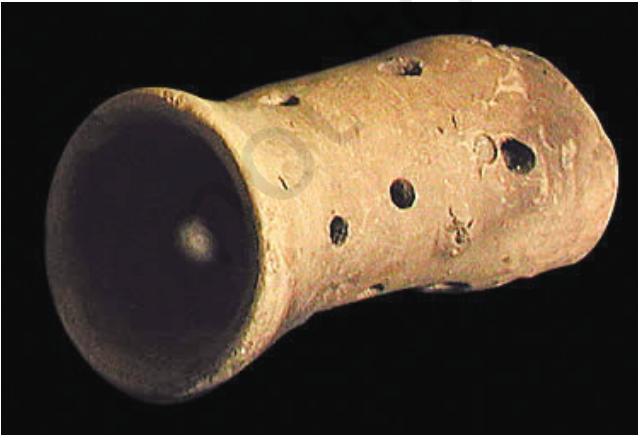

*Pottery Perforated pot*

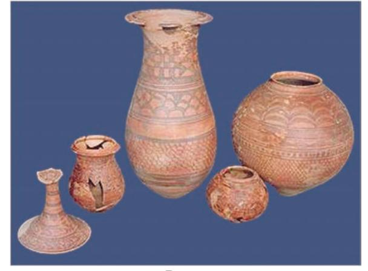

sexes, women wore girdles, earrings and anklets. Hoards of jewellery found at Mohenjodaro and Lothal include necklaces of gold and semi-precious stones, copper bracelets and beads, gold earrings and head ornaments, faience pendants and buttons, and beads of steatite and gemstones. All ornaments are well crafted. It may be noted that a cemetery has been found at Farmana in Haryana where dead bodies were buried with ornaments.

The bead industry seems to have been well developed as evident from the factories discovered at Chanhudaro and Lothal. Beads were made of carnelian, amethyst, jasper, crystal, quartz, steatite, turquoise, lapis lazuli, etc. Metals like copper, bronze and gold, and shell, faience and terracotta or burnt clay were also used for manufacturing beads. The beads are in varying shapes—disc-shaped, cylindrical, spherical, barrel-shaped, and segmented. Some beads were made of two or more stones cemented together, some of stone with gold covers. Some were decorated by incising or painting and some had designs etched onto them. Great technical skill has been displayed in the manufacture of these beads.

The Harappan people also made brilliantly naturalistic models of animals, especially monkeys and squirrels, used as pin-heads and beads.

It is evident from the discovery of a large number of spindles and spindle whorls in the houses of the Indus

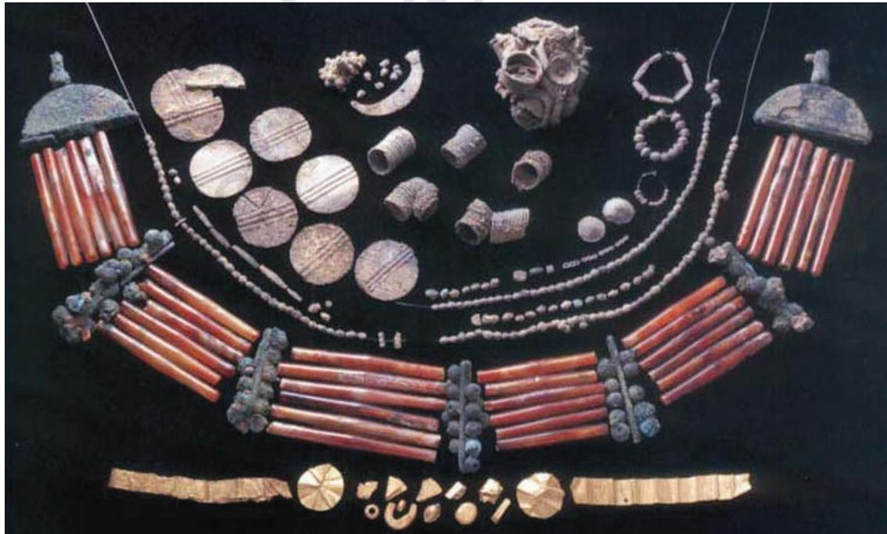

*Beadwork and jewellery items*

Valley that spinning of cotton and wool was very common. Spinning is indicated by finds of whorls made of the expensive faience as also of the cheap pottery and shell. Men and women wore two separate pieces of attire similar to the *dhoti* and shawl. The shawl covered the left shoulder passing below the right shoulder.

From archaeological finds it appears that the people of the Indus Valley were conscious of fashion. Different hairstyles were in vogue and wearing of a beard was popular among all. Cinnabar was used as a cosmetic and facepaint, lipstick and collyrium (eyeliner) were also known to them. Many stone structural remains are also found at Dholavira which show how the Indus Valley people used stone in construction.

The artists and craftsmen of the Indus Valley were extremely skilled in a variety of crafts—metal casting, stone carving, making and painting pottery and making terracotta images using simplified motifs of animals, plants and birds.

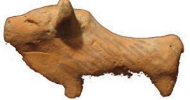

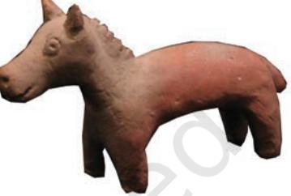

*Terracotta toys*

## EXERCISE

- 1. Would you agree that the people of the Indus Valley Civilisation were great art lovers? Give reasons for your answer.
- 2. What kind of similarities and differences do you find between present-day terracotta and the Indus Valley terracotta?
- 3. Seals were made of different materials. With the Indus Valley seals as a reference try to make seals with a different medium. Which are the animals that you would like to carve on your seals and why?
- 4. What do the art objects that have survived tell us about the daily life of the people of the Indus Valley Civilisation?
- 5. Imagine you are a curator working in a museum and you have been given the task to create a museum exhibit on Indus art. Collect illustrations of at least ten objects made of stone, metal and terracotta produced and used during the Indus Valley Civilisation and create this exhibit.

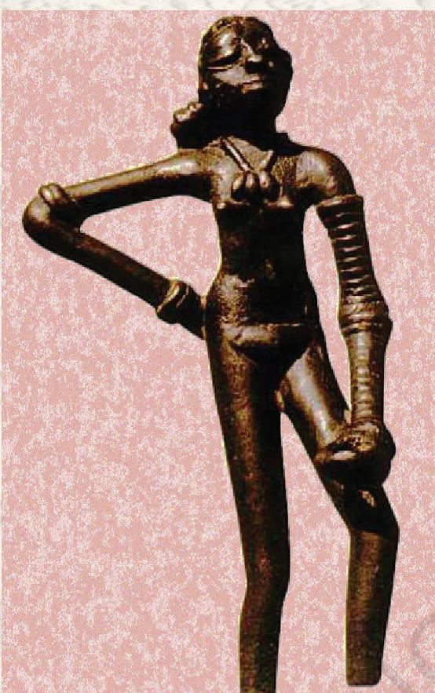

## DANCING GIRL

One of the best known artefacts from the Indus Valley is this approximately four-inch-high copper figure of a dancing girl. Found in Mohenjodaro, this exquisite casting depicts a girl whose long hair is tied in a bun. Bangles cover her left arm, a bracelet and an amulet or bangle adorn her right arm, and a cowry shell necklace is seen around her neck. Her right hand is on her hip and her left hand is clasped in a traditional Indian dance gesture. She has large eyes and flat nose. This figure is full of expression and bodily vigour and conveys a lot of information.

### BULL

This bronze figure of a bull from Mohenjodaro deserves mention. The massiveness of the bull and the fury of the charge are eloquently expressed. The animal is shown standing with his head turned to the right and with a cord around the neck.

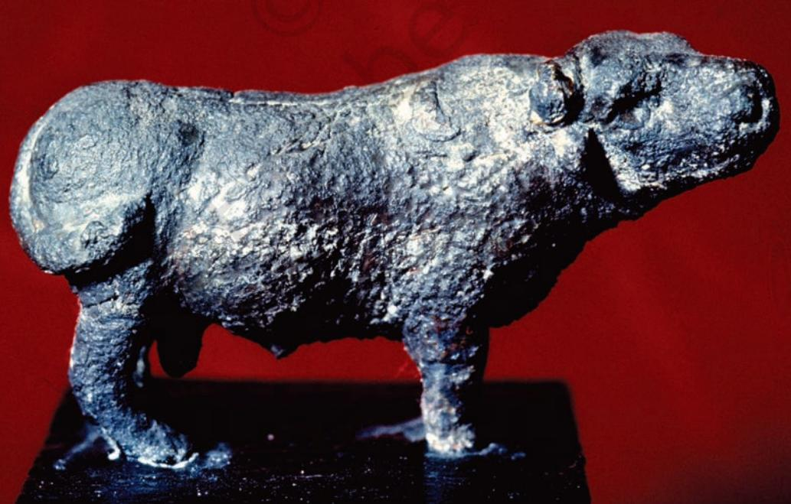

## MALE TORSO

In this red sandstone figure, there are socket holes in the neck and shoulders for the attachment of head and arms. The frontal posture of the torso has been consciously adopted. The shoulders are well baked and the abdomen slightly prominent.

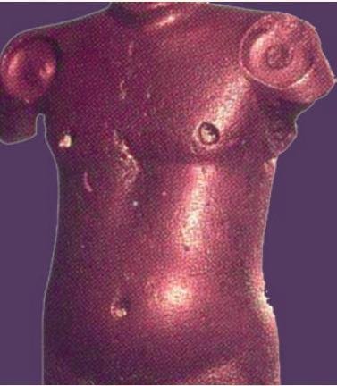

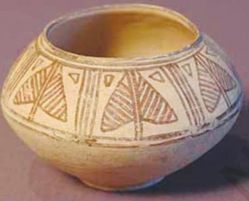

## PAINTED EARTHEN JAR

Found in Mohenjodaro, this jar is made on a potter's wheel with clay. The shape was manipulated by the pressure of the crafty fingers of the potter. After baking the clay model, it was painted with black colour. High polishing was done as a finishing touch. The motifs are of vegetals and geometric forms. Designs are simple but with a tendency towards abstraction.

## MOTHER GODDESS

The mother goddess figures are usually crude standing female figures adorned with necklaces hanging over prominent breasts and wearing a loin cloth and a girdle. The fan-shaped head-dress with a cup-like projection on each side is a distinct decorative feature of the mother goddess figures of the Indus Valley. The pellet eyes and beaked nose of the figures are very crude, and the mouth is indicated by a slit.

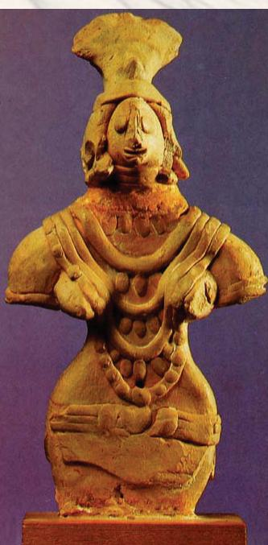

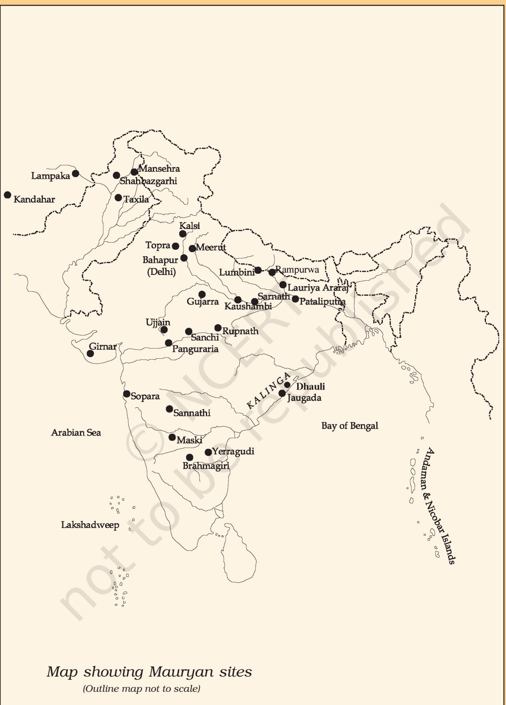

