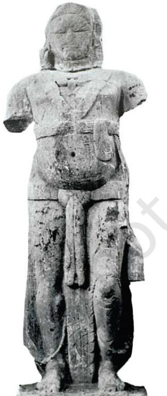

# ARTS OF THE MAURYAN PERIOD 3

S IXTH century BCE marks the beginning of new religious and social movements in the Gangetic valley in the form of Buddhism and Jainism which were part of the *shraman* tradition. Both religions became popular as they opposed the *varna* and *jati* systems of the Hindu religion. Magadha emerged as a powerful kingdom and consolidated its control over the other regions. By the fourth century BCE the Mauryas established their power and by the third century BCE, a large part of India was under Mauryan control. Ashoka emerged as the most powerful king of the Mauryan dynasty who patronised the Buddhist *shraman* tradition in the third century BCE. Religious practices had many dimensions and were not confined to just one particular mode of worship. Worship of *Yakshas* and mother-goddesses were prevalent during that time. So, multiple forms of worship existed. Nevertheless, Buddhism became the most popular social and religious movement. *Yaksha* worship was very popular before and after the advent of Buddhism and it was assimilated in Buddhism and Jainism.

### Pillars, Sculptures and Rock-cut Architecture

Construction of *stupas* and *viharas* as part of monastic establishments became part of the Buddhist tradition. However, in this period, apart from *stupas* and *viharas*, stone pillars, rock-cut caves and monumental figure sculptures were carved at several places. The tradition of constructing pillars is very old and it may be observed that erection of pillars was prevalent in the Achamenian empire as well. But the Mauryan pillars are different from the Achamenian pillars. The Mauryan pillars are rockcut pillars thus displaying the carver's skills, whereas the Achamenian pillars are constructed in pieces by a mason. Stone pillars were erected by Ashoka, which have been found in the north Indian part of the Mauryan Empire with inscriptions engraved on them. The top portion of the pillar was carved with capital figures like the bull, the lion, the elephant, etc. All the capital figures are vigorous

*Pillar capital and abacus with stylised lotus* and carved standing on a square or circular abacus. Abacuses are decorated with stylised lotuses. Some of the existing pillars with capital figures were found at Basarah-Bakhira, Lauriya-Nandangarh and Rampurva in Bihar, Sankisa and Sarnath in Uttar Pradesh.

The Mauryan pillar capital found at Sarnath popularly known as the Lion Capital is the finest example of Mauryan sculptural tradition. It is also our national emblem. It is carved with considerable care—voluminous roaring lion figures firmly standing on a circular abacus which is carved with the figures of a horse, a bull, a lion and an elephant in vigorous movement, executed with precision, showing considerable mastery in the sculptural techniques. This pillar capital symbolising *Dhammachakrapravartana* (the first sermon by the Buddha) has become a standard symbol of this great historical event in the life of the Buddha.

Monumental images of *Yaksha*, *Yakhinis* and animals, pillar columns with capital figures, rock-cut caves belonging to the third century BCE have been found in different parts of India. It shows the popularity of *Yaksha* worship and how it became part of figure representation in Buddhist and Jaina religious monuments.

Large statues of *Yakshas* and *Yakhinis* are found at many places like Patna, Vidisha and Mathura. These monumental images are mostly in the standing position. One of the distinguishing elements in all these images is their polished surface. The depiction of faces is in full round with pronounced cheeks and physiognomic detail. One of the finest examples is a *Yakshi* figure from Didarganj, Patna, which is tall and well-built. It shows sensitivity towards depicting the human physique. The image has a polished surface.

Terracotta figurines show a very different delineation of the body as compared to the sculptures. Depiction of a monumental rock-cut elephant at Dhauli in Odisha shows modelling in round with linear rhythm. It also has Ashokan rock-edict. All these examples are remarkable in their execution of figure representation. The rock-cut cave carved at Barabar hills near Gaya in Bihar is known as the Lomus Rishi cave. The facade of the cave is decorated with the semicircular *chaitya* arch as the entrance. The elephant frieze carved in high relief on the *chaitya* arch shows considerable movement. The interior hall of this cave is rectangular with a circular chamber at the back. The entrance is located on the side wall of the hall. The cave was donated by Ashoka for the Ajivika sect. The Lomus Rishi cave is an example of this period. But many Buddhist caves of the subsequent periods were excavated in eastern and western India.

Due to the popularity of Buddhism and Jainism, *stupas* and *viharas* were constructed on a large scale. However, there are also examples of a few Brahmanical gods in the sculptural representations. It is important to note that the *stupas* were constructed over the relics of the Buddha at Rajagraha, Vaishali, Vethadipa and Pava in Bihar, Kapilavastu, Allakappa and Ramagrama in Nepal, Kushinagar and Pippalvina in Uttar Pradesh. The textual tradition also mentions construction of various other *stupas* on the relics of the Buddha at several places including Avanti and Gandhara which are outside the Gangetic valley.

*Stupa*, *vihara* and *chaitya* are part of Buddhist and Jaina monastic complexes but the largest number belongs to the Buddhist religion. One of the examples of the structure of a *stupa* in the third century BCE is at Bairat in Rajasthan. The great *stupa* at Sanchi (which will be discussed later) was built with bricks during the time of Ashoka and later it was covered with stone and many new additions were made.

Subsequently many such *stupas* were constructed which shows the popularity of Buddhism. From the second century BCE onwards, we get many inscriptional evidences mentioning donors and, at times, their profession. The pattern of patronage has been a very collective one and there are very few examples of royal patronage. Patrons range from lay devotees to *gahapatis* and kings. Donations by the guilds are also mentioned at several sites. However, there are very few inscriptions mentioning the names of artisans such as Kanha at Pitalkhora and his disciple Balaka at Kondane caves in Maharashtra. Artisans' categories like stone carvers, goldsmiths, stone-polishers, carpenters, etc. are also mentioned in the inscriptions.

*Elephant, Dhauli Lomus Rishi cave-entrance detail*

# LION CAPITAL, SARNATH

The Lion Capital discovered more than a hundred years ago at Sarnath, near Varanasi, is generally referred to as Sarnath Lion Capital. This is one of the finest examples of sculpture from the Mauryan period. Built in commemoration of the historical event of the first sermon or the *Dhammachakrapravartana* by the Buddha at Sarnath, the capital was built by Ashoka.

The capital originally consisted of five component parts: (i) the shaft (which is broken in many parts now), (ii) a lotus bell base, (iii) a drum on the bell base with four animals proceeding clockwise, (iv) the figures of four majestic addorsed lions, and (v) the crowning element, *Dharamchakra*, a large wheel, was also a part of this pillar. However, this wheel is lying in a broken condition and is displayed in the site museum at Sarnath. The capital without the crowning wheel and the lotus base has been adopted as the National Emblem of Independent India.

Now kept in the archaeological museum at Sarnath, the capital has four lions firmly seated back to back on a circular abacus. The lion figures of the capital are very impressive and massive. The monumentality of the image is easily noticeable. The facial musculature of the lions is very strong. The inversed lines of the lips and its subsequent effect of projection at the end of the lips show the sculptor's observation for naturalistic depiction. The lions appear as if they have held their breath. The lines of the mane are sharp and follow the conventions that were in practice during that time. The surface of the sculpture is heavily polished which is typical of the Mauryan Period. Their curly manes have protruding volume. The weight of the body of each lion is firmly shown by the stretched muscles of the feet. The abacus has the depiction of a *chakra* (wheel) having twenty-four spokes in all the four directions and a bull, a horse, an elephant and a lion between every *chakra* is finely carved. The motif of the *chakra* becomes significant as a representation of the *Dhammachkra* in the entire Buddhist art. Each animal figure, despite sticking to the surface, is voluminous, its posture creating movement in the circular abacus. Despite having limited space between each *chakra* , these animal figures display considerable command over the depiction of movement in a limited space. The circular abacus is supported by an inverted lotus capital. Each petal of the lotus is sculpted keeping in mind its density. The lower portion has curved planes neatly carved. Being a pillar image, it was conceived to be viewed from all the side, thus there are no boundations of fixed view points. A lion capital has also been found at Sanchi but is in a dilapidated condition. The motif of lion-capital-pillar continued even in the subsequent period. ARTS OF THE MAURYAN PERIOD 23

# DIDARGUNJ YAKSHINI

### ARTS OF THE MAURYAN PERIOD 25

The life-size standing image of a Yakshini holding a *chauri* (flywhisk) from Didargunj near modern Patna is another good example of the sculptural tradition of the Mauryan Period. Kept in Patna Museum, it is a tall, well-proportioned, free-standing sculpture in round made in sandstone with a polished surface. The *chauri* is held in the right hand whereas the left hand is broken. The image shows sophistication in the treatment of form and medium. The sculptor's sensitivity towards the round muscular body is clearly visible. The face has round, fleshy cheeks, while the neck is relatively small in proportion; the eyes, nose and lips are sharp. Folds of muscles are properly rendered. The necklace beads are in full round, hanging to the belly. The tightening of garment around the belly creates the effect of a bulging belly. The lower garment has been rendered with great care. Every fold of the garment on the legs is shown by protruding lines clinging to the legs, which also create a somewhat transparent effect. The middle band of the garment falls till the feet. Thick bell-ornaments adorn the feet. The image stands firmly on its legs. Heaviness in the torso is depicted by heavy breasts. The back is equally impressive. The hair is tied in a knot at the back. The back is bare. Drapery at the back covers both legs. The flywhisk in the right hand is shown with incised lines continued on the back of the image.

Stupa *worship, Bharhut*

The method of working was collective in nature and at times only a specific portion of the monument is said to have been patronised by a particular patron. Traders recorded their donation along with their place of origin.

In the subsequent century, *stupas* were elaborately built with certain additions like the enclosing of the circumambulatory path with railings and sculptural decoration. There were numerous *stupas* constructed earlier but expansions or new additions were made in the second century BCE. The *stupa* consists of a cylindrical drum and a circular *anda* with a *harmika* and *chhatra* on the top which remain consistent throughout with minor variations and changes in shape and size. Apart from the circumambulatory path, gateways were added. Thus, with the elaborations in *stupa* architecture, there was ample space for the architects and sculptors to plan elaborations and to carve out images.

During the early phase of Buddhism, Buddha is depicted symbolically through footprints, *stupas*, lotus throne, *chakra,* etc. This indicates either simple worship, or paying respect, or at times depicts historisisation of life events. Gradually narrative became a part of the Buddhist tradition. Thus events from the life of the Buddha, the *Jataka* stories, were depicted on the railings and *torans* of the *stupas*. Mainly synoptic narrative, continuous narrative and episodic narrative are used in the pictorial tradition. While events from the life of the Buddha became an important theme in all the Buddhist monuments, the *Jataka* stories also became equally important for sculptural decorations. The main events associated with the Buddha's life which were frequently depicted were events related to the birth, renunciation, enlightenment, *dhammachakrapravartana*, and *mahaparinibbana* (liberation from the cycle of birth.) Among the *Jataka* stories that are frequently depicted are Chhadanta *Jataka*, Vidurpundita *Jataka*, Ruru *Jataka*, Sibi *Jataka*, Vessantara *Jataka* and Shama *Jataka*.

## EXERCISE

- 1. Do you think that the art of making sculptures in India began during the Mauryan period?
- 2. What was the significance of the *stupa* and how did *stupa* architecture develop?
- 3. Which were the four events in the life of the Buddha which have been depicted in different forms of Buddhist art? What did these events symbolise?
- 4. What are the *Jatakas*? How do the *Jatakas* relate to Buddhism? Find out.

