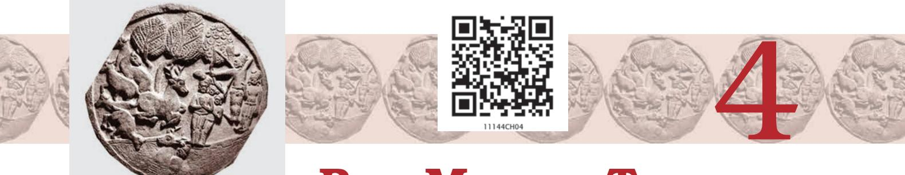
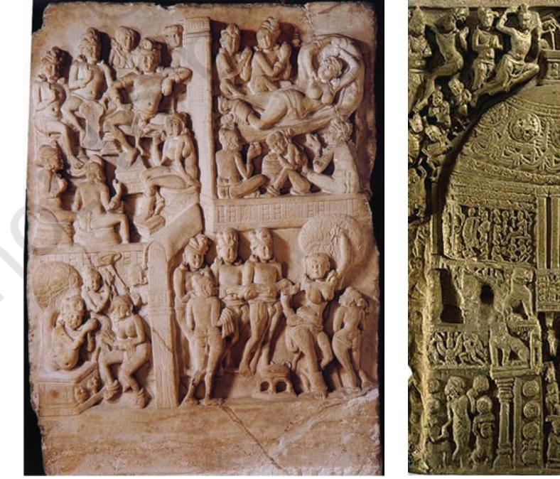
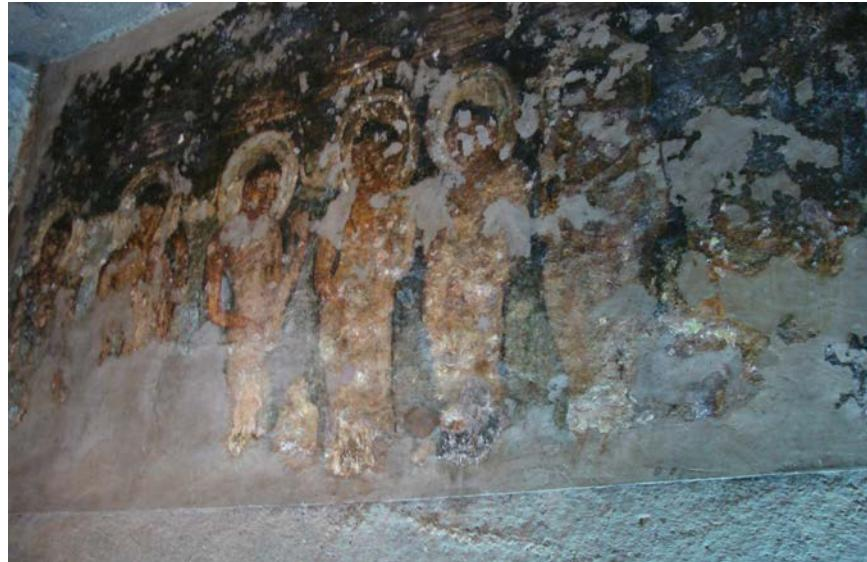
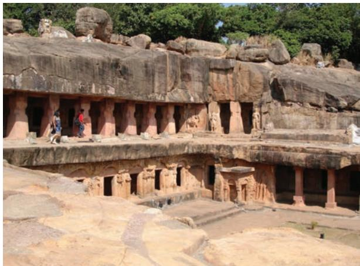
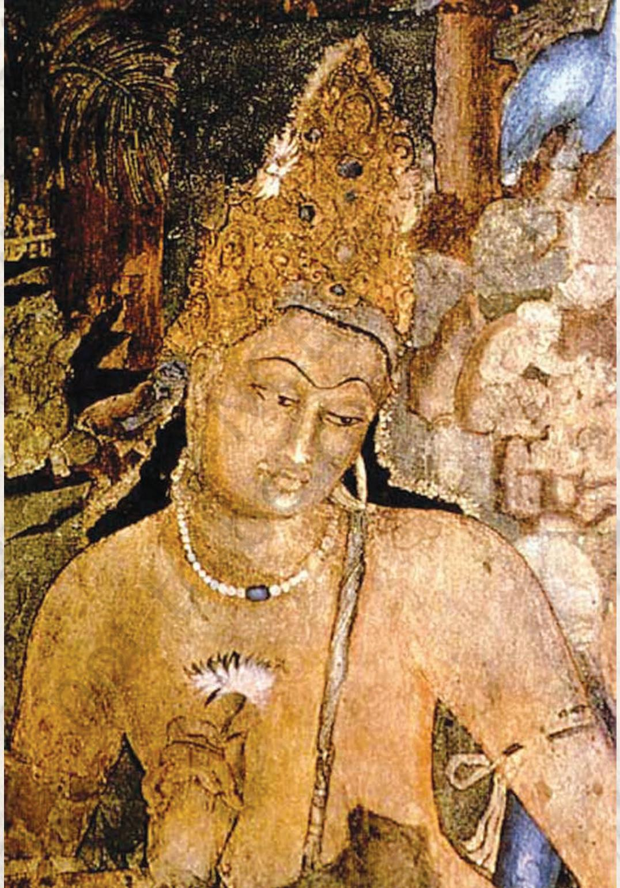
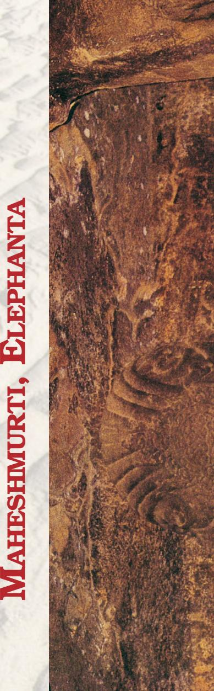
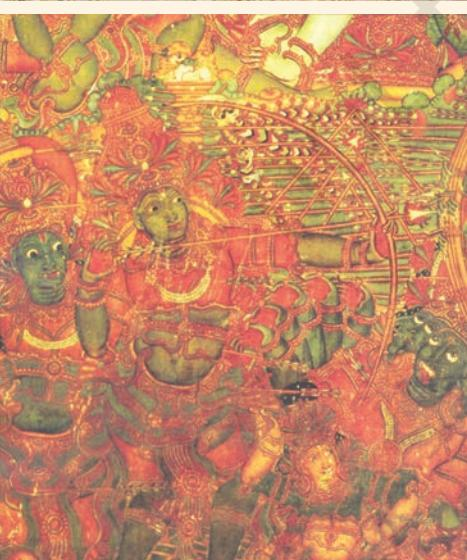

F ROM the second century BCE onwards, various rulers established their control over the vast Mauryan Empire: the Shungas, Kanvas, Kushanas and Guptas in the north and parts of central India; the Satvahanas, Ikshavakus, Abhiras, Vakataks in southern and western India. Incidentally, the period of the second century BCE also marked the rise of the main Brahmanical sects such as the Vaishnavas and the Shaivas. There are numerous sites dating back to the second century BCE in India. Some of the prominent examples of the finest sculpture are found at Vidisha, Bharhut (Madhya Pradesh), Bodhgaya (Bihar), Jaggayyapeta (Andhra Pradesh), Mathura (Uttar Pradesh), Khandagiri-Udaigiri (Odisha), Bhaja near Pune and Pavani near Nagpur (Maharashtra).

### Bharhut

Bharhut sculptures are tall like the images of *Yaksha* and *Yakhshini* in the Mauryan period, modelling of the sculptural volume is in low relief maintaining linearity. Images stick to the picture plane. In the relief panels depicting narratives, illusion of three-dimensionality is shown with tilted perspective. Clarity in the narrative is enhanced by selecting main events. At Bharhut, narrative panels are shown with fewer characters but as the time progresses, apart from the main character in the story, others also start appearing in the picture space. At times more than one event at one geographical place is clubbed in the picture space or only a single main event is depicted in the pictorial space.

Availability of the space is utilised to the maximum by the sculptors. Folded hands in the narratives as well as single figures of the *Yakhshas* and *Yakshinis* are shown flat clinging to the chest. But in some cases, especially in later times, the hands are shown with the natural projection against the chest. Such examples show how artisans who were working at a collective level had to Yakshini*, Bharhut*

understand the method of carving. Initially, dressing the surface of stone slabs appears as the main concern. Later the human body and other forms were sculpted. Due to shallow carving of the picture surface, projection of hands and feet was not possible, hence, the folded hands and awkward position of the feet. There is a general stiffness in the body and arms. But gradually, such visual appearance was modified by making images with deep carvings, pronounced volume and a very naturalistic representation of human and animal bodies. Sculptures at Bharhut, Bodhgaya, Sanchi Stupa-2, and Jagayyapetta are good examples.

Narrative reliefs at Bharhut show how artisans used the pictorial language very effectively to communicate stories. In one such narrative, showing Queen Mayadevi's (mother of Siddhartha Gautam) dream, a descending elephant is shown. The queen is shown reclining on the bed whereas an elephant is shown on the top heading towards the womb of Queen Mayadevi. On the other hand, the depiction of a *Jataka* story is very simple—narrated by clubbing the events according to the geographical location of the story like the depiction of Ruru *Jataka* where the Boddhisattva deer is rescuing a man on his back. The other event in the same picture frame depicts the King standing with his army and about to shoot an arrow at the deer, and the man who was

Jataka *panel* , *Bharhut Queen Maya's dream, Bharhut*

rescued by the deer is also shown along with the king pointing a finger at the deer. According to the story, the man promised the deer after his rescue that he would not disclose his identity to anybody. But when the king makes a proclamation of reward for disclosing the identity of the deer, he turns hostile and takes the king to the same jungle where he had seen the deer. Such *Jataka* stories became part of *stupa* decoration. Interestingly, with the rise in the construction of *stupas* in various parts of the country, regional stylistic variations also began to emerge. One main characteristic in all the male images of first–second centuries BCE is the knotted headgear. In many sculptures it is very consistent. Some of the sculptures found at Bharhut are displayed in Indian Museum, Kolkata.

#### Sanchi

The next phase of sculptural development at Sanchi Stupa-1, Mathura, and Vengi in Andhra Pradesh (Guntur District) is noteworthy in the stylistic progression. Stupa-1 at Sanchi has upper as well as lower *pradakshinapatha* or circumambulatory path. It has four beautifully decorated *toranas* depicting various events from the life of the Buddha and the *Jatakas*. Figure compositions are in high relief, filling up the entire space. Depiction of posture gets naturalistic and there is no stiffness in the body. Heads have considerable projection in the picture space. Rigidity

*Plan of Stupa*-1*, Sanchi*

*Stone carving, Stupa*-1, *Sanchi*

in the contours gets reduced and images are given movement. Narration gets elaborated. Carving techniques appear more advanced than Bharhut. Symbols continue to be used representing the Buddha. At Sanchi Stupa-1, narratives get more elaborated; however, the depiction of the dream episode remains very simple showing the reclining image of the queen and the elephant at the top. The historical narratives such as the siege of Kushinara, Buddha's visit to Kapilavastu, visit of Ashoka to the Ramgrama Stupa are carved with considerable details. In Mathura, images of this period bear the same quality but are different in the depiction of physiognomic details.

#### Mathura, Sarnath and Gandhara Schools

The first century CE onwards, Gandhara (now in Pakistan), Mathura in northern India and Vengi in Andhra Pradesh emerged as important centres of art production. Buddha in the symbolic form got a human form in Mathura and Gandhara. The sculptural tradition in Gandhara had the confluence of Bactria, Parthia and the local Gandhara tradition. The local sculptural tradition at Mathura became so strong that the tradition spread to other parts of northern India. The best example in this regard is the *stupa* sculptures found at Sanghol in the Punjab. The Buddha image at Mathura is modelled on the lines of earlier *Yaksha* images whereas in Gandhara it has Hellenistic features. Early Jain Teerthankar images and portraits of kings, specially the headless Kanishka are also found from Mathura.

Images of Vaishnava (mainly Vishnu and his various forms) and Shaiva (mainly the *lingas* and *mukhalingas*) faiths are also found at Mathura but Buddhist images are found in large numbers. It may be noted that the images of Vishnu and Shiva are represented by their *ayudhas* (weapons). There is boldness in carving the large images, the volume of the images is projected out of the picture plane, the faces are round and smiling, heaviness in the sculptural volume is reduced to relaxed flesh. The garments of the body are clearly visible and they cover the left shoulder. Images of the Buddha, *Yakshas*, *Yakshinis*, Shaivite and Vaishnavite deities and portrait statues are profusely sculpted. In the second century CE, images in Mathura get sensual, rotundity increases, they become fleshier. The trend continues in the fourth century CE but in the late fourth century CE, the massiveness and fleshiness is reduced further and the flesh becomes more tightened, the volume of the drapery also gets reduced and in the fifth and sixth centuries CE, the drapery is *Part of railing, Sangol* integrated into the sculptural mass. Transparent quality in the robes of the Buddha images is evident. In this period, two important schools of sculptures in northern India are worth noting. The traditional centre, Mathura, remained the main art production site whereas Sarnath and Kosambi also emerged as important centres of art production. Many Buddha images in Sarnath have plain transparent drapery covering both shoulders, and the halo around the head has very little ornamentation whereas the Mathura Buddha images continue to depict folds of the drapery in the Buddha images and the halo around the head is profusely decorated. One can visit museums at Mathura, Sarnath, Varanasi, New Delhi, Chennai, Amaravati, etc. to study the features of early sculptures.

Among the important *stupa* sites outside the Gangetic valley is Devnimori in Gujarat. In the subsequent centuries sculptures had little variations while slender images with transparent drapery remained a dominant aesthetic sensibility.

*third–fourth century CE*

*Meditating Buddha, Gandhar, Bodhisattva, Gandhar, fifth–sixth century CE*

#### Buddhist Monuments of South India

Vengi in Andhra Pradesh has many *stupa* sites like Jagayyapetta, Amaravati, Bhattiprolu, Nagarjunkonda, Goli, etc. Amaravati has a *mahachaitya* and had many sculptures which are now preserved in Chennai Museum, Amaravati Site Museum, National Museum, New Delhi and the British Museum, London. Like the Sanchi Stupa, the Amaravati Stupa also has *pradakshinapatha* enclosed within a *vedika* on which many narrative sculptures are depicted. The domical *stupa* structure is covered with relief *stupa* sculptural slabs which is a unique feature. The *torana* of the Amaravati Stupa has disappeared over a period of time. Events from the life of the Buddha and the *Jataka* stories are depicted. Though in the Amaravati Stupa there is evidence of construction activity in the third century BCE, it was best developed in the first and second centuries CE. Like Sanchi, the early phase is devoid of Buddha images but during the later phase, in the second and third centuries CE, the Buddha images are carved on the drum slabs and at many other places. Interior space in the composition is created by different postures of the figures such as semi-back, back, profile, frontal, semi-frontal, side, etc.

Sculptural form in this area is characterised by intense emotions. Figures are slender, have a lot of movement, bodies are shown with three bents (i.e. *tribhanga*), and the sculptural composition is more complex than at Sanchi. Linearity becomes flexible, dynamic movement breaks the

*Carving on outer wall of Stupa, Amaravati Stupa drum slab, Amravati, second*

*century CE*

staticness of form. The idea of creating three-dimensional space in the relief sculpture is devised by using pronounced volume, angular bodies and complex overlapping. However, absolute attention has been paid to the clarity of form despite its size and role in the narrative. Narratives are profusely depicted which include events from the life of the Buddha and the *Jataka* stories. There are a number of *Jataka* scenes that have not been completely identified. In the depiction of the birth event, the queen is shown reclining on a bed surrounded by female attendants and a small-sized elephant is carved on the upper frame of the composition showing the dream of Queen Mayadevi. In another relief, four events related to the birth of the Buddha are shown. These represent varied ways of depicting the narratives.

The animated movement in the figures gets reduced in the sculptures of Nagarjunkonda and Goli in the third century CE. Even within the relatively low relief volume than in the Amaravati sculptures, artists at Nagarjunkonda and Goli managed to create the effect of protruding surfaces of the body which is suggestive in nature and look very integral. Independent Buddha images are also found at Amaravati, Nagarjunkonda and Guntapalle in Andhra Pradesh. Guntapalle is a rock-cut cave site near Eluru. Small apsidal and circular *chaitya* halls have been excavated belonging to the second century BCE. The other important site where rock-cut *stupas* have been excavated is Anakapalle near Vishakhapatanam. In Karnataka, Sannati in Gulbarga district is the largest *stupa* site excavated so far. It also has a *stupa* like the one in Amaravati decorated with sculptural relief.

*Panel, Nagarjunkonda*

Construction of a large number of stupas does not mean that there were no structured temples or *viharas* or *chaityas*. We do get evidences but no structured *chaitya* or *vihara* survived. Among the important structured *viharas*, mention may be made of the Sanchi apsidal *chaitya* structure, i.e., temple 18, which is a simple shrine temple having front pillars and a hall at the back. Similar structured temples at Guntapalle are also worth mentioning. Along with the images of the Buddha, other Buddhist images of Boddhisattvas like Avalokiteshvara, Padmapani, Vajrapani, Amitabha, and Maitreya Buddha started getting sculpted. However, with the rise of *Vajrayana* Buddhism many Boddhisattva images were added as a part of the personified representations of certain virtues or qualities as propagated by the Buddhist religious principles for the welfare of the masses.

#### Cave Tradition in Western India

In western India, many Buddhist caves dating back to the second century BCE onwards have been excavated. Mainly three architectural types were executed—(i) apsidal vault-roof *chaitya* halls (found at Ajanta, Pitalkhora, Bhaja); (ii) apsidal vault-roof pillarless hall (found at Thana-Nadsur in Maharashtra); and (iii) flat-roofed quadrangular hall with a circular chamber at the back (found at Kondivite in Maharashtra). The front of the *chaitya* hall is dominated by the motif of a semi-circular *chaitya* arch with an open front which has a wooden facade and, in some cases, there is no dominating *chaitya* arch window such as found at Kondivite. In all the *chaitya* caves a stupa at the back is common.

In the first century BCE some modifications were made to the standard plan of the apsidal vault-roof variety where the hall becomes rectangular like at Ajanta Cave No. 9

*Unfinished chaitya cave, Kanheri Chaitya hall, Karla*

with a stone-screen wall as a facade. It is also found at Bedsa, Nashik, Karla and Kanheri. Many cave sites have the standard first type of *chaitya* halls in the subsequent period. In Karla, the biggest rock-cut *chaitya* hall was excavated. The cave consists of an open courtyard with two pillars, a stone screen wall to protect from rain, a veranda, a stone-screen wall as facade, an apsidal vault-roof *chaitya* hall with pillars, and a *stupa* at the back. Karla *chaitya* hall is decorated with human and animal figures. They are heavy in their execution, and move in the picture space. Further elaboration over the Karla *chaitya* hall plan is observed at

Kanheri Cave No.3. Though the cave's interior was not fully finished, it shows how the carving progressed from time to time. Subsequently, the quadrangular flat-roofed variety became the most preferred design and is extensively found at many places.

The *viharas* are excavated in all the cave sites. The plan of the *viharas* consists of a veranda, a hall and cells around the walls of the hall. Some of the important *vihara* caves are Ajanta Cave No. 12, Bedsa Cave No. 11, Nashik Cave Nos. 3, 10 and 17. Many of the early *vihara* caves are carved with interior decorative motifs like *chaitya* arches and the *vedica* designs over the cell doors of the cave. Facade design in Nashik Cave Nos. 3, 10, and 17 became a distinct achievement. The *vihara* caves at Nashik were

excavated with front pillars carved with *ghata*-base and *ghata*-capital with human figures. One such *vihara* cave was also excavated at Junnar in Maharashtra, which is popularly known as Ganeshleni because an image of Ganesha belonging to a later period was installed in it. Later, a stupa was added at the back of the hall of the *vihara* and it became a *chaityavihara*. The stupas in the fourth and fifth centuries CE have Buddha images attached. Junnar has the largest cave excavations— more than two hundred caves around the hills of the town whereas Kanheri in Mumbai has a hundred and eight excavated caves. The

*Nashik Cave No. 3*

*Chaitya, Cave No. 12, Bhaja*

most important sites are Ajanta, Pitalkhora, Ellora, Nashik, Bhaja, Junnar, Karla, Kanheri. Ajanta, Ellora, and Kanheri continue to flourish.

#### Ajanta

The most famous cave site is Ajanta. It is located in Aurangabad District of Maharashtra State. Ajanta has twenty-nine caves. It has four *chaitya* caves datable to the earlier phase, i.e., the second and the first century BCE (Cave Nos. 10 and 9) and the later phase, i.e., the fifth century CE (Cave Nos. 19 and 26). It has large *chaityaviharas* and is decorated with sculptures and paintings. Ajanta is the only surviving example of painting of the first century BCE and the fifth century CE. The caves at Ajanta as well as in western Deccan in general have no precise chronology because of the lack of known dated inscriptions.

Cave Nos. 10, 9, 12 and 13 belong to the early phase, Cave Nos. 11, 15 and 6 upper and lower, and Cave No. 7 belong to the phase earlier than late fifth century CE. The

rest of the caves belong to late fifth century CE to early sixth century CE. The *chaitya* Cave Nos. 19 and 26 are elaborately carved. Their facade is decorated with Buddha and, Boddhisattva images. They are of the apsidal-vault-roof variety. Cave No. 26 is very big and the entire interior hall is carved with a variety of Buddha images, the biggest one being the *Mahaparinibbana* image. The rest of the caves

are *vihara-chaitya* caves. They consist of a pillared veranda, a pillared hall and cells along the walls. The back wall has the main Buddha shrine. Shrine images at Ajanta are grand in size. Some of the *vihara* caves are unfinished such as Cave Nos. 5, 14, 23 24, 28 and 29. Among the important patrons at Ajanta were Varahadeva (patron of Cave No. 16), the prime minister of the Vakataka king, Harishena; Upendragupta (patron of Cave Nos. 17–20) the local king of the region and feudatory of the Vakataka king, Harishena; Buddhabhadra (patron of Cave No. 26); and Mathuradasa (patron of Cave No. 4). Many paintings have survived in Cave Nos. 1, 2, 16 and 17.

*View, Ajanta Caves*

*Sculptural panel in the veranda of Cave No. 2, Ajanta*

Paintings have a lot of typological variations. Outward projections are used in the Ajanta paintings of the fifth century CE. Lines are clearly defined and are very rhythmic. Body colour gets merged with the outer line creating the effect of volume. The figures are heavy like the sculptures of western India.

The caves of the early phase also have paintings especially Cave Nos. 9 and 10. They belong to the first century BCE. The figures are broad with heavy proportion and arranged in the picture space in a linear way in Cave No. 9. Lines are sharp. Colours are limited. Figures in these caves are painted with considerable naturalism and there is no overstylisation. Events are grouped together according to geographical location. Tiered, horizontally-arranged figures appear as a convenient choice of the artisans. Separation of geographic location has been indicated by using outward architectural bands. Figures appear like the Sanchi sculptures which indicate how the lithic and painting traditions were progressing simultaneously. The frontal knot of the headgear of the figures follows the same pattern as that of the sculptures. However, there are a few different patterns of headgear.

*Painting of the Buddha, Yashodhra and Rahul, Cave No. 17, Ajanta*

*Apsara*, *Cave No. 17, Ajanta*

The second phase of paintings can be studied from the images of the Buddhas painted on the walls and pillars of Cave Nos. 10 and 9. These Buddha figures are different from the figures painted in the fifth century CE. Such developments in paintings need to be understood in the context of the religious requirement. Cave excavation and painting were simultaneous processes

and dating of the paintings follows the date of the cave excavations. The next stage of development is observed mainly in the paintings of Cave Nos. 16, 17, 1, and 2. However, it does not mean that pictures had not been painted in other caves. Infact almost in all the finished excavations, pictures have been painted but very few have survived. Paintings have typological variations in these caves. It may also be observed that various skin colours

*Painted ceiling, Cave No. 10, Ajanta*

*Paintings, Cave No. 9, Ajanta*

are used in the paintings such as brown, yellowish brown, greenish, yellow ochre, etc., which represent a multicoloured population. Paintings of Cave Nos. 16 and 17 have precise and elegant painterly quality. They do not bear the ponderous volume of the sculptures in the caves. Movements in the figures are very rhythmic. Brown thick dark lines are used as contours. Lines are forceful and full of energy. Attempts are also made to give highlights in the figural compositions.

The paintings of Cave Nos. 1 and 2 are very orderly and naturalistic, well integrated with the sculptures in the caves. Architectural setting is simple and the arrangement of figures is delineated in the circular form to create threedimensionality and the special effects. Half-closed, elongated eyes are employed. Different guilds of artisans seem to have worked on the paintings of these caves which can be inferred from their typological and stylistic variations. Naturalistic postures and unexaggerated facial features are used as exceptional types.

The themes of the paintings are the events from the life of the Buddha, the *Jatakas* and the *Avadanas.* Some paintings such as *Simhala Avadana*, *Mahajanaka Jataka* and *Vidhurpundita Jataka* cover the entire wall of the cave. It is worth noting that *Chaddanta Jataka* has been painted in the early Cave No. 10 with many details and events grouped according to their geographical locations. Events that happened in the jungle and events that happened in the palace are separated by their locations. In Cave No. 10

*Part of Mahajanaka Jataka panel, Cave No. 1, Ajanta*

*Chaddanta* faithfully follows the Pali text whereas the one painted in Cave No. 17 is very different. In one of the events, the Boddhisattva, *Chaddanta*, is shown removing his own tusk and giving it to the hunter, Sonuttar. The other important paintings are the famous Padmapani and Vajrapani in Cave No. 1. However, it may be observed that the images of Padmapani and Vajrapani are very common in Ajanta but the best preserved paintings are in Cave No. 1. Some figures in Cave No. 2 have affiliation with the Vengi sculptures and at the same time, the influence of the Vidarbha sculptural tradition is also observed in the delineation of some sculptures. The subsequent development of the painting tradition has been discussed in the next chapter.

#### Ellora

Another important cave site located in Aurangabad District is Ellora. It is located a hundred kilometres from Ajanta and has thirty-four Buddhist, Brahmanical and Jain caves. It is a unique art-historical site in the country as it has monastries associated with the three religions dating from the fifth century CE onwards to the eleventh century CE. It is also unique in terms of stylistic eclecticism, i.e., confluence of many styles at one place. The caves of Ellora and Aurangabad show the ongoing differences between the two religions—Buddhism and Brahmanical. There are twelve Buddhist caves having many images belonging to Vajrayana Buddhism like Tara, Mahamayuri, Akshobhya, Avalokiteshwara, Maitrya, Amitabha, etc. Buddhist caves

*Courtyard, Kailash Temple, Cave No.16, Ellora*

*Seated Buddha, Chaitya Hall, Cave No. 10, Ellora*

are big in size and are of single, double and triple storeys. Their pillars are massive. Ajanta also has excavated double-storeyed caves but at Ellora, the triple storey is a unique achievement. All the caves were plastered and painted but nothing visible is left. The shrine Buddha images are big in size; they are generally guarded by the images of Padmapani and Vajrapani. Cave No. 12, which is a triple-storey excavation, has images of Tara, Avalokiteshwara, Manushi Buddhas and the images of Vairochana, Akshobhya, Ratnasambhava, Amitabha, Amoghsiddhi, Vajrasatva and Vajraraja. On the other hand, the only double-storey cave of the Brahmanical faith is Cave No. 14. Pillar designs grow from the Buddhist caves and when they reach the Jain caves belonging to the ninth century CE, they become very ornate and the decorative forms gain heavy protrusion.

The Brahmanical Cave Nos. 13–28 have many sculptures. Many caves are dedicated to Shaivism, but the images of both Shiva and Vishnu and their various forms according to Puranic narrative are depicted. Among the Shaivite themes, Ravana shaking Mount Kailash, Andhakasurvadha, Kalyanasundara are profusely depicted whereas among the Vaishnavite themes, the different *avatars* of Vishnu are depicted. The sculptures at Ellora

*Gajasur Shiva, Cave No.15, Ellora*

are monumental, and have protruding volume that create deep recession in the picture space. The images are heavy and show considerable sophistication in the handling of sculptural volume. Various guilds at Ellora came from different places like Vidarbha, Karnataka and Tamil Nadu and carved the sculptures. Thereby it is the most diverse site in India in terms of the sculptural styles. Cave No. 16 is known as Kailash leni. A rock-cut temple has been carved out of a single rock, a unique achievement of the artisans, which will be discussed in the next chapter . Among the important Shaivite caves are Cave No. 29 and Cave No. 21. The plan of Cave No. 29 is almost like that of the main cave at Elephanta. The sculptural quality of Cave N o s. 29, 21, 17, 14 and 16 is amazing for its monumentality and vigorous movements in the picture space.

The Bagh Caves, consisting of Buddhist mural paintings, are located 97 km from Dhar district of Madhya Pradesh. These rock-cut cave monuments are not natural but carved over a period of time during the ancient India mostly during the Satvahana period. The Bagh caves, like those at Ajanta, were excavated by master craftsmen on perpendicular sandstone rock face of a hill across the seasonal stream of Baghani. Out of the original nine caves, only five have survived, all of which are *viharas* or resting places for monks, having a quadrangular plan. A small chamber , usually at the back, forms the *Chatiya* — the prayer hall. Most significant of the five caves is Cave No. 4, commonly known as the *Rang Mahal,* meaning the Palace of Colours, where paintings on the wall and ceilings are still visible. Other caves where remanants of tempra mural paintings on the walls and ceiling can be seen are Cave Nos. 2, 3, 5 and 7. The ground prepared was a reddish-brown gritty and thick mud plaster, laid out on the walls and ceilings. Over the plaster, lime-priming was done, on which these paintings were made. Some of the most beautiful paintings were on the walls of the portico of Cave 4. To prevent further loss of the values of the Indian art, most paintings were carefully removed in 1982 and today can be seen in the Archaeological Museum of Gwalior .

#### Elephanta Caves and Other Sites

The Elephanta Caves located near Mumbai are dominated by the Shaivite faith. It is contemporary with Ellora, and its sculptures show slenderness in the body, with stark light and dark effects.

*Entrance to Elephanta Caves*

The tradition of rock-cut caves continued in the Deccan and they are found not only in Maharashtra but also in Karnataka, mainly at Badami and Aiholi, executed under the patronage of the Chalukyas; in Andhra Pradesh in the area of Vijayawada; and in Tamil Nadu, mainly at Mahabalipuram, under the patronage of the Pallavas. The post-sixth-century development of art history in the country depended more on political patronage than the collective public patronage of the early historic periods.

Mention may also be made of the terracotta figurines that are found at many places all over the country. They show a parallel tradition with the religious lithic sculptures as well as the independent local tradition. Many terracotta figures of various sizes are found which show their popularity. They are toys, religious figurines as well as figurines made for healing purposes as part of the belief systems.

#### Cave Tradition in Eastern India

Like in western India, Buddhist caves have also been excavated in eastern India, mainly in the coastal region of Andhra Pradesh, and in Odisha. One of the main sites in Andhra Pradesh is Guntapalle in Eluru district. The caves have been excavated in the hills along with the structured monasteries. Perhaps it is among the very unique sites where the structured *stupas*, *viharas* and the caves are

*Udaigiri-Khandagiri caves near Bhubaneswar Details of the veranda, Udaigiri-Khandagiri*

excavated at one place. The Guntapalle *chaitya* cave is circular with a *stupa* in the circular hall and a *chaitya* arch carved at the entrance. The cave is relatively small when compared to the caves in western India. A number of *vihara* caves have been excavated. The main *vihara* caves, despite the small dimensions, have been decorated with *chaitya* arches on the exterior. They are rectangular with vaulted roof and are carved single-storeyed or doublestoreyed without a large central hall. These excavations date back to the second century BCE. There are some excavations which were added in the subsequent centuries but all are of the *vihara* type. Apart from Guntapalle, the other important cave site is Rampaerrampallam which has very moderate small excavations but there are rock-cut stupas on the hillock. At Anakapalli near Vishakhapatnam, caves were excavated and a huge rock-cut stupa was carved out of the hillock during the fourth–fifth centuries CE. It is a unique site as it has the biggest rock-cut stupas in the country. Many votive rock-cut stupas all around the hillock have also been excavated.

The rock-cut cave tradition also existed in Odisha. The earliest examples are the Udaigiri-Khandagiri caves in the vicinity of Bhubaneswar. These caves are scattered and have inscriptions of Kharavela Jain kings. According to the inscriptions, the caves were meant for Jain monks. There are numerous single-cell excavations. Some have been carved in huge independent boulders and given the shape of animals. The big caves include a cave with a pillared veranda with cells at the back. The upper part of the cells is decorated with a series of *chaitya* arches and narratives that still continue in the folklores of the region. The figures in this cave are voluminous, move freely in the picture space, and are an excellent example of qualitative carving. Some caves in this complex were excavated later, some time in the eighth–ninth centuries CE.

### EXERCISE

- 1. Describe the physical and aesthetic features of Sanchi Stupa-I.
- 2. Analyse the stylistic trends of the sculptures in North India during the fifth and sixth centuries.
- 3. How did cave architecture develop in different parts of India, from cave shelters to the monolitic temple at Ellora?
- 4. Why are the mural paintings of Ajanta renowned?

Sanchi, about 50 km from Bhopal, the capital of Madhya Pradesh, is a world heritage site. Along with other relatively small *stupas*, there are three main *stupas* at Sanchi. Stupa-1 is presumed to have the relics of the Buddha, Stupa-2, the relics of ten less famous *arhats* belonging to three different generations. Their names are found on the relic casket. Stupa-3 has the relics of Sariputta and Mahamougalayana.

Stupa-1, known for the carvings on its gateways is one of the finest examples of *stupa* architecture. Originally the *stupa* was a small brick structure which expanded over a period and was covered with stone, *vedika* and the *torana* (gateways). The Ashokan lioncapital pillar with an inscription is found on the southern side of the *stupa*, indicating how Sanchi became a centre of monastic and artistic activities. The south gateway was made first followed by the others. The *pradakshinapath* around the *stupa* is covered with the *vedika*. There is also the upper *pradakshinapath* which is unique to this site. The four gateways are decorated profusely with sculptures. Buddha is shown symbolically as an empty throne, feet, *chhatra*, *stupas,* etc. *Toranas* are constructed in all four directions. Their stylistic differences indicate their possible chronology from the first century BCE onwards. Though Stupa-1 is the oldest *stupa,* the carving of images on the *vedica* of Stupa-2 are earlier than those on Stupa-1. *Jatakas* also become an important part of the narratives in *stupas*. The figures at Sanchi, despite being small in dimension, show considerable mastery of sculpting. Their physiognomic treatment of the body shows both depth and dimension which are very naturalistic. There are guardian images on pillars and the *shalbhanjika* (i.e., lady holding the branch of a tree) sculptures are remarkable in their treatment of volume. The rigidity of the earlier sculptures of Stupa-2 is no more there. Each *torana* consists of two vertical pillars and three horizontal bars on the top. Each horizontal bar is decorated with different sculptural themes on the front as well as at the back. Supporting the extensions of the lowermost horizontal bar from below are the images of *shalbhanjikas.*

## SEATED BUDDHA, KATRA MOUND, MATHURA

Mathura was a great centre for making sculptures during the early historic period and many images have been found here. A large number of images dating back to the Kushana Period is from Mathura. A distinct way of sculpting practised at Mathura makes the images found here different from those at other centres in the country. The image of the Buddha from the Katra mound belongs to the second century CE. It represents the Buddha with two Boddhisattva attendants. The Buddha is seated in *padmasana* (cross-folded legs) and the right hand is in the *abhayamudra,* raised a little above the shoulder level whereas the left hand is placed on the left thigh. The *ushanisha,* i.e., hair knot, is shown with a vertically raised projection. Mathura sculptures from this period are made with light volume having fleshy body. The shoulders are broad. The *sanghati* (garment) covers only one shoulder and has been made prominently visible covering the left hand whereas while covering the torso, the independent volume of the garment is reduced to the body torso. The Buddha is seated on a lion throne. The attendant figures are identified as the images of the Padmapani and Vajrapani Boddhisattvas as one holds a lotus and the other a *vajra* (thunderbolt). They wear crowns and are on development of the Buddha image in the subsequent periods. POST-MAURYAN TRENDS IN INDIAN ART AND ARCHITECTURE 49

either side of the Buddha. The halo around the head of the Buddha is very large and is decorated with simple geometric motifs. There are two flying figures placed diagonally above the halo. They bear a lot of movement in the picture space. Flexibility replaces the earlier rigidity in the images giving them a more earthy look. Curves of the body are as delicately carved. The upright posture of the Buddha image creates movement in space. The face is round with fleshy cheeks. The bulge of the belly is sculpted with controlled musculature. It may be noted that there are numerous examples of sculptures from the Kushana Period at Mathura, but this image is representative and is important for the understanding of the The Buddha head from Taxila in the Gandhara region, now in Pakistan, dates back to the second century CE and belongs to the Kushana period. The image shows hybridised pictorial conventions that developed during the Gandhara period. It has Greco-Roman elements in the treatment of sculpture. The Buddha head has typical Hellenistic elements that have grown over a period of time. The curly hair of the Buddha is thick having a covered layer of sharp and linear strokes over the head. The forehead plane is large having protruding eyeballs, the eyes are half-closed and the face and cheeks are not round like the images found in other parts of India. There is a certain amount of heaviness in the figures of the Gandhara region. The ears are elongated, especially the earlobes. The treatment of the form bears linearity and the outlines are sharp. The surface is smooth. The image is very expressive. The interplay of light and dark is given considerable attention by using the curving and protruding planes of the eye-socket and the planes of the nose. The expression of calmness is the central point of attraction. Modelling of the face enhances the naturalism of three-dimensionality. Assimilating various traits of Acamenian, Parthian and Bactrian traditions into the local tradition is the hallmark of the Gandhara style. The

## SEATED BUDDHA, SARNATH

This image of the Buddha from Sarnath belonging to the late fifth century CE is housed in the site museum at Sarnath. It has been made in Chunar sandstone. The Buddha is shown seated on a throne in the *padmasana*. It represents *dhammachackrapravartana* as can be seen from the figures on the throne. The panel below the throne depicts a *chakra* (wheel) in the centre and a deer on either side with his disciples. Thus, it is the representation of the historical event of *dhammachakrapravartana* or the preaching of the *dhamma*.

This Buddha image is a fine example of the Sarnath school of sculpture. The body is slender and well-proportioned but slightly elongated. The outlines are delicate, very rhythmic. Folded legs are expanded in order to create a visual balance in the picture space. Drapery clings to the body and is transparent to create the effect of integrated volume. The face is round, the eyes are half-closed, the

lower lip is protruding, and the roundness of the cheeks has reduced as compared to the earlier images from the Kushana Period at Mathura. The hands are shown in *dhammachakrapravartana mudra* placed just below the chest. the neck is slightly elongated with two incised lines indicating folds. The *ushanisha* has circular curled

hairs. The aim of the sculptors in ancient India had always been to represent the Buddha as a great human being who achieved *nibbana* (i.e., cessation of anger and hate). The back of the throne is profusely decorated with different motifs of flowers and creepers placed in a concentric circle. The central part of the halo is plain without any decoration. It makes the halo visually impressive. Decoration in halo and the back of the throne indicates the artisan's sensitivity. Sarnath Buddha images of this period show considerable softness in the treatment of the surface and volume. Transparent drapery becomes part of the physical body. Such refinement comes over a period of time and these features continued in subsequent periods.

There are many other Buddha images in the standing position from Sarnath having features like transparent drapery, subtle

movement, carved separately and placed about the memorial *stupas* around the Dharmarajika Stupa. These images are now preserved in the Sarnath Museum. They are either single or with the attendant figures of Boddhisattvas, Padmapani and Vajrapani.

This painting on the back wall of the interior hall before the shrine-antechamber in Cave No. 1 at Ajanta dates back to the late fifth century CE. The Boddhisattva is holding a *padma* (lotus), has large shoulders, and has three bents in the body creating a movement in the picture space. The modelling is soft. Outlines are merged with the body volume creating the effect of threedimensionality. The figure of the Boddhisattva is wearing a big crown in which detailed rendering is visible. The head is slightly bent to the left. The eyes are half-closed and are slightly elongated. The nose is sharp and straight. Light colour all over the projected planes of the face is aimed at creating an effect of threedimensionality. The beaded necklace too has similar features. Broad and expanded shoulders create heaviness in the body. The torso is relatively round. Lines are delicate,

rhythmic, and define the contours of the body. The right hand is holding a lotus and the left hand is extended in the space. The Boddhisattva is surrounded by small figures. The foreshortened right hand of the Boddhisattva makes the image more solid, and effectively dense. The thread over the torso is shown with fine spiral lines indicating its dimensions. Each and every part of the body is given equal attention. Light red, brown, green and blue colours are used. Nose projections, incised end of lips with lower lip projection and small chin contribute to the overall effect of solidity in the figure composition. The paintings in Cave No.1 are of good quality and are better preserved. One can observe certain typological and stylistic variations in the paintings of Ajanta indicating different guilds of artisans working on the cave paintings at Ajanta over the centuries.

 On the other side of the image Vajrapani Bodhisattva has been painted. He holds *a vajra* in his right hand and wears a crown. This image also bears the same pictorial qualities as the Padmapani.

Cave No. 1 has many interesting paintings of Buddhist themes such as *Mahajanak Jataka*, *Umag Jataka,* etc. The *Mahajanak Jataka* is painted on the entire wall side and is the biggest narrative painting. It may be observed that the paintings of Padmapani and Vajrapani and the Bodhisattvas are painted as shrine guardians. Similar such iconographic arrangement is also observed in other caves of Ajanta. However Padmapani and Vajrapani in Cave No. 1 are among the best survived paintings of Ajanta. *Ajanta Cave No. 2*

*Painting of Mahajanak Jataka, Ajanta Cave No. 1*

# MARA VIJAYA, AJANTA CAVE NO. 26

The theme of Mara Vijaya has been painted in the caves of Ajanta. This is the only sculptural representation sculpted on the right wall of Cave No. 26. It is sculpted near the colossal Buddha image of *Mahaparinibbana*. The panel shows the image of the Buddha in the centre surrounded by Mara's army along with his daughter. The event is part of the enlightenment. It is a personification of the commotion of mind which the Buddha went through at the time of enlightenment. Mara represents desire. According to the narrative, there is a dialogue between the Buddha and Mara,

and the Buddha is shown with his right hand indicating towards earth as a witness to his generosity. This relief sculptural panel is highly animated and shows a very matured sculptural style at Ajanta. The composition is very complex with highly voluminous images. Their complex arrangement in the picture space is highly dynamic and generates considerable movement. The figure on the right shows Mara coming with his army consisting of various kinds of people including some with grotesque animal faces. The dancing figures at the lower base with the musicians have forward bulging waist, and one of the dancing figures has expanded her hands in the dancing posture with an angular frontal look. On the left lower end, the image of Mara is shown contemplating how to disturb Siddhartha, the name of the Buddha before enlightenment. The army of Mara is shown marching towards the Buddha in the first half of the panel whereas the lower half of the panel shows the departing army of Mara giving him adorations. The centrally placed Buddha is in *padmasana* and a tree at the back is shown by dense leaves. Some of the facial features of the Mara army has tacit is also observed at the Aurangabad caves. POST-MAURYAN TRENDS IN INDIAN ART AND ARCHITECTURE 57

characters of the sculptures from Vidarbha. The artisans at Ajanta worked in guilds and their stylistic affiliations can be traced by identifying such stylistic features. This is the largest sculptural panel at Ajanta. Though there are several big images in the caves of Ajanta and especially located in the shrineantechamber as well as facade walls, such a complex arrangement of figures is unique. On the other hand, painted panels exhibit such complexities in their arrangement. A similar kind of arrangement of dancing figures in a panel

The image of Maheshmurti at Elephanta dates back to the early sixth century CE. It is located in the main cave shrine. In the tradition of western Deccan sculpting it is one of the best examples of qualitative achievement in sculpting images in rockcut caves. The image is large in size. The central head is the main Shiva figure whereas the other two visible heads are of Bhairava and Uma. The central face is in high relief having a round face, thick lips and heavy eyelids. The lower lip is prominently protruded showing a very different characteristic. The all-inclusive aspect of Shiva is exhibited in this sculpture by soft-modelling, smooth surface and large face. The face of Shiva-Bhairava is clearly shown in profile in anger with bulging eye and mustache. The other face showing feminine characters is of Uma who is the consort of Shiva. One of the *shilpa* texts mentions five integrated faces of Shiva and this image, despite being shown with only three faces, is considered as of the same variety and the top and back faces are deemed as invisible. Each face has a different crown as per its iconographic prescription. This sculpture has been sculpted on the south wall of the cave along with the sculpture of Ardhanarishwara and the Gangadhara panel. Elephanta sculptures are known for their remarkable qualities of surface smoothness, elongation and rhythmic movement. Their composition is very complex. The iconographic arrangement of this cave is replicated in Cave No. 29 at Ellora.

### MURAL TRADITIONS OF INDIA

B

- *A. Anantha from Ananthapadmanabh Temple, Kasarghod*
- *B. Shiva chasing the boar—a scene from* Kiratarjuniya, *Lepaksh temple*
- *C. Chola king Rajaraja and court poet Karuvar Dever, Thanjavoor, eleventh century*
- *D. Shiva killing Tripuraasura, Thanjavoor*
- *E. Rama kills Ravana, a scene from Ramayana panel, Mattancheri Palace*
- *F. Shasta, Padmanabhapuram Palace, Thakkala*

E F

