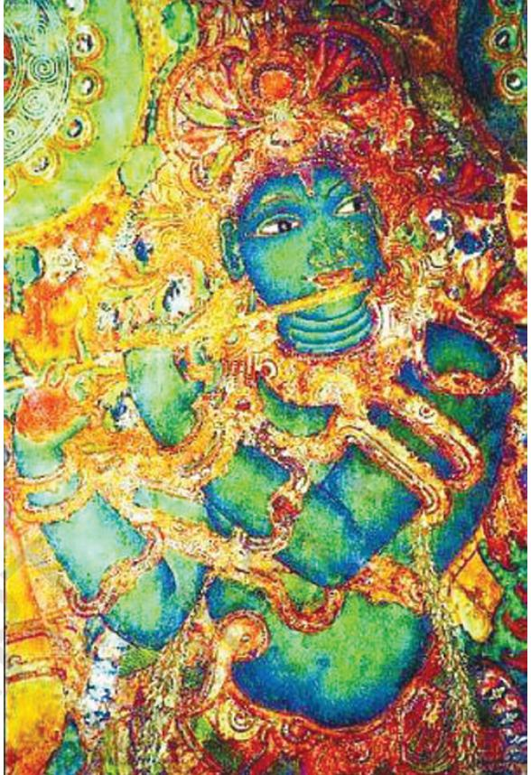

E VEN after Ajanta, very few sites with paintings have survived which provide valuable evidences to reconstruct the tradition of paintings. It may also be noted that the sculptures too were plastered and painted. The tradition of cave excavations continued further at many places where sculpting and painting were done simultaneously.

### Badami

One such site is Badami in the State of Karnataka. Badami was the capital of the early Chalukyan dynasty which ruled

the region from 543 to 598 CE. With the decline of the Vakataka rule, the Chalukyas established their power in the Deccan. The Chalukya king, Mangalesha, patronised the excavation of the Badami caves. He was the younger son of the Chalukya king, Pulakesi I, and the brother of Kirtivarman I. The inscription in Cave No.4 mentions the date 578–579 CE, describes the beauty of the cave and includes the dedication of the image of Vishnu. Thus it may be presumed that the cave was excavated in the same era and the patron records his Vaishnava affiliation. Therefore, the cave is popularly known as the Vishnu Cave. Only a fragment of the painting has survived on the vaulted roof of the front *mandapa*.

Paintings in this cave depict palace scenes. One shows Kirtivarman, the son of Pulakesi I and the elder brother of Mangalesha, seated inside the palace with his wife and feudatories watching a dance scene. Towards the corner of the panel are figures of Indra and his retinue. Stylistically speaking, the painting represents an

*Queen and attendants, Badami*

extension of the tradition of mural painting from Ajanta to Badami in South India. The sinuously drawn lines, fluid forms and compact composition exemplify the proficiency and maturity the artists had achieved in the sixth century CE. The gracefully drawn faces of the king and the queen remind us of the style of modelling in Ajanta. Their eyesockets are large, eyes are half-closed, and lips are protruding. It is noteworthy to observe that the contours of different parts of the face create protruding structures of the face itself. Thus, with simple line treatment artists could create volume.

## Murals under the Pallava, Pandava and Chola Kings

The tradition of painting extended further down south in Tamil Nadu in the preceding centuries with regional variations during the regimes of Pallava, Pandya and Chola dynasties. The Pallava kings who succeeded the Chalukya kings in parts of South India, were also patrons of arts. Mahendravarma I who ruled in the seventh century was responsible for building temples at Panamalai, Mandagapattu and Kanchipuram. The inscription at Mandagapattu mentions Mahendravarman I with numerous titles such as Vichitrachitta (curious-minded),

*Sittanvasal — early Pandya period, ninth century CE*

Chitrakarapuli (tiger among artists), Chaityakari (temple builder), which show his interest in art activities. The paintings in these temples too were done at his initiative, though only fragments remain. The Panamalai figure of a female divinity is drawn gracefully. Paintings at the Kanchipuram temple were patronised by the Pallava king, Rajsimha. Only traces of paintings remain now which depict Somaskanda. Faces are round and large. Lines are rhythmic with increased ornamentation when compared with the paintings of an earlier periods. Depiction of torso still remains like the earlier sculptural tradition but is elongated.

When the Pandyas came to power, they too patronised art. Tirumalaipuram caves and Jaina caves at Sittanvasal are some of the surviving examples. A few fragmented layers of paintings can be seen in Tirumalaipuram. In Sittanavasal, the paintings are visible on the ceilings of shrines, in verandas, and on the brackets.

On the pillars of the veranda are seen dancing figures of celestial nymphs. The contours of figures are firmly drawn and painted in vermilion red on a lighter background. The body is rendered in yellow with subtle modelling. Supple limbs, expression on the faces of dancers, rhythm in their swaying movement, all speak of the artists' skill in creative imagination in visualising the forms in

*Devi — seventh century CE, Panamalai*

the architectural context. Their eyes are slightly elongated and at times protrude off the face. This feature is observed in many subsequent paintings in the Deccan and South India.

The tradition of building temples and embellishing them with carvings and paintings continued during the reign of the Chola kings who ruled over the region from the ninth to the thirteenth century. But it was in the eleventh century, when the Cholas reached their zenith of power, that masterpieces of the Chola art and architecture began to appear. The temples of Brihadeswara at Thanjavur, Gangaikonda Cholapuram and Darasuram in Tamil Nadu were built during the reigns of Rajaraja Chola, his son, Rajendra Chola and Raj a raja Chola II, respectively.

Though Chola paintings are seen in Nartamalai, the most important are those in Brihadeswara temple. The paintings were executed on the walls of the narrow passage surrounding the shrine. Two layers of paintings were found when they were discovered. The upper layer was painted during the Nayak period, in the sixteenth century. Thanks to the cleaning of the surface painting, examples of the great tradition of painting during the Chola period were unveiled. The paintings show narrations and aspects related to Lord Shiva, Shiva in Kailash, Shiva as Tripurantaka, Shiva as Nataraja, a portrait of the patron Rajaraja and his mentor Kuruvar, dancing figures, etc.

### Vijayanagara Murals

The paintings of Brihadeswara temple exemplify the stylistic maturity the artists evolved over the years. Sinuous pre-determined flow of lines, supple modelling of figures,

*Dakshinamurty, Vijayanagar, Lepakshi*

elongation of the physiognomic features of human figures all these represent the perfection the Chola artist had achieved during the period on the one hand and the phase of transition on the other. With the decline of power of the Chola dynasty in the thirteenth century, the Vijayanagara Dynasty (fourteenth-sixteenth centuries) captured and brought under its control the region from Hampi to Trichy with Hampi serving as its capital. Many paintings survive in a number of temples. The paintings at Tiruparakunram, near Trichy, done in the fourteenth century represent the early phase of the Vijayanagara style. In Hampi, the Virupaksha temple has paintings on the ceiling of its *mandapa* narrating events from dynastic history and episodes from the *Ramayana* and the *Mahabharata*. Among the important panels are the ones which show Vidyaranya, the spiritual teacher of Bukkaraya Harsha, being carried in a palanquin in a procession and the incarnations of Vishnu. The faces of the figures are shown in profile, with large frontal eyes. The figures have narrow waists.

In Lepakshi, near Hindupur, in present Andhra Pradesh, there are glorious examples of Vijayanagara paintings on the walls of the Shiva temple.

In keeping with the tradition, the Vijayanagara painters evolved a pictorial language wherein the faces are shown in profile and figures and objects two-dimensionally. Lines become still but fluid, compositions appear in rectilinear compartments. These stylistic conventions of the preceding centuries were adopted by artists in various centres in South India as can be seen in the paintings of the Nayaka Period.

Paintings of the Nayaka dynasty in the seventeenth and eigtheenth centuries are seen in Thiruparakunram,

*Ladies attending Parvati, Virbhadra Temple, Lepakshi*

Sreerangam and Tiruvarur in Tamil Nadu. In Thiruparakunram, paintings are found of two different periods—of the fourteenth and the seventeenth century. Early paintings depict scenes from the life of Vardhaman Mahavira.

The Nayaka paintings depict episodes from the *Mahabharata* and the *Ramayana* and also scenes from *Krishna-leela*. In Tiruvarur, there is a panel narrating the story of Muchukunda. In Chidambaram, there are panels of paintings narrating stories related to Shiva and Vishnu— Shiva as *Bhikshatana Murti,* Vishnu as *Mohini*, etc.

In the Sri Krishna temple at Chengam in Arcot District there are 60 panels narrating the story of the *Ramayana* which represent the late phase of Nayaka paintings.

The examples cited above suggest that Nayaka paintings were more or less an extension of the Vijayanagara style with minor regional modifications and incorporations. The figures, mostly in profile, are set against a flat background. Male figures are shown slim-waisted but with less heavy abdoman as compared to those in Vijayanagara. The artist, as in the previous centuries and following traditions, has tried to infuse movement and make the space dynamic. The painting of Nataraja at Tiruvalanjuli is a good example.

#### Kerala Murals

Kerala painters (during the period from the sixteenth to the eighteenth century) evolved a pictorial language and technique of their own while discriminately adopting certain stylistic elements from Nayaka and Vijayanagara schools. The painters evolved a language taking cues from contemporary traditions, like Kathakali and *kalam ezhuthu*

*Venugopal, Sri Rama Temple, Triprayar*

(ritual floor painting of Kerala), using vibrant and luminous colours, representing human figures in three-dimensionality. Most of the paintings are seen on the walls of shrines and cloister walls of temples and some inside palaces. Thematically too, paintings from Kerala stand apart. Most of the narrations are based on those episodes from Hindu mythology which were popular in Kerala. The artist seems to have derived sources from oral traditions and local versions of the *Ramayana* and the *Mahabharata* for painted narration.

More than sixty sites have been found with mural paintings which include three palaces—Dutch palace in Kochi, Krishnapuram palace in Kayamkulam and Padmanabhapuram palace. Among the sites where one can see the mature phase of Kerala's mural painting tradition are Pundareekapuram Krishna temple, Panayanarkavu, Thirukodithanam, Triprayar Sri Rama temple and Trissur Vadakkunathan temple.

Even today we observe that mural

painting on interior and exterior walls of houses in villages or *havelis* is prevalent in different parts of the country. These paintings are usually made by women either at the time of ceremonies or festivals or as a routine to clean and decorate the walls. Some of the traditional forms of murals are *pithoro* in parts of Rajasthan and Gujarat, Mithila painting in northern Bihar's Mithila region, *warli* paintings in Maharashtra, or simply paintings on the walls, be it in a village of Odisha or Bengal, Madhya Pradesh or Chhattisgarh.

*Krishna playing flute, accompanied by Gopikas, Krishna temple, Pundareekapuram*

# EXERCISE

- 1. What are the main features of Badami cave paintings?
- 2. Write an essay on Vijayanagara paintings.
- 3. Describe the mural traditions of Kerala and Tamil Nadu.

