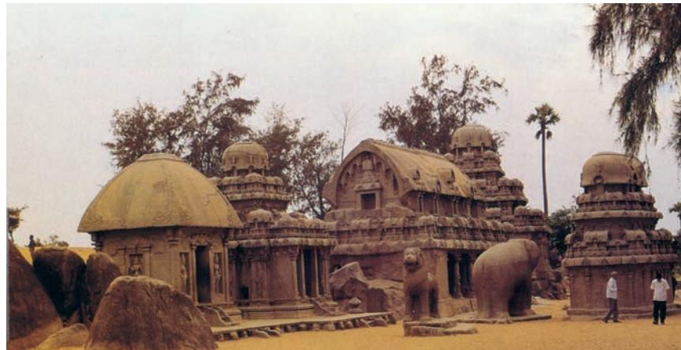

MOST of the art and architectural remains that survive from Ancient and Medieval India are religious in nature. That does not mean that people did not have art in their homes at those times, but domestic dwellings and the things in them were mostly made from materials like wood and clay which have perished. This chapter introduces us to many types of temples from India. Although we have focussed mostly on Hindu temples, at the end of the chapter you will find some information on major Buddhist and Jain temples too. However, at all times, we must keep in mind that religious shrines were also made for many local cults in villages and forest areas, but again, not being of stone the ancient or medieval shrines in those areas have also vanished.

Today when we say 'temple' in English we generally mean a *devalaya, devkula mandir, kovil, deol, devasthanam or prasada* depending on which part of India we are in.

> *Chatur Mukhlinga, Nachna- Kuthara (Inset)*

## Early Temples

While construction of *stupas* continued, Brahmanical temples and images of gods also started getting constructed. Often temples were decorated with the images of gods. Myths mentioned in the *Puranas* became part of narrative representation of the Brahmanical religion. Each temple had a principal image of a god. The shrines of the temples were of three kinds—(i) *sandhara* type (without *pradikshinapatha*), (ii) *nirandhara* type (with *pradakshinapatha*), and (iii) *sarvatobhadra* (which can be accessed from all sides). Some of the important temple sites of this period are Deogarh in Uttar

*Shiva temple, Nachna-Kuthara, Madhya Pradesh, fifth century CE*

Pradesh, Eran, Nachna-Kuthara and Udaygiri near Vidisha in Madhya Pradesh. These temples are simple structures consisting of a veranda, a hall and a shrine at the rear.

## THE BASIC FORM OF THE HINDU TEMPLE

The basic form of the Hindu temple comprises the following: (i) sanctum (*garbhagriha* literally 'womb-house'), which was a small cubicle with a single entrance and grew into a larger chamber in time. The *garbhagriha* is made to house the main icon which is itself the focus of much ritual attention; (ii) the entrance to the temple which may be a portico or colonnaded hall that incorporates space for a large number of worshippers and is known as a *mandapa*; (iii) freestanding temples tend to have a mountain-like spire, which can take the shape of a curving *shikhar* in North India and a pyramidal tower, called a *vimana,* in South India; (iv) the *vahan,* i.e., the mount or vehicle of the temple's main deity along with a standard pillar or *dhvaj* is placed axially before the sanctum. Two broad orders of temples in the country are known— *Nagara* in the north and *Dravida* in the south. At times, the *Vesar* style of temples as an independent style created through the selective mixing of the *Nagara* and *Dravida* orders is mentioned by some scholars. Elaborate studies are available on the various sub-styles within these orders. We will look into the differences in the forms further on in this chapter. As temples grew more complex, more surfaces were created for sculpture through additive geometry, i.e., by adding more and more rhythmically projecting, symmetrical walls and niches, without breaking away from the fundamental plan of the shrine.

## SCULPTURE, ICONOGRAPHY AND ORNAMENTATION

The study of images of deities falls within a branch of art history called 'iconography', which consists of identification of images based on certain symbols and mythologies associated with them. And very often, while the fundamental myth and meaning of the deity may remain the same for centuries, its specific usage at a spot can be a response to its local or immediate social, political or geographical context.

Every region and period produced its own distinct style of images with its regional variations in iconography. The temple is covered with elaborate sculpture and ornament that form a fundamental part of its conception. The placement of an image in a temple is carefully planned:

*Nagara temple*

for instance, river goddesses (Ganga and Yamuna) are usually found at the entrance of a *garbhagriha* in a *Nagara* temple, *dvarapalas* (doorkeepers) are usually found on the gateways or *gopurams* of *Dravida* temples, similarly, *mithunas* (erotic images), *navagrahas* (the nine auspicious planets) and *yakshas* are also placed at entrances to guard them. Various forms or aspects of the main divinity are to be found on the outer walls of the sanctum. The deities of directions, i.e., the *ashtadikpalas* face the eight key directions on the outer walls of the sanctum and/or on the outer walls of a temple. Subsidiary shrines around the main temple are dedicated to the family or incarnations of the main deity. Finally, various elements of ornamentation such as *gavaksha, vyala/yali, kalpa-lata, amalaka, kalasha,* etc. are used in distinct ways and places in a temple.

## THE *NAGARA* OR NORTH INDIAN TEMPLE STYLE

The style of temple architecture that became popular in northern India is known as *nagara*. In North India it is common for an entire temple to be built on a stone platform with steps leading up to it. Further, unlike in South India it does not usually have elaborate boundary walls or gateways. While the earliest temples had just one tower, or *shikhara*, later temples had several. The *garbhagriha* is always located directly under the tallest tower.

There are many subdivisions of *nagara* temples depending on the shape of the *shikhara*. There are different names for the various parts of the temple in different parts

*Sun temple, Konark*

of India; however, the most common name for the simple *shikhara* which is square at the base and whose walls curve or slope inward to a point on top is called the 'latina' or the *rekha-prasada* type of shikara.

The second major type of architectural form in the *nagara* order is the *phamsana*. *Phamsana* buildings tend to be broader and shorter than latina ones. Their roofs are composed of several slabs that gently rise to a single point over the centre of the building, unlike the latina ones which look like sharply rising tall towers. *Phamsana* roofs do not curve inward, instead they slope upwards on a straight incline. In many North Indian temples you will notice that the *phamsana* design is used for the *mandapas* while the main *garbhagriha* is housed in a latina building. Later on, the latina buildings grew complex, and instead of appearing like a single tall tower, the temple began to support many smaller towers, which were clustered together like rising mountain-peaks with the tallest one being in the centre, and this was the one which was always above the *garbhagriha*.

The third main sub-type of the *nagara* building is what is generally called the *valabhi* type. These are rectangular buildings with a roof that rises into a vaulted chamber. The edge of this vaulted chamber is rounded, like the bamboo or wooden wagons that would have been drawn by bullocks in ancient times. They are usually called 'wagonvaulted buildings'. As mentioned above, the form of the temple is influenced by ancient building forms that were already in existence before the fifth century CE. The *valabhi* type of building was one of them. For instance, if you study

*Dashavtara Vishnu temple, Deogarh, fifth century CE*

*Sheshashayana Vishnu, Dashavatara temple, Deogarh*

the ground-plan of many of the Buddhist rock-cut *chaitya* caves, you will notice that they are shaped as long halls which end in a curved back. From the inside, the roof of this portion also looks like a wagon-vaulted roof.

#### Central India

Ancient temples of Uttar Pradesh, Madhya Pradesh and Rajasthan share many traits. The most visible is that they are made of sandstone. Some of the oldest surviving structural temples from the Gupta Period are in Madhya Pradesh. These are relatively modest-looking shrines each having four pillars that support a small *mandapa* which looks like a simple square porch-like extension before an equally small room that served as the *garbh*ag*riha* . Importantly, of the two such temples that survive, one is at Udaigiri, which is on the outskirts of Vidisha and is part of a larger Hindu complex of cave shrines, while the other one is at Sanchi, near the stupa. This is the first temple having a flat roof. This means that similar developments were being incorporated in the architecture of temples of both the religions.

Deogarh (in Lalitpur District, Uttar Pradesh) was built in the early sixth century CE. That is, about a hundred years or so after the small temples we just learnt about in Sanchi and Udaigiri. This makes it a classic example of a late Gupta Period type of temple. This temple is in the *panchayatana* style of architecture where the main shrine is built on a rectangular plinth with four smaller subsidiary shrines at the four corners (making it a total number of five shrines, hence the name, *panchayatana*). The tall and curvilinear *shikhara* also corroborates this date. The presence of this curving latina or *rekha-prasada* type of *shikhara* also makes it clear that this is an early example of a classic *nagara* style of temple.

> *Sheshashayana* is the form of Vishnu where he is shown reclining on the *sheshanaga* called Ananta. *Nara-Narayan* shows the discussion between the human soul and the eternal divine. *Gajendramoksha* is the story of achieving *moksha,* symbolically communicated by Vishnu's suppression of an *asura* who had taken the form of an elephant.

This west-facing temple has a grand doorway with standing sculptures of female figures representing the Ganga on the left side and the Yamuna on the right side. The temple depicts Vishnu in various forms, due to which it was assumed that the four subsidiary shrines must also

*Vishwanatha temple, Khajuraho*

have housed Vishnu's *avatars* and the temple was mistaken for a *dasavatara* temple. In fact, it is not actually known to whom the four subsidiary shrines were originally dedicated. There are three main reliefs of Vishnu on the temple walls: *Sheshashayana* on the south, *Nara*-*Narayan* on the east and *Gajendramoksha* on the west. The temple is west-facing, which is less common, as most temples are east- or north-facing.

Numerous temples of smaller dimensions have been constructed over a period of time. By contrast, if we study the temples of Khajuraho made by the Chandela Kings in the tenth century, i.e., about four hundred years after the temple at Deogarh, we can see how

dramatically the shape and style of the *nagara* temple architecture had developed.

The Lakshmana temple of Khajuraho, dedicated to Vishnu, was built in 954 by the Chandela king, Dhanga. A *nagara* temple, it is placed on a high platform accessed by stairs. There are four smaller temples in the corners, and all the towers or *shikharas* rise high, upward in a curved pyramidal fashion, emphasising the temple's vertical thrust ending in a horizontal fluted disc called an *amalak* topped with a *kalash* or vase. The crowning elements: *amalak* and *kalash*, are to be found on all *nagara* temples of this period. The temple also has projecting balconies and verandahs, thus very different from Deogarh.

Kandariya Mahadeo temple at Khajuraho is the epitome of temple architecture in Central India. In the architecture and the sculptures of this temple, which is a massive structure, we see all features of central Indian temples of the medival period for which they are known and appreciated all over. Khajuraho's temples are also known for their extensive erotic sculptures; the erotic expression is given equal importance in human experience as spiritual pursuit, and it is seen as part of a larger cosmic whole. Many Hindu temples, therefore, feature *mithun* (embracing couple) sculptures, considered auspicious. Usually, they are placed at the entrance of the temple or on an exterior

*Dance class, Lakshmana Temple, Khajuraho*

wall or they may also be placed on the walls between the *mandapa* and the main shrine. Khajuraho's sculptures are highly stylised with typical features: they are in almost full relief, cut away from the surrounding stone, with sharp noses, prominent chins, long slanting eyes and eyebrows.

There are many temples at Khajuraho, most of them devoted to Hindu gods. There are some Jain temples as well as a Chausanth Yogini temple, which is of interest. Predating the tenth century, this is a temple of small, square shrines of roughly-hewn granite blocks, each dedicated to *devis* or goddesses associated with the rise of *Tantric* worship after the seventh century. Several such temples were dedicated to the cult of the *yoginis* across Madhya Pradesh, Odisha and even as far south as Tamil Nadu. They were built between the seventh and tenth centuries, but few have survived.

#### West India

The temples in the north-western parts of India including Gujarat and Rajasthan, and stylistically extendable, at times, to western Madhya Pradesh are too numerous to include

*Sun temple, Modhera, Gujarat*

*Sun temple, Modhera, Gujarat*

here in any comprehensive way. The stone used to build the temples ranges in colour and type. While sandstone is the commonest, a grey to black basalt can be seen in some of the tenth to twelveth century temple sculptures. The most exuberant and famed is the manipulatable soft white marble which is also seen in some of the tenth to twelveth century Jain temples in Mount Abu and the fifteenth century temple at Ranakpur.

Among the most important art-historical sites in the region is Samlaji in Gujarat which shows how earlier artistic traditions of the region mixed with a post-Gupta style and gave rise to a distinct style of sculpture. A large number of sculptures made of grey schist have been found in this region which can be dated between the sixth and eighth centuries CE. While the patronage of these is debated, the date is established on the basis of the style.

The Sun temple at Modhera dates back to early eleventh century and was built by Raja Bhimdev I of the Solanki Dynasty in 1026. There is a massive rectangular stepped tank called the *surya kund* in front of it. Proximity of sacred architecture to a water body such as a tank, a river or a pond has been noticed right from the earliest times. By the early eleventh century they had become a part of many temples. This hundred-square-metre rectangular pond is perhaps the grandest temple tank in India. A hundred and eight miniature shrines are carved in between the steps inside the tank. A huge ornamental arch-*torana* leads one to the *sabha mandapa* (the assembly hall) which is open on all sides, as was the fashion of the times in western and central Indian temples.

The influence of the woodcarving tradition of Gujarat is evident in the lavish carving and sculpture work. However, the walls of the central small shrine are devoid of carving and are left plain as the temple faces the east and, every year, at the time of the equinoxes, the sun shines directly into this central shrine.

#### East India

Eastern Indian temples include those found in the North-East, Bengal and Odisha. Each of these three areas produced distinct types of temples. The history of architecture in the North-East and Bengal is hard to study because a number of ancient buildings in those regions

Kamakhya Temple, Assam

were renovated, and what survives now are later brick or concrete temples at those sites. It appears that terracotta was the main medium of construction, and also for moulding plaques which depicted Buddhist and Hindu deities in Bengal until the seventh century. A large number of sculptures have been found in Assam and Bengal which shows the development of important regional schools in those regions.

Assam: An old sixth-century sculpted door frame from DaParvatia near Tezpur and another few stray sculptures from Rangagora Tea Estate near Tinsukia in Assam bear witness to the import of the Gupta idiom in that region. This post-Gupta style continued in the region well into the tenth century. However, by the twelfth to fourteenth centuries, a distinct regional style developed in Assam. The style that came with the migration of the Tais from Upper Burma mixed with the dominant Pala style of Bengal and led to the creation of what was later known as the Ahom style in and around Guwahati. Kamakhya temple, a Shakti Peeth, is dedicated to Goddess Kamakhya and was built in the seventeenth century.

Bengal: The style of the sculptures during the period between the ninth and eleventh centuries in Bengal (including Bangladesh) and Bihar is known as the Pala style, named after the ruling dynasty at the time, while the style of those of the mid-eleventh to mid-thirteenth centuries is named after the Sena kings. While the Palas are celebrated as patrons of many Buddhist monastic sites, the temples from that region are known to express the local Vanga style. The ninth century Siddheshvara

*Terracotta temple, Vishnupur*

Mahadeva temple in Barakar in Burdwan District, for example, shows a tall curving *shikhara* crowned by a large *amalaka* and is an example of the early Pala style. It is similar to contemporaneous temples of Odisha. This basic form grows loftier with the passing of centuries. Many of the temples from the ninth to the twelfth century were located at Telkupi in Purulia District. They were submerged when dams were built in the region. These were amongst the important examples of architectural styles prevalent in the region which showed an awareness of all the known *nagara* sub-types that were prevalent in the rest of North India. However, several temples still survive in Purulia District which can be dated to this period. The black to grey basalt and chlorite stone pillars and arched niches of these temples heavily influenced the earliest Bengal *sultanate* buildings at Gaur and Pandua. Many local vernacular building traditions of Bengal also influenced the style of temples in that region. Most prominent of these was the shape of the curving or sloping side of the bamboo roof of a Bengali hut. This feature was eventually even adopted in Mughal buildings, and is known across North India as the Bangla roof. In the Mughal period and later, scores of terracotta brick temples were built across Bengal and Bangladesh in a unique style that had elements of local building techniques seen in bamboo huts which were combined with older forms reminiscent of the Pala period and with the forms of arches and domes that were taken from Islamic architecture. These can be widely found in and around Vishnupur, Bankura, Burdwan and Birbhum and are dated mostly to the seventeenth century.

Odisha: The main architectural features of Odisha temples are classified in three orders, i.e., *rekhapida*, *pidhadeul* and *khakra*. Most of the main temple sites are located in ancient Kalinga—modern Puri District, including Bhubaneswar or ancient Tribhuvanesvara, Puri and Konark. The temples of Odisha constitute a distinct sub-style within the *nagara* order. In general, here the *shikhara,* called *deul* in Odisha, is vertical almost until the top when it suddenly curves sharply inwards. *Deuls* are preceded, as usual, by *mandapas* called *jagamohana* in Odisha. The ground plan of the main temple is almost always square, which, in the upper reaches of its superstructure becomes circular in the crowning *mastaka*. This makes the spire nearly cylindrical in appearance in its length. Compartments and niches are generally square, the exterior of the temples are lavishly carved, their interiors generally quite bare. Odisha temples usually have boundary walls.

At Konark, on the shores of the Bay of Bengal, lie the majestic ruins of the Surya or Sun temple built in stone around 1240. Its *shikhara* was a colossal creation said to have reached 70m, which, proving too heavy for its site, fell in the nineteenth century. The vast complex is within a quadrilateral precinct of which the *jagamohana* or the dance-pavillion (*mandapa*) has survived, which though no longer accessible is said to be the largest enclosed space in Hindu architecture.

The Sun temple is set on a high base, its walls covered in extensive, detailed ornamental carving. These include twelve pairs of enormous wheels sculpted with spokes and

*Jagannath temple, Puri*

hubs, representing the chariot wheels of the Sun god who, in mythology, rides a chariot driven by seven horses, sculpted here at the entrance staircase. The whole temple thus comes to resemble a colossal processional chariot. On the southern wall is a massive sculpture of *surya* carved out of green stone. It is said that there were three such images, each carved out of a different stone placed on the three temple walls, each facing different directions. The fourth wall had the doorway into the temple from where the actual rays of the sun would enter the *garbhagriha*.

#### The Hills

A unique form of architecture developed in the hills of Kumaon, Garhwal, Himachal and Kashmir. Kashmir's proximity to prominent Gandhara sites (such as Taxila, Peshawar and the northwest frontier) lent the region a strong Gandhara influence by the fifth century CE. This began to mix with the Gupta and post-Gupta traditions that were brought to it from Sarnath, Mathura and even centres in Gujarat and Bengal. Brahmin *pundits* and Buddhist monks frequently travelled between Kashmir, Garhwal, Kumaon and religious centres in the plains like Banaras, Nalanda and even as far south as Kanchipuram. As a result both Buddhist and Hindu traditions began to intermingle and spread in the hills. The hills also had

*Temple complexes in Hills*

their own tradition of wooden buildings with pitched roofs. At several places in the hills, therefore, you will find that while the main *garbhagriha* and *shikhara* are made in a *rekha-prasada* or latina style, the *mandapa* is of an older form of wooden architecture. Sometimes, the temple itself takes on a pagoda shape.

The Karkota period of Kashmir is the most significant in terms of architecture. One of the most important temples is Pandrethan, built during the eighth and ninth centuries. In keeping with the tradition of a water tank attached to the shrine, this temple is built on a plinth built in the middle of a tank. Although there are evidences of both Hindu and Buddhist followings in Kashmir, this temple is a Hindu one, possibly dedicated to Shiva. The architecture of this temple is in keeping with the age-old Kashmiri tradition of wooden buildings. Due to the snowy conditions in Kashmir, the roof is peaked and slants slowly outward. The temple is moderately ornamented, moving away from the post-Gupta aesthetics of heavy carving. A row of elephants at the base and a decorated doorway are the only embellishments on the shrine.

Like the findings at Samlaji, the sculptures at Chamba also show an amalgamation of local traditions with a post-Gupta style. The images of *Mahishasuramardini* and *Narasimha* at the *Laksna*-*Devi Mandir* are evidences of the influence of the post-Gupta tradition. Both the images show the influence of the metal sculpture tradition of Kashmir. The yellow colour of the images is possibly due to an alloy of zinc and copper which were popularly used to make images in Kashmir. This temple bears an inscription that states that it was built during the reign of Meruvarman who lived in the seventh century.

*Dravida temple*

*Meenakshi temple, Madurai*

*Gangaikondacholapuram temple*

Of the temples in Kumaon, the ones at Jageshwar near Almora, and Champavat near Pithoragarh, are classic examples of *nagara* architecture in the region.

## THE *DRAVIDA* OR SOUTH INDIAN TEMPLE STYLE

Unlike *the nagara* temple, the *dravida* temple is enclosed within a compound wall. The front wall has an entrance gateway in its centre, which is known as a *gopuram*. The shape of the main temple tower known as *vimana* in Tamil Nadu is like a stepped pyramid that rises up geometrically rather than the curving *shikhara* of North India. In the South Indian temple, the word *'shikhara'* is used only for the crowning element at the top of the temple which is usually shaped like a small *stupika* or an octagonal cupola this is equivalent to the *amlak* and *kalasha* of North Indian temples. Whereas at the entrance to the North Indian temple's *garbhagriha*, it would be usual to find images such as *mithunas* and the river goddesses, Ganga and Yamuna, in the south you will generally find sculptures of fierce *dvarapalas* or the door-keepers guarding the temple. It is common to find a large water reservoir, or a temple tank, enclosed within the complex. Subsidiary shrines are either incorporated within the main temple tower, or located as distinct, separate small shrines beside the main temple. The North Indian idea of multiple *shikharas* rising together as a cluster was not popular in South India. At some of the most sacred temples in South India, the main temple in which the *garbhagriha* is situated has, in fact, one of the smallest towers. This is because it is usually the oldest part of the temple. With the passage of time, the population and size of the town associated with that temple would have increased, and it would have become necessary to

make a new boundary wall around the temple. This would have been taller that the last one, and its *gopurams* would have been even loftier. So, for instance, the Srirangam temple in Tiruchirapally has as many as seven 'concentric' rectangular enclosure walls, each with *gopurams*. The outermost is the newest, while the tower right in the centre housing the *garbhagriha* is the oldest.

Temples thus started becoming the focus of urban architecture. Kanchipuram, Thanjavur or Tanjore, Madurai and Kumbakonam are the most famous temple towns of Tamil Nadu, where, during the eighth to twelfth centuries, the role of the temple was not limited to religious matters alone. Temples became rich administrative centres, controlling vast areas of land.

Just as there are many subdivisions of the main types of *nagara* temples, there are subdivisions also of *dravida* temples. These are basically of five different shapes: square, usually called *kuta*, and also *caturasra*; rectangular or *shala* or *ayatasra*; elliptical, called *gaja-prishta* or elephantbacked, or also called *vrittayata*, deriving from wagonvaulted shapes of apsidal *chaityas* with a horse-shoe shaped entrance facade usually called a *nasi*; circular or *vritta;* and octagonal or *ashtasra*. Generally speaking, the plan of the temple and the shape of the *vimana* were conditioned by the iconographic nature of the consecrated deity, so it was appropriate to build specific types of temples for specific types of icons. It must, however, be remembered that this is a simplistic differentiation of the subdivisions. Several different shapes may be combined in specific periods and places to create their own unique style.

*Shore temple, Mahabalipuram*

*Nandi, Brahadeeshwarar*

The Pallavas were one of the ancient South Indian dynasties that were active in the Andhra region from the second century CE onwards and moved south to settle in Tamil Nadu. Their history is better documented from the sixth to the eighth century, when they left many inscriptions in stone and several monuments. Their powerful kings spread their empire to various parts of the subcontinent, at times reaching the borders of Odisha, and their links with South–East Asia were also strong. Although they were mostly Shaivite, several Vaishnava shrines also survived from their reign, and there is no doubt that they were influenced by the long Buddhist history of the Deccan.

Their early buildings, it is generally assumed, were rockcut, while the later ones were structural. However, there is reason to believe that structural buildings were well known even when rock-cut ones were being excavated. The early buildings are generally attributed to the reign of Mahendravarman I, a contemporary of the Chalukyan king, Pulakesin II of Karnataka. Narasimhavarman I, also known as Mamalla, who acceded the Pallava throne around 640 CE, is celebrated for the expansion of the empire, avenging the defeat his father had suffered at the hands of Pulakesin II, and inaugurating most of the building works at Mahabalipuram which is known after him as Mamallapuram.

The shore temple at Mahabalipuram was built later, probably in the reign of Narasimhavarman II, also known as Rajasimha who reigned from 700 to 728 CE. Now it is oriented to the east facing the ocean, but if you study it closely, you will find that it actually houses three shrines,

*Brahadeeshwarar, Thanjavur*

*Five Rathas, Mahabalipuram*

two to Shiva, one facing east and the other west, and a middle one to Vishnu who is shown as *Anantashayana*. This is unusual, because temples generally have a single main shrine and not three areas of worship. This shows that it was probably not originally conceived like this and different shrines may have been added at different times, modified perhaps with the change of patrons. In the compound there is evidence of a water tank, an early example of a *gopuram*, and several other images. Sculptures of the bull, Nandi, Shiva's mount, line the temple walls, and these, along with the carvings on the temple's lower walls have suffered severe disfiguration due to erosion by salt-water laden air over the centuries.

The magnificent Shiva temple of Thanjavur, called the Rajarajeswara or Brahadeeshwarar temple, was completed around 1009 by Rajaraja Chola, and is the largest and tallest of all Indian temples. Temple building was prolific at this time, and over a hundred important temples of the Chola period are in a good state of preservation, and many more are still active shrines. Bigger in scale than anything built by their predecessors, the Pallavas, Chalukyas or Pandyas, this Chola temple's pyramidal multi-storeyed *vimana* rises a massive, 70 metre (230 ft. approx) structure topped by a monolithic *shikhara* which is an octagonal dome-shaped *stupika*. It is in this temple that one notices for the first time two large *gopuras* (gateway towers) with an elaborate sculptural programme which was conceived along with the temple. Huge Nandi-figures dot the corners of the *shikhara*, and the *kalasha* on top by itself is about three metres and eight centimetres in height. Hundreds of stucco figures decorate the *vimana*, although it is possible that some of these may have been added on during the Maratha Period and did not always belong to the Chola Period. The main deity of the temple is Shiva, who is shown as a huge *lingam* set in a two-storeyed

sanctum. The walls surrounding the sanctum have extended mythological narratives which are depicted through painted murals and sculptures.

#### Architecture in the Deccan

Many different styles of temple architecture influenced by both North and South Indian temples were used in regions like Karnataka. While some scholars consider the buildings in this region as being distinctly either *nagara* or *dravida*, a hybridised style that seems to have become popular after the mid-seventh century, is known in some ancient texts as *vesara*.

By the late seventh or the early eighth century, the ambitious projects at Ellora became even grander. By about 750 CE, the early western Chalukya control of the Deccan was taken by the Rashtrakutas. Their greatest achievement in architecture is the Kailashnath temple at Ellora, a culmination of at least a millennium-long tradition in rock-cut architecture in India. It is a complete *dravida* building with a Nandi shrine—since the temple is dedicated to Shiva—a *gopuram*-like gateway, surrounding cloisters, subsidiary shrines, staircases and an imposing tower or *vimana* rising to thirty metres. Importantly, all of this is carved out of living rock. One portion of the monolithic hill was carved patiently to build the Kailashnath temple. The sculpture of the Rashtrakuta phase at Ellora is dynamic, the figures often larger than life-size, infused with unparalleled grandeur and the most overwhelming energy.

In the southern part of the Deccan, i.e., in the region of Karnataka is where some of the most experimental

*Kailashnath temple, Ellora*

*Temple, Badami*

hybrid styles of *vesara* architecture are to be found. Pulakesin I established the western Chalukya kingdom when he secured the land around Badami in 543. The early western Chalukyas ruled most of the Deccan till the mideighth century when they were superseded by the Rashtrakutas. Early Chalukyan activity also takes the form of rock-cut caves while later activity is of structural temples. The earliest is probably the Ravana Phadi cave at Aihole which is known for its distinctive sculptural style. One of the most important sculptures at the site is of Nataraja, surrounded by larger -than-life-size depictions of the *saptamatrikas*: three to Shiva's left and four to his right. The figures are characterised by graceful, slim bodies, long, oval faces topped with extremely tall cylindrical crowns and shown to wear short *dhotis* marked by fine incised striations indicating pleating. They are distinctly different from

*Durga temple, Aihole*

*Virupaksha temple, Pattadakal*

> contemporary western Deccan or Vakataka styles seen at places such as Paunar and Ramtek in Maharashtra.

The hybridisation and incorporation of several styles was the hallmark of Chalukyan buildings. The most elaborate of all Chalukyan temples at Pattadakal made in the reign of Vikramaditya II (733-44) by his chief queen Loka Mahadevi is Virupaksha temple. Another important temple from this site is Papnath temple, dedicated to Lord Shiva. The temple is one of the best early examples of the *Dravida* tradition. By contrast other eastern Chalukyan Temples, like the Mahakuta, five kilometres from Badami, and the Swarga Brahma temple at Alampur show a greater assimilation of northern styles from Odisha and Rajasthan. At the same time the Durga temple at Aihole is unique having an even earlier style of an apsidal shrine which is reminiscent of Buddhist *chaitya* halls and is surrounded by a veranda of a later kind, with a *shikhara* that is stylistically like a *nagara*

> one. Finally, mention must be made of the Lad Khan temple at Aihole in Karnataka. This seems to be inspired by the wooden-roofed temples of the hills, except that it is constructed out of stone.

> How then shall we understand these different styles at one place? As curiosities or as innovations? Undoubtedly, they are dynamic expressions of a creative set of architects who were competing with their peers in the rest of India. Whatever one's explanation is, these buildings remain of great art-historical interest.

*Somnathpuram temple*

With the waning of Chola and Pandya power, the Hoysalas of Karnataka grew to prominence in South India and became the most important patrons centred at Mysore. The remains of around hundred temples have been found in southern Deccan, though it is only three of them that are most frequently discussed: the temples at Belur, Halebid and Somnathpuram. Perhaps the most characteristic feature of these temples is that they grow extremely complex with so many projecting angles emerging from the previously straightforward square temple, that the plan of these temples starts looking like a star, and is thus known as a stellate-plan. Since they are made out of soapstone which is a relatively soft stone, the artists were able to carve their sculptures intricately. This can be seen particularly in the jewellery of the gods that adorn their temple walls.

The Hoysaleshvara temple (Lord of the Hoysalas) at Halebid in Karnataka was built in dark schist stone by the Hoysala king in 1150. Hoysala temples are sometimes called hybrid or *vesara* as their unique style seems neither completely *dravida* nor *nagara*, but somewhere in between. They are easily distinguishable from other medieval temples by their highly original star -like ground-plans and a profusion of decorative carvings.

*Nataraja, Halebid*

Dedicated to Shiva as Nataraja, the Halebid temple is a double building with a large hall for the *mandapa* to facilitate music and dance. A Nandi pavilion precedes each building. The tower of the temple here and at nearby Belur fell long ago, and an idea of the temples' appearance can now only be gleaned from their detailed miniature versions flanking the entrances. From the central square plan cut-out angular projections create the star effect decorated with the most profuse carvings of animals and deities. So intricate is the carving that it is said, for instance, in the bottom-most frieze featuring a continuous procession of hundreds of elephants with their mahouts, no two elephants are in the same pose.

Founded in 1336, Vijayanagara, literally 'city of victory', attracted a number of international travellers such as the Italian, Niccolo di Conti, the Portuguese Domingo Paes, Fernao Nuniz and Duarte Barbosa and the Afghan Abd al-Razzaq, who have left vivid accounts of the city. In addition, various Sanskrit and Telugu works document the vibrant literary tradition of this kingdom. Architecturally, Vijayanagara synthesises the centuries-old *dravida* temple architecture with Islamic styles demonstrated by the neighbouring sultanates. Their sculpture too, although fundamentally derived from, and consciously seeking to recreate Chola ideals, occasionally shows the presence of foreigners. Their eclectic ruins from the late fifteenth and early sixteenth centuries preserve a fascinating time in history, an age of wealth, exploration and cultural fusion.

## BUDDHIST AND JAIN ARCHITECTURAL DEVELOPMENTS

So far, although we have focused on the nature of developments in Hindu architecture from the fifth to fourteenth centuries, it must constantly be kept in mind that this was also the very period when Buddhist and Jain developments were equally vibrant, and often went handin-glove with Hindu ones. Sites such as Ellora have Buddhist, Hindu and Jain monuments; however, Badami, Khajuraho and Kannauj have the remains of any two of the religions right next to each other .

When the Gupta empire crumbled in the sixth century CE, this eastern region of Bihar and Bengal, historically known as Magadha, appears to have remained unified whilst numerous small Rajput principalities sprang up to the west. In the eighth century, the Palas came to power in the region. The second Pala ruler, Dharmapala, became immensely powerful and established an empire by defeating

the powerful Rajput Pratiharas. Dharmapala consolidated an empire whose wealth lay in a combination of agriculture along the fertile Ganges plain and international trade.

The pre-eminent Buddhist site is, of course, Bodhgaya. Bodhgaya is a pilgrimage site since Siddhartha achieved enlightenment here and became Gautama Buddha. While the *bodhi* tree is of immense importance, the Mahabodhi Temple at Bodhgaya is an important reminder of the brickwork of that time. The first shrine here, located at the base of the Bodhi tree, is said to have been constructed by King Ashoka; the *vedika* around it is said to be post-Mauryan, of about 100 BCE; many of the sculptures in the niches in the temple are dated to the eighth century Pala Period, while the actual Mahabodhi temple itself as it stands now is largely a Colonial Period reconstruction of the old seventh century design. The design of the temple is unusual. It is, strictly

speaking, neither *dravida* or *nagara*. It is narrow like a *nagara* temple, but it rises without curving, like a *dravida* one.

*Mahabodhi temple, Bodhgaya*

The monastic university of Nalanda is a *mahavihara* as it is a complex of several monastries of various sizes. Till date, only a small portion of this ancient learning centre has been excavated as most of it lies buried under contemporary civilisation, making further excavations almost impossible.

Most of the information about Nalanda is based on the records of Xuan Zang—previously spelt as 'Hsuan-tsang' which states that the foundation of a monastery was laid by Kumargupta I in the fifth century CE; and this was carried forward by the later monarchs who built up a fantastic university here. There is evidence that all three Buddhist doctrines— Theravada, Mahayana and Vajrayana—were taught here and monks made their way to Nalanda and its neighbouring sites of Bodhgaya and Kurkihar from China, Tibet and Central Asia in the north, and Sri Lanka, Thailand, Burma and various other countries from the south-eastern parts of Asia. Monks and pilgrims would take back small sculptures and illustrated manuscripts from here to their own countries. Buddhist monasteries like Nalanda, thus, were prolific centres of art production that had a decisive impact on the arts of all Buddhist countries in Asia.

The sculptural art of Nalanda, in stucco, stone and bronze, developed out of a heavy dependence on the Buddhist Gupta art of Sarnath. By the ninth century a synthesis occurred between the Sarnath Gupta idiom, the local Bihar tradition, and that of central India, leading to the formation of the Nalanda school of sculpture characterised by distinctive facial features, body forms and treatment of clothing and jewellery. The characteristic features of Nalanda art, distinguished by its consistently high quality of workmanship, are that the precisely executed sculptures have an ordered appearance with little effect of crowding. Sculptures are also usually not flat in relief but are depicted in three-dimensional forms. The back slabs of the sculptures are detailed and the ornamentations delicate. The Nalanda bronzes, dating between the seventh and eighth centuries to approximately the twelfth century outnumber the discovery of metal images from all other sites of eastern India and constitute a large body of Pala Period metal sculptures. Like their stone counterparts, the bronzes initially relied heavily on Sarnath and Mathura Gupta traditions. The Nalanda sculptures initially depict Buddhist deities of the Mahayana pantheon such as standing Buddhas, *bodhisattvas* such as Manjusri Kumara, Avalokiteshvara seated on a lotus and Naga-Nagarjuna. During the late eleventh and twelveth

*Sculptural details, Nalanda*

*Excavated site, Nalanda*

centuries, when Nalanda emerged as an important tantric centre, the repertoire came to be dominated by Vajrayana deities such as Vajrasharada (a form of Saraswati) Khasarpana, Avalokiteshvara, etc. Depictions of crowned Buddhas occur commonly only after the tenth century. Interestingly, various brahmanical images not conforming to the Sarnath style have also been found at Nalanda, many of which are still worshipped in small temples in villages around the site.

Sirpur in Chhattisgarh is an early-Odisha style site belonging to the period between 550 and 800, with both Hindu and Buddhist shrines. In many ways the iconographic and stylistic elements of the Buddhist sculptures here are similar to that of Nalanda. Later other

*Lakshmana temple, Sirpur*

*Lord Bahubali, Gomateshwara, Karnataka*

> major Buddhist monasteries developed in Odisha. Lalitagiri, Vajragiri and Ratnagiri are the most famous of them.

> The port-town of Nagapattinam was also a major Buddhist centre right until the Chola Period. One of the reasons for this must have been its importance in trade with Sri Lanka where large numbers of Buddhists still live. Bronze and stone sculptures in Chola style have come to light at Nagapattinam and generally date back to the tenth century.

> Jains were prolific temple builders like the Hindus, and their sacred shrines and pilgrimage spots are to be found across the length and breadth of India except in the hills. The oldest Jain pilgrimage sites are to be found in Bihar. Many of these sites are famous for early Buddhist shrines. In the Deccan, some of the most architecturally important Jain sites can be found in Ellora and Aihole. In central India, Deogarh, Khajuraho, Chanderi and Gwalior have some excellent examples of Jain temples. Karnataka

has a rich heritage of Jain shrines and at Sravana Belagola the famous statue of Gomateshwara, the granite statue of Lord Bahubali which stands eighteen metres or fifty-seven feet high, is the world's tallest monolithic free-standing structure. It was commissioned by Camundaraya, the General-in-Chief and Prime Minister of the Ganga Kings of Mysore.

The Jain temples at Mount Abu were constructed by Vimal Shah. Notable for a simplistic exterior in contrast with the exuberant marble interiors, their rich sculptural decoration with deep undercutting creates a lace-like appearance. The temple is famous for its unique patterns on every ceiling, and the graceful bracket figures along the domed ceilings. The great Jain pilgrimage site in the Shatrunjay hills near Palitana in Kathiawar, Gujarat, is imposing with scores of temples clustered together.

In this chapter we have read about the prolific sculptural and architectural remains in different types of stone, terracotta and bronze from the fifth to the fourteenth centuries. Undoubtedly there would have been sculptures made of other media like silver and gold, but these would have been melted down and reused. Many sculptures would also have been made of wood and ivory, but these have perished because of their fragility. Often sculptures would have been painted, but again, pigments cannot always survive hundreds of years, especially if the sculptures were exposed to the elements. There was also a rich tradition of painting at this time, but the only examples that survive from this period are murals in a few religious buildings.

*Jain sculpture, Mount Abu*

*Dilwara temple, Mount Abu*

Mahabalipuram is an important coastal town from the period of the Pallavas. It is dotted with several important rock-cut and free-standing structural temples mostly made in the seventh and eighth centuries. This large sculptural panel, one of the largest and oldest known in the world, is nearly thirty metres long and fifteen metres high. There is a natural cleft in the rock which has been cleverly used by its sculptors as a channel for water to flow down. This water collects in a massive tank in front of the sculpted wall.

Scholars have interpreted the story depicted on the panel differently. While some believe that it is the story of the descent of the Ganga from heaven to earth, others believe that the main story is of *Kiratarjuniya* or Arjuna's penance, a poetic work by Bharvi which is known to have been popular in the Pallava court. Other scholars have interpreted the symbolism behind the sculptures to show that the whole tableau was created to be a *prashasti*, or something to praise the Pallava king, who, they say, would have sat enthroned in the tank in front of this extraordinary backdrop.

 A temple has been given prominence in the relief. Ascetics and worshippers sit before it. Above it is an emaciated bearded figure standing in penance on one leg, his arms raised above his head. He has been identified by some as Bhagirath and by others as Arjuna. Arjuna's penance was to obtain the *pashupata* weapon from Shiva, whereas Bhagirath prayed to have Ganga brought to earth. Next to this figure stands Shiva who has one hand in the boon bestowing gesture or *varada mudra*. The small *gana* or dwarf who stands below this hand may be a personification of the powerful *pashupata* weapon.

 All the figures are shown with a slender and linear quality in an animated state of movement. Apart from humans and flying celestials there are several naturalistically carved birds and animals as well. Particularly noteworthy are the extraordinarily well-modelled, and lifelike elephants, and the pair of deer who are under the shrine. The most humorous, however, is a cat who has been shown standing on his hind legs, with his hands raised, imitating Bhagirath or Arjuna. Close examination, however, reveals that this cat is, in fact, a symbolic device. He is surrounded by rats, which are unable to disturb him from his penance. Perhaps this is a metaphor used by the artist to show how strong Arjuna's or Bhagirath's penance was, who is also standing still, undisturbed by his surroundings.

The theme of Ravana shaking Mount Kailasha has been depicted several times in the caves of Ellora. But the most noteworthy of all is the one depicted on the left wall of Kailashnath temple (Cave No.16) at Ellora. The image is dated to the eighth century CE. It is a colossal sculpture and is considered as one of the masterpieces of Indian sculpture. It depicts the episode of Ravana shaking Mount Kailasha when Lord Shiva along with Parvati and others were on the mountain. The composition is divided into several tiers. The lower tier depicts Ravana, multi-faced and multiarmed shaking the mount with ease. The depth of carvings of the multiple hands brings out the effect of three-dimensional space. Ravana's body is angular pushing one leg inside. The hands are expanded on the sides of the inside chamber created by the image of Ravana. The upper half is divided into three frames. The centre occupied by the image of Shiva and Parvati. Parvati is shown moving close to Shiva scared by the commotion on the hill. Her stretched legs and slightly twisted body in the recessed space create a very dramatic effect of light and shade. The volume of sculpture is very pronounced; the attendant fiures are equally voluminous. The *gana* (dwarf) figures are shown in action, involved in their activities. The celestial beings above Shiva and Parvati witnessing the event are shown in frozen movement. Protrusion of volume and recession in the space are important landmarks in the images of the Ellora caves. Light and darkness has been exploited by creating the images in full round. Their torsos are slender with heaviness in its surface treatment, arms are slim in full round. Attendant figures on the two sides have angular frontality. Every image in the composition is beautifully interwoven structurally with each other. TEMPLE ARCHITECTURE AND SCULPTURE 99

*Carvings on outer wall, Kailashnath temple, Ellora*

LAKSHMANA TEMPLE

IN KHAJURAHO

The temples at Khajuraho are all made of sandstone. They were patronised by the Chandella dynasty. The Lakshmana temple represents the fullfledged, developed style of temple architecture during the time of the Chandellas. Its construction was completed by 954, the year as per the inscription found at the base of the temple, by Yashovarman, the seventh ruler of the Chandella dynasty. The temple plan is of a panchayana type.The temple is constructed on a heavy plinth. It consists of an *ardhamandapa* (porch), *mandapa* (porch), the *maha mandapa* (greater hall)and the *garbhagriha* with *vimana*. Each part has a separate roof rising backward. All the halls have projected porches on their walls but are notaccessible to visitors. Their use is functional, mainly for light and ventilation. The outer walls of the *garbhagriha* and the outer and innerwalls around the circumambulatory path are decorated with sculptures.The *shikhara* on the *garbhagriha* is tall. The Khajuraho temples are also known for their erotic sculptures. Many erotic sculptures are carved on the plinth wall. Some erotic sculptures are carved on the actual wall ofthe temple. Tier arrangements on the walls provide a very specific spacefor the placement of the images. The interior halls are also decoratedprofusely. The entrance to the *garbhagriha* is sculpted with heavyvoluminous pillars and lintels carved with small images as part of thedoor decoration. An image of Chaturmukha Vishnu is in the *garbhagriha*.There are four shrines in each corner of the temple. There are images ofVishnu in three shrines and Surya in one, which can be identified by thecentral image on the lintel of the shrine-doors. Drapery and ornamentsare given a lot of attention.

A large number of bronze scupltures have been found in the country which shall be discussed in the next chapter.

We have focussed on the dominant art styles and some of the most famous monuments from different parts of India in the medieval period. It is important to realise that the enormous artistic achievements that we have studied here would never have been possible if artists worked alone. These large projects would have brought architects, builders, sculptors and painters together.

Above all, by studying these artworks, we are able to learn much about the kind of society that made these objects. Through them we can surmise what their buildings were like, what types of clothes they wore and above all we can use the art material to reconstruct the history of their religions. These religions, as we have seen were many and diverse and constantly changing. Hinduism, Buddhism and Jainism each have a plethora of gods and goddesses, and this was the period when *bhakti* and *tantra* — two major developments, affected them. Temples also became a space for many other art forms, such as music and dance and, from the tenth century onwards, temples became large landowners as kings and feudal lords gave them land for their maintenance once and upkeep, and performed an administrative role as well.

#### Project Work

Find any temple or monastery in or around your town and note down its important features such as different artchitectural features, sculptural style, identification of images, dynastic affiliation and patronage.

## EXERCISE

- 1. Mark out all the places discussed in this chapter on a map of India.
- 2. What are the commonalities and differences between North Indian and South Indian temples? Make a diagram to supplement your answer.
- 3. Bring out the stylistic differences of any two sculptural traditions (such as Pala, Chola, Pallava, Chandella, etc.) using either drawing, painting or clay-modelling. Supplement your project with a written assignment that explains the salient features of the two styles you have chosen.
- 4. Compare any two temple styles in India; supplement with a line drawing.
- 5. Trace the development in Buddhist art.

