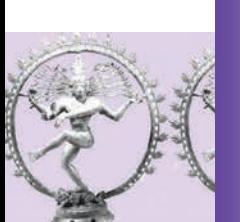

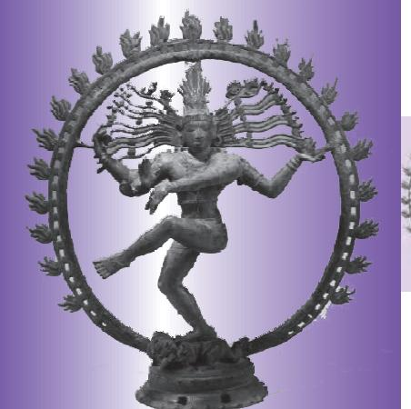

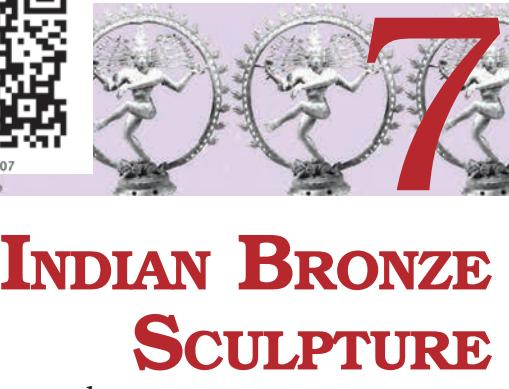

I NDIAN sculptors had mastered the bronze medium and the casting process as much as they had mastered terracotta sculpture and carving in stone. The *cire-perdu* or 'lost-wax' process for casting was learnt as long ago as the Indus Valley Culture. Along with it was discovered the process of making alloy of metals by mixing copper, zinc and tin which is called bronze.

Bronze sculptures and statuettes of Buddhist, Hindu and Jain icons have been discovered from many regions of India dating from the second century until the sixteenth century. Most of these were used for ritual worship and are characterised by exquisite beauty and aesthetic appeal. At the same time the metal-casting process continued to be utilised for making articles for various purposes of daily use, such as utensils for cooking, eating, drinking, etc. Present-day tribal communities also utilise the 'lost-wax' process for their art expressions.

Perhaps the 'Dancing Girl' from Mohenjodaro is the earliest bronze sculpture datable to 2500 BCE. The limbs and torso of this female figurine are simplified in tubular form. A similar group of bronze statuettes have been discovered from archaeological excavation at Daimabad (Maharashtra) datable to 1500 BCE. Significant is the 'Chariot', the wheels of which are represented in simple circular shapes while the driver or human rider has been elongated, and the bulls in the forefront are modelled in sturdy forms.

Interesting images of Jain *tirthankaras* have been discovered from Chausa, Bihar, belonging to the Kushana Period during second century CE. These bronzes show how the Indian sculptors had mastered the modelling of masculine human physique and simplified muscles. Remarkable is the depiction of Adinath or Vrishabhnath, who is identified with long hairlocks dropping to his shoulders. Otherwise the *tirthankaras* are noted by their short curly hair.

Gujarat and Rajasthan have been strongholds of Jainism since early times. A famous hoard of Jain bronzes was found at Akota, on the outskirts of Baroda, dated between

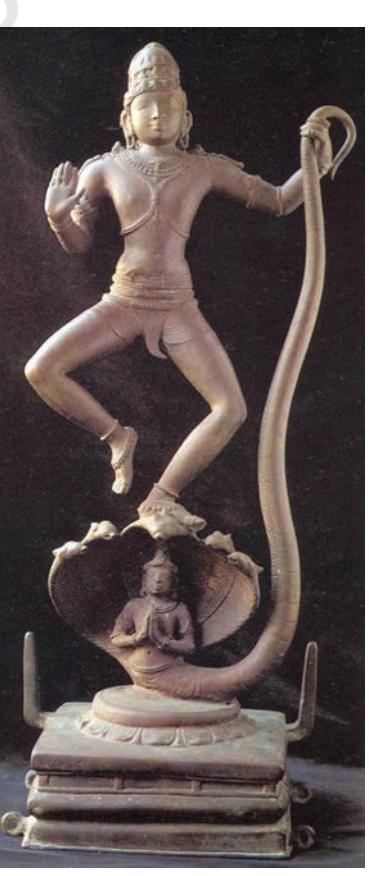

*Kaliyadaman, Chola bronze, Tamil Nadu*

the end of the fifth and the end of the seventh century CE. Finely cast through the lost-wax process, these bronzes were often subsequently inlaid with silver and copper to bring out the eyes, crowns and details of the textiles on which the figures were seated. Many famous Jain bronzes from Chausa in Bihar are now kept in the Patna Museum. Many Jain bronzes from Hansi in Haryana and from various sites in Tamil Nadu and Karnataka are kept in various museums in India.

The hoard of bronzes discovered in Akota near Vadodara established that bronze casting was practised in Gujarat or western India between the sixth and ninth centuries. Most of the images represent the Jain *tirthankaras* like Mahavira, Parshvanath or Adinath. A new format was invented in which *tirthankaras* are seated on a throne; they can be single or combined in a group of three or in a group of twenty-four *tirthankaras*. Female images were also cast representing *yakshinis* or *Shasanadevis* of some prominent *tirthankaras*. Stylistically, they were influenced by the features of both the Gupta and the Vakataka period bronzes. Chakreshvari is the *Shasanadevi* of Adinath and Ambika is of Neminath.

Many standing Buddha images with right hand in *abhaya mudra* were cast in North India, particularly Uttar Pradesh and Bihar, during the Gupta and Post-Gupta periods, i.e., between the fifth, sixth and seventh centuries. The *sanghati* or the monk's robe is wrapped to cover the shoulders which turns over the right arm, while the other

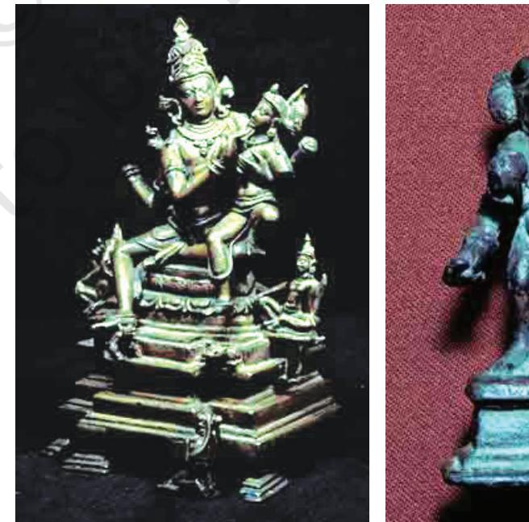

*Shiva Family, tenth century CE, Bihar*

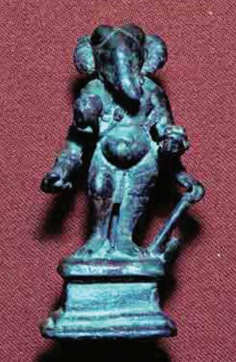

*Ganesh, seventh century CE, Kashmir*

end of the drapery is wrapped over the left arm. Eventually the pleats are held by the extended hand of the same arm. The drapery falls and spreads into a wide curve at the level of the ankles. The Buddha's figure is modelled in a subtle manner suggesting, at the same time, the thin quality of the cloth. The whole figure is treated with refinement; there is a certain delicacy in the treatment of the torso. The figure appears youthful and proportionate in comparison with the Kushana style. In the typical bronze from Dhanesar Khera, Uttar Pradesh, the folds of the drapery are treated as in the Mathura style, i.e., in a series of drooping down curves. Sarnath-style bronzes have foldless drapery. The outstanding example is that of the Buddha image at Sultanganj, Bihar, which is quite a monumental bronze figure. The typical refined style of these bronzes is the hallmark of the classical quality.

Vakataka bronze images of the Buddha from Phophnar, Maharashtra, are contemporary with the Gupta period bronzes. They show the influence of the Amaravati style of

## The Lost-wax Process

The lost-wax process is a technique used for making objects of metal, especially in Himachal Pradesh, Odisha, Bihar, Madhya Pradesh and West Bengal. In each region, a slightly different technique is used.

The lost-wax process involves several different steps. First a wax model of the image is made by hand of pure beeswax that has first been melted over an open fire, and then strained through a fine cloth into a basin of cold water. Here it resolidifies immediately. It is then pressed through a *pichki* or *pharni* which squeezes the wax into noodle-like shape. These wax wires are then wound around to the shape of the entire image.

The image is now covered with a thick coating of paste, made of equal parts of clay, sand and cow-dung. Into an opening on one side, a clay pot is fixed. In this molten metal is poured. The weight of the metal to be used is ten times that of wax. (The wax

is weighed before starting the entire process.) This metal is largely scrap metal from broken pots and pans. While the molten metal is poured in the clay pot, the clay-plastered model is exposed to firing. As the wax inside melts, the metal flows down the channel and takes on the shape of the wax image. The firing process is carried out almost like a religious ritual and all the steps take place in dead silence. The image is later chiselled with files to smoothen it and give it a finish. Casting a bronze image is a painstaking task and demands a high degree of skill. Sometimes an alloy of five metals gold, silver, copper, brass and lead — is used to cast bronze images.

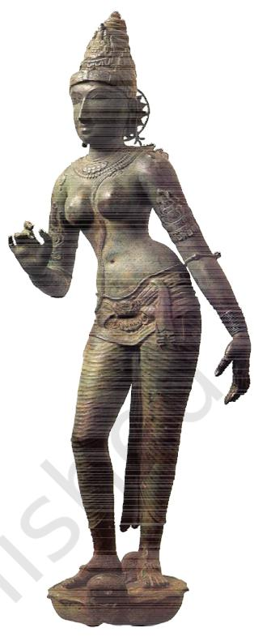

*Devi, Chola bronze, Tamil Nadu*

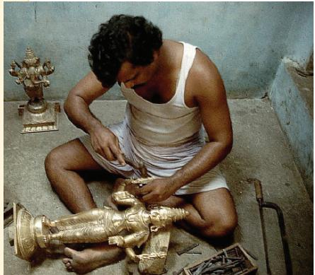

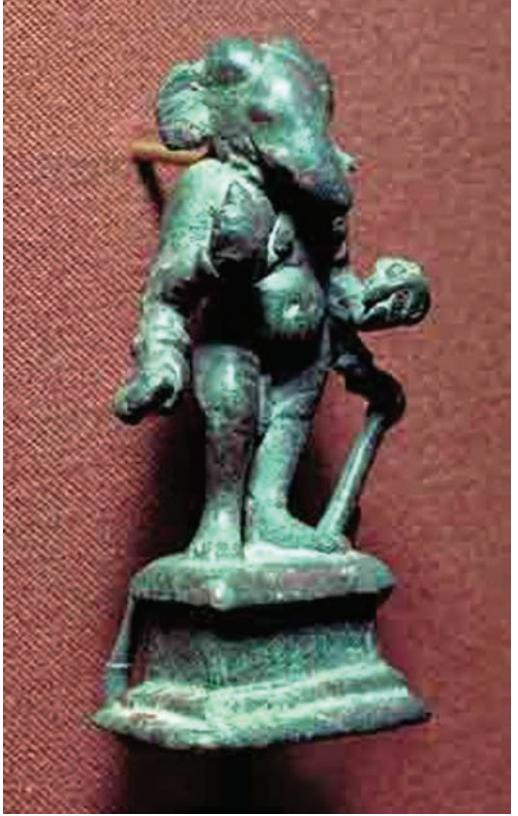

*Ganesh, Kashmir, seventh century CE*

Andhra Pradesh in the third century CE and at the same time there is a significant change in the draping style of the monk's robe. Buddha's right hand in *abhaya mudra* is free so that the drapery clings to the right side of the body contour. The result is a continuous flowing line on this side of the figure. At the level of the ankles of the Buddha figure the drapery makes a conspicuous curvilinear turn, as it is held by the left hand.

The additional importance of the Gupta and Vakataka bronzes is that they were portable and monks carried them from place to place for the purpose of individual worship or to be installed in Buddhist *viharas*. In this manner the refined classical style spread to different parts of India and to Asian countries overseas.

Himachal Pradesh and Kashmir regions also produced bronze images of Buddhist deities as well as Hindu gods and goddesses. Most of these were created during the eighth, ninth and tenth centuries and have a very distinct style in comparison with bronzes from other parts of India.

A noteworthy development is the growth of different types of iconography of Vishnu images. Four-headed Vishnu, also known as *Chaturanana* or *Vaikuntha Vishnu,* was worshipped in these regions. While the central face represents Vasudeva,

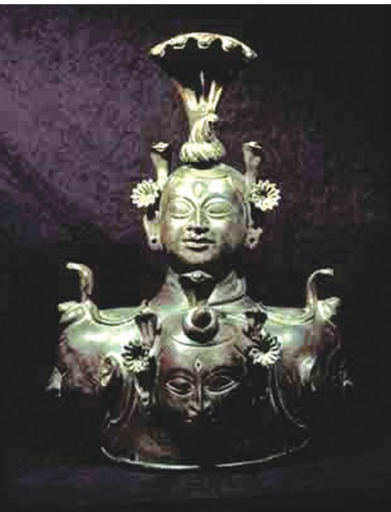

*Bronze sculpture, Himachal Pradesh* the other two faces are that of Narasimha and Varaha. The Narasimha *avatar* and Mahishasuramardini Durga images of Himachal Pradesh are among the very dynamic bronzes from that region.

In Buddhist centres like Nalanda, a school of bronzecasting emerged around the ninth century during the rule of the Pala Dynasty in Bihar and Bengal regions. In the gap of a few centuries the sculptors at Kurkihar near Nalanda were able to revive the classical style of the Gupta period. A remarkable bronze is of a four-armed Avalokitesvara, which is a good example of a male figure in graceful *tribhanga* posture. Worship of female goddesses was adopted which is part of the growth of the Vajrayana phase in Buddhism. Images of Tara became very popular. Seated on a throne, she is accompanied by a growing curvilinear lotus stalk and her right hand is in the *abhaya mudra*.

The bronze casting technique and making of bronze images of traditional icons reached a high stage of development in South India during the medieval period. Although bronze images were modelled and cast during the Pallava Period in the eighth and ninth centuries, some of the most beautiful and exquisite statues were produced during the Chola Period in Tamil Nadu from the tenth to the twelfth century. The technique and art of fashioning bronze images is still skillfully practised in South India, particularly in Kumbakonam. The distinguished patron

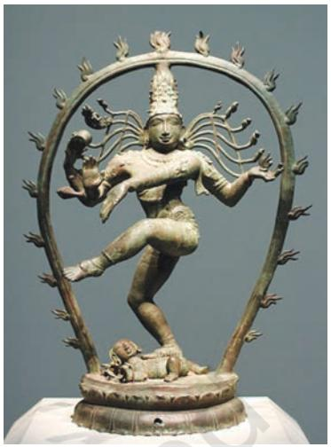

*Nataraja, Chola period, twelfth century CE*

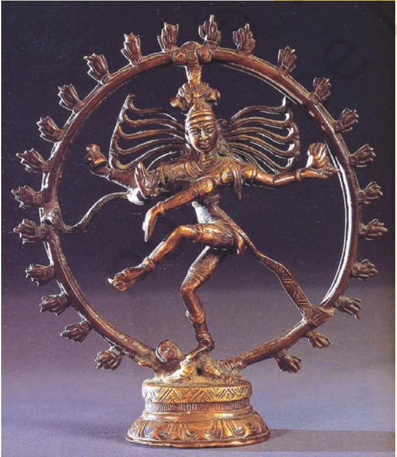

## Nataraja

Shiva is associated with the end of the cosmic world with which this dancing position is associated.

In this Chola period bronze sculpture he has been shown balancing himself on his right leg and suppressing the *apasmara,* the demon of ignorance or forgetfulness, with the foot of the same leg. At the same time he raises his left leg in *bhujangatrasita* stance, which represents *tirobhava*, that is kicking away the veil of *maya* or illusion from the devotee's mind. His four arms are outstretched and the main right hand is posed in *abhaya hasta* or the gesture suggesting. The upper right holds the *damaru* his favourite musical instrument to keep on the beat *tala*. The upper left hand carries a flame while the main left hand is held in *dola hasta* and connects with the *abhaya hasta* of the right hand. His hair locks fly on both the sides touching the circular *jvala mala* or the garland of flames which surrounds the entire dancing figuration.

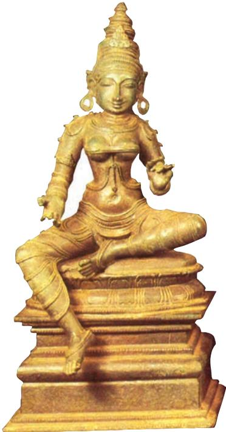

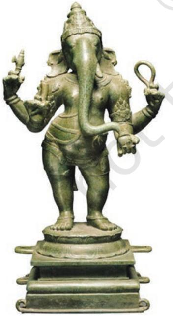

during the tenth century was the widowed Chola queen, Sembiyan Maha Devi. Chola bronzes are the most soughtafter collectors' items by art lovers all over the world.

Among the Pallava Period bronzes of the eighth century is the icon of Shiva seated in *ardhaparyanka asana* (one leg kept dangling). The right hand is in the *achamana mudra* gesture, suggesting that he is about to drink poison.

The well-known dancing figure of Shiva as Nataraja was evolved and fully developed during the Chola Period and since then many variations of this complex bronze image have been modelled.

A wide range of Shiva iconography was evolved in the Thanjavur (Tanjore) region of Tamil Nadu. The ninth century *kalyanasundara murti* is highly remarkable for the manner in which *Panigrahana* (ceremony of marriage) is represented by two separate statuettes. Shiva with his extended right hand accepts Parvati's (the bride's) right hand, who is depicted with a bashful expression and taking a step forward. The union of Shiva and Parvati is very ingeniously represented in the *ardhanarisvara murti* in a single image. Beautiful independent figurines of Parvati have also been modelled, standing in graceful *tribhanga* posture.

During the sixteenth century, known as the Vijayanagar Period in Andhra Pradesh, the sculptors experimented with portrait sculpture in order to preserve knowledge of the royal patron for posterity. At Tirupati, life-size standing portrait statues were cast in bronze, depicting Krishnadevaraya with his two queens, Tirumalamba and Chinnadevi. The sculptor has combined the likeness of the facial features with certain elements of idealisation. The idealisation is further observed in the manner the physical body is modelled to appear imposing as well as graceful. The standing king and queens are depicted in praying posture, that is, both hands held in the *namaskara mudra* .

## EXERCISE

- 1. Do you think that the technique of bronze casting has been a continuous process? How did it evolve over a period of time?
- 2. In India sculpturing in stone and metal happened simultaneously. In your opinion what were the similarities and differences between both technically, stylistically and functionally?
- 3. Why are Chola bronze sculptures considered as the most refined?
- 4. Search for visuals of bronze sculptures of the Buddha belonging to periods other than the Chola Period from Himachal Pradesh, Kashmir, etc.

