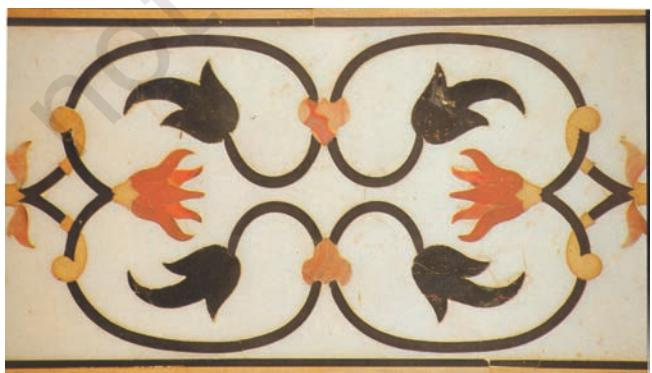
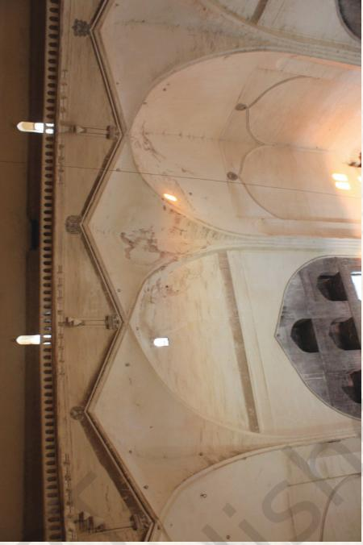

I N the seventh and eighth centuries CE, Islam spread towards Spain and India. Islam came to India, particularly, with Muslim merchants, traders, holy men and conquerors over a passage of six hundred years. Although by the eighth century CE, Muslims had begun to construct in Sind, Gujarat, etc., it was only in the early thirteenth century that large-scale building activity begun under the Delhi Sultanate, established after the Turkish conquest of northern India.

By the twelfth century, India was already familiar with monumental constructions in grandiose settings. Certain techniques and embellishments were prevalent and popular, such as trabeation (brackets, pillars and lintels) to support a flat roof or a small shallow dome. While arches were shaped in wood and stone, these were unable to bear the weight of the top structure. Now, however, the archuate form of construction was introduced gradually in which arches could support the weight of the domes. Such arches needed to be constructed with *voussoirs* (series of interlocking blocks) and fitted with keystones. The domes, resting on pendatives and squinches enabled spanning of large spaces leaving the interiors free of pillars.

A noteworthy aspect of these migrations and conquests was that Muslims absorbed many features of local cultures and traditions and combined them with their own architectural practices. Thus, in the field of architecture, a mix of many structural techniques, stylised shapes, and surface decorations came about through constant interventions of acceptance, rejection or modification of architectural elements. These architectural entities or categories showcasing multiple styles are known as Indo-Saracenic or Indo-Islamic architecture.

Hindus conceived manifestations of god everywhere in multiple forms as part of their religious faith, whereas, Muslims thought of only one with Muhammad as their Prophet. Hence, Hindus adorned all surfaces with sculptures and paintings. Muslims, forbidden to replicate living forms on any surface, developed their religious art and architecture consisting of the arts of arabesque, geometrical patterns and calligraphy on plaster and stone.

*Qutub Minar, Delhi*

#### TYPOLOGIES OF STRUCTURES

Keeping in mind religious and secular necessities, architectural building like mosques for daily prayers, the Jama Masjids, tombs, *dargahs, minars, hammams*, formally laid out gardens, madrasas, *sarais* or caravansarais, *Kos minars*, etc., were constructed over a period of time. These were thus additions in the existing types of buildings in the sub-continent.

Architectural edifices in the Indian sub-continent, as elsewhere in the world, were constructed by wealthy people. They were, in descending order, rulers and nobles and their families, merchants, merchant guilds, rural elite and devotees of a cult. In spite of the obvious Saracenic, Persian and Turkish influences, Indo-Islamic structures were heavily influenced by prevailing sensibilities of Indian architectural and decorative forms. A lot depended on the availability of materials, limitations of resources and skills and the sense of aesthetics of the patrons. Although religion and religiosity were very important to people of medieval India, as elsewhere, they borrowed architectural elements liberally.

#### CATEGORIES OF STYLES

The study of Indo-Islamic architecture is conventionally categorised into the Imperial Style (Delhi Sultanate), the Provincial Style (Mandu, Gujarat, Bengal, and Jaunpur), the Mughal Style (Delhi, Agra, and Lahore) and the Deccani Style (Bijapur, Golconda). These categories help in understanding better the specificities of architectural styles rather than putting them in immutable slots.

*Intricate jali work, Amer Fort, Jaipur*

#### ARCHITECTURAL INFLUENCES

Amongst provincial styles, the architecture of Bengal and Jaunpur is regarded as distinct. Gujarat was said to have a markedly regional character for patrons borrowed elements from regional temple traditions such as *toranas*, lintels in *mihrabs*, carvings of bell and chain motifs, and carved panels depicting trees, for tombs, mosques and *dargahs*. The fifteenth century white marble *dargah* of Shaikh Ahmad Khattu of Sarkhej is a good example of provincial style and it heavily influenced the form and decoration of Mughal tombs.

#### DECORATIVE FORMS

These forms included designing on plaster through incision or stucco. The designs were either left plain or covered with colours. Motifs were also painted on or carved in stone. These motifs included varieties of flowers, both from the sub-continent and places outside, particularly Iran. The lotus bud fringe was used to great advantage in the inner curves of the arches. Walls were also decorated with cypress, *chinar* and other trees as also with flower vases. Many complex designs of flower motifs decorating the ceilings were also to be found on textiles and carpets. In the fourteenth, fifteenth and sixteenth centuries tiles were also used to surface the walls and the domes. Popular colours were blue, turquoise, green and yellow. Subsequently the techniques of tessellation (mosaic designs) and *pietra dura* were made use of for surface decoration particularly in the dado panels of the walls. At times *lapis lazuli* was used in the interior walls or on canopies. Other decorations included arabesque, calligraphy and high and low relief carving and a profuse use of *jalis*. The high relief carving has a three- dimensional look. The arches were plain and squat and sometimes high and pointed. From the sixteenth century onwards arches were designed with trefoil or multiple foliations. Spandrels of the arches were decorated with medallions or bosses. The roof was a mix of the central dome and other smaller domes, *chatris* and tiny minarets. The central dome was topped with an inverted lotus flower motif and a metal or stone pinnacle.

*Dado panel on the wall, Agra*

<i>Pietra dura work, Agra

#### MATERIALS FOR CONSTRUCTION

The walls in all buildings were extremely thick and were largely constructed of rubble masonary, which was easily available. These walls were then cased over with *chunam* or limestone plaster or dressed stone. An amazing range of stones were utilised for construction such as quartzite, sandstone, buff, marble, etc. Polychrome tiles were used to great advantage to finish the walls. From the beginning of the seventeenth century, bricks were also used for construction and these imparted greater flexibility to the structures. In this phase there was more reliance on local materials.

#### FORTS

Building monumental forts with embattlements was a regular feature in medieval times, often symbolising the seat of power of a king. When such a fort was captured by an attacking army the vanquished ruler either lost his complete power or his sovereignty. This was because he had to accept the suzerainty of the victorious king. Some examples of strong, complex edifices which still exercise the imagination of the visitor are the forts of Chittor, Gwalior, Daulatabad, earlier known as Devgiri and Golconda.

Commanding heights were utilised to great advantage to construct forts. These heights gave a good perspective of the region, strategic advantage for security, unfettered and unhindered space to make residential and official complexes while simultaneously creating a sense of awe in the people. Other complexities woven into such topography were concentric circles

*Daulatabad Fort*

*Gwalior Fort*

of outer walls as in Golconda, so that the enemy had to breach these at all stages before getting in.

Daulatabad had several strategic devices to confound the enemy, such as staggered entrances so that gates could not be opened even with the help of elephants. It also had twin forts, one within the other but at a higher elevation and accessed by a complex defence design arrangement. One wrong turn in the labyrinth or complex pathway could lead to the enemy soldier going in circles or falling to his death several hundred feet below.

The Gwalior Fort was invincible because its steep height made it impossible to scale. It had many habitations and usages. Babur, who did not find much merit in many things he saw in Hindustan, was said to have been overawed at the sight of the Gwalior Fort. Chittorgarh bears the distinction of being the largest fort in Asia and was occupied for the longest length of time as the seat of power. It has many types of buildings including *stambhas* or towers to signify victory and bravery. It was replete with numerous water bodies. Innumerable acts of heroism have been associated with the principal people in the fort, forming the substance of many a legend. An interesting aspect associated with forts is that within the palace complexes stylistic and decorative influences were absorbed most liberally.

### MINARS

Another form of *stambha* or tower was the *minar*, a common feature in the sub-continent. Two most striking minars of medieval times are the Qutub Minar in Delhi and the Chand Minar at Daulatabad

Fort. The everyday use of the *minar* was for the *azaan* or call to prayer. Its phenomenal height, however, symbolised the might and power of the ruler. The Qutub Minar also came to be associated with the much revered saint of Delhi, Khwaja Qutbuddin Bakhtiyar Kaki.

The Qutub Minar, built in the thirteenth century, is a 234-feet-high tapering tower divided into five storeys. The *minar* is a mix of polygonal and circular shapes. It is largely built of red and buff sandstone with some use of marble in the upper storeys. It is characterised by highly decorated balconies and bands of inscriptions intertwined with foliated designs.

Chand Minar, built in the fifteenth century, is a 210- feet-high tapering tower divided into four storeys. Painted peach now, its façade once boasted of chevron patterning on the encaustic tile work and bold bands of Quranic verses. Although it looked like an Iranian monument, it

*Chand Minar, Daulatabad*

was the combined handiwork of local architects with those from Delhi and Iran.

### TOMBS

Monumental structures over graves of rulers and royalty was a popular feature of medieval India. Some well-known examples of such tombs are those of Ghyasuddin Tughlaq, Humayun, Abdur Rahim Khan-i-Khanan in Delhi, Akbar and Itmaduddaula in Agra. According to Anthony Welch, the idea behind the tomb was eternal paradise as a reward for the true believer on the Day of Judgement. This led to the paradisiacal imagery for tomb

*Tomb of Itmaduddaula,*

construction. Beginning with the introduction of Quranic verses on the walls, the tomb was, subsequently, placed within paradisiacal elements such as a garden or near a body of water or both, as is in the case of the Humayun's tomb and the Taj Mahal, which follows the *charbagh* style. Surely though, such vast expanses of structured and stylised spaces could not have been intended only to signify peace and happiness in the next world but to also showcase the majesty, grandeur and might of the person buried there.

#### SARAIS

A hugely interesting feature of medieval India was the *sarais* which ringed cities and dotted the vast space of the Indian subcontinent. *Sarais* were largely built on a simple square or rectangular plan and were meant to provide temporary accommodation to Indian and foreign travellers, pilgrims, merchants, traders, etc. In effect, *sarais* were public domains which thronged with people of varied cultural backgrounds. This led to cross-cultural interaction, influences and syncretic tendencies in the cultural mores of the times and at the level of the people.

#### STRUCTURES FOR COMMON PEOPLE

One of the architectural features of medieval India was also a coming together of styles, techniques and decorations in public and private spaces of non-royal sections of the society. These included buildings for domestic usage, temples, mosques, *khanqahs* (hermitage of Sufi saints) and *dargahs*, commemorative gateways, pavilions in buildings and gardens, bazaars, etc.

MANDU

The city of Mandu is located sixty miles from Indore, at an elevation of over 2000 feet and overlooks the Malwa Plateau to the north and the Narmada valley to the south. Mandu's natural defence encouraged consistent habitations by Parmara Rajputs, Afghans and Mughals. As the capital city of Ghauri Dynasty (1401–1561) founded by Hoshang Shah it acquired a lot of fame. Subsequently, Mandu was associated with the romance of Sultan Baz Bahadur and Rani Rupmati. The Mughals resorted to it for pleasure during the monsoon season.

Mandu is a typical respresentation of the medieval provincial style of art and architecture. It was a complex mix of official and residential-cum-pleasure palace, pavilions, mosques, artificial reservoirs, *baolis*, embattlements, etc. In spite of the size or monumentality, the structures were very close to nature, designed in the style of arched pavilions, light and airy, so that these buildings did not retain heat. Local stone and marble were used to great advantage. Mandu is a fine example of architectural adaptation to the environment.

 The Royal Enclave located in the city comprised the most complete and romantic

set of buildings, a cluster of palaces and attendant structures, official and residential, built around two artificial lakes. The Hindola Mahal looks like a railway viaduct bridge with its disproportionately large buttresses supporting the walls. This was the audience hall of the Sultan and also the place where he showed himself to his subjects. Batter was used very effectively to give an impression of swinging (*Hindola*) walls.

Jahaaz Mahal is an elegant two-storey 'ship- palace' between two reservoirs, with open pavilions, balconies overhanging the water and a terrace. Built by Sultan Ghiyasuddin Khilji it was possibly used as his harem and as the ultimate pleasure and recreational resort. It had a complex

*Hoshang Shah's tomb*

*Hindola Mahal*

*Jahaaz Mahal , Mandu*

arrangement of watercourses and a terrace swimming pool.

Rani Rupmati's double pavilion perched on the southern embattlements afforded a beautiful view of the Narmada valley. Baz Bahadur's palace had a wide courtyard ringed with halls and terraces.

A *madrasa* called Asharfi Mahal now lies in ruins. Hoshang Shah's tomb is a majestic structure with a beautiful dome, marble *jali* work, porticos, courts and towers. It is regarded as an example of the robustness of Afghan structures, but its lattice work, carved brackets and *toranas* lend it a softer hue.

The *Jama Masjid* of Mandu was built on a large scale to accommodate many worshippers for Friday prayers. It is entered through a monumental gateway, topped with a squat dome, beyond which lies an open courtyard flanked with columned cloisters on three sides, also topped with smaller domes. The building is faced with red sandstone. The *mimbar* in the *Qibla Liwan* is supported on carved brackets and the *mihrab* has a lotus bud fringe.

Provincial style architecture of Mandu is regarded as too close to the structures of Imperial Delhi to make a bold statement of local traditions. Nevertheless, the so-called robust, austere Pathan architecture of Mandu with its surface embellishments of *jalis*, carved brackets, etc., and the lightness of the structures was an important intervention in the narrative of the Indo-Islamic architectural experience.

*Jama Masjid, Mandu*

# TAJ MAHAL

*From 1632 onwards it took nearly twenty years and 20,000 specialised workers to complete this monument.*

Taj Mahal was built in Agra by Shah Jahan as a mausoleum for his deceased wife Mumtaz Mahal. Taj Mahal was the apogee of the evolutionary architectural process in medieval India.

The sublimity of the building comes from its orderly, simple plan and elevation, amazingly perfect proportions or symmetry, the ethereal quality marble has lent to it, the perfect setting of *bagh* and river and the pure outline of the tomb silhouetted against the sky. The patina the Taj has lends it a different hue at various times of day and night.

The Taj complex is entered through a monumental red sandstone gateway the opening arch of which beautifully frames the mausoleum. The tomb is laid out in a Chahar Bagh, criss-crossed with paths and water courses, interspersed with pools and fountains. The structure is placed on the northern extremity of the *bagh* instead of the middle to take advantage of the river bank.

A straight path through the *bagh* reaches the plinth of the tomb from where is accessed the floor terrace of the edifice. At the corners of the terrace stand four tall, tapering minarets, one hundred and thirtytwo feet high. The main body of the building is topped with a drum and dome and four cupolas forming a beautiful skyline. The plinth, the walls of the structure and the drum-dome are in perfect proportion to one another. Towards the west of the white marble-faced tomb lies a red sandstone mosque and a similar construction in the east to maintain balance. Marble for the building was quarried from the Makrana mines in Rajasthan and this white edifice is contrasted with the red sandstone of the surrounding structures.

The tomb structure is a square with chamfers forming eight sides, recessed with deep arches. This structural stylisation produces in the elevation of the building a variety of contrasting planes and shade and solids and voids effects. All sides of the building, the twin elevations of floor to roof and roof to pinnacle, atop the foliated crest of the dome, measure 186 feet each.

The interior arrangements of the mausoleum consist of a crypt below and a vaulted, octagonal tomb chamber above, with a room at each angle, all connected with corridors. Light to every part of the building is obtained by means of carved and perforated *jalis*, set in the arched recesses of the interior. The ceiling is as high as the façade creating a void with the help of a double dome.

Four types of embellishments have been used with great effect for the interior and exterior surfaces of the Taj Mahal. These are stone carvings in high and low relief on the walls, the delicate carving of marble into *jalis* and graceful volutes (spiral ornament on the pillar), and the creation of arabesques with pietra dura (yellow marble, jade and jasper) on walls and tombstones and geometric designs with tessellation. Lastly, the art of calligraphy is used with the inlay of jasper in white marble to write Quranic verses. Calligraphy provided a decorative element on the walls and a continuous connection with the Almighty.

Gumbad is situated in Bijapur in the Bijapur District of Karnataka. It is the mausoleum of Muhammad Adil Shah (1626–1656), the seventh Sultan of the Adil Shahi Dynasty of Bijapur (1489–1686). Built by the ruler himself, it is a striking edifice in spite of being unfinished. The tomb is a complex of buildings such as a gateway, a *Naqqar Khana*, a mosque and a *sarai* located within a large-walled garden.

The Gumbad is a monumental square building topped with a circular drum over which rests a majestic dome, giving the building its nomenclature. It is built of dark gray basalt and decorated plasterwork. Each wall of the tomb is one hundred and thirty-five feet long and one hundred and ten feet high and ten feet thick. With the drum and the dome, the building rises to a height of over two hundred feet. The tomb has only one square chamber and the dome, with a diameter of one hundred and twenty-five feet, it covers an uninterrupted floor space of 18,337 square feet, the second largest in the world.

 The tomb chamber contains the burial place of the Sultan, his wives and other relatives, while their real graves lie perpendicularly below in a vault, accessed

*Drum of the Dome*

by stairs. The hemispherical masonry dome over a square base was constructed with the help of pendentives. These pendentives not only lent shape to the dome but also transferred its weight to the walls below. New vaulting systems consisting of arch-nets or stellateforms in squinches were created to cover angles formed by intersecting arches.

 The building has an amazing acoustical system. Along the drum of the dome there is a whispering gallery where sounds get magnified and echoed many times over.

 At the four corners of the building are seven-storeyed octagonal spires or minaret-like towers. These towers house staircases leading to the top dome. The drum of the dome is decorated with foliation. A heavily bracketed cornice resting on corbels is a distinctive feature of the facade.

 Gol Gumbad is a fine convergence of many styles located in medieval India. Monumentality, majesty and grandeur, integral aspects of the architectural experience in India, are associated with buildings of Bijapur. While its structural particularities of dome, arches, geometric proportions and load bearing techniques suggest Timurid and Persian styles, it is made of local material and is decorated with surface embellishments popular in the Deccan. Four towers at the corners are reminiscent of turrets attached to mosques such as Qila-i Kuhna Masjid and the Purana Qila in Delhi.

*Whisper Gallery*

*Jama Masjid, Delhi*

#### JAMA MASJID

Large mosques, spanning huge spaces, also dotted the landscape of the Indian sub-continent in medieval times. Congregational prayers were held here every Friday afternoon which required the presence of a minimum of forty Muslim male adults. At the time of prayers (on Fridays) a *Khutba* was read out in the name of the ruler and his laws for the realm were also read out. In medieval times, a city had one Jama Masjid, which along with its immediate surroundings became the

focus of the lives of the people, both Muslim and non-Muslim. This happened because a lot of commercial and cultural exchanges were concentrated here besides religious and indirect political activity. Generally, such a mosque was large with an open courtyard, surrounded on three sides by cloisters and the *Qibla Liwan* in the west. It was here that the *mihrab* and the *mimbar* for the *Imam* were located. People faced the *mihrab* while offering prayers as it indicated the direction of the *Kaaba* in Mecca.

## EXERCISE

- 1. What do you understand by the term 'Indo-Islamic' or 'Indo-Saracenic' architecture? Can you think of another nomenclature? How did this architecture evolve in India?
- 2. What types of buildings were added in India in the thirteenth century?
- 3. Name four styles of Indo-Islamic architecture.
- 4. What was the significance of a fort in medieval India? What were the strategic devices adopted in the construction of forts to confuse or defeat the enemy?
- 5. Which forms of secular architecture evolved during medieval times? What significance did these buildings have in the sociocultural lives of contemporary people?
- 6. How does Mandu showcase the fact that humans adapt to their environment?
- 7. In spite of being unfinished how does Gol Gumbad symbolise the grandeur and majesty of Indo-Islamic architecture?
- 8. Which are the places where the dead are buried? How do these differ from each other?
- 9. Why is the word 'perfection' associated with the Taj Mahal?

| Agate | A fine-grained variegated chalcedony, its |
| --- | --- |
|  | colours arranged in stripes, blended in clouds, |
|  | or showing moss like forms |
| Amalaka | Ribbed, lenticular or globoid part resembling the |
|  | amala (Indian gooseberry fruit) crowning the top |
|  | of the North Indian style shikhara |
| Anda | Semi-circular structure typically used for |
|  | Buddhist stupa |
| Arabesque | An ornamental design consisting of intertwined |
|  | flowing lines, leaves and flowers, a feature of |
|  | the Indo-Islamic architecture |
| Ardhmandap | Semi-hall in front of garbhagriha of the temple |
| Ashtadikpalas | Guardians of the eight directions |
| Ayudhas | Weapons |
| Batter | Slope in the wall |
| Bodhisattva | In Buddhism, Bodhisattva refers to the previous |
|  | births of Gautam Buddha |
| Bosses | Circular embossed decorations, usually in stone |
|  | of contrasting colours located on either side of |
|  | an arch and within the spandrels |
| Buddhism | A religion originated in the sixteenth century |
|  | BCE with the preachings of Buddha |
| Burin | A pointed tool of flint or stone with a transverse |
|  | edge made by the removal of one or more flakes. |
|  | Used for working bone, antler and ivory, and, |
|  | perhaps, for engraving |
| CE | Common Era, replacing AD or Anno Domini |
|  | (Era of the Lord) |
| Calligraphy | The art of producing decorative handwriting |
| Caturasra | Square |
| Chhatra | Umbrella-like structure on top of the stupa |
| Chhatri | Cupola resting on four pillars with a dome or |
|  | pyramid-shaped roof |
| Chahar Bagh | A square, walled garden divided into four by |
|  | intersecting water channels |
| Chaitya Arch | Semi-circular arch with pointed tip in the centre |
|  | towards the top |
| Chaitya | Place of congregation and worship |
| Chakra | Wheel, a symbol used for Buddha's first sermon |
|  | at Sarnath |
| Chamfer | To cut off the edge or corner, thereby, increasing |
|  | the number of sides |

## GLOSSARY

#### GLOSSARY 127

| Chert | A flint-like material, usually black or dark |
| --- | --- |
|  | brown in colour. Although it has a conchoidal |
|  | fracture like flint it is not so fine-textured |
| Chevron Patterning | V-shaped patterns |
| Corbel | The stone or wooden bracket laid horizontally |
|  | to support a cornice or an arch |
| Cornice | A moulded roof-line |
| Crystal | A high quality, clear, colourless glass or an |
|  | object, especially a vessel or ornament, made |
|  | of such glass |
| Dado panel | Lower part of the interior wall when it is finished |
|  | differently from the rest of the wall. Some |
|  | excellent examples are Hoyasal temples of |
|  | Halebid, Jamali Kamali tomb in Mehrauli and |
|  | Turkish Sultan's palace in Fatehpur Sikri, Agra |
| Dargah | Shrine of a Sufi saint, where the saint's grave |
|  | called mazar is located |
| Dhammachakrapravartan | First sermon by Buddha at Sarnath near |
|  | Varanasi |
| Dravid | Normally used for people, culture, language and |
|  | architectural style of South India |
| Dressed stone | Stone which is cut to size and polished |
| Encaustic tile work | Inlay in ceramics |
| Faience | Blue-coloured artificial glass-like material. |
|  | Faience was used in a variety of ornaments and |
|  | pieces of jewellery |
| Gahapati | Big land-owner or big farmer involved in farming |
|  | and trade |
| Garbhgriha | Sanctum sanctorum |
| Gopuram | Main gateway; the storeyed structure over the |
|  | entrance or entrances through the enclosing |
|  | walls to the premises of a temple |
| Harmika | Small square fencing atop the anda or |
|  | semi-circular dome of stupa |
| Imam | The person who leads a Muslim congregation |
|  | in prayers. Over a passage of time, this position |
|  | became hereditary |
| Intaglio | The process of cutting a design into the surface |
|  | of a small hard stone or gem |
| Jagmohan | Rectangular or square hall in front of a |
|  | sanctuary or main temple — a term used for |
|  | temple architecture of Odisha |
| Jainism | One of the most ancient religions, it is a path of |
|  | victory (jina) over life's stream of rebirths |
|  | through ethical and spiritual practices. |

| Jali | Ornamental, perforated lattice screens with |
| --- | --- |
|  | arabesques, star motifs and other geometric |
|  | designs such as pentagons, hexagons, octagons |
|  | and circles |
| Jasper | A variety of quartz that may be red, yellow or |
|  | brown; long used for jewellery and |
|  | ornamentation |
| Jataka | Stories of the previous births of Buddha |
| Jati | Caste |
| Kalash | Wide-mouthed pot; ornamental pot-design |
|  | decorating the shikhara of a temple |
| Keystone | A central stone at the summit of an arch |
| Kos minar | Distance marker or milestone in the shape and |
|  | size of a tower |
| Kuta | A shrine of square plan |
| Lapis lazuli | A rich blue semi-precious stone. The main |
|  | source in the ancient world was the mountains |
|  | of Badakshan, northern Afghanistan, from |
|  | where it was traded widely. Lapis lazuli |
|  | was used as inlay in ornaments, jewellery, |
|  | seals, etc. |
| Linga | Phallus, the form in which Lord Shiva is being |
|  | worshipped |
| Mahamandapa | Big hall in the temple |
| Mahaparinibban | Death of Lord Buddha — liberating him from |
|  | the cycle of life and death |
| Mandap | Hall |
| Maqbara | Mausoleum or tomb |
| Medallion | Circular discs in the spandrels of arches |
|  | decorated with motifs or calligraphy |
| Mihrab | Prayer niche indicating the direction of Mecca |
| Mimbar | Stepped pulpit in the Jama Masjid or Friday |
|  | mosque from where the Khutba was read |
| Mukhlinga | Phallus with face |
| Multiple foliations | Many curves in an arch |
| Mural | Paintings made on the walls of caves, buildings |
|  | or temples in Fresco or any other style |
| Nagara | North Indian style temple architecture |
| Naqqar khana | Drum house from where ceremonial music was |
|  | played which was usually situated over the gate. |
|  | It was a popular feature in Mughal palace |
|  | complexes |
| Natyamandapa | Dancing hall in front part of the temple |
| or Rangmandapa |  |
| Panchayatana | Main temple surrounded by four sub-shrines |

in each corner

| Pendentive | A triangular bracket in the angle of two walls, |
| --- | --- |
|  | connecting the base of the dome to its |
|  | supporting arches |
| Phamsana | A buildings/ temple which tends to be broader |
|  | and shorter than Latina type |
| Pietra-dura | Pictorial mosaic work using semi-precious |
|  | stones. Found on walls, cenotaphs and marble |
|  | jalis in the Taj Mahal |
| Polychrome | An object or a work composed of or decorated in |
|  | many colours |
| Pradakshina | Circumambulation |
| Qibla Liwan | The wall of the mosque in the direction of Mecca |
| Qila-i Kuhna Masjid | Built by Humayun or Sher Shah between 1530 |
|  | and 1545, it is located inside Purana Qila in |
|  | Delhi |
| Quartz | A variety of stone found in many parts of the |
|  | world and variously used for toolmaking and in |
|  | ceremonial contexts. Varieties of quartz include |
|  | agate, chalcedony, chert, flint, opal and rock |
|  | crystal |
| Rekhaprasad or | This type of temple has square shikhar at the |
| Latina | base and its walls curve slowly inward towards |
|  | the top |
| Rupkar/Shilpi | Artisan |
| Sabha Mandapa | Assembly hall |
| Saracenic | A style of architecture popular with Muslims in |
|  | West Asia particularly from the eleventh to the |
|  | fourteenth century |
| Sarai | Dharamshala or a traveller's lodge |
| Shala ayatasara | Elliptical |
| Shikhar | Superstructure above the garbhagriha in the |
|  | north Indian style of temple |
| Shilpa texts | Ancient Indian texts/manuals describing the |
|  | elements and principles of art and architecture |
|  | to be practised by artists |
| Shraman | A Buddhist or Jain sect, whose followers used |
|  | to wander from place to place |
| Sovereignty | The authority of a ruler/state to govern himself/ |
|  | itself absolutely independently |
| Spandrels | The almost triangular space between two sides |
|  | of the outer curves of an arch and a rectangular |
|  | enclosure |
| Squinch | An arch spanning the corners of a square |
|  | chamber and acting as support for a dome |
| Steatite | A greyish or greenish stone, which is generally |
|  | soft and can easily be worked to make figurines, |
|  | vessels, seals and other objects |

| Stellate | Arch nets arranged in a radiating pattern like |
| --- | --- |
|  | that of a star |
| Sthapati | Architect |
| Stupa | A mound-like structure containing relics of |
|  | Buddha or Buddhist monks worshipped by |
|  | Buddhists |
| Stucco | A fine plaster used for coating wall surfaces |
| Suzerainty | A sovereign/state having some control over |
|  | another ruler/state who/that is internally |
|  | autonomous |
| Tablet | A regularly shaped, separate panel, or a |
|  | representation thereof, often bearing an |
|  | inscription or image |
| Terracotta | Literally, 'baked earth' mainly used to refer to |
|  | fairly coarse, porous clay that, when fired, |
|  | assumes a colour ranging from dull ochre |
|  | to red |
| Tessellation | Decoration on walls and floors with mosaic |
| Torans | Carved, serpentine-shaped ceremonial |
|  | gateways |
| Trefoil | Three curves in an arch |
| Turquoise | A semi-precious stone, sky blue to pale green |
|  | in colour, highly prized for its use in jewellery |
|  | by many ancient cultures |
| Valabhi | Sub-type of nagara temple |
| Vanga | Ancient name of the Bengal region |
| Varna | Four-fold division of the society based on |
|  | profession i.e. Brahmana, Kshatriya, Vaishya, |
|  | Shudra during ancient India |
| Vesara | Term used for the independent style of the |
|  | temple during the time of the Chalukyas of |
|  | Karnataka. It consists of a combination of the |
|  | northern (nagara) and southern (dravida) styles |
| Vihara | Place of residence of Buddhist monk |
| Vijanain | Temples having a rectangular building with a |
|  | roof that rises into a vaulted chamber |
| Viman | Superstructure over the garbhagriha of shrine |
|  | in the south Indian temples |
| Volute | A scroll or spiral ornament on a pillar |
| Voussoir | A wedge-shaped or tapered stone used to |
|  | construct an arch |
| Vritta | Circular |
| Yakshas/Yakshanis | Demi-gods and demi-goddesses — protectors of |
|  | nature and resources |

GLOSSARY 131

