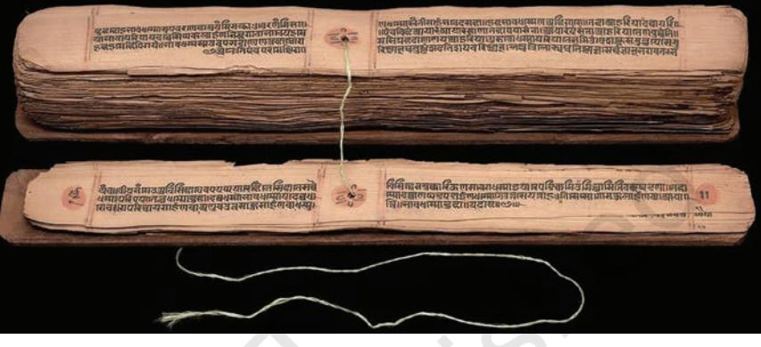
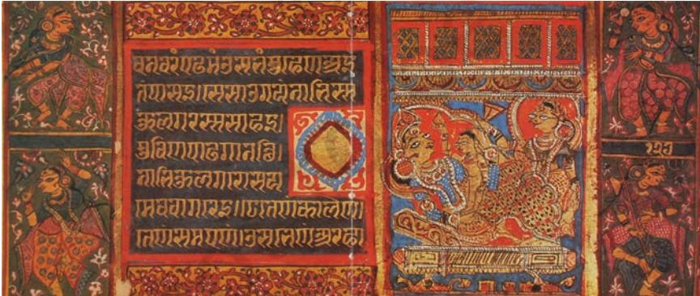
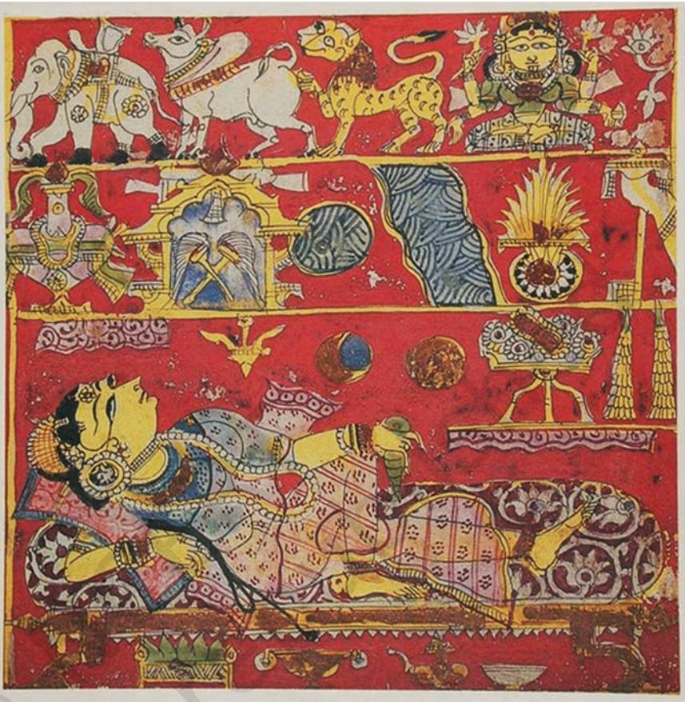
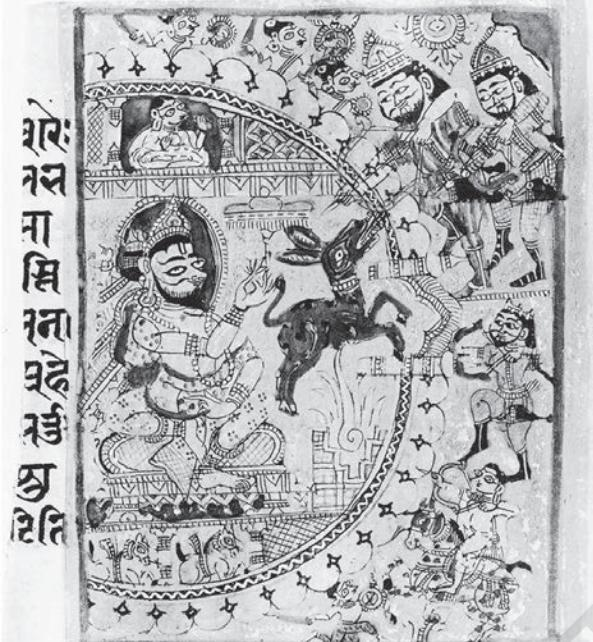
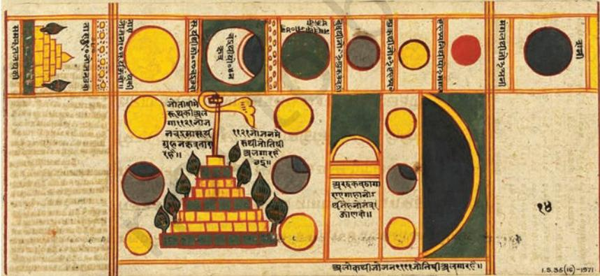
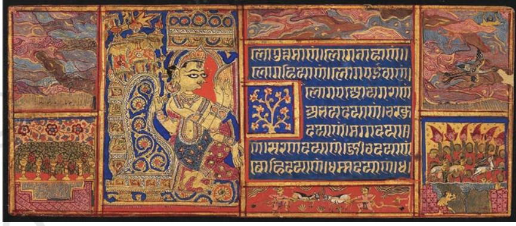
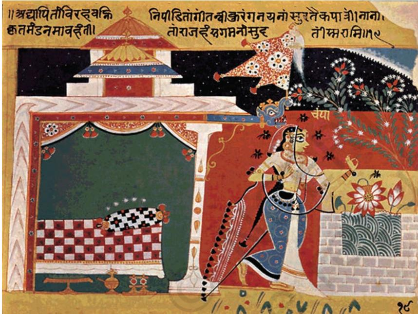
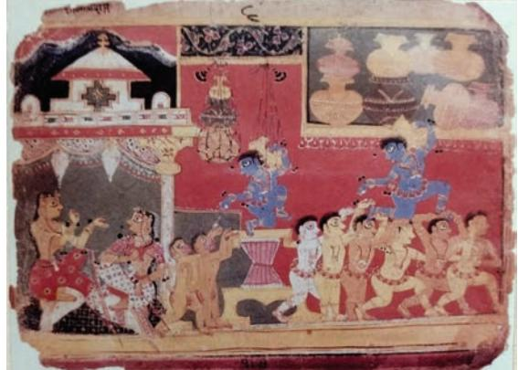
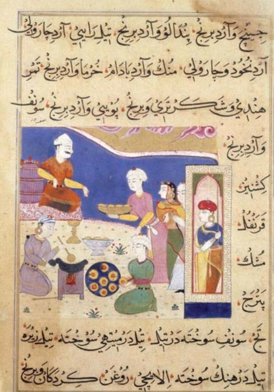
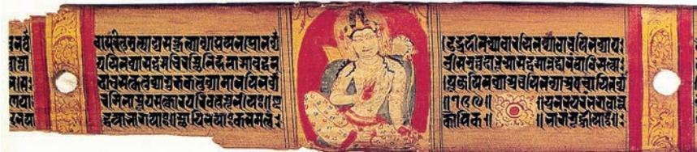

The third *Khanda* of the *Vishnudharmottara Purana*, a fifth century text has a chapter *Chitrasutra*, which should be considered as a source book of Indian art in general and painting specifically. It talks about the art of image making called *pratima lakshana*, which are canons of painting. The *Khanda* also deals with the techniques, tools, material(s), surface (wall), perception, perspective and three-dimentionality of human figures. Different limbs of painting, such as *roopbheda* or looks and appearance; *pramana* or measurments, proportion and structure; *bhava* or expressions; *lavanya yojana* or aesthetic composition; *sadrishya* or resemblance; and *varnikabhanga* or use of brush and colours have been explained at length with examples. Each of these have many sub-sections. These canons were read and understood by artists and followed through centuries, thus, becoming the basis of all styles and schools of painting in India.

Paintings from the medieval period have earned a generic name, for example miniature paintings, owing to their relatively smaller size. These miniature paintings were hand-held and observed from a closer distance due to their minutiae. The walls of a patron's mansions were often decorated with mural paintings. Hence, these miniatures were never intended to be put up on the walls.

A large section of paintings are appropriately referred to as manuscript illustrations as they are pictorial translations of poetic verses from epics and various canonical, literary, bardic or music texts (manuscripts), with verses handwritten on the topmost portion of the painting in clearly demarcated box–like space. Sometimes, one finds the text not in the front but behind the work of art.

Manuscript illustrations were methodically conceived in thematic sets (each set comprising several loose paintings or folios). Each folio of painting has its corresponding text

1_1.Manuscript Paintings.indd 1 01 Sep 2020 02:51:29 PM

inscribed either in the demarcated space on the upper portion of the painting or on its reverse. Accordingly, one would have sets of the *Ramayana* paintings, or *Bhagavata Purana*, or *Mahabharata*, or *Gita Govinda*, *Ragamala*, etc. Each set was wrapped up in a piece of cloth and stored as a bundle in the library of the king or patron.

The most important folio-page of the set would be the colophon page, which would furnish information regarding the names of the patron, artist or scribe, date and place of commission or completion of the work, and other such important details.

However, due to ravages of time, the colophon pages have often gone missing, compelling scholars to attribute missing particulars on the basis of their expertise. Being fragile pieces of artworks, paintings are susceptible to mishandling, fire, humidity, and other such calamities and disasters. Considered as precious and valuable artifacts and also being portable, paintings were often gifted to princesses as part of their dowries when they got married. They were also exchanged as gifts between kings and courtiers as acts of gratitude and traded to distant places. Paintings also travelled to remote regions with moving pilgrims, monks, adventurers, traders and professional narrators. Thus, for instance, one would find a Mewar painting with the Bundi king and vice versa.

Reconstructing the history of paintings is a phenomenal task. There are fewer dated sets compared to undated ones. When arranged chronologically, there are vacuous spells in between, where one can only speculate the kind of painting activity that could have thrived. To make matters worse, the loose folios are no longer part of their original sets and are dispersed in various museums and private collections, which

*Sravakapratikramasutra-curni of Vijayasimha Mewar, written by Kamalchandra,1260 Collection: Boston*

1_1.Manuscript Paintings.indd 2 01 Sep 2020 02:51:29 PM

keep surfacing time and again, challenging the constituted timeline and compelling scholars to modify and redefine the chronology in history. In this light, undated sets of paintings are ascribed a hypothetical timeframe on the basis of style and other circumstantial evidence.

## Western Indian School of Painting

Painting activity that thrived largely in western parts of India constitutes the Western Indian School of Painting with Gujarat as its most prominent centre, and southern parts of Rajasthan and western parts of Central India as other centres. With the presence of some significant ports in Gujarat, there was a network of trade routes passing through these areas, especially, making merchants, traders and local chieftains powerful patrons of art due to the wealth and prosperity that trading brought in. The merchant class, largely represented by the Jain community, led to become significant patrons of themes related to Jainism. Hence, part of the Western Indian School that depicts Jain themes and manuscripts is known as the Jain School of Painting.

Jain painting also received impetus because the concept of *shaastradaan* (donation of books) gained favour amidst the community, where the act of donating illustrated paintings to the monastery's libraries called *bhandars* (repositories) was glorified as a gesture of charity, righteousness and gratitude.

Among the most widely illustrated canonical text in the Jain tradition is *Kalpasutra*. It has a section, reciting events from the lives of the 24 Tirthankaras—from their births to salvation—that provides a biographical narrative for artists to paint. The five key incidents roughly elaborated as—conception, birth, renunciation, enlightenment and first sermon, and salvation from the lives of Tirthankaras and *Birth of Mahavir, Kalpasutra, fifteenth century, Jain Bhandar, Rajasthan*

1_1.Manuscript Paintings.indd 3 01 Sep 2020 02:51:29 PM

Mahavir's mother Trishala dreams about 14 objects when she conceives Mahavir. They are an elephant, a bull, a tiger, goddess Shri, a *kalash*, a palanquin, a pond, a rivulet, fire, banners, garlands, heap of jewels, the Sun and the moon. She consults an astrologer to interpret her dream and was told that she will give birth to a son, who will either become a sovereign king or a great saint and teacher.

*Trishala's fourteen dreams, Kalpasutra, Western India*

events leading to and around these—comprise most part of the *Kalpasutra*.

Other popularly painted texts are *Kalakacharyakatha* and *Sangrahini Sutra*, among others. *Kalakacharyakatha* narrates the story of Acharya Kalaka, who is on a mission to rescue his abducted sister (a Jain nun) from an evil king. It recounts various thrilling episodes and adventures of Kalaka, such as him scouring the land to locate his missing sister, demonstrating his magical powers, forging alliances with other kings, and lastly, battling the evil king.

*Uttaradhyana Sutra* contains the teachings of Mahavir that prescribe the code of conduct that monks should follow and *Sangrahini Sutra* is a cosmological text composed in the twelfth century that comprises concepts about the structure of the universe and mapping of space.

Jains got these texts written in numerous copies. They were either sparsely or profusely illustrated with paintings. Hence, one typical folio or painting would be divided into sections with allocated spaces for writing the text and painting

1_1.Manuscript Paintings.indd 4 01 Sep 2020 02:51:29 PM

Kalaka is seen on the lower right and his captive sister is depicted towards the top left. The donkey with magical powers is spewing arrows at Kalaka's army of kings. The evil king presides from the inside the circular fort.

*Kalakacharyakatha 1497, N. C. Mehta Collection, Ahmedabad, Gujarat*

what is written. A small hole in the centre was created for a string to pass through to fasten the pages together that were in turn protected with wooden covers called *patlis*, placed on top and bottom of the manuscript.

Early Jain paintings were traditionally done on palm leaves before paper was introduced in the fourteenth century and the earliest surviving palm leaf manuscript from the western part of India dates back to the eleventh century. The palm leaves were adequately treated before painting and the writing was etched upon the leaves with a sharp calligraphic device.

Owing to the narrow and small space on palm leaves, painting, initially, was largely confined to *patlis* that were liberally painted in bright colours with images of gods and goddesses, and incidents from the lives of Jain acharyas.

*Planetary bodies and the distance between them, Sangrahini Sutra, seventeenth centrury, N. C. Mehta Collection, Ahmedabad, Gujarat*

1_1.Manuscript Paintings.indd 5 01 Sep 2020 02:51:29 PM

 Jain paintings developed a schematic and simplified language for painting, often dividing the space into sections to accommodate different incidents. One observes a penchant for bright colours and deep interest in depiction of textile patterns. Thin, wiry lines predominate the composition and three-dimensionality of the face is attempted with an addition of a further eye. Architectural elements, revealing the Sultanate domes and pointed arches, indicate the political presence of Sultans in the regions of Gujarat, Mandu, Jaunpur and Patan, among others, where these paintings were done. Several indigenous features and local cultural lifestyle is visible through textile canopies and wall hangings, furniture, costumes, utilitarian things, etc. Features of the landscape are only suggestive, and usually, not detailed. A period of roughly hundred years from about 1350–1450 appears to be the most creative phase for Jain paintings. One observes a shift from severely iconic representations to inclusion of attractively depicted aspects of landscape, figures in dance poses, musicians playing instruments, which are painted in the margins of the folio around the main episode.

These paintings were lavishly painted with profuse use of gold and lapis lazuli, indicating the wealth and social status of their patrons.

Over and above these canonical texts, *Tirthipatas*, *Mandalas* and secular, non-canonical stories were also painted for the Jain community.

Besides Jain paintings that were patronised by rich merchants and dedicated devotees, a parallel tradition of painting existed amongst feudal lords, wealthy citizens and other such people during the late fifteenth and sixteenth centuries that encompassed illustrations of secular, religious and literary themes. This style represents the indigenous

*Indra praising Devasano Pado, Kalpasutra, Gujarat, about 1475. Collection: Boston*

1_1.Manuscript Paintings.indd 6 01 Sep 2020 02:51:29 PM

tradition of painting before the formulation of court styles of Rajasthan and intermingling of Mughal influences.

A large group of works of the same period, portraying Hindu and Jain subjects, such as the *Mahapurana*, *Chaurpanchashika*, *Aranyaka Parvan* of the *Mahabharata*, *Bhagvata Purana*, *Gita Govinda*, and few others are representative of this indigenous style of painting. This phase and style is also casually referred to as pre-Mughal or pre-Rajasthani, which is largely synonymous with the term 'indigenous style'.

Distinctive stylistic features evolved during this phase and with this group of paintings. A particular figure type evolved with an interest in depicting transparency of fabrics—*odhnis* 'ballooned' over the head of heroines and draped with stiff and

standing edges. Architecture was contextual but suggestive. Different kind of hatchings evolved for depiction of water bodies and particular ways of representing the horizon, flora, fauna, etc., got formalised. All these formal elements make their way in the seventeenth century early Rajasthani paintings.

With several regions in the north, east and west coming under the rule of the Sultanate dynasties from Central Asia after the late twelfth century, another strain of influence—

*Chaurpanchasika, Gujarat, fifteenth century, N. C. Mehta Collection, Ahmedabad, Gujarat*

*Mitharam, Bhagvata Purana, 1550*

1_1.Manuscript Paintings.indd 7 01 Sep 2020 02:51:30 PM

*Nimatnama, Mandu,1550, British Library, London*

Persian, Turkic and Afghan—percolated into the mainland and appeared in the paintings patronised by the Sultans of Malwa, Gujarat, Jaunpur and such other centres. With few Central Asian artists in these courts working with local artists, an intermingling of Persian features and indigenous styles led to the emergence of another style that is referred to as the Sultanate School of Painting.

This represents more of a 'style' than a 'school' that has a hybrid Persian influence indigenous pictorial style, which is an interesting coming together of indigenous features as described earlier and Persian elements, such as colour palette, physiognomy, simplified landscape with decorative details, etc.

*Nimatnama* (Book of Delicacies) the most representative example of this school was painted at Mandu during the reign of Nasir Shah Khalji (1500–1510 CE). It is a book of recipes with a section on hunting, and also has

methods for preparation of medicines, cosmetics, perfumes and directions on their use.

Stories with undertones of Sufi ideas were also gaining favour and *Laurchanda* paintings are example of this genre.

## Pala School of Painting

Like the Jain texts and paintings, the illustrated manuscripts of the Palas of eastern India also form the earliest examples of paintings from the eleventh and twelfth centuries. Pala period (750 CE to the mid–twelfth century) saw the last great phase of Buddhist art in India. Monasteries, such as Nalanda and Vikramsila were great centres of Buddhist learning, and art and numerous manuscripts were illustrated here with Buddhist themes and images of *Vajrayana* Buddhist deities on palm leaves.

These centres also had workshops for casting of bronze images. Students and pilgrims from all over South East Asia came to these monasteries for education and religious instruction, and took back specimens of Pala Buddhist art in the form of bronze and illustrated manuscripts.

1_1.Manuscript Paintings.indd 8 01 Sep 2020 02:51:30 PM

*Lokeshvar, Astasahasrika Prajnaparamita, Pala, 1050, National Museum, New Delhi*

This practice enabled the dispersal of Pala art to places, such as Nepal, Tibet, Burma, Sri Lanka and Java.

Unlike the terse lines of Jain painting, a flowing and sinuous line in subdued colour tones characterises Pala paintings. Like at Ajanta, the sculptural styles of Pala at monasteries and the painterly images have a similar language. A fine example of a Pala Buddhist palm leaf manuscript is *Astasahasrika Prajnaparamita* (Bodleian Library, Oxford) or the 'Perfection of Wisdom' written in eight thousand lines.

Painted at the monastery of Nalanda in the fifteenth year of the reign of the Pala King, Ramapala, in the last quarter of the eleventh century, it has six pages of illustrations and wooden covers painted on both sides.

Pala dynasty weakened with the coming of Muslim invaders. Pala art came to an end in the first half of the thirteenth century when the Muslim invaders attacked and caused destruction to the monasteries.

## **Exercise**

- 1. What are manuscript paintings? Name two places, where the tradition of manuscript painting was prevalent?
- 2. Take a chapter from any one of our language textbooks and make an illustrated folio with selected text (in minimum five pages).

1_1.Manuscript Paintings.indd 9 01 Sep 2020 02:51:30 PM

