The term 'Rajasthani Schools of Painting' pertains to the schools of painting that prevailed in the princely kingdoms and *thikanas* of what roughly constitutes Rajasthan and parts of Madhya Pradesh in the present time, such as Mewar, Bundi, Kota, Jaipur, Bikaner, Kishangarh, Jodhpur (Marwar), Malwa, Sirohi and other such principalities largely between the sixteenth and early nineteenth centuries.

Scholar Anand Coomaraswamy in 1916 coined the term 'Rajput Paintings' to refer to these as most rulers and patrons of these kingdoms were Rajputs. He, specifically, coined it to categorise and differentiate this group from the much known Mughal School of Painting. Therefore, Malwa, comprising princedoms of Central India, and the Pahari Schools that comprises the *pahari* or mountainous Himalayan region of north-western India was also in the ambit of Rajput Schools. For Coomaraswamy, the nomenclature represented the indigenous tradition of painting prevalent in the mainland before the conquest by the Mughals. Studies in Indian paintings have come a long way since then and the term 'Rajput Schools' is obsolete. Instead, specific categories, such as Rajasthani and Pahari are employed.

Though separated by short distances, the pictorial styles that emerged and evolved in these kingdoms were significantly diverse in terms of either execution—fine or bold; preference of colours (brilliant or gentle); compositional elements (depiction of architecture, figures and nature); modes of narration; affinity for naturalism—or had emphasis on extreme mannerism.

Paintings were painted on waslis—layered, thin sheets of handmade papers glued together to get the desired thickness. The outline was sketched on waslis in black or brown followed by colours fixed therein by brief notations or sample patches. Colour pigments were predominantly obtained from minerals and precious metals like gold and silver that were mixed with glue as the binding medium. Camel and squirrel

1_2.Rajashtani Painting.indd 10 01 Sep 2020 02:13:31 PM

hair were used in brushes. On completion, the painting was burnished with an agate to lend it a uniform sheen and an appealing resplendence.

The painting activity was a kind of teamwork, with the master artist composing and doing preliminary drawings, followed by pupils or experts of colouring, portraiture, architecture, landscape, animals, etc., taking over and doing their bit, and finally, the master artist putting the finishing touches. The scribe would write the verse in the space left for the one.

## Themes of Paintings – An Overview

By the sixteenth century, Vaishvanism in the cults of Rama and Krishna had become popular in many parts of western, northern and central India as part of the Bhakti movement that had swept the entire Indian subcontinent. Krishna had a special appeal. He was not only worshipped as God but also as an ideal lover. The notion of 'love' was cherished as a religious theme, where a delightful synthesis of sensuousness and mysticism was perceived. Krishna was perceived as the

*Krishna and gopis in the forest, Gita Govinda, Mewar, 1550, Chhatrapati Shivaji Maharaj Vastu Sangrahalaya, Mumbai*

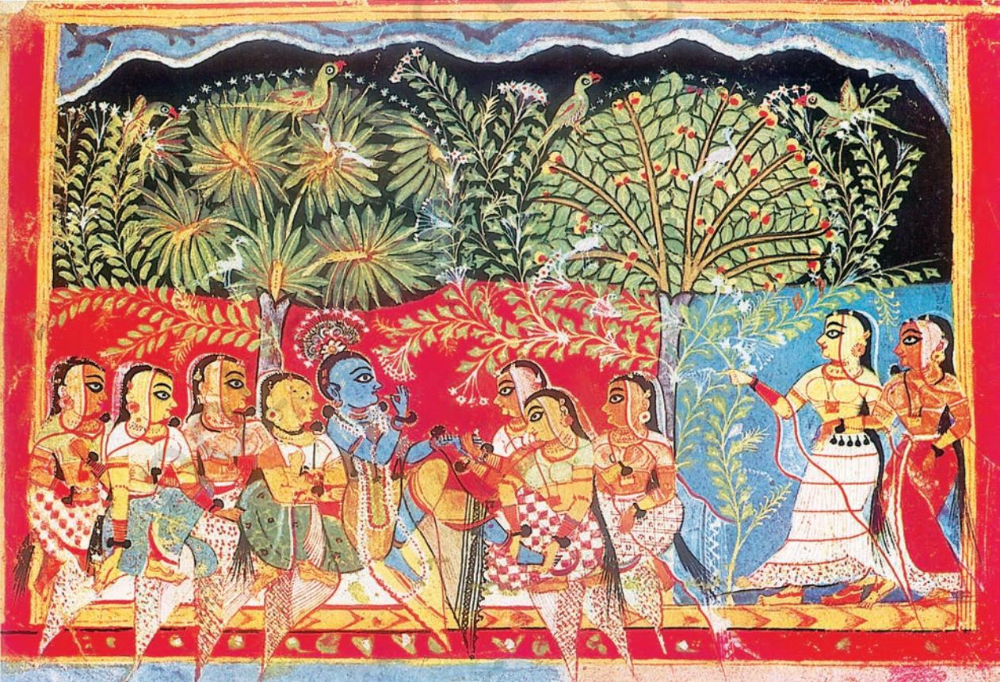

1_2.Rajashtani Painting.indd 11 01 Sep 2020 02:13:31 PM

creator from whom all creation was a sportive emanation, and Radha, the human soul who led to offer herself to God. The soul's devotion to the deity is pictured by Radha's self-abandonment to her beloved Krishna epitomised in *Gita Govinda* paintings.

Composed in the twelfth century by Jayadeva, who is believed to have been the court poet of Lakshmana Sen of Bengal, *Gita Govinda*, the 'Song of the Cowherd', is a lyrical poem in Sanskrit, evoking *shringara rasa*, portraying the mystical love between Radha and Krishna through worldly imageries. Bhanu Datta, a Maithil Brahmin who lived in Bihar in the fourteenth century, composed another favourite text of artists, *Rasamanjari*, interpreted as the 'Bouquet of Delight'. Written in Sanskrit, the text is a treatise on *rasa*  and deals with the classification of heroes (*nayakas*) and heroines (*nayikas*) in accordance with their age—*baal*, *taruna* and *praudha*; physiognomic traits of appearance, such as *padmini*, *chitrini*, *shankhini*, *hastini*, etc., and emotional states, such as *khandita*, *vasaksajja*, *abhisarika*, *utka,* etc. Though Krishna is not mentioned in the text, painters have introduced him as the archetypal lover.

*Rasikapriya*, translated as 'The Connoisseur's Delight', is replete with complex poetic interpretations and was composed to incite aesthetic pleasure to elite courtiers. Composed in Brajbhasha by Keshav Das, the court poet of Raja Madhukar Shah of Orchha in 1591, *Rasikapriya* explores various emotive states, such as love, togetherness, jilt, jealousy, quarrel and its aftermath, separation, anger, etc., that are common between lovers represented through the characters of Radha and Krishna.

*Kavipriya*, another poetic work by Keshav Das, was written in the honour of Rai Parbin, a celebrated courtesan of Orchha. It is a tale of love and its tenth chapter evocatively titled *Baramasa* engages with the most enduring climactic description of the 12 months of the year. While illustrating the daily life of people in different seasons and alluding to festivals falling therein, Keshav Das describes how the *nayika*  prevails upon the *nayaka* not to leave her and proceed on a journey.

*Bihari Satsai*, authored by Bihari Lal, constituting 700 verses (*satsai*), is composed in the form of aphorisms and moralising witticism. It is largely held that he composed the *Satsai* around 1662 while he was at the court of Jaipur

1_2.Rajashtani Painting.indd 12 01 Sep 2020 02:13:31 PM

working for Mirza Raja Jai singh as the patron's name appears in several verses of the *Satsai*. The *Satsai* has been largely painted at Mewar and less frequently in the Pahari School.

*Ragamala* paintings are pictorial interpretations of *ragas* and *raginis*.

*Ragas* are traditionally envisioned in divine or human form in romantic or devotional contexts by musicians and poets. Each *raga* is associated with a specific mood, time of the day and season. *Ragamala* paintings are arranged in albums invariably containing 36 or 42 folios, organised in the format of families. Each family is headed by a male *raga*, having six female consorts called *raginis*. The six main *ragas* are *Bhairava*, *Malkos*, *Hindol*, *Dipak*, *Megha* and *Shri*.

Bardic legends and other romantic tales, such as *Dhola-Maru*, *Sohni-Mahiwal*, *Mrigavat*, *Chaurpanchashika* and *Laurchanda* just to mention a few were other favourite themes. Texts, such as the *Ramayana*, *Bhagvata Purana*, *Mahabharata*, *Devi Mahatmya* and the like were favourites with all schools of painting.

Moreover, a large number of paintings record *darbar* scenes and historic moments; depict hunting expeditions, wars and victories; picnics, garden parties, dance and music performances; rituals, festivals and wedding processions; portraits of kings, courtiers and their families; city views; birds and animals.

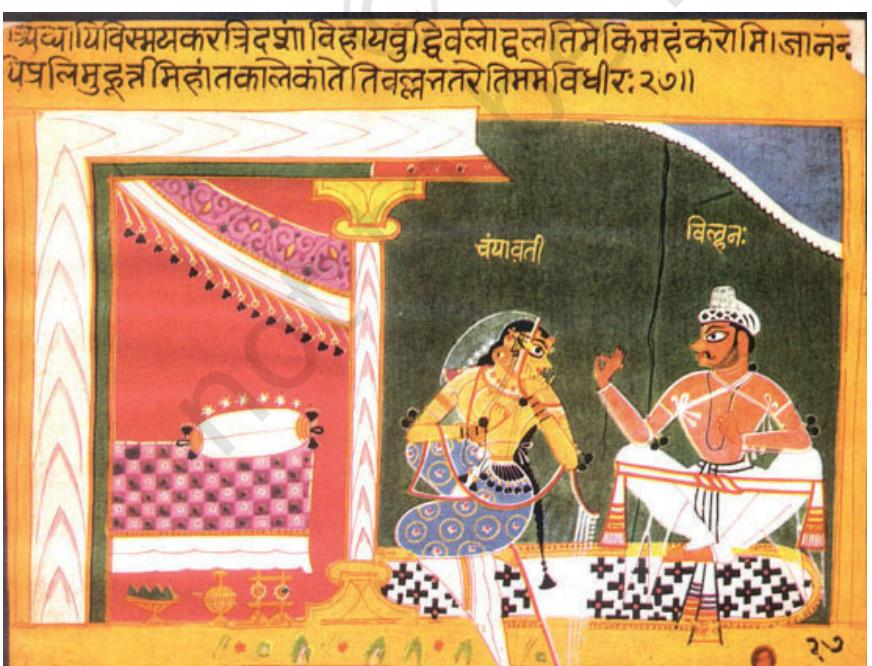

*Chaurpanchasika, Mewar, 1500, N. C. Mehta Collection, Ahmedabad, Gujarat*

1_2.Rajashtani Painting.indd 13 01 Sep 2020 02:13:31 PM

## Malwa School of Painting

The Malwa School flourished between 1600 and 1700 CE and is most representative of the Hindu Rajput courts. Its two-dimensional simplistic language appears as a consummation of stylistic progression from the Jain manuscripts to the *Chaurpanchashika* manuscript paintings.

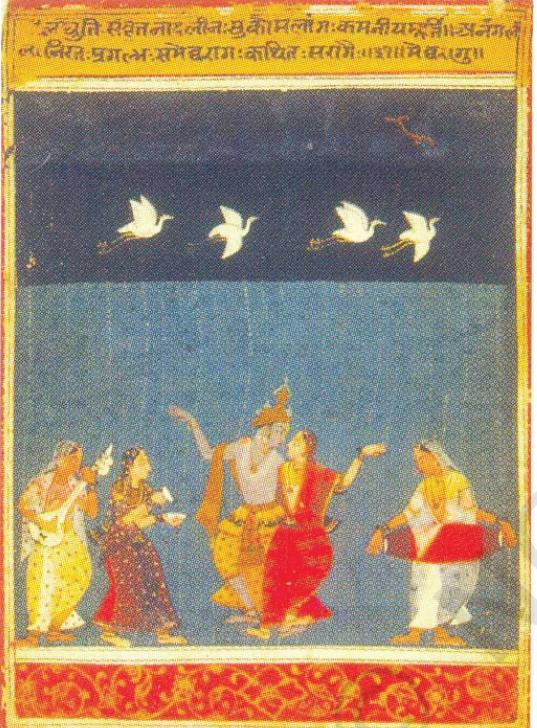

*Raga Megha, Madho Das, Malwa, 1680, National Museum, New Delhi*

Unlike the specificity of Rajasthani schools that emerged and flourished in precise territorial kingdoms and courts of their respective kings, Malwa School defies a precise centre for its origin and instead suggests a vast territory of Central India, where it got articulated with a sporadic mention of few places, such as Mandu, Nusratgarh and Narsyang Sahar. Among the few early dated sets are an illustrated poetic text of *Amaru Shataka* dated 1652 CE and a *Ragamala* painting by Madho Das in 1680 CE. A large number of Malwa paintings discovered from the Datia Palace collection supports a claim for Bundelkhand as the region of painting. But the mural paintings in the Datia Palace of Bundelkhand defy an obvious Mughal influence, which is contrary to the works on paper that are stylistically inclined towards indigenous two-dimensional austerity. A complete absence of the mention of patron kings and also portraits in this school supports a view

that these paintings were bought by the Datia rulers from travelling artists, who carried paintings on popular themes, such as the *Ramayana*, *Bhagvata Purana*, *Amaru Shataka*, *Rasikapriya*, *Ragamala* and *Baramasa,* among others.

The Mughal School dominates the scene from the sixteenth century through the courts of Delhi, Agra, Fatehpur Sikri and Lahore. Provincial Mughal Schools prospered in many parts of the country, which were under the Mughals but headed by powerful and wealthy governors appointed by Mughal emperors, where pictorial language evolved through an amalgamation of Mughal and eccentric local elements. The Deccani School flourished in centres, such as Ahmednagar, Bijapur, Golconda and Hyderabad from the sixteenth century. The Rajasthani Schools came into prominence in the late sixteenth and early seventeenth century, with the Pahari School following in the late seventeenth and early eighteenth centuries.

1_2.Rajashtani Painting.indd 14 01 Sep 2020 02:13:31 PM

### Mewar School of Painting

Mewar is conjectured to be a significant early centre of painting in Rajasthan, from where, hypothetically, one would have been able to formalise a continuous stylistic tradition of painting—from pre-seventeenth century bold, indigenous styles to the subsequent refined and finer style post Karan Singh's contact with the Mughals. However, long wars with the Mughals have wiped out most early examples.

Therefore, the emergence of the Mewar School is widely associated with an early dated set of *Ragamala* paintings painted at Chawand in 1605 by an artist named Nisardin. The set has a colophon page that reveals the above vital information. This set shares its visual aesthetics and has close affinity with the pre-seventeenth century painting style in its direct approach, simpler compositions, sporadic decorative details and vibrant colours.

The reign of Jagat Singh I (1628–1652) is recognised as the period when pictorial aesthetics got reformulated under virtuoso artists Sahibdin and Manohar, who added new vitality to the style and vocabulary of Mewar paintings. Sahibdin painted the *Ragamala* (1628), *Rasikapriya*, *Bhagvata Purana*  (1648) and the *Yuddha Kanda* of *Ramayana* (1652), a folio of

*Yuddha Kanda of Ramayana, Sahibdin, Mewar, 1652, India Office Library, London*

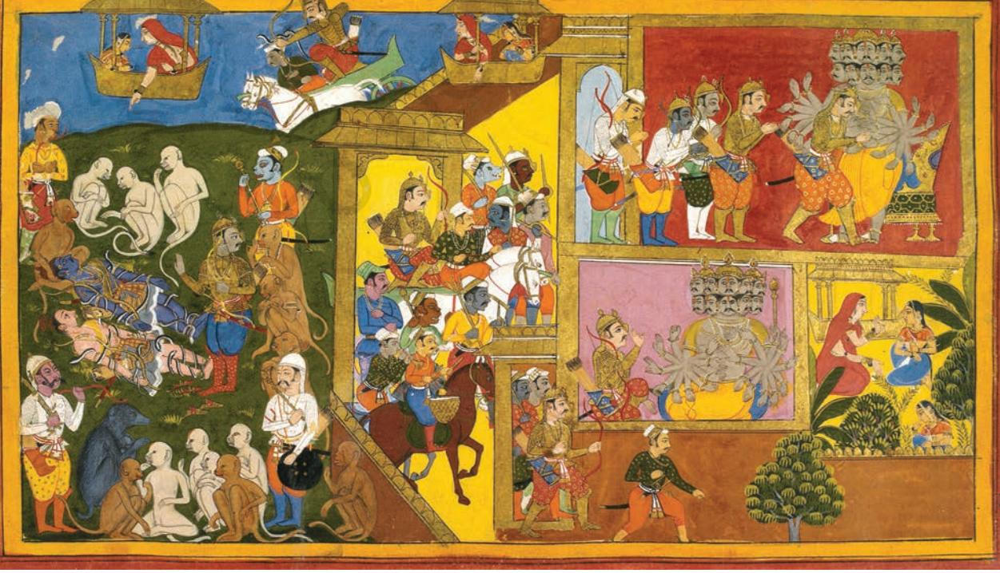

1_2.Rajashtani Painting.indd 15 01 Sep 2020 02:13:31 PM

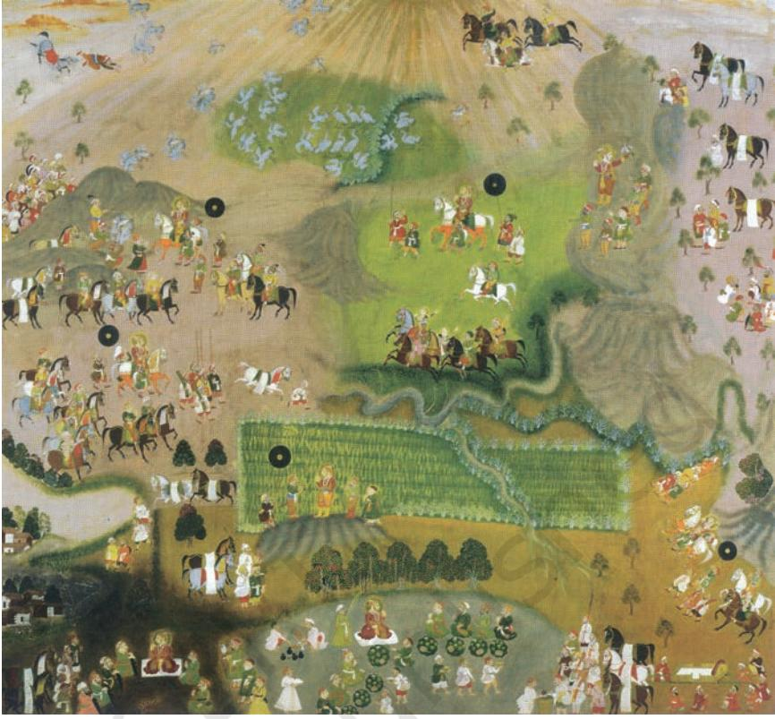

which is discussed here. Manohar's most significant work is that of *Bal Kanda* of *Ramayana* (1649). Another exceptionally gifted artist, Jagannath, painted the *Bihari Satsai* in 1719, which remains a unique contribution of the Mewar School. Other texts like *Harivamsha* and *Sursagar* were also illustrated in the last quarter of the seventeenth century.

Attributed to ingenious artist Sahibdin, *Yuddha Kanda*, the Book of Battles, is a chapter in the *Ramayana* set of paintings, popularly referred to as the *Jagat Singh Ramayana*. Dated 1652, Sahibdin, herein, has crafted a novel pictorial device that of oblique aerial perspective to impart credibility to the ambitious scale that war pictures encompass. Deploying various narrative techniques, he either layers several episodes into a single painting as this one, or spreads a single episode over more than one folio. This painting portrays Indrajit's devious tactics and use of magic weapons in war.

Painting in the eighteenth century increasingly slithered away from textual representations to courtly activities and pastime of the royals. Mewar artists, generally, prefer a bright colour palette with prominent reds and yellows.

*Maharana Jagat Singh II of Mewar hawking, 1744, Metropolitan Museum of Art, New York*

1_2.Rajashtani Painting.indd 16 01 Sep 2020 02:13:34 PM

Nathdwara, a town close to Udaipur and a prominent *Vaishnava* centre, also emerged as a school of painting in the late seventeenth century. Large backdrops called *pichhwais* were painted on cloth for the deity, Shrinathji, for several festive occasions.

Mewar painting in the eighteenth century increasingly became secular and courtly in ambience. Not only an increasing fascination for portraiture emerged but outsized and flamboyant court scenes, hunting expeditions, festivals, *zenana* activities, sports, etc., were largely favoured as subjects.

A folio depics Maharana Jagat Singh II (1734–1752) touring the countryside while on his way hawking. The country scape perceived in an oblique view, with the horizon raised at a tangent in comparison to the foreground enables the artist to visualise a panoramic view of limitless vision. The relevance of the scene lies in its complexity of narration that also aims at reportage.

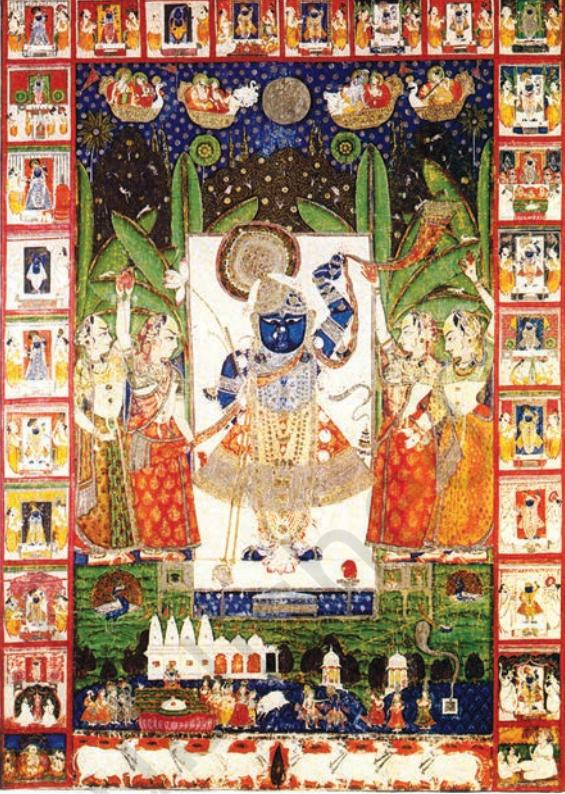

## Bundi School of Painting

A prolific and distinct school of painting flourished in Bundi in the seventeenth century, which is remarkable for its unblemished colour sense and excellent formal design.

*Bundi Ragamala* dated 1591, assigned to the earliest and formative phase of Bundi painting, has been painted at Chunar in the reign of Bhoj Singh (1585–1607), the Hada Rajput ruler.

The Bundi school blossomed under the patronage of two rulers—Rao Chattar Sal (1631–1659), who was made the governor of Delhi by Shahjahan and played a conspicuous role in the subjugation of the Deccan; and his son Rao Bhao Singh (1659–1682), who was an enthusiastic, self-indulging patron as revealed from numerous portraits that he commissioned of himself and other dated works. Innovative developments have been observed under the reigns of his successors Aniruddha Singh (1682–1702) and Budh Singh, whose whiskered face is visible in many portraits. Despite numerous political disputes and having lost his kingdom four times, he is known to have encouraged the art of painting.

*Krishna as Shrinathji celebrating the festival of Sarad Purnima, Nathdwara, 1800, National Museum, New Delhi*

1_2.Rajashtani Painting.indd 17 01 Sep 2020 02:13:34 PM

Painting activity entered its most accomplished phase albeit for a short time during the long reign of Budh Singh's son, Umed Singh (1749–1771), where it acquired refinement in minuteness of details. Bundi paintings during the eighteenth century appear to have imbibed Deccani aesthetics, such as love for bright and vivid colours.

Umed Singh's successor Bishen Singh (1771–1821) ruled Bundi for 48 years and was a connoisseur of art. He had a keen interest in hunting, and him hunting wild animals frequently figures in the paintings of his period. Under his successor Ram Singh (1821–1889), the *chitrashalain* of the Bundi palace was decorated with mural paintings of royal processions, hunting scenes and episodes of Krishna's story. Last stages of painting at Bundi are best exemplified by several wall paintings in the palace.

*Raga Dipak, Chunar Ragamala, Bundi, 1519, Bharat Kala Bhavan, Varanasi*

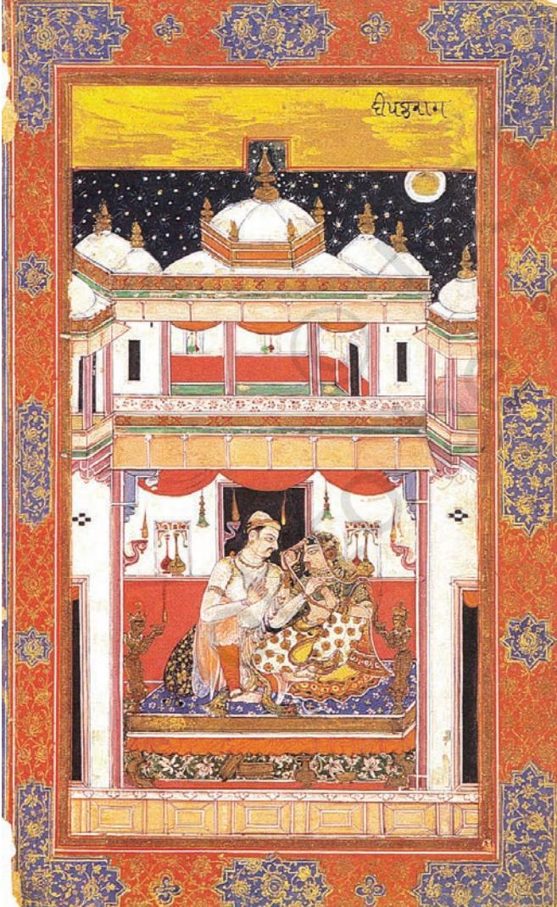

A distinct feature of Bundi and Kota School is a keen interest in the depiction of lush vegetation; picturesque landscape with varied flora, wildlife and birds; hills and thick jungles; and water bodies. It also has a series of fine equestrian portraits. The drawing of elephants is, particularly, unsurpassed in both Bundi and Kota. Bundi artists had their own standards of feminine beauty—women are petite with round faces, receding foreheads, sharp noses, full cheeks, sharply penciled eyebrows and a 'pinched' waist.

Bundi's earliest phase of painting, *Bundi Ragamala* bears an inscription in Persian that dates back to 1591, mentions names of its artists—Shaykh Hasan, Shaykh Ali and Shaykh Hatim, who introduce themselves as pupils of master artists, Mir Sayyid Ali and Khwaja Abddus Samad of the Mughal court. They mention Chunar (near Benaras) as the place of origin of the painting, where Rao Bhoj Singh and his father Rao Surjan Singh maintained a palace.

Amongst the surviving few folios of the Chunar set are *Raginis Khambavati*,

1_2.Rajashtani Painting.indd 18 01 Sep 2020 02:13:34 PM

*Bilaval*, *Malashri*, *Bhairavi*, *Patmanjari* and few others.

*Raga Dipak* is portrayed in a night setting, seated with his beloved in a chamber that is warmly illuminated by flames from the four lamps; two lamp holders are innovatively shaped like ornate human figures. The sky is glittering with innumerable stars and the moon is turning yellow, indicating that it is not newly risen but that the night has progressed and many hours have passed by for the couple in each other's company.

One may observe in this painting that the finial on the domical structure of the palace protrudes into the yellow patch reserved for writing and except for the label of *Dipak Raga* nothing else is written. This gives an insight into the process of painting and one discerns that the painting was, usually, finished before it was passed on to scribe for the verse to be written. In this case, the verse was never written and the label was more of an indication to the artist as to what he should be painting.

*Baramasa* is a popular theme of Bundi paintings. As mentioned earlier, it is an atmospheric description of the

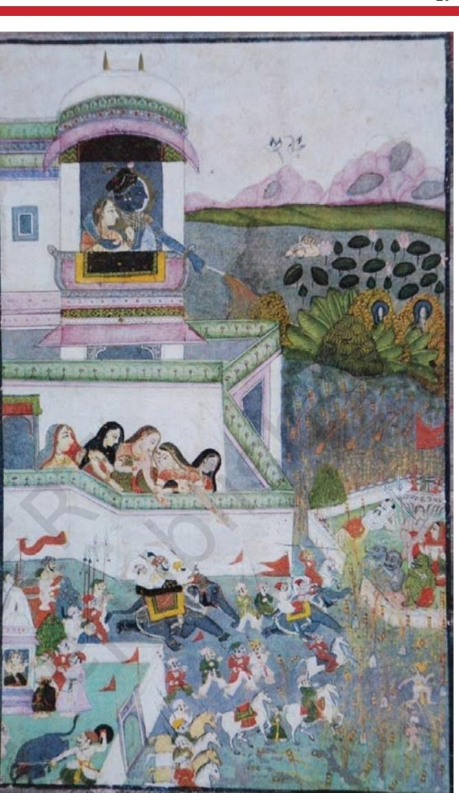

12 months by Keshav Das that is part of the tenth chapter of *Kavipriya* written for Rai Parbin, a celebrated courtesan of Orchha.

*Ashwin, Baramasa, Bundi, seventeenth century, Chhatrapati Shivaji Maharaj Vastu Sangrahalaya, Mumbai*

# Kota School of Painting

The accomplished tradition of painting at Bundi gave rise to one of the most outstanding Rajasthani Schools, Kota, which excels in the depiction of hunting scenes and reflects an exceptional excitement and obsession for animal chase.

Bundi and Kota were parts of the same kingdom till 1625 when Jahangir divided the Bundi empire and awarded one part to Madhu Singh, the younger son of Rao Ratan Singh (son of Bhoj Singh of Bundi), for his bravery in defending him

1_2.Rajashtani Painting.indd 19 01 Sep 2020 02:13:34 PM

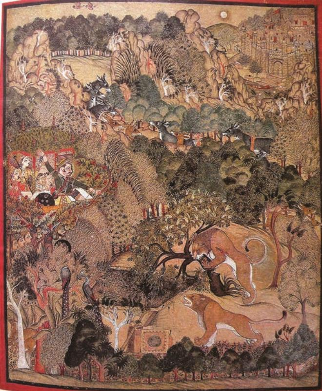

*Maharaja Ram Singh I of Kota hunting lions at Mukundgarh, 1695, Colnaghi Gallery, London*

against his son Prince Khurram's (Shah Jahan) rebellion in Deccan.

After its separation from Bundi, Kota had its own school, commencing around 1660s in the reign of Jagat Singh (1658–1683). In the early period, the paintings of Bundi and Kota cannot be distinguished for several decades as Kota painters borrowed from the Bundi repertoire. Some compositions were taken verbatim from Bundi pictures. However, there is an attitude of non–conformity apparent in figural and architectural exaggerations. With Kota flair for drawing superseding in the following decades, Kota style of painting becomes strikingly individual.

By the reign of Ram Singh I (1686–1708), artists had passionately enlarged their inventory to a large variety of subjects. Kota artists seem to have been the first to render landscape

as the real subject of compositions. Umed Singh (1770–1819) acceded to the throne at the age of 10 years. But his powerful regent Zalim Singh arranged for the young king to be amused with hunting while he governed the affairs of the state. Umed Singh, thus, occupied himself with wildlife and gaming from an early age and spent most of his time in hunting expeditions. Paintings served as flattering records of his exploits. Kota painting of this period reflects obsession with the chase, which became a social ritual, in which even women of the court participated.

Kota paintings are characteristically spontaneous, calligraphic in execution and emphasise on marked shading, especially, the double–lid eye. Artists of the Kota School excelled in rendering animals and combat.

## Bikaner School of Painting

Rao Bika Rathore established one of the most prominent kingdoms of Rajasthan, Bikaner, in 1488. During his regime, Anup Singh (1669–1698) instituted a library in Bikaner that became a repository of manuscripts and paintings. As a result of long association with the Mughals, Bikaner developed a

1_2.Rajashtani Painting.indd 20 01 Sep 2020 02:13:34 PM

distinctive language of painting that was influenced by the Mughal elegance and subdued colour palette.

According to inscriptional evidence, several master artists of the Mughal atelier visited and worked in Bikaner in the seventeenth century. Karan Singh had employed Ustad Ali Raza, who was a master painter from Delhi. His earliest work represents the beginnings of Bikaner School, which can be dated back to around 1650.

In the reign of Anup Singh, Ruknuddin (whose ancestors came from the Mughal court) was the master artist, whose style was an amalgamation of the indigenous idiom with Deccani and Mughal conventions. He painted significant texts, such as the *Ramayana*, *Rasikapriya* and *Durga Satpsati*. Ibrahim, Nathu, Sahibdin and Isa were other well-known painters in his atelier.

A prevailing practice in Bikaner was to set up studios called *Mandi*, where a group of artists worked under the supervision of a master artist. From inscriptions, it can be gathered that Ruknuddin, Ibrahim and Nathu managed some of these professional studios. Several *Mandis* existed

*Krishna supporting Mount Govardhan by Shahadin, Bikaner, 1690, British Museum, London*

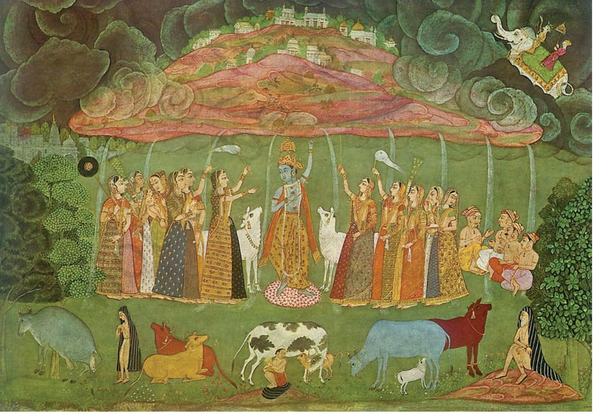

1_2.Rajashtani Painting.indd 21 01 Sep 2020 02:13:34 PM

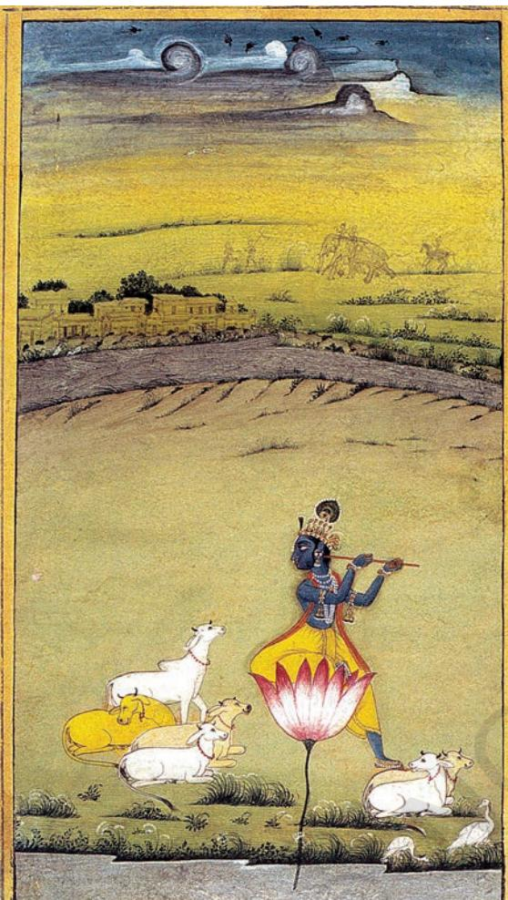

*Krishna playing Flute surrounded by Cows, Bikaner, 1777, National Museum, New Delhi*

in Anup Singh's reign. On the completion of a painting, the court archivist entered the name of the master artist and the date behind the painting. This practice resulted in the name of the master artist being inscribed on works of his pupils, who may not be painting in the same style as the master. However, it becomes evident from these entries that the master artist would occasionally put finishing touches to the paintings. The term used for this was *gudarayi*, literally meaning to 'lift'. Apart from its activities of making new miniatures, the studio was entrusted with the task of *marammat* or repairing and making *nakals* (copies) of older works.

The custom of having portraits of artists is unique to the Bikaner School and most of them are inscribed with information regarding their ancestry. They are referred to as *Ustas* or *Ustad*. Ruknuddin painted exquisite works in soft colour tones. Ibrahim's works have a misty dreamlike quality. His figures are dainty with heavily modeled faces. His studio appears to be most prolific as his name occurs on different sets of *Baramasa*, *Ragamala* and *Rasikapriya*.

Accounts from the *Bahis*, royal archival day-to-day diaries, and numerous inscriptions

on Bikaner paintings make it one of the best documented schools of painting. Inscriptions in Marwari, and occasionally, Persian reveal the names of artists and dates, and in some cases, even the place of production and occasions for which the works were commissioned.

## Kishangarh School of Painting

Widely held among the most stylised of all Rajasthani miniatures, Kishangarh paintings are distinguished by their exquisite sophistication and distinct facial type exemplified by arched eyebrows, lotus petal shaped eyes slightly tinged with pink, having drooping eyelids, a sharp slender nose and thin lips.

Kishan Singh, one of the sons of the king of Jodhpur, founded the state of Kishangarh in 1609. By the mid–seventeenth century under the patronage of Man Singh

1_2.Rajashtani Painting.indd 22 01 Sep 2020 02:13:35 PM

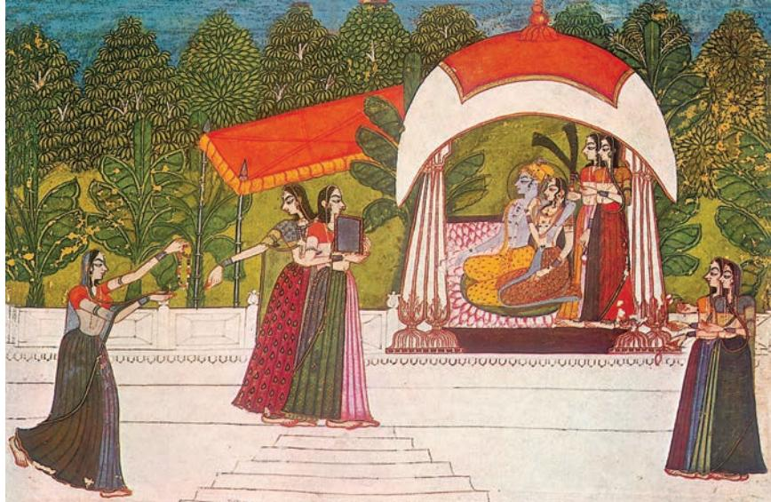

*Krishna and Radha in a pavilion, Nihal Chand, Kishangarh, 1750, Allahabad Museum*

(1658–1706), artists were already working in the Kishangarh court. A distinctive style of the state with a general tendency to elongate the human form, making lavish use of green and penchant for depicting panoramic landscapes had evolved by the early eighteenth century during the reign of Raj Singh (1706–1748). With Raj Singh getting initiated into the Pushtimargiya cult of Vallabhacharya, *Krishna Lila* themes became personal favourites for the rulers of Kishangarh and represented a major portion of their court art.

Sawant Singh's most celebrated and outstanding artist was Nihal Chand. Nihal Chand worked for Sawant Singh between 1735 and 1757, and composed paintings on Sawant Singh's poetry that portrayed the theme of divine lovers—Radha and Krishna, in courtly surroundings, often appearing tiny in the vastness and minutiae of their panoramic landscape settings. Kishangarh artists reveled in the depiction of vistas in accentuated colours.

# Jodhpur School of Painting

With the political presence of Mughals since the sixteenth century, influence of their visual aesthetics made its way in the style of portraiture and depiction of court scenes, etc. However, the formidable indigenous folkish style was so widespread and deeply embedded in culture that it resisted getting overpowered and prevailed in most illustrated sets of paintings. One of the earliest sets painted in Pali is a *Ragamala* set by artist Virji in 1623.

1_2.Rajashtani Painting.indd 23 01 Sep 2020 02:13:35 PM

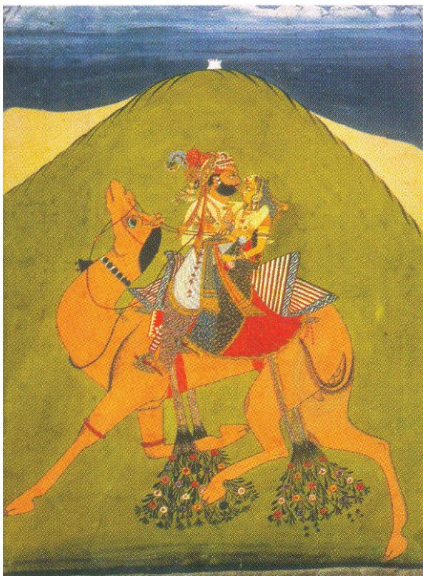

*Dhola and Maru, Jodhpur, 1810, National Museum, New Delhi*

A productive period of painting was ushered in by Maharaja Jaswant Singh (1638–1678) in the mid–seventeenth century. A trend for documentary painting through portraiture and depiction of court life started under his patronage around 1640 and enjoyed prominence till the advent of photography in the nineteenth century when it substituted painting for recording events. Numerous portraits of Jaswant Singh survive. Due to his inclination towards the Vallabha cult of Shrinathji, he patronised many Krishna related themes with *Bhagvata Purana* as the most prominent one.

His successor Ajit Singh (1679–1724) became the king after 25 years of war with Aurangzeb, which was fought by legendary warrior Veer Durgadas Rathore, who successfully recaptured Marwar. Durgadas and his heroism got popularly celebrated in

poems and court paintings of Ajit Singh's period. Durgadas's equestrian (horse riding) portraits became popular.

The last phase innovative of Jodhpur painting coincided with the reign of Man Singh (1803–1843). Significant sets painted during his time are the *Ramayana* (1804), *Dhola-Maru*, *Panchatantra* (1804) and *Shiva Purana*. *Ramayana* paintings are interesting as the artist has employed his understanding of Jodhpur to depict Rama's Ayodhya. Hence, one gets an inkling into the bazaars, lanes, gateways, etc., of Jodhpur during that period. This is true for all schools, wherein, local architecture, costumes and cultural aspects get interwoven with the stories of Krishna, Rama and others, and get depicted in paintings.

Man Singh was the follower of the Nath Sampradaya and paintings of him in the company of the Nath gurus survive. Also, a set of *Nath Charita* (1824) was painted.

Inscriptions behind Marwar paintings do not reveal much information regarding the painting until the nineteenth century. Seldom, dates are inscribed, and even more rarely, the names of artists and place of painting find a mention.

1_2.Rajashtani Painting.indd 24 01 Sep 2020 02:13:35 PM

## Jaipur School of Painting

The Jaipur School of painting originated in its former capital Amer, which was nearest of all large Rajput states to Mughal capitals—Agra and Delhi. Rulers of Jaipur from the earliest times maintained cordial relations with the Mughal emperors, who strongly influenced the aesthetics at Amer. Raja Bharmal (1548–1575) married his daughter to Akbar. His son Bhagwant Das (1575–1592) was a close friend of Akbar and his son Man Singh, in turn, was Akbar's most trusted general.

Sawai Jai Singh (1699–1743), an influential ruler, established a new capital city Jaipur named after him in 1727 and shifted from Amer. Jaipur School of paintings thrived under his reign and emerged as a well-defined independent school. Court records reveal that some Mughal painters were brought from Delhi to become a part of his atelier. He also invited eminent craftsmen and other artists to settle down in Jaipur and reorganised the *Suratkhana*, the place where paintings were made and stored. He was drawn to the Vaishnavite sect and commissioned numerous

*The Hour of Godhuli, Jaipur, 1780, National Museum, New Delhi*

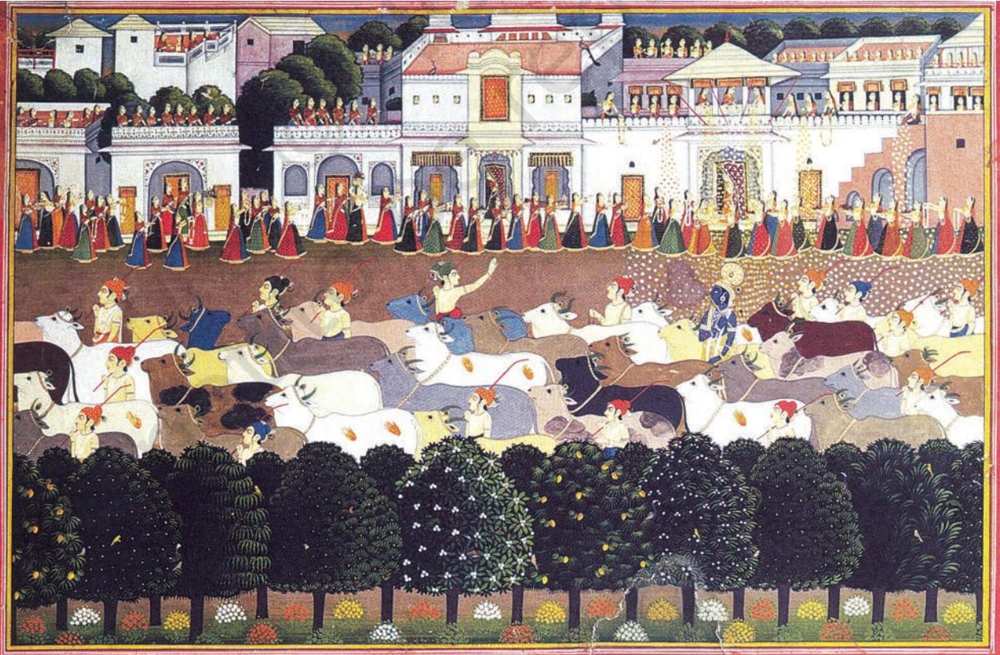

1_2.Rajashtani Painting.indd 25 01 Sep 2020 02:13:37 PM

paintings on the theme of Radha and Krishna. Artists during his reign painted sets based on *Rasikapriya*, *Gita Govinda*, *Baramasa* and *Ragamala*, where the hero's figure is in striking resemblance with the king. Portrait painting was also popular during his time and an accomplished portrait painter, Sahibram, was part of his atelier. Muhammad Shah was another artist.

Sawai Ishwari Singh (1743–1750) extended the same patronage to art. Apart from religious and literary texts, he got scenes of his leisure pursuits painted, such as elephant rides, boar and tiger hunts, elephant fights, and so on. Sawai Madho Singh (1750–1767) was attracted towards getting incidents of his court life recorded.

It was only in the eighteenth century, under the aspiration of Sawai Pratap Singh (1779–1803) that the predominant Mughal influence receded and a Jaipur style with reformulated aesthetics, which was a blend of Mughal and indigenous stylistic features emerged. This was a second thriving period for Jaipur and Pratap Singh employed around 50 artists. He was a scholar, poet, prolific writer and an ardent follower of Krishna. During his time, apart from royal portraits and representations of courtly pomp and splendour, literary and religious themes, such as *Gita Govinda*, *Ragamala*, *Bhagvata Purana*, etc., got renewed stimulus.

As elsewhere, many copies were also produced by means of tracing and pouncing. By the early nineteenth century, there was a lavish use of gold. Jaipur preferred large size formats and produced life-size portraits.

#### **Exercise**

- 1. In what ways do you think that the Western Indian manuscript painting tradition guided the developments of miniature painting traditions in Rajasthan?
- 2. Describe different schools of Rajasthani paintings and give examples to support their characteristics.
- 3. What is *Ragamala*? Give examples of *Ragamala* paintings from various schools of Rajasthan.
- 4. Draw a map and label all schools of Rajasthani miniature paintings.
- 5. Which texts provided the content or theme for miniature paintings? Describe them with examples.

1_2.Rajashtani Painting.indd 26 01 Sep 2020 02:13:37 PM

# *Bhagvata Purana*

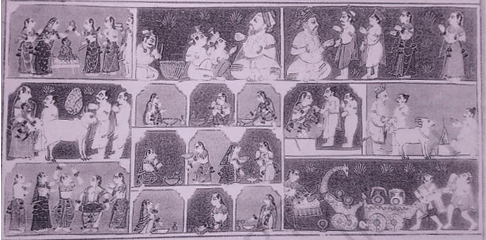

Illustrating scenes from the *Bhagvata Purana*, depicting different scenes from the life of Lord Krishna and his *leela*, have been a popular theme throughout the medieval period for artists. This painting from the collection of National Museum, New Delhi, shows the killing of demon Shaktasura by Krishna (1680–1690).

This folio from *Bhagvata Purana* is a typical example of Malwa style, where the space is carefully compartmentalised with each section narrating different scenes of an episode. One observes scenes of celebration and festivities in the house of Nanda and Yashoda after the birth of Krishna. Men and women are singing and dancing (lower left and upper middle section); overjoyed parents—Nanda and Yashoda—are involved in charitable activities and are seen donating cows and calves to Brahmins and well-wishers (middle left and extreme right); lot of delicious food is being prepared (central section); women are hovering over baby Krishna to safeguard him form the evil eye (upper left section) and the narrative concludes with Krishna toppling, and thus, liberating the cart demon, Shakatasura, with a gentle kick.

1_2.Rajashtani Painting.indd 27 01 Sep 2020 02:13:37 PM

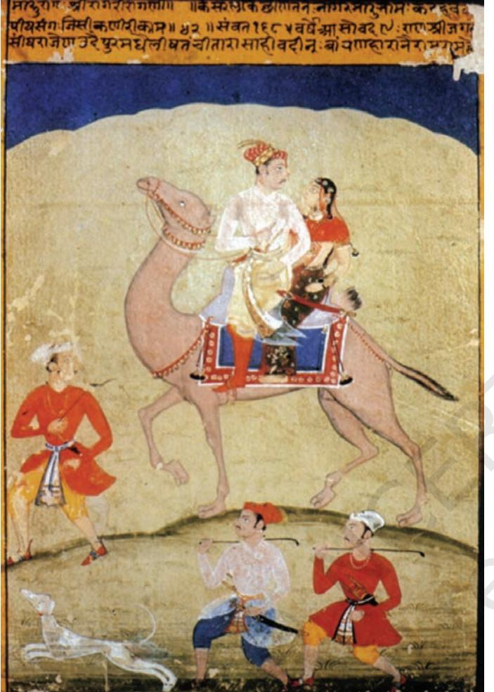

# **Maru Ragini**

A particular set of *Ragamala* paintings from Mewar is, especially, important as one of its paintings bears crucial documentary evidence regarding its artist, patron, place and date of painting. *Maru Ragini* is from this set, which is in the collection of National Museum, New Delhi. The initial part of the inscription found on the painting, representing Maru Ragini, classifies Maru as the *ragini* of Raga Shri and describes her physical beauty and its effect on her beloved. It is the latter half that is engrossing as it reads, "… samvat 1685 varshe aso vad 9 Rana Shri Jagat Singh Rajen Udaipur madhe likhitam chitara Sahivdin bachan hara ne ram ram."

Samvat 1685 is 1628 CE and Sahibdin is referred to as *chitara*, meaning 'someone who paints', and the act of painting is termed as *likhitam*, translated as 'written' since the goal of the artist was to produce a painterly equivalent to the written verse inscribed on the painting.

Maru is accommodated as the consort of Raga Shri because of the popular appeal of *Dhola-Maru* ballad that is deeply entrenched in the folklore and oral tradition of the region. It is the story of a prince named, Dhola, and princess Maru, who had to undergo numerous struggles to finally be together. The trials and tribulations, the evil relatives, battles, tragic accidents, etc., form the plot of the narrative. Here, they are depicted escaping together on a camel.

1_2.Rajashtani Painting.indd 28 01 Sep 2020 02:13:37 PM

# **Raja Aniruddha Singh Hara**

Aniruddha Singh (1682–1702) succeeded Bhao Singh. Few remarkable paintings with interesting documentary evidence have survived from his period. One of them being the much talked of equestrian portrait of Aniruddha Singh by artist Tulchi Ram painted in 1680. It epitomises an artist's perception of speed and a horse in motion that he accomplished by completely negating the rendering of the foreground. The horse is seen galloping so high in the air that the ground is not visible. The value of such paintings is that they turn still portraits into narratives. Names of Tulchi Ram and prince (Kanwar) Aniruddha Singh are inscribed behind the painting. But in the front, the name of Bharat Singh, the youngest son of Rao Chattarsal, is inscribed. Some scholars feel this painting represents Bharat Singh, while a majority are of the opinion that it represents young Anirrudha Singh before he ascended to the throne. This painting is in the collection of National Museum, New Delhi.

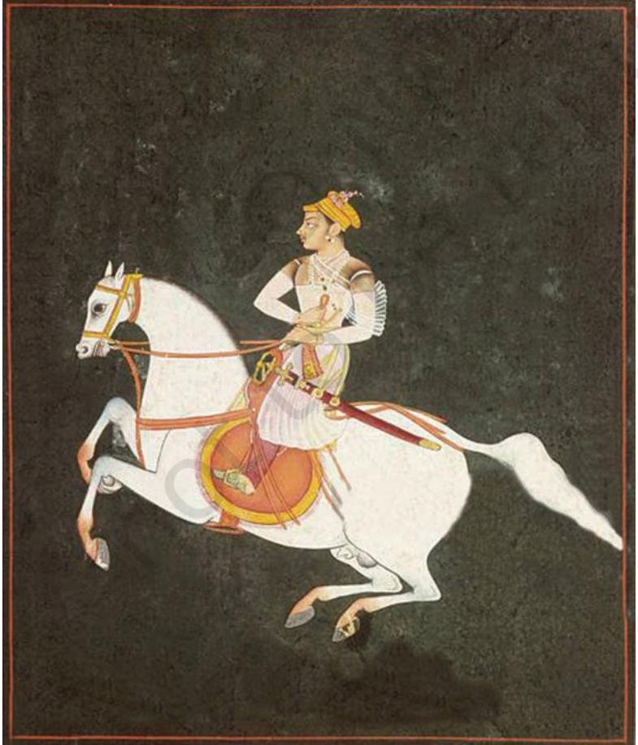

1_2.Rajashtani Painting.indd 29 01 Sep 2020 02:13:37 PM

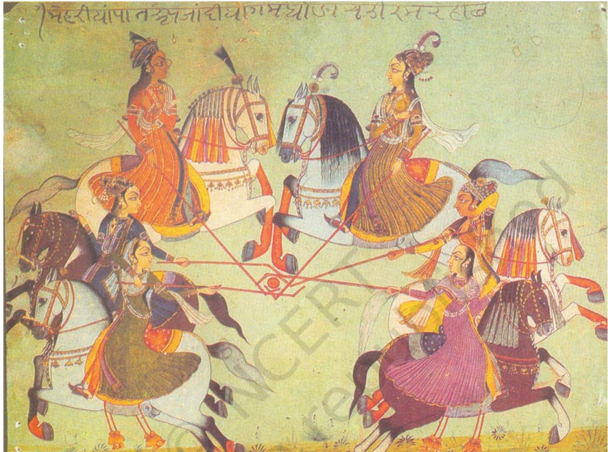

**Chaugan Players**

This painting, depicting a princess playing Polo (*Chaugan*) with companions, by artist Dana represents Jodhpur painting of Man Singh's reign. It may or may not be from the main court as it betrays stylistic influence of many schools, such as Mughal in the way women are depicted, Deccani in the way horses are depicted, Bundi and Kishangarh in the depiction of facial features, and the flat green background is suggestive of the indigenous preference for flat surfaces. The painting is inscribed with a line on the upper portion that is translated as, "beautiful maidens on horsebacks, playing". The painting was made in 1810 and is in the collection of National Museum, New Delhi.

1_2.Rajashtani Painting.indd 30 01 Sep 2020 02:13:38 PM

# **Krishna Swinging and Radha in Sad Mood**

This painting, illustrating *Rasikapriya*, is notable as it is inscribed with a date and name of the artist. Painted in 1683 by artist Nuruddin, who worked in the court of Bikaner from 1674 to 1698, it presents a stark and simple composition with minimal and suggestive representation of architecture and elements of landscape. Nuruddin has ingeniously employed the device of soft undulating mound in the centre to divide the painting into two sections. It operates as a pictorial prop that transforms an urban setting into a tree-laden countryside and vice versa. An architectural pavilion in the upper part of the painting pictorially qualifies that space as the 'palatial interior', while few trees on the green grassland suggest 'outdoors and pastoral' landscape. Hence, one understands

the movement of the narrative from top to bottom as a progression of activities from indoors to outdoors.

Appearing in the upper section of the painting, Krishna seated on a swing seems to be enjoying himself in the company of a Gopi at her dwelling. On learning about his rendezvous a jilted Radha, stricken with grief, disappears into the countryside and finds herself alone under a tree. Guilt-ridden Krishna, on learning of Radha's sorrow, follows her but there is no truce happening. Meanwhile, Radha's *sakhi* (friend) gets to know of the fall out and takes on the role of a messenger and pacifier. She comes to Krishna and tells him of the misery and plight of Radha, and implores him to appease her. This painting is in the collection of National Museum, New Delhi.

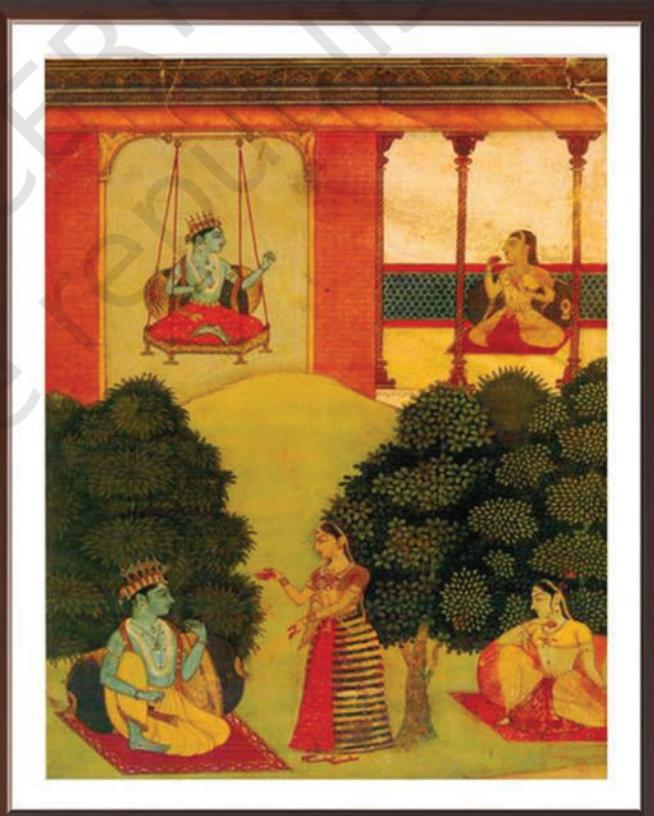

1_2.Rajashtani Painting.indd 31 01 Sep 2020 02:13:38 PM

# **Bani Thani**

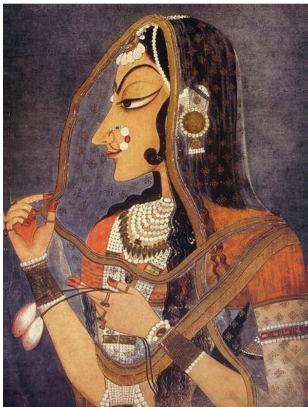

Sawant Singh composed devotional poetry on Krishna and Radha in Brajbhasha under the pen name Nagari Das. He is said to have been passionately in love with a young singer, who was accorded the title 'Bani Thani', the bewitching lady of fashion, because of her unparalleled beauty and elegance. She was an attendant of Raj Singh's wife and a gifted poetess, singer and dancer. Bani Thani was Sawant Singh's muse for the poetry he wrote, celebrating the love of Radha and Krishna. He writes about her in a poem *Bihari Jas Chandrika*, which became the basis for Nihal chand's painting of Bani Thani, thus, representing a blending of poetry and painting. Troubled by fratricidal conflict, Sawant Singh, eventually, abdicated the throne in 1757 and retired to Vrindavan along with Bani Thani.

The exaggerated facial type of Kishangarh, which becomes the distinctive and salient stylistic feature of the Kishangarh School, is believed to have been derived from the attractively sharp facial features of Bani Thani.

Artist Nihal Chand is attributed with the credit of contriving this exquisite and characteristic Kishangarh physiognomy that is perceived in figures of Sawant Singh and Bani Thani is always represented as Krishna and Radha in brilliantly coloured, panoramic landscapes.

Radha's face in Bani Thani as Radha is unique in her deeply curved eyes, exaggerated arch of the eyebrows, pointed nose, serpentine curl of hair spiralling down the cheek, thin lips and pronounced chin. This particular painting is in the collection of National Museum, New Delhi.

1_2.Rajashtani Painting.indd 32 01 Sep 2020 02:13:38 PM

# **Rama meets Members of his Family at Chitrakut**

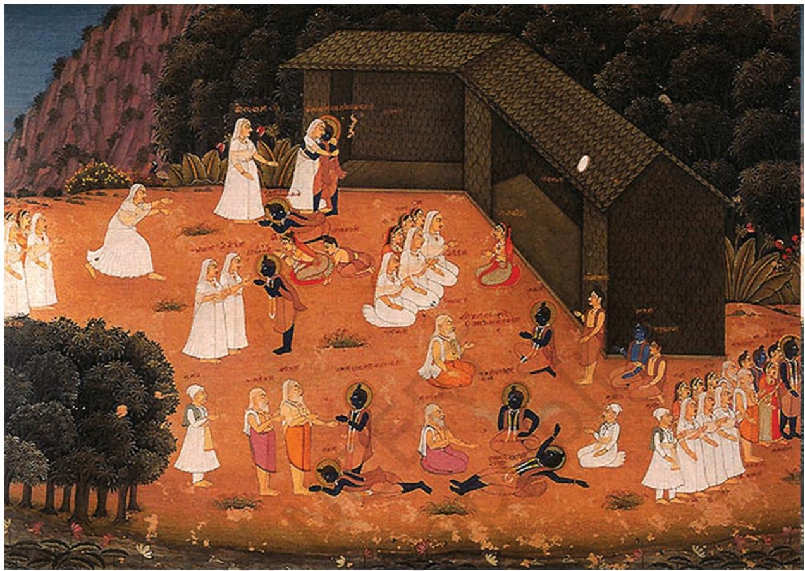

This painting of *Ramayana* by Guman, made between 1740 and 1750, is a classic example of a continuous narrative. Plain looking huts (*parna kutir*) raised with basic material, such as mud, wood and green leaves set in the woods on the foothills and surrounded by groves establish a typical rural setting, where this episode of *Ramayana* unfolds. Artist Guman begins the narrative from the left and ends it on the right.

According to the *Ramayana*, Bharat was away when Rama was sent to exile. After the passing away of Dashratha, overcome with grief and filled with remorse, Bharat along with the three mothers, sage Vasishtha and courtiers visits Rama to persuade him to return to Ayodhya.

Set in Chitrakut, the story in the painting begins with the three mothers along with the wives of the princes proceeding towards the thatched dwellings. On seeing the mothers, Rama, Lakshmana and Sita bow down in reverence. Bereaved

1_2.Rajashtani Painting.indd 33 01 Sep 2020 02:13:38 PM

Kaushalya rushes to her son Rama and gathers him in her arms. Rama is, then, seen respectfully greeting the other two mothers—Sumitra and Kaikeyi. He, then, dutifully acknowledges the two sages and sits down talking to them. When the sage breaks the news of Dashratha's death, Rama is seen collapsing in anguish. Sumanta is seen devotedly standing behind the sages. The three mothers and the wives of Lakshmana, Bharat and Shatrughana are depicted talking to Sita. The narrative ends with the group exiting the picture frame on the right. Each character of the story in the painting is labeled. A verse, describing the same, is also inscribed on the upper portion of the painting. This painting is in the collection of National Museum, New Delhi.

1_2.Rajashtani Painting.indd 34 01 Sep 2020 02:13:38 PM

