Mughal painting is the style of miniature painting that developed in the northern Indian subcontinent in the sixteenth century and continued till the mid–nineteenth century. It is known for its sophisticated techniques and diverse range of subjects and themes. The Mughal miniature painting inspired and resonated in subsequent schools and styles of Indian painting, thereby, confirming a definite position for the Mughal style within the Indian school of paintings.

The Mughals were patrons of various art forms. Every Mughal successor, based on his taste and preferences, contributed towards enhancing the status of art, viz., calligraphy, painting, architecture, bookmaking, book illustration projects, etc. They took keen interest in artists' ateliers and nurtured unprecedented new styles that heightened and accelerated the existing art scenario of India. Therefore, for understanding the Mughal Painting, the political history and genealogy of the Mughal dynasty is often taken into account.

## Influences on Mughal Painting

The Mughal style of miniature painting was responsible for the amalgamation of indigenous themes and styles along with Persian and later European themes and styles. The arts of this period reflect a synthesis of foreign influences and indigenous flavour. The peak of Mughal painting presented a highly sophisticated blend of the Islamic, Hindu and European visual culture and aesthetics. Given this diverse yet inclusive nature, the affluence of the artworks produced in India during this period surpasses the conventional and indigenous Indian and Iranian painting of that time. The significance of this style lies in the purpose and efforts of its patrons and the unmatched skill of its artists. Together, they envisaged and expressed a congregation of tastes, philosophies and faiths by their extraordinary visual language.

1_3.Mughal School Folder.indd 35 01 Sep 2020 02:15:59 PM

In the Mughal courts, arts became more formalised as there were workshops and many artists were brought from Iran, which resulted in a harmonious blend of Indo-Iranian styles, especially during its early years. This celebrated eminence in Mughal art was possible only due to its distinctive character of assimilating and engaging artists of both Indian and Iranian origins, who contributed towards making, and further elevating the artistic paradigm of the Mughal style.

The Mughal atelier consisted of calligraphers, painters, gilders and binders. Paintings recorded and documented significant events, personalities and interests of the emperors. These were meant to be seen by the royals only. The paintings were made to suit the sensitivity of the royals or often made as intellectual stimulation. The paintings were a part of manuscripts and albums.

The tradition of art and painting had rich historical roots in India about which we have already learned in the previous chapters. The celebrated Mughal idiom that developed on the Indian soil should be understood as a consequence of interaction of various schools, including the pre–Mughal and contemporaneous art schools of India and Persia. Thus, the Mughal style did not grow in vacuum. It was nurtured by direct interaction with other art forms and schools that already existed. The indigenous Indian and Mughal painting styles coexisted, assimilated the influences and various native talents in different ways.

The pre–Mughal and parallel indigenous schools of paintings in India had their strong distinct style, aesthetics and purpose. The indigenous Indian style emphasised on flat perspective, strong use of lines, vivid colour palette, and bold modelling of figures and architecture. The Mughal style offered subtlety and finesse, portrayed almost three-dimensional figures and created optical reality. The royal court scenes, portraits, depiction of accurate flora and fauna were some of the favourite themes of the Mughal artists. Thus, the Mughal painting ushered in a new style and sophistication to the Indian arts of that time.

The Mughal patrons contributed to the proliferation of the Mughal style of painting with their distinct artistic preferences, choice of subjects, philosophies and aesthetic sensibilities. In the following segment of this chapter, we shall learn about the development of Mughal miniature painting in chronological order.

1_3.Mughal School Folder.indd 36 01 Sep 2020 02:15:59 PM

## Early Mughal Painting

In 1526, Babur, the first Mughal emperor, came from present day Uzbekistan and was a descendent of Emperor Timur and Chatghtai Turk. With this, he blended the cultural background and aesthetic sensibilities of Persia and Central Asia. Babur had a dynamic taste for a variety of arts. He is reputed to be a man of letters and a keen patron of art, manuscripts, architecture, gardening, etc. Babur's detailed accounts in *Baburnama*, his autobiography, are narratives of the emperor's political carrier and artistic passion. *Baburnama* reflects the love and fondness that Babur had as an outsider for the Indian land and ecology. With his fervour for detailed writing, Babur established a tradition of keeping memoirs, a practice which was followed by his successors in India. The books and albums that were produced in the royal ateliers were not only calligraphed but also painted. These books of value were preserved and passed on to members of the royal family or gifted to those perceived as deserving. Babur had a keen eye for portraiture and this is also recorded in his memoirs. Among the artists, who find mention in Babur's memoirs is Bihzad. Bihzad's work was

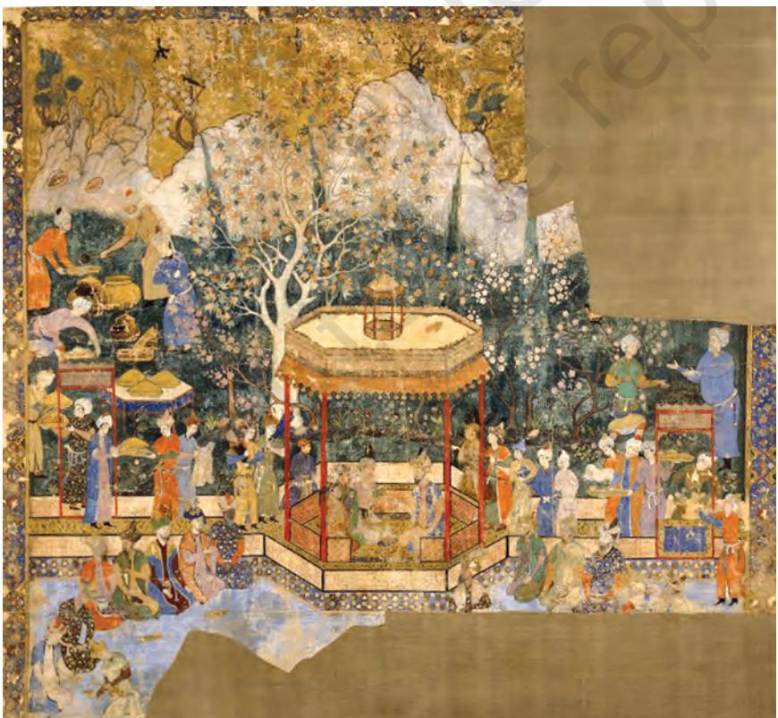

*Princes of the House of Timur, Abd us Samad, 1545–50, British Museum, London*

1_3.Mughal School Folder.indd 37 01 Sep 2020 02:16:00 PM

dainty but he did not draw the faces well; he used to greatly lengthen the double chin (*ghab-ghab*); and drew bearded faces admirably. Bihzad was a master artist from the Persian school of painting, Herat (now in present day Afghanistan), and was known for his sophisticated compositions and colour tints. Also, Shah Muzaffar finds a mention as a painter, who Babur thought excelled in the representation of hairstyle. Although Babur spent little time on the Indian soil and passed away soon after his arrival, his successors made the country their own and became a part of the Indian lineage.

Babur was succeeded by his son Humayun in 1530, who unfortunately fell prey to political unrest, and his life took many unexpected turns. Dethroned by an Afghan, Sher Khan (Sher Shah), Humayun took refuge in the court of the Safavid Persian ruler, Shah Tahmasp. Although inglorious for his political career, this was fortunate for the startling turn that the art of manuscript and painting under him took as a result of his stay in Safavid. It was during his exile in Shah Tahmasp's court that Humanyun witnessed the magnificent artistic tradition of miniature paintings and manuscripts. He was thrilled to see the skillful artists in practice, creating splendid works of art for Shah Tahmasp. With the assistance

of Shah Tahmasp, Humayun established his court in Kabul in 1545. Humayun increasingly identified himself with a political and cultural agenda for his dynastic empire that was eclectic and assimilative. Impressed by the artists and with an ambition to recreate such art workshops in India, Humayun brought back with him the master artists when he regained power in India. He invited two Persian artists—Mir Sayyid Ali and Abd us Samad to establish a studio in his court and carry out royal paintings. It is important to note here that both the artists were famous and respected particularly for their skills in the art of portraiture.

A bibliophile of discerning sensitivity, Humayun's rule began a period of intense patronage for the art of painting and calligraphy. From his period, we get clear visual and textual documents that testify an active

*Tutinama: The Girl and the Parrot, 1580–1585, Chester Beatty Library, Dublin*

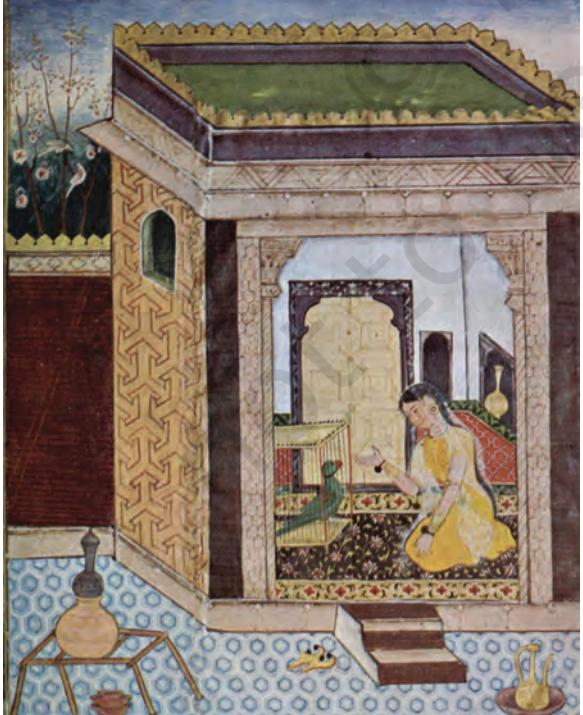

1_3.Mughal School Folder.indd 38 01 Sep 2020 02:16:00 PM

interest in building an artistic repertoire and an imperial atelier. This is an indication of Humayun's artistic taste and helps us form a picture of Humayun as a connoisseur and an aesthete. He founded the *Nigaar Khana* (painting workshop), which was also a part of his library. Not much is known about the size and composition of Humayun's workshop in India. However, it is known that he started the project of illustration of *Hamza Nama* that was continued by his son and successor Akbar.

When we look at an extraordinary Mughal painting from the early period, *Princes of the House of Timur* (1545–50), probably by Safavid artist, Abd us Samad, in opaque watercolour on cotton, we are surprised by its size and complex structure and display of historical portraits. A prized possession of the imperial family, it has portraits that were painted over the original to register the portraits of successive members of the Mughal dynasty. So, visible in their physical likeness are portraits of Akbar, Jahangir and Shah Jahan painted subsequently over those painted during the reign of Humayun.

Open air painting with trees and blossoms, and royal merrymaking, which depicts the ancestral members of the Mughal dynasty were followed after Humayun, who was the patron of this kind of artwork. The format, theme, figures and colour palette are remarkably Persian. There is indeed at this point we may state that there is no particular dominant element having Indian inspiration. But soon, this vocabulary changes to accommodate the growing and peculiar Mughal sensibility and distinct imperial taste.

The tradition and fascination for painting started by Humayun was carried forward by his illustrious son Akbar (1556–1605). Abul Fazal, the court historian of Akbar, writes about Akbar's passion for arts. He records that more than a hundred artists were employed in the royal atelier. This included the most skilled Persian and indigenous Indian artists of that time. This integrated composition of Indo-Persian artists led to the development of a unique style in this period. These artists together undertook ambitious projects that established new artistic

*Babur inspecting the fort of Gwalior, Bhure, Baburnama, 1598, National Museum, New Delhi*

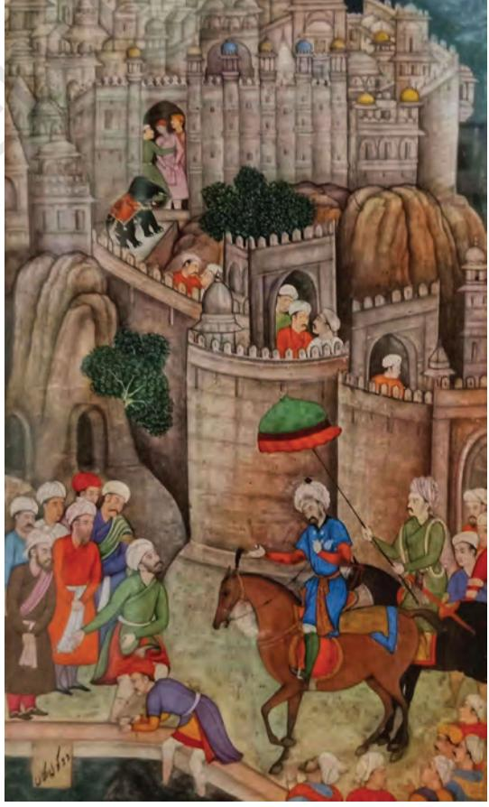

1_3.Mughal School Folder.indd 39 01 Sep 2020 02:16:00 PM

standards with regard to visual language, as well as, subject matter. Akbar, believed to be suffering from dyslexia (a condition where a person finds difficulty in reading), laid great emphasis on illustration of manuscripts. It was under his patronage that several seminal projects of translation and illustration of manuscripts were carried out.

The earliest of his projects is the continuation of his father's artistic legacy of *Hamza Nama*, an illustrated account of the heroic deeds of Hamza, the uncle of Prophet Muhammad. Akbar took delight in hearing the stories of Hamza, a character much loved in the Middle East popular and intellectual circles, which were read out aloud by a professional narrator. Simultaneously, the corresponding folios and painted *Hamza Nama* narrative was held for a clear view. The emperor took great interest in both pictorial narrative, as well as, recitation of *Hamza Nama*. Because of the peculiar function of these paintings, their format is large. The base surface is cloth with paper at the back, on which the narrative text is written to help the narrator and the technique applied is gouache, which is water-based and in opaque colours.

One realises that Mughal paintings were a teamwork by a group of artists, who could be inspired by a number of artistic traditions. The immediate natural surroundings

> became the resource from which the images of flora and fauna were derived and painted. The painted folios of *Hamza Nama* are scattered all over the world and housed in various collections. It is recorded to have consisted of 14 volumes with 1400 illustrations and took nearly 15 years to be completed. The suggested date of this magnificent project is 1567–1582 and was completed under the supervision of two Persian masters—Mir Sayyid Ali and Abd us Samad.

> In *Hamza Nama* painting, *Spies Attack the City of Kaymar* (1567–82), the space is sharply cut and divided so as to facilitate visual reading of the narrative. Too much of action is happening and the vibrant colours are of great use here to energise the unfolding of this story, wherein, the spies of Hamza attack the city of Kaymar. A strong outer line defines the foliage and other forms. The faces are largely

*Spies of Hamza attack the City of Kaymar, 1567–1582, Museum of Applied Arts, Vienna* 

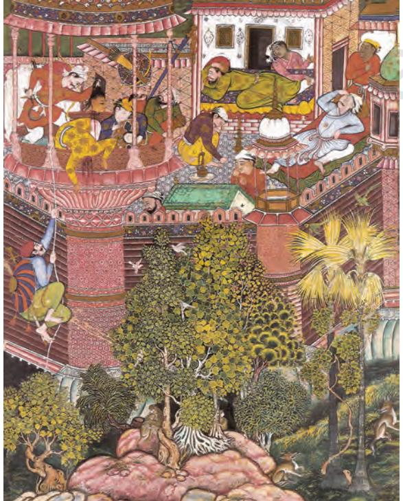

1_3.Mughal School Folder.indd 40 01 Sep 2020 02:16:01 PM

seen in profile. However, three–fourth faces are also shown. The rich intricate patterns on the floor, columns and canopy are from Persian sources as also the four-limbed animals and rocks. Trees and creepers indicate Indian source as also the rich palette of pure yellows, reds and browns.

Akbar envisioned cultural integration and commissioned translation of several revered Hindu texts. He commissioned translation and illustration of revered Sanskrit texts into Persian. The Persian translation and illustrated version of the Hindu epic *Mahabharata* done this period came to be known as *Razm Nama*. This was completed in 1589 under the supervision of master artist Daswant. This manuscript was scribed in ornate calligraphy and contained 169 paintings. The translation and illustration of the *Ramayana* were also carried out around this time. Artists like Govardhan and Miskin were celebrated for their visuals of court scenes. *Akbar Nama*, an extraordinary manuscript, containing a detailed account of Akbar's political and personal life, was one of the most expensive projects undertaken by Akbar.

Akbar personally engaged with the artists, and supervised and evaluated the artworks. The Mughal painting under Akbar's patronage depicted a variety of subjects, including, detailed political conquests, seminal court scenes, secular texts, portraits of important men along with Hindu mythologies, and Persian and Islamic themes. Akbar's fascination for Indian scriptures and regard for India made him one of the most popular emperors of the country.

In most of the paintings, produced from the time that the Europeans were in contact with the court of Akbar, we can see an increasing preference for a category of naturalism adapted to compliment the growing diversity in medieval India. *Madonna and Child* (1580) done in opaque watercolour on paper is an important early work of the Mughal School of Painting in this context. Madonna, here, is an extraordinary theme, which brings the Byzantine art, the European classical and its Renaissance to the Mughal atelier, where it is translated and transformed into an entirely different visual experience. Virgin Mary is draped in a classical manner. The attachment displayed between the mother and the child was inspired by the humanist interpretation in the European Renaissance art. The physiology of the child, certain details like the fan and jewellery completely integrated the work to an Indian milieu.

1_3.Mughal School Folder.indd 41 01 Sep 2020 02:16:01 PM

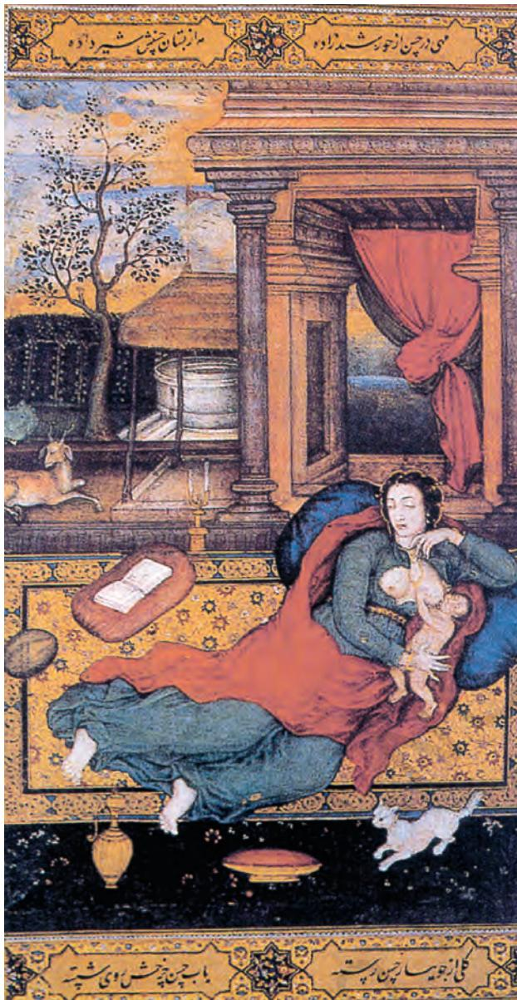

*Madonna and Child, Basawan,1590, San Diego Museum of Art, California*

Inspired by Akbar's interest in arts, many sub-imperial courts absorbed this passion and several great works of art were produced for aristocratic families, who tried to copy the Mughal court atelier taste and produced works that present distinctive subjects and visual preferences in regional flavour.

Akbar had formalised the Mughal miniature style and set standards, which were further taken to new heights by his son Jahangir (1605–1627). Prince Salim, (Jahangir) showed interest in art from an early age. Unlike his father Akbar, who commissioned paintings and manuscripts of politically and religiously significant aspects, Prince Salim had a curious taste and encouraged delicate observations and fine details.

Jahangir employed Aqa Riza, a well-known Iranian painter and his son Abul Hasan to achieve unparalleled sophistication in painting. Despite the formalised and established imperial atelier of Akbar, the keen patron in Jahangir rebelled to set his own atelier alongside his father's. Prince Salim came to be known as Jahangir—the World Seizer once he acquired the Mughal throne after his return from Allahabad. *Tuzuk-i-Jahangiri*, the memoirs of Jahangir, tells about his great interest in arts and his efforts of achieving

scientific correctness in the rendering flora and fauna that interested the Emperor the most. Under his patronage, the Mughal painting achieved naturalism and scientific accuracy of the highest degree. The curiosity and wonderment that the Emperor had for nature and people around him is reflected in the works that he commissioned.

In contrast to the Akbar's atelier, where the works were mass produced, Jahangir's atelier gave preference to a lesser number and better quality of artworks produced by a single master artist. The *Muraqqas* individual paintings to be mounted

1_3.Mughal School Folder.indd 42 01 Sep 2020 02:16:01 PM

in albums became popular under Jahangir's patronage. The margins of the paintings were highly illuminated in gold and embellished with flora, fauna, and often poised human figures. The war scenes, portraits, narrative and storytelling prevalent in Akbar's style were overtaken by minute details and refined rendering of lavish court scenes, aristocracy, royal personalities, as well as, character traits, and distinctiveness of flora and fauna.

Jahangir was presented with paintings and decorative objects, depicting high arts from Europe, as gifts from the Europeans, who visited his court. With such a contact with the English Crown, Jahangir's fascination for European art and theme prompted him to have more such works in his collection. Many celebrated religious Christian themes were also produced in the royal atelier of Jahangir. Given this cultural and artistic exposure, European art sensibilities started making their way into the prevalent

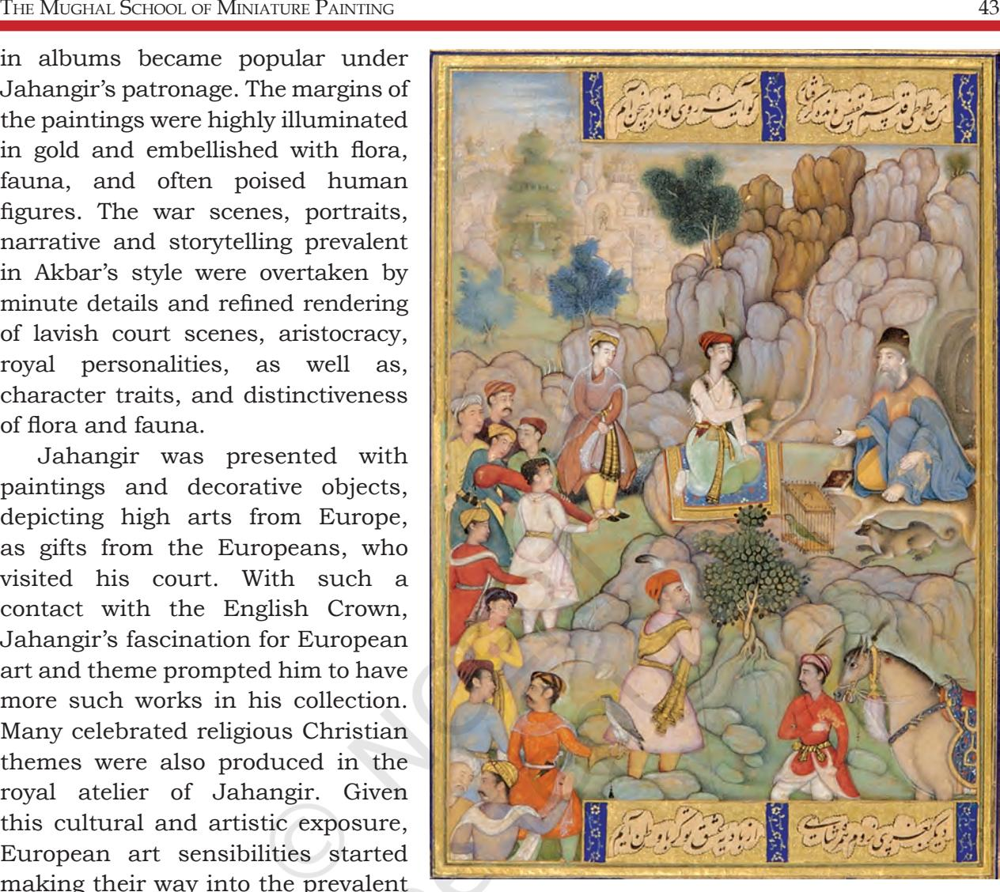

Indo-Iranian style, thereby, making the Jahangir school of art more impressive and vibrant. The spatial depth of the composition and naturalistic representation of life reflect the high benchmarks that the sensitive patron created for art during his lifetime. The artists of the Mughal atelier creatively assimilated the three styles—indigenous, Persian and European, making the Mughal Art School a melting pot of vibrant styles of its time yet very distinct in its own way.

*Jahangir in Darbar* from *Jahangirnama* (now, dispersed), attributed to Abul Hasan and Manohar (1620) is an excellent painting. Jahangir is at the highest level in the centre, where the eyes move immediately from his figured frame to stunning white pillars surrounded by sparkling clear colours and brilliantly framed overhead canopy. On the right side,

*A Prince and a Hermit, folio from Diwan of Amir Shahi, 1595, Aga Khan Museum, Canada*

1_3.Mughal School Folder.indd 43 01 Sep 2020 02:16:02 PM

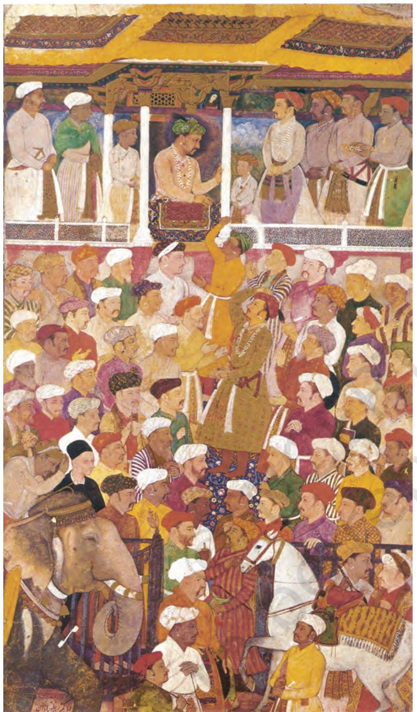

*Jahangir in Darbar, Jahangirnama, Abul Hasan and Manohar, 1620, Museum of Fine Arts, Boston*

Khurram stands in attendance with his hands folded, flanked by his son Shuja, son of Mumtaz Mahal, who was raised in the court by Nur Jahan. The courtiers, who are placed according to their ranks, are easily identifiable as their portraiture is perfect and realistic. Father Corsi, a Jesuit priest, has his name inscribed to aid easy identification as he stands with other known nobles in the audience. Elephant and horse add to the ceremonious importance to this event as hands are raised and heads bow to salute Jahangir.

*Jahangir's Dream* (1618–22) by Abul Hasan, given the title *Nadir al Zaman*, meaning the 'Wonder of the Age', refers to the Emperor's dream, in which he was visited by Persian Safavid emperor Shah Abbas, his rival, who possessed the much desired province of Qandahar. Interpreting it as good omen, he had the court artist Abul Hasan paint the dream. In this painting, political fantasy takes over and the presence of Jahangir dominates the composition. The Persian Shah appears frail and vulnerable as he is embraced by

Jahangir. The kings stand on a globe, and between them, they hover over much of India and Middle East. Two animals sleep quietly. However, the symbolism of their depiction does not escape the viewer. The powerful lion, on which Jahangir towers, and the docile sheep, on which the Persian Shah stands, sharing a magnificent resplendent golden halo of the Sun and Moon held by two winged angels indicate of being inspired by the incoming European art motifs and imageries in the Mughal court.

1_3.Mughal School Folder.indd 44 01 Sep 2020 02:16:02 PM

In the painting, *Jahangir enthroned on an Hourglass* (1625), symbolism is creatively applied by the court painter, Bichitra, who can be seen on the emperor's right hand corner holding a painting in his hand, which would be his offering to the mighty emperor.

Persian calligraphy adorns the top and bottom, which in verse says that the Shahs of this world may stand before him as Jahangir prefers to have the dervishes. Portrait that resemble the Ottoman Sultan, King James I of England also stands on the right hand with gifts for the mighty emperor. Jahangir offers a book to Shaikh Husain of the Chisti Shrine, descendent of Shaikh Salim, in whose honour Akbar had named his son Salim.

The son of Jahangir, Prince Khurram, succeeded the throne of Delhi by the name Shah Jahan (1628–1658). With this, he not only acquired a politically stable empire but also the finest of artist and atelier. Shah Jahan encouraged the artists in the atelier to create magnificent works that were a blend of imagination and documentation. Idealisation and great stylisation were preferred over naturalistic rendering and accurate depiction. The artworks produced under his supervision concentrated on subliminal qualities and exalted beautification, which was created by the use of jewel-like colours, perfect rendering and intricate fine lines. The higher concepts in the painting were given much prominence and the visuals were created meticulously to cull out multitude of interpretations that a single painting could offer. His love for sparkling jewels and gems, passion for monumental architecture and subject choice of paintings inform us of the majestic image that he wanted to leave behind. Imperial portraits with glorious titles were painted to present the personality of the emperor himself.

*Padshahnama* (The Chronicles of the King) is one of the most exuberant painting projects undertaken by his court atelier and reflects the extraordinary manuscript that presents the height that Indian miniature painting achieved. The Mughal painting during this time depicted the impressive play of multiple perspectives, enchanting palate of colours

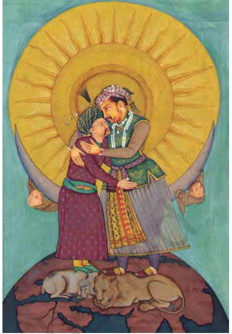

*Jahangir's Dream, Abul Hasan, 1618–1622, Smithsonian Institution, Washington D. C.*

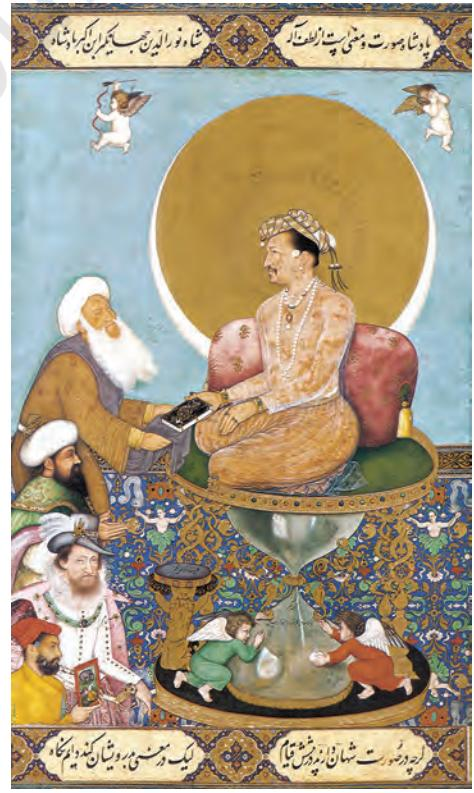

*Jahangir enthroned on an Hourglass, Bichitra, 1625, Smithsonian Institution, Washington D. C.*

1_3.Mughal School Folder.indd 45 01 Sep 2020 02:16:02 PM

and sophisticated compositions to portray royal, historical and mystic subjects.

The Mughal School of Painting, which had embraced and presented the exuberating blend of the leading art traditions of its contemporary world, began to inspire the European artists of that time. Rembrandt, a celebrated European painter, was deeply inspired by the Mughal court painting and made studies of several Indian drawings to master the delicate lines. His studies show the celebrated position that the Mughal miniature painting occupied in the world art scene.

The legitimate successor of Shah Jahan, his son Dara Shikoh, was denied his empire and life. As a liberal unorthodox Mughal, Dara's commitment to Sufi mysticism and deep interest in Vedantic school of thought was outstanding. His persona has been immortalised in this exceptional painting, *Dara Shikoh with Sages in a Garden* (1635). Loved by his people,

Dara, the scholar, who knew many languages, including Sanskrit, is the central theme here. A poet and connoisseur, he commissioned a special album of painting to gift his wife. Unfortunately, Dara, due to his passion for literature and philosophy, was misinterpreted as submissive and that his personality lacked dexterity for political administration. Dara, in apparent contrast to his brother Aurangzeb, was eclectic, philosophical and inclusive in his approach to ideological issues and conflicts.

In the war of succession that occurred in the lifetime of Shah Jahan, he was defeated by his brother Aurangzeb. Alamgir Aurangzeb came to power to stimulate the political scenario and give it the verve of Akbar's period. This succession and series of battles and conquest in Deccan India got the Mughal empire back

*Dara Shikoh with Sages in a Garden, Bichitra, early seventeenth century. Chester Beatty Library, Dublin*

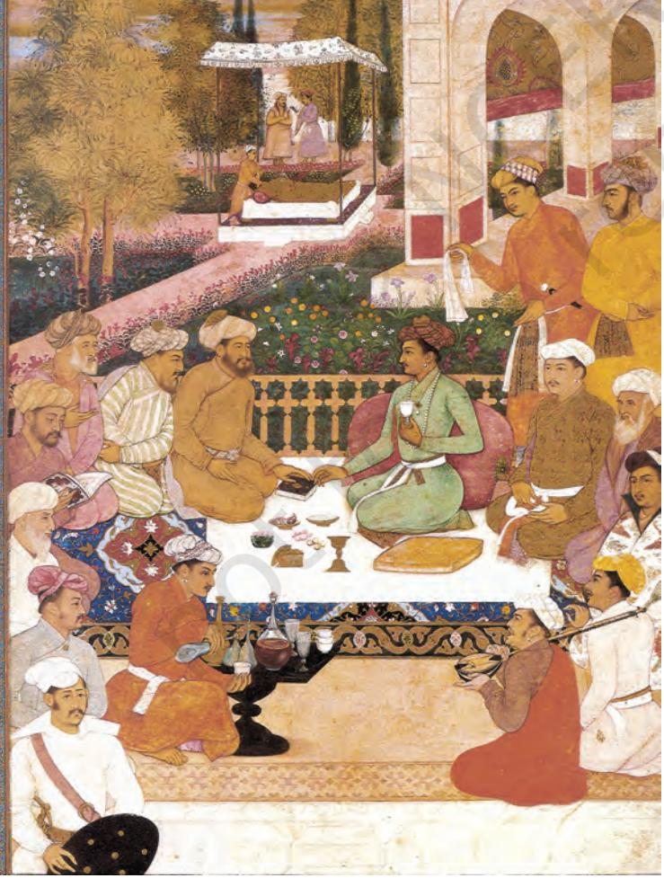

1_3.Mughal School Folder.indd 46 01 Sep 2020 02:16:03 PM

on track. His focus was on the expansion of the Mughal empire and its unification under his leadership. Aurangzeb did not put as much effort to elevate the production of the Mughal atelier. However, unlike the popular belief the royal atelier was not shut down immediately and continued producing beautiful pointings.

## Later Mughal Painting

Due to gradual decline of ardent patronage, highly skilled artists left the Mughal atelier and were welcomed by provincial Mughal rulers. These rulers imitated the Mughal royalties and wanted to recreate in paintings the glory of their dynasty and events of their court.

*Bahadur Shah Zafar, 1838, Fogg Museum of Art, Cambridge, UK*

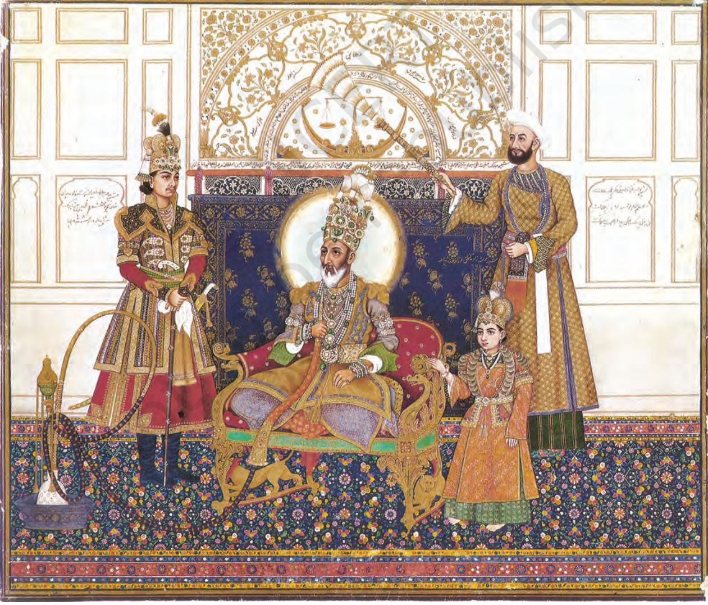

1_3.Mughal School Folder.indd 47 01 Sep 2020 02:16:03 PM

Although some masterworks were produced during the periods of Muhammad Shah Rangila, Shah Alam II and Bhadur Shah Zafar, these were mere last flickers in the candle that was the Mughal miniature style. Bahadur Shah Zafar, painting, dated 1838, was made about two decades before he was exiled to Burma by the British, who were quick to see that no claimant to Mughal authority remains anywhere near Delhi to claim their imperial authority, after the failure of the Indian Revolt of 1857. He was the last Mughal ruler, who was also a poet, scholar and connoisseur.

The new political environment, unsettled regional kingdoms and threat of English ascendancy changed the art scenario of India yet again. The painters thrived to suit the changing patrons, their aesthetic concerns, choice of subject matters and visual language. Eventually, the Mughal miniature style converged into other styles of the Provincial and Company School.

## Process of Mughal Painting

Most of the paintings that we see as Mughal miniatures were parts of manuscripts and royal albums, i.e., the visual and text shared space in a given format. For making book painting, the following process was adopted. Sheets of handmade paper were prepared and cut to suit the size of the manuscript. Designated space was left for the artist to fill it with a suitable visual composition. Then, the pages were ruled and filled with text. Once the text was written, it was given to the artist, who would compose a synoptic visual representation of the text. The artist would begin from the stage of making the composition, i.e., *tarh*, to portraits, i.e., *chiharanama* to the final stage of colouring, i.e., *rangamizi*.

## Colours and Technique of Mughal Painting

The painters in the atelier were also masters of art making colours. Mughal paintings were made on handmade paper, which was prepared especially for this purpose. The colours were opaque and were obtained from natural sources by grinding and mixing pigments to obtain perfect shades of colours. The paint was applied using a variety of brushes made with the hair of squirrels or kittens. In workshops, painting was a combined effort of a group of artists, among whom basic draft drawing, grinding and filling in of colours,

1_3.Mughal School Folder.indd 48 01 Sep 2020 02:16:03 PM

and adding details were, usually, distributed. However, they may also have been produced single handedly.

Thus, the artworks produced during the early Mughal phase were collaborative efforts of the team of artists. And based on one's specialisation, each artist would undertake an aspect of the painting that he was comfortable with or delegated. Records tell us that the artists were given incentives and increments in their salary according to the work done. The recorded names of the master artists also informs of the position that they enjoyed in the royal atelier.

Once the painting was complete, agate, a gemstone, was used to burnish the work to set the colours and give desired radiance to the painting.

Some of the pigments and colours achieved from those were—vermilion from cinnabar, ultramarine from Lapiz Lazuli, bright yellow from orpiment, shells grounded for making white and lampblack from charcoal. Gold and silver powders were mixed with colours or sprinkled to add extravagance to a painting.

#### **Project for Students**

Select around five quotations from a writer, poet or philosopher. Translate them into the language of your choice. Create a manuscript with your translation in a calligraphic style and ornate borders, drawing inspiration from the Mughal manuscripts.

#### **Exercise**

- 1. Name two master artists, who were invited to India by Humayun, and discuss their masterpieces in detail.
- 2. Out of the several art projects that Akbar undertook, discuss your favourite work, explaining what you like about it.
- 3. Make a comprehensive list of artists in the Mughal court, briefly explaining one painting of each in 100 words.
- 4. With examples of three paintings of your choice, discuss the indigenous Indian, Persian and European visual elements prevalent during the medieval period.

1_3.Mughal School Folder.indd 49 01 Sep 2020 02:16:03 PM

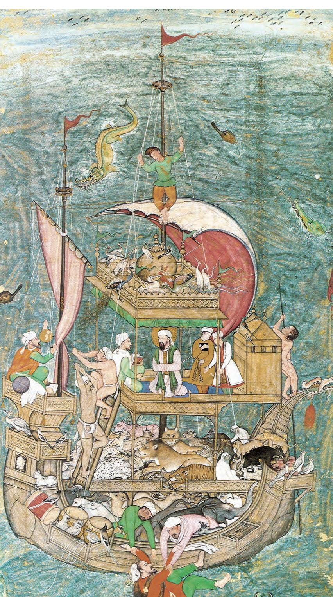

# **Noah's Ark**

Noah's Ark, from a dispersed *Divan-i Hafiz* painted manuscript of 1590, is an excellent painting in subdued colour palette and has been ascribed to Miskin, one of the masters at Akbar's imperial atelier. Prophet Noah is in the ark, which is carrying animals in pairs so that they may continue to flourish after the threatening flood sent by God to punish human beings for their sins.

In the painting, the sons of Noah are in the act of throwing Iblis, the devil, who had come to destroy the ark. The use of pure white and subtle shades of red, blue and yellow is charming. The rendering of water is convincing and the vertical perspective infuses the painting with an element of heightened dramatic energy. This painting lies in the collection of Freer Gallery of Art, Smithsonian Institution, Washington D. C., USA

1_3.Mughal School Folder.indd 50 01 Sep 2020 02:16:03 PM

# **Krishna lifts Mount Govardhan**

*Krishna Lifts Mount Govardhan* from a dispersed *Harivamsa Purana* is attributed to Miskin (1585–90). It is in the collection of the Metropolitan Museum of Art, New York, USA. *Harivamsa Purana* is one of the many Sanskrit manuscripts, which were translated into Persian by the Mughals. This painting is on a theme from *Harivamsa*. Badauni, a scholar noble in the court of Akbar, was assigned the job of translating this volume on Lord Krishna into Persian. It is interesting to note that Badauni was famous for his orthodox religious views, much unlike Abul Fazl, another famous scholar chronicler in Akbar's court.

Hari or Lord Krishna lifted the mountain, Govardhan, with all creatures dwelling therein with the intention to protect them—the villagers and their livestock, who were his followers, from torrential rain sent by another powerful God Indra. Hari uses the mountain like a huge umbrella, under which the entire village takes refuge.

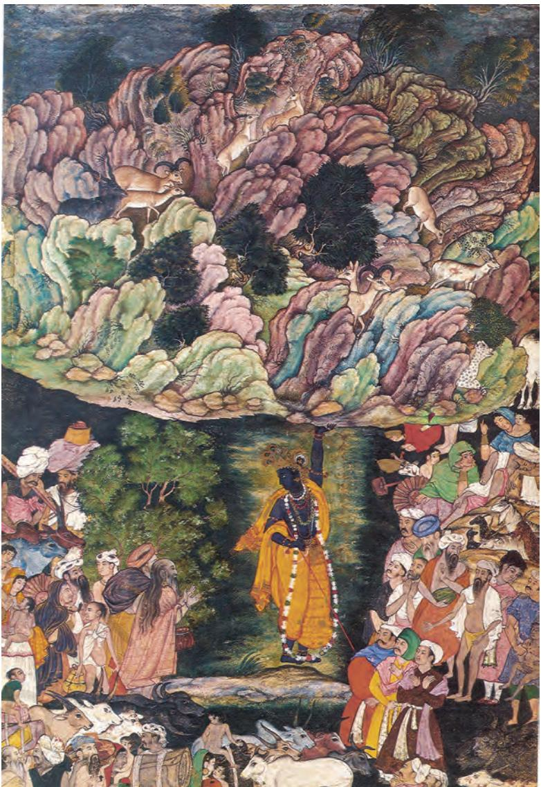

1_3.Mughal School Folder.indd 51 01 Sep 2020 02:16:04 PM

# **Falcon on a Bird Rest**

This painting by Ustad Mansur, *Nadir ul Asr*, a title received from Jahangir, is in the collection of Cleveland Museum of Art, Ohio, USA. Jahangir had fine falcons brought to his collection, and as a keen connoisseur, he had them painted. These images were included in his official biography *Jahangirnama*. There is an interesting episode described by him of a falcon brought as a present from Persian emperor Shah Abbas. This is to do with the falcon, which was mauled by a cat, resulting in its death, and the Emperor desired his painters to paint the dead falcon, preserving its memory for posterity.

The painting shown here, *Falcon Perched on a Bird Rest* (1615), is one of the many paintings that were painted by the Mughal artist, Ustad Mansur.

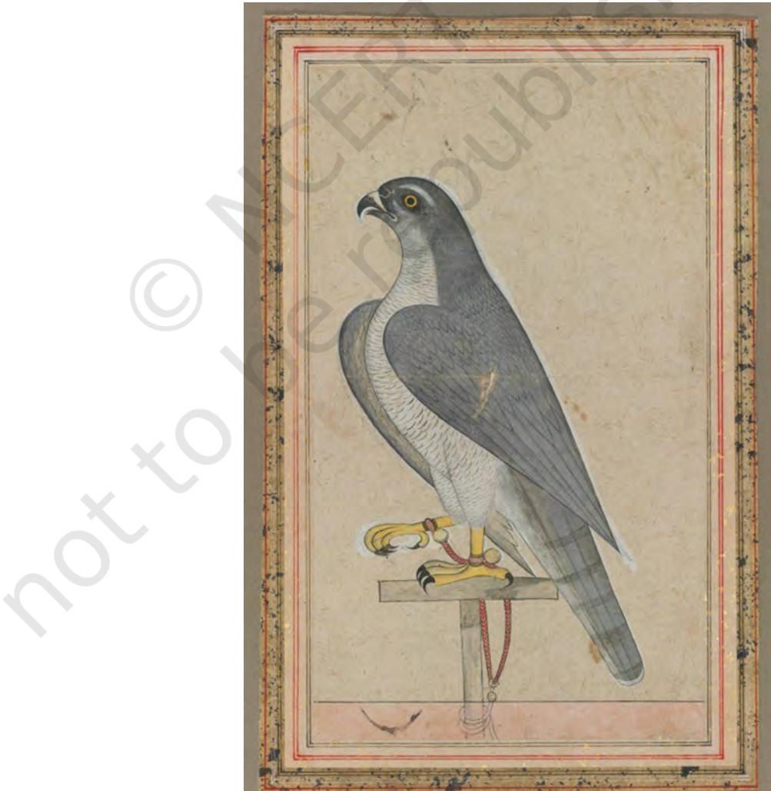

1_3.Mughal School Folder.indd 52 14-12-2021 11:38:51

# **Zebra**

The zebra in this painting was from Ethiopia, brought by Turks, and presented to Mughal emperor Jahangir by his nobleman Mir Ja'far, who had acquired it. Jahangir wrote on the painting in Persian, the court language, that it was: "A mule which the Turks (*rumiyan*) in the company of Mir Ja'far had brought from Ethiopia [Habesha]". Its likeness was drawn by Nadir ul asr (Wonder of the Age) Ustad Mansur. In *Jahangirnama*, it is clearly stated that the animal was presented to him during Nowruz or New Year festivities in March 1621. It is also mentioned that Jahangir had carefully examined it as some thought that it was a horse on which someone had painted stripes. Jahangir decided to send it to Shah Abbas of Iran, with whom he often exchanged rare and unique gifts, including animals and birds. And the Shah would also send him rare gifts like the Falcon discussed earlier.

The painting later came in Emperor Shah Jahan's possession. It was added to the royal album of paintings and calligraphies. The ornate borders of the painting are additions made in Shah Jahan's reign.

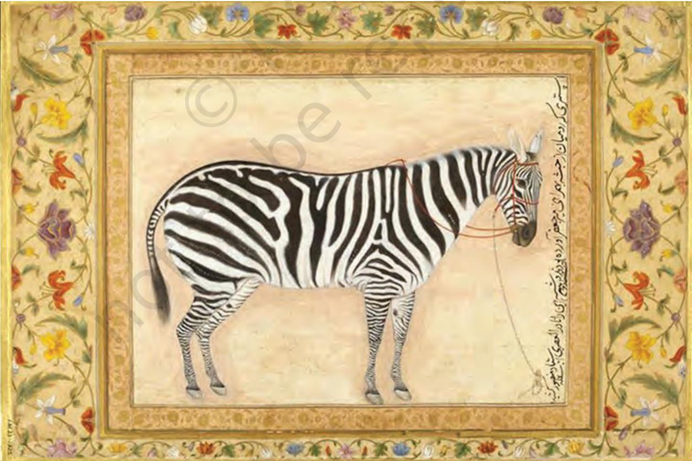

1_3.Mughal School Folder.indd 53 01 Sep 2020 02:16:05 PM

# **The Marriage Procession of Dara Shikoh**

This painting, a work by artist Haji Madni, belongs to the period of Shah Jahan, who built the Taj Mahal in Agra. It is a portrayal of the marriage procession of Dara Shikoh, the eldest son of Mughal emperor Shah Jahan. The Mughal prince is shown mounted on a brown stallion with the traditional *sehra* and is accompanied by his father, Shah Jahan, who has a resplendent nimbus around hid head, riding a white horse. The marriage procession is accompanied and received by music, dance, gifts and fireworks. The artist has created the glamour of the marriage procession with all its pomp and show. This painting is in the collection of the National Museum, New Delhi, India.

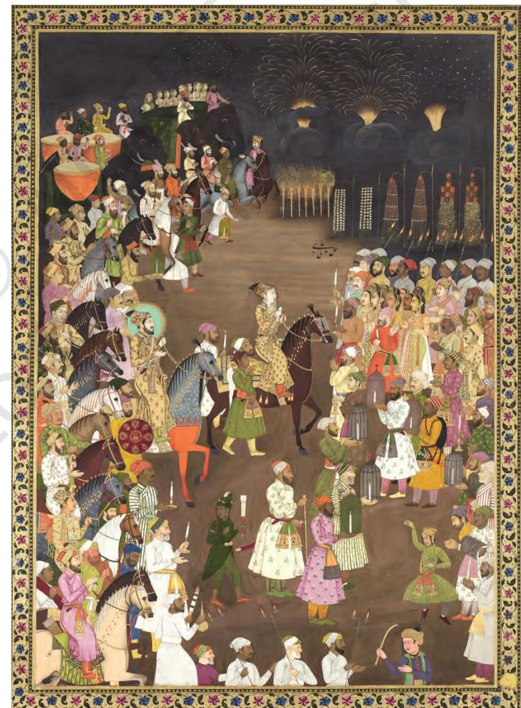

1_3.Mughal School Folder.indd 54 01 Sep 2020 02:16:05 PM

