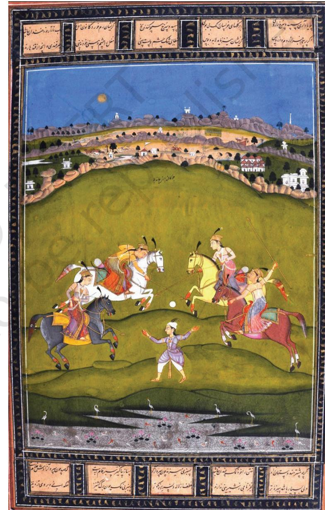

The history of Deccani Painting can largely be constructed from the late sixteenth century until the 1680s— the time when the Mughals conquered the Deccan. It is continued to be seen in the art of the nineteenth century, as well as, under the Asafiya dynasty, and finally, in paintings in the provincial courts of Rajas and Nawabs, ruling various lands in the State of Hyderabad under the Nizam.

The Deccani style of Painting was placed under the Indo-Persian art for long. It was considered to be Middle Eastern, Safavid, Persian, Turkish and even Mughal

in origin. Art historians acknowledged its uniqueness but failed to recognise it as a full-fledged school, which was sustained by a class of rulers, who had their peculiar political and cultural vision. They hired and nurtured artists and commissioned works that enhanced their artistic sensibilities and specific requirements of governance in their kingdoms.

The art of portraiture and representation of historical and religious figures are seen elsewhere in other contemporary schools of painting. Mughal portraiture, in this sense, was not wholly unique. We see such artistic inclinations in the Safavid and Ottoman Schools of Painting. The highly documentary nature of portraits is a singularly unique development seen extensively in the Asian Islamic art as also in the Mughal art in India.

In the plateau region of southern India, beyond the Vindhya mountain range, an endearing school of painting, which was distinct and strong, was nurtured and expanded under various Sultans of the Deccan in the sixteenth and seventeenth centuries.

*Sultan Adil Shah II playing Tambura, Farrukh Beg, Bijapur, 1595–1600, National Museum, Prague, Czech Republic*

1_4.The Deccani School of Painting.indd 55 01 Sep 2020 02:21:44 PM

The kingdoms of Bijapur, Golconda and Ahmadnagar developed highly sophisticated and distinct school of court painting. Its unique sensuality and intense colours have strong affinity to regional aesthetics. The school preferred dense composition and attempted to create an aura of romance, which invariably expressed itself in an idiom that was eloquently natural and vivid.

#### Ahmadnagar School of Painting

The earliest examples of Deccani painting are in a volume of poems, celebrating the reign of Hussain Nizam Shah I of Ahmadnagar (1553–1565). Most of the 12 miniatures that illustrate battle scenes are of no artistic interest, but interestingly, those depicting the queen and her marriage delight us with gorgeous colours and sensuous lines. The woman represented in it belongs to the northern tradition of pre-Mughal painting, which was flourishing especially in Malwa and Ahmedabad during this period. The women in the paintings of Ahmadnagar wear a modified northern costume with *choli* (bodice) and long braided pigtails, ending in a tassel. Only a long scarf, passing round the body below the hips, is a southern fashion, which is seen in the Lepakshi

*Tarif–i–Hussain Shahi: King sitting on the Throne, Ahmadnagar, 1565–1569, Bharata Itihasa Samshodaka Mandala, Poona*

frescoes. The palette is different from paintings of northern manuscripts, coming largely from the Mughal atelier, as they are more rich and brilliant. Paintings of the Deccan have similar characteristics. The high circular horizon and gold sky have Persian influence. We may see the debt of all Deccani kingdoms, which they owe to Persia for their landscape idiom.

These feminine dress, present in a series of *Ragamala* paintings, are the most striking and moving examples of the sixteenth century Deccan Schools of Painting. The women's hair is rolled up in a bun on the nape of the neck, similar to the Lepakshi murals. The horizon, in the painting, disappears and is replaced by a neutral coloured ground patterned all over with small stylised plants, or occupied by symmetrical architectural domes over the archades. All these features, except the hairstyle, have traces of north India or Persia.

1_4.The Deccani School of Painting.indd 56 01 Sep 2020 02:21:45 PM

Male costume is also decisively northern. The *jama* with pointed tails is frequently seen in early Akbari miniatures and probably originated in the area somewhere between Delhi and Ahmedabad. The small *pagri* is close to the form found in the earliest Akbari miniatures. The original paintings in the *Gulistan* of 1567 have been attributed by art historians to the Bukhara artists. Another interesting fact is that such painters may also have worked in the Deccan. This supported by a manuscript is now in the collection of Bankipore Library, Patna. It is signed by a scribe, Yusuf, and is dedicated to Ibrahim Adil (1569), presumably Ibrahim Qutb Shah of Golconda, who ruled from 1550–1580. This manuscript contains seven miniatures that are completely in the Bukhara idiom of that date.

#### Bijapur School of Painting

Paintings from Bijapur in the sixteenth century have a richly illustrated encyclopaedia known as the *Nujum al-Ulum* dated 1570. Among the 876 miniatures, which adorn this remarkable little volume, many illustrate weapons and

utensils, while others the constellations. The women are shown in south Indian dress, tall and slender as those in the *Ragamala* paintings. The school of Bijapur was patronised by Ali Adil Shah I (1558–1580) and his successor Ibrahim II (1580–1627), both patrons of art and literature. The latter was also an expert in Indian music and author of a book on this subject, *Nauras-nama.* He was the owner of *Nujum al-Ulum* manuscript and might have commissioned the *Ragamala* series in the 1590s. Bijapur had a close connection with Turkey and astronomical illustrations in *Nujum al-Ulum* may have been derived from Ottoman Turkish manuscripts. The *Ragamala* are, as we have seen, Indian in their connections, with definite echoes of the Lepakshi style. They exemplify the luxuriant aestheticism of the Adil Shah court in their daring and brilliantly successful colouring and vigour of simplified compositions. *The Throne of Prosperity* is a symbolic diagram of an auspicious throne of

*Nujum al-Ulum: The Throne of Prosperity, Bijapur, 1570, The Chester Beatty Library, Dublin, Ireland*

1_4.The Deccani School of Painting.indd 57 01 Sep 2020 02:21:45 PM

seven stages, each supported by different inhabitants—from elephants and tigers to palm trees, through storeys of peacocks and primitive tribes. The basic structures recall the wood carved doorways and facades of Gujarati homes or perhaps remind us of the temples of the Deccan. The colouring of this page is in Islamic Persian tradition, especially, the arabesques on the top of the throne. We see it is surmounted by a Deccani foliage against amazingly deep blue sky. The stylised plants on either side of the throne have visual reference to margin decoration in Gujarati manuscript of say early sixteenth century. There is, thus, a strong Indian visual tradition that structure this miniature.

The theme of another Deccani painting is *Yogini*—one who believes in *yoga*, leads a disciplined life of physical and emotional training, pursues spiritual and intellectual explorations, and is famous for renunciation of worldly

> attachments. But such an attitude was not usual, and therefore, extraordinary in practice.

> This work is attributed to an artist, about whom we do not have any record. It is to be noted that the artist prefers a vertical composition, where the long standing figure of the *Yogini* is complimented by a group of white structures right at the top, as a tapering, visual note. The *Yogini* is preoccupied with a *myna* bird as if in conversation. The *Yogini* is adorned with jewellery and her hair bun elongates her visual presence. The long scarves swirl in rhythmic circle around her body, which has exquisite flora surrounding it in exquisite landscape.

#### Golconda School of Painting

Golconda became an independent state in 1512. By the end of the sixteenth century, it was the wealthiest of the Deccan kingdoms. This was largely due to brisk trade from the ports along the east coast, from where iron and cotton goods were shipped to South East Asia. Meanwhile expansive trade continued with Persia, which became a rage in Europe

*Yogini, Bijapur, seventeenth century, The Chester Beatty Library, Dublin, Ireland*

1_4.The Deccani School of Painting.indd 58 01 Sep 2020 02:21:45 PM

and was greatly valued among painted cottons. Early in the seventeenth century, diamonds were discovered, expanding the source of revenue. The visuals from Golconda draw one's attention to the gold jewellery worn by both women and men. Besides, the themes of Golconda paintings gained exceptional fame.

Golconda's art became popular as Dutch merchants carried the portraits of sultans in the late seventeenth century to Europe. These were probably done for the bazaar and had references to royal paintings. The earlier Golconda paintings, dated 1635–1650, at times as large as eight feet high, were made to be used as wall hangings. These

paintings are covered with pictorial designs, generally, figures in architectural settings of varied origin.

The earliest five miniatures, identified as Golconda work, were bound up in *Diwan of Hafiz*, dated 1463. These paintings represent court scenes of a young ruler, who is depicted seated enthroned, holding a typically long and straight Deccani sword, in the centre of one of the painting folios. The Prince is seen wearing a white coat with embroidered vertical bands. All five painted pages are lavishly enriched with gold, touching deep azure sky. Dancing girls are seen entertaining the royal gathering. The symmetrical and apparently unfunctional architecture has several registers of flat screens one above the other. The ground appears covered with elaborately patterned carpets. It is important to note here that the painting suggests no Mughal influence. Purple hue is amply applied, and at times, animals become blue, so you see blue foxes.

There is a portrait of Muhammad Qutb Shah (1611–1626) as he sits on a *diwan* early in his reign. He wears this typical Golconda dress and an elegant tight-fitting cap. The composition has gained increased sophistication and skill, while the strict symmetry of the 1590 pages is retained. One may say there is adequate reference to

*Dancing before Muhammad Quli Qutb Shah, Golconda, 1590. British Museum, London, UK*

1_4.The Deccani School of Painting.indd 59 01 Sep 2020 02:21:45 PM

*Poet in a Garden, Muhammad Ali, Golconda, 1605–1615, Museum of Fine Arts, Boston, USA*

Mughal painting. We see a marked plastic rendering, especially, in the drape of the courteseans' and the groom's attire.

A manuscript of a Sufi poem with paraphrased prose is richly illustrated with more than 20 miniatures. Gold is again freely used. A peculiar feature seen is the colouring of the skies in gold and blue in separate bands. The men's and women's costumes indicate the fashion trend under Ibrahim II of Bijapur. The trees in the landscapes are of Deccani type, which are richly coloured and have a tinted edge. Moreover, plants are silhouetted against a mass of dark foliage, which is another prominent Deccani feature. This is seen in the painting of a tall woman speaking to a bird.

#### **Exercise**

- 1. What are the unique features of Deccani painting of *Yogini*? Find out about artists doing similar works nowadays.
- 2. What were the popular themes painted in the Deccani School? Describe some of them.
- 3. Write a note in 100 words on two paintings you like from the Deccani School.
- 4. How is the Deccani style of painting different from the Mughal style of painting?
- 5. What are the imperial symbols in a Deccani royal painting?
- 6. Which were the centres of painting in Deccan? Show them on a map.

1_4.The Deccani School of Painting.indd 60 01 Sep 2020 02:21:45 PM

## **Composite Horse**

The painting is a curious mix of many artistic devices, which culminate as *Composite Horse*. The painting includes human figures intertwined in a manner that emerges as an extraordinary form of a galloping horse superimposed on a decorated background. Flying cranes and lions, Chinese clouds and plants with large leaves enhance the surreal element of this painting from Golconda, which is of early seventeenth century. When everything appears to be airy and flying, the eyes unexpectedly encounter two corners in the bottom of the painting, which have rocky formulations that anchor the painting on a solid ground. A certain dislocation of sense of space happens, making this painting a memorable visual experience. All actions happen within limited colour schema, which remains largely in the shades of brown and some blue.

1_4.The Deccani School of Painting.indd 61 01 Sep 2020 02:21:46 PM

### **Sultan Ibrahim Adil Shah II hawking**

This is a painting of extraordinary energy and sensibility. The brilliant red on the limbs and tail of the horse, and the flowing garment of Sultan Ibrahim Adil Shah II render a visual experience, which remains with one. Besides, the dark dense forest foliage, deep olive green, emerald green and cobalt blue with cranes in the background and sunlit golden blue sky enhance the experience of the painting and its narrative, which brings the white hawk to the centrestage along with the delicately portrayed face of the sultan. Persian influence is evident in the treatment of the horse and rocks. The plants and dense landscape in the foreground are of native inspiration. The galloping horse generates energy, which visually activates the entire panoramic landscape. This painting is in the collection of the Institute of the Peoples of Asia, Academy of Sciences, Leningrad, Russia.

1_4.The Deccani School of Painting.indd 62 01 Sep 2020 02:21:46 PM

## **Ragini Pathamsika of Raga Hindola**

An intriguing work in the collection of National Museum, New Delhi, titled *Ragini Pathamsika of Raga Hindola*, an important member of the *Ragamala* family of the Indian musical mode, dates back to around 1590–95. Some scholars believe it to be from Bijapur, an important state of Deccan. Painting was a highly developed art form in the Deccani states, almost simultaneous with the development of the Mughal School of Painting. Persian influence is obvious in the painting. This is seen in the arabesque decoration on the surface of the two domes that delineate the upper part of the painting, where letters written in Devanagari script cover the space. Two beautifully dressed and bejewelled women are seen in the pavilion, while the third is seen outside it. The centrally placed female musician is playing

an Indian instrument, which appears to be *veena*, while the other two on the sides appear to be accompanying with rhythmic sway of their bodies. The colours are vibrant. Red is dominant and is complimented by green. The figures may be said to be stylised in the sense that the character of their physiology, including the face has been almost constructed on formulaic details. Nearly all forms are deeply emphasied with dark line. This is interestingly observable in the mural paintings of Ajanta, too, which were painted centuries ago. What is also to be noted here is a dark elephant in the left hand corner, with a raised trunk, a delightful sign of welcome. Small in scale, the elephant creates visual interest and breaks the architectonic structuring.

1_4.The Deccani School of Painting.indd 63 01 Sep 2020 02:21:46 PM

#### **Sultan Abdullah Qutb Shah**

An important portrait of Sultan Abdullah Qutb Shah of Bijapur is in the collection of National Museum, New Delhi, India. There is an inscription on the top in Persian. Sultan Abdullah Qutb Shah was an able ruler of the famous Deccani state of Bijapur, which attracted scholars and artists from various parts of the world. Here, he is enthroned and we can see him holding the sword in one hand, symbolising his political sovereignty. Besides, a halo is seen around his head, which depicts his divinity.

1_4.The Deccani School of Painting.indd 64 01 Sep 2020 02:21:46 PM

## **Hazrat Nizamuddin Auliya and Amir Khusrau**

This provincial painting in the collection of National Museum, New Delhi, is from Hyderabad, Deccan. It depicts Hazrat Nizamuddin Auliya, the revered Sufi saint of the thirteenth century, listening to music being played by his disciple, Hazrat Amir Khusrau, a renowned Indian poet and scholar. Even to this day, the *dargah* of Hazrat Nizamudin Auliya in New Delhi has *qawwali* by Khusrau in praise of his *pir*. Devotees from all over the world come here to witness this regular cultural practice. The painting is naive and basic without technical and artistic sophistication of a court painting. However, it is charming and narrative of a popular Indian theme.

1_4.The Deccani School of Painting.indd 65 01 Sep 2020 02:21:46 PM

#### **Chand Bibi playing Polo**

This painting shows Chand Bibi, the Queen of Bijapur, one of the most prosperous and culturally refined Deccani state. Chand Bibi resisted the Mughal political attempts to overtake the state by Emperor Akbar. A revered and accomplished ruler, Chand Bibi was a great sportsperson. Here, she is showing playing *chaugan*, the other name for equestrian polo game, a popular royal sport of the time. The painting appears to be provincial of much later period, and is in the collection of National Museum, New Delhi, India.

1_4.The Deccani School of Painting.indd 66 01 Sep 2020 02:21:46 PM

