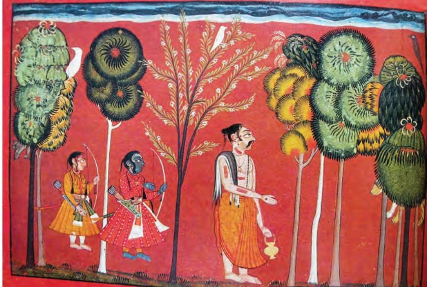

*P ahari* denotes 'hilly or mountainous' in origin. Pahari Schools of Painting includes towns, such as Basohli, Guler, Kangra, Kullu, Chamba, Mankot, Nurpur, Mandi, Bilaspur, Jammu and others in the hills of western Himalayas, which emerged as centres of painting from seventeenth to nineteenth century. Beginning at Basohli with a coarsely flamboyant style, it blossomed into the most exquisite and sophisticated style of Indian painting known as the Kangra School, through the Guler or pre-Kangra phase.

Unlike the distinguishing stylistic features of Mughal, Deccani and Rajasthani Schools, Pahari paintings demonstrate challenges in their territorial classification.

Though all the above centres crafted precisely individualistic characteristics in painting (through the depiction of nature, architecture, figural types, facial features, costumes, preference for particular colours and such other

things), they do not develop as independent schools with distinctive styles. Paucity of dated material, colophons and inscriptions also prevent informed categorisation.

The emergence of the Pahari School remains unclear, though scholars have cautiously proposed theories concerning its beginning and influences. It is widely accepted that Mughal and Rajasthani styles of paintings were known in the hills probably through examples of Provincial Mughal style and family relationships of hill Rajas with the royal courts of Rajasthan. However, the flamboyantly bold Basohli-like style is, generally, understood to be the earliest prevailing pictorial language. B. N. Goswamy, one of the most significant scholars of the Pahari Schools of Painting, has attributed the shaping of Pahari style from

*Krishna steals butter, Bhagvata Purana, 1750, N. C. Mehta Collection, Ahmedabad, Gujarat, India*

1_5.Pahari Painting.indd 67 01 Sep 2020 02:32:07 PM

the simplicity of Basohli to poetic lyricism and refinement of Kangra to the ingenuity of a family of artists through his scholarly approach of family as the basis of style. His central argument is that the family of Pandit Seu (Shiv) was chiefly responsible for the course of Pahari paintings. He argues that identifying Pahari paintings on the basis of regions could be misleading as political boundaries were always fluid. This argument is also true for Rajasthani schools as attribution merely by regions creates vagueness and several disparities remain unexplained. Hence, if a family of artists is considered as the style bearer, justification of multiple strands of a style can be accommodated within the same region and school.

Scholars agree that in the early eighteenth century, the style of the Seu family and others conformed to the Basohli idiom. However, from middle of the eighteenth century, the style transformed through a pre-Kangra phase, maturing into the Kangra style. This abrupt transformation in style and beginning of experimentation, which gave rise to varied stylistic idioms related to different Pahari centres, is largely ascribed to responses by various artist families and paintings (especially, the Mughal style) that were introduced

> in the Pahari kingdoms. This sudden arrival of paintings, which might have been introduced through rulers, artists, traders or any such agency or event, impacted local artists and profoundly influenced their painting language.

> Most scholars, now, dispute the earlier hypothesis that the sudden change was caused and initiated by the migration of artists from the Mughal atelier.

For Goswamy, it was the naturalism in these paintings that appealed to the sensibilities of Pahari artists.

Compositions, worked out from a relative point of view, show some paintings with decorated margins. Themes that included recording the daily routine or important occasions from the lives of kings, creation of new prototype for female form and an idealised face, are all associated with this newly emerging style that gradually matures to the Kangra phase.

*Rama and Sita in the forest, Kangra, 1780, Douglas Barrett Collection, UK*

1_5.Pahari Painting.indd 68 14-12-2021 11:56:23

## Basohli School

The first and most dramatic example of work from the hill states is from Basohli. From 1678 to 1695, Kirpal Pal, an enlightened prince, ruled the state. Under him, Basohli developed a distinctive and magnificent style. It is characterised by a strong use of primary colours and warm yellows—filling the background and horizon, stylised treatment of vegetation and raised white paint for imitating the representation of pearls in ornaments. However, the most significant characteristic of Basohli painting is the use of small, shiny green particles of beetle wings to delineate jewellery and simulate the effect of emeralds. In their vibrant palette and elegance, they share the aesthetics of the Chaurpanchashika group of paintings of Western India.

The most popular theme of Basohli painters was the *Rasamanjari* of Bhanu Datta. In 1694–95, Devida, a *tarkhan*  (carpenter–painter)*,* did a magnificent series for his patron Kirpal Pal. *Bhagvata Purana* and *Ragamala* were other popular themes. Artists also painted portraits of local kings with their consorts, courtiers, astrologers, mendicants,

*Rasamanjari, Basohli, 1720, British Museum, London, UK*

1_5.Pahari Painting.indd 69 01 Sep 2020 02:32:07 PM

*Rama gives away his possessions, Ayodhya Kanda, Shangri Ramayana, 1690–1700, Los Angeles County Museum of Art, USA*

> courtesans and others. While artist ateliers from Basohli, gradually, spread to other hill states, such as Chamba and Kullu, giving rise to local variations of the Basohli *kalam.* A new style of painting came in vogue during 1690s to 1730s, which was referred to as the Guler–Kangra phase. Artists during this period indulged in experimentation and improvisations that finally resulted and moulded into the Kangra style.

> Hence, originating in Basohli, the style gradually spread to other hill states of Mankot, Nurpur, Kullu, Mandi, Bilaspur, Chamba, Guler and Kangra.

> The Sanskrit epic, *Ramayana*, was one of the favourite texts of the hill artists at Basohli, as well as, Kullu. This set derives its name from 'Shangri', the place of residence of a branch of the Kullu royal family, patrons and formerly possessors of this set. These works of Kullu artists were influenced in varying degrees by the styles of Basohli and Bilaspur.

> Rama learns of his exile and prepares to leave Ayodhya along with his wife Sita and brother Lakshmana. Maintaining equanimity of mind, Rama indulges in his last acts of giving away his possessions. At the request of Rama, his brother piles up his belongings and the crowd begins to gather to receive the largesse of their beloved Rama—jewellery, sacrificial vessels, thousand cows and other treasures.

1_5.Pahari Painting.indd 70 01 Sep 2020 02:32:07 PM

*Rama and Lakshmana following sage Vishvamitra to the forest, Bala Kanda, Shangri Ramayana 1680–1688, Raja Raghbir Singh Collection, Shangri, Kullu Valley, India*

Set apart on the left are the two princes with Sita standing on a carpet with a crowd of recipients moving towards them. The painter carefully introduces different types—recluses, Brahmins, courtiers, commoners and servants of the royal household. The bounteous gifts represented are pile of gold coins and garments on the carpet, and cows and calves unaware of the momentous event, beseechingly looking at Rama with necks stretched, gazes fixed and mouths wide open. The gravity of the situation is sensitively portrayed through varying expressions—the serene but gently smiling Rama, curious Lakshmana, an apprehensive Sita, Brahmins willing to receive but with no pleasure, and others with expressions of disbelief and gratitude. Taking pleasure in achieving fine effects, the artist delightfully depicts transparency of the garment Rama is holding out, stippled beard on the cheek and chin of the Brahmins, *tilak* marks, jewellery and weapons.

Another painting from the same set depicts Rama and Lakshmana accompanying sage Vishvamitra to the forest to defeat the demons, who would distress the hermits by disturbing their meditative practices and contaminating their rituals. An interesting feature of this painting is the representation of animals, stealthily prowling behind trees, half hidden in the heavy outgrowth. A clever fragmentary portrayal of a wolf on the left and a tiger on the right by

1_5.Pahari Painting.indd 71 01 Sep 2020 02:32:08 PM

the artist not only lends character to the forest as a thick impenetrable jungle, populated with ferocious animals hiding everywhere, but also adds an emotive value to the painting regarding the extraordinary courage of the two young princes. The fractional representation of animals adds mystery to the work as there is a possibility of them being demons in disguise.

## Guler School

The first quarter of the eighteenth century saw a complete transformation in the Basohli style, initiating the Guler–Kangra phase. This phase first appeared in Guler, a high-ranking branch of the Kangra royal family, under the patronage of Raja Govardhan Chand (1744–1773). Guler artist Pandit Seu with his sons Manak and Nainsukh are attributed with changing the course of painting around 1730–40 to a new style, usually, referred to as the pre–Kangra or Guler–Kangra *kalam*. This style is more refined, subdued and elegant compared to the bold vitality of the Basohli style. Though initiated by Manak, also called Manaku, his brother Nainsukh, who became the court painter of Raja Balwant Singh of Jasrota, is responsible for shaping the Guler School emphatically. The most matured version of this style entered Kangra during the 1780s, thus, developing into the Kangra School while the offshoots of Basohli continued in Chamba and Kullu, India.

*Balwant Singh in prayer, Nainsukh, 1750, Victoria and Albert Museum, London, UK*

1_5.Pahari Painting.indd 72 01 Sep 2020 02:32:08 PM

Sons and grandsons of Manak and Nainsukh worked at many other centres and are responsible for the finest examples of Pahari paintings.

Guler appears to have a long tradition of paintings amongst all Pahari schools. There is evidence that artists were working in Haripur–Guler ever since the reign of Dalip Singh (1695–1743) as many of his and his son Bishan Singh's portraits, dating back to earlier than 1730s, i.e., before the beginning of the Guler–Kangra phase can be found. Bishan Singh died during the lifetime of his father Dalip Singh. So, his younger brother Govardhan Chand ascended to the throne that witnessed a change in painting style.

Manak's most outstanding work is a set of *Gita Govinda*  painted in 1730 at Guler, retaining some of the elements of the Basohli style, most strikingly the lavish use of beetle's wing casings.

Nainsukh appears to have left his hometown in Guler and moved to Jasrota. He is believed to have initially worked for Mian Zoravar Singh, whose son and successor Balwant Singh of Jasrota was to become his greatest patron. Nainsukh's celebrated pictures of Balwant Singh are unique in the kind of visual record they offer of the patron's life. Balwant Singh is portrayed engaged in various activities — performing *puja*, surveying a building site, sitting in a camp wrapped in a quilt because of the cold weather, and so on. The artist gratified his patron's obsession by painting him on every possible occasion. Nainsukh's genius was for individual portraiture that became a salient feature of the later Pahari style.

*Krishna embracing gopis, Gita Govinda, Guler, 1760–1765, N. C. Mehta Collection, Ahmedabad, Gujarat, India*

1_5.Pahari Painting.indd 73 01 Sep 2020 02:32:08 PM

His palette comprised delicate pastel shades with daring expanses of white or grey.

Manaku, too, did numerous portraits of his enthusiastic patron Raja Govardhan Chand and his family. Prakash Chand, successor of Govardhan Chand, shared his father's passion for art and had sons of Manaku and Nainsukh, Khushala, Fattu and Gaudhu as artists in his court.

## Kangra School

Painting in the Kangra region blossomed under the patronage of a remarkable ruler, Raja Sansar Chand (1775–1823). It is believed that when Prakash Chand of Guler came under grave financial crisis and could no longer maintain his atelier, his master artist, Manaku, and his sons took service under Sansar Chand of Kangra.

Sansar Chand ascended to the throne at the tender age of 10 years after the kingdom had been restored to its earlier glory by his grandfather Ghamand Chand. They belonged to the Katoch dynasty of rulers, who had been ruling the Kangra region for a long time until Jahangir conquered their territory in the seventeenth century and made them his vassals. After the decline of the Mughal power, Raja Ghamand Chand recovered most of the territory and founded his capital town of Tira Sujanpur on the banks of river Beas and constructed fine monuments. He also maintained an atelier of artists.

*Kaliya Mardana, Bhagvata Purana, Kangra, 1785, National Museum, New Delhi, India*

1_5.Pahari Painting.indd 74 01 Sep 2020 02:32:08 PM

Raja Sansar Chand established supremacy of Kangra over all surrounding hill states. Tira Sujanpur emerged as the most prolific centre of painting under his patronage. An earlier phase of Kangra *kalam* paintings is witnessed in Alampur and the most matured paintings were painted at Nadaun, where Sansar Chand shifted later in his life. All these centres were on the banks of river Beas. Alampur along with river Beas can be recognised in some paintings. Less number of paintings was done in Kangra as it remained under the Mughals till 1786, and later, the Sikhs.

Sansar Chand's son Aniruddha Chand (1823–1831), too, was a generous patron and is often seen painted with his courtiers.

The Kangra style is by far the most poetic and lyrical of Indian styles marked with serene beauty and delicacy of execution. Characteristic features of the Kangra style are delicacy of line, brilliance of colour and minuteness of decorative details. Distinctive is the delineation of the female face, with straight nose in line with the forehead, which came in vogue around the 1790s is the most distinctive feature of this style.

Most popular themes that were painted were the *Bhagvata Purana*, *Gita Govinda, Nala Damayanti, Bihari* 

*Satsai, Ragamala* and *Baramasa*. Many other paintings comprise a pictorial record of Sansar Chand and his court. He is shown sitting by the riverside, listening to music, watching dancers, presiding over festivals, practising tent pegging and archery, drilling troops, and so on and forth. Fattu, Purkhu and Khushala are important painters of the Kangra style.

During Sansar Chand's reign, the production of Kangra School was far greater than any other hill state. He exercised wide political power and was able to support a large studio with artists from Guler and other areas. The Kangra style soon spread from Tira Sujanpur to Garhwal in the east and Kashmir in the west. Painting activity was severely affected around 1805 when the Gurkhas besieged the Kangra fort and Sansar Chand had to flee to his hill palace at Tira Sujanpur. In 1809, with

*Krishna playing Holi with gopis, Kangra, 1800, National Museum, New Delhi, India*

1_5.Pahari Painting.indd 75 01 Sep 2020 02:32:08 PM

the help of Ranjit Singh, the Gurkhas were driven away. Though Sansar Chand continued to maintain his atelier of artists, the work no longer paralleled masterpieces of the period 1785–1805.

This series of *Bhagvata Purana* paintings is one of the greatest achievements of Kangra artists. It is remarkable for its effortless naturalism, deft and vivid rendering of figures in unusual poses that crisply portray dramatic scenes. The principal master is believed to have been a descendent of Nainsukh, commanding much of his skill.

*Re-enacting Krishna's deeds, Bhagvata Purana, Guler–Kangra, India, 1780–85, Private Collection*

> This painting is a depiction from *Rasa Panchdhyayi*, a group of five chapters from the *Bhagvata Purana* devoted to the philosophical concept of *Rasa*. It has passages that speak movingly of the love that *gopis* have for Krishna. Their pain is real when Krishna suddenly disappears. In their forlorn state of separation, they appear utterly devastated with the fruitlessness of search when the deer, trees or creepers, whom they address in their distracted state, do not have answers to their piteous questions regarding the whereabouts of Krishna.

> With minds engrossed in thoughts of Krishna, the *gopis* recall and enact his various *lilas* or feats. Some of them being—the killing of Putana, liberation of Yamala–Arjun after Krishna was tied to a mortar by Yashoda, lifting of Mount Govardhan and rescuing the inhabitants of Braj from the heavy downpour and wrath of Indra, subduing of serpent

1_5.Pahari Painting.indd 76 01 Sep 2020 02:32:08 PM

Kaliya, and the intoxicating call and allure of Krishna's flute. The *gopis* take on different roles and emulate his divine sports.

The artist captures and evokes these sensitive images exquisitely in this folio. On the extreme left, a *gopi* enacts Krishna's part as she bends forward and appears to suck the bosom of another *gopi,* who plays the role of Putana and raises her hand to the head in response, as if dying while her breath is being sucked away. Next to them, another *gopi* enacts the character of Yashoda, who along with other *gopis*, holds out her garment in a gesture of removing the evil eye after the young Krishna performed the brave feat of killing Putana.

In the group beside this towards the right, a *gopi* enacts the mortar to which another *gopi*, who plays the role of young Krishna, is tied with a cloth band, while his mother admonishingly stands holding a stick in her hands. In the adjoining group, a *gopi*, sporting a turban, lifts her piled up *odhni* atop in the guise of lifting Mount Govardhan, while others seek protection underneath. To the extreme left in the bottom, a *gopi* enacts Krishna, who is playing flute, as some *gopis* dance and sing, and others crawl towards him,

disentangling themselves from their angry mothers-in-law, who try to drag and hold them back from going. In the most magnificent of these cameos to the extreme bottom in the right, a *gopi* hurls a blue garment edged with gold over the ground, which takes the form of the multiple hooded serpent Kaliya, upon whom she dances like Krishna.

Depiction of *Ashta Nayikas* or eight heroines is one of the most painted themes in Pahari paintings, involving the depiction of women in various dispositions and emotive states. To mention a few—*Utka* is the one who is anticipating the arrival of her beloved and patiently waits for him*, Svandhinpatika* is the one whose husband is subject to her will, *Vasaksajja* awaits her beloved's return from a voyage and decorates the bed with flowers in a welcoming gesture, and *Kalahantarita* is the one who resists her beloved when he seeks to soften her pride and repents when he comes late.

*Abhisarika Nayika, Kangra, 1810–20, Government Museum and Art Gallery, Chandigarh, India*

1_5.Pahari Painting.indd 77 01 Sep 2020 02:32:08 PM

*A couple in the month of Jyestha, Kangra, 1800, National Museum, New Delhi, India*

Even though describing *Ashta Nayikas* remained a favourite among poets and painters, none of them is treated with as much flair as the *Abhisarika*, one who hastens to meet her beloved braving all hazards. The situation conceived is, generally, full of bizarre and dramatic possibilities with the passion and steadfastness of the *nayika,* triumphing against the opposing elements of nature.

In this painting, the *sakhi* is recounting how the *nayika* crossed the woods in the night to meet her beloved. The *yoga*, the poet speaks of, refers to the single-mindedness of purpose with which the *nayika* moves through the dark forest in the night.

The broad iconography of the *Abhisarika* remains much the same. However, at times, painters vary their renderings in some measure. The *ghouls* that, usually, appear in many versions are omitted here. But the darkness of

the night, flashes of lighting, murky clouds, snakes hissing about in the dark, emerging from hollows of the trees and falling jewellery are all painted.

The *Baramasa* paintings, consisting of 12 folios, illustrating the modes of love or courtship appropriate to each month of the year had become a popular theme in the hills during the nineteenth century.

An account of *Baramasa* is given by Keshav Das in the tenth chapter of *Kavipriya*. He, thus, describes the hot month of *Jyeshtha*, which falls in the months of May and June. The painter takes utmost delight in depicting all analogues as described by the poet.

The Kangra School came to fore in the 1780s while the offshoots of the Basohli style emerged and continued in centres such as Chamba, Kullu, Nurpur, Mankot, Jasrota, Mandi, Bilaspur, Jammu and others with some of their specific characteristics. In Kashmir (1846–1885), the Kangra style initiated a local school of Hindu book illumination. The Sikhs employed other Kangra painters eventually.

There is a broad classification of three styles—Basohli, Guler and Kangra, and scholars may have variant terms for the same. However, these are indicative centres from where the style travels elsewhere. Hence, in Jasrota, as one observes the Guler style, it becomes categorised under the Guler

1_5.Pahari Painting.indd 78 01 Sep 2020 02:32:08 PM

School with Jasrota as one of its centres. Briefly mentioning the aspects of the other centres, one finds portraits of the rulers of Chamba in the seventeenth and early eighteenth century in the Basohli style.

Kullu emerged with a distinctive style, where figures had a prominent chin and wide open eyes, and lavish use of grey and terracotta red colours in the background was made. *Shangri Ramayana* is a well-known set painted in the Kullu Valley in the last quarter of the seventeenth century. Paintings of this set vary from each other in style, and, thus it is believed that these were painted by different sets of artists. It is believed that when the Basohli style had outgrown itself and matured into the Kangra style, Nurpur artists retained the vibrant colours of Basohli with the dainty figure types of Kangra.

Due to marital relations between Basohli and Mankot, few artists from Basohli seem to have shifted to Mankot, thereby, developing a similar school of painting. While Jasrota had an indulgent patron in Balwant Singh and the school is well-known through his numerous portraits painted by his court artist, Nainsukh, who led the earlier simple Basohli style to new sophistication. This style of Nainsukh is also referred to as the Guler–Kangra style.

Rulers of Mandi were ardent worshippers of Vishnu and Shiva. Hence, apart from the *Krishna Lila* themes, Shaivite subjects were also painted. An artist named Molaram is associated with the Garhwal School. Several signed paintings by him have been discovered. This school was influenced by the Kangra style of Sansar Chand phase.

#### **Exercise**

- 1. Representation of nature in Pahari miniature paintings is found everywhere. According to you, what could be the reasons for this?
- 2. What are the major schools of Pahari miniature paintings and list their places of expansion. How were they different from each other? Mark all schools of Himalayan (*Pahari*) paintings on a map.
- 3. Select a poem or a story and illustrate in it any style of Pahari miniature painting.
- 4. Prepare small critiques on works of the following.
	- (a) Nainsukh (b) Basohali paintings
	- (c) *Ashta Nayikas* (d) Kangra *kalam*

1_5.Pahari Painting.indd 79 01 Sep 2020 02:32:08 PM

1_5.Pahari Painting.indd 80 01 Sep 2020 02:32:09 PM

## **Awaiting Krishna and the Hesitant Radha**

Artist Pandit Seu had two talented sons, Manak or Manaku and Nainsukh. Their contribution in maneuvering the style of Pahari painting from the stage of Basohli to that of Kangra is immense. Their sons, in turn, represent the glorious period of Kangra. This painting is categorised in the Guler–Kangra phase, wherein, experimentation for change had already been initiated.

*Gita Govinda* is Manaku's most outstanding set of works. As mentioned earlier, composed by Jayadeva, *Gita Govinda* begins with the description of how Radha and Krishna fall in love on the banks of river Yamuna. A delightful description of spring follows and the poet describes the sports of Krishna with other *gopis*. Ignored by Krishna, heartbroken Radha sulks in a bower as her friend, *sakhi,* describes how Krishna continues to wander with the pretty cowherd girls. After sometime, Krishna feels remorseful and starts looking for Radha, and on not finding her, laments for her. The messenger, now, goes to Radha and tells her of the longing of Krishna for her. Ultimately, she persuades her to meet him and what follows is the mystic union. Though the characters are divine and enact the play at a philosophical plane, where Radha is a devotee or soul, and Krishna, the cosmic power, in whom she is to be drowned. The love sport played here is rather human.

In this painting, Radha is shown feeling shy and hesitant as she approaches the forested area, while Krishna is seen eagerly waiting for her.

The source to the artist's imagination is the inscription on the reverse of the painting, which is translated as follows.

"Radha! *Sakhis* have come to know the secret that your soul is intent on the warfare of love. Now, abandon your shyness, let your girdle tinkle merrily and go ahead to meet your beloved. Radha! Lead yourself with some favoured maid; grasp her hands with your fingers that are soft and smooth as love's arrows. March and let the jingle of your bangles proclaim your approach to your loved one."

This beautiful song of Jayadeva may always rest upon the lips of the devotees of Krishna.

Ultimately Radha accepts the advice of her companions and Jayadeva, thus, describes the following.

"Then, she, no more delaying, entered straight; her step a little faltered, but her face shone with unutterable love; the music of her bangles passed the entrance; shame which had lingered in her downcast eyes, departed shamed…"

1_5.Pahari Painting.indd 81 01 Sep 2020 02:32:09 PM

# **Balwant Singh looking at a Painting with Nainsukh**

The painting depicts Prince Balwant Singh of Jasrota closely observing a painting that he is holding in his hands. A figure standing behind him politely bowing down probably represents none other than the artist of the painting, Nainsukh. This painting is probably a rare, where Nainsukh paints himself with his patron.

Balwant Singh is seated in his palace, overlooking the lush green landscape teeming with trees. The time depicted appears to be that of early evening and Nainsukh's clutter-free composition is itself indicative of quietude, peace and tranquillity that are suggestive of Balwant Singh's temperament in the painting. He is smoking *hukka,* something that, he usually, indulged in during spells of break between work. Musicians are deftly placed towards the outer edge of the painting so as to indicate their presence. Their positioning, in the painting, suggests that they are not clamouring to be heard but 'softly' producing music, thus, enhancing the calmness, while Balwant Singh remains engrossed in the details of the painting that depicts Krishna.

1_5.Pahari Painting.indd 82 01 Sep 2020 02:32:09 PM

# **Nanda, Yashoda and Krishna**

This painting also illustrates a scene from the *Bhagvata Purana* and depicts Nanda with his family and relatives, travelling to Vrindavan. They found Gokul infested with demons that bothered Krishna to no end, and hence, decided to move to a safer place. In the painting, Nanda is seen leading the group on his bullock cart and is followed by another bullock cart, wherein, both brothers, Krishna and Balaram and their respective mothers, Yashoda and Rohini, are seated. Men and women carrying various household items and children are seen accompanying them. Detailing in their expressions, the activities they are indulging in are intriguing. The tilt of their heads as they talk to each other, an expression of fatigue expressed with downcast eyes because of the heaviness of load on the head and the taut stretching of arms as one firmly holds on to the vessel on the head are all examples of amazing observation and excellent skill.

Kangra painters, as discussed in the earlier part of the chapter, acutely observe the landscape and represent it naturalistically. The details are eloquently expressed. One also observes a flush-cut composition, resembling a photograph, which lends naturalism to the painting.

1_5.Pahari Painting.indd 83 01 Sep 2020 02:32:09 PM

1_5.Pahari Painting.indd 84 01 Sep 2020 02:32:10 PM

