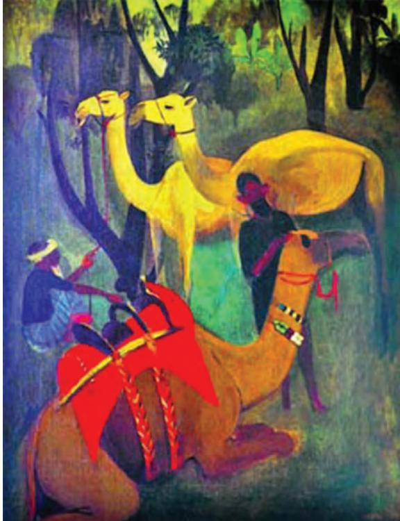

# Company Painting

Nationalism

Art in India had a different purpose prior to the coming of the British. It could be seen as statues on temple walls, miniature paintings that often illustrated manuscripts, decoration on the walls of mud houses in villages, among many other examples. With the colonial rule around the eighteenth century, the English were charmed by different manners and customs of people of all ranks, tropical flora and fauna, and varying locales. Partly for documentation and partly for artistic reasons, many English officers commissioned local artists to paint scenes around them to get a better idea of the natives. The paintings were largely made on paper by local artists, some of whom had migrated from erstwhile courts of Murshidabad, Lucknow or Delhi. To please their new patrons, they had to adapt their traditional

**6** The Bengal School and Cultural

way of painting to document the world around them. This meant that they had to rely more on close observation, a striking feature of the European art, rather than memory and rule books, as seen in traditional art. It is this mixture of traditional and European style of painting that came to be known as the Company School of Painting. This style was not only popular among the British in India but even in Britain, where albums, consisting a set of paintings were much in demand.

*Ghulam Ali Khan, Group of Courtesans, Company Painting, 1800–1825. San Diego Museum of Art, California, USA*

1_6.Bengali Painting.indd 85 01 Sep 2020 03:54:46 PM

*Raja Ravi Varma, Krishna as envoy, 1906. NGMA, New Delhi, India*

#### Raja Ravi Varma

This style declined with the entry of photography in India in the mid–nineteenth century as camera offered a better way of documentation. What, However, flourished in the art schools set up by the British was the academic style of oil painting that used a European medium to depict Indian subject matter. The most successful examples of this type of painting were found away from these art schools. They are best seen in the works produced by self-taught artist, Raja Ravi Varma of the Travancore Court in Kerala. By imitating copies of European paintings popular in Indian palaces, he mastered the style of academic realism and used it to depict scenes from popular epics like the *Ramayana* and *Mahabharata*. They became so popular that many of his paintings were copied as oleographs

and were sold in market. They even entered people's homes as calendar images. With the rise of nationalism in India by the end of the nineteenth century, this academic style embraced by Raja Ravi Varma came to be looked down upon as foreign and too western to show Indian myths and history. It is amidst such nationalist thinking that the Bengal School of Art emerged in the first decade of the twentieth century.

#### The Bengal School

The term 'Bengal School of Art' is not fully accurate. It is true that the first move to create a modern, nationalist school happened in Bengal but it was not restricted to this region alone. It was an art movement and a style of painting that originated in Calcutta, the centre of British power, but later influenced many artists in different parts of the country, including Shantiniketan, where India's first national art school was founded. It was associated with the nationalist movement (*Swadeshi*) and spearheaded by Abanindranath Tagore (1871–1951). Abanindranath enjoyed the support of British administrator and principal of the Calcutta School of Art, E. B. Havell (1861–1934). Both Abanindranath and Havell were critical of colonial Art Schools and the manner in which European taste in art was being imposed on Indians. They firmly believed in creating a new type of painting that

1_6.Bengali Painting.indd 86 14-12-2021 15:23:41

was Indian not only in subject matter but also in style. For them, Mughal and Pahari miniatures, for example, were more important sources of inspiration, rather than either the Company School of Painting or academic style taught in the colonial Art Schools.

#### **Abanindranath Tagore and E. B. Havell**

The year 1896 was important in the Indian history of visual arts. E. B. Havell and Abanindranath Tagore saw a need to Indianise art education in the country. This began in the Government Art School, Calcutta, now, Government College of Art and Craft, Kolkata. Similar art schools were established in Lahore, Bombay and Madras but their primary focus was on crafts like metalwork, furniture and curios. However, the one in Calcutta was more inclined towards fine arts. Havell and Abanindranath Tagore designed a curriculum to include and encourage technique and themes in Indian art traditions. Abanindranath's *Journey's End* shows the influence of Mughal and Pahari miniatures, and his desire to create an Indian style in painting.

Art historian Partha Mitter writes, "The first generation of the students of Abanindranath engaged in recovering the lost language of Indian art." To create awareness that modern Indians could benefit from this rich past, Abanindranath was the main artist and creator of an important journal, *Indian Society of Oriental Art*. In this manner, he was also the first major supporter of *Swadeshi* values in Indian art, which best manifested in the creation of Bengal School of Art. This school set the stage for the development of modern Indian painting. The new direction opened by Abanindranath was followed by many younger artists like Kshitindranath Majumdar (*Rasa-Lila*) and M. R. Chughtai (*Radhika*).

#### **Shantiniketan — Early modernism**

Nandalal Bose, a student of Abanindranath Tagore, was invited by poet and philosopher Rabindranath Tagore to head the painting department in the newly established Kala Bhavana. Kala Bhavana was India's first national art school. It was part of the Visva-Bharati University founded by Rabindranath Tagore at Shantiniketan. At Kala Bhavana, Nandalal founded the intellectual and artistic milieu to create an Indian style in art. By paying attention to the folk art forms that he saw around in Shantiniketan, he began to focus on

1_6.Bengali Painting.indd 87 01 Sep 2020 03:54:46 PM

*Nandalal Bose, Dhaki, Haripura Posters, 1937. NGMA, New Delhi, India*

*K. Venkatappa, Rama's marriage, 1914. Private Collection, India*

the language of art. He also illustrated primers in Bengali with woodcuts and understood the role of art in teaching new ideas. For this reason, Mahatma Gandhi invited him to paint panels that were put on display at the Congress session at Haripura in 1937. Famously called the 'Haripura Posters', they depicted ordinary rural folks busy in various activities — a musician drumming, a farmer tilling, a woman churning milk, and so on. They were painted as lively colourful sketchy figures and shown as contributing their labour to nation building. These posters echoed with Gandhi's socialist vision of including marginalised sections of Indian society through art.

Kala Bhavana, the institution where Bose taught art, inspired many young artists to carry forward this nationalist vision. It became a training ground for many artists, who taught art in different parts of the country. K. Venkatappa in South India being a prominent example. They wanted art to reach out to a wider public rather than only the elite, anglicised class of people.

Jamini Roy is a unique example of modern Indian artist, who after undergoing academic training in the colonial Art School rejected it only to adopt the flat and colourful style of folk painting seen in villages. He wanted his paintings to be simple and easy to duplicate to reach a wider public and based on themes like women and children, specifically, and rural life, generally.

However, the struggle between the Indian and European taste in art continued as seen in the art policy of the British Raj. For example, the project for mural decorations for Lutyen's Delhi buildings went to the students of Bombay School of Art, trained in realistic studies by its Principal, Gladstone Solomon. On the other hand, the Bengal School artists were allowed to decorate the Indian House in London under close British supervision.

1_6.Bengali Painting.indd 88 01 Sep 2020 03:54:47 PM

#### Pan-Asianism and Modernism

The colonial art policy had created a divide between those who liked the European academic style and those who favoured Indian style. But following the Partition of Bengal in 1905, the *Swadeshi* movement was at its peak and it reflected in ideas about art. Ananda Coomaraswamy, an important art historian, wrote about *Swadeshi* in art and joined hands with a Japanese nationalist, Kakuzo Okakura, who was visiting Rabindranath Tagore in Calcutta. He came to India with his ideas about pan-Asianism, by which he wanted to unite India with other eastern nations and fight against western imperialism. Two Japanese artists accompanied him to Calcutta, who went to Shantiniketan to teach wash technique of painting to Indian students as an alternative to western oil painting.

If, on one hand, pan-Asianism was gaining popularity, ideas about modern European art also travelled to India. Hence, the year 1922 may be regarded as a remarkable one, when an important exhibition of works by Paul Klee, Kandinsky and other artists, who were part of the Bauhaus School in Germany, travelled to Calcutta. These European artists had rejected academic realism, which appealed to the *Swadeshi* artists. They created a more abstract language of art, consisting of squares, circles, lines and colour patches. For the first time, Indian artists and the public had a direct encounter with modern art of this kind. It is in the paintings by Gaganendranath Tagore, brother of Abanindranath Tagore, that the influence of modern western style of paintings can be clearly seen. He made several paintings using Cubist style, in which building interiors were created out of geometric patterns. Besides, he was deeply interested in making caricatures, in which he often made fun of rich Bengalis blindly following the European style of living.

#### Different Concepts of Modernism: Western and Indian

The divide between anglicists and orientalists, as mentioned earlier, was not based on race. Take the case of the Bengali intellectual, Benoy Sarkar, who sided with the anglicists and considered modernism that was growing in Europe as authentic in an article, 'The Futurism of Young Asia'. For him, the Oriental Bengal School of Art was regressive and anti-modern. On the other hand, it was E. B. Havell, an Englishman, who was in favour of return to native art to

1_6.Bengali Painting.indd 89 01 Sep 2020 03:54:47 PM

*Amrita Sher-Gil, Camels, 1941. NGMA, New Delhi, India*

create a true modern Indian art. It is in this context that we have to view his collaboration with Abanindranath Tagore.

Amrita Sher-Gil, whom we will discuss in the next chapter, is a perfect example of the meeting of both these points of view. She used the kind of style that the Bauhaus exhibition showed to depict Indian scenes.

Modern art in India can be best understood as a result of the conflict between colonialism and nationalism. Colonialism introduced new institutions of art like art schools, exhibition galleries, art magazines and art societies. Nationalist artists, while accepting these changes, continued to assert more Indian taste in art and even accepted a larger Asian identity for a while. This legacy was going to leave a deep impact on the later history of modern Indian art. Therefore, it will keep moving from internationalism, i.e., draw ideas from the West, and indigenous, i.e., to be true to one's own legacy and tradition.

#### **Exercise**

- 1. Collect a local newspaper of the past two weeks. Select images and text from these that you consider important in the life of modern democratic state of India. With the help of these visuals and texts, compile an album that narrates the story of an independent sovereign India in the contemporary world.
- 2. Comment on the importance of the Bengal School artists in the making of a national style of art?
- 3. Write your view on any one painting by Abanindranath Tagore.
- 4. Which art traditions of India inspired the Bengal School artists?
- 5. What were the themes that Jamini Roy painted after he abandoned the academic style of painting?

1_6.Bengali Painting.indd 90 01 Sep 2020 03:54:47 PM

### **Tiller of the Soil**

This is one of the panels made by Nandalal Bose in 1938 for the Haripura Congress. In this panel, a farmer is shown ploughing a field— the daily activity of a common man and in a village. To capture the essence of village life in his Haripura panels, Bose made pen-and-ink brush studies of local villagers. He used thick tempera in a bold cursory style and broad brushwork. This technique and style was reminiscent of the folk art practice of *patuas* or scroll painters. Folk style is purposely used to represent the rural life. It also conveys political statement of Gandhi's idea of village. The background of the poster has an arch. The strong senses of formal design, bold colour scheme, and their blend of nature and convention in this panel reflect Bose's inspiration from Ajanta wall paintings and sculptures. More than 400 posters were prepared at Kala Bhavana under the supervision of Bose, who was influenced by the idea of Gandhi. These posters place common people in the centre of nation building. Bose utilised art to build the nation's moral character.

1_6.Bengali Painting.indd 91 01 Sep 2020 03:54:47 PM

### **Rasa-Lila**

This is a watercolour painting in wash technique portraying the divine life of Sri Krishna made by Kshitindranath Majumdar (1891–1975). He was one of the early students of Abanindranath Tagore, who carried forward the wash tradition with some deviations. Rustic, thin, slender figures, modest gestures, idyllic settings and delicate watercolours express his stylistic features. He has painted mythological and religious subjects. Man Bhanjan of Radha, Sakhi and Radha, Lakshmi and Birth of Sri Chaitanya are few examples of his extraordinary power of expression inspired by his understanding of religious concepts as a follower of the Bhakti Marga. In this painting, Krishna is dancing with Radha and *sakhis,* and the background of trees creates a simple village atmosphere as illustrated in the *Bhagvata Purana* and *Gita Govinda*. Figures and their cloths are drawn with simple, flowing, delicate lines. The sublime moods of characters are captured well. Krishna and *gopis* are drawn with same proportion. Thus, humans and God are brought on the same level.

1_6.Bengali Painting.indd 92 01 Sep 2020 03:54:47 PM

### **Radhika**

This is a wash and tempera painting made on paper by Abdul Rehman Chughtai (1899–1975). He was a descendant of Ustad Ahmed, the chief architect of Shahjahan. He was also the designer of the Jama Masjid and Red Fort in Delhi and Taj Mahal in Agra. He was influenced by Abanindranath Tagore, Gaganendranath Tagore and Nandalal Bose. Chughtai experimented with wash technique and infused a distinct character of calligraphic line, typical in Mughal manuscripts and old Persian paintings. It gives a deeper sensuous quality to his paintings. In this painting, Radhika is portrayed walking away from a lighted lamp in a gloomy background as if in a state of trance or remorse. The subject is based on Hindu mythology. He also painted characters from legends, folklore and history of the Indo-Islamic, Rajput and Mughal world. The light and shade of the background represent the finest heights of simplification. Chughtai had stylistic affinities with renowned Chinese and Japanese masters. The character is drawn gracefully, with a lyrical quality of calligraphy in every line. It is as if a poem finds visual form. Other works, which carry these poetic qualities, are *Gloomy Radhika*, *Omar Khayyam*, *Dream*, *Hiraman Tota*, *Lady under a Tree*, *Musician Lady*, *Man behind a Tomb*, *Lady beside a Grave* and *Lady lighting a Lamp*.

1_6.Bengali Painting.indd 93 01 Sep 2020 03:54:47 PM

# **City in the Night**

This is a watercolour painting made by Gaganendranath Tagore (1869–1938) in 1922. He was one of the earlier Indian painters, who made use of language and syntax of Cubism to render his ideas. The inner experiences of turbulence are externalised through a blend of allegorical and formal, transforming the static geometry of Analytical Cubism into an expressive apparatus. He softened Cubism's formal geometry with a seductive profile, shadow or outline of human form. He visualised the mysterious world of his imaginary cities like Dwarka (Lord Krishna's legendary abode) or Swarnapuri (The Golden City) through multiple viewpoints, multi-faceted shapes and jagged edges of Cubism. He painted an interplay of diamond-shaped planes and prismatic colours, resulting in fragmented luminosity to render the mountain ranges of the city. Zigzag planes together are able to create a tight formal structure of the painting. The

painting is mysteriously illuminated by artificial light, one of the features of theatre. It shows his involvement with his uncle Rabindranath Tagore's play staged in their house. The painter has taken many references of stage props, partition screens, overlapping planes and artificial stage lighting. Endless corridors, pillars, halls, half-open doors, screens, illuminated windows, staircases and vaults are painted on the same plane to conjure a magic world.

1_6.Bengali Painting.indd 94 01 Sep 2020 03:54:48 PM

# **Rama Vanquishing the Pride of the Ocean**

This is a Puranic (ancient mythological stories) theme painted by Raja Ravi Varma. He was one of the first Indian painters to use oil paint and master the art of lithographic reproduction for mythological subject. These paintings are, generally, large ones, depicting a historic moment or scene from an epic or a classical text, painted in the midst of a dramatic action. It is intended to be noble, momentous and emotional. This scene is taken from *Valmiki Ramayana*, where Rama needs to build a bridge in southern India to the island of Lanka for his army to cross the ocean. He prays to the God of Ocean, Varuna, to permit him to cross the ocean but Varuna does not respond. Then, in anger, Rama stands to shoot his fiery arrow into the ocean. Immediately, Varuna appears and appeases Rama. The event depicted in this painting sequentially serves as a springboard for the next one. The story unfolds itself as each painting leaps

to the succeeding one, covering in the process not only the major moments in the lives of Rama and Sita but the entire epic. Varma also painted *Release of Ahalya*, *Rama Breaking the Sacred Bow of Siva before his Marriage to Sita*, *Rama, Sita and Laksmana Crossing the Saryu*, *Ravana abducting Sita and Opposed by Jatayu*, *Sita in Ashoka Grove*, *The Coronation of Rama*, etc.

1_6.Bengali Painting.indd 95 01 Sep 2020 03:54:48 PM

# **Woman with Child**

This is a gouache painting on paper made by Jamini Roy (1887–1972) in 1940. He was called the father of the folk renaissance in India, who created an alternative vision of modern Indian identity. In the mid–1920s, he travelled to the countryside of Bengal to collect folk paintings (*pats*) and learn from folk artisans. He wanted to learn from the expressive power of their lines. In this painting, a mother and her child are rendered with bold simplifications and thick outlines with sweeping brush strokes. The painting exudes a crude vigour hitherto unknown in Indian art. Figures are coloured in dull yellow and brick-red background, emulating the terracotta relief of his home village in Bankura. The two-dimensional nature of the painting is derived from *pat* paintings and his search for simplicity and pure form is visible. Roy borrowed volume, rhythm, decorative clarity and instrumentality of the *pat*  in his artworks. To achieve and learn the purity of the *pat*, he first made many monochrome brush drawings, and then, gradually, moved to basic seven colours applied with tempera. He used Indian red, yellow ocher, cadmium green, vermilion, charcoal gray, cobalt blue and white made from organic material, such as rockdust, tamarind seeds, mercury powder, alluvial mud, indigo and common chalk. He used lamp black

to outline the drawings and started making his own canvas with home-spun fabric (*pats* used paper or cloth or baked paper). Roy used the notion of village community as a weapon of resistance to colonial rule and a political act of making local signify national.

1_6.Bengali Painting.indd 96 01 Sep 2020 03:54:48 PM

### **Journey's End**

Made by Abanindranath Tagore (1871–1951) in 1913, this painting is in watercolour. Abanindranath Tagore was seen as a father figure of nationalist and modernism of art in India. He revived certain aspects of Indian and oriental traditions of paintings in terms of themes, style and techniques, and invented the wash painting technique. The wash technique yields a soft, misty and impressionistic landscape. This quality of hazy and atmospheric effects of the wash are utilised to be suggestive or evocative of an end of a life.

In this painting, a collapsed camel is shown in red background of dusk and in that sense it personifies the end of a journey through the end of a day. Abanindranath tried to capture the portrait and narration with the help of symbolic aesthetics on one hand and literary allusions on the other. The physical features of the camel rendered appropriately in fine lines and delicate tones, and its sensory texture leads us to the meaning of the painting. Abanindranath has also painted *The Forest*, *Coming of Night*, *Mountain Traveller*, *Queen of the Forest* and a series of 45 paintings based on *The Arabian Nights*.

1_6.Bengali Painting.indd 97 01 Sep 2020 03:54:49 PM

1_6.Bengali Painting.indd 98 01 Sep 2020 03:54:49 PM

