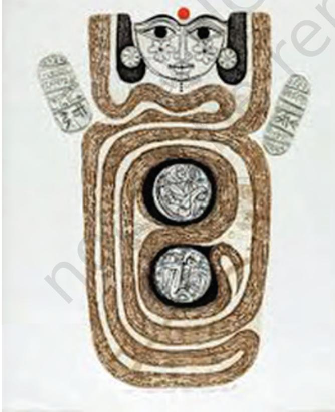

#### Introduction to Modernism in India

Fine arts was seen as European by the British. They felt that Indians lacked training and sensibility to be able to create and appreciate fine arts. By mid and late nineteenth century, art schools were established in major cities like Lahore, Calcutta (now, Kolkata), Bombay (now, Mumbai) and Madras (now, Chennai). These art schools tended to promote traditional Indian crafts, and academic and naturalist art that reflected Victorian tastes. Even the Indian crafts, which received support, were the ones based on European taste and on the demands made by its market.

As mentioned in the previous chapter, it was against

this colonial bias that nationalist art emerged, and the Bengal School of Art, as nurtured by Abanindranath Tagore and E. B. Havell, was a prime example. India's first nationalist art school, Kala Bhavana, was set up in 1919 as part of the newly established Visva-Bharati University in Shantiniketan, conceptualised by poet Rabindranath Tagore. It carried the vision of the Bengal School but also followed its own path in creating art meaningful for Indians. This was the time when the whole world was in a state of intense political turmoil in the wake of World War–I. Apart from the famous Bauhaus exhibition that travelled to Calcutta, as discussed in the previous chapter, modern European art influenced Indian artists through art magazines that were in circulation. Artists from the Tagore family—Gaganendranath and poet–painter Rabindranath, thus, knew about the international trends of Cubism and Expressionism, which had rejected academic

*Gaganendranath Tagore, A Cubist City, 1925. Victoria Memorial Hall, Kolkata, India*

1_7.Modern Art Painting.indd 99 01 Sep 2020 03:26:04 PM

*Rabindranath Tagore, Doodle, 1920. Visva-Bharati University, Shantiniketan, West Bengal, India*

realism and experimented with abstraction; They thought that art need not copy the world but create its own world out of forms, lines and colour patches. A landscape, portrait or still life may be called abstract if it draws our attention to an abstract design created by forms, lines and colour patches.

Gaganendranath Tagore used the language of Cubism to create a unique style of his own. His paintings of mysterious halls and rooms were made with vertical, horizontal and diagonal lines, which were quite different from the Cubist style of famous artist Pablo Picasso, who invented the style using geometrical facets.

Rabindranath Tagore turned to visual art quite late in life. While writing poems, he would often make patterns out of doodles and developed a unique, calligraphic style out of crossed out words. Some of these were turned

into human faces and landscapes, which floated captivatingly in his poems. His palette was limited with black, yellow ochre, reds and browns. However, Rabindranath created a small visual world that was a complete departure from the more elegant and delicate style of the Bengal School, which often drew inspiration from Mughal and Pahari miniatures along with Ajanta frescoes.

Nandalal Bose in 1921–1922 joined the Kala Bhavana. His training under Abanindranath Tagore made him familiar with nationalism in art but it did not hinder him from allowing his students and other teachers to explore new avenues of artistic expression.

Benode Behari Mukherjee and Ramkinker Baij, Bose's most creative students, gave a lot of thought as how to understand the world. They developed their own unique style of sketching and painting that could capture not only their immediate environment like flora and fauna but also those who lived there. Shantiniketan had a large population of Santhal tribe at its outskirts, and these artists often painted them and made sculptures based on them. Apart from this, themes from literary sources also interested them.

1_7.Modern Art Painting.indd 100 01 Sep 2020 03:26:04 PM

Rather than making paintings around well-known epics like *Ramayana* and *Mahabharata*, Benode Behari Mukherjee was drawn to the lives of medieval saints. On the walls of Hindi Bhavana in Shantiniketan, he made a mural called *Medieval Saints*, in which he charts a history of medieval India through the lives of Tulsi Das, Kabir and others, and focuses on their humane teachings.

Ramkinkar Baij was an artist given to the celebration of nature. His art reflects his everyday experiences. Almost all his sculptures and paintings are created as response to his environment. For instance, his *Santhal Family*, made as an outdoor sculpture within the Kala Bhavana compound, turned the daily activity of a Santhal family setting out for work into a larger than a life size piece of art. Besides, it was made out of modern material like cement mixed with pebbles, held in shape with the help of metal armature. His style was in sharp contrast with works of earlier sculptor like D. P. Roy Choudhury, who had used academic

realism to celebrate the labour of working classes, *The Triumph of Labour*.

If rural community was important for Benode Behari Mukherjee and Ramkinker Baij, Jamini Roy, too, made his art relevant to this context. We had briefly discussed Roy in the last chapter as an artist, who rejected his own training received at the Government School of Art, Calcutta. Being a student of Abanindranath Tagore, he realised the futility of pursuing academic art. He noticed that the rural, folk art in Bengal had much in common with how modern European masters like Picasso and Paul Klee painted. After all, Picasso had arrived at Cubism by learning from the use of bold forms found in African masks. Roy, too, used simple and pure colours. Like village artists, he also made his own colours from vegetables and minerals. His art lent itself to easy reproduction by other members in his family, quite like the artisanal practice followed in villages. However, what differentiated his art from that of village artists was that

*Jamini Roy, Black Horse, 1940. NGMA, New Delhi, India*

1_7.Modern Art Painting.indd 101 01 Sep 2020 03:26:04 PM

Roy signed on his paintings. His style is seen as uniquely personal, distinct from both the academic naturalism of art schools and from Raja Ravi Varma's Indianised naturalism, as well as, from the delicate style practised by some of the Bengal School artists.

Amrita Sher-Gil (1913–1941), half Hungarian and half Indian, emerges as a unique female artist, who contributed immensely to modern Indian art through the 1930s. Unlike others, she was trained in Paris and had a first-hand experience in European modern art trends, such as Impressionism and post–Impressionism. After deciding to make India her base, she worked to develop art with Indian themes and images. Amrita Sher-Gil assimilated miniature and mural traditions of Indian art with European modernism. She died young, leaving behind a remarkable body of work, which is important for its experimental spirit and the impact it left on the next generation of Indian modernists.

#### Modern Ideologies and Political Art in India

Soon after Sher-Gil's death, India, still under British rule, was deeply affected by global events like World War–II. One of the indirect outcomes was the outbreak of the Bengal famine, which ravaged the region forcing massive rural migration to cities.

> The humanitarian crisis compelled many artists to reflect on their role in society. In 1943, under the leadership of Prodosh Das Gupta, a sculptor, few young artists formed the Calcutta Group, which included Nirode Mazumdar, Paritosh Sen, Gopal Ghose and Rathin Moitra. The group believed in an art that was universal in character and free from older values. They did not like the Bengal School of Art as it was too sentimental and deeply interested in the past. They wanted their paintings and sculptures to speak of their own times.

> They started to simplify their visual expression by excluding details. With such an attempt, they could emphasise on elements, material, surface, forms, colours, shades and textures, etc. A comparison may be

*Prodosh Das Gupta, Twins Bronze, 1973. NGMA, New Delhi, India*

1_7.Modern Art Painting.indd 102 08 Sep 2020 02:53:15 PM

drawn against a sculptor from South India, P. V. Janakiram (Ganesh) who worked with metal sheets in a creative way.

Seeing abject poverty around them and the plight of people in villages and cities, many young artists in Calcutta were drawn to socialism, especially Marxism. This modern philosophy, which was taught by Karl Marx in the mid–nineteenth century in the West, asked important questions about class difference in society and appealed to these artists. They wanted their art to talk about these social problems. Chittoprasad and Somnath Hore, the two political artists of India, found

printmaking to be a strong medium to express these social concerns. With printmaking, it is easier to produce multiple number of artworks and reach out to more number of people. Chittoprasad's etchings, linocuts and lithographs showed the deplorable condition of the poor. It is not surprising that he was asked by the Communist Party of India to travel to

villages worst affected by the Bengal Famine and make sketches. These were later published as pamphlets under the name, *Hungry Bengal*, much to the annoyance of the British.

#### The Progressive Artists' Group of Bombay and the Multifaceted Indian Art

The desire for freedom—political, as well as, artistic—soon spread widely among young artists, who witnessed Independence from the British Raj. In Bombay, another set of artists formed a group, called The Progressives in 1946. Francis Newton Souza was the outspoken leader of the group, which included M. F. Husain, K. H. Ara, S. A. Bakre, H. A. Gade and S. H. Raza. Souza wanted to question the conventions that had prevailed in art schools. For him, modern art stood for a new freedom that could challenge the traditional sense of beauty and morality. However, his experimental works were focused mainly on women, whom

*Chittoprasad, Hungry Bengal, 1943. Delhi Art Gallery, New Delhi, India*

*M. F. Husain, Farmer's Family, 1940. NGMA, New Delhi, India*

1_7.Modern Art Painting.indd 103 01 Sep 2020 03:26:05 PM

he painted as nudes, exaggerating their proportions and breaking the standard notions of beauty.

M. F. Husain, on the other hand, wanted to make the modern style of painting understandable in Indian context. For example, he would paint using the western expressionist brush strokes with bright Indian colours. He not only drew from Indian mythology and religious sources but also from the style of miniature paintings, village crafts and even folk toys.

As a result of successfully combining a modern style of painting with Indian themes, Husain's art came to eventually represent Indian modern art in the international art world. *Mother Teresa* is an example to understand how he adapted modern art to paint themes important to Indian, as well as, international audience.

#### Abstraction – A New Trend

While Husain largely remained a figurative artist, S.H. Raza moved in the direction of abstraction. It is not surprising then that landscape was a favourite theme for this artist. His colours ranged from bright to soft, modulated monochromes. If Husain used the figurative language of modern art to show Indian themes, Raza made a similar claim with abstraction. Some of his paintings draw from old *mandala* and *yantra*  designs, and even use *bindu* as a symbol of oneness from Indian philosophy. Later, Gaitonde, too, pursued abstraction, while artists like K. K. Hebbar, S. Chavda, Akbar Padamsee, Tyeb Mehta and Krishen Khanna would keep moving between abstraction and figurative.

Abstraction was important for many sculptors like Piloo Pochkhanawala and printmakers like Krishna Reddy. For them, the use of material was as important as the new

> shapes they were creating. Whether in painting, printmaking or sculpture, abstraction had a wide appeal for many artists across the 1960s and 1970s. In South India, K. C. S. Paniker, who later went on to establish Cholamandalam, an artist village near Madras, was a pioneer in abstraction. In fact, he showed by imbibing artistic motifs from Tamil and Sanskrit scripts, floor decorations and rural crafts that abstraction has a long history in India.

*S. H. Raza, Ma, 1972. Bombay, India*

1_7.Modern Art Painting.indd 104 01 Sep 2020 03:26:05 PM

However, the tension between internationalism (in which an artist could freely use the style of western modern trends like Cubism, Expressionism, Abstraction, etc.) and indigenous (in which artists turned to native arts) grew acute by the late 1970s. Sculptors like Amarnath Sehgal struck a balance between abstraction and figurative and created wiry sculptures as in *Cries Unheard*. In case of Mrinalini Mukherjee, her works tilted more towards abstraction when she took up the innovative medium of hemp fibre, as in *Vanshri*.

Many Indian artists and critics grew worried about their imitation of modern art from the West and felt the need to establish an Indian identity in their art. In the 1960s, Biren De and G. R. Santosh in Delhi and K. C. S. Paniker in Madras moved in this direction when they turned to the past and local artistic traditions to create a unique Indian abstract art.

This style became successful in the West and later in India and came to be known as

Neo-Tantric art because of its use of geometrical designs seen in traditional diagrams for meditation or *yantras*. Such works made during the height of the Hippie movement in the West found a ready market, and were sought by galleries and collectors alike. This style may also be seen as Indianised abstraction. In Biren De's works, this move led to captivating experiments with colours and patterns. G. R. Santosh created a visual sense of cosmic union of male and female

energy, reminding us of *purusha* and *prakriti*  of the *Tantric* philosophy. K. C. S. Paniker, on the other hand, made use of diagrams, scripts and pictograms that he saw in his region and evolved out of them a style, which was both modern and uniquely Indian.

In that sense, eclecticism, in which an artist borrowed ideas from many sources, became an important feature of many Indian modernists, of which Ram Kumar, Satish Gujral, A. Ramachandran and Meera Mukherjee are some examples.

*G. R. Santosh, Untitled, 1970. NGMA, New Delhi, India*

*K. C. S. Paniker, The Dog, 1973. NGMA, New Delhi, India*

1_7.Modern Art Painting.indd 105 01 Sep 2020 03:26:05 PM

Since the time of the Bombay Progressive Artist's Group, artists began to write their own manifestos or writings, in which they declared the main aims of their art and how it differed from others. In 1963, another group was formed under the leadership of J. Swaminathan, named Group 1890. Swaminathan also wrote a manifesto for the group, in which the artists claimed being free from any ideology. Rather than a set programme, they adopted a fresh look at the material used in painting, and wrote about the importance of rough texture and surface in their works as a new artistic language. It included artists, such as Gulam Mohammed Sheikh, Jyoti Bhatt, Ambadas, Jeram Patel, and sculptors like Raghav Kaneria and Himmat Shah. It was a short lived movement but left an impact on the next generation of artists, especially, those associated with the Cholamandalam School near Madras.

#### Tracing the Modern Indian Art

Modern art in India may have drawn some ideas from the West but it differed from it significantly. The fact that modernism as an art movement came to India when it was still a British colony is hard to deny. This is clear when we turn to artists like Gaganendranath, Amrita Sher-Gil and Jamini Roy, who began to be considered as modern during as early as 1930s. In the West, particularly in Europe, modern art came up when academic realism in art academies began to be rejected. These modern artists saw themselves as *avant garde* or at the frontier of change from tradition to modernity.

With the phenomenal development of technology after the Industrial Revolution, the traditional art that decorated churches and palaces lost its meaning. Early modern French artists like Edouard Manet, Paul Cezanne, Claude Monet and others saw themselves working outside the main art institutions. Cafes and restaurants became important places for artists, writers, film-makers and poets to meet and discuss about the role of art in modern life. In India, artists like F. N. Souza and J. Swaminathan, who rebelled against art institutions, identified themselves with these western artists. What made a big difference in the story of modern Indian art is that modernity and colonialism were closely connected. Nationalism was not only a political movement that arose following the Indian Revolt of 1857 but it gave

1_7.Modern Art Painting.indd 106 01 Sep 2020 03:26:05 PM

rise to cultural nationalism. Ideas like *swadeshi* in art were held by art historians like Ananda Coomaraswamy around the late nineteenth century and early twentieth century. It meant that we cannot understand Indian modernism as a blind imitation of the West but there was a careful process of selection carried out by the modern artists in India.

We have already discussed how nationalism in art can be traced to the rise of Bengal School under the leadership of Abanindranath Tagore in the late nineteenth century in Calcutta. Subsequently, it took a different form at Kala Bhavana, Shantiniketan. Artists like Nandalal Bose and Asit Kumar Haldar, students of Abanindranath Tagore, were inclined to draw inspiration from past traditions like the Ajanta frescoes, and Mughal, Rajasthani and Pahari miniature paintings, among others.

However, it was with artists like Gagendranath Tagore, Rabindranath Tagore, Jamini Roy, Amrita Sher-Gil, Ramkinker Baij and Benode Behari Mukherjee that we can say a distinct modern attitude finds its place in Indian art. Let us take an overview of how modern art developed in India.

An interesting fact to note about modern Indian art is that the subject matter in painting and sculpture was largely drawn from rural India. This is the case even with the Bombay Progressives and the Calcutta group during 1940s and 1950s. City and urban life rarely appeared in works of Indian artists. Perhaps, it was felt that real India lives in villages. The Indian artists of the 1940s and 1950s rarely looked at their immediate cultural milieu.

#### The New Figurative Art and Modern Art from 1980s

Since the 1970s, many artists began to move towards the use of figures and stories that are easy to recognise. Perhaps, this was a way to express their concern towards social problems, following the Indo-Pakistan war in 1971 and the birth of Bangladesh. While K. G. Subramanyan, Gulam Mohammed Sheikh and Bhupen Khakar in Baroda started using storytelling in their paintings, Jogen Chowdhury, Bikash Bhattacharjee and Ganesh Pyne in West Bengal, too, painted the social problems that disturbed them.

Like the earlier generations of Indian artists, they, too, explored old miniature paintings and popular art forms like

1_7.Modern Art Painting.indd 107 01 Sep 2020 03:26:05 PM

calendar and folk art to be able to paint stories that could be understood by the larger public.

Figures of people and animals could be seen in the work of printmakers like Jyoti Bhatt (*Devi*), Laxma Goud (*Man Woman, Tree*) and Anupam Sud (*Of Walls*) as a way to show conflict between men and women in a world full of social inequality. Arpita Singh, Nalini Malani, Sudhir Patwardhan and others turned their attention to the plight of people living in big cities. Many of these modern artists painted such urban problems and tried to see the world from the eyes of the oppressed.

In the 1980s, an important departure in this attitude can be seen in the Baroda Art School, which came up in the late 1950s. There was a change in the way artists began to take interest in their immediate surroundings. Many artists became aware of their role as citizens in a democracy and social and political concerns found place in the artistic production of this period.

They found a way to combine fact with fiction, autobiography with fantasy and drew their style from other art historical styles. Gulam Mohammed Sheikh would paint the busy lanes of the old bazaar in Baroda while invoking a medieval town in Sienna and the style of Italian painters like the Lorenzetti brothers. Being a teacher of art history, he knew how artists painted in earlier times in different parts of the world.

K. G. Subramanyan, Sheikh's teacher and a founding member of the Baroda Art School, had studied in Shantiniketan. He had learned about the public role of art from his teachers, Benode Behari Mukherjee and Ramkinker Baij. He was interested in mural art or art on large public buildings, which can be seen by everyone.

He was attracted to the technique of sand casting, which was known to local Rajasthani artists. From them, he learned how to create large-scale relief sculptures by repeating the basic unit of shape.

Among the many murals he made, there is a famous one in Kala Bhavana on the outer wall of a building. He did not want art to remain confined to art galleries but be made a part of public buildings for all to see. Such a public

*G. M. Sheikh, City for Sale, 1984. Victoria and Albert Museum, London, UK*

1_7.Modern Art Painting.indd 108 01 Sep 2020 03:26:06 PM

view of art can also be seen in a popular exhibition called 'Place for People' in 1981. It was shown in Delhi and Bombay and had six artists— Bhupen Khakhar, Gulam Mohammed Sheikh, Vivan Sundaram, Nalini Malani, Sudhir Patwardan and Jogen Chowdhury. The first two were from Baroda and an eminent art critic, Geeta Kapur, wrote about it. So far, we came across manifestos written by artists themselves, but in this case, the role of the art critic to explain what the artists wanted to express became important.

A painter like Bhupen Khakhar painted the local barber or watch repairer with the same earnestness as he painted the experiences of queer men and their struggle with the middle class morality. An important contribution of the Baroda narrative painters was their eclectic interest and acceptance of popular art forms that are visible everywhere from trucks on highways to autorickshaws, in the back alleys of small towns and in small shops.

*K. G. Subramanyan, Three Mythological Goddesses, 1988. Kala Bhavana, Santiniketan, West Bengal, India*

1_7.Modern Art Painting.indd 109 01 Sep 2020 03:26:06 PM

Taking a clue from Khakhar's bold move and the Baroda artists' celebration of popular art, younger painters in Mumbai found inspiration in popular images on calendars, in advertisements and film hoardings. These painters went to the extent of using photographic images on canvas.

This style is different from what we have seen so far. It is not modern in the same sense. It relies on double meanings and experimental technique, in which watercolour is painted in the style of a photograph.

#### New Media Art: from 1990s

With liberalisation of the Indian economy in the 1990s, the impact of globalisation came to be felt first in big cities. While on one hand, India made advancement in information technology, it also saw many social and political issues. In such extraordinary times of economic progress and social unrest, artists began to look for ways of reacting to the changing times. Medium like easel painting and sculpture that was created by artists, who would earlier proudly sign on them as an expression of their unique creativity, lost importance. Instead, the newly available medium, i.e., video caught their attention. Even photography seemed attractive as it allowed multiple copies to reach numerous people simultaneously.

However, the art form that was increasingly seen as contemporary was installation. It provided a way to combine painting, sculpture, photography, video and even television in one space. This medium, which could spread out into a whole

hall could fully grab the attention from all sides. On one wall, you could see a painting, while on another, a video with sculptures hanging from the wall with photographs displayed in glass cases. It offered a new immersive experience, which affected almost all our senses. However, it was more dependent on technology and it is, therefore, not surprising that most of the early installation artists came from big cities—Nalini Malani from Mumbai and Vivan Sundaram from Delhi. However, their subject matter was grim and thought provoking.

Photography, long regarded as the rival of painting because of its easy copy of world, gave new ideas to the artists. They developed

*Bhupen Khakhar, Janata Watch Repairing, 1972. Private Collection, India*

1_7.Modern Art Painting.indd 110 08 Sep 2020 02:58:24 PM

a new technique called 'photorealism', which was used by Atul Dodiya in *Bapu* at Rene Block Gallery, New York. Many younger artists used oil or acrylic to paint in the manner of a photograph or television screen. T. V. Santosh and Shibu Natesan used photorealism to comment on communal violence on one hand and at the same time, gave us a glimpse of the new look that cities had acquired with India's technological advancements.

Photography could also be used to document changes in society as artists saw them. Sheba Chachi, Ravi Agarwal and Atul Bhalla, among others, photographed those, who lived on the margins of our society, whom we do not notice much in our day-to-day life—women ascetics, queer people, and so on. Often, they would express their concern about ecology like pollution of rivers and urban congestion. Photography and video have inspired many contemporary artists.

Contemporary art is constantly changing with artists and curators experimenting with technology and redefining the role of art to better understand the world we are a part of.

At the turn of the present century, we find that almost all major cities of the country have art galleries—both private and public, and artists' community dedicated towards creating art using a wide range of media, including digital paintings. Their experimentations, influences and expressions have been documented through catalogues. Even social media has played a major role in evolving local art. As a student of visual arts one must explore artists' work in their own cities, as well as, the cities they visit, collect information about their works, visit art galleries and learn about their contribution to our society.

#### **Project**

Visit the National Gallery of Modern Art (NGMA) or any other museum in your city or NGMA's website and work on a timeline to see different trends in modern Indian art after 1947 in terms of internationalism and indigenous. Students should also make a note of where the timeline ends. Teachers should discuss the role of curators and art critics in conveying the meaning of artworks to the public. The type of material used by each artist may also be noted.

1_7.Modern Art Painting.indd 111 01 Sep 2020 03:26:06 PM

#### **Exercise**

- 1. *Pata Chitra* is a form of audio-visual storytelling still practised in some parts of India. Compare this traditional form of storytelling with modern storytelling or narratives adopted by some Baroda artists since 1980s.
- 2. How does new technology like video and digital media inspire contemporary artists to experiment with new themes? Comment on different genres of such art forms like video, installation and digital art.
- 3. What do you understand by 'public art'? Find out about different communities that live around your residence or school and their understanding of art. If you have to prepare a public monument, how will you design it in a way that people can relate with it?
- 4. How do you understand the 'art world'? What are the different components of the art world and how does it relate with the art market?

1_7.Modern Art Painting.indd 112 01 Sep 2020 03:26:06 PM

# **The Lives of Medieval Saints**

*The Lives of Medieval Saints*, a mural in Hindi Bhavana, Shantiniketan, was created by Benode Behari Mukherjee around the eve of India's Independence from Colonial rule, during 1946–1947. The mural employs the technique of *fresco buono* and covers almost 23 metre of the entire upper half of the three walls of the room.

Mukherjee skillfully reminds us of the syncretic and tolerant tradition of Indian life as found in the teachings of great Bhakti poets like Ramanuja, Kabir, Tulsidas, Surdas and others.

Despite his poor eyesight, the artist sketched directly on the walls without compositional sketches. *The Lives of Medieval Saints* was painted in modern style, where each figure is created with bare minimum lines. At the same time, each figure relates with its neighbour by way of rhythmic network of lines. In some ways, the mural reminds us of a painted woven tapestry, a profession that many of these saints belonged to. He was one of the earliest artists in modern India to realise the potential of a mural to become public art.

1_7.Modern Art Painting.indd 113 01 Sep 2020 03:26:07 PM

# **Mother Teresa**

This painting by M. F. Husain of the saintly figure, Mother Teresa, belongs to the 1980s. It is painted in a style typically of this artist, who created a new language of modern Indian art. The figure of the faceless Mother appears several times, each time holding a baby with a lot of attention given to the hand. The central figure of the seated Mother has a grown up man lying on her lap horizontally. This speaks of the artist's familiarity with European art, especially, the famous sculpture of Italian Renaissance master, Michelangelo's *Pieta*. On the other hand, the flat shapes used to depict the scene are modern. They appear like a collage of paper cutouts. The artist is not interested in showing us the life of Mother Teresa realistically but uses bare suggestions. We, as viewers, have to follow the clues left by the artist to make sense of the story. It is the kneeling figure of the woman on one side that gives us a hint that the story about healing and nursing the helpless is unfolding in India.

1_7.Modern Art Painting.indd 114 01 Sep 2020 03:26:07 PM

# *Haldi* **Grinder**

Amrita Sher-Gil painted *Haldi Grinder* in 1940. This was the time when she was seeking inspiration from India's idyllic rural scene. Such a scene, depicting Indian women busy in a traditional activity of grinding dry turmeric, had to be painted in Indian style. It is not surprising that she used bright, saturated pigments to paint this work. Given her training in modern art in Europe, she was quick to see parallels between miniature traditions of north India and modern art of Paul Gaugin, an artist she admired. This is evident in the way she has placed bright colour patches close to each other and created shapes of figures by colour contrast and not outline. Such a style of painting reminds us of, as for instance, the Basohli paintings from north India. The women and trees are painted as flat shapes. Sher-Gil is not interested in creating any depth in the landscape and prefers a semi-abstract pattern as a modern artist.

1_7.Modern Art Painting.indd 115 08 Sep 2020 03:02:25 PM

# **Fairy Tales from Purvapalli**

This is a painting using water and oil colours on acrylic sheet and was created by K. G. Subramanyan in 1986. This is the work of the prolific writer, scholar, teacher and art historian, who draws inspiration from his familiarity with different art traditions from India and the world. The title refers to his home in Purvapalli, a locality in Shantiniketan, from where his imagination seems to be travelling all around the world. His imaginary landscape consists of a strange world, in which birds and animals rub shoulders with humans. There are unusual trees that grow feathers in place of leaves. This style of painting is sketchy and colours are applied as in quick brush strokes. The palette remains earthy—ochres, greens and browns. The male and female figures on top reminds us of urban folk art like the Kalighat painting that was popular in Colonial Calcutta in the late nineteenth century. Again, as in traditional miniature paintings, figures are arranged on the top of other rather than behind each other, creating a flat space, a sign of modern art.

1_7.Modern Art Painting.indd 116 01 Sep 2020 03:26:07 PM

# **Whirlpool**

This was a print made by India's celebrated printmaker Krishna Reddy in 1963. It is a captivating composition created out of various shades of blues. Each colour blends into the other to create a powerful web of design. It is the result of a new technique in printmaking that he developed along with a well-known printmaker, Stanley William Hayter, in the famous studio called 'Atelier 17'. This method came to be known as 'viscosity printing', in which different colours are applied on the same metal printing plate. Each colour is mixed with linseed oil in varied concentration to ensure that colours do not run into each other. The print's subject matter, dealing with water current, aptly captures the technique based on understanding how water and oil behave with each other. This celebrated print is in the collection of the Metropolitan Museum of Art in New York, USA.

1_7.Modern Art Painting.indd 117 01 Sep 2020 03:26:07 PM

# **Children**

This is a graphic print on paper done with monochromatic etching with aquatint made by Somnath Hore (1921–2006) in 1958. The experience of the Bengal Famine of 1943, left a lasting impression on him. His early sketches and drawings were spot and life drawings of hapless victims of the famine, suffering and dying peasants, sick and infirm destitute, and portraits of men, women, children and animals. These line drawings, which followed representational contours and tonal devices, were seldom adopted. In this etching, images of children were taken from the experience of the famine of 1943, which was etched in his memory. This is a close knit composition with five standing figures, having no background, perspective or surrounding situation as the figures are talking to themselves. The figures are linear, each with a skeletal torso of a huge malaria spleen and ribcage for the thorax. Supporting a huge skull, with a small face, the whole body is seen resting on two stick-like legs. Strong definitional lines of straight linear gestures, which etched each rib of the thorax and each cheekbone, appears as deep gashing wounds. The bone structure just beneath the skin renders the effect of malnutrition on the people. It creates narrative quality in the picture without taking recourse to placing the figures in a situation of supporting visual data, following reductionist and simplification method. These children represent the most vulnerable section of the society. Somanth Hore's some other artworks include *Peasants' Meeting*, *Wounded Animal*, *The Child*, *Mother with* 

*Child*, *Mourners* and the *Unclad Beggar Family*.

1_7.Modern Art Painting.indd 118 01 Sep 2020 03:26:08 PM

# **Devi**

This is an etching on paper made by Jyoti Bhatt (1934) in 1970. He studied painting, printmaking and photography, and was inspired by his mentor K. G. Subramanyan. He carved out an art language based on folk traditions and popular practices. He brings together many visual elements into the a composite narrative. His works occupy tenuous balance between space tradition and modernity, where the past as a vibrant repository of forms is translated into dynamics of the contemporary. In this print, pictorial image of *Devi* is re-cast and re-contextualised with a linear drawing of the frontal face of a woman, folk motifs and patterns. The portrait of *Devi* is centrally placed as an iconic image. The two-dimensionality of words and motifs around the portrait expresses the *Tantric* philosophy, evoking the power of self-evolution and self-involution, seeing reality as the intertwining dynamic and static principle of Shakti. Bhatt also made artworks like *Kalpvruksha*, *Self-Portrait*, *Forgotten Monuments*, *Sita's Parrot*, *Still Life with Two Lamps*, *Scattered Image under the Warm Sky*, *Tirthankara,* etc.

1_7.Modern Art Painting.indd 119 01 Sep 2020 03:26:08 PM

# **Of Walls**

This is an etching made from zinc plate and printed on paper made by Anupam Sud in 1982. She had studied printmaking at the Slade School of Fine Art, University College, London, in the early 1970s. When she returned to India, she was drawn to its everyday reality. Apart from her deep interest in social problems faced by people, belonging to marginalised communities of the society, she was keen to understand them artistically. Notice how she creates an interesting form of a woman by hollowing out the face. The absence of face gives it a brooding and sad expression. The painting depicts the figure of a lonely woman seated on the pavement before a dilapidated wall. In the foreground, we only get a glimpse of the lower part of a poor man sleeping on the ground, contrasting with the clothed woman, and adds to the sadness of the print.

1_7.Modern Art Painting.indd 120 01 Sep 2020 03:26:08 PM

# **Rural South Indian Man–Woman**

This is an etching print on paper made by Laxma Goud (1940...) in 2017. Laxma Goud, a fine draftsman and printmaker, studied mural painting and printmaking at M. S. University, Baroda, and was influenced by his teacher K. G. Subramanyan's experiments with the narrative mode and figuration of visual traditions, classical, folk and popular cultures. He tries to erase sharp demarcations between major and minor arts, thus, giving it linguistic breath. This has helped him straddle various mediums, such as glass painting, terracotta and bronze. In this etching, human figures are shown with trees in the background. It is based on his childhood memories immersed in nature. The work is a combination of highly ornate contours, realistic depiction of the peasants and a gentle stylization that gives a touch of puppets to the figures represented in the print. This print is line-based and coloured. Some of his other artworks are *Woman*, *Man*, *Landscape of Turkey*, *Untitled*, *Xiyan China,* etc.

1_7.Modern Art Painting.indd 121 15-12-2021 11:45:21

# **Triumph of Labour**

This is an open air large-scale sculpture in bronze made by Debi Prasad Roy Chowdhury (1899–1975). It was installed at Marina Beach, Chennai, on the eve of the Republic Day in 1959. It shows four men trying to move a rock, rendering the importance and contribution of human labour in nation building. Unconquerable men are wrestling with nature, doggedly, indeterminately and powerfully. It is an image of labour against the elements of nature, a well-known romantic subject of the nineteenth century. Chowdhury loved to dwell on the strong musculature of his workers, revealing their bones, veins, flesh, etc. He portrayed the extreme physical effort of loosening a massive, immovable rock. Human figures are installed in a way that create a curiosity in us as viewers. It attracts the viewers to see it from all sides. The image of group labour is placed on a high pedestal, thereby, replacing the notion of portraits of kings or British dignitaries.

1_7.Modern Art Painting.indd 122 01 Sep 2020 03:26:09 PM

# **Santhal Family**

This is an open air large-scale sculpture created by Ramkinker Baij in 1937. It is made out of metal armature and cement mixed with pebbles, and placed in the compound of Kala Bhavana, Shantiniketan, India's first national art school. It shows a scene of a Santhal man, carrying his children in a double basket joined by a pole, and his wife and dog walking alongside. Perhaps, it speaks of the family migrating from one region to another, carrying all their frugal possessions. This must be an everyday scene for the artist living amidst the rural landscape. However, he gives it a monumental status. The sculpture is made in the round, which means that we can see it from all sides. It is placed on a low pedestal, making us feel as if we are part of the same space. The significance of this work is that it is regarded as the first public modernist sculpture in India. We do not need to go to a museum to see it as it is placed outside Kala Bhavana. The material of which it is made of is important. The artist has avoided traditional medium like marble, wood or stone, and has preferred cement, the symbol of modernisation.

1_7.Modern Art Painting.indd 123 14-12-2021 12:37:16

# **Cries Un-heard**

This is a sculpture in bronze made by Amarnath Sahgal in 1958. Although the artist only uses abstraction, in which three figures are stick-like and shown in flat rhythmical planes, yet it is easy to understand them as a family—husband, wife and child. They are shown flinging their arms above and crying out for help in vain. Through the medium of sculpture, their helplessness expressed by the hand gesture is turned into a permanent shape. It is possible for us to read this work as socialist, whereby, the artist pays homage to millions of destitute families in need of help, whose cries fall on deaf ears. None other than socialist poet, Mulk Raj Anand, wrote movingly about this work, which now is in the collection of the National Gallery of Modern Art, New Delhi.

1_7.Modern Art Painting.indd 124 01 Sep 2020 03:26:09 PM

# **Ganesha**

This is a sculpture in oxidised copper made by P. V. Janakiram in 1970, and is in the collection of NGMA, Delhi. He has used sheets of copper to create pictorial sculpture as free-standing forms, and ornamented their surface with linear elements. Metal sheets are beaten into concave planes on which are welded linear details. These linear elements work as facial features and decorative motifs to suggest religious icons, inviting intimate contemplation. Janakiram is influenced by the ancient temple sculpture of South India. The image of *Ganesha,* crafted frontally, lends an important indigenous character of cave and temple sculpture. In this sculpture, Ganesha is palying *vina*, a musical instrument. Details on the sculpture and technical blending of material, nevertheless, reveal his meticulous craftsmanship. He also experimented with the 'openendedness' quality of indigenous workmanship. *Ganesha* reveals his understanding of traditional imagery. He has elaborated linear details into overall form. The sculpture is conceived in terms of linear silhouettes instead of emphasis on three-dimensionality, despite its volume. Rhythm and growth are incorporated through lyrical stylisation. It is also an amalgamation of folk and traditional craftsmanship.

1_7.Modern Art Painting.indd 125 01 Sep 2020 03:26:09 PM

# **Vanshri**

This artwork was created by Mrinalini Mukherjee in 1994. She uses an unusual material to make this sculpture. She uses hemp-fibre, a medium that she experimented with from the early 1970s. Going by the intricate way, she has knotted together and woven a complex shape out of jute fibre. It seems to be the result of years of handling the new material. For many years, her works of this kind were dismissed as craft. Only recently her fibre works have attracted a lot of attention for originality and boldness of imagination. In this work, entitled *Vanshri* or 'Goddess of the Woods', she turns this ordinary material into a monumental form. If you carefully look at the figure's body, you can notice that it has a face with an inward expression and protruding lips, and above all, a powerful presence of natural divinity.

1_7.Modern Art Painting.indd 126 01 Sep 2020 03:26:10 PM

