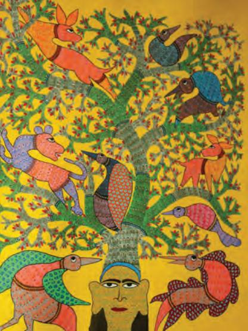

There has always been a timeless tradition of art forms, which have been practised for different reasons among people, living far from urban life in interior terrains of forests, deserts, mountains and villages. So far, we have studied art of a certain time, a period named after a place or dynasties, who ruled different parts of the Indian subcontinent for few hundred years or so. But what about common people? Were they not creative? Was there no art that existed around them? From where did the artists come to the courts or patrons? What did they use to make before coming to cities? Or even now, who are the unknown artists making handicrafts in faraway deserts, mountains, villages and rural areas, who have never been to an art school or design institute or even attended formal schooling?

Our country has always been a repository of indigenous knowledge, which has been transferred from one generation to another. Artists in each generation have created the best of works out of available material and technology. Many scholars named these art forms as minor arts, utility art, folk art, tribal art, people's art, ritual art, crafts, and so on. We know that these art forms have existed from time immemorial. We have seen the examples in pre-historic cave paintings or works of pottery, terracotta, bronze, ivory, etc., of the Indus period as well. During the early history

and its subsequent times, we find references of artists' communities everywhere. They made pots and dresses, jewellery and ritual or votive sculptures. They decorated their walls and floors and did many more artistic things to fulfill their daily needs and supply their works to local markets at the same time. There is an instinctive aesthetic expression in their creations. There is symbolism, specific use of motifs, materials, colours and methods of making. There is a thin line between art of

1_8.LivingArt Traditions of India.indd 127 01 Sep 2020 03:00:57 PM

the people and crafts as both involve creativity, instinct, necessities and aesthetics.

Even now, in many pockets, we find such artifacts. In the nineteenth and twentieth centuries, a new perspective emerged among modern artists when they looked at traditional art forms around them as sources of inspiration for their creative pursuits in India, as well as, the West. In India, post-Independence a revival of handicraft industry took place. The sector became organised for commercial production. Apart from continued practice, it gained a unique identity. With the forming of States and Union Territories, each one of them showcased their unique art forms and products in their respective State emporia. The art and craft traditions of India showcase the tangible heritage of the country with history of more than five thousand years. Though we know many of these, let us talk about few of them. By and large, there has been a religious or ritualistic overtone with richer symbolism, utilitarian and decorative aspects, associated with the day-to-day practices at home to production on a large scale.

# Painting Tradition

Among the many popular traditions of painting, Mithila or Madhubani painting of Bihar, Warli painting of Maharshtra, Pithoro Painting of North Gujarat and western Madhya Pradesh, Pabuji ki Phad from Rajasthan, Pichhwai of Nathdwara in Rajasthan, Gond and Sawara Paintings of Madhya Pradesh, Pata Chitra of Odisha and Bengal, etc., are few examples. Here, a few of them have been discussed.

## **Mithila painting**

Among the most known contemporary painterly art forms is Mithila art that derives its name from Mithila, the ancient Videha and birthplace of Sita. Also called Madhubani painting after the nearest district capital, it is a widely recognised folk art tradition. It is presumed that for centuries, women living in this region have painted figures and designs on the walls of their mud houses for ceremonial occasions, particularly, weddings. People of this area see the origin of this art form at the time of Princess Sita getting married to Lord Rama.

These paintings, characterised by bright colours, are largely painted in three areas of the house— central or outer

1_8.LivingArt Traditions of India.indd 128 01 Sep 2020 03:00:57 PM

1_8.LivingArt Traditions of India.indd 129 01 Sep 2020 03:00:59 PM

courtyards, eastern part of the house, which is the dwelling place of *Kuladevi*, usually, Kali, and a room in the southern part of the house, which houses the most significant images. Various armed gods and animals or images of women at work like carrying waterpots or winnowing grain, etc., are vividly portrayed in the outer central courtyard. The inner verandah, where the family shrine— *devasthana* or *gosain ghar* is located, *griha devatas* and *kula devatas* are painted. In the recent past, many paintings are done on fabric, paper, pots, etc., for commercial purposes.

The most extraordinary and colourful painting, however, is done in the part of the house known as the *kohbar ghar*  or inner room, where magnificent representations of *kohbar*, a lotus with a stalk in full bloom having metaphoric and tantric connotation along with images of gods and goddesses are painted on freshly plastered walls of the room.

Among other themes that are painted are episodes from the *Bhagvata Purana*, *Ramayana*, stories of Shiva-Parvati, Durga, Kali and *Rasa-Lila* of Radha and Krishna. Mithila artists do not like empty spaces. They fill in the entire space decoratively with elements from nature like birds, flowers, animals, fish, snakes, the Sun and the moon, which often have symbolic intent, signifying love, passion, fertility, eternity, well-being and prosperity. Women paint with bamboo twigs to which some cotton swab, rice straw or fibre is attached. In earlier days, they made colour from mineral stones and organic things, such as *phalsa* and *kusum* flowers, *bilwa* leaves, *kajal*, turmeric, etc.

## **Warli painting**

The Warli community inhabit the west coast of Northern Maharashtra around the north Sahyadri range with a large concentration in the district of Thane. Married women play a central role in creating their most important painting called *Chowk* to mark special occasions. Closely associated with the rituals of marriage, fertility, harvest and new season of sowing, *Chowk* is dominated by the figure of mother goddess, Palaghat, who is chiefly worshipped as the goddess of fertility and represents the corn goddess, Kansari.

1_8.LivingArt Traditions of India.indd 130 01 Sep 2020 03:00:59 PM

1_8.LivingArt Traditions of India.indd 131 01 Sep 2020 03:00:59 PM

She is enclosed in a small square frame decorated with 'pointed' chevrons along the outer edges that symbolise Hariyali Deva, i.e., the God of Plants. Her escort and guardian is visualised as a headless warrior, riding a horse or standing beside her with five shoots of corn springing from his neck, and hence, called Panch Sirya Devata (five-headed god). He also symbolises the guardian of the fields, Khetrapal.

The central motif of Palaghat is surrounded by scenes of everyday life, portraying acts of hunting, fishing, farming, dancing, mythological stories of animals, where the tiger is conspicuously visible, scenes of buses plying and the busy urban life of Mumbai as people of Warli see around them.

These paintings are traditionally painted with rice flour on earth coloured walls of their homes. As mentioned earlier, are painted to promote fertility, these paintings avert diseases, propitiate the dead, and fulfill the demands of spirits. A bamboo stick, chewed at the end, is used as the paintbrush.

## **Gond painting**

Gonds of Madhya Pradesh have a rich tradition with their chiefs ruling over Central India. They worshipped nature. Paintings of Gonds of Mandla and its surrounding regions have recently been transformed into a colourful depiction of animals, humans and flora. The votive paintings are geometric drawings done on the walls of huts, portraying Krishna with his cows surrounded by *gopis* with pots on their heads to which young girls and boys make offerings.

1_8.LivingArt Traditions of India.indd 132 01 Sep 2020 03:01:00 PM

1_8.LivingArt Traditions of India.indd 133 01 Sep 2020 03:01:03 PM

## **Pithoro painting**

Painted by Rathva Bhils of the Panchmahal region in Gujarat and Jhabua in the neighbouring State of Madhya Pradesh, these paintings are done on the walls of houses to mark special or thanksgiving occasions. These are large wall paintings, representing rows of numerous and magnificently coloured deities depicted as horse riders.

The rows of horse rider deities represent the cosmography of the Rathvas. The uppermost section with riders represents the world of gods, heavenly bodies and mythical creatures. An ornate wavy line separates this section from the lower region, where the wedding procession of Pithoro is depicted with minor deities, kings, goddess of destiny, an archetypal farmer, domestic animals, and so on, which represent the earth.

1_8.LivingArt Traditions of India.indd 134 01 Sep 2020 03:01:04 PM

1_8.LivingArt Traditions of India.indd 135 01 Sep 2020 03:01:05 PM

## **Pata painting**

Done on fabric, palm leaf or paper, scroll painting is another example of art form practised in different parts of the country, especially, Gujarat and Rajasthan in the West and Odisha and West Bengal in East. It is also known as *Pata, Pachedi, Phad*, etc.

**Bengal** *patas* comprise the practice of painting on cloth (*pata*) and storytelling in regions of West Bengal. It is the most receptive oral tradition, constantly seeking new themes and formulating novel responses to major incidents in the world.

The vertically painted *pata* becomes a prop used by a *patua* (performer) for performance. *Patuas,* also called *chitrakars*, belong to communities largely settled around Midnapore, Birbhum and Bankura regions of West Bengal, parts of Bihar and Jharkhand. Handling the *pata* is their hereditary profession. They travel around villages, displaying the paintings and singing the narratives that are painted. Performances happen in common spaces of the village. The *patua* narrates three to four stories each time. After the performance, the *patua* is given alms or gift in cash or kind.

**Puri** *patas* **or paintings** evidently acquire their claim to recognition from the temple city of Puri in Odisha. It largely comprises the *pata* (initially, done on palm leaf and cloth but now done on paper as well). A range of themes are painted, such as the daily and festival *veshas* (attires) of Jagannath, Balabhadra and Subhadra (e.g., *Bada Shringar Vesha, Raghunath Vesha, Padma Vesha, Krishna–Balaram Vesha, Hariharan Vesha,* etc); *Rasa* paintings, *Ansara patti* (this substitutes the icons in the *Garbhagriha,* when they are removed for cleaning and fresh colouring is done after *Snanayatra*); *Jatri patti* (for pilgrims to take away as memorabilia and put them in personal temples at home), episodes from the myths of Jagannath, such as the *Kanchi Kaveri Pata* and *Thia-badhia pata,* a combination of aerial and lateral view of the temple with the icons and temples around or depiction of festivals around it.

1_8.LivingArt Traditions of India.indd 136 01 Sep 2020 03:01:05 PM

1_8.LivingArt Traditions of India.indd 137 01 Sep 2020 03:01:11 PM

*Patachitras* are done on small strips of cotton cloth, which is prepared by coating the cloth with soft white stone powder and glue made from tamarind seeds. There is a practice of making the borders first. A sketch of the figures is, then, made directly with a brush and flat colours are applied. Colours, such as white, black, yellow and red are, usually, used. After completion, the painting is held over charcoal fire and lacquer is applied to the surface to make it water resistant and lend sheen to it. The colours are organic and locally procured. For example, black is obtained from lamp black, yellow and red from *haritali* and *hingal* stone, respectively, and white from powdered conch shells. Palm manuscripts are illustrated on a palm variety called *Khar-taad*. Paintings on these are not painted with brush but incised by a steel stylus, and then, filled in with ink, and sometimes, tinted with paint. There may also be some text accompanying these images. There are questions on whether to consider the palm leaf tradition a part of folk or sophisticated art as it has a lineage that stylistically connects it to the mural and palm leaf traditions of the eastern and other parts of the country.

## *Phads* **of Rajasthan**

*Phads* are long, horizontal, cloth scrolls painted to honour folk deities of pastoral communities inhabiting the region around Bhilwara in Rajasthan. For such communities, safeguarding their livestock is the foremost concern. Such concerns purposely reflect in their myths, legends and worship patterns. Among their gods are defied cattle heroes, who are brave men who sacrificed their lives while protecting the community's cattle from robbers. Designated by the broad term *bhomia*, these heroes are honoured, worshiped and remembered for their acts of martyrdom. *Bhomias*, such as Gogaji, Jejaji, Dev Narayan, Ramdevji and Pabhuji, have inspired widespread cult following among the communities of Rabaris, Gujjars, Meghwals, Regars and others.

Illustrating the valorous tales of these *bhomias*, the *phads*, are carried by *bhopas*, the itinerant bards, who travel the territory, displaying them while narrating tales and singing devotional songs associated with these hero-deities in night-long storytelling performances. A lamp is held against the *phad* to illuminate images that are being spoken about. The *bhopa* and his companion perform to the accompaniment

1_8.LivingArt Traditions of India.indd 138 01 Sep 2020 03:01:11 PM

1_8.LivingArt Traditions of India.indd 139 01 Sep 2020 03:01:12 PM

of musical instruments, such as *ravanahattha* and *veena,* and employ the *Khyal* style of singing. Through the *phads* and *phad banchan,* the community remembers the hero as a martyr and keeps his story alive.

*Phads,* however, are not painted by the *bhopas*. They have traditionally been painted by a caste called 'Joshis' who have been painters in the courts of the kings of Rajasthan. These painters specialised in court patronised miniature paintings. Hence, the association of skilled practitioners, bard musicians and court artists place *phads* higher than other similar cultural traditions.

## Sculptural Traditions

These refer to the popular traditions of making sculptures in clay (terracotta), metal and stone. There are numerous such traditions across the country. Some of them are discussed here.

## *Dhokra* **casting**

Among the popular sculptural traditions, *Dhokra* or metal sculptures made from lost wax or *cire perdue* technique is one of the most prominent metal crafts of Bastar, Chhattisgarh, parts of Madhya Pradesh, Odisha and Midnapore in West Bengal. It involves casting of bronze through the lost wax method. The metal craftsmen of Bastar are called *ghadwa*. In popular etymology, the term '*ghadwa'* means the act of shaping and creating. It is probably this that gives the casters their name. Traditionally, the *ghadwa* craftsmen, besides supplying the villagers with utensils of daily use also made jewellery, icons of locally revered deities and votive offerings in the form of snakes, elephants, horses, ritual pots, etc. Subsequently, with a decrease in demand for utensils and traditional ornaments in the community, these craftsmen began creating new (non-traditional) forms and numerous decorative objects.

*Dhokra* casting is an elaborate process. Black soil from the riverbank is mixed with rice husk and kneaded with water. The core figure or mould is made from this. On drying, it is covered with a second layer of cow dung mixed with clay. Resin collected from *saal* tree is, then, heated in a clay pot till it becomes liquid to which some mustard oil is also added and allowed to boil. The boiling liquid is, then, strained

1_8.LivingArt Traditions of India.indd 140 01 Sep 2020 03:01:12 PM

1_8.LivingArt Traditions of India.indd 141 01 Sep 2020 03:01:12 PM

through a cloth, collected and kept in a metal vessel over water. As a result the resin solidifies but remains soft and malleable. It is, then, taken apart in small pieces, heated slightly over low burning coal and stretched into fine threads or coils. Such threads are joined together to form strips. The dried clay form is, then, overlaid with these resin strips or coils and all decorative details and eyes, nose, etc., are added to the figures. The clay form is, then, covered with layers first of fine clay, then, with a mixture of clay and cow dung, and finally, with clay obtained from ant hills mixed with rice husk. A receptacle is, then, made from the same clay and fixed to the lower portion of the image. On the other side, a cup filled with metal pieces is sealed with the clay-rice husk mixture. For firing in the furnace, *saal* wood or its coal is preferred as fuel. The cup, containing metal, is placed in the bottom with clay moulds over it, and covered with firewood and potshards. Air is blown continuously into the furnace for about 2 to 3 hours till the metal turns into a molten state. The moulds are, then, taken out with a pair of tongs, turned upside down, given a brisk shake and the metal is poured through the receptacle. The molten metal flows exactly into the space once occupied by resin, which would by now have evaporated. The moulds are allowed to cool and the clay layer is hammered away to reveal the metal image.

## **Terracotta**

The more ubiquitous sculptural medium prevalent across the country is terracotta. Usually, made by potters, terracotta pieces are votives or offered to local deities or used during rituals and festivals. They are made from local clay found on riverbanks or ponds. The terracotta pieces are baked for durability. Whether it is Manipur or Assam in the North-East, Kuchchha in Western India, Hills in the North, Tamil Nadu in the South, Gangetic plains or Central India, there is a variety of terracotta made by people of different regions. They are moulded, modeled by hands or made on a potter's wheel, coloured or decorated. Their forms and purposes are often similar. They are either the images of gods or goddesses. Like Ganesh, Durga or the local deity, animals, birds, insects, etc.

1_8.LivingArt Traditions of India.indd 142 08 Sep 2020 03:04:48 PM

1_8.LivingArt Traditions of India.indd 143 01 Sep 2020 03:01:13 PM

