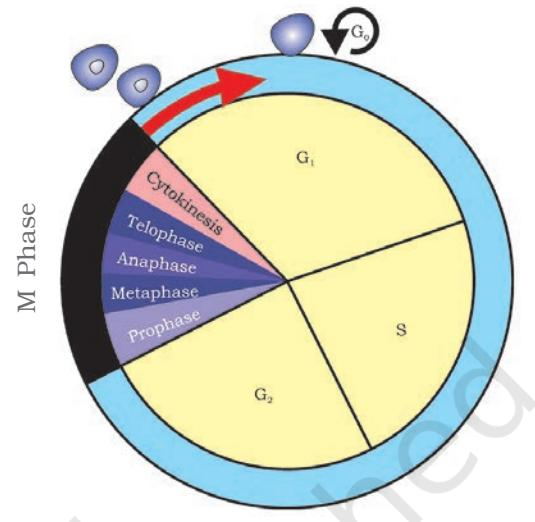
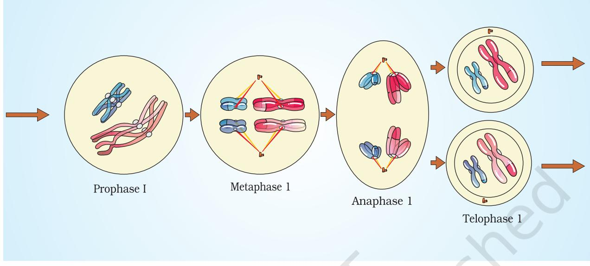
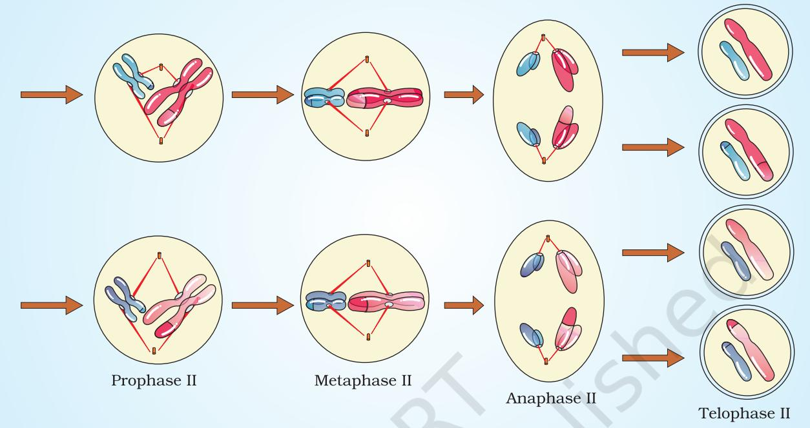

# CELL CYCLE AND CELL DIVISION CHAPTER 10

120 BIOLOGY

- *10.1 Cell Cycle*
- *10.2 M Phase*
- *10.3 Significance of Mitosis*
- *10.4 Meiosis*
- *10.5 Significance of Meiosis*

Are you aware that all organisms, even the largest, start their life from a single cell? You may wonder how a single cell then goes on to form such large organisms. Growth and reproduction are characteristics of cells, indeed of all living organisms. All cells reproduce by dividing into two, with each parental cell giving rise to two daughter cells each time they divide. These newly formed daughter cells can themselves grow and divide, giving rise to a new cell population that is formed by the growth and division of a single parental cell and its progeny. In other words, such cycles of growth and division allow a single cell to form a structure consisting of millions of cells.

## 10.1 CELL CYCLE

Cell division is a very important process in all living organisms. During the division of a cell, DNA replication and cell growth also take place. All these processes, i.e., cell division, DNA replication, and cell growth, hence, have to take place in a coordinated way to ensure correct division and formation of progeny cells containing intact genomes. The sequence of events by which a cell duplicates its genome, synthesises the other constituents of the cell and eventually divides into two daughter cells is termed cell cycle. Although cell growth (in terms of cytoplasmic increase) is a continuous process, DNA synthesis occurs only during one specific stage in the cell cycle. The replicated chromosomes (DNA) are then distributed to daughter nuclei by a complex series of events during cell division. These events are themselves under genetic control.

## 10.1.1 Phases of Cell Cycle

A typical eukaryotic cell cycle is illustrated by human cells in culture. These cells divide once in approximately every 24 hours (Figure 10.1). However, this duration of cell cycle can vary from organism to organism and also from cell type to cell type. Yeast for example, can progress through the cell cycle in only about 90 minutes.

The cell cycle is divided into two basic phases:

- Interphase
- M Phase (Mitosis phase)

The M Phase represents the phase when the actual cell division or mitosis occurs and the interphase represents the phase between two successive M phases. It is significant to note that in the 24 hour average duration of cell cycle of a human cell, cell division proper lasts for only about an hour. The interphase lasts more than 95% of the duration of cell cycle.

The M Phase starts with the nuclear division, corresponding to the separation of daughter chromosomes (karyokinesis) and usually ends with division of cytoplasm (cytokinesis). The interphase, though called the resting phase, is the time during which the cell is preparing for division by undergoing both cell growth and DNA replication in an orderly manner. The interphase is divided into three further phases:

- G1 phase (Gap 1)
- S phase (Synthesis)
- G2 phase (Gap 2)

 G1 phase corresponds to the interval between mitosis and initiation of DNA replication. During G1 phase the cell is metabolically active and continuously grows but does not replicate its DNA. S or synthesis phase marks the period during which DNA synthesis or replication takes place. During this time the amount of DNA per cell doubles. If the initial amount of DNA is denoted as 2C then it increases to 4C. However, there is no increase in the chromosome number; if the cell had diploid or 2n number of chromosomes at G1, even after S phase the number of chromosomes remains the same, i.e., 2n.

In animal cells, during the S phase, DNA replication begins in the nucleus, and the centriole duplicates in the cytoplasm. During the G2 phase, proteins are synthesised in preparation for mitosis while cell growth continues.

Figure 10.1 A diagrammatic view of cell cycle indicating formation of two cells from one cell

How do plants and animals continue to grow all their lives? Do all cells in a plant divide all the time? Do you think all cells continue to divide in all plants and animals? Can you tell the name and the location of tissues having cells that divide all their life in higher plants? Do animals have similar meristematic tissues?

You have studied mitosis in onion root tip cells. It has 16 chromosomes in each cell. Can you tell how many chromosomes will the cell have at G1 phase, after S phase, and after M phase? Also, what will be the DNA content of the cells at G1, after S and at G2, if the content after M phase is 2C?

Some cells in the adult animals do not appear to exhibit division (e.g., heart cells) and many other cells divide only occasionally, as needed to replace cells that have been lost because of injury or cell death. These cells that do not divide further exit G1 phase to enter an inactive stage called *quiescent stage (G0)* of the cell cycle. Cells in this stage remain metabolically active but no longer proliferate unless called on to do so depending on the requirement of the organism.

In animals, mitotic cell division is only seen in the diploid somatic cells. However, there are few exceptions to this where haploid cells divide by mitosis, for example, male honey bees. Against this, the plants can show mitotic divisions in both haploid and diploid cells. From your recollection of examples of alternation of generations in plants (Chapter 3) identify plant species and stages at which mitosis is seen in haploid cells.

## *10.2 M PHASE*

This is the most dramatic period of the cell cycle, involving a major reorganisation of virtually all components of the cell. Since the number of chromosomes in the parent and progeny cells is the same, it is also called as *equational division*. Though for convenience mitosis has been divided into four stages of nuclear division (karyokinesis), it is very essential to understand that cell division is a progressive process and very clear-cut lines cannot be drawn between various stages. Karyokinesis involves following four stages:

- *Prophase*
- *Metaphase*
- *Anaphase*
- *Telophase*

## *10.2.1 Prophase*

Prophase which is the first stage of karyokinesis of mitosis follows the S and G2 phases of interphase. In the S and G2 phases the new DNA molecules formed are not distinct but intertwined. Prophase is marked by the initiation of condensation of chromosomal material. The chromosomal material becomes untangled during the process of chromatin condensation (Figure 10.2 a). The centrosome, which had undergone duplication during S phase of interphase, now begins to move towards opposite poles of the cell. The completion of prophase can thus be marked by the following characteristic events:

- Chromosomal material condenses to form compact mitotic chromosomes. Chromosomes are seen to be composed of two chromatids attached together at the centromere.
- Centrosome which had undergone duplication during interphase, begins to move towards opposite poles of the cell. Each centrosome radiates out microtubules called asters. The two asters together with spindle fibres forms mitotic apparatus.

Cells at the end of prophase, when viewed under the microscope, do not show golgi complexes, endoplasmic reticulum, nucleolus and the nuclear envelope.

#### 10.2.2 Metaphase

The complete disintegration of the nuclear envelope marks the start of the second phase of mitosis, hence the chromosomes are spread through the cytoplasm of the cell. By this stage, condensation of chromosomes is completed and they can be observed clearly under the microscope. This then, is the stage at which morphology of chromosomes is most easily studied. At this stage, metaphase chromosome is made up of two sister chromatids, which are held together by the centromere (Figure 10.2 b). Small disc-shaped structures at the surface of the centromeres are called kinetochores. These structures serve as the sites of attachment of spindle fibres (formed by the spindle fibres) to the chromosomes that are moved into position at the centre of the cell. Hence, the metaphase is characterised by all the chromosomes coming to lie at the equator with one chromatid of each chromosome connected by its kinetochore to spindle fibres from one pole and its sister chromatid connected by its kinetochore to spindle fibres from the opposite pole (Figure 10.2 b). The plane of alignment of the chromosomes at metaphase is referred to as the metaphase plate. The key features of metaphase are:

- Spindle fibres attach to kinetochores of chromosomes.
- Chromosomes are moved to spindle equator and get aligned along metaphase plate through spindle fibres to both poles.

#### 10.2.3 Anaphase

At the onset of anaphase, each chromosome arranged at the metaphase plate is split simultaneously and the two daughter chromatids, now referred to as daughter chromosomes of the future daughter nuclei, begin their migration towards the two opposite poles. As each chromosome moves away from the equatorial plate, the centromere of each chromosome remains directed towards the pole and hence at the leading edge, with the arms of the chromosome trailing behind (Figure 10.2 c). Thus, anaphase stage is characterised by Figure 10.2 a and b : A diagrammatic

view of stages in mitosis

Figure 10.2 c to e : A diagrammatic view of stages in Mitosis

the following key events:

- Centromeres split and chromatids separate.
- Chromatids move to opposite poles.

## 10.2.4 Telophase

At the beginning of the final stage of karyokinesis, i.e., telophase, the chromosomes that have reached their respective poles decondense and lose their individuality. The individual chromosomes can no longer be seen and each set of chromatin material tends to collect at each of the two poles (Figure 10.2 d). This is the stage which shows the following key events:

- Chromosomes cluster at opposite spindle poles and their identity is lost as discrete elements.
- Nuclear envelope develops around the chromosome clusters at each pole forming two daughter nuclei.
- Nucleolus, golgi complex and ER reform.

## 10.2.5 Cytokinesis

Mitosis accomplishes not only the segregation of duplicated chromosomes into daughter nuclei (karyokinesis), but the cell itself is divided into two daughter cells by the separation of cytoplasm called cytokinesis at the end of which cell division gets completed (Figure 10.2 e). In an animal cell, this is achieved by the appearance of a furrow in the plasma membrane. The furrow gradually deepens and ultimately joins in the centre dividing the cell cytoplasm into two. Plant cells however, are enclosed by a relatively inextensible cell wall, thererfore they undergo cytokinesis by a different mechanism. In plant cells, wall formation starts in the centre of the cell and grows outward to meet the existing lateral walls. The formation of the new cell wall begins with the formation of a simple precursor, called the cell-plate that represents the middle lamella between the walls of two adjacent cells. At the time of cytoplasmic division, organelles like mitochondria and plastids get distributed between the two daughter cells. In some organisms karyokinesis is not followed by cytokinesis as a result of which multinucleate condition arises leading to the formation of syncytium (e.g., liquid endosperm in coconut).

#### 10.3 Significance of Mitosis

Mitosis or the equational division is usually restricted to the diploid cells only. However, in some lower plants and in some social insects haploid cells also divide by mitosis. It is very essential to understand the significance of this division in the life of an organism. Are you aware of some examples where you have studied about haploid and diploid insects?

Mitosis usually results in the production of diploid daughter cells with identical genetic complement. The growth of multicellular organisms is due to mitosis. Cell growth results in disturbing the ratio between the nucleus and the cytoplasm. It therefore becomes essential for the cell to divide to restore the nucleo-cytoplasmic ratio. A very significant contribution of mitosis is cell repair. The cells of the upper layer of the epidermis, cells of the lining of the gut, and blood cells are being constantly replaced. Mitotic divisions in the meristematic tissues – the apical and the lateral cambium, result in a continuous growth of plants throughout their life.

## 10.4 MEIOSIS

The production of offspring by sexual reproduction includes the fusion of two gametes, each with a complete haploid set of chromosomes. Gametes are formed from specialised diploid cells. This specialised kind of cell division that reduces the chromosome number by half results in the production of haploid daughter cells. This kind of division is called meiosis. Meiosis ensures the production of haploid phase in the life cycle of sexually reproducing organisms whereas fertilisation restores the diploid phase. We come across meiosis during gametogenesis in plants and animals. This leads to the formation of haploid gametes. The key features of meiosis are as follows:

- Meiosis involves two sequential cycles of nuclear and cell division called meiosis I and meiosis II but only a single cycle of DNA replication.
- Meiosis I is initiated after the parental chromosomes have replicated to produce identical sister chromatids at the S phase.
- Meiosis involves pairing of homologous chromosomes and recombination between non-sister chromatids of homologous chromosomes.
- Four haploid cells are formed at the end of meiosis II. Meiotic events can be grouped under the following phases:

| Meiosis I | Meiosis II |
| --- | --- |
| Prophase I | Prophase II |
| Metaphase I | Metaphase II |
| Anaphase I | Anaphase II |
| Telophase I | Telophase II |

#### 10.4.1 Meiosis I

Prophase I: Prophase of the first meiotic division is typically longer and more complex when compared to prophase of mitosis. It has been further subdivided into the following five phases based on chromosomal behaviour, i.e., Leptotene, Zygotene, Pachytene, Diplotene and Diakinesis.

During leptotene stage the chromosomes become gradually visible under the light microscope. The compaction of chromosomes continues throughout leptotene. This is followed by the second stage of prophase I called zygotene. During this stage chromosomes start pairing together and this process of association is called synapsis. Such paired chromosomes are called homologous chromosomes. Electron micrographs of this stage indicate that chromosome synapsis is accompanied by the formation of complex structure called synaptonemal complex. The complex formed by a pair of synapsed homologous chromosomes is called a bivalent or a tetrad. However, these are more clearly visible at the next stage. The first two stages of prophase I are relatively short-lived compared to the next stage that is pachytene. During this stage, the four chromatids of each bivalent chromosomes becomes distinct and clearly appears as tetrads. This stage is characterised by the appearance of recombination nodules, the sites at which crossing over occurs between non-sister chromatids of the homologous chromosomes. Crossing over is the exchange of genetic material between two homologous chromosomes. Crossing over is also an enzyme-mediated process and the enzyme involved is called recombinase. Crossing over leads to recombination of genetic material on the two chromosomes. Recombination between homologous chromosomes is completed by the end of pachytene, leaving the chromosomes linked at the sites of crossing over.

The beginning of diplotene is recognised by the dissolution of the synaptonemal complex and the tendency of the recombined homologous chromosomes of the bivalents to separate from each other except at the sites of crossovers. These X-shaped structures, are called chiasmata. In oocytes of some vertebrates, diplotene can last for months or years.

The final stage of meiotic prophase I is diakinesis. This is marked by terminalisation of chiasmata. During this phase the chromosomes are fully condensed and the meiotic spindle is assembled to prepare the homologous chromosomes for separation. By the end of diakinesis, the nucleolus disappears and the nuclear envelope also breaks down. Diakinesis represents transition to metaphase.

Metaphase I: The bivalent chromosomes align on the equatorial plate (Figure 10.3). The microtubules from the opposite poles of the spindle attach to the kinetochore of homologous chromosomes.

Figure 10.3 Stages of Meiosis I

Anaphase I: The homologous chromosomes separate, while sister chromatids remain associated at their centromeres (Figure 10.3).

Telophase I: The nuclear membrane and nucleolus reappear, cytokinesis follows and this is called as dyad of cells (Figure 10.3). Although in many cases the chromosomes do undergo some dispersion, they do not reach the extremely extended state of the interphase nucleus. The stage between the two meiotic divisions is called interkinesis and is generally short lived. There is no replication of DNA during interkinesis. Interkinesis is followed by prophase II, a much simpler prophase than prophase I.

## 10.4.2 Meiosis II

Prophase II: Meiosis II is initiated immediately after cytokinesis, usually before the chromosomes have fully elongated. In contrast to meiosis I, meiosis II resembles a normal mitosis. The nuclear membrane disappears by the end of prophase II (Figure 10.4). The chromosomes again become compact.

Metaphase II: At this stage the chromosomes align at the equator and the microtubules from opposite poles of the spindle get attached to the kinetochores (Figure 10.4) of sister chromatids.

Anaphase II: It begins with the simultaneous splitting of the centromere of each chromosome (which was holding the sister chromatids together), allowing them to move toward opposite poles of the cell (Figure 10.4) by shortening of microtubules attached to kinetochores.

Figure 10.4 Stages of Meiosis II

Telophase II: Meiosis ends with telophase II, in which the two groups of chromosomes once again get enclosed by a nuclear envelope; cytokinesis follows resulting in the formation of tetrad of cells i.e., four haploid daughter cells (Figure 10.4).

# 10.5 SIGNIFICANCE OF MEIOSIS

Meiosis is the mechanism by which conservation of specific chromosome number of each species is achieved across generations in sexually reproducing organisms, even though the process, per se, paradoxically, results in reduction of chromosome number by half. It also increases the genetic variability in the population of organisms from one generation to the next. Variations are very important for the process of evolution.

## SUMMARY

According to the cell theory, cells arise from preexisting cells. The process by which this occurs is called cell division. Any sexually reproducing organism starts its life cycle from a single-celled zygote. Cell division does not stop with the formation of the mature organism but continues throughout its life cycle. The stages through which a cell passes from one division to the next is called the cell cycle. Cell cycle is divided into two phases called (i) Interphase – a period of preparation for cell division, and (ii) Mitosis (M phase) – the actual period of cell division. Interphase is further subdivided into G1, S and G2. G1 phase is the period when the cell grows and carries out normal metabolism. Most of the organelle duplication also occurs during this phase. S phase marks the phase of DNA replication and chromosome duplication. G2 phase is the period of cytoplasmic growth. Mitosis is also divided into four stages namely prophase, metaphase, anaphase and telophase. Chromosome condensation occurs during prophase. Simultaneously, the centrioles move to the opposite poles. The nuclear envelope and the nucleolus disappear and the spindle fibres start appearing. Metaphase is marked by the alignment of chromosomes at the equatorial plate. During anaphase the centromeres divide and the chromatids start moving towards the two opposite poles. Once the chromatids reach the two poles, the chromosomal elongation starts, nucleolus and the nuclear membrane reappear. This stage is called the telophase. Nuclear division is then followed by the cytoplasmic division and is called cytokinesis. Mitosis thus, is the equational division in which the chromosome number of the parent is conserved in the daughter cell.

In contrast to mitosis, meiosis occurs in the diploid cells, which are destined to form gametes. It is called the reduction division since it reduces the chromosome number by half while making the gametes. In sexual reproduction when the two gametes fuse the chromosome number is restored to the value in the parent. Meiosis is divided into two phases – meiosis I and meiosis II. In the first meiotic division the homologous chromosomes pair to form bivalents, and undergo crossing over. Meiosis I has a long prophase, which is divided further into five phases. These are leptotene, zygotene, pachytene, diplotene and diakinesis. During metaphase I the bivalents arrange on the equatorial plate. This is followed by anaphase I in which homologous chromosomes move to the opposite poles with both their chromatids. Each pole receives half the chromosome number of the parent cell. In telophase I, the nuclear membrane and nucleolus reappear. Meiosis II is similar to mitosis. During anaphase II the sister chromatids separate. Thus at the end of meiosis four haploid cells are formed.

## EXERCISES

- 1. What is the average cell cycle span for a mammalian cell?
- 2. Distinguish cytokinesis from karyokinesis.
- 3. Describe the events taking place during interphase.
- 4. What is Go (quiescent phase) of cell cycle?
- 5. Why is mitosis called equational division?
- 6. Name the stage of cell cycle at which one of the following events occur:
	- (i) Chromosomes are moved to spindle equator.
	- (ii) Centromere splits and chromatids separate.
	- (iii) Pairing between homologous chromosomes takes place.
	- (iv) Crossing over between homologous chromosomes takes place.
- 7. Describe the following:
	- (a) synapsis (b) bivalent (c) chiasmata

Draw a diagram to illustrate your answer.

- 8. How does cytokinesis in plant cells differ from that in animal cells?
- 9. Find examples where the four daughter cells from meiosis are equal in size and where they are found unequal in size.
- 10. Distinguish anaphase of mitosis from anaphase I of meiosis.
- 11. List the main differences between mitosis and meiosis.
- 12. What is the significance of meiosis?
- 13. Discuss with your teacher about
	- (i) haploid insects and lower plants where cell-division occurs, and
	- (ii) some haploid cells in higher plants where cell-division does not occur.
- 14. Can there be mitosis without DNA replication in 'S' phase?
- 15. Can there be DNA replication without cell division?
- 16. Analyse the events during every stage of cell cycle and notice how the following two parameters change
	- (i) number of chromosomes (N) per cell
	- (ii) amount of DNA content (C) per cell

