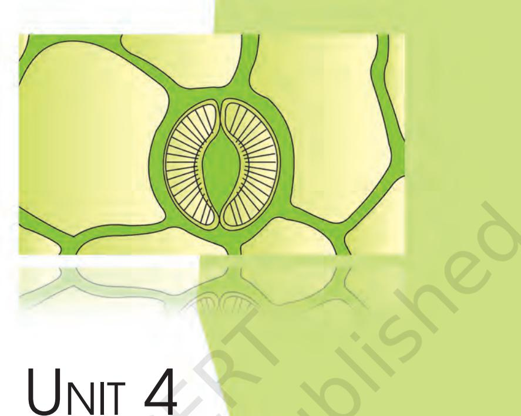

# PLANT PHYSIOLOGY

#### Chapter 11

Photosynthesis in Higher Plants

Chapter 12 Respiration in Plants

Chapter 13 Plant Growth and Development

The description of structure and variation of living organisms over a period of time, ended up as two, apparently irreconcilable perspectives on biology. The two perspectives essentially rested on two levels of organisation of life forms and phenomena. One described at organismic and above level of organisation while the second described at cellular and molecular level of organisation. The first resulted in ecology and related disciplines. The second resulted in physiology and biochemistry. Description of physiological processes, in flowering plants as an example, is what is given in the chapters in this unit. The processes of photosynthesis, respiration and ultimately plant growth and development are described in molecular terms but in the context of cellular activities and even at organism level. Wherever appropriate, the relation of the physiological processes to environment is also discussed.

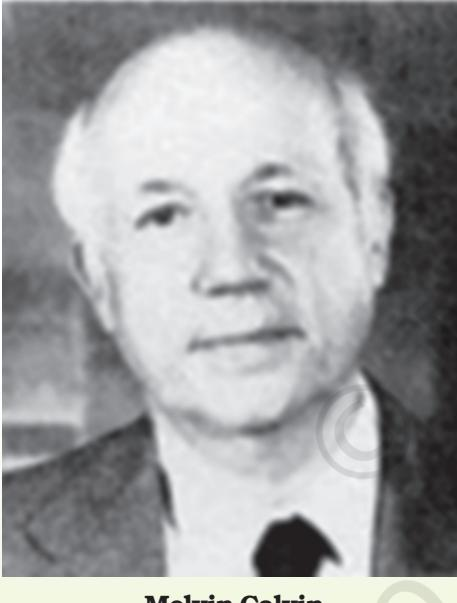

Melvin Calvin research.

MELVIN CALVIN born in Minnesota in April, 1911, received his Ph.D. in Chemistry from the University of Minnesota. He served as Professor of Chemistry at the University of California, Berkeley.

Just after world war II, when the world was under shock after the Hiroshima-Nagasaki bombings, and seeing the illeffects of radio-activity, Calvin and co-workers put radioactivity to beneficial use. He along with J.A. Bassham studied reactions in green plants forming sugar and other substances from raw materials like carbon dioxide, water and minerals by labelling the carbon dioxide with C14. Calvin proposed that plants change light energy to chemical energy by transferring an electron in an organised array of pigment molecules and other substances. The mapping of the pathway of carbon assimilation in photosynthesis earned him Nobel Prize in 1961.

The principles of photosynthesis as established by Calvin are, at present, being used in studies on renewable resource for energy and materials and basic studies in solar energy


## PHOTOSYNTHESIS IN HIGHER PLANTS CHAPTER 11

PHOTOSYNTHESIS IN HIGHER PLANTS 133

- *11.1 What do we Know?*
- *11.2 Early Experiments*
- *11.3 Where does Photosynthesis take place?*
- *11.4 How many Pigments are involved in Photosynthesis?*
- *11.5 What is Light Reaction?*
- *11.6 The Electron Transport*
- *11.7 Where are the ATP and NADPH Used?*
- *11.8 The C4 Pathway*
- *11.9 hotorespiration*
- *11.10 Factors affecting Photosynthesis*

All animals including human beings depend on plants for their food. Have you ever wondered from where plants get their food? Green plants, in fact, have to make or rather synthesise the food they need and all other organisms depend on them for their needs. The green plants make or rather synthesise the food they need through photosynthesis and are therefore called autotrophs. You have already learnt that the autotrophic nutrition is found only in plants and all other organisms that depend on the green plants for food are heterotrophs. Green plants carry out 'photosynthesis', a physico-chemical process by which they use light energy to drive the synthesis of organic compounds. Ultimately, all living forms on earth depend on sunlight for energy. The use of energy from sunlight by plants doing photosynthesis is the basis of life on earth. Photosynthesis is important due to two reasons: it is the primary source of all food on earth. It is also responsible for the release of oxygen into the atmosphere by green plants. *Have you ever thought what would happen if there were no oxygen to breath?* This chapter focusses on the structure of the photosynthetic machinery and the various reactions that transform light energy into chemical energy.

## 11.1 WHAT DO WE KNOW?

Let us try to find out what we already know about photosynthesis. Some simple experiments you may have done in the earlier classes have shown that chlorophyll (green pigment of the leaf), light and CO2 are required for photosynthesis to occur.

You may have carried out the experiment to look for starch formation in two leaves – a variegated leaf or a leaf that was partially covered with black paper, and exposed to light. On testing these leaves for the presence of starch it was clear that photosynthesis occurred only in the green parts of the leaves in the presence of light.

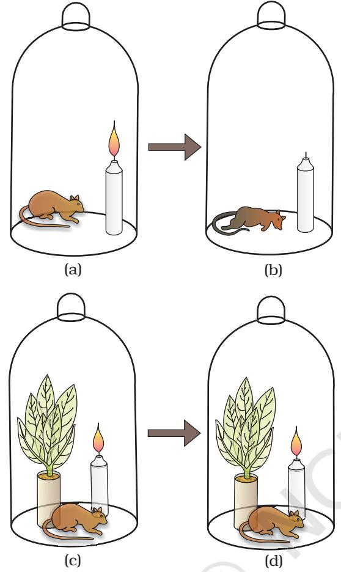


Another experiment you may have carried out where a part of a leaf is enclosed in a test tube containing some KOH soaked cotton (which absorbs CO2 ), while the other half is exposed to air. The setup is then placed in light for some time. On testing for the presence of starch later in the two parts of the leaf, you must have found that the exposed part of the leaf tested positive for starch while the portion that was in the tube, tested negative. This showed that CO2 was required for photosynthesis. *Can you explain how this conclusion could be drawn?*

#### 11.2 EARLY EXPERIMENTS

It is interesting to learn about those simple experiments that led to a gradual development in our understanding of photosynthesis.

Joseph Priestley (1733-1804) in 1770 performed a series of experiments that revealed the essential role of air in the growth of green plants. Priestley, you may recall, discovered oxygen in 1774. Priestley observed that a candle burning in a closed space – a bell jar, soon gets extinguished (Figure 11.1 a, b, c, d). Similarly, a mouse would soon suffocate in a closed space. He concluded that a burning candle or an animal that breathe the air,

both somehow, damage the air. But when he placed a mint plant in the same bell jar, he found that the mouse stayed alive and the candle continued to burn. Priestley hypothesised as follows: Plants restore to the air whatever breathing animals and burning candles remove.

Can you imagine how Priestley would have conducted the experiment using a candle and a plant? Remember, he would need to rekindle the candle to test whether it burns after a few days. *How many different ways can you think of to light the candle without disturbing the set-up?*

Using a similar setup as the one used by Priestley, but by placing it once in the dark and once in the sunlight, Jan Ingenhousz (1730-1799) showed that sunlight is essential to the plant process that somehow purifies the air fouled by burning candles or breathing animals. Ingenhousz in an elegant experiment with an aquatic plant showed that in bright sunlight, small bubbles were formed around the green parts while in the dark they did not. Later he identified these bubbles to be of oxygen. Hence he showed that it is only the green part of the plants that could release oxygen.

It was not until about 1854 that Julius von Sachs provided evidence for production of glucose when plants grow. Glucose is usually stored as starch. His later studies showed that the green substance in plants (chlorophyll as we know it now) is located in special bodies (later called chloroplasts) within plant cells. He found that the green parts in plants is where glucose is made, and that the glucose is usually stored as starch.

Now consider the interesting experiments done by T.W Engelmann (1843 – 1909). Using a prism he split light into its spectral components and then illuminated a green alga, *Cladophora*, placed in a suspension of aerobic bacteria. The bacteria were used to detect the sites of O2 evolution. He observed that the bacteria accumulated mainly in the region of blue and red light of the split spectrum. A first action spectrum of photosynthesis was thus described. It resembles roughly the absorption spectra of chlorophyll *a* and *b* (discussed in section 11.4).

By the middle of the nineteenth century the key features of plant photosynthesis were known, namely, that plants could use light energy to make carbohydrates from CO2 and water. The empirical equation representing the total process of photosynthesis for oxygen evolving organisms was then understood as:

  
  
**CO${}_{2}$ +H${}_{2}$O** **Light** **[**CH${}_{2}$O${}_{1}$+O${}_{2}$**]**

where [CH2O] represented a carbohydrate (e.g., glucose, a six-carbon sugar).

A milestone contribution to the understanding of photosynthesis was that made by a microbiologist, Cornelius van Niel (1897-1985), who, based on his studies of purple and green bacteria, demonstrated that photosynthesis is essentially a light-dependent reaction in which hydrogen from a suitable oxidisable compound reduces carbon dioxide to carbohydrates. This can be expressed by:

> 2H A2 CO2 2A CH O H O 2 2 Light + → + +

In green plants H2O is the hydrogen donor and is oxidised to O2 . Some organisms do not release O2 during photosynthesis. When H2 S, instead is the hydrogen donor for purple and green sulphur bacteria, the 'oxidation' product is sulphur or sulphate depending on the organism and not O2 . Hence, he inferred that the O2 evolved by the green plant comes from H2O, not from carbon dioxide. This was later proved by using radioisotopic techniques. The correct equation, that would represent the overall process of photosynthesis is therefore:

> 6 12 CO H O 2 2 C H O H O O 6 12 6 2 6 6 2 Light + → + +

where C6 H12 O6 represents glucose. The O2 released is from water; this was proved using radio isotope techniques. Note that this is not a single reaction but description of a multistep process called photosynthesis. *Can you explain why twelve molecules of water as substrate are used in the equation given above?*

#### 11.3 WHERE DOES PHOTOSYNTHESIS TAKE PLACE?

You would of course answer: in 'the green leaf' or 'in the chloroplasts', based on what you earlier read in Chapter 8. You are definitely right. Photosynthesis does take place in the green leaves of plants but it does so also in other green parts of the plants. *Can you name some other parts where you think photosynthesis may occur?*

You would recollect from previous unit that the mesophyll cells in the leaves, have a large number of chloroplasts. Usually the chloroplasts align themselves along the walls of the mesophyll cells, such that they get the optimum quantity of the incident light. *When do you think the chloroplasts will be aligned with their flat surfaces parallel to the walls? When would they be perpendicular to the incident light?*

You have studied the structure of chloroplast in Chapter 8. Within the chloroplast there is membranous system consisting of grana, the stroma lamellae, and the matrix stroma (Figure 11.2). There is a clear division of labour within the chloroplast. The membrane system is responsible for trapping the light energy and also for the synthesis of ATP and NADPH. In stroma, enzymatic reactions synthesise sugar, which in turn forms starch. The former set of reactions, since they are directly light driven are called light reactions (photochemical reactions). The latter are not directly light driven but are dependent on the products of light reactions (ATP and NADPH). Hence, to distinguish the latter they are called, by convention, as dark reactions (carbon reactions). However, this should not be construed to mean that they occur in darkness or that they are not light-dependent.

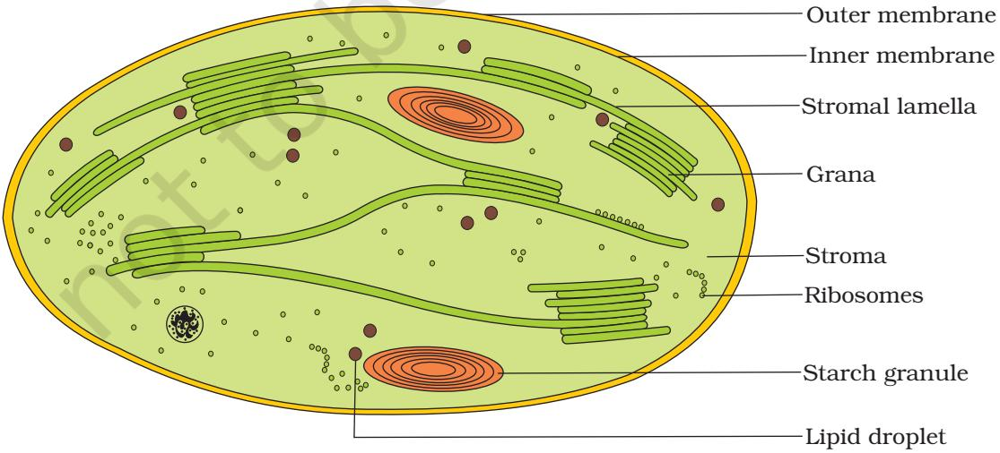

Figure 11.2 Diagrammatic representation of an electron micrograph of a section of chloroplast

#### 11.4 HOW MANY TYPES OF PIGMENTS ARE INVOLVED IN PHOTOSYNTHESIS?

Looking at plants have you ever wondered why and how there are so many shades of green in their leaves – even in the same plant? We can look for an answer to this question by trying to separate the leaf pigments of any green plant through paper chromatography. A chromatographic separation of the leaf pigments shows that the colour that we see in leaves is not due to a single pigment but due to four pigments: Chlorophyll *a* (bright or blue green in the chromatogram), chlorophyll *b* (yellow green), xanthophylls (yellow) and carotenoids (yellow to yellow-orange). Let us now see what roles various pigments play in photosynthesis.

Pigments are substances that have an ability to absorb light, at specific wavelengths. *Can you guess which is the most abundant plant pigment in the world?* Let us study the graph showing the ability of chlorophyll *a* pigment to absorb lights of different wavelengths (Figure 11.3 a). Of course, you are familiar with the wavelength of the visible spectrum of light as well as the VIBGYOR.

*From Figure 11.3a can you determine the wavelength (colour of light) at which chlorophyll a shows the maximum absorption? Does it show another absorption peak at any other wavelengths too? If yes, which one?*

Now look at Figure 11.3b showing the wavelengths at which maximum photosynthesis occurs in a plant. Can you see that the wavelengths at which there is maximum absorption by chlorophyll *a,* i.e., in the blue and the red regions, also shows higher rate of photosynthesis. Hence, we can conclude that chlorophyll *a* is the chief pigment associated with photosynthesis. *But by looking at Figure 11.3c can you say that there is a complete oneto-one overlap between the absorption spectrum of chlorophyll a and the action spectrum of photosynthesis?*

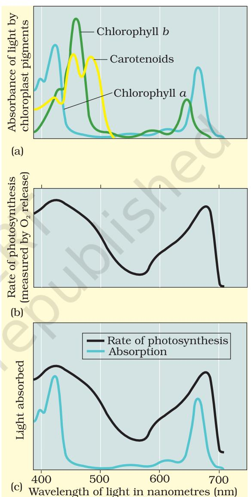

| Figure 11.3a Graph showing the absorption |
| --- |
| spectrum of chlorophyll a, b and |
| the carotenoids |

- Figure 11.3b Graph showing action spectrum of photosynthesis
- Figure 11.3c Graph showing action spectrum of photosynthesis superimposed on absorption spectrum of chlorophyll *a*

These graphs, together, show that most of the photosynthesis takes place in the blue and red regions of the spectrum; some photosynthesis does take place at the other wavelengths of the visible spectrum. Let us see how this happens. Though chlorophyll is the major pigment responsible for trapping light, other thylakoid pigments like chlorophyll *b,* xanthophylls and carotenoids, which are called accessory pigments, also absorb light and transfer the energy to chlorophyll *a*. Indeed, they not only enable a wider range of wavelength of incoming light to be utilised for photosyntesis but also protect chlorophyll *a* from photo-oxidation.

#### 11.5 WHAT IS LIGHT REACTION?

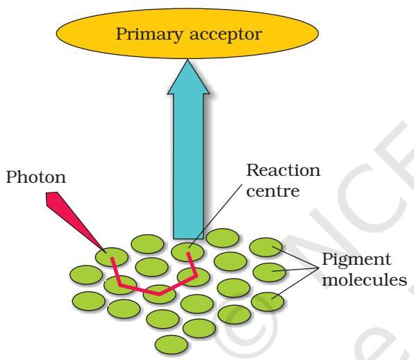

Figure 11.4 The light harvesting complex

Light reactions or the 'Photochemical' phase include light absorption, water splitting, oxygen release, and the formation of high-energy chemical intermediates, ATP and NADPH. Several protein complexes are involved in the process. The pigments are organised into two discrete photochemical light harvesting complexes (LHC) within the Photosystem I (PS I) and Photosystem II (PS II). These are named in the sequence of their discovery, and not in the sequence in which they function during the light reaction. The LHC are made up of hundreds of pigment molecules bound to proteins. Each photosystem has all the pigments (except one molecule of chlorophyll *a*) forming a light harvesting system also called antennae (Figure 11.4). These pigments help to make photosynthesis more efficient by absorbing

different wavelengths of light. The single chlorophyll *a* molecule forms the reaction centre. The reaction centre is different in both the photosystems. In PS I the reaction centre chlorophyll *a* has an absorption peak at 700 nm, hence is called P700, while in PS II it has absorption maxima at 680 nm, and is called P680.

#### 11.6 THE ELECTRON TRANSPORT

In photosystem II the reaction centre chlorophyll *a* absorbs 680 nm wavelength of red light causing electrons to become excited and jump into an orbit farther from the atomic nucleus. These electrons are picked up by an electron acceptor which passes them to an electrons transport system consisting of cytochromes (Figure 11.5). This movement of electrons is downhill, in terms of an oxidation-reduction or redox potential scale. The electrons are not used up as they pass through the electron transport chain, but are passed on to the pigments of photosystem PS I. Simultaneously, electrons in the reaction centre of PS I are also excited when they receive red light of wavelength 700 nm and are transferred to another accepter molecule that has a greater redox potential. These electrons then are moved downhill again, this time to a molecule of energy-rich NADP+ . The addition of these electrons reduces NADP+ to NADPH + H+ . This whole scheme of transfer of electrons, starting from the PS II, uphill to the acceptor, down the electron transport chain to PS I, excitation of electrons, transfer to

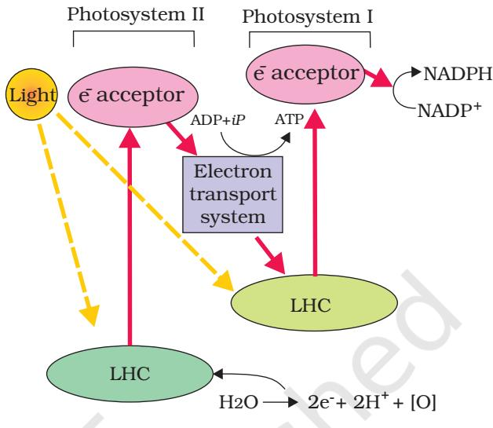

Figure 11.5 Z scheme of light reaction

another acceptor, and finally down hill to NADP+ reducing it to NADPH + H+ is called the Z scheme, due to its characterstic shape (Figure 11.5). This shape is formed when all the carriers are placed in a sequence on a redox potential scale.

#### 11.6.1 Splitting of Water

You would then ask, *How does PS II supply electrons continuously?* The electrons that were moved from photosystem II must be replaced. This is achieved by electrons available due to splitting of water. The splitting of water is associated with the PS II; water is split into 2H+ , [O] and electrons. This creates oxygen, one of the net products of photosynthesis. The electrons needed to replace those removed from photosystem I are provided by photosystem II.

2H${}_{2}$O - 4H${}^{+}$ + O${}_{2}$ + 4e

We need to emphasise here that the water splitting complex is associated with the PS II, which itself is physically located on the inner side of the membrane of the thylakoid. *Then, where are the protons and O2 formed likely to be released – in the lumen? or on the outer side of the membrane?*

#### 11.6.2 Cyclic and Non-cyclic Photo-phosphorylation

Living organisms have the capability of extracting energy from oxidisable substances and store this in the form of bond energy. Special substances like ATP, carry this energy in their chemical bonds. The process through which

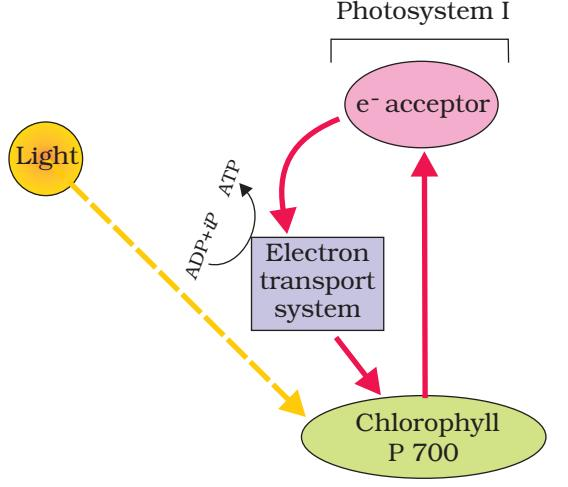

Figure 11.6 Cyclic photophosphorylation

ATP is synthesised by cells (in mitochondria and chloroplasts) is named phosphorylation. Photophosphorylation is the synthesis of ATP from ADP and inorganic phosphate in the presence of light. When the two photosystems work in a series, first PS II and then the PS I, a process called non-cyclic photo-phosphorylation occurs. The two photosystems are connected through an electron transport chain, as seen earlier – in the Z scheme. Both ATP and NADPH + H+ are synthesised by this kind of electron flow (Figure 11.5).

When only PS I is functional, the electron is circulated within the photosystem and the phosphorylation occurs due to cyclic flow of electrons (Figure 11.6). A possible location where this could be happening is in the stroma

lamellae. While the membrane or lamellae of the grana have both PS I and PS II the stroma lamellae membranes lack PS II as well as NADP reductase enzyme. The excited electron does not pass on to NADP+ but is cycled back to the PS I complex through the electron transport chain (Figure 11.6). The cyclic flow hence, results only in the synthesis of ATP, but not of NADPH + H+ . Cyclic photophosphorylation also occurs when only light of wavelengths beyond 680 nm are available for excitation.

#### 11.6.3 Chemiosmotic Hypothesis

Let us now try and understand how actually ATP is synthesised in the chloroplast. The chemiosmotic hypothesis has been put forward to explain the mechanism. Like in respiration, in photosynthesis too, ATP synthesis is linked to development of a proton gradient across a membrane. This time these are the membranes of thylakoid. There is one difference though, here the proton accumulation is towards the inside of the membrane, i.e., in the lumen. In respiration, protons accumulate in the intermembrane space of the mitochondria when electrons move through the ETS (Chapter 12).

Let us understand what causes the proton gradient across the membrane. We need to consider again the processes that take place during the activation of electrons and their transport to determine the steps that cause a proton gradient to develop (Figure 11.7).

- (a) Since splitting of the water molecule takes place on the inner side of the membrane, the protons or hydrogen ions that are produced by the splitting of water accumulate within the lumen of the thylakoids.
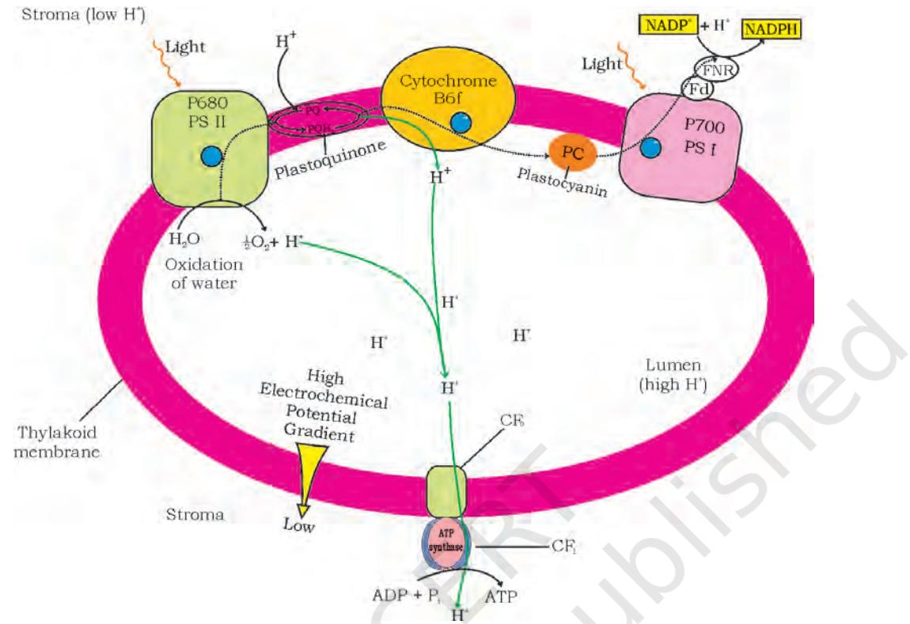

Figure 11.7 ATP synthesis through chemiosmosis

- (b) As electrons move through the photosystems, protons are transported across the membrane. This happens because the primary accepter of electron which is located towards the outer side of the membrane transfers its electron not to an electron carrier but to an H carrier. Hence, this molecule removes a proton from the stroma while transporting an electron. When this molecule passes on its electron to the electron carrier on the inner side of the membrane, the proton is released into the inner side or the lumen side of the membrane.
- (c) The NADP reductase enzyme is located on the stroma side of the membrane. Along with electrons that come from the acceptor of electrons of PS I, protons are necessary for the reduction of NADP+ to NADPH+ H+ . These protons are also removed from the stroma.

Hence, within the chloroplast, protons in the stroma decrease in number, while in the lumen there is accumulation of protons. This creates a proton gradient across the thylakoid membrane as well as a measurable decrease in pH in the lumen.

Why are we so interested in the proton gradient? This gradient is important because it is the breakdown of this gradient that leads to the synthesis of ATP. The gradient is broken down due to the movement of protons across the membrane to the stroma through the transmembrane

channel of the CF0 of the ATP synthase. The ATP synthase enzyme consists of two parts: one called the CF0 is embedded in the thylakoid membrane and forms a transmembrane channel that carries out facilitated diffusion of protons across the membrane. The other portion is called CF1 and protrudes on the outer surface of the thylakoid membrane on the side that faces the stroma. The break down of the gradient provides enough energy to cause a conformational change in the CF1 particle of the ATP synthase, which makes the enzyme synthesise several molecules of energypacked ATP.

Chemiosmosis requires a membrane, a proton pump, a proton gradient and ATP synthase. Energy is used to pump protons across a membrane, to create a gradient or a high concentration of protons within the thylakoid lumen. ATP synthase has a channel that allows diffusion of protons back across the membrane; this releases enough energy to activate ATP synthase enzyme that catalyses the formation of ATP.

Along with the NADPH produced by the movement of electrons, the ATP will be used immediately in the biosynthetic reaction taking place in the stroma, responsible for fixing CO2 , and synthesis of sugars.

#### 11.7 WHERE ARE THE ATP AND NADPH USED?

We learnt that the products of light reaction are ATP, NADPH and O2 . Of these O2 diffuses out of the chloroplast while ATP and NADPH are used to drive the processes leading to the synthesis of food, more accurately, sugars. This is the biosynthetic phase of photosynthesis. This process does not directly depend on the presence of light but is dependent on the products of the light reaction, i.e., ATP and NADPH, besides CO2 and H2O. You may wonder how this could be verified; it is simple: immediately after light becomes unavailable, the biosynthetic process continues for some time, and then stops. If then, light is made available, the synthesis starts again.

*Can we, hence, say that calling the biosynthetic phase as the dark reaction reactionreaction is a misnomer? Discuss this amongst yourselves.*

Let us now see how the ATP and NADPH are used in the biosynthetic phase. We saw earlier that CO2 is combined with H2O to produce (CH2O) n or sugars. It was of interest to scientists to find out how this reaction proceeded, or rather what was the first product formed when CO2 is taken into a reaction or fixed. Just after world war II, among the several efforts to put radioisotopes to beneficial use, the work of Melvin Calvin is exemplary. The use of radioactive 14C by him in algal photosynthesis studies led to the discovery that the first CO2 fixation product was a 3-carbon organic acid. He also contributed to working out the complete biosynthetic pathway; hence it was called Calvin cycle after him. The first product identified was 3-phosphoglyceric acid or in short PGA. *How many carbon atoms does it have?*

Scientists also tried to know whether all plants have PGA as the first product of CO2 fixation, or whether any other product was formed in other plants. Experiments conducted over a wide range of plants led to the discovery of another group of plants, where the first stable product of CO2 fixation was again an organic acid, but one which had 4 carbon atoms in it. This acid was identified to be oxaloacetic acid or OAA. Since then CO2 assimilation during photosynthesis was said to be of two main types: those plants in which the first product of CO2 fixation is a C3 acid (PGA), i.e., the C3 pathway, and those in which the first product was a C4 acid (OAA), i.e., the C4 pathway. These two groups of plants showed other associated characteristics that we will discuss later.

### 11.7.1 The Primary Acceptor of CO2

Let us now ask ourselves a question that was asked by the scientists who were struggling to understand the 'dark reaction'. *How many carbon atoms would a molecule have which after accepting (fixing) CO2 , would have 3 carbons (of PGA)?*

The studies very unexpectedly showed that the acceptor molecule was a 5-carbon ketose sugar – ribulose bisphosphate (RuBP). *Did any of you think of this possibility?* Do not worry; the scientists also took a long time and conducted many experiments to reach this conclusion. They also believed that since the first product was a C3 acid, the primary acceptor would be a 2-carbon compound; they spent many years trying to identify a 2-carbon compound before they discovered the 5-carbon RuBP.

#### 11.7.2 The Calvin Cycle

Calvin and his co-workers then worked out the whole pathway and showed that the pathway operated in a cyclic manner; the RuBP was regenerated. Let us now see how the Calvin pathway operates and where the sugar is synthesised. Let us at the outset understand very clearly that the Calvin pathway occurs in all photosynthetic plants; it does not matter whether they have C3 or C4 (or any other) pathways (Figure 11.8).

For ease of understanding, the Calvin cycle can be described under three stages: carboxylation, reduction and regeneration.

- 1. Carboxylation– Carboxylation is the fixation of CO2 into a stable organic intermediate. Carboxylation is the most crucial step of the Calvin cycle where CO2 is utilised for the carboxylation of RuBP. This reaction is catalysed by the enzyme RuBP carboxylase which results in the formation of two molecules of 3-PGA. Since this enzyme also has an oxygenation activity it would be more correct to call it RuBP carboxylase-oxygenase or RuBisCO.
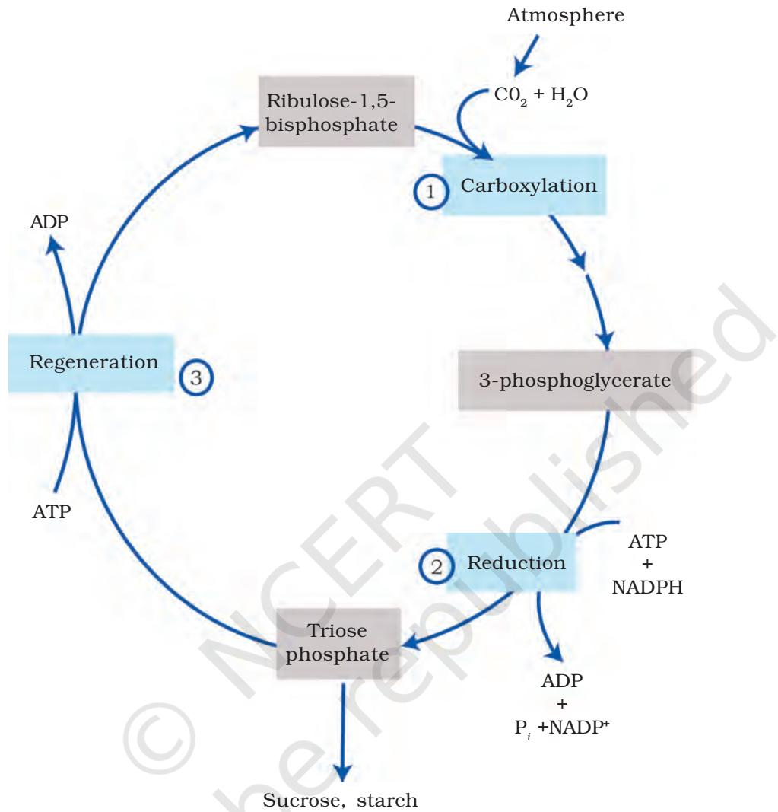

- Figure 11.8 The Calvin cycle proceeds in three stages : (1) carboxylation, during which CO2 combines with ribulose-1,5-bisphosphate; (2) reduction, during which carbohydrate is formed at the expense of the photochemically made ATP and NADPH; and (3) regeneration during which the CO2 acceptor ribulose-1,5-bisphosphate is formed again so that the cycle continues
	- 2. Reduction These are a series of reactions that lead to the formation of glucose. The steps involve utilisation of 2 molecules of ATP for phosphorylation and two of NADPH for reduction per CO2 molecule fixed. The fixation of six molecules of CO2 and 6 turns of the cycle are required for the formation of one molecule of glucose from the pathway.
	- 3. Regeneration Regeneration of the CO2 acceptor molecule RuBP is crucial if the cycle is to continue uninterrupted. The regeneration steps require one ATP for phosphorylation to form RuBP.

Hence for every CO2 molecule entering the Calvin cycle, 3 molecules of ATP and 2 of NADPH are required. It is probably to meet this difference in number of ATP and NADPH used in the dark reaction that the cyclic phosphorylation takes place.

To make one molecule of glucose 6 turns of the cycle are required. *Work out how many ATP and NADPH molecules will be required to make one molecule of glucose through the Calvin pathway.*

It might help you to understand all of this if we look at what goes in and what comes out of the Calvin cycle.

| In | Out |
| --- | --- |
| Six CO2 | One glucose |
| 18 ATP | 18 ADP |
| 12 NADPH | 12 NADP |

#### 11.8 THE C4 PATHWAY

Plants that are adapted to dry tropical regions have the C4 pathway mentioned earlier. Though these plants have the C4 oxaloacetic acid as the first CO2 fixation product they use the C3 pathway or the Calvin cycle as the main biosynthetic pathway. Then, in what way are they different from C3 plants? This is a question that you may reasonably ask.

C4 plants are special: They have a special type of leaf anatomy, they tolerate higher temperatures, they show a response to high light intensities, they lack a process called photorespiration and have greater productivity of biomass. Let us understand these one by one.

Study vertical sections of leaves, one of a C3 plant and the other of a C4 plant. *Do you notice the differences? Do both have the same types of mesophylls? Do they have similar cells around the vascular bundle sheath?*

The particularly large cells around the vascular bundles of the C4 plants are called bundle sheath cells, and the leaves which have such anatomy are said to have 'Kranz' anatomy. 'Kranz' means 'wreath' and is a reflection of the arrangement of cells. The bundle sheath cells may form several layers around the vascular bundles; they are characterised by having a large number of chloroplasts, thick walls impervious to gaseous exchange and no intercellular spaces. You may like to cut a section of the leaves of C4 plants – maize or sorghum – to observe the Kranz anatomy and the distribution of mesophyll cells.

It would be interesting for you to collect leaves of diverse species of plants around you and cut vertical sections of the leaves. Observe under the microscope – look for the bundle sheath around the vascular bundles. The presence of the bundle sheath would help you identify the C4 plants.

Now study the pathway shown in Figure 11.9. This pathway that has been named the Hatch and Slack Pathway, is again a cyclic process. Let us study the pathway by listing the steps.

The primary CO2 acceptor is a 3-carbon molecule phosphoenol pyruvate (PEP) and is present in the mesophyll cells. The enzyme responsible for this fixation is PEP carboxylase or PEPcase. It is important to register that the mesophyll cells lack RuBisCO enzyme. The C4 acid OAA is formed in the mesophyll cells.

It then forms other 4-carbon compounds like malic acid or aspartic acid in the mesophyll cells itself, which are transported to the bundle sheath cells. In the bundle sheath cells these C4 acids are broken down to release CO2 and a 3-carbon molecule.

The 3-carbon molecule is transported back to the mesophyll where it is converted to PEP again, thus, completing the cycle.

The CO2 released in the bundle sheath cells enters the C3 or the Calvin pathway, a pathway common to all plants. The bundle sheath cells are

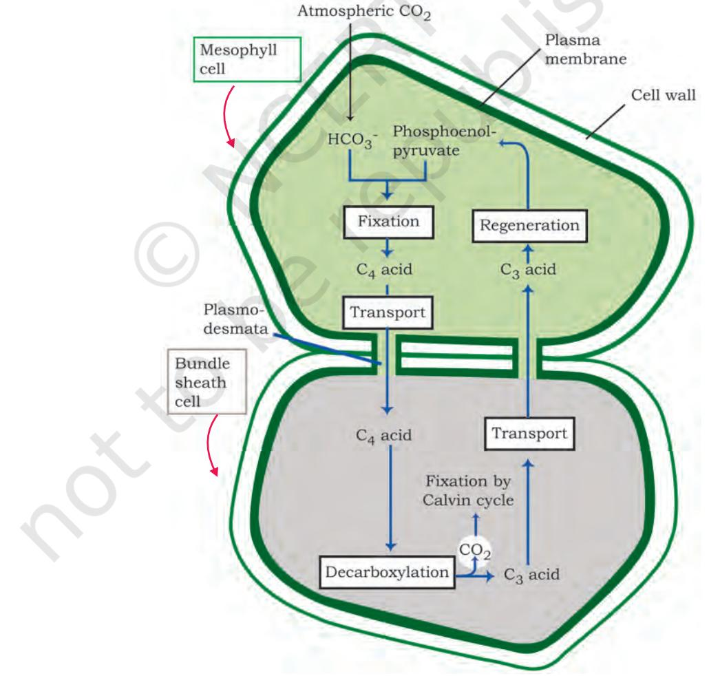

Figure 11.9 Diagrammatic representation of the Hatch and Slack Pathway

rich in an enzyme Ribulose bisphosphate carboxylase-oxygenase (RuBisCO), but lack PEPcase. Thus, the basic pathway that results in the formation of the sugars, the Calvin pathway, is common to the C3 and C4 plants.

Did you note that the Calvin pathway occurs in all the mesophyll cells of the C3 plants? In the C4 plants it does not take place in the mesophyll cells but does so only in the bundle sheath cells.

#### 11.9 PHOTORESPIRATION

Let us try and understand one more process that creates an important difference between C3 and C4 plants – Photorespiration. To understand photorespiration we have to know a little bit more about the first step of the Calvin pathway – the first CO2 fixation step. This is the reaction where RuBP combines with CO2 to form 2 molecules of 3PGA, that is catalysed by RuBisCO.

```
RuBP CO PGA RuBisCo +  → 2  × 2 3
```
RuBisCO that is the most abundant enzyme in the world (Do you wonder why?) is characterised by the fact that its active site can bind to both CO2 and O2 – hence the name. *Can you think how this could be possible?* RuBisCO has a much greater affinity for CO2 when the CO2 : O2 is nearly equal. Imagine what would happen if this were not so! This binding is competitive. It is the relative concentration of O2 and CO2 that determines which of the two will bind to the enzyme.

In C3 plants some O2 does bind to RuBisCO, and hence CO2 fixation is decreased. Here the RuBP instead of being converted to 2 molecules of PGA binds with O2 to form one molecule of phosphoglycerate and phosphoglycolate (2 Carbon) in a pathway called photorespiration. In the photorespiratory pathway, there is neither synthesis of sugars, nor of ATP. Rather it results in the release of CO2 with the utilisation of ATP. In the photorespiratory pathway there is no synthesis of ATP or NADPH. The biological function of photorespiration is not known yet.

In C4 plants photorespiration does not occur. This is because they have a mechanism that increases the concentration of CO2 at the enzyme site. This takes place when the C4 acid from the mesophyll is broken down in the bundle sheath cells to release CO2 – this results in increasing the intracellular concentration of CO2 . In turn, this ensures that the RuBisCO functions as a carboxylase minimising the oxygenase activity.

Now that you know that the C4 plants lack photorespiration, you probably can understand why productivity and yields are better in these plants. In addition these plants show tolerance to higher temperatures.

*Based on the above discussion can you compare plants showing the C3 and the C4 pathway? Use the table format given in table 11.1 and fill in the information.*

| Characteristics | C3 | Plants | C4 | Plants | Choose from |
| --- | --- | --- | --- | --- | --- |
| Cell type in which the Calvin |  |  |  |  | Mesophyll/Bundle sheath/both |
| cycle takes place |  |  |  |  |  |
| Cell type in which the initial |  |  |  |  | Mesophyll/Bundle sheath /both |
| carboxylation reaction occurs |  |  |  |  |  |
| How many cell types does the |  |  |  |  | Two: Bundle sheath and |
| . leaf have that fix CO2 |  |  |  |  | mesophyll |
|  |  |  |  |  | One: Mesophyll |
|  |  |  |  |  | Three: Bundle sheath, palisade, |
|  |  |  |  |  | spongy mesophyll |
| acceptor Which is the primary CO2 |  |  |  |  | RuBP/PEP/PGA |
| Number of carbons in the |  |  |  |  | 5 / 4 / 3 |
| acceptor primary CO2 |  |  |  |  |  |
| Which is the primary CO2 |  |  |  |  | PGA/OAA/RuBP/PEP |
| fixation product |  |  |  |  |  |
| No. of carbons in the primary |  |  |  |  | 3 / 4 / 5 |
| fixation product CO2 |  |  |  |  |  |
| Does the plant have RuBisCO? |  |  |  |  | Yes/No/Not always |
| Does the plant have PEP Case? |  |  |  |  | Yes/No/Not always |
| Which cells in the plant have |  |  |  |  | Mesophyll/Bundle sheath/none |
| Rubisco? |  |  |  |  |  |
| fixation rate under high CO2 |  |  |  |  | Low/ high/ medium |
| light conditions |  |  |  |  |  |
| Whether photorespiration is |  |  |  |  | High/negligible/sometimes |
| present at low light intensities |  |  |  |  |  |
| Whether photorespiration is |  |  |  |  | High/negligible/sometimes |
| present at high light intensities |  |  |  |  |  |
| Whether photorespiration would be |  |  |  |  | High/negligible/sometimes |
| present at low CO2 concentrations |  |  |  |  |  |
| Whether photorespiration would be |  |  |  |  | High/negligible/sometimes |
| concentrations present at high CO2 |  |  |  |  |  |
| Temperature optimum |  |  |  |  | 30-40 C/20-25C/above 40 C |
| Examples |  |  |  |  | Cut vertical sections of leaves of different plants and observe under |
|  |  |  |  |  | the microscope for Kranz anatomy |
|  |  |  |  |  | and list them in the appropriate |
|  |  |  |  |  | columns. |

#### TABLE 11.1 Fill in the Columns 2 and 3 in this table to highlight the differences between C3 and C4 Plants

#### 11.10 FACTORS AFFECTING PHOTOSYNTHESIS

An understanding of the factors that affect photosynthesis is necessary. The rate of photosynthesis is very important in determining the yield of plants including crop plants. Photosynthesis is under the influence of several factors, both internal (plant) and external. The plant factors include the number, size, age and orientation of leaves, mesophyll cells and chloroplasts, internal CO2 concentration and the amount of chlorophyll. The plant or internal factors are dependent on the genetic predisposition and the growth of the plant.

The external factors would include the availability of sunlight, temperature, CO2 concentration and water. As a plant photosynthesises, all these factors will simultaneously affect its rate. Hence, though several factors interact and simultaneously affect photosynthesis or CO2 fixation, usually one factor is the major cause or is the one that limits the rate. Hence, at any point the rate will be determined by the factor available at sub-optimal levels.

When several factors affect any [bio] chemical process, Blackman's (1905) Law of Limiting Factors comes into effect. This states the following:

*If a chemical process is affected by more than one factor, then its rate will be determined by the factor which is nearest to its minimal value: it is the factor which directly affects the process if its quantity is changed.*

For example, despite the presence of a green leaf and optimal light and CO2 conditions, the plant may not photosynthesise if the temperature is very low. This leaf, if given the optimal temperature, will start photosynthesising.

#### 11.10.1 Light

We need to distinguish between light quality, light intensity and the duration of exposure to light, while discussing light as a factor that affects photosynthesis. There is a linear relationship between incident light and CO2 fixation rates at low light intensities. At higher light intensities, gradually the rate does not show further increase as other factors become limiting (Figure 11.10). What is interesting to note is that light saturation occurs at 10 per cent of the full sunlight. Hence, except for plants in shade or in dense forests, light is rarely a limiting factor in nature. Increase in

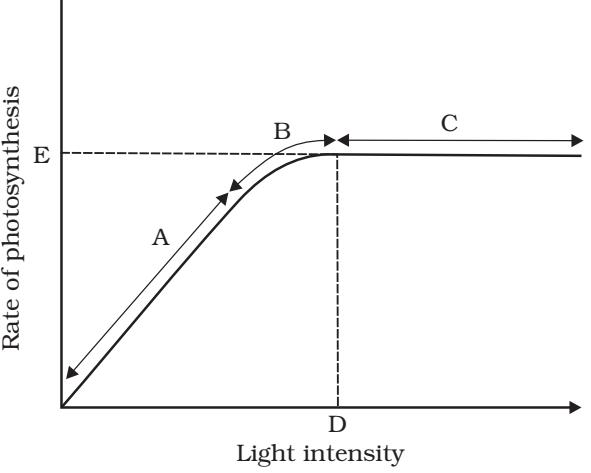

Figure 11.10 Graph of light intensity on the rate of photosynthesis

incident light beyond a point causes the breakdown of chlorophyll and a decrease in photosynthesis.

#### 11.10.2 Carbon dioxide Concentration

Carbon dioxide is the major limiting factor for photosynthesis. The concentration of CO2 is very low in the atmosphere (between 0.03 and 0.04 per cent). Increase in concentration upto 0.05 per cent can cause an increase in CO2 fixation rates; beyond this the levels can become damaging over longer periods.

The C3 and C4 plants respond differently to CO2 concentrations. At low light conditions neither group responds to high CO2 conditions. At high light intensities, both C3 and C4 plants show increase in the rates of photosynthesis. What is important to note is that the C4 plants show saturation at about 360 µlL-1 while C3 responds to increased CO2 concentration and saturation is seen only beyond 450 µlL-1. Thus, current availability of CO2 levels is limiting to the C3 plants.

The fact that C3 plants respond to higher CO2 concentration by showing increased rates of photosynthesis leading to higher productivity has been used for some greenhouse crops such as tomatoes and bell pepper. They are allowed to grow in carbon dioxide enriched atmosphere that leads to higher yields.

#### 11.10.3 Temperature

The dark reactions being enzymatic are temperature controlled. Though the light reactions are also temperature sensitive they are affected to a much lesser extent. The C4 plants respond to higher temperatures and show higher rate of photosynthesis while C3 plants have a much lower temperature optimum.

The temperature optimum for photosynthesis of different plants also depends on the habitat that they are adapted to. Tropical plants have a higher temperature optimum than the plants adapted to temperate climates.

#### 11.10.4 Water

Even though water is one of the reactants in the light reaction, the effect of water as a factor is more through its effect on the plant, rather than directly on photosynthesis. Water stress causes the stomata to close hence reducing the CO2 availability. Besides, water stress also makes leaves wilt, thus, reducing the surface area of the leaves and their metabolic activity as well.

Green plants make their own food by photosynthesis. During this process carbon dioxide from the atmosphere is taken in by leaves through stomata and used for making carbohydrates, principally glucose and starch. Photosynthesis takes place only in the green parts of the plants, mainly the leaves. Within the leaves, the mesophyll cells have a large number of chloroplasts that are responsible for CO2 fixation. Within the chloroplasts, the membranes are sites for the light reaction, while the chemosynthetic pathway occurs in the stroma. Photosynthesis has two stages: the light reaction and the carbon fixing reactions. In the light reaction the light energy is absorbed by the pigments present in the antenna, and funnelled to special chlorophyll *a* molecules called reaction centre chlorophylls. There are two photosystems, PS I and PS II. PS I has a 700 nm absorbing chlorophyll *a* P700 molecule at its reaction centre, while PS II has a P680 reaction centre that absorbs red light at 680 nm. After absorbing light, electrons are excited and transferred through PS II and PS I and finally to NAD forming NADH. During this process a proton gradient is created across the membrane of the thylakoid. The breakdown of the protons gradient due to movement through the F0 part of the ATPase enzyme releases enough energy for synthesis of ATP. Splitting of water molecules is associated with PS II resulting in the release of O2 , protons and transfer of electrons to PS II.

In the carbon fixation cycle, CO2 is added by the enzyme, RuBisCO, to a 5 carbon compound RuBP that is converted to 2 molecules of 3-carbon PGA. This is then converted to sugar by the Calvin cycle, and the RuBP is regenerated. During this process ATP and NADPH synthesised in the light reaction are utilised. RuBisCO also catalyses a wasteful oxygenation reaction in C3 plants: photorespiration.

Some tropical plants show a special type of photosynthesis called C4 pathway. In these plants the first product of CO2 fixation that takes place in the mesophyll, is a 4-carbon compound. In the bundle sheath cells the Calvin pathway is carried out for the synthesis of carbohydrates.

#### EXERCISES

- 1. By looking at a plant externally can you tell whether a plant is C3 or C4 ? Why and how?
- 2. By looking at which internal structure of a plant can you tell whether a plant is C3 or C4 ? Explain.
- 3. Even though a very few cells in a C4 plant carry out the biosynthetic – Calvin pathway, yet they are highly productive. Can you discuss why?
- 4. RuBisCO is an enzyme that acts both as a carboxylase and oxygenase. Why do you think RuBisCO carries out more carboxylation in C4 plants?
- 5. Suppose there were plants that had a high concentration of Chlorophyll *b*, but lacked chlorophyll *a*, would it carry out photosynthesis? Then why do plants have chlorophyll *b* and other accessory pigments?
- 6. Why is the colour of a leaf kept in the dark frequently yellow, or pale green? Which pigment do you think is more stable?
- 7. Look at leaves of the same plant on the shady side and compare it with the leaves on the sunny side. Or, compare the potted plants kept in the sunlight with those in the shade. Which of them has leaves that are darker green ? Why?
- 8. Figure 11.10 shows the effect of light on the rate of photosynthesis. Based on the graph, answer the following questions:

(a) At which point/s (A, B or C) in the curve is light a limiting factor? (b) What could be the limiting factor/s in region A? (c) What do C and D represent on the curve?

- 9. Give comparison between the following:
(a) C3 and C4 pathways

(b) Cyclic and non-cyclic photophosphorylation

- (c) Anatomy of leaf in C3 and C4 plants
