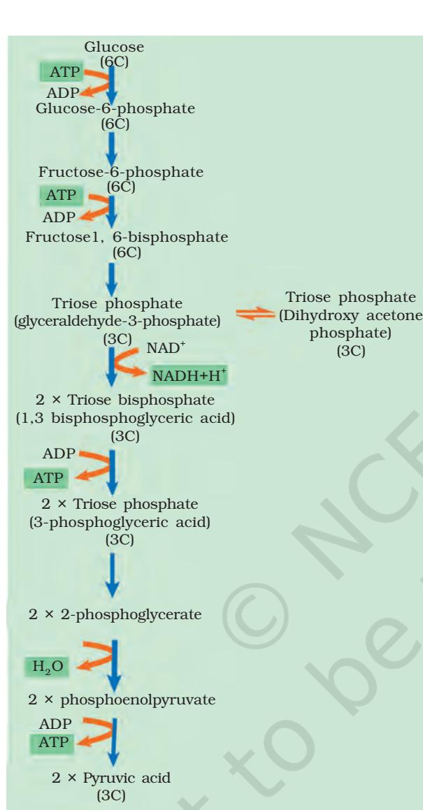
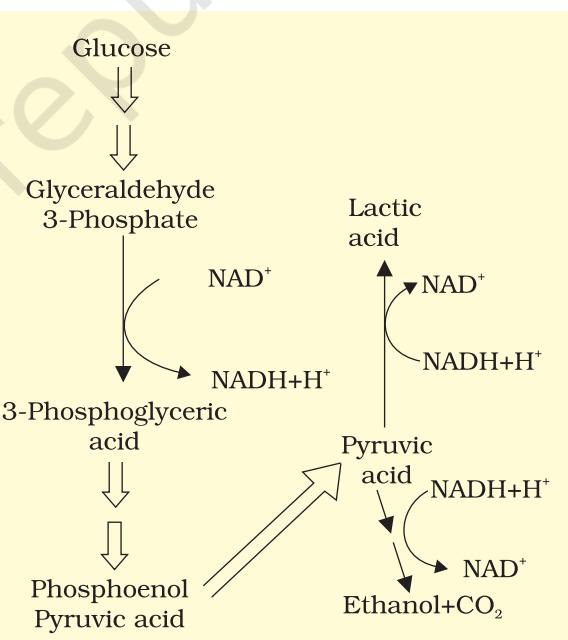
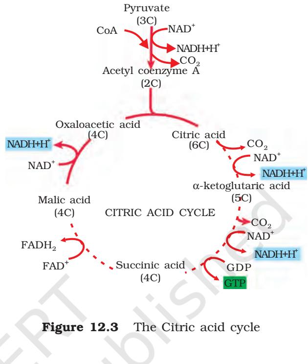
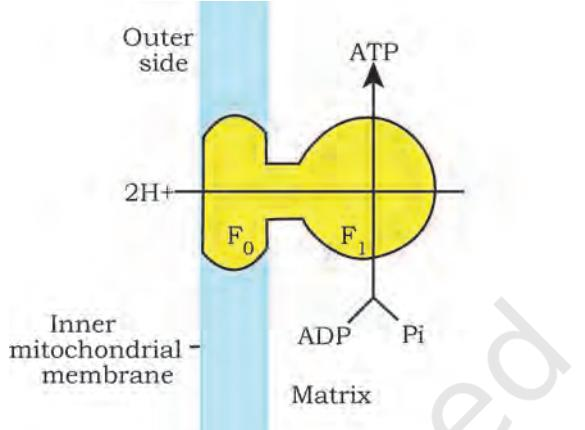
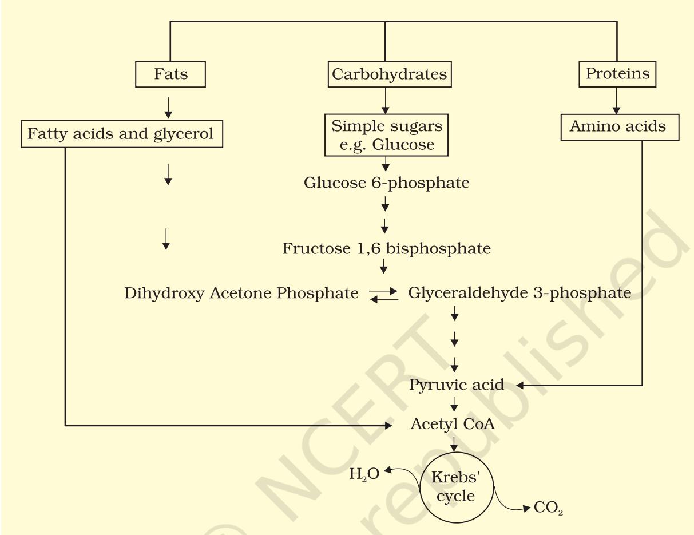

# RESPIRATION IN PLANTS CHAPTER 12

RESPIRATION IN PLANTS 153

- *12.1 Do Plants Breathe?*
- *12.2 Glycolysis*
- *12.3 Fermentation*
- *12.4 Aerobic Respiration*
- *12.5 The Respiratory Balance Sheet*
- *12.6 Amphibolic Pathway*
- *12.7 Respiratory Quotient*

All of us breathe to live, but why is breathing so essential to life? What happens when we breathe? Also, do all living organisms, including plants and microbes, breathe? If so, how?

All living organisms need energy for carrying out daily life activities, be it absorption, transport, movement, reproduction or even breathing. Where does all this energy come from? We know we eat food for energy – but how is this energy taken from food? How is this energy utilised? Do all foods give the same amount of energy? Do plants 'eat'? Where do plants get their energy from? And micro-organisms – for their energy requirements, do they eat 'food'?

You may wonder at the several questions raised above – they may seem to be very disconnected. But in reality, the process of breathing is very much connected to the process of release of energy from food. Let us try and understand how this happens.

All the energy required for 'life' processes is obtained by oxidation of some macromolecules that we call 'food'. Only green plants and cyanobacteria can prepare their own food; by the process of photosynthesis they trap light energy and convert it into chemical energy that is stored in the bonds of carbohydrates like glucose, sucrose and starch. We must remember that in green plants too, not all cells, tissues and organs photosynthesise; only cells containing chloroplasts, that are most often located in the superficial layers, carry out photosynthesis. Hence, even in green plants all other organs, tissues and cells that are non-green, need food for oxidation. Hence, food has to be translocated to all nongreen parts. Animals are heterotrophic, i.e., they obtain food from plants directly (herbivores) or indirectly (carnivores). Saprophytes like fungi are dependent on dead and decaying matter. What is important to recognise is that ultimately all the food that is respired for life processes comes from photosynthesis. This chapter deals with cellular respiration or the mechanism of breakdown of food materials within the cell to release energy, and the trapping of this energy for synthesis of ATP.

Photosynthesis, of course, takes place within the chloroplasts (in the eukaryotes), whereas the breakdown of complex molecules to yield energy takes place in the cytoplasm and in the mitochondria (also only in eukaryotes). The breaking of the C-C bonds of complex compounds through oxidation within the cells, leading to release of considerable amount of energy is called respiration. The compounds that are oxidised during this process are known as respiratory substrates. Usually carbohydrates are oxidised to release energy, but proteins, fats and even organic acids can be used as respiratory substances in some plants, under certain conditions. During oxidation within a cell, all the energy contained in respiratory substrates is not released free into the cell, or in a single step. It is released in a series of slow step-wise reactions controlled by enzymes, and it is trapped as chemical energy in the form of ATP. Hence, it is important to understand that the energy released by oxidation in respiration is not (or rather cannot be) used directly but is used to synthesise ATP, which is broken down whenever (and wherever) energy needs to be utilised. Hence, ATP acts as the energy currency of the cell. This energy trapped in ATP is utilised in various energy-requiring processes of the organisms, and the carbon skeleton produced during respiration is used as precursors for biosynthesis of other molecules in the cell.

## 12.1 DO PLANTS BREATHE?

Well, the answer to this question is not quite so direct. Yes, plants require O2 for respiration to occur and they also give out CO2 . Hence, plants have systems in place that ensure the availability of O2 . Plants, unlike animals, have no specialised organs for gaseous exchange but they have stomata and lenticels for this purpose. There are several reasons why plants can get along without respiratory organs. First, each plant part takes care of its own gas-exchange needs. There is very little transport of gases from one plant part to another. Second, plants do not present great demands for gas exchange. Roots, stems and leaves respire at rates far lower than animals do. Only during photosynthesis are large volumes of gases exchanged and, each leaf is well adapted to take care of its own needs during these periods. When cells photosynthesise, availability of O2 is not a problem in these cells since O2 is released within the cell. Third, the distance that gases must diffuse even in large, bulky plants is not great. Each living cell in a plant is located quite close to the surface of the plant. 'This is true for leaves', you may ask, 'but what about thick, woody stems and roots?' In stems, the 'living' cells are organised in thin layers inside and beneath the bark. They also have openings called lenticels. The cells in the interior are dead and provide only mechanical support. Thus, most cells of a plant have at least a part of their surface in contact with air. This is also facilitated by the loose packing of parenchyma cells in leaves, stems and roots, which provide an interconnected network of air spaces.

The complete combustion of glucose, which produces CO2 and H2O as end products, yields energy most of which is given out as heat.

# C H O O CO H O Energy 6 12 6 2 + → + + 6 6 6 2 2

If this energy is to be useful to the cell, it should be able to utilise it to synthesise other molecules that the cell requires. The strategy that the plant cell uses is to catabolise the glucose molecule in such a way that not all the liberated energy goes out as heat. The key is to oxidise glucose not in one step but in several small steps enabling some steps to be just large enough such that the energy released can be coupled to ATP synthesis. How this is done is, essentially, the story of respiration.

During the process of respiration, oxygen is utilised, and carbon dioxide, water and energy are released as products. The combustion reaction requires oxygen. But some cells live where oxygen may or may not be available. *Can you think of such situations (and organisms) where O2 is not available?* There are sufficient reasons to believe that the first cells on this planet lived in an atmosphere that lacked oxygen. Even among present-day living organisms, we know of several that are adapted to anaerobic conditions. Some of these organisms are facultative anaerobes, while in others the requirement for anaerobic condition is obligate. In any case, all living organisms retain the enzymatic machinery to partially oxidise glucose without the help of oxygen. This breakdown of glucose to pyruvic acid is called glycolysis.

## 12.2 GLYCOLYSIS

The term glycolysis has originated from the Greek words, *glycos* for sugar, and *lysis* for splitting. The scheme of glycolysis was given by Gustav Embden, Otto Meyerhof, and J. Parnas, and is often referred to as the EMP pathway. In anaerobic organisms, it is the only process in respiration. Glycolysis occurs in the cytoplasm of the cell and is present in all living organisms. In this process, glucose undergoes partial oxidation to form two molecules of pyruvic acid. In plants, this glucose is derived from sucrose, which is the end product of photosynthesis, or from storage




carbohydrates. Sucrose is converted into glucose and fructose by the enzyme, invertase, and these two monosaccharides readily enter the glycolytic pathway. Glucose and fructose are phosphorylated to give rise to glucose-6 phosphate by the activity of the enzyme hexokinase. This phosphorylated form of glucose then isomerises to produce fructose-6 phosphate. Subsequent steps of metabolism of glucose and fructose are same. The various steps of glycolysis are depicted in Figure 12.1. In glycolysis, a chain of ten reactions, under the control of different enzymes, takes place to produce pyruvate from glucose. While studying the steps of glycolysis, please note the steps at which utilisation or synthesis of ATP or (in this case) NADH + H+ take place.

ATP is utilised at two steps: first in the conversion of glucose into glucose 6-phosphate and second in the conversion of fructose 6-phosphate to fructose 1, 6-bisphosphate.

The fructose 1, 6-bisphosphate is split into dihydroxyacetone phosphate and 3-phosphoglyceraldehyde (PGAL). We find that there is one step where NADH + H+ is formed from NAD+ ; this is when 3-phosphoglyceraldehyde (PGAL) is converted to 1, 3-bisphosphoglycerate (BPGA). Two redox-equivalents are removed (in the form of two hydrogen atoms) from PGAL and transferred to a molecule of NAD+ . PGAL is oxidised and with inorganic phosphate to get converted into BPGA. The conversion of BPGA to 3-phosphoglyceric acid (PGA), is also an energy yielding process; this energy is trapped by the formation of ATP. Another ATP is synthesised during the conversion of PEP to pyruvic acid. *Can you then calculate how many ATP molecules are directly synthesised in this pathway from one glucose molecule?*

Pyruvic acid is then the key product of glycolysis. What is the metabolic fate of pyruvate? This depends on the cellular need. There are three major ways in which different cells handle pyruvic acid produced by glycolysis. These are lactic acid fermentation, alcoholic fermentation and aerobic respiration. Fermentation takes place under anaerobic conditions in many prokaryotes and unicellular eukaryotes. For the complete oxidation of glucose to CO2 and H2O, however, organisms adopt Krebs' cycle which is also called as aerobic respiration. This requires O2 supply.

## 12.3 FERMENTATION

In fermentation, say by yeast, the incomplete oxidation of glucose is achieved under anaerobic conditions by sets of reactions where pyruvic acid is converted to CO2 and ethanol. The enzymes, pyruvic acid decarboxylase and alcohol dehydrogenase catalyse these reactions. Other organisms like some bacteria produce lactic acid from pyruvic acid. The steps involved are shown in Figure 12.2. In animal cells also, like muscles during exercise, when oxygen is inadequate for cellular respiration pyruvic acid is reduced to lactic acid by lactate dehydrogenase. The reducing agent is NADH+H+ which is reoxidised to NAD+ in both the processes.

In both lactic acid and alcohol fermentation not much energy is released; less than seven per cent of the energy in glucose is released and not all of it is trapped as high energy bonds of ATP. Also, the processes are hazardous – either acid or alcohol is produced. What is the net ATPs that is synthesised (calculate how many ATP are synthesised and deduct the number of ATP utilised during glycolysis) when one molecule of glucose is fermented to alcohol or lactic acid? Yeasts poison themselves to death when the concentration of alcohol reaches about 13 per cent. *What then would be the maximum concentration of alcohol in beverages that are naturally fermented?* How do you think alcoholic beverages of alcohol content greater than this concentration are obtained?

What then is the process by which organisms can carry out complete oxidation of glucose and extract the energy stored to



Figure 12.2 Major pathways of anaerobic respiration

synthesise a larger number of ATP molecules needed for cellular metabolism? In eukaryotes these steps take place within the mitochondria and this requires O2 . Aerobic respiration is the process that leads to a complete oxidation of organic substances in the presence of oxygen, and releases CO2 , water and a large amount of energy present in the substrate. This type of respiration is most common in higher organisms. We will look at these processes in the next section.

## 12.4 AEROBIC RESPIRATION

For aerobic respiration to take place within the mitochondria, the final product of glycolysis, pyruvate is transported from the cytoplasm into the mitochondria. The crucial events in aerobic respiration are:

- The complete oxidation of pyruvate by the stepwise removal of all the hydrogen atoms, leaving three molecules of CO2 .
- The passing on of the electrons removed as part of the hydrogen atoms to molecular O2 with simultaneous synthesis of ATP.

What is interesting to note is that the first process takes place in the matrix of the mitochondria while the second process is located on the inner membrane of the mitochondria.

Pyruvate, which is formed by the glycolytic catabolism of carbohydrates in the cytosol, after it enters mitochondrial matrix undergoes oxidative decarboxylation by a complex set of reactions catalysed by pyruvic dehydrogenase. The reactions catalysed by pyruvic dehydrogenase require the participation of several coenzymes, including NAD+ and Coenzyme A.

```
Pyruvic acid CoA NAD Mg
         Pyruvate dehydrogenase + + + →
                              2+
                                        + + + + Acetyl CoA CO NADH H 2
```
During this process, two molecules of NADH are produced from the metabolism of two molecules of pyruvic acid (produced from one glucose molecule during glycolysis).

The acetyl CoA then enters a cyclic pathway, tricarboxylic acid cycle, more commonly called as Krebs' cycle after the scientist Hans Krebs who first elucidated it.

## 12.4.1 Tricarboxylic Acid Cycle

The TCA cycle starts with the condensation of acetyl group with oxaloacetic acid (OAA) and water to yield citric acid (Figure 12.3). The reaction is catalysed by the enzyme citrate synthase and a molecule of CoA is released. Citrate is then isomerised to isocitrate. It is followed by two successive steps of decarboxylation, leading to the formation of α-ketoglutaric acid and then succinyl-CoA. In the remaining steps of citric acid cycle, succinyl-CoA is oxidised to OAA allowing the cycle to continue. During the conversion of succinyl-CoA to succinic acid a molecule of GTP is synthesised. This is a substrate level phosphorylation. In a coupled reaction GTP is converted to GDP with the simultaneous synthesis of ATP from ADP. Also there are three points in the cycle where NAD+ is reduced to NADH + H+ and one point where FAD+ is reduced to FADH2 . The continued oxidation of acetyl CoA via the TCA cycle requires the continued replenishment of oxaloacetic acid, the first member of the cycle. In addition it also requires regeneration of NAD+ and FAD+ from NADH and FADH2 respectively. The summary equation for this phase of respiration may be written as follows:



Pyruvic acid + 4NAD${}^{+}$ + FAD${}^{+}$ + 2H${}_{2}$O + ADP${}^{+}$+ Bi + 3CO${}_{2}$ + 4NADH + 4H${}^{+}$ + FADH${}_{2}$ + ATP

We have till now seen that glucose has been broken down to release CO2 and eight molecules of NADH + H+ ; two of FADH2 have been synthesised besides just two molecules of ATP in TCA cycle. You may be wondering why we have been discussing respiration at all – neither O2 has come into the picture nor the promised large number of ATP has yet been synthesised. Also what is the role of the NADH + H+ and FADH2 that is synthesised? Let us now understand the role of O2 in respiration and how ATP is synthesised.

## 12.4.2 Electron Transport System (ETS) and Oxidative Phosphorylation

The following steps in the respiratory process are to release and utilise the energy stored in NADH+H+ and FADH2. This is accomplished when they are oxidised through the electron transport system and the electrons are passed on to O2 resulting in the formation of H2O. The metabolic pathway through which the electron passes from one carrier to another, is called the *electron transport system* (ETS) (Figure 12.4) and it is present in the inner mitochondrial membrane. Electrons from NADH

(complex

produced in the mitochondrial matrix during citric acid cycle are oxidised by an NADH dehydrogenase (complex I), and electrons are then transferred to ubiquinone located within the inner membrane. Ubiquinone also receives

II) that is generated during oxidation of succinate in the citric acid cycle. The reduced ubiquinone (ubiquinol) is then oxidised with the transfer of electrons to cytochrome *c* via cytochrome *bc* 1 complex (complex III). Cytochrome *c* is a small protein attached to the outer surface of the inner membrane and acts as a mobile carrier for transfer of electrons between complex III and IV. Complex IV refers to cytochrome *c* oxidase complex containing cytochromes

, and two copper centres. When the electrons pass from one carrier to another via complex I to IV in

reducing equivalents via FADH2


Figure 12.4 Electron Transport System (ETS)

the electron transport chain, they are coupled to ATP synthase (complex V) for the production of ATP from ADP and inorganic phosphate. The number of ATP molecules synthesised depends on the nature of the electron donor. Oxidation of one molecule of NADH gives rise to 3 molecules of ATP, while that of one molecule of FADH2 produces 2 molecules of ATP. Although the aerobic process of respiration takes place only in the presence of oxygen, the role of oxygen is limited to the terminal stage of the process. Yet, the presence of oxygen is

vital, since it drives the whole process by removing hydrogen from the system. Oxygen acts as the final hydrogen acceptor. Unlike photophosphorylation where it is the light energy that is utilised for the production of proton gradient required for phosphorylation, in respiration it is the energy of oxidation-reduction utilised for the same process. It is for this reason that the process is called oxidative phosphorylation.

*a* and *a3*

You have already studied about the mechanism of membrane-linked ATP synthesis as explained by chemiosmotic hypothesis in the earlier chapter. As mentioned earlier, the energy released during the electron transport system is utilised in synthesising ATP with the help of ATP synthase (complex V). This complex consists of two major components, F1 and F0 (Figure 12.5). The F1 headpiece is a peripheral membrane protein complex and contains the site for synthesis of ATP from ADP and inorganic phosphate. F0 is an integral membrane protein complex that forms the channel through which protons cross the inner membrane. The passage of protons through the channel is coupled to the catalytic site of the F1 component for the production of ATP. For each ATP produced, 4H+ passes through F0 from the intermembrane space to the matrix down the electrochemical proton gradient.




## 12.5 THE RESPIRATORY BALANCE SHEET

It is possible to make calculations of the net gain of ATP for every glucose molecule oxidised; but in reality this can remain only a theoretical exercise. These calculations can be made only on certain assumptions that:

- There is a sequential, orderly pathway functioning, with one substrate forming the next and with glycolysis, TCA cycle and ETS pathway following one after another.
- The NADH synthesised in glycolysis is transferred into the mitochondria and undergoes oxidative phosphorylation.
- None of the intermediates in the pathway are utilised to synthesise any other compound.
- Only glucose is being respired no other alternative substrates are entering in the pathway at any of the intermediary stages.

But this kind of assumptions are not really valid in a living system; all pathways work simultaneously and do not take place one after another; substrates enter the pathways and are withdrawn from it as and when necessary; ATP is utilised as and when needed; enzymatic rates are controlled by multiple means. Yet, it is useful to do this exercise to appreciate the beauty and efficiency of the living system in extraction and storing energy. Hence, there can be a net gain of 38 ATP molecules during aerobic respiration of one molecule of glucose.

Now let us compare fermentation and aerobic respiration:

- Fermentation accounts for only a partial breakdown of glucose whereas in aerobic respiration it is completely degraded to CO2 and H2O.
- In fermentation there is a net gain of only two molecules of ATP for each molecule of glucose degraded to pyruvic acid whereas many more molecules of ATP are generated under aerobic conditions.
- NADH is oxidised to NAD+ rather slowly in fermentation, however the reaction is very vigorous in case of aerobic respiration.

## 12.6 AMPHIBOLIC PATHWAY

Glucose is the favoured substrate for respiration. All carbohydrates are usually first converted into glucose before they are used for respiration. Other substrates can also be respired, as has been mentioned earlier, but then they do not enter the respiratory pathway at the first step. See Figure 12.6 to see the points of entry of different substrates in the respiratory pathway. Fats would need to be broken down into glycerol and fatty acids first. If fatty acids were to be respired they would first be degraded to acetyl CoA and enter the pathway. Glycerol would enter the pathway after being converted to PGAL. The proteins would be degraded by proteases and the individual amino acids (after deamination) depending on their structure would enter the pathway at some stage within the Krebs' cycle or even as pyruvate or acetyl CoA.

Since respiration involves breakdown of substrates, the respiratory process has traditionally been considered a catabolic process and the respiratory pathway as a catabolic pathway. But is this understanding correct? We have discussed above, at which points in the respiratory pathway different substrates would enter if they were to be respired and used to derive energy. What is important to recognise is that it is these very compounds that would be withdrawn from the respiratory pathway for the synthesis of the said substrates. Hence, fatty acids would be broken down to acetyl CoA before entering the respiratory pathway when it is used as a substrate. But when the organism needs to synthesise fatty acids, acetyl CoA would be withdrawn from the respiratory pathway for it. Hence, the respiratory pathway comes into the picture both during breakdown and synthesis of fatty acids. Similarly, during breakdown and synthesis of protein too, respiratory intermediates form the link. Breaking down processes within the living organism is catabolism, and synthesis is anabolism. Because the respiratory pathway is involved in both anabolism and catabolism, it would hence be better to consider the respiratory pathway as an amphibolic pathway rather than as a catabolic one.



Figure 12.6 Interrelationship among metabolic pathways showing respiration mediated breakdown of different organic molecules to CO2 and H2 0

# 12.7 RESPIRATORY QUOTIENT

Let us now look at another aspect of respiration. As you know, during aerobic respiration, O2 is consumed and CO2 is released. The ratio of the volume of CO2 evolved to the volume of O2 consumed in respiration is called the respiratory quotient (RQ) or respiratory ratio.

> RQ volumeof CO evolved volumeof O consumed = 2 2

The respiratory quotient depends upon the type of respiratory substrate used during respiration.

When carbohydrates are used as substrate and are completely oxidised, the RQ will be 1, because equal amounts of CO2 and O2 are evolved and consumed, respectively, as shown in the equation below :

$\mathbf{C_{6}H_{12}O_{6}+6O_{2}-6CO_{2}+6H_{2}O+Energy_{2}}$  
  
$\mathbf{RQ=\frac{6CO_{2}}{6O_{2}}=1.0}$

When fats are used in respiration, the RQ is less than 1. Calculations for a fatty acid, tripalmitin, if used as a substrate is shown:

$$2(\text{C}_{51}\text{H}_{98}\text{O}_{6})+145\text{O}_{2}\longrightarrow102\text{CO}_{2}+98\text{H}_{2}\text{O}+\text{energy}

Tripalmitin

\text{RQ}=\dfrac{102\text{CO}_{2}}{145\text{O}_{2}}=0.7$$

When proteins are respiratory substrates the ratio would be about 0.9.

What is important to recognise is that in living organisms respiratory substrates are often more than one; pure proteins or fats are never used as respiratory substrates.

## SUMMARY

Plants unlike animals have no special systems for breathing or gaseous exchange. Stomata and lenticels allow gaseous exchange by diffusion. Almost all living cells in a plant have their surfaces exposed to air.

The breaking of C-C bonds of complex organic molecules by oxidation cells leading to the release of a lot of energy is called cellular respiration. Glucose is the favoured substrate for respiration. Fats and proteins can also be broken down to yield energy. The initial stage of cellular respiration takes place in the cytoplasm. Each glucose molecule is broken through a series of enzyme catalysed reactions into two molecules of pyruvic acid. This process is called glycolysis. The fate of the pyruvate depends on the availability of oxygen and the organism. Under anaerobic conditions either lactic acid fermentation or alcohol fermentation occurs. Fermentation takes place under anaerobic conditions in many prokaryotes, unicellular eukaryotes and in germinating seeds. In eukaryotic organisms aerobic respiration occurs in the presence of oxygen. Pyruvic acid is transported into the mitochondria where it is converted into acetyl CoA with the release of CO2 . Acetyl CoA then enters the tricarboxylic acid pathway or Krebs' cycle operating in the matrix of the mitochondria. NADH + H+ and FADH2 are generated in the Krebs' cycle. The energy in these molecules as well as that in the NADH+ H+ synthesised during glycolysis are used to synthesise ATP. This is accomplished through a

system of electron carriers called electron transport system (ETS) located on the inner membrane of the mitochondria. The electrons, as they move through the system, release enough energy that are trapped to synthesise ATP. This is called oxidative phosphorylation. In this process O2 is the ultimate acceptor of electrons and it gets reduced to water.

The respiratory pathway is an amphibolic pathway as it involves both anabolism and catabolism. The respiratory quotient depends upon the type of respiratory substance used during respiration.

## EXERCISES

- 1. Differentiate between
	- (a) Respiration and Combustion
	- (b) Glycolysis and Krebs' cycle
	- (c) Aerobic respiration and Fermentation
- 2. What are respiratory substrates? Name the most common respiratory substrate.
- 3. Give the schematic representation of glycolysis?
- 4. What are the main steps in aerobic respiration? Where does it take place?
- 5. Give the schematic representation of an overall view of Krebs' cycle.
- 6. Explain ETS.
- 7. Distinguish between the following: (a) Aerobic respiration and Anaerobic respiration
	- (b) Glycolysis and Fermentation
	- (c) Glycolysis and Citric acid Cycle
- 8. What are the assumptions made during the calculation of net gain of ATP?
- 9. Discuss "The respiratory pathway is an amphibolic pathway."
- 10. Define RQ. What is its value for fats?
- 11. What is oxidative phosphorylation?
- 12. What is the significance of step-wise release of energy in respiration?

