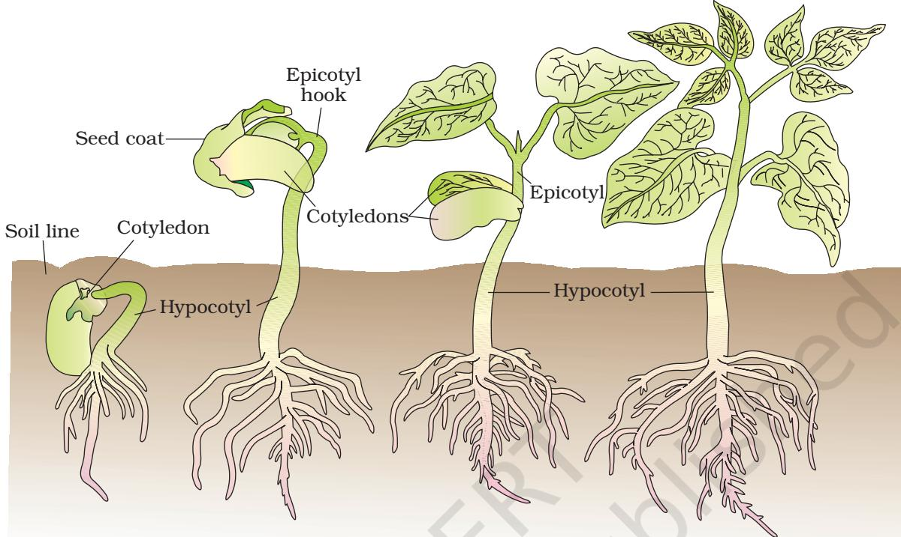
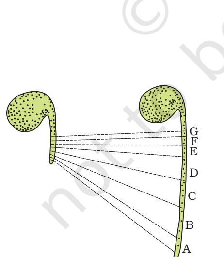
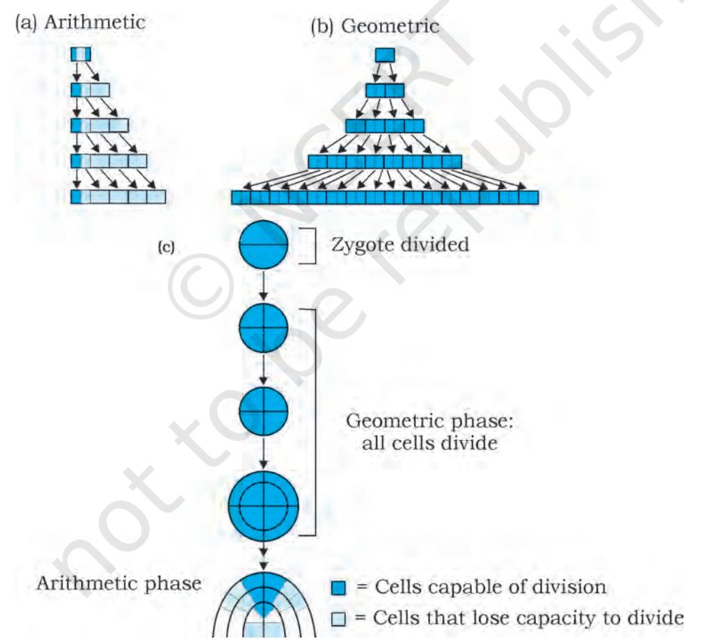
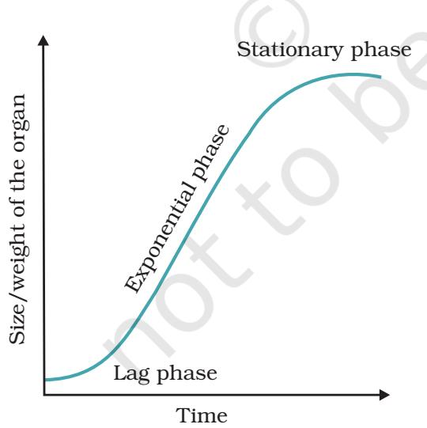
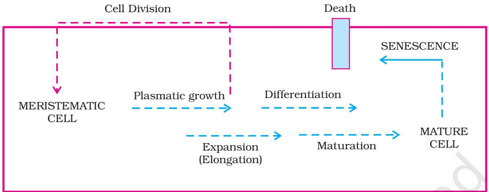
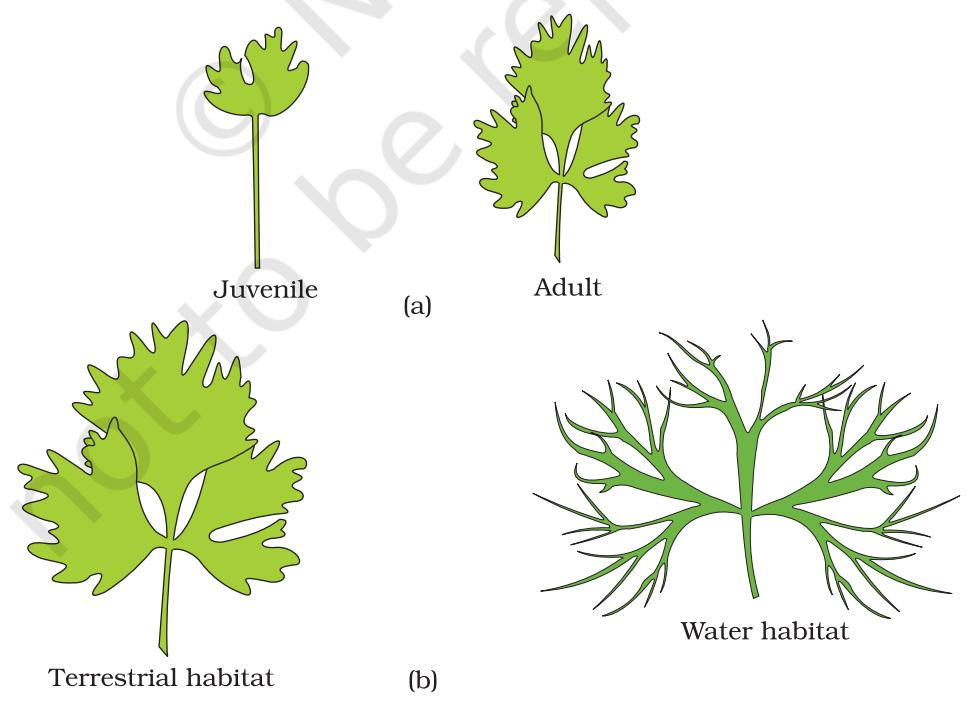
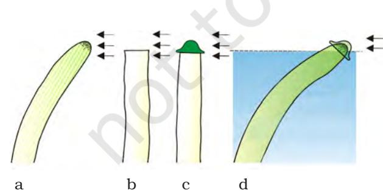
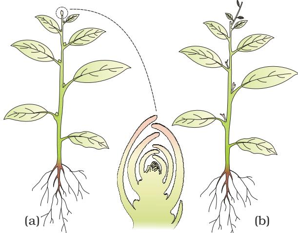

# PLANT GROWTH AND DEVELOPMENT CHAPTER 13

166 BIOLOGY

- *13.1 Growth*
- *13.2 Differentiation, Dedifferentiation and Redifferentiation*
- *13.3 Development*
- *13.4 Plant Growth Regulators*

You have already studied the organisation of a flowering plant in Chapter 5. Have you ever thought about where and how the structures like roots, stems, leaves, flowers, fruits and seeds arise and that too in an orderly sequence? You are, by now, aware of the terms seed, seedling, plantlet, mature plant. You have also seen that trees continue to increase in height or girth over a period of time. However, the leaves, flowers and fruits of the same tree not only have limited dimensions but also appear and fall periodically and some time repeatedly. Why does vegetative phase precede flowering in a plant? All plant organs are made up of a variety of tissues; is there any relationship between the structure of a cell, a tissue, an organ and the function they perform? Can the structure and the function of these be altered? All cells of a plant are descendents of the zygote. The question is, then, why and how do they have different structural and functional attributes? Development is the sum of two processes: growth and differentiation. To begin with, it is essential and sufficient to know that the development of a mature plant from a zygote (fertilised egg) follow a precise and highly ordered succession of events. During this process a complex body organisation is formed that produces roots, leaves, branches, flowers, fruits, and seeds, and eventually they die (Figure 13.1). The first step in the process of plant growth is seed germination. The seed germinates when favourable conditions for growth exist in the environment. In absence of such favourable conditions the seeds do not germinate and goes into a period of suspended growth or rest. Once favourable conditions return, the seeds resume metabolic activities and growth takes place.

In this chapter, you shall also study some of the factors which govern and control these developmental processes. These factors are both intrinsic (internal) and extrinsic (external) to the plant.

Figure 13.1 Germination and seedling development in bean

# 13.1 GROWTH

Growth is regarded as one of the most fundamental and conspicuous characteristics of a living being. What is growth? Growth can be defined as an irreversible permanent increase in size of an organ or its parts or even of an individual cell. Generally, growth is accompanied by metabolic processes (both anabolic and catabolic), that occur at the expense of energy. Therefore, for example, expansion of a leaf is growth. How would you describe the swelling of piece of wood when placed in water?

# 13.1.1 Plant Growth Generally is Indeterminate

Plant growth is unique because plants retain the capacity for unlimited growth throughout their life. This ability of the plants is due to the presence of meristems at certain locations in their body. The cells of such meristems have the capacity to divide and self-perpetuate. The product, however, soon loses the capacity to divide and such cells make up the plant body. This form of growth wherein new cells are always being added to the plant body by the activity of the meristem is called the open form of growth. What would happen if the meristem ceases to divide? Does this ever happen?

In earlier classes, you have studied about the root apical meristem and the shoot apical meristem. You know that they are responsible for

- Figure 13.2 Diagrammatic representation of locations of root apical meristem, shoot aplical meristem and vascular cambium. Arrows exhibit the direction of growth of cells and organ

- Figure 13.3 Detection of zones of elongation by the parallel line technique. Zones A, B, C, D immediately behind the apex have elongated most.
the primary growth of the plants and principally contribute to the elongation of the plants along their axis. You also know that in dicotyledonous plants and gymnosperms, the lateral meristems, vascular cambium and cork-cambium appear later in life. These are the meristems that cause the increase in the girth of the organs in which they are active. This is known as secondary growth of the plant (see Figure 13.2).

# 13.1.2 Growth is Measurable

Growth, at a cellular level, is principally a consequence of increase in the amount of protoplasm. Since increase in protoplasm is difficult to measure directly, one generally measures some quantity which is more or less proportional to it. Growth is, therefore, measured by a variety of parameters some of which are: increase in fresh weight, dry weight, length, area, volume and cell number. You may find it amazing to know that one single maize root apical mersitem can give rise to more than 17,500 new cells per hour, whereas cells in a watermelon may increase in size by upto 3,50,000 times. In the former, growth is expressed as increase in cell number; the latter expresses growth as increase in size of the cell. While the growth of a pollen tube is measured in terms of its length, an increase in surface area denotes the growth in a dorsiventral leaf.

#### 13.1.3 Phases of Growth

The period of growth is generally divided into three phases, namely, meristematic, elongation and maturation (Figure 13.3). Let us understand this by looking at the root tips. The constantly dividing cells, both at the root apex and the shoot apex, represent the meristematic phase of growth. The cells in this region are rich in protoplasm, possess large conspicuous nuclei. Their cell walls are primary in nature, thin and cellulosic with abundant plasmodesmatal connections. The cells proximal (just next, away from the tip) to the

meristematic zone represent the phase of elongation. Increased vacuolation, cell enlargement and new cell wall deposition are the characteristics of the cells in this phase. Further away from the apex, i.e., more proximal to the phase of elongation, lies the portion of axis which is undergoing the phase of maturation. The cells of this zone, attain their maximal size in terms of wall thickening and protoplasmic modifications. Most of the tissues and cell types you have studied in earlier classes represent this phase.

# 13.1.4 Growth Rates

The increased growth per unit time is termed as growth rate. Thus, rate of growth can be expressed mathematically. An organism, or a part of the organism can produce more cells in a variety of ways.

Figure13.4 Diagrammatic representation of : (a) Arithmetic (b) Geometric growth and (c) Stages during embryo development showing geometric and arithematic phases

Figure 13.5 Constant linear growth, a plot of length L against time t

Figure 13.6 An idealised sigmoid growth curve typical of cells in culture, and many higher plants and plant organs

The growth rate shows an increase that may be arithmetic or geometrical (Figure 13.4).

In arithmetic growth, following mitotic cell division, only one daughter cell continues to divide while the other differentiates and matures. The simplest expression of arithmetic growth is exemplified by a root elongating at a constant rate. Look at Figure 13.5. On plotting the length of the organ against time, a linear curve is obtained. Mathematically, it is expressed as

$$\mathbf{L}_{\mathrm{t}}=\mathbf{L}_{0}+\mathbf{r}\mathrm{t}$$

$$\mathrm{L_{t}=l e n g t h a t\;t a t i m e\;"t"}$$

L0 = length at time 'zero'

r = growth rate / elongation per unit time.

Let us now see what happens in geometrical growth. In most systems, the initial growth is slow (lag phase), and it increases rapidly thereafter – at an exponential rate (log or exponential phase). Here, both the progeny cells following mitotic cell division retain the ability to divide and continue to do so. However, with limited nutrient supply, the growth slows down leading to a stationary phase. If we plot the parameter of growth against time, we get a typical sigmoid or S-curve (Figure 13.6). A sigmoid curve is a characteristic of living organism growing in a natural environment. It is typical for all cells, tissues and organs of a plant. *Can you think of more similar examples? What kind of a curve can you expect in a tree showing seasonal activities?*

The exponential growth can be expressed as

$$\mathbf{W}_{1}=\mathbf{W}_{0}\,\mathrm{{e}}^{\mathrm{{rt}}}$$

W1 = final size (weight, height, number etc.)

W0 = initial size at the beginning of the period

- r = growth rate
- t = time of growth
- e = base of natural logarithms

Here, r is the relative growth rate and is also the measure of the ability of the plant to produce new plant material, referred to as efficiency index. Hence, the final size of W1 depends on the initial size, W0 .

Figure13.7 Diagrammatic comparison of absolute and relative growth rates. Both leaves A and B have increased their area by 5 cm2 in a given time to produce A1 , B1 leaves.

Quantitative comparisons between the growth of living system can also be made in two ways : (i) measurement and the comparison of total growth per unit time is called the absolute growth rate. (ii) The growth of the given system per unit time expressed on a common basis, e.g., per unit initial parameter is called the relative growth rate. In Figure 13.7 two leaves, A and B, are drawn that are of different sizes but shows absolute increase in area in the given time to give leaves, A1 and B1 . However, one of them shows much higher relative growth rate. Which one and why?

## 13.1.5 Conditions for Growth

Why do you not try to write down what you think are necessary conditions for growth? This list may have water, oxygen and nutrients as very essential elements for growth. The plant cells grow in size by cell enlargement which in turn requires water. Turgidity of cells helps in extension growth. Thus, plant growth and further development is intimately linked to the water status of the plant. Water also provides the medium for enzymatic activities needed for growth. Oxygen helps in releasing metabolic energy essential for growth activities. Nutrients (macro and micro essential elements) are required by plants for the synthesis of protoplasm and act as source of energy.

In addition, every plant organism has an optimum temperature range best suited for its growth. Any deviation from this range could be detrimental to its survival. Environmental signals such as light and gravity also affect certain phases/stages of growth.

# 13.2 DIFFERENTIATION, DEDIFFERENTIATION AND REDIFFERENTIATION

The cells derived from root apical and shoot-apical meristems and cambium differentiate and mature to perform specific functions. This act leading to maturation is termed as differentiation. During differentiation, cells undergo few to major structural changes both in their cell walls and protoplasm. For example, to form a tracheary element, the cells would lose their protoplasm. They also develop a very strong, elastic, lignocellulosic secondary cell walls, to carry water to long distances even under extreme tension. Try to correlate the various anatomical features you encounter in plants to the functions they perform.

Plants show another interesting phenomenon. The living differentiated cells, that by now have lost the capacity to divide can regain the capacity of division under certain conditions. This phenomenon is termed as dedifferentiation. For example, formation of meristems – interfascicular cambium and cork cambium from fully differentiated parenchyma cells. While doing so, such meristems/tissues are able to divide and produce cells that once again lose the capacity to divide but mature to perform specific functions, i.e., get redifferentiated. List some of the tissues in a woody dicotyledenous plant that are the products of redifferentiation. How would you describe a tumour? What would you call the parenchyma cells that are made to divide under controlled laboratory conditions during plant tissue culture?

Recall, in Section 13.1.1, we have mentioned that the growth in plants is open, i.e., it can be indeterminate or determinate. Now, we may say that even differentiation in plants is open, because cells/tissues arising out of the same meristem have different structures at maturity. The final structure at maturity of a cell/tissue is also determined by the location of the cell within. For example, cells positioned away from root apical meristems differentiate as root-cap cells, while those pushed to the periphery mature as epidermis. Can you add a few more examples of open differentiation correlating the position of a cell to its position in an organ?

## 13.3 DEVELOPMENT

Development is a term that includes all changes that an organism goes through during its life cycle from germination of the seed to senescence. Diagrammatic representation of the sequence of processes which constitute the development of a cell of a higher plant is given in Figure 13.8. It is also applicable to tissues/organs.

Plants follow different pathways in response to environment or phases of life to form different kinds of structures. This ability is called plasticity, e.g., heterophylly in cotton, coriander and larkspur. In such plants, the leaves of the juvenile plant are different in shape from those in mature plants. On the other hand, difference in shapes of leaves produced in air and those produced in water in buttercup also represent the heterophyllous development due to environment (Figure 13.9). This phenomenon of heterophylly is an example of plasticity.

Figure 13.9 Heterophylly in (a) larkspur and (b) buttercup

Thus, growth, differentiation and development are very closely related events in the life of a plant. Broadly, development is considered as the sum of growth and differentiation. Development in plants (i.e., both growth and differentiation) is under the control of intrinsic and extrinsic factors. The former includes both intracellular (genetic) or intercellular factors (chemicals such as plant growth regulators) while the latter includes light, temperature, water, oxygen, nutrition, etc.

# 13.4 PLANT GROWTH REGULATORS

#### 13.4.1 Characteristics

The plant growth regulators (PGRs) are small, simple molecules of diverse chemical composition. They could be indole compounds (indole-3-acetic acid, IAA); adenine derivatives (N6 -furfurylamino purine, kinetin), derivatives of carotenoids (abscisic acid, ABA); terpenes (gibberellic acid, GA3 ) or gases (ethylene, C2H4 ). Plant growth regulators are variously described as plant growth substances, plant hormones or phytohormones in literature.

The PGRs can be broadly divided into two groups based on their functions in a living plant body. One group of PGRs are involved in growth promoting activities, such as cell division, cell enlargement, pattern formation, tropic growth, flowering, fruiting and seed formation. These are also called plant growth promoters, e.g., auxins, gibberellins and cytokinins. The PGRs of the other group play an important role in plant responses to wounds and stresses of biotic and abiotic origin. They are also involved in various growth inhibiting activities such as dormancy and abscission. The PGR abscisic acid belongs to this group. The gaseous PGR, ethylene, could fit either of the groups, but it is largely an inhibitor of growth activities.

# 13.4.2 The Discovery of Plant Growth Regulators

Figure 13.10 Experiment used to demonstrate that tip of the coleoptile is the source of auxin. Arrows indicate direction of light

Interestingly, the discovery of each of the five major groups of PGRs have been accidental. All this started with the observation of Charles Darwin and his son Francis Darwin when they observed that the coleoptiles of canary grass responded to unilateral illumination by growing towards the light source (phototropism). After a series of experiments, it was concluded that the tip of coleoptile was the site of transmittable influence that caused the bending of the entire coleoptile (Figure 13.10). Auxin was isolated by F.W. Went from tips of coleoptiles of oat seedlings.

The 'bakanae' (foolish seedling) disease of rice seedlings, was caused by a fungal pathogen *Gibberella fujikuroi*. E. Kurosawa (1926) reported the appearance of symptoms of the disease in rice seedlings when they were treated with sterile filtrates of the fungus. The active substances were later identified as gibberellic acid.

F. Skoog and his co-workers observed that from the internodal segments of tobacco stems the callus (a mass of undifferentiated cells) proliferated only if, in addition to auxins the nutrients medium was supplemented with one of the following: extracts of vascular tissues, yeast extract, coconut milk or DNA. Miller et al. (1955), later identified and crystallised the cytokinesis promoting active substance that they termed kinetin.

During mid-1960s, three independent researches reported the purification and chemical characterisation of three different kinds of inhibitors: inhibitor-B, abscission II and dormin. Later all the three were proved to be chemically identical. It was named abscisic acid (ABA).

H.H. Cousins (1910) confirmed the release of a volatile substance from ripened oranges that hastened the ripening of stored unripened bananas. Later this volatile substance was identified as ethylene, a gaseous PGR.

Let us study some of the physiological effects of these five categories of PGRs in the next section.

#### 13.4.3 Physiological Effects of Plant Growth Regulators

#### *13.4.3.1 Auxins*

Auxins (from Greek 'auxein' : to grow) was first isolated from human urine. The term 'auxin' is applied to the indole-3-acetic acid (IAA), and to other natural and synthetic compounds having certain growth regulating properties. They are generally produced by the growing apices of the stems and roots, from where they migrate to the regions of their action. Auxins like IAA and indole butyric acid (IBA) have been isolated from plants. NAA (naphthalene acetic acid) and 2, 4-D (2, 4-dichlorophenoxyacetic) are synthetic auxins. All these auxins have been used extensively in agricultural and horticultural practices.

They help to initiate rooting in stem cuttings, an application widely used for plant propagation. Auxins promote flowering e.g. in pineapples. They help to prevent fruit and leaf drop at early stages but promote the abscission of older mature leaves and fruits.

In most higher plants, the growing apical bud inhibits the growth of the lateral (axillary) buds, a phenomenon called apical dominance. Removal of shoot tips (decapitation) usually results in the growth of lateral buds (Figure 13.11). It is widely applied in tea plantations, hedge-making. Can you explain why?

Figure 13.11 Apical dominance in plants : (a) A plant with apical bud intact (b) A plant with apical bud removed Note the growth of lateral buds into branches after decapitation.

Auxins also induce parthenocarpy, e.g., in tomatoes. They are widely used as herbicides. 2, 4-D, widely used to kill dicotyledonous weeds, does not affect mature monocotyledonous plants. It is used to prepare weed-free lawns by gardeners. Auxin also controls xylem differentiation and helps in cell division.

#### *13.4.3.213.4.3.2 13.4.3.2 Gibberellins*

Gibberellins are another kind of promotory PGR. There are more than 100 gibberellins reported from widely different organisms such as fungi and higher plants. They are denoted as GA1 , GA2 , GA3 and so on. However, Gibberellic acid (GA3 ) was one of the first gibberellins to be discovered and remains the most intensively studied form. All GAs are

acidic. They produce a wide range of physiological responses in the plants. Their ability to cause an increase in length of axis is used to increase the length of grapes stalks. Gibberellins, cause fruits like apple to elongate and improve its shape. They also delay senescence. Thus, the fruits can be left on the tree longer so as to extend the market period. GA3 is used to speed up the malting process in brewing industry.

Sugarcane stores carbohydrate as sugar in their stems. Spraying sugarcane crop with gibberellins increases the length of the stem, thus increasing the yield by as much as 20 tonnes per acre.

Spraying juvenile conifers with GAs hastens the maturity period, thus leading to early seed production. Gibberellins also promotes bolting (internode elongation just prior to flowering) in beet, cabbages and many plants with rosette habit.

#### *13.4.3.3 13.4.3.313.4.3.3 Cytokinins*

Cytokinins have specific effects on cytokinesis, and were discovered as kinetin (a modified form of adenine, a purine) from the autoclaved herring sperm DNA. Kinetin does not occur naturally in plants. Search for natural substances with cytokinin-like activities led to the isolation of zeatin from corn-kernels and coconut milk. Since the discovery of zeatin, several naturally occurring cytokinins, and some synthetic compounds with cell division promoting activity, have been identified. Natural cytokinins are

synthesised in regions where rapid cell division occurs, for example, root apices, developing shoot buds, young fruits etc. It helps to produce new leaves, chloroplasts in leaves, lateral shoot growth and adventitious shoot formation. Cytokinins help overcome the apical dominance. They promote nutrient mobilisation which helps in the delay of leaf senescence.

#### *13.4.3.4 Ethylene EthyleneEthylene*

Ethylene is a simple gaseous PGR. It is synthesised in large amounts by tissues undergoing senescence and ripening fruits. Influences of ethylene on plants include horizontal growth of seedlings, swelling of the axis and apical hook formation in dicot seedlings. Ethylene promotes senescence and abscission of plant organs especially of leaves and flowers. Ethylene is highly effective in fruit ripening. It enhances the respiration rate during ripening of the fruits. This rise in rate of respiration is called respiratory climactic.

Ethylene breaks seed and bud dormancy, initiates germination in peanut seeds, sprouting of potato tubers. Ethylene promotes rapid internode/petiole elongation in deep water rice plants. It helps leaves/ upper parts of the shoot to remain above water. Ethylene also promotes root growth and root hair formation, thus helping the plants to increase their absorption surface.

Ethylene is used to initiate flowering and for synchronising fruit-set in pineapples. It also induces flowering in mango. Since ethylene regulates so many physiological processes, it is one of the most widely used PGR in agriculture. The most widely used compound as source of ethylene is ethephon. Ethephon in an aqueous solution is readily absorbed and transported within the plant and releases ethylene slowly. Ethephon hastens fruit ripening in tomatoes and apples and accelerates abscission in flowers and fruits (thinning of cotton, cherry, walnut). It promotes female flowers in cucumbers thereby increasing the yield.

#### *13.4.3.5 13.4.3.513.4.3.5 Abscisic acid*

As mentioned earlier, abscisic acid (ABA) was discovered for its role in regulating abscission and dormancy. But like other PGRs, it also has other wide ranging effects on plant growth and development. It acts as a general plant growth inhibitor and an inhibitor of plant metabolism. ABA inhibits seed germination. ABA stimulates the closure of stomata and increases the tolerance of plants to various kinds of stresses. Therefore, it is also called the stress hormone. ABA plays an important role in seed development, maturation and dormancy. By inducing dormancy, ABA helps seeds to withstand desiccation and other factors unfavourable for growth. In most situations, ABA acts as an antagonist to GAs.

We may summarise that for any and every phase of growth, differentiation and development of plants, one or the other PGR has some role to play. Such roles could be complimentary or antagonistic. These could be individualistic or synergistic.

Similarly, there are a number of events in the life of a plant where more than one PGR interact to affect that event, e.g., dormancy in seeds/ buds, abscission, senescence, apical dominance, etc.

Remember, the role of PGR is of only one kind of intrinsic control. Along with genomic control and extrinsic factors, they play an important role in plant growth and development. Many of the extrinsic factors such as temperature and light, control plant growth and development via PGR. Some of such events could be: vernalisation, flowering, dormancy, seed germination, plant movements, etc.

We shall discuss briefly the role of light and temperature (both of them, the extrinsic factors) on initiation of flowering.

#### SUMMARY

Growth is one of the most conspicuous events in any living organism. It is an irreversible increase expressed in parameters such as size, area, length, height, volume, cell number etc. It conspicuously involves increased protoplasmic material. In plants, meristems are the sites of growth. Root and shoot apical meristems sometimes alongwith intercalary meristem, contribute to the elongation growth of plant axes. Growth is indeterminate in higher plants. Following cell division in root and shoot apical meristem cells, the growth could be arithmetic or geometrical. Growth may not be and generally is not sustained at a high rate throughout the life of cell/ tissue/organ/organism. One can define three principle phases of growth – the lag, the log and the senescent phase. When a cell loses the capacity to divide, it leads to differentiation. Differentiation results in development of structures that is commensurate with the function the cells finally has to perform. General principles for differentiation for cell, tissues and organs are similar. A differentiated cell may dedifferentiate and then redifferentiate. Since differentiation in plants is open, the development could also be flexible, i.e., the development is the sum of growth and differentiation. Plant exhibit plasticity in development.

Plant growth and development are under the control of both intrinsic and extrinsic factors. Intercellular intrinsic factors are the chemical substances, called plant growth regulators (PGR). There are diverse groups of PGRs in plants, principally belonging to five groups: auxins, gibberellins, cytokinins, abscisic acid and ethylene. These PGRs are synthesised in various parts of the plant; they control different differentiation and developmental events. Any PGR has diverse physiological effects on plants. Diverse PGRs also manifest similar effects. PGRs may act synergistically or antagonistically. Plant growth and development is also affected by light, temperature, nutrition, oxygen status, gravity and such external factors.

## EXERCISES

- 1. Define growth, differentiation, development, dedifferentiation, redifferentiation, determinate growth, meristem and growth rate.
- 2. Why is not any one parameter good enough to demonstrate growth throughout the life of a flowering plant?
- 3. Describe briefly:
	- (a) Arithmetic growth
	- (b) Geometric growth
	- (c) Sigmoid growth curve
	- (d) Absolute and relative growth rates
- 4. List five main groups of natural plant growth regulators. Write a note on discovery, physiological functions and agricultural/horticultural applications of any one of them.
- 5. Why is abscisic acid also known as stress hormone?
- 6. 'Both growth and differentiation in higher plants are *open'*. Comment.
- 7. 'Both a short day plant and a long day plant can produce can flower simultaneously in a given place'. Explain.
- 8. Which one of the plant growth regulators would you use if you are asked to:
	- (a) induce rooting in a twig
	- (b) quickly ripen a fruit
	- (c) delay leaf senescence
	- (d) induce growth in axillary buds
	- (e) 'bolt' a rosette plant
	- (f) induce immediate stomatal closure in leaves.
- 9. Would a defoliated plant respond to photoperiodic cycle? Why?
- 10. What would be expected to happen if:
	- (a) GA3 is applied to rice seedlings
	- (b) dividing cells stop differentiating
	- (c) a rotten fruit gets mixed with unripe fruits
	- (d) you forget to add cytokinin to the culture medium.

