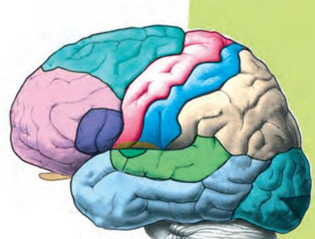
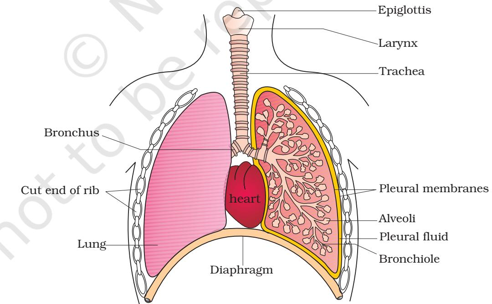
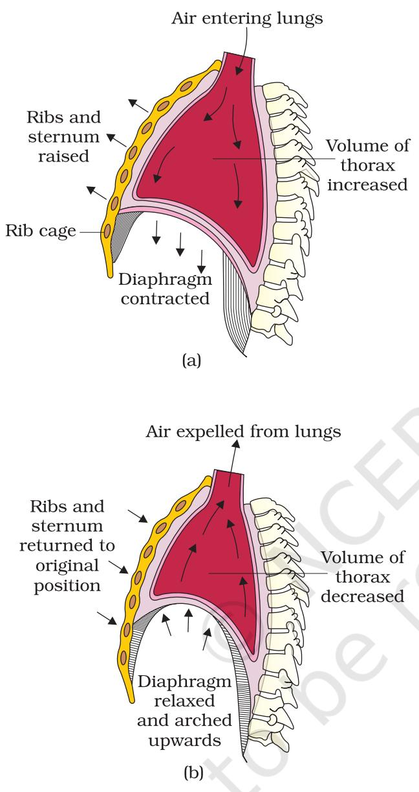
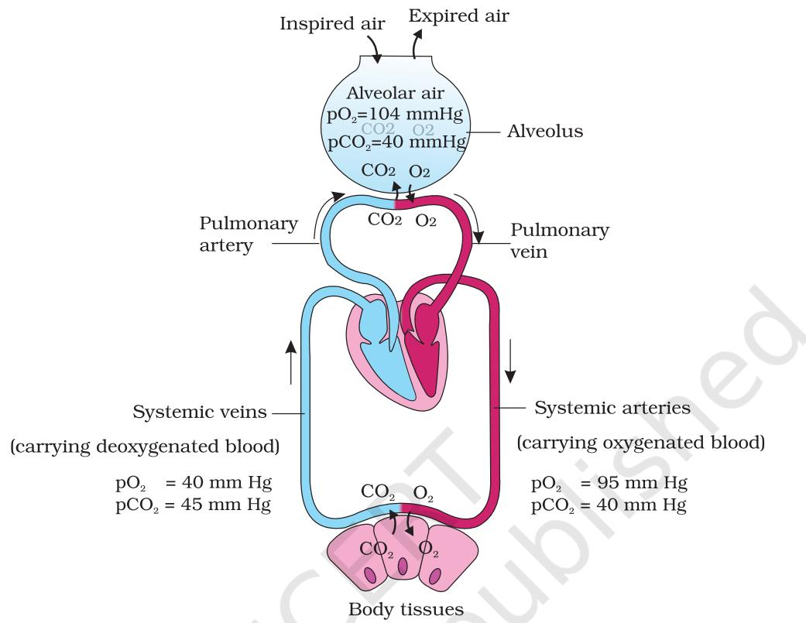
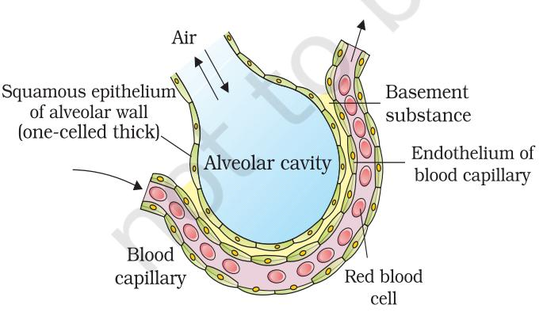
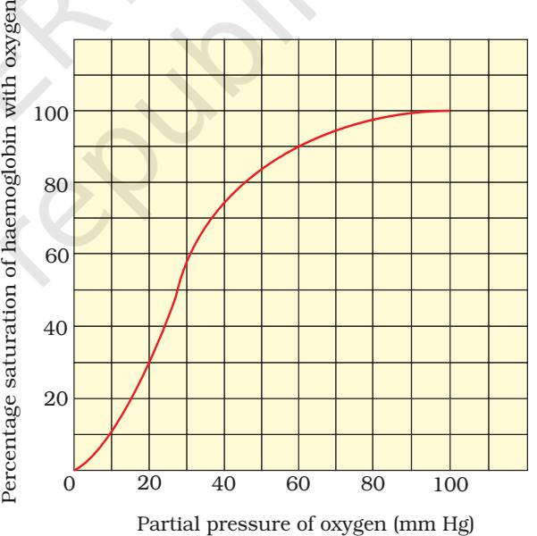

# UNIT 5

### HUMAN PHYSIOLOGY

Chapter 14 Breathing and Exchange

Chapter 15 Body Fluids and

of Gases

Circulation

Chapter 16 Excretory Products and their Elimination

Chapter 17 Locomotion and Movement

Chapter 18 Neural Control and Coordination

Chapter 19 Chemical Coordination and Integration

The reductionist approach to study of life forms resulted in increasing use of physico-chemical concepts and techniques. Majority of these studies employed either surviving tissue model or straightaway cellfree systems. An explosion of knowledge resulted in molecular biology. Molecular physiology became almost synonymous with biochemistry and biophysics. However, it is now being increasingly realised that neither a purely organismic approach nor a purely reductionistic molecular approach would reveal the truth about biological processes or living phenomena. Systems biology makes us believe that all living phenomena are emergent properties due to interaction among components of the system under study. Regulatory network of molecules, supra molecular assemblies, cells, tissues, organisms and indeed, populations and communities, each create emergent properties. In the chapters under this unit, major human physiological processes like, exchange of gases, blood circulation, locomotion and movement are described in cellular and molecular terms. The last two chapters point to the coordination and regulation of body events at the organismic level.

Alfonso Corti (1822 – 1888)

ALFONSO CORTI, Italian anatomist, was born in 1822. Corti began his scientific career studying the cardiovascular systems of reptiles. Later, he turned his attention to the mammalian auditory system. In 1851, he published a paper describing a structure located on the basilar membrane of the cochlea containing hair cells that convert sound vibrations into nerve impulses, the organ of Corti. He died in the year 1888.

## BREATHING AND EXCHANGE OF GASES CHAPTER 14

BREATHING AND EXCHANGE OF GASES 183

- *14.1 Respiratory Organs*
- *14.2 Mechanism of Breathing*
- *14.3 Exchange of Gases*
- *14.4 Transport of Gases*
- *14.5 Regulation of Respiration*
- *14.6 Disorders of Respiratory System*

As you have read earlier, oxygen (O2 ) is utilised by the organisms to indirectly break down simple molecules like glucose, amino acids, fatty acids, etc., to derive energy to perform various activities. Carbon dioxide (CO2 ) which is harmful is also released during the above catabolic reactions. It is, therefore, evident that O2 has to be continuously provided to the cells and CO2 produced by the cells have to be released out. This process of exchange of O2 from the atmosphere with CO2 produced by the cells is called breathing, commonly known as respiration. Place your hands on your chest; you can feel the chest moving up and down. You know that it is due to breathing. How do we breathe? The respiratory organs and the mechanism of breathing are described in the following sections of this chapter.

#### 14.1 RESPIRATORY ORGANS

Mechanisms of breathing vary among different groups of animals depending mainly on their habitats and levels of organisation. Lower invertebrates like sponges, coelenterates, flatworms, etc., exchange O2 with CO2 by simple diffusion over their entire body surface. Earthworms use their moist cuticle and insects have a network of tubes (tracheal tubes) to transport atmospheric air within the body. Special vascularised structures called gills (branchial respiration) are used by most of the aquatic arthropods and molluscs whereas vascularised bags called lungs (pulmonary respiration) are used by the terrestrial forms for the exchange of gases. Among vertebrates, fishes use gills whereas amphibians, reptiles, birds and mammals respire through lungs. Amphibians like frogs can respire through their moist skin (cutaneous respiration) also.

#### 14.1.1 Human Respiratory System

We have a pair of external nostrils opening out above the upper lips. It leads to a nasal chamber through the nasal passage. The nasal chamber opens into the pharynx, a portion of which is the common passage for food and air. The pharynx opens through the larynx region into the trachea. Larynx is a cartilaginous box which helps in sound production and hence called the sound box. During swallowing glottis can be covered by a thin elastic cartilaginous flap called epiglottis to prevent the entry of food into the larynx. Trachea is a straight tube extending up to the mid-thoracic cavity, which divides at the level of 5th thoracic vertebra into a right and left primary bronchi. Each bronchi undergoes repeated divisions to form the secondary and tertiary bronchi and bronchioles ending up in very thin terminal bronchioles. The tracheae, primary, secondary and tertiary bronchi, and initial bronchioles are supported by incomplete cartilaginous rings. Each terminal bronchiole gives rise to a number of very thin, irregular-walled and vascularised bag-like structures called alveoli. The branching network of bronchi, bronchioles and alveoli comprise the lungs (Figure 14.1). We have two lungs which are covered by a double layered pleura, with pleural fluid between them. It reduces friction on the lung-surface. The outer pleural membrane is in close contact with the thoracic

Figure 14.1 Diagrammatic view of human respiratory system (sectional view of the left lung is also shown)

lining whereas the inner pleural membrane is in contact with the lung surface. The part starting with the external nostrils up to the terminal bronchioles constitute the conducting part whereas the alveoli and their ducts form the respiratory or exchange part of the respiratory system. The conducting part transports the atmospheric air to the alveoli, clears it from foreign particles, humidifies and also brings the air to body temperature. Exchange part is the site of actual diffusion of O2 and CO2 between blood and atmospheric air.

The lungs are situated in the thoracic chamber which is anatomically an air-tight chamber. The thoracic chamber is formed dorsally by the vertebral column, ventrally by the sternum, laterally by the ribs and on the lower side by the dome-shaped diaphragm. The anatomical setup of lungs in thorax is such that any change in the volume of the thoracic cavity will be reflected in the lung (pulmonary) cavity. Such an arrangement is essential for breathing, as we cannot directly alter the pulmonary volume.

Respiration involves the following steps:

- (i) Breathing or pulmonary ventilation by which atmospheric air is drawn in and CO2 rich alveolar air is released out.
- (ii) Diffusion of gases (O2 and CO2 ) across alveolar membrane.
- (iii) Transport of gases by the blood.
- (iv) Diffusion of O2 and CO2 between blood and tissues.
- (v) Utilisation of O2 by the cells for catabolic reactions and resultant release of CO2 (cellular respiration as dealt in the Chapter 12).

#### 14.2 MECHANISM OF BREATHING

Breathing involves two stages : inspiration during which atmospheric air is drawn in and expiration by which the alveolar air is released out. The movement of air into and out of the lungs is carried out by creating a pressure gradient between the lungs and the atmosphere. Inspiration can occur if the pressure within the lungs (intra-pulmonary pressure) is less than the atmospheric pressure, i.e., there is a negative pressure in the lungs with respect to atmospheric pressure. Similarly, expiration takes place when the intra-pulmonary pressure is higher than the atmospheric pressure. The diaphragm and a specialised set of muscles – external and internal intercostals between the ribs, help in generation of such gradients. Inspiration is initiated by the contraction of diaphragm which increases the volume of thoracic chamber in the antero-posterior axis. The contraction of external inter-costal muscles lifts up the ribs and the

Figure 14.2 Mechanism of breathing showing : (a) inspiration (b) expiration

sternum causing an increase in the volume of the thoracic chamber in the dorso-ventral axis. The overall increase in the thoracic volume causes a similar increase in pulmonary volume. An increase in pulmonary volume decreases the intra-pulmonary pressure to less than the atmospheric pressure which forces the air from outside to move into the lungs, i.e., inspiration (Figure 14.2a). Relaxation of the diaphragm and the inter-costal muscles returns the diaphragm and sternum to their normal positions and reduce the thoracic volume and thereby the pulmonary volume. This leads to an increase in intra-pulmonary pressure to slightly above the atmospheric pressure causing the expulsion of air from the lungs, i.e., expiration (Figure 14.2b). We have the ability to increase the strength of inspiration and expiration with the help of additional muscles in the abdomen. On an average, a healthy human breathes 12-16 times/minute. The volume of air involved in breathing movements can be estimated by using a spirometer which helps in clinical assessment of pulmonary functions.

#### 14.2.1 Respiratory Volumes and Capacities

Tidal Volume (TV): Volume of air inspired or expired during a normal respiration. It is approx. 500 mL., i.e., a healthy man can inspire or expire approximately 6000 to 8000 mL of air per minute.

Inspiratory Reserve Volume (IRV): Additional volume of air, a person can inspire by a forcible inspiration. This averages 2500 mL to 3000 mL.

Expiratory Reserve Volume (ERV): Additional volume of air, a person can expire by a forcible expiration. This averages 1000 mL to 1100 mL.

Residual Volume (RV): Volume of air remaining in the lungs even after a forcible expiration. This averages 1100 mL to 1200 mL.

By adding up a few respiratory volumes described above, one can derive various pulmonary capacities, which can be used in clinical diagnosis.

Inspiratory Capacity (IC): Total volume of air a person can inspire after a normal expiration. This includes tidal volume and inspiratory reserve volume ( TV+IRV).

Expiratory Capacity (EC): Total volume of air a person can expire after a normal inspiration. This includes tidal volume and expiratory reserve volume (TV+ERV).

Functional Residual Capacity (FRC): Volume of air that will remain in the lungs after a normal expiration. This includes ERV+RV.

Vital Capacity (VC): The maximum volume of air a person can breathe in after a forced expiration. This includes ERV, TV and IRV or the maximum volume of air a person can breathe out after a forced inspiration.

Total Lung Capacity (TLC): Total volume of air accommodated in the lungs at the end of a forced inspiration. This includes RV, ERV, TV and IRV or vital capacity + residual volume.

#### 14.3 EXCHANGE OF GASES

Alveoli are the primary sites of exchange of gases. Exchange of gases also occur between blood and tissues. O2 and CO2 are exchanged in these sites by simple diffusion mainly based on pressure/concentration gradient. Solubility of the gases as well as the thickness of the membranes involved in diffusion are also some important factors that can affect the rate of diffusion.

Pressure contributed by an individual gas in a mixture of gases is called partial pressure and is represented as pO2 for oxygen and pCO2 for carbon dioxide. Partial pressures of these two gases in the atmospheric air and the two sites of diffusion are given in Table 14.1 and in Figure 14.3. The data given in the table clearly indicates a concentration gradient for oxygen from alveoli to blood and blood to tissues. Similarly,

TABLE 14.1 Partial Pressures (in mm Hg) of Oxygen and Carbon dioxide at Different Parts Involved in Diffusion in Comparison to those in Atmosphere

| Respiratory | Atmospheric |  | Alveoli | Blood | Blood | Tissues |
| --- | --- | --- | --- | --- | --- | --- |
| Gas |  | Air |  | (Deoxygenated) | (Oxygenated) |  |
| O2 |  | 159 | 104 | 40 | 95 | 40 |
| CO2 |  | 0.3 | 40 | 45 | 40 | 45 |

- Figure 14.3 Diagrammatic representation of exchange of gases at the alveolus and the body tissues with blood and transport of oxygen and carbon dioxide
a gradient is present for CO2 in the opposite direction, i.e., from tissues to blood and blood to alveoli. As the solubility of CO2 is 20-25 times higher than that of O2 , the amount of CO2 that can diffuse through the diffusion membrane per unit difference in partial pressure is much higher compared

Figure 14.4 A Diagram of a section of an alveolus with a pulmonary capillary.

to that of O2 . The diffusion membrane is made up of three major layers (Figure 14.4) namely, the thin squamous epithelium of alveoli, the endothelium of alveolar capillaries and the basement substance (composed of a thin basement membrane supporting the squamous epithelium and the basement membrane surrounding the single layer endothelial cells of capillaries) in between them. However, its total thickness is much less than a millimetre. Therefore, all the factors in our body are favourable for diffusion of O2 from alveoli to tissues and that of CO2 from tissues to alveoli.

#### 14.4 TRANSPORT OF GASES

Blood is the medium of transport for O2 and CO2 . About 97 per cent of O2 is transported by RBCs in the blood. The remaining 3 per cent of O2 is carried in a dissolved state through the plasma. Nearly 20-25 per cent of CO2 is transported by RBCs whereas 70 per cent of it is carried as bicarbonate. About 7 per cent of CO2 is carried in a dissolved state through plasma.

#### 14.4.1 Transport of Oxygen

Haemoglobin is a red coloured iron containing pigment present in the RBCs. O2 can bind with haemoglobin in a reversible manner to form oxyhaemoglobin. Each haemoglobin molecule can carry a maximum of four molecules of O2 . Binding of oxygen with haemoglobin is primarily related to partial pressure of O2 . Partial pressure of CO2 , hydrogen ion concentration and temperature are the other factors which can interfere with this binding. A sigmoid curve is obtained when percentage saturation

of haemoglobin with O2 is plotted against the pO2 . This curve is called the Oxygen dissociation curve (Figure 14.5) and is highly useful in studying the effect of factors like pCO2 , H+ concentration, etc., on binding of O2 with haemoglobin. In the alveoli, where there is high pO2 , low pCO2 , lesser H+ concentration and lower temperature, the factors are all favourable for the formation of oxyhaemoglobin, whereas in the tissues, where low pO2 , high pCO2 , high H+ concentration and higher temperature exist, the conditions are favourable for dissociation of oxygen from the oxyhaemoglobin. This clearly indicates that O2 gets bound to haemoglobin in the lung surface and gets dissociated at the tissues. Every 100 ml of oxygenated blood can deliver around 5 ml of O2 to the tissues under normal physiological conditions.

Figure 14.5 Oxygen dissociation curve

#### 14.4.2 Transport of Carbon dioxide

CO2 is carried by haemoglobin as carbamino-haemoglobin (about 20-25 per cent). This binding is related to the partial pressure of CO2 . pO2 is a major factor which could affect this binding. When pCO2 is high and pO2 is low as in the tissues, more binding of carbon dioxide occurs whereas, when the pCO2 is low and pO2 is high as in the alveoli, dissociation of CO2 from carbamino-haemoglobin takes place, i.e., CO2 which is bound to haemoglobin from the tissues is delivered at the alveoli. RBCs contain a very high concentration of the enzyme, carbonic anhydrase and minute quantities of the same is present in the plasma too. This enzyme facilitates the following reaction in both directions.

$$\text{CO}_2+\text{H}_2\text{O}\text{Carbonic}\text{anhydrase}\text{H}_2\text{CO}_3\text{Carbonic}\text{anhydrase}\text{HCO}_3^-+\text{H}^+$$

At the tissue site where partial pressure of CO2 is high due to catabolism, CO2 diffuses into blood (RBCs and plasma) and forms HCO3 – and H+,. At the alveolar site where pCO2 is low, the reaction proceeds in the opposite direction leading to the formation of CO2 and H2O. Thus, CO2 trapped as bicarbonate at the tissue level and transported to the alveoli is released out as CO2 (Figure 14.4). Every 100 ml of deoxygenated blood delivers approximately 4 ml of CO2 to the alveoli.

#### 14.5 REGULATION OF RESPIRATION

Human beings have a significant ability to maintain and moderate the respiratory rhythm to suit the demands of the body tissues. This is done by the neural system. A specialised centre present in the medulla region of the brain called respiratory rhythm centre is primarily responsible for this regulation. Another centre present in the pons region of the brain called pneumotaxic centre can moderate the functions of the respiratory rhythm centre. Neural signal from this centre can reduce the duration of inspiration and thereby alter the respiratory rate. A chemosensitive area is situated adjacent to the rhythm centre which is highly sensitive to CO2 and hydrogen ions. Increase in these substances can activate this centre, which in turn can signal the rhythm centre to make necessary adjustments in the respiratory process by which these substances can be eliminated. Receptors associated with aortic arch and carotid artery also can recognise changes in CO2 and H+ concentration and send necessary signals to the rhythm centre for remedial actions. The role of oxygen in the regulation of respiratory rhythm is quite insignificant.

#### 14.6 DISORDERS OF RESPIRATORY SYSTEM

Asthma is a difficulty in breathing causing wheezing due to inflammation of bronchi and bronchioles.

Emphysema is a chronic disorder in which alveolar walls are damaged due to which respiratory surface is decreased. One of the major causes of this is cigarette smoking.

Occupational Respiratory Disorders: In certain industries, especially those involving grinding or stone-breaking, so much dust is produced that the defense mechanism of the body cannot fully cope with the situation. Long exposure can give rise to inflammation leading to fibrosis (proliferation of fibrous tissues) and thus causing serious lung damage. Workers in such industries should wear protective masks.

#### SUMMARY

Cells utilise oxygen for metabolism and produce energy along with substances like carbon dioxide which is harmful. Animals have evolved different mechanisms for the transport of oxygen to the cells and for the removal of carbon dioxide from there. We have a well developed respiratory system comprising two lungs and associated air passages to perform this function.

The first step in respiration is breathing by which atmospheric air is taken in (inspiration) and the alveolar air is released out (expiration). Exchange of O2 and CO2 between deoxygenated blood and alveoli, transport of these gases throughout the body by blood, exchange of O2 and CO2 between the oxygenated blood and tissues and utilisation of O2 by the cells (cellular respiration) are the other steps involved.

Inspiration and expiration are carried out by creating pressure gradients between the atmosphere and the alveoli with the help of specialised muscles – intercostals and diaphragm. Volumes of air involved in these activities can be estimated with the help of spirometer and are of clinical significance.

Exchange of O2 and CO2 at the alveoli and tissues occur by diffusion. Rate of diffusion is dependent on the partial pressure gradients of O2 (pO2 ) and CO2 (pCO2 ), their solubility as well as the thickness of the diffusion surface. These factors in our body facilitate diffusion of O2 from the alveoli to the deoxygenated blood as well as from the oxygenated blood to the tissues. The factors are favourable for the diffusion of CO2 in the opposite direction, i.e., from tissues to alveoli.

Oxygen is transported mainly as oxyhaemoglobin. In the alveoli where pO2 is higher, O2 gets bound to haemoglobin which is easily dissociated at the tissues where pO2 is low and pCO2 and H+ concentration are high. Nearly 70 per cent of carbon dioxide is transported as bicarbonate (HCO3 – ) with the help of the enzyme carbonic anhydrase. 20-25 per cent of carbon dioxide is carried by haemoglobin as carbamino-haemoglobin. In the tissues where pCO2 is high, it gets bound to blood whereas in the alveoli where pCO2 is low and pO2 is high, it gets removed from the blood.

Respiratory rhythm is maintained by the respiratory centre in the medulla region of brain. A pneumotaxic centre in the pons region of the brain and a chemosensitive area in the medulla can alter respiratory mechanism.

#### EXERCISES

- 1. Define vital capacity. What is its significance?
- 2. State the volume of air remaining in the lungs after a normal breathing.
- 3. Diffusion of gases occurs in the alveolar region only and not in the other parts of respiratory system. Why?
- 4. What are the major transport mechanisms for CO2 ? Explain.
- 5. What will be the pO2 and pCO2 in the atmospheric air compared to those in the alveolar air ?
	- (i) pO2 lesser, pCO2 higher
	- (ii) pO2 higher, pCO2 lesser
	- (iii) pO2 higher, pCO2 higher
	- (iv) pO2 lesser, pCO2 lesser
- 6. Explain the process of inspiration under normal conditions.
- 7. How is respiration regulated?
- 8. What is the effect of pCO2 on oxygen transport?
- 9. What happens to the respiratory process in a man going up a hill?
- 10. What is the site of gaseous exchange in an insect?
- 11. Define oxygen dissociation curve. Can you suggest any reason for its sigmoidal pattern?
- 12. Have you heard about hypoxia? Try to gather information about it, and discuss with your friends.
- 13. Distinguish between
	- (a) IRV and ERV
	- (b) Inspiratory capacity and Expiratory capacity.
	- (c) Vital capacity and Total lung capacity.
- 14. What is Tidal volume? Find out the Tidal volume (approximate value) for a healthy human in an hour.

