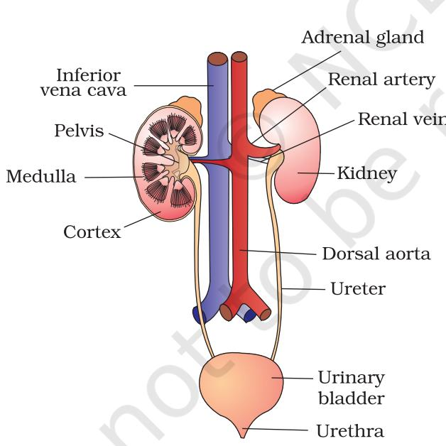
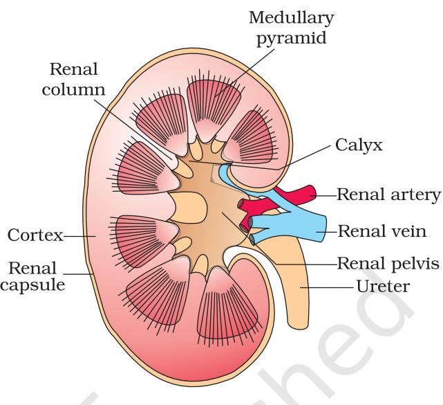
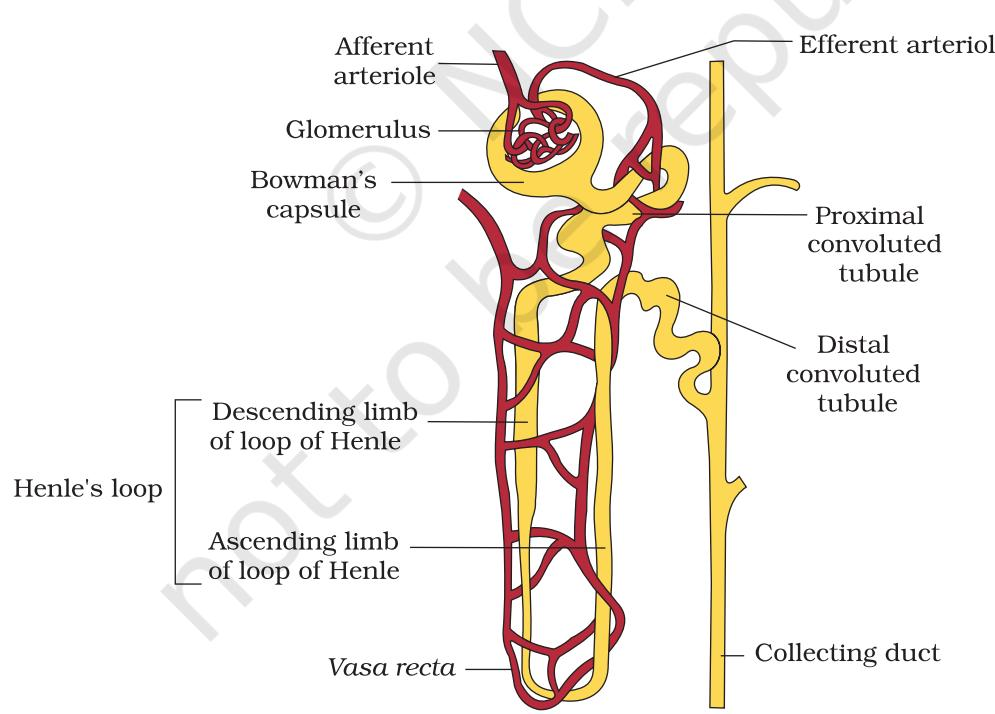
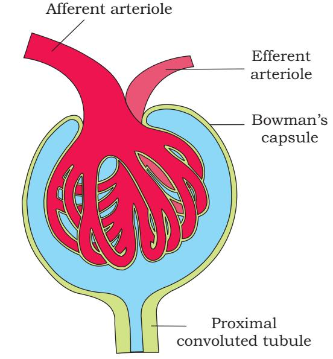
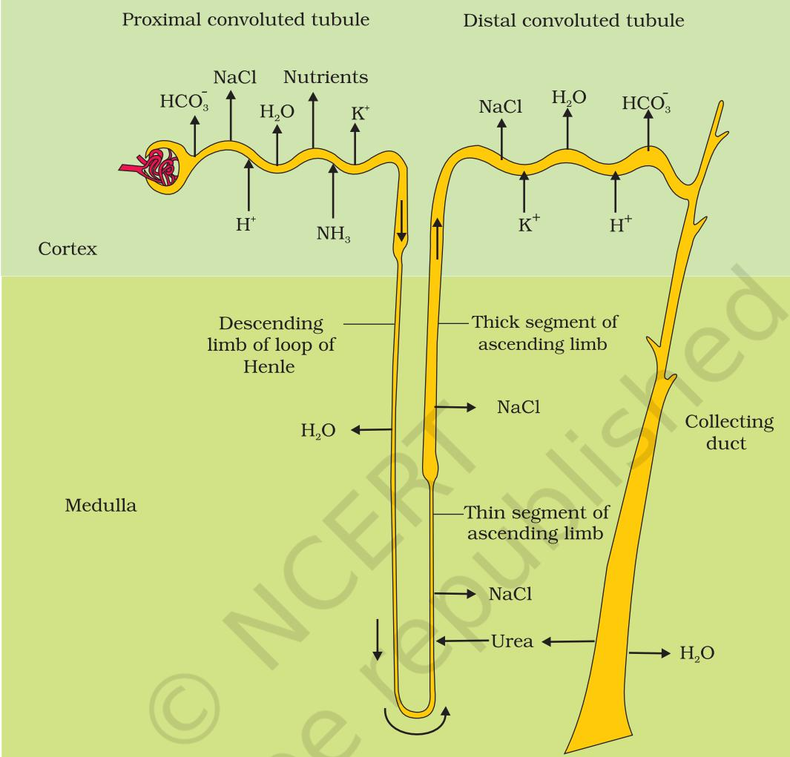
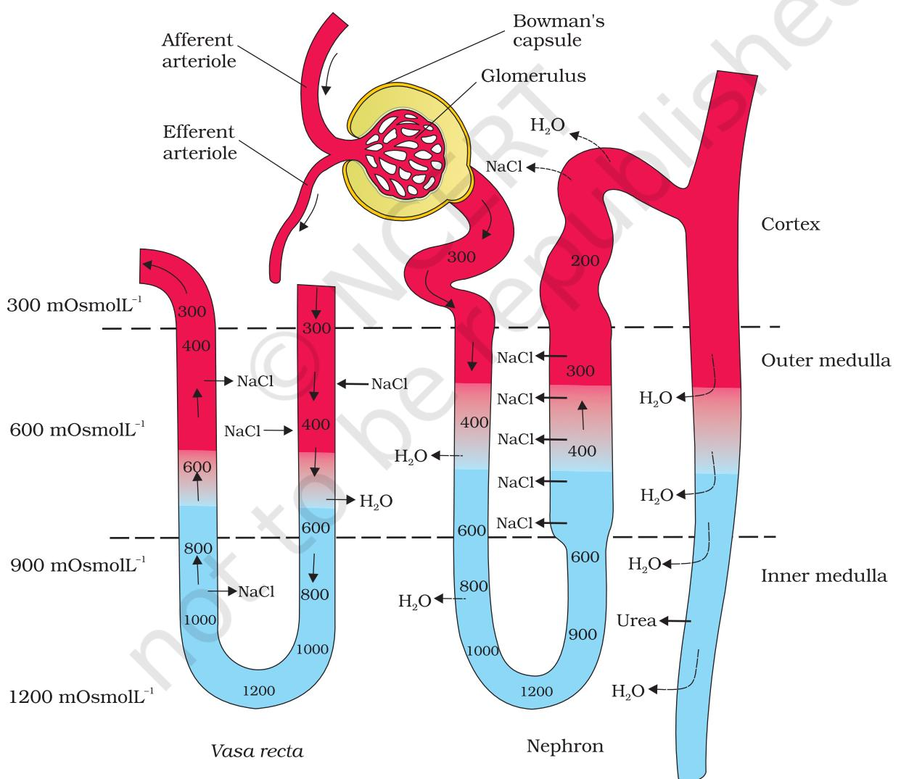

EXCRETORY PRODUCTS AND THEIR ELIMINATION 205

- *16.1 Human Excretory System*
- *16.2 Urine Formation*
- *16.3 Function of the Tubules*
- *16.4 Mechanism of Concentration of the Filtrate*
- *16.5 Regulation of Kidney Function*
- *16.6 Micturition*
- *16.7 Role of other Organs in Excretion*
- *16.8 Disorders of the Excretory System*

Animals accumulate ammonia, urea, uric acid, carbon dioxide, water and ions like Na+, K+, Cl– , phosphate, sulphate, etc., either by metabolic activities or by other means like excess ingestion. These substances have to be removed totally or partially. In this chapter, you will learn the mechanisms of elimination of these substances with special emphasis on common nitrogenous wastes. Ammonia, urea and uric acid are the major forms of nitrogenous wastes excreted by the animals. Ammonia is the most toxic form and requires large amount of water for its elimination, whereas uric acid, being the least toxic, can be removed with a minimum loss of water.

The process of excreting ammonia is *Ammonotelism*. Many bony fishes, aquatic amphibians and aquatic insects are *ammonotelic* in nature. Ammonia, as it is readily soluble, is generally excreted by diffusion across body surfaces or through gill surfaces (in fish) as ammonium ions. Kidneys do not play any significant role in its removal. Terrestrial adaptation necessitated the production of lesser toxic nitrogenous wastes like urea and uric acid for conservation of water. Mammals, many terrestrial amphibians and marine fishes mainly excrete urea and are called *ureotelic ureotelicureotelic* animals. Ammonia produced by metabolism is converted into urea in the liver of these animals and released into the blood which is filtered and excreted out by the kidneys. Some amount of urea may be retained in the kidney matrix of some of these animals to maintain a desired osmolarity. Reptiles, birds, land snails and insects excrete nitrogenous wastes as uric acid in the form of pellet or paste with a minimum loss of water and are called *uricotelic* animals.

A survey of animal kingdom presents a variety of excretory structures. In most of the invertebrates, these structures are simple tubular forms whereas vertebrates have complex tubular organs called kidneys. Some of these structures are mentioned here. Protonephridia or flame cells are the excretory structures in Platyhelminthes (Flatworms, e.g., *Planaria*), rotifers, some annelids and the cephalochordate – *Amphioxus*. Protonephridia are primarily concerned with ionic and fluid volume regulation, i.e., osmoregulation. Nephridia are the tubular excretory structures of earthworms and other annelids. Nephridia help to remove nitrogenous wastes and maintain a fluid and ionic balance. Malpighian tubules are the excretory structures of most of the insects including cockroaches. Malpighian tubules help in the removal of nitrogenous wastes and osmoregulation. Antennal glands or green glands perform the excretory function in crustaceans like prawns.

#### 16.1 HUMAN EXCRETORY SYSTEM

Figure 16.1 Human Urinary system

In humans, the excretory system consists of a pair of kidneys, one pair of ureters, a urinary bladder and a urethra (Figure 16.1). Kidneys are reddish brown, bean shaped structures situated between the levels of last thoracic and third lumbar vertebra close to the dorsal inner wall of the abdominal cavity. Each kidney of an adult human measures 10-12 cm in length, 5-7 cm in width, 2-3 cm in thickness with an average weight of 120- 170 g. Towards the centre of the inner concave surface of the kidney is a notch called hilum through which ureter, blood vessels and nerves enter. Inner to the hilum is a broad funnel shaped space called the renal pelvis with projections called calyces. The outer layer of kidney is a tough capsule. Inside the kidney, there are two zones, an outer *cortex* and an inner *medulla*. The medulla is divided into a few conical masses (medullary pyramids) projecting into the calyces (sing.: calyx). The cortex extends in between the medullary pyramids as renal columns called Columns of Bertini (Figure 16.2).

Each kidney has nearly one million complex tubular structures called nephrons (Figure 16.3), which are the functional units. Each nephron has two parts – the glomerulus and the renal tubule. Glomerulus is a tuft of capillaries formed by the afferent arteriole – a fine branch of renal artery. Blood from the glomerulus is carried away by an efferent arteriole.

The renal tubule begins with a double walled cup-like structure called Bowman's capsule, which encloses the glomerulus. Glomerulus alongwith Bowman's capsule, is called the malpighian body or renal corpuscle (Figure 16.4). The tubule continues further to form a highly coiled network – proximal convoluted tubule

Figure 16.2 Longitudinal section (Diagrammatic) of Kidney

Figure 16.3 A diagrammatic representation of a nephron showing blood vessels, duct and tubule

(PCT). A hairpin shaped Henle's loop is the next part of the tubule which has a descending and an ascending limb. The ascending limb continues as another highly coiled tubular region called distal convoluted tubule (DCT). The DCTs of many nephrons open into a straight tube called *collecting duct*, many of which converge and open into the renal pelvis through medullary pyramids in the calyces.

The Malpighian corpuscle, PCT and DCT of the nephron are situated in the cortical region of the kidney whereas the loop of Henle dips into the medulla. In majority of nephrons, the loop of Henle is too short and extends only very little into the medulla. Such nephrons are called cortical nephrons. In some of the nephrons,

the loop of Henle is very long and runs deep into the medulla. These nephrons are called juxta medullary nephrons.

The efferent arteriole emerging from the glomerulus forms a fine capillary network around the renal tubule called the peritubular capillaries. A minute vessel of this network runs parallel to the Henle's loop forming a 'U' shaped *vasa recta*. *Vasa recta* is absent or highly reduced in cortical nephrons.

## 16.2 URINE FORMATION

Urine formation involves three main processes namely, glomerular filtration, reabsorption and secretion, that takes place in different parts of the nephron.

The first step in urine formation is the filtration of blood, which is carried out by the glomerulus and is called glomerular filtration. On an average, 1100-1200 ml of blood is filtered by the kidneys per minute which constitute roughly 1/5th of the blood pumped out by each ventricle of the heart in a minute. The glomerular capillary blood pressure causes filtration of blood through 3 layers, i.e., the endothelium of glomerular blood vessels, the epithelium of Bowman's capsule and a basement membrane between these two layers. The epithelial cells of Bowman's capsule called podocytes are arranged in an intricate manner so as to leave some minute spaces called filtration slits or slit pores. Blood is filtered so finely through these membranes, that almost all the constituents of the plasma except the proteins pass onto the lumen of the Bowman's capsule. Therefore, it is considered as a process of ultra filtration.

The amount of the filtrate formed by the kidneys per minute is called glomerular filtration rate (GFR). GFR in a healthy individual is approximately 125 ml/minute, i.e., 180 litres per day !

The kidneys have built-in mechanisms for the regulation of glomerular filtration rate. One such efficient mechanism is carried out by juxta glomerular apparatus (JGA). JGA is a special sensitive region formed by cellular modifications in the distal convoluted tubule and the afferent arteriole at the location of their contact. A fall in GFR can activate the JG cells to release renin which can stimulate the glomerular blood flow and thereby the GFR back to normal.

A comparison of the volume of the filtrate formed per day (180 litres per day) with that of the urine released (1.5 litres), suggest that nearly 99 per cent of the filtrate has to be reabsorbed by the renal tubules. This process is called reabsorption. The tubular epithelial cells in different segments of nephron perform this either by active or passive mechanisms. For example, substances like glucose, amino acids, Na+ , etc., in the filtrate are reabsorbed actively whereas the nitrogenous wastes are absorbed by passive transport. Reabsorption of water also occurs passively in the initial segments of the nephron (Figure 16.5).

During urine formation, the tubular cells secrete substances like H+, K+ and ammonia into the filtrate. Tubular secretion is also an important step in urine formation as it helps in the maintenance of ionic and acid base balance of body fluids.

#### 16.3 FUNCTION OF THE TUBULES

Proximal Convoluted Tubule (PCT): PCT is lined by simple cuboidal brush border epithelium which increases the surface area for reabsorption. Nearly all of the essential nutrients, and 70-80 per cent of electrolytes and water are reabsorbed by this segment. PCT also helps to maintain the pH and ionic balance of the body fluids by selective secretion of hydrogen ions and ammonia into the filtrate and by absorption of HCO3 – from it.

Henle's Loop: Reabsorption is minimum in its ascending limb. However, this region plays a significant role in the maintenance of high osmolarity of medullary interstitial fluid. The descending limb of loop of Henle is permeable to water but almost impermeable to electrolytes. This concentrates the filtrate as it moves down. The ascending limb is impermeable to water but allows transport of electrolytes actively or passively. Therefore, as the concentrated filtrate pass upward, it gets diluted due to the passage of electrolytes to the medullary fluid.

Distal Convoluted Tubule (DCT): Conditional reabsorption of Na+ and water takes place in this segment. DCT is also capable of reabsorption of HCO3 – and selective secretion of hydrogen and potassium ions and NH3 to maintain the pH and sodium-potassium balance in blood.

Figure 16.5 Reabsorption and secretion of major substances at different parts of the nephron (Arrows indicate direction of movement of materials.)

Collecting Duct: This long duct extends from the cortex of the kidney to the inner parts of the medulla. Large amounts of water could be reabsorbed from this region to produce a concentrated urine. This segment allows passage of small amounts of urea into the medullary interstitium to keep up the osmolarity. It also plays a role in the maintenance of pH and ionic balance of blood by the selective secretion of H+ and K+ ions (Figure 16.5).

#### 16.4 MECHANISM OF CONCENTRATION OF THE FILTRATE

Mammals have the ability to produce a concentrated urine. The Henle's loop and *vasa recta* play a significant role in this. The flow of filtrate in the two limbs of Henle's loop is in opposite directions and thus forms a counter current. The flow of blood through the two limbs of *vasa recta* is also in a counter current pattern. The proximity between the Henle's loop and *vasa recta*, as well as the counter current in them help in maintaining an increasing osmolarity towards the inner medullary interstitium, i.e., from 300 mOsmolL–1 in the cortex to about 1200 mOsmolL–1 in the inner medulla. This gradient is mainly caused by NaCl and urea. NaCl is transported by the ascending limb of Henle's loop which is exchanged with the descending limb of *vasa recta*. NaCl is returned to the interstitium by the ascending portion of *vasa recta*. Similarly, small amounts of urea enter the thin segment of the ascending limb of Henle's loop which is transported back to the interstitium by the collecting tubule. The above described transport of substances facilitated by the special arrangement of Henle's loop and *vasa recta* is called the counter current mechanism (Figure. 16.6). This mechanism helps to maintain a concentration gradient

Figure 16.6 Diagrammatic representation of a nephron and *vasa recta* showing counter current mechanisms

in the medullary interstitium. Presence of such interstitial gradient helps in an easy passage of water from the collecting tubule thereby concentrating the filtrate (urine). Human kidneys can produce urine nearly four times concentrated than the initial filtrate formed.

#### 16.5 REGULATION OF KIDNEY FUNCTION

The functioning of the kidneys is efficiently monitored and regulated by hormonal feedback mechanisms involving the hypothalamus, JGA and to a certain extent, the heart.

Osmoreceptors in the body are activated by changes in blood volume, body fluid volume and ionic concentration. An excessive loss of fluid from the body can activate these receptors which stimulate the hypothalamus to release antidiuretic hormone (ADH) or vasopressin from the neurohypophysis. ADH facilitates water reabsorption from latter parts of the tubule, thereby preventing diuresis. An increase in body fluid volume can switch off the osmoreceptors and suppress the ADH release to complete the feedback. ADH can also affect the kidney function by its constrictory effects on blood vessels. This causes an increase in blood pressure. An increase in blood pressure can increase the glomerular blood flow and thereby the GFR.

The JGA plays a complex regulatory role. A fall in glomerular blood flow/glomerular blood pressure/GFR can activate the JG cells to release renin which converts angiotensinogen in blood to angiotensin I and further to angiotensin II. Angiotensin II, being a powerful vasoconstrictor, increases the glomerular blood pressure and thereby GFR. Angiotensin II also activates the adrenal cortex to release Aldosterone. Aldosterone causes reabsorption of Na+ and water from the distal parts of the tubule. This also leads to an increase in blood pressure and GFR. This complex mechanism is generally known as the Renin-Angiotensin mechanism.

An increase in blood flow to the atria of the heart can cause the release of Atrial Natriuretic Factor (ANF). ANF can cause vasodilation (dilation of blood vessels) and thereby decrease the blood pressure. ANF mechanism, therefore, acts as a check on the renin-angiotensin mechanism.

### 16.6 MICTURITION

Urine formed by the nephrons is ultimately carried to the urinary bladder where it is stored till a voluntary signal is given by the central nervous system (CNS). This signal is initiated by the stretching of the urinary bladder as it gets filled with urine. In response, the stretch receptors on the walls of the bladder send signals to the CNS. The CNS passes on motor messages to initiate the contraction of smooth muscles of the bladder and simultaneous relaxation of the urethral sphincter causing the release of urine. The process of release of urine is called micturition and the neural mechanisms causing it is called the micturition reflex. An adult human excretes, on an average, 1 to 1.5 litres of urine per day. The urine formed is a light yellow coloured watery fluid which is slightly acidic (pH-6.0) and has a characterestic odour. On an average, 25-30 gm of urea is excreted out per day. Various conditions can affect the characteristics of urine. Analysis of urine helps in clinical diagnosis of many metabolic discorders as well as malfunctioning of the kidney. For example, presence of glucose (Glycosuria) and ketone bodies (Ketonuria) in urine are indicative of diabetes mellitus.

#### 16.7 ROLE OF OTHER ORGANS IN EXCRETION

Other than the kidneys, lungs, liver and skin also help in the elimination of excretory wastes.

Our lungs remove large amounts of CO2 (approximately 200mL/ minute) and also significant quantities of water every day. Liver, the largest gland in our body, secretes bile-containing substances like bilirubin, biliverdin, cholesterol, degraded steroid hormones, vitamins and drugs. Most of these substances ultimately pass out alongwith digestive wastes.

The sweat and sebaceous glands in the skin can eliminate certain substances through their secretions. Sweat produced by the sweat glands is a watery fluid containing NaCl, small amounts of urea, lactic acid, etc. Though the primary function of sweat is to facilitate a cooling effect on the body surface, it also helps in the removal of some of the wastes mentioned above. Sebaceous glands eliminate certain substances like sterols, hydrocarbons and waxes through sebum. This secretion provides a protective oily covering for the skin. Do you know that small amounts of nitrogenous wastes could be eliminated through saliva too?

#### 16.8 DISORDERS OF THE EXCRETORY SYSTEM

Malfunctioning of kidneys can lead to accumulation of urea in blood, a condition called uremia, which is highly harmful and may lead to kidney failure. In such patients, urea can be removed by a process called hemodialysis. During the process of haemodialysis, the blood drained from a convenient artery is pumped into a dialysing unit called artificial kidney. Blood drained from a convenient artery is pumped into a dialysing unit after adding an anticoagulant like heparin. The unit contains a coiled cellophane tube surrounded by a fluid (dialysing fluid) having the same composition as that of plasma except the nitrogenous wastes. The porous cellophane membrance of the tube allows the passage of molecules based on concentration gradient. As nitrogenous wastes are absent in the dialysing fluid, these substances freely move out, thereby clearing the blood. The cleared blood is pumped back to the body through a vein after adding anti-heparin to it. This method is a boon for thousands of uremic patients all over the world.

Kidney transplantation is the ultimate method in the correction of acute renal failures (kidney failure). A functioning kidney is used in transplantation from a donor, preferably a close relative, to minimise its chances of rejection by the immune system of the host. Modern clinical procedures have increased the success rate of such a complicated technique.

Renal calculi: Stone or insoluble mass of crystallised salts (oxalates, etc.) formed within the kidney.

Glomerulonephritis: Inflammation of glomeruli of kidney.

#### SUMMARY

Many nitrogen containing substances, ions, CO2, water, etc., that accumulate in the body have to be eliminated. Nature of nitrogenous wastes formed and their excretion vary among animals, mainly depending on the habitat (availability of water). Ammonia, urea and uric acid are the major nitrogenous wastes excreted.

Protonephridia, nephridia, malpighian tubules, green glands and the kidneys are the common excretory organs in animals. They not only eliminate nitrogenous wastes but also help in the maintenance of ionic and acid-base balance of body fluids.

In humans, the excretory system consists of one pair of kidneys, a pair of ureters, a urinary bladder and a urethra. Each kidney has over a million tubular structures called nephrons. Nephron is the functional unit of kidney and has two portions – glomerulus and renal tubule. Glomerulus is a tuft of capillaries formed from afferent arterioles, fine branches of renal artery. The renal tubule starts with a double walled Bowman's capsule and is further differentiated into a proximal convoluted tubule (PCT), Henle's loop (HL) and distal convoluted tubule (DCT). The DCTs of many nephrons join to a common collecting duct many of which ultimately open into the renal pelvis through the medullary pyramids. The Bowman's capsule encloses the glomerulus to form Malpighian or renal corpuscle.

Urine formation involves three main processes, i.e., filtration, reabsorption and secretion. Filtration is a non-selective process performed by the glomerulus using the glomerular capillary blood pressure. About 1200 ml of blood is filtered by the glomerulus per minute to form 125 ml of filtrate in the Bowman's capsule per minute (GFR). JGA, a specialised portion of the nephrons, plays a significant role in the regulation of GFR. Nearly 99 per cent reabsorption of the filtrate takes place through different parts of the nephrons. PCT is the major site of reabsorption and selective secretion. HL primarily helps to maintain osmolar gradient (300 mOsmolL–1 -1200 mOsmolL–1) within the kidney interstitium. DCT and collecting duct allow extensive reabsorption of water and certain electrolytes, which help in osmoregulation: H+, K+ and NH3 could be secreted into the filtrate by the tubules to maintain the ionic balance and pH of body fluids.

A counter current mechanism operates between the two limbs of the loop of Henle and those of *vasa recta* (capillary parallel to Henle's loop). The filtrate gets concentrated as it moves down the descending limb but is diluted by the ascending limb. Electrolytes and urea are retained in the interstitium by this arrangement. DCT and collecting duct concentrate the filtrate about four times, i.e., from 300 mOsmolL–1 to 1200 mOsmolL–1, an excellent mechanism of conservation of water. Urine is stored in the urinary bladder till a voluntary signal from CNS carries out its release through urethra, i.e., micturition. Skin, lungs and liver also assist in excretion.

#### EXERCISES

- 1. Define Glomerular Filtration Rate (GFR)
- 2. Explain the autoregulatory mechanism of GFR.
- 3. Indicate whether the following statements are true or false : (a) Micturition is carried out by a reflex.
	- (b) ADH helps in water elimination, making the urine hypotonic.
	- (c) Protein-free fluid is filtered from blood plasma into the Bowman's capsule.
	- (d) Henle's loop plays an important role in concentrating the urine.
	- (e) Glucose is actively reabsorbed in the proximal convoluted tubule.
- 4. Give a brief account of the counter current mechanism.
- 5. Describe the role of liver, lungs and skin in excretion.
- 6. Explain micturition.
- 7. Match the items of column I with those of column II :

#### Column I Column II

- (a) Ammonotelism (i) Birds
- (b) Bowman's capsule (ii) Water reabsorption
- 
- (c) Micturition (iii) Bony fish
- (d) Uricotelism (iv) Urinary bladder
- (d) ADH (v) Renal tubule
- 8. What is meant by the term osmoregulation?
- 9. Terrestrial animals are generally either ureotelic or uricotelic, not ammonotelic, why ?
- 10. What is the significance of juxta glomerular apparatus (JGA) in kidney function?
- 11. Name the following:
	- (a) A chordate animal having flame cells as excretory structures
	- (b) Cortical portions projecting between the medullary pyramids in the human kidney
	- (c) A loop of capillary running parallel to the Henle's loop.
- 12. Fill in the gaps :
	- (a) Ascending limb of Henle's loop is _______ to water whereas the descending limb is _______ to it.
	- (b) Reabsorption of water from distal parts of the tubules is facilitated by hormone _______.
	- (c) Dialysis fluid contain all the constituents as in plasma except _______.
	- (d) A healthy adult human excretes (on an average) _______ gm of urea/day.

