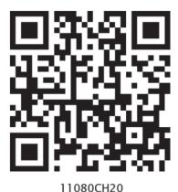
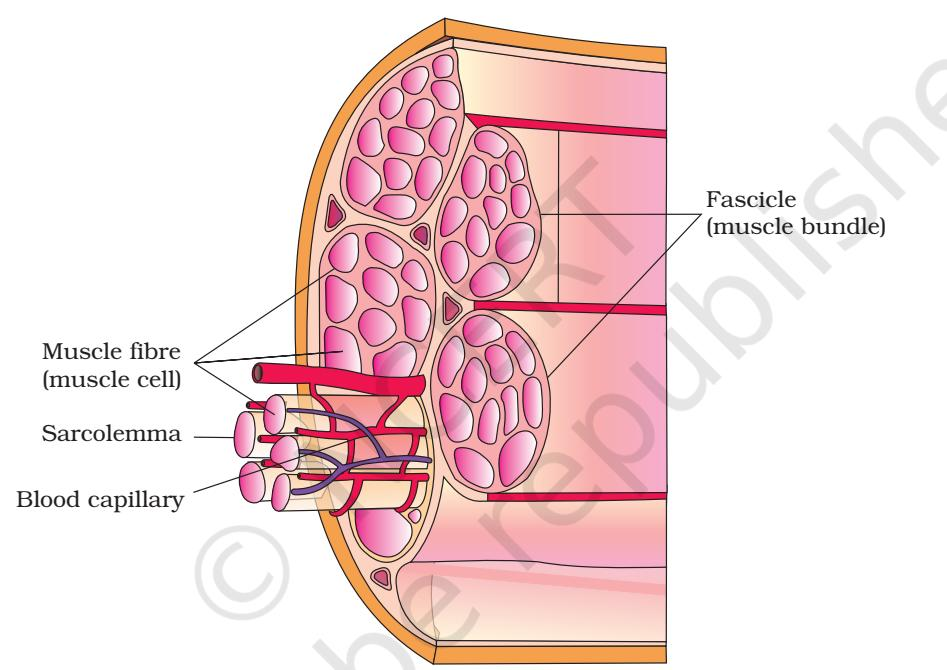
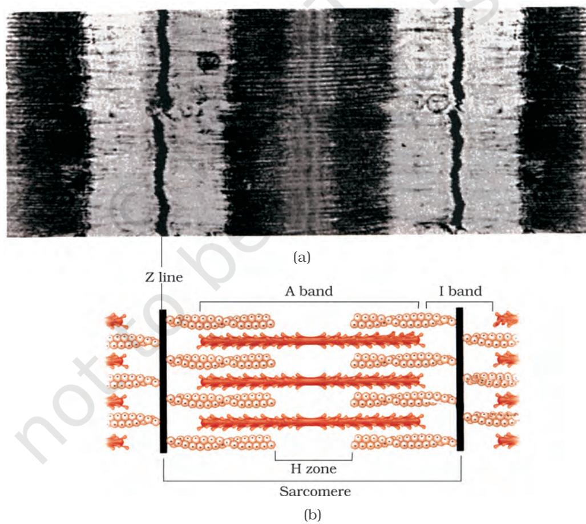
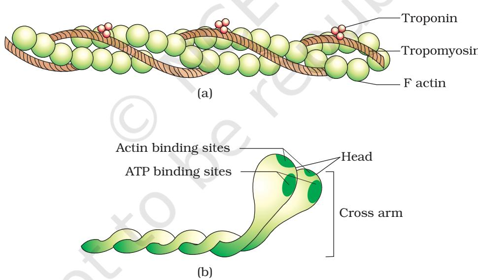
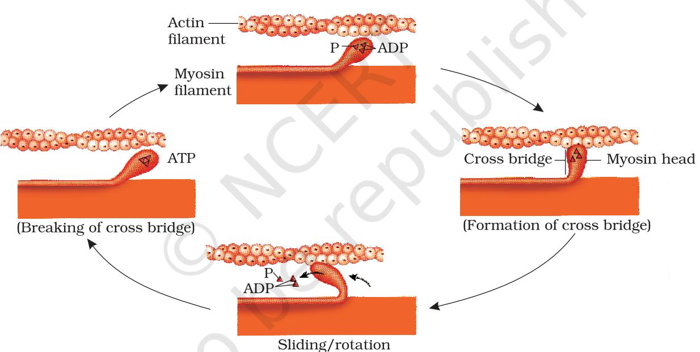
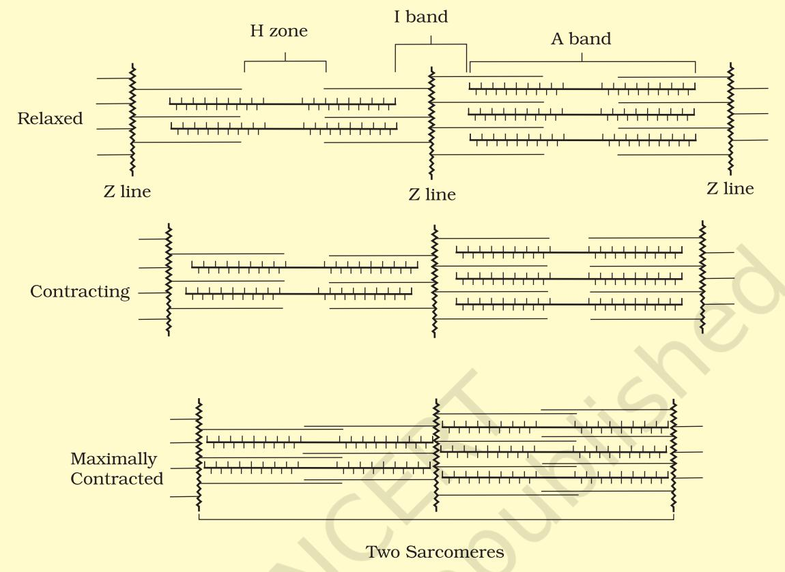
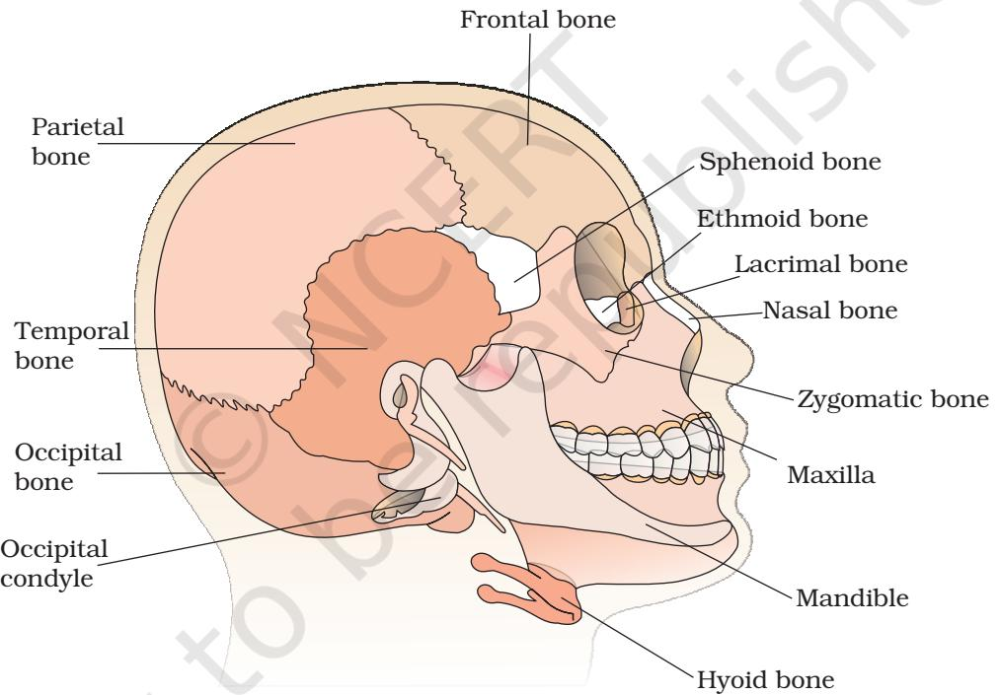
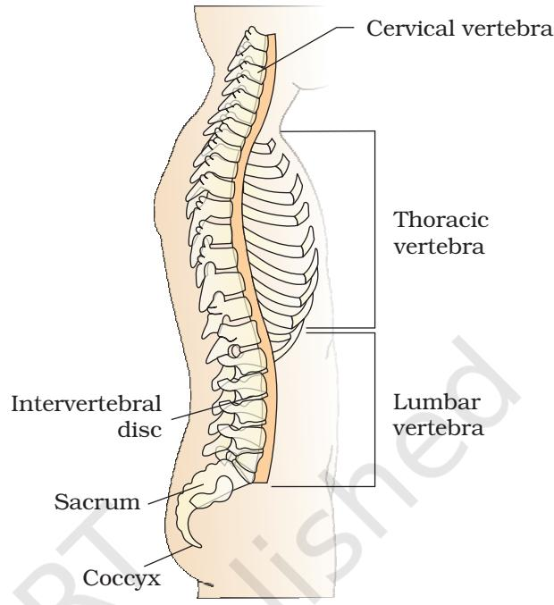
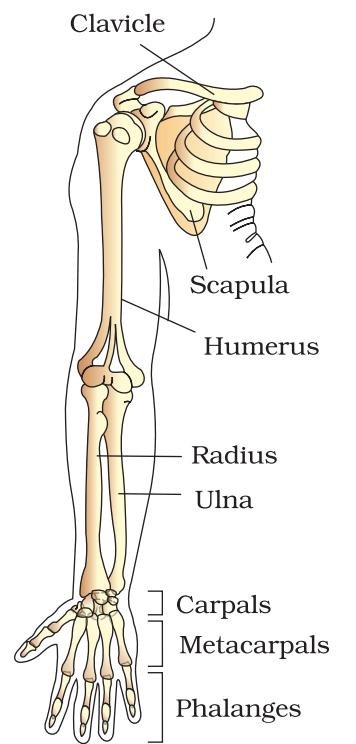
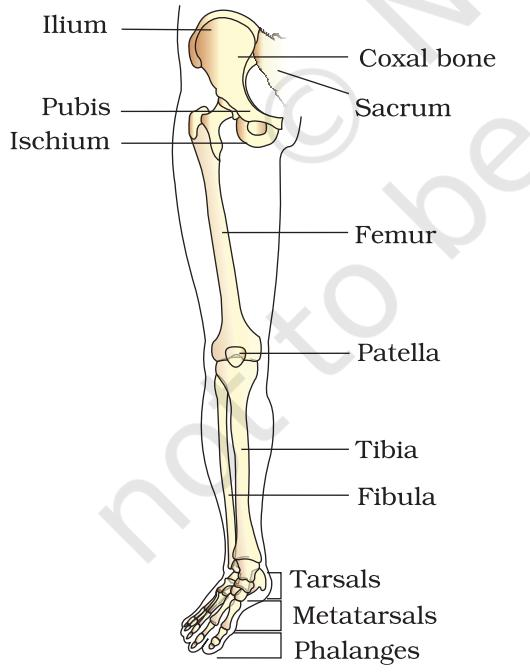

# LOCOMOTION AND MOVEMENT CHAPTER 17

LOCOMOTION AND MOVEMENT 217

- *17.1 Types of Movement*
- *17.2 Muscle*
- *17.3 Skeletal System*
- *17.4 Joints*
- *17.5 Disorders of Muscular and Skeletal System*

Movement is one of the significant features of living beings. Animals and plants exhibit a wide range of movements. Streaming of protoplasm in the unicellular organisms like *Amoeba* is a simple form of movement. Movement of cilia, flagella and tentacles are shown by many organisms. Human beings can move limbs, jaws, eyelids, tongue, etc. Some of the movements result in a change of place or location. Such voluntary movements are called locomotion. Walking, running, climbing, flying, swimming are all some forms of locomotory movements. Locomotory structures need not be different from those affecting other types of movements. For example, in *Paramoecium*, cilia helps in the movement of food through cytopharynx and in locomotion as well. *Hydra* can use its tentacles for capturing its prey and also use them for locomotion. We use limbs for changes in body postures and locomotion as well. The above observations suggest that movements and locomotion cannot be studied separately. The two may be linked by stating that all locomotions are movements but all movements are not locomotions.

Methods of locomotion performed by animals vary with their habitats and the demand of the situation. However, locomotion is generally for search of food, shelter, mate, suitable breeding grounds, favourable climatic conditions or to escape from enemies/predators.

# 17.1 TYPES OF MOVEMENT

Cells of the human body exhibit three main types of movements, namely, amoeboid, ciliary and muscular.

Some specialised cells in our body like macrophages and leucocytes in blood exhibit amoeboid movement. It is effected by pseudopodia formed by the streaming of protoplasm (as in *Amoeba*). Cytoskeletal elements like microfilaments are also involved in amoeboid movement.

Ciliary movement occurs in most of our internal tubular organs which are lined by ciliated epithelium. The coordinated movements of cilia in the trachea help us in removing dust particles and some of the foreign substances inhaled alongwith the atmospheric air. Passage of ova through the female reproductive tract is also facilitated by the ciliary movement.

Movement of our limbs, jaws, tongue, etc, require muscular movement. The contractile property of muscles are effectively used for locomotion and other movements by human beings and majority of multicellular organisms. Locomotion requires a perfect coordinated activity of muscular, skeletal and neural systems. In this chapter, you will learn about the types of muscles, their structure, mechanism of their contraction and important aspects of the skeletal system.

# 17.2 MUSCLE

You have studied in Chapter 8 that the cilia and flagella are the outgrowths of the cell membrane. Flagellar movement helps in the swimming of spermatozoa, maintenance of water current in the canal system of sponges and in locomotion of Protozoans like *Euglena.* Muscle is a specialised tissue of mesodermal origin. About 40-50 per cent of the body weight of a human adult is contributed by muscles. They have special properties like excitability, contractility, extensibility and elasticity. Muscles have been classified using different criteria, namely location, appearance and nature of regulation of their activities. Based on their location, three types of muscles are identified : (i) Skeletal (ii) Visceral and (iii) Cardiac.

Skeletal muscles are closely associated with the skeletal components of the body. They have a striped appearance under the microscope and hence are called striated muscles. As their activities are under the voluntary control of the nervous system, they are known as voluntary muscles too. They are primarily involved in locomotory actions and changes of body postures.

Visceral muscles are located in the inner walls of hollow visceral organs of the body like the alimentary canal, reproductive tract, etc. They do not exhibit any striation and are smooth in appearance. Hence, they are called smooth muscles (nonstriated muscle). Their activities are not under the voluntary control of the nervous system and are therefore known as involuntary muscles. They assist, for example, in the transportation of food through the digestive tract and gametes through the genital tract.

As the name suggests, Cardiac muscles are the muscles of heart. Many cardiac muscle cells assemble in a branching pattern to form a cardiac muscle. Based on appearance, cardiac muscles are striated. They are involuntary in nature as the nervous system does not control their activities directly.

Let us examine a skeletal muscle in detail to understand the structure and mechanism of contraction. Each organised skeletal muscle in our body is made of a number of muscle bundles or fascicles held together by a common collagenous connective tissue layer called fascia*.* Each muscle bundle contains a number of muscle fibres (Figure 17.1). Each

Figure 17.1 Diagrammatic cross sectional view of a muscle showing muscle bundles and muscle fibres

muscle fibre is lined by the plasma membrane called sarcolemma enclosing the sarcoplasm. Muscle fibre is a syncitium as the sarcoplasm contains many nuclei. The endoplasmic reticulum, i.e., sarcoplasmic reticulum of the muscle fibres is the store house of calcium ions. A characteristic feature of the muscle fibre is the presence of a large number of parallelly arranged filaments in the sarcoplasm called myofilaments or myofibrils. Each myofibril has alternate dark and light bands on it. A detailed study of the myofibril has established that the striated appearance is due to the distribution pattern of two important proteins – Actin and Myosin. The light bands contain actin and is called I-band or Isotropic band, whereas the dark band called 'A' or Anisotropic band contains

myosin. Both the proteins are arranged as rod-like structures, parallel to each other and also to the longitudinal axis of the myofibrils. Actin filaments are thinner as compared to the myosin filaments, hence are commonly called thin and thick filaments respectively. In the centre of each 'I' band is an elastic fibre called 'Z' line which bisects it. The thin filaments are firmly attached to the 'Z' line. The thick filaments in the 'A' band are also held together in the middle of this band by a thin fibrous membrane called 'M' line. The 'A' and 'I' bands are arranged alternately throughout the length of the myofibrils. The portion of the myofibril between two successive 'Z' lines is considered as the functional unit of contraction and is called a sarcomere (Figure 17.2). In a resting state, the edges of thin filaments on either side of the thick filaments partially overlap the free ends of the thick filaments leaving the central part of the thick filaments. This central part of thick filament, not overlapped by thin filaments is called the 'H' zone.

Figure 17.2 Diagrammatic representation of (a) anatomy of a muscle fibre showing a sarcomere (b) a sarcomere

# 17.2.1 Structure of Contractile Proteins

Each actin (thin) filament is made of two 'F' (filamentous) actins helically wound to each other. Each 'F' actin is a polymer of monomeric 'G' (Globular) actins. Two filaments of another protein, tropomyosin also run close to the 'F' actins throughout its length. A complex protein Troponin is distributed at regular intervals on the tropomyosin. In the resting state a subunit of troponin masks the active binding sites for myosin on the actin filaments (Figure 17.3a).

Each myosin (thick) filament is also a polymerised protein. Many monomeric proteins called Meromyosins (Figure 17.3b) constitute one thick filament. Each meromyosin has two important parts, a globular head with a short arm and a tail, the former being called the heavy meromyosin (HMM) and the latter, the light meromyosin (LMM). The HMM component, i.e.; the head and short arm projects outwards at regular distance and angle from each other from the surface of a polymerised myosin filament and is known as cross arm. The globular head is an active ATPase enzyme and has binding sites for ATP and active sites for actin.

Figure 17.3 (a) An actin (thin) filament (b) Myosin monomer (Meromyosin)

#### 17.2.2 Mechanism of Muscle Contraction

Mechanism of muscle contraction is best explained by the sliding filament theory which states that contraction of a muscle fibre takes place by the sliding of the thin filaments over the thick filaments.

Muscle contraction is initiated by a signal sent by the central nervous system (CNS) via a motor neuron. A motor neuron alongwith the muscle fibres connected to it constitute a motor unit. The junction between a motor neuron and the sarcolemma of the muscle fibre is called the neuromuscular junction or motor-end plate. A neural signal reaching this junction releases a neurotransmitter (Acetyl choline) which generates an action potential in the sarcolemma. This spreads through the muscle fibre and causes the release of calcium ions into the sarcoplasm. Increase in Ca++ level leads to the binding of calcium with a subunit of troponin on actin filaments and thereby remove the masking of active sites for myosin. Utilising the energy from ATP hydrolysis, the myosin head now binds to the exposed active sites on actin to form a cross bridge (Figure 17.4).

This pulls the attached actin filaments towards the centre of 'A' band. The 'Z' line attached to these actins are also pulled inwards thereby causing a shortening of the sarcomere, i.e., contraction. It is clear from the above steps, that during shortening of the muscle, i.e., contraction, the 'I' bands get reduced, whereas the 'A' bands retain the length (Figure 17.5). The myosin, releasing the ADP and P1 goes back to its relaxed state. A new ATP binds and the cross-bridge is broken (Figure 17.4). The ATP is again hydrolysed by the myosin head and the cycle of cross bridge formation

Figure 17.5 Sliding-filament theory of muscle contraction (movement of the thin filaments and the relative size of the I band and H zones)

and breakage is repeated causing further sliding. The process continues till the Ca++ ions are pumped back to the sarcoplasmic cisternae resulting in the masking of actin filaments. This causes the return of 'Z' lines back to their original position, i.e., relaxation. The reaction time of the fibres can vary in different muscles. Repeated activation of the muscles can lead to the accumulation of lactic acid due to anaerobic breakdown of glycogen in them, causing fatigue. Muscle contains a red coloured oxygen storing pigment called myoglobin. Myoglobin content is high in some of the muscles which gives a reddish appearance. Such muscles are called the Red fibres. These muscles also contain plenty of mitochondria which can utilise the large amount of oxygen stored in them for ATP production. These muscles, therefore, can also be called aerobic muscles. On the other hand, some of the muscles possess very less quantity of myoglobin and therefore, appear pale or whitish. These are the White fibres. Number of mitochondria are also few in them, but the amount of sarcoplasmic reticulum is high. They depend on anaerobic process for energy.

# 17.3 SKELETAL SYSTEM

Skeletal system consists of a framework of bones and a few cartilages. This system has a significant role in movement shown by the body. Imagine chewing food without jaw bones and walking around without the limb bones. Bone and cartilage are specialised connective tissues. The former has a very hard matrix due to calcium salts in it and the latter has slightly pliable matrix due to chondroitin salts. In human beings, this system is made up of 206 bones and a few cartilages. It is grouped into two principal divisions – the axial and the appendicular skeleton.

Axial skeleton comprises 80 bones distributed along the main axis of the body. The skull, vertebral column, sternum and ribs constitute axial skeleton. The skull (Figure 17.6) is composed of two sets of bones –

Figure 17.6 Diagrammatic view of human skull

cranial and facial, that totals to 22 bones. Cranial bones are 8 in number. They form the hard protective outer covering, cranium for the brain. The facial region is made up of 14 skeletal elements which form the front part of the skull. A single U-shaped bone called hyoid is present at the base of the buccal cavity and it is also included in the skull. Each middle ear contains three tiny bones – Malleus, Incus and Stapes, collectively called Ear Ossicles. The skull region articulates with the superior region of the vertebral column with the help of two occipital condyles (dicondylic skull).

Our vertebral column (Figure 17.7) is formed by 26 serially arranged units called vertebrae and is dorsally placed. It extends from the base of the skull and constitutes the main framework of the trunk. Each vertebra has a central hollow portion (neural canal) through which the spinal cord passes. First vertebra is the atlas and it articulates with the occipital condyles. The vertebral column is differentiated into cervical (7), thoracic (12), lumbar (5), sacral (1-fused) and coccygeal (1-fused) regions starting from the skull. The number of cervical vertebrae are seven in almost all mammals including human beings. The vertebral column protects the spinal cord, supports the head and serves as the point of attachment for the ribs and musculature of the back. Sternum is a flat bone on the ventral midline of thorax.

There are 12 pairs of ribs. Each rib is a thin flat bone connected dorsally to the vertebral column and ventrally to the sternum. It has two articulation surfaces on its dorsal end and is hence called bicephalic. First seven pairs of ribs are called true ribs. Dorsally, they are attached to the thoracic vertebrae and ventrally connected to the sternum with the help of hyaline cartilage. The 8th, 9th and 10th pairs of ribs do not articulate directly with the sternum but join the seventh rib with the help of hyaline cartilage. These are called vertebrochondral (false) ribs. Last 2 pairs (11th and 12th) of ribs are not connected ventrally and are therefore, called floating ribs. Thoracic vertebrae, ribs and sternum together form the rib cage (Figure 17.8).

The bones of the limbs alongwith their girdles constitute the appendicular skeleton. Each limb is made of 30 bones. The bones of the hand (fore limb) are

Figure 17.7 Vertebral column (right lateral view)

Figure 17.8 Ribs and rib cage

Figure 17.9 Right pectoral girdle and upper arm. (frontal view)

Figure 17.10 Right pelvic girdle and lower limb bones (frontal view)

humerus, radius and ulna, carpals (wrist bones – 8 in number), metacarpals (palm bones – 5 in number) and phalanges (digits – 14 in number) (Figure 17.9). Femur (thigh bone – the longest bone), tibia and fibula, tarsals (ankle bones – 7 in number), metatarsals (5 in number) and phalanges (digits – 14 in number) are the bones of the legs (hind limb) (Figure 17.10). A cup shaped bone called patella cover the knee ventrally (knee cap).

Pectoral and Pelvic girdle bones help in the articulation of the upper and the lower limbs respectively with the axial skeleton. Each girdle is formed of two halves. Each half of pectoral girdle consists of a clavicle and a scapula (Figure 17.9). Scapula is a large triangular flat bone situated in the dorsal part of the thorax between the second and the seventh ribs. The dorsal, flat, triangular body of scapula has a slightly elevated ridge called the spine which projects as a flat, expanded process called the acromion. The clavicle articulates with this. Below the acromion is a depression called the glenoid cavity which articulates with the head of the humerus to form the shoulder joint. Each clavicle is a long slender bone with two curvatures. This bone is commonly called the collar bone.

Pelvic girdle consists of two coxal bones (Figure 17.10). Each coxal bone is formed by the fusion of three bones – ilium, ischium and pubis. At the point of fusion of the above bones is a cavity called acetabulum to which the thigh bone articulates. The two halves of the pelvic girdle meet ventrally to form the pubic symphysis containing fibrous cartilage.

# 17.4 JOINTS

Joints are essential for all types of movements involving the bony parts of the body. Locomotory movements are no exception to

this. Joints are points of contact between bones, or between bones and cartilages. Force generated by the muscles is used to carry out movement through joints, where the joint acts as a fulcrum. The movability at these joints vary depending on different factors. Joints have been classified into three major structural forms, namely, fibrous, cartilaginous and synovial.

Fibrous joints do not allow any movement. This type of joint is shown by the flat skull bones which fuse end-to-end with the help of dense fibrous connective tissues in the form of sutures, to form the cranium.

In cartilaginous joints, the bones involved are joined together with the help of cartilages. The joint between the adjacent vertebrae in the vertebral column is of this pattern and it permits limited movements.

Synovial joints are characterised by the presence of a fluid filled synovial cavity between the articulating surfaces of the two bones. Such an arragement allows considerable movement. These joints help in locomotion and many other movements. Ball and socket joint (between humerus and pectoral girdle), hinge joint (knee joint), pivot joint (between atlas and axis), gliding joint (between the carpals) and saddle joint (between carpal and metacarpal of thumb) are some examples.

# 17.5 DISORDERS OF MUSCULAR AND SKELETAL SYSTEM

Myasthenia gravis: Auto immune disorder affecting neuromuscular junction leading to fatigue, weakening and paralysis of skeletal muscle.

Muscular dystrophy: Progressive degeneration of skeletal muscle mostly due to genetic disorder.

Tetany: Rapid spasms (wild contractions) in muscle due to low Ca++ in body fluid.

Arthritis: Inflammation of joints.

Osteoporosis: Age-related disorder characterised by decreased bone mass and increased chances of fractures. Decreased levels of estrogen is a common cause.

Gout: Inflammation of joints due to accumulation of uric acid crystals.

# SUMMARY

Movement is an essential feature of all living beings. Protoplasmic streaming, ciliary movements, movements of fins, limbs, wings, etc., are some forms exhibited by animals. A voluntary movement which causes the animal to change its place, is

called locomotion. Animals move generally in search of food, shelter, mate, breeding ground, better climate or to protect themselves.

The cells of the human body exhibit amoeboid, ciliary and muscular movements. Locomotion and many other movements require coordinated muscular activities. Three types of muscles are present in our body. Skeletal muscles are attached to skeletal elements. They appear striated and are voluntary in nature. Visceral muscles, present in the inner walls of visceral organs are nonstriated and involuntary. Cardiac muscles are the muscles of the heart. They are striated, branched and involuntary. Muscles possess excitability, contractility, extensibility and elasticity.

Muscle fibre is the anatomical unit of muscle. Each muscle fibre has many parallelly arranged myofibrils. Each myofibril contains many serially arranged units called sarcomere which are the functional units. Each sarcomere has a central 'A' band made of thick myosin filaments, and two half 'I' bands made of thin actin filaments on either side of it marked by 'Z' lines. Actin and myosin are polymerised proteins with contractility. The active sites for myosin on resting actin filament are masked by a protein-troponin. Myosin head contains ATPase and has ATP binding sites and active sites for actin. A motor neuron carries signal to the muscle fibre which generates an action potential in it. This causes the release of Ca++ from sarcoplasmic reticulum. Ca++ activates actin which binds to the myosin head to form a cross bridge. These cross bridges pull the actin filaments causing them to slide over the myosin filaments and thereby causing contraction. Ca++ are then returned to sarcoplasmic reticulum which inactivate the actin. Cross bridges are broken and the muscles relax.

Repeated stimulation of muscles leads to fatigue. Muscles are classified as Red and White fibres based primarily on the amount of red coloured myoglobin pigment in them.

Bones and cartilages constitute our skeletal system. The skeletal system is divisible into axial and appendicular. Skull, vertebral column, ribs and sternum constitute the axial skeleton. Limb bones and girdles form the appendicular skeleton. Three types of joints are formed between bones or between bone and cartilage – fibrous, cartilaginous and synovial. Synovial joints allow considerable movements and therefore, play a significant role in locomotion.

# EXERCISES

- 1. Draw the diagram of a sarcomere of skeletal muscle showing different regions.
- 2. Define sliding filament theory of muscle contraction.
- 3. Describe the important steps in muscle contraction.
- (a) Actin is present in thin filament
- (b) H-zone of striated muscle fibre represents both thick and thin filaments.
- (c) Human skeleton has 206 bones.
- (d) There are 11 pairs of ribs in man.
- (e) Sternum is present on the ventral side of the body.
- 5. Write the difference between :
	- (a) Actin and Myosin
	- (b) Red and White muscles
	- (c) Pectoral and Pelvic girdle
- 6. Match Column I with Column II :

#### Column I Column II

- (a) Smooth muscle (i) Myoglobin
- (b) Tropomyosin (ii) Thin filament
- (c) Red muscle (iii) Sutures
- (d) Skull (iv) Involuntary
	-
- 7. What are the different types of movements exhibited by the cells of human body?
- 8. How do you distinguish between a skeletal muscle and a cardiac muscle?
- 9. Name the type of joint between the following:-
	- (a) atlas/axis
	- (b) carpal/metacarpal of thumb
	- (c) between phalanges
	- (d) femur/acetabulum
	- (e) between cranial bones
	- (f) between pubic bones in the pelvic girdle

#### 10. Fill in the blank spaces:

- (a) All mammals (except a few) have __________ cervical vertebra.
- (b) The number of phalanges in each limb of human is __________
- (c) Thin filament of myofibril contains 2 'F' actins and two other proteins namely __________ and __________.
- (d) In a muscle fibre Ca++ is stored in __________
- (e) __________ and __________ pairs of ribs are called floating ribs.
- (f) The human cranium is made of __________ bones.

