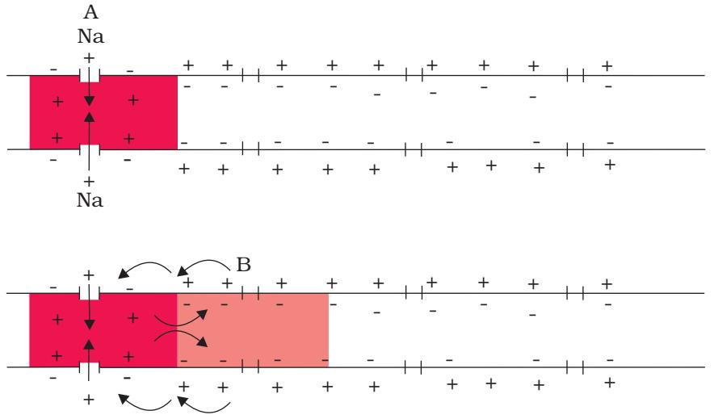
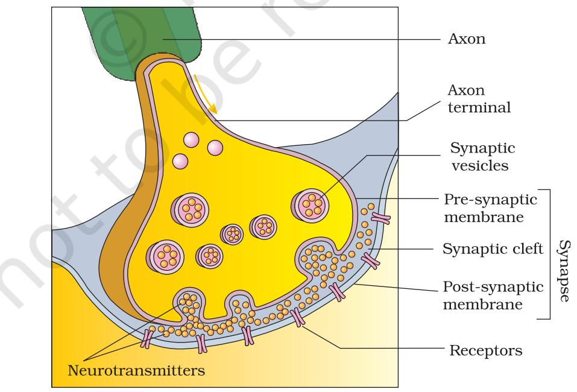
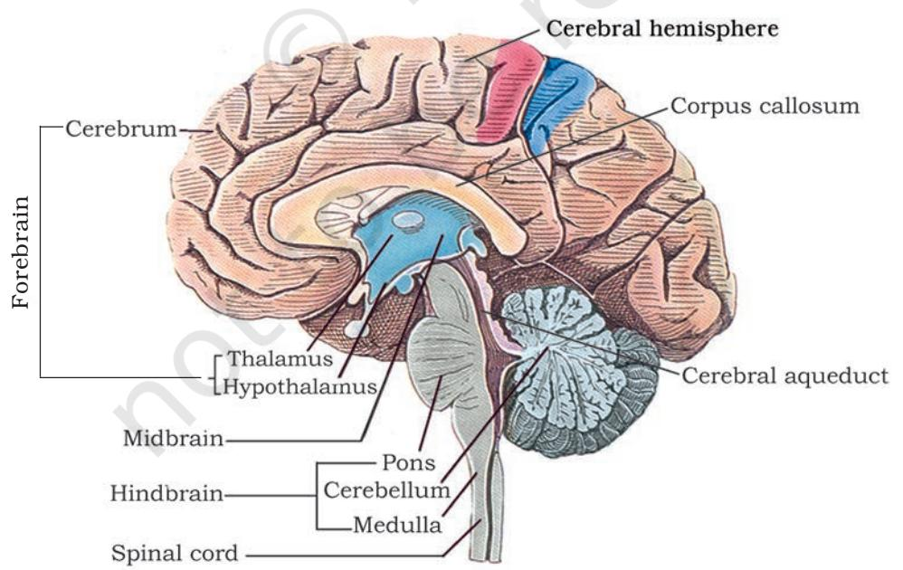

# NEURAL CONTROL AND COORDINATION CHAPTER 18

230 BIOLOGY

- *18.1 Neural System*
- *18.2 Human Neural System*
- *18.3 Neuron as Structural and Functional Unit of Neural System*
- *18.4 Central Neural System*

As you know, the functions of the organs/organ systems in our body must be coordinated to maintain homeostasis. Coordination is the process through which two or more organs interact and complement the functions of one another. For example, when we do physical exercises, the energy demand is increased for maintaining an increased muscular activity. The supply of oxygen is also increased. The increased supply of oxygen necessitates an increase in the rate of respiration, heart beat and increased blood flow via blood vessels. When physical exercise is stopped, the activities of nerves, lungs, heart and kidney gradually return to their normal conditions. Thus, the functions of muscles, lungs, heart, blood vessels, kidney and other organs are coordinated while performing physical exercises. In our body the neural system and the endocrine system jointly coordinate and integrate all the activities of the organs so that they function in a synchronised fashion.

The neural system provides an organised network of point-to-point connections for a quick coordination. The endocrine system provides chemical integration through hormones. In this chapter, you will learn about the neural system of human, mechanisms of neural coordination like transmission of nerve impulse, impulse conduction across a synapse.

# 18.1 NEURAL SYSTEM

The neural system of all animals is composed of highly specialised cells called neurons which can detect, receive and transmit different kinds of stimuli.

The neural organisation is very simple in lower invertebrates. For example, in *Hydra* it is composed of a network of neurons. The neural system is better organised in insects, where a brain is present along with a number of ganglia and neural tissues. The vertebrates have a more developed neural system.

# 18.2 HUMAN NEURAL SYSTEM

The human neural system is divided into two parts :

- (i) the central neural system (CNS)
- (ii) the peripheral neural system (PNS)

The CNS includes the brain and the spinal cord and is the site of information processing and control. The PNS comprises of all the nerves of the body associated with the CNS (brain and spinal cord). The nerve fibres of the PNS are of two types :

- (a) afferent fibres
#### (b) efferent fibres

The afferent nerve fibres transmit impulses from tissues/organs to the CNS and the efferent fibres transmit regulatory impulses from the CNS to the concerned peripheral tissues/organs.

The PNS is divided into two divisions called somatic neural system and autonomic neural system. The somatic neural system relays impulses from the CNS to skeletal muscles while the autonomic neural system transmits impulses from the CNS to the involuntary organs and smooth muscles of the body. The autonomic neural system is further classified into sympathetic neural system and parasympathetic neural system.

 Visceral nervous system is the part of the peripheral nervous system that comprises the whole complex of nerves, fibres, ganglia, and plexuses by which impulses travel from the central nervous system to the viscera and from the viscera to the central nervous system.

# 18.3 NEURON AS STRUCTURAL AND FUNCTIONAL UNIT OF NEURAL SYSTEM

A neuron is a microscopic structure composed of three major parts, namely, cell body, dendrites and axon (Figure 18.1). The cell body contains cytoplasm with typical cell organelles and certain granular bodies called Nissl's granules. Short fibres which branch repeatedly and project out of the cell body also

| Figure 18.1 Structure of a neuron |
| --- |

contain Nissl's granules and are called dendrites. These fibres transmit impulses towards the cell body. The axon is a long fibre, the distal end of which is branched. Each branch terminates as a bulb-like structure called synaptic knob which possess synaptic vesicles containing chemicals called neurotransmitters. The axons transmit nerve impulses away from the cell body to a synapse or to a neuro-muscular junction. Based on the number of axon and dendrites, the neurons are divided into three types, i.e., multipolar (with one axon and two or more dendrites; found in the cerebral cortex), bipolar (with one axon and one dendrite, found in the retina of eye) and unipolar (cell body with one axon only; found usually in the embryonic stage). There are two types of axons, namely, myelinated and nonmyelinated. The myelinated nerve fibres are enveloped with Schwann cells, which form a myelin sheath around the axon. The gaps between two adjacent myelin sheaths are called nodes of Ranvier. Myelinated nerve fibres are found in spinal and cranial nerves. Unmyelinated nerve fibre is enclosed by a Schwann cell that does not form a myelin sheath around the axon, and is commonly found in autonomous and the somatic neural systems.

# 18.3.1 Generation and Conduction of Nerve Impulse

Neurons are excitable cells because their membranes are in a polarised state. *Do you know why the membrane of a neuron is polarised?* Different types of ion channels are present on the neural membrane. These ion channels are selectively permeable to different ions. When a neuron is not conducting any impulse, i.e., resting, the axonal membrane is comparatively more permeable to potassium ions (K+ ) and nearly impermeable to sodium ions (Na+). Similarly, the membrane is impermeable to negatively charged proteins present in the axoplasm. Consequently, the axoplasm inside the axon contains high concentration of K+ and negatively charged proteins and low concentration of Na+. In contrast, the fluid outside the axon contains a low concentration of K+ , a high concentration of Na+ and thus form a concentration gradient. These ionic gradients across the resting membrane are maintained by the active transport of ions by the sodium-potassium pump which transports 3 Na+ outwards for 2 K+ into the cell. As a result, the outer surface of the axonal membrane possesses a positive charge while its inner surface

Figure 18.2 Diagrammatic representation of impulse conduction through an axon (at points A and B)

becomes negatively charged and therefore is polarised. The electrical potential difference across the resting plasma membrane is called as the resting potential.

You might be curious to know about the mechanisms of generation of nerve impulse and its conduction along an axon. When a stimulus is applied at a site (Figure 18.2 e.g., point A) on the polarised membrane, the membrane at the site A becomes freely permeable to Na+. This leads to a rapid influx of Na+ followed by the reversal of the polarity at that site, i.e., the outer surface of the membrane becomes negatively charged and the inner side becomes positively charged. The polarity of the membrane at the site A is thus reversed and hence depolarised. The electrical potential difference across the plasma membrane at the site A is called the action potential, which is in fact termed as a nerve impulse. At sites immediately ahead, the axon (e.g., site B) membrane has a positive charge on the outer surface and a negative charge on its inner surface. As a result, a current flows on the inner surface from site A to site B. On the outer surface current flows from site B to site A (Figure 18.2) to complete the circuit of current flow. Hence, the polarity at the site is reversed, and an action potential is generated at site B. Thus, the impulse (action potential) generated at site A arrives at site B. The sequence is repeated along the length of the axon and consequently the impulse is conducted. The rise in the stimulus-induced permeability to Na+ is extremely shortlived. It is quickly followed by a rise in permeability to K+. Within a fraction of a second, K+ diffuses outside the membrane and restores the resting potential of the membrane at the site of excitation and the fibre becomes once more responsive to further stimulation.

# 18.3.2 Transmission of Impulses

A nerve impulse is transmitted from one neuron to another through junctions called synapses. A synapse is formed by the membranes of a pre-synaptic neuron and a post-synaptic neuron, which may or may not be separated by a gap called synaptic cleft. There are two types of synapses, namely, electrical synapses and chemical synapses. At electrical synapses, the membranes of pre- and post-synaptic neurons are in very close proximity. Electrical current can flow directly from one neuron into the other across these synapses. Transmission of an impulse across electrical synapses is very similar to impulse conduction along a single axon. Impulse transmission across an electrical synapse is always faster than that across a chemical synapse. Electrical synapses are rare in our system.

At a chemical synapse, the membranes of the pre- and post-synaptic neurons are separated by a fluid-filled space called synaptic cleft (Figure 18.3). *Do you know how the pre-synaptic neuron transmits an impulse (action potential) across the synaptic cleft to the post-synaptic neuron*? Chemicals called neurotransmitters are involved in the transmission of impulses at these synapses. The axon terminals contain vesicles filled with these neurotransmitters. When an impulse (action potential) arrives at the axon terminal, it stimulates the movement of the synaptic vesicles towards the membrane where they fuse with the plasma

Figure 18.3 Diagram showing axon terminal and synapse

membrane and release their neurotransmitters in the synaptic cleft. The released neurotransmitters bind to their specific receptors, present on the post-synaptic membrane. This binding opens ion channels allowing the entry of ions which can generate a new potential in the post-synaptic neuron. The new potential developed may be either excitatory or inhibitory.

# 18.4 CENTRAL NEURAL SYSTEM

The brain is the central information processing organ of our body, and acts as the 'command and control system'. It controls the voluntary movements, balance of the body, functioning of vital involuntary organs (e.g., lungs, heart, kidneys, etc.), thermoregulation, hunger and thirst, circadian (24-hour) rhythms of our body, activities of several endocrine glands and human behaviour. It is also the site for processing of vision, hearing, speech, memory, intelligence, emotions and thoughts.

The human brain is well protected by the skull. Inside the skull, the brain is covered by cranial meninges consisting of an outer layer called dura mater, a very thin middle layer called arachnoid and an inner layer (which is in contact with the brain tissue) called pia mater. The brain can be divided into three major parts: (i) forebrain, (ii) midbrain, and (iii) hindbrain (Figure 18.4).

Figure 18.4 Diagram showing sagital section of the human brain

### 18.4.1 Forebrain

The forebrain consists of cerebrum, thalamus and hypothalamus (Figure 18.4). Cerebrum forms the major part of the human brain. A deep cleft divides the cerebrum longitudinally into two halves, which are termed as the left and right cerebral hemispheres. The hemispheres are connected by a tract of nerve fibres called corpus callosum. The layer of cells which covers the cerebral hemisphere is called cerebral cortex and is thrown into prominent folds. The cerebral cortex is referred to as the grey matter due to its greyish appearance. The neuron cell bodies are concentrated here giving the colour. The cerebral cortex contains motor areas, sensory areas and large regions that are neither clearly sensory nor motor in function. These regions called as the association areas are responsible for complex functions like intersensory associations, memory and communication. Fibres of the tracts are covered with the myelin sheath, which constitute the inner part of cerebral hemisphere. They give an opaque white appearance to the layer and, hence, is called the white matter. The cerebrum wraps around a structure called thalamus, which is a major coordinating centre for sensory and motor signaling. Another very important part of the brain called hypothalamus lies at the base of the thalamus. The hypothalamus contains a number of centres which control body temperature, urge for eating and drinking. It also contains several groups of neurosecretory cells, which secrete hormones called hypothalamic hormones. The inner parts of cerebral hemispheres and a group of associated deep structures like amygdala, hippocampus, etc., form a complex structure called the limbic lobe or limbic system. Along with the hypothalamus, it is involved in the regulation of sexual behaviour, expression of emotional reactions (e.g., excitement, pleasure, rage and fear), and motivation.

### 18.4.2 Midbrain

The midbrain is located between the thalamus/hypothalamus of the forebrain and pons of the hindbrain. A canal called the cerebral aqueduct passess through the midbrain. The dorsal portion of the midbrain consists mainly of four round swellings (lobes) called corpora quadrigemina.

#### 18.4.3 Hindbrain

The hindbrain comprises pons, cerebellum and medulla (also called the medulla oblongata). Pons consists of fibre tracts that interconnect different regions of the brain. Cerebellum has very convoluted surface in order to provide the additional space for many more neurons. The medulla of the brain is connected to the spinal cord. The medulla contains centres which control respiration, cardiovascular reflexes and gastric secretions.

Three major regions make up the brain stem; mid brain, pons and medulla oblongata. Brain stem forms the connections between the brain and spinal cord.

# SUMMARY

The neural system coordinates and integrates functions as well as metabolic and homeostatic activities of all the organs. Neurons, the functional units of neural system are excitable cells due to a differential concentration gradient of ions across the membrane. The electrical potential difference across the resting neural membrane is called the 'resting potential'. The nerve impulse is conducted along the axon membrane in the form of a wave of depolarisation and repolarisation. A synapse is formed by the membranes of a pre-synaptic neuron and a post-synaptic neuron which may or may not be separated by a gap called synaptic cleft. Chemicals involved in the transmission of impulses at chemical synapses are called neurotransmitters.

Human neural system consists of two parts : (i) central neural system (CNS) and (ii) the peripheral neural system. The CNS consists of the brain and spiral cord. The brain can be divided into three major parts : (i) forebrain, (ii) midbrain and (iii) hindbrain. The forebrain consists of cerebrum, thalamus and hypothalamus. The cerebrum is longitudinally divided into two halves that are connected by the corpus callosum. A very important part of the forebrain called hypothalamus controls the body temperature, eating and drinking. Inner parts of cerebral hemispheres and a group of associated deep structures form a complex structure called limbic system which is concerned with olfaction, autonomic responses, regulation of sexual behaviour, expression of emotional reactions, and motivation. The midbrain receives and integrates visual, tactile and auditory inputs. The hindbrain comprises pons, cerebellum and medulla. The cerebellum integrates information received from the semicircular canals of the ear and the auditory system. The medulla contains centres, which control respiration, cardiovascular reflexes, and gastric secretions. Pons consist of fibre tracts that interconnect different regions of the brain.

# EXERCISES

- 1. Briefly describe the structure of the Brain
- 2. Compare the following:
	- (a) Central neural system (CNS) and Peripheral neural system (PNS)
	- (b) Resting potential and action potential
- 3. Explain the following processes:
	- (a) Polarisation of the membrane of a nerve fibre
	- (b) Depolarisation of the membrane of a nerve fibre
	- (c) Transmission of a nerve impulse across a chemical synapse
- 4. Draw labelled diagrams of the following: (a) Neuron (b) Brain
- 5. Write short notes on the following: (a) Neural coordination (b) Forebrain (c) Midbrain (d) Hindbrain (e) Synapse
- 6. Give a brief account of Mechanism of synaptic transmission.
- 7. Explain the role of Na+ in the generation of action potential.
- 8. Differentiate between:
	- (a) Myelinated and non-myelinated axons
	- (b) Dendrites and axons
	- (c) Thalamus and Hypothalamus
	- (d) Cerebrum and Cerebellum
- 9. Answer the following:
	- (a) Which part of the human brain is the most developed?
	- (b) Which part of our central neural system acts as a master clock?
- 10. Distinguish between:
	- (a) afferent neurons and efferent neurons
	- (b) impulse conduction in a myelinated nerve fibre and unmyelinated nerve fibre

(f) cranial nerves and spinal nerves.

