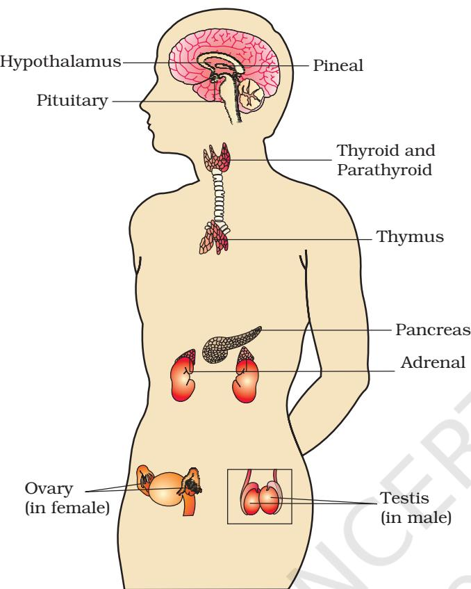
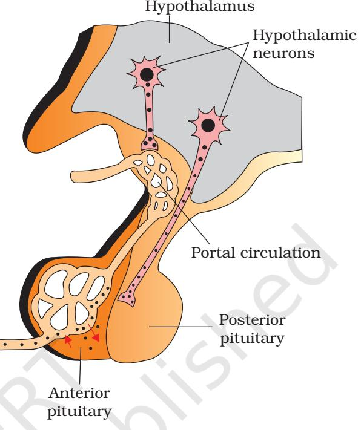
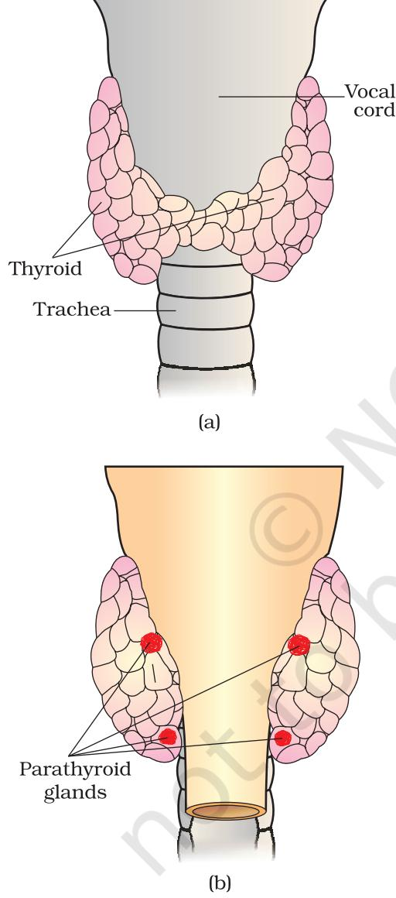
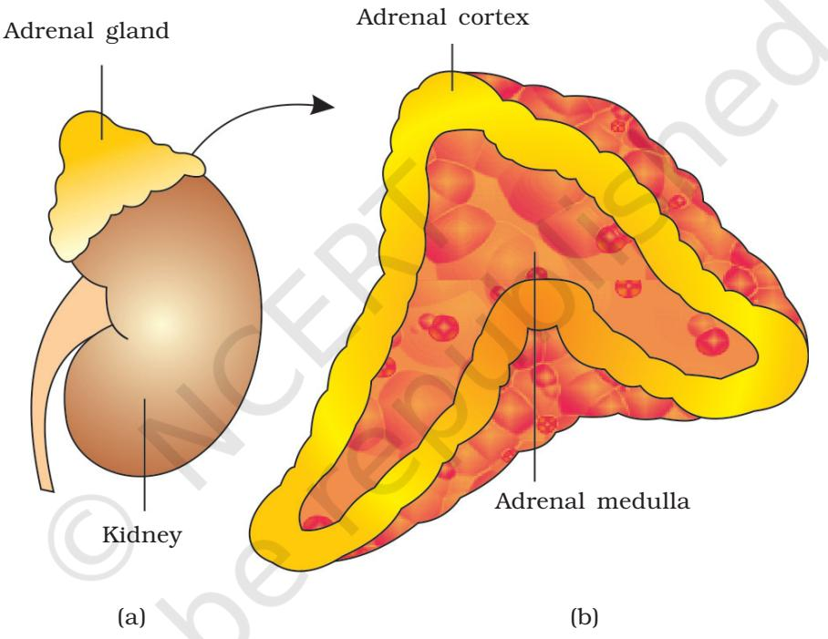
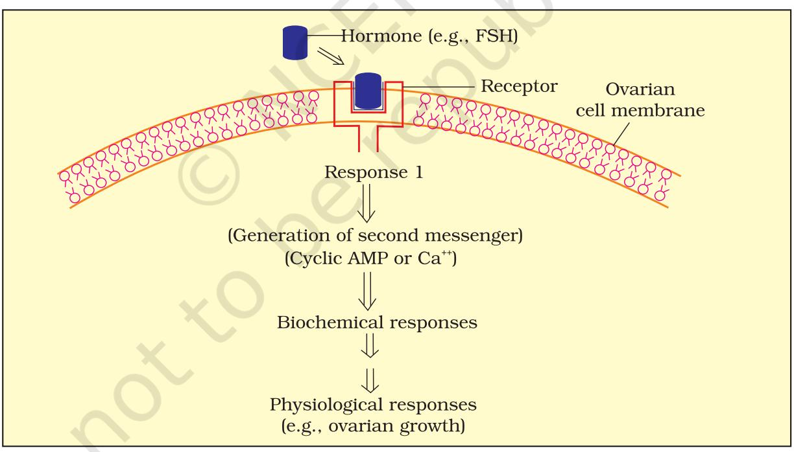
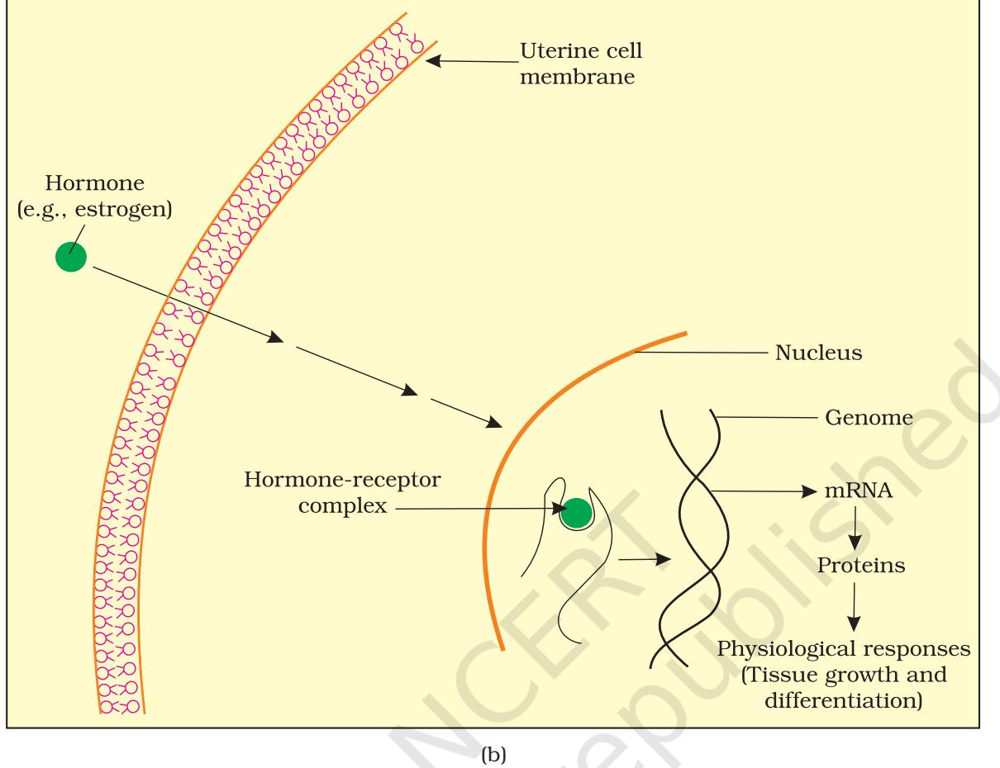

# CHEMICAL COORDINATION AND INTEGRATION CHAPTER 19

CHEMICAL COORDINATION AND INTEGRATION 239

- *19.1 Endocrine Glands and Hormones*
- *19.2 Human Endocrine System*
- *19.3 Hormones of Heart, Kidney and Gastrointestinal Tract*
- *19.4 Mechanism of Hormone Action*

You have already learnt that the neural system provides a point-to-point rapid coordination among organs. The neural coordination is fast but short-lived. As the nerve fibres do not innervate all cells of the body and the cellular functions need to be continuously regulated; a special kind of coordination and integration has to be provided. This function is carried out by hormones. The neural system and the endocrine system jointly coordinate and regulate the physiological functions in the body.

# 19.1 ENDOCRINE GLANDS AND HORMONES

Endocrine glands lack ducts and are hence, called ductless glands. Their secretions are called hormones. The classical definition of hormone as a chemical produced by endocrine glands and released into the blood and transported to a distantly located target organ has current scientific definition as follows: Hormones are non-nutrient chemicals which act as intercellular messengers and are produced in trace amounts. The new definition covers a number of new molecules in addition to the hormones secreted by the organised endocrine glands. Invertebrates possess very simple endocrine systems with few hormones whereas a large number of chemicals act as hormones and provide coordination in the vertebrates. The human endocrine system is described here.

# 19.2 HUMAN ENDOCRINE SYSTEM

The endocrine glands and hormone producing diffused tissues/cells located in different parts of our body constitute the endocrine system. Pituitary, pineal, thyroid, adrenal, pancreas, parathyroid, thymus and gonads (testis in males and ovary in females) are the organised endocrine bodies in our body (Figure 19.1). In addition to these, some other organs, e.g., gastrointestinal tract, liver, kidney, heart also produce hormones. A brief account of the structure and functions of all major endocrine glands and hypothalamus of the human body is given in the following sections.

#### 19.2.1 The Hypothalamus

As you know, the hypothalamus is the basal part of diencephalon, forebrain (Figure 19.1) and it regulates a wide spectrum of body functions. It contains several groups of neurosecretory cells called nuclei which produce hormones. These hormones regulate the synthesis and secretion of pituitary hormones. However, the hormones produced by hypothalamus are of two types, the

releasing hormones (which stimulate secretion of pituitary hormones) and the inhibiting hormones (which inhibit secretions of pituitary hormones). For example a hypothalamic hormone called Gonadotrophin releasing hormone (GnRH) stimulates the pituitary synthesis and release of gonadotrophins. On the other hand, somatostatin from the hypothalamus inhibits the release of growth hormone from the pituitary. These hormones originating in the hypothalamic neurons, pass through axons and are released from their nerve endings. These hormones reach the pituitary gland through a portal circulatory system and regulate the functions of the anterior pituitary. The posterior pituitary is under the direct neural regulation of the hypothalamus (Figure 19.2).

### 19.2.2 The Pituitary Gland

The pituitary gland is located in a bony cavity called sella tursica and is attached to hypothalamus by a stalk (Figure 19.2). It is divided anatomically into an adenohypophysis and a neurohypophysis. Adenohypophysis consists of two portions, pars distalis and pars intermedia. The pars distalis region of pituitary, commonly called anterior pituitary, produces growth hormone (GH), prolactin (PRL), thyroid stimulating hormone (TSH), adrenocorticotrophic hormone (ACTH), luteinizing hormone (LH) and follicle stimulating hormone (FSH). Pars intermedia secretes only one hormone called melanocyte stimulating hormone (MSH). However, in humans, the pars intermedia is almost merged with pars distalis. Neurohypophysis (pars nervosa) also known as posterior pituitary, stores and releases two hormones called oxytocin and vasopressin, which are actually synthesised by

Figure 19.2 Diagrammatic representation of pituitary and its relationship with hypothalamus

the hypothalamus and are transported axonally to neurohypophysis.

Over-secretion of GH stimulates abnormal growth of the body leading to gigantism and low secretion of GH results in stunted growth resulting in pituitary dwarfism. Excess secretion of growth hormone in adults especially in middle age can result in severe disfigurement (especially of the face) called Acromegaly, which may lead to serious complications, and premature death if unchecked. The disease is hard to diagnose in the early stages and often goes undetected for many years, until changes in external features become noticeable. Prolactin regulates the growth of the mammary glands and formation of milk in them. TSH stimulates the synthesis and secretion of thyroid hormones from the thyroid gland. ACTH stimulates the synthesis and secretion of steroid hormones called glucocorticoids from the adrenal cortex. LH and FSH stimulate gonadal activity and hence are called gonadotrophins. In males, LH stimulates the synthesis and secretion of hormones called androgens from testis. In males, FSH and androgens regulate spermatogenesis. In females, LH induces ovulation of fully mature follicles (graafian follicles) and maintains the corpus luteum, formed from the remnants of the graafian follicles after ovulation. FSH stimulates growth and development of the ovarian

- Figure 19.3 Diagrammatic view of the position of Thyroid and Parathyroid (a) Ventral side (b) Dorsal side
follicles in females. MSH acts on the melanocytes (melanin containing cells) and regulates pigmentation of the skin. Oxytocin acts on the smooth muscles of our body and stimulates their contraction. In females, it stimulates a vigorous contraction of uterus at the time of child birth, and milk ejection from the mammary gland. Vasopressin acts mainly at the kidney and stimulates resorption of water and electrolytes by the distal tubules and thereby reduces loss of water through urine (diuresis). Hence, it is also called as antidiuretic hormone (ADH).

An impairment affecting synthesis or release of ADH results in a diminished ability of the kidney to conserve water leading to water loss and dehydration. This condition is known as Diabetes Insipidus.

# 19.2.3 The Pineal Gland

The pineal gland is located on the dorsal side of forebrain. Pineal secretes a hormone called melatonin. Melatonin plays a very important role in the regulation of a 24-hour (diurnal) rhythm of our body. For example, it helps in maintaining the normal rhythms of sleep-wake cycle, body temperature. In addition, melatonin also influences metabolism, pigmentation, the menstrual cycle as well as our defense capability.

# 19.2.4 Thyroid Gland

The thyroid gland is composed of two lobes which are located on either side of the trachea (Figure 19.3 a). Both the lobes are interconnected with a thin flap of connective tissue called isthmus. The thyroid gland is composed of follicles and stromal tissues. Each thyroid follicle is composed of follicular cells, enclosing a cavity. These follicular cells synthesise two hormones, tetraiodothyronine or thyroxine (T4) and triiodothyronine (T3). Iodine is essential for the normal rate of hormone synthesis in the thyroid. Deficiency of iodine in our diet results in hypothyroidism and enlargement of the thyroid gland, commonly called goitre. Hypothyroidism during pregnancy causes defective development and maturation of the growing baby leading to stunted growth (cretinism), mental

retardation, low intelligence quotient, abnormal skin, deaf-mutism, etc. In adult women, hypothyroidism may cause menstrual cycle to become irregular. Due to cancer of the thyroid gland or due to development of nodules of the thyroid glands, the rate of synthesis and secretion of the thyroid hormones is increased to abnormal high levels leading to a condition called hyperthyroidism which adversely affects the body physiology.

Exopthalmic goitre is a form of hyperthyroidism, characterised by enlargement of the thyroid gland, protrusion of the eyeballs, increased basal metabolic rate, and weight loss, also called Graves' disease.

Thyroid hormones play an important role in the regulation of the basal metabolic rate. These hormones also support the process of red blood cell formation. Thyroid hormones control the metabolism of carbohydrates, proteins and fats. Maintenance of water and electrolyte balance is also influenced by thyroid hormones. Thyroid gland also secretes a protein hormone called thyrocalcitonin (TCT) which regulates the blood calcium levels.

#### 19.2.5 Parathyroid Gland

In humans, four parathyroid glands are present on the back side of the thyroid gland, one pair each in the two lobes of the thyroid gland (Figure 19.3 b). The parathyroid glands secrete a peptide hormone called parathyroid hormone (PTH). The secretion of PTH is regulated by the circulating levels of calcium ions.

Parathyroid hormone (PTH) increases the Ca2+ levels in the blood. PTH acts on bones and stimulates the process of bone resorption (dissolution/ demineralisation). PTH also stimulates reabsorption of Ca2+ by the renal tubules and increases Ca2+ absorption from the digested food. It is, thus, clear that PTH is a hypercalcemic hormone, i.e., it increases the blood Ca2+ levels. Along with TCT, it plays a significant role in calcium balance in the body.

#### 19.2.6 Thymus

The thymus gland is a lobular structure located between lungs behind sternum on the ventral side of aorta. The thymus plays a major role in the development of the immune system. This gland secretes the peptide hormones called thymosins. Thymosins play a major role in the differentiation of T-lymphocytes, which provide cell-mediated immunity. In addition, thymosins also promote production of antibodies to provide humoral immunity. Thymus is degenerated in old individuals resulting in a decreased production of thymosins. As a result, the immune responses of old persons become weak.

#### 19.2.7 Adrenal Gland

Our body has one pair of adrenal glands, one at the anterior part of each kidney (Figure 19.4 a). The gland is composed of two types of tissues. The centrally located tissue is called the adrenal medulla, and outside this lies the adrenal cortex (Figure 19.4 b).

Underproduction of hormones by the adrenal cortex alters carbohydrate metabolism causing acute weakness and fatigue leading to a disease called Addison's disease.

Figure 19.4 Diagrammatic representation of : (a) Adrenal gland above kidney (b) Section showing two parts of adrenal gland

The adrenal medulla secretes two hormones called adrenaline or epinephrine and noradrenaline or norepinephrine. These are commonly called as catecholamines. Adrenaline and noradrenaline are rapidly secreted in response to stress of any kind and during emergency situations and are called emergency hormones or hormones of Fight or Flight. These hormones increase alertness, pupilary dilation, piloerection (raising of hairs), sweating etc. Both the hormones increase the heart beat, the strength of heart contraction and the rate of respiration. Catecholamines also stimulate the breakdown of glycogen resulting in an increased concentration of glucose in blood. In addition, they also stimulate the breakdown of lipids and proteins.

The adrenal cortex can be divided into three layers, called zona reticularis (inner layer), zona fasciculata (middle layer) and zona glomerulosa (outer layer). The adrenal cortex secretes many hormones, commonly called as corticoids. The corticoids, which are involved in carbohydrate metabolism are called glucocorticoids. In our body, cortisol is the main glucocorticoid. Corticoids, which regulate the balance of water and electrolytes in our body are called mineralocorticoids. Aldosterone is the main mineralocorticoid in our body.

Glucocorticoids stimulate gluconeogenesis, lipolysis and proteolysis; and inhibit cellular uptake and utilisation of amino acids. Cortisol is also involved in maintaining the cardio-vascular system as well as the kidney functions. Glucocorticoids, particularly cortisol, produces antiinflammatory reactions and suppresses the immune response. Cortisol stimulates the RBC production. Aldosterone acts mainly at the renal tubules and stimulates the reabsorption of Na+ and water and excretion of K+ and phosphate ions. Thus, aldosterone helps in the maintenance of electrolytes, body fluid volume, osmotic pressure and blood pressure. Small amounts of androgenic steroids are also secreted by the adrenal cortex which play a role in the growth of axial hair, pubic hair and facial hair during puberty.

#### 19.2.8 Pancreas

Pancreas is a composite gland (Figure 19.1) which acts as both exocrine and endocrine gland. The endocrine pancreas consists of 'Islets of Langerhans'. There are about 1 to 2 million Islets of Langerhans in a normal human pancreas representing only 1 to 2 per cent of the pancreatic tissue. The two main types of cells in the Islet of Langerhans are called α-cells and β-cells. The α-cells secrete a hormone called glucagon, while the β-cells secrete insulin.

Glucagon is a peptide hormone, and plays an important role in maintaining the normal blood glucose levels. Glucagon acts mainly on the liver cells (hepatocytes) and stimulates glycogenolysis resulting in an increased blood sugar (hyperglycemia). In addition, this hormone stimulates the process of gluconeogenesis which also contributes to hyperglycemia. Glucagon reduces the cellular glucose uptake and utilisation. Thus, glucagon is a hyperglycemic hormone.

Insulin is a peptide hormone, which plays a major role in the regulation of glucose homeostasis. Insulin acts mainly on hepatocytes and adipocytes (cells of adipose tissue), and enhances cellular glucose uptake and utilisation. As a result, there is a rapid movement of glucose from blood to hepatocytes and adipocytes resulting in decreased blood glucose levels (hypoglycemia). Insulin also stimulates conversion of glucose to glycogen (glycogenesis) in the target cells. The glucose homeostasis in blood is thus maintained jointly by the two – insulin and glucagons.

Prolonged hyperglycemia leads to a complex disorder called diabetes mellitus which is associated with loss of glucose through urine and formation of harmful compounds known as ketone bodies. Diabetic patients are successfully treated with insulin therapy.

#### 19.2.9 Testis

A pair of testis is present in the scrotal sac (outside abdomen) of male individuals (Figure 19.1). Testis performs dual functions as a primary sex organ as well as an endocrine gland. Testis is composed of seminiferous tubules and stromal or interstitial tissue. The Leydig cells or interstitial cells, which are present in the intertubular spaces produce a group of hormones called androgens mainly testosterone.

Androgens regulate the development, maturation and functions of the male accessory sex organs like epididymis, vas deferens, seminal vesicles, prostate gland, urethra etc. These hormones stimulate muscular growth, growth of facial and axillary hair, aggressiveness, low pitch of voice etc. Androgens play a major stimulatory role in the process of spermatogenesis (formation of spermatozoa). Androgens act on the central neural system and influence the male sexual behaviour (libido). These hormones produce anabolic (synthetic) effects on protein and carbohydrate metabolism.

#### 19.2.10 Ovary

Females have a pair of ovaries located in the abdomen (Figure 19.1). Ovary is the primary female sex organ which produces one ovum during each menstrual cycle. In addition, ovary also produces two groups of steroid hormones called estrogen and progesterone. Ovary is composed of ovarian follicles and stromal tissues. The estrogen is synthesised and secreted mainly by the growing ovarian follicles. After ovulation, the ruptured follicle is converted to a structure called corpus luteum, which secretes mainly progesterone.

Estrogens produce wide ranging actions such as stimulation of growth and activities of female secondary sex organs, development of growing ovarian follicles, appearance of female secondary sex characters (e.g., high pitch of voice, etc.), mammary gland development. Estrogens also regulate female sexual behaviour.

Progesterone supports pregnancy. Progesterone also acts on the mammary glands and stimulates the formation of alveoli (sac-like structures which store milk) and milk secretion.

# 19.3 HORMONES OF HEART, KIDNEY AND GASTROINTESTINAL TRACT

Now you know about the endocrine glands and their hormones. However, as mentioned earlier, hormones are also secreted by some tissues which are not endocrine glands. For example, the atrial wall of our heart secretes a very important peptide hormone called atrial natriuretic factor (ANF), which decreases blood pressure. When blood pressure is increased, ANF is secreted which causes dilation of the blood vessels. This reduces the blood pressure.

The juxtaglomerular cells of kidney produce a peptide hormone called erythropoietin which stimulates erythropoiesis (formation of RBC).

Endocrine cells present in different parts of the gastro-intestinal tract secrete four major peptide hormones, namely gastrin, secretin, cholecystokinin (CCK) and gastric inhibitory peptide (GIP). Gastrin acts on the gastric glands and stimulates the secretion of hydrochloric acid and pepsinogen. Secretin acts on the exocrine pancreas and stimulates secretion of water and bicarbonate ions. CCK acts on both pancreas and gall bladder and stimulates the secretion of pancreatic enzymes and bile juice, respectively. GIP inhibits gastric secretion and motility. Several other non-endocrine tissues secrete hormones called growth factors. These factors are essential for the normal growth of tissues and their repairing/regeneration.

#### 19.4 MECHANISM OF HORMONE ACTION

Hormones produce their effects on target tissues by binding to specific proteins called hormone receptors located in the target tissues only. Hormone receptors present on the cell membrane of the target cells are called membrane-bound receptors and the receptors present inside the target cell are called intracellular receptors, mostly nuclear receptors (present in the nucleus). Binding of a hormone to its receptor leads to the formation of a hormone-receptor complex (Figure 19.5 a, b). Each receptor is specific to one hormone only and hence receptors are specific. Hormone-Receptor complex formation leads to certain biochemical changes in the target tissue. Target tissue metabolism and hence

physiological functions are regulated by hormones. On the basis of their chemical nature, hormones can be divided into groups :

- (i) peptide, polypeptide, protein hormones (e.g., insulin, glucagon, pituitary hormones, hypothalamic hormones, etc.)
- (ii) steroids (e.g., cortisol, testosterone, estradiol and progesterone)
- (iii) iodothyronines (thyroid hormones)
- (iv) amino-acid derivatives (e.g., epinephrine).

Hormones which interact with membrane-bound receptors normally do not enter the target cell, but generate second messengers (e.g., cyclic AMP, IP3, Ca++ etc) which in turn regulate cellular metabolism (Figure 19.5a). Hormones which interact with intracellular receptors (e.g., steroid hormones, iodothyronines, etc.) mostly regulate gene expression or chromosome function by the interaction of hormone-receptor complex with the genome. Cumulative biochemical actions result in physiological and developmental effects (Figure 19.5b).

(a)

Figure 19.5 Diagramatic representation of the mechanism of hormone action : (a) Protein hormone (b) Steroid hormone

#### SUMMARY

There are special chemicals which act as hormones and provide chemical coordination, integration and regulation in the human body. These hormones regulate metabolism, growth and development of our organs, the endocrine glands or certain cells. The endocrine system is composed of hypothalamus, pituitary and pineal, thyroid, adrenal, pancreas, parathyroid, thymus and gonads (testis and ovary). In addition to these, some other organs, e.g., gastrointestinal tract, kidney, heart etc., also produce hormones. The pituitary gland is divided into three major parts, which are called as pars distalis, pars intermedia and pars nervosa. Pars distalis produces six trophic hormones. Pars intermedia secretes only one hormone, while pars nervosa (neurohypophysis) secretes two hormones. The pituitary hormones regulate the growth and development of somatic tissues and activities of peripheral endocrine glands. Pineal gland secretes melatonin, which plays a very important role in the regulation of 24-hour (diurnal) rhythms of our body (e.g., rhythms of sleep and state of being awake, body temperature, etc.). The thyroid gland hormones play an important role in the regulation of the basal metabolic rate, development and maturation of the central neural system, erythropoiesis, metabolism of carbohydrates, proteins and fats, menstrual cycle. Another thyroid hormone, i.e., thyrocalcitonin regulates calcium levels in our blood by decreasing it. The parathyroid glands secrete parathyroid hormone (PTH) which increases the blood Ca2+ levels and plays a major role in calcium homeostasis. The thymus gland secretes thymosins which play a major role in the differentiation of T-lymphocytes, which provide cell-mediated immunity. In addition, thymosins also increase the production of antibodies to provide humoral immunity. The adrenal gland is composed of the centrally located adrenal medulla and the outer adrenal cortex. The adrenal medulla secretes epinephrine and norepinephrine. These hormones increase alertness, pupilary dilation, piloerection, sweating, heart beat, strength of heart contraction, rate of respiration, glycogenolysis, lipolysis, proteolysis. The adrenal cortex secretes glucocorticoids and mineralocorticoids. Glucocorticoids stimulate gluconeogenesis, lipolysis, proteolysis, erythropoiesis, cardio-vascular system, blood pressure, and glomerular filtration rate and inhibit inflammatory reactions by suppressing the immune response. Mineralocorticoids regulate water and electrolyte contents of the body. The endocrine pancreas secretes glucagon and insulin. Glucagon stimulates glycogenolysis and gluconeogenesis resulting in hyperglycemia. Insulin stimulates cellular glucose uptake and utilisation, and glycogenesis resulting in hypoglycemia. Insulin deficiency and/or insulin resistance result in a disease called diabetes mellitus.

The testis secretes androgens, which stimulate the development, maturation and functions of the male accessory sex organs, appearance of the male secondary sex characters, spermatogenesis, male sexual behaviour, anabolic pathways and erythropoiesis. The ovary secretes estrogen and progesterone. Estrogen stimulates growth and development of female accessory sex organs and secondary sex characters. Progesterone plays a major role in the maintenance of pregnancy as well as in mammary gland development and lactation. The atrial wall of the heart produces atrial natriuretic factor which decreases the blood pressure. Kidney produces erythropoietin which stimulates erythropoiesis. The gastrointestinal tract secretes gastrin, secretin, cholecystokinin and gastric inhibitory peptide. These hormones regulate the secretion of digestive juices and help in digestion.

# EXERCISES

- 1. Define the following:
	- (a) Exocrine gland
	- (b) Endocrine gland
	- (c) Hormone
- 2. Diagrammatically indicate the location of the various endocrine glands in our body.
- 3. List the hormones secreted by the following:

| (a) Hypothalamus | (b) Pituitary | (c) Thyroid | (d) Parathyroid |
| --- | --- | --- | --- |
| (e) Adrenal | (f) Pancreas | (g) Testis | (h) Ovary |
| (i) Thymus | (j) Atrium | (k) Kidney | (l) G-I Tract |

- 4. Fill in the blanks:
#### Hormones Target gland

- (a) Hypothalamic hormones __________________
- (b) Thyrotrophin (TSH) __________________
- (c) Corticotrophin (ACTH) __________________
- (d) Gonadotrophins (LH, FSH) __________________
- (e) Melanotrophin (MSH) __________________
- 5. Write short notes on the functions of the following hormones:
	- (a) Parathyroid hormone (PTH) (b) Thyroid hormones
	- (c) Thymosins (d) Androgens
	-
- 
- (e) Estrogens (f) Insulin and Glucagon
- 6. Give example(s) of:
	- (a) Hyperglycemic hormone and hypoglycemic hormone
	- (b) Hypercalcemic hormone
	- (c) Gonadotrophic hormones
	- (d) Progestational hormone
	- (e) Blood pressure lowering hormone
	- (f) Androgens and estrogens
- 7. Which hormonal deficiency is responsible for the following: (a) Diabetes mellitus (b) Goitre (c) Cretinism
- 8. Briefly mention the mechanism of action of FSH.
- 9. Match the following:

| Column I | Column II |
| --- | --- |
| (a) T4 | (i) Hypothalamus |
| (b) PTH | (ii) Thyroid |
| (c) GnRH | (iii) Pituitary |
| (d) LH | (iv) Parathyroid |

