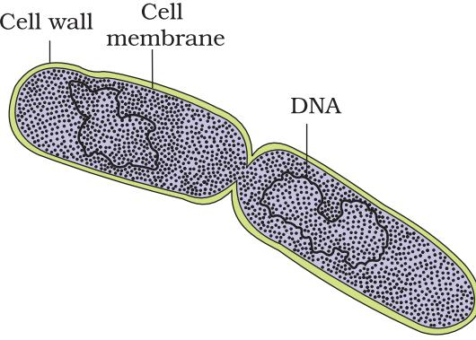
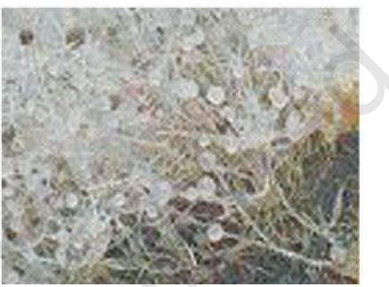
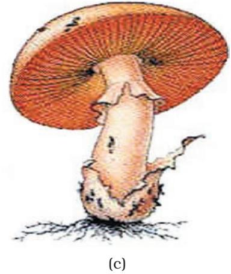
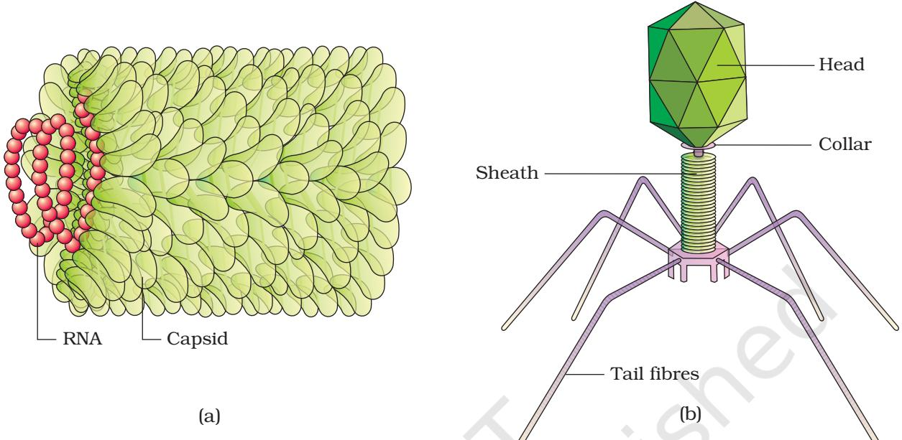

# BIOLOGICAL CLASSIFICATION CHAPTER 2

10 BIOLOGY

- *2.1 Kingdom Monera*
- *2.2 Kingdom Protista*
- *2.3 Kingdom Fungi*
- *2.4 Kingdom Plantae*
- *2.5 Kingdom Animalia*
- *2.6 Viruses, Viroids and Lichens*

Since the dawn of civilisation, there have been many attempts to classify living organisms. It was done instinctively not using criteria that were scientific but borne out of a need to use organisms for our own use – for food, shelter and clothing. Aristotle was the earliest to attempt a more scientific basis for classification. He used simple morphological characters to classify plants into trees, shrubs and herbs. He also divided animals into two groups, those which had red blood and those that did not.

In Linnaeus' time a Two Kingdom system of classification with Plantae and Animalia kingdoms was developed that included all plants and animals respectively. This system did not distinguish between the eukaryotes and prokaryotes, unicellular and multicellular organisms and photosynthetic (green algae) and non-photosynthetic (fungi) organisms. Classification of organisms into plants and animals was easily done and was easy to understand, but, a large number of organisms did not fall into either category. Hence the two kingdom classification used for a long time was found inadequate. Besides, gross morphology a need was also felt for including other characteristics like cell structure, nature of wall, mode of nutrition, habitat, methods of reproduction, evolutionary relationships, etc. Classification systems for the living organisms have hence, undergone several changes over the time. Though plant and animal kingdoms have been a constant under all different systems, the understanding of what groups/organisms be included under these kingdoms have been changing; the number and nature of other kingdoms have also been understood differently by different scientists over the time.

| Characters |  |  | Five Kingdoms |  |  |
| --- | --- | --- | --- | --- | --- |
|  | Monera | Protista | Fungi | Plantae | Animalia |
| Cell type | Prokaryotic | Eukaryotic | Eukaryotic | Eukaryotic | Eukaryotic |
| Cell wall | Noncellulosic | Present in | Present | Present |  |
|  | (Polysaccharide | some | with chitin | (cellulose) | Absent |
|  | + amino acid) |  |  |  |  |
| Nuclear | Absent | Present | Present | Present | Present |
| membrane |  |  |  |  |  |
| Body | Cellular | Cellular | Multiceullar/ | Tissue/ | Tissue/organ/ |
| organisation |  |  | loose tissue | organ | organ system |
|  | Autotrophic | Autotrophic | Heterotrophic | Autotrophic | Heterotrophic |
|  | (chemosyn thetic and | (Photosyn | (Saprophytic/ | (Photosyn | (Holoz o ic/ |
| Mode of |  | thetic) and | Parasitic) | thetic) | Saprophytic |
| nutrition | photosynthetic) | Hetero |  |  | etc.) |
|  | and Hetero trophic (sapro | trophic |  |  |  |
|  | phytic/para |  |  |  |  |
|  | sitic) |  |  |  |  |

|
|  |

R.H. Whittaker (1969) proposed a Five Kingdom Classification. The kingdoms defined by him were named Monera, Protista, Fungi, Plantae and Animalia. The main criteria for classification used by him include cell structure, body organisation, mode of nutrition, reproduction and phylogenetic relationships. Table 2.1 gives a comparative account of different characteristics of the five kingdoms.

The three-domain system has also been proposed that divides the Kingdom Monera into two domains, leaving the remaining eukaryotic kingdoms in the third domain and thereby a six kingdom classification. You will learn about this system in detail at higher classes.

Let us look at this five kingdom classification to understand the issues and considerations that influenced the classification system. Earlier classification systems included bacteria, blue green algae, fungi, mosses, ferns, gymnosperms and the angiosperms under 'Plants'. The character that unified this whole kingdom was that all the organisms included had a cell wall in their cells. This placed together groups which widely differed in other characteristics. It brought together the prokaryotic bacteria and the blue green algae ( cyanobacteria) with other groups which were eukaryotic. It also grouped together the unicellular organisms and the multicellular ones, say, for example, *Chlamydomonas* and *Spirogyra* were placed together under algae. The classification did not differentiate between the heterotrophic group – fungi, and the autotrophic green plants, though they also showed a characteristic difference in their walls composition – the fungi had chitin in their walls while the green plants had a cellulosic cell wall. When such characteristics were considered, the fungi were placed in a separate kingdom – Kingdom Fungi. All prokaryotic organisms were grouped together under Kingdom Monera and the unicellular eukaryotic organisms were placed in Kingdom Protista. Kingdom Protista has brought together *Chlamydomonas, Chlorella* (earlier placed in Algae within Plants and both having cell walls) with *Paramoecium* and *Amoeba* (which were earlier placed in the animal kingdom which lack cell wall). It has put together organisms which, in earlier classifications, were placed in different kingdoms. This happened because the criteria for classification changed. This kind of changes will take place in future too depending on the improvement in our understanding of characteristics and evolutionary relationships. Over time, an attempt has been made to evolve a classification system which reflects not only the morphological, physiological and reproductive similarities, but is also phylogenetic, i.e., is based on evolutionary relationships.

In this chapter we will study characteristics of Kingdoms Monera, Protista and Fungi of the Whittaker system of classification. The Kingdoms Plantae and Animalia, commonly referred to as plant and animal kingdoms, respectively, will be dealt separately in chapters 3 and 4.

## 2.1 KINGDOM MONERA

Bacteria are the sole members of the Kingdom Monera. They are the most abundant micro-organisms. Bacteria occur almost everywhere. Hundreds of bacteria are present in a handful of soil. They also live in extreme habitats such as hot springs, deserts, snow and deep oceans where very few other life forms can survive. Many of them live in or on other organisms as parasites.

Bacteria are grouped under four categories based on their shape: the spherical Coccus (pl.: cocci), the rod-shaped Bacillus (pl.: bacilli), the comma-shaped Vibrium (pl.: vibrio) and the spiral Spirillum (pl.: spirilla) (Figure 2.1).

Figure 2.1 Bacteria of different shapes

Though the bacterial structure is very simple, they are very complex in behaviour. Compared to many other organisms, bacteria as a group show the most extensive metabolic diversity. Some of the bacteria are autotrophic, i.e., they synthesise their own food from inorganic substrates. They may be photosynthetic autotrophic or chemosynthetic autotrophic. The vast majority of bacteria are heterotrophs, i.e., they depend on other organisms or on dead organic matter for food.

## 2.1.1 Archaebacteria

These bacteria are special since they live in some of the most harsh habitats such as extreme salty areas (halophiles), hot springs (thermoacidophiles) and marshy areas (methanogens). Archaebacteria differ from other bacteria in having a different cell wall structure and this feature is responsible for their survival in extreme conditions. Methanogens are present in the gut of several ruminant animals such as cows and buffaloes and they are responsible for the production of methane (biogas) from the dung of these animals.

## 2.1.2 Eubacteria

There are thousands of different eubacteria or 'true bacteria'. They are characterised by the presence of a rigid cell wall, and if motile, a flagellum. The cyanobacteria (also referred to as blue-green algae) have chlorophyll *a* similar to green plants and are photosynthetic autotrophs (Figure 2.2). The cyanobacteria are unicellular, colonial or filamentous, freshwater/marine or terrestrial algae. The colonies are generally surrounded by gelatinous sheath. They often form blooms in polluted water bodies. Some of these organisms can fix atmospheric nitrogen in specialised cells called heterocysts, e.g., *Nostoc* and *Anabaena*. Chemosynthetic autotrophic bacteria oxidise various inorganic substances such as nitrates, nitrites and ammonia and use the released energy for their ATP production. They play a great role in recycling nutrients like nitrogen, phosphorous, iron and sulphur.

Heterotrophic bacteria are most abundant in nature. The majority are important decomposers. Many of them have a significant impact on human affairs. They are helpful in making curd from milk, production of antibiotics, fixing nitrogen in legume

Figure 2.2 A filamentous blue-green algae – *Nostoc*

Figure 2.3 A dividing bacterium

roots, etc. Some are pathogens causing damage to human beings, crops, farm animals and pets. Cholera, typhoid, tetanus, citrus canker are well known diseases caused by different bacteria.

Bacteria reproduce mainly by fission (Figure 2.3). Sometimes, under unfavourable conditions, they produce spores. They also reproduce by a sort of sexual reproduction by adopting a primitive type of DNA transfer from one bacterium to the other.

The Mycoplasma are organisms that completely lack a cell wall. They are the smallest

living cells known and can survive without oxygen. Many mycoplasma are pathogenic in animals and plants.

## 2.2 KINGDOM PROTISTA

All single-celled eukaryotes are placed under Protista, but the boundaries of this kingdom are not well defined. What may be 'a photosynthetic protistan' to one biologist may be 'a plant' to another. In this book we include Chrysophytes, Dinoflagellates, Euglenoids, Slime moulds and Protozoans under Protista. Members of Protista are primarily aquatic. This kingdom forms a link with the others dealing with plants, animals and fungi. Being eukaryotes, the protistan cell body contains a well defined nucleus and other membrane-bound organelles. Some have flagella or cilia. Protists reproduce asexually and sexually by a process involving cell fusion and zygote formation.

#### 2.2.1 Chrysophytes

This group includes diatoms and golden algae (desmids). They are found in fresh water as well as in marine environments. They are microscopic and float passively in water currents (plankton). Most of them are photosynthetic. In diatoms the cell walls form two thin overlapping shells, which fit together as in a soap box. The walls are embedded with silica and thus the walls are indestructible. Thus, diatoms have left behind large amount of cell wall deposits in their habitat; this accumulation over billions of years is referred to as 'diatomaceous earth'. Being gritty this soil is used in polishing, filtration of oils and syrups. Diatoms are the chief 'producers' in the oceans.

## 2.2.2 Dinoflagellates

These organisms are mostly marine and photosynthetic. They appear yellow, green, brown, blue or red depending on the main pigments present in their cells. The cell wall has stiff cellulose plates on the outer surface. Most of them have two flagella; one lies longitudinally and the other transversely in a furrow between the wall plates. Very often, red dinoflagellates (Example: *Gonyaulax)* undergo such rapid multiplication that they make the sea appear red (red tides). Toxins released by such large numbers may even kill other marine animals such as fishes.

## 2.2.3 Euglenoids

Majority of them are fresh water organisms found in stagnant water. Instead of a cell wall, they have a protein rich layer called pellicle which makes their body flexible. They have two flagella, a short and a long one. Though they are photosynthetic in the presence of sunlight, when deprived of sunlight they behave like heterotrophs by predating on other smaller organisms. Interestingly, the pigments of euglenoids are identical to those present in higher plants. Example: *Euglena* (Figure 2.4b)*.*

#### 2.2.4 Slime Moulds

Slime moulds are saprophytic protists. The body moves along decaying twigs and leaves engulfing organic material. Under suitable conditions, they form an aggregation called plasmodium which may grow and spread over several feet. During unfavourable conditions, the plasmodium differentiates and forms fruiting bodies bearing spores at their tips. The spores possess true walls. They are extremely resistant and survive for many years, even under adverse conditions. The spores are dispersed by air currents.

#### 2.2.5 Protozoans

All protozoans are heterotrophs and live as predators or parasites. They are believed to be primitive relatives of animals. There are four major groups of protozoans.

*Amoeboid protozoans:* These organisms live in fresh water, sea water or moist soil. They move and capture

their prey by putting out pseudopodia (false feet) as in *Amoeba*. Marine forms have silica shells on their surface. Some of them such as *Entamoeba* are parasites.

*Flagellated protozoans:* The members of this group are either free-living or parasitic. They have flagella. The parasitic forms cause diaseases such as sleeping sickness. Example: *Trypanosoma*.

*Ciliated protozoans:* These are aquatic, actively moving organisms because of the presence of thousands of cilia. They have a cavity (gullet) that opens to the outside of the cell surface. The coordinated movement of rows of cilia causes the water laden with food to be steered into the gullet. Example: *Paramoecium* (Figure 2.4d)*.*

*Sporozoans:* This includes diverse organisms that have an infectious spore-like stage in their life cycle. The most notorious is *Plasmodium* (malarial parasite) which causes malaria, a disease which has a staggering effect on human population.

## 2.3 KINGDOM FUNGI

The fungi constitute a unique kingdom of heterotrophic organisms. They show a great diversity in morphology and habitat. You must have seen fungi on a moist bread and rotten fruits. The common mushroom you eat and toadstools are also fungi. White spots seen on mustard leaves are due to a parasitic fungus. Some unicellular fungi, e.g., yeast are used to make bread and beer. Other fungi cause diseases in plants and animals; wheat rust-causing *Puccinia* is an important example. Some are the source of antibiotics, e.g., *Penicillium*. Fungi are cosmopolitan and occur in air, water, soil and on animals and plants. They prefer to grow in warm and humid places. Have you ever wondered why we keep food in the refrigerator ? Yes, it is to prevent food from going bad due to bacterial or fungal infections.

With the exception of yeasts which are unicellular, fungi are filamentous. Their bodies consist of long, slender thread-like structures called hyphae. The network of hyphae is known as mycelium. Some hyphae are continuous tubes filled with multinucleated cytoplasm – these are called coenocytic hyphae. Others have septae or cross walls in their hyphae. The cell walls of fungi are composed of chitin and polysaccharides.

Most fungi are heterotrophic and absorb soluble organic matter from dead substrates and hence are called saprophytes. Those that depend on living plants and animals are called parasites. They can also live as symbionts – in association with algae as lichens and with roots of higher plants as mycorrhiza.

Reproduction in fungi can take place by vegetative means – fragmentation, fission and budding. Asexual reproduction is by spores called conidia or sporangiospores or zoospores, and sexual reproduction is by oospores, ascospores and basidiospores. The various spores are produced in distinct structures called fruiting bodies. The sexual cycle involves the following three steps:

- (i) Fusion of protoplasms between two motile or non-motile gametes called plasmogamy.
- (ii) Fusion of two nuclei called karyogamy.
- (iii) Meiosis in zygote resulting in haploid spores.

When a fungus reproduces sexually, two haploid hyphae of compatible mating types come together and fuse. In some fungi the fusion of two haploid cells immediately results in diploid cells (2n). However, in other fungi (ascomycetes and basidiomycetes), an intervening dikaryotic stage (n + n, i.e., two nuclei per cell) occurs; such a condition is called a dikaryon and the phase is called dikaryophase of fungus. Later, the parental nuclei fuse and the cells become diploid. The fungi form fruiting bodies in which reduction division occurs, leading to formation of haploid spores.

The morphology of the mycelium, mode of spore formation and fruiting bodies form the basis for the division of the kingdom into various classes.

## 2.3.1 Phycomycetes

Members of phycomycetes are found in aquatic habitats and on decaying wood in moist and damp places or as obligate parasites on plants. The mycelium is aseptate and coenocytic. Asexual reproduction takes place by zoospores (motile) or by aplanospores (non-motile). These spores are endogenously produced in sporangium. A zygospore is formed by fusion of two gametes. These gametes are similar in morphology (isogamous) or dissimilar (anisogamous or oogamous). Some common examples are *Mucor* (Figure 2.5a)*, Rhizopus* (the bread mould mentioned earlier) and *Albugo* (the parasitic fungi on mustard).

#### 2.3.2 Ascomycetes

Commonly known as sac-fungi, the ascomycetes are mostly multicellular, e.g., *Penicillium*, or rarelyunicellular, e.g., yeast (*Saccharomyces*). They are saprophytic, decomposers, parasitic or coprophilous (growing on dung). Mycelium

(a)

Figure 2.5 Fungi: (a) *Mucor* (b) *Aspergillus* (c) *Agaricus*

is branched and septate. The asexual spores are conidia produced exogenously on the special mycelium called conidiophores. Conidia on germination produce mycelium. Sexual spores are called ascospores which are produced endogenously in sac like asci (singular ascus). These asci are arranged in different types of fruiting bodies called ascocarps. Some examples are *Aspergillus* (Figure 2.5b)*, Claviceps* and *Neurospora. Neurospora* is used extensively in biochemical and genetic work. Many members like morels and truffles are edible and are considered delicacies.

#### 2.3.3 Basidiomycetes

Commonly known forms of basidiomycetes are mushrooms, bracket fungi or puffballs. They grow in soil, on logs and tree stumps and in living plant bodies as parasites, e.g., rusts and smuts. The mycelium is branched and septate. The asexual spores are generally not found, but vegetative reproduction by fragmentation is common. The sex organs are absent, but plasmogamy is brought about by fusion of two vegetative or somatic cells of different strains or genotypes. The resultant structure is dikaryotic which ultimately gives rise to basidium. Karyogamy and meiosis take place in the basidium producing four basidiospores. The basidiospores are exogenously produced on the basidium (pl.: basidia). The basidia are arranged in fruiting bodies called basidiocarps. Some common members are *Agaricus* (mushroom) (Figure 2.5c)*, Ustilago* (smut) and *Puccinia* (rust fungus).

## 2.3.4 Deuteromycetes

Commonly known as imperfect fungi because only the asexual or vegetative phases of these fungi are known. When the sexual forms of these fungi were discovered they were moved into classes they rightly belong to. It is also possible that the asexual and vegetative stage have been given one name (and placed under deuteromycetes) and the sexual stage another (and placed under another class). Later when the linkages were established, the fungi were correctly identified and moved out of deuteromycetes. Once perfect (sexual) stages of members of dueteromycetes were discovered they were often moved to ascomycetes and basidiomycetes. The deuteromycetes reproduce only by asexual spores known as conidia. The mycelium is septate and branched. Some members are saprophytes or parasites while a large number of them are decomposers of litter and help in mineral cycling. Some examples are *Alternaria, Colletotrichum* and *Trichoderma*.

## 2.4 KINGDOM PLANTAE

Kingdom Plantae includes all eukaryotic chlorophyll-containing organisms commonly called plants. A few members are partially heterotrophic such as the insectivorous plants or parasites. Bladderwort and Venus fly trap are examples of insectivorous plants and *Cuscuta* is a parasite. The plant cells have an eukaryotic structure with prominent chloroplasts and cell wall mainly made of cellulose. You will study the eukaryotic cell structure in detail in Chapter 8. Plantae includes algae, bryophytes, pteridophytes, gymnosperms and angiosperms.

Life cycle of plants has two distinct phases – the diploid sporophytic and the haploid gametophytic – that alternate with each other. The lengths of the haploid and diploid phases, and whether these phases are free– living or dependent on others, vary among different groups in plants. This phenomenon is called alternation of generation. You will study further details of this kingdom in Chapter 3.

## 2.5 KINGDOM ANIMALIA

This kingdom is characterised by heterotrophic eukaryotic organisms that are multicellular and their cells lack cell walls. They directly or indirectly depend on plants for food. They digest their food in an internal cavity and store food reserves as glycogen or fat. Their mode of nutrition is holozoic – by ingestion of food. They follow a definite growth pattern and grow into adults that have a definite shape and size. Higher forms show elaborate sensory and neuromotor mechanism. Most of them are capable of locomotion.

The sexual reproduction is by copulation of male and female followed by embryological development. Salient features of various phyla are described in Chapter 4.

## 2.6 VIRUSES, VIROIDS, PRIONS AND LICHENS

In the five kingdom classification of Whittaker there is no mention of lichens and some acellular organisms like viruses, viroids and prions. These are briefly introduced here.

All of us who have suffered the ill effects of common cold or 'flu' know what effects viruses can have on us, even if we do not associate it with our condition. Viruses did not find a place in classification since they are not considered truly 'living', if we understand living as those organisms that have a cell structure. The viruses are non-cellular organisms that are characterised by having an inert crystalline structure outside the living cell.

Figure 2.6 (a) Tobacco Mosaic Virus (TMV) (b) Bacteriophage

Once they infect a cell they take over the machinery of the host cell to replicate themselves, killing the host. Would you call viruses living or non-living?

Virus means venom or poisonous fluid. Dmitri Ivanowsky (1892) recognised certain microbes as causal organism of the mosaic disease of tobacco (Figure 2.6a). These were found to be smaller than bacteria because they passed through bacteria-proof filters. M.W. Beijerinek (1898) demonstrated that the extract of the infected plants of tobacco could cause infection in healthy plants and named the new pathogen "virus" and called the fluid as *Contagium vivum fluidum* (infectious living fluid). W.M. Stanley (1935) showed that viruses could be crystallised and crystals consist largely of proteins. They are inert outside their specific host cell. Viruses are obligate parasites.

In addition to proteins, viruses also contain genetic material, that could be either RNA or DNA. No virus contains both RNA and DNA. A virus is a nucleoprotein and the genetic material is infectious. In general, viruses that infect plants have single stranded RNA and viruses that infect animals have either single or double stranded RNA or double stranded DNA. Bacterial viruses or bacteriophages (viruses that infect the bacteria) are usually double stranded DNA viruses (Figure 2.6b). The protein coat called capsid made of small subunits called capsomeres, protects the nucleic acid. These capsomeres are arranged in helical or polyhedral geometric forms. Viruses cause diseases like mumps, small pox, herpes and influenza. AIDS in humans is also caused by a virus. In plants, the symptoms can be mosaic formation, leaf rolling and curling, yellowing and vein clearing, dwarfing and stunted growth.

Viroids : In 1971, T.O. Diener discovered a new infectious agent that was smaller than viruses and caused potato spindle tuber disease. It was found to be a free RNA; it lacked the protein coat that is found in viruses, hence the name viroid. The RNA of the viroid was of low molecular weight. Prions : In modern medicine certain infectious neurological diseases were found to be transmitted by an agent consisting of abnormally folded protein. The agent was similar in size to viruses. These agents were called prions. The most notable diseases caused by prions are bovine spongiform encephalopathy (BSE) commonly called mad cow disease in cattle and its analogous variant Cr–Jacob disease (CJD) in humans.

Lichens : Lichens are symbiotic associations i.e. mutually useful associations, between algae and fungi. The algal component is known as phycobiont and fungal component as mycobiont, which are autotrophic and heterotrophic, respectively. Algae prepare food for fungi and fungi provide shelter and absorb mineral nutrients and water for its partner. So close is their association that if one saw a lichen in nature one would never imagine that they had two different organisms within them. Lichens are very good pollution indicators – they do not grow in polluted areas.

## SUMMARY

Biological classification of plants and animals was first proposed by Aristotle on the basis of simple morphological characters. Linnaeus later classified all living organisms into two kingdoms – Plantae and Animalia. Whittaker proposed an elaborate five kingdom classification – Monera, Protista, Fungi, Plantae and Animalia. The main criteria of the five kingdom classification were cell structure, body organisation, mode of nutrition and reproduction, and phylogenetic relationships.

In the five kingdom classification, bacteria are included in Kingdom Monera. Bacteria are cosmopolitan in distribution. These organisms show the most extensive metabolic diversity. Bacteria may be autotrophic or heterotrophic in their mode of nutrition. Kingdom Protista includes all single-celled eukaryotes such as Chrysophytes, Dinoflagellates, Euglenoids, Slime-moulds and Protozoans. Protists have defined nucleus and other membrane bound organelles. They reproduce both asexually and sexually. Members of Kingdom Fungi show a great diversity in structures and habitat. Most fungi are saprophytic in their mode of nutrition. They show asexual and sexual reproduction. Phycomycetes, Ascomycetes, Basidiomycetes and Deuteromycetes are the four classes under this kingdom. The plantae includes all eukaryotic chlorophyll-containing organisms. Algae, bryophytes, pteridophytes, gymnosperms and angiosperms are included in this group. The life cycle of plants exhibit alternation of generations – gametophytic and sporophytic generations. The heterotrophic eukaryotic, multicellular organisms lacking a cell wall are included in the Kingdom Animalia. The mode of nutrition of these organisms is holozoic. They reproduce mostly by the sexual mode. Some acellular organisms like viruses and viroids as well as the lichens are not included in the five kingdom system of classification.

## EXERCISES

- 1. Discuss how classification systems have undergone several changes over a period of time?
- 2. State two economically important uses of:
	- (a) heterotrophic bacteria
	- (b) archaebacteria
- 3. What is the nature of cell-walls in diatoms?
- 4. Find out what do the terms 'algal bloom' and 'red-tides' signify.
- 5. How are viroids different from viruses?
- 6. Describe briefly the four major groups of Protozoa.
- 7. Plants are autotrophic. Can you think of some plants that are partially heterotrophic?
- 8. What do the terms phycobiont and mycobiont signify?
- 9. Give a comparative account of the classes of Kingdom Fungi under the following:
	- (i) mode of nutrition
	- (ii) mode of reproduction
- 10. What are the characteristic features of Euglenoids?
- 11. Give a brief account of viruses with respect to their structure and nature of genetic material. Also name four common viral diseases.
- 12. Organise a discussion in your class on the topic Are viruses living or nonliving?

