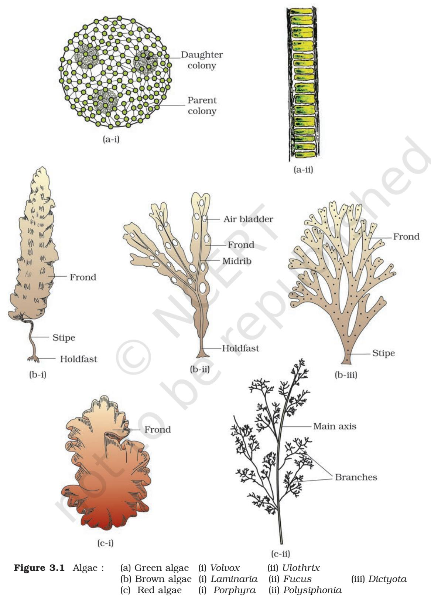
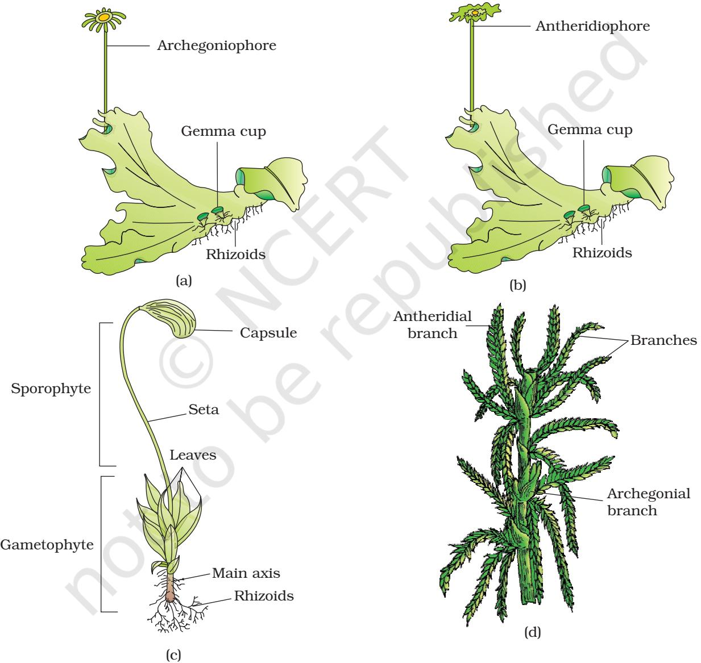
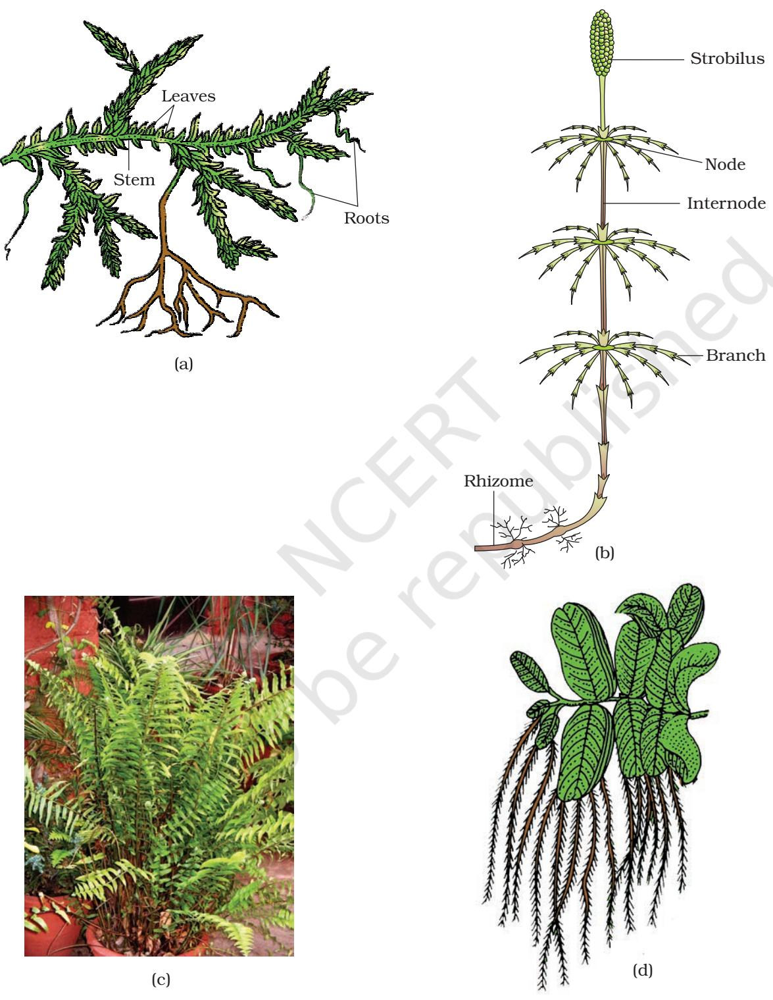
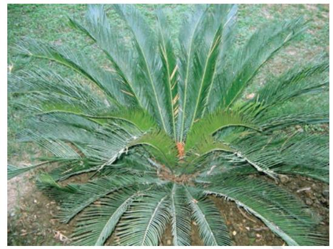
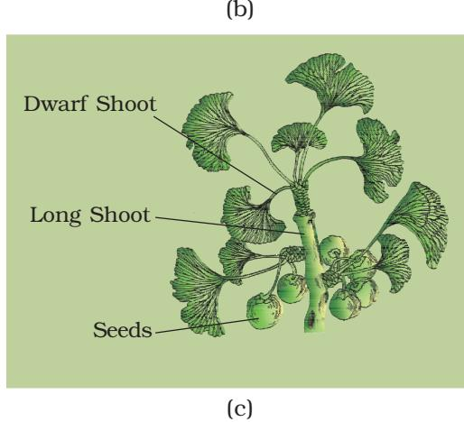
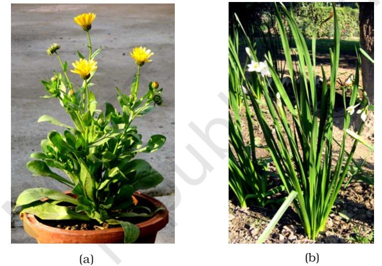

# PLANT KINGDOM CHAPTER 3

PLANT KINGDOM 23

- *3.1 Algae*
- *3.2 Bryophytes*
- *3.3 Pteridophytes*
- *3.4 Gymnosperms*
- *3.5 Angiosperms*

In the previous chapter, we looked at the broad classification of living organisms under the system proposed by Whittaker (1969) wherein he suggested the Five Kingdom classification viz. Monera, Protista, Fungi, Animalia and Plantae. In this chapter, we will deal in detail with further classification within Kingdom Plantae popularly known as the 'plant kingdom'.

We must stress here that our understanding of the plant kingdom has changed over time. Fungi, and members of the Monera and Protista having cell walls have now been excluded from Plantae though earlier classifications placed them in the same kingdom. So, the cyanobacteria that are also referred to as blue green algae are not 'algae' any more. In this chapter, we will describe Algae, Bryophytes, Pteridophytes, Gymnosperms and Angiosperms under Plantae .

Let us also look at classification within angiosperms to understand some of the concerns that influenced the classification systems. The earliest systems of classification used only gross superficial morphological characters such as habit, colour, number and shape of leaves, etc. They were based mainly on vegetative characters or on the androecium structure (system given by Linnaeus). Such systems were artificial; they separated the closely related species since they were based on a few characteristics. Also, the artificial systems gave equal weightage to vegetative and sexual characteristics; this is not acceptable since we know that often the vegetative characters are more easily affected by environment. As against this, natural classification systems developed, which were based on natural affinities among the organisms and consider, not only the external features, but also internal features, like ultrastructure, anatomy, embryology and phytochemistry. Such a classification for flowering plants was given by George Bentham and Joseph Dalton Hooker.

At present phylogenetic classification systems based on evolutionary relationships between the various organisms are acceptable. This assumes that organisms belonging to the same taxa have a common ancestor. We now use information from many other sources too to help resolve difficulties in classification. These become more important when there is no supporting fossil evidence. Numerical Taxonomy which is now easily carried out using computers is based on all observable characteristics. Number and codes are assigned to all the characters and the data are then processed. In this way each character is given equal importance and at the same time hundreds of characters can be considered. Cytotaxonomy that is based on cytological information like chromosome number, structure, behaviour and chemotaxonomy that uses the chemical constituents of the plant to resolve confusions, are also used by taxonomists these days.

# 3.1 ALGAE

Algae are chlorophyll-bearing, simple, thalloid, autotrophic and largely aquatic (both fresh water and marine) organisms. They occur in a variety of other habitats: moist stones, soils and wood. Some of them also occur in association with fungi (lichen) and animals (e.g., on sloth bear).

The form and size of algae is highly variable, ranging from colonial forms like *Volvox* and the filamentous forms like *Ulothrix* and *Spirogyra* (Figure 3.1)*.* A few of the marine forms such as kelps, form massive plant bodies.

The algae reproduce by vegetative, asexual and sexual methods. Vegetative reproduction is by fragmentation. Each fragment develops into a thallus. Asexual reproduction is by the production of different types of spores, the most common being the zoospores. They are flagellated (motile) and on germination gives rise to new plants. Sexual reproduction takes place through fusion of two gametes. These gametes can be flagellated and similar in size (as in *Ulothrix*) or non-flagellated (non-motile) but similar in size (as in *Spirogyra*). Such reproduction is called isogamous. Fusion of two gametes dissimilar in size, as in species of *Eudorina* is termed as anisogamous. Fusion between one large, nonmotile (static) female gamete and a smaller, motile male gamete is termed oogamous, e.g., *Volvox, Fucus.*

Algae are useful to man in a variety of ways. At least a half of the total carbon dioxide fixation on earth is carried out by algae through photosynthesis. Being photosynthetic they increase the level of dissolved oxygen in their immediate environment. They are of paramount importance as primary producers of energy-rich compounds which form the basis of the food cycles of all aquatic animals. Many species of *Porphyra, Laminaria* and *Sargassum* are among the 70 species of marine algae used as food. Certain marine brown and red algae produce large amounts of hydrocolloids (water holding substances), e.g., algin (brown algae) and carrageen (red algae) which are used commercially. Agar, one of the commercial products obtained from *Gelidium* and *Gracilaria* are used to grow microbes and in preparations of ice-creams and jellies. *Chlorella* a unicellular alga rich in proteins is used as food supplement even by space travellers. The algae are divided into three main classes: Chlorophyceae, Phaeophyceae and Rhodophyceae.

#### 3.1.1 Chlorophyceae

The members of chlorophyceae are commonly called green algae. The plant body may be unicellular, colonial or filamentous. They are usually grass green due to the dominance of pigments chlorophyll *a* and *b*. The pigments are localised in definite chloroplasts. The chloroplasts may be discoid, plate-like, reticulate, cup-shaped, spiral or ribbon-shaped in different species. Most of the members have one or more storage bodies called pyrenoids located in the chloroplasts. Pyrenoids contain protein besides starch. Some algae may store food in the form of oil droplets. Green algae usually have a rigid cell wall made of an inner layer of cellulose and an outer layer of pectose.

Vegetative reproduction usually takes place by fragmentation or by formation of different types of spores. Asexual reproduction is by flagellated zoospores produced in zoosporangia. The sexual reproduction shows considerable variation in the type and formation of sex cells and it may be isogamous, anisogamous or oogamous. Some commonly found green algae are: *Chlamydomonas, Volvox, Ulothrix, Spirogyra* and *Chara (*Figure 3.1a)*.*

#### 3.1.2 Phaeophyceae

The members of phaeophyceae or brown algae are found primarily in marine habitats. They show great variation in size and form. They range from simple branched, filamentous forms (*Ectocarpus*) to profusely branched forms as represented by kelps, which may reach a height of 100 metres. They possess chlorophyll *a*, *c*, carotenoids and xanthophylls. They vary in colour from olive green to various shades of brown depending upon the amount of the xanthophyll pigment, fucoxanthin present in them. Food is stored as complex carbohydrates, which may be in the form of laminarin or mannitol. The vegetative cells have a cellulosic wall usually covered on the outside by a gelatinous coating of algin. The protoplast contains, in addition to plastids, a centrally located vacuole and nucleus. The plant body is usually attached to the substratum by a holdfast, and has a stalk, the stipe and leaf like photosynthetic organ – the frond. Vegetative reproduction takes place by fragmentation. Asexual reproduction in most brown algae is by biflagellate zoospores that are pear-shaped and have two unequal laterally attached flagella.

Sexual reproduction may be isogamous, anisogamous or oogamous. Union of gametes may take place in water or within the oogonium (oogamous species). The gametes are pyriform (pear-shaped) and bear two laterally attached flagella. The common forms are *Ectocarpus, Dictyota, Laminaria, Sargassum* and *Fucus* (Figure 3.1b)*.*

#### 3.1.3 Rhodophyceae

The members of rhodophyceae are commonly called red algae because of the predominance of the red pigment, r-phycoerythrin in their body. Majority of the red algae are marine with greater concentrations found in the warmer areas. They occur in both well-lighted regions close to the surface of water and also at great depths in oceans where relatively little light penetrates.

The red thalli of most of the red algae are multicellular. Some of them have complex body organisation. The food is stored as floridean starch which is very similar to amylopectin and glycogen in structure.

The red algae usually reproduce vegetatively by fragmentation. They reproduce asexually by non-motile spores and sexually by non-motile

| Classes | Common Name | Major Pigments | Stored Food | Cell Wall | Flagellar Number and | Habitat |
| --- | --- | --- | --- | --- | --- | --- |
|  |  |  |  |  | Position of Insertions |  |
| Chlorophyceae | Green | Chlorophyll | Starch | Cellulose | 2-8, equal, | Fresh water, |
|  | algae | a, b |  |  | apical | brackish water, |
|  |  |  |  |  |  | salt water |
| Phaeophyceae | Brown | Chlorophyll | Mannitol, | Cellulose | 2, unequal, | Fresh water |
|  | algae | a, c, | laminarin | and algin | lateral | (rare) brackish |
|  |  | fucoxanthin |  |  |  | water, salt |
|  |  |  |  |  |  | water |
| Rhodophyceae | Red | Chlorophyll | Floridean | Cellulose, | Absent | Fresh water |
|  | algae | a, d, phycoerythrin | starch | pectin and |  | (some), |
|  |  |  |  | poly |  | brackish |
|  |  |  |  | sulphate |  | water, salt |
|  |  |  |  | esters |  | water (most) |

#### TABLE 3.1 Divisions of Algae and their Main Characteristics

gametes. Sexual reproduction is oogamous and accompanied by complex post fertilisation developments. The common members are: *Polysiphonia, Porphyra* (Figure 3.1c), *Gracilaria* and *Gelidium.*

# 3.2 BRYOPHYTES

Bryophytes include the various mosses and liverworts that are found commonly growing in moist shaded areas in the hills (Figure 3.2).

Figure 3.2 Bryophytes: A liverwort – *Marchantia* (a) Female thallus (b) Male thallus Mosses – (c) *Funaria*, gametophyte and sporophyte (d) *Sphagnum* gametophyte

Bryophytes are also called amphibians of the plant kingdom because these plants can live in soil but are dependent on water for sexual reproduction. They usually occur in damp, humid and shaded localities. They play an important role in plant succession on bare rocks/soil.

The plant body of bryophytes is more differentiated than that of algae. It is thallus-like and prostrate or erect, and attached to the substratum by unicellular or multicellular rhizoids. They lack true roots, stem or leaves. They may possess root-like, leaf-like or stem-like structures. The main plant body of the bryophyte is haploid. It produces gametes, hence is called a gametophyte. The sex organs in bryophytes are multicellular. The male sex organ is called antheridium. They produce biflagellate antherozoids. The female sex organ called archegonium is flask-shaped and produces a single egg. The antherozoids are released into water where they come in contact with archegonium. An antherozoid fuses with the egg to produce the zygote. Zygotes do not undergo reduction division immediately. They produce a multicellular body called a sporophyte. The sporophyte is not free-living but attached to the photosynthetic gametophyte and derives nourishment from it. Some cells of the sporophyte undergo reduction division (meiosis) to produce haploid spores. These spores germinate to produce gametophyte.

Bryophytes in general are of little economic importance but some mosses provide food for herbaceous mammals, birds and other animals. Species of *Sphagnum*, a moss, provide peat that have long been used as fuel, and as packing material for trans-shipment of living material because of their capacity to hold water. Mosses along with lichens are the first organisms to colonise rocks and hence, are of great ecological importance. They decompose rocks making the substrate suitable for the growth of higher plants. Since mosses form dense mats on the soil, they reduce the impact of falling rain and prevent soil erosion. The bryophytes are divided into liverworts and mosses.

#### 3.2.1 Liverworts

The liverworts grow usually in moist, shady habitats such as banks of streams, marshy ground, damp soil, bark of trees and deep in the woods. The plant body of a liverwort is thalloid, e.g., *Marchantia*. The thallus is dorsiventral and closely appressed to the substrate. The leafy members have tiny leaf-like appendages in two rows on the stem-like structures.

Asexual reproduction in liverworts takes place by fragmentation of thalli, or by the formation of specialised structures called gemmae (sing. gemma). Gemmae are green, multicellular, asexual buds, which develop in small receptacles called gemma cups located on the thalli. The gemmae become detached from the parent body and germinate to form new individuals. During sexual reproduction, male and female sex

organs are produced either on the same or on different thalli. The sporophyte is differentiated into a foot, seta and capsule. After meiosis, spores are produced within the capsule. These spores germinate to form free-living gametophytes.

#### 3.2.2 Mosses

The predominant stage of the life cycle of a moss is the gametophyte which consists of two stages. The first stage is the protonema stage, which develops directly from a spore. It is a creeping, green, branched and frequently filamentous stage. The second stage is the leafy stage, which develops from the secondary protonema as a lateral bud. They consist of upright, slender axes bearing spirally arranged leaves. They are attached to the soil through multicellular and branched rhizoids. This stage bears the sex organs.

Vegetative reproduction in mosses is by fragmentation and budding in the secondary protonema. In sexual reproduction, the sex organs antheridia and archegonia are produced at the apex of the leafy shoots. After fertilisation, the zygote develops into a sporophyte, consisting of a foot, seta and capsule. The sporophyte in mosses is more elaborate than that in liverworts. The capsule contains spores. Spores are formed after meiosis. The mosses have an elaborate mechanism of spore dispersal. Common examples of mosses are *Funaria, Polytrichum* and *Sphagnum* (Figure 3.2)*.*

## 3.3 PTERIDOPHYTES

The Pteridophytes include horsetails and ferns. Pteridophytes are used for medicinal purposes and as soil-binders. They are also frequently grown as ornamentals. Evolutionarily, they are the first terrestrial plants to possess vascular tissues – xylem and phloem. You shall study more about these tissues in Chapter 6. The pteridophytes are found in cool, damp, shady places though some may flourish well in sandy-soil conditions.

You may recall that in bryophytes the dominant phase in the life cycle is the gametophytic plant body. However, in pteridophytes, the main plant body is a sporophyte which is differentiated into true root, stem and leaves (Figure 3.3). These organs possess well-differentiated vascular tissues. The leaves in pteridophyta are small (microphylls) as in *Selaginella* or large (macrophylls) as in ferns. The sporophytes bear sporangia that are subtended by leaf-like appendages called sporophylls. In some cases sporophylls may form distinct compact structures called strobili or cones (*Selaginella, Equisetum*). The sporangia produce spores by meiosis in spore mother cells. The spores germinate to give rise to inconspicuous, small but multicellular,

Figure 3.3 Pteridophytes : (a) *Selaginella* (b) *Equisetum* (c) Fern (d) *Salvinia*

free-living, mostly photosynthetic thalloid gametophytes called prothallus. These gametophytes require cool, damp, shady places to grow. Because of this specific restricted requirement and the need for water for fertilisation, the spread of living pteridophytes is limited and restricted to narrow geographical regions. The gametophytes bear male and female sex organs called antheridia and archegonia, respectively. Water is required for transfer of antherozoids – the male gametes released from the antheridia, to the mouth of archegonium. Fusion of male gamete with the egg present in the archegonium result in the formation of zygote. Zygote thereafter produces a multicellular well-differentiated sporophyte which is the dominant phase of the pteridophytes. In majority of the pteridophytes all the spores are of similar kinds; such plants are called homosporous. Genera like *Selaginella* and *Salvinia* which produce two kinds of spores, macro (large) and micro (small) spores, are known as heterosporous. The megaspores and microspores germinate and give rise to female and male gametophytes, respectively. The female gametophytes in these plants are retained on the parent sporophytes for variable periods. The development of the zygotes into young embryos take place within the female gametophytes. This event is a precursor to the seed habit considered an important step in evolution.

The pteridophytes are further classified into four classes: Psilopsida *(Psilotum);* Lycopsida *(Selaginella, Lycopodium)*, Sphenopsida *(Equisetum)* and Pteropsida *(Dryopteris, Pteris, Adiantum)*.

#### 3.4 GYMNOSPERMS

The gymnosperms (*gymnos* : naked, *sperma* : seeds) are plants in which the ovules are not enclosed by any ovary wall and remain exposed, both before and after fertilisation. The seeds that develop post-fertilisation, are not covered, i.e., are naked. Gymnosperms include medium-sized trees or tall trees and shrubs (Figure 3.4). One of the gymnosperms, the giant redwood tree *Sequoia* is one of the tallest tree species. The roots are generally tap roots. Roots in some genera have fungal association in the form of mycorrhiza *(Pinus)*, while in some others *(Cycas)* small specialised roots called coralloid roots are associated with N2- fixing cyanobacteria. The stems are unbranched (*Cycas*) or branched (*Pinus, Cedrus*). The leaves may be simple or compound. In *Cycas* the pinnate leaves persist for a few years. The leaves in gymnosperms are well-adapted to withstand extremes of temperature, humidity and wind. In conifers, the needle-like leaves reduce the surface area. Their thick cuticle and sunken stomata also help to reduce water loss.

The gymnosperms are heterosporous; they produce haploid microspores and megaspores. The two kinds of spores are produced within sporangia that are borne on sporophylls which are arranged spirally along an axis to form lax or compact strobili or cones. The strobili bearing microsporophylls and microsporangia are called microsporangiate or male strobili. The microspores develop into a male gametophytic generation which is highly reduced and is confined to only a limited number of cells. This reduced gametophyte is called a pollen grain. The development of pollen grains take place within the microsporangia. The cones bearing megasporophylls with ovules or megasporangia are called macrosporangiate or female strobili. The male or female cones or strobili may be borne on the same tree (*Pinus*). However, in *cycas* male cones and megasporophylls are borne on different trees. The megaspore mother cell is differentiated from one of the cells of the nucellus. The nucellus is protected by envelopes and the composite structure is called an ovule. The ovules are borne on megasporophylls which may be clustered to form the female cones. The megaspore mother cell divides meiotically to form four megaspores. One of the megaspores enclosed within the megasporangium develops into a multicellular female gametophyte that bears two or more archegonia or female sex organs. The multicellular female gametophyte is also retained within megasporangium.

Unlike bryophytes and pteridophytes, in gymnosperms the male and the female gametophytes do not have an independent free-living existence. They remain within the sporangia retained on the sporophytes. The pollen grain is released from the microsporangium. They are carried in air currents and come in contact with the opening of the ovules borne on megasporophylls. The pollen tube carrying the male gametes grows towards archegonia in the ovules and discharge their contents near the mouth of the archegonia. Following fertilisation, zygote develops into an embryo and the ovules into seeds. These seeds are not covered.

Figure 3.4 Gymnosperms: (a) *Cycas* (b) *Pinus* (c) *Ginkgo*

### 3.5 ANGIOSPERMS

Unlike the gymnosperms where the ovules are naked, in the angiosperms or flowering plants, the pollen grains and ovules are developed in specialised structures called flowers. In angiosperms, the seeds are enclosed in fruits. The angiosperms are an exceptionally large group of plants occurring in wide range of habitats. They range in size from the smallest *Wolffia* to tall trees of *Eucalyptus* (over 100 metres). They provide us with food, fodder, fuel, medicines and several other commercially important products. They are divided into two classes : the dicotyledons and the monocotyledons (Figure 3.5).

- Figure 3.5 Angiosperms : (a) A dicotyledon (b) A monocotyledon
#### SUMMARY

Plant kingdom includes algae, bryophytes, pteridophytes, gymnosperms and angiosperms. Algae are chlorophyll-bearing simple, thalloid, autotrophic and largely aquatic organisms. Depending on the type of pigment possesed and the type of stored food, algae are classfied into three classes, namely Chlorophyceae, Phaeophyceae and Rhodophyceae. Algae usually reproduce vegetatively by fragmentation, asexually by formation of different types of spores and sexually by formation of gametes which may show isogamy, anisogamy or oogamy.

Bryophytes are plants which can live in soil but are dependent on water for sexual reproduction. Their plant body is more differentiated than that of algae. It is thallus-like and prostrate or erect and attached to the substratum by rhizoids. They possess root-like, leaf-like and stemlike structures. The bryophytes are divided into liverworts and mosses. The plant body of liverworts is thalloid and dorsiventral whereas mosses have upright, slender axes bearing spirally arranged leaves. The main plant body of a bryophyte is gamete-producing and is called a gametophyte. It bears the male sex organs called antheridia and female sex organs called archegonia. The male and female gametes produced fuse to form zygote which produces a multicellular body called a sporophyte. It produces haploid spores. The spores germinate to form gametophytes.

In pteridophytes the main plant is a sporophyte which is differentiated into true root, stem and leaves. These organs possess well-differentiated vascular tissues. The sporophytes bear sporangia which produce spores. The spores germinate to form gametophytes which require cool, damp places to grow. The gametophytes bear male and female sex organs called antheridia and archegonia, respectively. Water is required for transfer of male gametes to archegonium where zygote is formed after fertilisation. The zygote produces a sporophyte.

The gymnosperms are the plants in which ovules are not enclosed by any ovary wall. After fertilisation the seeds remain exposed and therefore these plants are called naked-seeded plants. The gymnosperms produce microspores and megaspores which are produced in microsporangia and megasporangia borne on the sporophylls. The sporophylls – microsporophylls and megasporophylls – are arranged spirally on axis to form male and female cones, respectively. The pollen grain germinates and pollen tube releases the male gamete into the ovule, where it fuses with the egg cell in archegonia. Following fertilisation, the zygote develops into embryo and the ovules into seeds.

The angiosperms are divided into two classes – the dicotyledons and the monocotyledons.

#### EXERCISES

- 1. What is the basis of classification of algae?
- 2. When and where does reduction division take place in the life cycle of a liverwort, a moss, a fern, a gymnosperm and an angiosperm?
- 3. Name three groups of plants that bear archegonia. Briefly describe the life cycle of any one of them.
- 4. Mention the ploidy of the following: protonemal cell of a moss; primary endosperm nucleus in dicot, leaf cell of a moss; prothallus cell of a ferm; gemma cell in *Marchantia*; meristem cell of monocot, ovum of a liverwort, and zygote of a fern.
- 5. Write a note on economic importance of algae and gymnosperms.
- 6. Both gymnosperms and angiosperms bear seeds, then why are they classified separately?
- 7. What is heterospory? Briefly comment on its significance. Give two examples.
- 8. Explain briefly the following terms with suitable examples:-
	- (i) protonema
	- (ii) antheridium
	- (iii) archegonium
	- (iv) diplontic
	- (v) sporophyll
	- (vi) isogamy
- 9. Differentiate between the following:-
	- (i) red algae and brown algae
	- (ii) liverworts and moss
	- (iii) homosporous and heterosporous pteridophyte
- 10. Match the following (column I with column II)

#### Column I Column II

- (a) *Chlamydomonas* (i) Moss
	-

- 
- (b) *Cycas* (ii) Pteridophyte
- (c) *Selaginella* (iii) Algae
- (d) *Sphagnum* (iv) Gymnosperm
- 11. Describe the important characteristics of gymnosperms.

