37

# ANIMAL KINGDOM CHAPTER 4

ANIMAL KINGDOM 37

- *4.1 Basis of Classification*
*4.2 Classification of Animals*

When you look around, you will observe different animals with different structures and forms. As over a million species of animals have been described till now, the need for classification becomes all the more important. The classification also helps in assigning a systematic position to newly described species.

## 4.1 BASIS OF CLASSIFICATION

Inspite of differences in structure and form of different animals, there are fundamental features common to various individuals in relation to the arrangement of cells, body symmetry, nature of coelom, patterns of digestive, circulatory or reproductive systems. These features are used as the basis of animal classification and some of them are discussed here.

# 4.1.1 Levels of Organisation

Though all members of Animalia are multicellular, all of them do not exhibit the same pattern of organisation of cells. For example, in sponges, the cells are arranged as loose cell aggregates, i.e., they exhibit cellular level of organisation. Some division of labour (activities) occur among the cells. In coelenterates, the arrangement of cells is more complex. Here the cells performing the same function are arranged into tissues, hence is called tissue level of organisation. A still higher level of organisation, i.e., organ level is exhibited by members of Platyhelminthes and other higher phyla where tissues are grouped together to form organs, each specialised for a particular function. In animals like Annelids, Arthropods, Molluscs,

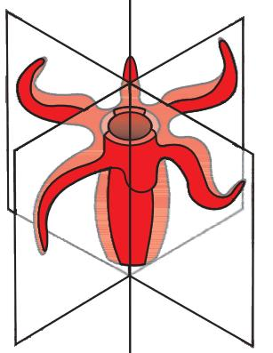

Figure 4.1 (a) Radial symmetry

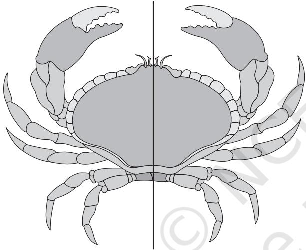

Figure 4.1 (b) Bilateral symmetry

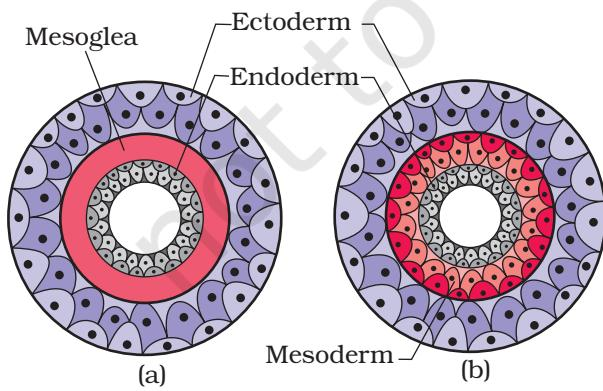

Figure 4.2 Showing germinal layers : (a) Diploblastic (b) Triploblastic

Echinoderms and Chordates, organs have associated to form functional systems, each system concerned with a specific physiological function. This pattern is called organ system level of organisation. Organ systems in different groups of animals exhibit various patterns of complexities. For example, the digestive system in Platyhelminthes has only a single opening to the outside of the body that serves as both mouth and anus, and is hence called incomplete. A complete digestive system has two openings, mouth and anus. Similarly, the circulatory system may be of two types:

(i) open type in which the blood is pumped out of the heart and the cells and tissues are directly bathed in it and

(ii) closed type in which the blood is circulated through a series of vessels of varying diameters (arteries, veins and capillaries).

## 4.1.2 Symmetry

Animals can be categorised on the basis of their symmetry. Sponges are mostly asymmetrical, i.e., any plane that passes through the centre does not divide them into equal halves. When any plane passing through the central axis of the body divides the organism into two identical halves, it is called radial symmetry. Coelenterates, ctenophores and echinoderms have this kind of body plan (Figure 4.1a). Animals like annelids, arthropods, etc., where the body can be divided into identical left and right halves in only one plane, exhibit bilateral symmetry (Figure 4.1b).

# 4.1.3 Diploblastic and Triploblastic Organisation

Animals in which the cells are arranged in two embryonic layers, an external ectoderm and an internal endoderm, are called diploblastic animals, e.g., coelenterates. An undifferentiated layer, mesoglea, is present in between the ectoderm and the endoderm (Figure 4.2a). Those animals in which the developing embryo has a third germinal layer, mesoderm, in between the ectoderm and endoderm, are called triploblastic animals (platyhelminthes to chordates, Figure 4.2b).

## 4.1.4 Coelom

Presence or absence of a cavity between the body wall and the gut wall is very important in classification. The body cavity, which is lined by mesoderm is called coelom. Animals possessing coelom are called coelomates, e.g., annelids, molluscs, arthropods, echinoderms, hemichordates and chordates (Figure 4.3a). In some animals, the body cavity is not lined by mesoderm, instead, the mesoderm is present as scattered pouches in between the ectoderm and endoderm. Such a body cavity is called pseudocoelom and the animals possessing them are called pseudocoelomates, e.g., aschelminthes (Figure 4.3b). The animals in which the body cavity is absent are called acoelomates, e.g., platyhelminthes (Figure 4.3c).

Figure 4.3 Diagrammatic sectional view of : (a) Coelomate (b) Pseudocoelomate (c) Acoelomate

## 4.1.5 Segmentation

In some animals, the body is externally and internally divided into segments with a serial repetition of at least some organs. For example, in earthworm, the body shows this pattern called metameric segmentation and the phenomenon is known as metamerism.

## 4.1.6 Notochord

Notochord is a mesodermally derived rod-like structure formed on the dorsal side during embryonic development in some animals. Animals with notochord are called chordates and those animals which do not form this structure are called non-chordates, e.g., porifera to echinoderms.

#### 4.2 CLASSIFICATION OF ANIMALS

The broad classification of Animalia based on common fundamental features as mentioned in the preceding sections is given in Figure 4.4.

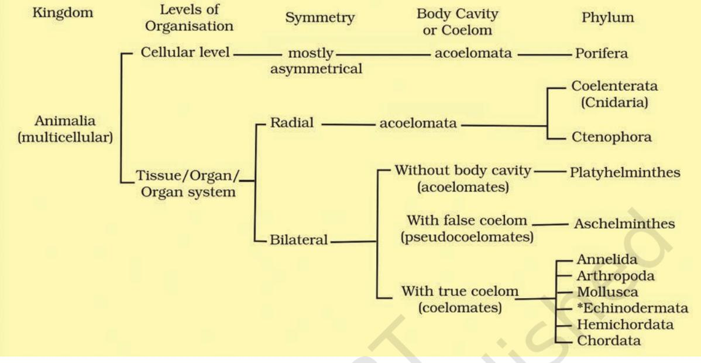

*Echinodermata exhibits radial or bilateral symmetry depending on the stage.

Figure 4.4 Broad classification of Kingdom Animalia based on common fundamental features

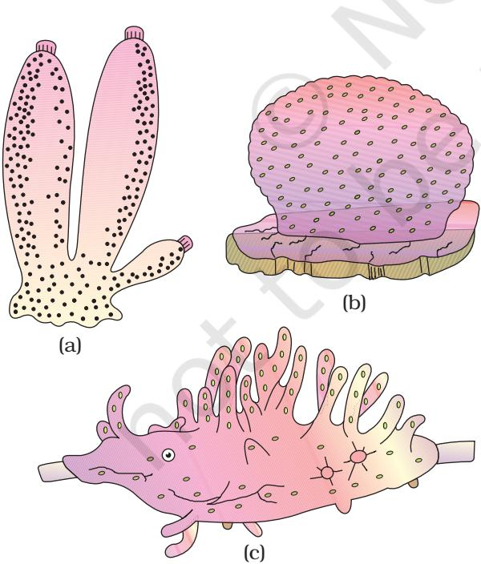

Figure 4.5 Examples of Porifera : (a) *Sycon* (b) *Euspongia* (c) *Spongilla*

The important characteristic features of the different phyla are described.

#### 4.2.1 Phylum – Porifera

Members of this phylum are commonly known as sponges. They are generally marine and mostly asymmetrical animals (Figure 4.5). These are primitive multicellular animals and have cellular level of organisation. Sponges have a water transport or canal system. Water enters through minute pores (ostia) in the body wall into a central cavity, spongocoel, from where it goes out through the osculum. This pathway of water transport is helpful in food gathering, respiratory exchange and removal of waste. Choanocytes or collar cells line the spongocoel and the canals. Digestion is intracellular. The body is supported by a skeleton made up of spicules or spongin fibres. Sexes are not separate (hermaphrodite), i.e., eggs and sperms are produced by the same individual. Sponges reproduce asexually by fragmentation and sexually by formation of gametes. Fertilisation is internal and development is indirect having a larval stage which is morphologically distinct from the adult.

Examples: *Sycon* (Scypha), *Spongilla* (Fresh water sponge) and *Euspongia* (Bath sponge).

# 4.2.2 Phylum – Coelenterata (Cnidaria)

They are aquatic, mostly marine, sessile or free-swimming, radially symmetrical animals (Figure 4.6). The name cnidaria is derived from the

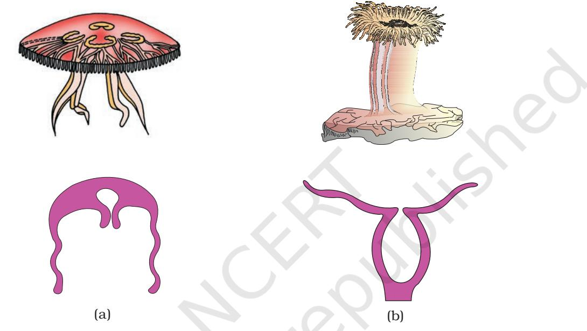

Figure 4.6 Examples of Coelenterata indicating outline of their body form : (a) *Aurelia* (Medusa) (b) *Adamsia* (Polyp)

cnidoblasts or cnidocytes (which contain the stinging capsules or nematocysts) present on the tentacles and the body. Cnidoblasts are used for anchorage, defense and for the capture of prey (Figure 4.7). Cnidarians exhibit tissue level of organisation and are diploblastic. They have a central gastro-vascular cavity with a single opening, mouth on hypostome. Digestion is extracellular and intracellular. Some of the cnidarians, e.g., corals have a skeleton composed of calcium carbonate. Cnidarians exhibit two basic body forms called polyp and medusa (Figure 4.6). The former is a sessile and cylindrical form like Hydra, *Adamsia*, etc. whereas, the

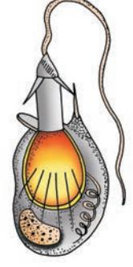

Figure 4.7 Diagrammatic view of Cnidoblast

latter is umbrella-shaped and free-swimming like *Aurelia* or jelly fish. Those cnidarians which exist in both forms exhibit alternation of generation (Metagenesis), i.e., polyps produce medusae asexually and medusae form the polyps sexually (e.g., *Obelia*).

Examples: *Physalia* (Portuguese man-of-war), *Adamsia* (Sea anemone), *Pennatula* (Sea-pen), *Gorgonia* (Sea-fan) and *Meandrina* (Brain coral).

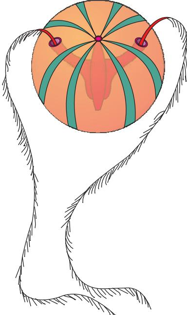

Figure 4.8 Example of Ctenophora (*Pleurobrachia*)

## 4.2.3 Phylum – Ctenophora

Ctenophores, commonly known as sea walnuts or comb jellies are exclusively marine, radially symmetrical, diploblastic organisms with tissue level of organisation. The body bears eight external rows of ciliated comb plates, which help in locomotion (Figure 4.8). Digestion is both extracellular and intracellular. Bioluminescence (the property of a living organism to emit light) is well-marked in ctenophores. Sexes are not separate. Reproduction takes place only by sexual means. Fertilisation is external with indirect development.

Examples: *Pleurobrachia* and *Ctenoplana*.

## 4.2.4 Phylum – Platyhelminthes

They have dorso-ventrally flattened body, hence are called flatworms (Figure 4.9). These are mostly endoparasites found in animals including human beings. Flatworms are bilaterally symmetrical, triploblastic and acoelomate animals with organ level of organisation. Hooks and suckers are present in the parasitic forms. Some of them absorb nutrients from the host directly through their body surface. Specialised cells called flame cells help in osmoregulation and excretion. Sexes are not separate. Fertilisation is internal and development is through many larval stages. Some members like *Planaria* possess high regeneration capacity.

Examples: *Taenia* (Tapeworm), *Fasciola* (Liver fluke)*.*

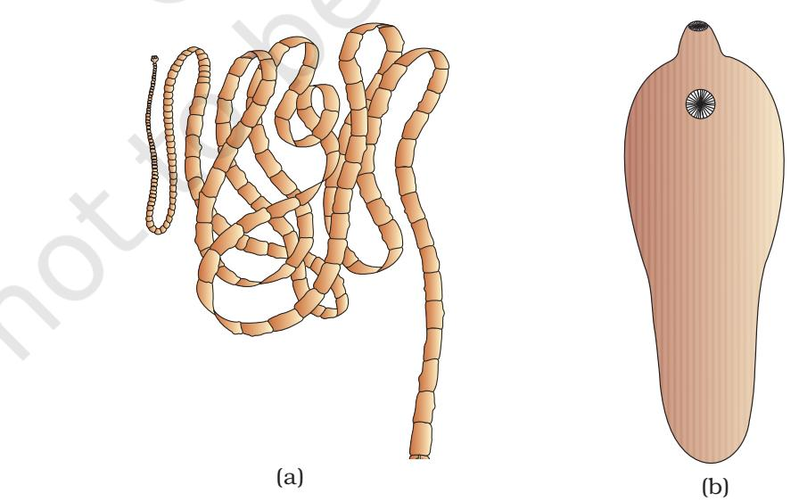

Figure 4.9 Examples of Platyhelminthes : (a) Tape worm (b) Liver fluke

## 4.2.5 Phylum – Aschelminthes

The body of the aschelminthes is circular in cross-section, hence, the name roundworms (Figure 4.10). They may be freeliving, aquatic and terrestrial or parasitic in plants and animals. Roundworms have organ-system level of body organisation. They are bilaterally symmetrical, triploblastic and pseudocoelomate animals. Alimentary canal is complete with a welldeveloped muscular pharynx. An excretory tube removes body wastes from the body cavity through the excretory pore. Sexes are separate (dioecious), i.e., males and females are distinct. Often females are longer than males. Fertilisation is internal and development may be direct (the young ones resemble the adult) or indirect.

Examples : *Ascaris* (Roundworm), *Wuchereria* (Filaria worm), *Ancylostoma* (Hookworm).

#### 4.2.6 Phylum – Annelida

They may be aquatic (marine and fresh water) or terrestrial; free-living, and sometimes parasitic. They exhibit organ-system level of body organisation and bilateral symmetry. They are triploblastic, metamerically segmented and coelomate animals. Their body surface is distinctly marked out into segments or metameres and, hence, the phylum name Annelida (Latin, *annulus* : little ring) (Figure 4.11). They possess longitudinal and circular muscles which help in locomotion. Aquatic annelids like *Nereis* possess lateral appendages, parapodia, which help in swimming. A closed circulatory system is present. Nephridia (sing. nephridium) help in osmoregulation and excretion. Neural system consists of paired ganglia (sing. ganglion) connected by lateral nerves to a double ventral nerve cord. *Nereis,* an aquatic form, is dioecious, but earthworms and leeches are monoecious. Reproduction is sexual.

Examples : *Nereis*, *Pheretima* (Earthworm) and *Hirudinaria* (Blood sucking leech).

Figure 4.11 Examples of Annelida : (a) *Nereis* (b) *Hirudinaria*

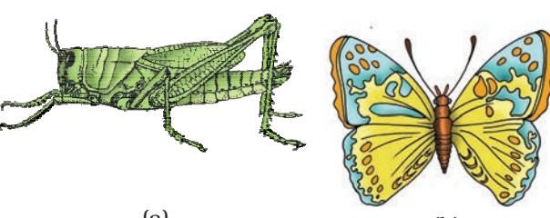

(a)

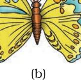

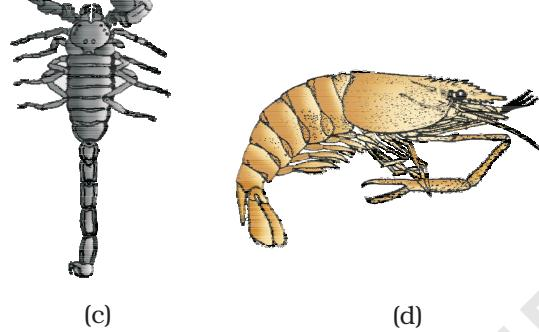

Figure 4.12 Examples of Arthropoda : (a) Locust (b) Butterfly (c) Scorpion (d) Prawn

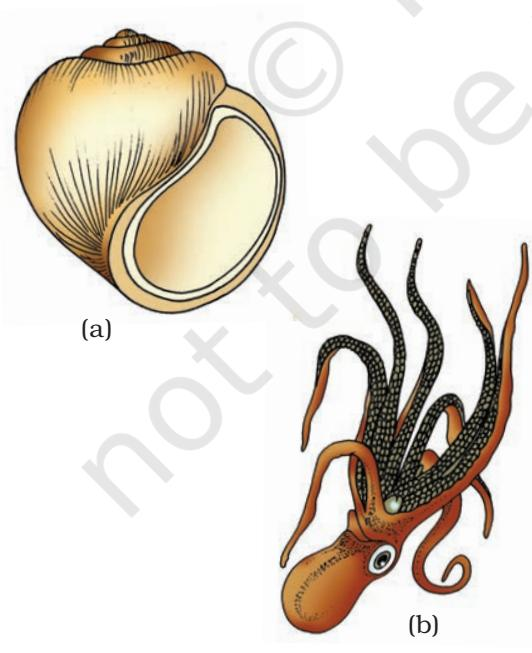

Figure 4.13 Examples of Mollusca : (a) *Pila* (b) *Octopus*

# 4.2.7 Phylum – Arthropoda

This is the largest phylum of Animalia which includes insects. Over two-thirds of all named species on earth are arthropods (Figure 4.12). They have organ-system level of organisation. They are bilaterally symmetrical, triploblastic, segmented and coelomate animals. The body of arthropods is covered by chitinous exoskeleton. The body consists of head, thorax and abdomen. They have jointed appendages (arthros-joint, poda-appendages). Respiratory organs are gills, book gills, book lungs or tracheal system. Circulatory system is of open type. Sensory organs like antennae, eyes (compound and simple), statocysts or balancing organs are present. Excretion takes place through malpighian tubules. They are mostly dioecious. Fertilisation is usually internal. They are mostly oviparous. Development may be direct or indirect.

Examples: Economically important insects *– Apis* (Honey bee), *Bombyx* (Silkworm), *Laccifer* (Lac insect)

Vectors – *Anopheles, Culex* and *Aedes* (Mosquitoes)

Gregarious pest – *Locusta* (Locust) Living fossil – *Limulus* (King crab).

# 4.2.8 Phylum – Mollusca

This is the second largest animal phylum (Figure 4.13). Molluscs are terrestrial or aquatic (marine or fresh water) having an organ-system level of organisation. They are bilaterally symmetrical, triploblastic and coelomate animals. Body is covered by a calcareous shell and is unsegmented with a distinct head, muscular foot and visceral hump. A soft and spongy layer of skin forms a mantle over the visceral hump. The space between the hump and the mantle is called the mantle cavity in which feather like gills are present. They have respiratory and excretory functions. The anterior head region has sensory tentacles. The mouth contains a file-like rasping organ for feeding, called radula.

They are usually dioecious and oviparous with indirect development.

Examples: *Pila* (Apple snail), *Pinctada* (Pearl oyster), *Sepia* (Cuttlefish), *Loligo* (Squid), *Octopus* (Devil fish), *Aplysia* (Seahare), *Dentalium* (Tusk shell) and *Chaetopleura* (Chiton).

## 4.2.9 Phylum – Echinodermata

These animals have an endoskeleton of calcareous ossicles and, hence, the name Echinodermata (Spiny bodied, Figure 4.14). All are marine with organ-system level of organisation. The adult echinoderms are radially symmetrical but larvae are bilaterally symmetrical. They are triploblastic and coelomate animals. Digestive system is complete with mouth on the lower (ventral) side and anus on the upper (dorsal) side. The most distinctive feature of echinoderms is the presence of water vascular system which helps in locomotion, capture and transport of food and respiration. An excretory system is absent. Sexes are separate. Reproduction is sexual. Fertilisation is usually external. Development is indirect with free-swimming larva.

Examples: *Asterias* (Star fish), *Echinus* (Sea urchin), *Antedon* (Sea lily), *Cucumaria* (Sea cucumber) and *Ophiura* (Brittle star).

## 4.2.10 Phylum – Hemichordata

Hemichordata was earlier considered as a sub-phylum under phylum Chordata. But now it is placed as a separate phylum under non-chordata. Hemichordates have a rudimentary structure in the collar region called stomochord, a structure similar to notochord.

This phylum consists of a small group of worm-like marine animals with organ-system level of organisation. They are bilaterally symmetrical, triploblastic and coelomate animals. The body is cylindrical and is composed of an anterior proboscis, a collar and a long trunk (Figure 4.15). Circulatory system is of open type. Respiration takes place through gills. Excretory organ is proboscis gland. Sexes are separate. Fertilisation is external. Development is indirect.

Examples: *Balanoglossus* and *Saccoglossus.*

#### 4.2.11 Phylum – Chordata

Animals belonging to phylum Chordata are fundamentally characterised by the presence of a notochord, a dorsal

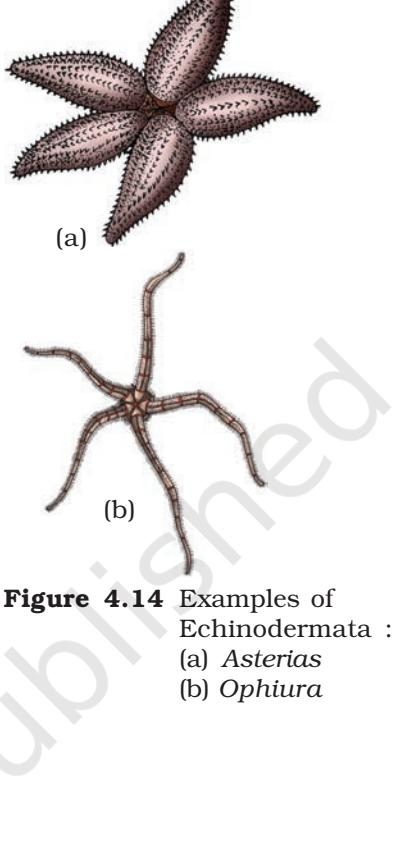

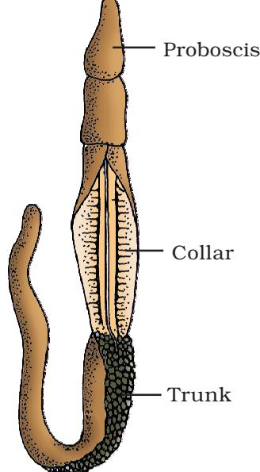

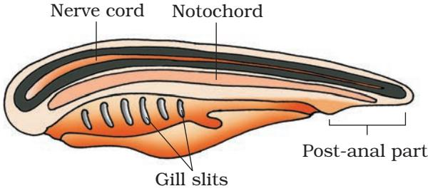

Figure 4.16 Chordata characteristics

S.No. Chordates Non-chordates 1. Notochord present. Notochord absent. 2. Central nervous system is dorsal, Central nervous system is ventral, solid hollow and single. and double. 3. Pharynx perforated by gill slits. Gill slits are absent. 4. Heart is ventral. Heart is dorsal (if present). 5. A post-anal part (tail) is present. Post-anal tail is absent.

TABLE 4.1 Comparison of Chordates and Non-chordates

system.

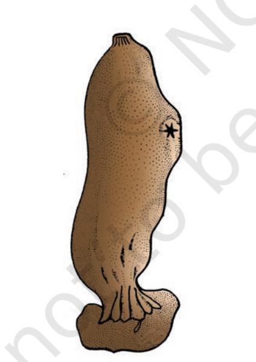

Figure 4.17 *Ascidia*

Phylum Chordata is divided into three subphyla: Urochordata or Tunicata, Cephalochordata and Vertebrata.

hollow nerve cord and paired pharyngeal gill slits (Figure 4.16). These are bilaterally symmetrical, triploblastic, coelomate with organ-system level of organisation. They possess a post anal tail and a closed circulatory

Table 4.1 presents a comparison of salient features of chordates and non-chordates.

Subphyla Urochordata and Cephalochordata are often referred to as protochordates (Figure 4.17) and are exclusively marine. In Urochordata, notochord is present only in larval tail, while in Cephalochordata, it extends from head to tail region and is persistent throughout their life.

Examples: Urochordata – *Ascidia, Salpa, Doliolum;* Cephalochordata – *Branchiostoma* (Amphioxus or Lancelet)*.*

The members of subphylum Vertebrata possess notochord during the embryonic period. The notochord is replaced by a cartilaginous or bony vertebral column in the adult. Thus all vertebrates are chordates but all chordates are not vertebrates. Besides the basic chordate characters, vertebrates have a ventral muscular heart with two, three or four chambers, kidneys for excretion and osmoregulation and paired appendages which may be fins or limbs.

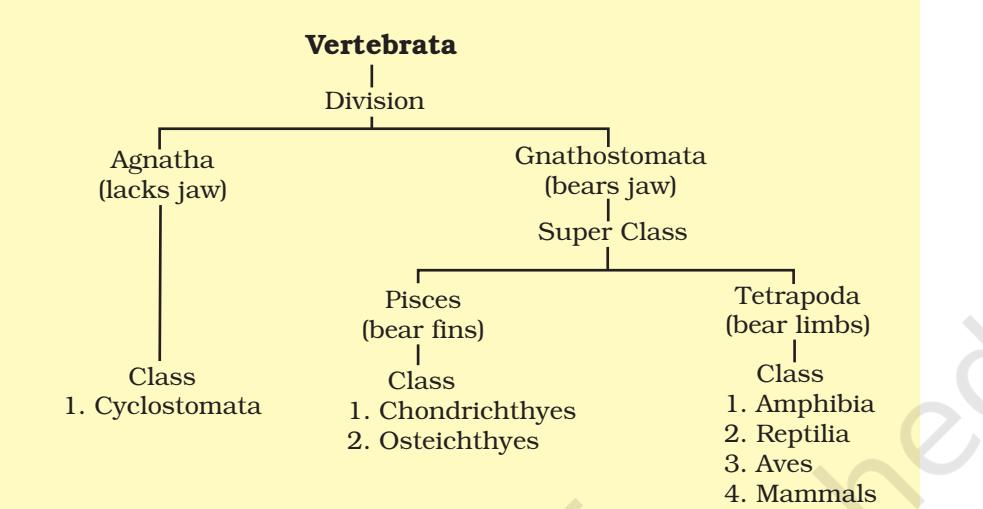

The subphylum Vertebrata is further divided as follows:

#### *4.2.11.1 4.2.11.14.2.11.1 Class – Cyclostomata*

All living members of the class Cyclostomata are ectoparasites on some fishes. They have an elongated body bearing 6-15 pairs of gill slits for respiration. Cyclostomes have a sucking and circular mouth without jaws (Fig. 4.18). Their body is devoid of scales and paired fins. Cranium and vertebral column are cartilaginous. Circulation is of closed type. Cyclostomes are marine but migrate for spawning to fresh water. After spawning, within a few days, they die. Their larvae, after metamorphosis, return to the ocean.

Examples: *Petromyzon* (Lamprey) and *Myxine* (Hagfish).

#### *4.2.11.2 4.2.11.24.2.11.2 Class – Chondrichthyes*

They are marine animals with streamlined body and have cartilaginous endoskeleton (Figure 4.19). Mouth is located ventrally. Notochord is persistent throughout life. Gill slits are separate and without operculum (gill cover). The skin is tough, containing minute placoid scales. Teeth are modified placoid scales which are backwardly directed. Their jaws are very powerful. These animals are predaceous. Due to the absence of air bladder, they have to swim constantly to avoid sinking.

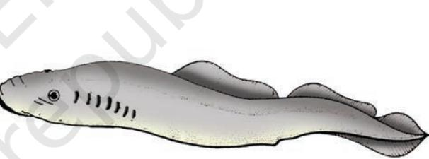

Figure 4.18 A jawless vertebrate - *Petromyzon*

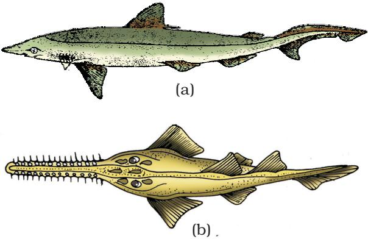

Figure 4.19 Example of Cartilaginous fishes : (a) *Scoliodon* (b) *Pristis*

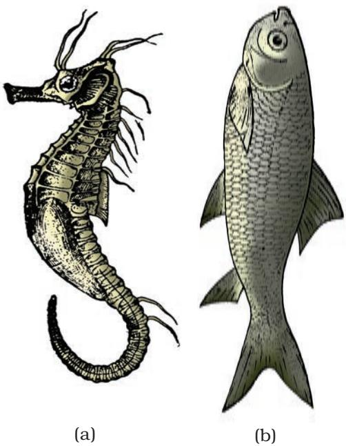

Figure 4.20 Examples of Bony fishes : (a) *Hippocampus* (b) *Catla*

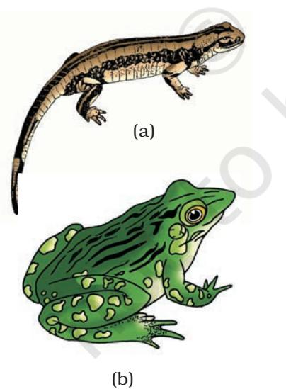

Figure 4.21 Examples of Amphibia : (a) *Salamandra* (b) *Rana*

Heart is two-chambered (one auricle and one ventricle). Some of them have electric organs (e.g., *Torpedo*) and some possess poison sting (e.g., *Trygon*). They are cold-blooded (poikilothermous) animals, i.e., they lack the capacity to regulate their body temperature. Sexes are separate. In males pelvic fins bear claspers. They have internal fertilisation and many of them are viviparous.

Examples: *Scoliodon* (Dog fish), *Pristis* (Saw fish), *Carcharodon* (Great white shark), *Trygon* (Sting ray).

#### *4.2.11.3 4.2.11.34.2.11.3 Class – Osteichthyes*

It includes both marine and fresh water fishes with bony endoskeleton. Their body is streamlined. Mouth is mostly terminal (Figure 4.20). They have four pairs of gills which are covered by an operculum on each side. Skin is covered with cycloid/ctenoid scales. Air bladder is present which regulates buoyancy. Heart is twochambered (one auricle and one ventricle). They are cold-blooded animals. Sexes are separate. Fertilisation is usually external. They are mostly oviparous and development is direct.

Examples: Marine – *Exocoetus* (Flying fish), *Hippocampus* (Sea horse); Freshwater *– Labeo* (Rohu), *Catla* (Katla), *Clarias* (Magur); Aquarium *– Betta* (Fighting fish), *Pterophyllum* (Angel fish).

#### *4.2.11.4 4.2.11.44.2.11.4 Class – Amphibia*

As the name indicates (*Gr., Amphi* : dual, *bios*, life), amphibians can live in aquatic as well as terrestrial habitats (Figure 4.21). Most of them have two pairs of limbs. Body is divisible into head and trunk. Tail may be present in some. The amphibian skin is moist (without scales). The eyes have eyelids. A tympanum represents the ear. Alimentary canal, urinary and reproductive tracts open into a common chamber called cloaca which opens to the exterior. Respiration is by gills, lungs and through skin. The heart is threechambered (two auricles and one ventricle). These are cold-blooded animals. Sexes are separate. Fertilisation is external. They are oviparous and development is indirect.

Examples: *Bufo* (Toad), *Rana* (Frog), *Hyla* (Tree frog), *Salamandra* (Salamander), *Ichthyophis* (Limbless amphibia).

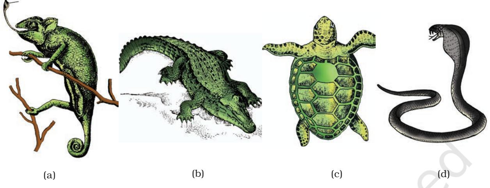

#### *4.2.11.5 4.2.11.54.2.11.5 Class – Reptilia*

The class name refers to their creeping or crawling mode of locomotion (*Latin*, *repere* or *reptum*, to creep or crawl). They are mostly terrestrial animals and their body is covered by dry and cornified skin, epidermal scales or scutes (Fig. 4.22). They do not have external ear openings. Tympanum represents ear. Limbs, when present, are two pairs. Heart is usually three-chambered, but four-chambered in crocodiles. Reptiles are poikilotherms. Snakes and lizards shed their scales as skin cast. Sexes are separate. Fertilisation is internal. They are oviparous and development is direct.

Examples: *Chelone* (Turtle), *Testudo* (Tortoise), *Chameleon* (Tree lizard), *Calotes* (Garden lizard), *Crocodilus* (Crocodile), *Alligator* (Alligator). *Hemidactylus* (Wall lizard), Poisonous snakes *– Naja* (Cobra), *Bangarus* (Krait), *Vipera* (Viper).

#### *4.2.11.6 4.2.11.64.2.11.6 Class – Aves*

The characteristic features of Aves (birds) are the presence of feathers and most of them can fly except flightless birds (e.g., Ostrich). They possess beak (Figure 4.23). The forelimbs are modified into wings. The hind limbs generally have scales and are modified for walking, swimming or clasping the tree branches. Skin is dry without glands except the oil gland at the base of the tail. Endoskeleton is fully ossified (bony) and the long bones are hollow with air cavities (pneumatic). The digestive tract of birds has additional chambers, the crop and gizzard. Heart is completely fourchambered. They are warm-blooded (homoiothermous) animals, i.e., they are able to maintain a constant body temperature. Respiration is by

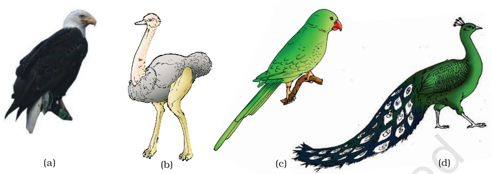

Figure 4.23 Some birds : (a) *Neophron* (b) *Struthio* (c) *Psittacula* (d) *Pavo*

lungs. Air sacs connected to lungs supplement respiration. Sexes are separate. Fertilisation is internal. They are oviparous and development is direct.

Examples : *Corvus* (Crow), *Columba* (Pigeon), *Psittacula* (Parrot), *Struthio* (Ostrich), *Pavo* (Peacock), *Aptenodytes* (Penguin), *Neophron* (Vulture).

#### *4.2.11.7 4.2.11.74.2.11.7 Class – Mammalia*

They are found in a variety of habitats – polar ice caps, deserts, mountains, forests, grasslands and dark caves. Some of them have adapted to fly or live in water. The most unique mammalian characteristic is the presence of milk producing glands (mammary glands) by which the young ones are nourished. They have two pairs of limbs, adapted for walking, running, climbing, burrowing, swimming or flying (Figure 4.24). The skin of

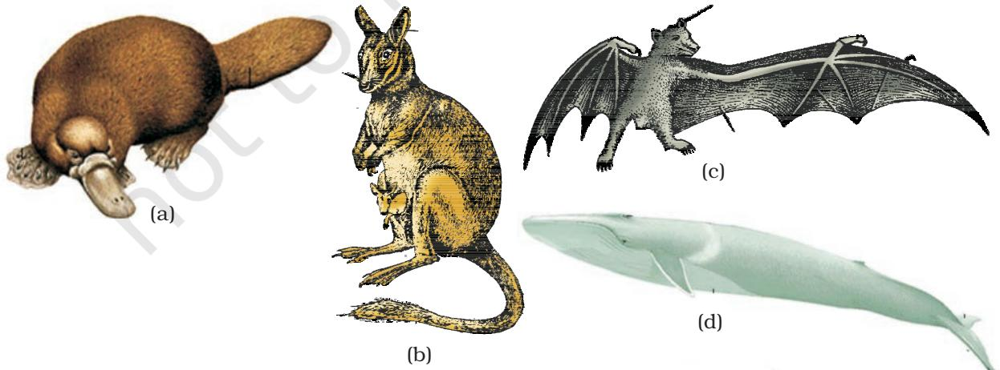

Figure 4.24 Some mammals : (a) *Ornithorhynchus* (b) *Macropus* (c) *Pteropus* (d) *Balaenoptera*

mammals is unique in possessing hair. External ears or pinnae are present. Different types of teeth are present in the jaw. Heart is fourchambered. They are homoiothermous. Respiration is by lungs. Sexes are separate and fertilisation is internal. They are viviparous with few exceptions and development is direct.

Examples: Oviparous-*Ornithorhynchus* (Platypus); Viviparous - *Macropus* (Kangaroo), *Pteropus* (Flying fox), *Camelus* (Camel), *Macaca* (Monkey), *Rattus* (Rat), *Canis* (Dog), *Felis* (Cat), *Elephas* (Elephant), *Equus* (Horse), *Delphinus* (Common dolphin), *Balaenoptera* (Blue whale), *Panthera tigris* (Tiger), *Panthera leo* (Lion).

The salient distinguishing features of all phyla under animal kingdom is comprehensively given in the Table 4.2.

| Phylum | Level of | Symme | Coelom | Segmen | Digestive | Circu | Respi | Distinctive |
| --- | --- | --- | --- | --- | --- | --- | --- | --- |
|  | Organi | try |  | tation | System | latory | ratory | Features |
|  | sation |  |  |  |  | System | System |  |
| Porifera | Cellular | Various | Absent | Absent | Absent | Absent | Absent | Body with pores |
|  |  |  |  |  |  |  |  | and canals in walls. |
| Coelenterata | Tissue |  |  |  |  |  | Absent | Cnidoblasts |
| (Cnidaria) |  | Radial | Absent | Absent | Incomplete | Absent |  | present. |
| Ctenophora | Tissue | Radial | Absent | Absent | Incomplete | Absent | Absent | Comb plates for |
|  | Organ & |  |  |  |  |  |  | locomotion. |
| Platyhelm | Organ | Bilateral | Absent | Absent | Incomplete | Absent | Absent | Flat body, suckers. |
| inthes | system |  |  |  |  |  |  |  |
| Aschelmin | Organ system | Bilateral | Pseudo coelo | Absent | Complete | Absent | Absent | Often worm shaped, |
| thes |  |  | mate |  |  |  |  |  |
|  |  |  |  |  |  |  |  | elongated. |
| Annelida | Organ |  | Coelo |  |  |  |  | Body segment |
|  | system | Bilateral | mate | Present | Complete | Present | Absent | ation like rings. |
|  | Organ system | Bilateral | Coelo | Present | Complete | Present | Present | Exoskeleton of cu ticle, jointed ap |
| Arthropoda |  |  | mate |  |  |  |  | pendages. |
|  | Organ | Bilateral | Coelo | Absent | Complete | Present | Present | External skeleton |
| Mollusca | system |  | mate |  |  |  |  | of shell usually |
|  |  |  |  |  |  |  |  | present. |
| Echino dermata | Organ system | Radial | Coelo mate | Absent | Complete | Present | Present | Water vascular system, radial |
|  |  |  |  |  |  |  |  | symmetry. |
| Hemi | Organ system | Bilateral | Coelo | Absent | Complete | Present | Present | Worm-like with proboscis, collar |
| chordata |  |  | mate |  |  |  |  |  |
|  |  |  |  |  |  |  |  | and trunk. |
| Chordata | Organ | Bilateral | Coelo | Present | Complete | Present | Present | Notochord, dorsal hollow nerve cord, |
|  | system |  | mate |  |  |  |  | gill slits with |
|  |  |  |  |  |  |  |  | limbs or fins. |

TABLE 4.2 Salient Features of Different Phyla in the Animal Kingdom

## SUMMARY

The basic fundamental features such as level of organisation, symmetry, cell organisation, coelom, segmentation, notochord, etc., have enabled us to broadly classify the animal kingdom. Besides the fundamental features, there are many other distinctive characters which are specific for each phyla or class.

Porifera includes multicellular animals which exhibit cellular level of organisation and have characteristic flagellated choanocytes. The coelenterates have tentacles and bear cnidoblasts. They are mostly aquatic, sessile or free-floating. The ctenophores are marine animals with comb plates. The platyhelminths have flat body and exhibit bilateral symmetry. The parasitic forms show distinct suckers and hooks. Aschelminthes are pseudocoelomates and include parasitic as well as non-parasitic roundworms.

Annelids are metamerically segmented animals with a true coelom. The arthropods are the most abundant group of animals characterised by the presence of jointed appendages. The molluscs have a soft body surrounded by an external calcareous shell. The body is covered with external skeleton made of chitin. The echinoderms possess a spiny skin. Their most distinctive feature is the presence of water vascular system. The hemichordates are a small group of worm-like marine animals. They have a cylindrical body with proboscis, collar and trunk.

Phylum Chordata includes animals which possess a notochord either throughout or during early embryonic life. Other common features observed in the chordates are the dorsal, hollow nerve cord and paired pharyngeal gill slits. Some of the vertebrates do not possess jaws (Agnatha) whereas most of them possess jaws (Gnathostomata). Agnatha is represented by the class, Cyclostomata. They are the most primitive chordates and are ectoparasites on fishes. Gnathostomata has two super classes, Pisces and Tetrapoda. Classes Chondrichthyes and Osteichthyes bear fins for locomotion and are grouped under Pisces. The Chondrichthyes are fishes with cartilaginous endoskeleton and are marine. Classes, Amphibia, Reptilia, Aves and Mammalia have two pairs of limbs and are thus grouped under Tetrapoda. The amphibians have adapted to live both on land and water. Reptiles are characterised by the presence of dry and cornified skin. Limbs are absent in snakes. Fishes, amphibians and reptiles are poikilothermous (cold-blooded). Aves are warm-blooded animals with feathers on their bodies and forelimbs modified into wings for flying. Hind limbs are adapted for walking, swimming, perching or clasping. The unique features of mammals are the presence of mammary glands and hairs on the skin. They commonly exhibit viviparity.

## EXERCISES

- 1. What are the difficulties that you would face in classification of animals, if common fundamental features are not taken into account?
- 2. If you are given a specimen, what are the steps that you would follow to classify it?
- 3. How useful is the study of the nature of body cavity and coelom in the classification of animals?
- 4. Distinguish between intracellular and extracellular digestion?
- 5. What is the difference between direct and indirect development?
- 6. What are the peculiar features that you find in parasitic platyhelminthes?
- 7. What are the reasons that you can think of for the arthropods to constitute the largest group of the animal kingdom?
- 8. Water vascular system is the characteristic of which group of the following:
	- (a) Porifera (b) Ctenophora (c) Echinodermata (d) Chordata
- 9. "All vertebrates are chordates but all chordates are not vertebrates". Justify the statement.
- 10. How important is the presence of air bladder in Pisces?
- 11. What are the modifications that are observed in birds that help them fly?
- 12. Could the number of eggs or young ones produced by an oviparous and viviparous mother be equal? Why?
- 13. Segmentation in the body is first observed in which of the following: (a) Platyhelminthes (b) Aschelminthes (c) Annelida (d) Arthropoda
- 14. Match the following:
	- (a) Operculum (i) Ctenophora
	- (b) Parapodia (ii) Mollusca
	- (c) Scales (iii) Porifera
	- (d) Comb plates (iv) Reptilia
	- (e) Radula (v) Annelida
	- (f ) Hairs (vi) Cyclostomata and Chondrichthyes
	- (g) Choanocytes (vii) Mammalia
	- (h) Gill slits (viii) Osteichthyes
- 15. Prepare a list of some animals that are found parasitic on human beings.

