# UNIT 2

## STRUCTURAL ORGANISATION IN PLANTS AND ANIMALS

#### Chapter 5

Morphology of Flowering Plants

#### Chapter 6

Anatomy of Flowering Plants

#### Chapter 7

Structural Organisation in Animals

The description of the diverse forms of life on earth was made only by observation – through naked eyes or later through magnifying lenses and microscopes. This description is mainly of gross structural features, both external and internal. In addition, observable and perceivable living phenomena were also recorded as part of this description. Before experimental biology or more specifically, physiology, was established as a part of biology, naturalists described only biology. Hence, biology remained as a natural history for a long time. The description, by itself, was amazing in terms of detail. While the initial reaction of a student could be boredom, one should keep in mind that the detailed description, was utilised in the later day reductionist biology where living processes drew more attention from scientists than the description of life forms and their structure. Hence, this description became meaningful and helpful in framing research questions in physiology or evolutionary biology. In the following chapters of this unit, the structural organisation of plants and animals, including the structural basis of physiologial or behavioural phenomena, is described. For convenience, this description of morphological and anatomical features is presented separately for plants and animals.

(1898 – 1997)

KATHERINE ESAU was born in Ukraine in 1898. She studied agriculture in Russia and Germany and received her doctorate in 1931 in United States. She reported in her early publications that the curly top virus spreads through a plant via the foodconducting or phloem tissue. Dr Esau's *Plant Anatomy* published in 1954 took a dynamic, developmental approach designed to enhance one's understanding of plant structure and an enormous impact worldwide, literally bringing about a revival of the discipline. The *Anatomy of Seed Plants* by Katherine Esau was published in 1960. It was referred to as Webster's of plant biology – it is encyclopediac. In 1957 she was elected to the National Academy of Sciences, becoming the sixth woman to receive that honour. In addition to this prestigious award, she received the National Medal of Science from President George Bush in 1989.

When Katherine Esau died in the year 1997, Peter Raven, director of Anatomy and Morphology, Missouri Botanical Garden, remembered that she 'absolutely dominated' the field of plant biology even at the age of 99. Katherine Esau

# MORPHOLOGY OF FLOWERING PLANTS CHAPTER 5

- *5.1 The Root*
- *5.2 The Stem*
- *5.3 The Leaf*
- *5.4 The Inflorescence*
- *5.5 The Flower*
- *5.6 The Fruit*
- *5.7 The Seed*
- *5.8 Semi-technical Description of a Typical Flowering Plant*
- *5.9 Description of Some Important Families*

The wide range in the structure of higher plants will never fail to fascinate us. Even though the angiosperms show such a large diversity in external structure or morphology, they are all characterised by presence of roots, stems, leaves, flowers and fruits.

In chapters 2 and 3, we talked about classification of plants based on morphological and other characteristics. For any successful attempt at classification and at understanding any higher plant (or for that matter any living organism) we need to know standard technical terms and standard definitions. We also need to know about the possible variations in different parts, found as adaptations of the plants to their environment, e.g., adaptions to various habitats, for protection, climbing, storage, etc.

If you pull out any weed you will see that all of them have roots, stems and leaves. They may be bearing flowers and fruits. The underground part of the flowering plant is the root system while the portion above the ground forms the shoot system (Figure 5.1).

### 5.1 THE ROOT

In majority of the dicotyledonous plants, the direct elongation of the radicle leads to the formation of primary root which grows inside the soil. It bears lateral roots of several orders that are referred to as secondary, tertiary, etc. roots. The primary roots and its branches constitute the

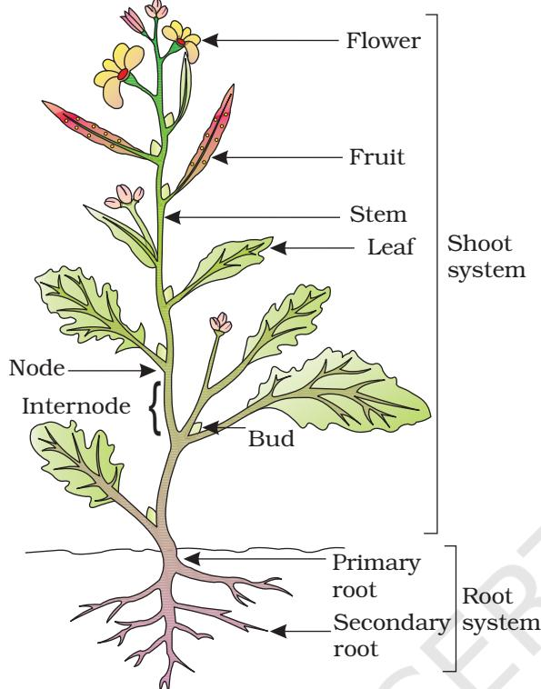

Figure 5.1 Parts of a flowering plant

tap root system, as seen in the mustard plant (Figure 5.2a). In monocotyledonous plants, the primary root is short lived and is replaced by a large number of roots. These roots originate from the base of the stem and constitute the fibrous root system, as seen in the wheat plant (Figure 5.2b). In some plants, like grass, *Monstera* and the banyan tree, roots arise from parts of the plant other than the radicle and are called adventitious roots (Figure 5.2c). The main functions of the root system are absorption of water and minerals from the soil, providing a proper anchorage to the plant parts, storing reserve food material and synthesis of plant growth regulators.

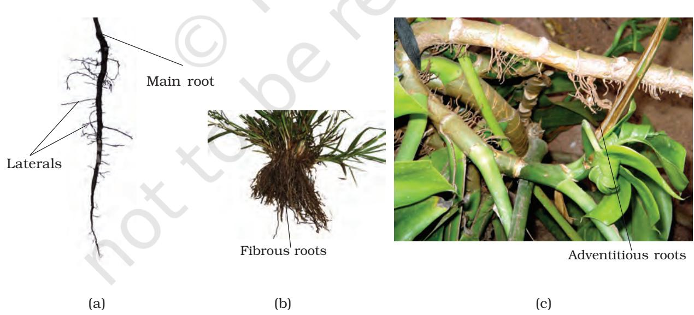

Figure 5.2 Different types of roots : (a) Tap (b) Fibrous (c) Adventitious

#### 5.1.1 Regions of the Root

The root is covered at the apex by a thimble-like structure called the root cap(Figure 5.3)*.* It protects the tender apex of the root as it makes its way through the soil. A few millimetres above the root cap is the region of meristematic activity. The cells of this region are very small, thin-walled and with dense protoplasm. They divide repeatedly. The cells proximal to this region undergo rapid elongation and enlargement and are responsible for the growth of the root in length. This region is called the region of elongation. The cells of the elongation zone gradually differentiate and mature. Hence, this zone, proximal to region of elongation, is called the region of maturation. From this region some of the epidermal cells form very fine and delicate, thread-like structures called root hairs. These root hairs absorb water and minerals from the soil.

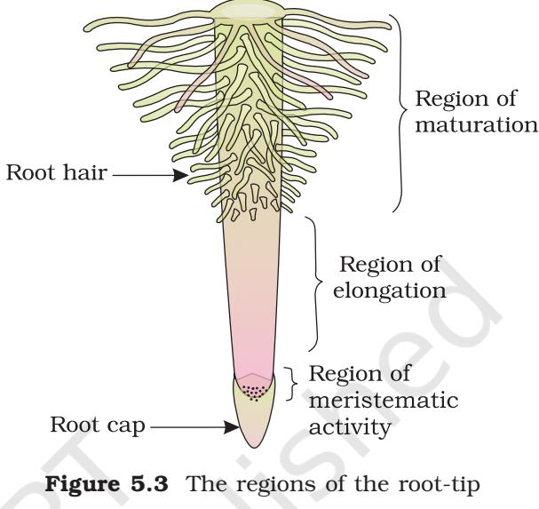

#### 5.2 THE STEM

What are the features that distinguish a stem from a root? The stem is the ascending part of the axis bearing branches, leaves, flowers and fruits. It develops from the plumule of the embryo of a germinating seed. The stem bears nodes and internodes. The region of the stem where leaves are born are called nodes while internodes are the portions between two nodes. The stem bears buds, which may be terminal or axillary. Stem is generally green when young and later often become woody and dark brown.

The main function of the stem is spreading out branches bearing leaves, flowers and fruits. It conducts water, minerals and photosynthates. Some stems perform the function of storage of food, support, protection and of vegetative propagation.

#### 5.3 THE LEAF

The leaf is a lateral, generally flattened structure borne on the stem. It develops at the node and bears a bud in its axil. The axillary bud later develops into a branch. Leaves originate from shoot apical meristems and are arranged in an acropetal order. They are the most important vegetative organs for photosynthesis.

(b) palmately compound leaf

A typical leaf consists of three main parts: leaf base, petiole and lamina (Figure 5.4 a). The leaf is attached to the stem by the leaf base and may bear two lateral small leaf like structures called stipules. In monocotyledons, the leaf base expands into a sheath covering the stem partially or wholly. In some leguminous plants the leafbase may become swollen, which is called the pulvinus. The petiole help hold the blade to light. Long thin flexible petioles allow leaf blades to flutter in wind, thereby cooling the leaf and bringing fresh air to leaf surface. The lamina or the leaf blade is the green expanded part of the leaf with veins and veinlets. There is, usually, a middle prominent vein, which is known as the midrib. Veins provide rigidity to the leaf blade and act as channels of transport for water, minerals and food materials. The shape, margin, apex, surface and extent of incision of lamina varies in different leaves.

#### 5.3.1 Venation

The arrangement of veins and the veinlets in the lamina of leaf is termed as venation. When the veinlets form a network, the venation is termed as reticulate (Figure 5.4 b). When the veins run parallel to each other within a lamina, the venation is termed as parallel (Figure 5.4 c). Leaves of dicotyledonous plants generally possess reticulate venation, while parallel venation is the characteristic of most monocotyledons.

#### 5.3.2 Types of Leaves

A leaf is said to be simple, when its lamina is entire or when incised, the incisions do not touch the midrib. When the incisions of the lamina reach up to the midrib breaking it into a number of leaflets, the leaf is called compound. A bud is present in the axil of petiole in both simple and compound leaves, but not in the axil of leaflets of the compound leaf.

The compound leaves may be of two types (Figure 5.5). In a pinnately compound leaf a number of leaflets are present on a common axis, the rachis, which represents the midrib of the leaf as in neem.

In palmately compound leaves, the leaflets are attached at a common point, i.e., at the tip of petiole, as in silk cotton.

#### 5.3.3 Phyllotaxy

Phyllotaxy is the pattern of arrangement of leaves on the stem or branch. This is usually of three types – alternate, opposite and whorled (Figure 5.6). In alternate type of phyllotaxy, a single leaf arises at each node in alternate manner, as in china rose, mustard and sun flower plants. In opposite type, a pair of leaves arise at each node and lie opposite to each other as in *Calotropis* and guava plants. If more than two leaves arise at a node and form a whorl, it is called whorled, as in *Alstonia.*

#### 5.4 THE INFLORESCENCE

A flower is a modified shoot wherein the shoot apical meristem changes to floral meristem. Internodes do not elongate and the axis gets condensed. The apex produces different kinds of floral appendages laterally at successive nodes instead of leaves. When a shoot tip transforms into a flower, it is always solitary. The arrangement of flowers on the floral axis is termed as inflorescence. Depending on whether the apex gets developed into a flower or continues to grow, two major types of inflorescences are defined – racemose and cymose. In racemose type of inflorescences the main axis continues to grow, the flowers are borne laterally in an acropetal succession (Figure 5.7).

In cymose type of inflorescence the main axis terminates in a flower, hence is limited in growth.The flowers are borne in a basipetal order (Figure 5.7).

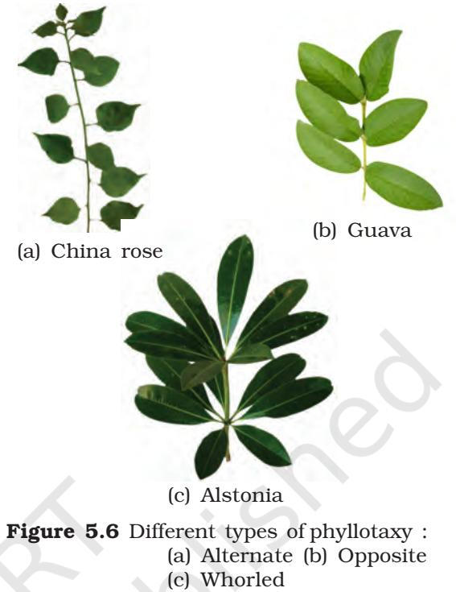

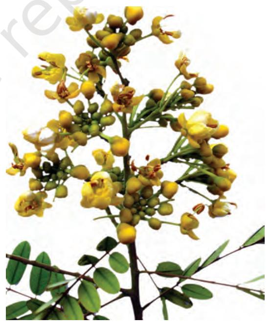

Figure 5.7 Racemose inflorescence

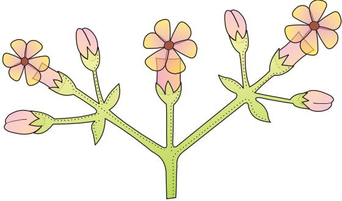

Figure 5.8 Cymose inflorescence

#### 5.5 THE FLOWER

The flower is the reproductive unit in the angiosperms. It is meant for sexual reproduction. A typical flower has four different kinds of whorls arranged successively on the swollen end of the stalk or pedicel, called thalamus or receptacle. These are calyx, corolla, androecium and gynoecium. Calyx and corolla are accessory organs, while androecium and gynoecium are reproductive organs. In some flowers like lily, the calyx and corolla are not distinct and are termed

as perianth. When a flower has both androecium and gynoecium, it is bisexual. A flower having either only stamens or only carpels is unisexual.

In symmetry, the flower may be actinomorphic (radial symmetry) or zygomorphic (bilateral symmetry). When a flower can be divided into two equal radial halves in any radial plane passing through the centre, it is said to be actinomorphic, e.g., mustard, *datura*, chilli. When it can be divided into two similar halves only in one particular vertical plane, it is zygomorphic, e.g., pea, gulmohur, bean, *Cassia*. A flower is asymmetric (irregular) if it cannot be divided into two similar halves by any vertical plane passing through the centre, as in canna*.*

A flower may be trimerous, tetramerous or pentamerous when the floral appendages are in multiple of 3, 4 or 5, respectively. Flowers with bracts-reduced leaf found at the base of the pedicel - are called bracteate and those without bracts, ebracteate.

Figure 5.9 Position of floral parts on thalamus : (a) Hypogynous (b) and (c) Perigynous (d) Epigynous

Based on the position of calyx, corolla and androecium in respect of the ovary on thalamus, the flowers are described as hypogynous, perigynous and epigynous (Figure 5.9). In the hypogynous flower the gynoecium occupies the highest position while the other parts are situated below it. The ovary in such flowers is said to be superior, e.g., mustard, china rose and brinjal. If gynoecium is situated in the centre and other parts of the flower are located on the rim of the thalamus almost at the same level, it is called perigynous. The ovary here is said to be half inferior, e.g., plum, rose, peach. In epigynous flowers, the margin of thalamus grows upward enclosing the ovary completely and getting fused with it, the other parts of flower arise above the ovary. Hence, the ovary is said to be inferior as in flowers of guava and cucumber, and the ray florets of sunflower.

#### 5.5.1 Parts of a Flower

Each flower normally has four floral whorls, viz., calyx, corolla, androecium and gynoecium (Figure 5.10).

#### *5.5.1.1 5.5.1.1 Calyx*

The calyx is the outermost whorl of the flower and the members are called sepals. Generally, sepals are green, leaf like and protect the flower in the bud stage. The calyx may be gamosepalous (sepals united) or polysepalous (sepals free).

#### *5.5.1.2 5.5.1.2 Corolla Corolla*

Corolla is composed of petals. Petals are usually brightly coloured to attract insects for pollination. Like calyx, corolla may also be gamopetalous (petals united) or polypetalous (petals free). The shape and colour of corolla vary greatly in plants. Corolla may be tubular, bellshaped, funnel-shaped or wheel-shaped.

Aestivation: The mode of arrangement of sepals or petals in floral bud with respect to the other members of the same whorl is known as aestivation. The main types of aestivation are valvate, twisted, imbricate

Figure 5.10 Parts of a flower

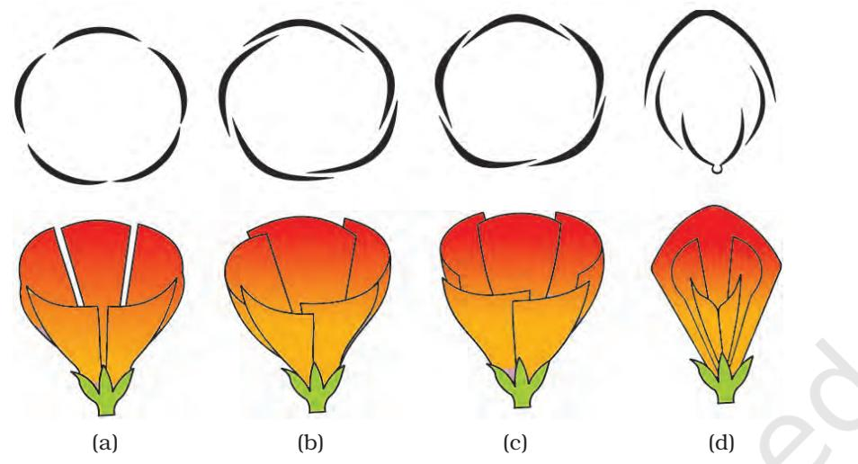

Figure 5.11 Types of aestivation in corolla : (a) Valvate (b) Twisted (c) Imbricate (d) Vexillary

and vexillary (Figure 5.11). When sepals or petals in a whorl just touch one another at the margin, without overlapping, as in *Calotropis*, it is said to be valvate. If one margin of the appendage overlaps that of the next one and so on as in china rose, lady's finger and cotton, it is called twisted. If the margins of sepals or petals overlap one another but not in any particular direction as in *Cassia* and gulmohur, the aestivation is called imbricate. In pea and bean flowers, there are five petals, the largest (standard) overlaps the two lateral petals (wings) which in turn overlap the two smallest anterior petals (keel); this type of aestivation is known as vexillary or papilionaceous.

#### *5.5.1.3 5.5.1.3 Androecium*

Androecium is composed of stamens. Each stamen which represents the male reproductive organ consists of a stalk or a filament and an anther. Each anther is usually bilobed and each lobe has two chambers, the pollen-sacs. The pollen grains are produced in pollen-sacs. A sterile stamen is called staminode.

Stamens of flower may be united with other members such as petals or among themselves. When stamens are attached to the petals, they are epipetalous as in brinjal, or epiphyllous when attached to the perianth as in the flowers of lily. The stamens in a flower may either remain free (polyandrous) or may be united in varying degrees. The stamens may be united into one bunch or one bundle (monoadelphous) as in china rose, or two bundles (diadelphous) as in pea, or into more than two bundles (polyadelphous) as in citrus. There may be a variation in the length of filaments within a flower, as in *Salvia* and mustard.

#### *5.5.1.4 5.5.1.4 Gynoecium*

Gynoecium is the female reproductive part of the flower and is made up of one or more carpels. A carpel consists of three parts namely stigma, style and ovary. Ovary is the enlarged basal part, on which lies the elongated tube, the style. The style connects the ovary to the stigma. The stigma is usually at the tip of the style and is the receptive surface for pollen grains. Each ovary bears one or more ovules attached to a flattened, cushion-like placenta. When more than one carpel is present, they may be free (as in lotus and rose) and are called apocarpous. They are termed syncarpous when carpels are fused, as in mustard and tomato. After fertilisation, the ovules develop into seeds and the ovary matures into a fruit.

Placentation: The arrangement of ovules within the ovary is known as placentation. The placentation are of different types namely, marginal, axile, parietal, basal, central and free central (Figure 5.12). In marginal placentation the placenta forms a ridge along the ventral suture of the ovary and the ovules are borne on this ridge forming two rows, as in pea. When the placenta is axial and the ovules are attached to it in a multilocular ovary, the placentaion is said to be axile, as in china rose, tomato and lemon. In parietal placentation, the ovules develop on the inner wall of the ovary or on peripheral part. Ovary is one-chambered but it becomes twochambered due to the formation of the false septum, e.g., mustard and *Argemone*. When the ovules are borne on central axis and septa are absent, as in *Dianthus* and *Primrose* the placentation is called free central. In basal placentation, the placenta develops at the base of ovary and a single ovule is attached to it, as in sunflower, marigold.

#### 5.6 THE FRUIT

The fruit is a characteristic feature of the flowering plants. It is a mature or ripened ovary, developed after fertilisation. If a fruit is formed without fertilisation of the ovary, it is called a parthenocarpic fruit.

Generally, the fruit consists of a wall or pericarp and seeds. The pericarp may be dry or fleshy. When pericarp is thick and fleshy, it is differentiated into the outer epicarp, the middle mesocarp and the inner endocarp.

In mango and coconut, the fruit is known as a drupe (Figure 5.13). They develop from monocarpellary superior ovaries and are one seeded. In mango the pericarp is well differentiated into an

- (a) Marginal
- (b) Axile
- (c) Parietal
- (d) Free central
- (e) Basal

Figure 5.13 Parts of a fruit : (a) Mango (b) Coconut

outer thin epicarp, a middle fleshy edible mesocarp and an inner stony hard endocarp. In coconut which is also a drupe, the mesocarp is fibrous.

#### 5.7 THE SEED

The ovules after fertilisation, develop into seeds. A seed is made up of a seed coat and an embryo. The embryo is made up of a radicle, an embryonal axis and one (as in wheat, maize) or two cotyledons (as in gram and pea).

#### 5.7.1 Structure of a Dicotyledonous Seed

The outermost covering of a seed is the seed coat. The seed coat has two layers, the outer testa and the inner tegmen. The hilum is a scar on the seed coat through which the developing seeds were attached to the fruit.

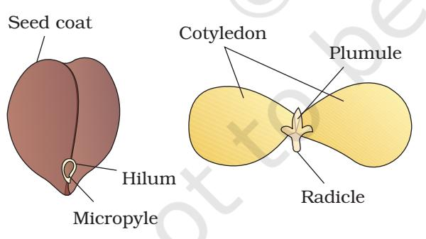

Figure 5.14 Structure of dicotyledonous seed

Above the hilum is a small pore called the micropyle. Within the seed coat is the embryo, consisting of an embryonal axis and two cotyledons. The cotyledons are often fleshy and full of reserve food materials. At the two ends of the embryonal axis are present the radicle and the plumule (Figure 5.14). In some seeds such as castor the endosperm formed as a result of double fertilisation, is a food storing tissue and called endospermic seeds. In plants such as bean, gram and pea, the endosperm is not present in mature seeds and such seeds are called non-endospermous.

#### 5.7.2 Structure of Monocotyledonous Seed

Generally, monocotyledonous seeds are endospermic but some as in orchids are non-endospermic. In the seeds of cereals such as maize the

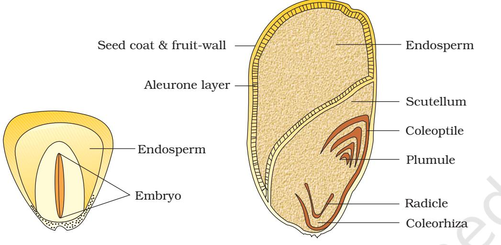

Figure 5.15 Structure of a monocotyledonous seed

seed coat is membranous and generally fused with the fruit wall. The endosperm is bulky and stores food. The outer covering of endosperm separates the embryo by a proteinous layer called aleurone layer. The embryo is small and situated in a groove at one end of the endosperm. It consists of one large and shield shaped cotyledon known as scutellum anda short axis with a plumule and aradicle. The plumule and radicle are enclosed in sheaths which are called coleoptile and coleorhiza respectively (Figure 5.15).

#### 5.8 SEMI-TECHNICAL DESCRIPTION OF A TYPICAL FLOWERING PLANT

Various morphological features are used to describe a flowering plant. The description has to be brief, in a simple and scientific language and presented in a proper sequence. The plant is described beginning with its habit, vegetative characters – roots, stem and leaves and then floral characters inflorescence and flower parts. After describing various parts of plant, a floral diagram and a floral formula are presented. The floral formula is represented by some symbols. In the floral formula, Br stands for bracteate K stands for calyx , C for corolla, P for perianth, A for androecium and G for Gynoecium, G for superior ovary and G for inferior ovary, for male, for female, for bisexual plants, ⊕ for actinomorphic Figure 5.16 Floral diagram with

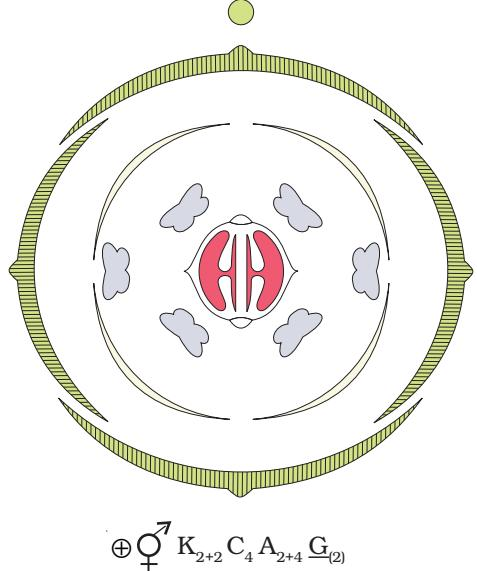

floral formula

and for zygomorphic nature of flower. Fusion is indicated by enclosing the figure within bracket and adhesion by a line drawn above the symbols of the floral parts. A floral diagram provides information about the number of parts of a flower, their arrangement and the relation they have with one another (Figure 5.16). The position of the mother axis with respect to the flower is represented by a dot on the top of the floral diagram. Calyx, corolla, androecium and gynoecium are drawn in successive whorls, calyx being the outermost and the gynoecium being in the centre. Floral formula also shows cohesion and adhesion within parts of whorls and between whorls. The floral diagram and floral formula in Figure 5.16 represents the mustard plant (Family: Brassicaceae).

#### 5.9 SOLANACEAE

It is a large family, commonly called as the 'potato family'. It is widely distributed in tropics, subtropics and even temperate zones (Figure 5.17).

#### Vegetative Characters

Plants mostly herbs, shrubs and rarely small trees

Stem: herbaceous rarely woody, aerial; erect, cylindrical, branched, solid or hollow, hairy or glabrous, underground stem in potato (*Solanum tuberosum*)

Leaves: alternate, simple, rarely pinnately compound, exstipulate; venation reticulate

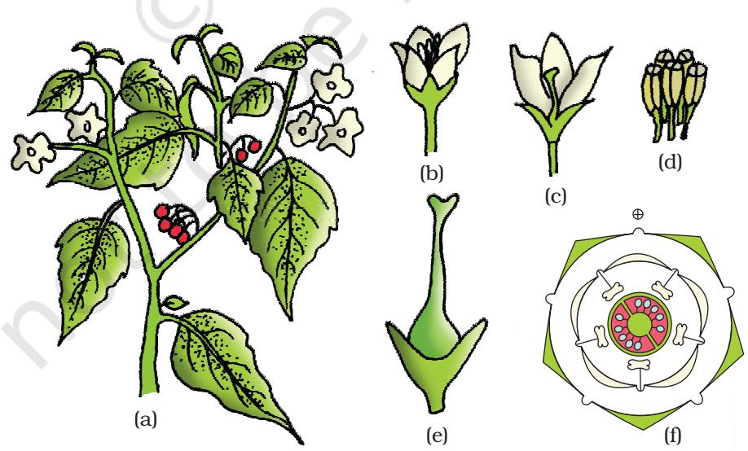

Figure 5.17 *Solanum nigrum* (makoi) plant : (a) Flowering twig (b) Flower (c) L.S. of flower (d) Stamens (e) Carpel (f) Floral diagram

#### Floral Characters

Inflorescence : Solitary, axillary or cymose as in *Solanum* Flower: bisexual, actinomorphic Calyx: sepals five, united, persistent, valvate aestivation Corolla: petals five, united; valvate aestivation Androecium: stamens five, epipetalous Gynoecium: bicarpellary obligately placed, syncarpous; ovary superior, bilocular, placenta swollen with many ovules, axile Fruits: berry or capsule Seeds: many, endospermous Floral Formula: ⊕

#### Economic Importance

Many plants belonging to this family are source of food (tomato, brinjal, potato), spice (chilli); medicine (belladonna, *ashwagandha*); fumigatory (tobacco); ornamentals (petunia).

#### SUMMARY

Flowering plants exhibit enormous variation in shape, size, structure, mode of nutrition, life span, habit and habitat. They have well developed root and shoot systems. Root system is either tap root or fibrous. Generally, dicotyledonous plants have tap roots while monocotyledonous plants have fibrous roots. The roots in some plants get modified for storage of food, mechanical support and respiration. The shoot system is differentiated into stem, leaves, flowers and fruits. The morphological features of stems like the presence of nodes and internodes, multicellular hair and positively phototropic nature help to differentiate the stems from roots. Leaf is a lateral outgrowth of stem developed exogeneously at the node. These are green in colour to perform the function of photosynthesis. Leaves exhibit marked variations in their shape, size, margin, apex and extent of incisions of leaf blade (lamina).

The flower is a modified shoot, meant for sexual reproduction. The flowers are arranged in different types of inflorescences. They exhibit enormous variation in structure, symmetry, position of ovary in relation to other parts, arrangement of petals, sepals, ovules etc. After fertilisation, the ovary is modified into fruits and ovules into seeds. Seeds either may be monocotyledonous or dicotyledonous. They vary in shape, size and period of viability. The floral characteristics form the basis of classification and identification of flowering plants. This can be illustrated through semitechnical descriptions of families. Hence, a flowering plant is described in a definite sequence by using scientific terms. The floral features are represented in the summarised form as floral diagrams and floral formula.

#### EXERCISES

- 1. How is a pinnately compound leaf different from a palmately compound leaf?
- 2. Explain with suitable examples the different types of phyllotaxy.
- 3. Define the following terms:
	- (a) aestivation (b) placentation (c) actinomorphic
	- (d) zygomorphic (e) superior ovary (f) perigynous flower
	- (g) epipetalous stamen
- 4. Differentiate between
	- (a) Racemose and cymose inflorescence
	- (b) Apocarpous and syncarpous ovary
- 5. Draw the labelled diagram of the following: (i) gram seed (ii) V.S. of maize seed
- 6. Take one flower of the family Solanaceae and write its semi-technical description. Also draw their floral diagram.

7. Describe the various types of placentations found in flowering plants.

- 8. What is a flower? Describe the parts of a typical angiosperm flower.
- 9. Define the term inflorescence. Explain the basis for the different types inflorescence in flowering plants.
- 10. Describe the arrangement of floral members in relation to their insertion on thalamus.

