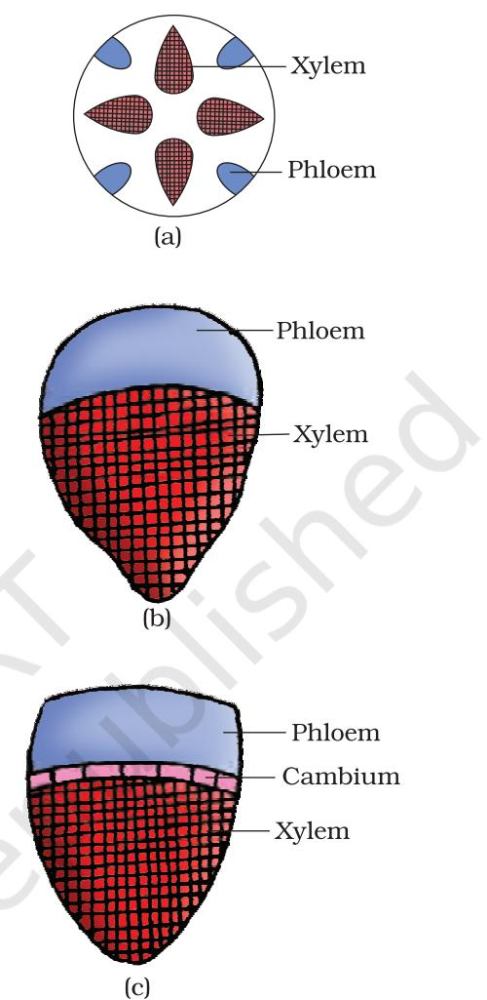
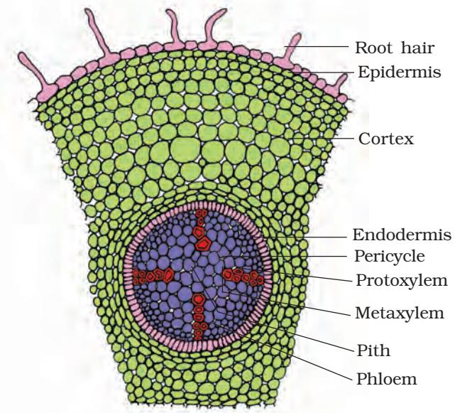
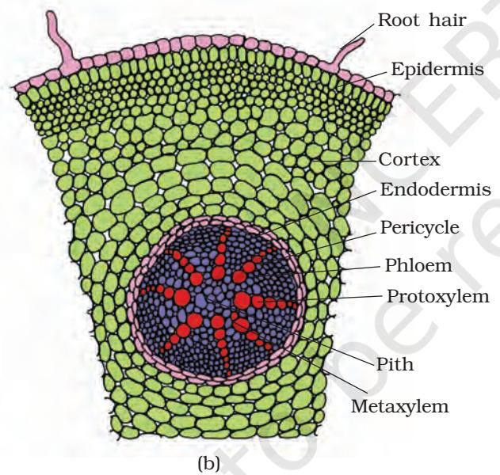
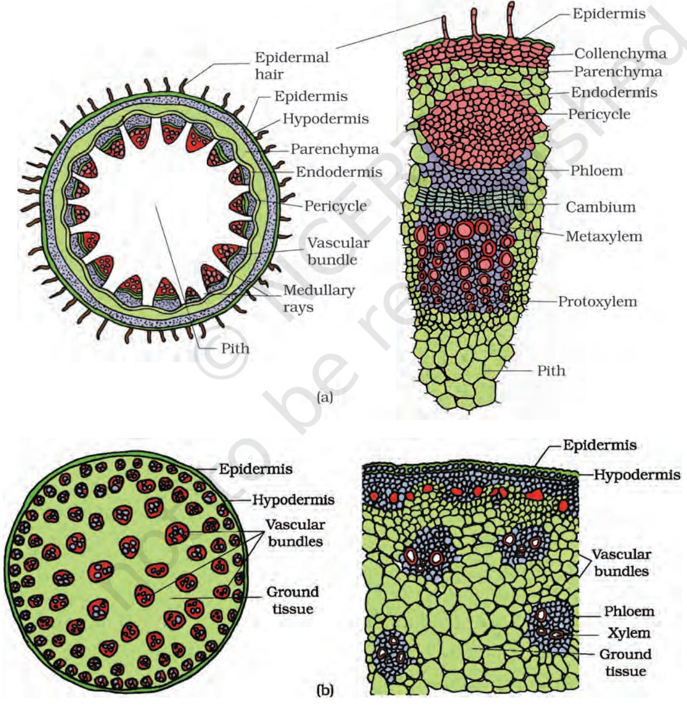

# ANATOMY OF FLOWERING PLANTS CHAPTER 6

ANATOMY OF FLOWERING PLANTS 71

- *6.1 The Tissue System*
- *6.2 Anatomy of Dicotyledonous and Monocotyledonous Plants*

You can very easily see the structural similarities and variations in the external morphology of the larger living organism, both plants and animals. Similarly, if we were to study the internal structure, one also finds several similarities as well as differences. This chapter introduces you to the internal structure and functional organisation of higher plants. Study of internal structure of plants is called anatomy. Plants have cells as the basic unit, cells are organised into tissues and in turn the tissues are organised into organs. Different organs in a plant show differences in their internal structure. Within angiosperms, the monocots and dicots are also seen to be anatomically different. Internal structures also show adaptations to diverse environments.

# 6.1 THE TISSUE SYSTEM

We were discussing types of tissues based on the types of cells present. Let us now consider how tissues vary depending on their location in the plant body. Their structure and function would also be dependent on location. On the basis of their structure and location, there are three types of tissue systems. These are the epidermal tissue system, the ground or fundamental tissue system and the vascular or conducting tissue system.

## 6.1.1 Epidermal Tissue System

The epidermal tissue system forms the outer-most covering of the whole plant body and comprises epidermal cells, stomata and the epidermal appendages – the trichomes and hairs. The epidermis is the outermost layer of the primary plant body. It is made up of elongated, compactly arranged cells, which form a continuous layer. Epidermis is usually singlelayered. Epidermal cells are parenchymatous with a small amount of cytoplasm lining the cell wall and a large vacuole. The outside of the epidermis is often covered with a waxy thick layer called the cuticle which prevents the loss of water. Cuticle is absent in roots. Stomata are structures present in the epidermis of leaves. Stomata regulate the process of transpiration and gaseous exchange. Each stoma is composed of two beanshaped cells known as guard cells which enclose stomatal pore. In grasses, the guard cells are dumb-bell shaped. The outer walls of guard cells (away from the stomatal pore) are thin and the inner walls (towards the stomatal pore) are highly thickened. The guard cells possess chloroplasts and regulate the opening and closing of stomata. Sometimes, a few epidermal cells, in the vicinity of the guard cells become specialised in their shape and size and are known as subsidiary cells. The stomatal aperture, guard cells and the surrounding subsidiary cells are together called stomatal apparatus (Figure 6.1).

Figure 6.1 Diagrammatic representation: (a) stomata with bean-shaped guard cells (b) stomata with dumb-bell shaped guard cell

The cells of epidermis bear a number of hairs. The root hairs are unicellular elongations of the epidermal cells and help absorb water and minerals from the soil. On the stem the epidermal hairs are called trichomes. The trichomes in the shoot system are usually multicellular. They may be branched or unbranched and soft or stiff. They may even be secretory. The trichomes help in preventing water loss due to transpiration.

## 6.1.2 The Ground Tissue System

All tissues except epidermis and vascular bundles constitute the ground tissue. It consists of simple tissues such as parenchyma, collenchyma and sclerenchyma. Parenchymatous cells are usually present in cortex, pericycle, pith and medullary rays, in the primary stems and roots. In leaves, the ground tissue consists of thin-walled chloroplast containing cells and is called mesophyll.

## 6.1.3 The Vascular Tissue System

The vascular system consists of complex tissues, the phloem and the xylem.The xylem and phloem together constitute vascular bundles (Figure 6.2). In dicotyledonous stems, cambium is present between phloem and xylem. Such vascular bundles because of the presence of cambium possess the ability to form secondary xylem and phloem tissues, and hence are called open vascular bundles. In the monocotyledons, the vascular bundles have no cambium present in them. Hence, since they do not form secondary tissues they are referred to as closed. When xylem and phloem within a vascular bundle are arranged in an alternate manner along the different radii, the arrangement is called radial such as in roots. In conjoint type of vascular bundles, the xylem and phloem are jointly situated along the same radius of vascular bundles. Such vascular bundles are common in stems and leaves. The conjoint vascular bundles usually have the phloem located only on the outer side of xylem.

# 6.2 ANATOMY OF DICOTYLEDONOUS AND MONOCOTYLEDONOUS PLANTS

For a better understanding of tissue organisation of roots, stems and leaves, it is convenient to study the transverse sections of the mature zones of these organs.

## 6.2.1 Dicotyledonous Root

Look at Figure 6.3 (a), it shows the transverse section of the sunflower root. The internal tissue organisation is as follows:

The outermost layer is epiblema. Many of the cells of epiblema protrude in the form of unicellular root hairs. The cortex consists of several layers of thin-walled parenchyma cells

- Figure 6.2 Various types of vascular bundles : (a) radial (b) conjoint closed (c) conjoint open

(a)

Figure 6.3 T.S. : (a) Dicot root (Primary) (b) Monocot root

with intercellular spaces. The innermost layer of the cortex is called endodermis. It comprises a single layer of barrelshaped cells without any intercellular spaces. The tangential as well as radial walls of the endodermal cells have a deposition of water-impermeable, waxy material suberin in the form of casparian strips. Next to endodermis lies a few layers of thick-walled parenchyomatous cells referred to as pericycle. Initiation of lateral roots and vascular cambium during the secondary growth takes place in these cells. The pith is small or inconspicuous. The parenchymatous cells which lie between the xylem and the phloem are called conjuctive tissue. There are usually two to four xylem and phloem patches. Later, a cambium ring develops between the xylem and phloem. All tissues on the innerside of the endodermis such as pericycle, vascular bundles and pith constitute the stele.

#### 6.2.2 Monocotyledonous Root

The anatomy of the monocot root is similar to the dicot root in many respects (Figure 6.3 b).Ithas epidermis, cortex, endodermis, pericycle, vascular bundles and pith. As compared to the dicot root which have fewer xylem bundles, there are usually more than six (polyarch) xylem bundles in the monocot root. Pith is large and well developed. Monocotyledonous roots do not undergo any secondary growth.

#### 6.2.3 Dicotyledonous Stem

The transverse section of a typical young dicotyledonous stem shows that the epidermis is the outermost protective layer of the stem

(Figure 6.4 a). Covered with a thin layer of cuticle, it may bear trichomes and a few stomata. The cells arranged in multiple layers between epidermis and pericycle constitute the cortex. It consists of three sub-zones. The outer hypodermis, consists of a few layers of collenchymatous cells just below the epidermis, which provide mechanical strength to the young stem. Cortical layers below hypodermis consist of rounded thin walled parenchymatous cells with conspicuous intercellular spaces. The innermost layer of the cortex is called the endodermis. The cells of the endodermis are rich in starch grains and the layer is also referred to as the starch sheath. Pericycle is

Figure 6.4 T.S. of stem : (a) Dicot (b) Monocot

present on the inner side of the endodermis and above the phloem in the form of semi-lunar patches of sclerenchyma. In between the vascular bundles there are a few layers of radially placed parenchymatous cells, which constitute medullary rays. A large number of vascular bundles are arranged in a ring ; the 'ring' arrangement of vascular bundles is a characteristic of dicot stem. Each vascular bundle is conjoint, open, and with endarch protoxylem. A large number of rounded, parenchymatous cells with large intercellular spaces which occupy the central portion of the stem constitute the pith.

#### 6.2.4 Monocotyledonous Stem

The monocot stem has a sclerenchymatous hypodermis, a large number of scattered vascular bundles, each surrounded by a sclerenchymatous

Figure 6.5 T.S. of leaf : (a) Dicot (b) Monocot

bundle sheath, and a large, conspicuous parenchymatous ground tissue (Figure 6.4 b). Vascular bundles are conjoint and closed. Peripheral vascular bundles are generally smaller than the centrally located ones. The phloem parenchyma is absent, and water-containing cavities are present within the vascular bundles.

## 6.2.5 Dorsiventral (Dicotyledonous) Leaf

The vertical section of a dorsiventral leaf through the lamina shows three main parts, namely, epidermis, mesophyll and vascular system. The epidermis which covers both the upper surface (adaxial epidermis) and lower surface (abaxial epidermis) of the leaf has a conspicuous cuticle. The abaxial epidermis generally bears more stomata than the adaxial epidermis. The latter may even lack stomata. The tissue between the upper and the lower epidermis is called the mesophyll. Mesophyll, which possesses chloroplasts and carry out photosynthesis, is made up of parenchyma. It has two types of cells – the palisade parenchyma and the spongy parenchyma. The adaxially placed palisade parenchyma is made up of elongated cells, which are arranged

vertically and parallel to each other. The oval or round and loosely arranged spongy parenchyma is situated below the palisade cells and extends to the lower epidermis. There are numerous large spaces and air cavities between these cells. Vascular system includes vascular bundles, which can be seen in the veins and the midrib. The size of the vascular bundles are dependent on the size of the veins. The veins vary in thickness in the reticulate venation of the dicot leaves. The vascular bundles are surrounded by a layer of thick walled bundle sheath cells. Look at Figure 6.5 (a) and find the position of xylem in the vascular bundle.

#### 6.2.6 Isobilateral (Monocotyledonous) Leaf

The anatomy of isobilateral leaf is similar to that of the dorsiventral leaf in many ways. It shows the following characteristic differences. In an isobilateral leaf, the stomata are present on both the surfaces of the epidermis; and the mesophyll is not differentiated into palisade and spongy parenchyma (Figure 6.5 b).

In grasses, certain adaxial epidermal cells along the veins modify themselves into large, empty, colourless cells. These are called bulliform cells. When the bulliform cells in the leaves have absorbed water and are turgid, the leaf surface is exposed. When they are flaccid due to water stress, they make the leaves curl inwards to minimise water loss.

The parallel venation in monocot leaves is reflected in the near similar sizes of vascular bundles (except in main veins) as seen in vertical sections of the leaves.

## SUMMARY

Anatomically, a plant is made of different kinds of tissues. The plant tissues are broadly classified into meristematic (apical, lateral and intercalary) and permanent (simple and complex). Assimilation of food and its storage, transportation of water, minerals and photosynthates, and mechanical support are the main functions of tissues. There are three types of tissue systems – epidermal, ground and vascular. The epidermal tissue systems are made of epidermal cells, stomata and the epidermal appendages. The ground tissue system forms the main bulk of the plant. It is divided into three zones – cortex, pericycle and pith. The vascular tissue system is formed by the xylem and phloem. On the basis of presence of cambium, location of xylem and phloem, the vascular bundles are of different types. The vascular bundles form the conducting tissue and translocate water, minerals and food material.

Monocotyledonous and dicotyledonous plants show marked variation in their internal structures. They differ in type, number and location of vascular bundles. The secondary growth occurs in most of the dicotyledonous roots and stems.

## EXERCISES

- 1. Draw illustrations to bring out the anatomical difference between (a) Monocot root and Dicot root
	- (b) Monocot stem and Dicot stem
- 2. Cut a transverse section of young stem of a plant from your school garden and observe it under the microscope. How would you ascertain whether it is a monocot stem or a dicot stem? Give reasons.
- 3. The transverse section of a plant material shows the following anatomical features - (a) the vascular bundles are conjoint, scattered and surrounded by a sclerenchymatous bundle sheaths. (b) phloem parenchyma is absent. What will you identify it as?
- 4. What is stomatal apparatus? Explain the structure of stomata with a labelled diagram.
- 5. Name the three basic tissue systems in the flowering plants. Give the tissue names under each system.
- 6. How is the study of plant anatomy useful to us?
- 7. Describe the internal structure of a dorsiventral leaf with the help of labelled diagrams.

