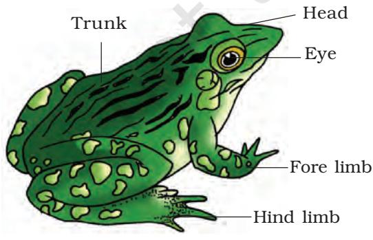
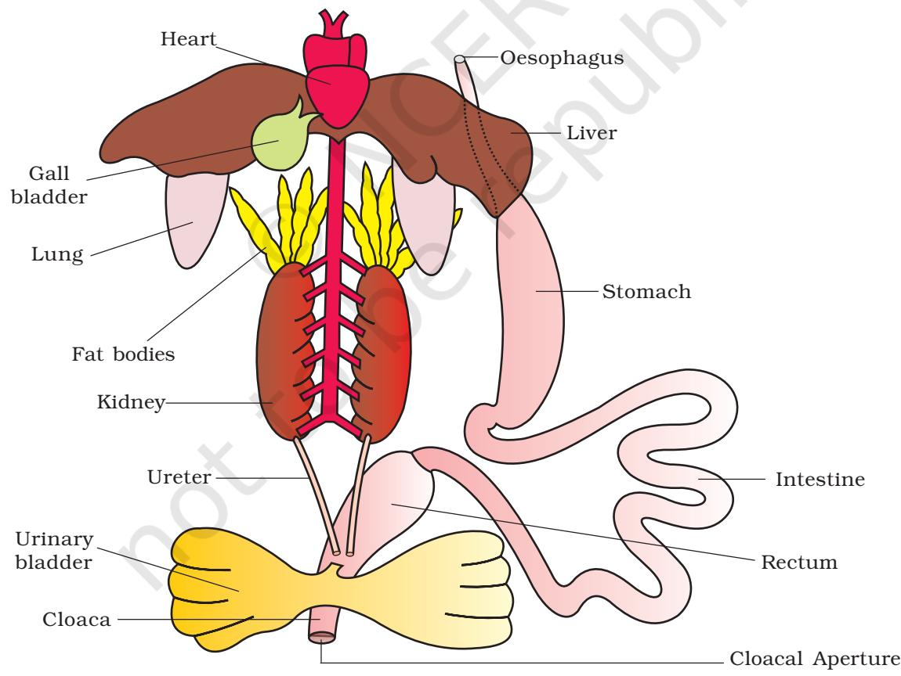
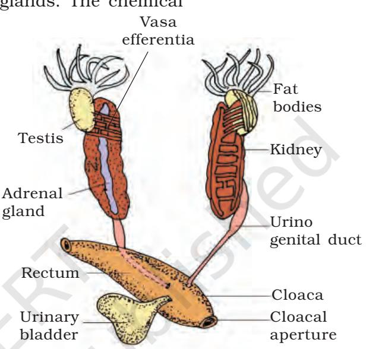

# STRUCTURAL ORGANISATION IN ANIMALS CHAPTER 7

STRUCTURAL ORGANISATION IN ANIMALS 79

- *7.1 Organ and Organ System*
*7.2 Frogs*

In the preceding chapters you came across a large variety of organisms, both unicellular and multicellular, of the animal kingdom. In unicellular organisms, all functions like digestion, respiration and reproduction are performed by a single cell. In the complex body of multicellular animals the same basic functions are carried out by different groups of cells in a well organised manner. The body of a simple organism like *Hydra* is made of different types of cells and the number of cells in each type can be in thousands. The human body is composed of billions of cells to perform various functions. How do these cells in the body work together? As you have already learnt in your earlier classes, in multicellular animals, a group of similar cells alongwith intercellular substances perform a specific function. Such an organisation is called tissue.

You may be surprised to know that all complex animals consist of only four basic types of tissues. These tissues are organised in specific proportion and pattern to form an organ like stomach, lung, heart and kidney. When two or more organs perform a common function by their physical and/or chemical interaction, they together form organ system, e.g., digestive system, respiratory system, etc. Cells, tissues, organs and organ systems split up the work in a way that exhibits division of labour and contribute to the survival of the body as a whole.

# 7.1 ORGAN AND ORGAN SYSTEM

The basic tissues as you have learnt in earlier classes, organise to form organs which in turn associate to form organ systems in the multicellular organisms. Such an organisation is essential for more efficient and better coordinated activities of millions of cells constituting an organism. Each organ in our body is made of one or more type of tissues. For example, our heart consists of all the four types of tissues, i.e., epithelial, connective, muscular and neural. We also notice, after some careful study that the complexity in organ and organ systems displays certain discernable trend. This discernable trend is called evolutionary trend (You will study the details in class XII). In this chapter, you are being introduced to morphology and anatomy of frog. Morphology refers to study of form or externally visible features. In the case of plants or microbes, the term morphology precisely means only this. In case of animals this refers to the external appearance of the organs or parts of the body. The word anatomy conventionally is used for the study of morphology of internal organs in the animals. You will learn the morphology and anatomy of frog representing vertebrates.

# 7.2 FROGS

Frogs can live both on land and in freshwater and belong to class Amphibia of phylum Chordata. The most common species of frog found in India is *Rana tigrina.*

They do not have constant body temperature i.e., their body temperature varies with the temperature of the environment. Such animals are called cold blooded or poikilotherms. You might have also noticed changes in the colour of the frogs while they are in grasses and on dry land. They have the ability to change the colour to hide them from their enemies (camouflage). This protective coloration is called mimicry. You may also know that frogs are not seen during peak summer and winter. During this period they take shelter in deep burrows to protect them from extreme heat and cold. This is known as summer sleep (aestivation) and winter sleep (hibernation) respectively.

#### 7.2.1 Morphology

Have you ever touched the skin of frog? The skin is smooth and slippery due to the presence of mucus. The skin is always maintained in a moist

condition. The colour of dorsal side of body is generally olive green with dark irregular spots. On the ventral side the skin is uniformly pale yellow. The frog never drinks water but absorb it through the skin.

Body of a frog is divisible into head and trunk (Figure 7.1). A neck and tail are absent. Above the mouth, a pair of nostrils is present. Eyes are bulged and covered by a nictitating membrane that protects them while in water. On either side of eyes a membranous tympanum (ear) receives sound Figure 7.1 External features of frog signals. The forelimbs and hind limbs help in swimming, walking, leaping and burrowing. The hind limbs end in five digits and they are larger and muscular than fore limbs that end in four digits. Feet have webbed digits that help in swimming. Frogs exhibit sexual dimorphism. Male frogs can be distinguished by the presence of sound producing vocal sacs and also a copulatory pad on the first digit of the fore limbs which are absent in female frogs.

### 7.2.2 Anatomy

The body cavity of frogs accommodate different organ systems such as digestive, circulatory, respiratory, nervous, excretory and reproductive systems with well developed structures and functions (Figure 7.2).

The digestive system consists of alimentary canal and digestive glands. The alimentary canal is short because frogs are carnivores and hence the length of intestine is reduced. The mouth opens into the buccal cavity that leads to the oesophagus through pharynx. Oesophagus is a short tube that opens into the stomach which in turn continues as the intestine, rectum and finally opens outside by the cloaca. Liver secretes bile that is stored in the gall bladder. Pancreas, a digestive gland produces pancreatic juice

Figure 7.2 Diagrammatic representation of internal organs of frog showing complete digestive system

containing digestive enzymes. Food is captured by the bilobed tongue. Digestion of food takes place by the action of HCl and gastric juices secreted from the walls of the stomach. Partially digested food called chyme is passed from stomach to the first part of the small intestine, the duodenum. The duodenum receives bile from gall bladder and pancreatic juices from the pancreas through a common bile duct. Bile emulsifies fat and pancreatic juices digest carbohydrates and proteins. Final digestion takes place in the intestine. Digested food is absorbed by the numerous finger-like folds in the inner wall of intestine called villi and microvilli. The undigested solid waste moves into the rectum and passes out through cloaca.

Frogs respire on land and in the water by two different methods. In water, skin acts as aquatic respiratory organ (cutaneous respiration). Dissolved oxygen in the water is exchanged through the skin by diffusion. On land, the buccal cavity, skin and lungs act as the respiratory organs. The respiration by lungs is called pulmonary respiration. The lungs are a pair of elongated, pink coloured sac-like structures present in the upper part of the trunk region (thorax). Air enters through the nostrils into the buccal cavity and then to lungs. During aestivation and hibernation gaseous exchange takes place through skin.

The vascular system of frog is well-developed closed type. Frogs have a lymphatic system also. The blood vascular system involves heart, blood vessels and blood. The lymphatic system consists of lymph, lymph channels and lymph nodes. Heart is a muscular structure situated in the upper part of the body cavity. It has three chambers, two atria and one ventricle and is covered by a membrane called pericardium. A triangular structure called sinus venosus joins the right atrium. It receives blood through the major veins called vena cava. The ventricle opens into a saclike conus arteriosus on the ventral side of the heart. The blood from the heart is carried to all parts of the body by the arteries (arterial system). The veins collect blood from different parts of body to the heart and form the venous system. Special venous connection between liver and intestine as well as the kidney and lower parts of the body are present in frogs. The former is called hepatic portal system and the latter is called renal portal system. The blood is composed of plasma and cells. The blood cells are RBC (red blood cells) or erythrocytes, WBC (white blood cells) or leucocytes and platelets. RBC's are nucleated and contain red coloured pigment namely haemoglobin. The lymph is different from blood. It lacks few proteins and RBCs. The blood carries nutrients, gases and water to the respective sites during the circulation. The circulation of blood is achieved by the pumping action of the muscular heart.

The elimination of nitrogenous wastes is carried out by a well developed excretory system. The excretory system consists of a pair of kidneys, ureters, cloaca and urinary bladder. These are compact, dark red and bean like structures situated a little posteriorly in the body cavity on both sides of vertebral column. Each kidney is composed of several structural and functional units called uriniferous tubules or nephrons. Two ureters emerge from the kidneys in the male frogs. The ureters act as urinogenital duct which opens into the cloaca. In females the ureters and oviduct open seperately in the cloaca. The thin-walled urinary bladder is present ventral to the rectum which also opens in the cloaca. The frog excretes urea and thus is a ureotelic animal. Excretory wastes are carried by blood into the kidney where it is separated and excreted.

The system for control and coordination is highly evolved in the frog. It includes both neural system and endocrine glands. The chemical

coordination of various organs of the body is achieved by hormones which are secreted by the endocrine glands. The prominent endocrine glands found in frog are pituitary, thyroid, parathyroid, thymus, pineal body, pancreatic islets, adrenals and gonads. The nervous system is organised into a central nervous system (brain and spinal cord), a peripheral nervous system (cranial and spinal nerves) and an autonomic nervous system (sympathetic and parasympathetic). There are ten pairs of cranial nerves arising from the brain. Brain is enclosed in a bony structure called brain box (cranium). The brain is divided into fore-brain, mid-brain and hind-brain. Forebrain includes olfactory lobes, paired cerebral hemispheres and unpaired diencephalon. The midbrain is characterised by a pair of optic lobes. Hind-brain consists of cerebellum and medulla oblongata. The medulla oblongata passes out through the foramen magnum and continues into spinal cord, which is enclosed in the vertebral column.

Frog has different types of sense organs, namely organs of touch (sensory papillae), taste (taste buds), smell (nasal epithelium), vision (eyes) and hearing (tympanum with internal ears). Out of these, eyes and internal ears are well-organised structures and the rest are cellular aggregations around nerve endings. Eyes in a frog are a pair of spherical structures situated in the orbit in skull. These are simple eyes (possessing only one unit). External ear is absent in frogs and only tympanum can be seen externally. The ear is an organ of hearing as well as balancing (equilibrium).

Frogs have well organised male and female reproductive systems. Male reproductive organs consist of a pair of yellowish ovoid testes (Figure 7.3), which are found adhered to the upper part of kidneys by a double fold of peritoneum called mesorchium. Vasa efferentia are 10-12 in number that arise from testes. They enter the kidneys on their side and open into Bidder's

Figure 7.3 Male reproductive system

Figure 7.4 Female reproductive system

canal. Finally it communicates with the urinogenital duct that comes out of the kidneys and opens into the cloaca. The cloaca is a small, median chamber that is used to pass faecal matter, urine and sperms to the exterior.

The female reproductive organs include a pair of ovaries (Figure 7.4). The ovaries are situated near kidneys and there is no functional connection with kidneys. A pair of oviduct arising from the ovaries opens into the cloaca separately. A mature female can lay 2500 to 3000 ova at a time. Fertilisation is external and takes place in water. Development involves a larval stage called tadpole. Tadpole undergoes metamorphosis to form the adult.

Frogs are beneficial for mankind because they eat insects and protect the crop. Frogs maintain ecological balance because these serve as an important link of food chain and food web in the ecosystem. In some countries the muscular legs of frog are used as food by man.

## SUMMARY

Cells, tissues, organs and organ systems split up the work in a way that ensures the survival of the body as a whole and exhibit division of labour. A tissue is defined as group of cells along with intercellular substances performing one or more functions in the body. Epithelia are sheet like tissues lining the body's surface and its cavities, ducts and tubes. Epithelia have one free surface facing a body fluid or the outside environment. Their cells are structurally and functionally connected at junctions.

The Indian bullfrog, *Rana tigrina,* is the common frog found in India. Body is covered by skin. Mucous glands are present in the skin which is highly vascularised and helps in respiration in water and on land. Body is divisible into head and trunk. A muscular tongue is present, which is bilobed at the tip and is used in capturing the prey. The alimentary canal consists of oesophagous, stomach, intestine and rectum, which open into the cloaca. The main digestive glands are liver and pancreas. It can respire in water through skin and through lungs on land. Circulatory system is closed with single circulation. RBCs are nucleated. Nervous system is organised into central, peripheral and autonomic. The organs of urinogenital system are kidneys and urinogenital ducts, which open into the cloaca. The male reproductive organ is a pair of testes. The female reproductive organ is a pair of ovaries. A female lays 2500-3000 ova at a time. The fertilisation and development are external. The eggs hatch into tadpoles, which metamorphose into frogs.

## EXERCISES

- 1. Draw a neat diagram of digestive system of frog.
- 2. Mention the function of the Ureters in frog.

