# UNIT 3 CELL: STRUCTURE AND FUNCTIONS

Chapter 8 Cell: The Unit of Life

Chapter 9 Biomolecules

## Chapter 10

Cell Cycle and Cell Division

Biology is the study of living organisms. The detailed description of their form and appearance only brought out their diversity. It is the cell theory that emphasised the unity underlying this diversity of forms, i.e., the cellular organisation of all life forms. A description of cell structure and cell growth by division is given in the chapters comprising this unit. Cell theory also created a sense of mystery around living phenomena, i.e., physiological and behavioural processes. This mystery was the requirement of integrity of cellular organisation for living phenomena to be demonstrated or observed. In studying and understanding the physiological and behavioural processes, one can take a physico-chemical approach and use cell-free systems to investigate. This approach enables us to describe the various processes in molecular terms. The approach is established by analysis of living tissues for elements and compounds. It will tell us what types of organic compounds are present in living organisms. In the next stage, one can ask the question: What are these compounds doing inside a cell? And, in what way they carry out gross physiological processes like digestion, excretion, memory, defense, recognition, etc. In other words we answer the question, what is the molecular basis of all physiological processes? It can also explain the abnormal processes that occur during any diseased condition. This physico-chemical approach to study and understand living organisms is called 'Reductionist Biology'. The concepts and techniques of physics and chemistry are applied to understand biology. In Chapter 9 of this unit, a brief description of biomolecules is provided.

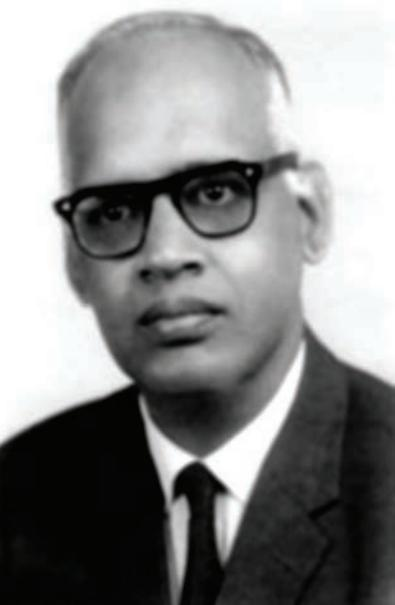

(1922 – 2001)

G.N. RAMACHANDRAN, an outstanding figure in the field of protein structure, was the founder of the 'Madras school' of conformational analysis of biopolymers. His discovery of the triple helical structure of collagen published in *Nature* in 1954 and his analysis of the allowed conformations of proteins through the use of the 'Ramachandran plot' rank among the most outstanding contributions in structural biology. He was born on October 8, 1922, in a small town, not far from Cochin on the southwestern coast of India. His father was a professor of mathematics at a local college and thus had considerable influence in shaping Ramachandran's interest in mathematics. After completing his school years, Ramachandran graduated in 1942 as the topranking student in the B.Sc. (Honors) Physics course of the University of Madras. He received a Ph.D. from Cambridge University in 1949. While at Cambridge, Ramachandran met Linus Pauling and was deeply influenced by his publications on models of the α-helix and β-sheet structures that directed his attention to solving the structure of collagen. He passed away at G.N. Ramachandran the age of 78, on April 7, 2001.

# CELL: THE UNIT OF LIFE CHAPTER 8

- *8.1 What is a Cell?*
- *8.2 Cell Theory*
- *8.3 An Overview of Cell*
- *8.4 Prokaryotic Cells*
- *8.5 Eukaryotic Cells*

When you look around, you see both living and non-living things. You must have wondered and asked yourself – 'what is it that makes an organism living, or what is it that an inanimate thing does not have which a living thing has' ? The answer to this is the presence of the basic unit of life – the cell in all living organisms.

All organisms are composed of cells. Some are composed of a single cell and are called unicellular organisms while others, like us, composed of many cells, are called multicellular organisms.

# 8.1 WHAT IS A CELL?

Unicellular organisms are capable of (i) independent existence and (ii) performing the essential functions of life. Anything less than a complete structure of a cell does not ensure independent living. Hence, cell is the fundamental structural and functional unit of all living organisms.

Anton Von Leeuwenhoek first saw and described a live cell. Robert Brown later discovered the nucleus. The invention of the microscope and its improvement leading to the electron microscope revealed all the structural details of the cell.

## 8.2 CELL THEORY

In 1838, Matthias Schleiden, a German botanist, examined a large number of plants and observed that all plants are composed of different kinds of cells which form the tissues of the plant. At about the same time, Theodore Schwann (1839), a British Zoologist, studied different types of animal cells and reported that cells had a thin outer layer which is today known as the 'plasma membrane'. He also concluded, based on his studies on plant tissues, that the presence of cell wall is a unique character of the plant cells. On the basis of this, Schwann proposed the hypothesis that the bodies of animals and plants are composed of cells and products of cells.

Schleiden and Schwann together formulated the cell theory. This theory however, did not explain as to how new cells were formed. Rudolf Virchow (1855) first explained that cells divided and new cells are formed from pre-existing cells (*Omnis cellula-e cellula*). He modified the hypothesis of Schleiden and Schwann to give the cell theory a final shape. Cell theory as understood today is:

- (i) all living organisms are composed of cells and products of cells.
- (ii) all cells arise from pre-existing cells.

## 8.3 AN OVERVIEW OF CELL

You have earlier observed cells in an onion peel and/or human cheek cells under the microscope. Let us recollect their structure. The onion cell which is a typical plant cell, has a distinct cell wall as its outer boundary and just within it is the cell membrane. The cells of the human cheek have an outer membrane as the delimiting structure of the cell. Inside each cell is a dense membrane bound structure called nucleus. This nucleus contains the chromosomes which in turn contain the genetic material, DNA. Cells that have membrane bound nuclei are called eukaryotic whereas cells that lack a membrane bound nucleus are prokaryotic. In both prokaryotic and eukaryotic cells, a semi-fluid matrix called cytoplasm occupies the volume of the cell. The cytoplasm is the main arena of cellular activities in both the plant and animal cells. Various chemical reactions occur in it to keep the cell in the 'living state'.

Besides the nucleus, the eukaryotic cells have other membrane bound distinct structures called organelles like the endoplasmic reticulum (ER), the golgi complex, lysosomes, mitochondria, microbodies and vacuoles. The prokaryotic cells lack such membrane bound organelles.

Ribosomes are non-membrane bound organelles found in all cells – both eukaryotic as well as prokaryotic. Within the cell, ribosomes are found not only in the cytoplasm but also within the two organelles – chloroplasts (in plants) and mitochondria and on rough ER.

Animal cells contain another non-membrane bound organelle called centrosome which helps in cell division.

Cells differ greatly in size, shape and activities (Figure 8.1). For example, Mycoplasmas, the smallest cells, are only 0.3 µm in length while bacteria

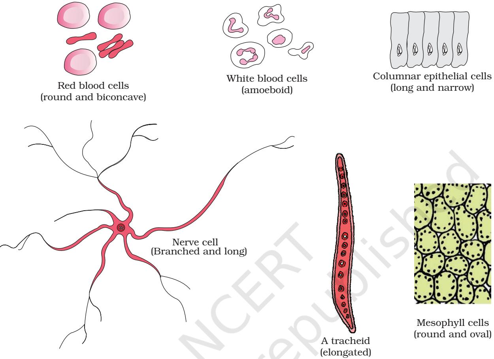

Figure 8.1 Diagram showing different shapes of the cells

could be 3 to 5 µm. The largest isolated single cell is the egg of an ostrich. Among multicellular organisms, human red blood cells are about 7.0 µm in diameter. Nerve cells are some of the longest cells. Cells also vary greatly in their shape. They may be disc-like, polygonal, columnar, cuboid, thread like, or even irregular. The shape of the cell may vary with the function they perform.

## 8.4 PROKARYOTIC CELLS

The prokaryotic cells are represented by bacteria, blue-green algae, mycoplasma and PPLO (Pleuro Pneumonia Like Organisms). They are generally smaller and multiply more rapidly than the eukaryotic cells (Figure 8.2). They may vary greatly in shape and size. The four basic shapes of bacteria are bacillus (rod like), coccus (spherical), vibrio (comma shaped) and spirillum (spiral).

The organisation of the prokaryotic cell is fundamentally similar even though prokaryotes exhibit a wide variety of shapes and functions. All

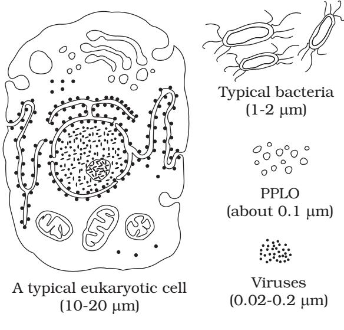

- Figure 8.2 Diagram showing comparison of eukaryotic cell with other organisms
prokaryotes have a cell wall surrounding the cell membrane except in mycoplasma. The fluid matrix filling the cell is the cytoplasm. There is no well-defined nucleus. The genetic material is basically naked, not enveloped by a nuclear membrane. In addition to the genomic DNA (the single chromosome/circular DNA), many bacteria have small circular DNA outside the genomic DNA. These smaller DNA are called plasmids. The plasmid DNA confers certain unique phenotypic characters to such bacteria. One such character is resistance to antibiotics. In higher classes you will learn that this plasmid DNA is used to monitor bacterial transformation with foreign DNA. Nuclear membrane is found in eukaryotes. No organelles, like the ones in eukaryotes, are found in prokaryotic cells except for ribosomes. Prokaryotes have something unique in the form of inclusions. A specialised

differentiated form of cell membrane called mesosome is the characteristic of prokaryotes. They are essentially infoldings of cell membrane.

## 8.4.1 Cell Envelope and its Modifications

Most prokaryotic cells, particularly the bacterial cells, have a chemically complex cell envelope. The cell envelope consists of a tightly bound three layered structure i.e., the outermost glycocalyx followed by the cell wall and then the plasma membrane. Although each layer of the envelope performs distinct function, they act together as a single protective unit. Bacteria can be classified into two groups on the basis of the differences in the cell envelopes and the manner in which they respond to the staining procedure developed by Gram viz., those that take up the gram stain are Gram positive and the others that do not are called Gram negative bacteria.

Glycocalyx differs in composition and thickness among different bacteria. It could be a loose sheath called the slime layer in some, while in others it may be thick and tough, called the capsule. The cell wall determines the shape of the cell and provides a strong structural support to prevent the bacterium from bursting or collapsing.

The plasma membrane is selectively permeable in nature and interacts with the outside world. This membrane is similar structurally to that of the eukaryotes.

A special membranous structure is the mesosome which is formed by the extensions of plasma membrane into the cell. These extensions are in the form of vesicles, tubules and lamellae. They help in cell wall

formation, DNA replication and distribution to daughter cells. They also help in respiration, secretion processes, to increase the surface area of the plasma membrane and enzymatic content. In some prokaryotes like cyanobacteria, there are other membranous extensions into the cytoplasm called chromatophores which contain pigments.

Bacterial cells may be motile or non-motile. If motile, they have thin filamentous extensions from their cell wall called flagella. Bacteria show a range in the number and arrangement of flagella. Bacterial flagellum is composed of three parts – filament, hook and basal body. The filament is the longest portion and extends from the cell surface to the outside.

Besides flagella, Pili and Fimbriae are also surface structures of the bacteria but do not play a role in motility. The pili are elongated tubular structures made of a special protein. The fimbriae are small bristle like fibres sprouting out of the cell. In some bacteria, they are known to help attach the bacteria to rocks in streams and also to the host tissues.

## 8.4.2 Ribosomes and Inclusion Bodies

In prokaryotes, ribosomes are associated with the plasma membrane of the cell. They are about 15 nm by 20 nm in size and are made of two subunits - 50S and 30S units which when present together form 70S prokaryotic ribosomes. Ribosomes are the site of protein synthesis. Several ribosomes may attach to a single mRNA and form a chain called polyribosomes or polysome. The ribosomes of a polysome translate the mRNA into proteins.

Inclusion bodies: Reserve material in prokaryotic cells are stored in the cytoplasm in the form of inclusion bodies. These are not bound by any membrane system and lie free in the cytoplasm, e.g., phosphate granules, cyanophycean granules and glycogen granules. Gas vacuoles are found in blue green and purple and green photosynthetic bacteria.

## 8.5 EUKARYOTIC CELLS

The eukaryotes include all the protists, plants, animals and fungi. In eukaryotic cells there is an extensive compartmentalisation of cytoplasm through the presence of membrane bound organelles. Eukaryotic cells possess an organised nucleus with a nuclear envelope. In addition, eukaryotic cells have a variety of complex locomotory and cytoskeletal structures. Their genetic material is organised into chromosomes.

All eukaryotic cells are not identical. Plant and animal cells are different as the former possess cell walls, plastids and a large central vacuole which are absent in animal cells. On the other hand, animal cells have centrioles which are absent in almost all plant cells (Figure 8.3).

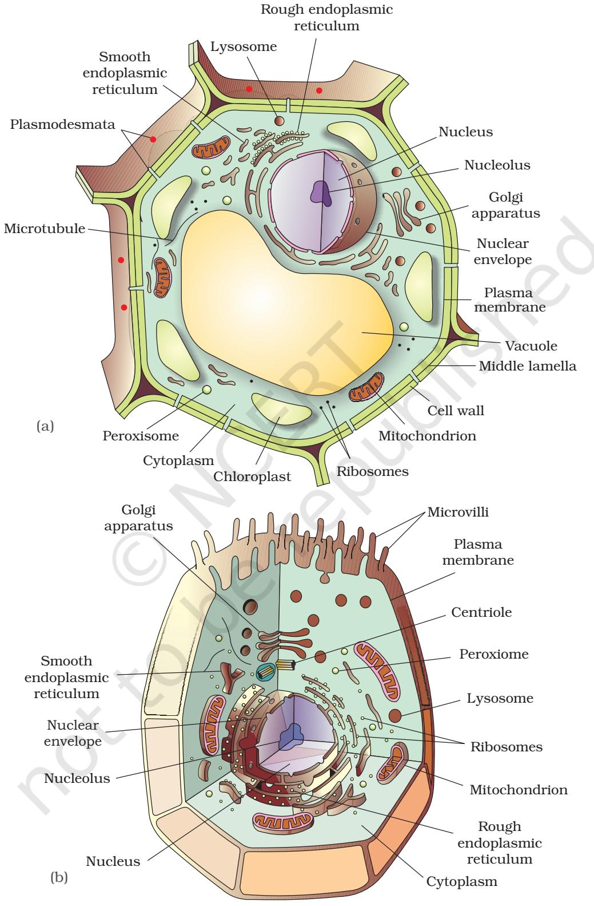

Figure 8.3 Diagram showing : (a) Plant cell (b) Animal cell

Let us now look at individual cell organelles to understand their structure and functions.

## 8.5.1 Cell Membrane

The detailed structure of the membrane was studied only after the advent of the electron microscope in the 1950s. Meanwhile, chemical studies on the cell membrane, especially in human red blood cells (RBCs), enabled the scientists to deduce the possible structure of plasma membrane.

These studies showed that the cell membrane is mainly composed of lipids and proteins. The major lipids are phospholipids that are arranged in a bilayer. Also, the lipids are arranged within the membrane with the polar head towards the outer sides and the hydrophobic tails towards the inner part.This ensures that the nonpolar tail of saturated hydrocarbons is protected from the aqueous environment (Figure 8.4). In addition to phospholipids membrane also contains cholesterol.

Later, biochemical investigation clearly revealed that the cell membranes also possess protein and carbohydrate. The ratio of protein and lipid varies considerably in different cell types. In human beings, the membrane of the erythrocyte has approximately 52 per cent protein and 40 per cent lipids.

Depending on the ease of extraction, membrane proteins can be classified as integral and peripheral. Peripheral proteins lie on the surface of membrane while the integral proteins are partially or totally buried in the membrane.

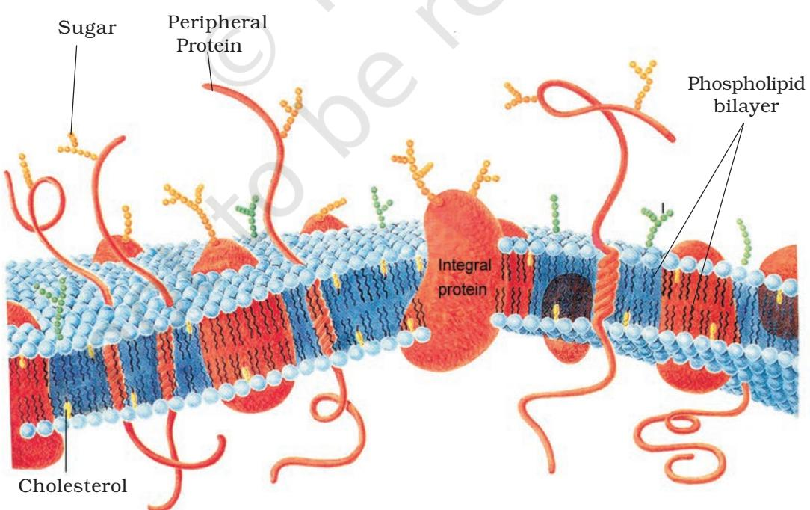

Figure 8.4 Fluid mosaic model of plasma membrane

An improved model of the structure of cell membrane was proposed by Singer and Nicolson (1972) widely accepted as fluid mosaic model (Figure 8.4). According to this, the quasi-fluid nature of lipid enables lateral movement of proteins within the overall bilayer. This ability to move within the membrane is measured as its fluidity.

The fluid nature of the membrane is also important from the point of view of functions like cell growth, formation of intercellular junctions, secretion, endocytosis, cell division etc.

One of the most important functions of the plasma membrane is the transport of the molecules across it. The membrane is selectively permeable to some molecules present on either side of it. Many molecules can move briefly across the membrane without any requirement of energy and this is called the passive transport. Neutral solutes may move across the membrane by the process of simple diffusion along the concentration gradient, i.e., from higher concentration to the lower. Water may also move across this membrane from higher to lower concentration. Movement of water by diffusion is called osmosis. As the polar molecules cannot pass through the nonpolar lipid bilayer, they require a carrier protein of the membrane to facilitate their transport across the membrane. A few ions or molecules are transported across the membrane against their concentration gradient, i.e., from lower to the higher concentration. Such a transport is an energy dependent process, in which ATP is utilised and is called active transport, e.g., Na+/K+ Pump.

## 8.5.2 Cell Wall

As you may recall, a non-living rigid structure called the cell wall forms an outer covering for the plasma membrane of fungi and plants. Cell wall not only gives shape to the cell and protects the cell from mechanical damage and infection, it also helps in cell-to-cell interaction and provides barrier to undesirable macromolecules. Algae have cell wall, made of cellulose, galactans, mannans and minerals like calcium carbonate, while in other plants it consists of cellulose, hemicellulose, pectins and proteins. The cell wall of a young plant cell, the primary wall is capable of growth, which gradually diminishes as the cell matures and the secondary wall is formed on the inner (towards membrane) side of the cell.

The middle lamella is a layer mainly of calcium pectate which holds or glues the different neighbouring cells together. The cell wall and middle lamellae may be traversed by plasmodesmata which connect the cytoplasm of neighbouring cells.

#### 8.5.3 Endomembrane System

While each of the membranous organelles is distinct in terms of its

structure and function, many of these are considered together as an endomembrane system because their functions are coordinated. The endomembrane system include endoplasmic reticulum (ER), golgi complex, lysosomes and vacuoles. Since the functions of the mitochondria, chloroplast and peroxisomes are not coordinated with the above components, these are not considered as part of the endomembrane system.

#### *8.5.3.1 8.5.3.1 The Endoplasmic Reticulum (ER) The Endoplasmic Reticulum (ER)*

Electron microscopic studies of eukaryotic cells reveal the presence of a network or reticulum of tiny tubular structures scattered in the cytoplasm that is called the endoplasmic reticulum (ER) (Figure 8.5). Hence, ER divides the intracellular space into two distinct compartments, i.e., luminal (inside ER) and extra luminal (cytoplasm) compartments.

The ER often shows ribosomes attached to their outer surface. The endoplasmic reticulun bearing ribosomes on their surface is called rough endoplasmic reticulum (RER). In the absence of ribosomes they appear smooth and are called smooth endoplasmic reticulum (SER).

RER is frequently observed in the cells actively involved in protein synthesis and secretion. They are extensive and continuous with the outer membrane of the nucleus.

The smooth endoplasmic reticulum is the major site for synthesis of lipid. In animal cells lipid-like steroidal hormones are synthesised in SER.

#### *8.5.3.2 8.5.3.2 Golgi apparatus*

Camillo Golgi (1898) first observed densely stained reticular structures near the nucleus. These were later named Golgi bodies after him. They consist of many flat, disc-shaped sacs or cisternae of 0.5µm to 1.0µm diameter (Figure 8.6). These are stacked parallel to each other. Varied number of cisternae are present in a Golgi complex. The Golgi cisternae are concentrically arranged near the nucleus with distinct convex *cis* or the forming

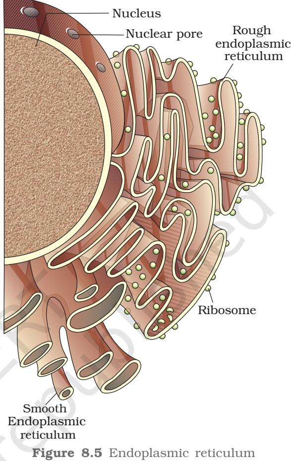

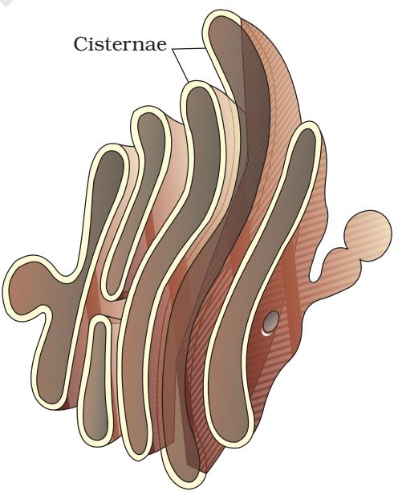

Figure 8.6 Golgi apparatus

face and concave *trans* or the maturing face. The *cis* and the *trans* faces of the organelle are entirely different, but interconnected.

The golgi apparatus principally performs the function of packaging materials, to be delivered either to the intra-cellular targets or secreted outside the cell. Materials to be packaged in the form of vesicles from the ER fuse with the *cis* face of the golgi apparatus and move towards the maturing face. This explains, why the golgi apparatus remains in close association with the endoplasmic reticulum. A number of proteins synthesised by ribosomes on the endoplasmic reticulum are modified in the cisternae of the golgi apparatus before they are released from its *trans* face. Golgi apparatus is the important site of formation of glycoproteins and glycolipids.

#### *8.5.3.3 8.5.3.3 Lysosomes*

These are membrane bound vesicular structures formed by the process of packaging in the golgi apparatus. The isolated lysosomal vesicles have been found to be very rich in almost all types of hydrolytic enzymes (hydrolases – lipases, proteases, carbohydrases) optimally active at the acidic pH. These enzymes are capable of digesting carbohydrates, proteins, lipids and nucleic acids.

#### *8.5.3.4 8.5.3.4 Vacuoles VacuolesVacuoles*

The vacuole is the membrane-bound space found in the cytoplasm. It contains water, sap, excretory product and other materials not useful for the cell. The vacuole is bound by a single membrane called tonoplast. In plant cells the vacuoles can occupy up to 90 per cent of the volume of the cell.

In plants, the tonoplast facilitates the transport of a number of ions and other materials against concentration gradients into the vacuole, hence their concentration is significantly higher in the vacuole than in the cytoplasm.

In *Amoeba* the contractile vacuole is important for osmoregulation and excretion. In many cells, as in protists, food vacuoles are formed by engulfing the food particles.

### 8.5.4 Mitochondria

Mitochondria (sing.: mitochondrion), unless specifically stained, are not easily visible under the microscope. The number of mitochondria per cell is variable depending on the physiological activity of the cells. In terms of shape and size also, considerable degree of variability is observed. Typically it is sausage-shaped or cylindrical having a diameter of 0.2-1.0µm (average 0.5µm) and length 1.0-4.1µm. Each mitochondrion is a double

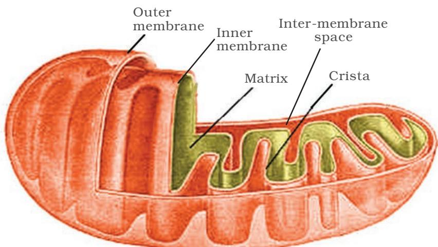

Figure 8.7 Structure of mitochondrion (Longitudinal section)

membrane-bound structure with the outer membrane and the inner membrane dividing its lumen distinctly into two aqueous compartments, i.e., the outer compartment and the inner compartment. The inner compartment is filled with a dense homogeneous substance called the matrix. The outer membrane forms the continuous limiting boundary of the organelle. The inner membrane forms a number of infoldings called the cristae (sing.: crista) towards the matrix (Figure 8.7). The cristae increase the surface area. The two membranes have their own specific enzymes associated with the mitochondrial function. Mitochondria are the sites of aerobic respiration. They produce cellular energy in the form of ATP, hence they are called 'power houses' of the cell. The matrix also possesses single circular DNA molecule, a few RNA molecules, ribosomes (70S) and the components required for the synthesis of proteins. The mitochondria divide by fission.

## 8.5.5 Plastids

Plastids are found in all plant cells and in euglenoides. These are easily observed under the microscope as they are large. They bear some specific pigments, thus imparting specific colours to the plants. Based on the type of pigments plastids can be classified into chloroplasts, chromoplasts and leucoplasts.

The chloroplasts contain chlorophyll and carotenoid pigments which are responsible for trapping light energy essential for photosynthesis. In the chromoplasts fat soluble carotenoid pigments like carotene, xanthophylls and others are present. This gives the part of the plant a yellow, orange or red colour. The leucoplasts are the colourless plastids of varied shapes and sizes with stored nutrients: Amyloplasts store carbohydrates (starch), e.g., potato; elaioplasts store oils and fats whereas

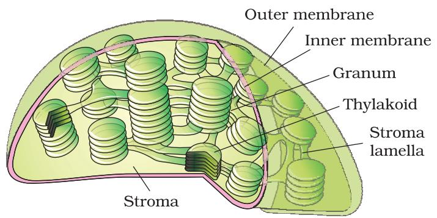

Figure 8.8 Sectional view of chloroplast

the aleuroplasts store proteins.

Majority of the chloroplasts of the green plants are found in the mesophyll cells of the leaves. These are lens-shaped, oval, spherical, discoid or even ribbon-like organelles having variable length (5-10µm) and width (2-4µm). Their number varies from 1 per cell of the *Chlamydomonas*, a green alga to 20-40 per cell in the mesophyll.

Like mitochondria, the chloroplasts are also double membrane bound. Of the two, the inner chloroplast membrane is relatively less permeable. The space limited by the

inner membrane of the chloroplast is called the stroma. A number of organised flattened membranous sacs called the thylakoids, are present in the stroma (Figure 8.8). Thylakoids are arranged in stacks like the piles of coins called grana (singular: granum) or the intergranal thylakoids. In addition, there are flat membranous tubules called the stroma lamellae connecting the thylakoids of the different grana. The membrane of the thylakoids enclose a space called a lumen. The stroma of the chloroplast contains enzymes required for the synthesis of carbohydrates and proteins. It also contains small, doublestranded circular DNA molecules and ribosomes. Chlorophyll pigments are present in the thylakoids. The ribosomes of the chloroplasts are smaller (70S) than the cytoplasmic ribosomes (80S).

# 8.5.6 Ribosomes

Ribosomes are the granular structures first observed under the electron microscope as dense particles by George Palade (1953). They are

Figure 8.9 Ribosome

composed of ribonucleic acid (RNA) and proteins and are not surrounded by any membrane.

> The eukaryotic ribosomes are 80S while the prokaryotic ribosomes are 70S. Each ribosome has two subunits, larger and smaller subunits (Fig 8.9). The two subunits of 80S ribosomes are 60S and 40S while that of 70S ribosomes are 50S and 30S. Here 'S' (Svedberg's Unit) stands for the sedimentation coefficient; it is indirectly a measure of density and size. Both 70S and 80S ribosomes are composed of two subunits.

# 8.5.7 Cytoskeleton

An elaborate network of filamentous proteinaceous structures consisting of microtubules, microfilaments and intermediate filaments present in the cytoplasm is collectively referred to as the cytoskeleton. The cytoskeleton in a cell are involved in many functions such as mechanical support, motility, maintenance of the shape of the cell.

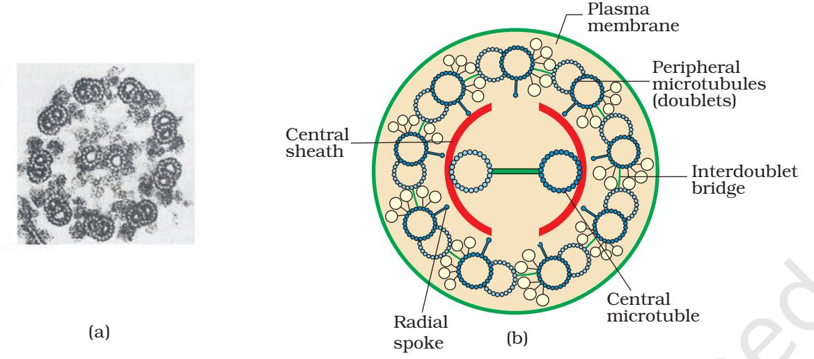

Figure 8.10 Section of cilia/flagella showing different parts : (a) Electron micrograph (b) Diagrammatic representation of internal structure

## 8.5.8 Cilia and Flagella

Cilia (sing.: cilium) and flagella (sing.: flagellum) are hair-like outgrowths of the cell membrane. Cilia are small structures which work like oars, causing the movement of either the cell or the surrounding fluid. Flagella are comparatively longer and responsible for cell movement. The prokaryotic bacteria also possess flagella but these are structurally different from that of the eukaryotic flagella.

The electron microscopic study of a cilium or the flagellum show that they are covered with plasma membrane. Their core called the axoneme, possesses a number of microtubules running parallel to the long axis. The axoneme usually has nine doublets of radially arranged peripheral microtubules, and a pair of centrally located microtubules. Such an arrangement of axonemal microtubules is referred to as the 9+2 array (Figure 8.10). The central tubules are connected by bridges and is also enclosed by a central sheath, which is connected to one of the tubules of each peripheral doublets by a radial spoke. Thus, there are nine radial spokes. The peripheral doublets are also interconnected by linkers. Both the cilium and flagellum emerge from centriole-like structure called the basal bodies.

## 8.5.9 Centrosome and Centrioles

Centrosome is an organelle usually containing two cylindrical structures called centrioles. They are surrounded by amorphous pericentriolar materials. Both the centrioles in a centrosome lie perpendicular to each other in which each has an organisation like the cartwheel. They are

made up of nine evenly spaced peripheral fibrils of tubulin protein. Each of the peripheral fibril is a triplet.The adjacent triplets are also linked. The central part of the proximal region of the centriole is also proteinaceous and called the hub, which is connected with tubules of the peripheral triplets by radial spokes made of protein. The centrioles form the basal body of cilia or flagella, and spindle fibres that give rise to spindle apparatus during cell division in animal cells.

## 8.5.10 Nucleus

Nucleus as a cell organelle was first described by Robert Brown as early as 1831. Later the material of the nucleus stained by the basic dyes was given the name chromatin by Flemming.

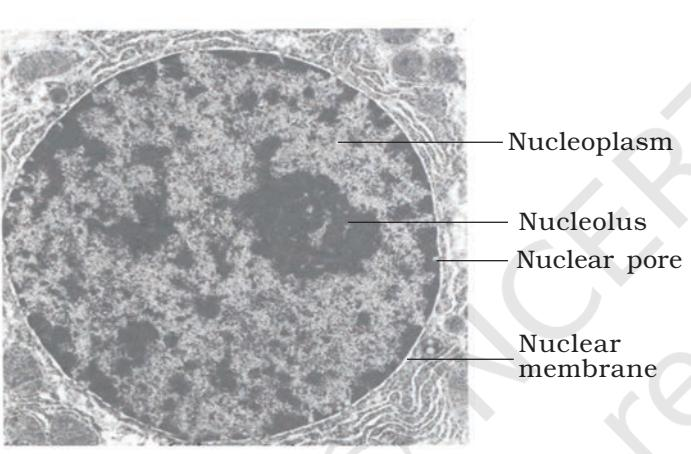

Figure 8.11 Structure of nucleus

The interphase nucleus (nucleus of a cell when it is not dividing) has highly extended and elaborate nucleoprotein fibres called chromatin, nuclear matrix and one or more spherical bodies called nucleoli (sing.: nucleolus) (Figure 8.11). Electron microscopy has revealed that the nuclear envelope, which consists of two parallel membranes with a space between (10 to 50 nm) called the perinuclear space, forms a barrier between the materials present inside the nucleus and that of the cytoplasm. The outer membrane usually remains continuous with the endoplasmic reticulum and also bears ribosomes on it. At a number of

places the nuclear envelope is interrupted by minute pores, which are formed by the fusion of its two membranes. These nuclear pores are the passages through which movement of RNA and protein molecules takes place in both directions between the nucleus and the cytoplasm. Normally, there is only one nucleus per cell, variations in the number of nuclei are also frequently observed. *Can you recollect names of organisms that have more than one nucleus per cell?* Some mature cells even lack nucleus, e.g., erythrocytes of many mammals and sieve tube cells of vascular plants. *Would you consider these cells as 'living'?*

The nuclear matrix or the nucleoplasm contains nucleolus and chromatin. The nucleoli are spherical structures present in the nucleoplasm. The content of nucleolus is continuous with the rest of the nucleoplasm as it is not a membrane bound structure. It is a site for active ribosomal RNA synthesis. Larger and more numerous nucleoli are present in cells actively carrying out protein synthesis.

You may recall that the interphase nucleus has a loose and indistinct network of nucleoprotein fibres called chromatin. But during different stages of cell division, cells show structured chromosomes in place of the nucleus. Chromatin contains DNA and some basic proteins called histones, some non-histone proteins and also RNA. A single human cell has approximately two metre long thread of DNA distributed among its forty six (twenty three pairs) chromosomes. You will study the details of DNA packaging in the form of a chromosome in class XII.

Every chromosome (visible only in dividing cells) essentially has a primary constriction or the centromere on the sides of which disc shaped structures called kinetochores are present (Figure 8.12). Centromere holds two chromatids of a chromosome. Based on the position of the centromere, the chromosomes can be classified into four types (Figure 8.13). The metacentric chromosome has middle centromere forming two equal arms of the chromosome. The sub-metacentric chromosome has centromere slightly away from the middle of the chromosome resulting into one shorter arm and one longer arm. In case of acrocentric chromosome the centromere is situated close to its end forming one extremely short and one very long arm, whereas the telocentric chromosome has a terminal centromere.

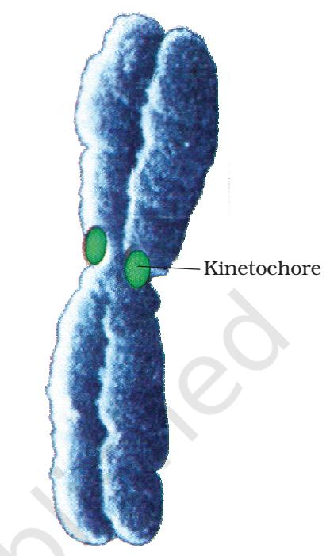

Figure 8.12 Chromosome with kinetochore

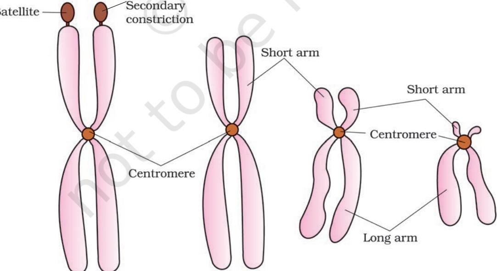

Figure 8.13 Types of chromosomes based on the position of centromere

Sometimes a few chromosomes have non-staining secondary constrictions at a constant location. This gives the appearance of a small fragment called the satellite.

## 8.5.11 Microbodies

Many membrane bound minute vesicles called microbodies that contain various enzymes, are present in both plant and animal cells.

## SUMMARY

All organisms are made of cells or aggregates of cells. Cells vary in their shape, size and activities/functions. Based on the presence or absence of a membrane bound nucleus and other organelles, cells and hence organisms can be named as eukaryotic or prokaryotic.

A typical eukaryotic cell consists of a cell membrane, nucleus and cytoplasm. Plant cells have a cell wall outside the cell membrane. The plasma membrane is selectively permeable and facilitates transport of several molecules. The endomembrane system includes ER, golgi complex, lysosomes and vacuoles. All the cell organelles perform different but specific functions. Centrosome and centriole form the basal body of cilia and flagella that facilitate locomotion. In animal cells, centrioles also form spindle apparatus during cell division. Nucleus contains nucleoli and chromatin network. It not only controls the activities of organelles but also plays a major role in heredity.

Endoplasmic reticulum contains tubules or cisternae. They are of two types: rough and smooth. ER helps in the transport of substances, synthesis of proteins, lipoproteins and glycogen. The golgi body is a membranous organelle composed of flattened sacs. The secretions of cells are packed in them and transported from the cell. Lysosomes are single membrane structures containing enzymes for digestion of all types of macromolecules. Ribosomes are involved in protein synthesis. These occur freely in the cytoplasm or are associated with ER. Mitochondria help in oxidative phosphorylation and generation of adenosine triphosphate. They are bound by double membrane; the outer membrane is smooth and inner one folds into several cristae. Plastids are pigment containing organelles found in plant cells only. In plant cells, chloroplasts are responsible for trapping light energy essential for photosynthesis. The grana, in the plastid, is the site of light reactions and the stroma of dark reactions. The green coloured plastids are chloroplasts, which contain chlorophyll, whereas the other coloured plastids are chromoplasts, which may contain pigments like carotene and xanthophyll. The nucleus is enclosed by nuclear envelope, a double membrane structure with nuclear pores. The inner membrane encloses the nucleoplasm and the chromatin material. Thus, cell is the structural and functional unit of life.

## EXERCISES

- 1. Which of the following is not correct?
	- (a) Robert Brown discovered the cell.
	- (b) Schleiden and Schwann formulated the cell theory.
	- (c) Virchow explained that cells are formed from pre-existing cells.
	- (d) A unicellular organism carries out its life activities within a single cell.
- 2. New cells generate from
	-
	- (a) bacterial fermentation (b) regeneration of old cells
	- (c) pre-existing cells (d) abiotic materials
- 3. Match the following

## Column I Column II

- 
- 
- 
- 4. Which of the following is correct:
	- (a) Cells of all living organisms have a nucleus.
	- (b) Both animal and plant cells have a well defined cell wall.
	- (c) In prokaryotes, there are no membrane bound organelles.
	- (d) Cells are formed *de novo* from abiotic materials.
- 5. What is a mesosome in a prokaryotic cell? Mention the functions that it performs.
- 6. How do neutral solutes move across the plasma membrane? Can the polar molecules also move across it in the same way? If not, then how are these transported across the membrane?
- 7. Name two cell-organelles that are double membrane bound. What are the characteristics of these two organelles? State their functions and draw labelled diagrams of both.
- 8. What are the characteristics of prokaryotic cells?
- 9. Multicellular organisms have division of labour. Explain.
- 10. Cell is the basic unit of life. Discuss in brief.
- 11. What are nuclear pores? State their function.
- 12. Both lysosomes and vacuoles are endomembrane structures, yet they differ in terms of their functions. Comment.
- 13. Describe the structure of the following with the help of labelled diagrams.
	- (i) Nucleus (ii) Centrosome
- 14. What is a centromere? How does the position of centromere form the basis of classification of chromosomes. Support your answer with a diagram showing the position of centromere on different types of chromosomes.
- -
- (a) Cristae (i) Flat membranous sacs in stroma
- (b) Cisternae (ii) Infoldings in mitochondria
- (c) Thylakoids (iii) Disc-shaped sacs in Golgi apparatus

