Chapter 1 Sexual Reproduction in flowering Plants

Chapter 2 Human Reproduction

Chapter 3 Reproductive Health Biology in essence is the story of life on earth. While individual organisms die without fail, species continue to live through millions of years unless threatened by natural or anthropogenic extinction. Reproduction becomes a vital process without which species cannot survive for long. Each individual leaves its progeny by asexual or sexual means. Sexual mode of reproduction enables creation of new variants, so that survival advantage is enhanced. This unit explains the details of reproductive processes in flowering plants and humans as easy to relate representative examples. A related perspective on human reproductive health and how reproductive ill health can be avoided is also presented to complete our understanding of biology of reproduction.

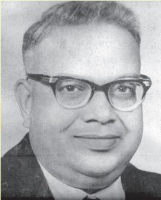

PANCHANAN MAHESHWARI (1904-1966)

Born in November 1904 in Jaipur (Rajasthan) Panchanan Maheshwari rose to become one of the most distinguished botanists not only of India but of the entire world. He moved to Allahabad for higher education where he obtained his D.Sc. During his college days, he was inspired by Dr W. Dudgeon, an American missionary teacher, to develop interest in Botany and especially morphology. His teacher once expressed that if his student progresses ahead of him, it will give him a great satisfaction. These words encouraged Panchanan to enquire what he could do for his teacher in return.

He worked on embryological aspects and popularised the use of embryological characters in taxonomy. He established the Department of Botany, University of Delhi as an important centre of research in embryology and tissue culture. He also emphasised the need for initiation of work on artificial culture of immature embryos. These days, tissue culture has become a landmark in science. His work on test tube fertilisation and intra-ovarian pollination won worldwide acclaim.

He was honoured with fellowship of Royal Society of London (FRS), Indian National Science Academy and several other institutions of excellence. He encouraged general education and made a significant contribution to school education by his leadership in bringing out the very first textbooks of Biology for Higher Secondary Schools published by NCERT in 1964.

# CHAPTER 1

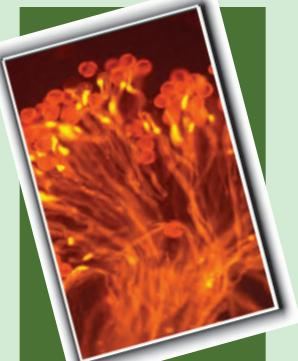

# SEXUAL REPRODUCTION IN FLOWERING PLANTS

- *1.1 Flower A Fascinating Organ of Angiosperms*
- *1.2 Pre-fertilisation : Structures and Events*
- *1.3 Double Fertilisation*
- *1.4 Post-fertilisation: Structures and Events*
- *1.5 Apomixis and Polyembryony*

Are we not lucky that plants reproduce sexually? The myriads of flowers that we enjoy gazing at, the scents and the perfumes that we swoon over, the rich colours that attract us, are all there as an aid to sexual reproduction. Flowers do not exist only for us to be used for our own selfishness. All flowering plants show sexual reproduction. A look at the diversity of structures of the inflorescences, flowers and floral parts, shows an amazing range of adaptations to ensure formation of the end products of sexual reproduction, the fruits and seeds. In this chapter, let us understand the morphology, structure and the processes of sexual reproduction in flowering plants (angiosperms).

# 1.1 FLOWER – A FASCINATING ORGAN OF ANGIOSPERMS

Human beings have had an intimate relationship with flowers since time immemorial. Flowers are objects of aesthetic, ornamental, social, religious and cultural value – they have always been used as symbols for conveying important human feelings such as love, affection, happiness, grief, mourning, etc. *List at least five flowers of ornamental value that are commonly cultivated at*

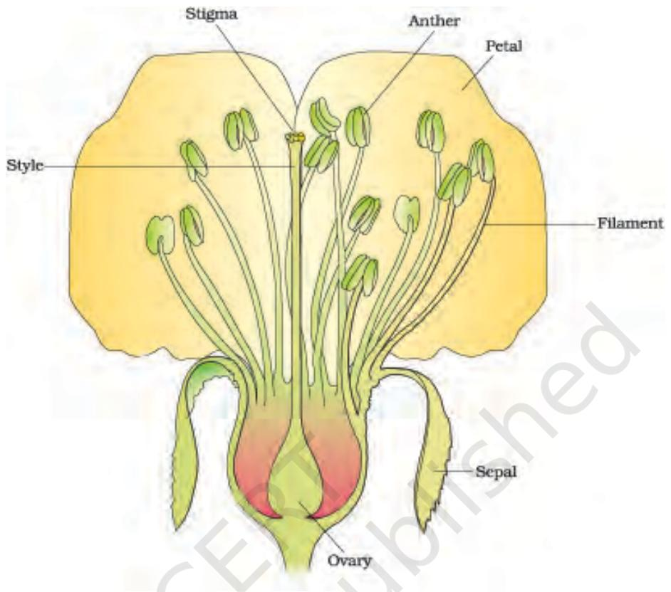

Figure 1.1 A diagrammatic representation of L.S. of a flower

*homes and in gardens. Find out the names of five more flowers that are used in social and cultural celebrations in your family. Have you heard of floriculture – what does it refer to?*

To a biologist, flowers are morphological and embryological marvels and the sites of sexual reproduction. In earlier classes, you have read the various parts of a flower. Figure 1.1 will help you recall the parts of a typical flower. Can you name the two parts in a flower in which the two most important units of sexual reproduction develop?

# 1.2 PRE-FERTILISATION: STRUCTURES AND EVENTS

Much before the actual flower is seen on a plant, the decision that the plant is going to flower has taken place. Several hormonal and structural changes are initiated which lead to the differentiation and further development of the floral primordium. Inflorescences are formed which bear the floral buds and then the flowers. In the flower the male and female reproductive structures, the androecium and the gynoecium differentiate and develop. You would recollect that the androecium consists of a whorl of stamens representing the male reproductive organ and the gynoecium represents the female reproductive organ.

4

#### 1.2.1 Stamen, Microsporangium and Pollen Grain

Figure 1.2a shows the two parts of a typical stamen – the long and slender stalk called the filament, and the terminal generally bilobed structure

called the anther. The proximal end of the filament is attached to the thalamus or the petal of the flower. The number and length of stamens are variable in flowers of different species. If you were to collect a stamen each from ten flowers (each from different species) and arrange them on a slide, you would be able to appreciate the large variation in size seen in nature. Careful observation of each stamen under a dissecting microscope and making neat diagrams would elucidate the range in shape and attachment of anthers in different flowers.

A typical angiosperm anther is bilobed with each lobe having two theca, i.e., they are dithecous (Figure 1.2b). Often a longitudinal groove runs lengthwise separating the theca. Let us understand the various types of tissues and their organisation in the transverse section of an anther (Figure 1.3a). The bilobed nature of an anther is very distinct in the transverse section of the anther. The anther is a four-sided (tetragonal) structure consisting of four microsporangia located at the corners, two in each lobe.

The microsporangia develop further and become pollen sacs. They extend longitudinally all through the length of an anther and are packed with pollen grains.

Structure of microsporangium: In a transverse section, a typical microsporangium appears near

circular in outline. It is generally surrounded by four wall layers (Figure 1.3b)– the epidermis, endothecium, middle layers and the tapetum. The outer three wall layers perform the function of protection and help in dehiscence of anther to release the pollen. The innermost wall layer is the tapetum. It nourishes the developing pollen grains. Cells of the tapetum possess dense cytoplasm and generally have more than one nucleus. *Can you think of how tapetal cells could become bi-nucleate?*

When the anther is young, a group of compactly arranged homogenous cells called the sporogenous tissue occupies the centre of each microsporangium.

Microsporogenesis : As the anther develops, the cells of the sporogenous tissue undergo meiotic divisions to form microspore tetrads. *What would be the ploidy of the cells of the tetrad?*

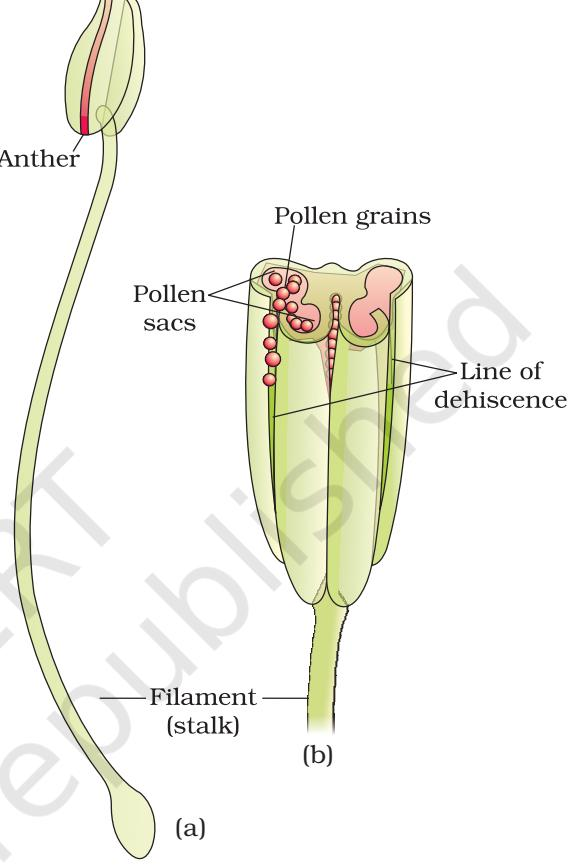

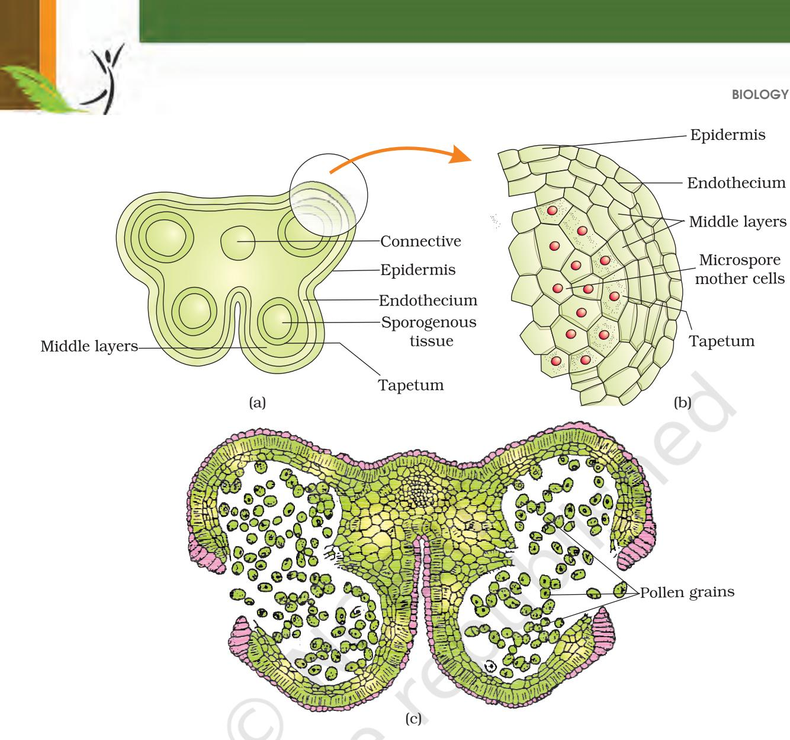

As each cell of the sporogenous tissue is capable of giving rise to a microspore tetrad. Each one is a potential pollen or microspore mother cell. The process of formation of microspores from a pollen mother cell (PMC) through meiosis is called microsporogenesis. The microspores, as they are formed, are arranged in a cluster of four cells–the microspore tetrad (Figure 1.3a). As the anthers mature and dehydrate, the microspores dissociate from each other and develop into pollen grains (Figure 1.3 b). Inside each microsporangium several thousands of microspores or pollen grains are formed that are released with the dehiscence of anther (Figure 1.3c).

Pollen grain: The pollen grains represent the male gametophytes. If you touch the opened anthers of *Hibiscus* or any other flower you would find deposition of yellowish powdery pollen grains on your fingers. Sprinkle these grains on a drop of water taken on a glass slide and observe under

6

Figure 1.4 Scanning electron micrographs of a few pollen grains (a)

a microscope. You will really be amazed at the variety of architecture – sizes, shapes, colours, designs – seen on the pollen grains from different species (Figure 1.4).

Pollen grains are generally spherical measuring about 25-50 micrometers in diameter. It has a prominent two-layered wall. The hard outer layer called the exine is made up of sporopollenin which is one of the most resistant organic material known. It can withstand high temperatures and strong acids and alkali. No enzyme that degrades sporopollenin is so far known. Pollen grain exine has prominent apertures called germ pores where sporopollenin is absent. Pollen grains are wellpreserved as fossils because of the presence of sporopollenin. The exine exhibits a fascinating array of patterns and designs. *Why do you think the exine should be hard? What is the function of germ pore?* The inner wall of the pollen grain is called the intine. It is a thin and continuous layer made up of cellulose and pectin. The cytoplasm of pollen grain is surrounded by a plasma membrane. When the pollen grain is mature it contains two cells, the vegetative cell and generative cell (Figure 1.5b). The vegetative cell is bigger, has abundant food reserve and a large irregularly shaped nucleus. The generative cell is small and floats in the cytoplasm of the vegetative cell. It is spindle shaped with dense cytoplasm and a nucleus. In over 60 per cent of angiosperms, pollen grains are shed at this 2-celled stage. In the remaining species, the generative cell divides mitotically to give rise to the two male gametes before pollen grains are shed (3-celled stage).

Pollen grains of many species cause severe allergies and bronchial afflictions in some people often leading to chronic respiratory disorders– asthma, bronchitis, etc. It may be mentioned that *Parthenium* or carrot grass that came into India as a contaminant with imported wheat, has become ubiquitous in occurrence and causes pollen allergy.

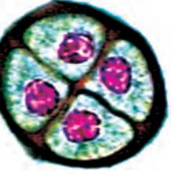

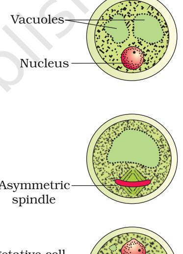

Figure 1.5 (a) Enlarged view of a pollen grain tetrad; (b) stages of a microspore maturing into a pollen grain

(b)

7

Pollen grains are rich in nutrients. It has become a fashion in recent years to use pollen tablets as food supplements. In western countries, a large number of pollen products in the form of tablets and syrups are available in the market. Pollen consumption has been claimed to increase the performance of athletes and race horses (Figure 1.6).

Figure 1.6 Pollen products

When once they are shed, pollen grains have to land on the stigma before they lose viability if they have to bring about fertilisation. How long do you think the pollen grains retain viability? The period for which pollen grains remain viable is highly variable and to some extent depends on the prevailing temperature and humidity. In some cereals such as rice and wheat, pollen grains lose viability within 30 minutes of their release, and in some members of Rosaceae, Leguminoseae and Solanaceae, they maintain viability for months. You may have heard of storing semen/ sperms of many animals including humans for artificial insemination. It is possible to store pollen grains of a large number of species for years in liquid nitrogen (-1960C). Such stored pollen can be used as pollen banks, similar to seed banks, in crop breeding programmes.

#### 1.2.2 The Pistil, Megasporangium (ovule) and Embryo sac

The gynoecium represents the female reproductive part of the flower. The gynoecium may consist of a single pistil (monocarpellary) or may have more than one pistil (multicarpellary). When there are more than one, the pistils may be fused together (syncarpous) (Figure 1.7b) or may be free (apocarpous) (Figure 1.7c). Each pistil has three parts (Figure 1.7a), the stigma, style and ovary. The stigma serves as a landing platform for pollen grains. The style is the elongated slender part beneath the stigma. The basal bulged part of the pistil is the ovary. Inside the ovary is the ovarian cavity (locule). The placenta is located inside the ovarian cavity. Recall the definition and types of placentation that you studied in

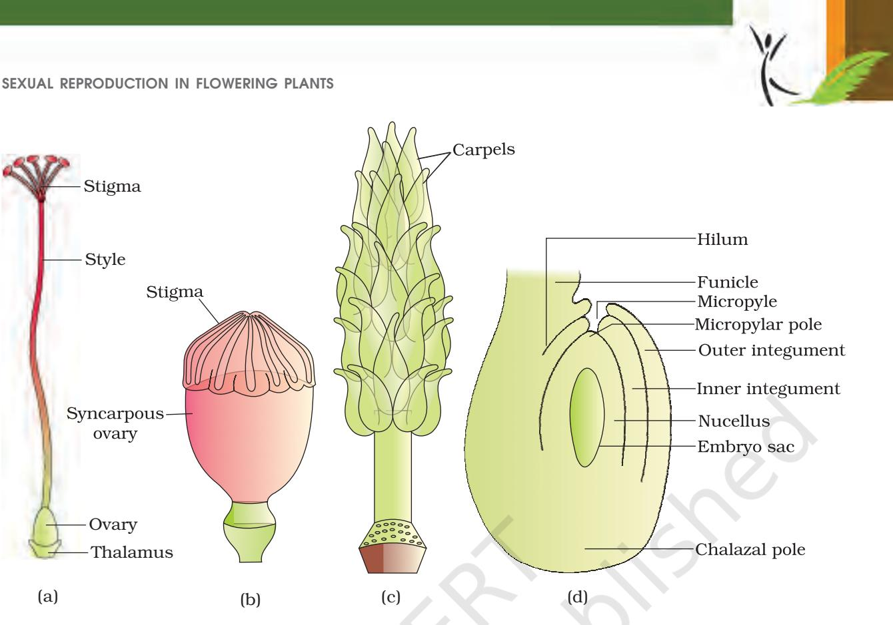

Figure 1.7 (a) A dissected flower of *Hibiscus* showing pistil (other floral parts have been removed); (b) Multicarpellary, syncarpous pistil of *Papaver* ; (c) A multicarpellary, apocarpous gynoecium of *Michelia*; (d) A diagrammatic view of a typical anatropous ovule

Class XI. Arising from the placenta are the megasporangia, commonly called ovules. The number of ovules in an ovary may be one (wheat, paddy, mango) to many (papaya, water melon, orchids).

The Megasporangium (Ovule) : Let us familiarise ourselves with the structure of a typical angiosperm ovule (Figure 1.7d). The ovule is a small structure attached to the placenta by means of a stalk called funicle. The body of the ovule fuses with funicle in the region called hilum. Thus, hilum represents the junction between ovule and funicle. Each ovule has one or two protective envelopes called integuments. Integuments encircle the nucellus except at the tip where a small opening called the micropyle is organised. Opposite the micropylar end, is the chalaza, representing the basal part of the ovule.

Enclosed within the integuments is a mass of cells called the nucellus. Cells of the nucellus have abundant reserve food materials. Located in the nucellus is the embryo sac or female gametophyte. An ovule generally has a single embryo sac formed from a megaspore.

Megasporogenesis : The process of formation of megaspores from the megaspore mother cell is called megasporogenesis. Ovules generally differentiate a single megaspore mother cell (MMC) in the micropylar region

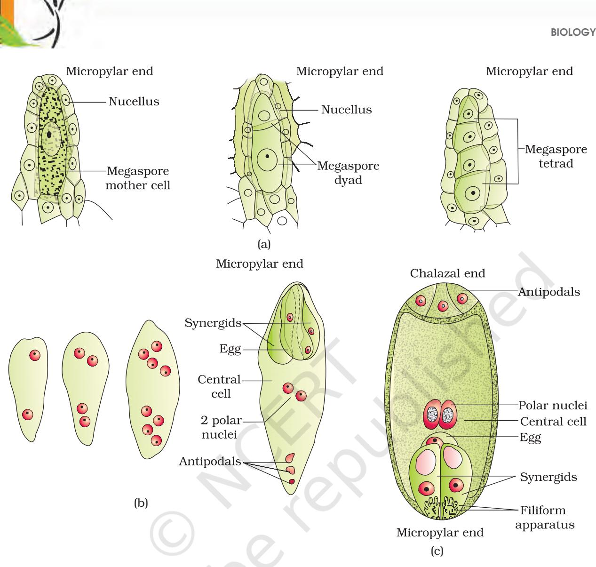

- Figure 1.8 (a) Parts of the ovule showing a large megaspore mother cell, a dyad and a tetrad of megaspores; (b) 2, 4, and 8-nucleate stages of embryo sac and a mature embryo sac; (c) A diagrammatic representation of the mature embryo sac.
of the nucellus. It is a large cell containing dense cytoplasm and a prominent nucleus. The MMC undergoes meiotic division. *What is the importance of the MMC undergoing meiosis?* Meiosis results in the production of four megaspores (Figure 1.8a).

Female gametophyte : In a majority of flowering plants, one of the megaspores is functional while the other three degenerate. Only the functional megaspore develops into the female gametophyte (embryo sac). This method of embryo sac formation from a single megaspore is termed monosporic development. *What will be the ploidy of the cells of the nucellus, MMC, the functional megaspore and female gametophyte?*

Let us study about the formation of the embryo sac in detail. (Figure 1.8b). The nucleus of the functional megaspore divides mitotically to form two nuclei which move to the opposite poles, forming the 2 nucleate embryo sac. Two more sequential mitotic nuclear divisions result in the formation of the 4-nucleate and later the 8-nucleate stages of the embryo sac. It is of interest to note that these mitotic divisions are strictly free nuclear, that is, nuclear divisions are not followed immediately by cell wall formation. After the 8-nucleate stage, cell walls are laid down leading to the organisation of the typical female gametophyte or embryo sac. Observe the distribution of cells inside the embryo sac (Figure 1.8b, c). Six of the eight nuclei are surrounded by cell walls and organised into cells; the remaining two nuclei, called polar nuclei are situated below the egg apparatus in the large central cell.

There is a characteristic distribution of the cells within the embryo sac. Three cells are grouped together at the micropylar end and constitute the egg apparatus. The egg apparatus, in turn, consists of two synergids and one egg cell. The synergids have special cellular thickenings at the micropylar tip called filiform apparatus, which play an important role in guiding the pollen tubes into the synergid. Three cells are at the chalazal end and are called the antipodals. The large central cell, as mentioned earlier, has two polar nuclei. Thus, a typical angiosperm embryo sac, at maturity, though 8-nucleate is 7-celled.

#### 1.2.3 Pollination

In the preceding sections you have learnt that the male and female gametes in flowering plants are produced in the pollen grain and embryo sac, respectively. As both types of gametes are non-motile, they have to be brought together for fertilisation to occur. How is this achieved?

Pollination is the mechanism to achieve this objective. Transfer of pollen grains (shed from the anther) to the stigma of a pistil is termed pollination. Flowering plants have evolved an amazing array of adaptations to achieve pollination*.* They make use of external agents to achieve pollination. *Can you list the possible external agents?*

Kinds of Pollination : Depending on the source of pollen, pollination can be divided into three types.

- (i) *Autogamy* : In this type, pollination is achieved within the same flower. Transfer of pollen grains from the anther to the stigma of the same flower (Figure 1.9a). In a normal flower which opens and exposes the anthers and the stigma, complete autogamy is rather rare. Autogamy in such flowers requires synchrony in pollen release and stigma receptivity and also, the anthers and the stigma should
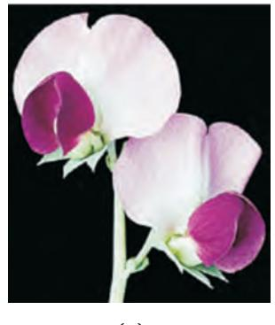

(a)

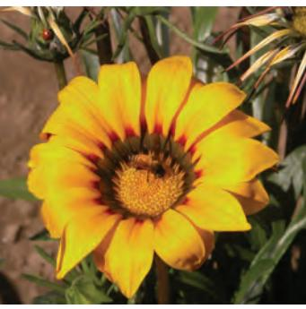

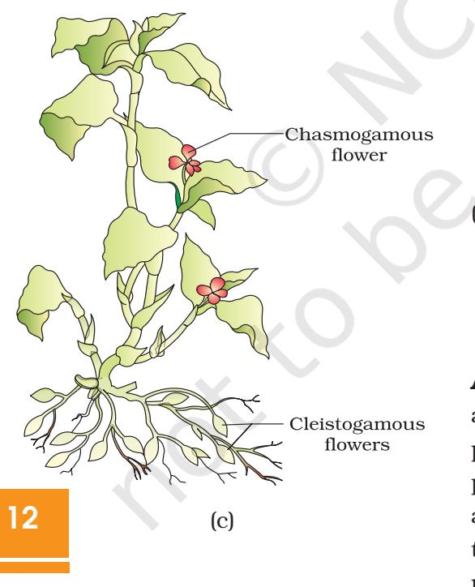

lie close to each other so that self-pollination can occur. Some plants such as *Viola* (common pansy)*, Oxalis,* and *Commelina* produce two types of flowers – chasmogamous flowers which are similar to flowers of other species with exposed anthers and stigma, and cleistogamous flowers which do not open at all (Figure 1.9c). In such flowers, the anthers and stigma lie close to each other. When anthers dehisce in the flower buds, pollen grains come in contact with the stigma to effect pollination. Thus, cleistogamous flowers are invariably autogamous as there is no chance of cross-pollen landing on the stigma. Cleistogamous flowers produce assured seed-set even in the absence of pollinators. Do you think that cleistogamy is advantageous or disadvantageous to the plant? Why?

(ii) *Geitonogamy* – Transfer of pollen grains from the anther to the stigma of another flower of the same plant. Although geitonogamy is functionally cross-pollination involving a pollinating agent, genetically it is similar to autogamy since the pollen grains come from the same plant.

(iii) *Xenogamy* – Transfer of pollen grains from anther to the stigma of a different plant (Figure 1.9b). This is the only type of pollination which during pollination brings genetically different types of pollen grains to the stigma.

Agents of Pollination : Plants use two abiotic (wind and water) and one biotic (animals) agents to achieve pollination. Majority of plants use biotic agents for pollination. Only a small proportion of plants use abiotic agents. Pollen grains coming in contact with the stigma is a chance factor in both wind and water pollination. To compensate for this uncertainties and associated loss of pollen grains, the flowers produce enormous amount of pollen when compared to the number of ovules available for pollination.

Pollination by wind is more common amongst abiotic pollinations. Wind pollination also requires that the pollen grains are light and non-sticky so that they can be transported in wind currents. They often possess well-exposed stamens (so that the pollens are easily dispersed into wind currents, Figure 1.10) and large often-feathery stigma to easily trap air-borne pollen grains. Windpollinated flowers often have a single ovule in each ovary and numerous flowers packed into an inflorescence; a familiar example is the corn cob – the tassels you see are nothing but the stigma and style which wave in the wind to trap pollen grains. Wind-pollination is quite common in grasses.

Pollination by water is quite rare in flowering plants and is limited to about 30 genera, mostly monocotyledons. As against this, you would recall that water is a regular mode of transport for the male gametes among the lower plant groups such as algae, bryophytes and pteridophytes. It is believed, particularly for some bryophytes and pteridophytes, that their distribution is limited because of the need for water for the transport of male gametes and fertilisation. Some

examples of water pollinated plants are *Vallisneria* and *Hydrilla* which grow in fresh water and several marine sea-grasses such as *Zostera*. Not all aquatic plants use water for pollination. In a majority of aquatic plants such as water hyacinth and water lily, the flowers emerge above the level of water and are pollinated by insects or wind as in most of the land plants. In *Vallisneria,* the female flower reach the surface of water by the long stalk and the male flowers or pollen grains are released on to the surface of water. They are carried passively by water currents (Figure 1.11a); some of them eventually reach the female flowers and the stigma. In another group of water pollinated plants such as seagrasses, female flowers remain submerged in water and the pollen grains are released inside the water. Pollen grains in many such species are long, ribbon like and they are carried passively inside the water; some of them reach the stigma and achieve pollination. In most of the water-pollinated species, pollen grains are protected from wetting by a mucilaginous covering.

Both wind and water pollinated flowers are not very colourful and do not produce nectar. *What would be the reason for this?*

Figure 1.10 A wind-pollinated plant showing compact inflorecence and wellexposed stamens

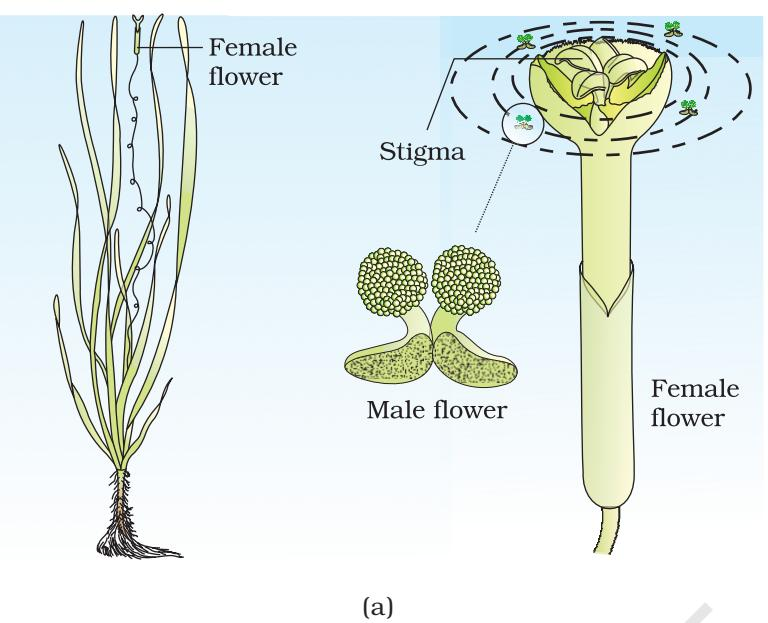

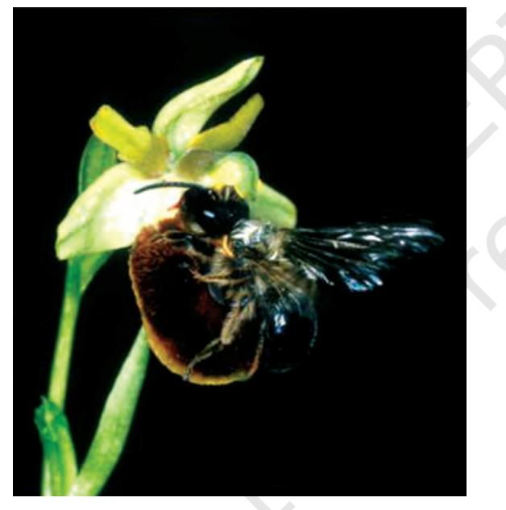

Figure 1.11 (a) Pollination by water in *Vallisneria*; (b) Insect pollination

(b)

Majority of flowering plants use a range of animals as pollinating agents. Bees, butterflies, flies, beetles, wasps, ants, moths, birds (sunbirds and humming birds) and bats are the common pollinating agents. (Figure 1.11b). Among the animals, insects, particularly bees are the dominant biotic pollinating agents. Even larger animals such as some primates (lemurs), arboreal (tree-dwelling) rodents, or even reptiles (gecko lizard and garden lizard) have also been reported as pollinators in some species.

Often flowers of animalpollinated plants are specifically adapted for a particular species of animal.

Majority of insect-pollinated flowers are large, colourful, fragrant and rich in nectar. When the flowers are small, a number of flowers are clustered into an inflorescence to make them conspicuous. Animals are attracted to flowers by colour and/or fragrance. The flowers pollinated by flies and beetles secrete foul odours to attract these animals. To sustain animal visits, the flowers have to provide rewards to the animals. Nectar and pollen grains are the usual floral rewards. For harvesting the reward(s) from the flower the animal visitor comes in contact with the anthers and the stigma. The body of the animal gets a coating of pollen grains, which are

generally sticky in animal pollinated flowers. When the animal carrying pollen on its body comes in contact with the stigma, it brings about pollination.

In some species floral rewards are in providing safe places to lay eggs; an example is that of the tallest flower of *Amorphophallus* (the flower itself is about 6 feet in height). A similar relationship exists between a species of moth and the plant *Yucca* where both species – moth and the

14

plant – cannot complete their life cycles without each other. The moth deposits its eggs in the locule of the ovary and the flower, in turn, gets pollinated by the moth. The larvae of the moth come out of the eggs as the seeds start developing.

*Why don't you observe some flowers of the following plants (or any others available to you): Cucumber, Mango, Peepal, Coriander, Papaya, Onion, Lobia, Cotton, Tobacco, Rose, Lemon, Eucalyptus, Banana? Try to find out which animals visit them and whether they could be pollinators.You'll have to patiently observe the flowers over a few days and at different times of the day. You could also try to see whether there is any correlation in the characteristics of a flower to the animal that visits it. Carefully observe if any of the visitors come in contact with the anthers and the stigma as only such visitors can bring about pollination. Many insects may consume pollen or the nectar without bringing about pollination. Such floral visitors are referred to as pollen/nectar robbers. You may or may not be able to identify the pollinators, but you will surely enjoy your efforts!*

Outbreeding Devices : Majority of flowering plants produce hermaphrodite flowers and pollen grains are likely to come in contact with the stigma of the same flower. Continued self-pollination result in inbreeding depression. Flowering plants have developed many devices to discourage selfpollination and to encourage cross-pollination. In some species, pollen release and stigma receptivity are not synchronised. Either the pollen is released before the stigma becomes receptive or stigma becomes receptive much before the release of pollen. In some other species, the anther and stigma are placed at different positions so that the pollen cannot come in contact with the stigma of the same flower. Both these devices prevent autogamy. The third device to prevent inbreeding is self-incompatibility. This is a genetic mechanism and prevents self-pollen (from the same flower or other flowers of the same plant) from fertilising the ovules by inhibiting pollen germination or pollen tube growth in the pistil. Another device to prevent self-pollination is the production of unisexual flowers. If both male and female flowers are present on the same plant such as castor and maize (monoecious), it prevents autogamy but not geitonogamy. In several species such as papaya, male and female flowers are present on different plants, that is each plant is either male or female (dioecy). This condition prevents both autogamy and geitonogamy.

Pollen-pistil Interaction : Pollination does not guarantee the transfer of the right type of pollen (compatible pollen of the same species as the stigma). Often, pollen of the wrong type, either from other species or from the same plant (if it is self-incompatible), also land on the stigma. The pistil has the ability to recognise the pollen, whether it is of the right type (compatible) or of the wrong type (incompatible). If it is of the right type, the pistil accepts the pollen and promotes post-pollination events that

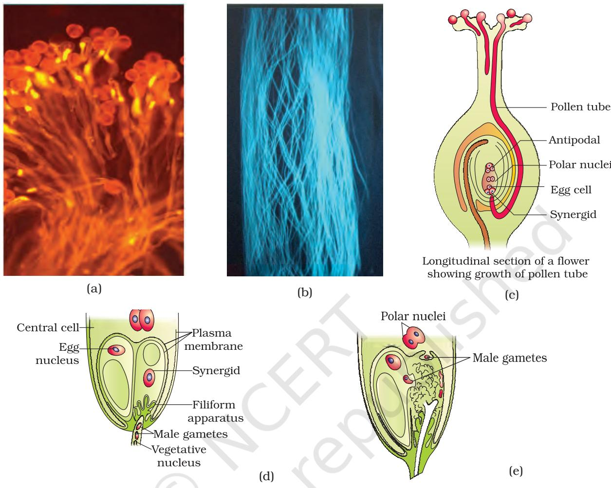

- Figure 1.12 (a) Pollen grains germinating on the stigma; (b) Pollen tubes growing through the style; (c) L.S. of pistil showing path of pollen tube growth; (d) enlarged view of an egg apparatus showing entry of pollen tube into a synergid; (e) Discharge of male gametes into a synergid and the movements of the sperms, one into the egg and the other into the central cell
leads to fertilisation. If the pollen is of the wrong type, the pistil rejects the pollen by preventing pollen germination on the stigma or the pollen tube growth in the style. The ability of the pistil to recognise the pollen followed by its acceptance or rejection is the result of a continuous dialogue between pollen grain and the pistil. This dialogue is mediated by chemical components of the pollen interacting with those of the pistil. It is only in recent years that botanists have been able to identify some of the pollen and pistil components and the interactions leading to the recognition, followed by acceptance or rejection.

As mentioned earlier, following compatible pollination, the pollen grain germinates on the stigma to produce a pollen tube through one of the germ pores (Figure 1.12a). The contents of the pollen grain move into the

16

pollen tube. Pollen tube grows through the tissues of the stigma and style and reaches the ovary (Figure 1.12b, c). You would recall that in some plants, pollen grains are shed at two-celled condition (a vegetative cell and a generative cell). In such plants, the generative cell divides and forms the two male gametes during the growth of pollen tube in the stigma. In plants which shed pollen in the three-celled condition, pollen tubes carry the two male gametes from the beginning. Pollen tube, after reaching the ovary, enters the ovule through the micropyle and then enters one of the synergids through the filiform apparatus (Figure 1.12d, e). Many recent studies have shown that filiform apparatus present at the micropylar part of the synergids guides the entry of pollen tube. All these events–from pollen deposition on the stigma until pollen tubes enter the ovule–are together referred to as pollen-pistil interaction. As pointed out earlier, pollen-pistil interaction is a dynamic process involving pollen recognition followed by promotion or inhibition of the pollen. The knowledge gained in this area would help the plant breeder in manipulating pollen-pistil interaction, even in incompatible pollinations, to get desired hybrids.

You can easily study pollen germination by dusting some pollen from flowers such as pea, chickpea, *Crotalaria*, balsam and *Vinca* on a glass slide containing a drop of sugar solution (about 10 per cent). After about 15–30 minutes, observe the slide under the low power lens of the microscope. You are likely to see pollen tubes coming out of the pollen grains.

A breeder is interested in crossing different species and often genera to combine desirable characters to produce commercially 'superior' varieties. Artificial hybridisation is one of the major approaches of crop improvement programme. In such crossing experiments it is important to make sure that only the desired pollen grains are used for pollination and the stigma is protected from contamination (from unwanted pollen). This is achieved by emasculation and bagging techniques.

If the female parent bears bisexual flowers, removal of anthers from the flower bud before the anther dehisces using a pair of forceps is necessary. This step is referred to as emasculation. Emasculated flowers have to be covered with a bag of suitable size, generally made up of butter paper, to prevent contamination of its stigma with unwanted pollen. This process is called bagging. When the stigma of bagged flower attains receptivity, mature pollen grains collected from anthers of the male parent are dusted on the stigma, and the flowers are rebagged, and the fruits allowed to develop.

If the female parent produces unisexual flowers, there is no need for emasculation. The female flower buds are bagged before the flowers open. When the stigma becomes receptive, pollination is carried out using the desired pollen and the flower rebagged.

# 1.3 DOUBLE FERTILISATION

After entering one of the synergids, the pollen tube releases the two male gametes into the cytoplasm of the synergid. One of the male gametes moves towards the egg cell and fuses with its nucleus thus completing the syngamy. This results in the formation of a diploid cell, the zygote. The other male gamete moves towards the two polar nuclei located in the central cell and fuses with them to produce a triploid primary endosperm nucleus (PEN) (Figure 1.13a). As this involves the fusion of three haploid nuclei it is termed triple fusion. Since two types of fusions, syngamy and triple fusion take place in an embryo sac the phenomenon is termed double fertilisation, an event unique to flowering plants. The central cell after triple fusion becomes the primary endosperm cell (PEC) and develops into the endosperm while the zygote develops into an embryo.

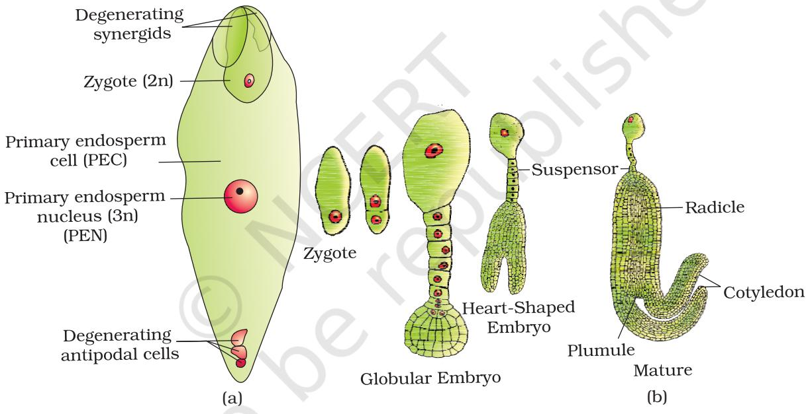

# 1.4 POST-FERTILISATION : STRUCTURES AND EVENTS

Following double fertilisation, events of endosperm and embryo development, maturation of ovule(s) into seed(s) and ovary into fruit, are collectively termed post-fertilisation events.

#### 1.4.1 Endosperm

Endosperm development precedes embryo development. *Why?* The primary endosperm cell divides repeatedly and forms a triploid

18

endosperm tissue. The cells of this tissue are filled with reserve food materials and are used for the nutrition of the developing embryo. In the most common type of endosperm development, the PEN undergoes successive nuclear divisions to give rise to free nuclei. This stage of endosperm development is called free-nuclear endosperm. Subsequently cell wall formation occurs and the endosperm becomes cellular. The number of free nuclei formed before cellularisation varies greatly. The coconut water from tender coconut that you are familiar with, is nothing but free-nuclear endosperm (made up of thousands of nuclei) and the surrounding white kernel is the cellular endosperm.

Endosperm may either be completely consumed by the developing embryo (e.g., pea, groundnut, beans) before seed maturation or it may persist in the mature seed (e.g. castor and coconut) and be used up during seed germination. *Split open some seeds of castor, peas, beans, groundnut, fruit of coconut and look for the endosperm in each case. Find out whether the endosperm is persistent in cereals – wheat, rice and maize.*

#### 1.4.2 Embryo

Embryo develops at the micropylar end of the embryo sac where the zygote is situated. Most zygotes divide only after certain amount of endosperm is formed. This is an adaptation to provide assured nutrition to the developing embryo. Though the seeds differ greatly, the early stages of embryo development (embryogeny) are similar in both monocotyledons and dicotyledons. Figure 1.13 depicts the stages of embryogeny in a dicotyledonous embryo. The zygote gives rise to the proembryo and subsequently to the globular, heart-shaped and mature embryo.

A typical dicotyledonous embryo (Figure 1.14a), consists of an embryonal axis and two cotyledons. The portion of embryonal axis above the level of cotyledons is the epicotyl, which terminates with the plumule or stem tip. The cylindrical portion below the level of cotyledons is hypocotyl that terminates at its lower end in the radicle or root tip. The root tip is covered with a root cap.

Embryos of monocotyledons (Figure 1.14 b) possess only one cotyledon. In the grass family the cotyledon is called scutellum that is situated towards one side (lateral) of the embryonal axis. At its lower end, the embryonal axis has the

- Figure 1.14 (a) A typical dicot embryo; (b) L.S. of an embryo of grass
radical and root cap enclosed in an undifferentiated sheath called coleorrhiza. The portion of the embryonal axis above the level of attachment of scutellum is the epicotyl. Epicotyl has a shoot apex and a few leaf primordia enclosed in a hollow foliar structure, the coleoptile.

*Soak a few seeds in water (say of wheat, maize, peas, chickpeas, ground nut) overnight. Then split the seeds and observe the various parts of the embryo and the seed.*

#### 1.4.3 Seed

In angiosperms, the seed is the final product of sexual reproduction. It is often described as a fertilised ovule. Seeds are formed inside fruits. A seed typically consists of seed coat(s), cotyledon(s) and an embryo axis. The cotyledons (Figure 1.15a) of the embryo are simple structures, generally thick and swollen due to storage of food reserves (as in legumes). Mature seeds may be non-albuminous or ex-albuminous. Nonalbuminous seeds have no residual endosperm as it is completely consumed during embryo development (e.g., pea, groundnut). Albuminous seeds retain a part of endosperm as it is not completely used up during embryo development (e.g., wheat, maize, barley, castor). Occasionally, in some seeds such as black pepper and beet, remnants of nucellus are also persistent. This residual, persistent nucellus is the perisperm.

Integuments of ovules harden as tough protective seed coats (Figure 1.15a). The micropyle remains as a small pore in the seed coat. This facilitates entry of oxygen and water into the seed during germination. As the seed matures, its water content is reduced and seeds become relatively dry (10-15 per cent moisture by mass). The general metabolic activity of the embryo slows down. The embryo may enter a state of inactivity called dormancy, or if favourable conditions are available (adequate moisture, oxygen and suitable temperature), they germinate.

As ovules mature into seeds, the ovary develops into a fruit, i.e., the transformation of ovules into seeds and ovary into fruit proceeds simultaneously. The wall of the ovary develops into the wall of fruit called pericarp. The fruits may be fleshy as in guava, orange, mango, etc., or may be dry, as in groundnut, and mustard, etc. Many fruits have evolved mechanisms for dispersal of seeds. Recall the classification of fruits and their dispersal mechanisms that you have studied in an earlier class. *Is there any relationship between number of ovules in an ovary and the number of seeds present in a fruit?*

In most plants, by the time the fruit develops from the ovary, other floral parts degenerate and fall off. However, in a few species such as apple, strawberry, cashew, etc., the thalamus also contributes to fruit formation. Such fruits are called false fruits (Figure 1.15b). Most fruits however develop only from the ovary and are called true fruits. Although in most of the species, fruits are the results of fertilisation, there are a few species

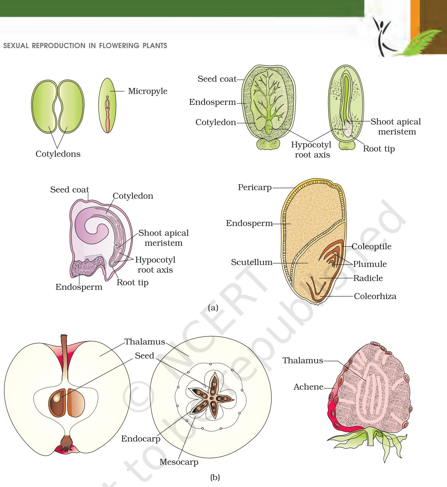

Figure 1.15 (a) Structure of some seeds. (b) False fruits of apple and strawberry

in which fruits develop without fertilisation. Such fruits are called parthenocarpic fruits. Banana is one such example. Parthenocarpy can be induced through the application of growth hormones and such fruits are seedless.

Seeds offer several advantages to angiosperms. Firstly, since reproductive processes such as pollination and fertilisation are independent of water, seed formation is more dependable. Also seeds have better adaptive strategies for dispersal to new habitats and help the species 21

to colonise in other areas. As they have sufficient food reserves, young seedlings are nourished until they are capable of photosynthesis on their own. The hard seed coat provides protection to the young embryo. Being products of sexual reproduction, they generate new genetic combinations leading to variations.

Seed is the basis of our agriculture. Dehydration and dormancy of mature seeds are crucial for storage of seeds which can be used as food throughout the year and also to raise crop in the next season. Can you imagine agriculture in the absence of seeds, or in the presence of seeds which germinate straight away soon after formation and cannot be stored?

How long do the seeds remain alive after they are dispersed? This period again varies greatly. In a few species the seeds lose viability within a few months. Seeds of a large number of species live for several years. Some seeds can remain alive for hundreds of years. There are several records of very old yet viable seeds. The oldest is that of a lupine, *Lupinus arcticus* excavated from Arctic Tundra. The seed germinated and flowered after an estimated record of 10,000 years of dormancy. A recent record of 2000 years old viable seed is of the date palm, *Phoenix dactylifera* discovered during the archeological excavation at King Herod's palace near the Dead Sea.

*After completing a brief account of sexual reproduction of flowering plants it would be worth attempting to comprehend the enormous reproductive capacity of some flowering plants by asking the following questions: How many eggs are present in an embryo sac? How many embryo sacs are present in an ovule? How many ovules are present in an ovary? How many ovaries are present in a typical flower? How many flowers are present on a tree? And so on...*

*Can you think of some plants in which fruits contain very large number of seeds. Orchid fruits are one such category and each fruit contain thousands of tiny seeds. Similar is the case in fruits of some parasitic species such as Orobanche and Striga. Have you seen a tiny seed of Ficus? How large is the tree of Ficus developed from that tiny seed. How many billions of seeds does each Ficus tree produce? Can you imagine any other example in which such a tiny structure can produce such a large biomass over the years?*

# 1.5 APOMIXIS AND POLYEMBRYONY

Although seeds, in general are the products of fertilisation, a few flowering plants such as some species of *Asteraceae* and grasses, have evolved a special mechanism, to produce seeds without fertilisation, called apomixis. *What is fruit production without fertilisation called?* Thus, apomixis is a form of asexual reproduction that mimics sexual reproduction. There are several ways of development of apomictic seeds. In some species, the diploid egg cell is formed without reduction division and develops into the embryo without fertilisation. More often, as in many *Citrus* and *Mango*

varieties some of the nucellar cells surrounding the embryo sac start dividing, protrude into the embryo sac and develop into the embryos. In such species each ovule contains many embryos. Occurrence of more than one embryo in a seed is referred to as polyembryony. *Take out some seeds of orange and squeeze them. Observe the many embryos of different sizes and shapes from each seed. Count the number of embryos in each seed. What would be the genetic nature of apomictic embryos? Can they be called clones?*

Hybrid varieties of several of our food and vegetable crops are being extensively cultivated. Cultivation of hybrids has tremendously increased productivity. One of the problems of hybrids is that hybrid seeds have to be produced every year. If the seeds collected from hybrids are sown, the plants in the progeny will segregate and do not maintain hybrid characters. Production of hybrid seeds is costly and hence the cost of hybrid seeds become too expensive for the farmers. If these hybrids are made into apomicts, there is no segregation of characters in the hybrid progeny. Then the farmers can keep on using the hybrid seeds to raise new crop year after year and he does not have to buy hybrid seeds every year. Because of the importance of apomixis in hybrid seed industry, active research is going on in many laboratories around the world to understand the genetics of apomixis and to transfer apomictic genes into hybrid varieties.

#### SUMMARY

Flowers are the seat of sexual reproduction in angiosperms. In the flower, androecium consisting of stamens represents the male reproductive organs and gynoecium consisting of pistils represents the female reproductive organs.

A typical anther is bilobed, dithecous and tetrasporangiate. Pollen grains develop inside the microsporangia. Four wall layers, the epidermis, endothecium, middle layers and the tapetum surround the microsporangium. Cells of the sporogenous tissue lying in the centre of the microsporangium, undergo meiosis (microsporogenesis) to form tetrads of microspores. Individual microspores mature into pollen grains.

Pollen grains represents the male gametophytic generation. The pollen grains have a two-layered wall, the outer exine and inner intine. The exine is made up of sporopollenin and has germ pores. Pollen grains may have two cells (a vegetative cell and generative cell) or three cells (a vegetative cell and two male gametes) at the time of shedding.

The pistil has three parts – the stigma, style and the ovary. Ovules are present in the ovary. The ovules have a stalk called funicle, protective integument(s), and an opening called micropyle. The central tissue is the nucellus in which the archesporium differentiates. A cell of the archesporium, the megaspore mother cell divides meiotically and one of the megaspores forms the embryo sac (the female gametophyte). The mature embryo sac is 7-celled and 8-nucleate. At the micropylar end is the egg apparatus consisting of two synergids and an egg cell. At the chalazal end are three antipodals. At the centre is a large central cell with two polar nuclei.

Pollination is the mechanism to transfer pollen grains from the anther to the stigma. Pollinating agents are either abiotic (wind and water) or biotic (animals).

Pollen-pistil interaction involves all events from the landing of pollen grains on the stigma until the pollen tube enters the embryo sac (when the pollen is compatible) or pollen inhibition (when the pollen is incompatible). Following compatible pollination, pollen grain germinates on the stigma and the resulting pollen tube grow through the style, enter the ovules and finally discharges two male gametes in one of the synergids. Angiosperms exhibit double fertilisation because two fusion events occur in each embryo sac, namely syngamy and triple fusion. The products of these fusions are the diploid zygote and the triploid primary endosperm nucleus (in the primary endosperm cell). Zygote develops into the embryo and the primary endosperm cell forms the endosperm tissue. Formation of endosperm always precedes development of the embryo.

The developing embryo passes through different stages such as the proembryo, globular and heart-shaped stages before maturation. Mature dicotyledonous embryo has two cotyledons and an embryonal axis with epicotyl and hypocotyl. Embryos of monocotyledons have a single cotyledon. After fertilisation, ovary develops into fruit and ovules develop into seeds.

A phenomenon called apomixis is found in some angiosperms, particularly in grasses. It results in the formation of seeds without fertilisation. Apomicts have several advantages in horticulture and agriculture.

Some angiosperms produce more than one embryo in their seed. This phenomenon is called polyembryony.

# EXERCISES

- 1. Name the parts of an angiosperm flower in which development of male and female gametophyte take place.
- 2. Differentiate between microsporogenesis and megasporogenesis. Which type of cell division occurs during these events? Name the structures formed at the end of these two events.
- 3. Arrange the following terms in the correct developmental sequence:

Pollen grain, sporogenous tissue, microspore tetrad, pollen mother cell, male gametes.

- 4. With a neat, labelled diagram, describe the parts of a typical angiosperm ovule.
- 5. What is meant by monosporic development of female gametophyte?
- 6. With a neat diagram explain the 7-celled, 8-nucleate nature of the female gametophyte.

- 7. What are chasmogamous flowers? Can cross-pollination occur in cleistogamous flowers? Give reasons for your answer.
- 8. Mention two strategies evolved to prevent self-pollination in flowers.
- 9. What is self-incompatibility? Why does self-pollination not lead to seed formation in self-incompatible species?
- 10. What is bagging technique? How is it useful in a plant breeding programme?
- 11. What is triple fusion? Where and how does it take place? Name the nuclei involved in triple fusion.
- 12. Why do you think the zygote is dormant for sometime in a fertilised ovule?
- 13. Differentiate between:
	- (a) hypocotyl and epicotyl;
	- (b) coleoptile and coleorrhiza;
	- (c) integument and testa;
	- (d) perisperm and pericarp.
- 14. Why is apple called a false fruit? Which part(s) of the flower forms the fruit?
- 15. What is meant by emasculation? When and why does a plant breeder employ this technique?
- 16. If one can induce parthenocarpy through the application of growth substances, which fruits would you select to induce parthenocarpy and why?
- 17. Explain the role of tapetum in the formation of pollen-grain wall.
- 18. What is apomixis and what is its importance?

# 25

