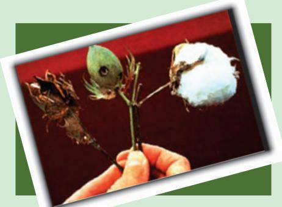
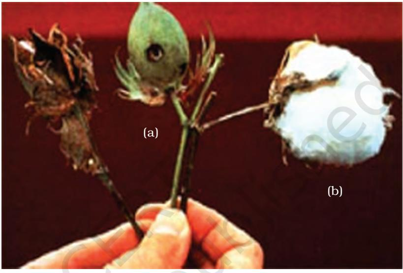
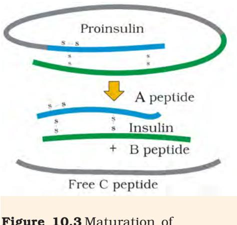

## CHAPTER 10

# BIOTECHNOLOGY AND ITS APPLICATIONS

- *10.1 Biotechnological Applications in Agriculture*
- *10.2 Biotechnological Applications in Medicine*
- *10.3 Transgenic Animals*
- *10.4 Ethical Issues*

Biotechnology, as you would have learnt from the previous chapter, essentially deals with industrial scale production of biopharmaceuticals and biologicals using genetically modified microbes, fungi, plants and animals. The applications of biotechnology include therapeutics, diagnostics, genetically modified crops for agriculture, processed food, bioremediation, waste treatment, and energy production. Three critical research areas of biotechnology are:

- (i) Providing the best catalyst in the form of improved organism usually a microbe or pure enzyme.
- (ii) Creating optimal conditions through engineering for a catalyst to act, and
- (iii) Downstream processing technologies to purify the protein/organic compound.

Let us now learn how human beings have used biotechnology to improve the quality of human life, especially in the field of food production and health.

## 10.1 BIOTECHNOLOGICAL APPLICATIONS IN AGRICULTURE

Let us take a look at the three options that can be thought for increasing food production

- (i) agro-chemical based agriculture;
- (ii) organic agriculture; and
- (iii) genetically engineered crop-based agriculture.

The Green Revolution succeeded in tripling the food supply but yet it was not enough to feed the growing human population. Increased yields have partly been due to the use of improved crop varieties, but mainly due to the use of better management practices and use of agrochemicals (fertilisers and pesticides). However, for farmers in the developing world, agrochemicals are often too expensive, and further increases in yield with existing varieties are not possible using conventional breeding.

As traditional breeding techniques failed to keep pace with demand and to provide sufficiently fast and efficient systems for crop improvement, another technology called tissue culture got developed. What does tissue culture mean? It was learnt by scientists, during 1950s, that whole plants could be regenerated from explants, i.e., any part of a plant taken out and grown in a test tube, under sterile conditions in special nutrient media. This capacity to generate a whole plant from any cell/explant is called totipotency. You will learn how to accomplish this in higher classes. It is important to stress here that the nutrient medium must provide a carbon source such as sucrose and also inorganic salts, vitamins, amino acids and growth regulators like auxins, cytokinins etc. By application of these methods it is possible to achieve propagation of a large number of plants in very short durations. This method of producing thousands of plants through tissue culture is called micro-propagation. Each of these plants will be genetically identical to the original plant from which they were grown, i.e., they are somaclones. Many important food plants like tomato, banana, apple, etc., have been produced on commercial scale using this method. Try to visit a tissue culture laboratory with your teacher to better understand and appreciate the process.

Another important application of the method is the recovery of healthy plants from diseased plants. Even if the plant is infected with a virus, the meristem (apical and axillary) is free of virus. Hence, one can remove the meristem and grow it *in vitro* to obtain virus-free plants. Scientists have succeeded in culturing meristems of banana, sugarcane, potato, etc.

Scientists have even isolated single cells from plants and after digesting their cell walls have been able to isolate naked protoplasts (surrounded by plasma membranes). Isolated protoplasts from two different varieties of plants – each having a desirable character – can be fused to get hybrid protoplasts, which can be further grown to form a new plant. These hybrids are called somatic hybrids while the process is called somatic hybridisation. Imagine a situation when a protoplast of tomato is fused with that of potato, and then they are grown – to form new hybrid plants combining tomato and potato characteristics. Well, this has been achieved – resulting in formation of pomato; unfortunately this plant did not have all the desired combination of characteristics for its commercial utilisation.

Is there any alternative path that our understanding of genetics can show so that farmers may obtain maximum yield from their fields? Is there a way to minimise the use of fertilisers and chemicals so that their harmful effects on the environment are reduced? Use of genetically modified crops is a possible solution.

Plants, bacteria, fungi and animals whose genes have been altered by manipulation are called Genetically Modified Organisms (GMO). GM plants have been useful in many ways. Genetic modification has:

- (i) made crops more tolerant to abiotic stresses (cold, drought, salt, heat).
- (ii) reduced reliance on chemical pesticides (pest-resistant crops).
- (iii) helped to reduce post harvest losses.
- (iv) increased efficiency of mineral usage by plants (this prevents early exhaustion of fertility of soil).
- (v) enhanced nutritional value of food, e.g., golden rice, i.e., Vitamin 'A' enriched rice.

In addition to these uses, GM has been used to create tailor-made plants to supply alternative resources to industries, in the form of starches, fuels and pharmaceuticals.

Some of the applications of biotechnology in agriculture that you will study in detail are the production of pest resistant plants, which could decrease the amount of pesticide used. Bt toxin is produced by a bacterium called *Bacillus thuringiensis* (Bt for short). Bt toxin gene has been cloned from the bacteria and been expressed in plants to provide resistance to insects without the need for insecticides; in effect created a bio-pesticide. Examples are Bt cotton, Bt corn, rice, tomato, potato and soyabean etc.

Bt Cotton: Some strains of *Bacillus thuringiensis* produce proteins that kill certain insects such as lepidopterans (tobacco budworm, armyworm), coleopterans (beetles) and dipterans (flies, mosquitoes). *B. thuringiensis* forms protein crystals during a particular phase of their growth. These crystals contain a toxic insecticidal protein. Why does this toxin not kill the *Bacillus*? Actually, the Bt toxin protein exist as inactive *protoxins* but once an insect ingest the inactive toxin, it is converted into an active form of toxin due to the alkaline pH of the gut which solubilise the crystals. The activated toxin binds to the surface of midgut epithelial cells and create pores that cause cell swelling and lysis and eventually cause death of the insect.

## 179

Specific Bt toxin genes were isolated from *Bacillus thuringiensis* and incorporated into the several crop plants such as cotton (Figure 10.1). The choice of genes depends upon the crop and the targeted pest, as most Bt toxins are insect-group specific. The toxin is coded by a gene *cryIAc* named cry. There are a number of them, for example, the proteins encoded by the genes *cryIAc* and *cryIIAb* control the cotton bollworms, that of *cryIAb* controls corn borer.

Figure 10.1 Cotton boll: (a) destroyed by bollworms; (b) a fully mature cotton boll

Pest Resistant Plants: Several nematodes parasitise a wide variety of plants and animals including human beings. A nematode *Meloidegyne incognitia* infects the roots of tobacco plants and causes a great reduction in yield. A novel strategy was adopted to prevent this infestation which was based on the process of RNA interference (RNAi). RNAi takes place in all eukaryotic organisms as a method of cellular defense. This method involves silencing of a specific mRNA due to a complementary dsRNA molecule that binds to and prevents translation of the mRNA (silencing). The source of this complementary RNA could be from an infection by viruses having RNA genomes or mobile genetic elements (transposons) that replicate via an RNA intermediate.

Using *Agrobacterium* vectors, nematode-specific genes were introduced into the host plant (Figure 10.2). The introduction of DNA was such that it produced both sense and anti-sense RNA in the host cells. These two RNA's being complementary to each other formed a double stranded (dsRNA) that initiated RNAi and thus, silenced the specific mRNA of the nematode. The consequence was that the parasite could not survive in a transgenic host expressing specific interfering RNA. The transgenic plant therefore got itself protected from the parasite (Figure 10.2).

- Figure 10.2 Host plant-generated dsRNA triggers protection against nematode infestation: (a) Roots of a typical control plants; (b) transgenic plant roots 5 days after deliberate infection of nematode but protected through novel mechanism.
### 10.2 BIOTECHNOLOGICAL APPLICATIONS IN MEDICINE

The recombinant DNA technological processes have made immense impact in the area of healthcare by enabling mass production of safe and more effective therapeutic drugs. Further, the recombinant therapeutics do not induce unwanted immunological responses as is common in case of similar products isolated from non-human sources. At present, about 30 recombinant therapeutics have been approved for human-use the world over. In India, 12 of these are presently being marketed.

### 10.2.1 Genetically Engineered Insulin

Management of adult-onset diabetes is possible by taking insulin at regular time intervals. *What would a diabetic patient do if enough humaninsulin was not available*? If you discuss this, you would soon realise that one would have to isolate and use insulin from other animals. *Would the insulin isolated from other animals be just as effective as that secreted by the human body itself and would it not elicit an immune response in the human body*? Now, imagine if bacterium were available that could make human insulin. Suddenly the whole process becomes so simple. You can easily grow a large quantity of the bacteria and make as much insulin as you need.

*Think about whether insulin can be orally administered to diabetic people or not. Why?*

Insulin used for diabetes was earlier extracted from pancreas of slaughtered cattle and pigs. Insulin from an animal source, though caused some patients to develop allergy or other types of reactions to the foreign protein. Insulin consists of two short polypeptide chains: chain A and chain B, that are linked together by disulphide bridges (Figure 10.3).

Figure 10.3 Maturation of pro-insulin into insulin (simplified)

In mammals, including humans, insulin is synthesised as a pro-hormone (like a pro-enzyme, the pro-hormone also needs to be processed before it becomes a fully mature and functional hormone) which contains an extra stretch called the C peptide. This C peptide is not present in the mature insulin and is removed during maturation into insulin.The main challenge for production of insulin using rDNA techniques was getting insulin assembled into a mature form. In 1983, Eli Lilly an American company prepared two DNA sequences corresponding to A and B, chains of human insulin and introduced them in plasmids of *E. coli* to produce insulin chains. Chains A and B were produced separately, extracted and combined by creating disulfide bonds to form human insulin.

#### 10.2.2 Gene Therapy

If a person is born with a hereditary disease, can a corrective therapy be taken for such a disease? Gene therapy is an attempt to do this. Gene therapy is a collection of methods that allows correction of a gene defect that has been diagnosed in a child/embryo. Here genes are inserted into a person's cells and tissues to treat a disease. Correction of a genetic defect involves delivery of a normal gene into the individual or embryo to take over the function of and compensate for the non-functional gene.

The first clinical gene therapy was given in 1990 to a 4-year old girl with adenosine deaminase (ADA) deficiency. This enzyme is crucial for the immune system to function. The disorder is caused due to the deletion of the gene for adenosine deaminase. In some children ADA deficiency can be cured by bone marrow transplantation; in others it can be treated by enzyme replacement therapy, in which functional ADA is given to the patient by injection. But the problem with both of these approaches that they are not completely curative. As a first step towards gene therapy, lymphocytes from the blood of the patient are grown in a culture outside the body. A functional ADA cDNA (using a retroviral vector) is then introduced into these lymphocytes, which are subsequently returned to the patient. However, as these cells are not immortal, the patient requires periodic infusion of such genetically engineered lymphocytes. However, if the gene isolate from marrow cells producing ADA is introduced into cells at early embryonic stages, it could be a permanent cure.

#### 10.2.3 Molecular Diagnosis

You know that for effective treatment of a disease, early diagnosis and understanding its pathophysiology is very important. Using conventional methods of diagnosis (serum and urine analysis, etc.) early detection is not possible. Recombinant DNA technology, Polymerase Chain Reaction (PCR) and Enzyme Linked Immuno-sorbent Assay (ELISA) are some of the techniques that serve the purpose of early diagnosis.

Presence of a pathogen (bacteria, viruses, etc.) is normally suspected only when the pathogen has produced a disease symptom. By this time the concentration of pathogen is already very high in the body. However, very low concentration of a bacteria or virus (at a time when the symptoms of the disease are not yet visible) can be detected by amplification of their nucleic acid by PCR. *Can you explain how PCR can detect very low amounts of DNA?* PCR is now routinely used to detect HIV in suspected AIDS patients. It is being used to detect mutations in genes in suspected cancer patients too. It is a powerful techqnique to identify many other genetic disorders.

A single stranded DNA or RNA, tagged with a radioactive molecule (probe) is allowed to hybridise to its complementary DNA in a clone of cells followed by detection using autoradiography. The clone having the mutated gene will hence not appear on the photographic film, because the probe will not have complementarity with the mutated gene.

ELISA is based on the principle of antigen-antibody interaction. Infection by pathogen can be detected by the presence of antigens (proteins, glycoproteins, etc.) or by detecting the antibodies synthesised against the pathogen.

### 10.3 TRANSGENIC ANIMALS

Animals that have had their DNA manipulated to possess and express an extra (foreign) gene are known as transgenic animals. Transgenic rats, rabbits, pigs, sheep, cows and fish have been produced, although over 95 per cent of all existing transgenic animals are mice. *Why are these animals being produced? How can man benefit from such modifications*? Let us try and explore some of the common reasons:

- (i) *Normal physiology and development:* Transgenic animals can be specifically designed to allow the study of how genes are regulated, and how they affect the normal functions of the body and its development, e.g., study of complex factors involved in growth such as insulin-like growth factor. By introducing genes from other species that alter the formation of this factor and studying the biological effects that result, information is obtained about the biological role of the factor in the body.
- (ii) *Study of disease:* Many transgenic animals are designed to increase our understanding of how genes contribute to the development of disease. These are specially made to serve as models for human diseases so that investigation of new treatments for diseases is made possible. Today transgenic models exist for many human diseases such as cancer, cystic fibrosis, rheumatoid arthritis and Alzheimer's.
- (iii) *Biological products:* Medicines required to treat certain human diseases can contain biological products, but such products are often expensive to make. Transgenic animals that produce useful biological products can be created by the introduction of the portion of DNA (or genes) which codes for a particular product such as human protein (α-1-antitrypsin) used to treat emphysema. Similar attempts are being made for treatment of phenylketonuria (PKU) and cystic fibrosis. In 1997, the first transgenic cow, Rosie, produced human protein-enriched milk (2.4 grams per litre). The milk contained the human alpha-lactalbumin and was nutritionally a more balanced product for human babies than natural cow-milk.
- (iv) *Vaccine safety:* Transgenic mice are being developed for use in testing the safety of vaccines before they are used on humans. Transgenic mice are being used to test the safety of the polio vaccine. If successful and found to be reliable, they could replace the use of monkeys to test the safety of batches of the vaccine.
- (v) *Chemical safety testing:* This is known as toxicity/safety testing. The procedure is the same as that used for testing toxicity of drugs. Transgenic animals are made that carry genes which make them more sensitive to toxic substances than non-transgenic animals. They are then exposed to the toxic substances and the effects studied. Toxicity testing in such animals will allow us to obtain results in less time.

#### 10.4 ETHICAL ISSUES

The manipulation of living organisms by the human race cannot go on any further, without regulation. Some ethical standards are required to evaluate the morality of all human activities that might help or harm living organisms.

Going beyond the morality of such issues, the biological significance of such things is also important. Genetic modification of organisms can have unpredicatable results when such organisms are introduced into the ecosystem.

Therefore, the Indian Government has set up organisations such as GEAC (Genetic Engineering Approval Committee), which will make decisions regarding the validity of GM research and the safety of introducing GM-organisms for public services.

The modification/usage of living organisms for public services (as food and medicine sources, for example) has also created problems with patents granted for the same.

There is growing public anger that certain companies are being granted patents for products and technologies that make use of the genetic materials, plants and other biological resources that have long been identified, developed and used by farmers and indigenous people of a specific region/country.

184

Rice is an important food grain, the presence of which goes back thousands of years in Asia's agricultural history. There are an estimated 200,000 varieties of rice in India alone. The diversity of rice in India is one of the richest in the world. Basmati rice is distinct for its unique aroma and flavour and 27 documented varieties of Basmati are grown in India. There is reference to Basmati in ancient texts, folklore and poetry, as it has been grown for centuries. In 1997, an American company got patent rights on Basmati rice through the US Patent and Trademark Office. This allowed the company to sell a 'new' variety of Basmati, in the US and abroad. This 'new' variety of Basmati had actually been derived from Indian farmer's varieties. Indian Basmati was crossed with semi-dwarf varieties and claimed as an invention or a novelty. The patent extends to functional equivalents, implying that other people selling Basmati rice could be restricted by the patent. Several attempts have also been made to patent uses, products and processes based on Indian traditional herbal medicines, e.g., turmeric neem. If we are not vigilant and we do not immediately counter these patent applications, other countries/individuals may encash on our rich legacy and we may not be able to do anything about it.

Biopiracy is the term used to refer to the use of bio-resources by multinational companies and other organisations without proper authorisation from the countries and people concerned without compensatory payment.

Most of the industrialised nations are rich financially but poor in biodiversity and traditional knowledge. In contrast the developing and the underdeveloped world is rich in biodiversity and traditional knowledge related to bio-resources. Traditional knowledge related to bio-resources can be exploited to develop modern applications and can also be used to save time, effort and expenditure during their commercialisation.

There has been growing realisation of the injustice, inadequate compensation and benefit sharing between developed and developing countries. Therefore, some nations are developing laws to prevent such unauthorised exploitation of their bio-resources and traditional knowledge.

The Indian Parliament has recently cleared the second amendment of the Indian Patents Bill, that takes such issues into consideration, including patent terms emergency provisions and research and development initiative.

## 185

#### SUMMARY

Biotechnology has given to humans several useful products by using microbes, plant, animals and their metabolic machinery. Techniques of tissue culture and somatic hybridisation offer vast potential for manipulation of plants *in vitro* to produce new varieties. Recombinant DNA technology has made it possible to engineer microbes, plants and animals such that they have novel capabilities. Genetically Modified Organisms have been created by using methods other than natural methods to transfer one or more genes from one organism to another, generally using techniques such as recombinant DNA technology.

GM plants have been useful in increasing crop yields, reduce postharvest losses and make crops more tolerant of stresses. There are several GM crop plants with improved nutritional value of foods and reduced the reliance on chemical pesticides (pest-resistant crops).

Recombinant DNA technological processes have made immense impact in the area of healthcare by enabling mass production of safe and more effective therapeutics. Since the recombinant therapeutics are identical to human proteins, they do not induce unwanted immunological responses and are free from risk of infection as was observed in case of similar products isolated from non-human sources. Human insulin is made in bacteria yet its structure is absolutely identical to that of the natural molecule.

Transgenic animals are also used to understand how genes contribute to the development of a disease by serving as models for human diseases, such as cancer, cystic fibrosis, rheumatoid arthritis and Alzheimer's.

Gene therapy is the insertion of genes into an individual's cells and tissues to treat diseases especially hereditary diseases. It does so by replacing a defective mutant allele with a functional one or gene targeting which involves gene amplification. Viruses that attack their hosts and introduce their genetic material into the host cell as part of their replication cycle are used as vectors to transfer healthy genes or more recently portions of genes.

The current interest in the manipulation of microbes, plants, and animals has raised serious ethical questions.

## EXERCISES

- 1. Which part of the plant is best suited for making virus-free plants and why?
- 2. What is the major advantage of producing plants by micropropagation?
- 3. Find out what the various components of the medium used for propagation of an explant *in vitro* are?
- 4. Crystals of Bt toxin produced by some bacteria do not kill the bacteria themselves because –
	- (a) bacteria are resistant to the toxin

186

- (b) toxin is immature;
- (c) toxin is inactive;
- (d) bacteria encloses toxin in a special sac.
- 5. What are transgenic bacteria? Illustrate using any one example.
- 6. Compare and contrast the advantages and disadvantages of production of genetically modified crops.
- 7. What are Cry proteins? Name an organism that produce it. How has man exploited this protein to his benefit?
- 8. What is gene therapy? Illustrate using the example of adenosine deaminase (ADA) deficiency.
- 9. Digrammatically represent the experimental steps in cloning and expressing an human gene (say the gene for growth hormone) into a bacterium like *E. coli* ?
- 10. Can you suggest a method to remove oil (hydrocarbon) from seeds based on your understanding of rDNA technology and chemistry of oil?
- 11. Find out from internet what is golden rice.
- 12. Does our blood have proteases and nucleases?
- 13. Consult internet and find out how to make orally active protein pharmaceutical. What is the major problem to be encountered?

