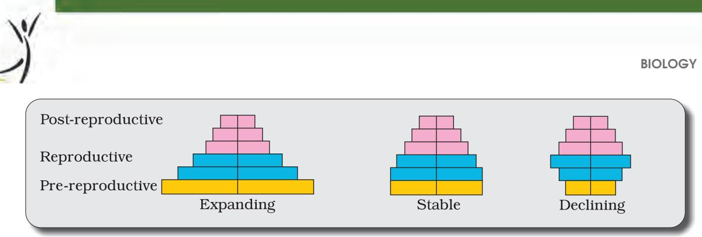
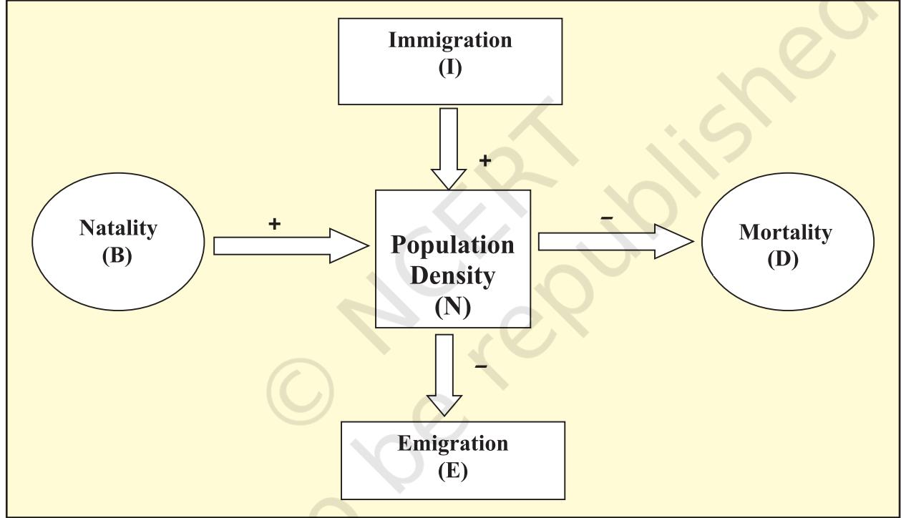
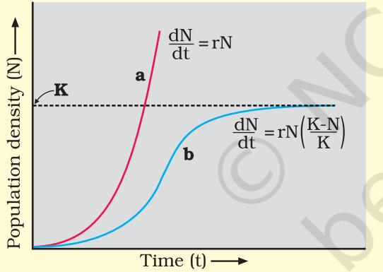
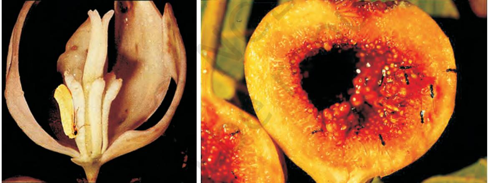
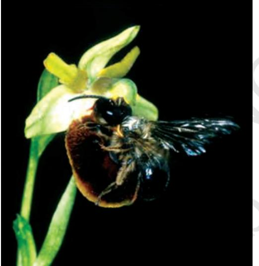

Chapter 11 Organisms and Populations

Chapter 12 Ecosystem

Chapter 13 Biodiversity and Conservation Diversity is not only a characteristic of living organisms but also of content in biology textbooks. Biology is presented either as botany, zoology and microbiology or as classical and modern. The latter is a euphemism for molecular aspects of biology. Luckily we have many threads which weave the different areas of biological information into a unifying principle. Ecology is one such thread which gives us a holistic perspective to biology. The essence of biological understanding is to know how organisms, while remaining an individual, interact with other organisms and physical habitats as a group and hence behave like organised wholes, i.e., population, community, ecosystem or even as the whole biosphere. Ecology explains to us all this. A particular aspect of this is the study of anthropogenic environmental degradation and the socio-political issues it has raised. This unit describes as well as takes a critical view of the above aspects.

RAMDEO MISRA (1908-1998)

Ramdeo Misra is revered as the Father of Ecology in India. Born on 26 August 1908, Ramdeo Misra obtained Ph.D in Ecology (1937) under Prof. W. H. Pearsall, FRS, from Leeds University in UK. He established teaching and research in ecology at the Department of Botany of the Banaras Hindu University, Varanasi. His research laid the foundations for understanding of tropical communities and their succession, environmental responses of plant populations and productivity and nutrient cycling in tropical forest and grassland ecosystems. Misra formulated the first postgraduate course in ecology in India. Over 50 scholars obtained Ph. D degree under his supervision and moved on to other universities and research institutes to initiate ecology teaching and research across the country.

He was honoured with the Fellowships of the Indian National Science Academy and World Academy of Arts and Science, and the prestigious Sanjay Gandhi Award in Environment and Ecology. Due to his efforts, the Government of India established the National Committee for Environmental Planning and Coordination (1972) which, in later years, paved the way for the establishment of the Ministry of Environment and Forests (1984).

# CHAPTER 11 ORGANISMS AND POPULATIONS

#### *11.1 Populations*

Our living world is fascinatingly diverse and amazingly complex. We can try to understand its complexity by investigating processes at various levels of biological organisation–macromolecules, cells, tissues, organs, individual organisms, population, communities, ecosystems and biomes. At any level of biological organisation we can ask two types of questions – for example, when we hear the bulbul singing early morning in the garden, we may ask – 'How does the bird sing?' Or, 'Why does the bird sing ?' The 'how-type' questions seek the *mechanism* behind the process while the 'whytype' questions seek the *significance* of the process. For the first question in our example, the answer might be in terms of the operation of the voice box and the vibrating bone in the bird, whereas for the second question the answer may lie in the bird's need to communicate with its mate during breeding season. When you observe nature around you with a scientific frame of mind you will certainly come up with many interesting questions of both types - *Why are night-blooming flowers generally white? How does the bee know which flower has nectar? Why does cactus have so many thorns? How does the chick spures recognise her own mother* ?, and so on.

You have already learnt in previous classes that Ecology is a subject which studies the interactions among organisms and between the organism and its physical (abiotic) environment.

Ecology is basically concerned with four levels of biological organisation – organisms, populations, communities and biomes. In this chapter we explore ecology at population levels.

#### 11.1 POPULATIONS

#### 11.1.1 Population Attributes

In nature, we rarely find isolated, single individuals of any species; majority of them live in groups in a well defined geographical area, share or compete for similar resources, potentially interbreed and thus constitute a population. Although the term interbreeding implies sexual reproduction, a group of individuals resulting from even asexual reproduction is also generally considered a population for the purpose of ecological studies. All the cormorants in a wetland, rats in an abandoned dwelling, teakwood trees in a forest tract, bacteria in a culture plate and lotus plants in a pond, are some examples of a population. In earlier chapters you have learnt that although an individual organism is the one that has to cope with a changed environment, it is at the population level that natural selection operates to evolve the desired traits. Population ecology is, therefore, an important area because it links ecology to population genetics and evolution.

A population has certain attributes whereas, an individual organism does not. An individual may have births and deaths, but a population has *birth rates* and *death rates*. In a population these rates refer to *per capita* births and deaths. The rates, hence, expressed are change in numbers (increase or decrease) with respect to members of the population. Here is an example. If in a pond there were 20 lotus plants last year and through reproduction 8 new plants are added, taking the current population to 28, we calculate the birth rate as 8/20 = 0.4 offspring per lotus per year. If 4 individuals in a laboratory population of 40 fruitflies died during a specified time interval, say a week, the death rate in the population during that period is 4/40 = 0.1 individuals per fruitfly per week.

Another attribute characteristic of a population is *sex ratio*. An individual is either a male or a female but a population has a sex ratio (e.g., 60 per cent of the population are females and 40 per cent males).

A population at any given time is composed of individuals of different ages. If the age distribution (per cent individuals of a given age or age group) is plotted for the population, the resulting structure is called an age pyramid (Figure 11.1). For human population, the age pyramids generally show age distribution of males and females in a diagram. The shape of the pyramids reflects the growth status of the population - (a) whether it is growing, (b) stable or (c) declining.

191

Figure 11.1 Representation of age pyramids for human population

The size of the population tells us a lot about its status in the habitat. Whatever ecological processes we wish to investigate in a population, be it the outcome of competition with another species, the impact of a predator or the effect of a pesticide application, we always evaluate them in terms of any change in the population size. The size, in nature, could be as low as <10 (Siberian cranes at Bharatpur wetlands in any year) or go into millions (*Chlamydomonas* in a pond). Population size, technically called population density (designated as N), need not necessarily be measured in numbers only. Although total number is generally the most appropriate measure of population density, it is in some cases either meaningless or difficult to determine. In an area, if there are 200 carrot grass (*Parthenium hysterophorus*) plants but only a single huge banyan tree with a large canopy, stating that the population density of banyan is low relative to that of carrot grass amounts to underestimating the enormous role of the Banyan in that community. In such cases, the per cent cover or biomass is a more meaningful measure of the population size. Total number is again not an easily adoptable measure if the population is huge and counting is impossible or very time-consuming. *If you have a dense laboratory culture of bacteria in a petri dish what is the best measure to report its density?* Sometimes, for certain ecological investigations, there is no need to know the absolute population densities; relative densities serve the purpose equally well. For instance, the number of fish caught per trap is good enough measure of its total population density in the lake. We are mostly obliged to estimate population sizes indirectly, without actually counting them or seeing them. The tiger census in our national parks and tiger reserves is often based on pug marks and fecal pellets.

#### 11.1.2 Population Growth

The size of a population for any species is not a static parameter. It keeps changing with time, depending on various factors including food availability, predation pressure and adverse weather. In fact, it is these changes in population density that give us some idea of what is happening to the population – whether it is flourishing or declining. Whatever might be the ultimate reasons, the density of a population in a given habitat during a given period, fluctuates due to changes in four basic processes,

192

two of which (natality and immigration) contribute to an increase in population density and two (mortality and emigration) to a decrease.

- (i) *Natality* refers to the number of births during a given period in the population that are added to the initial density.
- (ii) *Mortality* is the number of deaths in the population during a given period.
- (iii) *Immigration* is the number of individuals of the same species that have come into the habitat from elsewhere during the time period under consideration.
- (iv) *Emigration* is the number of individuals of the population who left the habitat and gone elsewhere during the time period under consideration.

Figure 11.2

So, if N is the population density at time t, then its density at time t +1 is

$$\mathrm{N}_{\mathrm{t+1}}=\mathrm{N}_{\mathrm{t}}+\mathrm{[(B+I)-(D+E)]}$$

You can see from the above equation (Fig. 11.2) that population density will increase if the number of births plus the number of immigrants (B + I) is more than the number of deaths plus the number of emigrants (D + E). Under normal conditions, births and deaths are the most important factors influencing population density, the other two factors assuming importance only under special conditions. For instance, if a new habitat is just being colonised, immigration may contribute more significantly to population growth than birth rates.

193

Growth Models : Does the growth of a population with time show any specific and predictable pattern? We have been concerned about unbridled human population growth and problems created by it in our country and it is therefore natural for us to be curious if different animal populations in nature behave the same way or show some restraints on growth. Perhaps we can learn a lesson or two from nature on how to control population growth.

- (i) *Exponential growth:* Resource (food and space) availability is obviously essential for the unimpeded growth of a population. Ideally, when resources in the habitat are unlimited, each species has the ability to realise fully its innate potential to grow in number, as Darwin observed while developing his theory of natural selection. Then the population grows in an exponential or geometric fashion. If in a population of size N, the birth rates (not total number but *per capita* births) are represented as *b* and death rates (again, *per capita* death rates) as *d*, then the increase or decrease in N during a unit time period t (dN/dt) will be
dN/dt = (b – d) × N Let (b–d) = r, then dN/dt = rN

K is carrying capacity

#### 194

The r in this equation is called the 'intrinsic rate of natural increase' and is a very important parameter chosen for assessing impacts of any biotic or abiotic factor on population growth.

To give you some idea about the magnitude of r values, for the Norway rat the r is 0.015, and for the flour beetle it is 0.12. In 1981, the r value for human population in India was 0.0205. *Find out what the current r value is. For calculating it, you need to know the birth rates and death rates.*

The above equation describes the exponential or geometric growth pattern of a population (Figure 11.3) and results in a J-shaped curve when we plot N in relation to time. If you are familiar with basic calculus, you can derive the integral form of the exponential growth equation as

> Nt = N0 ert

where

Nt = Population density after time t

N0 = Population density at time zero

- r = intrinsic rate of natural increase
e = the base of natural logarithms (2.71828)

Any species growing exponentially under unlimited resource conditions can reach enormous population densities in a short time. Darwin showed how even a slow growing animal like elephant could reach enormous numbers in the absence of checks. The following is an anecdote popularly narrated to demonstrate dramatically how fast a huge population could build up when growing exponentially.

*The king and the minister sat for a chess game. The king, confident of winning the game, was ready to accept any bet proposed by the minister. The minister humbly said that if he won, he wanted only some wheat grains, the quantity of which is to be calculated by placing on the chess board one grain in Square 1, then two in Square 2, then four in Square 3, and eight in Square 4, and so on, doubling each time the previous quantity of wheat on the next square until all the 64 squares were filled. The king accepted the seemingly silly bet and started the game, but unluckily for him, the minister won. The king felt that fulfilling the minister's bet was so easy. He started with a single grain on the first square and proceeded to fill the other squares following minister's suggested procedure, but by the time he covered half the chess board, the king realised to his dismay that all the wheat produced in his entire kingdom pooled together would still be inadequate to cover all the 64 squares. Now think of a tiny Paramecium starting with just one individual and through binary fission, doubling in numbers every day, and imagine what a mindboggling population size it would reach in 64 days. (provided food and space remain unlimited)*

- (ii) *Logistic growth:* No population of any species in nature has at its disposal unlimited resources to permit exponential growth. This leads to competition between individuals for limited resources. Eventually, the 'fittest' individual will survive and reproduce. The governments of many countries have also realised this fact and introduced various restraints with a view to limit human population growth. In nature, a given habitat has enough resources to support a maximum possible number, beyond which no further growth is possible. Let us call this limit as nature's *carrying capacity* (K) for that species in that habitat.
A population growing in a habitat with limited resources show initially a lag phase, followed by phases of acceleration and deceleration and finally an asymptote, when the population density reaches the carrying capacity. A plot of N in relation to time (t) results in a sigmoid curve. This type of population growth is called *Verhulst-Pearl Logistic Growth* (Figure 11.3) and is described by the following equation:

$$\mathrm{d}\mathbf{N}/\mathrm{d}\mathbf{t}=\mathbf{r}\mathbf{N}\!\left({\frac{\mathbf{K}-\mathbf{N}}{\mathbf{K}}}\right)$$

195

Where N = Population density at time t r = Intrinsic rate of natural increase K = Carrying capacity

Since resources for growth for most animal populations are finite and become limiting sooner or later, the logistic growth model is considered a more realistic one.

*Gather from Government Census data the population figures for India for the last 100 years, plot them and check which growth pattern is evident.*

#### 11.1.3 Life History Variation

Populations evolve to maximise their reproductive fitness, also called Darwinian fitness (high r value), in the habitat in which they live. Under a particular set of selection pressures, organisms evolve towards the most efficient reproductive strategy. Some organisms breed only once in their lifetime (Pacific salmon fish, bamboo) while others breed many times during their lifetime (most birds and mammals). Some produce a large number of small-sized offspring (Oysters, pelagic fishes) while others produce a small number of large-sized offspring (birds, mammals). So, which is desirable for maximising fitness? Ecologists suggest that life history traits of organisms have evolved in relation to the constraints imposed by the abiotic and biotic components of the habitat in which they live. Evolution of life history traits in different species is currently an important area of research being conducted by ecologists.

#### 11.1.4 Population Interactions

Can you think of any natural habitat on earth that is inhabited just by a single species? There is no such habitat and such a situation is even inconceivable. For any species, the minimal requirement is one more species on which it can feed. Even a plant species, which makes its own food, cannot survive alone; it needs soil microbes to break down the organic matter in soil and return the inorganic nutrients for absorption. And then, how will the plant manage pollination without an animal agent? It is obvious that in nature, animals, plants and microbes do not and cannot live in isolation but interact in various ways to form a biological community. Even in minimal communities, many interactive linkages exist, although all may not be readily apparent.

Interspecific interactions arise from the interaction of populations of two different species. They could be beneficial, detrimental or neutral (neither harm nor benefit) to one of the species or both. Assigning a '+' sign for beneficial interaction, '-' sign for detrimental and 0 for neutral interaction, let us look at all the possible outcomes of interspecific interactions (Table11.1).

| Species A | Species B | Name of Interaction |
| --- | --- | --- |
| + | + | Mutualism |
| – | – | Competition |
| + | – | Predation |
| + | – | Parasitism |
| + | 0 | Commensalism |
| – | 0 | Amensalism |

#### Table 11.1 : Population Interactions

Both the species benefit in *mutualism* and both lose in *competition* in their interactions with each other. In both *parasitism* and *predation* only one species benefits (parasite and predator, respectively) and the interaction is detrimental to the other species (host and prey, respectively). The interaction where one species is benefitted and the other is neither benefitted nor harmed is called commensalism. In amensalism on the other hand one species is harmed whereas the other is unaffected. Predation, parasitism and commensalism share a common characteristic– the interacting species live closely together.

- (i) *Predation: What would happen to all the energy fixed by autotrophic organisms if the community has no animals to eat the plants*? You can think of predation as nature's way of transferring to higher trophic levels the energy fixed by plants. When we think of predator and prey, most probably it is the tiger and the deer that readily come to our mind, but a sparrow eating any seed is no less a predator. Although animals eating plants are categorised separately as *herbivores*, they are, in a broad ecological context, not very different from predators.
Besides acting as 'conduits' for energy transfer across trophic levels, predators play other important roles. They keep prey populations under control. But for predators, prey species could achieve very high population densities and cause ecosystem instability. When certain exotic species are introduced into a geographical area, they become invasive and start spreading fast because the invaded land does not have its natural predators. The prickly pear cactus introduced into Australia in the early 1920's caused havoc by spreading rapidly into millions of hectares of rangeland. Finally, the invasive cactus was brought under control only after a cactus-feeding predator (a moth) from its natural habitat was introduced into the country. *Biological control* methods adopted in agricultural pest control are based on the ability of the predator

#### 197

to regulate prey population. Predators also help in maintaining species diversity in a community, by reducing the intensity of competition among competing prey species. In the rocky intertidal communities of the American Pacific Coast the starfish *Pisaster* is an important predator. In a field experiment, when all the starfish were removed from an enclosed intertidal area, more than 10 species of invertebrates became extinct within a year, because of interspecific competition.

If a predator is too efficient and overexploits its prey, then the prey might become extinct and following it, the predator will also become extinct for lack of food. This is the reason why predators in nature are 'prudent'. Prey species have evolved various defenses to lessen the impact of predation. Some species of insects and frogs are cryptically-coloured (*camouflaged*) to avoid being detected easily by the predator. Some are poisonous and therefore avoided by the predators. The Monarch butterfly is highly distasteful to its predator (bird) because of a special chemical present in its body. Interestingly, the butterfly acquires this chemical during its caterpillar stage by feeding on a poisonous weed.

For plants, herbivores are the predators. Nearly 25 per cent of all insects are known to be *phytophagous* (feeding on plant sap and other parts of plants). The problem is particularly severe for plants because, unlike animals, they cannot run away from their predators. Plants therefore have evolved an astonishing variety of morphological and chemical defences against herbivores. Thorns (*Acacia*, *Cactus*) are the most common morphological means of defence. Many plants produce and store chemicals that make the herbivore sick when they are eaten, inhibit feeding or digestion, disrupt its reproduction or even kill it. You must have seen the weed *Calotropis* growing in abandoned fields. The plant produces highly poisonous cardiac glycosides and that is why you never see any cattle or goats browsing on this plant. A wide variety of chemical substances that we extract from plants on a commercial scale (nicotine, caffeine, quinine, strychnine, opium, etc.,) are produced by them actually as defences against grazers and browsers.

(ii) *Competition:* When Darwin spoke of the struggle for existence and survival of the fittest in nature, he was convinced that interspecific competition is a potent force in organic evolution. It is generally believed that competition occurs when closely related species compete for the same resources that are limiting, but this is not entirely true. Firstly, totally unrelated species could also compete for the same resource. For instance, in some shallow South American lakes, visiting flamingoes and resident fishes compete for their common food, the zooplankton in the lake. Secondly,

198

resources need not be limiting for competition to occur; in interference competition, the feeding efficiency of one species might be reduced due to the interfering and inhibitory presence of the other species, even if resources (food and space) are abundant. Therefore, competition is best defined as a process in which the fitness of one species (measured in terms of its 'r' the intrinsic rate of increase) is significantly lower in the presence of another species. It is relatively easy to demonstrate in laboratory experiments, as Gause and other experimental ecologists did, when resources are limited the competitively superior species will eventually eliminate the other species, but evidence for such competitive exclusion occurring in nature is not always conclusive. Strong and persuasive circumstantial evidence does exist however in some cases. The Abingdon tortoise in Galapagos Islands became extinct within a decade after goats were introduced on the island, apparently due to the greater browsing efficiency of the goats. Another evidence for the occurrence of competition in nature comes from what is called 'competitive release'. A species whose distribution is restricted to a small geographical area because of the presence of a competitively superior species, is found to expand its distributional range dramatically when the competing species is experimentally removed. Connell's elegant field experiments showed that on the rocky sea coasts of Scotland, the larger and competitively superior barnacle *Balanus* dominates the intertidal area, and excludes the smaller barnacle *Chathamalus* from that zone. In general, herbivores and plants appear to be more adversely affected by competition than carnivores.

Gause's '*Competitive Exclusion Principle'* states that two closely related species competing for the same resources cannot co-exist indefinitely and the competitively inferior one will be eliminated eventually. This may be true if resources are limiting, but not otherwise. More recent studies do not support such gross generalisations about competition. While they do not rule out the occurrence of interspecific competition in nature, they point out that species facing competition might evolve mechanisms that promote co-existence rather than exclusion. One such mechanism is 'resource partitioning'. If two species compete for the same resource, they could avoid competition by choosing, for instance, different times for feeding or different foraging patterns. MacArthur showed that five closely related species of warblers living on the same tree were able to avoid competition and co-exist due to behavioural differences in their foraging activities.

- (iii) *Parasitism:* Considering that the parasitic mode of life ensures free lodging and meals, it is not surprising that parasitism has
199

evolved in so many taxonomic groups from plants to higher vertebrates. Many parasites have evolved to be host-specific (they can parasitise only a single species of host) in such a way that both host and the parasite tend to co-evolve; that is, if the host evolves special mechanisms for rejecting or resisting the parasite, the parasite has to evolve mechanisms to counteract and neutralise them, in order to be successful with the same host species. In accordance with their life styles, parasites evolved special adaptations such as the loss of unnecessary sense organs, presence of adhesive organs or suckers to cling on to the host, loss of digestive system and high reproductive capacity. The life cycles of parasites are often complex, involving one or two intermediate hosts or vectors to facilitate parasitisation of its primary host. The human liver fluke (a trematode parasite) depends on two intermediate hosts (a snail and a fish) to complete its life cycle. The malarial parasite needs a vector (mosquito) to spread to other hosts. Majority of the parasites harm the host; they may reduce the survival, growth and reproduction of the host and reduce its population density. They might render the host more vulnerable to predation by making it physically weak. *Do you believe that an ideal parasite should be able to thrive within the host without harming it? Then why didn't natural selection lead to the evolution of such totally harmless parasites*?

Parasites that feed on the external surface of the host organism are called *ectoparasites*. The most familiar examples of this group are the lice on humans and ticks on dogs. Many marine fish are infested with ectoparasitic copepods. *Cuscuta*, a parasitic plant that is commonly found growing on hedge plants, has lost its chlorophyll and leaves in the course of evolution. It derives its nutrition from the host plant which it parasitises. The female mosquito is not considered a parasite, although it needs our blood for reproduction. *Can you explain why?*

In contrast, *endoparasites* are those that live inside the host body at different sites (liver, kidney, lungs, red blood cells, etc.). The life cycles of endoparasites are more complex because of their extreme specialisation. Their morphological and anatomical features are greatly simplified while emphasising their reproductive potential.

*Brood parasitism* in birds is a fascinating example of parasitism in which the parasitic bird lays its eggs in the nest of its host and lets the host incubate them. During the course of evolution, the eggs of the parasitic bird have evolved to resemble the host's egg in size and colour to reduce the chances of the host

200

bird detecting the foreign eggs and ejecting them from the nest. Try to follow the movements of the cuckoo (koel) and the crow in your neighborhood park during the breeding season (spring to summer) and watch brood parasitism in action.

- *(iv) Commensalism:* This is the interaction in which one species benefits and the other is neither harmed nor benefited. An orchid growing as an *epiphyte* on a mango branch, and barnacles growing on the back of a whale benefit while neither the mango tree nor the whale derives any apparent benefit. The cattle egret and grazing cattle in close association, a sight you are most likely to catch if you live in farmed rural areas, is a classic example of commensalism. The egrets always forage close to where the cattle are grazing because the cattle, as they move, stir up and flush out insects from the vegetation that otherwise might be difficult for the egrets to find and catch. Another example of commensalism is the interaction between sea anemone that has stinging tentacles and the clown fish that lives among them. The fish gets protection from predators which stay away from the stinging tentacles. The anemone does not appear to derive any benefit by hosting the clown fish.

(a) (b)

- (v) *Mutualism:* This interaction confers benefits on both the interacting species. Lichens represent an intimate mutualistic relationship between a fungus and photosynthesising algae or cyanobacteria. Similarly, the *mycorrhizae* are associations between fungi and the roots of higher plants. The fungi help the plant in the absorption of essential nutrients from the soil while the plant in turn provides the fungi with energy-yielding carbohydrates.
### 201

The most spectacular and evolutionarily fascinating examples of mutualism are found in plant-animal relationships. Plants need the help of animals for pollinating their flowers and dispersing their seeds. Animals obviously have to be paid 'fees' for the services that plants expect from them. Plants offer rewards or fees in the form of pollen and nectar for pollinators and juicy and nutritious fruits for seed dispersers. But the mutually beneficial system should also be safeguarded against 'cheaters', for example, animals that try to steal nectar without aiding in pollination. Now you can see why plant-animal interactions often involve *co-evolution* of the mutualists, that is, the evolutions of the flower and its pollinator species are tightly linked with one another. In many species of fig trees, there is a tight one-to-one relationship with the pollinator species of wasp (Figure 11.4). It means that a given fig species can be pollinated only by its 'partner' wasp species and no other species. The female wasp uses the fruit not only as an oviposition (egg-laying) site but uses the developing seeds within the fruit for nourishing

Figure 11.5 Showing bee-a pollinator on orchid flower

its larvae. The wasp pollinates the fig inflorescence while searching for suitable egg-laying sites. In return for the favour of pollination the fig offers the wasp some of its developing seeds, as food for the developing wasp larvae.

Orchids show a bewildering diversity of floral patterns many of which have evolved to attract the right pollinator insect (bees and bumblebees) and ensure guaranteed pollination by it (Figure 11.5). Not all orchids offer rewards. The Mediterranean orchid *Ophrys* employs 'sexual deceit' to get pollination done by a species of bee. One petal of its flower bears an uncanny resemblance to the female of the bee in size, colour and markings. The male bee is attracted to what it perceives as a female, 'pseudocopulates' with the flower, and during that process is dusted with pollen from the flower. When this same bee 'pseudocopulates' with another flower, it transfers pollen to it and thus, pollinates the flower. Here you can see how co-evolution

operates. If the female bee's colour patterns change even slightly for any reason during evolution, pollination success will be reduced unless the orchid flower co-evolves to maintain the resemblance of its petal to the female bee.

### 202

#### SUMMARY

As a branch of biology, Ecology is the study of the relationships of living organisms with the abiotic (physico-chemical factors) and biotic components (other species) of their environment. It is concerned with four levels of biological organisation-organisms, populations, communities and biomes.

Evolutionary changes through natural selection take place at the population level and hence, population ecology is an important area of ecology. A population is a group of individuals of a given species sharing or competing for similar resources in a defined geographical area. Populations have attributes that individual organisms do not- birth rates and death rates, sex ratio and age distribution. The proportion of different age groups of males and females in a population is often presented graphically as age pyramid; its shape indicates whether a population is stationary, growing or declining.

Ecological effects of any factors on a population are generally reflected in its size (population density), which may be expressed in different ways (numbers, biomass, per cent cover, etc.,) depending on the species.

Populations grow through births and immigration and decline through deaths and emigration. When resources are unlimited, the growth is usually exponential but when resources become progressively limiting, the growth pattern turns logistic. In either case, growth is ultimately limited by the carrying capacity of the environment. The intrinsic rate of natural increase (*r*) is a measure of the inherent potential of a population to grow.

In nature populations of different species in a habitat do not live in isolation but interact in many ways. Depending on the outcome, these interactions between two species are classified as competition (both species suffer), predation and parasitism (one benefits and the other suffers), commensalism (one benefits and the other is unaffected), amensalism (one is harmed, other unaffected) and mutualism (both species benefit). Predation is a very important process through which trophic energy transfer is facilitated and some predators help in controlling their prey populations. Plants have evolved diverse morphological and chemical defenses against herbivory. In competition, it is presumed that the superior competitor eliminates the inferior one (the Competitive Exclusion Principle), but many closely related species have evolved various mechanisms which facilitate their co-existence. Some of the most fascinating cases of mutualism in nature are seen in plant-pollinator interactions.

203

## EXERCISES

- 1. List the attributes that populations possess but not individuals.
- 2. If a population growing exponentially double in size in 3 years, what is the intrinsic rate of increase (r) of the population?
- 3. Name important defence mechanisms in plants against herbivory.
- 4. An orchid plant is growing on the branch of mango tree. How do you describe this interaction between the orchid and the mango tree?
- 5. What is the ecological principle behind the biological control method of managing with pest insects?
- 6. Define population and community.
- 7. Define the following terms and give one example for each:
	- (a) Commensalism
	- (b) Parasitism
	- (c) Camouflage
	- (d) Mutualism
	- (e) Interspecific competition
- 8. With the help of suitable diagram describe the logistic population growth curve.
- 9. Select the statement which explains best parasitism.
	- (a) One organism is benefited.
	- (b) Both the organisms are benefited.
	- (c) One organism is benefited, other is not affected.
	- (d) One organism is benefited, other is affected.
- 10. List any three important characteristics of a population and explain.

204

